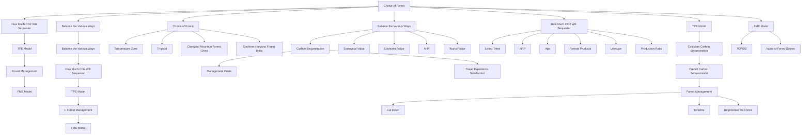
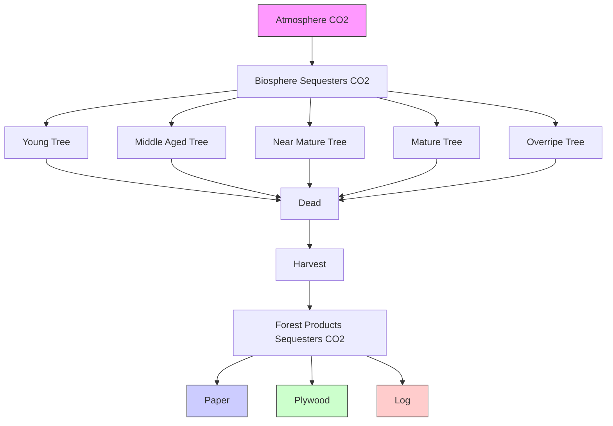
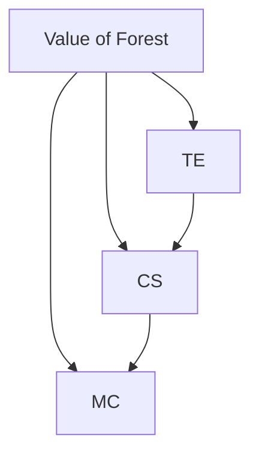

# Forests Need to be Harvested

## Summary

As the lung of the earth, forest is the most powerful carbon sequestration player in nature. An appropriate forest management is conducive to the realization of sequestration potential. Therefore, we established the Tree-Products-Environment Carbon Sequestration (TPE) Model to calculate how much carbon the forests can save over a fixed time, and proposed a set of forest management to maximize fixation efficiency. Then considered ecological, economic, tourism and entertainment factors comprehensively, established the Forest Management Evaluation (MFE) Model to score every management, finally pick the best one.

Firstly, net primary productivity (NPP) was used to measure the carbon sequestration level of forest, then the NPP calculation model evaluated by GLO-PEM help us to calculate the carbon synthesized by photosynthesis. Our TPE model points out that part of the carbon is stored in the living tree to activate the carbon cycle, another is fixed in forest products and decomposed over time, others is released into the atmosphere or environment because of the natural death of trees. On this basis, we advance a “Rotation Regeneration” forest management, which prioritizes cutting the older trees, at the same time, set a harvest cycle and cutting ratio, planting new seedlings while cutting older trees. Then is applied to ChangBai forest, find that when the rotation period is 10 years and the cutting ratio is 20 %, which can be the most effective plan, the carbon sequestration in 100 years is as high as $3 . 5 7 \times 1 0 ^ { 1 0 } g .$ .

Secondly, considering the applicability to society, in addition to the ecological value of carbon sequestration, in terms of economic and tourism worth, we propound another two indicators of tourism experience and management cost. And give a scoring system by the MFE model based on AHP. Further, we put forward a management strategy that balances the three indicators above. Based on the data of ChangBai forest, we get a best strategy when the rotation cycle is 15 years and the cutting proportion is 40 %, then take a sensitivity analysis. Applying the MFE model in different forests, we found that with the change of main tree species, the influence of three indicators on management strategies will also change, by the way, the optimal strategy transit to the direction of forest value maximization. For example, from Muchuan forest with ornamental forest mainly to tropical dry deciduous forest with economic forest in Jhumpa, India, the best management will transit from long rotation cycle and low cutting proportion to a short one and high one.

Finally, we contributed a magazine article to ICM about the necessity of harvesting trees for forest management.

Keywords: AHP NPP the TPE model the MFE model harvesting strategy

## Contents

## 1 Introduction ..

1.1 Problem Background. 3  
1.2 Restatement of the Problem 4  
1.3 Our Work . 4

## 2 Assumptions and Justifications ...

## 3 Notations... /

## 4 Calculation of Total Forest Carbon Sequestration .....

4.1 Calculation of Tree Carbon Sequestration Based on GLO-PEM . 7  
4.2 Calculation of Carbon Sequestration of Forest Products. . 8

## 5 Tree-Products-Environment Carbon Sequestration（TPE） Model ................10

5.1 Data Collection . .10  
5.2 The Establishment of TPE Model. .11  
5.3 Simulation of TPE Model. .13

## 6 Forest Management Evaluation (FME) Model.. .15

6.1 Evaluation Factors and Weight Distribution Based on AHP. .15  
6.2 Calculation Method of Evaluation Factors .. .16  
6.3 TOPSIS Comprehensive Evaluation Method. .17  
6.4 Analysis of Results .. 17  
6.5 Scope of Management Plan . 19

## 7 Sensitivity Analysis.. .20

## 8 Model Evaluation ..... .21

8.1 Strengths.. .. 21  
8.2 Weaknesses.. .. 21

## 9 Conclusion. .22

## References.. .25

## 1 Introduction

## 1.1 Problem Background

In recent years, the concentration of greenhouse gases in the atmosphere has increased, resulting in global warming [1]. Carbon dioxide is the main influencing factor. At present, the concentration of carbon dioxide in the atmosphere has increased from $2 8 0 m L \cdot m ^ { - 3 }$ before the industrial revolution to $3 7 0 m L \cdot m ^ { - 3 }$ in 2001, and is increasing at the rate of $1 { \sim } 1 . 5 m L \cdot m ^ { - 3 }$ per year [2]. It is necessary to take corresponding measures to reduce carbon dioxide in the atmosphere.

Carbon sequestration is a process of capturing and storing carbon dioxide from the atmosphere. Forest carbon sequestration means that forest plants absorb carbon dioxide in the atmosphere and fix it in vegetation or soil, thereby reducing its concentration in the atmosphere. The annual carbon exchange between forest light cooperation and respiration and atmosphere is as high as 90% of the annual carbon exchange of terrestrial ecosystem [3], which plays an important role in regulating global climate and maintaining global carbon balance.

Forests not only store carbon dioxide in living plants, but also exist in their forest products. Over time, the carbon sequestration capacity of trees and the longevity of forest products will change. In the long run, appropriate management strategies need to be conducive to maximizing carbon sequestration. However, most forests in the world have not been effectively managed, and carbon sequestration reaches the maximum [4]. It is of great significance to develop a good forest management plan to effectively reduce carbon dioxide in the atmosphere.

At the same time, forest manager also requires attention to value factors other than carbon sequestration. Due to the different composition, interests and uses of forests, an optimal forest management plan should be suitable for social needs and has the greatest ecological, economic and cultural value.

Taking into account the above situation, we have constructed two models based on the existing research model and data.

A Tree-Products-Environment Carbon Sequestration (TPE) Model was constructed to estimate carbon sequestration in a forest area. Then carbon sequestration, forest product value, deforestation frequency as ecological, economic, cultural and entertainment value indicators. We build a Forest Management Evaluation (FME) Model to give the best management plan for society. Finally, the actual data are used for verification. We use the two models to analyze the given strategies for the forest regions of Changbai Mountain in China and the tropical dry deciduous forest in Jhumpa, Haryana State in southern India.

## 1.2 Restatement of the Problem

Reasonable forest management plan is conducive to improving forest carbon sequestration capacity. Living plants in the forest can absorb carbon dioxide, and forest products made of cut trees also have certain carbon dioxide storage. To maximize forest carbon sequestration, over time, total non-deforestation will not guarantee maximum forest carbon sequestration. As forest manager, the factors considered are not only limited to forest carbon sequestration, but also need to consider the comprehensive value of forest ecology, economy, culture and entertainment, so that forest management can achieve a state that is most suitable for social development.

We mainly explore the optimal management plan of forests. Our team considers the establishment of simulation prediction model and decision evaluation model to predict the carbon sequestration of forests and evaluate the comprehensive management plan. We need to solve the following problems:

How to estimate the total carbon sequestration of a forest? Determine the most efficient management plan for carbon sequestration?  
How to develop a forest value assessment model? Determine a management plan that can balance various forest assessment indicators? Consider the scope of the management plan and the transition points between different management plans, as well as whether there any conditions in the model to prevent logging.  
Apply the model to various forests, test the model and analyze the results.

## 1.3 Our Work

## ➢ Carbon sequestration capacity of living trees

GLO-PEM model is a commonly used NPP calculation model. Based on this model, we calculate the NPP of live trees. We calculated the net primary productivity of forests composed of different trees, and proposed a method to obtain the net primary productivity of trees at different ages according to the existing research, which can accurately quantify the carbon sequestration capacity of trees.

## ➢ Carbon sequestration capacity of forest products

We divide forest products into three kinds: log, plywood, paper. Considering that the production of forest products has a certain proportion, and the lifespan of different forest products is different, the time of carbon sequestration is also different. Obviously, the proportion and life of forest products will affect the carbon sequestration of forest products. According to the existing research data of IPCC forest products, we determined the proportion and lifespan of forest products made of cut trees.

## ➢ Tree-Products-Environment Carbon Sequestration (TPE) Model

On the basis of determining the method for calculating the carbon sequestration of trees and forest products, a model for calculating the total carbon sequestration of forests was established. Applying the forest management plan to the model, we need to consider which trees are cut every year, which trees are left, the cutting time and the new species of trees, and add the factors of tree age and product lifespan changing over time to simulate and predict the total forest carbon sequestration.

## ➢ Forest Management Evaluation (FME) Model

We divide the forest value into ecological value, economic value and tourism value, and determine the calculation method and weight coefficient of the three values. TOP-SIS comprehensive evaluation method is used to score each management plan, and the management plan with the highest score is selected as the optimal plan to balance the various values of the forest.

flowchart

Figure 1.1 Our Work

## 2 Assumptions and Justifications

To simplify the problem, we make the following basic assumptions, each of which is properly justified.

➢ We assume that the data obtained are accurate and reliable.

We get data from trusted websites and papers.

➢ Trees grow at the same rate each year.

The growth rate of trees will be affected by climate change, and the growth rate will be different between years. However, in the long run, the average growth rate is relatively stable.

➢ Tree growth is healthy and normal without large-scale natural disasters.

Large-scale natural disasters are small probability events. We can ignore this problem when we study models of general laws.

➢ Processing loss of forest products does not affect the total value of forests

In the process of producing forest products, certain losses will inevitably occur, but these losses will be included in the cost of products and reflected in another form of value, so the overall value of the forest is unchanged.

## 3 Notations

The key mathematical notations used in this paper are listed in Table 3.1.

Table 3.1: Partial symbols used in this paper

<table><tr><td>Symbol</td><td>Description</td><td>Unit</td></tr><tr><td>NPP</td><td>Carbon content of carbon dioxide net absorbed by forests per unit time per unit area from the atmosphere</td><td> $g \cdot m^{-2} a^{-1}$ </td></tr><tr><td>C(t)</td><td>Average cumulative carbon sequestration of forests at t</td><td>g</td></tr><tr><td>P(t)</td><td>The cumulative total carbon sequestration of trees in the forest at time t</td><td>g</td></tr><tr><td>Q(t)</td><td>Total remaining carbon sequestration of trees made into forest products at t</td><td>g</td></tr><tr><td>D(t)</td><td>Total carbon sequestration of natural dead trees at t time</td><td>g</td></tr><tr><td>R(t)</td><td>Carbon Sequestration Vectors for Three Types of Forest Products in Recent Years by t</td><td>g</td></tr><tr><td>α</td><td>Proportion vector of trees made into three types of forest products</td><td>/</td></tr><tr><td>τ</td><td>The service life vectors of three forest products</td><td>a</td></tr><tr><td>T</td><td>Rotation cycle, the interval between deforestation</td><td>a</td></tr><tr><td>η</td><td>Cutting proportion</td><td>/</td></tr><tr><td>W</td><td>Total carbon sequestration of trees cut down in one felling</td><td>g</td></tr></table>

Other symbols will be explained when used.

## 4 Calculation of Total Forest Carbon Sequestration

## 4.1 Calculation of Tree Carbon Sequestration Based on GLO-PEM

## ➢ Net Primary Productivity

Net primary productivity (NPP) is an important indicator for evaluating ecosystem service level. It refers to the total amount of solar energy fixed by vegetation per unit time and per unit area after consuming metabolic energy. Due to plant photosynthesis, fixed solar energy is finally fixed in the form of carbon-containing organic matter in plants, so NPP is used to measure the carbon sequestration of forests. The higher NPP value indicates the higher forest carbon sequestration, and vice versa.

## ➢ NPP Calculation Model Based on GLO-PEM

By reference to conference, using GLO-PEM model. It is a typical light utilization calculation model. NPP values in the study area are driven and inversed through remote sensing, meteorological and field survey records provided by the Meteorology Bureau.

$$
N P P = A P A R \times \varepsilon \tag {4.1}
$$

This model is mainly determined by the two variables of vegetation an ambient pressure absorbance ratio (APAR) and light energy utilization (??).

## Calculation of APAR

APAR is obtained from photosynthetically active radiation (??????) and fraction of photosynthetically active radiation (????????):

$$
A P A R = P A R \times F P A R \tag {4.2}
$$

Using half of the total daily radiation (??????) as ??????, ?????? is calculated as follows:

$$
S Q L = H _ {L} \times \left(0. 2 4 8 + 0. 7 2 5 \times \frac {S}{S _ {L}}\right) \tag {4.3}
$$

In where, ?????? is the total daily radiation, $S / S _ { L }$ is the percentage of sunshine, and $H _ { L }$ is the solar radiation in clear sky.

$$
F P A R = \frac {F P A R _ {N D V I} + F P A R _ {S R V I}}{2} \tag {4.4}
$$

$F P A R _ { N D V I }$ is the normalized vegetation index, which can be calculated by NDVI image and NDVI pixel value, $F P A R _ { S R V I }$ is a simple ratio vegetation index.

## Calculation of ??

Light use efficiency refers to the vegetation will absorb photosynthetically active radiation fixed for carbon-containing organic matter efficiency size. Under realistic conditions, the utilization rate of light energy is affected by both temperature and humidity.

$$
\varepsilon = T _ {\varepsilon 1} \times T _ {\varepsilon 2} \times W _ {\varepsilon} \times 0. 3 8 9 \tag {4.5}
$$

In the formula, $T _ { \varepsilon 1 }$ and $T _ { \varepsilon 2 }$ denote the effect of temperature on light energy utilization, $W _ { \varepsilon }$ denote the effect of moisture on light energy utilization.

## ➢ Establishment of relationship between tree age and NPP

Gross primary production (GPP) refers to all organic matter produced by auto trophic organisms per unit area for a period of time, including net primary productivity (NPP) of individual organs and respiration consumption (Ra) of plants during the same period. Their relations are expressed as follows:

$$
G P P = N P P + R a \tag {4.6}
$$

GPP can be used as an important indicator to evaluate the coordination of ecosystem structure and function, and can be used to estimate the storage and release of carbon in the ecosystem cycle and the effect of vegetation on the composition of the atmosphere. We estimated NPP of trees at different tree ages by GPP and tree age trends.

According to the forest resources inventory of the Ministry of Forestry of China and the classification standard of tree age class and age group, the forest life is divided into five stages, Young Forest (<41), Middle Age Forest (41-80), Near Mature Forest (81-100), Mature Forest (101-140), Overripe Tree (>141). With the increase of tree age, biomass increases, and its average productivity decreases [6].

Taking spruce forest and Pinus sylvestris as examples. With the increase of tree age (??), the change of average productivity $( t \cdot h a ^ { - 1 } \cdot a ^ { - 1 } )$ is as follows.

Table 4.1 Change of Average Productivity with Tree Age

<table><tr><td>GPP</td><td>Young</td><td>Middle Age</td><td>Near Mature</td><td>Mature</td><td>Overripe</td><td>Average</td></tr><tr><td>Spruce Forest</td><td>10.56</td><td>10.03</td><td>8.81</td><td>7.90</td><td>7.21</td><td>8.40</td></tr><tr><td>Pinus Sylvestris</td><td>7.24</td><td>7.38</td><td>6.77</td><td>6.77</td><td>5.40</td><td>6.74</td></tr></table>

line chart

| Category     | Spruce | Pinus Sylvestris |
| ------------ | ------ | ---------------- |
| Young        | 10.5   | 7.2              |
| Middle Age   | 10.0   | 7.4              |
| Near Mature  | 8.8    | 6.7              |
| Mature       | 7.9    | 6.7              |
| Overripe     | 7.2    | 5.5              |

Figure 4.1 GPP of Two Forests

It can be seen from the above figure that after the trees mature, the average productivity is lower than the average value and shows a decreasing trend. The NPP should also conform to this trend. Obviously, with the increase of tree age, the cumulative carbon sequestration of trees is increasing.

## 4.2 Calculation of Carbon Sequestration of Forest Products

## ➢ forest products market

We divide forest products into three categories, log, plywood, paper. The survey data show that the carbon sequestration of forest products shows a very good development momentum and has great potential for carbon emission reduction [7]. Considering the forest management behavior, some woody forests are processed into forest products. Although carbon fixation by photosynthesis is no longer carried out, there is no life activity that consumes carbon and no longer participates in the carbon cycle. Instead, the carbon previously synthesized is preserved for a long period of time and slowly released back to the atmosphere over time. As shown in Table 4.2.

Table 4.2 Cumulative carbon sequestration (unit: ????) of forest products in use in China

<table><tr><td>Year</td><td>1950</td><td>1955</td><td>1960</td><td>1965</td><td>1970</td><td>1975</td><td>1980</td></tr><tr><td>Log</td><td>127.8</td><td>145.6</td><td>165.2</td><td>186.6</td><td>210.3</td><td>236.4</td><td>265.2</td></tr><tr><td>Plywood</td><td>0.8</td><td>1.1</td><td>1.7</td><td>2.2</td><td>2.9</td><td>4.4</td><td>7.4</td></tr><tr><td>Paper</td><td>0.7</td><td>1.7</td><td>3.3</td><td>3.5</td><td>4.7</td><td>6.9</td><td>10.6</td></tr><tr><td>Year</td><td>1985</td><td>1990</td><td>1995</td><td>2000</td><td>2005</td><td>2010</td><td>2015</td></tr><tr><td>Log</td><td>297.2</td><td>332.7</td><td>372.1</td><td>407.7</td><td>433.1</td><td>497.6</td><td>564.8</td></tr><tr><td>Plywood</td><td>14.0</td><td>26.9</td><td>64.4</td><td>127.9</td><td>277.7</td><td>620.7</td><td>1458.7</td></tr><tr><td>Paper</td><td>15.1</td><td>23.6</td><td>46.1</td><td>79.8</td><td>157.1</td><td>287.6</td><td>423.0</td></tr></table>

Drawing the graph of carbon sequestration changing with time, the carbon sequestration of different forest products showed an increasing trend year by year.

line chart

| Year | Log  | Plywood | Paper |
|------|------|---------|-------|
| 1950 | 130  | 0       | 0     |
| 1960 | 170  | 0       | 0     |
| 1970 | 210  | 0       | 0     |
| 1980 | 260  | 0       | 0     |
| 1990 | 330  | 0       | 0     |
| 2000 | 410  | 140     | 80    |
| 2010 | 500  | 620     | 300   |
| 2015 | 570  | 1450    | 420   |

Figure 4.2 The Accumulate Carbon Sequestration of Forest Products in China

## ➢ Forest product distribution ratio and average life expectancy

The life span of different forest products is different, and the attenuation cycle and attenuation speed are also different. According to the output ratio of wood forest products from 2011 to 2015, the distribution ratio of three materials in the model is taken [7]. For the life of forest products, we use IPCC (2014A) product half-life data [8], the specific values are as follows:

Table 4.3 Forest Product Distribution Ratio and Average Life

<table><tr><td>material categories</td><td>Log</td><td>Plywood</td><td>Paper</td></tr><tr><td>Lifespan / %</td><td>13.83</td><td>54.97</td><td>31.20</td></tr><tr><td>Production Ratio / year(s)</td><td>35</td><td>25</td><td>2</td></tr></table>

## 5 Tree-Products-Environment Carbon Sequestration（TPE）

## Model

## 5.1 Data Collection

## ➢ Changbai Mountain

Changbai Mountain, located in northeast China, is one of the main mountains in eastern Northeast China. The sample plots $( 1 1 5 ^ { \circ } - 1 3 5 ^ { \circ } 0 2 ^ { \prime } E$ , $3 8 ^ { \circ } 4 2 ^ { \prime } - 5 3 ^ { \circ } 5 5 ^ { \prime } N )$ in Changbai Mountain area were selected to include Changbai Mountain and its tributaries. Forest types are diverse, mainly coniferous forest and broad-leaved forest, with an area of 1708.8 square kilometers.

text_image

Changbai Mountain
Potential Vegetation
Tropical Evergreen Forest
Tropical Deciduous Forest
Temperate BL Evergreen Forest
Temperate NL Evergreen Forest
Temperate Deciduous Forest
Boreal Evergreen Forest
Boreal Deciduous Forest
Evergreen/Deciduous Mix Forest
Savanna
Grassland/Steppe
Dense Shrubland

Figure 5.1 Changbai Mountain geographical location and potential vegetation distribution (SOURCE: EarthStat/UMN IonE/LUGE Lab at UBC)

The average NPP of forest land from 2001 to 2015 was selected to reflect the change of carbon sequestration of forest trees [5].

$\mathbf { T a b l e 5 . 1 ~ Y e a r ~ N P P ( g C { \cdot } m ^ { - 2 } { \cdot } a ^ { - 1 } ) }$

<table><tr><td>Year</td><td>2001</td><td>2003</td><td>2005</td><td>2007</td></tr><tr><td>NPP</td><td>760</td><td>750</td><td>650</td><td>780</td></tr><tr><td>Year</td><td>2009</td><td>2011</td><td>2013</td><td>2015</td></tr><tr><td>NPP</td><td>750</td><td>765</td><td>725</td><td>800</td></tr></table>

line chart

| Year | NPP / gC·m⁻²·a⁻¹ |
| ---- | ---------------- |
| 2001 | 775              |
| 2003 | 765              |
| 2005 | 650              |
| 2007 | 785              |
| 2009 | 765              |
| 2011 | 775              |
| 2013 | 725              |
| 2015 | 800              |

Figure 5.2 NPP of Forest in Changbai Mountain

It can be seen that the change was relatively stable, and the average value of 748 $g C \cdot m ^ { - 2 } \cdot a ^ { - 1 }$ was taken as the NPP value of Changbai Mountain forest land in recent years.

text_image

2001-2008
2008-2015
2001-2015
NPP(gC·m⁻²·a⁻¹)
0 - 300
300 - 500
500 - 700
700 - 800
800 - 900
900 - 1,200
km
0 75 150

Figure 5.3 Spatial distribution of forest NPP in Changbai Mountains during 2001-2008, 2008-2015 and 2001–2015 [5]

## ➢ SO-AT Forest in India

The Haryana region is located in the south of India. We selected the SO-AT forest in this region as the study area. $( 2 8 ^ { \circ } 4 1 ^ { \prime } N - 2 8 ^ { \circ } 4 6 ^ { \prime } N$ , $7 5 ^ { \circ } 3 1 ^ { \prime } - 7 5 ^ { \circ } 5 1 ^ { \prime } E )$ The forest is a tropical dry deciduous forest.

The main trees in the forest are olive and acacia. According to the study ([10] Vikram Singh Yadav, 2022), the net primary productivity of the forest is about 550 $g C \cdot m ^ { - 2 } \cdot a ^ { - 1 }$ . The climate is tropical, semi-arid, hot, dry, hot in summer and cold in winter.

## 5.2 The Establishment of TPE Model

We established a model to calculate the total amount of forest carbon sequestration, mainly considering three parts: the carbon sequestration of growing trees, the carbon stored in forest products and that existing in the atmosphere or soil environment.

Taking into account the changes over time, trees are growing, getting older, net productivity will also change; Once forest products reach its life, the carbon they stored will be released into the atmosphere; although new seedlings cannot immediately have carbon sequestration capacity, they have great potential in the long term. The carbon sequestration eventually accumulated will be affected by the type, number, time and number of harvested trees. Therefore, our forest management strategy will be on three aspects: tree cutting, cutting time and tree planting.

## ➢ Average of cumulative carbon sequestration

Forest ?? can be divided into three parts: part $S _ { 1 }$ in trees haven’t been cut, part $S _ { 2 }$ in forest products and part $S _ { 3 }$ of natural death.

flowchart

Figure 5.4 Chart of Carbon Sequestration Cycle

The cumulative total carbon sequestration of $S _ { 1 }$ part at ?? time is

$$
P (t) = \frac {\sum_ {i = 1} ^ {t} \oint_ {S _ {1}} N P P \cdot d S}{t} \tag {5.1}
$$

The cumulative total carbon sequestration of $S _ { 2 }$ part at ?? time is

$$
Q (t) = \sum_ {i = 1} ^ {3} \sum_ {j = 1} ^ {\tau_ {i}} \alpha_ {i} R _ {j} (t) \tag {5.2}
$$

In vector ??, the value of $R _ { 1 }$ is determined by cutting strategy (as below), who $\mathbf { \vec { e } X - \vec { \mu } }$ cept $R _ { 1 }$ are generated by recursion.

$$
\left\{ \begin{array}{l} R _ {i - 1} = R _ {i}, i \geq 3 \\ R _ {1} = W \end{array} \right. \tag {5.3}
$$

The cumulative total carbon sequestration of $S _ { 2 }$ part at ?? time is

$$
D (t) = 0. 5 D (t - 1) + D _ {0} (t) \tag {5.4}
$$

Then the average cumulative total carbon sequestration of the forest at t time is

$$
C (t) = P (t) + Q (t) + D (t) \tag {5.5}
$$

## ➢ Harvesting range strategy

In the fourth part, we analyze that after the trees mature, their NPP is lower than the average and shows a decreasing trend. Therefore, when selecting the forest part that needs to be cut, the one with high carbon content but slow growth has a priority. In this model, only the trees in mature and over-mature forest are allowed to be cut, and older the tree is, faster the cutting become.

## ➢ Harvesting schedule strategy

After determining the Logging target, the rotation period T and the cutting ratio η need to be given. We will determine the value of these two parameters by simulation.

## ➢ regeneration the forest strategy

The number of trees in forests decreases only due to deforestation and natura death. Deforestation occurs only during rotation and natural death occurs as long as trees exceed their life limit. For these two reasons, the regeneration of the forest strategy means ' keep the forest area constant ', that is, how many trees are cut and how many seedlings are planted that year.

## 5.3 Simulation of TPE Model

## ➢ Simulation Algorithm Steps

Algorithm: Simulation and Prediction of Average Carbon Storage

Input: ??, ??, ??

Output: ??(??)

for t = 1 to 300 do

Age of all trees plus one in ?? and delete natural dead trees

if t mod T is equal to 0 do

Determine the allowable range of deforestation (mature forest, overripe forest) area, according to ?? to calculate the need to deforestation forest area The carbon sequestration content corresponding to the planned felling part of the forest was pushed forward to ??, and if the planned felling area was not considered as 0

end

Determination of new seedlings based on reduced number of trees in forests

Calculate ??(??) under given ?? and ?? by formula (5.5).

end

## ➢ Analysis of Simulation Results

This paper takes ten thousand square meters of forest land in Changbai Mountain area as the research object, and draws ??(??) − ?? curves under different combinations of ?? and ?? according to the simulation prediction algorithm, as shown in Figure 5.5 and Figure 5.6.

line chart

| x    | T=5 years | T=10 years | T=15 years | T=20 years |
| ---- | --------- | ---------- | ---------- | ---------- |
| 0    | 8.15e7    | 8.15e7     | 8.15e7     | 8.15e7     |
| 50   | 8.40e7    | 8.40e7     | 8.40e7     | 8.40e7     |
| 100  | 8.45e7    | 8.45e7     | 8.45e7     | 8.45e7     |
| 150  | 8.45e7    | 8.45e7     | 8.45e7     | 8.45e7     |
| 200  | 8.45e7    | 8.45e7     | 8.45e7     | 8.45e7     |
| 250  | 8.45e7    | 8.45e7     | 8.45e7     | 8.45e7     |
| 300  | 8.45e7    | 8.45e7     | 8.45e7     | 8.45e7     |

line chart

| x    | T=5 years | T=10 years | T=15 years | T=20 years |
| ---- | --------- | ---------- | ---------- | ---------- |
| 0    | 0.85e8    | 0.85e8     | 0.85e8     | 0.85e8     |
| 50   | 0.98e8    | 1.00e8     | 0.96e8     | 0.92e8     |
| 100  | 0.99e8    | 1.01e8     | 0.97e8     | 0.94e8     |
| 150  | 0.99e8    | 1.01e8     | 0.97e8     | 0.93e8     |
| 200  | 0.99e8    | 1.01e8     | 0.97e8     | 0.93e8     |
| 250  | 0.99e8    | 1.01e8     | 0.97e8     | 0.92e8     |
| 300  | 0.99e8    | 1.01e8     | 0.97e8     | 0.92e8     |

line chart

| x    | T=5 years | T=10 years | T=15 years | T=20 years |
| ---- | --------- | ---------- | ---------- | ---------- |
| 0    | 0.825e8   | 0.825e8    | 0.825e8    | 0.825e8    |
| 50   | 0.900e8   | 0.950e8    | 1.000e8    | 0.975e8    |
| 100  | 0.910e8   | 0.960e8    | 1.010e8    | 0.990e8    |
| 150  | 0.915e8   | 0.965e8    | 1.015e8    | 0.975e8    |
| 200  | 0.915e8   | 0.965e8    | 1.015e8    | 0.975e8    |
| 250  | 0.915e8   | 0.965e8    | 1.015e8    | 0.975e8    |
| 300  | 0.915e8   | 0.965e8    | 1.015e8    | 0.975e8    |

line chart

| x    | T=5 years | T=10 years | T=15 years | T=20 years |
| ---- | --------- | ---------- | ---------- | ---------- |
| 0    | 8.00      | 8.00       | 8.00       | 8.00       |
| 50   | 8.75      | 9.00       | 9.25       | 9.75       |
| 100  | 8.80      | 9.10       | 9.40       | 9.75       |
| 150  | 8.80      | 9.10       | 9.40       | 9.75       |
| 200  | 8.80      | 9.10       | 9.40       | 9.75       |
| 250  | 8.80      | 9.10       | 9.40       | 9.75       |
| 300  | 8.80      | 9.10       | 9.40       | 9.75       |

line chart

| x    | T=5 years | T=10 years | T=15 years | T=20 years |
| ---- | --------- | ---------- | ---------- | ---------- |
| 0    | 8.0e6     | 8.0e6      | 8.0e6      | 8.0e6      |
| 50   | 8.6e6     | 8.8e6      | 9.0e6      | 9.2e6      |
| 100  | 8.7e6     | 8.9e6      | 9.1e6      | 9.2e6      |
| 150  | 8.7e6     | 8.9e6      | 9.1e6      | 9.2e6      |
| 200  | 8.7e6     | 8.9e6      | 9.1e6      | 9.2e6      |
| 250  | 8.7e6     | 8.9e6      | 9.1e6      | 9.2e6      |
| 300  | 8.7e6     | 8.9e6      | 9.1e6      | 9.2e6      |

line chart

| x    | T=5 years | T=10 years | T=15 years | T=20 years |
| ---- | --------- | ---------- | ---------- | ---------- |
| 0    | 7.8       | 7.8        | 7.8        | 7.8        |
| 50   | 8.6       | 8.7        | 8.7        | 8.8        |
| 100  | 8.7       | 8.8        | 8.9        | 9.0        |
| 150  | 8.6       | 8.7        | 8.8        | 8.9        |
| 200  | 8.6       | 8.7        | 8.8        | 8.9        |
| 250  | 8.6       | 8.7        | 8.8        | 8.9        |
| 300  | 8.6       | 8.7        | 8.8        | 8.9        |

Figure 5.5 Effect of rotation period ?? on ??(??) − ?? curve under given cutting portion ??  

line chart

| T=15 years | η=0%    | η=20%   | η=40%   | η=60%   | η=80%   | η=100%  |
| ---------- | ------- | ------- | ------- | ------- | ------- | ------- |
| 0          | 0.83e8  | 0.83e8  | 0.83e8  | 0.83e8  | 0.83e8  | 0.83e8  |
| 50         | 0.85e8  | 0.97e8  | 0.91e8  | 0.87e8  | 0.86e8  | 0.85e8  |
| 100        | 0.85e8  | 0.99e8  | 0.92e8  | 0.89e8  | 0.87e8  | 0.86e8  |
| 150        | 0.85e8  | 0.99e8  | 0.92e8  | 0.89e8  | 0.87e8  | 0.86e8  |
| 200        | 0.85e8  | 0.99e8  | 0.92e8  | 0.89e8  | 0.87e8  | 0.86e8  |
| 250        | 0.85e8  | 0.99e8  | 0.92e8  | 0.89e8  | 0.87e8  | 0.86e8  |
| 300        | 0.85e8  | 0.99e8  | 0.92e8  | 0.89e8  | 0.87e8  | 0.86e8  |

line chart

| T=20 years | η=0%    | η=20%   | η=40%   | η=60%   | η=80%   | η=100%  |
| ---------- | ------- | ------- | ------- | ------- | ------- | ------- |
| 0          | 0.85e8  | 0.85e8  | 0.85e8  | 0.85e8  | 0.85e8  | 0.85e8  |
| 50         | 0.85e8  | 0.95e8  | 0.95e8  | 0.90e8  | 0.88e8  | 0.87e8  |
| 100        | 0.85e8  | 1.00e8  | 0.97e8  | 0.92e8  | 0.89e8  | 0.87e8  |
| 150        | 0.85e8  | 1.00e8  | 0.97e8  | 0.92e8  | 0.89e8  | 0.87e8  |
| 200        | 0.85e8  | 1.00e8  | 0.97e8  | 0.92e8  | 0.89e8  | 0.87e8  |
| 250        | 0.85e8  | 1.00e8  | 0.97e8  | 0.92e8  | 0.89e8  | 0.87e8  |
| 300        | 0.85e8  | 1.00e8  | 0.97e8  | 0.92e8  | 0.89e8  | 0.87e8  |

line chart

| Epoch | η=0%  | η=20% | η=40% | η=60% | η=80% | η=100% |
|-------|-------|-------|-------|-------|-------|--------|
| 0     | 0.83  | 0.83  | 0.83  | 0.83  | 0.83  | 0.83   |
| 50    | 0.85  | 0.92  | 0.97  | 0.94  | 0.89  | 0.87   |
| 100   | 0.85  | 0.96  | 1.00  | 0.95  | 0.91  | 0.88   |
| 150   | 0.85  | 0.97  | 1.00  | 0.95  | 0.91  | 0.88   |
| 200   | 0.85  | 0.97  | 1.00  | 0.95  | 0.91  | 0.88   |
| 250   | 0.85  | 0.97  | 1.00  | 0.95  | 0.91  | 0.88   |
| 300   | 0.85  | 0.97  | 1.00  | 0.95  | 0.91  | 0.88   |

line chart

| Step | η=0%  | η=20% | η=40% | η=60% | η=80% | η=100% |
|------|-------|-------|-------|-------|-------|--------|
| 0    | 0.82  | 0.82  | 0.82  | 0.82  | 0.82  | 0.82   |
| 50   | 0.85  | 0.91  | 0.97  | 0.96  | 0.92  | 0.87   |
| 100  | 0.85  | 0.93  | 0.99  | 0.97  | 0.93  | 0.89   |
| 150  | 0.85  | 0.93  | 0.98  | 0.97  | 0.93  | 0.88   |
| 200  | 0.85  | 0.93  | 0.98  | 0.97  | 0.93  | 0.88   |
| 250  | 0.85  | 0.93  | 0.98  | 0.97  | 0.93  | 0.88   |
| 300  | 0.85  | 0.93  | 0.98  | 0.97  | 0.93  | 0.88   |

Figure 5.6 Effect of cutting portion ?? on $C ( t ) - t$ curve under given rotation period ??

From Figure 5.5 and Figure 5.6, it can be seen that when the rotation cycle $T =$ 10, cutting rotation $\eta = 2 0 \%$ of the plan, the average cumulative carbon sequestration of the forest is the largest, so choose the management plan of “rotation cycle is 10 years, cutting 20% of the trees in mature forest and overmature forest stage each time, planting new seedlings every year to ensure the forest area unchanged”, which is the most effective in absorbing carbon dioxide. According to this management plan, the forest will absorb carbon dioxide $3 . 5 7 \times 1 0 ^ { 1 0 } g$ after 100 years, and completely without cutting trees, carbon dioxide $3 . 0 9 \times 1 0 ^ { 1 0 } g$ after 100 years.

# 6 Forest Management Evaluation (FME) Model

## 6.1 Evaluation Factors and Weight Distribution Based on AHP

## ➢ Establish the Structure of AHP (Analytic Hierarchy Process)

Forest, as the most complex ecosystem on the earth, not only has great ecological value, its rich species diversity has also created development space for tourism. Trees have unique growth environment, and are more economically valuable than plantation. So, we measure the value of forests in terms of ecology, economy and tourism. Establish the following three evaluation indicators: total carbon sequestration (CS), tourism experience (TE), management costs (MC).

Next, we will introduce AHP to establish the evaluation model of three indexes, as to obtain their weights. The hierarchical analysis structure is as follows:

flowchart

Figure 6.1 The Various Ways that Forests are Valued

## ➢ Pairwise Comparison Matrix.

Starting from the second layer of the hierarchical structure model, for each factor belonging to the upper layer, a pair comparison matrix is constructed with a pair comparison method and a 1-9 comparison scale until the lowest level.

$$
A = \left(a _ {i j}\right) _ {n \times m}, a _ {i j} > 0, a _ {j i} = \frac {1}{a _ {i j}} \tag {6.1}
$$

Figure 6.1 Relative Comparison Dimension

<table><tr><td>dimension ( $a_{ij}$ )</td><td>Intent ( $C_i$  to  $C_j$ )</td><td>dimension ( $a_{ij}$ )</td><td>Intent ( $C_i$  to  $C_j$ )</td></tr><tr><td>1</td><td>Equal</td><td rowspan="2">2 4 6 8</td><td rowspan="2">Between the above two adjacent grades</td></tr><tr><td>3</td><td>Slightly Stronger</td></tr><tr><td>5</td><td>Strong</td><td></td><td></td></tr><tr><td>7</td><td>Obviously Stronger</td><td> $\frac{1}{2}$   $\frac{1}{3} \cdots \frac{1}{9}$ </td><td>the reciprocal number of  $a_{ij}$ </td></tr><tr><td>9</td><td>Absolutely Stronger</td><td></td><td></td></tr></table>

By searching keywords on Google Scholar, “forest ecological value” has 50.2 million results, “forest economic value” has 19.1 million, “forest tourism value ' has 12.2 million. On the basis of it, we estimate the relative importance of each index, and establish a pairwise comparison matrix of target layer:

$$
A = \left[ \begin{array}{c c c} 1 & 3 & 5 \\ 1 / 3 & 1 & 1 / 8 \\ 1 / 5 & 8 & 1 \end{array} \right]
$$

## ➢ Weight Vector and Consistency Check

The maximum eigenvalue λ to matrix A calculated by MATLAB is 3.0, and the normalized eigenvector is $\omega = [ 0 . 7 4 \quad 0 . 1 8 \quad 0 . 0 8 ]$ . Therefore, it is used as the weight vector between ecological value, economic value and tourism value.

In general, we need to test the consistency of comparison matrices. Therefore, consistency index (????) and random consistency index (????) are introduced:

$$
C I = \frac {\lambda - n}{n - 1} \tag {6.2}
$$

Where, ?? is the order of matrix ??, ???? can be found through the data table, and then the ???? calculation:

$$
C R = \frac {C I}{R I} \tag {6.3}
$$

The final $C R = 0 . 0 3 8 < 0 . 1$ , that the degree of inconsistency is in the acceptable range, pass the consistency test.

## 6.2 Calculation Method of Evaluation Factors

## ➢ Ecological Value

According to the algorithm described in model one, the total carbon sequestration of forests after 100 years under a given plan was simulated.

## ➢ Economic Value

Economic value represents the income and expenditure when implementing the forest management plan. In this paper, only the cost of tree planting and cutting and the income of forest products are considered.

The income of forest products depends on the type and quantity of products. The distribution ratio of trees to different types of forest products is given in the previous paper, so the type of forest products is relatively fixed. In the case of ignoring the loss of the production process, the number of forest products is proportional to the volume of cut trees, and the volume is proportional to the carbon sequestration of trees, so the relative size of forest products can be replaced by the carbon sequestration of cut trees. The carbon sequestration of trees also determines the ecological value of forests. In order to avoid repeated consideration, we ignore the income of forest products in different plans when calculating economic value.

For the cost of planting and cutting trees, the cost per unit area is a fixed value, so the economic value can be replaced by calculating the area of planting and cutting trees.

## ➢ Tourism Value

Obviously, for forests, if trees are cut down frequently and massively, their attraction to tourists will naturally decrease, and tourism value will decrease. Therefore, the management plan with short rotation period and high cutting proportion has low tourism value. We use AHP to quantitatively analyze the tourism value of forests, and obtain the tourism value scores of forests under different plans as shown in the following table.

Table 6.2 Forest Tourism Value Scores under Different Plans

<table><tr><td></td><td>5 years</td><td>10 years</td><td>15 years</td><td>20 years</td></tr><tr><td>0%</td><td>0.20</td><td>0.30</td><td>0.40</td><td>0.50</td></tr><tr><td>20%</td><td>0.18</td><td>0.27</td><td>0.36</td><td>0.45</td></tr><tr><td>40%</td><td>0.16</td><td>0.24</td><td>0.32</td><td>0.40</td></tr><tr><td>60%</td><td>0.14</td><td>0.21</td><td>0.28</td><td>0.35</td></tr><tr><td>80%</td><td>0.12</td><td>0.18</td><td>0.24</td><td>0.30</td></tr><tr><td>100%</td><td>0.10</td><td>0.15</td><td>0.20</td><td>0.25</td></tr></table>

## 6.3 TOPSIS Comprehensive Evaluation Method

TOPSIS (Technique for Order Preference by Similarity to Ideal Solution) sorts the evaluation objects by means of the positive ideal solution and negative ideal solution of the evaluation problem. The so-called positive ideal solution is a virtual optimal object, each index value is the best value of the index in all evaluation objects; the ideal solution is another virtual worst object, and each index value is the worst negative value of the index in all evaluation objects. The distance between each evaluation object and positive ideal solution and negative ideal solution is calculated, and the advantages and disadvantages of each evaluation object are sorted.

We use TOPSIS comprehensive evaluation method to score each management plan according to the ecological value, tourism value and economic value of each management plan, in which ecological value and tourism value are positive variables and economic value is negative variable. Select the highest score management plan, that is, the best plan to balance forest value in various ways.

## 6.4 Analysis of Results

## ➢ The Best Use of Forest

According to the evaluation model of forest value utilization rate, the management plans of different combinations of rotation cycle and cutting proportion are scored respectively, and the scores are shown in the figure below.

heatmap

| | 5 years | 10 years | 15 years | 20 years |
|---|---|---|---|---|
| 0% | 2.551 | 4.983 | 7.300 | 9.505 |
| 20% | 86.48 | 87.46 | 71.33 | 43.49 |
| 40% | 53.48 | 76.27 | 91.85 | 74.39 |
| 60% | 41.18 | 52.40 | 64.07 | 75.78 |
| 80% | 35.21 | 40.11 | 45.63 | 51.62 |
| 100% | 32.04 | 32.82 | 33.79 | 34.96 |

Figure 6.2 Comprehensive Evaluation of Different Strategy Combinations

It can be seen that the management plan with a rotation cycle of 15 years and a cutting proportion of 40 % scored the highest, namely, the optimal plan to balance forest value. And there is no condition to prevent cutting trees.

## ➢ Transition Point

Since the FME model considers the value indicators of ecology, economy and tourism, and with the change of forest function, the weights of the three indicators will also change. For example, the tourism weight of ornamental forest accounts for a larger proportion, and the economic weight of economic forest accounts for a larger proportion, which will make the best management applicable to the forest transit from one plan to another.

Considering the characteristics of specific forests, the tropical dry deciduous forest in Jhumpa, Haryana State, southern India, with economic forest as the main forest species, and the Muchuan National Forest Park, with ornamental forest as the main forest species, were selected. The scores of different management plans were calculated by FME model as follows.

heatmap

| Percentage | Ornamental Forest 5 years | Ornamental Forest 10 years | Ornamental Forest 15 years | Ornamental Forest 20 years | Economic Forest 5 years | Economic Forest 10 years | Economic Forest 15 years | Economic Forest 20 years |
| :--- | :--- | :--- | :--- | :--- | :--- | :--- | :--- | :--- |
| 0% | 20.62 | 38.97 | 53.49 | 62.41 | 2.877 | 5.606 | 8.189 | 10.63 |
| 20% | 41.76 | 55.22 | 66.73 | 71.35 | 75.51 | 59.56 | 45.58 | 31.40 |
| 40% | 28.74 | 46.64 | 64.16 | 74.85 | 74.88 | 77.02 | 74.05 | 59.55 |
| 60% | 22.11 | 35.13 | 50.15 | 65.83 | 71.76 | 74.72 | 76.77 | 77.42 |
| 80% | 18.05 | 26.61 | 38.03 | 50.41 | 69.92 | 71.50 | 73.15 | 74.76 |
| 100% | 15.77 | 19.94 | 27.62 | 36.69 | 68.88 | 69.19 | 69.54 | 69.92 |

Figure 6.3 (a) Ornamental Forest Figure 6.3 (b) Economic Forest

It can be seen from the chart that the rotation period of ornamental forest is longer and the proportion of felling is lower, and the score is higher than that of economic forest. From ornamental forest to economic forest, the optimal management plan will transit from the upper right corner to the lower left corner.

## 6.5 Scope of Management Plan

## ➢ Ecology

(1) Increasing the forest area and increasing the coverage rate of forest by means of returning farmland to forest and reclamation. It will improve the carbon sequestration potential of vegetation and soil, conserve soil and conserve water.  
(2) Establish nature reserves to reduce human disturbance and protect biodiversity.  
(3) Scientific planning of cutting degree, reducing destructive cutting, and reducing the cost of planting regeneration are conducive to the restoration of forest ecology.

## ➢ Forestry economy

(1) Rational distribution of felling areas, dividing forests into economic forests and ecological forests.  
(2) Determination of the optimal rotation cycle and cutting proportion.  
(3) Rational utilization of raw materials, improvement of wood utilization and reduction of resource waste

## ➢ Raising

(1) Forest pest management  
(2) Appropriate use of fertilizers to increase soil fertility  
(3) Regular elimination of forest fire hazards.

## ➢ Cultural entertainment

(1) Planning tourism reasonably and developing ecotourism.  
(2) Carry forward local ethnic characteristics and carry out cultural tourism.

## 7 Sensitivity Analysis

The goal of forest managers is to maximize the value of this forest. When the interval between two harvests is limited, namely, the rotation cycle, it is necessary to adjust the strategy of cutting proportion to make the management plan achieve an optimal solution. The results obtained from the algorithm simulation are shown in the following figure.

line chart

| η / % | 15 years | 25 years |
| ----- | -------- | -------- |
| 0     | 3        | 0        |
| 20    | 78       | 32       |
| 40    | 100      | 45       |
| 60    | 70       | 62       |
| 80    | 48       | 68       |
| 100   | 36       | 77       |

Figure 7.1 The Relationship between Management Plan Effect and Cutting Proportion Under Different Rotation Cycles

From the above figure can be seen, for a smaller rotation cycle, the cutting proportion should not be too large; for a larger rotation cycle, a larger cutting proportion is needed. The cutting strategies given in this paper are preferred to cut older trees to avoid the waste of resources caused by natural death and corruption. If the rotation cycle is too large and the cutting proportion is small, there will be more natural death and corruption of trees in the two cutting times, which will lead to a large amount of waste of resources. Therefore, in a large rotation cycle, a large proportion of cutting is needed to cut and utilize trees that may naturally die within the interval of two cutting, so as to make full use of the value of forests.

Long logging cycle will have a negative impact on forest products users. The sup ply of forest products has the characteristics of long supply chain, many logistics nodes and difficult storage. Long cutting cycle may lead to a shortage of forest products supply, a decline in supply quality, and an increase in cost, further increasing the instability of forest products supply and reducing market security, which will seriously affect the economic benefits of forest industry and users, and is not conducive to the sustainable development of forest industry.

## 8 Model Evaluation

## 8.1 Strengths

1) An accurate and reasonable carbon sequestration model. The carbon seques tration model fully considers the carbon flow in the forest ecosystem, and the pro posed cutting proportion fully considers the factors such as tree age, mortality, ro tation cycle, and cutting proportion, so as to reasonably predict the change of forest carbon sequestration in a time series.  
2) The forest value evaluation model with multiple considerations and intuitive results. Evaluating the value of forests from three aspects of ecology, economy and tourism value is a more suitable scheme for society, and an intuitive rating scale is given.  
3) Considering the influence of forest species on transition point. Different forest types have different weights for value evaluation indexes, making the given forest management plan transit to the most realistic plan. And this transition process can be intuitively reflected in our scoring table.

## 8.2 Weaknesses

1) The life differences of different tree species were ignored. In the first model, the different life span of tree species may lead to different final carbon sequestration, and the final calculation results have a certain error compared with the actual  
2) Forest area remains constant, regardless of forest expansion. In the first model, we set how many trees to cut and how many books to plant, keeping the forest area unchanged, ignoring the impact of management plans such as returning farmland to forest and desert afforestation.

## 9 Conclusion

We established the TPE model and took the forest land of 10000 square meters in Changbai Mountain area as the research object. Through the simulation and prediction algorithm, we obtained the most effective management plan in the absorption of carbon dioxide as “rotation cycle is 10 years and the cutting proportion is $2 0 \%$ .

According to this management plan, the forest and its products will absorb $3 . 5 7 \times 1 0 ^ { 1 0 } g$ of $\mathrm { C O } _ { 2 }$ after 100 years. Without cutting trees at all, $3 . 0 9 \times 1 0 ^ { 1 0 } g$ of CO2 will be absorbed after 100 years.

We combine the ecological, economic and tourism values of forests, and establish an evaluation model of forest value utilization rate on the basis of carbon sequestration model. Similarly, we take Changbai Mountain region as the research object, and the optimal plan for balancing various ways of considering forest value is “the rotation cycle is 15 years, and the cutting proportion is $4 0 \% ^ { \prime \prime }$ . Analyzing the score of each management plan under different conditions, the score of non-cutting plan is the lowest, so it is considered that there is no condition that will lead to forest not being cut.

For different types of forests, the relative importance of the three types of values is different. The management plan of forest dominated by ecological value tends to be “low rotation cycle and low cutting proportion”, while the management plan of forest dominated by tourism value tends to be “high rotation cycle”, and the management plan of forest dominated by economic value is between the two.

We studied the effect of increasing harvest interval, i.e. rotation cycle, on management plan. By analyzing the change trend of management plan, we obtained the con clusion that “increasing rotation cycle needs to appropriately increase the cutting proportion to maintain high forest value utilization”.

## Harvesting? 0 Protection?

## Rational Harvesting and Renewal to Protect Forest Resources

Forest resources play an important role in protecting ecological environment and improving climate. However, due to unscientific logging and updating, forest resources are destroyed, resulting in continuous deterioration of forest ecological environment, and frequent natural disasters such as floods, sandstorms and land droughts. So I can ' t help asking, should the forest be protected without logging? The answer is not perfect either.

natural_image

Forest scene with fallen logs and tall trees in a dense forest (no visible text or symbols)

Forest harvesting and forest protection are relatively organic combination. Scientific research indicates that appropriate harvesting of forests is beneficial to the improvement of overall NPP(Net Primary Productivity) of forests. However, allowing the natural growth of forests, in regions with poor environmental conditions, is easy to cause single tree species and low biodiversity. A sudden pest and fire may have a huge impact on the forest ecosystem. So if we can do some logging activities timely and appro priately without damaging the environ ment, it will improve the original ecolog ical structure, enhance the tolerance of the original forest ecosystem and promote the sustainable development of eco logical economy

line chart

| Time (a) | η=0%     | η=20%    | η=40%    | η=60%    | η=80%    | η=100%   |
| -------- | -------- | -------- | -------- | -------- | -------- | -------- |
| 0        | 0.85e8   | 0.85e8   | 0.85e8   | 0.85e8   | 0.85e8   | 0.85e8   |
| 50       | 0.85e8   | 0.95e8   | 0.95e8   | 0.90e8   | 0.87e8   | 0.86e8   |
| 100      | 0.85e8   | 1.01e8   | 0.97e8   | 0.92e8   | 0.89e8   | 0.87e8   |
| 150      | 0.85e8   | 1.01e8   | 0.97e8   | 0.92e8   | 0.89e8   | 0.87e8   |
| 200      | 0.85e8   | 1.01e8   | 0.97e8   | 0.92e8   | 0.89e8   | 0.87e8   |
| 250      | 0.85e8   | 1.01e8   | 0.97e8   | 0.92e8   | 0.89e8   | 0.87e8   |
| 300      | 0.85e8   | 1.01e8   | 0.97e8   | 0.92e8   | 0.89e8   | 0.87e8   |

The above figure shows that with the increase of deforestation ratio, forest carbon sequestration showed a trend of first rising and then falling, but the overall carbon sequestration is still higher than that without deforestation.

## How to make a proper logging strategy?

Firstly, when formulating cutting strategies, it should be adapted to local conditions. According to the growth of trees, water and woodland conditions, the implementation plan of cutting and updating construction work is formulated For example, for the rhododendron larch forest type in the Greater Khingan Mountains, clear cutting can be taken if the slope is less than 15 and the cutting is well updated before. Also, shelter forest, can choose tending cutting, gradual cutting or selective cutting, update the type of application by artificial promotion or natural regeneration.

Secondly, different cutting intensity should be determined according to forest type, forest age, altitude, slope aspect and soil condition. Cutting intensity is of great significance to the regulation of forest ecological conditions. Different cutting intensities have different effects on the growth and development of seedlings, saplings and reserved trees, especially the light conditions and intensity in the forest, which directly affect the ground temperature. Therefore, it is necessary to control the cutting density and rotation period.

Thirdly, the reasonable selection of the collection method. Gathering operation is an important part of ecological environment protection in the whole forest cutting operation. It effects greatly on protecting forest vegetation, preventing water loss and maintaining forest productivity. The best way of gathering should be selected according to the topography and slope of the cutting area.

Fourthly, pay attention to the cleanup and renewal of cutting sites. No matter what cutting method, there are a certain number of dead standing trees, rotten trees and mechanically damaged trees abandoned in the forest land. In particular, the vertical and horizontal intersection of shoot and branch cutting residues is not conducive to the growth and development of seedlings, affecting forest regeneration, also provides favorable conditions for the reproduction of forest pests and diseases, and is easy to cause forest fires. In order to promote forest regeneration after logging, it is necessary to clean up the remaining logging objects on the trail ground according to certain specifications and directions.

Moderate harvesting of forests can not only create economic benefits, but also enhance forest tolerance and improve ecological benefits. under the premise of protecting forest resources, should be reasonable for logging, to create a better and comfortable environment for human life.

## References

[1] Apps M J, Kurz W A. Carbon budget of the Canadian forest product sector[J]. Environmental Science and Policy, 1999, Vol.2(NO.1):25-41.  
[2] Kirschbaum, UF M. To sink or burn? A discussion of the potential contributions of forests to greenhouse gas balances through storing carbon or providing biofuels[J]. Biomass and Bioenergy, 2003, Vol.24(No.4):297-310.  
[3] Winjum J K, Dixon R K, Schroeder P E.1993.Forest management and carbon storage: An analysis of 12 key forest nations. Water Air Soil Pollution, 70:239\~257  
[4] Dixon RK, Brown S, Houghton RA, et al.1994.Carbon pools and flux of global forest ecosystems. Science, 263:185\~190  
[5] Wang Chunli. Temporal and spatial evolution characteristics, phenological regularity and multi-level driving mechanism of NPP of forest land in Changbai Mountain Area [D]. Beijing Forestry University, 2020. DOI : 10.26949 /d. cnki. gblyu. 2020.000772.  
[6] Luo Tianxiang. Bioproductivity pattern and mathematical model of major forest types in China [D]. Graduate School of Chinese Academy of Sciences (Natural Resources Comprehensive Investigation Committee of National Planning Com mission)  
[7] Zhang Xiaobiao. Carbon budget and carbon emission reduction contribution of Chinese wood forest products [D].Nanjing Forestry University  
[8] [IPCC]Intergovernmental Panel on Climate Change. 2013 Revised Supplementary Methods andGood Practice Guidance Arising from the Kyoto Protocol[M]. Intergovernmental Panel on Climate Change, City Geneva,20146.  
[9] Vikram Singh Yadav, Surender Singh Yadav, Sharda Rani Gupta, Ram Swaroop Meena, Rattan Lal, Narender Singh Sheoran, Manoj Kumar Jhariya,Carbon sequestration potential and CO2 fluxes in a tropical forest ecosystem,Ecological Engineering, Volume 176,2022,106541