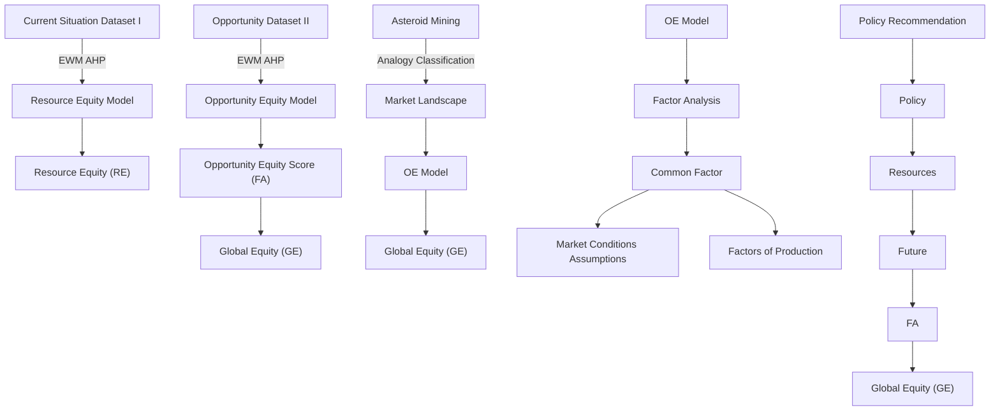

# Evaluation of Global Equity and Asteroid Mining Effects

With the development of globalization and the tight connection between countries, global equity has become a hotly discussed topic. To evaluate Global Equity and the effects of asteroid mining, we are expected to accomplish 4 tasks in this paper: identify Global Equity and set up a model to evaluate it; picture the asteroid mining situation; explain how asteroid mining will affect Global Equity; explore possible changes of current asteroid mining landscape and formulate recommendations for UN to promote Global Equity.

To solve these problems, several models are established: ModelⅠ: Global Equity Model; Model Ⅱ: Asteroid Mining Model and multiple methods including EWM, AHP, Factor Analysis are applied. Before all the models are established, we set up several assumptions to simplify the questions and pre-process the data.

For Question 1, to build an accurate model to evaluate Global Equity, we take two key aspects into account: Resource Equity and Opportunity Equity. For each dimension, we select 7 key indicators and 14 secondary indicators to measure different aspects of Equity. We define two datasets that can represent the status quo and the development potential respectively. By combining EWM and AHP, we obtain an evaluation system. To improve this model, we get a new dataset by combining the two datasets through exponential smoothing in section 4.3. With data from 46 typical countries at various stages of development, we validate the new model in section 4.4. As a result, the FA coefficient works well and can represent the global equity level currently and in the future. The current level is ???? = ??. ????????.

For Question 2, we describe the vision of the future asteroid mining sector by analogy to the existing high seas exploration and analyze the market structure through production factors. Reasons are listed in section 5.1. We believe that the future asteroid market will be in a state of monopolistic competition. Then we analyze the behavioral impact of different players in the market and carry out iterative planning to figure out their impact on global equity. The results in section 5.2.4 show that asteroid mining activity is not constructive to global equity.

For Question 3, we apply factor analysis to the model to obtain the four most important common factors. We propose different assumptions and further determine the impact on global equity by evaluating the impact of changes in assumptions in the asteroid mining sector on public factors. Results in section 6.2 show that market leaders and participants with a developed technology economy will gain excess returns and thus damage Global Equity.

For Question 4, we calculate the global equity of the asteroid mining sector under the influence of different common factors and compare it with the predicted value of GM before seeing whether the global equity is optimized. The results is $\mathbf { G E } = \mathbf { 0 . 8 5 3 1 }$ , which means that Global Equity will be better than it would have been without the asteroid mining sector. Then, we formulated key indicators for policy and put forward reasonable policy recommendations.

Finally, sensitivity analysis of the Global Equity Model is tested in section 9. While adding or distracting 5% of the GDP per capita of Finland, the deviation is acceptable within range. The model can be considered stable. The results of sensitivity are shown in Figure 13.

Keywords: Asteroid Mining, AHP, Entropy Weight Method, Factor Analysis Method

## Contents

## 1. Introduction 3

1.1 Problem Background.  
1.2 Problem Restatement ... 3  
1.3 Literature Review ....... 3  
1.4 Our Work .... . 3

## 2. General Assumption and explanation.. 4

## 3. Model Preparation . 5

3.1 Notations ..... . 5  
3.2 Data collection and cleaning. 5

## 4. Global Equity Model .. 5

4.1 Indicators of global equity model. 5  
4.2 Resource Equity Model.. 7  
4.3 Opportunity Equity Model .. 9  
4.4 Definition of global equity .. .10  
4.5 Validation of global equity model.. .11

## 5 Asteroid Mining Situation in the future........ ..15

5.1 Analogy of Asteroid Mining. ..15  
5.2 Partial equilibrium model of Future Asteroid Mining ....... .15

## 6 How does asteroid mining change global equity? .. .17

6.1 How does asteroid mining affect global equity in the short term? . .17  
6.2 How does asteroid mining affect global equity in the long term? .17

## 7 Optimization of Asteroid Mining Landscape.. .18

7.1 Factor Analysis ..18  
7.2 The impact of asteroid mining on impact factors........ .19

## 8 Policy Recommendation.. ..22

## 9 Sensitivity Analysis.. ..23

## 10 Evaluation of the models ..... ..24

10.1 Strengths. ..24  
10.2 Possible improvements.... .. 24  
10.3 Further Discussion ..... .24

## Reference ...... ..25

## 1. Introduction

## 1.1 Problem Background

With the development of globalization and the intensively tightened connection between countries, global equity has become a hotly discussed topic. Based on the full development of the economy, education, and technology, lots of countries and international organizations have been involved in the effort of achieving global equity. Yet, according to the data from World Bank, the equity level around the globe differentiates greatly, especially in developing countries. Especially in the context of the epidemic, the issues of inequity and unfairness arise, for instance, the unfair distribution of medical resources, gender inequality in employment, unequal R&D capability, etc. Still, there lacks a uniform standard to evaluate the level of global equity. Thus, it’s necessary to establish a model to reflect each country’s situation.

## 1.2 Problem Restatement

Despite many in-depth analyses and research in global equity and its relevant problems, a well-established model to evaluate global equity is necessary, as well as the newly developed plan of asteroid mining and its influences on equity. To handle this problem, the following assignments are expected to be accomplished:

Task 1: Define global equity. Select proper indictors and build a model to evaluate global equity. Apply the model to assess global equity with historical and regional analyses.  
Task 2: Describe what asteroid mining look like in the future by answering the questions of job distribution, financial funds, and its business model. Analyze its impact on global equity.  
Task 3: Explore possible changes of the vision of asteroid mining to affect global equity differently by changing key indexes and sectors in the current vision.  
Task 4: Provide policy recommendations to the UN to promote global equity, especially in the key aspects that could advance in a way that brings great improvements to all humankind.

## 1.3 Literature Review

From the 17th century, the problem related to global equity and distribution has been deeply researched from various aspects. Jin X.D has discussed three stages in the development of modern equality theory in his thesis [2]. Global equity could be analyzed from several aspects and has already been discussed in the economy, education, health, environment, public service facilities, etc. In environment equity, Wang Yi and Wang Huihui both discussed the equal distribution of carbon emissions.[4][5] In global educational equity, Li Xueshu has evaluated educational equity from equitable educational opportunity, equitable educational process, and equitable educational outcome [7]. In medical equity, Gao Liwei has mentioned the institutional mechanism of fairness and justice in decision-making and equal distribution of benefits [6].

Yet there is no global equity study that directly assesses from a macro level, and there is currently no model for directly quantifying global equity. Therefore, we will propose a model that can evaluate global fairness. Besides, we would also put forward an ideal asteroid mining plan to reduce global inequality.

## 1.4 Our Work

First of all, we review relevant literature to find the proper indicators of Global Equity. Then, we define Global Equity as an ideal state in which countries can meet material and spiritual needs without regard to economic and technological conditions. To establish the model of Global Equity, we take two key aspects into account: Resource Equity and Opportunity Equity. For each dimension, we select 7 key indicators and 14 secondary indicators to measure different aspects of Equity. We adopt the Entropy Weight method and AHP to evaluate the

weight of each indicator. Then, we define the score of the RE and OE model as RE and FA respectively. By validating these models, FA can represent Global Equity. Secondly, we picture the landscape of the asteroid mining industry. Based on the analogy to high sea exploration and oil extraction, we measure the input, cost, and earnings of asteroid mining. Therefore, we determine the different roles each country plays. Then, we apply the OE model to the current asteroid mining landscape to see how it would affect global equity. To get reasonable and accurate results, we make several assumptions and take the factors of production into account. By using the OE model and factor analysis, we get the common factors and FA score,. After analyzing key factors of the impact, we extract key policies for the UN to promote global equity. Finally, we test the sensibility of our models. We analyze the advantages and disadvantages and make further discussions to improve the accuracy and extension.

flowchart

Figure 1: Structure of our work

## 2. General Assumption and explanation

To simplify our problems, we make the following assumptions:

Assumption 1: Each country could be regarded as a macro unit in analyzing the global equity and job distribution of asteroid mining.  
Due to the limited resources and technology in several developing countries, some may not be able to take part in the process of asteroid mining. To simplify the actual situation, we assume that each country could be regarded as a unit in our models.

Assumption 2: The asteroid mining market information is completely transparent, and the market is perfectly competitive.

The actual market is complicated. It is hardly possible to accurately predict the competitive landscape. We assume that the future market of asteroid mining is ideal, each player in this market and prices are consistent.

Assumption 3: the mineral resources on asteroids are the same as those on Earth and there is always a constant number of resources in a certain period.

We assume that the mineral resources on asteroids could be used in the same way. The number of resources is constant within a certain time limit.

Assumption 4: All the nations we considered have a relatively stable political and social environment and the data we collected are reliable and accurate.

We assume that sudden changes including disasters, pandemics, etc. are not considered in this model. The data is with high accuracy.

## 3. Model Preparation

## 3.1 Notations

Some important mathematical notations used in this paper are listed in Table 1.

Table 1: Notations

<table><tr><td>Notations</td><td>Explanations</td></tr><tr><td>GE</td><td>Global Equity</td></tr><tr><td>FA</td><td>Fairness Coefficient</td></tr><tr><td>RE</td><td>Resource Equity</td></tr><tr><td>OE</td><td>Opportunity Equity</td></tr></table>

## 3.2 Data collection and cleaning

## 3.1.1 Data collection

Data are mainly collected from the World Bank website, Wind database, and national bureau of statistics. The data sources are summarized in Table 2. We extracted the data that are completed in the past ten years and valuable to reflect global equity and adjusted the basic units to be consistent.

Table 2: Data source

<table><tr><td>Database</td><td>Websites</td></tr><tr><td>UN Comtrade Database</td><td>https://comtrade.un.org/data/</td></tr><tr><td>World Bank Database</td><td>https://data.worldbank.org/indicator</td></tr><tr><td>National Bureau of statistics</td><td>https://data.stats.gov.cn/gjwz.htm</td></tr><tr><td>Wind Database</td><td>Wind Database App</td></tr></table>

## 3.1.2 Data Pre-processing

Data Filling: Due to the limited resources and access to reliable data, we took the following approaches to make the data valuable:

If a certain indicator of a country has rather few missing data of the years and the indicator has a relatively small variance, we use the average value of other years to fill the missing one.  
If a certain indicator of a country has rather few missing data of the years and the indicator has a relatively strong correlation with the year indicator, we use the regression interpolation method.

Handling Outliers: We analyzed each indicator and deviated from the abnormal data that may damage the accuracy and efficacy of our models.

## 4. Global Equity Model

The global Equity model is a qualitative way to evaluate can be measured from different aspects. The model is expected to be comprehensive and considers exhausting aspects and it should be relatively stable. If global equity is achieved, it should not only score high in stock but also be sustainable. Thus, we considered two key factors to measure global equity: Resource Equity (RE), Opportunity Equity (OE), which RE represents different equity performance in different countries in a certain year, and OE represents incremental changes of latest years. For each index, we selected 7 indicators that can reflect different aspects of global equity and validated them with two datasets. Details of the indicators will be explained in sector 4.1 and RE/OE models will be explained in sectors 4.2 and 4.3.

## 4.1 Indicators of global equity model

To build a model to evaluate global equity, we are expected to select several key indicators that could reflect the equity level. According to the literature review and exhausting consideration, we choose 7 key elements in different aspects as follows:

Population Distribution: It represents the poverty-rich distribution of a country.

It reflects the country or region's equitable consideration in terms of population and the effectiveness of equitable distribution for different groups.

Environment: It represents the distribution of the use of shared resources on earth and the shared responsibility of preventing global resources from being damaged.

The equitable use of environmental resources should be shared by all countries for peaceful purposes. We use the energy use of per capita and CO2 emission to measure this index.

Education: Educational equity is the foundation of social equity and global equity.

Education is an important guarantee for the rise of a nation and sustainable development, and the basis for personal development. We selected the school enrollment ratio and government expenditure on education to reflect this index.

Gender: Gender equity represents the equal right of different sexuality.

Gender equality is an important indicator for evaluating global equality. Only by actively promoting the rights of a different gender to develop in economic, social, cultural, and other aspects can social equality and global equality be achieved.

 Technology: It represents a country's comprehensive scientific and technological level.

The equity of technology ensures that there is no technological monopoly among countries. Research and development expenditure and scientific and technical journal articles as the outcome of technology are used in this model.

 Economy: Economy equity represents the equitable distribution of economic factors.

Economic equity is an inherent requirement of a market economy, emphasizing that factor input and factor income are relatively symmetrical. This indicator reflects whether countries in the world have a monopoly in the economy and whether they have a repressive position in the economy.

Medicine: Medical equity represents that everyone has the right to enjoy equable medical resources.

Good health and well-being are basic needs for everyone. The public distribution of public health resources reflects common prosperity. The medical equity index reflects the situation of unfair distribution of resources.

We selected two secondary indicators for each primary indicator, the details are shown in the table below, and the two models we established in the paper both adopted these 7 primary indicators and 14 secondary indicators.

Table 3: Indicators of global equity model

<table><tr><td>Level 1</td><td>Level 2</td><td>Description</td><td>Type</td></tr><tr><td rowspan="2">Population Distribution (Di)</td><td>PP</td><td>Poverty headcount ratio at national poverty lines as % of population</td><td>-</td></tr><tr><td>PR</td><td>The proportion of rich as % of population</td><td>+</td></tr><tr><td rowspan="2">Environment (En)</td><td>EU</td><td>Energy use as kg of oil equivalent per capita</td><td>*</td></tr><tr><td>CE</td><td>CO2 emissions as kt</td><td>-*</td></tr><tr><td rowspan="2">Education (Ed)</td><td>SE</td><td>School enrollment, tertiary as % gross</td><td>+</td></tr><tr><td>GE</td><td>Government expenditure on education, total as % of government expenditure</td><td>+*</td></tr><tr><td rowspan="2">Gender (Ge)</td><td>FL</td><td>Labor force, female as % of the total labor force</td><td>*</td></tr><tr><td>FW</td><td>Contributing family workers, female as % of female employment)</td><td>+</td></tr><tr><td rowspan="2">Technology (Te)</td><td>RDE</td><td>Research and development expenditure as % of GDP</td><td>+</td></tr><tr><td>STA</td><td>Scientific and technical journal articles</td><td>+</td></tr><tr><td rowspan="2">Economy (Ec)</td><td>GP</td><td>GDP per person as $</td><td>+</td></tr><tr><td>CP</td><td>Inflation, consumer prices as annual %</td><td>*</td></tr><tr><td rowspan="2">Medicine (Me)</td><td>HB</td><td>Hospital beds as per 1,000 people</td><td>+</td></tr><tr><td>MR</td><td>Mortality rate, neonatal as per 1,000 live births</td><td>-</td></tr></table>

## Note:

+: The more benefit indicators, the better  
-: The better the lack of cost indicators  
\*: Interval type index is best located in a certain interval  
+\*: the value is greater than or equal to a certain value  
-\*: the value is less than or equal to a certain value

## 4.2 Resource Equity Model

Resource Equity represents the current situation of getting equal resources. It measures the different equity performances in different countries in a certain year. We used the Entropy Weight Method (EWM) to calculate the weight of the second-level index corresponding to each first-level index, and finally obtained the score of each first-level index. Then, we took the Analytic Hierarchy Process (AHP) to obtain the weight of the first-level index and finally obtains the RE coefficient.

## 4.2.1 Data Normalization

Based on the accurate dataset, we normalize the data of different indicators so that they can be compared on the same scale. The 14 secondary indicators can be divided into three categories. We carry out different normalization methods.

Benefit Attributes: the larger, the better.

$$
\tilde {x} _ {i j} = \frac {x _ {i j} - m i n (x _ {i})}{m a x (x _ {i}) - m i n (x _ {i})}
$$

Cost Attributes: the smaller, the better.

$$
\tilde {x} _ {i j} = \frac {\max (x _ {i}) - x _ {i j}}{\min (x _ {i}) - \max (x _ {i})}
$$

 Interval Attributes: an interval attribute’s optimal value lies in a certain interval [a, b].

$$
M = \max \left\{a - \min (x _ {i}), \max (x _ {i}) - b \right\}
$$

$$
\tilde {x} _ {i j} = \left\{ \begin{array}{l} 1 - \frac {a - x _ {i j}}{M}, x _ {i j} <   a \\ 1, a \leq x _ {i j} \leq b \\ 1 - \frac {x _ {i j} - b}{M}, x _ {i j} > b \end{array} \right.
$$

For each interval indicator, there is a reasonable and optimal range.

Inflation: The best inflation range [0, 3.25%], economists believe that inflation above 3.25% means severe inflation, while below 0 means deflation is a situation that any country is unwilling to see.  
Energy consumption per capita: The energy consumption here does not include industrial energy, but only refers to the energy consumed by each person's life, including the car, train, heating, etc. Considering the needs and differences of each

person, we set the optimal interval at [800, 4000]. Above or below this range, we believe that there is waste or shortage of resources.

The proportion of women in the labor force: Optimal value close to 50%  
The proportion of public expenditure on education to fiscal expenditure: We took the maximum and minimum values of this indicator in the top 20 of the world rankings of higher education as the upper and lower limits of the interval (8.5, 16).

## 4.2.2 Calculate the global equity weight by Entropy Weight Method

## Calculate the weight of the second-level indicator

We introduced the global equity weight for each indicator to describe the country’s equity and global equity. The entropy weight method (EWM) is commonly used as a weighting method that measures value dispersion in decision-making. It assumes that the greater the degree of dispersion, the greater the degree of differentiation, and more information can be derived. Thus, higher weight should be given to the indicator, and vice versa [10]. We use the EWM method to calculate the weight of the secondary indicators.

We standardize the measured data. The standardized value of the indicator of the sample country ?? is denoted as $P _ { i j }$ :

$$
P _ {i j} = \frac {\tilde {x} _ {i j}}{\sum_ {j = 1} ^ {m} \tilde {x} _ {i j}}
$$

$\mathrm { w h e r e \ i = 1 , 2 , \dots , n ; j = 1 , 2 , \dots , m }$

In EWM, the entropy value $E _ { i }$ of ?? is calculated.

$$
E _ {i} = \frac {\sum_ {j = 1} ^ {m} p _ {i j} \cdot l n p _ {i j}}{l n m}
$$

Here, $E _ { i }$ means that the greater the differentiation degree of indicator ?? is, and higher weight should be given to the indicator. Therefore, the weight $w _ { i }$ of indicator ?? is calculated as follows.

$$
w _ {i} = \frac {1 - E _ {i}}{\sum_ {i = 1} ^ {m} (1 - E _ {i})}
$$

Then, we get the weight of each two dimensions. The comprehensive performance of sample country ?? by considering the total n indicators can be calculated as

$$
S _ {j} = \sum_ {i = 1} ^ {n} \omega_ {i} \cdot p _ {i j}
$$

Since our model is measured by 7 first-level indicators as mentioned, we applied the EWM method to each indicator respectively and calculate 7 scores to describe global equity.

$$
S _ {D i} = \sum_ {i = 1} ^ {n} \omega_ {i} \cdot p _ {i j}, i = 1, 2, \dots , n _ {D i}
$$

The score of the other six first-level indicators is calculated in the same way. We get the weights of indicators for each dimension.

Table 4: OE model weights

<table><tr><td></td><td>Indicator</td><td colspan="2">Weight</td><td>Indicator</td><td colspan="2">Weight</td><td>Indicator</td><td>Weight</td></tr><tr><td rowspan="2">Di</td><td>PR</td><td>0.0365</td><td rowspan="2">Ge</td><td>FW</td><td>0.0562</td><td rowspan="2">Me</td><td>CP</td><td>0.0257</td></tr><tr><td>PP</td><td>0.0865</td><td>FL</td><td>0.0161</td><td>GP</td><td>0.1371</td></tr><tr><td rowspan="2">En</td><td>CE</td><td>0.0324</td><td rowspan="2">Te</td><td>RDE</td><td>0.1287</td><td rowspan="2">Eco</td><td>HP</td><td>0.0543</td></tr><tr><td>EU</td><td>0.0374</td><td>STA</td><td>0.0697</td><td>MR</td><td>0.0602</td></tr><tr><td rowspan="2">Ed</td><td>GE</td><td>0.1184</td><td></td><td></td><td></td><td></td><td></td><td></td></tr><tr><td>SE</td><td>0.1409</td><td></td><td></td><td></td><td></td><td></td><td></td></tr></table>

## Get the weights of the first-level indicator,

We adopted AHP and EWM methods to get the weights of the first-level indicator. For the EWM method, we simply sum the weights of secondary corresponding to each first-lever indicator.

$$
w _ {D i} ^ {e} = w _ {P P} + w _ {P R}
$$

The weights of the other six first-level indicators are calculated in the same way. Then, we got the weight vector calculated by the EWM method.

$$
w ^ {e} = \left(w _ {D _ {i}} ^ {e}, w _ {D _ {i}} ^ {e}, w _ {D _ {i}} ^ {e}, w _ {D _ {i}} ^ {e}, w _ {D _ {i}} ^ {e}, w _ {D _ {i}} ^ {e}, w _ {D _ {i}} ^ {e}\right)
$$

Then, we calculated the weight using the AHP method. According to Maslow's Hierarchy of Needs, there are five levels of human needs and they are depicted as a pyramid. From the bottom of the hierarchy up, the needs are physiological (food and clothing), safety (job security), social needs (friendship), esteem, and self-actualization. When the needs of different groups of people are distinct, the weight and importance of these aspects are distinct. For example, if safety is the most important element for a person, then medical care and the environment account for a large proportion. In contrast, if self-actualization is the most important to a person, then education will be more important for realizing global equity.

$$
w ^ {H} = \left(w _ {D _ {i}} ^ {H}, w _ {D _ {i}} ^ {H}, w _ {D _ {i}} ^ {H}, w _ {D _ {i}} ^ {H}, w _ {D _ {i}} ^ {H}, w _ {D _ {i}} ^ {H}, w _ {D _ {i}} ^ {H}\right)
$$

We got the following equation:

$$
w ^ {R F} = \propto w ^ {e} + (1 - \propto) w ^ {H}
$$

## Calculate RE score

The score of the RE model is calculated as follows. We define the score as resource equity (RE).

$$
\mathrm{RE} _ {i} = \sum_ {j} S _ {j}
$$

$$
j \in (D i, E n, E d, G e, T e, M e. E c o)
$$

## 4.3 Opportunity Equity Model

## Define a new variation dataset T

To give a comprehensive picture of equity in each country, we need to consider not only equity today, but equity in the future.

We assume that fairness at a point in time depends only on the past, not the future. Therefore, we define a new dataset to describe the development characteristics of equity in terms of sequential functions of successive opportunities.

Opportunity Equity Model represents the latest incremental changes and can be used as a measurement for future prediction. For each indicator. OE Model requires us not only to consider the equity of the present but also the possibility of equity in the future. We process each secondary indicator as follows and select the last 5-year data of each country that is valid for each secondary indicator as a reference, which means the data from 2014 to 2018. We calculate the annual chain growth and get a total of four chain growths, namely 2014-2015, 2015-2016, 2016-2017, 2017-2018, recorded as $( k _ { 1 } , k _ { 2 } , k _ { 3 } , k _ { 4 } )$ .

We define the variation dataset $T _ { i j }$ :

$$
T _ {i j} = \frac {\sum_ {m = 1} ^ {T} k _ {m}}{\sum_ {m = 1} ^ {T} | k _ {m} |}
$$

Here, m in the model we use is 4. Clearly, $T _ { i j }$ is between (-1,1). It has the value 1 when all $k _ { i }$ are greater than 0. Conversely, it has the value 0 when all $k _ { i }$ is less than 0.

## Data forward for T

For the original benefit indicator, the column corresponding to $T _ { i j }$ should be regarded as a benefit indicator. For the original cost indicator, the column corresponding to $T _ { i j }$ should be regarded as a cost indicator. For the original interval indicator, We look at each case on a case-by-case basis.

We found that in dataset 1, most of the countries with energy use are in the range [800, 4000]. So, the $T _ { i j }$ column should be used as a cost indicator. Most of the labor force and female is below 50%, so we regard it as a benefit indicator. The inflation rate Most of them are in [0, 3.25%], the proportion of public expenditure on education in fiscal expenditure is mostly between (8.5, 16). Therefore, we take the corresponding column of $T _ { i j }$ as an interval indicator, the interval is [0, 0]. We believe that in most cases, keeping stable is the wisest choice. After the data forward processing, we get the new dataset as $\tilde { T }$ .

## Calculate OE score

We use the RE model to score the variation dataset $T _ { i j }$ . In the application process, we only need to pay attention to is that the changes of nature of the indicators. We define this score as the OE parameter. Due to the nature of the dataset, OE can be regarded as the machine looking for the fairest chance. Then we calculate the score for dataset T using the same method as the RE model. The score is defined as OE.

## Define new dataset $X ^ { 2 }$ by adding the dataset $\widetilde { \pmb { T } }$

We use the time coefficient $T _ { i j }$ dataset 1 to do exponential smoothing to obtain dataset 2 to reflect the nature of time. Dataset 2 is defined as:

$$
x _ {i j} ^ {2} = \big (1 + \tilde {x} _ {i j} ^ {1} \big) e ^ {\frac {\tilde {T} _ {i j}}{4}}
$$

Here, $\tilde { x } _ { i j } ^ { 1 } , \tilde { T } _ { i j }$ have been forward controlled. So, we need to do the same to $x _ { i j } ^ { 2 }$ in the RE model, where it is clear that $x _ { i j } ^ { 2 }$ does not need to be forward controlled.

Here, we use $\tilde { T }$ to zoom in and out of the data, we want the new data set to capture the full potential for development. Obviously, the bigger the $\tilde { T }$ , the greater the amplification is.

## Calculate FA score

We use this dataset to get the FA coefficients using the same method as the RE model. At this point, the FA coefficient can not only reflect the current situation of resource allocation in each country but also reflect their development status.

## 4.4 Definition of global equity

## 4.4.1 The GE coefficient

line chart

| Prob | The cumulative share of country from lower equity | The difference of ideal and reality |
|------|--------------------------------------------------|-------------------------------------|
| 0.0  | 0.0                                              | 0.0                                 |
| 0.2  | 0.2                                              | 0.1                                 |
| 0.4  | 0.4                                              | 0.2                                 |
| 0.6  | 0.6                                              | 0.25                                |
| 0.8  | 0.8                                              | 0.15                                |
| 1.0  | 1.0                                              | 0.0                                 |

histogram

| FA Range | num |
|---|---|
| [0.16, 0.20] | 2 |
| (0.20, 0.24] | 11 |
| (0.24, 0.28] | 12 |
| (0.28, 0.32] | 12 |
| (0.32, 0.36] | 6 |
| (0.36, 0.40] | 1 |
| (0.40, 0.44] | 2 |

Figure 2: FA distribution and Global Equity Coefficient

By analyzing the curve in Figure 2, the cumulative distribution function is constant through (0,0), (1,1). After observation, we fit the cumulative distribution curve by the following formula:

$$
\mathbf {y} = x ^ {a}
$$

Then, we get: $\mathsf { a } = 0 . 7 1 6 5$ and the Goodness of Fit $\tilde { R } ^ { 2 } = 0 . 8 9 5 7$ , which is close to 1. Therefore, the fitting effect is good. Thus, we define the Global Equity Coefficient (GE) as:

$$
\mathrm{GE} = 1 - \frac {S _ {1}}{2}
$$

$\begin{array} { r } { \mathrm { W h e r e } S _ { 1 } = \int _ { 0 } ^ { 1 } ( x - x ^ { 0 . 7 1 6 5 } ) d x } \end{array}$

As a result, GE can reflect the differentiation of FA's global equity score. $\mathrm { G E } = 0 . 7 2 6 5$ , we believe that the closer GE is to 1, the higher the global equity is. The histogram on the right in Figure 2 shows that global equity is roughly normally distributed slightly to the left, which is conform with our perception. This graph shows that the distribution of equity in most countries around the world is more concentrated.

## 4.4.2 Relationship between RE, OE, FA, GE

We observe that when RE and OE are the same, RE and OE must both be equal to 1, and the FA we get at this time will be the same and 1 for all countries, at this time GE=1, The world will achieve absolute equity.

FA describes the relative fairness of individual countries. For a country, when RE remains unchanged and OE increases, accordingly, FA increases; when OE remains unchanged and RE increases, accordingly, FA increases.

GE mainly describes the distribution of FA, which represents global equity. The more concentrated the FA is, the smaller the distribution gap between countries is, the larger the GE is, the more optimistic the global equity situation is. Vice versa.

## 4.5 Validation of global equity model

## 4.5.1 Weights of Indicators by RE & OE evaluation model

We verify that the OE model is improved compared to the RE model with the new dataset. We first compare the difference between the weight vectors of the two models.

pie chart

| Category | RE_WEIGHT (%) | OE_WEIGHT (%) |
| :--- | :--- | :--- |
| Distribution | 12 | 12 |
| Environment | 1 | 7 |
| Education | 8 | 26 |
| Gender | 33 | 7 |
| Distribution | 19 | 20 |
| Environment | 17 | 16 |
| Education | 10 | 12 |
| Gender | 1 | 7 |
| Technology | 12 | 12 |
| Economy | 17 | 16 |
The chart is a simplified representation of the pie charts. The left chart is labeled 'RE_WEIGHT', and the right chart is labeled 'OE_WEIGHT'.

Figure 3: Results of RE & OE weight

According to the result from Figure 3, the RE index weight calculated by the RE evaluation model that only uses the RE evaluation index is significantly different from the OE index weight of the OE evaluation model that adds the OE rating index. We can tell from these two figures that the OE weight model on the right side, the proportion of education and environment has increased significantly, compared with the RE weight model on the left side. However, the

weight of the gender has decreased significantly. Thus, we can jump to the conclusion that several countries have made a great improvement in the environmental aspect.

## 4.5.2 Results of Countries by RE & OE evaluation model

We can tell from the results in Table 5 that the country that reaches a relatively high score in RE and OE model also differ from each other greatly. The top 5 countries valued by only the RE model and by both RE&OE models are listed in Table 5.

Table 5: Top 5 countries value by model

<table><tr><td>Top 5 countries by only RE evaluation model</td><td>Top 5 countries by RE and OE evaluation model</td></tr><tr><td>Finland</td><td>Finland</td></tr><tr><td>Belgium</td><td>Indonesia</td></tr><tr><td>Georgia</td><td>Belgium</td></tr><tr><td>France</td><td>Denmark</td></tr><tr><td>Germany</td><td>Ireland</td></tr></table>

Table 6: Detailed Score of Top 5 countries by RE&OE model

<table><tr><td>Country</td><td>Di</td><td>En</td><td>Ed</td><td>Ge</td><td>Te</td><td>Me</td><td>Ec</td><td>Score</td></tr><tr><td>Finland</td><td>0.0239</td><td>0.9828</td><td>0.2461</td><td>0.9992</td><td>0.0021</td><td>0.1577</td><td>0.0422</td><td>0.44255</td></tr><tr><td>Indonesia</td><td>0.032</td><td>0.9131</td><td>0.2928</td><td>0.6752</td><td>0.2487</td><td>0.0983</td><td>0.0676</td><td>0.40555</td></tr><tr><td>Belgium</td><td>0.1338</td><td>0.9432</td><td>0.7761</td><td>0.6499</td><td>0.3188</td><td>0.2561</td><td>0.0953</td><td>0.38035</td></tr><tr><td>Denmark</td><td>0.2454</td><td>0.9955</td><td>0.5467</td><td>0.0137</td><td>0.2374</td><td>0.2341</td><td>0.7093</td><td>0.3594</td></tr><tr><td>Ireland</td><td>0.3113</td><td>0.995</td><td>0.5203</td><td>0.0176</td><td>0.1048</td><td>0.9143</td><td>0.9143</td><td>0.35215</td></tr></table>

We can tell from Table 5 that when we only use the RE indicator to measure the equity index, the top rankings we get are developed countries with relatively strong comprehensive strength. Yet, we add OE evaluation indicators, countries that are developing and making progress are included as well.

  
Figure 4: Scores of RE&OE model

As we can see in the result, Indonesia and Ireland are not the top 5 in the RE evaluation system, and their OE evaluation indicators are higher. As shown in Figure 4, the top five countries in the OE evaluation system are reaching the goal of achieving environmentally equity, and the gender equability score is higher, indicating that they pay more attention to environmental equity and gender equity, while the economy is relatively neglected compared to the RE evaluation system. This also reflects the sluggish economic development in recent years, due to the epidemic and the economic degression, which has lowered people's expected levels of welfare and equity. Topics related to environmental governance and gender equality have attracted attention in recent years.

## 4.5.3 Top 1-Scored Country Analysis -- Finland

From the results, we can tell that Top 1 Finland stands out in both models. According to the UN's annual World Happiness Report, Finland has been named the happiest country in the world for the fourth consecutive year.

Table 7: Score of Finland in OE&RE model

<table><tr><td>Method</td><td>Di</td><td>En</td><td>Ed</td><td>Ge</td><td>Te</td><td>Me</td><td>Ec</td><td>Score</td></tr><tr><td>OE</td><td>0.0239</td><td>0.9828</td><td>0.2461</td><td>0.9992</td><td>0.0021</td><td>0.1577</td><td>0.0422</td><td>0.44255</td></tr><tr><td>RE</td><td>0.532</td><td>0.9256</td><td>0.2659</td><td>0.6952</td><td>0.2365</td><td>0.2658</td><td>0.6589</td><td>0.56499</td></tr></table>

We can also see that the OE and RE models have different emphases on Finland, especially in terms of economic equity. Combined with the actual situation, we draw the development map and process map of two indicators of the Finnish economy.

line chart

| Year | GP    | MR    |
|------|-------|-------|
| 2008 | 5.4   | 5.4   |
| 2009 | 4.7   | 4.2   |
| 2010 | 4.6   | 4.6   |
| 2011 | 5.1   | 5.3   |
| 2012 | 4.8   | 5.1   |
| 2013 | 5.0   | 4.6   |
| 2014 | 5.1   | 4.5   |
| 2015 | 4.3   | 4.1   |
| 2016 | 4.4   | 4.3   |
| 2017 | 4.6   | 4.4   |
| 2018 | 5.0   | 4.5   |

line chart

| Year | EU   | CE    |
|------|------|-------|
| 2008 | 6550 | 6700  |
| 2009 | 7100 | 6550  |
| 2010 | 6950 | 6300  |
| 2011 | 6700 | 6550  |
| 2012 | 6300 | 6150  |
| 2013 | 6850 | 6250  |
| 2014 | 6550 | 5950  |
| 2015 | 6300 | 5700  |
| 2016 | 6150 | 5950  |
| 2017 | 6250 | 5750  |
| 2018 | 5950 | 5850  |

Figure 5: Economic Equity development in Finland (2008-2018)

We studied the economic data from Finland. To verify the validity, we focus on a historical study of Finland. As we can see from Figure 5, Finland's per capita GDP is very high. Meanwhile, the inflation rate is basically within the safe range of 0%-4%, which means the inflation is maintained well. This results in a relatively high score in economic equity calculated by the RE model. Considering the actual situation, however, Finland has a relatively large fluctuation in both indicators in the short term. The per capita GDP fell sharply in 2014, and the inflation rate fell below 0 in 2015. This also explains why the OE model score is not ideal.

However, there is no denying that the Finnish economy is one of the best-performing countries in the global market. With a highly industrialized economy, Finland scores 74.1 for economic freedom. According to the 2018 Index, the score ranks the country as the 26th freest economy. Finland is a multi-sectoral economy with many different industries including agriculture, manufacturing, refining, and services. The service sector is the largest in the economy, accounting for about 73%. Besides, we can tell from the results that both EU and CE are declining steadily, which provides a realistic basis for the high OE score.

## 4.5.4 Classification and Verification of OE model results

We use the obtained FA coefficient to perform one-dimensional clustering and divide it into three categories and set the interval points as 0.36, 0.28. Therefore, [0.36,1] is a country with a high level of equity, [0.28,0.36] is a country with a medium level of equity, and [0,0.28] is a country with a poor level of equity

Table 8: Categories of global equity

<table><tr><td>Degree of global equity</td><td>FA</td></tr><tr><td>strong</td><td>0.36~1</td></tr><tr><td>middle</td><td>0.28~0.36</td></tr><tr><td>weak</td><td>0~0.28</td></tr></table>

heatmap

| Country | Score |
| --- | --- |
| United States | 0.5000 |
| Russia | 0.5000 |
| Canada | 0.5000 |
| Mexico | 0.5000 |
| Germany | 0.5000 |
| France | 0.5000 |
| UK | 0.5000 |
| Italy | 0.5000 |
| Spain | 0.5000 |
| Japan | 0.5000 |
| South Korea | 0.5000 |
| Australia | 0.5000 |
| Netherlands | 0.5000 |
| Sweden | 0.5000 |
| Norway | 0.5000 |
| Denmark | 0.5000 |
| Finland | 0.5000 |
| Switzerland | 0.5000 |
| Netherlands | 0.5000 |
| Austria | 0.5000 |
| Poland | 0.5000 |
| Czech Republic | 0.5000 |
| Hungary | 0.5000 |
| Romania | 0.5000 |
| Bulgaria | 0.5000 |
| Croatia | 0.5000 |
| Slovenia | 0.5000 |
| Bosnia and Herzegovina | 0.5000 |
| Serbia | 0.5000 |
| Montenegro | 0.5000 |
| Albania | 0.5000 |
| North Macedonia | 0.5000 |
| Kosovo | 0.5000 |
| Ukraine | 0.5000 |
| Belarus | 0.5000 |
| Iceland | 0.5000 |
| Greenland | 0.5000 |
| Faroe Islands | 0.5000 |
| Tuvalu | 0.5000 |
| Saint Pierre and Miquelon | 1.2346 |
| French Guiana | 1.2346 |
| New Caledonia | 1.2346 |
| Ecuador | 1.2346 |
| Bolivia | 1.2346 |
| Peru | 1.2346 |
| Colombia | 1.2346 |
| Venezuela | 1.2346 |
| Ecuador | 1.2346 |
| Guatemala | 1.2346 |
| Honduras | 1.2346 |
| Costa Rica | 1.2346 |
| Panama | 1.2346 |
| Cuba | 1.2346 |
| Dominican Republic | 1.2346 |
| Jamaica | 1.2346 |
| Haiti | 1.2346 |
| Sierra Leone | 1.2346 |
| Liberia | 1.2346 |
| Rwanda | 1.2346 |
| Benin | 1.2346 |
| Brunei | 1.2346 |
| New Zealand | 1.2346 |
| Singapore | 1.2346 |
| Malaysia | 1.2346 |
| Thailand | 1.2346 |
| Philippines | 1.2346 |
| Vietnam | 1.2346 |
| Bangladesh | 1.2346 |
| Pakistan | 1.2346 |
| Iran | 1.2346 |
| Saudi Arabia | 1.2346 |
| Turkey | 1.2346 |
| Kazakhstan | 1.2346 |
| Kyrgyzstan | 1.2346 |
| Tajikistan | 1.2346 |
| Mongolia | 1.2346 |
| Sri Lanka | 1.2346 |
| Nepal | 1.2346 |
| Bhutan | 1.2346 |
| Maldives | 1.2346 |
| Mozambique | 1.2346 |
| Madagascar | 1.2346 |
| Papua New Guinea (Papua) | 1.2346 |
| Solomon Islands (Tunisia) | 1.2346 |
| Vanuatu | 1.2346 |
| Samoa | 1.2346 |
| Tonga | 1.2346 |
| Kiribati | 1.2346 |
| Palau | 1.2346 |
| Marshall Islands (Tunisia) | 1.2346 |
| Micronesia | 1.2346 |
| Bermuda | 1.2346 |
| Monaco | 1.2346 |
| Andorra | 1.2346 |
| New Caledonia (Tunisia) | 1.2346 |
| French Polynesia (Tunisia) | 1.2346 |
| French Guiana (Tunisia) | 1.2346 |
| French Beiana (Tunisia) | 1.2346 |
| French Hornschaft (Tunisia) | 1.2346 |
| French Beiana (Tunisia) | 1.2346 |
| French Hornschaft (Tunisia) | 1.2346 |
| French Beiana (Tunisia) | 1.2346 |
| French Hornschaft (Tunisia) | 1.2346 |
| French Beiana (Tunisia) | 7987 |
| French Hornschaft (Tunisia) | 7987 |
| French Beiana (Tunisia) | 7987 |
| French Hornschaft (Tunisia) | 7987 |
| French Beiana (Tunisia) | 7987 |
| French Hornschaft (Tunisia) | 7987 |
| French Beiana (Tunisia) | 7987 |
| French Hornschaft (Tunisia) | -7987 |
| French Beiana (Tunisia) | -7987 |
| French Hornschaft (Tunisia) | -7987 |
| French Beiana (Tunisia) | -7987 |
| French Hornschaft (Tunisia) | -7987 |
| French Beiana (Tunisia) | -7987 |
| French Hornschaft (Tunisia) | -7987 |
| French Beiana ( | -7987 |
| French Hornschaft (Tunisia) | -7987 |
| French Beiana ( | -7987 |
| French Hornschaft ( | -7987 |
| French Beiana ( | -7987 |
| French Hornschaft ( | -7987 |
| French Beiana ( | -7987 |
| French Hornschaft ( | -7987 |
| French Beiana ( | -7987 |
| French Hornschaft ( | -7987 |
| French Beiana( ) | -7987 |
| French Hornschaft ( ) | -7987 |
| French Beiana( ) | -7987 |
| French Hornschaft ( ) | -7987 |
| French Beiana( ) | -7987 |
| French Hornschaft ( ) | -7987 |
| French Beiana( ) | -7987 |
| French Hornschaft ( ) | -7987<nl> |
| <fcel>French Beiana( ) | -7987 |
| French Hornschaft ( ) | -7987 |
| French Beiana( ) | -7987 |
| French Hornschaft ( ) | -7987 |
| French Beiana( ) | -7987 |
| French Hornschaft ( ) | -7987 |
| French Beiana( ) | <7987 |
| French Hornschaft ( ) | <7987 |
| French Beiana( ) | <7987 |
| French Hornschaft ( ) | <7987 |
| French Beiana( ) | <7987 |
| French Hornschaft ( ) | <7987 |
| French Beiana( ) | <7987 |
| French Hornschaft ( ) | <7987 |

Figure 6: Distribution of Global Equity situation

From Figure 6, we can see that the equity level in Europe is significantly better in other regions. Then, we do some research about the economic, medical situations in Europe and its position around the globe. Main industrial countries including Germany, France, Italy are in Europe. One of the strongest medical capabilities in the economically developed regions of Northern Europe. According to the report Global Burden of Diseases, Injuries, and Risk Factors Study carried out in Lancet in 2016, the top 20 countries in the global medical capacity are mainly concentrated in Europe. Most of these countries with higher medical capacity scores correspond to higher per capita income levels and lower population numbers or densities.[11]

We use the hierarchical clustering method to analyze the validity of dataset 2. We choose the method of ward deviation averaging. We divide first the n samples into one class, then reduce one class each time, and select the two classes with the smallest increase in the sum of the squared deviations to merge until all the samples are classified into one class.

Sum of Squares of Deviations:

$$
S _ {p} = \Sigma_ {x _ {i \in G p}} ^ {n p} \big (x _ {i} - \overrightarrow {x _ {p}} \big),
$$

Where $\overrightarrow { x _ { p } }$ represents the average of $G _ { P }$ .

Increment of the sum of squares of deviations:

$$
D _ {p q} ^ {2} = S _ {r} ^ {2} - S _ {p} ^ {2} - S _ {q} ^ {2}
$$

Then, we get the final hierarchical clustering diagram and find two ways of categorization:

bar chart

| Country | Value |
| :--- | :--- |
| Serbia | 0.01 |
| Austria | 0.02 |
| Romania | 0.03 |
| Indonesia | 0.04 |
| Turkey | 0.05 |
| Slovenia | 0.06 |
| Myanmar | 0.07 |
| Greece | 0.08 |
| Lithuania | 0.09 |
| Sweden | 0.10 |
| Costa Rica | 0.11 |
| Panama | 0.12 |
| Hungary | 0.13 |
| Mongolia | 0.14 |
| Slovak Republic | 0.15 |
| Poland | 0.16 |
| Mexico | 0.17 |
| Spain | 0.18 |
| Latvia | 0.19 |
| Estonia | 0.20 |
| Jordan | 0.21 |
| Philippines | 0.22 |
| Malta | 0.23 |
| Moldova | 0.24 |
| Portugal | 0.25 |
| Finland | 0.26 |
| Belgium | 0.27 |
| France | 0.28 |
| Belarus | 0.29 |
| Czech Republic | 0.30 |
| Armenia | 0.31 |
| Georgia | 0.32 |
| Ireland | 0.33 |
| Denmark | 0.34 |
| Switzerland | 0.35 |
| United Kingdom | 0.36 |
| Malaysia | 0.37 |
| Vietnam | 0.38 |
| Netherlands | 0.39 |
| Guatemala | 0.40 |
| Italy | 0.41 |
| Iceland | 0.42 |
| Germany | 0.43 |
| Cyprus | 0.44 |
| United States | 0.45 |
| Norway | 0.46 |

Figure 7: hierarchical clustering diagram

Finally, we calculate the similarity of the two models to evaluate whether the model is accurate or not:

$$
R I = \frac {a + b}{c _ {2} ^ {n s a m p l e}}
$$

Where ?? is the given actual category information, ?? is the clustering information result, ?? represents the logarithm of elements of the same category in both C and K, and ?? represents the logarithm of elements of different categories in both ?? and ??.

The final Rand index of the two models is calculated to be 0.85, which is close to 1. It indicates that the results of the two models are very close. That also means that our classification works well. Thus, the FA coefficient works well and can represent the global equity level currently and in the future.

## 5 Asteroid Mining Situation in the future

## 5.1 Analogy of Asteroid Mining

To find the future pattern of the asteroid mining industry, we assume that the asteroid mining industry has only three production factors: labor quality, capital, and technology. We liken asteroid mining activities to high seas exploration and oil extraction, and we use high seas exploration to make an analogy. This analogy is based on the following reasons, which we believe that the two have in common in these five characteristics as follows:

Outer space belongs to the public domain instead of any country. This is similar to the development of oil fields on the high seas.  
"Priority Mining Rights": According to the UN's "priority mining rights" regulations on the high seas, whoever has produced detailed scientific research data and who applies for the mining rights of a certain high seas area can obtain the priority mining rights. Though satellite frequencies and orbital resources are shared by all human beings, acquiring them is still based on the principle of "first boarding, first occupying". It is reasonable to assume that asteroid mining follows the same principle.  
There are technical barriers. Both deep-sea exploration and asteroid mining have extremely high requirements for technology. Obviously for asteroid mining.  
Once successful, there will be a great benefit. It provides an entry threshold for countries that cannot achieve technology but have strong funds.  
High-level management personnel and technical personnel are needed in both situations. Based on these assumptions, we set differentiated according to the time dimension, dividing the space mining scenarios into different terms.

## 5.2 Partial equilibrium model of Future Asteroid Mining

In the short term, the countries with advanced technology will have an obvious first-mover advantage. Countries with advanced technology will have priority mining rights. Only a small number of countries can explore and do asteroid mining. At this time, asteroid mining will be in a monopoly state. Besides, countries with more capital but less developed technology may participate in cooperative mining by providing support, and the benefits will be completely controlled by powerful countries with a high level of scientific and technological development. Minerals on a small scale have little impact on the dispatch and allocation of resources, so we assume that asteroid mining will be an ongoing, large-scale behavior that will have a lasting impact on the world.

## 5.2.1 Output

Under this circumstance, we believe that among three factors of production, science and technology are more important than capital and labor quality in terms of obtaining economic benefits, according to the degree of participation in asteroid mining. Since technological breakthroughs will lead to the possibility of obtaining preferential mining rights, and sufficient funds can be used for investment cooperation, labor is invested in various fields of production and sales to obtain wages and benefits.

In this case, countries with advanced science and technology can obtain mining profits, and countries with high economic levels may cooperate to obtain mining profits or investment income, and the output is completely monopolized by countries with strong economic strength and high development levels.

We assume that the total global fixed cost is $C _ { 0 }$ that is quickly paid off in a period. We assume that $\mathrm { T } \leq 5$ , where T represents the number of years. That is, the full production is completed within five years, and the total annual global regular income from $\mathrm { T } = 6$ is w.

## 5.2.2 Cost

We estimate asteroid mining based on data on the benefits of high seas oil fields owned by various countries around the world. We determine the country that provides the technology and the country that provides the capital, and the proportion of the cost borne by the initial technology powerhouse is

$$
w e i g h t _ {e c} = \frac {\sum_ {i = 1} ^ {m} S _ {i 1}}{\sum_ {i = 1} ^ {k} S _ {i 2} + \sum_ {i = 1} ^ {m} S _ {i 1}}
$$

which means that investment is proportional to economic strength.

## 5.2.3 Earnings

We also predict asteroid mining based on the data on the earnings of high seas oil fields owned by various countries in the world. We determine that the proportion of the income obtained by the above three types of countries is about (0.6751, 0.3122, 0.0123). The income is obtained from one period to another, assuming that the minerals are inexhaustible.

## 5.2.4 Situation description

We use the existing data set $\tilde { x } _ { i j } ^ { 2 }$ for analysis, which is the data analysis used in the OE model. We assume that each secondary indicator grows according to its own natural increase level, which is $x _ { T - t } = x _ { t } e ^ { T - t }$ .

## 1. Market leader: technology countries

In this case, the countries with developed science and technology economies obtain excess returns. We clustered the scores of science and technology equity indicators of countries obtained by the OE model to obtain the third base and obtained the split points of 0.4213 and 0.1257. Here, we believe that countries with a technological equity index above 0.42 can conduct asteroid mining. We compare the first group of countries with the world's recognized technological powerhouses, and we find roughly the same. So, we think these countries are capable or will be capable of asteroid exploration in the future. We assume that there are ?? countries in this group. Then each country in each group gets a remuneration of $\mathrm { P } _ { i } = 0 . 6 7 5 1 \cdot \frac { w } { m }$ per period.

As time goes on, there will be more and more countries with the science and technology fairness index above 0.42, ?? will increase accordingly and the rewards for each country will become less.

## 2. Market Participants: Advanced Economies

We do the same for the economic equity index (Ec) and get the split points of 0.58, 0.21, We select the countries above 0.58 and the economic countries with the authority of the Economic Journal. We believe that these countries have the capital to engage in asteroid mining activities and can obtain economic benefits. We assume that there are ?? countries in this group. Then the reward shared by each country in each group is $\begin{array} { r } { \mathrm { P } _ { i } = 0 . 3 1 2 2 \cdot \frac { w } { k } . } \end{array}$

## 3. The Recipient of the market: other countries

We believe that the labor market of the asteroid mining industry needs high-end talent labor. So, the compensation income generated is allocated according to the education equity index in the OE model. The higher the education equity ranking, the more labor talent we think it provides. We assume that the labor compensation for each country is $\begin{array} { r } { \mathrm { P } _ { i } = 0 . 0 1 2 3 \cdot \frac { w S _ { i 3 } } { \sum _ { i = 1 } ^ { n } S _ { i 3 } } . } \end{array}$

## 6 How does asteroid mining change global equity?

## 6.1 How does asteroid mining affect global equity in the short term?

Asteroid exploration consumes a lot of costs, the large-scale investment of capital, technology, and talents will affect the maintenance of economic and various other social equity in the short term and may lead to the decline of various equity indicators in the short term.

The discovery of new minerals could be devastating to the economies of major mineral exporters. We find that in the short term, the world becomes “more equitable” due to the consumption of resources in developed countries and the benefits of labor remuneration obtained by other countries. At that time, the asteroid mining market is still in the development stage. The relevant countries continue to invest in losses in the early stage, while other countries can enjoy the benefits, making the world more equitable.

## 6.2 How does asteroid mining affect global equity in the long term?

After we analyzed the short-term effects of asteroid mining on global equity, we also need to consider the long-term effects due to the changes of sectors in asteroid mining. Thus, we iterate the above partial equilibrium model over time and draw the change diagram as follows:

scatterplot

| T | Region | OE (x-axis) | RE (x-axis) | OE (y-axis) | RE (x-axis) | OE (y-axis) | RE (x-axis) | OE (y-axis) | RE (x-axis) |
| --- | --- | --- | --- | --- | --- | --- | --- | --- | --- |
| 0 | high-tech country | 0.1 | 0.05 | 0.6 | 0.1 | 0.4 | 0.1 | 0.3 | 0.1 |
| 0 | economyally advanced country | 0.2 | 0.1 | 0.3 | 0.2 | 0.3 | 0.2 | 0.3 | 0.2 |
| 0 | other country | 0.3 | 0.2 | 0.4 | 0.3 | 0.2 | 0.3 | 0.3 | 0.3 |
| 5 | high-tech country | 0.4 | 0.3 | 0.2 | 0.4 | 0.2 | 0.4 | 0.3 | 0.4 |
| 5 | economyally advanced country | 0.5 | 0.4 | 0.3 | 0.5 | 0.3 | 0.5 | 0.3 | 0.5 |
| 5 | other country | 0.6 | 0.5 | 0.4 | 0.6 | 0.4 | 0.6 | 0.4 | 0.6 |
| 10 | high-tech country | 0.7 | 0.6 | 0.5 | 0.7 | 0.5 | 0.7 | 0.5 | 0.7 |
| 10 | economyally advanced country | 0.8 | 0.7 | 0.6 | 0.8 | 0.6 | 0.8 | 0.6 | 0.8 |
| 10 | other country | 0.9 | 0.8 | 0.7 | 0.9 | 0.7 | 0.9 | 0.7 | 0.9 |
| 50 | high-tech country | 1.0 | 1.0 | 0.4 | 1.0 | 0.4 | 1.0 | 0.4 | 1.0 |
| 50 | economyally advanced country | 1.1 | 1.1 | 0.3 | 1.1 | 0.3 | 1.1 | 0.3 | 1.1 |
| 50 | other country | 1.2 | 1.2 | 0.2 | 1.2 | 0.2 | 1.2 | 0.2 | 1.2 |
| 20 | high-tech country | 1.3 | 1.3 | 0.2 | 1.3 | 0.2 | 1.3 | 0.2 | 1.3 |
| 20 | economyally advanced country | 1.4 | 1.4 | 0.1 | 1.4 | 0.1 | 1.4 | 0.1 | 1.4 |
| 20 | other country | 1.5 | 1.5 | 0.1 | 1.5 | 0.1 | 1.5 | 0.1 | 1.5 |
| T | high-tech country | T = | T = | T = | T = | T = | T = | T = | T |
| T | economyally advanced country (T=0) | T = | T = | T = | T = | T = | T = | T = | T |
| T | other country | T = | T = | T = | T = | T = | T = | T = | T |
| T = | high-tech country | T = | T = | T = | T = | T = | T = | T = | T |

Figure 8: Asteroid Mining Situation in the different period

In the long run, however, market leaders and participants with a developed technology economy will gain excess returns. With the excess returns, the polarization of the world will be intensified. It is not conducive to global equitable development. That is, the strong become

stronger and the weak remain weak. We calculate T=50, that is, after 50 iterations, the global fairness coefficient will become GE=0.4521, which is much lower than that without the asteroid mining sector.

## 7 Optimization of Asteroid Mining Landscape

Truly, it is not easy for us to change the status quo, but we set a vision: we assume that at some point in the future, all countries will be able to conduct asteroid mining, all countries have channels for sales, and each country is a market participant.

However, according to the data of the previous question, it is clear that the participation of various countries in asteroid mining is directly related to the level of scientific and technological development and economic development. Countries with a high level of technological development and economic development can spend less money and obtain a relatively higher return. For low to medium equity countries, as we analyze the benefits of asteroid mining, we start by looking at economic indicators for mineral-rich countries.

We apply the factor analysis model. We believe that technology, economy, and high-quality talent are factors that affect asteroid mining. Because we only know 14 indicators that reflect the performance, we believe that these fourteen indicators are affected by the three public factors of technology, labor quality, economy. And it’s the same with the asteroid mining industry as well.

After we know these three influencing factors, we use the matrix algebraic form of each indicator expressed as a factor:

$$
x - \mu = A z + \epsilon
$$

Here, ?? is the indicator vector, ?? is the common factor vector, ?? is the loading matrix, indicating the correlation between the common factors.

Then, we do the correlation test with the Bartlett sphericity test. The chi-square of Bartlett sphericity is about 234.01, and the P-value is less than 0.001, indicating that there is a correlation between variables, and factor analysis can be carried out.

## 7.1 Factor Analysis

We use principal component analysis for factor analysis. We set the eigenvalue of the sample correlation coefficient matrix R and set the normalized vector of the belief. Then the factor loading matrix is

$$
A = \left[ \sqrt {\lambda_ {1}} \eta_ {1}, \sqrt {\lambda_ {2}} \eta_ {2}, \dots , \sqrt {\lambda_ {m}} \eta_ {m} \right]
$$

The results are shown in Figure 9:

line chart

| Number of components | Eigen |
| -------------------- | ----- |
| 1                    | 4.8   |
| 2                    | 1.5   |
| 3                    | 1.3   |
| 4                    | 1.0   |
| 5                    | 0.9   |
| 6                    | 0.8   |
| 7                    | 0.8   |
| 8                    | 0.7   |
| 9                    | 0.6   |
| 10                   | 0.5   |
| 11                   | 0.4   |
| 12                   | 0.3   |
| 13                   | 0.2   |
| 14                   | 0.1   |

Figure 9: Distribution of factor analysis model

We select four common factors with eigenvalues greater than 1 and consider them significant. We get the rotated common factor:

Table 9: results of common factors

<table><tr><td rowspan="2"></td><td colspan="4">Element</td></tr><tr><td>1</td><td>2</td><td>3</td><td>4</td></tr><tr><td>PR</td><td>0.738531</td><td>0.153511</td><td>-0.15425</td><td>0.100192</td></tr><tr><td>PP</td><td>-0.43453</td><td>-0.44328</td><td>0.970124</td><td>0.010642</td></tr><tr><td>CE</td><td>0.457895</td><td>-0.02079</td><td>0.524591</td><td>0.216978</td></tr><tr><td>GE</td><td>-0.04197</td><td>-0.74617</td><td>-0.1068</td><td>-0.21632</td></tr><tr><td>FW</td><td>-0.35536</td><td>-0.20276</td><td>0.616606</td><td>-0.25839</td></tr><tr><td>RDE</td><td>0.79419</td><td>0.221896</td><td>-0.204</td><td>0.821209</td></tr><tr><td>CP</td><td>-0.23387</td><td>-0.00375</td><td>0.812368</td><td>-0.05732</td></tr><tr><td>HB</td><td>-0.13953</td><td>0.738362</td><td>-0.23986</td><td>0.005448</td></tr><tr><td>STA</td><td>0.105007</td><td>0.13209</td><td>-0.06353</td><td>0.833382</td></tr><tr><td>SE</td><td>0.390287</td><td>0.877269</td><td>0.012939</td><td>0.118054</td></tr><tr><td>GP</td><td>0.839867</td><td>0.011089</td><td>-0.28155</td><td>0.20742</td></tr><tr><td>EU</td><td>0.750063</td><td>0.103466</td><td>0.000179</td><td>-0.29509</td></tr><tr><td>MR</td><td>-0.49984</td><td>-0.57082</td><td>0.213181</td><td>-0.00185</td></tr><tr><td>FL</td><td>0.31921</td><td>0.478863</td><td>-0.33877</td><td>-0.22983</td></tr><tr><td>Cumulative contribution rate</td><td>25.428</td><td>42.067</td><td>54.1977</td><td>62.5453</td></tr></table>

We get the twiddle factors: the cumulative contribution rate of the four factors reaches 62.545%, which we think can reflect global equity well.

Then we analyze the correlation as follows:

Factor 1 is mainly positively correlated with economic indicators and negatively correlated with environmental indicators. We define it as an economic factor, denoted as Y. It represents that economic progress may lead to environmental damage.  
Factor 2 is mainly related to educational indicators and has an obvious positive correlation. This factor represents social welfare, denoted as L. We believe that factor 2 can represent the cultivation of high-quality talents.  
Factor 3 is mainly related to inflation, namely the price level. The infl rate is proportional to the poverty ratio. We denote it as F, which reflects the living standard of the people in each country.  
Factor 4 is related to the technological factor, representing the technological situation, denoted as A.

The metrics we define can be represented by four common factors:

$$
X _ {i} = u _ {i} + \alpha_ {i 1} Y + \alpha_ {i 2} L + \alpha_ {i 1} F + \alpha_ {i 1} A
$$

We next study the impact of asteroid mining on the common factor to judge the impact on the global fairness factor.

## 7.2 The impact of asteroid mining on impact factors

## 7.2.1 Economic impact

We believe that the input of labor and technology will bring economic benefits to countries and promote their development. Here, we assume that the above common factors A, L are the production factors of asteroid mining, and Y is the income. Thus, we use the production function:

$$
\mathrm{Y} = A L ^ {\propto}
$$

Where A represents the technological factor, which determines the input-output ratio. L represents the labor quality factor, which determines the amount of input, namely the technology and labor quality of each country represent the increment of interests.

## 7.2.2 Non-Economic impact

We analyze the impact of asteroid mining on the existing mining industry by analyzing the current mineral importing countries.

scatterplot

| RE    | OE    |
|-------|-------|
| 0.05  | 0.01  |
| 0.08  | 0.25  |
| 0.10  | 0.58  |
| 0.15  | 0.35  |
| 0.17  | 0.42  |
| 0.18  | 0.38  |
| 0.20  | 0.35  |
| 0.22  | 0.32  |
| 0.25  | 0.30  |
| 0.27  | 0.28  |
| 0.28  | 0.29  |
| 0.29  | 0.27  |
| 0.30  | 0.26  |
| 0.32  | 0.25  |
| 0.35  | 0.38  |
| 0.37  | 0.44  |
| 0.40  | 0.63  |
| 0.45  | 0.25  |
| 0.52  | 0.36  |

Figure 10: RE&OE performances in major mineral exporter countries

The classification points obtained by clustering are RE=0.2413, OE=0.3154. The horizontal and vertical lines passing through this point divide the points in Figure 10 into four sections: poor equity and poor prospects; well equity but poor national prospects; well prospects but poor equity, well equity and well prospects. We found that the major mineral-producing countries are highly polarized. While some have a very unfair distribution of resources, others have good resource allocation and strong development prospects.

We recognize that some are extracting benefits from depleted resources

Destruction of the environment: The construction leads to the destruction of the environment and the increase of $\mathrm { C O } _ { 2 }$ emissions.  
Medical: As the environment gets worse, the number of diseases increases, and the country's medical problems are not paid enough attention to.  
Economy: Though a high economic growth rate will be achieved in the short term, the inflation rate will remain high, and the industrial structure will be deformed.  
Distribution: The pressure on labor and the unreasonable distribution system will lead to a continuous increase in the number of poor people in some countries.  
Education: Education plays an important role. Yet some pay not enough attention.  
Gender: Some countries still retain the idea that women don’t get equal rights.  
Science and technology: With the unhealthy development and the lack of attention to education and technology, technology cannot be developed well, and productivity will not increase over time.

While other countries can use resources efficiently:

Environment: While exploiting the original resource reserves, they make more use of renewable energy to ensure sustainable development.

Through the above comparative analysis, we could conclude that:

1. We believe that asteroid mining is a healthy business activity. The small and mediumsized mineral importing countries conduct such economic activities in favor of technological development and environmental protection, which means that the impact factor A rises.  
2. Mineral exporting countries could be devastated by the increase in substitutes, i.e., factor Y in mineral importing countries will plunge.  
3. Asteroid mining can improve people's quality of life and the impact factor F increases.

## 7.3 Prediction of impacts by GM forecasting model

We select Finland, a country with a high level of equity, and Chile, a country with a medium level of equity for research. We find that the scores of the first-level indicators in these two countries were both steadily increasing. Therefore, we used the GM (1,1) model to predict the future trends of the indicators in both countries.

We calculate the scale ratio of a sequence:

$$
\lambda (k) = \frac {x ^ {(0)} (k - 1)}{x ^ {(0)} (k)}, k = 2, 3, \dots , n
$$

$$
X = \left(e ^ {\frac {- 2}{n + 1}}, e ^ {\frac {2}{n + 1}}\right)
$$

Then we calculate the whitening equation corresponding to the accumulated sequence：

$$
\frac {d x ^ {(1)} (t)}{d t} + a x ^ {(1)} (t) = b
$$

$$
\hat {x} ^ {(0)} (k + 1) = \hat {x} ^ {(1)} (k + 1) - \hat {x} ^ {(1)} (k), k = 1, 2, \dots , n - 1
$$

We get the predicted value and calculate the relative residual ε(k), all $| \varepsilon ( \mathrm { k } ) | < 0 . 1$ . We consider that the requirement is met. We assume that this development continues in the future. Then we estimate the FA scores using the prediction data processed by OE model and draw the chart as follows:

line chart

| Step | Finland new prediction | Finland GM prediction | Chile new prediction | Chile new prediction |
| ---- | ---------------------- | --------------------- | -------------------- | -------------------- |
| 1    | 0.37                   | 0.37                  | 0.24                 | 0.24                 |
| 2    | 0.38                   | 0.38                  | 0.25                 | 0.25                 |
| 3    | 0.39                   | 0.39                  | 0.26                 | 0.26                 |
| 4    | 0.41                   | 0.41                  | 0.27                 | 0.27                 |
| 5    | 0.44                   | 0.44                  | 0.28                 | 0.28                 |
| 6    | 0.48                   | 0.47                  | 0.29                 | 0.29                 |
| 7    | 0.52                   | 0.49                  | 0.30                 | 0.31                 |
| 8    | 0.58                   | 0.51                  | 0.31                 | 0.33                 |
| 9    | 0.64                   | 0.54                  | 0.32                 | 0.35                 |
| 10   | 0.69                   | 0.57                  | 0.33                 | 0.37                 |
| 11   | 0.73                   | 0.60                  | 0.35                 | 0.39                 |
| 12   | 0.77                   | 0.63                  | 0.37                 | 0.41                 |

Figure 11: Prediction of Finland & Chile

We notice that under the circumstances that all countries participate in asteroid mining, the FA of both countries has improved significantly. But the gap between the two countries is widening. We get the result of GE=0.5689. Though the global equity index decreases, it’s better than asteroid mining dominated by a few countries.

Suppose we provide enough technical support and financial support to poor countries, and the policies of poor countries are right in place. Small states working together will improve global equity by realizing scale effects.

The cumulative distribution function of FA is:

line chart

| Prob | The cumulative share of country from lower equity | The difference of ideal and reality |
|------|--------------------------------------------------|--------------------------------------|
| 0.0  | 0.0                                              | 0.0                                  |
| 0.1  | 0.1                                              | 0.05                                 |
| 0.2  | 0.2                                              | 0.07                                 |
| 0.3  | 0.3                                              | 0.08                                 |
| 0.4  | 0.4                                              | 0.09                                 |
| 0.5  | 0.5                                              | 0.095                                |
| 0.6  | 0.6                                              | 0.098                                |
| 0.7  | 0.7                                              | 0.099                                |
| 0.8  | 0.8                                              | 0.0995                               |
| 0.9  | 0.9                                              | 0.0998                               |
| 1.0  | 1.0                                              | 0.1                                  |

Figure 12: Cumulative Distribution Function of FA

The cumulative distribution function obtained by fitting is $\mathrm { y } = x ^ { 0 . 8 9 4 1 }$ , and ${ \bf G E } =$ ??. ????????. The Global Equity Index will be better than it would have been without the asteroid mining sector.

## 8 Policy Recommendation

According to sections 4-7, we find that it is better for all countries to participate in competition than for some dominant countries to monopolize. Therefore, formulating policies to ensure fair competition has the top priority. All countries should be encouraged to be a part of asteroid mining. To achieve this, we must ensure that all countries breakthrough technological barriers. Therefore, the equity of development in science and technology is also considered an important part of the policy.

The main factors are extracted from the factor analysis. We realize that the most important factor affecting global equity is the economy. Thus, how to achieve economic equity through asteroid mining is one of the most important aspects. Since high-quality talents are essential in the process of asteroid mining, improving the equity of education is a long-term consideration as well. Considering all these, we put forward four key perspectives of policies as follows:

i. Formulate an equable and open asteroid mining convention, allowing all countries to participate in asteroid mining and joint mining. This rule should encourage developing countries to actively participate in it and prohibit developed countries from monopolizing this industry. Establish a cooperation organization related to asteroid mining to prevent unfair cooperation between countries on a global scale.  
ii. Establish relevant scientific research provisions to encourage countries to establish scientific research organizations. To ensure the good development of the asteroid mining industry, it is inseparable from science and technology. Since it has a tough barrier, relevant scientific research organizations can be established to gather talents from all over the world to provide a strong scientific and technological guarantee for it.  
iii. Provide friendly financial assistance. Developed countries with strong economic strength can provide certain financial support to economically developing countries and can set up corresponding loans to alleviate the difficulties of economically backward countries. Infrastructure services are also encouraged as well. Relevant foundations and treaties around the world could be a great plan for the UN to carry out.  
iv. Carry out cultural and educational assistance. The quality of the labor force and the development of the education industry play an important role. Educational promotion

ought to be encouraged. Carrying out projects and activities that meet the diversified development needs of scientific research and provide comprehensive support for the improvement of education levels will promote the development of education.

Table 10: Policy Recommendations for UN

<table><tr><td colspan="2">Rules</td></tr><tr><td>Policy 1</td><td>Develop a fair and open convention on asteroid mining</td></tr><tr><td>Policy 2</td><td>Establish relevant world cooperation organizations</td></tr><tr><td>Policy 3</td><td>Encourage global efforts to develop asteroid mining</td></tr><tr><td colspan="2">Technology</td></tr><tr><td>Policy 1</td><td>Set up relevant scientific research clauses</td></tr><tr><td>Policy 2</td><td>Encourage countries to establish scientific research cooperation organization</td></tr><tr><td>Policy 3</td><td>Increase the type of special support funds for scientific research and invention patents</td></tr><tr><td colspan="2">Fund</td></tr><tr><td>Policy 1</td><td>Developed countries help backward countries</td></tr><tr><td>Policy 2</td><td>Establish relevant foundations</td></tr><tr><td>Policy 3</td><td>Setting results incentive mechanisms</td></tr><tr><td colspan="2">Labor</td></tr><tr><td>Policy 1</td><td>UNESCO promotes worldwide cooperation in culture and education</td></tr><tr><td>Policy 2</td><td>Relevant countries improve the education system</td></tr><tr><td>Policy 3</td><td>Promoting the construction of Top 1000 universities in the world</td></tr></table>

## 9 Sensitivity Analysis

Sensitivity analysis determines how changes in independent variables affect a particular correlated outcome based on a set of assumptions. By doing so we can test the robustness of the outcome. In a sensitivity analysis, one or more parameters vary within a reasonable range. Accordingly, the corresponding results are recorded and evaluated.

In actual data calculation, data often fluctuate due to human error or unpredictable factors. To analyze the stability of our model when the raw data is inaccurate or fluctuating, we add and subtract 5% of Finland's GDP per capita respectively and input the changes into our models to calculate the fairness of Finland over the past five years. The results are as shown in the chart:

line chart

| Year | The original | Increase by 5% of GDP | Decrease by 5% of GDP |
| ---- | ------------ | --------------------- | --------------------- |
| 2016 | 0.44         | 0.44                  | 0.438                 |
| 2017 | 0.44         | 0.442                 | 0.439                 |
| 2018 | 0.442        | 0.445                 | 0.44                  |
| 2019 | 0.448        | 0.452                 | 0.445                 |
| 2020 | 0.455        | 0.46                  | 0.45                  |

Figure 13: Sensitivity Analysis

The results show that when the proportion of the country's per capita GDP increases or decreases by 5%, the trend of its fairness level will not change. The deviation is small, which is reasonable within an acceptable range. The curve change obtained by the sensitivity experiment is consistent with the actual situation.

## 10 Evaluation of the models

## 10.1 Strengths

Consider a country's equity in its entirety: We construct two models to assess a country’s equity. One model does not consider the development potential of a country, and the other model adds the impact of the development potential of various aspects of the country. Then we obtain the relative equity of a country's development. These two models combined are more objective and accurate, making our evaluation model more effective.  
Data preprocessing: We fill the missing data and deal with outliers. For different indicators, we adapt different processing methods and obtain a relatively complete dataset.  
Set the right vision: We choose deep-sea oilfield mining with similar characteristics to asteroid mining as the reference target for setting the vision instead of blindly imagining. This method is more objective and avoids subjective guesswork.  
A comprehensive assessment of the impact of asteroid mining on global equity: We conducted a factor analysis on the indicators of the global fairness model, and comprehensively assessed the effect of asteroid mining on global fairness through the impact of each public factor.

## 10.2 Possible improvements

The model does not consider the impact of sudden factors. Based on the assumptions, since the international environment in which the country is located is relatively stable, we do not consider the disturbance of sudden influence factors when applying the model. In reality, the international environment is generally stable, and the sudden impact factor has the least impact on the model results, so our model results are still accurate and well-founded. But no doubt the impact of individual contingencies will make our models more accurate.  
The data used by the model is incomplete. Due to limited resources and access, we cannot obtain all the data for the required indicators, which inevitably have missing values. Although we have dealt with missing values, the accuracy of the model fit still suffers to some extent.

## 10.3 Further Discussion

We can add a sudden impact factor to the evaluation model and prediction model. We can assign this indicator through a normal distribution random number. In this way, the impac of various emergencies in the real world on the model results can be simulated, and the accuracy of the prediction model can be improved on the premise of ensuring the accuracy of the evaluation model.  
If time permits, we will consider detailed linkages between the asteroid mining sector and other industries and quantify them into computable metrics to refine our model.

## Reference

[1] Robert D. Pritchard, Equity theory: A review and critique, Organizational Behavior and Human Performance, Volume 4, Issue 2, 1969, Pages 176-211, ISSN 0030-5073.  
[2] Jin Xindi. On the Three Stages of the Development of Modern Equality Theory [J]. Academics in China,2019(3):168-177+240.  
[3] Zhang Min. Research on the Equitable Supply and Planning and Allocation of Public Service Facilities in Global Cities--Taking New York, London and Tokyo as Examples [J]. Urban Planning International,2017,32(06):69-76.  
[4] Wang Yi, Huang Yu. Equity and Uncertainty: Key Issues in the Distribution of Global Carbon Emissions [J]. China Population, Resources, and Environment,2011,21(S2):271-275.  
[5] Wang Huihui, Liu Hengchen, He Xiaojia, Zeng Weihua. Research on the distribution of carbon emission rights based on intergenerational equity[J]. China Environmental Science,2016,36(06):1895-1904.  
[6] Gao Liwei, He Miao. On global public health governance from the perspective of a community with a shared future for mankind [J]. Journal of Xiamen University (Philosophy and Social Sciences Edition),2020(05):163-172.  
[7] Li Xueshu, Fan Guorui. Global education equity in the future: vision, challenges, and reflections--Based on the analysis of "Education 2030 Framework for Action" [J]. international and comparative education,2016,38(02):6-11.  
[8] Talen E. Visualizing Fairness: Equity Maps for Planners[J]. Journal of the American Planning Association, 1998, 64(1): 22-38.  
[9] Yuxin Zhu, Dazuo Tian, Feng Yan, "Effectiveness of Entropy Weight Method in Decision Making", Mathematical Problems in Engineering, vol. 2020, Article ID 3564835, 5 pages, 2020. https://doi.org/10.1155/2020/3564835  
[10] Nancy Fullman, Measuring performance on the Healthcare Access and Quality Index for 195 countries and territories and selected subnational locations: a systematic analysis from the Global Burden of Disease Study 2016, The Lancet, Volume 391, Issue 10136, 2018, Pages 2236- 2271, ISSN 0140-6736, https://doi.org/10.1016/S0140-6736(18)30994-2.