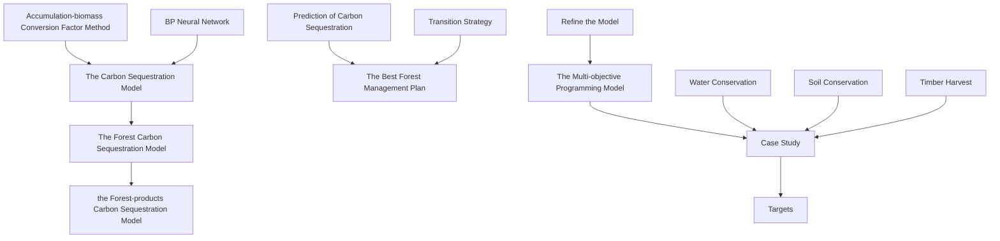
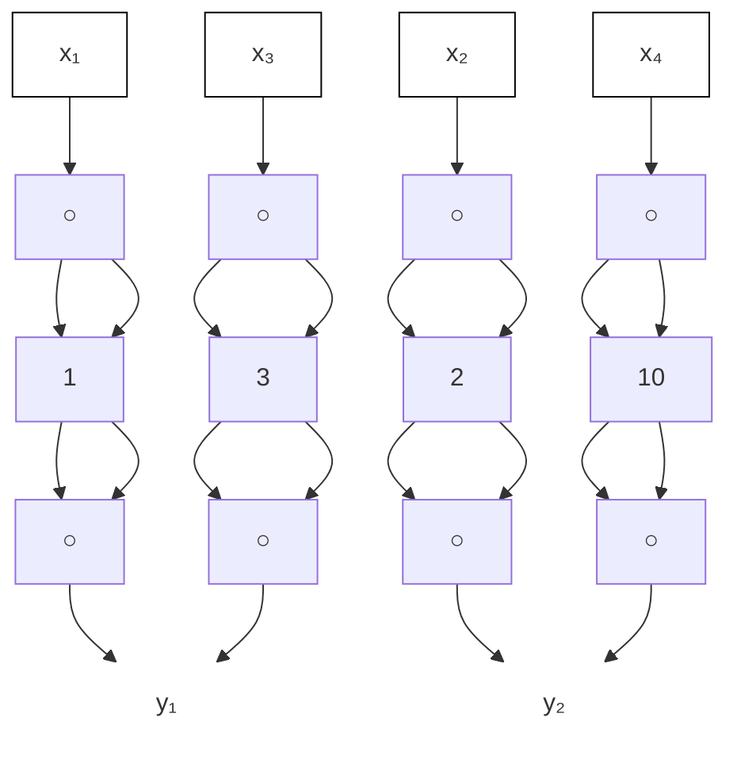

## Summary

The problem of global climate change has become more and more serious, and it has already posed a threat to human existence that cannot be ignored. The carbon sequestration function of forests, known as the "lungs of the earth", and their products, has a great impact on reducing the concentration of greenhouse gases and mitigating climate change. How to maximize the role of forests in mitigating climate change while taking into account other functions of forests is a question worthy of our consideration.

First, we established the carbon sequestration models of forests and their products based on their different carbon sequestration mechanisms. According to the results of the model, we found that the carbon sequestration in forest products is about one-fifth of the carbon sequestration in living forest plants, and forest products can sequester the carbon stored by themselves for almost the entire life cycle. Therefore, a forest management plan that includes an appropriate amount of deforestation should probably outperform a forest management plan that prohibits deforestation entirely in terms of carbon sequestration.

Second, we screened out the three functions that contributed the most to the value of forests through regression, including carbon sequestration, water conservation, and soil conservation. In order to maximize the value of forests, we target these three ecological functions and the economic function of wood harvesting, and establish a multi-objective programming model to provide decision-making assistance for forest managers to formulate management plans.

Third, we selected the Jindong Forest in China to predict the carbon sequestration of its forests and their products in the next 100 years after refining the first carbon sequestration model. The carbon storage of Jindong Forest in the next 100 years can reach 450.003Tg. Next, we developed a 5-stage management plan for the forest using the multi-objective programming model. In the next 100 years, the cumulative harvesting area of Jindong Forest will be 9343.32 ㎡, and the cumulative harvesting volume will be 2580341.86m³. We also explored how to transition from the status quo to the best management plan. Then, we wrote a newspaper article to justify harvesting as part of a best management plan for the Golden Cave Forest.

Ultimately, we analyze the strengths and weaknesses of our models.

Keywords: Carbon sequestration; Multi-objective programming; Forest management; Harvest

## Contents

## 1. Introduction

1.1 Background·······  
1.2 Problem Restatement ·······

## 2. Assumptions ···

## 3. Notations ··

## 4. The Carbon Sequestration Model···

4.1 Problem Analysis·········  
4.2 Establishment of a Forest Carbon Sequestration Model ··· ·3

4.2.1 The Carbon Sequestration Model·····  
4.2.2 Prediction Model of Forest Stock Volume Based on BP Neural Network Algorithm ··5

4.3 Establishment of a Forest-products Carbon Sequestration Model·········· 4.3 Establishment of a Forest-products Carbon Sequestration Model……...  
  
4.4 Analysis of the Forest Management Plan········ ·8

## 5. More than Carbon Sequestration····

5.1 Problem Analysis···········  
5.2 Target Selection········· ······8

5.3 Establishment of the Objective Function ········ ···········10

5.3.1 The Target of Carbon Sequestration····· ····10  
5.3.2 The Target of Water Conservation ······· ···········10  
5.3.3 The Target of Soil Conservation······ ········11  
5.3.4 The Target of Timber Harvest····· ····11  
5.3.5 The Establishment of the Overall Objective Function ···· ····11

5.4 The Establishment of Constraints ········· ···········12  
5.5 The Multi-objective Programming Model······· ··········13  
5.6 Model Analysis ····· ·····14

## 6. Case Study: Jindong Forest in China···· ····14

6.1 Prediction of Carbon Sequestration ·······  
6.2 The Best Forest Management Plan······ ····17

6.2.1 Assignment of Indicators······  
6.2.2 Model Solving ·····  
6.2.3 Result Analysis ········ ···········19

6.3 Transition Strategy·······

## 7. Model Evaluation ·· ····20

7.1 Strengths············· ············20  
7.2 Weaknesses·········

## 8. Newspaper article ····21

## References ··· ···23

## 1. Introduction

## 1.1 Background

Forests are an important resource for us to combat climate change, maintain biodiversity, entertain and gain economic benefits. The carbon sequestration process in which forests and forest products participate is an important way in which we reduce greenhouse gases in the atmosphere to tackle climate problems. It is necessary for us to treat forest resources prudently, rationally and efficiently.

## 1.2 Problem Restatement

We are required to do the following work:

R Build a carbon sequestration model of forests and their products, and based on the model, determine a forest management plan that is most conducive to carbon sequestration.  
R Build a decision-making model that does not only consider carbon sequestration. Forest management plans based on the model can maximize the value of the forest, consider whether to limit deforestation, and the transition point when applicable to all forests.  
R Apply the developed model to a specific forest, determine the amount of carbon sequestered by that forest and its products over the next 100 years, and develop an optimal forest management plan for that forest. Also consider ways to transition from the current situation to the best plan.  
R Combining the analysis and findings of Question 3, write a persuasive newspaper article explaining that harvesting is included in the best management plan for this forest, rather than strictly prohibiting harvesting.

flowchart

Figure 1: Our Approach

## 2. Assumptions

Assumption 1: We only consider the natural carbon sequestration of forests and their products, and do not consider their carbon sequestration in other specific ways through human involvement.

Because according to the data, the natural carbon sequestration of forests and their products is much greater than the latter, so the latter can be ignored without affecting the accuracy of the model too much

Assumption 2: We will ignore the influence of the extreme events.

Extreme weather events may have an impact on carbon sequestration in forests and their products. However, the probability of extreme weather events is low and the scope is relatively limited, so we ignore them so as not to affect the accuracy of the model too much.

Assumption 3: The statistic we captured from website are precise and reliable.

We collect most data from the authoritative websites, such as FAO, which we consider it trustworthy. Also, this is a premise under which our model is practical.

Other specific assumptions, if necessary, will be mentioned and illustrated while we’re establishing models.

## 3. Notations

For convenience, we introduce some notations below.

Table 1: Notations

<table><tr><td>Symbol</td><td>Meaning</td></tr><tr><td> $C(t)$ </td><td>carbon storage in forests in the t-th year (100 million t)</td></tr><tr><td> $G(t)$ </td><td>carbon stock of forest growth (100 million  $t \cdot a^{-1}$ )</td></tr><tr><td> $W(t)$ </td><td>carbon stocks from forest loss (100 million  $t \cdot a^{-1}$ )</td></tr><tr><td> $L(t)$ </td><td>carbon stocks from deforestation (100 million  $t \cdot a^{-1}$ )</td></tr><tr><td> $t$ </td><td>years</td></tr><tr><td> $C_{F}$ </td><td>forest carbon sequestration</td></tr><tr><td> $V_{F}$ </td><td>forest volume</td></tr><tr><td> $\alpha$ </td><td>conversion factor for understory vegetation carbon sequestration</td></tr><tr><td> $\beta$ </td><td>conversion factor for woodland carbon sequestration</td></tr><tr><td> $\delta$ </td><td>biomass expansion factor</td></tr><tr><td> $\rho$ </td><td>volume factor</td></tr><tr><td> $\gamma$ </td><td>carbon content rate</td></tr><tr><td> $Y_{T}$ </td><td>annual amount of wood harvested</td></tr><tr><td> $Y_{C}$ </td><td>annual carbon storage increment</td></tr><tr><td> $V_{i}(t)$ </td><td>the clear cutting stock of the i-th sub-compartment in the t-th year</td></tr><tr><td> $x_{i}(t)$ </td><td>In the t-th year, whether the i-th sub-compartment is harvested. It is 1 when it is harvested, and 0 when it is not harvested.</td></tr><tr><td> $GC_{i}(t)$  $Y_W$ </td><td>carbon storage of i-th sub-compartment at the end of the t-th yearannual water conservation increment</td></tr><tr><td> $GW_i(t)$ </td><td>water conservation of the i-th sub-compartment at the end of the t-th year</td></tr><tr><td> $Y_S$ </td><td>annual conservation soil increment</td></tr><tr><td> $GS_i(t)$ </td><td>soil conservation amount of the i-th sub-compartment at the end of the t-th year</td></tr><tr><td> $Z(t)$ </td><td>sum of forest stock growth in year t</td></tr><tr><td> $Age_i(t)$ </td><td>the average age of the i-th sub-compartment in the t-th year</td></tr><tr><td> $D_i(t)$ </td><td>average diameter at breast height of the i-th sub-compartment in the t-th year</td></tr><tr><td> $A_i(t)$ </td><td>the area that can be cleared in year t for the i-th class</td></tr><tr><td> $σ$ </td><td>fluctuation range of clear cutting stock in adjacent years</td></tr></table>

\*Other symbols are explained in detail in the text.

## 4. The Carbon Sequestration Model

## 4.1 Problem Analysis

We need to model the carbon sequestration of forests and their products. The mechanisms by which forests and wood forest products undergo carbon sequestration are different. Living plants in forests absorb carbon dioxide mainly through photosynthesis, sequestering carbon in vegetation and soil. Wood forest products mainly include logs, pulpwood, sawn timber, wood-based panels, etc. Their carbon sequestration process can be divided into two aspects. On the one hand, after harvesting, the carbon that has been sequestered in the original forest is transferred to wooden forest products, and carbon storage and emission reduction can be carried out throughout the life cycle. On the other hand, according to life cycle theory, wood has a much lower carbon footprint in the production process than other materials such as steel and concrete. That is, carbon sequestration and substitution effects are the main ways for wood forest products to participate in carbon sequestration. Due to the above differences, we established two carbon sequestration models for forest and wood forest products, respectively.

## 4.2 Establishment of a Forest Carbon Sequestration Model

## 4.2.1 The Carbon Sequestration Model

Taking into account the expansion and depletion due to natural or anthropogenic reasons, and anthropogenic deforestation of forests, the accounting formula for forest carbon sequestration can be abstracted into a theoretical model:

$$
C (t + 1) = C (t) + G (t) - W (t) - L (t) \tag {1}
$$

$$
C (t _ {0}) = C _ {0} \tag {2}
$$

From the FAO website[10], we obtained the data of the forest stock volume (100 million m³), forest expansion (100 million $\mathrm { m } ^ { 3 } \cdot a ^ { - 1 } )$ , forest deforestation (100 million $\mathrm { m } ^ { 3 } \cdot a ^ { - 1 } )$ and forest loss (100 million $\mathrm { m } ^ { 3 } \cdot a ^ { - 1 } )$ , with the time span from 1990 to 2020. We need to calculate the value of $C ( t ) , G ( t ) , W ( t ) , L ( t )$ respectively required by the above model according to the obtained data.

According to Reference[6], according to the stock volume conversion method, the accounting formula for forest carbon sequestration is:

Forest carbon sequestration

= Forest trees carbon sequestration + Understory vegetation carbon sequestration  
+ Woodland carbon sequestration  
= Forest volume × Expansion factor × Volume factor × Carbon content rate  
+ Conversion factor for understory vegetation carbon sequestration × Forest volume  
+ Conversion factor for woodland carbon sequestration × Forest volume  
Symbolically expressed as:

$$
C _ {F} = V _ {F} \delta \rho \gamma + \alpha V _ {F} \delta \rho \gamma + \beta V _ {F} \delta \rho \gamma \tag {3}
$$

$\alpha$ is the conversion factor for understory vegetation carbon sequestration, that ${ \mathrm { i s } } ,$ the carbon sequestration of understory plants (including litter) is calculated based on the biomass of forest trees. $\beta$ is the conversion factor for woodland carbon sequestration, that is, the forest land carbon sequestration is calculated based on forest biomass. $\delta$ is the biomass expansion factor, which is the coefficient of converting forest stock into biomass stock. $\rho$ is the coefficient that converts forest biomass accumulation into dry biomass. $\gamma$ is the coefficient of converting biomass dry weight into carbon sequestration, that is, the carbon content rate.

According to the Intergovernmental Panel on Climate Change (IPCC) default common values, $\alpha = 0 . 1 9 5 , \beta = 1 . 2 4 4 , \delta = 1 . 9 , \rho = 0 . 5 , \gamma = 0 . 5$ .

Substitute into the above formula to get:

$$
C _ {F} = V _ {F} \times 1. 9 \times 0. 5 \times 0. 5 + 0. 1 9 5 \left(V _ {F} \times 1. 9 \times 0. 5 \times 0. 5\right) + 0. 1. 2 4 4 \left(V _ {F} \times 1. 9 \times 0. 5 \times 0. 5\right) (4)
$$

$$
C _ {F} = 1. 1 5 8 V _ {F} \tag {5}
$$

We use EViews to perform forced regression analysis on the data, and the obtained equation has $\mathrm { R } ^ { 2 } = 0 . 6 0 2$ , Adjusted $\mathrm { R } ^ { 2 } = 0 . 5 5 6 ;$ F-Statistic=9.743, corresponding $\mathrm { S i g . } { = } 0 . 0 0 0$ . According to the goodness of fit and F-Statistic, the model is statistically significant. The model regression coefficients are as follows:

Table 2: Model regression coefficients

<table><tr><td></td><td>Coefficient</td><td>Std. Error</td><td>t-Statistic</td><td>Sig.</td><td>VIF</td></tr><tr><td>C(t)</td><td>0.974</td><td>0.107</td><td>9.081</td><td>0.000</td><td>23388.54</td></tr><tr><td>G(t)</td><td>0.344</td><td>0.598</td><td>0.575</td><td>0.570</td><td>443.88</td></tr><tr><td>W(t)</td><td>0.105</td><td>0.567</td><td>0.184</td><td>0.855</td><td>18009.52</td></tr><tr><td>L(t)</td><td>0.013</td><td>1.231</td><td>0.010</td><td>0.992</td><td>1590.45</td></tr></table>

It can be seen from the VIF value in the above table that the model has a serious collinearity problem. Therefore, we use the stepwise regression method to rebuild the model. The $\mathrm { R } ^ { 2 } \mathrm { o f }$ the new model is 0.566 , and the Adjusted $\mathrm { R } ^ { 2 } = 0 . 5 5 1$ ; F-Statistic=36.587, the corresponding $\mathrm { S i g . } { = } 0 . 0 0 0$ . The model passed the $\mathrm { F }$ test and the model was significant. The model coefficients obtained by the stepwise regression method are shown in the following table:

Table 3:Stepwise regression model coefficients

<table><tr><td></td><td>Coefficient</td><td>Std. Error</td><td>t-Statistic</td><td>Sig.</td><td>VIF</td></tr><tr><td>C(t)</td><td>0.999</td><td>0.001</td><td>1353.129</td><td>0.000</td><td>1.000</td></tr></table>

Therefore, our final calculation model for forest carbon sequestration is:

$$
C (t + 1) = 0. 9 9 9 C (t) \tag {6}
$$

## 4.2.2 Prediction Model of Forest Stock Volume Based on BP Neural Network Algorithm

## (1) BP neural network

BP neural network is a multi-layer feedforward network trained by error back-propagation. It uses gradient search technology to minimize the error mean square error between the actual output value and the expected output value of the network. BP neural network does not need to determine the mathematical equation of the mapping relationship between input and output in advance. It only learns certain rules through its own training, and obtains the result closest to the expected output value when the input value is given, which can approximate any nonlinear mapping relationship. Its structure includes input layer, hidden layer and output layer, as shown in Figure 2.

It can be seen from the above models that if we want to obtain C(t) and then C(t+1), the forest stock volume is the key indicator that we must obtain. The forest stock volume is the total volume of various standing trees in a certain area of forest. Many natural and geographical factors such as temperature, precipitation, soil, etc. are important factors that affect the forest volume. Specifically, photosynthetically active radiation PAR (mol/m2/day), relative humidity RH (%) and precipitation are important indicators to measure the sunlight and water necessary for forest growth, while soil factors such as soil type, soil Water content also plays an important role in plant growth. The size of forest stock also depends on tree age, and generally increases with tree age.

Therefore, based on the data of 9 forest ecosystem observation stations in Changbai Mountain, Beijing, Shennongjia, etc. in the past 10 years, we selects 6 indicators of temperature, photosynthetically active radiation, relative humidity, precipitation, tree age, and soil type as independent variable factor sets. A BP neural network model was constructed with 6 independent variables and 1 dependent variable (forest stock) to estimate forest stock. Since the input samples are 6-dimensional, the input layer has a total of 6 neurons.

## （2）Establishment of BP Neural Network Model

## ①Data preprocessing

Because the training samples of BP neural network are concentrated, if the absolute values of input and output sample parameters are too discrete or too concentrated, defects such as local error optimization or error oscillation are easy to occur in the process of approximating the error function of the weight matrix. Therefore, it is necessary to normalize the input and output. In addition, the normalization process can avoid the large and unimportant variables from masking the small but important variables, and can also ensure the convergence of the network.

First compress the resulting data in the range (0,1) using the formula below.

$$
X _ {i} = \frac {x _ {i} - x _ {\text {min}}}{x _ {\text {max}} - x _ {\text {min}}} \tag {7}
$$

We take the selected 6 indicators as input indicators and forest stock as output indicators. In order to predict and test the effect of the established neural network, the data is divided into two parts, one part of the data is used to build the model, and the other part of the data is used for outof-sample prediction and test.

② Selection of learning rate and expected parameters

The learning rate determines the amount of change in the weights produced by each loop training. A learning rate that is too large may lead to system instability, while a learning rate that is too small will result in a longer training time and a slow convergence rate, but it can ensure that the error value of the network tends to be minimized. Considering the training accuracy and training time of the specific network training, and at the same time ensuring that the system can be better predicted and the actual accuracy of the prediction is guaranteed, we set the number of network iterations epochs to 1000 times, the expected error goal to be 0.000001, and the learning rate lr is 0.05. After setting the parameters, start training the network.

③ Training results and confirmation

As shown in the figure below, obtained by training the obtained forest observation data, R=0.95833, the R value is close to 1, and the correlation is good.

flowchart

Figure 2: BP neural network structure

scatter plot

| Target | Output ~ 0.88*Target + 0.38 |
| ------ | --------------------------- |
| 0.5    | 1.0                         |
| 0.6    | 1.2                         |
| 0.7    | 1.4                         |
| 0.8    | 1.6                         |
| 0.9    | 1.8                         |
| 1.0    | 2.0                         |
| 1.1    | 2.2                         |
| 1.2    | 2.4                         |
| 1.3    | 2.6                         |
| 1.4    | 2.8                         |
| 1.5    | 3.0                         |
| 1.6    | 3.2                         |
| 1.7    | 3.4                         |
| 1.8    | 3.6                         |
| 1.9    | 3.8                         |
| 2.0    | 4.0                         |
| 2.1    | 4.2                         |
| 2.2    | 4.4                         |
| 2.3    | 4.6                         |
| 2.4    | 4.8                         |
| 2.5    | 5.0                         |
| 2.6    | 5.2                         |
| 2.7    | 5.4                         |
| 2.8    | 5.6                         |
| 2.9    | 5.8                         |
| 3.0    | 6.0                         |
| 3.1    | 6.2                         |
| 3.2    | 6.4                         |
| 3.3    | 6.6                         |
| 3.4    | 6.8                         |
| 3.5    | 7.0                         |
| 3.6    | 7.2                         |
| 3.7    | 7.4                         |
| 3.8    | 7.6                         |
| 3.9    | 7.8                         |
| 4.0    | 8.0                         |
| 4.1    | 8.2                         |
| 4.2    | 8.4                         |
| 4.3    | 8.6                         |
| 4.4    | 8.8                         |
| 4.5    | 9.0                         |
| 4.6    | 9.2                         |
| 4.7    | 9.4                         |
| 4.8    | 9.6                         |
| 4.9    | 9.8                         |
| 5.0    | 10.0                        |
| 5.1    | 10.2                        |
| 5.2    | 10.4                        |
| 5.3    | 10.6                        |
| 5.4    | 10.8                        |
| 5.5    | 11.0                        |

Figure 3: Training result

The mean squared error (MSE) is very sensitive to the extremely large or extremely small errors in a group of measurements, so the mean squared error can well reflect the measurement accuracy. Its calculation formula is as follows:

$$
\mathrm{MSE} = \frac {1}{\mathrm{m}} \sum_ {i = 1} ^ {m} (y _ {i} - \widehat {y} _ {i}) ^ {2} \tag {8}
$$

The experimental results show that the mean square error of network confirmation is 0.0508 in MSE calculated in MATLAB. The smaller mean square error indicates that the BP neural network model can simulate the forest stock volume well and estimate the forest stock volume.

## 4.3 Establishment of a Forest-products Carbon Sequestration Model

The terms of the Kyoto Protocol stipulate that carbon sources and carbon sinks associated with land-use change and forestry activities should be measured and reported in a transparent and verifiable manner. The stock-change approach (SCA), production approach (PA), and atmospheric-flow approach (AFA) can all meet the above requirements, so we consider these three methods to carry out the global-scale HWP carbon storage accounting of wood forest products.

The carbon storage of wood forest products refers to the amount of carbon stored in the entire life cycle to the final decay and decomposition. The calculation formula is:

$$
C = V \times F = V \times D \times R \tag {9}
$$

Where ?? is the carbon storage of wood forest products; ?? is the volume of wood forest products; ?? is the carbon exchange factor of wood forest products; ?? is the density of wood forest products; ?? represents carbon rate.

The stock-change approach is based on the changes in carbon stocks of wood forest products consumed within the country's boundary system, including changes in carbon stocks from harvesting, imports and exports, and the amount of carbon released from domestic consumption of wood forest products. The production approach is the change in the carbon storage of wood forest products produced in the wood-growing country, including the carbon storage of harvested wood and the carbon release of all wood forest products produced from wood. The measurement of carbon stocks is only related to the amount of wood harvested, and carbon emissions need to be measured in the producing country of wood forest products. The atmospheric-flow approach is the carbon flow between forest carbon pools and wood forest products carbon pools and the atmosphere, including the carbon storage of wood harvested within the country and the carbon release of consumption of wood forest products. According to the model principles of the three methods, as well as a large number of carbon pools and consumption data of wood forest products in various countries around the world, (cutting volume, production volume of wood forest products, import and export volume, etc., we obtained through FAO statistics, the use of wood forest products and garbage filling. Some data of buried forest products are missing), and the global carbon storage of wood forest products from 1990 to 2020 is obtained, as shown in Figure 4.

bar chart

| Year | atmospheric-flow approach(MtC) | production approach(MtC) | stock-change approach(MtC) |
| :--- | :--- | :--- | :--- |
| 2000 | 55 | 170 | 250 |
| 2010 | 72 | 182 | 268 |
| 2016 | 70 | 168 | 249 |
| 2018 | 68 | 182 | 238 |
| 2020 | 65 | 178 | 251 |

Figure 4: Comparison of the three methods

stacked bar chart

| Year | AFA(MtC) | Average(MtC) | PA(MtC) | SCA(MtC) |
|------|----------|--------------|---------|----------|
| 1990 | 75       | 180          | 250     | 300      |
| 2000 | 50       | 160          | 200     | 280      |
| 2010 | 60       | 170          | 180     | 260      |
| 2016 | 55       | 165          | 175     | 270      |
| 2018 | 45       | 155          | 170     | 265      |
| 2020 | 30       | 145          | 165     | 255      |

Figure 5: Average value

Based on the assumption that the country is self-sufficient and there is no import and export of wood products, the estimation results of the three methods should be consistent in theory. But in fact, considering the HWP carbon storage accounting on a global scale, there must be a large number of import and export trade of wood forest products. Therefore, as shown in the figure above, it is normal for the results of the three methods to be different. For the selection and application of methods, there is currently no clear international regulation on the uniform use of a certain accounting method or method. At the same time, because many countries have not directly tracked and measured the output and import and export trade data of various wood consumer products, the data is missing more seriously, which also affects the accuracy of the carbon storage of wood forest products to a certain extent. Therefore, we decided to use the average value to represent the final result, as shown in Figure 5.

## 4.4 Analysis of the Forest Management Plan

We get from the data that the carbon sequestration in wood forest products is about onefifth of the carbon sequestration in living forest plants, but wood forest products can sequester their own carbon for almost their entire life cycle. Therefore, a forest management plan that includes an appropriate amount of deforestation should outperform a forest management plan that completely bans deforestation in terms of carbon sequestration.

## 5. More than Carbon Sequestration

## 5.1 Problem Analysis

The function of forest is not only carbon sequestration, and the forest management plan that only considers the largest amount of carbon sequestration is definitely not the optimal forest management plan. Therefore, in this part of the analysis, we first regress the forest value and its various functions, and screen out the function that can maximize the forest value as the goal that the forest management plan should maximize. Based on this, a multi-objective planning model is established to provide decision-making assistance for forest management.

## 5.2 Target Selection

In addition to the obvious economic functional value of harvested wood, forests also have a strong functional value of ecosystem services. In order to further explore the influencing factors of value assessment, the forest ecosystem service function value assessment system is listed, as shown in the following table.

Table 4: The forest ecosystem service function value assessment system

<table><tr><td>Service function types</td><td>Specific contents</td></tr><tr><td>water conservation</td><td>regulate precipitation and evaporation, etc.</td></tr><tr><td>soil conservation</td><td>protect fertilizer, stabilize soil, etc.</td></tr><tr><td>carbon sequestration</td><td>sequester carbon, release oxygen, etc.</td></tr><tr><td>nutrient accumulation</td><td>accumulate elements like N, P, K, etc.</td></tr><tr><td>air purification</td><td>absorb  $SO_{2}$ , hold dust, eliminate pollution, etc.</td></tr><tr><td>biodiversity conservation</td><td>protect capital investment and opportunity cost, etc.</td></tr><tr><td>forest recreation</td><td>tourism income, investment, travel expenses, etc.</td></tr></table>

Some studies have pointed out that the natural logarithmic transformation of the value of forest ecosystem services can reduce the difference, volatility and asymmetry of the original data to a certain extent, thereby reducing the value offset and improving the fitting accuracy of the model. Based on this, the regression model we constructed is as follows:

$$
\ln y = u + b _ {\text {type}} \times X _ {\text {type}} + b _ {i} \times X _ {i} + v \tag {10}
$$

where y is logarithmic vector of values of forest ecosystem services, $X _ { \ t y p e }$ ?????? $X _ { i }$ are independent variable matrices; $b _ { t y p e }$ and $b _ { t y p e }$ are independent variable coefficient matrices; ?? and ?? are constant term and residual term respectively. Among the independent variables, ?? ???????? is the forest ecosystem service function type variable, $X _ { i }$ includes population variable, economic variable, and forest area variable. The variable coding and assignment of the model are shown in the following table.

Table 5:The variable coding and assignment of the model

<table><tr><td>Symbols</td><td>Variable Name</td><td>Average Value</td><td>Variance</td></tr><tr><td>Y</td><td>Forest System Service Value</td><td>10.67429</td><td>1.816411</td></tr><tr><td> $F_1$ </td><td>Water Conservation</td><td>0.928571</td><td>0.071429</td></tr><tr><td> $F_2$ </td><td>Soil Conservation</td><td>0.857143</td><td>0.131868</td></tr><tr><td> $F_3$ </td><td>Carbon Sequestration</td><td>0.642857</td><td>0.247253</td></tr><tr><td> $F_4$ </td><td>Nutrient Accumulation</td><td>0.571429</td><td>0.263736</td></tr><tr><td> $F_5$ </td><td>Air Purification</td><td>0.785714</td><td>0.181319</td></tr><tr><td> $F_6$ </td><td>Biodiversity Conservation</td><td>0.714286</td><td>0.219780</td></tr><tr><td> $F_7$ </td><td>Forest recreation</td><td>0.785714</td><td>0.181319</td></tr><tr><td> $X_1$ </td><td>Resident Population</td><td>5.471429</td><td>1.149890</td></tr><tr><td> $X_2$ </td><td>GDP per Capita</td><td>10.70714</td><td>0.702253</td></tr><tr><td> $X_3$ </td><td>Forest Area</td><td>12.32857</td><td>1.345275</td></tr></table>

Among them, Forest System Service Value, Resident Population, GDP per Capital and Forest Area are numeric variables. If the ecosystem service type is what the symbol Fi represents, the value is 1, otherwise it is 0.

The regression results are shown in the table below. We found that among the functional indicators for evaluating value, water conservation, soil conservation and carbon sequestration have a larger weight, exceeding 0.1, while the weights of other indicators are less than 0.1. Therefore, it can be considered that water conservation, soil conservation and carbon sequestration are more important in the forest service function, and we apply this result in the following multi-objective planning model.

Table 6: The regression results

<table><tr><td></td><td>coefficient</td><td>standard error</td><td>lower limit</td><td>upper limit</td></tr><tr><td>constant term u</td><td>0.059</td><td>0.076</td><td>-0.154</td><td>0.271</td></tr><tr><td>Water Conservation</td><td>0.105</td><td>0.083</td><td>-0.125</td><td>0.334</td></tr><tr><td>Soil Conservation</td><td>0.157</td><td>0.148</td><td>-0.253</td><td>0.567</td></tr><tr><td>Carbon Sequestration</td><td>0.112</td><td>0.054</td><td>-0.039</td><td>0.263</td></tr><tr><td>Nutrient Accumulation</td><td>-0.056</td><td>0.074</td><td>-0.262</td><td>0.149</td></tr><tr><td>Air Purification</td><td>0.015</td><td>0.051</td><td>-0.127</td><td>0.157</td></tr><tr><td>Biodiversity Conservation</td><td>-0.038</td><td>0.035</td><td>-0.135</td><td>0.058</td></tr><tr><td>Forest recreation</td><td>0.056</td><td>0.056</td><td>-0.098</td><td>0.211</td></tr><tr><td>Resident Population</td><td>-0.051</td><td>0.064</td><td>-0.228</td><td>0.126</td></tr><tr><td>GDP per Capita</td><td>0.068</td><td>0.035</td><td>-0.029</td><td>0.165</td></tr><tr><td>Forest Area</td><td>1.517</td><td>1.306</td><td>-2.11</td><td>5.143</td></tr><tr><td>constant term v</td><td>-3.863</td><td>6.935</td><td>-23.116</td><td>15.39</td></tr><tr><td> $R^2$ </td><td></td><td colspan="3">0.986</td></tr></table>

## 5.3 Establishment of the Objective Function

The results of the above regression analysis have given relatively more valuable forest management targets, and we further determine the objective functions accordingly. In forest management planning, sub-compartments are generally used as the smallest management unit.

## 5.3.1 The Target of Carbon Sequestration

As mentioned earlier, forests play an important role in carbon sequestration and in reducing greenhouse gas concentrations. Therefore, carbon sequestration should be considered as an important goal by forest managers. It can be obtained from the formula (3), and the calculation formula of carbon storage is as follows:

$$
G C = V _ {F} \delta \rho \gamma \tag {11}
$$

Therefore, for the target of carbon sequestration, we obtain the objective function as:

$$
\operatorname{MAX} Y _ {C} = \sum_ {i = 1} ^ {I} \left(G C _ {i} (t) \times \left(1 - x _ {i} (t)\right) - G C _ {i} (t - 1)\right) \tag {12}
$$

## 5.3.2 The Target of Water Conservation

Forests can intercept, absorb and store precipitation. Forests play an important role in increasing available water resources, purifying water quality and regulating runoff. When it needs to be explained, the water conservation target we choose mainly considers the role of forests in regulating water volume. Establish a formula for calculating the amount of adjusted water:

$$
G W = 1 0 \times S \times (P - E - H) \times F \tag {13}
$$

Among them, ???? refers to the water regulation function of the stand (m³/a); S refers to the area of the stand (ha); P is the measured precipitation outside the forest (mm/a); E is the measured evapotranspiration (mm/a); H is the measured rapid surface runoff (mm/a) of the stand, and the surface runoff can be approximately replaced by the forest water production; F is the correction coefficient of forest ecosystem services.

Therefore, for the target of water conservation, the objective function we get is:

$$
\operatorname{MAX} Y _ {W} = \sum_ {i = 1} ^ {I} \left(G W _ {i} (t) \times \left(1 - x _ {i} (t)\right) - G W _ {i} (t - 1)\right) \tag {14}
$$

## 5.3.3 The Target of Soil Conservation

Forests are important for soil conservation. The strong underground network of roots that forests form in the ground secures the soil, reduces soil erosion and prevents soil loss, which in turn reduces the loss of nutrients from the soil and prevents clogging of downstream watersheds. It should also be noted that the soil conservation target we adopted mainly refers to the amount of soil consolidating in the forest. The formula for calculating forest soil solidification is:

$$
G S = S \times (X _ {2} - X _ {1}) \times F \tag {15}
$$

Among them, ???? is the annual soil consolidation amount of the stand $( \mathrm { t } / \mathrm { a } ) ; S$ is the area of the stand (ha); $X _ { 2 }$ is the soil erosion modulus of non-forest land $( \mathsf { t } \cdot \mathsf { h m } ^ { - 2 } \cdot \mathsf { a } ^ { - 1 } ) ; X _ { 1 }$ is the soil erosion modulus of the measured forest stand $( \mathsf { t } \cdot \mathsf { h } \mathsf { m } ^ { - 2 } \cdot \mathsf { a } ^ { - 1 } )$ ; ?? is the correction index of forest ecosystem services.

Therefore, for the target of soil conservation, we obtain the objective function as:

$$
\operatorname{MAX} Y _ {S} = \sum_ {i = 1} ^ {I} \left(G S _ {i} (t) \times \left(1 - x _ {i} (t)\right) - G S _ {i} (t - 1)\right) \tag {16}
$$

## 5.3.4 The Target of Timber Harvest

Forests not only provide many of the above ecological services, but also provide us with wood. All kinds of forest products we need in our lives and a considerable part of the energy that developing countries need are realized by the wood provided by forests. The wood production function of forests is very important. Therefore, we also make wood-harvesting target one of our forest management goals.

Therefore, for the target of wood harvesting, we obtain the objective function as:

$$
\operatorname{MAX} Y _ {T} = \sum_ {i = 1} ^ {I} V _ {i} (t) \times x _ {i} (t) \tag {17}
$$

## 5.3.5 The Establishment of the Overall Objective Function

We take the linear weighted summation of the resulting four objective functions $( \mathrm { i } . \mathrm { e } . \ Y _ { C } , Y _ { W }$ , $Y _ { S }$ and $Y _ { T } )$ to get the overall objective function. In this process, we need to find the maximum and minimum values of the four objective functions respectively. We need to use the Min-max normalization method for each objective function to obtain $Y _ { C } ^ { \prime } , Y _ { W } ^ { \prime } , Y _ { S } ^ { \prime }$ and $Y _ { T } ^ { \prime }$ . The Min-max normalization formula is:

$$
Y _ {i} ^ {\prime} = \frac {Y _ {i} - Y _ {i m i n}}{Y _ {i m a x} - Y _ {i m i n}} \tag {18}
$$

Referring to the coefficients of the three indicators of carbon sequestration, water conservation, and soil conservation obtained by regression analysis in this chapter, and then using AHP to obtain the respective weights of the four objective functions: $\omega _ { 1 } = 0 . 1 2 3 , \omega _ { 2 } = 0 . 1 1 6 ,$ , $\omega _ { 3 } = 0 . 1 7 3 , \omega _ { 4 } = 0 . 5 8 8$ .

The overall objective function is obtained after linear weighted summation:

$$
\operatorname{MAX} Y = \omega_ {1} Y _ {C} ^ {\prime} + \omega_ {2} Y _ {W} ^ {\prime} + \omega_ {3} Y _ {S} ^ {\prime} + \omega_ {4} Y _ {T} ^ {\prime} \tag {19}
$$

## 5.4 The Establishment of Constraints

Constraints are as follows:

·The 0-1 value constraint on whether the i-th sub-compartment is harvested:

$$
x _ {i} (t) = 0, 1 \quad i = 1, 2, \dots \dots , I, t = 1, 2, \dots \dots , T \tag {20}
$$

·The clear-cutting method will cut down all mature trees in the felling area in a short period of time, so the clear-cutting method must be carefully and strictly controlled. Clear-cutting stock must be less than forest growth:

$$
\sum_ {i = 1} ^ {I} V _ {i} (t) \times x _ {i} (t) \leq Z (t) t = 1, 2, \dots \dots , T \tag {21}
$$

·Annual harvesting equilibrium constraint:

$$
(1 - \sigma) \sum_ {i = 1} ^ {I} V _ {i} (t - 1) \times x _ {i} (t - 1) \leq \sum_ {i = 1} ^ {I} V _ {i} (t) \times x _ {i} (t) \leq (1 + \sigma) \sum_ {i = 1} ^ {I} V _ {i} (t + 1) \times x _ {i} (t + 1) t = 1, 2, \ldots , T \tag {22}
$$

·The maximum continuous harvest area should be largely determined by the forest slope. This is also stipulated in the forest harvesting operation regulations of different countries. Suppose that the forest management plan we have developed uses clear cutting or strip clear cutting. The allowed harvesting methods under different conditions are shown in the following table:

Table 7: The allowed harvesting methods under different conditions

<table><tr><td rowspan="2">0°≤slope≤15°</td><td>Ai(t)&lt;20 ha</td><td>Clear cutting, strip clear cutting</td></tr><tr><td>Ai(t)≥20 ha</td><td>Strip clear cutting up to 20 ha</td></tr><tr><td rowspan="2">15°≤slope≤25°</td><td>Ai(t)&lt;10 ha</td><td>Clear cutting, strip clear cutting</td></tr><tr><td>Ai(t)≥10 ha</td><td>Strip clear cutting up to 10 ha</td></tr><tr><td rowspan="2">26°≤slope≤35°</td><td>Ai(t)&lt;5 ha</td><td>Clear cutting, strip clear cutting</td></tr><tr><td>Ai(t)≥5 ha</td><td>Strip clear cutting up to 5 ha</td></tr></table>

In addition, forests with limited soil erosion shall not be cleared.

Therefore, the maximum continuous cutting area constraint determined by each subcompartment according to the slope is:

$$
A _ {i} (t) x _ {i} (t) \leq A _ {i m a x} i = 1, 2, \dots \dots , I, t = 1, 2, \dots \dots , T \tag {23}
$$

·In order to prevent premature and excessive disturbance to young and middle-aged forests and hinder the cultivation of large-diameter timber, it is necessary to set minimum cutting age constraints and minimum cutting diameter at breast height constraints:

$$
A g e _ {i} (t) > A g e _ {\min} i = 1, 2, \dots \dots , I, t = 1, 2, \dots \dots , T \tag {24}
$$

$$
D _ {i} (t) > D _ {\text {min}} \quad i = 1, 2, \dots \dots , I, t = 1, 2, \dots \dots , T \tag {25}
$$

## 5.5 The Multi-objective Programming Model

In summary, we obtain a multi-objective planning model for forest management decisionmaking as follows:

The objective function:

$$
\operatorname{MAX} Y = \omega_ {1} Y _ {C} ^ {\prime} + \omega_ {2} Y _ {W} ^ {\prime} + \omega_ {3} Y _ {S} ^ {\prime} + \omega_ {4} Y _ {T} ^ {\prime} \tag {26}
$$

$$
\operatorname{MAX} Y _ {C} = \sum_ {i = 1} ^ {I} \left(G C _ {i} (t) \times \left(1 - x _ {i} (t)\right) - G C _ {i} (t - 1)\right) \tag {27}
$$

$$
\operatorname{MAX} Y _ {W} = \sum_ {i = 1} ^ {I} \left(G W _ {i} (t) \times \left(1 - x _ {i} (t)\right) - G W _ {i} (t - 1)\right) \tag {28}
$$

$$
\operatorname{MAX} Y _ {S} = \sum_ {i = 1} ^ {I} \left(G S _ {i} (t) \times \left(1 - x _ {i} (t)\right) - G S _ {i} (t - 1)\right) \tag {29}
$$

$$
\operatorname{MAX} Y _ {T} = \sum_ {i = 1} ^ {I} V _ {i} (t) \times x _ {i} (t) \tag {30}
$$

$$
Y _ {i} ^ {\prime} = \frac {Y _ {i} - Y _ {i m i n}}{Y _ {i m a x} - Y _ {i m i n}} i = C, W, S, T \tag {31}
$$

The constraints are:

$$
s. t. \left\{ \begin{array}{c} x _ {i} (t) = 0, 1 \quad i = 1, 2, \dots \dots , I, t = 1, 2, \dots \dots , T \\ \sum_ {i = 1} ^ {I} V _ {i} (t) \times x _ {i} (t) \leq Z (t) \quad t = 1, 2, \dots \dots , T \\ (1 - \sigma) \sum_ {i = 1} ^ {I} V _ {i} (t - 1) x _ {i} (t - 1) \leq \sum_ {i = 1} ^ {I} V _ {i} (t) x _ {i} (t) \leq (1 + \sigma) \sum_ {i = 1} ^ {I} V _ {i} (t + 1) x _ {i} (t + 1) \\ A _ {i} (t) x _ {i} (t) \leq A _ {i m a x} \quad i = 1, 2, \dots \dots , I, t = 1, 2, \dots \dots , T \\ A g e _ {i} (t) > A g e _ {m i n} \quad i = 1, 2, \dots \dots , I, t = 1, 2, \dots \dots , T \\ D _ {i} (t) > D _ {m i n} \quad i = 1, 2, \dots \dots , I, t = 1, 2, \dots \dots , T \end{array} \right. \tag {32}
$$

## 5.6 Model Analysis

The resulting multi-objective planning model can help forest managers develop management plans to maximize the role and value of forests. The resulting forest management plan can tell the forest manager the harvesting plan in a certain period of time, and the forest manager will also get the achievement of the four goals

From the weights of the four objective functions obtained, the wood harvesting objective is assigned the largest weight, which indicates that harvesting timber is an important way for forests to exert their economic value. In addition, combined with the previous analysis of this paper, forest products made from forest harvested wood are closely related to our lives, and they also have the functions of carbon sequestration, carbon emission substitution effect, etc. to reduce greenhouse gas emissions, so we believe that appropriate logging is Necessary, a complete ban on logging is neither feasible nor desirable. Our decision model enables forest managers to develop harvesting plans.

Both the external environmental characteristics of a particular forest and its own characteristics will affect the forest management plan derived from the model. On the one hand, the annual precipitation, evapotranspiration, soil erosion modulus of non-forest land, forest stock volume and other indicators are different in different forest areas, which will affect the carbon sequestration, water conservation, soil conservation and timber acquisition functions of forests. It will affect the objective function in the model. On the other hand, the differences in indicators such as woodland slope of different forests will also affect the constraints of the model. After substituting the specific index parameters of different forests into the model, different forest management plans will be obtained.

## 6. Case Study: Jindong Forest in China

Jindong Forest is located in Jindong District, Yongzhou City, Hunan Province, China. It is located in the middle subtropical southeast monsoon humid climate. According to the information[9], the total forest area is 635 square kilometers, and the forest stock volume is 2.68 million cubic meters. The vegetation distribution of the forest belongs to the evergreen broadleaved forest area, and artificial vegetation occupies the main position. In terms of topography, the woodland slope is steep, with an average slope of 34 degrees. In terms of climate, the annual average temperature in the area is 16.3-17.7°C, the average annual sunshine time is 159.9 hours, the average annual precipitation is 1600-1900mm, and the annual evaporation is about 1225mm. The soil is soft and well ventilated.

## 6.1 Prediction of Carbon Sequestration

We directly applied the model of the first question to the Jindong Forest, and found that the model is suitable for short-term prediction of carbon storage in forests around the world, and has universal applicability, but the accuracy of the long-term prediction of carbon storage in a specific forest is not quite enough.

Therefore, we refine the model again for long-term prediction of the carbon sequestration of Jindong Forest.

The estimation of forest biomass carbon storage and carbon density (the method used in Model 1 above) adopts the accumulation-biomass conversion factor method, with basic wood density, biomass conversion factor, underground/above biomass ratio, etc. as the main parameters, convert the arbor forest accumulation per unit area into biomass per unit area, and then calculate its carbon density through the biomass carbon content rate, and calculate the carbon storage combined with the area. The basic formula is:

$$
D _ {C} = V \times D \times B E F \times (1 + R) \times C _ {F} \tag {33}
$$

$$
C = A \times D _ {C} \tag {34}
$$

In the formula, $D _ { C }$ is the forest biomass carbon density $( \mathrm { t } \ \mathrm { t m } ^ { - 2 } ) , C$ is carbon stock (t), ?? is forest volume per unit area $( \mathbf { m } ^ { 3 } \cdot \mathbf { h m } ^ { - 2 } )$ , ?? is basic wood density $( \mathrm { t } \ \mathrm { m } ^ { 3 } )$ , ?????? is the ratio of aboveground biomass to trunk biomass, ?? is the ratio of forest belowground biomass to aboveground biomass, ???? is forest biomass carbon content $( \mathrm { ~ t ~ } \mathfrak { t } ^ { - 1 } )$ .

We selected the Jindong forest and collected the carbon measurement parameters of the main dominant tree species (groups) in each forest age group. The data are mainly from the Ninth Forest Resources Inventory (2014-2018) in China and the State Forestry Administration.

In our attempt to estimate the carbon sequestration of Jindong Forest over the next 100 years, we first need to predict the future forest area. Here we find the forest area of the Ninth Forest Resources Inventory, and assume that the existing forest area will remain unchanged in the future, while taking into account the newly added area in the future. According to the area of undeveloped forest land, forest land without standing trees and suitable forest land in the inventory results, we figure out future new afforestation data in the province. Assuming that the proportion of Jindong Forest in the province's forest area will remain unchanged in the future, all provinces and autonomous regions will complete all afforestation in 2050, and the proportion of afforestation area in each year will be the same. We averagely divided the area of each dominant tree species (group) in each age group of the ninth forest resources inventory by an age class every 5 years, combined with the renewal cutting cycle of different dominant tree species (group), and assumed that the area of each age class (j) within the same age group is equal:

$$
A _ {i, j, t} = A _ {i, t} \times \frac {5}{\left(T _ {i , m a x} - T _ {i , m i n}\right) + 1} \tag {35}
$$

In the formula, $A _ { i , t }$ is the area of age group ?? in year ?? in base year $( 2 0 1 0 ) ( \mathrm { h m } ^ { 2 } ) , A _ { i , j , t }$ is the area of the j-th age class subdivided by the i-th age group in the t-th year $( \mathrm { h } \mathrm { m } ^ { 2 } )$ . Predict the area of each age group after every 5 years with a time step of 5 years. After 5 years, the area of $A _ { i , j , t }$ in the i-th age group enters the (i+1)-th age group, and the (i-1)-th age group has The area of $A _ { i - 1 , k , t }$ enters into the i-th age group .

Therefore:

$$
A _ {i, t + 5} = A _ {i, t} - A _ {i, j, t} + A _ {i - 1, k, t} \tag {36}
$$

In the formula, $A _ { i , t + 5 }$ is the area of age group ?? in year $t + 5 ( \mathrm { h m } ^ { 2 } ) , A _ { i - 1 , k , t }$ is Area of age class ?? subdivided by age group ?? − 1 in year $t ( \mathrm { h m } ^ { 2 } )$ .

Finally, by establishing the correlation between forest accumulation per unit area and forest age, the changes in the forest accumulation per unit area in future time periods are predicted. According to the "Technical Regulations for Continuous Inventory of National Forest Resources" (State Forestry Administration), the division and renewal cycle of tree species (groups), the median age of the forest age group represents the average age of the age group (the average age of the overmature forest is The forest age is set to 1.5 times the lower limit of the forest age). Using the statistical data of accumulation per unit area of each dominant tree species (group) divided by age group from the results of the eighth and ninth national forest resources continuous inventory, The Logistic growth equation was used to fit the correlation between the stock accumulation per unit area and the average stand age, namely:

$$
V = \frac {u}{1 + v \times e ^ {(- w t)}} \tag {37}
$$

In the formula, V and t are the accumulation per unit area and average age of a certain tree species (group) of a certain age class, u is the maximum tree growth parameter, v is the parameter related to the initial value; w is the parameter of the maximum growth rate of the tree species. The fitting effect of the equation is good, and the $\mathbf { R } ^ { 2 }$ is above 0.95, which means that the trend of the accumulation per unit area of the forest with the age of the forest can be accurately quantified. The fitted Logistic growth equation was used to calculate the changes of forest accumulation per unit area in the next 100 years, and the accumulation-biomass conversion factor method was used to calculate the forest biomass carbon density and carbon storage in each future period. The result obtained is as follows.

Table 8: Prediction of forest carbon storage and carbon density

<table><tr><td rowspan="2">Year</td><td colspan="2">Plantation</td><td colspan="2">Natural forest</td><td colspan="2">New afforestation</td><td colspan="2">Total</td></tr><tr><td>C/Tg</td><td> $D_{c}/(Mg\ \mathrm{hm}^{-2})$ </td><td>C/Tg</td><td> $D_{c}/(Mg\ \mathrm{hm}^{-2})$ </td><td>C/Tg</td><td> $D_{c}/(Mg\ \mathrm{hm}^{-2})$ </td><td>C/Tg</td><td> $D_{c}/(Mg\ \mathrm{hm}^{-2})$ </td></tr><tr><td>2020</td><td>17.404</td><td>23.24</td><td>223.323</td><td>64.01</td><td>—</td><td>—</td><td>240.727</td><td>56.80</td></tr><tr><td>2030</td><td>21.589</td><td>28.80</td><td>260.613</td><td>75.02</td><td>2.014</td><td>11.53</td><td>284.216</td><td>64.62</td></tr><tr><td>2040</td><td>23.551</td><td>31.35</td><td>293.900</td><td>85.06</td><td>5.994</td><td>17.16</td><td>323.446</td><td>71.00</td></tr><tr><td>2050</td><td>24.083</td><td>31.98</td><td>321.184</td><td>93.51</td><td>11.794</td><td>22.50</td><td>357.061</td><td>75.78</td></tr><tr><td>2060</td><td>24.695</td><td>32.71</td><td>341.168</td><td>99.94</td><td>17.056</td><td>32.54</td><td>382.918</td><td>81.60</td></tr><tr><td>2070</td><td>26.009</td><td>34.77</td><td>359.314</td><td>106.24</td><td>17.963</td><td>40.55</td><td>403.285</td><td>86.74</td></tr><tr><td>2080</td><td>27.196</td><td>36.79</td><td>375.719</td><td>112.40</td><td>18.783</td><td>42.90</td><td>421.697</td><td>91.77</td></tr><tr><td>2090</td><td>27.730</td><td>38.59</td><td>383.102</td><td>117.91</td><td>19.152</td><td>45.00</td><td>429.984</td><td>96.27</td></tr><tr><td>2100</td><td>28.359</td><td>39.90</td><td>391.783</td><td>121.91</td><td>19.586</td><td>46.53</td><td>439.727</td><td>99.54</td></tr><tr><td>2110</td><td>28.790</td><td>40.70</td><td>397.748</td><td>124.35</td><td>19.885</td><td>47.46</td><td>446.422</td><td>101.53</td></tr><tr><td>2120</td><td>29.021</td><td>41.11</td><td>400.939</td><td>125.60</td><td>20.044</td><td>47.94</td><td>450.003</td><td>102.55</td></tr></table>

At this time, the Jindong forest carbon storage in the next 100 years under the simulated harvesting situation is shown in Figure 6 below. The estimation of the carbon storage of wood forest products is to use the mean value method for AFA, PA and SCA, and the obtained results are also fitted by the Logistic equation. The carbon storage of Jindong forest wood products in the next 100 years under simulated harvesting conditions is shown in Figure 7 below.

bar-line hybrid chart

| Year | Forest carbon stock (Tg) | Carbon density (Mg·hm^(-2)) |
|------|---------------------------|------------------------------|
| 2020 | 240                       | 60                           |
| 2040 | 300                       | 80                           |
| 2060 | 350                       | 90                           |
| 2080 | 400                       | 100                          |
| 2100 | 450                       | 110                          |
| 2120 | 475                       | 115                          |

Figure 6: The Jindong forest carbon storage in the next 100 years under the simulated harvesting situation

line chart

| Year | Carbon stocks of wood forest products (Tg) | Forest carbon stock (Tg) |
|------|---------------------------------------------|--------------------------|
| 2020 | 50                                          | 240                      |
| 2040 | 60                                          | 320                      |
| 2060 | 70                                          | 380                      |
| 2080 | 80                                          | 420                      |
| 2100 | 85                                          | 440                      |
| 2120 | 90                                          | 450                      |

Figure 7: The carbon storage of Jindong forest wood products in the next 100 years under simulated harvesting conditions

## 6.2 The Best Forest Management Plan

We apply the model obtained in Section 5.5 to the selected case to obtain the best forest management plan.

## 6.2.1 Assignment of Indicators

The forest stock volume is predicted by the formula (37).

According to the available information mentioned in this chapter, the annual precipitation is 1800mm, the evapotranspiration is 1225mm, and the forest water yield is estimated by the method in the literature[1] based on the existing stand area and stand sectional area data.

The soil erosion modulus of non-forest land was taken as 319.8t∙hm-2∙a-1, and the soil erosion amount of forest land was estimated by the method in the literature[1] based on the existing stand area and stand sectional area data.

The yield rate is 0.65.

## 6.2.2 Model Solving

Knowing that there are 425 sub-compartments in this forest, we have formulated a forest management plan for the next 5 stages for the Jindong Forest in a 20-year period. We use the LINGO software to solve the model. The results obtained after sorting are shown in the following chart:

Table 9: Model solution results

<table><tr><td>Stage of Planning</td><td>Harvested Area( $m^2$ )</td><td>Harvested Stock Volume( $m^3$ )</td></tr><tr><td>The  $1^{st}$  stage (2021-2040)</td><td>1874.52</td><td>488081.46</td></tr><tr><td>The  $2^{nd}$  stage (2041-2060)</td><td>2417.18</td><td>688584.66</td></tr><tr><td>The  $3^{rd}$  stage (2061-2080)</td><td>2320.72</td><td>690005.92</td></tr><tr><td>The  $4^{th}$  stage (2081-2100)</td><td>105.08</td><td>31639.62</td></tr><tr><td>The  $5^{th}$  stage (2101-2120)</td><td>2625.82</td><td>682030.20</td></tr><tr><td>Total</td><td>9343.32</td><td>2580341.86</td></tr></table>

line chart

| Period     | Harvested Area(m²) | Harvested Stock Volume(m³) |
| ---------- | ------------------ | -------------------------- |
| 2010-2040  | 1850               | 500000                     |
| 2041-2060  | 2450               | 650000                     |
| 2061-2080  | 2350               | 650000                     |
| 2081-2100  | 100                | 50000                      |
| 2101-2120  | 2650               | 700000                     |

Figure 8: Results of the harvested area and the harvested stock volume

During this 100-year planning period, the harvesting plan we obtained shows that the cumulative harvesting area is 9,343.32 ㎡, and the cumulative harvesting volume is 2,580,341.86 m³. We can see that the first and fourth stages of the planning period have relatively low harvests. This may be because in the first stage, many sub-compartments have not reached the harvesting age, while in the fourth stage, most of the sub-compartments have been harvested, and the renewed stands have not yet reached the harvesting age. The harvesting volume in the remaining stages is roughly balanced.

Next, analyze the achievement of each goal:

Table 10: Analysis of the achievement of each goal

<table><tr><td>Stage of Planning</td><td>Carbon sequestration increment(t)</td><td>Water conservation increment(t)</td><td>Soil conservation increment(t)</td><td>Timber output( $m^3$ )</td></tr><tr><td>The  $1^{st}$  stage (2021-2040)</td><td>37218.66</td><td>17956.04</td><td>61.38</td><td>317332.92</td></tr><tr><td>The  $2^{nd}$  stage (2041-2060)</td><td>26862.24</td><td>12547.92</td><td>16.50</td><td>447580.02</td></tr><tr><td>The  $3^{rd}$  stage (2061-2080)</td><td>30462.16</td><td>15638.62</td><td>233.50</td><td>448503.84</td></tr><tr><td>The 4thstage(2081-2100)</td><td>176461.02</td><td>103198.38</td><td>7855.02</td><td>20645.78</td></tr><tr><td>The 5thstage(2101-2120)</td><td>18046.24</td><td>24135.06</td><td>1345.52</td><td>443644.58</td></tr><tr><td>Total</td><td>289050.32</td><td>173476.02</td><td>9511.92</td><td>1677707.14</td></tr></table>

bar-line hybrid chart

| Period | Carbon sequestration increment(t) | Water conservation increment(t) | Soil conservation increment(t) | Timber output(m³) |
| :--- | :---: | :---: | :---: | :---: |
| 2010-2040 | 38000 | 18000 | 0 | 320000 |
| 2041-2060 | 27000 | 13000 | 0 | 450000 |
| 2061-2080 | 31000 | 16000 | 0 | 450000 |
| 2081-2100 | 178000 | 103000 | 6000 | 25000 |
| 2101-2120 | 19000 | 24000 | 1500 | 480000 |

Figure 9: Degree of achievement of goals

According to the results of the model, in the 100-year planning period, the forest can achieve 289,050.32 tons of carbon storage increment, 173,476.02 tons of water conservation increment, 9,511.92 tons of soil conservation increment and 1,677,707.14 cubic meters of wood harvest. The model can give the forest management plan under the condition of better realization of the goal. In addition, it can be found that the change trend of the increment of carbon sequestration, the increment of water conservation, and the increment of soil conservation is opposite to that of the cutting volume, and the change trend of the timber harvest is the same as that of the cutting volume, which is in line with the actual situation. This is also a reflection of the rationality of our model.

## 6.2.3 Result Analysis

The model can obtain a scientific and reasonable forest management plan in a long planning period, and can provide help for forest managers in formulating harvesting plans. Moreover, the forest management plan obtained according to the model can achieve the required goals in a balanced manner.

## 6.3 Transition Strategy

We use the model to solve the best management plan for the forest, but the reality is often not the best. For example, the optimal harvesting cycle for a forest is 10 years longer than the current cycle, in which case we need to consider how to gradually transition to the optimal harvesting cycle.

The main component of the annual forest harvesting volume is the main cutting volume, which is the harvesting and utilization of mature forest stands. The main cutting methods of forest are divided into three categories: clear cutting, gradual cutting and selective cutting. As mentioned earlier, clear cutting must be carefully and strictly controlled. Selective felling refers to the repeated felling of mature trees with certain characteristics on a regular basis. There are always trees of various ages on the forest land, and the amount of selective felling also accounts for a large proportion of the main felling. The period of selective cutting and the intensity of selective cutting are the main parameters that determine the annual amount of selective cutting and then the total amount of forest cutting.

The intensity of selective cutting is the proportion of the volume of selective cutting to the original standing volume. Generally, the intensity of selective cutting should not be greater than 40% of the pre-cutting forest volume. For forest stands that are prone to wind down and natural dead trees after felling, the selective felling intensity should be appropriately reduced. The selective cutting cycle is the interval between two selective cutting operations on the same forest land. The greater the selective cutting intensity, the longer the selective cutting cycle, and the smaller the selective cutting intensity, the shorter the selective cutting cycle. Therefore, in view of the fact that the optimal logging period is 10 years longer than the actual logging period, the logging intensity can be appropriately reduced to ensure that the overall logging amount of the forest is relatively reasonable. At the same time, the harvesting period should be gradually shortened, and the harvesting intensity should be adjusted until the optimal harvesting period is reached.

## 7. Model Evaluation

## 7.1 Strengths

R We used the collected data on global forests to build the carbon sequestration model, and the resulting model has certain applicability.  
R We used a variety of methods to model carbon sequestration of forest products, which are beneficial for improving accuracy.  
R We improved model accuracy by considering the carbon sequestration of forests and their products separately, depending on their characteristics.  
R When determining the weights of the four objectives in the multi-objective programming model, we comprehensively considered the regression coefficients and combine the AHP method, which reduces the subjectivity and realizes the combination of the subjective and the objective.  
R Our models allow forest managers to develop detailed, long-term harvesting plans.

## 7.2 Weaknesses

R We ignored some real-life factors that might have an impact on forest carbon sequestration, such as pests, fires, extreme weather, etc., which can be improved in follow-up research.  
R The forest management plan we have formulated mainly provides a reference for forest managers to make decisions on their logging plans. In practice, there are more forest management measures that can be studied.

## 8. Newspaper article

## Your Common Sense May Be Wrong, Deforestation Is Beneficial

There are more than 50,000 people living in the 635 square kilometers of Jindong Forest. In this lush forest, there are more than 1,500 species of plants and more than 200 species of animals. For the people who live here, Jindong Forest is the home they rely on to survive. There is no doubt that people want to protect the forest and maximize its value, but do you think not cutting down any trees is the best way to protect this forest? If yes, then you are wrong.

natural_image

Scenic river flowing through lush green forest, no visible text or symbols

## Wood Products May Be More Environmentally Friendly

You probably know that forests sequester carbon, which holds carbon dioxide in vegetation or soil, but as the forest dies naturally, the carbon it has sequestered may be released again, and as the trees age, the sequestration of the forest increases. Carbon capacity may also decline. In fact, in addition to living plants, wood products such as furniture, wood, and paper also have a carbon sequestration effect, and some wood products may have a longer lifespan and thus have a better carbon sequestration effect. Moreover, wood is a reusable resource, 1 ton of carbon dioxide is fixed per 1 cubic meter of wood, and more use of wood products will help reduce global carbon dioxide.

## Deforestation Contributes to the Growth of Forest Area

Forests can provide us with the wood we need to generate economic value, and the existence of economic benefits and needs motivates people to better manage forests and expand forest planting areas. In addition, the high economic value of forests encourages people to return farmland to forests, thereby expanding the forest area. And in fact, trees are growing much faster than they are being harvested. Taking the United States as an example, from 2000 to 2010, the annual storage of wood in temperate and boreal forests increased by 1.29 billion cubic meters, which is enough to build 58 million new two-story wood-frame houses each year, while the global new house is only 36 million units per year. The same is true for the Jindong Forest. Reasonable logging will not lead to the reduction of the forest area at all.

natural_image

Stacked logs in a snowy forest with bare trees and distant hills (no text or symbols visible)

## Deforestation Promotes Forest Growth

Like the wildlife that lives here, trees are competing for resources, with shorter trees being shaded by taller trees and not getting enough sunlight. Trees initially grow close to each other, but over time they tend to sparse as they need space to keep growing their roots in search of nutrients. Therefore, scientific and rational logging can provide better growth space and growth environment for new trees, thereby increasing the growth rate of forests, and can also prevent and reduce pests and forest fires caused by natural forest deaths.

## Results of No Deforestation

Let's imagine what would happen if none of the trees in Jindong Forest Farm were cut down at all?

First of all, the forest will not bring any direct economic output, the income of many people will be greatly reduced, and the economic development here will be seriously affected. Second, because many mature trees died naturally without being felled, the carbon dioxide they originally sequestered was released again, and the total carbon sequestration of the forest did not increase but instead decreased. Moreover, the competition for resources among trees in the forest is becoming more and more serious, and many young trees will not grow well because they do not get enough sunlight and do not have enough room to grow. In addition, due to the lack of scientific management, this forest will be more threatened by pests and fires.

This is of course not the result we want to see, so in order to avoid the above situation, appropriate and reasonable logging is necessary.

## References

[1] Yolasiğmaz H A. The concept and the implementation of forest ecosystem management (a case study of Artvin Planning Unit) [J]. Karadeniz Technical University Faculty of Forestry, 2004.  
[2] Han Xuchao, Zhao Jin, Li Shunlong. Accounting of forest carbon sequestration and evaluation of carbon sequestration potential in Longjiang Forest Industrial Forest Region [J]. Forestry Economic Issues, 2016,36(05):434-438+461.DOI:10.16832 /j.cnki.1005- 9709.2016.05.009.  
[3] Vanessa K.S. Boukili, Daniel P. Bebber , Tegan Mortimer , Gitte Venicxa, David Lefcourt , Mark Chandler , Cristina Eisenberga .Assessing the performance of urban forest carbon sequestration models using direct measurements of tree growth [J]. Urban Forestry & Urban Greening,2017.  
[4] C.-L. Chenga, M.J. Gragga, E. Perfect , M.D. White , P.J. Lemiszki , L.D. McKay. Sensitivity of injection costs to input petrophysical parameters in numerical geologic carbon sequestration models [J]. International Journal of Greenhouse Gas Control,2013.  
[5]Zhang Ying, Wu Lili, Su Fan, Yang Zhigeng. Research on the measurement model of forest carbon sink accounting in my country[J].Journal of Beijing Forestry University,2010,32(02):194- 200.DOI:10.13332/j.1000-1522.2010.02.037 .  
[6]Li Shunlong. Research on forest carbon sink problem[M]. Harbin: Northeast Forestry University Press. 2006: 100-101.  
[7] Liu Shuai. Estimation of forest stock volume based on BP neural network [D]. Zhejiang Agriculture and Forestry University, 2014.  
[8] Cun Yonghu, Wang Dechang, Zhang Zhikun, Yang Qiang, Cun Dezhi, Guo Dayu, Zhao Guoliang. Calculation and change analysis of forest carbon sequestration in Dehong Prefecture from 2016 to 2019 [J]. Green Science and Technology, 2020(22):261 - 263.DOI:10.16663/j.cnki.lskj.2020.22.085.  
[9] http://www.hnforestry.gov.cn/listinfo.aspx?ID=117611  
[10] https://fra-data.fao.org/WO/fra2020/extentOfForest/