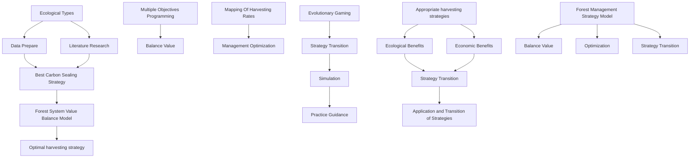
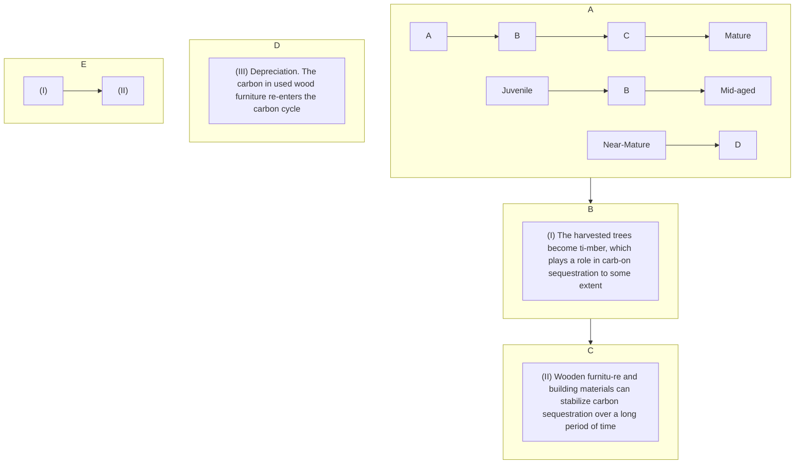
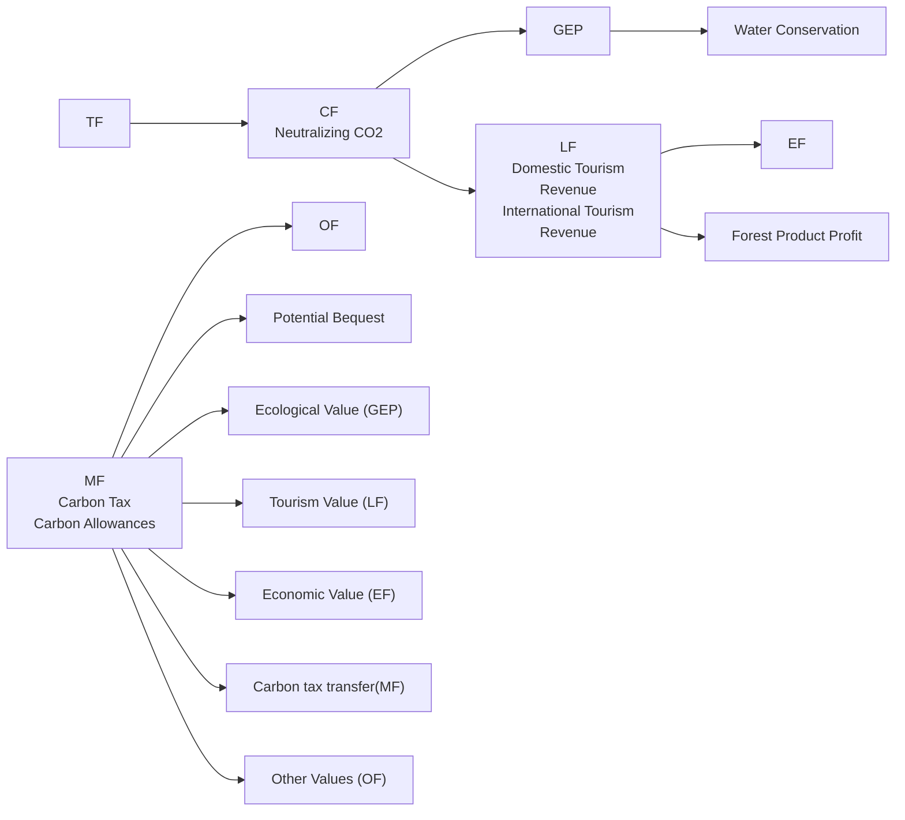
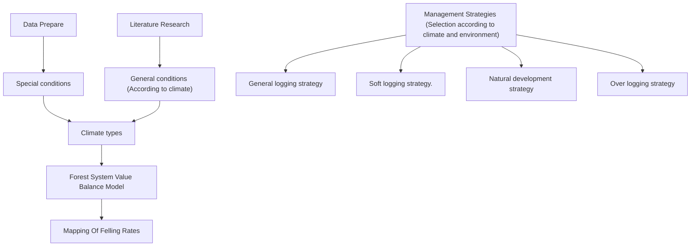
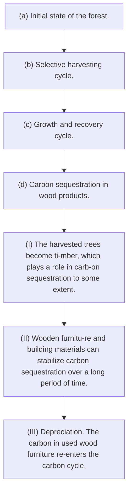

# Letting "Carbon" Stay: Forest Management for Ecological-Economic Balance in the Perspective of Carbon Sequestration

Summary

Forests play an important role in both nature and human society. In the context of "carbon peaking and carbon neutral", how to balance the economic and ecological values of forests has become an academic focus. We used differential equations, multi-objective planning, evolutionary games and simulation to find scientific management strategies for forests in different climates and to guide practice and development.

First, we constructed a forest carbon sequestration model. Based on the differential equation, we investigated the carbon sequestration level under different forest management strategies, taking into account the forest area, tree age, climate environment, wood use and depreciation, and found that moderate harvesting helps to increase the carbon sequestration of the whole system. In addition, we simulated the adjustment of the harvesting rate to find the best forest management strategy for carbon sequestration and calculated that $\mu _ { c } = 0 . 6 2$ .

Second, in order to balance the multiple values such as economic value and ecological value of the forest system, we constructed six value systems based on the TEV model. Based on this, we constructed a value system balance model using multivariate objectives programming and solved the maximum total forest ecosystem value (TTF) with the help of simulated annealing (SA) algorithm. Thus, the optimal benefit is achieved with balancing the interests of multiple parties, and the TTF is obtained from the experiment in northern China category: 27283\~40924.5\$/km2/year.

Third, the development of scientific forest management strategies is necessary to achieve the balance and optimum of forest values. The inverse mapping function is constructed based on the value system balance model to analyze the optimal forest management strategy under the corresponding state. Forest management strategies for general and special conditions are developed based on 4 medium forest harvesting strategies simulated for each of the 4 major types of climatic environments. We used a subtropical forest in China as an example, and validated that the 100-year $C O ^ { 2 }$ uptake for a harvest rate of 41.5% \~ 55% for near-mature trees and 80% for mature trees is found to be 442.2 \~ 820.8????.

Finally, the problem of adaptation to the transition phase of the optimal forest management strategy is addressed. This paper introduced game theory to complement the model and used an evolutionary game approach to explore the behavioral decisions of forest managers. Moderate deforestation is found to be the optimal outcome that satisfies the demand sensitivity of all parties. The simulation approach is then used to enable the above strategy to be validated in a variety of forest environments.

In conclusion, moderate harvesting of forests is the optimal solution to enhance their ecological and economic values. Extending the harvesting cycle will help the current recovery of over-harvested forests. However, it should be noted that for polar regions we still need to prohibit logging in order to protect them well.

Keywords:Differential Equations ; Multiple Objective Planning ; TEV ; Evolutionary Game

## Contents

## 1 Introduction .....

1.1 Problem Background .3  
1.2 Restatement of the Problem and Our works. . (  
1.3 Literature Review..  
1.4 Our Work.

## 2 Assumptions & Reasonals ..

## 3 Notations .....

## 4 Whole Process Carbon Sequestration Model for Trees.......

4.1 Tree Age Stage Classification Model. 6  
4.2 Forest Ecology Model.  
4.3 Whole Process Forest Wood Model . 8  
4.4 Steady-state Equilibrium Model . 9  
4.5 Total Carbon Sequestration Measurement Model. .10

## 5 Forest System Value Balance Model ........

5.1 TEV: Multiple Value Systems Within and Outside the Forest System ..... 11  
5.2 Value Balance Planning Model . 14  
5.3 SA : Solution of Multivariate Objective Programming .15

## 6 Forest Management Strategy Model. .15

6.1 Mapping Model of Felling Rate.. .16  
6.2 Management Strategies and Climate Types . .16  
6.3 Example of Subtropical Forest Management and Decision Making ...... ..18

## 7 Demand-sensitive Management Strategy Game ............. .....19

7.1 The Game of Forest Management Strategies..... .19  
7.2 Evolutionary game simulation for managing plan transitions ..20

## 8 Sensitivity Analysis...... ..21

## 9 Model Evaluation and Further Discussion.... .21

9.1 Strengths .21  
9.2 Weaknesses . .21  
9.3 Further Discussion .21

## 10 Conclusion...... .21

References .... .22

## 11 Forest Carbon Sequestration Science Articles ....... .22

## Appendix ....... .25

## 1 Introduction

## 1.1 Problem Background

Climate change is one of the central issues in international public affairs. Reduction of greenhouse gases is important. Carbon sequestration is considered as an effective method to reduce emissions [1]. Carbon sequestration is the safe capture and storage of carbon in the air [2]. Forests are an effective way to sequester carbon [3]. Forests and forest products are affected by the climatic environment and human disturbances [4]. It has been argued that scientific harvest management can improve the carbon sequestration capacity of forest systems. However, forest managers often need to balance ecological, economic and social values when making decisions.

## 1.2 Restatement of the Problem and Our works.

Considering the information identified in the problem statement, we need to address the following questions and perform the following tasks

C Develop a carbon sequestration model to quantify the amount of carbon sequestration in forests and their products, and use this model to design the most effective carbon-sequestration forest management plans.  
Build a decision model to help forest managers choose the best forest management plan and balance multiple value objectives. The model needs to consider the coverage of forest management plans, discuss the conditions under which forests will not be cut down, transition points between forest management plans, and characteristics of forests in different locations in the world regarding transition points of management plans.  
Apply the model practically to all kinds of forests, identify and select the forest that should adopts a forest management plan that includes a harvesting plan. Project carbon sequestration 100 years from now, identify the best forest management plan and argue its rationale, and develop a transition strategy that takes into account the sensitivity of forest managers' needs.  
Write a non-technical essay explaining the need for deforestation and convincing local residents that our management plan is the best decision to develop the forest.

## 1.3 Literature Review

Forests play a crucial role in the carbon cycle [5,6]. According to the Kyoto Protocol and the United Nations Framework Convention on Climate Change (UNFCCC), carbon sequestration in forest ecosystems makes carbon management a promising solution to combat climate change [7,8]. The use of forest resources has entered the stage of multi-value sustainable use of managed forests [9,10]. Currently, maintaining and enhancing carbon sinks and carbon storage (CSS) in forest ecosystems is becoming a fundamental goal of sustainable forest management [10]. Adaptive silvicultural practices, such as reducing intensive harvesting, may be one of the strategies to increase the long-term CSS of ecosystem HWP [11,12]. It has been suggested that the carbon sink capacity of planted forests can be maximized by extending crop rotation and taking appropriate measures [13].

## 1.4 Our Work


<details>
<summary>flowchart</summary>


</details>

Figue 1: The structure and process of the full text modeling

## 2 Assumptions & Reasonals

C There are no large emergencies in forest ecology. Large-scale emergencies are stochastic in nature and cannot be modeled. Therefore the effects of natural disasters, such as sudden mudslides, forest fires, pests and diseases, and volcanic eruptions, are not considered.  
C The forest areas involved are all operable in terms of management. Some remote forests that cannot be used by human activities are outside the scope of this model. This is because it is neither "economic" nor "environmentally friendly" to manage them.  
⚫ All wood produced by the forest is fully accessible to the market. According to Say's law, in a free market, the total demand of society is always equal to the total supply . Our model defaults to all timber being available for sale.

## 3 Notations

The key mathematical notations used in this paper are listed in Table 1.

Table 1: Notations used in this paper

<table><tr><td>Symbol</td><td>Description</td><td>Unit</td></tr><tr><td>s(i)</td><td>Carbon sequestration by trees in the i stage</td><td>Ktons</td></tr><tr><td> $\beta$ </td><td>Carbon fixation factor</td><td>Unit</td></tr><tr><td>x(i)</td><td>Area of forest in the i stage</td><td>Km $^{2}$ </td></tr><tr><td>λ</td><td>Growth factor</td><td>Unit</td></tr><tr><td>ρ(i)</td><td>Natural rate of death in the i stage</td><td>Unit</td></tr><tr><td>μ(i)</td><td>Deforestation rate in the i stage</td><td>Unit</td></tr><tr><td>φ</td><td>Carbon transfer coefficient</td><td>Unit</td></tr><tr><td>ψ</td><td>Carbon tax price</td><td>$/ton</td></tr><tr><td>ξ</td><td>Biodiversity coefficient</td><td>Unit</td></tr><tr><td>R</td><td>Rhizome ratio</td><td>Unit</td></tr></table>

Where we define the main parameters while specific value of those parameters will be given later.

## 4 Whole Process Carbon Sequestration Model for Trees.

In order to construct a full-cycle carbon sequestration model for forest trees, two system levels need to be considered: the forest carbon flow system and the wood product carbon flow system. For the forest system, we need to consider the age of trees, their carbon sequestration capacity, natural growth rate and natural mortality rate under different geographical and environmental conditions. For the wood products carbon flow system, we need to consider the efficiency of wood utilization, the depreciation rate and the end-of-life time of the products.

We developed a differential equation-based decision optimization model for the sustainable development of the forest, which takes into account the regeneration continuity and the optimal carbon dioxide sequestration in the forest, so as to achieve the highest level of carbon sequestration for both native ecological and economic products under the premise of "sustainable development" of the forest. In the process of analysis, we use the Volterra model and expand the original model by using the tree growth environment, the environmental and economic values of forest products and the cutting plan of the forest to balance the harvesting strategy with the restoration strategy and the selection of high-quality and low-quality products, and finally solve the differential equation to calculate the CO2 sequestration of the whole system under different cutting conditions.


<details>
<summary>flowchart</summary>

```mermaid
graph TD
  A["Environment"] --> B["Forest Carbon Flow System"]
  C["Ecology"] --> B
  D["Documents"] --> E["Wooden Material Carbon Flow System"]
  B --> F["Forest Age Stage Classification Model"]
  B --> G["Forest Environment Model"]
  H["CSC Incoming"] --> I["Steady-state equilibrium model [Differential equation models"] f(s₃,s₄,S_c:t)=0,t∈R]
  I --> J["Total Carbon sequestration measurement model [Based on Standard carbon fixation level"] β₀ = 25kton/km²(CO₂)]
  J --> K["*CSC:Carbon sequestration capacity"]
  L["Age class"] --> M["CSC"]
  N["Growth rate"] --> O["Mortality rate"]
  P["Utilization efficiency"] --> Q["Depreciation rates"]
```
</details>

Figue 2: Whole process carbon sequestration model

When the above two systems reach steady-state equilibrium, the total carbon sequestration of the two systems is calculated by referring to the standard unit area of forest land sequestration level, and the sum is the carbon sequestration level of the whole process of forest trees.

## 4.1 Tree Age Stage Classification Model

Different types of trees have different growth cycles and rotation periods, which are analyzed through the papers of the biological model of trees, while the species of trees are different and the geographical variability is significant. Therefore models need to be constructed to deal with this relationship.

Generally, the growth stages of trees are divided into four stages: young stage, middle stage, near-mature stage, and mature stage. In order to make the model more universal and robust, we fuzzify the years of tree growth and construct the following tree age stage division model with one growth stage of the tree as the minimum time unit t. (It is known from consulting the data that each growth stage of most exploited forest trees is about 10-15 years and the whole life cycle is 40-60 years).


<details>
<summary>pyramid chart</summary>

| Stage | Percentage |
|-------|----------|
| A     | 10-15 Years |
| B     | 10-15 Years |
| C     | 10-15 Years |
| D     | 10-15 Years |
| E     | 0.01%    |
</details>

Figue 3: Tree age stage classification

For plantations, the over-ripe stage accounts for almost a small percentage due to the presence of management and can be ignored. For natural stands, the number of trees in the mature stage is limited by competition due to the presence of natural competition, and again the proportion is small and negligible. The model was constructed for four age stages, A, B, C, and D.

The trees in stages A and B are in the fast growth stage and the timber stock is small, so cutting will not bring more economic value, so it is assumed not to harvest trees in stages A and B here. For stage C trees, moderate harvesting can be done, and for stage D, more harvesting can be done.

## 4.2 Forest Ecology Model

## 4.2.1 Climate Impact on Forests

The growth rate and natural mortality of trees are related to the climate and environment in which they live. Drawing on the regularization of the world's major forest area categories in the literature study published by Derrahmane Ameray et al. in 2021, we visualized the forest area characteristics, climatic characteristics of the three major categories and derived the growth coefficient λ and natural mortality rate ?? differently in different forest area types through a comprehensive assessment, as shown in the following Table.


<table><tr><td colspan="4">Boreal Forest</td></tr><tr><td>Coordinates</td><td>53°59′N,105°7′W</td><td>Max.leaf area index</td><td>3×3</td></tr><tr><td>Nearest town</td><td>Prince Albert, Canada</td><td>Average canopy height(m)</td><td>9</td></tr><tr><td>Forest type</td><td>Evergreen coniferous</td><td>Basal area( $m^{2}ha^{-1}$ )</td><td>31×5</td></tr></table>

<table><tr><td>Parameters</td></tr><tr><td> $\lambda_a = 0.87$ </td></tr><tr><td> $\lambda_b = 0.2$ </td></tr><tr><td> $\rho = 0.05$ </td></tr></table>

<table><tr><td colspan="4">Temperate Forest</td></tr><tr><td>Coordinates</td><td>35°57′N,84°17′W</td><td>Max.leaf area index</td><td>4×9</td></tr><tr><td>Nearest town</td><td>Oak Ridge, USA</td><td>Average canopy height(m)</td><td>26</td></tr><tr><td>Forest type</td><td>Winter deciduous broadleaved</td><td>Basal area( $m^{2}ha^{-1}$ )</td><td>20×1</td></tr></table>

<table><tr><td>Parameters</td></tr><tr><td> $\lambda_a = 0.81$ </td></tr><tr><td> $\lambda_b = 0.24$ </td></tr><tr><td> $\rho = 0.07$ </td></tr></table>

<table><tr><td colspan="4">Tropical Forest</td></tr><tr><td>Coordinates</td><td>2°35′S,50°06′W</td><td>Max.leaf area index</td><td>5-6</td></tr><tr><td>Nearest town</td><td>Manaus, Brazil</td><td>Average canopy height(m)</td><td>30</td></tr><tr><td>Forest type</td><td>Evergreen broadleaf terra firme</td><td>Basal area( $m^{2}ha^{-1}$ )</td><td>29</td></tr></table>

<table><tr><td>Parameters</td></tr><tr><td> $\lambda_a = 0.91$ </td></tr><tr><td> $\lambda_b = 0.29$ </td></tr><tr><td> $\rho = 0.08$ </td></tr></table>

Figue 4: Basic information of the three major forest species

## 4.2.2 General Forest Properties

In order to make the model usable and robust even in the absence of data, the attributes of the forest in general state are measured. The percentage of each tree age stage in the natural forest. Checking the relevant data, we know that the retention rate of saplings growing to maturity in the forest is 85%. The natural mortality rate at each stage can be set as ?? and can be set to $( 1 - \rho ) ^ { 3 } = 8 5 \%$ . It can be obtained that $\rho$ is approximately equal to 5%. Set up the equation:

$$
\sum_ {i = 1} ^ {4} (1 - \rho) ^ {i - 1} x _ {0} = 1 \tag {1}
$$

The percentage of trees in their natural state at each age stage can be calculated from Equa tion (1). For each tree age, the carbon sequestration level was set. The carbon sequestration level of larch plantation in northern China measured by Jia Yanlong based on CO2FIX model was set as $2 5 k t o n / k m ^ { 2 }$ . Meanwhile, the carbon sequestration level of different tree ages was weighted according to the CO2FIX measurement method, and the summary results are as follows table.

Table 2: Carbon fixation coefficient value

<table><tr><td>Forest age class (A,B,C,D)</td><td>Percent (ρ = 0.05)</td><td>Carbon sequestration level β0 = 25kton/km2(CO2)</td></tr><tr><td>(A)Juvenile</td><td>27.0%</td><td>β1 = β0 × 0.3 = 7.5kton/km2</td></tr><tr><td>(B)Mid-age</td><td>25.6%</td><td>β2 = β0 × 0.6 = 15kton/km2</td></tr><tr><td>(C)Near-Maturity</td><td>24.3%</td><td>β3 = β0 × 0.9 = 22.5kton/km2</td></tr><tr><td>(D)Mature age</td><td>23.1%</td><td>β4 = β0 × 1.2 = 30kton/km2</td></tr></table>

## 4.3 Whole Process Forest Wood Model

For the wood of the forest, it can be divided into two parts:


<details>
<summary>flowchart</summary>


</details>

Figue 4: Whole process forest wood

Forest trees and wood products. Both of these parts have carbon sequestration. In order to study the flow of carbon in both parts, the following flow chart of the whole process of forest wood was drawn. The first part, forest carbon sequestration: the model is divided according to the age stage by rasterizing and classifying the area of trees in each age stage of the forest. The specific process is shown in Fig. The second part, wood carbon sequestration, wood is processed, used and finally scrapped.

## 4.4 Steady-state Equilibrium Model

For the forest carbon sequestration system: set $X _ { i }$ to be the $\mathrm { a r e a } ( \mathrm { k m } ^ { 2 } )$ of trees in growth stage i and $\beta _ { i }$ to be the ecological carbon sequestration per square kilometer of trees in age stage i. The constraints and parameters to be considered are as follows:

a) Limitations on the quantity of each tree age.  
b) The maximum area stock ?? of tree age stages cannot exceed the maximum value in the natural state and at the same time will not exceed the area of its previous tree age stages. Constraints were set for $N _ { 3 } , \ N _ { 4 }$ as follows:

$$
s. t. \left\{ \begin{array}{l} N _ {3} = (1 - \rho) x _ {2} = (1 - \rho) ^ {2} x _ {1} ^ {\prime} \\ N _ {4} = (1 - \rho) x _ {3} = (1 - \rho) s _ {3} / \beta_ {3} \end{array} \right. \tag {2}
$$

c) Introduction of growth rate and natural mortality. The parameters lam and rou were introduced to take into account the variability in age, geography and climate. The parameters $\lambda$ and $\rho$ were introduced. is the growth rate. $\rho$ is the natural mortality rate. The values are taken according to the forest ecological model constructed above.  
d) Set the carbon sequestration coefficient $\beta$ . For the wood carbon sequestration system, the following limitations were assumed:

Wood conversion rate, from trees to wood is 90%:  
Depreciation rate of wood products, set the average depreciation of all types of wood products 20% when scrapped, then can be calculated for each tree age stage (about 10-15 years) wood products average depreciation of about 10%.

$$
80 \% = (1 - \rho) ^ {1 t \sim 2 t} \tag{3}
$$

Using the modified Volterra model, we construct a set of differential equations for the amount of carbon sequestered by trees and wood products at stage C age and stage D age. The equations (4) are as follows:

$$
\left\{ \begin{array}{l} \frac {d s _ {3}}{d t} = \beta_ {3} \left[ \lambda_ {a} x _ {3} \left(1 - \frac {x _ {3}}{N _ {3}}\right) - \mu_ {a} x _ {3} \right] \\ \frac {d s _ {4}}{d t} = \beta_ {4} \left[ \lambda_ {b} x _ {4} \left(1 - \frac {x _ {4}}{N _ {4}}\right) - \mu_ {b} x _ {4} \right] \\ \frac {d S _ {c}}{d t} = \delta \times \left(\beta_ {3} \mu_ {a} x _ {3} + \beta_ {4} \mu_ {b} x _ {4}\right) - \tau S _ {c} \end{array} \right. \quad \left\{ \begin{array}{l} \frac {d s _ {3}}{d t} = \lambda_ {a} s _ {3} \left(1 - \frac {s _ {3}}{\beta_ {3} N _ {3}}\right) - \mu_ {a} s _ {3} \\ \frac {d s _ {4}}{d t} = \lambda_ {b} s _ {4} \left(1 - \frac {s _ {4}}{\beta_ {4} N _ {4}}\right) - \mu_ {b} s _ {4} \\ \frac {d S _ {c}}{d t} = \delta \times \left(\mu_ {a} s _ {3} + \mu_ {b} s _ {4}\right) - \tau S _ {c} \end{array} \right. \tag {4}
$$

$$
N _ {3} = (1 - \rho) x _ {2} = (1 - \rho) ^ {2} x _ {1} ^ {\prime}
$$

$$
N _ {4} = (1 - \rho) x _ {3} = (1 - \rho) s _ {3} / \beta_ {3}
$$

(a)

$$
s. t. \left\{ \begin{array}{l} N _ {3} = (1 - \rho) x _ {2} = (1 - \rho) ^ {2} x _ {1} ^ {\prime} \\ N _ {4} = (1 - \rho) x _ {3} = (1 - \rho) s _ {3} / \beta_ {3} \end{array} \right.
$$

(b)

The initial state of the area of each tree stage is set as the area distribution in the natural state, and the initial amount of carbon sequestered by wood products is 0. The equation is solved with the help of Scipy. Let the solution of the differential equation ob tained be $f \left( { { s } _ { 3 } } , { { s } _ { 4 } } , { { S } _ { c } } { : t } \right) = 0 , t \in R$ .

## 4.5 Total Carbon Sequestration Measurement Model

Referring to the above setting, the following formula can be derived:

$$
S = s _ {1} + s _ {2} + s _ {3} + s _ {4} + S _ {c}
$$

$$
s. t. \left\{ \begin{array}{l} s _ {1} = \beta_ {1} x _ {1} \\ s _ {2} = \beta_ {2} x _ {2} \\ s _ {3,} s _ {4}, S _ {c} = \{(s _ {3}, s _ {4}, S _ {c}): f (s _ {3}, s _ {4}, S _ {c}: t) = 0, t \in R \} \end{array} \right. \tag {5}
$$

The model was experimented with a larch plantation ecosystem in northern China by taking a $1 0 0 k m ^ { 2 }$ area stand in natural state, and the trees' carbon sequestration capacity beta referred to the settings in the tree age stage classification model. The total amount of carbon sequestered when the system reached stability was calculated in three ways, respectively.

Experiment with the model. Taking the $1 0 0 k m ^ { 2 }$ area of larch plantation ecosystem in northern China as an example, the tree carbon sequestration capacity $\beta$ refers to the setting in the tree age stage division model. The total amount of carbon sequestration when the system reaches stability is calculated in the following three ways：

a) Moderate deforestation and exploitation of forests. When the forest is reasonably felled, take $\mu _ { a } = 0 . 3 , ~ \mu _ { b } ~ = 1$ . The total carbon sequestration of the system S=1360.3 kilotons of carbon dioxide.  
b) No deforestation of the forest. When there is no harvesting of any age stage of the forest, i.e., $\mu _ { a } = \mu _ { b } = 0$ , the solution yields the amount of carbon sequestered by the system at stabilization S=1242.7 kt $\mathrm { C O } _ { 2 }$ .  
c) Excessive deforestation in general. $\mu _ { a } = 0 . 6 , \mu _ { b } = 1 , \mathrm { S } = 1 1 2 3 . 6$ kilotons of $\mathrm { C O } _ { 2 } .$ .

Kton(????2)

(a)

Kton(???? )

(b)

Kton(???? )

(c)

µa = 0, µb = 0

—µa = 0.3, µb = 1

—µa = 0.6, µh = 1

Based on a model of forest age classificationTime phase Carbon sequestration level

The carbon sequestration system reaches a relatively steady -state s tage , where the amount of carbon sequestered by each subject be-gins to vary little or not at all.

(a)Moderate deforestation. Mature trees are cut down. Only 30% of nearly mature trees are cut.

(b)No logging of the forest, the forest grows naturally.

No logging of the forest, the fore(c)Over-harvesting. 60% of all tst grows naturally. rees near mature age were harv-harvested.

Figue 5: Simulation of harvesting strategies under three values of

Note: Simulations were performed with 100 ????2of forest in its natural state. t indicates the number of tree age stages experienced.

The analysis of the figure shows that. First, at the beginning of the system, any degree of deforestation will lead to a small decrease in the amount of carbon sequestered by the system, and then the amount of carbon sequestered will be increased in a short period of time. Second, when the system reaches equilibrium: (a) moderate harvesting of forest land helps to increase the total carbon sequestration; (b) no harvesting of forest will not change the carbon sequestration of forest; (c) excessive harvesting of forest land will lead to a decrease in the total carbon sequestration.

Based on the above analysis, the system was simulated separately for different $\mu _ { a }$ to calculate the carbon sequestration level under each C tree felling rate, and the final results are shown in Fig 6.


<details>
<summary>line chart</summary>

| Stage | Description                                      | Value     |
|-------|-------------------------------------------------|-----------|
| Stage 1 | Increased cutting rate.                            | 0%~25%    |
| Stage 1 | Increased carbon sequestration.                   |           |
| Stage 2 | Increase cutting rate.                             | 30%~50%   |
| Stage 2 | No change in carbon sequestration.                |           |
| Stage 3 | Increased cutting rate.                            | 55%~100%  |
| Stage 3 | Reduced carbon sequestration.                    |           |
</details>

Figue 6: Carbon sequestration levels of forest trees under different values

From the above figure, it can be seen that the optimal level of carbon sequestration is reached when the felling rate is about 37.48% for trees of category C age.

## 5 Forest System Value Balance Model

TEV model proposed by American economist and environmentalist A Freeman in 2022. We use the idea of TEV model to measure the multiple benefits of forest ecosystem through multi-objective planning (MOP), and use Python to simulate differential equations, SA optimization algorithm and game theory to solve the model, so as to get Pareto solution, which is the better strategy after measuring the interests of all parties.

## 5.1 TEV: Multiple Value Systems Within and Outside the Forest System

Total forest ecosystem values can be roughly divided into six categories: output values (EF), carbon tax transfer (MF), tourism values (LF), ecological values (GEP), biomass values (CF), and other values (OF). Among them, the ecological value has a more complete accounting system and values in the academic community, so we will not repeat them here.


<details>
<summary>flowchart</summary>


</details>

Figue 7: The value composition system of TTF

## 5.1.1 Output Value (EF)

We confine the output value of forest trees to the market purchase and sale of forest products, and take up the previous section on the harvesting of forest resources to establish the following set of equations:

$$
E F = \sum_ {0} ^ {t} (\mu_ {a t} x _ {3 t} + \mu_ {b t} x _ {4 t}) \overline {{P}} _ {t} \tag {6}
$$

Consider the fluctuation of timber prices with time and market conditions. where $P _ { t }$ is the average of the market purchase and sale prices of timber in period ??. Based on the actual situation in felling, we constrain the equation as follows:

$$
\mu_ {a t} x _ {3 t} + \mu_ {b t} x _ {4 t} <   X _ {\text { total }} \tag {7}
$$

## 5.1.2 Carbon Tax Transfer (MF)

The World Bank gives value transfers to areas that maintain forest ecology to absorb carbon.. The following is how the carbon tax value is calculated:

In the first step, the carbon dioxide uptake capacity of the forest system is analyzed. The carbon dioxide uptake per unit time t is given by the equation :

$$
\Delta S _ {\text { Absorb }} = \Delta s _ {1} + \Delta s _ {2} + \Delta s _ {3} + \Delta s _ {4} + \Delta S _ {\text { Output }} \tag {8}
$$

When the system enters steady state, there are limits:

$$
\{\Delta s _ {1} = 0; \Delta s _ {2} = 0; \Delta s _ {3} = 0; \Delta s _ {4} = 0 \} \tag {9}
$$

The formula (8) can be simplified as:

$$
\Delta S _ {\text { Absorb }} = \Delta S _ {\text { Output }} = \tau S _ {c} \tag {10}
$$

In the second step, we economically compensate the forest land according to the objectives depicted in Copenhagen Accord. Due to the inconsistency of carbon trading and carbon tax policies in each country, we adopt a fuzzy treatment and estimate the amount of carbon sequestered on forest land in the previous paper based on the following equation：

$$
M F = \psi \sum_ {0} ^ {t} \Delta S _ {\text { Absorb }} \tag {11}
$$

$\varDelta S _ { A b s o r b }$ is the carbon sequestration on forest land in period ?? of the first problem; $\psi$ is the price per tonne for carbon trading, the specific values are shown below (for some countries) By weighting the recent U.S. carbon price, $\scriptstyle \psi = 5 1 . 2 \ S / \tan \left( \mathbf { C O } _ { 2 } \right)$ , and checking the recent news in 2022, we know that the $\mathrm { C O } _ { 2 }$ price in the U.S. carbon trading market is about 50\$/ton, which means the calculation is verified.

• Average world carbon tax price of 60\$  
• World carbon trading (ETS) average price of 2\$  
The 2022 Carbon Price Corridor

2020 Talking Price Price Corridor:

Recommendations from the World Bank's 2017 High Level Committee on Carbon Prices report.

## Figue 8: Carbon price trends by country

## 5.1.3 Biomass Value Equation (CF)

For the establishment of the biomass value equation, we mainly examine the aggregation of the biomass value of the forest ecology itself. We borrowed the TEV model and set up the following equation for forest ecology as follows.

$$
T E V = \varphi \sum_ {t = 1} ^ {n} S _ {t} \cdot D _ {t} \cdot B E F _ {t} \cdot (1 + R) \tag {12}
$$

In the equation, BEF is the conversion factor of stand biomass to wood volume, and the reference value of IPCC biomass expansion factor (BEF) is shown below.

Table 3: BEF value range of different forest species

<table><tr><td rowspan="2">Climate zone</td><td rowspan="2">Forest type</td><td colspan="2">BEF</td></tr><tr><td>Average</td><td>Scope</td></tr><tr><td rowspan="2">Tropical</td><td>Pine</td><td>1.3</td><td>1.2~4.0</td></tr><tr><td>Broad-leaved</td><td>3.4</td><td>2.0~9.0</td></tr><tr><td rowspan="2">Temperate</td><td>Spruce</td><td>1.3</td><td>1.15~4.2</td></tr><tr><td>Pine</td><td>1.3</td><td>1.15~3.4</td></tr><tr><td rowspan="3">Cold</td><td>Broad-leaved</td><td>1.4</td><td>1.15~3.2</td></tr><tr><td>Coniferous</td><td>1.35</td><td>1.15~3.8</td></tr><tr><td>Broad-leaved</td><td>1.3</td><td>1.15~4.2</td></tr></table>

$\varphi$ is the carbon transfer coefficient in the TEV model, which generally takes the value of 0.5.  
 $S _ { t }$ is the area of the stand at period t, while C is the stand density at period t.  
 ?? is the root-to-stem ratio, which is assigned a value of roughly 0.42 in the IPCC.

The above equation constitutes the biomass of the forest ecosystem in the area, and the following equation is constructed to account for the biomass value based on the market value method and analogy method. Where $P _ { t }$ can refer to the price per ton of dry wood.

$$
C F = \frac {\overline {{P}} _ {t} T V E}{2} \tag {13}
$$

## 5.1.4 Tourism Value (LF)

Tourism values are mostly divided into human and natural values, and forests are mainly dominated by natural values. The indicators for measuring tourism value vary from place to place, and here the indicators in the literature by Nino Fonseca et al. are used and extended to link tourism value with related factors to construct the following equation.

$$
L F = F \left(\xi , X _ {\text { total }}, I, A, I _ {f}\right) \tag {14}
$$

?? in the equation is the local security factor, which is related to the number of local criminal violence and social unrest; $I _ { f }$ is the influence of the scenic area, which is determined by international organizations or national governments; ?? is the reception capacity of the forest area, which is a function of local GDP.

## 5.1.5 Other Values (OF)

The natural conditions of forest formation, the composition of forest tree species, and biological resources are all of scientific value. For this, we measure the ecological diversity value of the forest in terms of the distribution of different age classes, taking into account the correlation between the values, and set the following formula.

$$
\xi = \frac {1}{2} \Omega \times \Omega^ {\prime} \tag {15}
$$

$$
\Omega = \left(p _ {s 1}, p _ {s 2}, p _ {s 3}, p _ {s 4}\right), \frac {\Omega \times \Omega^ {\prime}}{2} \in [ 0, 0. 2 5 ]
$$

Then the other values are:

$$
O F = \frac {1}{2} \xi (C F + M F + E F + L F) \tag {16}
$$

Definition is the biodiversity coefficient of the forest area, which is determined by the ratio of biological species in the forest area to biological species in the area. Since the next stage of thinning in the near-mature age stage will become the main force of logging in the forest area, it is more reserved for them, so the following constraints are in place.

$$
\left\{ \begin{array}{l} 0 <   \mu_ {a t} \leqslant 1 - 2 \xi \\ 0 <   \mu_ {b t} \leqslant 1 - \xi \end{array} \right. \tag {17}
$$

## 5.2 Value Balance Planning Model

Based on the above analysis, a function of the total value of the forest TTF is constructed:

$$
T T F = \omega_ {1} C F + \int_ {0} ^ {t} \left(\omega_ {2} E F + \omega_ {3} M F + \omega_ {4} L F + \omega_ {5} O F + \omega_ {6} G E P\right) = g \left(\overline {{P}} _ {t}, \psi , \xi\right) \tag {18}
$$

Since the main duty of forest area is its biomass value and ecological value, output value and tourism value are its subsidiary values, while other values and carbon tax transfer are nonessential values, so to some extent, their weights can be assigned from high downward, and for general cases, do average weight treatment, and establish the following multi-objective normative equation.

$$
\begin{array}{l} \max \left\{T T P = g \left(\mu_ {a t}, \mu_ {b t} | \overline {{P}} _ {t}, \psi ,\right) \right\} \\ s. t. \left\{ \begin{array}{l} 1. 3 <   B E F <   3. 4 \\ \mu_ {a t} x _ {3 t} + \mu_ {b t} x _ {4 t} <   X _ {\text { total }} \\ \left\{ \begin{array}{l} 0 <   \mu_ {a t} \leqslant 1 - 2 \xi \\ 0 <   \mu_ {b t} \leqslant 1 - \xi \end{array} \right. \end{array} \right. \tag {19} \\ \end{array}
$$

## 5.3 SA : Solution of Multivariate Objective Programming

The simulated annealing algorithm benefits from the results of research in statistical mechanics of materials and has been applied to find the global optimal solution to the NP-hard combinatorial optimization problem The algorithmic procedure is described as follows.

i. Solution space. The solution space can be represented as the set of all cyclic arrangements of starting and target points of $\{ 1 , 2 . . . \mathtt { n } \}$ , i.e:

$$
\Gamma = \left\{ \begin{array}{c} \left(\pi_ {1}, \pi_ {2}, \dots , \pi_ {n}\right) \mid \pi_ {1} = 1, \left(\pi_ {2}, \pi_ {3}, \dots , \pi_ {n - 1}\right) \\ \text { is   the   permutation   of } \{2, 3, \dots , n - 1 \}, \pi_ {n} = n \end{array} \right\} \tag {20}
$$

ii. objective function. In the equation that is MaxTTF.  
iii. Generation of new solutions. Let the solution of the previous strip be :

$$
\pi_ {1} \dots \pi_ {u - 1} \pi_ {u} \pi_ {u + 1} \dots \pi_ {v - 1} \pi_ {v} \pi_ {v + 1} \dots \pi_ {n} \tag {21}
$$

iv. The difference of the substitution function. The difference between the starting point and the target point can be expressed as:

$$
\Delta f = \left(d _ {\pi_ {u - 1} \pi_ {v}} + d _ {\pi_ {u} \pi_ {v - 1}}\right) - \left(d _ {\pi_ {u - 1} \pi_ {u}} + d _ {\pi_ {v} \pi_ {v - 1}}\right) \tag {22}
$$

v. Accept the criterion. If $\Delta f < 0$ ,then receive the new cooling path; otherwise, re ceive the new path with probability $\exp \left( - \Delta f / T \right)$ , i.e., use the computer to generate a random number rand uniformly distributed on the interval [0,1], if rand $\leq \exp \left( - \Delta f / T \right)$ then:  
vi. Cooling. The cooling is performed using the selected cooling factor α. The de-novo temperature T is αT (here T is the temperature of the previous iteration), and here $\mathtt { a } = 0 . 8 5$ is selected.  
vii. Ending conditions. Use the selected growing temperature $\mathtt { e } { = } 1 0 { - } 3 0 { , } 1 0$ determine whether the annealing process is finished. $\mathrm { I f } \ \mathrm { T } { < } \mathrm { e }$ , the algorithm ends and the current state is output.

The model was solved by taking larch plantation in northern China as an example, and taking the unit time ?? as 10\~15 years. The TTF value was calculated as 27283\~40924.5\$/km2/year.

## 6 Forest Management Strategy Model

This forest value balance model solves the problem of the optimal value balance point.


<details>
<summary>flowchart</summary>


</details>

Figue 9: Forest management strategy model

In order to achieve forest value balance, forest management strategies need to be analyzed. The managed deforestation of the forest is obtained by constructing a carbon sink mapping function. Meanwhile, experiments with different logging strategies are conducted for different forest environments in different regions to analyze the transition point of forest management strategy transformation. The specific process is as follows.

## 6.1 Mapping Model of Felling Rate

The value of carbon tax transfer (ME) solved by using the value equilibrium point is derived by inverse derivation of the tree felling rate $\mu _ { a }$ for tree age class C. Considering the availability of the model and the realistic situation, the CF,EF,LF,OF of the forest system will not produce large changes in the short term, so the values of the general case calculated above can be maintained.

Then based on the above planning model the following functions can be set:

$$
\Delta S _ {A b s o r b} = G (\psi) = \left\{\frac {M F}{1 0 0 \times \psi}: \max (T T F) \right\} (k t o n C O _ {2} / t) \tag {23}
$$

TTF0 is the equilibrium point of maximum value of forest use solved based on the above linear programming. This function reflects the $\mathrm { C O } _ { 2 }$ uptake per unit time t (one tree age stage, about 10-15 years) for the specified carbon trading price $\psi$ under the forest maximum value condition. Considering that the above planning is based on the simulation of a $1 0 0 \mathrm { k m } ^ { 2 }$ forest therefore dividing by 100, $\tau S _ { c }$ is the mass of $\mathrm { C O } _ { 2 }$ that can be absorbed per square kilometer of forest at each time stage ?? at the time of deforestation.

## 6.2 Management Strategies and Climate Types

In order to analyze the effectiveness of various management strategies on forest ecology in different climates. We should analyze the wood output that the forest can carry when the system reaches steady state. Because $S _ { c } \propto x _ { c }$ , the analysis of $S _ { c }$ is also valid.

## 6.2.1 General Forest Management Strategy

Using the felling rate mapping model constructed above, we designed four management strategies :(a) general felling strategy,(b) gentle felling strategy,(c) natural development strategy, and (d) excessive felling strategy. The four strategies were applied to four categories of ecological climate :(E1) tropical climate; (E2) Subtropical climate and temperate climate; (E3) Cold zone climate; (E4) Polar climate; Plateau and alpine climate.

Based on the forest ecological model in the forest whole-process carbon sequestration model (Model 1), the growth rates of trees living in various climates were divided into sections. The range divided by the red dotted line in Fig. 10 can be obtained. We calculate $S _ { c }$ at different growth rates of class C and D aged trees by step of 0.1. Based on Sufer, Natural Neighbor interpolation was used to grid the data, and the results are shown in the figure.

The wood output that can be carried by forests largely reflects the health of forest systems. The variable $S _ { c }$ related to the load-bearing use of wood in each environment was studied. Based on relevant research Settings:

 In stage $S _ { c } { > } 5 0 0 $ , it indicates that ecological wood output is normal and has no impact

on forest ecology, so there is no need to reduce logging rate.

In stage $5 0 0 { > } S _ { c } { > } 1 0 0$ , the output of ecological wood is poor, which has a certain negative impact on forest ecology, and the logging rate should be reduced moderately.  
In stage $1 0 0 > S _ { c } > 0 _ { : }$ , the output of ecological wood is extremely poor, and forest management strategy has a strong negative impact on the ecosystem, so logging should be stopped in time.


<details>
<summary>text_image</summary>

λb
E3 E2 E1
E4
λa
</details>


<details>
<summary>text_image</summary>

λb
E3 E2 E1
E4
λa
</details>

(a) General logging strategy

$$
\mu_ {a} = 0. 4 5; \mu_ {b} = 0. 6
$$

(b) Soft logging strategy.

$$
\mu_ {a} = 0. 1; \mu_ {b} = 0. 2
$$

(c) Natural development strategy

$$
\mu_ {a} = 0. 0 5; \mu_ {b} = 0. 1
$$

(d) Over logging strategy

$$
\mu_ {a} = 0. 7; \mu_ {b} = 0. 9
$$


<details>
<summary>text_image</summary>

(a)
λb
E3	E2	E1
E4
0	0..	λa
</details>

(c)


<details>
<summary>text_image</summary>

λ_b
(b)
E3	E2	E1
E4
λ_a
</details>

(d)

$$
S _ {c}: k t o n (C O _ {2}) / t
$$

## Climate Type

E1 Tropical Climate

E2 Temperate climate Subtropical climate

E3 Boreal climate

E4 Polar climate Highland climates

\*Classification of climate types based on wood carbon output in (a)

Figue 10: Simulation of different strategies under different environmental conditions

Analyze the above figure and summarize the following management strategies for various types of forests:

(a) General logging strategies. Under this forest management strategy, the output of wood that can be carried by the forest in E1 climate is normal. Part of E2 needs to adjust the strategy to reduce the felling rate. E3 and E4 cannot adapt to this logging strategy.  
(b) Soft logging strategies. Under this forest management strategy, the output of wood that can be carried by the forest in E1 and E2 climate is normal. Part of E3 requires a strategy adjustment to reduce the rate of logging. E4 cannot adapt to this logging strategy.  
(c) Natural development strategies. The forest is not deliberately felled, and the output of wood that can be carried by the forest is normal in E1,E2 and E3 climate under this strategy. E4 some conditions need policy adjustment, and some conditions cannot adapt to the logging strategy.  
(d) Excessive logging strategies. Under this logging strategy, only the timber output in part of E1 was normal. E2,E3 and E4 could not adapt to this logging strategy.

The analysis shows that for tropical, subtropical, and boreal climates, there are appropriate forest harvest management strategies, and harvesting strategies can be selected accordingly. However, for polar climates, any logging strategy would exceed the carrying capacity of ecological wood. The ecology can only partially adapt to natural development strategies (c), and therefore deforestation should not occur in these areas.

## 6.2.2 Forest Management Strategies In Special Situations

Some forest areas bear important ecological conservation tasks, and the governments of the countries concerned also regard the conservation of forest areas as the primary goal of forest area development, such as Ratanakiri Forest Reserve in Cambodia, Parsar Forest Reserve in Myanmar, and Jiufeng Forest Reserve in China, etc. Such areas rest and conservation The policy of rest and conservation is the mainstream of such forests. At this time $\omega _ { 6 } \gg \omega _ { i } , i = 1 , 2 . . 5$ , so the existence of this situation makes the forest almost not deforested.

## 6.3 Example of Subtropical Forest Management and Decision Making

Using the above mapping model and management strategies, a subtropical forest in southern China is used as an example to find the forest management strategy under optimal value. The effective value interval under timber price change is also estimated while constructing the effective value interval.

It was found that a 20% reduction in logging of mature trees (D trees) could shift the effective value range to the left due to the increase in forest ecological diversity, but a greater reduction in logging of mature trees would lead to an ineffective value range. This suggests that the effect of ecosystem diversity on the effective range of values is limited, and that the effective range for logging D trees is $\mu _ { b } \in ( 8 0 \% , 1 0 0 \% )$ .

Under the condition of $\mu _ { b } = 8 0 \%$ , the effective interval of value is plotted when the felling rate of fully mature trees is 80%. In the current world carbon trading price fluctuation market: as the carbon trading price increases, the felling rate for C-aged trees also gets decreased, with the minimum felling rate being 41.5% for C-aged trees and the maximum felling rate being 83%. As shown in the blue area of the figure.


<details>
<summary>flowchart</summary>

| Scenario | Value | Metric | Description |
| --- | --- | --- | --- |
| Interval division | - | Total Carbon Sequestration | (60$) μₐ = 0.425, kton(CO₂) = 1,691 |
| Interval division | - | Wood Materials Carbon Sequestration | (2$) μₐ = 0.83, kton(CO₂) = 819 |
| Interval division | - | Value effective | (42%–83%) 2$~60$
Depending on the carbon tax price, it is possible to achieve value efficient.
</details>

Figue 11: Scope of management strategy under value balance

Considering carbon sequestration, the proposed plan for this forest is to log only 80% of the mature trees (category D) in each time period t (10-15 years) and retain 20% to maintain ecosystem diversity. For near-mature trees (category C), the logging rate is controlled within the range of 41.5% to 55% according to the carbon trading price, which is a value effective and carbon sequestration enhancement.

It is calculated that every 100????2 of forest in 100 years can absorb 442.2\~820.8 kilotons of carbon dioxide from the natural state and implement relevant management strategies. The net increase of carbon retention in the system is 68\~88 kilotons.

## 7 Demand-sensitive Management Strategy Game

Ignoring the influence of extreme cases such as policies, for a general forest area, it balances ecological, economic and social benefits. Inspired by game theory in sociology and economics, we divide the managers of forest land and local residents into two game subjects. For non-extreme climate forests, we analyze the impact of the change in management strategy on both.

## 7.1 The Game of Forest Management Strategies

The following is the payment matrix for both based on multiple objective planning.

Table 4: Payment matrix between forest managers and local residents

<table><tr><td rowspan="2"></td><td colspan="3">Local residents (B)</td></tr><tr><td>Value</td><td>Support ( $\beta$ )</td><td>Against ( $1 - \beta$ )</td></tr><tr><td rowspan="2">Forest Manager (A)</td><td>Harvesting ( $\alpha$ )</td><td> $CF_{max} + GEP + EF, EF - MF_0$ </td><td> $CF_{max} + GEP - MF_0 + EF, LF_{min} + MF_0$ </td></tr><tr><td>Self-cultivation ( $1 - \alpha$ )</td><td> $\frac{CF+GEP}{2} + MF_0, MF_{max} + LF_0$ </td><td> $\frac{CF}{2} + GEP_0 + MF_0, LF_{max} - MF_0$ </td></tr></table>

In the matrix, if the forest manager chooses intermittent logging, he can get a maximum carbon value gain and also economic gain regardless of whether the local residents support it or not, the difference is that the government is influenced by public opinion and it is difficult to give the interest of carbon tax transfer to the forest manager normally; while the forest manager chooses restoration and conservation, he does not get the full carbon due to the representation in the gain curve proved above The forest manager who chooses conservation does not get the full carbon value and ecological value, but will definitely get a certain amount of carbon tax compensation. Therefore, for the forest manager, the expectation function is:

$$
\begin{array}{l} E _ {A} (\alpha , \beta) = \alpha [ \beta \cdot \left(C F _ {\max} + G E P + E F\right) + (1 - \beta) \left(C F _ {\max} + G E P + E F - M F _ {0}\right) ] \\ + (1 - \alpha) \left[ \beta \cdot \left(\frac {C F + C E P}{2} + M F _ {0}\right) + (1 - \beta) \left(\frac {C F}{2} + G E P _ {0} + M F _ {0}\right) \right] \tag {24} \\ \end{array}
$$

If the residents choose to support any of the actions of the forest, the economic compensation will be different depending on the strategy of the forest; if the residents choose to defend their interests and not to support the forest, the strategy of the forest will have a different impact on the residents, which is expressed in the fluctuation of the tourism income and the carbon tax transfer will be given to the forest or the residents, depending on the situation. Therefore, for the local residents, the expectation function is:

$$
\begin{array}{l} E _ {B} (\alpha , \beta) = \beta [ \alpha \cdot (E F - M F _ {0}) + (1 - \alpha) (M F _ {\max} + L F _ {0}) ] \\ + (1 - \beta) \left[ \alpha \cdot \left(L F _ {\text {min}} + M F _ {0}\right) + (1 - \alpha) \left(L F _ {\max} - M F _ {0}\right) \right] \tag {25} \\ \end{array}
$$


<details>
<summary>line chart</summary>

| Harvesting tendency | initial value[0.2,0.8] | initial value[0.4,0.6] | initial value[0.5,0.5] | initial value[0.6,0.4] | initial value[0.8,0.2] |
| ------------------- | ---------------------- | ---------------------- | ---------------------- | ---------------------- | ---------------------- |
| 0.1                 | 0.8                    | 0.7                    | 0.5                    | 0.4                    | 0.3                    |
| 0.2                 | 0.7                    | 0.6                    | 0.4                    | 0.3                    | 0.2                    |
| 0.3                 | 0.5                    | 0.4                    | 0.3                    | 0.2                    | 0.1                    |
| 0.4                 | 0.3                    | 0.2                    | 0.2                    | 0.1                    | 0.05                   |
| 0.5                 | 0.1                    | 0.1                    | 0.1                    | 0.05                   | 0.02                   |
| 0.6                 | 0.05                   | 0.05                   | 0.05                   | 0.02                   | 0.01                   |
| 0.7                 | 0.02                   | 0.02                   | 0.02                   | 0.01                   | 0.005                  |
| 0.8                 | 0.01                   | 0.01                   | 0.01                   | 0.005                  | 0.002                  |
| 0.9                 | 0.0                    | 0.0                    | 0.0                    | 0.0                    | 0.0                    |
| 1.0                 | 0.0                    | 0.0                    | 0.0                    | 0.0                    | 0.0                    |
</details>

Figure 12: Evolutionary game of policy preference

The MATLAB program was used to perform a dynamic evolutionary game between the two subjects to obtain the results of the final deforestation strategy adopted when using the strategy designed above, under the pressure of support or non-support of the population. It can be found that forest management subjects with the strongest restoration policy tendencies (1 - α = 0.8) and when restoration and deforestation strategies are insensitive (at α = 0.5) also eventually tend to adopt the optimized deforestation strategy gradually in the course of the game.

## 7.2 Evolutionary game simulation for managing plan transitions

It has been demonstrated above that for non-extreme climate forests, there is no strategy for forest managers to choose not to cut the forest in general. Strategy 1 is the utility of the original management policy (excessive deforestation tendency) and Strategy 2 is the optimized forest management policy: moderate deforestation tendency, i.e., by extending the deforesta tion cycle t (10 years longer recovery than the original cycle), the forest is allowed to grow for a longer period of time. In order to analyze the value game situation of the two management strategies in the transition process. In the following, we will continue to simulate the application of the management policies using the evolutionary game approach. In the simulation process the management policy utility is simulated with the original management utility of the six major forest species over time to observe the process and results of the game, as shown in the following figure.

  
Figure 13: Simulation of optimization policy application from the perspective of game

In all simulated scenarios, the new optimized policy has an intersection with the original policy after application and gradually reaches the maximum benefit afterwards; while even the extreme protection case has an intersection with the original policy in the process of benefit decline. Therefore, the new forest management policies constructed above are substitutes for different types of old policies within a certain period.

## 8 Sensitivity Analysis

Since many adjustments have been made to the forest ecological and economic management model by changing the coefficients above, and different types of simulations have been carried out according to the actual situation, the range of sensitivity to changes in controllable system parameters or surrounding conditions has been obtained. better output results. Therefore, we will not continue to observe the changes of the model results repeatedly here.

## 9 Model Evaluation and Further Discussion

## 9.1 Strengths

The model incorporates economic, ecological and social factors, and examines the sustainable development of forest resources from different subjects, positions and perspectives, responding to the goal of "carbon peaking and carbon neutrality".  
The model considers not only the general adaptive case but also the consequences of using the policy in extreme cases, and gives corresponding guidance with high practical value of the model.  
Reasonable and easy-to-practice evaluation of importance level instructs the reconnaissance effectively.

## 9.2 Weaknesses

The overall framework of the model is relatively large, spanning many fields such as economics, operations research, biology, and geography, and the relationships among the submodels are complex, which is not conducive to linkage analysis and improvement.

## 9.3 Further Discussion

At the international level, we hope to achieve a win-win situation for both ecological and economic values of forest ecosystems through international cooperation rather than single forest management.

## 10 Conclusion

1) Single-minded environmentalism can sometimes hinder the sustainability of forest resources, and sound management policies can achieve enhanced forest carbon sequestration and benefits, tapping into the potential value of forest systems.

2) For different regions and ecologies, it is necessary to find their adapted forest management strategies to better protect and develop the forests.  
3) A moderate rate of logging and policy preference can guide the application of different types of forest management strategies so as to balance economic, ecological and social benefits, and to ensure sufficient ecological value while making the best use of things to achieve the highest social and economic value.

Finally, we hope that local forest managers can take a longer-term view of forest values, improve operation and management methods, strengthen cooperation and communication with other entities, and learn from advanced management experiences to make forests play a better role in carbon sequestration and truly achieve sustainable development.

## References

[1] CHENG Susu, YI Yongxi, LI Shoude. A differential game of transboundary pollution for carbon capture and storage [J]. Journal of Systems & Management,2019,28(05):864-872.  
[2] ZHANG Shuwei, LIU Deshun. Status and development of carbon sequestration technology [J]. Environmental Science Trends,2005(04):27-29.  
[3] WANG Wei-feng, DUAN Yu-xi, ZHANG Li-xing, WANG Bo, LI Xiao-jing. Effects of different rotations on carbon sequestration in Chinese fir plantations [J]. Chinese Journal of Plant Ecology,2016,40(07):669-678.  
[4] WANG Wei-feng, DUAN Yu-xi, ZHANG Li-xing, WANG Bo, LI Xiao-jing. Review on Forest carbon sequestration counting methodology under global Climate change [J]. Journal of Nanjing Forestry University (Natural Sciences Edition),2016,40(03):170-176.  
[5] Pan, Yude, et al. "A large and persistent carbon sink in the world’s forests." science 333.6045 (2011): 988-993.  
[6] Boyd, Philip W., et al. "Multi-faceted particle pumps drive carbon sequestration in the ocean." Nature 568.7752 (2019): 327-335.  
[7] Ontl, Todd A., et al. "Forest management for carbon sequestration and climate adaptation." Journal of Forestry 118. (2020): 86-101.  
[8] Noormets, Asko, et al. "Effects of forest management on productivity and carbon sequestration: A review and hypothe sis." Forest Ecology and Management 355 (2015): 124-140.  
[9] Mayer, Mathias, et al. "Tamm Review: Influence of forest management activities on soil organic carbon stocks: A knowledge synthesis." Forest Ecology and Management 466 (2020): 118127.  
[10] Kurz, Werner A., et al. "Carbon in Canada’s boreal forest—a synthesis." Environmental Reviews 21.4 (2013): 260-292.  
[11] Sahoo, Gyanaranjan, and Afaq Majid Wani. "Forest biotechnology: current trends and future prospects." Int J Curr Microbiol Appl Sci 11 (2020): 74-85.  
[12] Pretzsch, Hans, et al. "Changes of forest stand dynamics in Europe. Facts from long-term observational plots and their relevance for forest ecology and management." Forest Ecology and Management 316 (2014): 65-77.  
[13] Vogt K A, Gordon J C, Wargo J P, et al. Ecosystems: Balancing Science with Management [M]. New York: Springer, 1997.

## 11 Forest Carbon Sequestration Science Articles

## New discoveries in carbon sequestration

Shouldn't Any Trees Be Cut Down? Forest management: moderate tree harvesting helps carbon sequestration.

Forest Management(2022) MCM/ICM


## I. Introduction

orests are the largest carbon reservoir in terrestrial ecosystems and have a very important and unique role in red-F ucing the concentration of greenhouse gases in the atmosphere and mitigating global warming. Expanding forest cover is an important mitigation measure that is economica -lly feasible and less costly in the next 30-50 years. Many countries and international organizations are actively using forest carbon sinks to combat climate change.

We have always believed that the best way to protect and manage forests is to "not cut down trees" and so on. However, recent scientific research has found that the best way to manage forests is to harvest them wisely, and that moderate use of wood can, in part, increase the amount of carbon sequestered by the broader forest ecosystem and its subsequent wood flow. This article will help you to understand this by looking at the "whole process of wood movement" and "carbon sequestration systems".

II. Full Process Carbon Flow  


<details>
<summary>flowchart</summary>


</details>

Fig. 1 Forest Carbon Flow System And Wood Products Carbon Flow System [The diagram describes the process of carbon sequestration circulation in wood.]


<details>
<summary>text_image</summary>

Forest Management
</details>

Shouldn't Any Trees Be Cut Down? Forest management: moderate tree harvesting helps carbon sequestration.

Table of Contents

<table><tr><td>Introduction</td><td>1</td></tr><tr><td>Full Process Carbon Flow</td><td>1</td></tr><tr><td>Impact Of Tree Felling On Carbon Sequestration</td><td>2</td></tr><tr><td>Eliminate Subjective Bias</td><td>2</td></tr></table>

## Abstract

Reducing CO2 in the atmosphere requires protecting forests and not cuttingg down trees. This is what we usually used to think. However, Shouldn't Any Trees Be Cut Down? is the best way to manage forests to reduce greenhouse gases? The answer is no. By dismantling and analyzing the whole process of wood carbon sequestrateon system, we found that the real situation is that the rational harvesting and utilization of wood is beneficial to the total carbon sequestration of the system.

## III. Impact Of Tree Felling On Carbon Sequestration .

A scientific study has developed a complete scientific and mathematical model that can simulate the carbon sequestration system described above. The simulated carbon sequestration effect of the system is shown in Figure 2. It was found that, from the long-term development perspective, compared with the carbon sequestration level in the natural state without deforestation: the carbon sequestration level of the whole system was enhanced by moderate cutting of trees in each cycle (30% for under-mature trees and 100% for fully mature trees); the carbon sequestration level of the whole system was enhanced by excessive cutting in each cycle (60% for under-mature trees and 100% for fully For each cycle of overcutting (60% for under-mature trees and 100% for mature trees), the carbon sequestration level of the whole system was increased only at the initial stage, but decreased significantly in the long term.


<details>
<summary>line chart</summary>

| Stage | Description                                      | Value |
|-------|--------------------------------------------------|-------|
| (a)   | Kton(CO₂)                                        | Not labeled |
| (b)   | Moderate deforestation                                | Not labeled |
| (c)   | No logging of the forest                            | Not labeled |
| (c)   | Over-harvesting                                  | Not labeled |
</details>

Fig. 2 Carbon Sequestration System Simulation( )  
[The simulation results reflect the different impacts on different levels of deforestation.]

## IV. Eliminate subjective bias but be vigilant.

An understanding of forest carbon flux and sequestration provides a better understanding of forest management and use. Moderate deforestation and full use of wood can enhance carbon sequestration. On the other hand, excessive deforestation can reduce carbon sequestration in the long run and destroy much of the potential value of forest ecology, something we need to be wary of. We need to remember that forests are a precious asset to humanity.

## Appendix

Model Evaluation  


<details>
<summary>line chart</summary>

| Degree of development | Improved condition | Unimproved condition | Equilibrium condition |
| --------------------- | ------------------ | -------------------- | --------------------- |
| 0.0                   | 42                 | 42                   | 33                    |
| 0.1                   | 65                 | 65                   | 38                    |
| 0.2                   | 72                 | 72                   | 42                    |
| 0.3                   | 75                 | 75                   | 45                    |
| 0.4                   | 78                 | 78                   | 48                    |
| 0.5                   | 82                 | 82                   | 52                    |
| 0.6                   | 84                 | 84                   | 56                    |
| 0.7                   | 85                 | 85                   | 60                    |
| 0.8                   | 86                 | 86                   | 64                    |
| 0.9                   | 87                 | 87                   | 68                    |
| 1.0                   | 88                 | 88                   | 72                    |
</details>

Software & Tools

Matlab; Python; Sufer; Tableau; PowerPoint ;Origin  
Core algorithms and Procedures  
```python
def best_carbon(miu_a):
    t = np.arange(0, 60, 0.05)

    track1 = odeint(lorenz, (24*22.5, 23*30, 0), t, args=(22.5, 30.0, miu_a, 1))
    return np.sum(track1, axis=1).reshape(-1, 1)[-1]+27*7.5+25.6*15
```

def result(i,j):  
```python
t = np.arange(0, 60, 0.0005)
track = odeint(carbon_z, (24*22.5, 23*30, 0), t, args=(22.5, 30.0, i,j))
rt=track[:, 2].reshape(-1, 1)[-1][0]
return [i,j, rt]
```

set(gca,&apos;XTick&apos;,[0:1:5],&apos;YTick&apos;,[0:0.2:1])  
```txt
xlabel(&apos;&apos, &apos;interpreter&apos,&apos;latex&apos);  
ylabel(&apos;Strategy&apos,&apos;interpreter&apos,&apos;latex&apos;)% 5&apos;rotation&apos,360);  
title(&apos;northern broadleaf forest&apos);  
legend(&apos;Strategy 1 &apos,&apos;Strategy 2&apos);
```