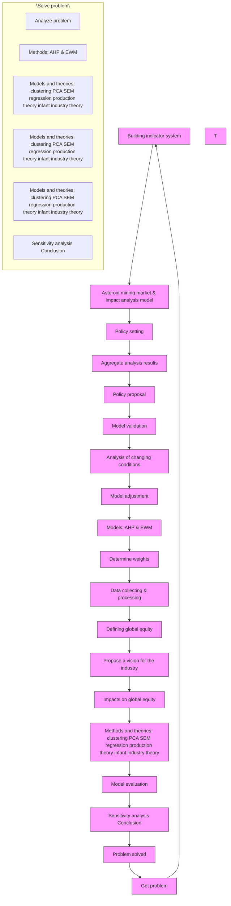
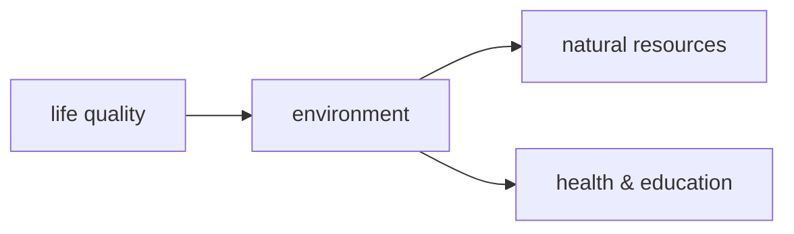
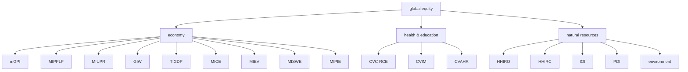
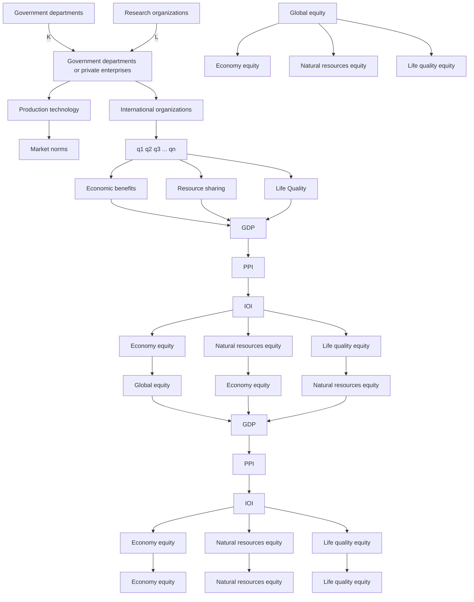
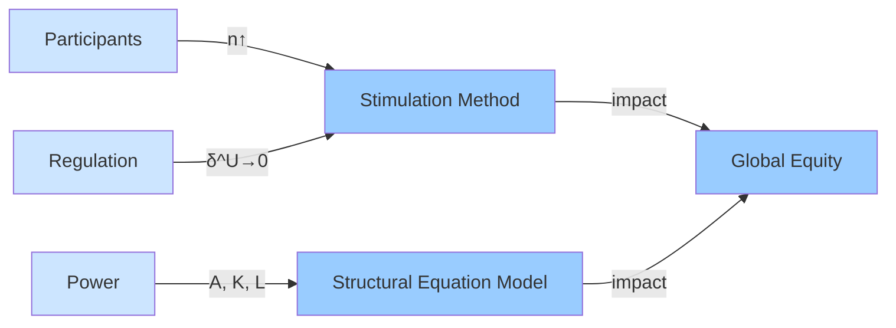

# Harvest in Space! Outlook & Equity

Summary

It has always been a puzzle how to allocate resources harvested in space. The advent of asteroid mining seems to even compound the challenges of maintaining global equity. Therefore, based on reality of the current and historical situations, our goal is to propose a global equity evaluation system and study the impact of asteroid mining using it. We present our work as four phases.

Firstly, we form the definition of global equity on the basis of relative literature. We establish a five-dimensional indicator system, HELEN, to evaluate global equity. The dimensions are Health & Education, Economy, Life Quality, Environment and Natural Resources. For each dimension, there are 2 to 5 indexes for quantification. In order to combine the advantages of both empirical judgment and objective data, we decide to use Analytic Hierarchy Process (AHP) and Entropy Weight Method (EWM) to calculate the weights. Then we use regional comparisons to validate our system.

Secondly, we introduce the concept of Asteroid Mining Market Model. We use system clustering to analyse the participants in this market. Based on historical data, we estimate Cobb-Douglas production function to describe the output of producers. We also discuss the roles of international organization that sets an upper bound of market share to promote equity. Under above constraints, we calculate the output at the equilibrium point and analyse the impact on global equity. We find that the booming of asteriod mining may hamper global equity under initial conditions.

Thirdly, we discuss changes in conditions, which include changes in mining pattern and national power. For the former, we discuss changes of public policy and participants using simulation method. For the latter, we use Structural Equation Modeling (SEM) to analyse the correlation of production factors, national power and global equity. Based on the results, we conclude that public policy may alleviate global inequity, but has its cost.

Finally, based on the previous analysis results, we make policy recommendations for the sake of improving global equity. The policy covers three parts: collect royalties, strict approval procedures, and encourage cooperative development. We also analyse the feasibility of the policy recommendations. We perform a sensitivity analysis on the model and discuss the advantages and disadvantages of the study.

In a nutshell, we propose a reasonable indicator system to measure global equity quantitatively and establish an asteroid mining model to analyse its impacts on global equity. Our model is also applicable to other realms and we look forward to making further discussion about it.

## Keywords:

Asteroid mining, Global equity index, Cobb-Douglas production, Structural equation modeling

## Contents

## 1 Introduction 4

1.1 Background . . 4  
1.2 Our Work . . 4

## 2 Assumptions 4

## 3 Notations 5

## 4 Global Equity Model 5

4.1 Dimensions of Global Equity . . 5  
4.2 HELEN Model 5

4.2.1 Natural Resources Equity . . . 6  
4.2.2 Economic Equity . .  
4.2.3 Life Quality Equity . . . 7  
4.2.4 Environmental Equity 7  
4.2.5 Health & Education Equity . . 8

4.3 Weight of Index . . 8

4.3.1 Determining the Weights of first-level indicators by AHP . . 8  
4.3.2 Determining the Weights of second-level indicators by EWM . . . . . 8  
4.3.3 Calculation of the Comprehensive Weights and Composite Score . . . . 9

4.4 Validation . 9

## 5 Asteroid Mining Market Model 10

5.1 Factor Market of Asteroid Mining 10

5.1.1 Participants . . 11  
5.1.2 Clustering Analysis of participants . .  
5.1.3 Result of Clustering 11  
5.1.4 Production Function 12

5.2 Production Side of Asteroid Mining 12

5.2.1 Participant 13  
5.2.2 Upper bound of Market Share 13  
5.2.3 Cost-benefit Analysis . . 14  
5.2.4 Equilibrium Conditions for Asteroid Mining Market 14

5.3 Product Market of Asteroid Mining . . . 15

5.3.1 Distribution of Benefits . . 15  
5.3.2 Impact on Economy 16  
5.3.3 Impact on Natural Resources . . 16  
5.3.4 Impact on Life Quality . . 17

5.4 Impact on Global Equity . . 17

## 6 Model Adjustment 18

6.1 Changes of Conditions . . 18

6.1.1 Participants . . 18  
6.1.2 Changes in the Regulatory System . . 18  
6.1.3 Changes in National Power . 18

6.2 Impact on Mining Patterns 18

6.2.1 Adjustment of Model . . 19  
6.2.2 Intuitive Analysis . . 19  
6.2.3 Result of Simulation 19

6.3 Impact of Changes in National Power . . 20

7 Policy Proposal 20

7.1 Collect Royalties 20  
7.2 Strict Approval Procedures . . 21  
7.3 Encourage cooperative development 22

8 Sensitivity Analysis 22

9 Strength and Weakness 23

9.1 Strength . . 23  
9.2 Weakness 23

Reference 24

Appendices 25

Appendix A First appendix 25

Appendix B Second appendix 25

## 1 Introduction

## 1.1 Background

Metallic Minerals on the earth are very limited. With the increasing demand of mineral resources, they will be depleted in the next decates. To reach the goal of sustainable development, the world has set eyes on the distant space, and that is why asteroid mining come into being.

According to NASA’s estimation, if asteroid 16 Psyche is successfully mined, each person on earth can share an average of 93 billion dollars. As advances in science and technology, asteroid mining is gradually becoming economically practical.

What does the future of asteroid mining look like? How will this new industry impact the economy and our daily life? Shall we complement regulations to assure the benefit and equity of all human beings? This passage gives a brief answer to these questions.

## 1.2 Our Work


<details>
<summary>flowchart</summary>


</details>

Figure 1: Our Work

Having understood the problem, we’re required to do the following work:

• Develop a model to measure global equity and validate it through regional analyses.  
• Present one likely vision of asteroid mining market in the future and determine the impact of asteriod mining on global equity.  
• Change the conditions in asteroid mining sector and analyze the impact of these changes on global equity.  
• Propose a set of regulations and policies to encourage the asteroid mining sector to advance in a way that promotes global equity.

## 2 Assumptions

• We assume that the resources of asteroid is unlimited. It is assumed to make our discussion of long-round trend possible.  
• At any specific time, the asteroid resources that humankind is able to utilize are

limited and scarce. It is scarcity that leads to inequity, makes our discussion necessary and our economics models useful.

• Assuming that all participants in asteroid mining market obey our regulation unconditionally so that we could analyse the impact on global equity.  
• We assume that the statistics we collected from the websites are reliable and accurate. The data we use in our model is mainly collected from some statistics websites such as Our World in Data [1], Statista [2], World Inequality Database [3] and CEIC [4].  
• It is assumed that asteroid mining activities follow basic priciples of economics so that we can build a economic model to analyse this market.  
• We assure that asteroid mining activityies are stable and predictable so that we could utilize histical data to predict some unknow parameters.

## 3 Notations

<table><tr><td>Symbols</td><td>Description</td><td>Unit</td></tr><tr><td> $q$ </td><td>Output of minerals</td><td>kg</td></tr><tr><td> $p$ </td><td>Price of minerals</td><td>dollar/kg</td></tr><tr><td> $\delta$ </td><td>Market share</td><td>%</td></tr><tr><td> $\pi$ </td><td>Profit of minerals</td><td>billion dollars</td></tr><tr><td> $C$ </td><td>Cost of mining</td><td>billion dollars</td></tr><tr><td> $k$ </td><td>Input of capital</td><td>billion dollars</td></tr><tr><td> $l$ </td><td>Input of labor</td><td>thousand persons</td></tr></table>

where we define the main parameters while specific value of those parameters will be given later.

## 4 Global Equity Model

## 4.1 Dimensions of Global Equity


<details>
<summary>flowchart</summary>


</details>

When it comes to equity, it refers to the equity between people in different social status, the equity between rich and poor countries, the equity between the present and the future generations.

Here, we study the equity between countries. In detail, we derive the definition of global equity:

Global equity is the quality of being globally fair considering natural resources, economy, health & education, environment and life quality, which considers need and justice.

We develop the following HELEN indicator system. In this model, we select five aspects of equity, health and education (H), environment (E), life quality(L), economy (E), and natural resources (N), to analyse global equity comprehensively.

## 4.2 HELEN Model

Figure 2 shows a basic diagram of our model. It is comprised of five fist-level indicators and sixteen second-level indicators.


<details>
<summary>flowchart</summary>


</details>

Figure 2: Diagram of HELEN Model

## 4.2.1 Natural Resources Equity

The unequal distribution of natural resources results in economic and geopolitical power relationships that can directly or indirectly influence the occurrence of conflicts. We collect the data of some nonrenewable resources including oil, natural gas, coal, iron, non-ferrous and precious metals. Using these data, we calculate four indexes to measure natural resources equity.

1) Production-Demand Index (PDI)

We collect the data of production and demand of resources for each countries. Then, we calculate the correlation between ranks of the two variables. We use Spearman rank correlation and Kendall rank correlation. The closer the correlation coefficient is to 1, the fairer the allocation of resources.

2) In and Out Index (IOI)

We collect the data of import and export of each country. For each resource, we calculate coefficient of variation (CV) denoted as In and Out Index. The smaller the value, the fairer the distribution of natural resources in the entire system.

HHI, also known as Herfindahl-Hirschman index, is a comprehensive index to measure industrial concentration. Its specific formula is as follows:

$$
H H I = \Sigma_ {i = 1} ^ {N} (\frac {X _ {i}}{X}) ^ {2} = \Sigma_ {i = 1} ^ {N} S _ {i} ^ {2}
$$

where $X _ { i }$ stands for the amount of the ith country and $X = \Sigma _ { i = 1 } ^ { N } X _ { i }$ .

3) HHI of Resource Occupancy (HHIRO)

HHIRO is HHI of resource occupancy, that is, the sum of the squares of the percentage of resource occupancy in each country to the total resource. It is used to measure the dispersion of resource occupancy.

4) HHI of Resource Consumption (HHIRC)

HHIRC is HHI of resource consumption in different countries. It is used to represent the concentration of resource consumption in different countries.

## 4.2.2 Economic Equity

1) Gini Coefficient of Wealth per Capita (GIW)

Gini index measures the extent to which the distribution of income among individuals or households within an economy deviates from a perfectly equal distribution. We regard the world as a whole and get its Gini index.

2) Theil Index of GDP per Capita (TIGDP)

Theil index is a special case of the generalized entropy index (GE). It is a measure of inequity. We use GDP of all countries to calculate Theil index.

## 4.2.3 Life Quality Equity

Global Moran index (MI) is used to determine whether there is autocorrelation in the space. Its formula is as follows:

$$
\frac {n}{S _ {0}} = \frac {\Sigma_ {i = 1} ^ {N} \Sigma_ {j = 1} ^ {N} w _ {i j} (x _ {i} - \bar {x}) (y _ {i} - \bar {y})}{S ^ {2} \cdot \Sigma_ {i = 1} ^ {N} \Sigma_ {j = 1} ^ {N} w _ {i j}}
$$

where wij is the weight showing the adjacent relationship. When the ith and the jth country are ${ \cal S } _ { 0 } = \mathrm { \bar { Z } } _ { i = 1 } ^ { N } \Sigma _ { j = 1 } ^ { N } w _ { i j }$

$$
S ^ {2} = \frac {1}{n} \cdot \Sigma_ {i = 1} ^ {N} (x _ {i} - \bar {x}) ^ {2}
$$

where $x _ { i }$ stands for the value of the ith country.

1) Moran Index of Producer Price Index (MIPPI)

We use MI of Producer Price Index (MIPPI) around the world to measure the extent to which countries differ in the price of goods.

2) Moran Index of Proportion of People Living in Poverty (MIPPLP)

We use MI of the proportion of people living in poverty (MIPPLP) in countries around the world to measure the extent to which countries differ in their alleviation of poverty.

3) Moran Index of Urban Population Ratio (MIUPR)

MIUPR is MI of the urbanization rate of countries around the world. It measures the difference of urban construction between countries.

## 4.2.4 Environmental Equity

1) Moran Index of Carbon Emission (MICE)

MICE is MI of carbon emissions around the world. It measures the difference of carbon emission control between countries.

2) Moran Index of Effluent Volume (MIEV)

MIEV is MI of Effluent Volume around the world. It can be used to measure the variance of wastewater discharge control worldwide.

3) Moran Index of Solid Waste Emissions (MISWE)

MISWE is MI of solid waste emissions around the world. It is used to measure the difference in solid waste emissions control all over the world.

4) Moran Index of Proportion of Investment in Environmental Pollution Control (MIPIE)

MIPIE is MI of investment in environmental pollution control around the world. It measures the difference of investment in environmental pollution control between countries.

## 4.2.5 Health & Education Equity

1) CV of the Completion Rate for Compulsory Education (CVCRCE)

We use CV of the completion rate of compulsory education around the world to measure the status quo of countries in compulsory education. It measures education equity.

2) CV of Infant Mortality (CVIM)

We measure health equity by CV of newborn infant mortality around the world to measures the current state of newborn health in each country.

3) CV of Access to Healthcare Resources (CVAHR)

We measure the accessibility of medical and health resources around the world. We collect the number of health technicians per 1,000 people, the number of beds in medical institutions per 1,000 people, and the number of hospitals per 10,000 people. We calculate these three indicators separately. Then we get the average for each country. We get CVAHR by calculating CV of all averages.

## 4.3 Weight of Index

The data we use to evaluate the indicators comes from multiple databases including statista [2]. We use data from 2001 to 2020 including almost all the countries around the world. For each year, we calculate above indexes.

On the basis of above data and relevant literature, we combine the Analytic Hierarchy Process (AHP) and the Entropy Weight Method (EWM). The weights are determined as follows:

## 4.3.1 Determining the Weights of first-level indicators by AHP

We use AHP to determine the weights of the first-level indicators.

First, we formulate matrix of pair-comparison based on relevant literature and theories. Then, we calculate the initial weight coefficient $w _ { i } ^ { ' }$ according to the formular:

$$
\omega_ {i} ^ {\prime} = \sqrt [ n ]{a _ {i 1} a _ {i 2} \cdots a _ {i n}} \tag {1}
$$

where n is the number of years studied. After that, we normalized the weighted as $\begin{array} { r } { \omega _ { \mathrm { i } } = \frac { \omega _ { i } ^ { \prime } } { \sum _ { i = 1 } ^ { n } w _ { i } ^ { \prime } } . } \end{array}$ Finally, we conducted the consistency test. The result shows $C I = 0 . 0 5 9 3 < 0 . 1$ . That means our model is acceptable.

## 4.3.2 Determining the Weights of second-level indicators by EWM

We use EWM to determine the weights of second-level indicators.

First, we calculate the proportion of the ith year under the jth index, and regard the proportion as the probability used in the relative entropy calculation. Denote data of the jth index and the ith sample point as $z _ { i j }$ . We can derive probability $p _ { i j }$ by:

$$
p _ {i j} = \frac {z _ {i j}}{\sum_ {i = 1} ^ {n} z _ {i j}}, \quad i = 1, 2, \dots , n; j = 1, 2, \dots , m \tag {2}
$$

where n is the number of years studied, and m is the number of indicators.

Second, we calculate the information entropy of each indicator, obtain the information utility value, and finally normalize it to obtain the entropy weight of each indicator. For the jth index, the formula is:

$$
e _ {j} = - \frac {1}{\ln n} \sum_ {i = 1} ^ {n} p _ {i j} \ln \left(p _ {i j}\right), \quad j = 1, 2, \dots , m \tag {3}
$$

Then, we calculate the information utility as:

$$
d _ {j} = 1 - e _ {j}, \quad j = 1, 2, \dots , m \tag {4}
$$

Finally, we normalized the information utility and calculate the weight as :

$$
\psi_ {j} = \frac {d _ {j}}{\sum_ {j = 1} ^ {m} d _ {j}}, \quad j = 1, 2, \dots , m \tag {5}
$$

## 4.3.3 Calculation of the Comprehensive Weights and Composite Score

HELEN Model can alse be used to a specific region to measure the region equity. We multiply above weights with the formular below to get the comprehensive weights for a specific region:

$$
\omega_ {i j} = \omega_ {i} \omega_ {j | i}, \quad i = 1, 2, 3, 4, j = 1, 2, \dots , n _ {i} \tag {6}
$$

where $\omega _ { i j }$ stands for weight of the first-level indicator. $\omega _ { j | i }$ stands for weight of the second-level indicator given the weight of first-level. $n _ { i }$ stands for the number of second-level indicators in the ith first-level indicator.

Using the obtained comprehensive weights, we can calculate the comprehensive score of each year (or region). The formula is:

$$
I = \sum_ {i = 1} ^ {4} \sum_ {j = 1} ^ {n _ {i}} V _ {i j} \omega_ {i j} \tag {7}
$$

where $V _ { i j }$ is the normalized value of the jth second-level indicator of the ith first-level indicator.

The final result calculated by the two methods is shown in the following Figure:

<table><tr><td rowspan="17">Global Equity</td><td>Indicators(I)</td><td>Weights</td><td>Indicators(II)</td><td>Weights</td></tr><tr><td rowspan="3">Health &amp; Education</td><td rowspan="3">0.0329</td><td>CVCRCE</td><td>0.4181</td></tr><tr><td>CVIM</td><td>0.3801</td></tr><tr><td>CVAHR</td><td>0.2018</td></tr><tr><td rowspan="4">Environment</td><td rowspan="4">0.1296</td><td>MICE</td><td>0.3442</td></tr><tr><td>MIEV</td><td>0.1109</td></tr><tr><td>MISWE</td><td>0.2482</td></tr><tr><td>MIPIE</td><td>0.2967</td></tr><tr><td rowspan="3">Life Quality</td><td rowspan="3">0.0636</td><td>MIPPI</td><td>0.4557</td></tr><tr><td>MIPPLP</td><td>0.2713</td></tr><tr><td>MIUPR</td><td>0.273</td></tr><tr><td rowspan="2">Economy</td><td rowspan="2">0.51</td><td>GIW</td><td>0.6034</td></tr><tr><td>TIGDP</td><td>0.3966</td></tr><tr><td rowspan="4">Natural Resources</td><td rowspan="4">0.2638</td><td>PDI</td><td>0.3118</td></tr><tr><td>IOI</td><td>0.1892</td></tr><tr><td>HHIRO</td><td>0.3013</td></tr><tr><td>HHIRC</td><td>0.1977</td></tr></table>

Figure 3: Weight of Index

## 4.4 Validation

We apply the global equity model to different regions. Figure 3 shows the value of equity index in North America, Latin America, Europe, Asia, Africa, Oceania.


<details>
<summary>world map</summary>

| Country | Value |
| --- | --- |
| Africa | High |
| South America | Medium-High |
| Australia | Low |
| Europe | Medium |
| North America | High |
| Canada | High |
| Russia | High |
| Mexico | High |
| Brazil | High |
| Argentina | High |
| Chile | High |
| Peru | High |
| Colombia | High |
| Venezuela | High |
| Ecuador | High |
| Bolivia | High |
| Iceland | High |
| Greenland | High |
| Iceland | Low |
| Iceland | Very Low |
| United States | High |
| United Kingdom | High |
| Germany | High |
| France | High |
| Italy | High |
| Spain | High |
| Portugal | High |
| Greece | High |
| Turkey | High |
| Turkey | Low |
| Turkey | Very Low |
| Iran | High |
| Iraq | High |
| Iraq | High |
| Iraq | Very Low |
| Yemen | High |
| Yemen | Very Low |
| Yemen | Low |
| Yemen | Very Low |
| Oman | High |
| Oman | High |
| Oman | High |
| Oman | Very Low |
| Oman | Very Low |
| Oman | Very Low |
| Oman | Very Low |
| Oman | Very Low |
| Oman | Very Low |
| Oman | Very Low |
| Oman | Very Low |
| Oman | Very Low |
| Oman | Very Low |
| Oman | Very Low |
| Oman | Very Low |
| Oman | Very Low |
| Oman | Very Low |
| Oman | Very Low |
| Oman | Very Low |
| Oman | Very Low |
| Oman (other) | Very Low (dark red) |
| Other (other) | Very Low (dark yellow) |
</details>

Figure 4: Piketty’s Index


<details>
<summary>heatmap</summary>

| Country | Share of total (Color Scale) | Global Equity Index |
| --- | --- | --- |
| Africa | 54-66 | 0.8-1.0 |
| South America | 51-54 | 0.6-0.8 |
| North America | 47-51 | 0.4-0.6 |
| Europe | 38-47 | 0.2-0.4 |
| Asia | 34-38 | 0.1-0.2 |
| Australia | 38-47 | 0.1-0.2 |
| Middle East | 51-54 | 0.4-0.6 |
| Central America | 47-51 | 0.2-0.4 |
| Southeast Asia | 38-47 | 0.1-0.2 |
| Middle West | 34-38 | 0.1-0.2 |
| Eastern Europe | 51-54 | 0.4-0.6 |
| Southern Europe | 51-54 | 0.4-0.6 |
| Northern Europe | 38-47 | 0.2-0.4 |
| Central Africa | 34-38 | 0.1-0.2 |
| Southern Africa | 51-54 | 0.1-0.2 |
| Western Africa | 51-54 | 0.1-0.2 |
| South Sudan | 38-47 | 0.1-0.2 |
| North Sudan | 34-38 | 0.1-0.2 |
| Turkey | 38-47 | 0.1-0.2 |
| Russia | 34-38 | 0.1-0.2 |
| Brazil | 38-47 | 0.1-0.2 |
| Argentina | 34-38 | 0.1-0.2 |
| Colombia | 38-47 | 0.1-0.2 |
| Peru | 34-38 | 0.1-0.2 |
| Ecuador | 38-47 | 0.1-0.2 |
| Venezuela | 34-38 | 0.1-0.2 |
| Bolivia | 38-47 | 0.1-0.2 |
| Iceland | 34-38 | 0.1-0.2 |
| Norway | 38-47 | 0.1-0.2 |
| Sweden | 34-38 | 0.1-0.2 |
| Finland | 38-47 | 0.1-0.2 |
| Denmark | 34-38 | 0.1-0.2 |
| Netherlands | 38-47 | 0.1-0.2 |
| Switzerland | 34-38 | 0.1-0.2 |
| Austria | 38-47 | 0.1-0.2 |
| Poland | 34-38 | 0.1-0.2 |
| Czech Republic | 38-47 | 0.1-0.2 |
| Slovakia | 34-38 | 0.1-0.2 |
| Hungary | 38-47 | 0.1-0.2 |
| Romania | 34-38 | 0.1-0.2 |
| Bulgaria | 38-47 | 0.1-0.2 |
| Croatia | 34-38 | 0.1-0.2 |
| Serbia and Montenegro | 38-47 | 0.1-0.2 |
| Slovenia | 34-38 | 0.1-0.2 |
| Bosnia and Herzegovina | 38-47 | 0.1-0.2 |
| Malta | 34-38 | 0.1-0.2 |
| Cyprus | 38-47 | 0.1-0.2 |
| Lithuania | 34-38 | 0.1-0.2 |
| Latvia | 38-47 | 0.1-0.2 |
| Estonia | 34-38 | 0.1-0.2 |
| Albania | 38-47 | 0.1-0.2 |
| Georgia | 34-38 | 0.1-0.2 |
| Armenia | 38-47 | 0.1-0.2 |
| Azerbaijan | 34-38 | 0.1-0.2 |
| Georgia and the Caribbean Islands | 38-47 | 0.1-0.2 |
| Kazakhstan | 34-38 | 0.1-0.2 |
| Ukraine | 38-47 | 0.1-0.2 |
| Russia (Western Sahara) | 34-38 | 0.1-0.2 |
| United Arab Emirates (Western Sahara) | 38-47 | 0.1-0.2 |
| United Kingdom (Western Sahara) | 34-38 | 0.1-0.2 |
| United States (Western Sahara) | 38-47 | 0.1-0.2 |
| United Mexican States (Western Sahara) | 34-38 | 0.1-0.2 |
| United Arab Emirates (Western Sahara) | 38-47 | 0.1-0.2 |
</details>

Figure 5: Global equity Index

Thomas Piketty uses top 10% national income share as a measurement of inequity [3]. The result is shown in Figure 4. We compare our result with Piketty’s to verify the reliability of the our model.

The result of two indexes show a high degree of consistency. Europe and Oceania have the lowest levels of inequity. Africa and Latin America have the highest levels of inequity. Equity index of Asia is higher than Europe and lower than Africa. Therefore, our model are reasonable and reliable.

## 5 Asteroid Mining Market Model

In this section, we propose a likely mode of asteroid mining, as shown in Figure 6. In this part, we will introduce the model from the factor market side, the production side, and the product market side. We finally examine the impact of the asteroid mining industry on global equity.


<details>
<summary>flowchart</summary>


</details>

Figure 6: Asteroid Mining Market Model

For the sake of simplicity, we only discuss the change of IOI, MIPPI snd TIGDP, regarding other indexes as invariant.

## 5.1 Factor Market of Asteroid Mining

We analyze the factor market for asteroid mining. The factor market can be analyzed from the two aspects, participants and their relationship (i.e. production function).

## 5.1.1 Participants

We analyse the roles of government agencies and scientific research institutions in our model. Government agencies refer to space exploration departments established by governments. They play two main roles in the asteroid mining market:

1) Act as the main producer in the initial stage of the market. Private companies do not have mining capabilities then. They need further support from the government.  
2) Provide private enterprises with capital, including land and funding to accelerate their development.

Scientific research institutions refer to research institutes and universities established in the countries. They play two main roles in the asteroid mining market:

1) Provide talents for asteroid mining market.  
2) Improve the technological level through research and innovation.

## 5.1.2 Clustering Analysis of participants

Asteroid mining has extremely high requirements on the level of technological development and national strength. Obviously, not all countries have enough capital, technology and talent reserves to mine. In the global asteroid mining market, there are huge differences between various participants. We need the criterion to distinguish the countries from each other. Therefore, we decide to measure a country’s space technology development level through three aspects: technical level, talent investment, and capital investment:

1) Technical level: the number of papers published in the space field.  
2) Talent input: the number of employees in the space industry.  
3) Capital investment: the market value of listed space companies.

Specifically, we want to simplify the model by clustering the countries with mining capacity (20 countries) into categories. By doing this, we can also see the internal mechanisms of how global equity is affected. The process is as follows:

1) Since our evaluation index has 3 dimensions, it is not convenient to visualize it directly, we consider visualization through Principal Component Analysis (PCA). Compared with general PCA, Kernel PCA (KPCA) can handle nonlinear situations better. To make sure of a good result, here we choose to use KPCA.  
2) After performing KPCA, we cluster the generated data using system clustering. At the beginning, each sample is regarded as a class, and then the closest samples (that is, the groups with the smallest distance) are firstly clustered into subclasses, and then the aggregated subclasses are merged according to their inter-class distances, and so on.

At last, we aggregate all subclasses into one big class. Here we compare the effects of different measures and types. Finally, we find that when using the ward connectivity to measure dissimilarities and dividing the countries into 4 clusters, the clustering effect is the best. The specific algorithm [5] is shown in Apendix A.

## 5.1.3 Result of Clustering

The clustering results show that we can divide the countries into 41 categories, which are:

1) Leader: The United States, the European Union and other countries with extremely

developed space technology.

2) Advancer: China, Russia, India and other developing countries with relatively developed space technology.  
3) Pursuer: Israel, South Korea, Japan, Iran, United Arab Emirates and other countries with potential for space technology.  
4) Outsider: Mexico, Australia, Brazil, Egypt, New Zealand, Indonesia, Thailand, Saudi Arabia and other countries that lack space exploration technology.  
5) Others: Countries without space exploration technology.

The clustering process and the visualization of the clustering results are as follows:


<details>
<summary>world map with clustering</summary>

| Country | Cluster |
| --- | --- |
| United States | Leader |
| Canada | Leader |
| Russia | Leader |
| Mexico | Leader |
| Brazil | Leader |
| Argentina | Leader |
| South Africa | Leader |
| Egypt | Leader |
| Saudi Arabia | Leader |
| Indonesia | Leader |
| Philippines | Leader |
| Vietnam | Leader |
| India | Leader |
| China | Leader |
| Japan | Leader |
| Australia | Outsider |
| South Korea | Outsider |
| Italy | Outsider |
| Spain | Outsider |
| France | Outsider |
| Germany | Outsider |
| Netherlands | Outsider |
| Belgium | Outsider |
| Switzerland | Outsider |
| Sweden | Outsider |
| Norway | Outsider |
| Denmark | Outsider |
| Finland | Outsider |
| Austria | Outsider |
| Poland | Outsider |
| Ukraine | Outsider |
| Russia | Advancer |
| United Kingdom | Advancer |
| Israel | Advancer |
| Iran | Advancer |
| Iraq | Advancer |
| Algeria | Advancer |
| Morocco | Advancer |
| Tunisia | Advancer |
| Lebanon | Advancer |
| Jordan | Advancer |
| Oman | Advancer |
| Georgia | Advancer |
| Kenya | Advancer |
| Tanzania | Advancer |
| Ethiopia | Advancer |
| Uganda | Advancer |
| Ghana | Advancer |
| Ivory Coast | Advancer |
| Madagascar | Advancer |
| Estonia | Advancer |
| Croatia | Advancer |
| Bosnia and Herzegovina | Advancer |
| Serbia and Montenegro | Advancer |
| Slovakia | Advancer |
| Slovenia | Advancer |
| Lithuania | Advancer |
| Latvia | Advancer |
| Lithuania | Others |
| Malta | Others |
| Cyprus | Others |
| Cyprus | Others |
| Cyprus | Others |
| Cyprus | Others |
| Cyprus | Others |
| Cyprus | Others |
| Cyprus | Others |
| Cyprus | Others |
| Cyprus | Others |
| Cyprus | Others |
| Cyprus | Others |
| Cyprus | Others |
| Cyprus | Others |
| Cyprus | Others |
| Cyprus | Others |
| Cyprus | Others |
| Cyprus | Others |
| Cyprus | Others |
| Cyprus | Others |
| Cyprus | Others |
| Ireland | Others |
</details>

Figure 7: Results of Clustering


<details>
<summary>line chart</summary>

| Month | Value |
| --- | --- |
| 13 | 0 |
| 14 | 0 |
| 15 | 2 |
| 16 | 0 |
| 17 | 0 |
| 18 | 0 |
| 19 | 0 |
| 20 | 0 |
| 21 | 0 |
| 22 | 0 |
| 23 | 0 |
| 24 | 0 |
| 25 | 0 |
| 26 | 0 |
| 27 | 0 |
| 28 | 0 |
| 29 | 0 |
| 30 | 0 |
| 31 | 0 |
| 32 | 0 |
| 33 | 0 |
| 34 | 0 |
| 35 | 0 |
| 36 | 0 |
| 37 | 0 |
| 38 | 0 |
| 39 | 0 |
| 40 | 0 |
| 41 | 0 |
| 42 | 0 |
| 43 | 0 |
| 44 | 0 |
| 45 | 0 |
| 46 | 0 |
| 47 | 0 |
| 48 | 0 |
| 49 | 0 |
| 50 | 0 |
| 51 | 0 |
| 52 | 0 |
| 53 | 0 |
| 54 | 0 |
| 55 | 0 |
| 56 | 0 |
| 57 | 0 |
| 58 | 0 |
| 59 | 0 |
| 60 | 0 |
| 61 | 0 |
| 62 | 0 |
| 63 | 0 |
| 64 | 0 |
| 65 | 0 |
| 66 | 0 |
| 67 | 0 |
| 68 | 0 |
| 69 | 0 |
| 70 | 0 |
| 71 | 0 |
| 72 | 0 |
| 73 | 0 |
| 74 | 0 |
| 75 | 0 |
| 76 | 0 |
| 77 | 0 |
| 78 | 0 |
| 79 | 0 |
| 80 | 0 |
| 81 | 0 |
| 82 | 0 |
| 83 | 0 |
| 84 | 0 |
| 85 | 0 |
| 86 | 0 |
| 87 | 0 |
| 88 | 0 |
| 89 | 0 |
| 90 | 0 |
| 91 | 0 |
| 92 | 0 |
| 93 | 0 |
| 94 | 0 |
| 95 | 0 |
| 96 | 0 |
| 97 | 0 |
| 98 | 0 |
| 99 | 0 |
</details>

Figure 8: Process of Clustering

## 5.1.4 Production Function

Finally, we use the production function to describe the relationship between different partipants . Using historical data, we give the values of the parameters in the function. Denote participant i’s output as $q _ { i }$ . It is a function of technology, talent input and capital input denoted as $A _ { i } , k _ { i }$ and $l _ { i }$ . We use Cobb–Douglas production function to describe this relationship:

$$
q _ {i} = A _ {i} k _ {i} ^ {\alpha_ {i}} \cdot l _ {i} ^ {\beta_ {i}} \tag {8}
$$

where $A _ { i } , \alpha _ { i }$ , and $\beta _ { i }$ are all positive constants. The constant $\alpha _ { i }$ is then the elasticity of output with respect to capital input, and $\beta _ { i }$ is the elasticity of output with respect to labor input. For $\alpha _ { i } .$ , $\beta _ { i }$ in the model, we take $\alpha _ { i } = 0 . 3 , \beta _ { i } = 0 . 7 \ : [ 6 ] \ : \mathrm { f o r } i = 1 , 2 , \cdot \cdot \cdot , N ;$ ; for $A _ { i } ,$ , we take one country in each category in the above clustering results, use its historical mineral data for regression analysis using Cobb-Douglas production function, and use the obtained A, denoted as ${ \hat { A } } ,$ as the A value of all countries in the same catagory. Take the United States as example, we derive that $\hat { A } = 7 . 4 2$ . The specific process is shown in Appendix B.

## 5.2 Production Side of Asteroid Mining

Next, we analyze the production side of asteroid mining. The production side can also be analyzed from participants and their relationships. For the former, we refer to relevant literature and emphasize the role of international regulatory organizations, and thus form the basic constraints. We use factor analysis to determine the constraints on market share. For the latter, we explain the rationality of the production relationship. We analyze the economic value of asteroid mining, and use the results to conduct a cost-benefit analysis and establish an equilibrium model.

## 5.2.1 Participant

Only by building a equitable outlook can we gain the support of developing countries. It is clearly not enough just relying on the sense of responsibility of developed countries to maintain equity, so the intervention of the international regulatory organization is indispensable.

The Agreement Governing the Activities of States on the Moon and Other Celestial Bodies, commonly designated as the Moon Agreement [7], states that “due regard shall be paid to the interest of present and future generations and to promote higher standards of living and conditions of economic and social progress in accordance with the UN Charter”.And based on its spirit, below we list the responsibilities of the international regulatory organization as follows:

1) Properly preserve information on all detected asteroid mineral resources. Disclose necessary information to the world.  
2) Determine the upper limit of market share of each country according their situations. Formulate regulations to ensure that no country exceeds the limit.  
3) Review mining requests from the countries. Only the approved mining projects can proceed.  
4) Supervise mining activities of all countries. Ensure that there is no unauthorized mining activities taking place. Impose fines on countries that violate the regulations.

## 5.2.2 Upper bound of Market Share

As mentioned above, we need to determine upper bounds of each country’s market share for asteroid mineral resources. In this regard, we must determine the needs of countries so that the resources can be distributed equitably. Here, we use each country’s resource gap (the difference between consumption and production, or \$0 if production is greater than consumption) to determine the their needs.

We use factor analysis to calculate the need for mineral resources of each country. The process is as follows:

First, we assume that there is a latent variable Z (also named as factor) that affects the independant variable X. We centralized X and write the relationship between X and Z as:

$$
\boldsymbol {X} = \boldsymbol {A Z} + \epsilon
$$

where  has mean vector 0 and covariance matrix $\Sigma _ { \epsilon } = d i a g ( \sigma _ { 1 } ^ { 2 } , \sigma _ { 2 } ^ { 2 } , \cdot \cdot \cdot , \sigma _ { p } ^ { 2 } )$ , where p stands for the dimension of X.

Second, we assume the covariance matrix of latent variable Z, $\Sigma _ { z } ~ = ~ { \cal I }$ . With some calculation, we get:

$$
\pmb {\Sigma} _ {x} = \pmb {A} \pmb {A} ^ {T} + \pmb {\Sigma} _ {\epsilon}
$$

Using factor transformation, we can get unique A under certain circumstance. Then, we estimate Z, denoted as $\hat { Z } ,$ , using:

$$
\hat {\pmb {Z}} = \pmb {A} ^ {T} \pmb {R} _ {x} ^ {- 1} \pmb {X}
$$

where $\scriptstyle { \mathbf { } } R _ { x }$ is the correlation matrix of X.

After that, we calculate the eigen value of correlation matrix of X, noted as $\lambda _ { i } , i { \bf \Sigma } =$ $1 , 2 , \cdots , p .$ Then the contribution degree of each dimension of Z is derived by the following expression:

$$
w _ {j} = \frac {\lambda_ {j}}{\sum_ {i = 1} ^ {m} \lambda_ {i}}
$$

where $j$ is one given dimension of $\hat { Z }$ and $m$ stands for the number of chosen dimensions of factor. The contribution degree can be used as the weight of each dimension of $\hat { Z }$ .

Finally, we get the score of factor (the estimated value of $\hat { Z } )$ . Multiply the result with above weights, we can get the final score of each observation.

## 5.2.3 Cost-benefit Analysis

For participant i , we denote the profit as $\pi _ { i }$ and it is the difference between revenue and cost:

$$
\pi_ {i} = \text { Revenue } _ {i} - \text { Cost } _ {i} \tag {9}
$$

Revenue of participant i is price mutiplied by output. We denote price as $p ( Q )$ which is a $\textstyle Q = \sum _ { i = 1 } ^ { n } q _ { i } + q _ { e }$ $q _ { e }$ in traditional mining industry. As for the form of inverse demand function, we assume the form of linear function and obtained its expression as $p ( Q ) = 1 2 0 1 6 . 0 8 - 3 0 . 1 8 Q$ . The specific calculation process is also shown in Appendix B. So revenue is as follows:

$$
\text { Revenue } _ {i} = p (Q) \cdot q _ {i} \tag {10}
$$

To minimize the cost [6], we get $l _ { i } ^ { c }$ and $k _ { i } ^ { c }$ :

$$
l _ {i} ^ {c} \left(v _ {i}, w _ {i}, q _ {i}\right) = q _ {i} ^ {1 / \left(\alpha_ {i} + \beta_ {i}\right)} \left(\frac {\beta_ {i}}{\alpha_ {i}}\right) ^ {\alpha_ {i} / \left(\alpha_ {i} + \beta_ {i}\right)} w _ {i} ^ {- \alpha_ {i} / \left(\alpha_ {i} + \beta_ {i}\right)} v _ {i} ^ {\alpha_ {i} / \left(\alpha_ {i} + \beta_ {i}\right)} \tag {11}
$$

$$
k _ {i} ^ {c} (v _ {i}, w _ {i}, q _ {i}) = q _ {i} ^ {1 / (\alpha_ {i} + \beta_ {i})} (\frac {\alpha_ {i}}{\beta_ {i}}) ^ {\beta_ {i} / (\alpha_ {i} + \beta_ {i})} w _ {i} ^ {\beta_ {i} / (\alpha_ {i} + \beta_ {i})} v _ {i} ^ {- \beta_ {i} / (\alpha_ {i} + \beta_ {i})}
$$

where $w _ { i }$ is wage of works and $v _ { i }$ is rate of interest. We use recent economic data to estimate them.

The minimized cost is a function of output, wage and rate. We denote $C o s t _ { i } = C ( v _ { i } , w _ { i } , q _ { i } )$ . In detail:

$$
C _ {i} \left(v _ {i}, w _ {i}, q _ {i}\right) = v _ {i} k _ {i} ^ {c} + w _ {i} l _ {i} ^ {c} = q _ {i} ^ {1 / \left(\alpha_ {i} + \beta_ {i}\right)} B _ {i} v _ {i} ^ {\alpha_ {i} / \left(\alpha_ {i} + \beta_ {i}\right)} w _ {i} ^ {\beta_ {i} / \left(\alpha_ {i} + \beta_ {i}\right)} \tag {12}
$$

where $B _ { i } = ( \alpha _ { i } + \beta _ { i } ) \alpha _ { i } ^ { - \alpha _ { i } / ( \alpha _ { i } + \beta _ { i } ) } \beta _ { i } ^ { - \beta _ { i } / ( \alpha _ { i } + \beta _ { i } ) } - \mathsfit { a }$ constant that involves only the parameters $\alpha _ { i }$ and $\beta _ { i }$ .

Finally, the profit function of participant i is as follows:

$$
\pi_ {i} = p (Q) q _ {i} - C _ {i} \left(q _ {i}\right) \tag {13}
$$

## 5.2.4 Equilibrium Conditions for Asteroid Mining Market

In particular, if there are only two participants in the market, according to Cournot model, the intersection of the optimal response curves of the two participants is the market equilibrium point:

Generally, in the case of a large number of participants, we get the output of each participant through the following objective functions and constraints:


<details>
<summary>line chart</summary>

| x  | Blue Line | Red Curve 1 | Red Curve 2 | Red Curve 3 | Red Curve 4 |
|----|-----------|-------------|-------------|-------------|-------------|
| 0  | 50        | 0           | 0           | 0           | 0           |
| 5  | 40        | 45          | 25          | 20          | 15          |
| 10 | 30        | 40          | 30          | 25          | 20          |
| 15 | 20        | 35          | 35          | 30          | 25          |
| 20 | 10        | 30          | 40          | 35          | 30          |
| 25 | 0         | 25          | 45          | 40          | 35          |
| 30 | -10       | 20          | 50          | 45          | 40          |
| 35 | -20       | 15          | 55          | 50          | 45          |
| 40 | -30       | 10          | 60          | 55          | 50          |
| 45 | -40       | 5           | 65          | 60          | 55          |
| 50 | -50       | 0           | 70          | 65          | 60          |
</details>

Figure 9: Modeling process

$$
\max \quad \pi_ {i} = p (Q) q _ {i} - C _ {i} (q _ {i})
$$

$$
\begin{array}{l l} s. t. & 0 \leq \frac {q _ {i}}{Q} \leq \delta_ {i} ^ {U} \\ & 0 <   j _ {1} <   j _ {2} ^ {U} \end{array} \tag {14}
$$

$$
0 \leq k _ {i} \leq k _ {i} ^ {U} \tag {14}
$$

$$
0 \leq l _ {i} \leq l _ {i} ^ {U}
$$

$$
(i = 1, 2, \dots , n)
$$

where n is the number of countries, $k _ { i } ^ { U }$ and $l _ { i } ^ { U }$ are the upper bound of capital and labor investment for the ith country. We use recent economic data to estimate them[quote]. And $\delta _ { i } ^ { U }$ is the upper bound of market share of the ith country.

After obtaining the output, we solve the market share of countries of above five catagories, $\begin{array} { r } { \delta _ { i } = \frac { q _ { i } } { Q } } \end{array}$ , to provide further information for later study. The results are as follows:

Table 1: Market Sharing in Equilibrium Point

<table><tr><td></td><td>Leader</td><td>Advancer</td><td>Pursuer</td><td>Outsider</td><td>Others</td></tr><tr><td> $\delta$ </td><td>53.20%</td><td>26.13%</td><td>15.22%</td><td>5.16%</td><td>0.0%</td></tr></table>

## 5.3 Product Market of Asteroid Mining

## 5.3.1 Distribution of Benefits

How to distribute the benefits of asteroid mining? It is an important issue. One possible mode is that miners have ownership and resale rights to the minerals they obtained. On one hand, the value of the them can compensate for the cost of the miners. On the other hand, since the amount of resources mined is limited by the regulatory organization, there won’t be large-scale monopoly and profiteering. Under this mode, the interests of less developed countries can also be protected. These countries can choose to sell their demand quotas to miners. When the miner exceeds the mining limit, they must purchase the mining limit to continue mining through approval. To a certain extent, it has played a role in supporting the less developed countries.

Besides miners themselves, there are multiple parties that can make a profit. We sort out the profiters and profit methods of asteroid mining as follows:

1) Miners profit as owners and sellers of the minerals. Those mining countries or enterprises can retain minerals to meet their own needs, or else they can dump the minerals to other countries.

2) The sponsors of mining enterprises can also earn dividends through investment, but the period of profit is longer. It takes at least ten to fifteen years from project funding to successful profitability.  
3) The processors of minerals can profit. The total amount of minerals in asteroids is abundant, but the purity is relatively low. It requires further refining and processing to obtain products.  
4) Other practitioners in the asteroid mining industry chain can profit. After the industrial chain forms, it will provide many needs, such as the production of mining spacecraft, mineral transportation, etc. They can boost the economy of mining countries.

## 5.3.2 Impact on Economy

GDP reflects the economic growth of a country. The asteroid mining industry has a significant impact on GDP and thus affects economic life. Therefore, we compare the growth of GDP after the booming of asteroid mining industry. Consider the following equation:

$$
G D P _ {i} ^ {a} = G D P _ {i} ^ {b} + \delta_ {i} \cdot Q \cdot P (Q) \tag {15}
$$

where $G D P _ { i } ^ { a }$ is the average GDP of countries in class i excluding the asteroid mining and $G D P _ { i } ^ { b }$ is the one including the value created by asteroid mining.

$$
\frac {\Delta G D P _ {i}}{G D P _ {i} ^ {a}} = \frac {\delta_ {i} \cdot Q \cdot P (Q)}{G D P _ {i} ^ {a}} \times 100 \% \tag{16}
$$

In the second equation, we compute the change rate of GDP caused by the asteriod mining market. The result is shown as follows:

Table 2: Change Rate of GDP

<table><tr><td></td><td>Leader</td><td>Advancer</td><td>Pursuer</td><td>Outsider</td><td>Others</td></tr><tr><td> $\frac{\Delta GDP_i}{GDP_i^\alpha}$ </td><td>1.54%</td><td>0.68%</td><td>0.04%</td><td>0.01%</td><td>0.00%</td></tr></table>

## 5.3.3 Impact on Natural Resources

Asteroid mining can alleviate the scarcity of resources on the earth. Countries like China and Japan that depend on imported resources can take this opportunity to change their international status by increasing their natural resources supply from outer space.

We use the Dependence Index (DI) to analyze the changes in the dependent level of these countries on imported resources after booming of asteroid mining industry. Consider the following equation:

$$
D I _ {i} ^ {a} = D I _ {i} ^ {b} + \frac {\delta_ {i} \cdot Q}{T C _ {i}} \tag {17}
$$

where $D I _ { i } ^ { a }$ is the Dependence Index of countries in class i excluding asteroid mining and $D I _ { i } ^ { b }$ is the one including the value created by asteroid mining.

$$
\frac {\Delta D I _ {i}}{D I _ {i} ^ {\alpha}} = \frac {\delta_ {i} \cdot Q}{T C _ {i} \cdot D I _ {i} ^ {a}} \times 100 \% \tag{18}
$$

In the second equation, we compute the change rate of DI caused by the asteriod mining market. The result is shown as follows:

Table 3: Change Rate of DI

<table><tr><td></td><td>Leader</td><td>Advancer</td><td>Pursuer</td><td>Outsider</td><td>Others</td></tr><tr><td> $\frac{\Delta DI_i}{DI_i^\alpha}$ </td><td>-72.96%</td><td>-22.64%</td><td>1.03%</td><td>12.96%</td><td>13.42%</td></tr></table>

## 5.3.4 Impact on Life Quality

Asteroid mining provides an alternative source of mineral raw materials for industrial production. An increase in the supply of raw materials will reduce the price of raw materials and reduce the cost of the products.

We use the Producer Price Index (PPI) to analyze the change in the price of raw material after booming of asteroid mining industry. Consider the following equation:

$$
P P I _ {i} ^ {a} = P P I _ {i} ^ {b} + w _ {i} (P (Q) - P (0)) \tag {19}
$$

where $P P I _ { i } ^ { a }$ is the Producer Price Index of countries in class i excluding the asteroid mining and $P P I _ { i } ^ { b }$ is the one including the value created by asteroid mining.

$$
\frac {\Delta P P I _ {i}}{P P I _ {i} ^ {a}} = \frac {w _ {i} (P (Q) - P (0))}{P P I _ {i} ^ {a}} \times 100 \% \tag{20}
$$

In the second equation, we compute the change rate of PPI caused by the asteriod mining market. The result is showed as follows:

Table 4: Change Rate of PPI

<table><tr><td></td><td>Leader</td><td>Advancer</td><td>Pursuer</td><td>Outsider</td><td>Others</td></tr><tr><td> $\frac{\Delta PPI_{i}}{PPI_{i}^{a}}$ </td><td>-2.41%</td><td>-0.65%</td><td>-0.11%</td><td>-0.01%</td><td>0%</td></tr></table>

## 5.4 Impact on Global Equity

Finally, we analyze the impact of asteroid mining on global equity. As mentioned above, asteroid mining will affect three aspects of global equity: natural resources, economy and life quality. For these effects, we use the HELEN model that has been established for analysis. For simplification, we only consider the changes of these three secondary indicators, and assume that the other secondary indicators remain unchanged. The analysis results are as follows: (Note that the larger the value of the global equity index, the worse the equity.)


<details>
<summary>radar chart</summary>

| Category | Before | After |
| -------- | ------ | ----- |
| [H]      | 0.5    | 0.3   |
| [N]      | 0.4    | 0.6   |
| [E]      | 0.3    | 0.5   |
| [L]      | 0.2    | 0.1   |
| [E]      | 0.4    | 0.3   |
</details>

Table 5: Impact on Equity

<table><tr><td></td><td>Health &amp; Education</td><td>Environment</td><td>Life Quality</td><td>Economy</td><td>Natural Resources</td></tr><tr><td>Before</td><td>0.511</td><td>0.433</td><td>0.260</td><td>0.652</td><td>0.392</td></tr><tr><td>After</td><td>0.511</td><td>0.433</td><td>0.303</td><td>0.725</td><td>0.445</td></tr></table>

We calculate the Global Equity using HELEN model. The result shows that Global Equity raises from 0.525 to 0.579 after asteroid mining.

## 6 Model Adjustment


<details>
<summary>flowchart</summary>


</details>

Figure 10: Model Adjustment

## 6.1 Changes of Conditions

## 6.1.1 Participants

Just as mentioned above, we assume that the initial mining is conducted by countries. But the countries can also help enterprises develop their own abilities. Finally, the participants of mining will change into private enterprises.

We introduce Infant Industry Theory to describe the change process of participants. The basic content of the theory is: government improves the competitiveness of emerging industries against foreign countries by adopting appropriate protection policies. It will adopt transitional protection and support policies when these industries have the ability to export and contribute to the national economy.

The policy guides the state to provide higher subsidies for asteroid mining companies in the initial stage to promote their development. When the mining industry gradually matures, costs are reduced. The government will reduce subsidies to stimulate their own development. In this way, the miners changed from countries to private enterprises, and these enterprises will become the main participants in the future.

## 6.1.2 Changes in the Regulatory System

In the original model, international regulatory agencies impose upper bounds of market share to prevent monopoly. Here we want to discuss the pros and cons of this regulation. So we consider another scenario. Under this scenario, the market share of countries will not be restricted. Comparing the global equity index of the two cases, we can get our answer.

## 6.1.3 Changes in National Power

The talent investment, capital investment, and technical level of different countries will change over time. Based on historical data, we predict the future global equity index. We will conduct quantitative analysis accordingly.

## 6.2 Impact on Mining Patterns

We see changes in mining patterns in two ways. The makeup of miners and the regulation will both change. The former change is mainly reflected in the gradual transition of mining participants from states to enterprises. This will lead to an increase in the number of competitors in the market and increase competition. The latter change is mainly reflected in the removal of market share restriction. We build model under these two cases to study the impact of changes in mining patterns on equity.

## 6.2.1 Adjustment of Model

We combine the above two changes together to form the model. For changes in mining participants, we use the current number of space companies in each country to estimate the proportion of asteroid mining companies for each country in the future. We study the situation with different enterprise quantity. For changes in the regulatory system, we compare two situation. For the first situation, the upper bound of market share is fixed at 30%. And for the second, the market share is not limited. We use the model established above to solve it and draw the curve of the global equity index changing with enterprise quantity as below. Then we aggregate the data of enterprises for each country.

## 6.2.2 Intuitive Analysis

The participants in the initial stage are mainly governments. The competitiveness between small number of producers is mild. The output is $q _ { 1 }$ for the first country and $q _ { 2 }$ for the second. As more and more private companies enter the market, the competitiveness becomes fiercer. The slope of the response curve become larger for leading country and smaller for the followers.


<details>
<summary>line chart</summary>

| q1  | q2  |
| --- | --- |
| q1  | q2  |
| q1  | q2' |
| q1  | q1  |
| q2  | q2  |
| q2  | q1  |
</details>

Figure 11: Intuitive Analysis


<details>
<summary>line chart</summary>

| X Value | Unrestricted | Restricted |
| ------- | ------------ | ----------- |
| 0       | 0.5          | 0.5         |
| 300     | 0.6          | 0.6         |
| 600     | 0.7          | 0.7         |
| 900     | 0.75         | 0.75        |
| 1200    | 0.8          | 0.75        |
| 1500    | 0.75         | 0.7         |
| 1800    | 0.7          | 0.65        |
| 2100    | 0.65         | 0.6         |
| 2400    | 0.6          | 0.55        |
| 2700    | 0.55         | 0.5         |
| 3000    | 0.5          | 0.5         |
</details>

Figure 12: Result of Simulation

The new equilibrium point is shown in Figure 11. The output is $q _ { 1 } ^ { \prime }$ for the first country and $q _ { 2 } ^ { \prime }$ for the second. We get $\begin{array} { r } { \frac { q _ { 2 } ^ { \prime } } { q _ { 1 } ^ { \prime } } > \frac { q _ { 2 } } { q _ { 1 } } } \end{array}$ indicating that the distribution of output is more unbalanced. As a result, it is likely that the inequity would increase.

## 6.2.3 Result of Simulation

The result is shown in Figure 12. With the increase in enterprise quantity, the global equity index first increases. But it then gradually decreases and finally tend to be stable. This is in line with our intuition. In fact, in the early stage of the conversion, the threshold is relatively high. Only advanced enterprises of some developed countries can enter and make profits. Therefore, they can obtain monopoly profits, which increases inequity. As time goes by, technology is spread further, the barrier is struck, and more private companies are able to break the barrier. Therefore, the market will see increased competition, lower costs, a more balanced distribution of profits and less inequity. From vertical comparison we can see that, on adding the restriction of market share, the peak of the curve becomes lower, and the highest point drops from 0.789 to 0.739. This indicates that restricting market share, to some extent, can alleviate global inequity. But we also find that, under the restriction, the asteroid mining market reachs its inflection point when the number of enterprises increases to 1800. The unrestricted condition reaches the point at 1200, which is faster than restricted condition. So we conclude that the restriction on market share can indeed better maintain global equity, but it also has its cost.

## 6.3 Impact of Changes in National Power

Changes in national power affect secondary indicators in the HELEN system. In order to derive the specific influence mode, we introduce Structural Equation Modeling.

Structural Equation Modeling (SEM) is a method for establishing, estimating and testing causal effects. It contains both explicit variables and latent variables. We use SEM to examine the impact of technology, capital investment and labor on global equity. We use AMOS software to obtain regression coefficients and significance levels and then draw the roadmap. The result shows that technology, capital investment and labor have an impact on global equity as the following ways. Our SEM passes the $\chi ^ { 2 }$ test, which demonstrates that our model is feasible.


<details>
<summary>flowchart</summary>

```mermaid
graph TD
  e7 --> HealthEducation["Health & education"]
  e8 --> Environment
  GlobalEquity["Global equity"] --> HealthEducation
  GlobalEquity --> Environment
  ChangesInNationalPower["Changes in national power"] --> Labor
  ChangesInNationalPower --> CapitalInvestment["Capital investment"]
  ChangesInNationalPower --> Technology
  ChangesInNationalPower --> LifeQuality["Life Quality"]
  ChangesInNationalPower --> Economy
  ChangesInNationalPower --> NaturalResources["Natural resources"]
  Labor --> e1
  CapitalInvestment --> e2
  Technology --> e3
  LifeQuality --> e4
  Economy --> e5
  NaturalResources --> e6
    Health & education -.-> Global equity
    Environment -.-> Global equity
    e7 -.-> Global equity
    e8 -.-> Global equity
    e1 -.-> Changes in national power
    e2 -.-> Changes in national power
    e3 -.-> Changes in national power
    e4 -.-> Changes in national power
    e5 -.-> Changes in national power
    e6 -.-> Changes in national power
    e7 -.-> Global equity
    e8 -.-> Global equity
```
</details>

Figure 13: Result of SEM

## 7 Policy Proposal

## 7.1 Collect Royalties

The U.S. enacted the U.S. Commercial Space Launch Competitiveness Act in 2015 to promote the competitiveness of domestic private space industry. The treaty authorizes mining and recognizes the property rights of U.S. citizens to asteroid resources. The United States believes that this does not violate the Outer Space Treaty. The latter emphasizes that "Outer space shall be free for exploration and use by all states". Based on different understandings of this, the world is quite controversial about the law of U.S. .

In fact, the Moon Treaty considers the moon and other celestial bodies to be the common heritage of mankind. This is also similar to the United Nations Convention on the Law of the Sea. In this convention, the deep sea is considered beyond national territory and is the common property of mankind. Based on this understanding, we can charge some kind of royalties on the mining behavior of the states. These royalties will be redistributed among all countries of the world. We sort out the policy details as follows:

1) Resources completely and privately. The development of asteroid resources requires payment of royalties to the Regulatory Authority. The fee is progressively charged according to the value of the asteroid resources applied for mining, and there are a unified charging threshold and charging rate for all the countries.

2) The royalties collected serve as an international fund to distribute interest to citizens around the world. When distributing fees and in-kinds, the supervisory authority shall follow the standard of fair sharing and take into account the interests and needs of developing countries, especially the least developed countries.  
3) A portion of the royalties can also be used to create loan programs to help less developed countries develop space technology and education. It’s aimed to improve their capabilities in asteroid mining, and charge low or even waiver of interest on loans.

In fact, the imposition of royalties is a more moderate public policy than upper bound on market share. It can reduce market share to some extent. It is showed that there is an advantage to reducing market share. This public policy keeps this advantage. At the same time, this policy avoids rigid uniformity, and still reserves some development space for developed countries with high market share. This can further promote the development of the industry. This can also make this industry reach the previously mentioned inflection point earlier, thus enabling the industry to develop and curb inequity. In addition, the charging rate and threshold can be adjusted according to the potential output of the industry. Therefore, it is more flexible and is conducive to unleash the potential of the industry.

## 7.2 Strict Approval Procedures

In order to fully consider the common interests and equity of all humankind, international regulatory organizations should examine the mining applications of countries and enterprises more strictly. The mining application includes but is not limited to the applicant’s fund-raising plan, financial statements, relevant experience, technical qualifications, environmental impact report, emergency plan and other documents. Any application that seriously pollutes space, has adverse effects on the security of other countries, or destroys the common property of mankind should be rejected.

1) Strictly review the mining volume and mining value in the international application proposal to ensure a fair and stable price for minerals from space.  
2) Quantitatively estimate the possible space pollution and damage caused by mining operations. Prohibit applications that seriously affect the continuation of asteroid mining by other countries in the future.  
3) Strictly review the equipment launched in the application proposal to prevent any country from making military deployments in space or maliciously destroying asteroid resources.  
4) Review the integrity of the applicant, the purpose of exploration, and whether the applicant has the corresponding conditions for completing the application plan in terms of funds, technical level, and equipment.  
5) Review the proposal to see if there are any acts that destroy the common heritage of mankind involving history, culture, etc.

Strict approval procedures can control the market in a timely manner and reduce the occurrence of sales behaviors that endanger the market. In this way, price stability can be indirectly controlled. As in the previous analysis, changes in prices can actually affect factors such as output, resulting in a shift in the game equilibrium point. This effect is transmitted to the entire market through the correlation described by SEM, thereby affecting global equity. We can predict the change direction of the global equity index in advance with the help of strict approval procedures and above conclusions. Then we can control the changes that cause adverse effects in the early stage.

## 7.3 Encourage cooperative development

As mentioned above, due to the unbalanced level of scientific and technological development, there are many countries that do not have the technical conditions for asteroid mining. Even if they do, their mining is less efficient and extremely costly, making it impossible for these countries to profit. Therefore, international regulatory organizations should encourage developed countries and less developed countries to cooperate, and reduce royalties of developed countries as incentive, so that both countries can benefit from asteroid mining. In addition, international regulatory organizations can also allow backward countries to transfer unattainable market share to countries with productivity surpluses, which to some extent provides the interests of them.

Cooperative development could provide backward countries with advanced science and technology, increasing their A value, which in turn increases their productivity and potentially reduce costs. Moreover, this influence can be transmitted to other aspects through the correlation revealed by SEM, and finally promote global equity.

## 8 Sensitivity Analysis

We conduct sensitivity analysis on upper bound of market shareδU referred at the third question. We set $\delta ^ { U } = 0 . 2 6 , 0 . 2 8 , 0 . 3 0 , 0 . 3 2 ,$ 0.34 respectively and draw the diagram of global equity index with the change of the number of companies. The result is as follows:


<details>
<summary>line chart</summary>

| Number of Companies | δ^U = 0.26 | δ^U = 0.28 | δ^U = 0.30 | δ^U = 0.32 | δ^U = 0.34 |
| ------------------- | ---------- | ---------- | ---------- | ---------- | ---------- |
| 0                   | 0.52       | 0.51       | 0.50       | 0.50       | 0.50       |
| 1000                | 0.74       | 0.73       | 0.72       | 0.71       | 0.70       |
| 2000                | 0.72       | 0.71       | 0.70       | 0.69       | 0.68       |
| 3000                | 0.55       | 0.54       | 0.53       | 0.52       | 0.51       |
| 3500                | 0.48       | 0.47       | 0.46       | 0.45       | 0.44       |
</details>

Figure 14: Sensitivity Analysis

The result shows that, for every chosen $\delta ^ { U }$ , with the change of the number of companies, global equity index has the same trend as the third question. The result shows the stability of our model.

## 9 Strength and Weakness

## 9.1 Strength

The selection indicators in our model is scientific and comprehensive. When determining the indicators, we considered over 20 sets of data from over 180 countries. These indicators represent main factors in the regard of global equity, making our research more reliable.

We combine subjective and objective weighting methods, so the weights we calculate are more reliable. As a subjective weighting method, AHP obtains weights through empirical judgment, while the objective EWM obtains weights through data. By Combination of the two, we can make use of literature and experience in life while maintaining objectivity.

Data Processing. We interpolate data with random forest method, unify data unit and merge multiple indicators from different tables by their country codes. During the visualization process, we also take the logarithm of the data appropriately, and finally obtained more intuitive results.

## 9.2 Weakness

The model does not consider the impact of sudden factors. Based on Assumption 6, asteroid mining activityies are stable and predictable, so we did not consider the disturbance of sudden impact factors when considering the international environment as a whole.

Our HELEN model has a high demand for original data and contains complex calculations. There will be difficulty in collecting all the data. And the indicators we choose, such as the Moran Index, are rather difficult to calculate as well.

## References

[1] https://ourworldindata.org/  
[2] https://www.statista.com/  
[3] https://wid.world/  
[4] https://www.ceicdata.com/en  
[5] James, G. , D Witten, Hastie, T. , & Tibshirani, R. . (2013). An Introduction to Statistical Learning: With Applications in R.  
[6] Nicholson, W. . (2011). Microeconomic Theory: Basic Principles and Extensions, 11th Edition. The Dryden.  
[7] https://www.unoosa.org/oosa/en/ourwork/spacelaw/treaties/ intromoon-agreement.html  
[8] Steffen, O. (2021). Explore to Exploit: A Data-Centred Approach to Space Mining Regulation. Space Policy, 101459.  
[9] Fox, S. J. (2019). Policing mining: In outer-space greed and domination vs. peace and equity a governance for humanity!. Resources Policy, 64, 101517.  
[10] Carley, M., & Spapens, P. (2017). Sharing the world: sustainable living and global equity in the 21st century. Routledge.  
[11] Phylaktis, K., & Xia, L. (2006). The changing roles of industry and country effects in the global equity markets. The European Journal of Finance, 12(8), 627-648.  
[12] Ross, S. D. (2001). Near-earth asteroid mining. Space, 1-24.  
[13] Lewicki, C., Diamandis, P., Anderson, E., Voorhees, C., & Mycroft, F. (2013). Planetary resources—The asteroid mining company. New Space, 1(2), 105-108.  
[14] Von der Dunk, F. G. (2017). Asteroid mining: international and national legal aspects. Mich. St. Int’l L. Rev., 26, 83.  
[15] Busch, M. (2004). Profitable asteroid mining. Journal of the British Interplanetary Society, 57, 301-305.

## Appendices

## Appendix A First appendix

## Hierarchical Clustering

1. Begin with n observations and a measure (such as Euclidean distance) of all the ${ \binom { n } { 2 } } = n ( n - 1 ) / 2$ pairwise dissimilarities. Treat each observation as its own cluster.  
2. For $i = n , n - 1 , \ldots , 2 \colon$

(a) Examine all pairwise inter-cluster dissimilarities among the i clusters and identify the pair of clusters that are least dissimilar (that is, most similar). Fuse these two clusters. The dissimilarity between these two clusters indicates the height in the dendrogram at which the fusion should be placed.

(b) Compute the new pairwise inter-cluster dissimilarities among the i  1 remaining clusters.

where the ward connectivity measure refers to the requirement to reduce the variance within the cluster as much as possible after each merge.

## Appendix B Second appendix

Denote Cobb-Douglas production function as follows:

$$
Y = A k ^ {\alpha} l ^ {\beta}
$$

We take the logarithmic transformation to get:

$$
\ln Y = \ln A + \alpha \ln k + \beta \ln l
$$

Using linear regression, we can derive the estimation of A, Aˆ from the constant term from the following expression (denote the constant term as ${ \hat { \beta } } _ { 0 } )$ :

$$
\hat {A} = e ^ {\hat {\beta_ {0}}}
$$

Performing the above calculation on the selected 5 representative countries, we can get the Aˆ values of the five categories of countries. For the form of the inverse demand function, we make the simplest assumptions as follows:

$$
p (Q) = a - k Q
$$

where a and k are constant terms for given industry. We use world nickel production and price data in recent years to perform regression analysis, and obtain the following expression:

$$
p (Q) = 1 2 0 1 6. 0 8 - 3 0. 1 8 Q
$$

That is, $a = 1 2 0 1 6 . 0 8 , k = 3 0 . 1 8 .$ .