# Voice of Logistics: Focus on Data Governance Summary

As an essential asset of port, data plays an increasingly important role in the daily operation of port enterprises. Achieving effective integration of data from multiple subjects involved in port logistics (e.g. people, technology and process) is essential to deepen the construction of data and analytics (D&A) systems and improve the production efficiency of port enterprises.

For Session 1, aiming to realize a comprehensive assessment and optimization of the maturity of ICM’s D&A system, this paper innovatively proposed to establish a standard D&A system meta-network model for port logistics as the basis for subsequent work. According to the expectations of ICM Corporation for the D&A system, this paper selected people, technology, process and data information as the modeling objects of the meta-network. Specific modeling elements and correlations were identified through government documents, institution reports, and academic publications. Finally, a standard D&A system meta-network model of port logistics with 33 nodes and 199 links was developed.

For Session 2, to select comprehensive D&A system maturity assessment indicators, a standard D&A system meta-network analysis (MNA) was conducted in this paper. From the perspective of effective integration of people, technology, process and data information of port logistics system, this paper selected 12 D&A system maturity evaluation indicators such as Process Data Information Needs Congruence and Data Information Based Task Completion. Subsequently, this paper used the indicator data obtained from Monte Carlo stochastic simulation as the input data of PCA to develop a quantitative assessment model for the D&A system maturity. We selected Mediterranean Shipping Company S.A as an application to demonstrate using MNA-PCA for D&A system maturity assessment. According to the analysis results, the score of illustrative enterprise’s D&A system maturity was 85.14, and it was found that the enterprise should strengthen the construction of customs release information and in-port consolidation and distribution information.

For Session 3, this paper proposed to simulate the performance of the enterprise port logistics D&A system by developing a stochastic Petri net (SPN) model that is isomorphic to the meta-network. The average delay time of in-port transportation equipment of the illustrative enterprise was simulated using the SPN model and optimized based on the standard D&A system meta-network. According to the simulation results, the average detention time of transportation equipment was reduced from 140.17 minutes to 85.98 minutes, with a 38.7% reduction.

For Session 4, based on the model’s effectiveness, we provided ICM companies with recommendations for applying the model developed in this paper. This paper detailed the critical steps needed to apply the model to other industries.

## Contents

## 1 Introduction ...

1.1 Problem Background  
1.2 Our Work ..

## 2 Preparation of the Models .

2.1 Assumptions . 4  
2.2 Notations . 4

## 3 Model 1: Port Logistics D&A System Meta-Network Model .....

3.1 Meta-Network Model .  
3.2 Identification of Port Logistics Elements . 6  
3.3 The Establishment of Port Logistics D&A System Meta-Network Model .. . 7

## 4 Model 2: MNA-PCA Based D&A System Maturity Assessment ................. 8

4.1 Maturity Assessment Indicators for D&A System Based on MNA .. 9  
4.2 Principal Component Analysis . 1  
4.3 Development of D&A System Maturity Assessment System . 11  
4.4 D&A System Maturity Assessment Application Demonstration and Recommendations 13

## 5 Model 3: Stochastic Petri Net for the Port Logistics Optimization Isomorphic with D&A System Meta-Network . ... 14

5.1 Basic Theory of Stochastic Petri Nets (SPN).. . 14  
5.2 Stochastic Petri Net Modelling for the Port Logistics Optimization . . 15  
5.3 Port Logistics Optimization for the Illustrative Enterprise . 18

## 6 Sensitivity Analysis .. .. 20

6.1 Sensitivity Analysis of the Standard Port Logistics D&A System Maturity ............. .. 20  
6.2 Sensitivity Analysis of the Illustrative Enterprise Port Logistics SPN . .. 20

## 7 Application Recommendations for ICM Corporation’s D&A System and Model Extensions .. ... 21

7.1 D&A System Application Recommendations . . 21  
7.2 Model’s Industry Extensions .. 21

## 8 Model Evaluation . . 22

8.1 Strengths . 22  
8.2 Weaknesses . 23

## 1 Introduction

## 1.1 Problem Background

As an important asset owned by the enterprise, data governance refers to its correctness and timeliness, control of data flow, permissions and management of security. The correct application of the data and analytics (D&A) system should be based on accurate and reasonable data. Port logistics service is a complex system engineering. The organization of port logistics services involves government regulatory agencies, port enterprises and various types of logistics service providers and customers in multiple departments and units. Its business side involves port inspection, logistics and transportation, customs clearance and review, and many other aspects. Establishing the data and analytics D&A system can help improve its overall operational efficiency and service quality.

The specific requirements of this question are as follows：

Develop a D&A system maturity assessment indicator system and apply it to the illustrative enterprise’s D&A system assessment.  
Demonstrate how to use the developed model to maximize the value of enterprise data assets.  
Apply the model to evaluate and optimize ICM’s D&A system.  
Expand the application of the developed model to other companies or industries.

## 1.2 Our Work

Since this question did not give any port operation data for ICM Corporation, a quantitative model that can effectively integrate multiple types of essential information, the meta-network model, was developed as a basis for subsequent maturity assessment and process optimization. According to ICM Corporation’s target requirements for the D&A system, we selected people, technology, process and data information as the modeling elements of the meta-network. Through literature analysis, we classified the types of people, technology, process and relevant data information involved in port logistics services and analyzed the correlations between the elements. We integrated port logistics services’ components and associated relationships into a network to establish a standard D&A system meta-network model.

To comprehensively assess the maturity of the D&A system, we need to analyze the multilevel network indicators to select maturity indicators based on the established D&A system meta-network model. This paper selected 12 indicators such as Data Information Based Process Completion (DIBPC), Data Information Negotiation (DIN), and Process Data Information Needs Congruence (PDINC) as the critical indicators to measure the performance of people, technologies and processes in the D&A system. Due to the lack of data on the operation of the business, this paper used Monte Carlo simulations to capture the changes in the D&A system maturity assessment indicators under different scenarios. Principal component analysis was used to reduce the dimensionality of the indicator data in the Monte Carlo simulation and establish a maturity assessment model based on the D&A system meta-network. We applied the maturity model to Mediterranean Shipping Company S.A as an application demonstration of the model for ICM Corporation.

For ICM Corporation to maximize the benefit of its data information and reduce the transit time, this paper developed a Stochastic Petri Net (SPN) isomorphic to the D&A system metanetwork. The SPN model is established by corresponding the elements of port logistics in the SPN to the elements in the D&A system meta-network and inheriting the correlation relationships between the elements in the meta-network. This paper selected the illustrative enterprise for the D&A system maturity assessment as the object of SPN logistics process optimization. This paper used the SPN model to simulate delays in the port logistics system of the illustrative enterprise and optimized the system based on the standard D&A system meta-network.

Finally, based on the model’s effectiveness, we recommended the established D&A system maturity assessment and optimization models to ICM. This paper detailed how the models can be extended to other enterprises or industries. A letter related to the maturity of ICM Cor poration’s port logistics services D&A system is also provided to ICM Corporation’s customers to increase their confidence in the data practices.

Step 1. Develop the Port Logistics D&A System Meta-Networks  


<details>
<summary>flowchart</summary>

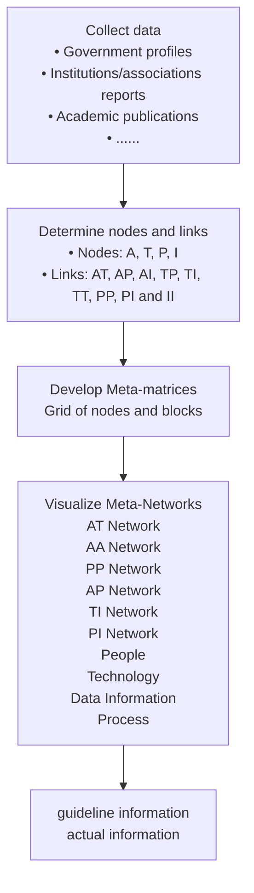
</details>

Step 2. Assess the D&A System Maturity Based on MNA-PCA  


<details>
<summary>flowchart</summary>

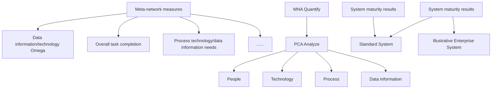
</details>

Step 3. Optimize Port Logistics Based on Stochastic Petri Net


<details>
<summary>flowchart</summary>

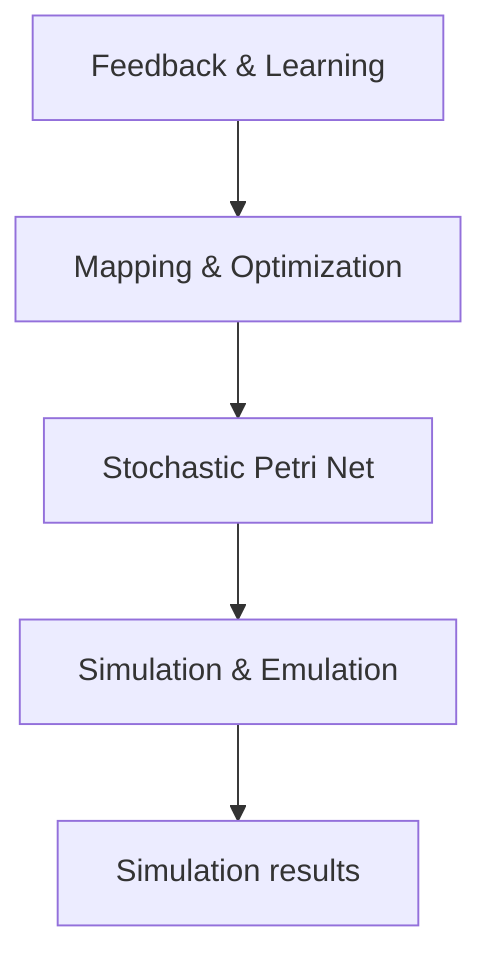
</details>

Fig. 1 Technology roadmap for this paper

## 2 Preparation of the Models

## 2.1 Assumptions

1. ICM Corporation’s port-related business is not likely to change significantly shortly.  
2. The maturity of the D&A system is only influenced by the people, technology, process and data information in the introduction to the problem.  
3. The illustrative enterprise is consistent with the nature of ICM Corporation and is a good representation of the operations of ICM Corporation.  
4. There is no conflict between the needs of the different departments in the ICM Corporation management team.

## 2.2 Notations

The key mathematical notations used in this paper are listed in Table 1.

Table 1 Notations used in this paper

<table><tr><td>Symbol</td><td>Description</td></tr><tr><td> $f_e$ </td><td>The  $e$ th principal component score</td></tr><tr><td> $β_e$ </td><td>The weight of the  $i$ th principal component</td></tr><tr><td>DIBTC</td><td>Data Information Based Task Completion</td></tr><tr><td>DIO</td><td>Data Information Omega</td></tr><tr><td>PTNC</td><td>Process Technology Needs Congruence</td></tr><tr><td>TO</td><td>Technology Omega</td></tr><tr><td> $\overline{N}$ </td><td>The average token of the places</td></tr><tr><td>N</td><td>The average system delay time</td></tr></table>

## 3 Model 1: Port Logistics D&A System Meta-Network Model

The primary purpose of this section is to establish a port logistics D&A system metanetwork to realize the integration of data information, people, technology and process and provide a basis for subsequent D&A system maturity assessment and optimization.

## 3.1 Meta-Network Model

Carley et al. (2007) proposed the concept of meta-network, which is a multi-level social network that includes multiple organizational elements (Carley et al., 2007). Meta-network has a ‘tree-like’ hierarchical structure and can be seen as mapping multiple homogeneous or heterogeneous sub-network. By analyzing the meta-network model as a whole or more sub-networks within the meta-network, critical information about the structural characteristics of the system can be obtained.

Pestov (2009) argued that any natural system, such as society or organization, can be represented by a meta-network (Pestov, 2009). Various entities or elements in a system, including people, data information and resources, can be captured as meta-network nodes, as shown in Fig. 2. The port logistics services are characterized by large scale, multiple associations and uncertainty. Therefore, the port logistics system is complex, with a hierarchy composed of multiple subjects. Based on the characteristics of ICM Corporation’s port logistics system and the objectives of ICM’s D&A system, we can learn that the meta-network model is well suited to this problem. The main steps in developing a meta-network model are identifying nodes and links.


<details>
<summary>flowchart</summary>

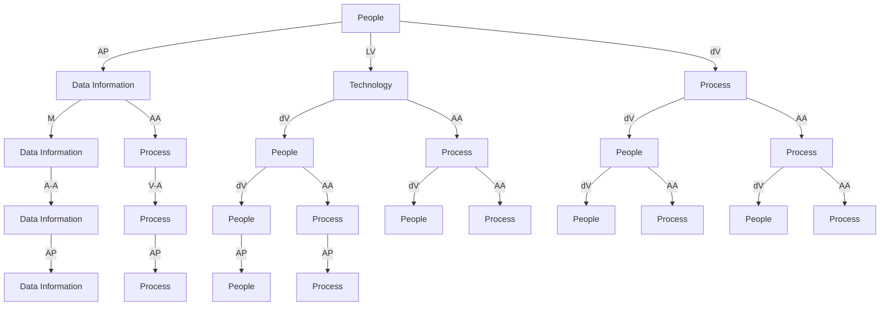
</details>

Fig. 2 Basic meta-network concept diagram

## 3.2 Identification of Port Logistics Elements

During the port logistics D&A system analysis, there is a non-negligible correlation between many factors such as people, technology, process, and data information. This paper needs to decompose the processes at the system level, analyze the various factors included, and consider the correlations.

Based on relevant technical specifications, government documents and related literature, this paper identifies a total of 33 critical elements based on the core of the port logistics transportation process (Almotairi and Lumsden, 2009). The identification results of port logistics elements are shown in Table 2.

Table 2 Identification of port logistics elements

<table><tr><td>Category</td><td>ID</td><td>ID Meaning</td></tr><tr><td rowspan="11">Process</td><td>P1</td><td>Vessel arrival</td></tr><tr><td>P2</td><td>Vessels waiting for berth allocation</td></tr><tr><td>P3</td><td>Vessel approaching the port</td></tr><tr><td>P4</td><td>Container liner</td></tr><tr><td>P5</td><td>Bill review</td></tr><tr><td>P6</td><td>Loading and unloading operations</td></tr><tr><td>P7</td><td>Assembled goods</td></tr><tr><td>P8</td><td>Stockpile storage</td></tr><tr><td>P9</td><td>Intra-port consolidation vehicle transportation</td></tr><tr><td>P10</td><td>Customs supervision and release</td></tr><tr><td>P11</td><td>Registration information ship leaving the post</td></tr><tr><td rowspan="3">Data Information</td><td>I1</td><td>Regulatory release information</td></tr><tr><td>I2</td><td>Container liner information</td></tr><tr><td>I3I4</td><td>Loading and unloading machinery informationStockyard information</td></tr><tr><td rowspan="3"></td><td>I5</td><td>Intra-port information</td></tr><tr><td>I6</td><td>Railroad port station information</td></tr><tr><td>I7</td><td>Vessel information</td></tr><tr><td rowspan="7">Technology</td><td>T1</td><td>Technology for loading and unloading operations</td></tr><tr><td>T2</td><td>Berth operation technology</td></tr><tr><td>T3</td><td>Container box source organization technology</td></tr><tr><td>T4</td><td>Stacking and mechanical loading and unloading synergistic technology</td></tr><tr><td>T5</td><td>Cooperative technology of collecting and transporting machinery and loading and unloading machinery</td></tr><tr><td>T6</td><td>Cooperative technology of berth operation and loading/unloading operation</td></tr><tr><td>T7</td><td>Modern information technology</td></tr><tr><td rowspan="8">People</td><td>A1</td><td>Customs inspector</td></tr><tr><td>A2</td><td>Port commanders</td></tr><tr><td>A3</td><td>Valets</td></tr><tr><td>A4</td><td>Longshoreman</td></tr><tr><td>A5</td><td>Freight forwarder</td></tr><tr><td>A6</td><td>Loading and unloading machinery operators</td></tr><tr><td>A7</td><td>Accountant</td></tr><tr><td>A8</td><td>Shipper</td></tr></table>

## 3.3 The Establishment of Port Logistics D&A System Meta-Network Model

Based on the identified port logistics elements, four-element types (i.e. Process (P), Data Information (I), People (A) and Technology (T)) are identified as meta-network four-dimensional nodes. In order to develop the port logistics D&A system and sort out the correlations between the elements of entities in port logistics, which are transformed into links between nodes, the standard port logistics D&A system meta-network is developed, as shown in Fig. 3. The port logistics D&A system meta-network will be explained in detail below.


<details>
<summary>flowchart</summary>

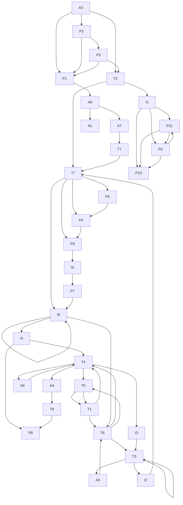
</details>

Fig. 3 The standard port logistics D&A system meta-network model

In the port logistics D&A system meta-network model, there are unidirectional or bidirectional associations between different nodes, and the following types of association networks are developed according to different associations in this paper, as shown in Table 3. For example, AP Net refers to the involvement of certain people needed to complete a specific process. TP Net refers to the skills required to complete a specific process. AI Net refers to the data information that someone has. The structural characteristics of a port logistics system can be described by analyzing the entire meta matrix or one or more networks in the matrix. The associated sub-network based on the node relationship matrix is shown in Fig. 4. By analyzing the meta-network, we can obtain practically meaningful multidimensional network indicators, which will be specified in 4.2 Maturity Assessment Indicators for D&A System Based on MNA.

Table 3 Port logistics D&A system meta matrix

<table><tr><td></td><td>People</td><td>Technology</td><td>Process</td><td>Data Information</td></tr><tr><td>People</td><td>--</td><td>AT Net</td><td>AP Net</td><td>AI Net</td></tr><tr><td>Technology</td><td>--</td><td>TT Net</td><td>TP Net</td><td>TI Net</td></tr><tr><td>Process</td><td>--</td><td>--</td><td>PP Net</td><td>PI Net</td></tr><tr><td>Data Information</td><td>--</td><td>--</td><td>--</td><td>II Net</td></tr></table>


<details>
<summary>flowchart</summary>

```mermaid
graph TD
  A["People"] --> B["Information"]
  B --> C["10"]
  B --> D["14"]
  B --> E["17"]
  B --> F["15"]
  B --> G["11"]
  B --> H["13"]
  B --> I["12"]
  B --> J["11"]
  B --> K["10"]
  B --> L["9"]
  B --> M["8"]
  B --> N["7"]
  B --> O["6"]
  B --> P["5"]
  B --> Q["4"]
  B --> R["3"]
  B --> S["2"]
  B --> T["1"]
    style A fill:#ff0000,stroke:#333
    style B fill:#000,stroke:#333
    style C fill:#ff0000,stroke:#333
    style D fill:#ff0000,stroke:#333
    style E fill:#ff0000,stroke:#333
    style F fill:#ff0000,stroke:#333
    style G fill:#ff0000,stroke:#333
    style H fill:#ff0000,stroke:#333
    style I fill:#ff0000,stroke:#333
    style J fill:#ff0000,stroke:#333
    style K fill:#ff0000,stroke:#333
    style L fill:#ff0000,stroke:#333
    style M fill:#ff0000,stroke:#333
    style N fill:#ff0000,stroke:#333
    style O fill:#ff0000,stroke:#333
    style P fill:#ff0000,stroke:#333
    style Q fill:#ff0000,stroke:#333
    style R fill:#ff0000,stroke:#333
```
</details>


<details>
<summary>flowchart</summary>

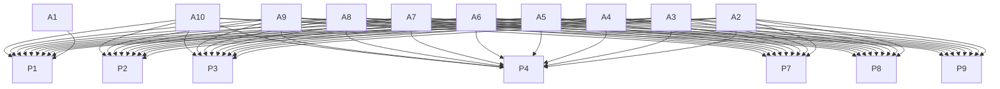
</details>


<details>
<summary>flowchart</summary>

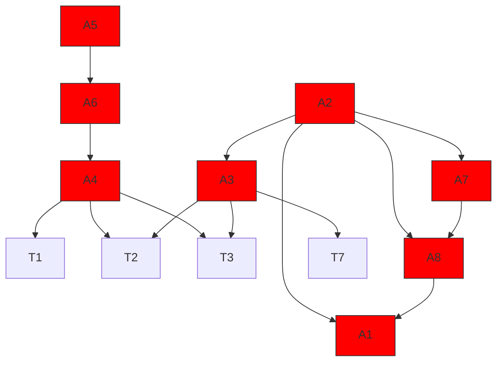
</details>


<details>
<summary>flowchart</summary>

```mermaid
graph TD
  A["11"] --> B["17"]
  B --> C["12"]
  C --> D["13"]
  D --> E["14"]
  E --> F["16"]
  F --> G["15"]
  G --> H["13"]
  H --> I["12"]
  I --> J["16"]
    style A fill:#000,stroke:#000,color:#fff
    style B fill:#000,stroke:#000,color:#fff
    style C fill:#000,stroke:#000,color:#fff
    style D fill:#000,stroke:#000,color:#fff
    style E fill:#000,stroke:#000,color:#fff
    style F fill:#000,stroke:#000,color:#fff
    style G fill:#000,stroke:#000,color:#fff
    style H fill:#000,stroke:#000,color:#fff
    style I fill:#000,stroke:#000,color:#fff
    style J fill:#000,stroke:#000,color:#fff
    note bottom of A: "II Net: Interaction between data information"
```
</details>


<details>
<summary>flowchart</summary>

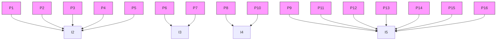
</details>


<details>
<summary>flowchart</summary>

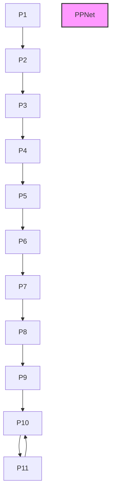
</details>


<details>
<summary>flowchart</summary>

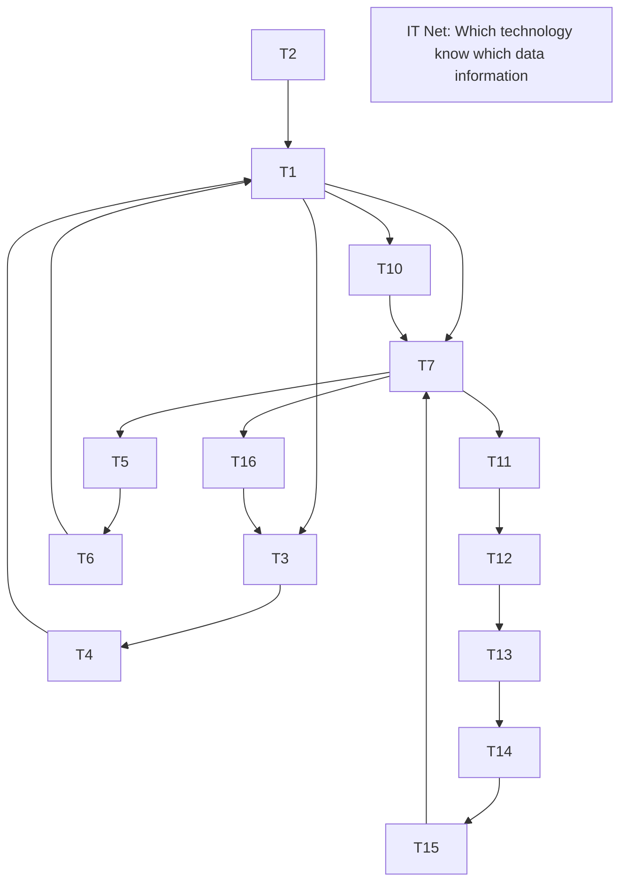
</details>


<details>
<summary>flowchart</summary>

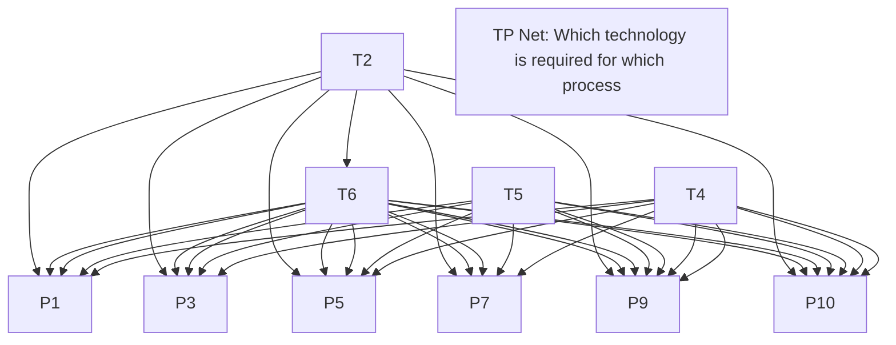
</details>


<details>
<summary>flowchart</summary>

```mermaid
graph TD
  T2 --> T6
  T6 --> T1
  T1 --> T5
  T5 --> T7
  T7 --> T3
  T4 --> T7
  T3 --> T7
    style T2 fill:#fff,stroke:#000
    style T6 fill:#fff,stroke:#000
    style T1 fill:#fff,stroke:#000
    style T5 fill:#fff,stroke:#000
    style T7 fill:#fff,stroke:#000
    style T3 fill:#fff,stroke:#000
    style T4 fill:#fff,stroke:#000
    style T6 fill:#fff,stroke:#000
    style T1 fill:#fff,stroke:#000
    style T5 fill:#fff,stroke:#000
    style T7 fill:#fff,stroke:#000
    note bottom of T2: "TT Net: Interaction between technology"
```
</details>

Fig. 4 Port logistics D&A system meta-network sub-network system diagram

## 4 Model 2: MNA-PCA Based D&A System Maturity Assessment

In this section, the meta-network analysis (MNA) was carried out based on ICM’s D&A system targets, and indicators were selected that enable a comprehensive assessment of the D&A system maturity. This paper calculated the indicator dataset through Monte Carlo simulation and performed principal component analysis (PCA) to determine the indicator weights.

Finally, the model was applied to company Mediterranean Shipping Company S.A as an application demonstration.

## 4.1 Maturity Assessment Indicators for D&A System Based on MNA

The target of developing a D&A system is to maximize the use of data assets by enhancing the correlation between people, technology and process to form collaborative management of the whole life cycle. The key to the selection of indicators is to describe the collaborative process of people, technology and data information during the completion of logistics operations to achieve a comprehensive assessment of the maturity of the D&A system. Therefore, this paper selects a multi-layered network assessment indicator with a core of the process, as shown below. All computed elements in the following are the meta-network 0-1 relationship matrix as represented in Table 3 and are calculated as matrix operations.

Agent Data Information Needs Congruence (ADINC): This indicator represents the amount of data information that is missing for the agent to complete its assigned process. Let $\mathrm { N D I } = \mathrm { A P ^ { * } I P ^ { \prime } } =$ data information needed by agents to do their assigned process. The formula for the ADINC for agent ?? is shown in Equation (1).

$$
A D I N C _ {i} = \frac {\operatorname{sum} (N D I (i , :) . * \sim A I (i , :))}{\operatorname{sum} (N D I (i , :))} \tag {1}
$$

Agent Technology Needs Congruence (ATNC): This indicator represents the amount of technology missing for the agent to complete its assigned process. Let $\mathrm { N T } = \mathrm { A P ^ { * } T P ^ { \ d } }$ = technology agents need to do their assigned process. The formula is familiar with that of ADINC.

Process Data Information Needs Congruence (PDINC): The number of data information not supplied to a process, but required to do the process, is expressed as a fraction of the total knowledge required for the task. It is similar to Agent Data Information Needs Congruence but quantifies only the undersupply of data information to tasks, as shown in Equation (2).

$$
P D I N C _ {i} = \frac {\operatorname{sum} \left(I P ^ {\prime} (i , :)\right) . * \sim \left(A P ^ {\prime} * A I (i , :)\right)}{\operatorname{sum} \left(I P ^ {\prime} (i , :)\right)} \tag {2}
$$

Process Technology Needs Congruence (PTNC): This is Process Data Information Needs Congruence with the data information-based networks replaced with the cor responding technology-based networks.

Data Information Actual Workload (DIAW): The data information an agent uses to perform the processes to which it is assigned. DIAW for agent ?? is computed as Equation (3):

$$
D I A W _ {i} = \frac {\left[ A I * I P * A P ^ {\prime} \right] (i , i)}{\operatorname{sum} (I P)} \tag {3}
$$

Technology Actual Workload (TAW): The technology an agent uses to perform the processes to which it is assigned. The formula can be found in DIAW.

Data Information Based Task Completion (DIBTC): The fraction of the assigned processes that can be completed by agents based on data information. DIBTC for agent ?? is computed as Equation (4):

$$
D I B T C _ {i} = \frac {| T | - | (I P ^ {\prime} - A P ^ {\prime} * A I) |}{| T |} \tag {4}
$$

Technology Based Task Completion (TBTC): This is Data Information Based Task Completion with the data information-based networks replaced with the corresponding technology-based networks.  
 Social Technical Congruence (STC): The proportion of the overall needs of a process that are met by the coordination of people working through a process. STC for agent ?? is computed as Equation (5):

$$
S T C _ {i} = \frac {\operatorname{sum} [ I ((A P * P P * A P ^ {\prime}) . * A A > 0) ]}{\operatorname{sum} (I ((A P * P P * A P ^ {\prime}) > 0))} \tag {5}
$$

where, $I ( A > 0 )$ denotes a function that if true returns a value of 1.

Agent Socio Technology-Information Power (ASTIP): A measure of actor power based on access to data information, technology, and process. ASTIP is the Out-Degree Centrality of the binarized concatenated network: [AT AI AP]  
Data Information Omega (DIO): The degree to which agents reuse data information while doing their processes. DIO for agent ?? is computed as Equation (6):

$$
D I O _ {i} = \frac {\operatorname{sum} \left[ \left(\left(T ^ {\prime} . * A T ^ {\prime} * A T\right) . * K T ^ {\prime}\right) . * K T ^ {\prime} \right]}{\operatorname{sum} (K T)} \tag {6}
$$

Technology Omega (TO): The degree to which agents reuse technology while doing their processes. This is Data Information Omega with the data information-based networks replaced with the corresponding technology-based networks.

The indicators selected above address the concerns of ICM Corporation’s management team, as shown in Table 5. The results of the standard D&A system maturity assessment metrics are shown in Table 6.

Table 5 Indicators and concerns solved table

<table><tr><td>Indicators</td><td>Solved concerns</td></tr><tr><td>Agent Data Information Needs CongruenceProcess Data Information Needs CongruenceData Information Actual WorkloadData Information Based Task CompletionData Information Omega</td><td>Cataloging of data assets;Integration of people, technology, processes and data information;Data governance.</td></tr><tr><td>Agent Technology Needs CongruenceProcess Technology Needs CongruenceTechnology Actual WorkloadTechnology Based Task CompletionTechnology Omega</td><td>Skills of recruited staff;Staff training;Technical solution reliability measurement.</td></tr><tr><td>Agent Socio Technology-Information PowerSocial Technical Congruence</td><td>Determination of talent reserve deficiencies;Determination of the number of employees;Selection of talents in demand.</td></tr></table>

Table 6 Calculation of standard D&A system maturity indicators

<table><tr><td>Indicators</td><td>Value</td><td>Indicators</td><td>Value</td><td>Indicators</td><td>Value</td><td>Indicators</td><td>Value</td></tr><tr><td>ATNC</td><td>0.188</td><td>DIBTC</td><td>0.636</td><td>DIAW</td><td>0.522</td><td>STC</td><td>0.675</td></tr><tr><td>TAW</td><td>0.287</td><td>PTNC</td><td>0.364</td><td>DIBTC</td><td>0.364</td><td>ASTIP</td><td>0.385</td></tr><tr><td>TBTC</td><td>0.727</td><td>DIO</td><td>0.353</td><td>PDINC</td><td>0.235</td><td>TO</td><td>0.682</td></tr></table>

## 4.2 Principal Component Analysis

Principal Component Analysis (PCA) is a multivariate statistical method (Wold et $a l .$ , 1987). PCA converts a set of correlated variables into a set of orthogonal, uncorrelated variables using an orthogonal transformation called a principal component. The modeling steps for PCA are shown in following steps.

Step 1: Calculate the component score.

$$
\delta_ {i} = \sum_ {e = 1} ^ {n} \beta_ {e} f _ {e} \tag {7}
$$

where $f _ { e }$ denotes the ??th principal component score and the weight of the ??th principal component is denoted by $\beta _ { e }$ .

Step 2: Calculate the information contribution and cumulative contribution of each component eigenvalue.

$$
b _ {i} = \frac {\lambda_ {i}}{\sum_ {\theta = 1} ^ {i} \lambda_ {\theta}}, i = 1, 2, \dots , 9 \tag {8}
$$

$$
\alpha_ {e} = \frac {\sum_ {e = 1} ^ {p} \lambda_ {e}}{\sum_ {\theta = 1} ^ {9} \lambda_ {\theta}} \tag {9}
$$

where $b _ { i }$ is the contribution of each component $X _ { i }$ is the information contribution and $\alpha _ { e }$ is the cumulative contribution of each component.

Step 3: Calculate the overall score.

$$
\delta_ {i} = \sum_ {e = 1} ^ {n} \beta_ {e} b _ {e} \tag {10}
$$

where $b _ { e }$ is the information contribution of the ??th principal component, and a compre hensive evaluation can be made based on the combined score.

## 4.3 Development of D&A System Maturity Assessment System

We performed 50 Monte Carlo simulations to randomly remove elements from a standard port logistics D&A system meta-network model. Data from 50 D&A system maturity assessment simulations were recorded and used as the input data set for the PCA. Due to space limitations, only some of the Monte Carlo simulation data is shown in Table 6.

<table><tr><td>Indicators/Simulation times</td><td>1</td><td>2</td><td>3</td><td>4</td><td>5</td><td>...</td><td>48</td><td>49</td><td>50</td></tr><tr><td>ATNC</td><td>0.205</td><td>0.22</td><td>0.205</td><td>0.225</td><td>0.243</td><td>...</td><td>0.2</td><td>0.225</td><td>0.196</td></tr><tr><td>TAW</td><td>0.273</td><td>0.267</td><td>0.273</td><td>0.258</td><td>0.292</td><td>...</td><td>0.281</td><td>0.258</td><td>0.289</td></tr><tr><td>TBTC</td><td>0.727</td><td>0.182</td><td>0.455</td><td>0.727</td><td>0.727</td><td>...</td><td>0.7</td><td>0.576</td><td>0.8</td></tr><tr><td>...</td><td>...</td><td>...</td><td>...</td><td>...</td><td>...</td><td>...</td><td>...</td><td>...</td><td>...</td></tr><tr><td>ASTIP</td><td>0.411</td><td>0.343</td><td>0.406</td><td>0.366</td><td>0.377</td><td>...</td><td>0.385</td><td>0.38</td><td>0.391</td></tr></table>

The PCA was performed on the maturity assessment system using MATLAB. According to the calculated results, the cumulative variance contribution of the first six principal components reached 85%, and their characteristic roots were $\lambda _ { 1 } = 3 . 8 4 , \lambda _ { 2 } = 2 . 3 0 , \lambda _ { 3 } = 1 . 6 5 , \lambda _ { 4 } =$ 1.32, and $\lambda _ { 5 } = 1 . 1 4$ . Therefore, the first 5 principal components were selected as indicators in this paper. The PCA calculated fragmentation diagram is shown in Fig. 5.


<details>
<summary>line chart</summary>

| Principal component ID | Characteristic roots |
| ---------------------- | -------------------- |
| 1                      | 3.84                 |
| 2                      | 2.3                  |
| 3                      | 1.65                 |
| 4                      | 1.32                 |
| 5                      | 1.14                 |
| 7                      | 0.77                 |
| 8                      | 0.41                 |
| 9                      | 0.32                 |
| 10                     | 0.16                 |
| 11                     | 0.06                 |
| 12                     | 0.01                 |
</details>

Fig. 5 PCA fragmentation diagram

The results of the linear combination coefficients and weights of the PCA principal components are shown in Table 7.

Table 7 Linear combination coefficients and weighting results

<table><tr><td></td><td>Component 1</td><td>Component 2</td><td>Component 3</td><td>Component 4</td><td>Component 5</td><td rowspan="3">Weight</td></tr><tr><td>Feature Root</td><td>3.84</td><td>2.301</td><td>1.654</td><td>1.319</td><td>1.141</td></tr><tr><td>Variance Extraction</td><td>32.00%</td><td>19.17%</td><td>13.78%</td><td>10.99%</td><td>9.51%</td></tr><tr><td>ATNC</td><td>0.36</td><td>0.24</td><td>0.24</td><td>0.29</td><td>0.27</td><td>10.3%</td></tr><tr><td>TAW</td><td>0.17</td><td>0.55</td><td>0.12</td><td>0.20</td><td>0.06</td><td>8.28%</td></tr><tr><td>RBTC</td><td>0.01</td><td>0.30</td><td>0.65</td><td>0.13</td><td>0.19</td><td>7.58%</td></tr><tr><td>DIBTC</td><td>0.41</td><td>0.30</td><td>0.12</td><td>0.17</td><td>0.12</td><td>9.62%</td></tr><tr><td>PTNC</td><td>0.49</td><td>0.01</td><td>0.07</td><td>0.05</td><td>0.14</td><td>7.66%</td></tr><tr><td>DIO</td><td>0.21</td><td>0.48</td><td>0.17</td><td>0.31</td><td>0.06</td><td>9.13%</td></tr><tr><td>...</td><td>...</td><td>...</td><td>...</td><td>...</td><td>...</td><td>...</td></tr></table>

The expression for the overall D&A system maturity score is shown in Equation (11). Its weight distribution tree diagram is shown in Fig. 6.

$$
\begin{array}{l} F = 0. 1 0 3 7 A T N C + 0. 0 9 6 2 B I D T C + 0. 0 9 2 0 S T C + 0. 0 9 1 3 D I O + 0. 0 9 1 2 T O \\ + 0. 0 9 0 9 D I A W + 0. 8 0 2 8 T A W + 0. 0 7 6 6 P T N C + 0. 0 7 5 8 R B T C \tag {11} \\ + 0. 0 7 0 9 D I B T C + 0. 0 7 0 1 P D I N C + 0. 0 5 8 3 A S T I P \\ \end{array}
$$


<details>
<summary>treemap</summary>

| Category | Value (%) |
|---|---|
| ATNC | 10.37 |
| TAW | 8.28 |
| RBTC | 7.58 |
| DIBTC | 7.09 |
| PTNC | 7.66 |
| DIO | 9.13 |
| DIAW | 9.09 |
| TO | 9.12 |
| DIBTC | 9.62 |
| A... | 5.... |
| PDINC | 7.01 |
</details>

Fig. 5 D&A system maturity assessment indicator weighting tree diagram

## 4.4 D&A System Maturity Assessment Application Demonstration and Recommendations

Mediterranean Shipping Company S.A is a global company engaged in shipping and logistics, established in 1970, with more than 200 routes deployed in more than 150 countries and territories worldwide, and the second-largest shipping capacity in the world. Our search of the relevant literature and the analysis of the company's financial reports revealed that Mediterranean Shipping Company S.A has specific problems in terms of information technology and the working capacity of the port command staff (S. et al., 2015).

The company’s Regulatory Release Information (I1) and Intra-port information (I5) were not updated on time, resulting in prolonged in-port detention of vessels. In addition, the stacking and mechanical loading and unloading synergistic technology (T4) and modern information technology (T7) were relatively backward. Port commanders (A2) sometimes failed at vessels waiting for berth allocation (P2) and customs supervision and release (P10) due to missing realtime data information. Due to lack of authority, longshoreman (A4) cannot obtain stockyard information (I4), resulting in failure to arrive on duty in time. We fed back the deficiencies of the illustrative enterprise to the meta-network model of the standard port logistics D&A system. The specific changes of the meta-network are summarized in Table 8.

Table 8 Summary of changes to the meta-network structure

<table><tr><td>Missing type</td><td>Element ID</td></tr><tr><td>Missing nodes</td><td>I1, I5, T4, T7</td></tr><tr><td>Missing links</td><td>A2-P2, A2-P10, A4-I4</td></tr></table>

We input the above changes into the standard port logistics D&A system meta-network and calculated maturity indicators for the D&A system of the illustrative enterprise. The ratio of the maturity score of the illustrative enterprise to the maturity score of the standard system is used as the final score, which is calculated as 0.8514. The results of calculating the maturity indicators for the illustrative enterprise and the standard system are shown in Fig. 6.


<details>
<summary>radar chart</summary>

| Category | Blue Line | Orange Line |
| -------- | --------- | ----------- |
| ATNC     | 0.5       | 0.3         |
| TAW      | 1.2       | 0.8         |
| RBTC     | 2.5       | 2.0         |
| DIBTC    | 2.8       | 2.6         |
| PTNC     | 1.0       | 0.7         |
| DIO      | 0.6       | 0.9         |
| DIAW     | 1.8       | 1.5         |
| DIBTC    | 1.5       | 1.2         |
| PDINC    | 0.4       | 0.6         |
| STC      | 2.2       | 2.4         |
| ASTIP    | 1.0       | 0.8         |
| TO       | 1.5       | 2.0         |
</details>

Standard System  
Illustrative Enterprise System

Fig. 6 Radar chart comparing the standard system with the illustrative enterprise system indicators

Based on the calculation results, we can see that the illustrative enterprise’s DIBTC, DIO,

PTNC and TO indicators are significantly smaller than the standard system. We were able to calculate through the D&A system meta-network model matrix the links that need to be enhanced by data information for this business, as summarized in Table 9. Based on the result, the enterprise can strengthen these segments in a targeted manner.

Table 9 Illustrative enterprise D&A system optimization recommendations

<table><tr><td>Links or nodes to be filled or strengthened</td><td>Element ID</td></tr><tr><td>Links</td><td>A2-P2, A2-P10, A2-I2, A2-I5, A2-I7, A3-P3, A4-I4, A7-T7</td></tr><tr><td>Nodes</td><td>I1, I5, T4, T7, A2, A7</td></tr></table>

## 5 Model 3: Stochastic Petri Net for the Port Logistics Optimization Isomorphic with D&A System Meta-Network

This section describes how to develop a stochastic Petri net model of port logistics using the illustrative enterprise's D&A system meta-network and simulate the average detention time of the illustrative enterprise's port transport equipment. The illustrative enterprise D&A system is then optimized based on the standard D&A system meta-network model.

## 5.1 Basic Theory of Stochastic Petri Nets (SPN)

Petri nets are modelling tools that describe models using specific notations and are often used for process modelling (Lee and Mitici, 2020). It features a graphical, digital modelling tool for various systems, especially discrete-event dynamic systems. It provides a powerful tool for describing and studying information processing systems that are parallel, asynchronous and stochastic.

With the stochastic Petri net (SPN) model, the system’s performance can be quantified through a series of transformations to obtain the busy probability, the idle probability, the variable utilization, etc., of the repository. In this case, the busy probability of the place reflects the utilization of resources and the active status of the tasks in the actual system. The utilization of the transition reflects information such as system throughput and latency.

We define a SPN as a seven-tuple, $\Sigma = ( P , T , F , K , W , M _ { 0 } , \lambda )$ .

Place (?? ○) indicates the location and state of the system, and each circle can hold a certain amount of resources.  
Transition $( T \parallel )$ refers to the consumption, use and generation of resources in the system.  
Token (·) can be moved between two places, the number of which represents the number of resources in the place.  
− ?? is the set of directed arcs.  
 ?? is the weight function of a directed arc, the set of nodal flow relationships.  
?? is a function of the capacity of the library.  
$M _ { 0 }$ is the initial marker.  
?? is the set of average implementation rates of the transition. $\lambda _ { i }$ is the average implementation rate of the transition, and denotes the number of implementations per

unit of time.

Analyzing the performance of a system based on SPN is described in detail as shown in the following steps.

Step 1: Develop a process SPN model by associating a realistic delay to all the transitions based on the model already built.  
Step 2: Develop a reachable tree based on the known SPN model. According to the distribution of tokens (resources) in the model repository and the triggering rules of transitions, a Markov chain is obtained isomorphically.  
Step 3: Based on Markov chains, the transfer rate matrix for Markov processes are developed, and the steady-state probabilities are obtained by solving the matrix equations.  
Step 4: Calculate the final performance metrics to determine the final performance estimate required for the entire system described by the model.

## 5.2 Stochastic Petri Net Modelling for the Port Logistics Optimization

Before modelling, it is necessary to analyze the specific processes that port logistics needs to go through and then map the critical elements of these processes to the process elements in the SPN. The system initializes the location of the resource, which is reflected in the SPN model as the initial identification, and in the case of port logistics transport processes, the resource can be a container or a transport truck. The state and condition of the resource, the corresponding element in the SPN model, is the library. Place corresponds to people, technology and data information in the developed standard D&A system meta-network. Transitions represent the state of use or progress, corresponding to the process element in the standard D&A system meta-network. The logical relationships between place and transition in the SPN use the same logical links as the meta-network links. Corresponding the elements of the D&A system meta-network to the essential elements of the SPN is the basis for subsequent work. The workload of Petri net modelling is significantly reduced by developing an SPN that is isomorphic to the D&A system meta-network, improving the efficiency of the study.

Based on the detailed analysis and description of the illustrative enterprise’s port logistics D&A system meta-network, the processes are modelled with the basic Petri net modelling methods and principles. The illustrative enterprise’s SPN model of the port logistics D&A system is shown in Fig. 7. The colors in the diagram remain the same as the colors of the node types in the meta-network. The specific meanings of place and transition in the illustrative enterprise’s SPN are shown in Table 10.


<details>
<summary>flowchart</summary>

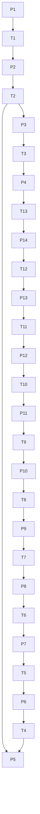
</details>

Fig. 7 Illustrative enterprise’s port logistics operation process SPN Table 10 Implications of the port logistics SPN place and transition

<table><tr><td>Place</td><td>Meaning</td><td>Transi-tion</td><td>Meaning</td></tr><tr><td>P1</td><td>Shipper (A8)</td><td>T1</td><td>Ship arriving in port (P1)</td></tr><tr><td>P2</td><td>Vessel information (I7)</td><td>T2</td><td>Vessel waiting for berth allocation (P2)</td></tr><tr><td>P3</td><td>Regulatory release information (I1)</td><td>T3</td><td>Vessel approaching port (P3)</td></tr><tr><td>P4</td><td>Container liner information (I2)</td><td>T4</td><td>Container liner (P4)</td></tr><tr><td>P5</td><td>Accountant (A7)</td><td>T5</td><td>Bill review (P5)</td></tr><tr><td>P6</td><td>Loading and unloading machinery infor-mation (I3)</td><td>T6</td><td>Loading and unloading operations (P6)</td></tr><tr><td>P7</td><td>Stockyard information (I4)</td><td>T7</td><td>Loading and unloading operations (P6)</td></tr><tr><td>P8</td><td>Longshoreman (A4)</td><td>T8</td><td>Stockpile storage (P7)</td></tr><tr><td>P9</td><td>Intra-port information (I5)</td><td>T9</td><td>Intra-port consolidation vehicle transport (P9)</td></tr><tr><td>P10</td><td>Longshoreman (A4)</td><td>T10</td><td>Intra-port consolidation vehicle transport (P9)</td></tr><tr><td>P11</td><td>Regulatory release information (I1)</td><td>T11</td><td>Bill review (P5)</td></tr><tr><td>P12</td><td>Accountant (A7)</td><td>T12</td><td>Customs supervision (P10)</td></tr><tr><td>P13</td><td>Customs inspector (A1)</td><td>T13</td><td>Vessels leaving port (P11)</td></tr><tr><td>P14</td><td>Valets (A3)</td><td></td><td></td></tr><tr><td>P15</td><td>Consignee</td><td></td><td></td></tr></table>

First, this paper needs to validate the validity of the already established SPN model of the illustrative enterprise. Based on the already established SPN model of the illustrative enterprise port logistics D&A system, the correlation matrix ?? is calculated as Equation (12).

$$
A = \left( \begin{array}{c c c c c c c c c c c c} - 1 & 1 & 0 & 0 & 0 & 0 & 0 & 0 & 0 & 0 & 0 & 0 \\ 0 & - 1 & 1 & 0 & 0 & 0 & 0 & 0 & 0 & 0 & 0 & 0 \\ 0 & 0 & - 1 & 1 & 0 & 1 & 0 & 0 & 0 & 0 & 0 & 0 \\ 0 & 0 & 0 & - 1 & 1 & 0 & 0 & 0 & 0 & 0 & 0 & 0 \\ 0 & 0 & 0 & 0 & 0 & - 1 & 1 & 0 & 0 & 0 & 0 & 0 \\ 0 & 0 & 0 & 0 & 0 & 0 & - 1 & 1 & 0 & 0 & 0 & 0 \\ 0 & 0 & 0 & 0 & 0 & 0 & 0 & - 1 & 1 & 0 & 0 & 0 \\ 0 & 0 & 0 & 0 & 0 & 0 & 0 & 0 & - 1 & 1 & 0 & 0 \\ 0 & 0 & 0 & 0 & 0 & 0 & 0 & 0 & 0 & - 1 & 1 & 0 \\ 0 & 0 & 0 & 0 & 0 & 0 & 0 & 0 & 0 & 0 & - 1 \end{array} \right) \tag {12}
$$

Solve for ???? = 0 to obtain a set of invariant bits.

$$
X _ {1} = (1, 1, 1, 1, 0, 1, 0, 0, 0, 0, 1, 1) ^ {T} \tag {13}
$$

$$
X _ {2} = (1, 1, 1, 0, 1, 0, 1, 1, 1, 1, 1, 1) ^ {T} \tag {14}
$$

The following conclusions can be drawn from the correlation matrix ?? and the invariant ?? (Chahrour et al., 2021).

(1) All depots in the constructed model have input conditions, i.e., adjacent input variants and alternate depots and variants, indicating a very smooth articulation process of the port operation process.

(2) There are no processes in the constructed model that can never be performed. The model has neither isolated elements (places and transitions) nor connections between places or between transitions, which suggests that every process in the port operation can be executed.

The average delay and rate consumed by each transition in the SPN model of the illustrative enterprise is shown in Table 11.

Table 11 Illustrative enterprise SPN average transition delay and rate

<table><tr><td>Transition</td><td>Delay</td><td>Rate  $\lambda$ </td><td>Transition</td><td>Delay</td><td>Rate  $\lambda$ </td></tr><tr><td> $T_{1}$ </td><td>20</td><td>0.05</td><td> $T_{7}$ </td><td>10</td><td>0.1</td></tr><tr><td> $T_{2}$ </td><td>15</td><td>0.00667</td><td> $T_{8}$ </td><td>20</td><td>0.05</td></tr><tr><td> $T_{3}$ </td><td>30</td><td>0.0333</td><td> $T_{9}$ </td><td>10</td><td>0.1</td></tr><tr><td> $T_{4}$ </td><td>10</td><td>0.1</td><td> $T_{10}$ </td><td>3</td><td>0.333</td></tr><tr><td> $T_{5}$ </td><td>5</td><td>0.2</td><td> $T_{11}$ </td><td>1</td><td>1</td></tr><tr><td> $T_{6}$ </td><td>3</td><td>0.333</td><td></td><td></td><td></td></tr></table>

The equation for the probabilistic relationship between the states of the system is calculated, as in Equation (15).

$$
\left\{ \begin{array}{c} \lambda_ {1} x _ {0} = \lambda_ {1 1} x _ {1 3} \\ \lambda_ {2} x _ {1} = \lambda_ {1} x _ {0} \\ \lambda_ {3} x _ {2} = \lambda_ {2} x _ {2} \\ (\lambda_ {4} + \lambda_ {5}) x _ {3} = \lambda_ {3} x _ {2} \\ (\lambda_ {4} + \lambda_ {6}) x _ {4} = \lambda_ {5} x _ {3} \\ (\lambda_ {4} + \lambda_ {7}) x _ {5} = \lambda_ {6} x _ {4} \\ \lambda_ {4} x _ {6} = \lambda_ {7} x _ {5} \\ \lambda_ {5} x _ {7} = \lambda_ {4} x _ {3} \\ \lambda_ {6} x _ {8} = \lambda_ {4} x _ {4} + \lambda_ {5} x _ {7} \\ \lambda_ {7} x _ {9} = \lambda_ {4} x _ {5} + \lambda_ {6} x _ {8} \\ \lambda_ {8} x _ {1 0} = \lambda_ {4} x _ {6} + \lambda_ {7} x _ {9} \\ \lambda_ {9} x _ {1 1} = \lambda_ {8} x _ {1 0} \\ \lambda_ {1 0} x _ {1 2} = \lambda_ {9} x _ {1 2} \\ x _ {1} + x _ {2} + x _ {3} + x _ {4} + x _ {5} + x _ {6} + x _ {7} + x _ {8} + x _ {9} + x _ {1 0} + x _ {1 1} + x _ {1 2} + x _ {1 3} = 1 \end{array} \right. \tag {15}
$$

The table of probabilities for each state was obtained by programming in MATLAB as follows.

Table 12 Steady state probability values for each marker

<table><tr><td>Steady state markers</td><td>Probability</td><td>Steady state markers</td><td>Probability</td></tr><tr><td> $P(M_0)$ </td><td>0.1672</td><td> $P(M_7)$ </td><td>0.0139</td></tr><tr><td> $P(M_1)$ </td><td>0.1254</td><td> $P(M_8)$ </td><td>0.0122</td></tr><tr><td> $P(M_2)$ </td><td>0.2511</td><td> $P(M_9)$ </td><td>0.0622</td></tr><tr><td> $P(M_3)$ </td><td>0.0279</td><td> $P(M_{10})$ </td><td>0.1672</td></tr><tr><td> $P(M_4)$ </td><td>0.0129</td><td> $P(M_{11})$ </td><td>0.0836</td></tr><tr><td> $P(M_5)$ </td><td>0.0214</td><td> $P(M_{12})$ </td><td>0.0251</td></tr><tr><td> $P(M_6)$ </td><td>0.0214</td><td> $P(M_{13})$ </td><td>0.0084</td></tr></table>

According to the reachable tree of the reachable SPN model of the process, the token distribution in each representation state can be obtained.

Table 13 Identification status and inclusion of place and place busy probability

<table><tr><td>Maker</td><td>Place</td><td>Busy probability</td><td>Maker</td><td>Place</td><td>Busy probability</td></tr><tr><td> $M_0$ </td><td> $P_1$ </td><td>--</td><td> $M_7$ </td><td> $P_5/P_6$ </td><td>0.0251</td></tr><tr><td> $M_1$ </td><td> $P_2$ </td><td>0.1672</td><td> $M_8$ </td><td> $P_6/P_7$ </td><td>0.0836</td></tr><tr><td> $M_2$ </td><td> $P_3$ </td><td>0.1254</td><td> $M_9$ </td><td> $P_6/P_8$ </td><td>0.1886</td></tr><tr><td> $M_3$ </td><td> $P_4$ </td><td>0.2511</td><td> $M_{10}$ </td><td> $P_6/P_9$ </td><td>0.0836</td></tr><tr><td> $M_4$ </td><td> $P_4/P_7$ </td><td>0.0836</td><td> $M_{11}$ </td><td> $P_{10}$ </td><td>0.02511</td></tr><tr><td> $M_5$ </td><td> $P_4/P_5/P_8$ </td><td>0.0418</td><td> $M_{12}$ </td><td> $P_{11}$ </td><td>0.0084</td></tr><tr><td> $M_6$ </td><td> $P_4/P_9$ </td><td>0.255</td><td> $M_{13}$ </td><td> $P_{12}$ </td><td>--</td></tr></table>

The paper then calculated the system average token number of places, the average marker flow rate into the system and the average system delay time in the illustrative enterprise.

$$
\bar {N} = \overline {{{\mu_ {2}}}} + \dots + \overline {{{\mu_ {1 0}}}} = P [ M (P _ {2}) = 1 ] + \dots + P [ M (P _ {1 0}) = 1 ] = 1. 1 7 1 8 \tag {16}
$$

$$
\lambda = R (T _ {1}, P _ {2}) = U (T _ {1}) \times \lambda_ {1} = 8. 3 6 \times 1 0 ^ {- 3} \tag {17}
$$

$$
N = \frac {\overline {{N}}}{\lambda} = 1 4 0. 1 6 7 \tag {18}
$$

According to the calculation results, the average delay of the SPN of the example enterprise port logistics D&A system reaches 140.167 minutes. In the next section, we will optimize the example enterprise SPN to reduce the delay time of transport vehicles in ports.

## 5.3 Port Logistics Optimization for the Illustrative Enterprise

Based on the developed standard D&A system meta-network model, an optimized SPN model was developed. The main changes compared to the unoptimized illustrative enterprise model are:

(1) The provision of vessel information to the customs department immediately upon arrival of the vessel is shown as T2 ahead of schedule, in parallel with T3.  
(2) Container unloading is carried out in parallel with ticket checking and is represented in the model as T4 and T5 in parallel.  
(3) The previous manual checking of box numbers has been replaced by an automatic check using the RFID container tagging system.


<details>
<summary>flowchart</summary>

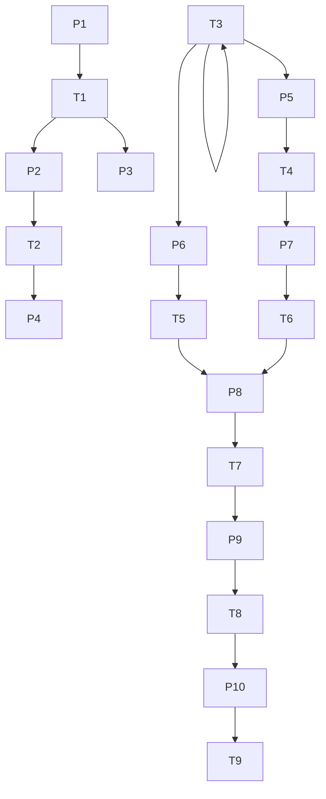
</details>

Fig. 8 Optimized illustrative enterprise SPN model

Table 14 Optimized implications of the port logistics SPN place and transition

<table><tr><td>Place</td><td>Meaning</td><td>Transi-tion</td><td>Meaning</td></tr><tr><td>P1</td><td>Shipper (A8)</td><td>T1</td><td>Ship arriving in port (P1)</td></tr><tr><td>P2</td><td>Vessel information (I7)</td><td>T2</td><td>Vessel waiting for berth allocation (P2)</td></tr><tr><td>P3</td><td>Regulatory release information (I1)</td><td>T3</td><td>Vessel approaching port (P3)</td></tr><tr><td>P4</td><td>Loading and unloading machinery information (I3)</td><td>T4</td><td>Container liner (P4)</td></tr><tr><td>P5</td><td>Stockyard information (I4)</td><td>T5</td><td>Loading and unloading operations (P6)</td></tr><tr><td>P6</td><td>Longshoreman (A4)</td><td>T6</td><td>Stockpile storage (P7)</td></tr><tr><td>P7</td><td>Intra-port information (I5)</td><td>T7</td><td>Intra-port consolidation vehicle transport (P9)</td></tr><tr><td>P8</td><td>Longshoreman (A4)</td><td>T8</td><td>Customs supervision (P10)</td></tr><tr><td>P9</td><td>Customs inspector (A1)</td><td>T9</td><td>Vessels leaving port (P11)</td></tr><tr><td>P10</td><td>Consignee</td><td></td><td></td></tr></table>

The system average delay and rate of each transition in the SPN model after structural optimization based on the meta-network is shown in Table 15. Due to the strengthened management and organization of the operation, the working time of the container unloading operation has been shortened, so the delay of the corresponding transition T4 has been reduced from 30-time units to 20-time units.

Table 15 Optimized illustrative enterprise SPN average transition delay and rate

<table><tr><td>Transition</td><td>Delay</td><td>Rate  $\lambda$ </td><td>Transition</td><td>Delay</td><td>Rate  $\lambda$ </td></tr><tr><td> $T_{1}$ </td><td>20</td><td>0.05</td><td> $T_{6}$ </td><td>10</td><td>0.1</td></tr><tr><td> $T_{2}$ </td><td>10</td><td>0.1</td><td> $T_{7}$ </td><td>20</td><td>0.05</td></tr><tr><td> $T_{3}$ </td><td>15</td><td>0.0667</td><td> $T_{8}$ </td><td>10</td><td>0.1</td></tr><tr><td> $T_{4}$ </td><td>20</td><td>0.05</td><td> $T_{9}$ </td><td>1</td><td>1</td></tr><tr><td> $T_{5}$ </td><td>5</td><td>0.2</td><td></td><td></td><td></td></tr></table>

The same as the calculation process before optimizing the example enterprise SPN, the system average token number of the place, the average mark flow rate flowing into the system and the system average delay time were calculated.

$$
\bar {N} = \overline {{\mu_ {2}}} + \dots + \overline {{\mu_ {1 0}}} = P [ M (P _ {2}) = 1 ] + \dots + P [ M (P _ {1 0}) = 1 ] = 1. 5 8 2 9 \tag {19}
$$

$$
\lambda = R (T _ {1}, P _ {2}) = U (T _ {1}) \times \lambda_ {1} = 1. 8 4 1 \times 1 0 ^ {- 2} \tag {20}
$$

$$
N = \frac {\overline {{N}}}{\lambda} = 8 5. 9 8 0 \tag {21}
$$

After we optimized the SPN model of the illustrative enterprise based on the standard e port logistics D&A system meta-network model, the average system delay was reduced by 38.7%, 54.187 minutes.


<details>
<summary>bar chart</summary>

Illustrative enterprise system performance
| Category | Before optimization (min) | After optimization (min) |
| :--- | :--- | :--- |
| Illustrative enterprise system delay (min) | 140.167 | 85.98 |
| Performance Pie Chart | Before optimization (62%) | After optimization (38%) |
</details>

Fig. 9 Illustrative enterprise system performance comparison before and after optimization

## 6 Sensitivity Analysis

## 6.1 Sensitivity Analysis of the Standard Port Logistics D&A System Maturity

This paper introduces Monte Carlo stochastic simulations to validate the developed MNA-PCA based maturity assessment model for standard port logistics D&A systems. The Monte Carlo simulation contains a total of four scenarios, which are the random removal of one node, two nodes, three nodes and four nodes from the standard DA system meta-network. Fifty simulations were performed for each scenario, and the average of 12 D&A system maturity indicators was recorded. The average value of the indicators for each scenario was compared to the indicators for the standard meta-network, and a sensitivity analysis was performed, as shown in Fig. 10. As shown in Fig. 10, the overall change in the indicator for the scenario where four nodes are removed is significant, while the indicator remains relatively flat when one node is removed. Notably, the changes in the sensitivity of the indicators at the four deleted nodes are consistent with the changes in the indicators of the illustrative enterprise selected in this paper, demonstrating the stability and feasibility of the model developed in this paper.


<details>
<summary>line chart</summary>

|        | 1     | 2     | 3     | 4     |
| ------ | ----- | ----- | ----- | ----- |
| ATNC   | -0.05 | 0.02  | 0.09  | 0.57  |
| TAW    | 0.01  | -0.01 | 0.07  | 0.11  |
| RBTC   | -0.08 | 0.14  | 0.16  | 0.24  |
| DIBTC  | 0.02  | 0.11  | 0.24  | -0.05 |
| PTNC   | -0.03 | 0.35  | 0.11  | 0.11  |
| DIO    | -0.04 | 0.12  | 0.29  | 0.18  |
| DIAW   | 0.01  | 0.20  | 0.20  | 0.22  |
| DIBTC  | 0.21  | 0.13  | 0.17  | 0.25  |
| PDINC  | 0.06  | 0.06  | 0.16  | 0.07  |
| STC    | -0.01 | -0.01 | 0.03  | 0.29  |
| ASTIP  | -0.02 | -0.01 | 0.02  | 0.07  |
| TO     | -0.01 | -0.01 | 0.10  | 0.20  |
</details>

Fig. 10 Sensitivity analysis of indicators in different scenarios

## 6.2 Sensitivity Analysis of the Illustrative Enterprise Port Logistics SPN

This paper selected the most likely busy states $M _ { 3 }$ and $M _ { 9 }$ in Table 13 for sensitivity simulations (Elusakin and Shafiee, 2020). We changed the $\lambda _ { 3 }$ and $\lambda _ { 9 }$ corresponding to the two states continuously in units of 0.01 from 0.01 to 1, thus calculating the change in the prob ability of stranding of the transport equipment, as shown in Fig. 11. We can fit this surface to quantitatively calculate the detention probability of transportation equipment and provide a basis for the decision-making of port enterprises.


<details>
<summary>3d surface plot</summary>

| λ₃   | P     |
|------|-------|
| 0.5  | 0.382 |
| 0.4  | 0.384 |
| 0.3  | 0.386 |
| 0.2  | 0.388 |
| 0.1  | 0.390 |
| 0.0  | 0.388 |
| 0.1  | 0.386 |
| 0.2  | 0.384 |
| 0.3  | 0.382 |
| 0.4  | 0.380 |
| 0.5  | 0.378 |
| 0.6  | 0.376 |
| 0.7  | 0.374 |
| 0.8  | 0.376 |
| 0.9  | 0.378 |
| 1.0  | 0.380 |
</details>

Fig. 11 Change surface of transportation equipment detention probability

## 7 Application Recommendations for ICM Corporation’s D&A System and Model Extensions

## 7.1 D&A System Application Recommendations

According to the maturity assessment results and the SPN port optimization results of the illustrative enterprise, we can see that the D&A system meta-network model established in this paper has good results.

The D&A system maturity assessment model based on MNA-PCA is easy to operate. Ac cording to the standard D&A system meta-network model, it is only necessary for an ICM company to delete the nodes or links that the company cannot realize. Then, the model will present the ICM company's port logistics system, calculate the ICM company's D&A system maturity score, and detect the problems existing in the system. The SPN model for port logistics is highly accurate and integrative and can simulate the average delay of ICM ports to the greatest extent possible.

The D&A system maturity indicators screened by the meta-network analysis method in this paper effectively address the relevant requirements of the ICM departments for D&A systems. In addition, the indicators selected relate to the interaction process between people, technology, processes and data information, which can better inform do not decisions for the ICM management team.

## 7.2 Model’s Industry Extensions

The key to the cross-industry extension of the model developed in this paper is to analyze the differences in logistics operations across industries. The people, technology, process and data information involved in logistics processes are different in different industries. The crossindustry extension of the model first requires the construction of meta-network models of logistics D&A systems in different industries. The steps for specific model expansion are shown below in Fig. 12.

(1) Original data collection

<table><tr><td>As Victoria station and the Manchester Arena are owned by Network Rail, British Transport Police (BTP) has the primary responsibility for policing both locations. The BTP officers started to work with Arena staff (SMG) and others to provide first aid to the injured.</td></tr><tr><td>On Wednesday 24th May, Network Rail (NR) were requested by BTP to examine the damage to the Arena&#x27;s glazed atrium roof.</td></tr><tr><td>SMG described to the Panel how each event at the Arena is assessed in advance of being held and a decision made about the level of security and medical cover required. Once complete, these risk assessments are sent directly to the venue&#x27;s multi-agency partners in advance of the event.</td></tr><tr><td>It is the Panel&#x27;s opinion that the Counter Terrorist response deployed by GMP following the Arena attack was completely proportionate and appropriate. Furthermore, it is the Panel&#x27;s opinion that in the interests of public safety, the large-scale intensive deployment of firearms capability in response to any sort of terrorist attack is appropriate, particularly so given Europe&#x27;s recent experience of the risk of cascading attacks occurring.</td></tr><tr><td>What they were confronted with also led NWAS personnel to activate their plan, which meant that only sufficient essential NWAS personnel and resources were deployed directly into the foyer to triage casualties, whilst also encouraging and supporting others (including members of the public) to provide basic first aid on their behalf.</td></tr></table>

(2) Structured Dataset Development

<table><tr><td colspan="4">Entities</td><td colspan="3">Relationships</td></tr><tr><td>Types of entities</td><td>Label Number</td><td>Entities</td><td>The stage</td><td>Types of relationship</td><td>Relationships</td><td>The stage</td></tr><tr><td rowspan="10">Agent</td><td>A01</td><td>BTP</td><td>Disaster prevention stage</td><td rowspan="10">AA</td><td>A01 and A11 have interactions</td><td>Disaster prevention stage</td></tr><tr><td>A11</td><td>NR</td><td>Disaster prevention stage</td><td rowspan="3">A01 and A15 have interactions</td><td rowspan="3">Disaster resistance stage</td></tr><tr><td>A15</td><td>SMG</td><td>Disaster prevention stage</td></tr><tr><td>A01</td><td>BTP</td><td>Disaster resistance stage</td></tr><tr><td>A15</td><td>SMG</td><td>Disaster resistance stage</td><td>A01 and A11 have interactions</td><td>Function recovery stage</td></tr><tr><td>A07</td><td>GMP</td><td>Disaster resistance stage</td><td>A15 is assigned to PT05</td><td>Disaster prevention stage</td></tr><tr><td>A12</td><td>NWAS</td><td>Disaster resistance stage</td><td>A15 is assigned to PT06</td><td>Disaster prevention stage</td></tr><tr><td></td><td></td><td></td><td>A12 is assigned to RT09</td><td>Disaster resistance stage</td></tr><tr><td>A01</td><td>BTP</td><td>Function recovery stage</td><td></td><td></td></tr><tr><td>A11</td><td>NR</td><td>Function recovery stage</td><td></td><td></td></tr><tr><td rowspan="11">Resource Knowledge Task</td><td>R05</td><td>First aid</td><td>Disaster resistance stage</td><td rowspan="11">AR</td><td>A01 is assigned to FT17</td><td>Function recovery stage</td></tr><tr><td>K01</td><td>The level of security and medical cover required</td><td>Disaster prevention stage</td><td>A11 is assigned to FT17</td><td>Function recovery stage</td></tr><tr><td rowspan="2">K21</td><td rowspan="2">The large-scale intensive deployment of firearms capability</td><td rowspan="2">Disaster resistance stage</td><td>A01 owns R05</td><td>Disaster resistance stage</td></tr><tr><td>A15 owns R05</td><td>Disaster resistance stage</td></tr><tr><td rowspan="2">PT05</td><td rowspan="2">Decide the level of security and medical cover required and arrange field personnel for the event;</td><td rowspan="2">Disaster prevention stage</td><td>A12 owns R05</td><td>Disaster resistance stage</td></tr><tr><td>A15 knows K01</td><td>Disaster prevention stage</td></tr><tr><td rowspan="2">PT06</td><td rowspan="2">Send these risk assessments directly to the multi-agency partners in advance;</td><td rowspan="2">Disaster prevention stage</td><td>A07 knows K21</td><td>Disaster resistance stage</td></tr><tr><td>K01 is required for PT05</td><td>Disaster prevention stage</td></tr><tr><td>RT09</td><td>Triage casualties</td><td>Disaster resistance stage</td><td></td><td></td></tr><tr><td>FT17</td><td>Examine the damage to the Arena&#x27;s glazed atrium roof</td><td>Function recovery stage</td><td>R05 is required for RT09</td><td>Disaster resistance stage</td></tr><tr><td></td><td></td><td></td><td>PT06 is helped on PT05</td><td>Disaster prevention stage</td></tr></table>

(4) Visualized Meta-network Generation  


<details>
<summary>flowchart</summary>

Meta-network architecture diagram showing interactions between agents, resources, and tasks across disaster prevention and resistance stages.
</details>

(3) Meta-network Matrix Development  


<details>
<summary>flowchart</summary>

Meta-matrix and AR-Meta-matrix in disaster prevention and resistance stages diagram, showing progression from A1 to TT with red arrows indicating transitions.
</details>

Fig. 12 Model expansion flow chart

Step 1: Gather critical information on the logistics processes of the target industry. Sources of information can be government documents, agency reports or academic publications, etc.  
Step 2: Determine the nodes and links of the meta-network according to the enterprise's objectives of building the D&A system. The D&A system meta-network model nodes can be people, knowledge, resources, and processes.  
Step 3: Identify the sub-networks and determine the correlation between sub-network nodes.  
Step 4: Input critical nodes and correlations into the D&A system meta-network model to visualize the meta-network.  
Step 5: Finally, a meta-network-based enterprise D&A system maturity assessment and enterprise logistics SPN model simulation is carried out.

The model developed in this paper is highly integrative, allowing additions, deletions and simulations to be made to the model at any time, and will reach a wide range of applications in different industries.

## 8 Model Evaluation

## 8.1 Strengths

1. This paper innovatively combines a meta-network model with a port logistics D&A system. The meta-network model effectively combines people, skills, processes and data information in port logistics operations. Solves the difficulties of port logistics companies with multiple associations and subjects when it comes to data governance.

2. The D&A system maturity assessment system was established through the association of meta-network analysis and principal component analysis. The DA maturity assessment indicators, which are systematic and comprehensive, enable the indicators to be given practical meaning from a multi-component perspective.  
3. An innovative proposal to build stochastic Petri nets isomorphic to meta-networks. This process greatly simplifies the complex process of traditional Petri net modelling. The developed SPN model can quantitatively assess the average delay of a company's port logistics system.  
4. The meta-network model applied in this paper is highly extensible and provides new ideas and perspectives for port logistics data information governance.

## 8.2 Weaknesses

1. Only one representative enterprise has been selected to demonstrate the model proposed in this paper. Future research could add example systems.  
2. The meta-network model of the port logistics D&A system established in this paper is based on the literature and relevant policy documents only and can be subject to expert consultation in the event of sufficient time.

## References:

Almotairi, B. & Lumsden, K. (2009), "Port logistics platform integration in supply chain management", International Journal of Shipping and Transport Logistics, Vol. 1 No. 2, pp. 194-210.  
Carley, K. M., Diesner, J., Reminga, J. & Tsvetovat, M. (2007), "Toward an interoperable dynamic network analysis toolkit", Decision Support Systems, Vol. 43 No. 4, pp. 1324-1347.  
Chahrour, N., Nasr, M., Tacnet, J. & Bérenguer, C. (2021), "Deterioration modeling and maintenance assessment using physics-informed stochastic Petri nets: Application to torrent protection structures", Reliability Engineering & System Safety, Vol. 210107524.  
Elusakin, T. & Shafiee, M. (2020), "Reliability analysis of subsea blowout preventers with condition-based maintenance using stochastic Petri nets", Journal of Loss Prevention in the Process Industries, Vol. 63104026.  
Lee, J. & Mitici, M. (2020), "An integrated assessment of safety and efficiency of aircraft maintenance strategies using agent-based modelling and stochastic Petri nets", Reliability Engineering & System Safety, Vol. 202107052.  
Pestov, I. (2009), "Dynamic network analysis for understanding complex systems and processes", Defence Research and Development Canada,.  
S., B., A., S. & L., K. (2015), "Main factors to select a cruise homeport in the Mediterranean region: A perspective from the cruise industry agents", in 2015 International Conference on Logistics, Informatics and Service Sciences (LISS), pp. 1-5.  
Wold, S., Esbensen, K. & Geladi, P. (1987), "Principal component analysis", Chemometrics and Intelligent Laboratory Systems, Vol. 2 No. 1, pp. 37-52.

## ICM Corporation

## --The Value Creation of Port Logistics Big Data

Dear Port Users：

I would like to thank you for your trust in choosing ICM Corporation as your partner. ICM Corporation insists on being customer-oriented and adheres to the concept of “people-oriented and win-win cooperation”. Bringing tremendous success to our customers is a constant motivation for us at ICM Corporation. ICM Corporation has implemented the new logistics core strategy of “Supply Chain + Big Data + AIOT” and created a data and analytics (D&A) system with independent intellectual property rights. ICM Corporation conducted a four-day D&A system maturity assessment and optimization exercise on 2022.2.18.

## Overview of Targets

Maximizing the value of ICM Corporation’s data assets.  
Measuring the maturity capability of ICM Corporation’s D&A system through people, technologies and processes.  
Optimizing the D&A system architecture to improve system analysis.

##  Solutions

The consulting team develops a standard D&A system meta-network model based on the port logistics industry’s most advanced D&A system architecture. The model effectively realizes the visual integration of people, relevant technologies, mature processes and data information. Through meta-network analysis, 12 practically meaningful indicators were selected to construct the D&A system maturity assessment system. Feeding the current status of ICM’s D&A system into a standard D&A system meta-network enables the assessment of the maturity of ICM’s D&A system.

Based on ICM’s D&A system, the consultancy team constructed a stochastic Petri network model (SPN) for port logistics. The SPN model enables the simulation of logistic transport detention times based on ICM’s D&A system data. Finally, ICM’s D&A system optimization is implemented based on the standard D&A system meta-network model.

## Results Analysis

ICM's D&A system maturity assessment level is Excellent.  
The average dwell time of port transport equipment decreased by 38.7%.

ICM’s D&A systems consultancy project has shown that the modelling tools provided by the consultancy are a powerful tool for assessing and planning logistics business processes. ICM Corporation will continue to work with this consultancy to continuously improve the data asset application capabilities of the D&A system. ICM Corporation will strive to develop into a preeminent port logistics service provider, offering our customers complete logistics solutions and logistics services. We hope you will keep your faith in ICM’s D&A system and ICM Corporation!

Yours sincerely, ICM Corporation