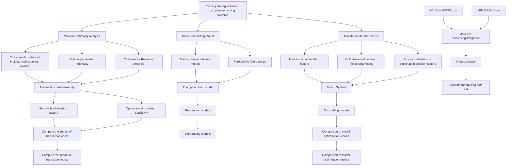
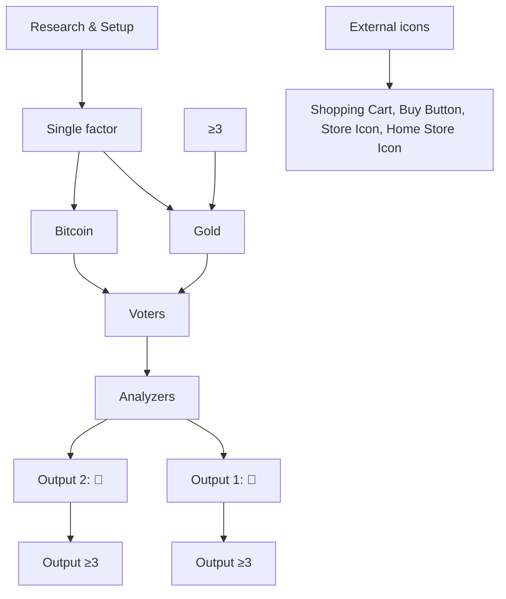

# Trading strategies based on voting systems

Summary

In order to better maximize investment returns, traders are always looking to study historical price movements in order to develop effective trading strategies. In this paper, we introduce classical factors of stock investment based on the historical prices of bitcoin and gold, and use a mathematical optimization model to calculate the optimal parameters of the factors, and subsequently form a portfolio investment strategy by composing the factors into a voting system on this basis. An improved investment strategy based on forecasting and risk control is then proposed. Finally, the optimality of the scenarios is analyzed and the extent to which transaction costs affect the assets and strategies is investigated.

We screened MACD, KDJ and other closing price based stock buying and selling decision factors. Firstly, aiming at the maximum return on investment, a mathematical programming model for solving the optimal parameters of a decision factor is constructed by using the data of the first year, and these optimal parameters are calculated by MATLAB. On this basis, the relationship between investment efficiency and these parameters is studied under a single investment strategy composed of one decision-making factor. The results found that: in bitcoin, MACD and WR factors have significantly better returns than KDJ and BOLL indicators under the optimal parameters of a single investment strategy; in gold, MACD and WR factors have significantly better returns than KDJ and BOLL indicators under the optimal investment. Therefore, we selected six factors with better performance, such as DMA, RSI and MACD, to constitute the voting mechanism for investment decision to determine whether to trigger transactions. And used the Mean-Variance model to determine the proportion of positions when holding two investment products at the same time, thus constituting a portfolio investment strategy. Through the strategy we found that the initial investment capital of \$1,000 for 5 years ended up with \$125,716.87 in assets and an average annualized return of 162.53%.

Subsequently, to improve the accuracy of triggered trades, we use LSTM model to predict the price, and use predictive values in the calculation of investment factors. We also incorporate the risk control scheme of forced stop loss into the improved investment strategy. By improving we found that the initial investment capital of \$1,000 for 5 years ended up with assets of \$190,635.58 with an average annualized return of 185.49% which is 14% higher than before.

We also analyze the optimality of the scheme and find that effective factors can improve the return on investment by analyzing the scientific nature of the factors, the calculation of optimal parameters, and the high return on investment perspectives. In addition to this using a mathematical planning model assuming God's perspective to arrive at its optimal solution and asset return, we find that the maximum asset in God's perspective is \$14,362,722,337.67 and the maximum return generated by our constructed model is only 0.0013% of it. But it is still far better than internationally renowned investment companies.

To better understand the impact of transaction costs on a single factor or investment strategy, we investigate the change in returns and number of trades for a single factor and investment strategy, respectively, when transaction costs change. It is found that an increase in each transaction costs in a single factor leads to a decrease in assets, some factors have a large de crease in the number of transactions with an increase in each transaction costs, and some factors have a slow and stable decrease in the number of transactions. Under the portfolio investment strategy we find that an increase in each transaction costs leads to a decrease in assets, and although the number of transactions decreases, it is more stable overall. This indicates that our strategy is more stable overall and has a better advantage compared to a single indicator.

## Contents

## 1 Introduction....

1.1 Background and Problem Statement..  
1.2 Problem Analysis 2  
1.3 Our work .

## 2 Assumptions and Justifications.....

## 3 Notations .....

## 4 Investment Models for Bitcoin and Gold..

4.1 Data preprocessing.... 5  
4.2 Bitcoin and Gold Investment Decision Factor Selection ..  
4.3 Factor parameter optimization for bitcoin and gold investments . .8  
4.4 Optimal parameters and total assets.. 14  
4.5 Voting system-based portfolio investment decision model. .14  
4.6 Model improvement based on forecasting and risk control. 17

## 5 Solution Optimality Analysis .... ..19

5.1 Science of classical factor selection.. 19  
5.2 Optimization model based on prediction and risk control . .20  
5.3 Results.. .20  
5.4 Comparison with optimal possible returns ... .20  
5.5 Comparison of earnings with investment companies ... ..20

## 6 Stability analysis of investment strategies on transaction costs ................21

6.1 Impact of transaction costs on single factor decision making .21  
6.2 Investment strategy is influenced by transaction costs . .22

## References .... .23

## MEMO .... .24

## 1 Introduction

## 1.1 Background and Problem Statement

For market traders the issue of quantitative strategies. On the one hand, traders are constantly trading at high frequencies to buy and sell assets in order to increase investment returns and reduce losses, which leads to high volatility[1]. On the other hand, traders need to pay a commission for buying and selling, and the prices of the two assets, gold and bitcoin, are also volatile.

Considering the background information and constraints identified in the problem statement, we need to address the following questions.

C By designing a model and designing the perfect trading strategy based on the price data of the cut-off date, and using the designed strategy and model to calculate the value at the initial value of \$1000 on September 10, five years later.  
Provide relevant evidence that demonstrates the best strategy.  
C Calculate the sensitivity of strategy to transaction costs and analyze the degree of impact of transaction costs on strategy and final costs.

## 1.2 Problem Analysis

Task 1: requires designing a model and optimal strategy and calculating the value after five years.

In this paper, the closing price based decision factor for buying and selling stocks is screened. In order to be more beneficial for investment, the data optimization model is used to optimize the indicator parameters and the optimal parameters are obtained by MATLAB, after which the voting system is composed and the model is improved. The LSTM model is then used to calculate the investment factor using predicted values and incorporating a risk control scheme of mandatory stop loss.

Task 2: requires analysis of the optimality of the strategy.

This paper first analyzes the scientific validity of the selected metrics and then compares them with the God's perspective investment returns and the investment returns of quality investment companies to demonstrate the optimality of the strategy.

Task 3: requires the calculation of the sensitivity and impact of transaction costs.

This paper observes the change in investment returns and the change in the number of trades through the change in transaction costs, and analyzes the impact of transaction costs on the strategy.

## 1.3 Our work

flowchart

Figure 1 : Our Work

## 2 Assumptions and Justifications

## Assumption 1: Bitcoin has no minimum trading unit limit

Justification: The minimum trading unit for Bitcoin is 0.01 BTC, but this is a small percentage of the funds, so this article assumes that there is no minimum trading unit for Bitcoin.

## Assumption 2: Gold futures without minimum trading unit restrictions

Justification: In order to be able to use all of your money when buying or selling, we ignore the minimum trading unit limit for gold futures.

## Assumption 3: Not considering systemic risk

Justification: Bitcoin and gold futures trading are subject to full market crashes, such as the bursting of the Bitcoin market bubble, and we have constructed our investment strategy to not consider the possibility of such extreme scenarios occurring.

## 3 Notations

The key mathematical notations used in this paper are listed in Table 1.

Table 1 :Notations used in this paper

<table><tr><td>Symbol</td><td>Description</td><td>Unit</td></tr><tr><td> $w_t$ </td><td>Closing price on day t</td><td>USD</td></tr><tr><td>M</td><td>Total Assets</td><td>USD</td></tr><tr><td> $B^{btc}$ </td><td>Number of Bitcoins</td><td>BTC</td></tr><tr><td> $B^{gd}$ </td><td>Amount of gold</td><td>Per troy ounce</td></tr><tr><td>C</td><td>Total Cash</td><td>USD</td></tr><tr><td>I</td><td>Buy Threshold</td><td>/</td></tr><tr><td>O</td><td>Sell Threshold</td><td>/</td></tr></table>

## 4 Investment Models for Bitcoin and Gold

In stock and futures trading, investors can measure and judge stock price trends based on external factors such as emergencies and related policies, but this is only a rough analysis of the subjective level, and some technical indicators can usually be used to quantitatively analyze price changes. Currently, domestic and international research has applied these metrics to machine learning models for forecasting in stocks and futu res. In the gold and cryptocurrency space, the trading data properties of gold and cryptocurrencies likewise have very similar characteristics to those of stocks[2]. Therefore we need to choose some representative and applicable technical indicators for gold and bitcoin in the topic to build a model to determine the timing of buying and selling in the trade.

## 4.1 Data preprocessing

The two data sets given in the question are the bitcoin trading price and gold trading price from September 11, 2016 to September 10, 2021, for a total of 1826 days. Since there is a market closure in gold trading, there is a lack of trading price of gold. For this, we use the previous day's trading price of the missing value as the current day's price for filling. Since the trigger mechanism of each decision factor we selected is mostly price fluctuation, the filling of missing values will not affect the decision factor determination.

## 4.2 Bitcoin and Gold Investment Decision Factor Selection

It has been found that in the securities market, there is a certain correlation between certain indicators and the return of the securities in a specific time period, and such value markers can help us to better select stocks or decide the timing of entry and exit, we call them factors. Factors in the stock market are usually divided into two categories: technical factors and financial factors. The technical factors include volume and price indicators, trend, overbought and oversold, energy indicators, pressure support and other types[2].

According to the two datasets given in the question, we can use data such as the prices of bitcoin and gold on different trading days (corresponding to the closing prices in the stock market). We therefore selected factors from the Wind Financial database and the factor library of the Mind Go platform that were calculated using only closing prices and their reconstructed data, and screened for factors that appear frequently in the literature related to quantitative trading strategies. We have selected 7 of these classic factors to use as the basis for building bitcoin and gold investment models. The KDJ, RSI and WR are overbought and oversold tech nical factors, the MACD, TRIX and DMA are trending technical factors, and the BOLL is a pressure-support technical factor. By consulting the literature, we briefly describe the significance, calculation methods, and determination signals of some of the factors as follows.

DMA, or Different of Moving Averager, uses two averages of different periods to determine the magnitude of current buying and selling energy and future price trends, with the following calculation formula defined[2].

$$
D M A (n _ {1}, n _ {2}, t) = \sum_ {i = 0} ^ {n _ {1} - 1} w _ {t - i} - \sum_ {i = 0} ^ {n _ {2} - 1} w _ {t - i} \tag {1}
$$

$$
A M A (n _ {1}, n _ {2}, t) = \frac {1}{1 0} D M A (n _ {1}, n _ {2}, t) \tag {2}
$$

In equation(1)(2), $w _ { t } .$ is the closing price of the day. $n _ { 1 }$ and $n _ { 2 }$ are the specific number of days of the long and short periods, which are parameters to be determined. When DMA is greater than AMA , it is a buy signal; conversely, when DMA is less than AMA , it is a sell signal.

RSI, or Relative Strength Index, RSI compares the average price change on up days with the average price change on down days in an attempt to determine how overbought or oversold an asset is, reflecting the boom in the market over a certain period of time, and is calculated using the formula defined below[2].

$$
R S I = 1 0 0 - \frac {1 0 0}{1 + \frac {\hat {r} _ {n}}{\hat {f} _ {n}}} \tag {3}
$$

In equation(3), $\hat { r } _ { n }$ is the average of the number of up days in the cycle, $\hat { f } _ { n }$ is the average of the number of down days in the cycle, and  n is the specific number of days in the cycle. When RSI is greater than O , it is considered as a sell signal; when RSI is less than I , it is considered as a buy signal. n , O and I are all parameters to be determined.

MACD, or Moving Average Convergence Divergence, is calculated from the difference between two Exponential Moving Average (EMA, also known as Weighted Moving Average) with different speeds (one with a fast rate of change and the other with a slow rate of change). The index is calculated by timing the purchase and sale of stocks and tracking the trend of stock price movement between the Differential value (DIF) and the Difference Exponential Average (DEA) values to obtain the MACD value[2]. The calculation formula is defined as follows.

$$
\begin{array}{l} E M A \left(n _ {1}, w _ {t}\right) = \frac {2}{n _ {1} + 1} C _ {t} + \left(1 - \frac {2}{n _ {1} + 1}\right) E M A \left(n _ {1}, w _ {t - 1}\right) \\ E M A (n _ {2}, w _ {t}) = \frac {2}{n _ {2} + 1} C _ {t} + (1 - \frac {2}{n _ {2} + 1}) E M A (n _ {2}, w _ {t - 1}) \tag {4} \\ D I F (n _ {1}, n _ {2}, w _ {t}) = E M A (n _ {1}, w _ {t}) - E M A (n _ {2}, w _ {t}) \\ D E A \left(n _ {1}, n _ {2}, w _ {t}\right) = \frac {2}{1 0} D I F \left(n _ {1}, n _ {2}, w _ {t}\right) + \frac {8}{1 0} D I F \left(n _ {1}, n _ {2}, w _ {t - 1}\right) \\ \end{array}
$$

In equation(4), $E M A ( n _ { 1 } , w _ { t } )$ is the $n _ { 1 }$ -day index-weighted moving average, $E M A ( n _ { 2 } , w _ { t } )$ is the $n _ { 2 }$ -day index-weighted moving average, $D I F ( n _ { 1 } , n _ { 2 } , w _ { t } )$ is the outlier, and $D E A ( n _ { 1 } , n _ { 2 } , w _ { t } )$ denotes the outlier average. $n _ { 1 }$ and $n _ { 2 }$ are the observation periods, which are usually 12 and 26 in the stock exchange market, and here are the parameters to be determined.

When both DIF and DEA are positive and DIF breaks through DEA upwards, it means that the price is steadily rising and is a buy signal; when both DIF and DEA are negative and DIF breaks through DEA downwards, it means that the stock price starts to fall and is a sell signal; when DIF breaks through the axis downwards and becomes negative, it is a sell signal and when DIF breaks through the axis upwards and becomes positive, it is a buy signal; when te trend of DIF is opposite to the trend of the stock price, it means that there is a reversal signal[4].

TRIX, or Triple Exponentially Smoothed Average, predicts the future trend of prices based on this moving average by smoothing an average three times, and the formula is defined as follows[5].

$$
\begin{array}{l} A X \left(n _ {1}, w _ {t}\right) = \frac {2}{n _ {1} + 1} w _ {t} + \left(1 - \frac {2}{n _ {1} + 1}\right) A X \left(n _ {1}, w _ {t - 1}\right) \\ B X \left(n _ {1}, w _ {t}\right) = \frac {2}{n _ {1} + 1} A X \left(n _ {1}, w _ {t}\right) + \left(1 - \frac {2}{n _ {1} + 1}\right) B X \left(n _ {1}, w _ {t - 1}\right) \tag {5} \\ \end{array}
$$

$$
T R I X \left(n _ {1}, w _ {t}\right) = \frac {2}{n _ {1} + 1} B X \left(n _ {1}, w _ {t}\right) + \left(1 - \frac {2}{n _ {1} + 1}\right) T R I X \left(n _ {1}, w _ {t - 1}\right)
$$

$$
T R M A (n _ {1}, w _ {t}) = \frac {1}{n _ {2}} \sum_ {i = 0} ^ {n _ {2} - 1} T R I X (n _ {1}, w _ {t - i})
$$

In equation(5), AX is one-fold exponential smoothing, BX is two-fold exponential smoothing, t is the current day, $n _ { \mathrm { 1 } }$ and $n _ { 2 }$ are the observation periods, all of which are parameters to be determined. WhenTRIX is greater thanTRMA , it is a buy signal, and whenTRIX is less than TRMA , it is a sell signal.

WR, the Williams Overbought/Oversold Index, which uses oscillation points to reflect the market's overbought and oversold phenomena, thus indicating a valid buy and sell signal, is defined by the following formula[6].

$$
W M S = \frac {w - w l _ {n}}{w h _ {n} - w l _ {n}} * 1 0 0 \tag {6}
$$

In equation(6), w is the closing price of the last day in the cycle, $w l _ { n }$ is the lowest closing price in the cycle, $w h _ { n }$ is the highest closing price in the cycle, and n is the specific number of days in the cycle, a parameter to be determined. When WMS is above I , it is oversold and is a buy signal. When WMS is below $o$ , it is overbought and a sell signal. n , I and $o$ are parameters to be determined.

BOLL, or Bollinger bands or Boll, is an indicator that uses bands to show their safe high and low price levels. The calculation formula is defined as follows.

$$
M A _ {t} = \frac {1}{n} \sum_ {t = 0} ^ {n} w _ {t} \quad M D _ {t} = \sqrt {\sum_ {t = 0} ^ {n} \left(w _ {t} M A _ {t}\right) * \frac {w _ {t} - M A _ {t}}{n}} \tag {7}
$$

$$
M B _ {t} = M A _ {t - 1} \qquad U P _ {t} = M B _ {t} + k ^ {*} M D _ {t} \qquad D N _ {t} = M B _ {t} - k ^ {*} M D _ {t}
$$

In equation(7), w is the closing price of the day, n is the specific number of days of the observation period, k is the multiplier, n and k are parameters to be determined. When w is less than DN , it is a buy signal, and when w is greater thanUP , it is a sell signal.

## 4.3 Factor parameter optimization for bitcoin and gold investments

Stock investments differ from bitcoin and gold investments in terms of trading cycles, etc. The parameters used in stock trading for each factor are not necessarily applicable to bitcoin and gold trading. In this paper, the RSI and MACD factors are used as separate decision factors for investing in bitcoin or gold, which are modeled for parameter optimization, and each parameter is related to the transaction cost .

The RSI factor has three parameters to be optimized, let n be the period, I be the buy threshold and O be the sell threshold. The model shown in equation(8) is an optimization model for the RSI factor when it is used only as a decision factor for investing in bitcoin.

$$
Z = \max M _ {n} ^ {b t c}
$$

$$
s. t. \left\{ \begin{array}{l} M _ {k + 1} ^ {b t c} = C _ {k + 1} ^ {b t c} + x _ {k + 1} ^ {b t c} B _ {k + 1} ^ {b t c} \\ C _ {k + 1} ^ {b t c} = C _ {k} ^ {b t c} + \left(1 - \alpha_ {b t c}\right) x _ {k + 1} ^ {b t c} B _ {k + 1} ^ {b t c} p _ {k + 1} ^ {b t c} - C _ {k} ^ {b t c} q _ {k + 1} ^ {b t c} \\ B _ {k + 1} ^ {b t c} = B _ {k} ^ {b t c} - B _ {k} ^ {b t c} q _ {k + 1} ^ {b t c} + \frac {C _ {k} ^ {b t c}}{x _ {k + 1} ^ {b t c} \left(1 + \alpha_ {b t c}\right)} p _ {k + 1} ^ {b t c} \\ p _ {k + 1} ^ {b t c} + q _ {k + 1} ^ {b t c} \leq 1 \\ p _ {k + 1} ^ {b t c} = \left\{ \begin{array}{c c} 1; R S T ^ {\prime} \left(t ^ {b t c}\right) \leq I ^ {b t c} \\ 0; & \text {other} \end{array} ; q _ {k + 1} ^ {b t c} = \left\{ \begin{array}{c c} 1; R S T ^ {\prime} \left(t ^ {b t c}\right) \geq O ^ {b t c} \\ 0; & \text {other} \end{array} \right. \right. \\ C _ {0} ^ {b t c} = 1 0 0 0, B _ {0} ^ {b t c} = 0, p _ {0} ^ {b t c} = 0, q _ {0} ^ {b t c} = 0, 1 \leq n \leq 1 0 0, 1 \leq I ^ {b t c} <   O ^ {b t c} \leq 1 0 0 \end{array} \right. \tag {8}
$$

In the above model, maxZ = $M _ { n } ^ { b t c }$ is the maximum total assets in the cycle. If day k has been bought, then $C _ { k } ^ { b t c } { = } 0$ , even though $p _ { k + 1 } ^ { b t c } = 1$ will not buy new bitcoins, and similarly if day k has been sold, then $B _ { k } ^ { b t c } { = } 0$ , even though $q _ { k + 1 } ^ { b t c } = 1$ will not perform a sell operation, so there will not be two consecutive buys or sells in this mathematical planning, and the mathematical planning model is reasonable. In addition, buying all the positions on the rise is more profitable, and selling all the positions on the fall is less lossy, so we assume that buying is all buying and selling is all selling.

$$
M _ {k + 1} ^ {b t c} = C _ {k + 1} ^ {b t c} + x _ {k + 1} ^ {b t c} B _ {k + 1} ^ {b t c} \tag {9}
$$

Equation(9) indicates that the total assets on day k +1 are the cash owned on that day plus the bitcoin price on that day multiplied by the number of bitcoins owned on that day.

$$
C _ {k + 1} ^ {b t c} = C _ {k} ^ {b t c} + \left(1 - \alpha_ {b t c}\right) x _ {k + 1} ^ {b t c} B _ {k + 1} ^ {b t c} q _ {k + 1} ^ {b t c} - C _ {k} ^ {b t c} p _ {k + 1} ^ {b t c} \tag {10}
$$

Equation(10) indicates that the total cash value on day k +1 is equal to that day's cash plus the cash received from selling bitcoins on that day minus the cash spent on buying bitcoins minus the transaction costs.

$$
B _ {k + 1} ^ {b t c} = B _ {k} ^ {b t c} - B _ {k} ^ {b t c} q _ {k + 1} ^ {b t c} + \frac {C _ {k} ^ {b t c}}{x _ {k + 1} ^ {b t c} (1 + \alpha_ {b t c})} p _ {k + 1} ^ {b t c} \tag {11}
$$

Equation(11) indicates that the number of bitcoins owned on day k +1 is equal to the number of bitcoins owned on the previous day minus the number of bitcoins sold on that day plus the number of bitcoins bought on that day.

$$
p _ {k + 1} ^ {b t c} + q _ {k + 1} ^ {b t c} \leq 1 \tag {12}
$$

Equation(12) indicates that there will be no simultaneous selling and buying of bitcoin in the same day.

$$
p _ {k + 1} ^ {b t c} = \left\{ \begin{array}{l l} 1; R S I ^ {\prime} \left(t ^ {b t c}\right) \leq I ^ {b t c} \\ 0; & \text {other} \end{array} ; q _ {k + 1} ^ {b t c} = \left\{ \begin{array}{l l} 1; R S I ^ {\prime} \left(t ^ {b t c}\right) \geq O ^ {b t c} \\ 0; & \text {other} \end{array} \right. \right. \tag {13}
$$

Equation(13) indicates that the buy or sell depends on the value of the modified RSI with respect to the size of the buy or sell threshold.

$$
C _ {0} ^ {b t c} = 1 0 0 0, B _ {0} ^ {b t c} = 0, p _ {0} ^ {b t c} = 0, q _ {0} ^ {b t c} = 0, 1 \leq n \leq 1 0 0, 1 \leq I ^ {b t c} <   O ^ {b t c} \leq 1 0 0 \tag {14}
$$

Equation(14) is the initial value of each parameter and the range of values of the required optimal parameters.

The model shown in Equation(15) is the parameter optimization model when the RSI factor is only used as the decision factor for investing in gold, where $\alpha _ { g d }$ is the commission for gold trading, and the rest of the parameter settings and symbolic meanings are the same as those described above, so we will not repeat them here.

$$
\begin{array}{l} Z = \max M _ {n} ^ {g d} \\ s. t. \left\{ \begin{array}{l} M _ {k + 1} ^ {g d} = C _ {k + 1} ^ {g d} + x _ {k + 1} ^ {g d} B _ {k + 1} ^ {g d} \\ C _ {k + 1} ^ {g d} = C _ {k} ^ {g d} + (1 - \alpha_ {g d}) x _ {k + 1} ^ {g d} B _ {k + 1} ^ {g d} p _ {k + 1} ^ {g d} - C _ {k} ^ {g d} q _ {k + 1} ^ {g d} \\ B _ {k + 1} ^ {g d} = B _ {k} ^ {g d} - B _ {k} ^ {g d} q _ {k + 1} ^ {g d} + \frac {C _ {k} ^ {g d}}{x _ {k + 1} ^ {g d} (1 + \alpha_ {g d})} p _ {k + 1} ^ {g d} \\ p _ {k + 1} ^ {g d} + q _ {k + 1} ^ {g d} \leq 1 \\ p _ {k + 1} ^ {g d} = \left\{ \begin{array}{c c} 1; R S T ^ {\prime} (t ^ {g d}) \leq I ^ {g d} \\ 0; & \text {other} \end{array} ; q _ {k + 1} ^ {g d} = \left\{ \begin{array}{c c} 1; R S T ^ {\prime} (t ^ {g d}) \geq O ^ {g d} \\ 0; & \text {other} \end{array} \right. \right. \\ C _ {0} ^ {g d} = 1 0 0 0, B _ {0} ^ {g d} = 0, p _ {0} ^ {g d} = 0, q _ {0} ^ {g d} = 0, 1 \leq n \leq 1 0 0, 1 \leq I ^ {g d} <   O ^ {g d} \leq 1 0 0 \end{array} \right. \tag {15}
$$

We calculated the optimal solution of the RSI factor for the parameters to be determined based on the above parameter optimization model using the bitcoin price from September 11,

2016 to September 10, 2017 by Matlab programming as shown in Figure 2 and Figure 3.

scatterplot

| RSI:O | RSI:I | RSI:M |
|-------|-------|-------|
| 65    | 60    | 0     |
| 70    | 70    | 11350 |
| 75    | 80    | 22700 |
| 80    | 90    | 34050 |
| 85    | 100   | 45400 |
| 90    | 110   | 56750 |
| 95    | 120   | 68100 |
| 100   | 130   | 79450 |
| 105   | 140   | 90800 |
| 110   | 150   | 102150|
| 115   | 160   | 113500|
| 120   | 170   | 124850|
| 125   | 180   | 136200|
| 130   | 190   | 147550|
| 135   | 200   | 158900|
| 140   | 210   | 169250|
| 145   | 220   | 179600|
| 150   | 230   | 189950|
| 155   | 240   | 199300|
| 160   | 250   | 208650|
| 165   | 260   | 218000|
| 170   | 270   | 227350|
| 175   | 280   | 236700|
| 180   | 290   | 246050|
| 185   | 300   | 255400|
| 190   | 310   | 264750|
| 195   | 320   | 274100|
| 200   | 330   | 283350|
| 205   | 340   | 292600|
| 210   | 350   | 301850|
| 215   | 360   | 311100|
| 220   | 370   | 320250|
| 225   | 380   | 330380|
| 230   | 390   | 340490|
| 235   | 400   | 350490|
| 240   | 410   | 360480|
| 245   | 420   | 370470|
| 250   | 430   | 380460|
| 255   | 440   | 390450|
| 260   | 450   | 400440|
| 265   | 460   | 410430|
| 270   | 470   | 420420|
| 275   | 480   | 430410|
| 280   | 490   | 440400|
| 285   | 500   | 450390|
| 290   | 510   | 460380|
| 295   | 520   | 470370|
| 300   | 530   | 480360|
| 305   | 540   | 490350|
| 310   | 550   | 500340|
| 315   | 560   | 510330|
| 320   | 570   | 52      |
| Note: The data is presented in a CSV format with three columns: RSI:O, RSI:M, and RSI:I. The values in the table represent the magnitude of the RSI:O and RSI:M series, respectively. The color intensity corresponds to the value of the RSI:I series. There is no additional data series labeled 'RSI:M'.

Figure 2: n fixed parameter optimization

  
Figure 3: I Fixed parameter optimization

The following features can be seen in Figure 2.

The highest returns are achieved when n is fixed, O is near 70-80, and I is near 25- 35.  
The gain gradually increases as O increases.  
When O is small, the choice of I has little effect on the returns and the returns are small.  
When I is small tends to zero, the change in O has little effect on returns.  
When I is small and O is large, small changes in both have little effect on returns.

The following features can be seen in Figure 3.

• When O is around 65 and n is 40, there are very few singularities that may lead to bias in the results and are therefore rounded off.  
When O is small, the returns are insensitive to changes in n .  
The highest returns are achieved when O is between 70 and 80, and n is around 20.  
When n is large, the gain hardly changes as O increases.

According to the recommendation of J. Welles Wilder, the observation period of the RSI in the stock market is typically 14 days. We plot the final return of the RSI factor under the commonly used parameters against the final return after parameter optimization in Figure 4.

line chart

| Date       | Classical RSI | Optimized RSI |
| ---------- | ------------- | ------------- |
| 09/2020    | 92,783        | 67,691        |
| 09/2021    | 40,824        | 40,824        |

Figure 4: Comparison of gains before and after parameter optimization

As the figure can be derived the optimal parameters n =16, O is 75 and I is 32 for a return of 67691. The following conclusions are available.

As time increases, the returns profile is generally in an upward phase. Before Sep tember 2020, returns are on a slow and volatile rise; between September 2020 and March 2021, returns begin to rise significantly; between March 2021 and June 2021, returns begin to fall; after June 2021, returns begin to rise significantly.  
The highest gains are achieved around March 2021 and then begin to decline.  
With a final return of \$67,691 over five years, it has a good return profile with an annualized return of 131.64%.  
The overall performance of the return profile in the optimal parameter case is better, \$36,867 higher than before the correction, which shows that the parameter optimization model is effective.

Using the gold prices from September 11, 2016 to September 10, 2017, the optimal solution of the RSI factor to be determined parameters is calculated by MatLab programming as shown in Figure 5 and Figure 6, and the maximum return in this case is shown in Figure.

scatterplot

| RSI:O | RSI:I | RSI:M | Value |
| --- | --- | --- | --- |
| 65 | 70 | 800 | 894 |
| 70 | 65 | 1500 | 1510 |
| 75 | 70 | 1400 | 1448 |
| 80 | 75 | 1300 | 1387 |
| 85 | 80 | 1200 | 1264 |
| 90 | 85 | 1100 | 1202 |
| 95 | 90 | 1000 | 1140 |
| 100 | 95 | 900 | 1079 |
| 105 | 100 | 800 | 1017 |
| 110 | 105 | 700 | 956 |
| 115 | 110 | 600 | 894 |
| 120 | 115 | 500 | 894 |
| 125 | 120 | 400 | 894 |
| 130 | 125 | 300 | 894 |
| 135 | 130 | 200 | 894 |
| 140 | 135 | 100 | 894 |
| 145 | 140 | 50 | 894 |
| 150 | 145 | 25 | 894 |
| 155 | 150 | 10 | 894 |
| 160 | 155 | 5 | 894 |
| 165 | 160 | 2 | 894 |
| 170 | 165 | 1 | 894 |
| 175 | 170 | 0.5 | 894 |
| 180 | 175 | 0.2 | 894 |
| 185 | 180 | 0.1 | 894 |
| 190 | 185 | 0.05 | 894 |
| 195 | 190 | 0.02 | 894 |
| 200 | 195 | 0.01 | 894 |
| 205 | 200 | 0.005 | 894 |
| 210 | 205 | 0.002 | 894 |
| 215 | 210 | 0.001 | 894 |
| 220 | 215 | 0.0005 | 894 |
| 225 | 220 | 0.0002 | 894 |
| 230 | 225 | 0.0001 | 894 |
| 235 | 230 | 0.00005 | 3 |
| 240 | 235 | 0.00002 | 3 |
| 245 | 240 | 0.00001 | 3 |
| 250 | 245 | 0.000005 | 3 |
| 255 | 250 | 0.000002 | 3 |
| 260 | 255 | 0.000001 | 3 |
| 265 | 260 | 0.0000005 | 3 |
| 270 | 265 | 0.0000002 | 3 |
| 275 | 270 | 0.0000001 | 3 |
| 280 | 275 | 0.00000005 | 3 |
| 285 | 280 | 0.00000002 | 3 |
| 290 | 285 | 0.00000001 | 3 |
| 295 | 290 | 0.000000005 | 3 |
| 300 | 295 | 0.000000002 | 3 |
| 305 | 300 | 0.000000001 | 3 |
| 310 | 305 | 0.0000000005 | 3 |
| 315 | 310 | 0.0000000002 | 3 |
| 320 | 315 | 0.0000000001 | 3 |
| 325 | 320 | 0.000000000-5 | 3 |
| 330 | 325 | nan | nan |
| ... | ... | ... | ... |
| ... | ... | ... | ... |
| ... | ... | ... | ... |
| ... | ... | ... | ... |
| ... | ... | ... | ... |
| ... | ... | ... | ... |
| ... | ... | ... | ... |
| ... | ... | ... | ... |

Figure 5: n fixed parameter optimization

scatterplot

| RSI:n | RSI:O | RSI:M |
|-------|-------|-------|
| 20    | 900   | 1700  |
| 40    | 1000  | 1500  |
| 60    | 1100  | 1300  |
| 80    | 1200  | 1100  |
| 100   | 1300  | 1000  |
| 120   | 1400  | 900   |
| 140   | 1500  | 900   |
| 160   | 1600  | 900   |
| 180   | 1700  | 900   |

Figure 6: I Fixed parameter optimization

The following features can be seen in Figure 5.

When I is less than 40 or I is greater than 65, the returns are insensitive to changes in O , but the returns are higher.  
The maximum return is when I is between 20-25 and O is between 60-70; the minimum return is when I is between 50-60 and O is between 70-80.  
Changes in I and O have less impact on earnings, and overall earnings have remained relatively stable at a high level.  
There is a certain inverse law of I and return, as I decreases, the return rises.

The following features can be seen in Figure 6.

The maximum gain is achieved when O lies in the range of 60-80 and n lies around 20.  
Total assets are insensitive to changes in n and O . Total assets remain near 1400, maintaining a relatively stable trend.

line chart

| Date       | Classical RSI | Optimized RSI |
| ---------- | ------------- | ------------- |
| 09/2016    | 1000          | 1000          |
| 09/2017    | 1050          | 1080          |
| 09/2018    | 1100          | 1120          |
| 09/2019    | 1250          | 1300          |
| 09/2020    | 1450          | 1550          |

Figure 7 :Comparison of assets before and after parameter optimization

As the figure yields the optimal parameters n =1, O is 66, and I is 22 when the total assets are \$1477.5, the following conclusions can be drawn.

As time increases, the returns profile is generally in an upward phase. Returns slowly fluctuate up followed by short declines until September 12, 2018; between September 2018 and September 2020, returns begin to rise significantly; and after September 2020, returns begin to fall.  
The highest gains were achieved around September 12, 2020, and then began to decline.  
With a final asset of \$1,477.5 over five years, its annualized return of 86.26% shows a good return profile.  
The overall performance of the returns when using the optimal parameters is slightly better than before the parameter optimization.

The parameter optimization model of MACD factor only needs to change the buy-sell signal determination formula in equation(7), and the buy-sell signal determination formula for bitcoin and gold trading are equation(16) and equation(17), respectively.

$$
p _ {k + 1} ^ {b t c} = \left\{ \begin{array}{c c} 1; & D I F \left(n _ {1}, n _ {2}\right) > 0 \text { and } D E A \left(n _ {1}, n _ {2}\right) > 0 \\ & 0; \quad \text { other } \end{array} ; q _ {k + 1} ^ {b t c} = \left\{ \begin{array}{c c} 1; & D I F \left(n _ {1}, n _ {2}\right) <   0 \text { and } D E A \left(n _ {1}, n _ {2}\right) <   0 \\ & 0; \quad \text { other } \end{array} \right. \right. \tag {16}
$$

$$
p _ {k + 1} ^ {g d} = \left\{ \begin{array}{c c} 1; & D I F \left(n _ {1}, n _ {2}\right) > 0 \text { and } D E A \left(n _ {1}, n _ {2}\right) > 0 \\ 0; & \text { other } \end{array} ; q _ {k + 1} ^ {g d} = \left\{ \begin{array}{c c} 1; & D I F \left(n _ {1}, n _ {2}\right) <   0 \text { and } D E A \left(n _ {1}, n _ {2}\right) <   0 \\ 0; & \text { other } \end{array} \right. \right. \tag {17}
$$

In the same way as above, we use Matlab programming to calculate the optimal solution of the MACD factor to be determined separately for trading Bitcoin and gold with parameters, and also to calculate the maximum asset in that case and compare it with the asset curve without parameter optimization, as shown in Figure 8.

line chart

| Date       | Classical MACD(n1=12,n2=26) | Optimized MACD(n1=30,n2=45) | Pre- and post-return differences |
| ---------- | ---------------------------- | --------------------------- | ------------------------------- |
| 06/2015    | ~0                           | ~0                          | ~0                              |
| 06/2016    | ~0                           | ~0                          | ~0                              |
| 06/2017    | ~0                           | ~0                          | ~0                              |
| 06/2018    | ~1000                        | ~1000                       | ~1000                           |
| 06/2019    | ~2500                        | ~2500                       | ~2500                           |
| 06/2020    | ~3000                        | ~3000                       | ~3000                           |
| 06/2021    | ~5000                        | ~5000                       | ~5000                           |

line chart

| Date       | Classical MACD(n1=12,n2=26) | Optimized MACD(n1=37,n2=70) | Pre- and post-return differences |
| ---------- | ---------------------------- | --------------------------- | -------------------------------- |
| 2015/6/7   | ~1000                        | ~1000                       | ~1000                            |
| 2016/6/7   | ~1050                        | ~1050                       | ~1050                            |
| 2017/6/7   | ~1100                        | ~1100                       | ~1100                            |
| 2018/6/7   | ~1050                        | ~1050                       | ~1050                            |
| 2019/6/7   | ~1150                        | ~1150                       | ~1150                            |
| 2020/6/7   | ~1300                        | ~1400                       | ~1350                            |
| 2021/6/7   | ~1350                        | ~1450                       | ~1400                            |

Figure 8: Asset comparison before and after MACD factor parameter optimization

As Figure 8 yields the optimal parameter $n _ { \mathrm { { 1 } } } = 3 0$ and the total assets at $n _ { 2 } ^ { \mathrm { ~ ~ } = 4 5 }$ is \$83,220, the following conclusions can be drawn.

Earnings show an overall fluctuating upward trend, with an upward trend until June 2021, with the highest earnings occurring around June 7, 2021, followed by a short decline before starting to rise again.  
The final assets for five years are 83,220 and its annualized return is 141.54%, which shows a good return profile.

As Figure 8 yields the optimal parameter $n _ { \mathrm { { 1 } } } = 3 7$ and the total assets at $n _ { 2 } = 7 0$ is \$1467.5, the following conclusions can be drawn.

Earnings show a fluctuating upward trend overall, trending upward until December 2020, with the highest earnings occurring around December 2021, followed by a short decline, after which earnings stagnate unchanged.  
The final asset was \$1,467.5 and its annualized return was 8.1%, which shows a good return profile.

The parameter-optimized MACD factor is more sensitive and captures upward signals namely quickly, with assets growing exponentially after receiving an upward signal in July 2021.

## 4.4 Optimal parameters and total assets

The Table2 shows the 5-year total assets under bitcoin investment and gold investment for the optimal parameters of each factor, respectively.

Table 2: Table of optimal parameters and total assets for each factor

<table><tr><td>Factor</td><td>Optimal Parameters for Bitcoin Investment</td><td>5 Years of Bitcoin Investment Assets</td><td>Annualized Yield</td><td>The optimal parameters for gold investment</td><td>5 years gold investment assets</td><td>Annualized Yield</td></tr><tr><td>KDJ</td><td>n=2 I=48O=65</td><td> $M_{1826}^{btc}$ =30496</td><td>98.17%</td><td>n=2 I=73O=85</td><td> $M_{1826}^{gd}$ =1021</td><td>0.48%</td></tr><tr><td>RSI</td><td>n=16 I=32O=75</td><td> $M_{1826}^{btc}$ =67691</td><td>132.34%</td><td>n=16 I=22 O=66</td><td> $M_{1826}^{gd}$ =1477.5</td><td>8.11%</td></tr><tr><td>MACD</td><td>n1=30 n2=45</td><td> $M_{1826}^{btc}$ =83220</td><td>142.14%</td><td>n1=37 n2=70</td><td> $M_{1826}^{gd}$ =1467.5</td><td>8.10%</td></tr><tr><td>TRIX</td><td>n1=35 n2=20</td><td> $M_{1826}^{btc}$ =67892</td><td>132.78%</td><td>n1=46 n2=19</td><td> $M_{1826}^{gd}$ =1379.5</td><td>6.68%</td></tr><tr><td>WR</td><td>n=35 I=18O=67</td><td> $M_{1826}^{btc}$ =111195</td><td>156.11%</td><td>n=41 I=28O=80</td><td> $M_{1826}^{gd}$ =1076</td><td>1.53%</td></tr><tr><td>DMA</td><td>n1=11 n2=45</td><td> $M_{1826}^{btc}$ =79648</td><td>140.41%</td><td>n1=26 n2=57</td><td> $M_{1826}^{gd}$ =1267</td><td>4.79%</td></tr><tr><td>BOLL</td><td>n=20 k=2.5</td><td> $M_{1826}^{btc}$ =38011</td><td>105.90%</td><td>n=35 k=3</td><td> $M_{1826}^{gd}$ =1408</td><td>7.19%</td></tr></table>

## 4.5 Voting system-based portfolio investment decision model

## 4.5.1 Mean-variance model

In the investment market, it is often necessary to determine the ratio of positions among various investment items. We believe that the mean-variance model used in the article "Analysis of stock portfolio construction based on the mean-variance model"[1] is more reasonable to calculate the ratio of positions, so this paper also uses the mean-variance model to determine the ratio of positions, and the model is constructed as follows.

(1) Calculate the daily return of bitcoin and gold for the day.

$$
\rho_ {t} ^ {b t c} = \frac {x _ {t} ^ {b t c} - x _ {t - 1} ^ {b t c}}{x _ {t - 1} ^ {b t c}} \quad \rho_ {t} ^ {g d} = \frac {x _ {t} ^ {g d} - x _ {t - 1} ^ {g d}}{x _ {t - 1} ^ {g d}} \tag {18}
$$

In equation(18), $x _ { t } ^ { b t c }$ is the bitcoin price on day t , $x _ { t } ^ { g d }$ is the gold price on day t , $\rho _ { t } ^ { b t c }$ is the

daily bitcoin return on day t , and $\rho _ { t } ^ { g d }$ is the daily gold return on day t .

(2) Calculate the standard deviation of the daily bitcoin and gold returns and their covariances for the day, respectively.

$$
\sigma_ {t} ^ {b t c} = \sqrt {\frac {1}{t - 1} \sum_ {i = 1} ^ {t} (\rho_ {i} ^ {b t c} - \overline {{\rho}} _ {t} ^ {b t c}) ^ {2}}
$$

$$
\sigma_ {t} ^ {g d} = \sqrt {\frac {1}{t - 1} \sum_ {i = 1} ^ {t} (\rho_ {i} ^ {g d} - \overline {{\rho}} _ {t} ^ {g d}) ^ {2}} \tag {19}
$$

$$
\sigma_ {t} ^ {b g} = \frac {1}{t - 1} \sum_ {i = 1} ^ {t} (\rho_ {i} ^ {b t c} - \overline {{\rho}} _ {t} ^ {b t c}) (\rho_ {i} ^ {g d} - \overline {{\rho}} _ {t} ^ {g d})
$$

In equation (19), $\sigma _ { t } ^ { b t c }$ and $\sigma _ { t } ^ { g d }$ are divided into the standard deviation of bitcoin and gold returns, and $\sigma _ { t } ^ { b g }$ is the return covariance.

(3) Construct a planning model to calculate the position ratio.

$$
\text { Min } \sigma_ {t} = \sqrt {\left(\sigma_ {t}\right) ^ {2}}
$$

$$
s. t. \left\{ \begin{array}{l} \left(\sigma_ {t}\right) ^ {2} = \left(H _ {t} ^ {b t c} \sigma_ {t} ^ {b t c}\right) ^ {2} + \left(H _ {t} ^ {g d} \sigma_ {t} ^ {g d}\right) ^ {2} + 2 H _ {k} ^ {b t c} H _ {k} ^ {g d} \sigma_ {k} ^ {b g}; \\ 0 \leq H _ {t} ^ {b t c} + H _ {t} ^ {g d} \leq 1; H _ {t} ^ {b t c} \geq 0; H _ {t} ^ {g d} \geq 0; \end{array} \right. \tag {20}
$$

In equation(20), $H _ { t } ^ { b t c }$ and $H _ { t } ^ { g d }$ are the position ratios of bitcoin and gold, respectively.

## 4.5.2 Portfolio Investment Decision Model

In order to maximize the return of bitcoin and gold investment, we take into account the return of each indicator investment above and the way to discriminate trading signals, and choose DMA, RSI, MACD, TRIX, WR a total of 5 factors to form a voting system for bitcoin investment, and choose DMA, RSI, MACD, TRIX, BOLL a total of 5 factors to form a voting system than gold investment specifically designed as follows.

(1) Trading trigger conditions: By counting the number of factors that trigger trading sig nals for bitcoin and gold, trading is triggered when the number of any factors that trigger trading signals for bitcoin or gold reaches 3 or more.  
(2) Determination of position ratio when two investment products are held simultaneously: Position ratio is calculated based on the mean-variance model described above.  
(3) Implementation strategy:

automatically sell the entire position when any of bitcoin or gold has a signal that triggers a sell.  
When both bitcoin or gold trigger a buy, or one triggers a buy and the other holds a position, the mean-variance model is used to calculate the position weights of both for the position transfer operation.  
buying all of X when one (X) of bitcoin or gold triggers a buy and the other (Y) is not in a holding position.

When there is one (X) trigger to buy and another (Y) trigger to sell in Bitcoin or Gold, then the full position is sold Y to buy X.

(4) Position adjustment operation: The position ratio calculated by the mean-variance model described above is used to sell and buy until the position ratio is met.

The specific transaction flow is shown in Figure 9.

flowchart

Figure 9 :Transaction flow chart

## 4.5.3 Changes in assets and transactions

line chart

| Date | Bitcoin Buy Points | Bitcoin Sell Points | Gold Buying Points | Gold Selling Points |
| --- | --- | --- | --- | --- |
| 07/08/2016 | 1.5 |  |  |  |
| 07/02/2018 |  | 1.5 |  |  |
| 07/08/2018 |  |  |  |  |
| 07/02/2019 |  |  |  |  |
| 07/08/2019 |  |  |  |  |
| 07/02/2020 |  |  | 17.6 |  |
| 07/08/2020 |  |  |  |  |
| 07/02/2021 |  |  |  |  |
| 07/08/2021 |  |  |  |  |
| 07/08/2021 |  |  |  |  |
| 07/08/2021 |  |  |  |  |
| 07/08/2021 |  |  |  |  |
| 07/08/2021 |  |  |  |  |
|  |  |  |  |  |
|  |  |  |  |  |
|  |  |  |  |  |
|  |  |  |  |  |
|  |  |  |  |  |
|  |  |  |  |  |
|  |  |  |  |  |
|  |  |  |  |  |
|  |  |  |  |  |

Figure 10: Schematic diagram of asset changes and transactions

Figure 10 shows the asset change curve and the trades, we made 13 trades over the five year period, 11 bitcoin trades and 2 gold trades. The following conclusions are available.

Bitcoin was traded relatively frequently, buying in December 2016, August 2018, March 2019, June 2020, November 2020, and August 2021 nearby and selling within a few months of each other, with most of the buys and sells separated by a relatively short period of time. In contrast, gold was traded less frequently, only twice.

⚫ Overall asset changes are less volatile and returns are relatively stable until December 2020, with only a few instances of volatility, while operations such as selling bitcoin are generally taken after volatility.  
After December 2020, returns rise sharply, peaking in March 2021 then starting to fall, stagnating around June 2021 before starting to fluctuate.

## 4.6 Model improvement based on forecasting and risk control

## 4.6.1 Price Forecast

In the original model we use the factor values of day t to determine whether a trade is to be made on day t +1. To further maximize the asset, we introduce a price prediction model that uses the factor values on day t +1to determine whether a trade is to be made on day t +1 . We use the LSTM model for price prediction, which is calculated as shown below.

(1) First, the input gate value and the input cell candidate state value are calculated.

$$
I _ {t} = \mu (L _ {I} * (X _ {t}, y _ {t - 1}) + b _ {I}); A _ {t} ^ {\prime} = \tan y (L _ {c} * (X _ {t}, y _ {t - 1}) + b _ {c}) \tag {21}
$$

(2) Then calculate the forgetting gate activation value and cell state update value at the moment of time.

$$
F _ {t} = \mu (L _ {F} * (X _ {t}, y _ {t - 1}) + b _ {F}); A _ {t} = I _ {t} * A _ {t} ^ {\prime} + F * A _ {t - 1} \tag {22}
$$

(3) Finally, the value of the output gate is calculated.

$$
Q _ {t} = \mu (L _ {Q} * (X _ {t}, y _ {t - 1}) + b _ {Q}); y _ {t} = Q _ {t} * \tan y (A _ {t}) \tag {23}
$$

We plot the predicted price by the LSTM model with the original price in the same graph to compare the effect, as shown in Figure 11.

line chart

| Date     | Bitcoin Real Price | Bitcoin Price Forecast |
| -------- | ------------------ | ---------------------- |
| 06/2016  | ~0                 | ~0                     |
| 06/2017  | ~5000              | ~5000                  |
| 06/2018  | ~15000             | ~15000                 |
| 06/2019  | ~10000             | ~10000                 |
| 06/2020  | ~30000             | ~30000                 |
| 06/2021  | ~60000             | ~60000                 |

line chart

| Date     | Gold Real Price | Gold Price Forecast |
| -------- | --------------- | ------------------- |
| 06/2015  | ~1300           | ~1300               |
| 06/2016  | ~1350           | ~1350               |
| 06/2017  | ~1400           | ~1400               |
| 06/2018  | ~1450           | ~1450               |
| 06/2019  | ~1500           | ~1500               |
| 06/2020  | ~1800           | ~1800               |
| 06/2021  | ~1900           | ~1900               |

Figure 11: Bitcoin and gold price prediction effect diagram

From the above figure, we can see that the predicted prices using the LSTM model fit the original prices well and have good prediction results.

## 4.6.2 Factor models based on price forecasting

With the prediction of the above model, we can get the predicted price of day t +1on day t . So we can use the price from day 1 to day $t + 1$ to determine whether we need to trade on day $t + 1$ . Table 3 shows some of the factor models based on price forecasts.

Table 3 :Table of factor algorithms after parameter optimization

<table><tr><td>Factor</td><td>Optimized Factor Algorithm</td></tr><tr><td>DMA</td><td> $DMA(n_1, n_2, t)^* = (\sum_{i=0}^{n_1-2} w_{t-i} + w'_{t+1}) - (\sum_{i=0}^{n_2-2} w_{t-i} + w'_{t+1})$  $AMA(n_1, n_2, t)^* = \frac{1}{10} DMA(n_1, n_2, t)^*$ </td></tr><tr><td>WR</td><td> $WR(n, w_t)^* = \frac{(w'_{t+1} - wl_n)}{(wh_n - wl_n)} * 100$ </td></tr></table>

## 4.6.3 Introduction of risk control

Risk control can better reduce losses due to uncontrollable risks and thus increase the benefits of the investment. Therefore, we put a mandatory stop loss into the portfolio investment strategy to force a stop loss sale when the decline reaches 20%. The specific formula is as follows.

$$
\frac {\left(x _ {t} ^ {b t c} - x _ {i} ^ {b t c}\right)}{x _ {i} ^ {b t c}} * 100 \% <   - 20 \% \quad \frac {\left(x _ {t} ^ {g d} - x _ {i} ^ {g d}\right)}{x _ {i} ^ {g d}} * 100 \% <   - 20 \% \tag{24}
$$

In equation(24), $x _ { t } ^ { b t c } \mathbf { X }$ is the current day's trading price and $x _ { i } ^ { b t c } \ y$ is the previous day's trading price.

We have added "Sell with a mandatory stop loss when bitcoin falls 20% and sell with a mandatory stop loss when gold falls $2 0 \% "$ to our portfolio investment strategy, but the rest of our investment strategy remains the same.

## 4.6.4 Returns on investment strategies based on price forecasting and risk control

The final assets of the investment program based on price forecasting and risk control (hereinafter referred to as the new program) amounted to \$190,635.58, with the specific asset changes and transaction scenarios shown in Figure 12 below.

line chart

| Date | Assets | Bitcoin Buy Point | Bitcoin Sell Point | Gold Buy Point | Gold Selling Point |
| --- | --- | --- | --- | --- | --- |
| 07/08/2016 | 1.5 |  |  |  |  |
| 07/02/2018 | 1.5 |  |  |  |  |
| 07/02/2019 | 4.1 |  |  |  |  |
| 07/08/2019 | 4.1 |  |  |  |  |
| 07/02/2020 | 24.4 |  |  |  |  |
| 07/08/2020 | 4.7 |  |  |  |  |
| 07/02/2021 | 4.5 |  |  |  |  |
| 07/08/2021 | 105.8 |  |  |  |  |
| 07/08/2021 | 105.8 |  |  |  |  |

Figure 12: Schematic diagram of the new proposal asset changes and transactions

The program has a net return of \$189,635.58, an annualized rate of return of 185.49% and a daily rate of return of 0.51%, so the program is a good investment.

## 4.6.5 Model Effect Comparison

We compare the change in assets between the original investment scenario and the new scenario, as shown in Figure 13 below.

line chart

| Date     | Model before optimization | Optimized model | Additional benefits from optimization models |
| -------- | ------------------------- | --------------- | --------------------------------------------- |
| 03/2016  | ~0                        | ~0              | ~0                                            |
| 03/2017  | ~0                        | ~0              | ~0                                            |
| 03/2018  | ~10,000                   | ~20,000         | ~10,000                                       |
| 03/2019  | ~20,000                   | ~40,000         | ~20,000                                       |
| 03/2020  | ~30,000                   | ~50,000         | ~30,000                                       |
| 03/2021  | ~120,000                  | ~280,000        | ~180,000                                      |

Figure 13: Comparison of the asset curve of the original investment plan and the new

Table 4 shows the profit indicators for each of the original investment scenarios and the new scenarios.

Table 4: Income statement of the original investment plan and the new plan

<table><tr><td></td><td>Net income (USD)</td><td>Annualized Yield</td><td>Daily Yield</td></tr><tr><td>New Programs</td><td>189,635.58</td><td>185.49%</td><td>0.51%</td></tr><tr><td>Original investment program</td><td>124,716.87</td><td>162.53%</td><td>0.45%</td></tr></table>

Analyzing the above graph and the above table together, we conclude the following:

The change in assets between the original and new scenarios remained essentially the same until January 2018, but after that time, the assets of the new scenario were higher than the assets of the original scenario and their difference grew larger over time.  
The price forecasting and risk control strategy used in the new scenario resulted in a final asset that was 51.64% higher than the final asset of the original scenario, with good results.

## 5 Solution Optimality Analysis

## 5.1 Science of classical factor selection

The indicators we have selected are commonly used in the stock market and are theoretically proven indicators that have good advantages in stock investment or quantitative trading and can help the strategy to gain profit[7]. A better performance exists in a single indicator with an annualized return of up to 156.11% over five years, which is much higher than the average annualized bank return.

## 5.2 Optimization model based on prediction and risk control

In order to be more favorable to bitcoin and gold investments, we calculate the optimal parameters of the maximum mathematical planning model for the previous 1 year of assets based on scientific indicators for the parameters involved with the help of the previous 1 year's data as known, making the parameters optimal in the case of indicator determination, which improves the effect by more than 30% compared to the common parameter settings for stocks.

## 5.3 Results

We obtained the predicted price trend based on the LSTM model described above, and subsequently placed the predicted values into the trading classical indicator with a risk control clause that boosted the most assets by 51.64%.

## 5.4 Comparison with optimal possible returns

Let's assume that there are investors who have God's perspective and already know all the prices of Bitcoin and gold for the next 5 years. Then the optimal investment model based on this is constructed as follows.

$$
\text { Max } M _ {n} \tag {1}
$$

$$
s. t. \left\{ \begin{array}{l} M _ {k + 1} = C _ {k + 1} + x _ {k + 1} ^ {b t c} B _ {k + 1} ^ {b t c} + x _ {k + 1} ^ {g d} B _ {k + 1} ^ {g d} \\ C _ {k + 1} = C _ {k} + (1 - \alpha_ {b t c}) x _ {k + 1} ^ {b t c} B _ {k + 1} ^ {b t c} q _ {k + 1} ^ {b t c} + (1 - \alpha_ {g d}) x _ {k + 1} ^ {g d} B _ {k + 1} ^ {g d} q _ {k + 1} ^ {g d} - C _ {k} \left(p _ {k + 1} ^ {b t c} + p _ {k + 1} ^ {g d}\right) \\ B _ {k + 1} ^ {b t c} = B _ {k} ^ {b t c} - B _ {k} ^ {b t c} q _ {k + 1} ^ {b t c} + \frac {C _ {k}}{x _ {k + 1} ^ {b t c} \left(1 + \alpha_ {b t c}\right)} p _ {k + 1} ^ {b t c} \\ B _ {k + 1} ^ {g d} = \left\{ \begin{array}{l l} B _ {k} ^ {g d} - B _ {k} ^ {g d} q _ {k + 1} ^ {g d} + \frac {C _ {k}}{x _ {k + 1} ^ {g d} \left(1 + \alpha_ {g d}\right)} p _ {k + 1} ^ {g d}, & x _ {k + 1} ^ {g d} > 0 \\ B _ {k} ^ {g d}, x _ {k + 1} ^ {g d} = 0 \end{array} \right. \\ p _ {k + 1} ^ {b t c} + q _ {k + 1} ^ {b t c} \leq 1; p _ {k + 1} ^ {g d} + q _ {k + 1} ^ {g d} \leq 1; p _ {k + 1} ^ {b t c} + p _ {k + 1} ^ {g d} \leq 1; q _ {k + 1} ^ {g d} \leq x _ {k + 1} ^ {g d} \\ C _ {0} = 1 0 0 0, B _ {0} ^ {b t c} = B _ {0} ^ {g d} = 0, p _ {0} ^ {b t c} = p _ {0} ^ {g d} = 0, q _ {0} ^ {b t c} = q _ {0} ^ {g d} = 0 \end{array} \right. \tag {25}
$$

In equation(25), equation(1) is the objective function, which is the maximization of total assets; equation(2) is the equation of assets on day k +1 ; equation(3) is the equation of cash on day k +1 ; equation(4) is the equation of the number of bitcoins owned on day k +1 ; equa tion(5) is the equation of the number of gold owned on day k +1 ; equation(6) and equation(7) are the constraints of the model.

We used Lingo for the above model and obtained a maximum asset of \$14,362,722,337.67, of which the maximum return generated by the model we constructed was only 0.0013%.

## 5.5 Comparison of earnings with investment companies

We collected the annual returns of J.P. Morgan Chase & Co and China International Capital Corporation Lim-ited for 2017-2020 to compare with the annual returns of our constructed

model, as shown in Figure 14 below.

bar chart

| Year | Our Investment Strategy (%) | J.P.Morgan Chase & Co (%) | China International Capital Corporation Limited (%) |
| :--- | :--- | :--- | :--- |
| 2020 | 230 | 26 | 48 |
| 2019 | 133 | 3 | 15 |
| 2018 | -20 | | 15 |
| 2017 | 1374 | 2 | 99 |

Figure 14: Comparison of annual returns with large investment companies

From the above graph, we can conclude that:

Although the annual returns of the firms are calculated by removing expenses such as labor costs, while our annual returns do not have these costs, the annual returns of our constructed models are in most cases higher than those of the two firms.  
The bitcoin and gold markets are extremely risky, which leads to a large difference in our annual returns for two adjacent years, suggesting that we need to be careful with bitcoin and gold investments and that a mandatory stop-loss strategy is necessary.

## 6 Stability analysis of investment strategies on transaction costs

## 6.1 Impact of transaction costs on single factor decision making

We calculate the investment returns in the case of each transaction costs of 0-6% and the number of transactions of bitcoin and gold, and divide the representative factors into two categories, choosing TRIX and MACD as typical factors, the details are shown in Figure 15.

bar-line hybrid

| X-axis | Number of transactions:Bitcoin | Number of transactions:Gold | Final Assets:Bitcoin | Final Assets:Gold |
|---|---|---|---|---|
| 0 | 13 | 21 | 5,000 | 112,500 |
| 0.01 | 13 | 2 | 5,000 | 93,750 |
| 0.02 | 7 | 2 | 5,000 | 87,500 |
| 0.03 | 7 | 2 | 5,000 | 81,250 |
| 0.04 | 7 | 2 | 5,000 | 76,250 |
| 0.05 | 7 | 2 | 5,000 | 71,250 |
| 0.06 | 7 | 1 | 5,000 | 66,250 |

bar-line hybrid

| Year | Number of transactions,Bilcoin | Number of transactions,Gold | Final Assets,Bilcoin | Final Assets,Gold |
|---|---|---|---|---|
| 2000 | 37 | 6 | 111,250 | 150,000 |
| 2001 | 35 | 6 | 93,750 | 112,500 |
| 2002 | 13 | 6 | 75,000 | 93,750 |
| 2003 | 13 | 6 | 68,250 | 86,250 |
| 2004 | 13 | 5 | 62,500 | 79,500 |
| 2005 | 9 | 5 | 56,250 | 73,750 |
| 2006 | 9 | 5 | 52,500 | 67,250 |

Figure 15: Schematic diagram of the effect of transaction costs on single factor decisions The following conclusions can be obtained from the figure.

⚫ some factors such as TRIX, etc., with the increase of each transaction costs, the asset of bitcoin gradually decreases, and the number of its transactions decreases slowly at first, and then decreases rapidly, and finally tends to be stable; with the increase of each transaction costs, the asset of gold gradually decreases, and the number of transactions has been tending to be stable, in which the number of selling decreases but the overall remains stable.

⚫ Some factors such as MACD, etc., as each transaction costs increase, the asset of bitcoin gradually decreases, and its number of transactions decreases, but the overal is in a relatively stable state; as each transaction costs increase, the asset of gold gradually decreases, and its number of transactions decreases significantly, and finally tends to be stable.  
⚫ Cases such as TRIX are mainly due to the increase in each transaction costs raising the limits of buying and selling, while cases such as MACD are mainly due to their own tendency to be niche and less responsive, and the increase in each transaction costs has less impact on buying and selling. However, all indicators show a decreasing trend in their assets in the face of the increase in each transaction costs.  
Bitcoin is more volatile compared to gold, which has a higher number of transactions when each transaction costs is 0, and remains largely stable when transaction costs occur.

## 6.2 Investment strategy is influenced by transaction costs

We examine the extent to which each transaction cost has an impact on our investment strategy, as shown in the following figure.

scatterplot

| α:bitcoin | Final Assets | α:gold |
| --------- | ------------ | ------ |
| 0.01      | 250,000      | 0.06   |
| 0.02      | 200,000      | 0.04   |
| 0.03      | 150,000      | 0.03   |
| 0.04      | 100,000      | 0.02   |
| 0.05      | 50,000       | 0.01   |
| 0.06      | 25,000       | 0.06   |

Figure 16: Diagram of the impact of transaction costs on investment strategy

The following conclusions can be drawn from Figure 16.

when goldeach transaction costs are certain, with the increase of bitcoineach transaction costs, the total assets show a decreasing trend. The number of bitcoin transactions gradually decreases and then tends to stabilize, the number of gold transactions decreases but is relatively stable overall, when the number of bitcoin transactions decreases to a certain degree, the number of gold transactions slows down.

When the bitcoin each transaction costs are certain, the total assets show a decreasing trend as the gold each transaction costs increase. The number of bitcoin transactions is relatively stable overall, while the number of gold transactions drops sharply at first and then plateaus.

On balance, an increase in each transaction cost for either gold or bitcoin will result in a decrease in the total number of transactions and total assets. This is because an increase in each transaction cost will inevitably lead to more cautious trading operations, which will affect total assets.

C Our strategy is more stable overall and has a better advantage over single indicators.

## References

[1] Yan, R. Z., Li, P., & Zeng, Y.. (2014). An algorithmic trading strategy for high frequency trading ①. Journal of Management Science, 17(3), 88-96.  
[2] Zhang Pan. GRU-based cryptocurrency price trend prediction. (Doctoral dissertation, Xiangtan University).  
[3] Factor Research. (n.d.). Retrieved from http://quant.10jqka.com.cn/platform/html/helpapi.html?t=-8#632/642  
[4] Dai, Xiangyu, Zhou, Xiaohua, Li, Heng, Li, Wei & Jiang, Li. (2010).An empirical study of MACD and K-line chart techniques in securities speculation. Journal of Hunan University of Technology (04), 102-105. doi:  
[5] Wang, Su-Xia & Xu, Y.. (2017).The application of MACD and TRIX in stock investment. Journal of Taishan College (03), 40-43. doi:  
[6] Deng, Chuanhai. (2001). The principle of Bollinger Bands and their application. Statistics and Decision Making (03), 25-26. doi:  
[7] McGann. Research on optimization of quantitative forex trading strategies based on technical analysis indicator combinations. (Doctoral dissertation, Guangxi University).

## Memo

From:Team # 2224507

To:Traders

Subject: Trading strategies based on voting systems

natural_image

Illustration of a person using a watering can to lift a large dollar sign over rising bars and an upward arrow (no text or symbols)

We all want to be able to study historical price movements to get effective trading strate gies that can lead to higher investment returns. We introduce classical factors for stock investment based on historical prices of bitcoin and gold and use mathematical optimization models to calculate the optimal parameters of the factors, and subsequently form a portfolio investment strategy by composing the factors into a voting system on this basis. The improved investment strategy is then proposed on the basis of forecasting and risk control. Finally, the optimality of the solution is analyzed and the degree of impact of transaction costs on assets and strategies is investigated.

In constructing specific strategies, we screen the closing price based stock buying and selling decision factors such as MACD and KDJ. A data planning model is constructed using the first year of data, from which the optimal parameters for the different factors are calculated, and on this basis the benefits of a single investment strategy and the impact of changes between parameters on assets are investigated. After that, we selected six factors with better performance, such as DMA, RSI and MACD, to constitute the voting mechanism for investment decisions, and used the mean-variance model for determining the proportion of positions when holding two investment products at the same time, thus constituting a portfolio investment strategy. Subsequently, in order to improve the sensitivity of trigger trading, we use the LSTM model, use predictive values in the calculation of investment factors, and add a risk control scheme of mandatory stop loss. The above then constitutes an improved portfolio investment strategy, and our strategy is described as follows.

(1) Voting system composition method: choose DMA, RSI, MACD, TRIX, WR a total of 5 factors to form the voting system of bitcoin investment, choose DMA, RSI, MACD, TRIX, BOLL a total of 5 factors to form the voting system than gold investment.

(2)Buy and sell trigger conditions: By counting the number of factors that trigger trading signals for bitcoin and gold, a trade is triggered when the number of any factors that trigger trading signals for bitcoin or gold reaches 3 or more.  
(3)Determination of position percentage when holding two investment products at the same time: Position percentage is calculated based on the mean-variance model.  
(4)Implementation Strategy.

\* automatically sell the underlying full position when either bitcoin or gold has a trigger sell signal.  
\* When either bitcoin or gold both trigger a buy, or one triggers a buy and the other holds a position, the mean-variance model is used to calculate the position weights of both for the position transfer operation.  
\* When one (X) of bitcoin or gold triggers a buy and the other (Y) is not in a held position, then the full position is bought in X.  
\* When one (X) of bitcoin or gold triggers a buy and the other (Y) triggers a sell, the full position is sold Y to buy X.

With the model and strategy we designed, we calculated that the initial investment capital of \$1,000 5-year final asset is \$190,635.58, with a daily return of 0.51% and an average annualized return of 185.49%, which is good. To better understand the impact of transaction costs on a single factor or investment strategy, we investigate the changes in returns and number of trades for a single factor and investment strategy, respectively, when transaction costs change. It is found that an increase in each transaction costs in the portfolio investment strategy leads to a decrease in assets, and although the number of transactions decreases, it is more stable overall. This indicates that our strategy is more stable overall and has a better advantage compared to a single indicator.

These are the results of our team's research on the issue of quantitative strategies for market traders, and we sincerely hope they will be useful to you.

natural_image

Illustration of a person celebrating with money bags and coins, surrounded by clouds (no text or symbols)

Thank you for reading