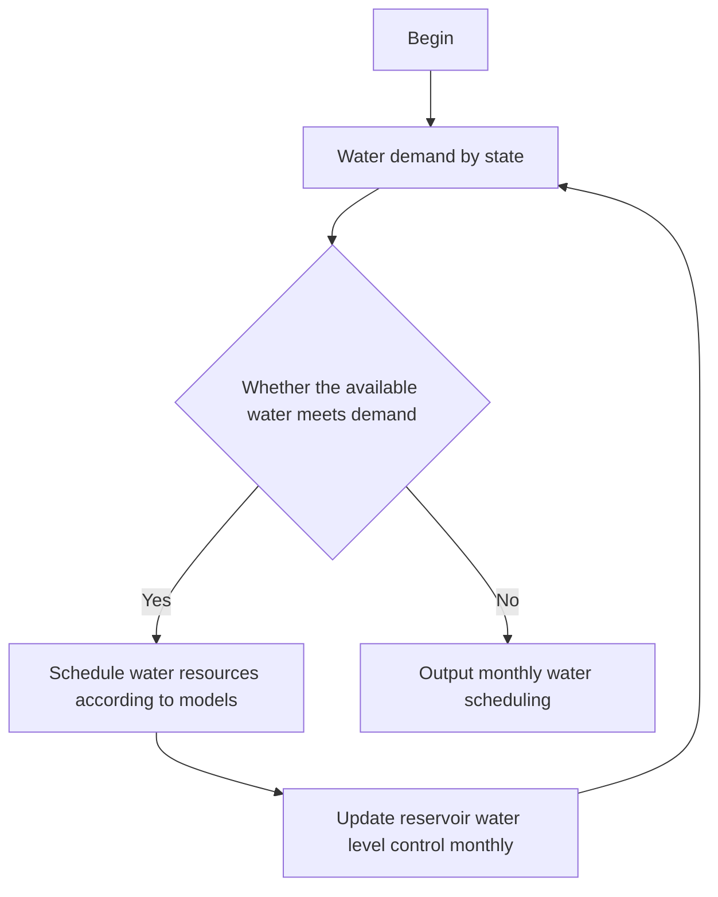

# A Two-Stage Water Resource Optimal Operation Model

# Based on Genetic Algorithm

## Abstract

In 2021, the Western United States experienced unprecedented dry weather that caused local reservoir levels to drop to record lows. Our team use operational research, mathematics, finance, computer science and other knowledge to build a mathematical model, providing a variety of practical solutions for reservoir water resource scheduling.

Firstly, we draw and fit the elevation and storage linear function of Lake Powell and Lake Mead in recent ten years. The linear programming model of total transportation cost minimization is established and solved by matlab linear programming solver. The amount of water extracted from Lake Powell and Lake Mead is 858333 acre-feet and 391666 acre-feet respectively. When there is no rainfall data, the solution is based on the objective of minimum transportation cost, and it is obtained that after 23 months, water resources will not be enough to meet the water demand of each state. At least 1051875.051 acre-ft is required for the 24th month. After that, the monthly external water supply amount for the two reservoirs is 1,118,780.48 acre-ft.

Secondly, we analyze the competing interests of agriculture, industry, residential water usage and electricity production; construct a two-stage programming model. The lower-level stage model solves the assignment of the total water intake and total power generation of the two dams, and the enhanced elite reservation genetic algorithm is used to get the optimal solution and the maximum value into the single-objective differential evolution algorithm for deeper optimization. The results of production value is \$412,208,7017, and the total water consumption is 49,52007 acre-feet, with more water extracted from Lake Powell.

Thirdly, When there is not enough water to meet all water and electricity needs, we establish a nonlinear programming model under the premise of meeting the minimum demand ,to minimize the excess power generation and water discharge, so as to cope with the state of drought and water shortage for as long as possible. Genetic algorithm is used to solve the water and energy demand distribution of the system. The water extracted from Lake Powell and Lake Mead in a month is 1946626.71 acre-feet and 4040078.68 acre-feet, Glen Canyon Dam and Hoover Dam output 30037.82 acrefeet and 110848.56 acre-feet downstream respectively.

Fourthly, As drought intensifies, demand for electricity declines. If the degree of drought is too high, the total electricity demand will not be satisfied. With the development of new energy technology, the demand for hydroelectric power is decreasing. When the water demand is unchanged and the electricity demand decreases by 25%, 50% and 75% respectively, the calculation shows that the water demand for reservoirs in each state is much higher than the electricity demand. When water saving and electricity saving measures are adopted and the respective demand decreases by more than 75%, the water consumption of users can be satisfied.

Finally, We submit an article for Drought and Thirst magazine based on the above process.

## Contents

1. Introduction...  
2. Assumptions and Justification.  
3. Notations .. 3  
4. Models and solutions of problem 1 .

4.1 The optimal transportation

4.1.1 Water supply meets requirements. ∆  
4.1.2 Constraints on the height of the dam water level .  
4.1.3 Equilibrium constraints on Colorado River recharge and outflow..  
4.1.4 Dam release constraint .  
4.1.5 Objective function..  
4.1.6 Model solving.. .10

4.2 Optimal duration of water allocation  
4.3 The relationship of external water transfer with time 12

5. Models and solutions of problem 2 . .12

5.1 Lower-level model construction. .13  
5.2 Lower model solution . .14  
5.3 Upper-level model construction . .16  
5.4 The final result of the upper model . 16

6. Models and solutions of problem 3 . .17  
7. Sensitivity Analysis. .18  
8. Conclusions... .20

8.1 Conclusions of the problem1 .20  
8.2 Conclusions of the problem2 .20  
8.3 Conclusions of the problem3 . .20  
8.4 Conclusions of the problem4 . .20

9. Model Evaluation and Further Discussion .. .20

9.1 Strengths... .20  
9.2 Weakness.. .21

10. Article for Drought and Thirst magazine .22

## 1. Introduction

## 1.1 Problem Background

In 2021 , the western United States has experienced unprecedented dry weather , which not only led to two of the nation's largest reservoirs of the Colorado River , Lake Powell and Lake Mead , permanently low but also posed a threat to the production and life of the people . The low water flows have reduced the amount of electricity produced by hydropower plants , leading to interruptions in power supplies in these areas . As shown in Figure 1，the white ‘bathtub ring’ around Lake Mead shows the record low water levels as drought continues to worsen in Nevada [1].

natural_image

Scenic view of a turquoise river flowing through steep, rocky canyon walls under a clear sky (no text or symbols visible)

Figure 1: the white ‘bathtub ring’ around Lake Mead

Because of such conditions, a rational, defensible water allocation plan for current and future water supply conditions is critically important. This article will use operational research, mathematics, physics, computer science, environmental science and other knowledge to construct mathematical models and finally provide practical solutions for the dam operations.

## 1.2 Problem Restatement

Considering the restrictions identified with the problem statement, we need to address the following problems:  
Build mathematical models to develop rational water allocation plans for current and future water supply conditions. Analyze how much water should be drawn from each of Lake Mead and Lake Powell to meet customer water and electricity needs.  
Without taking into account the replenishment of other water resources such as rainfall, how long will it take before the demands are not met?  
According to the established mathematical model, analyze and solve the competition relationship between general water use in agriculture, industry, residence and electricity production water . Explain the standards used to solve competitive interests clearly.  
If there is not enough water to supply the residents' water and electricity needs, what should be done.

The water and electricity demands of the communities change over time. What happens when analyzing population, agriculture, or industry growth or shrinkage in affected areas?  
How should the model adjust as the proportion of renewable energy technologies increases or when additional water and electricity savings are implemented?

## 1.3 Our work

We collected the water level and stock data of Lake Powell and Lake Mead in recent ten years, drew and fitted the water level and stock linear function of the two reservoirs.  
We established a linear programming model for minimizing the total transportation cost, taking the total water transfer and transportation cost as the objective function, the amount of water taken from each state and the discharge of two dams as the decision-making variables, and the discharge of the dam, the level of the reservoir after dispatching, and the water resources demand of each state as the constraints.  
we construct a two-stage mathematical model. The first stage model solved the task assignment of the total water intake and total power generation of the two dams, and the enhanced elite reservation genetic algorithm is used to put the optimal solution and the optimal value into the single-objective differential evolution algorithm for deeper optimization.  
We submit an article for Drought and Thirst magazine.

## 2. Assumptions and Justification

The starting point of water supply is set at the dam. The location of the dam and the lake is close, and the distance calculation is more convenient. So we can set the dam as the starting point of water supply.  
Water supply target points are set at the centroids of the state's planar terrain. The water consumption in different regions of each state is unbalanced. By setting the target points at the centroids of the state's planar terrain, we can measure the distance directly .  
The transportation cost per unit of distance and unit of water flow in each state is equal. The transportation distance and flow of water resources may be different. Assuming the same unit transportation cost, it is convenient to solve the distrubution scheme.

## 3. Notations

<table><tr><td>Symbols</td><td>Description</td></tr><tr><td> $x_{p,i}$ </td><td>dispatched water flow from Lake powell to state i</td></tr><tr><td> $x_{m,i}$ </td><td>dispatched water flow from Lake mead to state i</td></tr><tr><td> $P(t_0+T)$ </td><td>lake powell water level after a water dispatch</td></tr><tr><td> $M(t_0+T)$ </td><td>water levels at Lake Mead after a water dispatch</td></tr><tr><td> $q_m$ </td><td>the magnitude of surface water flow into Lake Mead during the transfer period</td></tr><tr><td> $q_M$ </td><td>the magnitude of surface water flow into Mexico during the transfer period</td></tr><tr><td> $E_p$ </td><td>electricity generated by Lake powell hydroelectric power generation during water transfer period</td></tr><tr><td> $E_m$ </td><td>electricity generated by Lake mead hydroelectric power generation during the water transfer period</td></tr><tr><td> $d_{p,i}$ </td><td>the distance from Lake Powell to State i</td></tr><tr><td> $d_{m,i}$ </td><td>the distance from Lake Mead to State i,</td></tr><tr><td> $k_i$ </td><td>the cost of state i unit distance unit water flow transportation</td></tr><tr><td>T</td><td>time required for a water dispatch</td></tr><tr><td> $M(t_0)$ </td><td>initial water level at Lake Mead before a water dispatch</td></tr><tr><td> $q_p$ </td><td>the magnitude of surface water flow into Lake powell during the diversion period</td></tr><tr><td> $P(t_0)$ </td><td>initial water level at Lake powell before a water dispatch</td></tr><tr><td> $q_{r,p}$ </td><td>the magnitude of rainfall flow into Lake powell during the diversion period</td></tr><tr><td> $q_{r,m}$ </td><td>the magnitude of rainfall flow into Lake Mead during the transfer period</td></tr><tr><td> $P_{\min}, P_{\max}$ </td><td>the lowest and highest water levels allowed by Lake Powell; corresponding to stagnant water levels and flood levels.</td></tr><tr><td> $M_{\min}, M_{\max}$ </td><td>minimum and maximum water levels allowed by Lake Mead; corresponding to standing water and flood levels</td></tr><tr><td> $q_{m,\max}, q_{M,\max}$ </td><td>the maximum water flow allowed into Lake Mead Mexico during the dispatch period; corresponds to the maximum discharge of Colombier and Hoover Dams</td></tr><tr><td> $S_p(P)$ </td><td>lake powell water level as a function of lake surface area</td></tr><tr><td> $S_m(M)$ </td><td>Lake Mead water level as a function of lake surface area</td></tr></table>

## 4. Models and solutions of problem 1

Negotiating teams in the states asked us to build models to guide the operation of the dam, which is the ultimate goal of the issue.

We found that the water supply strategy affects the water level of the corresponding reservoirs of the two dams, which indirectly affects hydropower generation. This indicates that there are constraints on water supply and electricity demand. Our team temporarily separated the water supply and electricity demand, and set up several small stages to analyze and simplify the problem. And the complete model will eventually be shown in the second question.

Firstly, meet the water needs.  
Secondly, meet the supply of power resources.  
Finally meet both water supply and electricity demand.

The demand for water resources mainly involves two aspects: the respective withdrawals of the two reservoirs and the distribution of the withdrawn water among the five states. Constraints need to be considered when analysing the model. The model we established is mainly subject to the following constraints.

## 4.1 The optimal transportation

## 4.1.1 Water supply meets requirements

Seven states in the Colorado River basin need to meet their water supply, and the amount of water flowing out of the United States needs to meet Mexico's requirements.

For the total water demand, through the relevant data of the Colorado River [2] and the distribution map [3] as shown below. We can get the water storage for five states: Arizona (AZ), California (CA), Wyoming (WY), New Mexico (NM), and Colorado (CO).

But at the same time, we also noticed that the Colorado River Basin covers more than the five states mentioned above, and two other states, Utah (UT) and Nevada (NV), also participate in the distribution of Colorado River water resources. Because water resources are interconnected and the large amount of water abstraction in the two states, it is unrealistic to ignore the impact of water abstraction in these two states. The final water demand table we obtained is shown in Table 1. In addition, Mexico has a water demand of 1.5MAF.

Table 1 Water requirement and proportion

<table><tr><td>State</td><td>Water Requirement (MAF)</td><td>Proportion</td></tr><tr><td>CA (Lower Basin)</td><td>4.400</td><td>29.3%</td></tr><tr><td>CO (Upper Basin)</td><td>3.881</td><td>25.9%</td></tr><tr><td>AZ (Lower Basin)</td><td>2.800</td><td>18.7%</td></tr><tr><td>UT (Upper Basin)</td><td>1.725</td><td>11.5%</td></tr><tr><td>WY (Upper Basin)</td><td>1.050</td><td>7.0%</td></tr><tr><td>NM (Upper Basin)</td><td>0.844</td><td>5.6%</td></tr><tr><td>NV (Lower Basin)</td><td>0.300</td><td>2.0%</td></tr></table>

text_image

Upper Basin 7.5 MAF
Upper Basin allocation established by Upper Colorado River Basin Compact (1948)
Wyoming 14%
Flaming Gate Reservoir
Salt Lake City
Colorado 51.75%
Denver
Utah 23%
Lee Ferry
Nevada 0.3 MAF
Las Vegas
Lake Meed
New Mexico 11.25%
California 4.4 MAF
Colorado River Australia
Capea Arizona Project
Phoenix
Tucson
Arizona 2.8 MAF Lower Basin 0.05 MAF Upper Basin
Lower Basin 7.5 MAF
Mexico 1.5 MAF
Established by the U.S.-Mexico Water Treaty (1944)
Established by the Boulder Canyon Project Act (1928) and Arizona v California (1964)

Figure 2 Colorado River Basin Allocations

It is also important to note that due to the requirement to divide the pumping volume between the two lakes, the total pumping volume may not equal the total demand in each state. Additional sources of water may be obtained from other sources. Our proposed mathematical model only needs to account for the allocation of water withdrawals from the Colorado River.

Based on the above content, the constraint conditions of water supply corresponding to this part are as follows:

$$
\left(x _ {p, i} + x _ {m, i}\right) T = D _ {w, i}, \forall i = 1, 2 \dots 7 \tag {1}
$$

$$
\frac {D _ {w , M}}{T} \leq q _ {m} \tag {2}
$$

In Formula (1), the first half of the equation represents the total water supply of the two reservoirs to State i in time period T, and the right side of the equation represents the water demand of State i.

It's a constraint on the water supply in seven states. Equation (2) is an inequality reflecting the requirement that does not affect Mexico's water demand.

## 4.1.2 Constraints on the height of the dam water level

As for the water level elevation limitation of Glen Canyon Dam (Lake Powell) and The Hoover Dam (Lake Mead), the following table2 can be obtained through data sorting of the US Bureau of Reclamation[4,5]:

Table2 Dam-related attribute values (feet)

<table><tr><td>Elevation</td><td>Glen Canyon Dam</td><td>Hoover Dam</td></tr><tr><td>Maximum Water Surface</td><td>3711.0</td><td>1232.0</td></tr><tr><td>Top of Dead Storage Pool</td><td>3370.0</td><td>895.0</td></tr><tr><td>Streambed at Dam Axis</td><td>3132.0</td><td>2640.0</td></tr></table>

text_image

hmax
h
hmin
H
hbase

Figure 3 Schematic diagram of dam and associated elevation

The altitude of the Top of Dead Storage Pool is $h _ { \operatorname* { m i n } }$ . The altitude of the. Maximum Water Surface is $h _ { \operatorname* { m a x } }$ . The altitude of the river bed of dam foundation is $h _ { b a s e }$ . While meeting the pumping needs of the states, the water levels in the two dams should also be limited between $h _ { \operatorname* { m i n } }$ and $h _ { \mathrm { m a x } }$ , which results in the following inequality constraints:

$$
P _ {\min} \leq P (t + T) \leq P _ {\max} \tag {3}
$$

$$
M _ {\mathrm{min}} \leq M (t + T) \leq M _ {\mathrm{max}}
$$

## 4.1.3 Equilibrium constraints on Colorado River recharge and outflow

Considering the replenishment and consumption balance of the Colorado River water resources, as well as the mutual constraints between the two DAMS, the reservoir water balance conditions need to be met:

$$
\int_ {P \left(t _ {0}\right)} ^ {P \left(t _ {0} + T\right)} S _ {p} (P) d P = \left(q _ {p} + q _ {r, p} - q _ {m} - \sum_ {i = 1} ^ {7} x _ {p, i}\right) T \tag {4}
$$

$$
\int_ {M \left(t _ {0}\right)} ^ {M \left(t _ {0} + T\right)} S _ {m} (M) d M = \left(q _ {m} + q _ {r, m} - q _ {M} - \sum_ {i = 1} ^ {7} x _ {m, i}\right) T
$$

line chart

| Distance from Streambed at Dam Axis (feet) | Storage (acre-feet) |
| ------------------------------------------ | ------------------- |
| 380                                        | 0.6                 |
| 400                                        | 0.7                 |
| 420                                        | 0.8                 |
| 440                                        | 0.9                 |
| 460                                        | 1.0                 |
| 480                                        | 1.1                 |
| 500                                        | 1.3                 |
| 520                                        | 1.6                 |

Figure 4 Water level - storage capacity characteristic curve

Figure4 shows the relationship between the water level elevation of Lake Mead (height from the $h _ { b a s e } )$ and the water volume of the reservoir. We obtain the water level - storage capacity characteristic curves of two reservoirs in recent ten years.

$$
y = 9. 1 e + 0 4 * x - 3. 1 e + 0 7 \tag {5}
$$

$$
R \_ s q u a r e = 0. 9 9 2 5
$$

It can be seen from the water-level and storage capacity characteristic curves of the two reservoirs in the past decade [6] that the range of changes in the water level and storage capacity of the two lakes can be approximately linear and $R ^ { 2 }$ close to 1. Therefore, the lake area can be set as a fixed value, which does not change with the change of water level. Then:

$$
\int_ {P \left(t _ {0}\right)} ^ {P \left(t _ {0} + T\right)} S _ {p} (P) d P = S _ {p} \times \left(P \left(t _ {0} + T\right) - P \left(t _ {0}\right)\right) \tag {6}
$$

$$
\int_ {M \left(t _ {0}\right)} ^ {M \left(t _ {0} + T\right)} S _ {m} (M) d M = S _ {m} \times \left(M \left(t _ {0} + T\right) - M \left(t _ {0}\right)\right)
$$

The above equation illustrates the relationship between water level and reservoir volume originally expressed by integration, which degenerates into the product of the difference between water level change and the average surface area of the reservoir.

At the same time, the change of reservoir water volume remains conserved. The change of reservoir water quantity is equal to the amount of water flowing into the current reservoir and the increase of water replenished by rainfall in time T minus the amount of evaporation from the reservoir and the reduction of water supply withdrawn from the reservoir in time T.

text_image

draw
Pmax
qR,p
qe,p
P(t)
qL
Pmin
qe,m
Ep
P(t)
qm
Lake Powell
Glen Canyon dam
qw
qw
qw
Mmax
M(t)
Mmin
Lake Mead
qw
Qe,m
Em
M(t)
qMexico
Hoover dam

Figure 5 Colorado River reservoir - dam system

$$
S _ {p} \times \left(P \left(t _ {0} + T\right) - P \left(t _ {0}\right)\right) = \left(q _ {p} + q _ {r, p} - q _ {e, p} - q _ {m} - \sum_ {i = 1} ^ {7} x _ {p, i}\right) T \tag {7}
$$

$$
S _ {m} \times \left(M \left(t _ {0} + T\right) - M \left(t _ {0}\right)\right) = \left(q _ {m} + q _ {r, m} - q _ {e, m} - q _ {\mathrm{M}} - \sum_ {i = 1} ^ {7} x _ {m, i}\right) T
$$

Therefore, equation (3) representing water level control and equation (7) representing access balance can be transformed into the following equation:

$$
\begin{array}{l} S _ {p} \times \left(P \left(t _ {0}\right) - P _ {\min}\right) \leq \left(q _ {p} + q _ {r, p} - q _ {e, p} - q _ {m} - \sum_ {i = 1} ^ {7} x _ {p, i}\right) T \leq S _ {p} \times \left(P _ {\max} - P \left(t _ {0}\right)\right) \\ S _ {m} \times \left(M \left(t _ {0}\right) - M _ {\min}\right) \leq \left(q _ {m} + q _ {r, m} - q _ {e, m} - q _ {\mathrm{M}} - \sum_ {i = 1} ^ {7} x _ {m, i}\right) T \leq S _ {m} \times \left(M _ {\max} - M \left(t _ {0}\right)\right) \tag {8} \\ \end{array}
$$

In the equation, the leftmost of the inequality represents the difference between the initial water amount of two reservoirs and the water amount of the dead pool. The middle of the inequality represents the total amount of water flowing in and out, as shown in the system diagram above. The far right of the inequality represents the difference between the maximum water level of two dams and the amount of water below the initial water level.

## 4.1.4 Dam power generation constraint

According to the public data provided by the US Reclamation Bureau [4,5], the Installed Capacity of Glen Canyon Powerplant is 1,320,000 kW, and the Installed Capacity of Hoover Powerplant is 2,078,800 kW. The formula is derived from the calculation of water energy:

$$
N = A Q H _ {n e t} \tag {9}
$$

In the formula, N represents the power generation of the hydropower station, A is the output coefficient, and its value is related to the conversion rate of water and electricity. In this problem, the value is 9.81. Q is the amount of water discharged from the dam, $H _ { n e t }$ is the difference between the water level of the upstream reservoir and the riverbed of the dam axis. Since the data does not mention the maximum flow rate of power generation flow, but has the above maximum power generation. Therefore, we obtain the range of the maximum power generation water flow Q by inverse calculation.

$$
q _ {m, \max} = \frac {N _ {\max , p}}{9 . 8 1 \left(P _ {\max} - h _ {\text {base} , p}\right)} = 1 6 0 2 1 8. 0 1 (\text {acre} - \text {feet per month}) \tag {10}
$$

$$
q _ {M, \max} = \frac {N _ {\max , m}}{9 . 8 1 \left(M _ {\max} - h _ {\text {base} , m}\right)} = 2 5 3 6 2 7. 0 6 (\text {acre} - \text {feet per month})
$$

Therefore, there is a constraint on the flow of water out of the dam $q$ :

$$
0 \leq q _ {m} \leq q _ {m, \max} \tag {11}
$$

$$
0 \leq q _ {M} \leq q _ {M, \max}
$$

## 4.1.5 Objective function

Considering that there may be no unique solution to this problem, optimization objectives need to be added to this mathematical model to determine the optimal solution, so we turn our attention to the objective function of minimum cost related to water resources allocation.

For the allocation of water resources, we regard it as a warehouse transportation problem, taking the dams corresponding to the two reservoirs as the water intake points, and the water levels P and M of the two reservoirs as the water stock indicators. Since the center of gravity of water demand in each state is different and difficult to determine, we use the geographic center of gravity of the seven states as the destination of water allocation to simplify the problem, and use the transportation distance as the transportation cost. The length of each connection is shown in the table below:

text_image

Colorado River
Glen Canyon dams
Hoover dams
Lake Powell
Lake Mead
South Dakota
Oregon
Idaho
Wyoming
Utah
Colorado
Kansas
Nevada
Cler Canyon dam
Lake Powell
New Mexico
California
Lake Mead
Hoover dam
Arizona
Oklahoma
Texas

Figure 6: water resource allocation

Table 3 Transportation distance by state (mile)

<table><tr><td>STATE</td><td>Glen Canyon dam</td><td>Hoover dam</td></tr><tr><td>CA</td><td>562.756</td><td>353.238</td></tr><tr><td>AZ</td><td>225.368</td><td>257.871</td></tr><tr><td>NM</td><td>429.163</td><td>612.090</td></tr><tr><td>CO</td><td>448.691</td><td>686.919</td></tr><tr><td>WY</td><td>613.939</td><td>802.099</td></tr><tr><td>UT</td><td>210.327</td><td>358.346</td></tr><tr><td>NV</td><td>320.672</td><td>320.672</td></tr></table>

According to the above basic conditions, we can start to build the optimization model. The objective function of water allocation cost in seven states is as follows:

$$
C = \sum_ {i = 1} ^ {7} (d _ {p, i} x _ {p, i} + d _ {m, i} x _ {m, i}) k _ {i} T \tag {12}
$$

## 4.1.6 Model solving

In summary, the simplified objective function and constraints can be obtained as follows:

$$
\text { Min } C = \sum_ {i = 1} ^ {7} (d _ {p, i} x _ {p, i} + d _ {m, i} x _ {m, i}) T
$$

. :s t

$$
(x _ {p, i} + x _ {m, i}) T = D _ {w, i}, \forall i = 1, 2... 7
$$

$$
S _ {p} P _ {\min} \leq S _ {p} P (t _ {0}) + \left(q _ {p} + q _ {r, p} - q _ {m} - q _ {e, p} - \sum_ {i = 1} ^ {7} x _ {p, i}\right) T \leq S _ {p} P _ {\max} \tag {13}
$$

$$
S _ {m} M _ {\min} \leq S _ {m} M \left(t _ {0}\right) + \left(q _ {m} + q _ {r, m} - q _ {M} - q _ {e, m} - \sum_ {i = 1} ^ {7} x _ {m, i}\right) T \leq S _ {m} M _ {\max}
$$

$$
\frac {D _ {w , M}}{T} \leq q _ {m} \leq q _ {m, \max}
$$

$$
0 \leq q _ {M} \leq q _ {M, \max}
$$

The water surface data, flow data and rainfall data of the two lakes in January 2021 are selected as the test. It is assumed that the water transfer time is one month, and the transportation cost per unit distance per unit water flow in each state is the same. Then the water resource allocation scheme corresponding to the minimum transportation cost can be obtained.

Table4 Basic data for January 2021

<table><tr><td></td><td>CA</td><td>AZ</td><td>NM</td><td>CO</td><td>WY</td><td>UT</td><td>NV</td><td>Lake Mead</td><td>Mexico</td></tr><tr><td>Lake Powell</td><td>0</td><td>233333</td><td>70333.3</td><td>323417</td><td>87500</td><td>143750</td><td>0</td><td>0</td><td>—</td></tr><tr><td>Lake Mead</td><td>366666.7</td><td>0</td><td>0</td><td>0</td><td>0</td><td>0</td><td>25000</td><td>—</td><td>125000</td></tr></table>

## 4.2 Optimal duration of water allocation

Given that demand is fixed, it can be assumed that each state has a fixed monthly water requirement, since there is no additional rainfall water supply. Then, the total monthly water inflow of the two lakes is:

$$
\Delta q = q _ {p} - q _ {e, p} - q _ {M} - q _ {e, m} - \sum_ {i = 1} ^ {7} \frac {D _ {w , i}}{T} = - 1 1 0 6 0 7 4. 5 7 1 \text {   acre   -   feet   per   month } \tag {14}
$$

It can be seen that $\Delta q { < } 0$ , the total water volume of the two reservoirs is constantly decreasing. Water resource scheduling ends when the available water stocks in the lake are insufficient to meet the water needs of individual states. Considering the month as the unit dispatching time, the above water resources optimal dispatching model is used circularly and the reservoir water level after dispatching is updated. When there is no feasible solution to the water resources optimal dispatching model, the number of cycles obtained is the duration of dispatching.

The scheduling process and results are as follows:

flowchart

line chart

| Month | Lake Powell | Lake Mead |
|-------|-------------|-----------|
| 0     | 850000      | 390000    |
| 5     | 850000      | 390000    |
| 10    | 850000      | 390000    |
| 15    | 850000      | 390000    |
| 20    | 850000      | 390000    |
| 22    | 680000      | 390000    |
| 23    | 680000      | 570000    |

Figure 7 Water resource scheduling process

According to the figure above, the duration of water dispatching is 23 months.

## 4.3 The relationship of external water transfer with time

As can be seen from the previous content, when there is no additional water supply, the resources of the reservoir cannot meet the water demand of each state in the 24th month. At this time, the remaining available storage capacity of the two reservoirs is 0 and 54199.52 acre-ft respectively; and the total monthly water demand of the user is 1375000.00 acre-ft, so at least 1375000.00-54199.52-0=1320800.48 acre-ft of water needs to be transferred.

Since then, the two reservoirs have no usable stock. In order to ensure water demand, the minimum monthly water diversion is $- \Delta q = - 1 1 0 6 0 7 4 . 5 7 1$ acre feet - .

## 5. Models and solutions of problem 2

Considering the competitive interests of agricultural, industrial, residential and electricity production water, as well as the transportation costs of water resources, we establish a two-stage model.

On the basis of satisfying the residential water consumption of each state, the lower-level model introduces the agricultural water efficiency and industrial water efficiency functions of each state.

Taking the total production benefit of seven states and the dam power production benefit as the objective function, the maximization optimization model of total production benefit is established to solve the agricultural and industrial water consumption of each state. The upper layer model considers the transportation cost between the reservoir and each state, while the lower layer model considers the water consumption of each state and the amount of water pumped from the reservoir as the demand and constraint, establishes the transportation cost minimization optimization model, and obtains the water extracted from the two reservoirs by seven states respectively.

## 5.1 Lower-level model construction

If a more accurate solution is adopted according to the resources required per unit production value of each state, the decisional variables of the objective function of the model will reach 18. There are 14 variables related to gross agricultural and industrial production and 4 variables related to dam and reservoir systems. Therefore, we comprehensively calculated the agricultural and industrial GDP of each state, the following formula:

$$
A = \sum_ {i = 1} ^ {7} A _ {i} \tag {15}
$$

$$
I = \sum_ {i = 1} ^ {7} I _ {i}
$$

$$
\max Z = \sum_ {i = 1} ^ {7} \left(A _ {i} + I _ {i}\right) T + \alpha \left(E _ {p} + E _ {m} - E _ {T}\right) \tag {16}
$$

The object function is to maximize the agricultural effectiveness and the remaining electricity effectiveness as A, I; the water cost electricity cost effectiveness of the remaining water pumping.   and representing the electricity price and average water price. The reason for the occurrence of excessing hydropower is mainly due to the assumption that the general electricity and water consumption (agricultural, industrial and residential) is proportional to a certain proportion, and the electricity and water quantities are often not allocated exactly.

The constraints of the lower model are similar to the first question, as follows:

Equation constraints of dam power generation and electricity demand:

$$
E _ {p} = A q _ {m} \left(\left(P \left(t _ {0}\right) - H _ {p}\right) T + \frac {\left(q _ {p} + q _ {r , p} - q _ {m} - q _ {e , p} - W _ {p}\right) T ^ {3}}{2 S _ {p}}\right)
$$

$$
E _ {m} = A q _ {M} \left(\left(M \left(t _ {0}\right) - H _ {m}\right) T + \frac {\left(q _ {m} + q _ {r , m} - q _ {M} - q _ {e , m} - W _ {m}\right) T ^ {3}}{2 S _ {m}}\right) \tag {17}
$$

$$
E _ {T} = \left(e _ {A} A + e _ {I} I + e _ {R} p\right) T
$$

The amount of water withdrawn from the two reservoirs and the supply-demand balance conditions for agricultural, industrial and residential water usage during the operation:

$$
w _ {p} + w _ {m} \geq w _ {A} A + w _ {I} I + w _ {R} p \tag {18}
$$

Boundary conditions for agricultural and industrial production effectiveness:

$$
A, I \geq 0 \tag {19}
$$

For reservoir water level constraints and dam outlet flow constraints, see the corresponding constraints in the first question.

## 5.2 Lower model solution

Considering this model is a nonlinear optimization problem, and the traditional method is not easy to solve, we use genetic algorithm to get best solution.

Genetic Algorithm (GA) is a computational model that simulates the natural selection of Darwin's theory of biological evolution and the biological evolution process of the genetic mechanism. It is a method to search for optimal solutions by simulating the natural evolution process.

The algorithm class we adopted in our first step implements a genetic algorithm that enhances elite retention. The algorithm flow is as follows: 1) Initialize the population of N individuals according to the coding rules. 2) Stop if the stop condition is met, otherwise continue to execute. 3) Statistical analysis of the current population, such as recording its optimal individual, average fitness, etc. 4) Independently select N mothers from the current population. 5) Perform the crossover operation on these N mothers independently. 6) Independently mutate the N crossover individuals. 7) Combine the parent population and the population obtained by crossover mutation to obtain a population with a size of 2N. 8) Select N individuals from the combined population according to the selection algorithm to obtain a new generation of population. 9) Go back to step 2. The algorithm should set a larger probability of crossover and mutation, otherwise there will be more and more repeated individuals in the new generation population generated.

The optimal solution and optimal value calculated in the first part are substituted into the single-objective differential evolution algorithm to solve. The main difference between the algorithm flow and the above algorithm is as follows: 1) The current-tobest method is used to select each vector of the differential mutation, and for the current, the population is subjected to differential mutation to obtain mutant individuals. 2) Combine the current population and mutant individuals, and use the binomial distribution crossover method to obtain the test population. 3) Using the one-to-one survivor selection method between the current population and the experimental population to obtain a new generation population.

The basic parameters used by the genetic algorithm to enhance elite retention in this model are the population size of 200, the stagnation threshold for single-objective optimization is 1e-6, and the maximum upper limit of the evolutionary stagnation counter is 500; in the second part, the single-objective differential evolution In the solution of the algorithm, the differential evolution parameter F is 0.7, the crossover probability is 0.7, and the rest are the same as the first part of the algorithm. The original

data used by the model is as follows [2].

Table5 General water and electricity basic data

<table><tr><td></td><td> $w_A$ </td><td> $w_I$ </td><td> $w_R p$ </td><td> $e_A$ </td><td> $e_I$ </td><td> $e_R p$ </td></tr><tr><td>Unit</td><td>acre-feet/(dollar-year)</td><td>acre-feet/(dollar-year)</td><td>acre-feet/month</td><td>Kwh/(dollar-year)</td><td>Kwh/(dollar-year)</td><td>Kwh/month</td></tr><tr><td>CA</td><td>0.000542696</td><td>0.000005641</td><td>1723320</td><td>0.114796028</td><td>0.150928147</td><td>7293666667</td></tr><tr><td>AZ</td><td>0.001144970</td><td>0.000000919</td><td>1073697</td><td>0.533816413</td><td>0.461587407</td><td>2893333333</td></tr><tr><td>NM</td><td>0.000518059</td><td>0.000003299</td><td>650427</td><td>0.157604499</td><td>2.983333333</td><td>572666667</td></tr><tr><td>CO</td><td>0.000512741</td><td>0.000014216</td><td>1768389</td><td>0.153402536</td><td>0.599208144</td><td>1617083333</td></tr><tr><td>WY</td><td>0.001541188</td><td>0.000018583</td><td>639581</td><td>0.114617435</td><td>5.329381443</td><td>237416667</td></tr><tr><td>UT</td><td>0.001265428</td><td>0.000029644</td><td>1299426</td><td>0.313739157</td><td>0.471251241</td><td>811666667</td></tr><tr><td>NV</td><td>0.002884264</td><td>0.000003058</td><td>562958</td><td>1.144706228</td><td>1.484587813</td><td>1072333333</td></tr></table>

Through the two genetic algorithm model solutions, the optimal value change curve of the second part is as follows:

line chart

| Generation Number | Best-found objective value |
| ----------------- | -------------------------- |
| 0                 | 4.61150                    |
| 25                | 4.61150                    |
| 35                | 4.61225                    |
| 45                | 4.61275                    |
| 50                | 4.61325                    |
| 60                | 4.61325                    |
| 70                | 4.61325                    |
| 80                | 4.61325                    |
| 90                | 4.61325                    |
| 100               | 4.61325                    |
| 150               | 4.61325                    |
| 200               | 4.61325                    |
| 240               | 4.61325                    |

Figure8 Best objective Value Trace Plot (Best value is $\mathbf { 4 . 6 1 e ^ { \wedge } 1 0 } )$

It can be seen that the model basically obtains the optimal solution after the 200th iteration, and the final result of stopping the iteration is $4 . 6 1 \mathrm { e } ^ { \wedge 1 0 }$ (dollar). The rest of the results are shown in the table below:

Table6 The results of variables

<table><tr><td>PARAMETER</td><td>UNIT</td><td>RESULT</td></tr><tr><td>A</td><td>dollar</td><td>4122087017.49</td></tr><tr><td>I</td><td>dollar</td><td>0.00</td></tr><tr><td> $q_m$ </td><td>acre-feet/month</td><td>160218.01</td></tr><tr><td> $w_p$ </td><td>acre-feet/month</td><td>3901904.00</td></tr><tr><td> $q_M$ </td><td>acre-feet/month</td><td>253627.06</td></tr><tr><td> $w_m$ </td><td>acre-feet/month</td><td>2425104.00</td></tr></table>

## 5.3 Upper-level model construction

The total resources obtained from lower-level model, which are allocated using a model similar to the first question to simplify the mathematical model.

The objective function is:

$$
\text { Min } C = \sum_ {i = 1} ^ {7} (d _ {p, i} x _ {p, i} + d _ {m, i} x _ {m, i}) T \tag {20}
$$

## Constraint:

（1）Water demand conditions for each state

$$
\left(x _ {p, i} + x _ {m, i}\right) T = D _ {w, i}, \forall i = 1, 2 \dots 7 \tag {21}
$$

$$
D _ {w, i} = \left(w _ {A, i} A _ {i} + w _ {I, i} I _ {i} + w _ {R, i} p _ {i}\right) T \tag {21}
$$

（2）Reservoir water supply conditions:

$$
\sum_ {i = 1} ^ {7} x _ {p, i} = W _ {p} \tag {22}
$$

$$
\sum_ {i = 1} ^ {7} x _ {m, i} = W _ {m}
$$

## 5.4 The final result of the upper model

Table7 Water Allocation Results by State (arce-feet)

<table><tr><td></td><td>Lake Powell</td><td>Lake Mead</td></tr><tr><td>CA</td><td>0</td><td>2988144.83</td></tr><tr><td>AZ</td><td>537806.912</td><td>0</td></tr><tr><td>NM</td><td>163131.647</td><td>0</td></tr><tr><td>CO</td><td>468407.551</td><td>0</td></tr><tr><td>WY</td><td>276657.046</td><td>0</td></tr><tr><td>UT</td><td>283708.325</td><td>0</td></tr><tr><td>NV</td><td>0</td><td>234151.097</td></tr></table>

## 6. Models and solutions of problem 3

If there is not enough water to meet all water and electricity needs, such as extreme dry weather, and minimum water and electricity demands cannot be met, only the equitable distribution of each state is considered without considering economic benefits, and the possible replenishment of water from the outside is not taken into account in our model. Therefore, we consider reducing the consumption of additional resources as much as possible under the minimum water and electricity consumption in a long-term drought. According to the model in the previous question, we change its objective function to be:

$$
\min Z = \alpha \left(E _ {p} + E _ {m} - E _ {T, \min}\right) + \beta \left(W _ {p} + W _ {m} - W _ {T, \min}\right) \tag {23}
$$

The economic value of water and electricity we use represents the size of the abundant part of resources. and are the average unit electricity and water charges respectively.

For $E _ { \mathrm { m i n } }$ and $W _ { \mathrm { m i n } }$ we have the following equation:

$$
E _ {T, \min} = \left(e _ {A, \min} + e _ {I, \min} + e _ {R, \min}\right) T \tag {24}
$$

$$
W _ {T, \mathrm{min}} = \Big (w _ {A, \mathrm{min}} + w _ {I, \mathrm{min}} + w _ {R, \mathrm{min}} \Big) T
$$

$$
E _ {T, \min} \leq E _ {p} + E _ {m} \tag {25}
$$

$$
W _ {T, \mathrm{min}} \leq W _ {p} + W _ {m}
$$

The equation on the right represents the minimum demand for water and electricity for agriculture, industry and residents. The demand is based on the gross agricultural and industrial production and the number of residents. The height difference between the water level and the dead water level is also 50% of the original value in January 2021. If the demand for water and electricity is constant, there is no feasible solution to this situation.

At the same time, we note that Mexico will be affected by a severe water shortage, and in this case we estimate the minimum amount of water allocated to Mexico in proportion to population. Then there are constraints:

$$
\frac {D _ {w , M , \min}}{T} \leq q _ {M} \tag {26}
$$

The amount of water replenishment in the Colorado River basin, which is affected by drought, is set at 0 for simplicity of calculation. Then there are constraints:

$$
E _ {p} = A q _ {m} \left(\left(P \left(t _ {0}\right) - H _ {p}\right) T + \frac {\left(- q _ {m} - q _ {e , p} - W _ {p}\right) T ^ {3}}{2 S _ {p}}\right) \tag {27}
$$

$$
E _ {m} = A q _ {M} \left(\left(M \left(t _ {0}\right) - H _ {m}\right) T + \frac {\left(q _ {m} - q _ {M} - q _ {e , m} - W _ {m}\right) T ^ {3}}{2 S _ {m}}\right)
$$

For other constraints, be consistent with question 2. Since there are few decision variables in this case, we only use the first part of the genetic algorithm in the previous question to solve, and the solution results are as follows:

line chart

| Generation Number | Average Objective Value | Best Objective Value |
| ----------------- | ------------------------ | --------------------- |
| 0                 | 1.1e9                    | 0.7e9                 |
| 50                | 0.0                      | 0.0                   |
| 100               | 0.0                      | 0.0                   |
| 200               | 0.0                      | 0.0                   |
| 300               | 0.0                      | 0.0                   |
| 400               | 0.0                      | 0.0                   |
| 500               | 0.0                      | 0.0                   |

Figure9 Population objective function curve

Table8 Variables results

<table><tr><td>VARIABLE</td><td>UNIT</td><td>RESULT</td></tr><tr><td> $q_m$ </td><td>acre-feet/month</td><td>30037.82</td></tr><tr><td> $w_p$ </td><td>acre-feet/month</td><td>1946626.71</td></tr><tr><td> $q_M$ </td><td>acre-feet/month</td><td>110848.56</td></tr><tr><td> $w_m$ </td><td>acre-feet/month</td><td>4040078.68</td></tr></table>

The results show that the height difference between water level and dead water level in January 2021 is 50% of the original value and the minimum demand is 10% of the original value. In the case of no water replenishment, the whole system can stil achieve water and energy demand distribution, and meet the minimum extra consumption to maintain the overall water storage of the reservoir.

## 7. Sensitivity Analysis

According to the distribution result of question 3, when the water level of the original reservoir decreases by 50% due to drought, if the original water and electricity demand is reduced to 10%, the water and electricity demand of each state can be satisfied, and the hydropower resources are rich.

When the water level of the original reservoir decreases by 50%, 75% and 85% due to drought, and the demand for electricity and water is met, the percentage of decrease of electricity and water is obtained.

Table9 Drought sensitivity analysis results

<table><tr><td>Reservoir water level drop %</td><td>Decrease in water demand%</td><td>Percentage drop in electricity demand %</td></tr><tr><td>50%</td><td>87.00</td><td>89.82</td></tr><tr><td>75%</td><td>87.04</td><td>96.74</td></tr><tr><td>85%</td><td>90.38</td><td>100</td></tr></table>

It can be seen from the results that with the deepening of drought, the corresponding electricity demand also decreases. And when the degree of drought is too high (reservoir water level drops by more than 85%), the total electricity demand will not be met.

With the development of new energy technology, the demand for hydraulic power generation decreases accordingly. When the demand for electricity decreases by 25%, 50% and 75% respectively under the condition of constant water demand, the flow of dam and the amount of water pumped from reservoir are obtained. However, after calculation, it is found that the model of minimum resource consumption corresponding to the reduction of electricity demand alone has no shape solution, indicating that the demand for reservoir water in each state is much higher than the demand for electricity.

Considering that the implementation of water saving and electricity saving measures is equivalent to the reduction of total water demand and electricity demand, it is discussed that when the total demand for water and electricity decreases by 25%, 50% and 75% respectively, the corresponding dam discharge and reservoir drainage amount will be calculated.

Table10 Energy-saving and water-saving measures sensitivity analysis results

<table><tr><td>Demand for water and electricity Percentage decline</td><td>25%</td><td>50%</td><td>75%</td></tr><tr><td> $q_m$ </td><td>—</td><td>—</td><td>30275.72402 acre-feet</td></tr><tr><td> $w_p$ </td><td>—</td><td>—</td><td>13272078.49 acre-feet</td></tr><tr><td> $q_M$ </td><td>—</td><td>—</td><td>253627.06 acre-feet</td></tr><tr><td> $w_m$ </td><td>—</td><td>—</td><td>1694688.057 acre-feet</td></tr></table>

When the percentage of water and electricity demand drops by more than 75%, user water can be satisfied, and the pumping volume of Lake Powell and Lake Mead is 13272078.49 and 1694688.057 acre-feet respectively. The outflow flows of the two DAMS are 30275.72402 and 253627.06 acre-feet respectively.

## 8. Conclusions

## 8.1 Conclusions of the problem1

Since the water supply strategy will affect the water level of the corresponding reservoirs of the two DAMS, and thus indirectly affect hydropower generation, it indicates that there are certain constraints on water supply and power demand.

According to the characteristic curve of water-level and reservoir capacity, the range of water level change and reservoir capacity change can be approximately linear, and the lake area can be set as a fixed value, which does not change with the change of water level.

When there is no feasible solution to the optimal water resource dispatching model, the cycle times obtained are the duration of dispatching. Results The duration of water dispatching is 23 months.

In order to ensure water demand, the minimum monthly water transfer is − =q acre feet per month-1106074.571 - .

## 8.2 Conclusions of the problem2

The results of question 3 are shown in Table 6,7.

## 8.3Conclusions of the problem3

The results of question 3 are shown in Table 10.

## 8.4Conclusions of the problem4

As drought intensifies, demand for electricity declines. When the degree of drought is too high, the total electricity demand will not be satisfied. With the development of new energy technology, the demand for hydroelectric power is decreasing. When the water demand is unchanged and the electricity demand decreases by 25%, 50% and 75% respectively, the calculation shows that the water demand for reservoirs in each state is much higher than the electricity demand. When water saving and electricity saving measures are adopted and the respective demand decreases by more than 75%, the water consumption of users can be satisfied.

## 9. Model Evaluation and Further Discussion

## 9.1 Strengths

The model takes into account the benefits of industrial, agricultural water, and electricity production. The pumping volume of each lake is scheduled through the optimization model of transportation cost.  
It takes into account not only the scheduling of how much water to draw from the two lakes, but also the difference in transportation costs between states  
Considering the competitive interests of agricultural, industrial, residential and electricity production water, as well as the transportation costs of water resources, we

establish a two-stage model. We use the genetic algorithm when solving the model, which greatly improves the efficiency of the computer.

The model is based on certain theories. Through literature review, we carefully select the model. Therefore, our model can be consistent with the actual situation as much as possible.  
The data we collected are very sufficient and the accuracy of simulation is very high.

## 9.2 Weakness

The transportation cost function for each state depends only on distance, and distance depends only on the location of each state's center of mass and dam. The model may not represent the actual transportation of water.  
The model can only solve the water scheduling problem in a fixed time period.

## 10. Article for Drought and Thirst magazine

In 2021, the western United States has experienced unprecedented dry weather. The persistent drought has caused local reservoir water levels to drop to record lows.

Low water flows have reduced the amount of electricity produced by hydropower plants, leading to interruptions in power supply in these areas. If the water level in the reservoir behind the dam is low enough, hydroelectric power generation stops. People's lives are also seriously threatened by the drought. According to the U.S. Drought Monitoring Center, about 40 percent of the U.S. is currently experiencing drought conditions.

heatmap

| State | Drought Severity |
| --- | --- |
| California | Severe |
| Texas | Severe |
| Florida | Severe |
| New York | Severe |
| Pennsylvania | Severe |
| Illinois | Severe |
| Ohio | Severe |
| Georgia | Severe |
| North Carolina | Severe |
| Michigan | Severe |
| Virginia | Severe |
| Washington | Severe |
| Arizona | Severe |
| Massachusetts | Severe |
| Indiana | Severe |
| Tennessee | Severe |
| Kentucky | Severe |
| Maryland | Severe |
| Missouri | Severe |
| Colorado | Severe |
| Minnesota | Severe |
| Wisconsin | Severe |
| Wyoming | Severe |
| Montana | Severe |
| Iowa | Severe |
| Kansas | Severe |
| Nebraska | Severe |
| South Dakota | Severe |
| North Dakota | Severe |
| South Dakota | Severe |
| Nebraska | Severe |
| Kansas | Severe |
| Oklahoma | Severe |
| Utah | Severe |
| Idaho | Severe |
| Alaska | Severe |
| Hawaii | Severe |
| Maine | Severe |
| Vermont | Severe |
| New Hampshire | Severe |
| Rhode Island | Severe |
| Montana | Severe |
| Idaho | Severe |
| Alaska | Severe |
| Hawaii | Severe |
| Maine | Severe |
| Vermont | Severe |
| New Hampshire | Severe |
| Rhode Island | Severe |
| Montana | Severe |
| Idaho | Severe |
| Alaska | Severe |
| Hawaii | Severe |
| Maine | Severe (Exceptional) |
| Vermont | Severe (Exceptional) |
| New Hampshire | Severe (Exceptional) |
| Rhode Island | Severe (Exceptional) |
| Montana | Severe (Exceptional) |
| Idaho | Severe (Exceptional) |
| Alaska | Severe (Exceptional) |
| Hawaii | Severe (Exceptional) |
| Maine | Severe (Exceptional) |
| Vermont | Severe (Exceptional) |
| New Hampshire | Severe (Exceptional) |
| Rhode Island | Severe (Exceptional) |
| Montana | Severe (Exceptional) |
| Idaho | Severe (Exceptional) |
| Alaska | Severe (Exceptional) |
| Hawaii | Severe (Exceptional) |
| Maine | Severe (Exceptional) |

Figure 9. Drought map of the US [7]  

natural_image

Aerial view of a large reservoir nestled between steep, rocky mountains with water reflections (no visible text or symbols)

Figure 10 Lake Mead [7]

Powell and Mead, the two largest reservoirs in the United States on the Colorado River, have been in a state of low water levels for a long time due to drought.

Lake Mead formed by the Hoover Dam, the water level before the dam is 45.72m lower than the highest water level, reaching the lowest level in history.

Negotiating teams in the states asked us to build models to guide the operation of the dam, which is the ultimate goal of the issue.We found that the water supply strategy affects the water level of the corresponding reservoirs of the two dams, which indirectly affects hydropower generation. Our team temporarily separated the water supply and electricity demand, and set up several small stages to analyze and simplify the problem.

According to the constraints, the optimization model is established and solved. The duration of water dispatching is 23 months.The remaining available storage capacity of the two reservoirs is 0 and 54199.52 acre-ft respectively; and the total monthly water demand of the user is 1375000.00 acre-ft, so at least 1375000.00- 54199.52-0=1320800.48 acre-ft of water needs to be transferred. Since then, the two reservoirs have no usable stock. In order to ensure water demand, the minimum monthly water diversion is − =q acre feet per month-1106074.571 - .

We analyze the competing interests of water for agriculture, industry, residential water, and electricity production, and construct a two-stage mathematical model. In

January 2021, the optimal gross production value is \$412,208,7017, and the total water consumption is 49,52007acre-feet, with more water extracted from Lake Powell.

The height difference between water level and dead water level in January 2021 is 50% of the original value and the minimum demand is 10% of the original value. In the case of no water replenishment, the whole system can still achieve water and energy demand distribution, and meet the minimum extra consumption to maintain the overall water storage of the reservoir.

When there is not enough water to meet all water and electricity demands, we establish a nonlinear programming model under the premise of meeting the minimum demand, minimize the excess power generation and water discharge, so as to cope with the state of drought and water shortage for as long as possible. Genetic algorithm is used to solve the water and energy demand distribution of the system. The water extracted from Lake Powell and Lake Mead in a month is 1946626.71acre-feet and 4040078.68acre-feet respectively. Glen Canyon Dam and The Hoover Dam output 30037.82arce-feet and 110848.56acre-feet downstream respectively.

MCM

22thFeb2022

## 11. References

[1] https://www.theguardian.com/us-news/2021/jul/13/hoover-dam-lake-mead-severe-drought-uswest  
[2] Management of the Colorado River: Water Allocations, Drought, and the Federal Role, https://crsreports.congress.gov/product/pdf/R/R45546  
[3] Congressional Research Service (CRS), using data from USGS, ESRI Data & Maps, 2017, Central Arizona Project, and ESRI World Shaded Relief Map  
[4] Glen Canyon Powerplant (usbr.gov)  
[5] Hoover Powerplant (usbr.gov)  
[6] https://www.usbr.gov/uc/water/hydrodata/reservoir\_data/919/dashboard.html  
[7] https://www.americanrivers.org/river/colorado-river