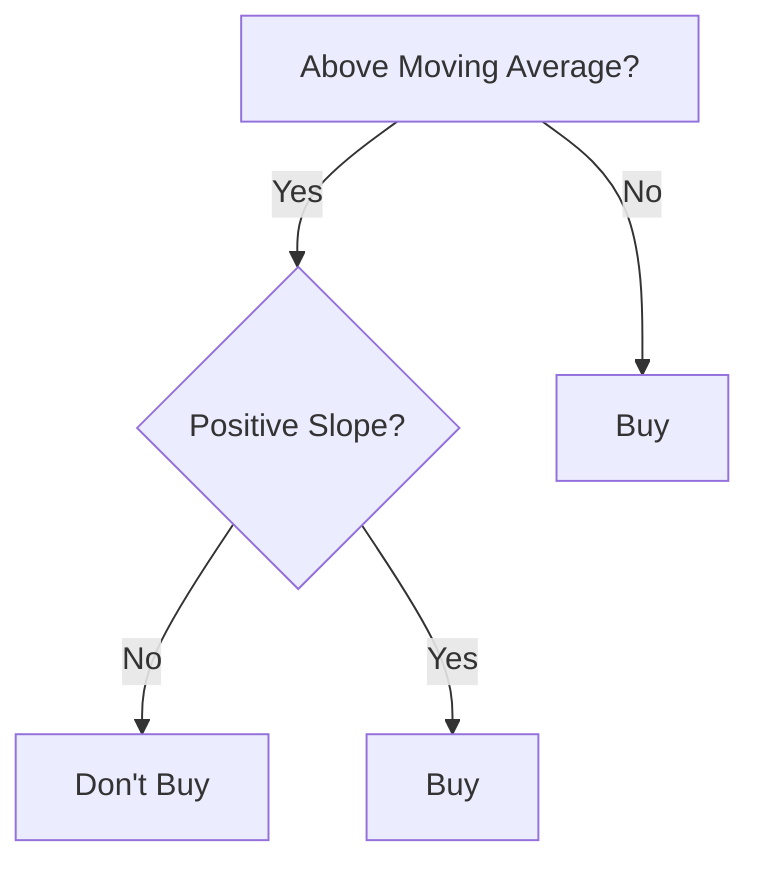

<table><tr><td colspan="2">For office use only</td></tr><tr><td>T1</td><td></td></tr><tr><td>T2</td><td></td></tr><tr><td>T3</td><td></td></tr><tr><td>T4</td><td></td></tr></table>

Team Control Number

## 2229059

Problem Chosen

C

For office use only

<table><tr><td>F1</td><td></td></tr><tr><td>F2</td><td></td></tr><tr><td>F3</td><td></td></tr><tr><td>F4</td><td></td></tr></table>

## 2022

## MCM/ICM

## Summary Sheet

## Day Trading in Bitcoin and Gold

Everyday, market traders buy and sell financial assets with a goal to maximize their total return. Two popular investment asset choices are gold and bitcoin. Bitcoin is an extremely volatile asset and does not have a strong fundamental base like other assets on the market. However, it is able to be traded every day. In contrast, gold is stable, often used as a hedge against downward movements in other sectors, but it can only be traded Monday through Friday – days when the market is open. Our team has been asked by a trader to develop a model, using only past asset prices to date, that determines daily trading actions, in order to maximize profit. For each purchase or sale of bitcoin and gold, a cost is applied to the transaction.

We have built a model that calculates the optimal selling and buying times using past values that take into account transaction fees and balances the ideal amount of gold and bitcoin traded. It uses an instantaneous logic model to analyze current market features and determine the most favorable trading action. The model runs from 9/11/2016 to 9/10/2021 and only uses the data given before the time slot it is currently in. Although the data is not continuous, it serves our purpose well as our model uses a macro scale prediction process to recommend trades. We utilize two different day trading theories and combine them into a weighted model.

Using common day trading theories we implement logic to guide our model’s decision making. Reversion to the mean and momentum theory contribute heavily and are the drivers of the model that choose whether a trade should be executed. We add, critically, a normalizing weight factor W. This weight factor cancels out noise that could prompt the model to choose a less favorable trade. On top of the model for standard market conditions, we add logic that is activated in extreme market conditions and takes precedence over the standard model.

The main advantage of our approach is that the model utilizes a well-made conglomeration of strategies allowing us to avoid common day trading failures. The model handles extreme market conditions, and can choose between different trading options; important things when trading a volatile medium like bitcoin. Limitations of our approach are a fixed logic system. It is not sensitive to small changes that might be capitalized on by different strategies, and chooses to wait for macroscopic trends in the market.

Key Words: Momentum Trading, Technical Analysis, Reversion to Mean, Noise Cancellation, Normalization, Time Aggregation

## Contents

## 1 Introduction 1

1.1 Restatement of problems .  
1.2 General Definitions .  
1.3 Assumptions 2

1.3.1 Non-Zero Assumption . . . . 2  
1.3.2 No Outside Investment . . . . 2  
1.3.3 Price Oscillation 3

## 2 Analysis of the Problem 4

## 3 Calculating and Simplifying the Model 5

3.1 Momentum Trading . . 5  
3.2 Reversion-to-Mean 5  
3.3 Calculating Profitability . . . 5  
3.4 Selling . . . 6  
3.5 Extreme Market Conditions . 6  
3.6 No-Buy Condition 7  
3.7 Holding Assets 7  
3.8 Daily Buy/Sell Order . . 7  
3.9 Noise Normalization 8

## 4 The Model Results 9

4.1 General Result 9  
4.2 Weight Factor . . 10  
4.3 Parameter Optimization . . 10  
4.4 Changes in Transaction Fees 12

## 5 Validating the Model 13

5.1 Bitcoin Buy/Sell . . 13  
5.2 Gold Buy/Sell . . 13

## 6 Strengths and Weaknesses 15

6.1 Strengths 15  
6.2 Weaknesses 15

## 7 Conclusions 16

## 8 Memorandum 17

## Appendices 20

## Appendix A First appendix 20

## 1 Introduction

## 1.1 Restatement of problems

Day trading is a predictive problem. It is easy to look back and recognize signals in a stock’s movement that lead to it’s eventual rise or decline, but predicting movements before it happens is an altogether harder problem. Additionally, new assets of different forms come onto the market frequently, and obey different rules, thus requiring different strategies. To add onto the problem, frequency trading is a relatively new discipline, and there is only 40 years of data (at most). In the grand scheme of data science, this is a small data set and it is hard to glean trends from this alone. Because of this, it is important to develop a model that can function using little to no prior data. The assumptions must be contained and edge cases must be accounted for in a successful model. For this specific problem, we have gold, bitcoin, and cash as usable assets. We have no prior data when our model launches. There is a fee associated with trades. The problem is to make money. Approaches are:

• finding a model that can extend market trends, or  
• find a model that can react instantaneously to market moves

These models must use their prediction of the market and cleverly make decisions about the most profitable trades. We decided to focus our efforts on a reactive model. The challenges associated with this model are:

• the triggers for a buy,  
• the triggers for a sell,  
• portfolio awareness, how to balance asset makeup,  
• extreme market conditions,  
• different magnitudes of signals,  
• noise in data

## 1.2 General Definitions

• Bitcoin: a digital currency decentralized using blockchains that have lower transaction fees than traditional online payment mechanisms [Investopedia 2022] Gold: the stored value of the precious metal gold, linked to currencies and interest rates [Investopedia].  
• Cash: in this problem, cash is in the form of the U.S. dollar (\$)

• Buy: Acquiring bitcoin or gold through trading in its value in cash plus the additional 1% and 2% transaction cost.  
• Sell: Acquiring the value of cash that corresponds to the value of the asset being sold minus the 1% or 2% transaction fees.  
• Volatility: the statistical measure of the range of returns on investment (dispersion) for a given security or market index [Investopedia 2022].  
• Momentum Trading: Buying securities while they are on the rise to sell them at a higher price [Investopedia 2022].  
• Technical Analysis: A trading strategy that analyzes statistical trends gathered from past trading activity [Investopedia 2022].  
• Reversion to Mean: Asset prices will eventually revert to the long-run mean [In vestopedia 2022].  
• Time Aggregation: Clustering of all data points over a period of time [IBM 2019]  
• Total Run Period: September 11, 2016 to September 11, 2021

## 1.3 Assumptions

We make several assumptions in this model to aid in our modeling.

## 1.3.1 Non-Zero Assumption

Assumption: We assume that the price of the assets will not fall to zero, and stay at zero.

Justification: Gold is very stable, and is often used as a hedge against unfavorable mar ket conditions. It is safe to assume that the price of this commodity will not reach zero. Bitcoin is a foundation for cryptocurrency. There would have to be a full scale meltdown of all crypto infrastructure, either resulting in faulty blockchain usage (not enough miners) or 0 demand. Both of these are extremely unlikely.

## 1.3.2 No Outside Investment

Assumption: We assume that we will not be able to leverage our investments and use margin in our model.

Justification: Day trading in bitcoin is already a high risk investment, and using margin makes the risk untenable.

## 1.3.3 Price Oscillation

Assumption: We assume that the price of the assets will oscillate over time.

Justification: For any profit to be made from the value of the stock, this assumption must be true. This is a fixed risk assumption: If the stock is flat for all times in the interval, then the model loses the fee, no more.

## 2 Analysis of the Problem


<details>
<summary>line chart</summary>

| Days | Bitcoin (USD) |
| ---- | ------------- |
| 0    | 0             |
| 250  | ~2,000        |
| 500  | ~18,000       |
| 750  | ~6,000        |
| 1000 | ~12,000       |
| 1250 | ~8,000        |
| 1500 | ~12,000       |
| 1750 | ~60,000       |
</details>

(a) 1a: Bitcoin Price from 9/11/2016 to 9/10/2021


<details>
<summary>line chart</summary>

| Days | Gold (USD) |
|------|------------|
| 0    | 1300       |
| 250  | 1250       |
| 500  | 1350       |
| 750  | 1200       |
| 1000 | 1400       |
| 1250 | 1600       |
| 1500 | 1900       |
| 1750 | 1800       |
</details>

(b) 1b: Gold Price from 9/11/2016 to 9/10/2021  
Figure 1: Plots of bitcoin and gold


<details>
<summary>line chart</summary>

| Days | Gold | Bitcoin |
|------|------|---------|
| 0    | 1000 | 1000    |
| 250  | 1000 | 3000    |
| 500  | 1000 | 19000   |
| 750  | 1000 | 6000    |
| 1000 | 1000 | 12000   |
| 1250 | 1000 | 8000    |
| 1500 | 1000 | 18000   |
| 1750 | 1000 | 52000   |
</details>

Figure 2: Bitcoin Price from 9/11/2016 to 9/10/2021

Figures 1a and 1b show the price evolution of bitcoin and gold from 9/11/2016 to 9/10/2021. Although the movement appears to be connected, figure 2 shows that the difference in scale is drastic. To determine the best trades, we develop a model that returns predictions for profitability on each asset with respect to cash. These predictions are compared, and using the profitability metric, the optimal trade amount is also determined. The model is fully connected; this means that it is aware of other trades happening, and will not make contradictory or redundant actions.

## 3 Calculating and Simplifying the Model

## 3.1 Momentum Trading

We use the common trading technique called momentum trading in our model. We calculate the momentum of the asset using the price gradient of an asset and the moving average. The price gradient is a simple calculation. At a time t, we calculate the gradient G by

$$
G = \nabla P \qquad \mathrm{or} \qquad G _ {t} (n) \approx P _ {t} - P _ {t - n + 1}
$$

where $P _ { t }$ is the price of the asset at time t. The moving average is given by

$$
A _ {t} (n) = \frac {\sum_ {i = 0} ^ {n - 1} w _ {i} P _ {t - i}}{\sum_ {i = 0} ^ {n - 1} w _ {i}}
$$

where $w _ { i }$ is the weight given to the price and $P _ { t }$ is the same as before. For both metrics, n is the time interval we observe. The model then decides whether to buy or sell an asset at a time t like

$$
M _ {t} (n) = \left\{ \begin{array}{l l} G _ {t} (n) & (\text { gradient }) \\ P _ {t} - A _ {t} (n) & (\text { difference   between   price   and   moving   average }) \end{array} \right.
$$

Both cases must be true for $M _ { t } ( n )$ to return a buy signal. If both $G _ { t } ( n ) > 1$ and $P _ { t } { - } A _ { t } ( n ) >$ 1 then $M _ { t } ( n ) > 1$ > > and a buy signal is issued and remains active until the next time period $t + 1$ . Otherwise, a sell signal is issued. Combining the two techniques allows us to capitalize on price increases more efficiently.

## 3.2 Reversion-to-Mean

Momentum trading is a good method if the price tends to break out above a moving average. We want our model to be conscious of movements below the moving-average as well, and thus we implement reversion-to-mean strategies. We write

$$
\int_ {\mu - i} ^ {\mu + i} P (x) d x > \int_ {\mu - j} ^ {\mu + j} P (x) d x \quad \text { for } \quad i > j > 0
$$

For our model, this says that the farther the price deviates from the moving average, the more likely it is on the next time step to be closer to the moving average. This can be interpreted qualitatively by noting that as the price of an asset falls far below the moving average, it is likely to make positive moves in the future and thus the signal is a buy.

## 3.3 Calculating Profitability

Figure 3 describes the general logic that we use to determine buy/sell indicators. We extend this by adding a ’profitability’ metric to each indicator that is returned. For momentum trades, we say that the profitability is proportional to the gradient of the price.


<details>
<summary>flowchart</summary>


</details>

Figure 3: Flow Chart Describing our buy logic.

This is given by the momentum metric. Our justification for this is that if the momentum is extremely high, the trend will carry on for longer, and profit is more likely. For reversion-to-the-mean trades, we say that the profitability is proportional to the square of the distance from the mean. Given the assumption that the price will revert to the mean, our model makes small trades for normal oscillations, and in large drops in price that fall far below the moving average, the model recognizes this as a crash and buys larger amounts.

## 3.4 Selling

Our selling mechanism is simple and conservative. One of our assumptions is that the price oscillates. That is, after a period of increase, there will be a period of decrease. Our selling implementation compares the price of the asset on the day with the average price paid for an asset. Adding in fees, the model then determines if the profit made from a sell would be greater than a margin L. This looks like

$$
S = (1 - f _ {a}) \cdot P - \frac {\sum_ {i = 0} ^ {n} (1 - f _ {a _ {i}}) C _ {i}}{i} - L
$$

Where $f _ { a }$ is the fee of an asset, P is the price of the asset, and C is the cost paid for an asset. We sum over the differing costs paid, including the reduction from fees, to calculate the average cost of an asset we have on the market. Specifically, this says that the sell indicator S is $( 1 - f _ { g } ) \cdot P$ (the amount gained from a sell, including fees) minus $\frac { \sum _ { 0 } ^ { n } { ( 1 { - } f _ { g _ { n } } ) } C _ { n } } { n }$ (the average price of an asset in the market) minus the margin L. $\mathrm { I f } \ S > 0 .$ , the model sells.

## 3.5 Extreme Market Conditions

Bitcoin is a highly volatile asset, and is subject to large jumps in price. Capitalizing on these movements successfully is critical to making large profits. We implement an ’extreme market condition’ that takes over the model when activated. The condition for an extreme market condition is the gradient being over 5 times the average gradient over the history of the model.

$$
E = G _ {t} (n) - C \cdot \frac {\sum_ {i = 0} ^ {n} G _ {t} (i)}{n}
$$

where C is a scaling factor. If E is positive, then the price of an asset is growing rapidly and an extreme market condition takes over. If this is the case, the model is not allowed to sell an asset until the price has regressed to a percentage of its maximum value over the interval, or a price $\Delta P$ below its maximum over the interval. This eliminates the possibility of a premature sell, as would happen if our model used its normal sell function.

## 3.6 No-Buy Condition

Following an extreme market condition comes abnormal selling conditions. Often times, as the price of an asset regresses, there will be small increases on the way back down. Following an extreme market condition and a peak, it is unlikely that there will be another surge immediately following. Thus, we implement a ’no-buy’ condition, that is activated when there has been an extreme market condition in a recent time interval and the model has recently sold an asset. The model is then no longer allowed to buy back into the market for a number of days.

## 3.7 Holding Assets

Because of the erratic nature of stocks, it is hard to predict the exact movement of a stock on any day. Additionally, the data given is daily. We choose to focus on larger movement trends and ignore minuscule price changes. The reason for this is fees: buying and selling at every possible change in price may seem to be extremely profitable, but the fees begin to play a major role in the profits at this point. Additionally, in periods of large gain or fall, small corrections will cause the model to sell when it should be considering longerterm gains. Thus, we implement a holding period of z days. Once the model buys an asset, it can no longer sell for those z days.

## 3.8 Daily Buy/Sell Order

We assume that the model checks the prices in the market once a day, because our data is daily. The order of action on a given day is to first check for ’no-buy’ and extreme market conditions. If no-active, then the model immediately moves to the sell indicators. If extreme market conditions are activated, control is shifted to the extreme market logic and the rest of the program is skipped. The model then checks the buy indicators, and compares them to decide what to buy. It stores this decision and checks the sell indicator for the other asset. Then, the model executes the order, selling first if indicated, and then buying. If neither buy markers were activated, then the model can choose to sell both assets.

## 3.9 Noise Normalization

As shown in figure 2, the assets can differ in the magnitude of movement. We tackle this problem by introducing a weight factor that goes like

$$
W = C \frac {1}{t ^ {2}}
$$

where t is time in days, and C is a scalar constant. As t approaches larger values, the weight factor becomes very small. This drowns out small changes in price movement, so that the model considers large signals only. When comparing the profitability between gold and bitcoin, the bitcoin markers are considered much more heavily than the gold markers. This allows the model to choose the more profitable trade.

## 4 The Model Results

## 4.1 General Result


<details>
<summary>line chart</summary>

| Days | Total | Bitcoin | Gold | Cash |
|------|-------|---------|------|------|
| 0    | 0     | 0       | 0    | 0    |
| 250  | 0     | 0       | 0    | 0    |
| 500  | 25000 | 25000   | 0    | 25000 |
| 750  | 25000 | 25000   | 0    | 25000 |
| 1000 | 45000 | 45000   | 0    | 35000 |
| 1250 | 40000 | 35000   | 0    | 25000 |
| 1500 | 80000 | 80000   | 0    | 25000 |
| 1750 | 210000| 90000   | 0    | 140000 |
</details>

Figure 4: Our results.

Figure 4 shows the results of our model. The total ends at \$220 486. This represents a return on investment of 21 948% and an annualized return on investment of 194%. Observing figure 4 and comparing figure 1a and 1b we can see that the model sells at near-optimal points. Note the times $t \approx 5 0 0 , 1 0 5 0 , 1 6 2 5$ . These are critical points corresponding to bitcoin crashes. Because of the setup of our model, the portfolio is, in general, bitcoin heavy. However, the model activates the extreme market conditions, and executes the necessary trades to preserve the portfolio value. We see a common trend: the model sells all bitcoin when it gets large sell signals, and then slowly buys back in as bitcoin decreases or stays level. Our model is designed to make money. Thus, it sacrifices hedges like gold in favor of going in all in on bitcoin when it receives a large buy signal. Compare figure 1a we can see that the model follows bitcoin very closely, as it invests heavily in the asset. Especially on the up-trends, the performance is near identical. However, our model stays much flatter through the down-trends, again showing how the model is selling and staying in cash through periods of price decrease. Because of the reversion-to-the-mean strategy, the model slowly buys back in as the price of bitcoin decreases, decreasing the overall asset cost.

## 4.2 Weight Factor


<details>
<summary>line chart</summary>

| Days | Value  |
|------|--------|
| 0    | 10000  |
| 50   | 10000  |
| 100  | 2000   |
| 150  | 0      |
| 200  | 0      |
| 250  | 0      |
| 300  | 0      |
| 350  | 0      |
| 400  | 0      |
| 450  | 3000   |
| 500  | 10000  |
| 550  | 1000   |
| 600  | 1000   |
| 650  | 1000   |
| 700  | 1000   |
| 750  | 1000   |
| 800  | 1000   |
| 850  | 1000   |
| 900  | 1000   |
| 950  | 1000   |
| 1000 | 1000   |
| 1050 | 1000   |
| 1100 | 1000   |
| 1150 | 1000   |
| 1200 | 1000   |
| 1250 | 1000   |
| 1300 | 1000   |
| 1350 | 1000   |
| 1400 | 1000   |
| 1450 | 1000   |
| 1500 | 1500   |
| 1550 | 2500   |
| 1600 | 3500   |
| 1650 | 4500   |
| 1700 | 7500   |
</details>

Figure 5: The weight factor normalizing the magnitude of the signals.

Figure 5 is the effect of the weight factor on the buy signals. The y-axis is a unitless measure of profitability. We can see that although the magnitude of price movements in bitcoin increase, the signals that the model generates are normalized. Note the high signals in $0 < t < 1 0 0$ . This is due to the lack of data, since the model can only use < <data points it has seen. Note also that this is the only time that gold has a large buy signal. For the rest of the time the model is active bitcoin is much more highly valued and takes precedent. The model thus sees bitcoin as being much more profitable, due to its volatility.

## 4.3 Parameter Optimization


<details>
<summary>line chart</summary>

| Days | 1 | 2 | 3 | 4 | 5 | 6 | 7 | 8 | 9 | 10 | 11 | 12 | 13 | 14 | 15 | 16 | 17 | 18 | 19 | 20 | 21 | 22 | 23 | 24 | 25 | 26 | 27 |
| --- | --- | --- | --- | --- | --- | --- | --- | --- | --- | --- | --- | --- | --- | --- | --- | --- | --- | --- | --- | --- | --- | --- | --- | --- | --- | --- | --- |
| 0 |  |  |  |  |  |  |  |  |  |  |  |  |  |  |  |  |  |  |  |  |  |  |  |  |  |  |  |
| 250 |  |  |  |  |  |  |  |  |  |  |  |  |  |  |  |  |  |  |  |  |  |  |  |  |  |  |  |
| 500 |  |  |  |  |  |  |  |  |  |  |  |  |  |  |  |  |  |  |  |  |  |  |  |  |  |  |  |
| 750 |  |  |  |  |  |  |  |  |  |  |  |  |  |  |  |  |  |  |  |  |  |  |  |  |  |  |  |
| 1000 |  |  |  |  |  |  |  |  |  |  |  |  |  |  |  |  |  |  |  |  |  |  |  |  |  |  |  |
| 1250 |  |  |  |  |  |  |  |  |  |  |  |  |  |  |  |  |  |  |  |  |  |  |  |  |  |  |  |
| 1500 |  |  |  |  |  |  |  |  |  |  |  |  |  |  |  |  |  |  |  |  |  |  |  |  |  |  |  |
</details>

Figure 6: Results under different combinations.

Figure 6 shows the results of our model under different variations of parameters. The parameters varied are in the format [T N E]. T is the time the model must hold an asset. L is the price the asset must fall to (as a percentage of the maximum price) for the model to begin buying assets again. E is the percentage of the max price that an asset must fall to for the model to sell in an extreme market condition. In the table below, we can see that the combination [12 0 6 0 89] is optimal.

Observe that small changes at the beginning are indicative of overall model success. Our model works excellently given the data. At low times, there is no history for the model to average over, and thus it perceives smaller signals as larger magnitude buys. Because of this, the model is profitable at low times. Having a larger portfolio earlier on leverages the model, which is why we see huge divergence in the final amounts in figure 6.

<table><tr><td>Performance</td><td>Index</td><td>Parameter Set</td><td>Final Amount in USD</td></tr><tr><td>Poor</td><td>1</td><td>[5,0.4,0.86]</td><td>14023</td></tr><tr><td>Poor</td><td>2</td><td>[5,0.4,0.89]</td><td>24183</td></tr><tr><td>Poor</td><td>3</td><td>[5,0.4,0.895]</td><td>24183</td></tr><tr><td>Good</td><td>4</td><td>[5,0.6,0.86]</td><td>117416</td></tr><tr><td>Great</td><td>5</td><td>[5,0.6,0.89]</td><td>185291</td></tr><tr><td>Great</td><td>6</td><td>[5,0.6,0.895]</td><td>169463</td></tr><tr><td>Good</td><td>7</td><td>[5,0.65,0.86]</td><td>106137</td></tr><tr><td>Great</td><td>8</td><td>[5,0.65,0.89]</td><td>157249</td></tr><tr><td>Good</td><td>9</td><td>[5,0.65,0.895]</td><td>140421</td></tr><tr><td>Poor</td><td>10</td><td>[6,0.4,0.86]</td><td>13307</td></tr><tr><td>Poor</td><td>11</td><td>[6,0.4,0.89]</td><td>24183</td></tr><tr><td>Poor</td><td>12</td><td>[6,0.4,0.895]</td><td>24183</td></tr><tr><td>Poor</td><td>13</td><td>[6,0.6,0.86]</td><td>90167</td></tr><tr><td>Great</td><td>14</td><td>[6,0.6,0.89]</td><td>181230</td></tr><tr><td>Great</td><td>15</td><td>[6,0.6,0.895]</td><td>169178</td></tr><tr><td>Poor</td><td>16</td><td>[6,0.65,0.86]</td><td>82855</td></tr><tr><td>Good</td><td>17</td><td>[6,0.65,0.89]</td><td>135476</td></tr><tr><td>Good</td><td>18</td><td>[6,0.65,0.895]</td><td>123393</td></tr><tr><td>Poor</td><td>19</td><td>[12,0.4,0.86]</td><td>72670</td></tr><tr><td>Poor</td><td>20</td><td>[12,0.4,0.89]</td><td>24183</td></tr><tr><td>Poor</td><td>21</td><td>[12,0.4,0.895]</td><td>24183</td></tr><tr><td>Poor</td><td>22</td><td>[12,0.6,0.86]</td><td>72670</td></tr><tr><td>Best</td><td>23</td><td>[12,0.6,0.89]</td><td>220486</td></tr><tr><td>Great</td><td>24</td><td>[12,0.6,0.895]</td><td>178076</td></tr><tr><td>Poor</td><td>25</td><td>[12,0.65,0.86]</td><td>72670</td></tr><tr><td>Great</td><td>26</td><td>[12,0.65,0.89]</td><td>175510</td></tr><tr><td>Great</td><td>27</td><td>[12,0.65,0.895]</td><td>162657</td></tr></table>

## 4.4 Changes in Transaction Fees

We also want to observe how the model behaves when the transaction fees change. We ran the optimal model with different sets of fees.


<details>
<summary>line chart</summary>

| Days | 1     | 2     | 3     | 4     |
|------|-------|-------|-------|-------|
| 0    | 0     | 0     | 0     | 0     |
| 250  | 0     | 0     | 0     | 0     |
| 500  | 25000 | 25000 | 25000 | 25000 |
| 750  | 25000 | 25000 | 25000 | 25000 |
| 1000 | 45000 | 45000 | 45000 | 45000 |
| 1250 | 45000 | 45000 | 45000 | 45000 |
| 1500 | 80000 | 80000 | 80000 | 80000 |
| 1750 | 210000| 210000| 165000| 55000 |
</details>

Figure 7: Results under different combinations.

<table><tr><td>Index</td><td>Parameter Set</td><td>Final Amount in USD</td></tr><tr><td>1</td><td>[0.01, 0.02]</td><td>220486</td></tr><tr><td>2</td><td>[0.02, 0.03]</td><td>199945</td></tr><tr><td>3</td><td>[0.03, 0.05]</td><td>156038</td></tr><tr><td>4</td><td>[0.1, 0.1]</td><td>47452</td></tr></table>

The parameter set is [gold fee, bitcoin fee]. We can see that the performance decreases as the fees increase, as expected. The model continues to buy and sell, factoring in the fees into the buy and sell price, but for each transaction, less money stays in the portfolio. Because this model is a high-frequency trading model, the fees accumulate quickly. We can see that especially at the start, when the model is in ’normal’ market mode, it is trading most frequently and racking up the fees. As the transaction fees increase, the model generates profit at a fraction of its maximum. Since the fees are a percentage, the loss is small when the market is flat. In periods of massive price increase, however, small changes in initial value compound, leading to the disparity seen in figure 7 and accompanying chart.

## 5 Validating the Model

We can test the performance of our model by observing the buy and sell times.

## 5.1 Bitcoin Buy/Sell


<details>
<summary>line chart</summary>

| Days | Value  |
|------|--------|
| 0    | 40000  |
| 10   | 50000  |
| 20   | 60000  |
| 30   | 55000  |
| 40   | 58000  |
| 50   | 56000  |
| 60   | 62000  |
| 70   | 65000  |
| 80   | 58000  |
| 90   | 55000  |
| 100  | 45000  |
| 110  | 38000  |
| 120  | 35000  |
| 130  | 38000  |
| 140  | 33000  |
| 150  | 35000  |
</details>

Figure 8: Buy (RED) and Sell (BLUE) orders for bitcoin between 1610 and 1760 days.

Figure 8 shows the buy and call orders for bitcoin from $t = 1 6 1 0$ to $t = 1 7 6 0$ days. The buy orders are red, and the sell orders are blue.

Observing the active orders from figure 8, we can see that the model looks to buy on the upward trend. $\mathrm { A t } ~ t = 1 8 ~ ( t = 1 6 2 8 ~ \mathrm { o v e r a l l } )$ , the model senses downward trend and sells. Because this is the peak, (compare figure 1a) it is an extreme market condition, and thus the sell order also triggers the no buy condition. Although this causes the model to miss the peak by a small margin, the sell price is still extremely profitable. Notice the dearth af signals from $t = 1 8 \mathrm { t o } t = 1 0 5$ . This is the ’no-buy’ condition being activated after the sell indicator. Notice, critically, that this stops the model from buying in near the peak, which would be a very poor trade. The model then buys back in at $t = 1 0 5$ $( t = 1 7 1 5$ overall) and continues to change the portfolio from cash to bitcoin. Compare to figure 1a we can see that this is near the trough (the minimum is around 35000\$) and the bitcoin prices rise quickly again, at $t = 1 7 5 0 \ : ( t = 1 4 0$ on figure 8. This is exactly the behavior that we want

## 5.2 Gold Buy/Sell

Figure 9 shows the buy and call orders for gold from $t = 1 6 1 0$ to t = 1760 days.

We use a different time interval because at later times, bitcoin indicators are much stronger and the buy/sell analysis for gold is not insightful. We can see that the model buys continuously on the uptrend, and sells at a price of roughly 1950 near the peak. These are the model’s normal buy signals: and it is working properly for gold through this interval. Figure 9 shows the buy times, but not the amounts. As the model buys, it does so like the weight factor $\textstyle { \frac { 1 } { t ^ { 2 } } }$ . Thus, at the beginning of the buy cycle the amounts are larger and the portfolio gets converted to gold in decaying amounts.


<details>
<summary>line chart</summary>

| Days | Value |
|------|-------|
| 0    | 1580  |
| 10   | 1670  |
| 20   | 1690  |
| 30   | 1580  |
| 40   | 1620  |
| 50   | 1680  |
| 60   | 1740  |
| 70   | 1700  |
| 80   | 1720  |
| 90   | 1730  |
| 100  | 1740  |
| 110  | 1750  |
| 120  | 1760  |
| 130  | 1770  |
| 140  | 1780  |
| 150  | 1800  |
| 160  | 1850  |
| 170  | 1950  |
| 180  | 2050  |
| 190  | 1980  |
| 200  | 1960  |
| 210  | 1940  |
| 220  | 1920  |
| 230  | 1880  |
| 240  | 1900  |
| 250  | 1910  |
</details>

Figure 9: Buy (RED) and Sell (BLUE) orders for gold between 460 and 560 days.

## 6 Strengths and Weaknesses

## 6.1 Strengths

Our model performs well under volatile market conditions and can use that volatility to gain profit. It balances the different signals from different types of assets and is able to make decisions on whether to buy, sell, and what amount to trade with. A key feature of our model that makes it excel in the bitcoin market is its ability to trade in different growth stages. When the price of the asset is relatively flat, oscillating between two points, the model trades according to its normal logic and can make profit. If the price breaks out and begins to increase rapidly, the model immediately recognizes this and changes its logic in preparation for expected conditions and to secure maximum profit on this price move. The model is also able to differentiate between different strengths of signal; although there may be signals telling the model to buy gold, signals from bitcoin might have a stronger signature and the model will know that the most profitable trade is bitcoin.

Our model also is able to perform well using minimal to no data, as it is completely logic based. There is no need to calculate a trend from historical data, as the model can make instantaneous decisions based on current price movements alone. However, the model does adapt over time, considering moving averages and past price gradients to guide it in making the most profitable trades.

## 6.2 Weaknesses

A weakness of our model is that it may be over-fit to the data. Because of the nature of the problem, the model must be logic-based and/or learn on the fly. We chose the optimal parameters for our model using numerical optimization. However, the parameters we chose may work differently for different data sets. Despite this, figure 6 shows that for small variations in parameters the fall-off is not massive. Although it is far from optimal, the model is still profitable in most cases. We are also confident that the normal functionality of the model would be preserved, and in a normal market condition the model would work similarly.

Another weakness is that the model does not trade at maximum frequency and instead looks for bigger trends in price movement. This is primarily due to the data set; there is limited points from which dips and peaks in the price can be exploited. For volatile assets, it is hard to ascertain whether this is a weakness or strength. Although the model may lose profit on the many peaks and dips generated in the short term, the ability to capitalize efficiently on the huge price spikes is critical.

## 7 Conclusions

Our objective was to:

• build a model that generates maximum profit over the time period.

In order to do this, we had to create an algorithm that could function with very low data sizes. We used a combination of momentum trading and reversion to the mean theories in our trading logic. We further improved this model by adding conditions for extreme market conditions that might occur in volatile markets like bitcoin. Optimizing our model revealed to us the best parameters for our model. Using these parameters, our model worked well on the data set provided and beat the market in returns, generating \$219,799 from a principal investment of \$1000 4 years prior.

## 8 Memorandum

DATE: February 2022

TO: Interested Investors

FROM: Modeling Team 2229059

SUBJECT: Day Trading Model

Our team was assigned to create a model that would calculate the optimal daily strategy to trade between cash, gold, and bitcoin in order to generate the most profit. The model was initialized at \$1000 cash on September 11, 2016 and terminated on September 11, 2021. Using price data that was recorded up to only the day of trading, we successfully created a model that predicted future trends and informed current investment strategies utilizing various trading and normalization methods.

Our model was created on the basis of two main trading strategies: momentum theory and reversion to the mean. The momentum of the financial asset is calculated through the price gradient – the change in price in an interval of time – and moving average – the summation of previous weighted prices divided by a sum of previous weights. If both the gradient and moving average are greater than 1 at the time of trading, a buy signal will be generated. Otherwise, a sell signal is issued. Since momentum trading determines trades when the price rises above the moving average, the reversion to mean strategy is used to catch price movements below it. This theory states that the farther the price deviates away from the moving average, the greater the probability it will move towards the average on its next time step. If the price falls far below the moving average, it is more likely to increase in the future, so our model will generate a buy signal. A combination of these two theories creates the trading strategy our model uses for normal market conditions.

The second part of trading is to determine how much to buy at each trade. We do this by calculating the profitability of the current market. The profitability is directly proportional to the gradient of the price, so the larger the magnitude the gradient has, the larger the amount of assets it will purchase.

In standard market conditions, the general sequence of asset trading is coded as follows: The model checks for sell indicators, selling any assets if demanded. The model checks the gold and bitcoin buy indicators, compares them to decide if and what to buy. If neither buy signals were issued, the model can choose to sell both assets.

When an asset is bought, it will not immediately be sold, even though a continuous buying and selling at any increase in value may seem profitable because of the transaction fees in place. Therefore, our model implements a holding period of z days where the asset is not bought or sold.

The strategy described previously was to operate during normal market conditions. In the case of extreme market conditions, a second sequence of logic is activated, overriding our previous methods. If the current gradient is calculated to five times the average historical gradient, the extreme market conditions algorithm is run. This means that the model will not sell until the price of the asset has returned to a price ∆P below its maximum over the interval. This method is used to prevent the premature selling that could have occurred if the normal strategy was implemented. Following the extreme market conditions sequence, we run a no-buy condition where the model will not buy into the market for a certain period of time.

After running our model for the four-year period, we obtained a final asset value of \$219,799 – a return on investment of 21,880%. Our model buys and sells at near optimal points and responds effectively to market crashes and critical points. Since our model’s purpose is profit, it will buy and sell assets with that sole intention, resulting in a final portfolio of largely bitcoin and less gold.

Though our model is profitable and effective, we recognize its strengths and weaknesses. We will be glad to discuss any further recommendations on improving it to increase its efficiency and profitability.

Thank you for supporting this endeavor.

Sincerely,

Modeling Team

## References

[1] COMAP 2022. Problem C data set 1. 2022  
[2] COMAP 2022. Problem C data set 2. 2022  
[3] Wolfram Mathworld, Reversion to the Mean. https://mathworld.wolfram. com/ReversiontotheMean.html  
[4] Taylor & Francis Online, ’Trend following with momentum versus moving averages: a tale of differences’. Valeriy, Zakamulin, 2020. https://www. tandfonline.com/doi/full/10.1080/14697688.2020.1716057  
[5] Barone, Adam. “What Is Momentum Trading?” Investopedia, Investopedia, 8 Feb. 2022, https://www.investopedia.com/trading/ introduction-to-momentum-trading/  
[6] Chen, James. “Understanding the Theory of Mean Reversion.” Investopedia, Investopedia, 5 Nov. 2021, https://www.investopedia.com/terms/m/ meanreversion.asp  
[7] Frankenfield, Jake. “Bitcoin Definition: How Does Bitcoin Work?” Investopedia, Investopedia, 20 Feb. 2022, https://www.investopedia.com/terms/b/ bitcoin.asp  
[8] “Gold.” Investopedia, Investopedia, https://www.investopedia.com/ gold-4689769  
[9] Hayes, Adam. “Understanding Technical Analysis.” Investopedia, Investopedia, 8 Feb. 2022, https://www.investopedia.com/terms/t/ technicalanalysis.asp  
[10] Hayes, Adam. “Volatility.” Investopedia, Investopedia, 8 Feb. 2022, https://www. investopedia.com/terms/v/volatility.asp  
[11] IBM Corporation. Time Aggregation, 2019, https://www.ibm.com/docs/en/ tnpm/1.4.5?topic=series-time-aggregation

## Appendices

## Appendix A First appendix

Here are simulation programs we used in our model, in pseudocode.

Input python source:  
```python
import numpy as np
import pandas as pd

class Portfolio():
    def constructor():
    make a portfolio

    def sell_function():
    sell assets

    def buy_function():
    buy assets

class Market():
    def constructor():
    read in data

    def grad():
    price gradient

    def weight_factor():
    calculate weight factor

    def profit_chance():
    calculate chances of profit for gold and bitcoin

    def sell_chance():
    calculate whether the model should sell

    def extreme_growth(self, day):
    calculate if the market is in an extreme growth period

def run():
    instantiate classes
    initiate required lists to hold values
    initiate variables to starting values
    for each day:
    check if it is a weekend
    check if the model can sell assets
    calculate the average price of assets currently in portfolio
```

check if extreme market or no buy conditions are active if extreme market conditions are active: use the extreme market sell conditions continue check if the model should buy gold or bitcoin go through the buy/sell logic and make appropriate trades