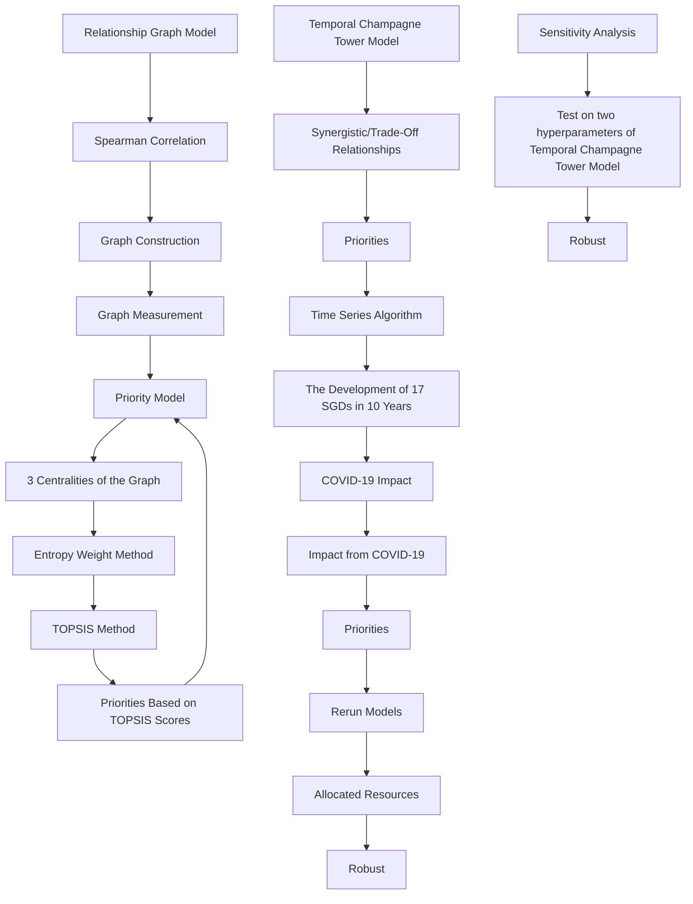
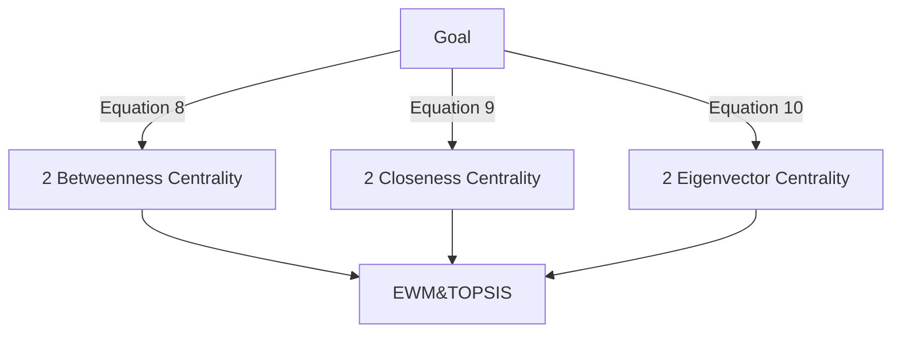
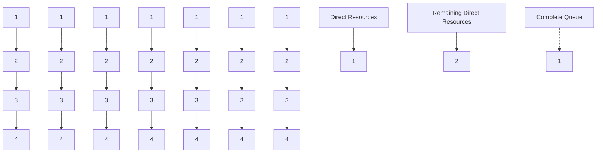
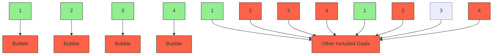
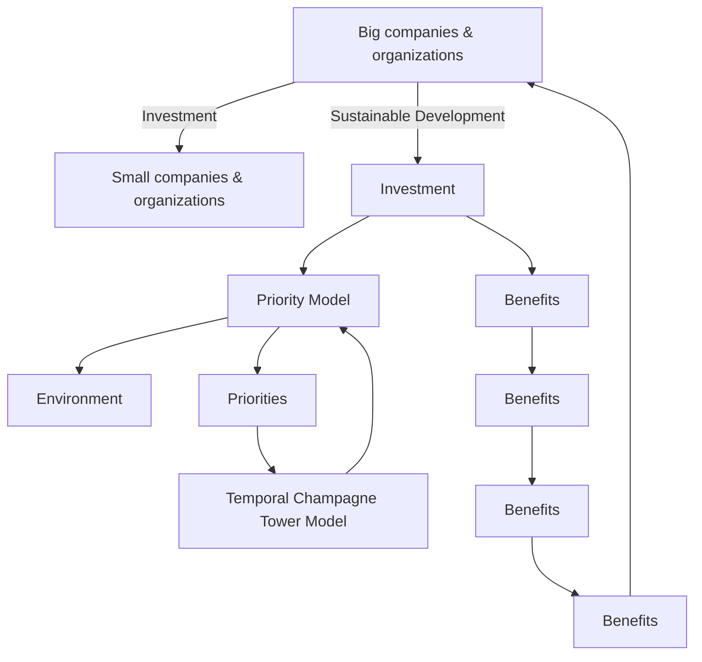

# Methods of Measuring Priority via Graph Models: Who Is the Top 1?

Summary

In 2015, the United Nations set 17 Sustainable Development Goals (SDGs). If these goals are achieved, we could ultimately improve life of people all over the world. The 17 SDGs are not inde pendent of each other. Their connections make the achievement of all goals much easier. In this paper, we construct three distinctive models to study how to prioritize the SDGs.

First, to find out relationships and priorities between the 17 SDGs, we propose Relationship Graph Model. In the model, we build a graph between 17 SDGs. Vertexes of the graph are the 17 goals. Edges of the graph are correlations between goals via Spearman Correlation Analysis Algorithm. To measure the graph, we use Betweenness Centrality, Closeness Centrality and Eigenvector Centrality. We respectively calculate centralities of positive edges and negative edges. Hence, each goal has 6 indexes. We use Entropy Weight Method to calculate weights of the 6 indexes. Then we use Weighted TOPSIS to get the priorities of the 17 goals. Goal 3 and Goal4 rank in top 5 priority list for all three countries we study. This means most countries should put health and education on the priority list of development.

Then, we study the development of the 17 SDGs in next 10 years. We propose Temporal Champagne Tower Model. This model not only considers resource allocation based on priorities, but also the synergistic and trade-off relationships between goals. We use Time Series Algorithm to predict the development of SDGs in next 10 years. We allocate resources according to the method of first satisfying the higher priority goal. When a goal is achieved, we raise its priority to the highest priority queue (complete goal queue) to preferentially maintain the complete goal. We do simulation on Indonesia. In the next 10 years, Indonesia can achieve 5 goals. It can achieve 82% of SDGs, which is 4% higher than the result of its current plan.

Moreover, to study the impact of unexpected events like COVID-19, we make some adjustment to our models. We add two parameters to measure the impacts. Models which are about the priorities and allocated resources are adjusted based on the two parameters. We rerun our models. According to the simulation, in the next 10 years, Indonesia can only achieve 3 goals. It can achieve 78% of SDGs, which is 4% lower than the previous result.

Finally, we perform sensitivity analysis on the hyperparameters and in Temporal Champagne Tower Model. The maximum variation ranges of the model results caused by the changes of and are 0.041 and 0.028, respectively, which indicates that our model has a strong robustness.

Key words: sustainable development goals, graph centrality, topsis, entropy weight method

## Contents

## 1 Introduction.

1.1 Problem Background  
1.2 Literature Review .. 2  
1.3 Our Work .. ∆

## 2 Assumptions and Justifications.. ∆

## 3 Notations .. 5

## 4 Relationship Graph Model..

4.1 The Data  
4.2 Graph Construction . .6  
4.3 Graph Measurement based on Graph Theory....... .. 8  
4.4 Results and Analysis.

## 5 Priority Model.

5.1 Establishment of the Model. 1−  
5.2 Results and Analysis. 13

## 6 Temporal Champagne Tower Model for Future Development .14

6.1 Mathematical Establishment of the Model. 15  
6.2 Temporal Champagne Tower Model . .16  
6.3 Model Solutions based on Time Series Algorithms ... 17  
6.4 One Goal Being Achieved 17  
6.5 Results and Analysis. .18

## 7 Analysis on the Impacts .... .19

7.1 COVID-19 Impact on Models.. 19  
7.2 Results and Analysis. .20  
7.3 Model Impact on Companies and Organizations . .21

## 8 Sensitivity Analysis.... .22

## 9 Model Evaluation and Further Discussion.. .23

9.1 Strengths of the Model . 23  
9.2 Weaknesses of the Model . 23

## References... .24

## Appendix... .25

## 1 Introduction

## 1.1 Problem Background

In 1987, the Brundtland report proposed the most recognized definition of sustainable develop ment, which is: “Sustainable development is able to meet the requirements of the current generation and does not have to consume the capability of the future generations”[1]. Ever since then, a number of attempts at this goal have been made[2]. In 2015, the United Nations set 17 Sustainable Develop ment Goals (SDGs)[3]. If achieved, these goals could ultimately lead to an improved life of people all over the world.

The 17 SDGs are not independent of each other. Their connections make the achievement of all goals much easier. Hence, we establish models to study their relationships as well as completing the following problems.

C Create a network to reveal relationships between the 17 SDGs. The key to this problem is to measure the relationships in a mathematical way.  
Set priorities for the 17 SDGs. The key to this problem is to find a reasonable standard and sort all goals under this standard.  
C Study the development of SDGs in next 10 years with priorities set. Study the impact from achievement of one goal. The key to this problem is to find a plan which considers the priority and the relationships between goals.  
Discuss the impact of unexpected events. The key to this problem is to quantify the impacts and adjust our models based on the impacts.  
Discuss the use of models in other fields. The key to this problem is to find relations between SDGs and goals of companies and organizations.

## 1.2 Literature Review

Relationships between SDGs have been extensively studied. David Le Blanc proposed the SDG relationship graph based on the relationships between indicators and goals[4]. He concluded that some SDGs are closely related. Ranjula Bali Swain et al. used the correlation between SDG target variables to model the edges in the correlation networks[5]. They used centrality measures and community detection to analyze the networks. Their conclusion is that it may be effective to identify a specific community of SDG targets for a specific region. Pradhan P, Costa L, Rybski D, et al. calculated the Spearman’s correlation between the indicators, and classified correlations as synergy and trade-off. They emphasized the role of synergy in the realization of SDGs[6]. All works mentioned above used correlation to measure the relationship between SDGs and achieved good effects.

There are also some researches on the impact of international crises on SDGs. Naidoo R, Fisher

B discussed the threat of COVID-19 to SDGs and expressed their expectations on the United Nations[7]. Mukarram M described socio-economic impacts of COVID-19, which can be mitigated via his methods[8]. Both works have good assessments of the impact of global pandemics. We discuss further based on their researches.

## 1.3 Our Work

Based on the problem analysis, we construct three distinctive models—Relationship Graph Model, Priority Model and Temporal Champagne Model. Then we study the impact from COVID-19 on our models. Finally, we conduct sensitivity to test the robustness of our models. The work we have done is mainly shown in Figure 1.

flowchart

Figure 1 The Framework of Our Work

## 2 Assumptions and Justifications

Through a complete analysis of the problem, in order to make our model more practical and reasonable, we make the following reasonable assumptions.

Assumption 1: All data from the datasets are authentic.

It is meaningless to study fake datasets. We believe the datasets we get are authentic and accurate. No malicious modification has ever occurred.

Assumption 2: The completion difficulties of all 17 SDGs are the same.

Since it is hard to measure the completion difficulty of each goal and no specific data describing difficulties are found, we assume completion difficulties of them are all the same.

## 3 Notations

The key mathematical notations used in this paper are listed in Table 1.

Table 1 Notations Used in This Paper

<table><tr><td>Symbol</td><td>Definition</td></tr><tr><td> $\mathcal{G}(V,E,W)$ </td><td>The undirected relationship graph of 17 SGDs.</td></tr><tr><td> $BC(i)$ </td><td>The betweenness centrality of node  $i$ .</td></tr><tr><td> $CC(i)$ </td><td>The closeness centrality of node  $i$ .</td></tr><tr><td> $EC(i)$ </td><td>The eigenvector centrality of node  $i$ .</td></tr><tr><td> $s_i$ </td><td>The score of the  $i^{th}$  goal from TOPSIS Model.</td></tr><tr><td> $v_t(i)$ </td><td>Change of percentage complete from correlation.</td></tr><tr><td> $d_t(i)$ </td><td>Resources allocated to the  $i^{th}$  goal.</td></tr><tr><td> $g_t(i)$ </td><td>Percentage complete of the  $i^{th}$  goal in year  $t$ .</td></tr><tr><td> $\gamma_i$ </td><td>The threat level of the goal  $i$ .</td></tr><tr><td> $MI_i$ </td><td>The mitigation or aggravating level of the goal  $i$ .</td></tr></table>

Note: There are some variables not listed here and will be discussed in detail in each section.

## 4 Relationship Graph Model

To reveal the relationships between 17 SDGs, we create a graph based on graph theory. Afterwards, we want to measure the importance of each node in the graph, which plays an important role in studying priorities of the 17 goals. Hence, we use three types of centrality measures as the parameters of our graph model, which are commonly used to tell the importance of nodes.

## 4.1 The Data

Before the establishment of the model, we get data in need at first. Then we do some preprocessing on the data for better analysis.

## 4.1.1 Data Selection

We get our data from the United Nations Global SDG Database[9]. This database owns comprehensive datasets tracking 17 SDGs. The 17 SDGs each has several targets. Each target also has several indicators. Each indicator consists of many series.

In order to make our model more reliable and robust, we make a balance between maximizing the years of samples and the numbers of series. We also have to make sure all the SDGs are covered. Finally, we select 95 series in total. We choose data from Turkey, Mexico and Indonesia, which represent three different continents. Years of the data are from 2003 to 2018.

## 4.1.2 Data Processing

Data Cleaning: Some values are missing from the dataset. We use linear regression to supple ment the missing values. This method can make use of the information in the original data set as much as possible. Its calculation method is

$$
\begin{array}{l} \hat {y} = b x + a \\ b = \frac {n \sum_ {i = 1} ^ {n} x _ {i} y _ {i} - \left(\sum_ {i = 1} ^ {n} x _ {i}\right) \left(\sum_ {i = 1} ^ {n} y _ {i}\right)}{n \sum_ {i = 1} ^ {n} x _ {i} ^ {2} - \left(\sum_ {i = 1} ^ {n} x _ {i}\right) ^ {2}} \tag {1} \\ a = \bar {y} - b \bar {x} \\ \end{array}
$$

where $\hat { y }$ is the supplementary value of the missing item, is the year of the missing item, and $b$ are two parameters. For some values that cannot be negative, we use 0 to supplement the missing item when $\hat { y } < 0$ .

Data Normalization: We do normalization to make the data be limited within $[ 0 , 1 ]$ , so as to reduce the adverse effects caused by the singular sample data. For indicators which are the larger the better, we do normalization in this way:

$$
I _ {i, t, c} ^ {\prime} = \frac {I _ {i , t , c} - \min \left(I _ {i , . . .}\right)}{\max \left(I _ {i , . . .}\right) - \min \left(I _ {i , . . .}\right)} \tag {2}
$$

where $I _ { i , t , c }$ is the matrix of series of country in period and ${ { I ^ { \prime } } _ { i , t , c } }$ is the value after normalization.

For indicators which are the smaller the better, we do normalization in this way:

$$
I _ {i, t, c} ^ {\prime} = \frac {\max \left(I _ {i , . . .}\right) - I _ {i , t , c}}{\max \left(I _ {i , . . .}\right) - \min \left(I _ {i , . . .}\right)} \tag {3}
$$

After normalization, we make all indicators the larger the better and restricted to . This makes it more reasonable when calculating correlation of the data.

## 4.2 Graph Construction

We use $\mathcal { G } ( V , E , W )$ to denote the undirected relationship graph of 17 goals, where $V$ is the set of all nodes, is the set of all edges and is the weight matrix . $V _ { i }$ is the $\mathrm { i ^ { t h } }$ node, which represents the $\mathrm { i ^ { t h } }$ goal. $E _ { i j }$ is the undirected edge between node and node $j$ , which represents the connection between two goals. $w _ { i j }$ is the weight of $E _ { i j }$ . Based on the structure of the data and the requirement of problem 1, we make “goals” directly concerned with “series”. Then we use $V _ { i k }$ to denote the ${ \mathrm { k } } ^ { \mathrm { t h } }$ series of the $\mathrm { i ^ { t h } }$ goal. We use $x _ { i k }$ to denote the vector of the ${ \mathrm { k } } ^ { \mathrm { t h } }$ series of the $\mathrm { i ^ { t h } }$ goal. It consists data from 2003 to 2018. Vector $x _ { i k }$ can be described as

$$
\boldsymbol {x} _ {i k} = \left[ \boldsymbol {x} _ {i k 1}, \boldsymbol {x} _ {i k 2}, \dots \boldsymbol {x} _ {i k 1 6} \right] ^ {T} \tag {4}
$$

where $x _ { i k _ { 1 } } , x _ { i k _ { 2 } } , \cdots x _ { i k _ { 1 6 } }$ are the statistic values of the ${ \mathrm { k } } ^ { \mathrm { t h } }$ series of the $\mathrm { i ^ { t h } }$ goal from year 2003 to year 2018. They are from the datasets we find.

We use Spearman’s analysis to construct edges of the graph. This is because compared to Pearson’s correlation analysis, Spearman’s analysis is better at capturing non-linear correlation and is less sensible to outliers[10]. We use $b _ { i k , j p }$ to denote the Spearman correlation coefficient between the ${ \mathrm { k } } ^ { \mathrm { t h } }$ series of the $\mathrm { i ^ { t h } }$ goal and the $\boldsymbol { \mathrm { p } } ^ { \mathrm { t h } }$ series of the $\mathrm { j } ^ { \mathrm { t h } }$ goal. Before calculation, we need to convert $x _ { i k }$ and $x _ { j p }$ into grade vector $r _ { i k }$ and $r _ { j p }$ (The grade of a number is the position of the number after sorting its vector from small to large). Then we calculate the correlation coefficient. The calculation method of $b _ { i k , j p }$ is

$$
b _ {i k, j p} = \frac {\frac {1}{n} \sum_ {m = 1} ^ {n} \left(r _ {i k m} - \overline {{r _ {i k}}}\right) \cdot \left(r _ {j p m} - \overline {{r _ {j p}}}\right)}{\sqrt {\left(\frac {1}{n} \sum_ {m = 1} ^ {n} \left(r _ {i k m} - \overline {{r _ {i k}}}\right) ^ {2}\right) \cdot \left(\frac {1}{n} \sum_ {m = 1} ^ {n} \left(r _ {j p m} - \overline {{r _ {j p}}}\right) ^ {2}\right)}} \tag {5}
$$

where $\overline { { r _ { i k } } }$ and $\overline { { r _ { j p } } }$ are the mean values of all $r _ { i k }$ and $r _ { j p }$ , respectively.

Connections between series can mainly be divided into three types, which are positive correlation, negative correlation and none correlation. All connections between series of the $\mathrm { i ^ { t h } }$ goal and series of the $\mathrm { j } ^ { \mathrm { t h } }$ goal may not belong to the same type. Hence, we respectively take the three types of connection into consideration. We use vector $a _ { i j }$ to measure the connection between the $\mathrm { i ^ { t h } }$ goal and the $\mathrm { j } ^ { \mathrm { t h } }$ goal. The first dimension of vector $a _ { i j }$ measures positive correlation. The second dimension of the vector measures negative correlation and the third dimension of the vector measures none correlation. The calculation method of $a _ { i j }$ is

$$
a _ {i j} = \left[ \begin{array}{c} \frac {\operatorname{crad} \left(\left\{b _ {i k , j p} \mid b _ {i k , j p} > 0 . 6 \right\}\right)}{N _ {i j}} \\ \frac {\operatorname{crad} \left(\left\{b _ {i k , j p} \mid b _ {i k , j p} <   - 0 . 6 \right\}\right)}{N _ {i j}} \\ \frac {\operatorname{crad} \left(\left\{b _ {i k , j p} \mid - 0 . 6 \leqslant b _ {i k , j p} \leqslant 0 . 6 \right\}\right)}{N _ {i j}} \end{array} \right] \tag {6}
$$

where $N _ { i j }$ is the total number of connections between series of the $\mathrm { i ^ { t h } }$ goal and series of the $\mathrm { j } ^ { \mathrm { t h } }$ goal. If $N _ { i j } < 1 0$ , the edge between node i and node j will be removed. Because the correlation is not reliable[6].

Finally, the weight $w _ { i j }$ of edge $E _ { i j }$ is calculated by

$$
w _ {i j} = a _ {i j 1} - a _ {i j 2} \tag {7}
$$

If $w _ { i j } > 0$ , then the $\mathrm { i ^ { t h } }$ goal has a positive correlation with the $\mathrm { j } ^ { \mathrm { t h } }$ goal. If $w _ { i j } < 0$ , then the $\mathrm { i ^ { t h } }$ goal has a negative correlation with the $\mathrm { j } ^ { \mathrm { t h } }$ goal. The bigger $| w _ { i j } |$ , the stronger the correlation is.

## 4.3 Graph Measurement based on Graph Theory

There are mainly three methods to measure the influence of nodes. Hence parameters of our model come from these three methods, which are Betweenness Centrality, Closeness Centrality and Eigen vector Centrality. Here we respectively take positive edges and negative edges into consideration.

## Betweenness Centrality

Betweenness centrality measures how often a node lies on the path of other nodes[11]. We use $B C ( i )$ to denote the betweenness centrality of the $\mathrm { i ^ { t h } }$ node. Its calculation method is

$$
BC(i) = \sum_ {\substack {j <   k \\ j \neq i \neq k}} \frac {n _ {i} (j , k)}{n (j , k)} \tag{8}
$$

where $n ( j , k )$ is the number of shortest paths from node $j$ to node and $n _ { i } \left( j , k \right)$ is the number of such paths that pass through node .

## Closeness Centrality

A node is close to others if the sum of minimal distances from others is small[12]. Closeness centrality is a path-based method of centrality[5]. We use $\mathit { C C } ( i )$ to denote the closeness centrality of the $\mathrm { i ^ { t h } }$ node. Its calculation method is

$$
C C (i) = \frac {1}{\sum_ {j \neq i} d (i , j)} \tag {9}
$$

where $d ( i , j )$ is the minimal distance between node and node $j$ .

## Eigenvector Centrality

Eigenvector centrality is a common algorithm to measure the importance of a node[13]. It considers the number of neighbors and the importance of the neighbors. We use $E C ( i )$ to denote the eigenvector centrality of the $\mathrm { i ^ { t h } }$ node. Its calculation method is

$$
E C (i) = \alpha \sum_ {j = 1} ^ {n} r _ {i j} \cdot E C (j) \tag {10}
$$

where $1 / \alpha$ is the largest eigenvalue of the adjacency matrix $R = ( r _ { i j } )$ .

## 4.4 Results and Analysis

## 4.4.1 Results and Analysis from the Graph

Figure 2 are relationship graphs between 17 goals of three countries. In Figure 2, the red line represents positive correlation, while the blue line represents negative correlation. The thicker the line is, the stronger is the correlation. According to Figure 2, we have some discoveries:

In general, the majority of the 17 goals have positive correlations with each other. Positive correlations represent synergistic relationship, while negative correlation represent tradeoff relationship. According to the United Nation, the seventeen goals own the same pur pose, which is to end poverty, protect the planet and ensure prosperity for all. In this way, the 17 goals should have synergistic relationship with each other.  
⚫ Some negative correlation does exist, which means the two goals are trade-offs. This is mainly because these two goals are competing resources.

  
a) Turkey

radar chart

| Goal | Positive Correlation (%) | Negative Correlation (%) |
|---|---|---|
| Goal1 | 95 | 0 |
| Goal2 | 85 | 0 |
| Goal3 | 70 | 0 |
| Goal4 | 90 | 0 |
| Goal5 | 80 | 0 |
| Goal6 | 75 | 0 |
| Goal7 | 65 | 0 |
| Goal8 | 70 | 0 |
| Goal9 | 85 | 0 |
| Goal10 | 95 | 0 |
| Goal11 | 75 | 0 |
| Goal12 | 80 | 0 |
| Goal13 | 70 | 0 |
| Goal14 | 85 | 0 |
| Goal15 | 75 | 0 |
| Goal16 | 90 | 0 |
| Goal17 | 95 | 0 |
| Goal18 | 80 | 0 |
| Goal19 | 95 | 0 |
| Goal20 | 85 | 0 |
| Goal21 | 70 | 0 |
| Goal22 | 80 | 0 |
| Goal23 | 75 | 0 |
| Goal24 | 85 | 0 |
| Goal25 | 90 | 0 |
| Goal26 | 80 | 0 |
| Goal27 | 95 | 0 |
| Goal28 | 85 | 0 |
| Goal29 | 90 | 0 |
| Goal30 | 80 | 0 |
| Goal31 | 95 | 0 |
| Goal32 | 85 | 0 |
| Goal33 | 90 | 0 |
| Goal34 | 80 | 0 |
| Goal35 | 95 | 0 |
| Goal36 | 85 | 0 |
| Goal37 | 90 | 0 |
| Goal38 | 80 | 0 |
| Goal39 | 95 | 0 |
| Goal40 | 85 | 0 |
| Goal41 | 90 | 0 |
| Goal42 | 80 | 0 |
| Goal43 | 95 | 0 |
| Goal44 | 85 | 0 |
| Goal45 | 90 | 0 |
| Goal46 | 80 | 0 |
| Goal47 | 95 | 0 |
| Goal48 | 85 | 0 |
| Goal49 | 90 | 0 |
| Goal50 | 80 | 0 |
| Goal51 | 95 | 0 |
| Goal52 | 85 | 0 |
| Goal53 | 90 | 0 |
| Goal54 | 80 | 0 |
| Goal55 | 95 | 0 |
| Goal56 | 85 | 0 |
| Goal57 | 90 | 0 |
| Goal58 | 80 | 0 |
| Goal59 | 95 | 0 |
| Goal60 | 85 | 0 |
| Goal61 | 90 | 0 |
| Goal62 | 80 | 0 |
| Goal63 | 95 | 0 |
| Goal64 | 85 | 0 |
| Goal65 | 90 | 0 |
| Goal66 | 80 | 0 |
| Goal67 | 95 | 0 |
| Goal68 | 85 | 0 |
| Goal69 | 90 | 0 |
| Goal70 | 80 | 0 |
| Goal71 | 95 | 0 |
| Goal72 | 85 | 0 |
| Goal73 | 90 | 0 |
| Goal74 | 80 | 0 |
| Goal75 | 95 | 0 |
| Goal76 | 85 | 0 |
| Goal77 | 90 | 0 |
| Goal78 | 80 | 0 |
| Goal79 | 95 | 0 |
| Goal80 | 85 | 0 |
| Goal81 | 90 | 0 |
| Goal82 | 80 | 0 |
| Goal83 | 95 | 0 |
| Goal84 | 85 | 0 |
| Goal85 | 90 | 0 |
| Goal86 | 80 | 0 |
| Goal87 | 95 | 0 |
| Goal88 | 85 | 0 |
| Goal89 | 90 | 0 |
| Goal90 | 80 | 0 |
| Goal91 | 95 | 0 |
| Goal92 | 85 | 0 |
| Goal93 | 90 | 0 |
| Goal94 | 80 | 0 |
| Goal95 | 95 | 0 |
| Goal96 | 85 | 0 |
| Goal97 | 90 | 0 |
| Goal98 | 80 | 0 |
| Goal99 | 95 | 0 |
| Goal111: Positive Correlation; Negative Correlation

b) Indonesia

radar chart

| Goal | Positive Correlation | Negative Correlation |
|---|---|---|
| Goal1 | 0.95 | 0.85 |
| Goal2 | 0.65 | 0.75 |
| Goal3 | 0.85 | 0.75 |
| Goal4 | 0.95 | 0.85 |
| Goal5 | 0.75 | 0.65 |
| Goal6 | 0.65 | 0.75 |
| Goal7 | 0.75 | 0.65 |
| Goal8 | 0.65 | 0.75 |
| Goal9 | 0.85 | 0.75 |
| Goal10 | 0.95 | 0.85 |
| Goal11 | 0.75 | 0.65 |
| Goal12 | 0.85 | 0.75 |
| Goal13 | 0.95 | 0.85 |
| Goal14 | 0.75 | 0.65 |
| Goal15 | 0.85 | 0.75 |
| Goal16 | 0.95 | 0.85 |
| Goal17 | 0.85 | 0.75 |

c) Mexico  
Figure 2 Graph of the Relationships between 17 Goals

Figure 3 shows the synergies and trade-offs within and between 17 SDGs in Indonesia. The left part shows the synergies and trade-offs within goals. The middle part shows the synergies and tradeoffs between goals. The right part shows the color bars and legends of the figure. The lower triangle part of the figure are several pie charts. These pie charts describe the percentage of positive correlations, negative correlations and non-correlations between two goals. This is because each goal has many series. All connections between series of goals may not belong to the same type. The upper triangle part of the figure are weights between two goals. According to Figure 3, we have some discoveries:

⚫ Within each goal, positive correlations outweigh negative correlations. The series of each goal are synergies. This means targets set for each goal are reasonable.  
Goal 7 has negative correlations with all other goals. Goal 7 is “affordable and clean energy”. The cost of clean energy is much higher than fossil energy. And it needs a lot of in vestment for technological improvement. It also occupies a lot of human and material resources. It makes sense that goal 7 and other goals are trade-offs.

Advice for the United Nation. We suggest that the UN should lower the standard of goal 7 for countries like Indonesia, whose synthetic national power is not strong. We also recommend these countries to put goal 7 in low priority. Moreover, it is a good idea to have some developed countries help these countries develop the technologies of affordable and clean energy.

heatmap

|  | 1 | 2 | 3 | 4 | 5 | 6 | 7 | 8 | 9 | 10 | 11 | 12 | 13 | 14 | 15 | 16 | 17 |
| --- | --- | --- | --- | --- | --- | --- | --- | --- | --- | --- | --- | --- | --- | --- | --- | --- | --- |
| 1 | 0.33 | 0.2 | 0.49 | 0.5 | 0.0 | 0.5 | 0.67 | 0.48 | 0.58 | 0.52 | 0.0 | 0.0 | 0.69 | 0.0 | 0.19 | 0.0 | 0.21 |
| 2 | 0.2 | 0.2 | 0.49 | 0.5 | 0.0 | 0.5 | 0.67 | 0.48 | 0.58 | 0.52 | 0.0 | 0.0 | 0.69 | 0.0 | 0.19 | 0.0 | 0.21 |
| 3 | 0.49 | 0.49 | 0.49 | 0.5 | 0.0 | 0.5 | 0.67 | 0.48 | 0.58 | 0.52 | 0.0 | 0.0 | 0.69 | 0.0 | 0.19 | 0.0 | 0.21 |
| 4 | 0.5 | 0.5 | 0.49 | 0.5 | 0.0 | 0.5 | 0.67 | 0.48 | 0.58 | 0.52 | 0.0 | 0.0 | 0.69 | 0.0 | 0.19 | 0.0 | 0.21 |
| 5 | 0.0 | 0.5 | 0.49 | 0.5 | 5 | 6 | -33 | -33 | -33 | -33 | -33 | -33 | -33 | -33 | -33 | -33 | -33 |
| 6 | 0.5 | -33 | -33 | -33 | -33 | -33 | -33 | -33 | -33 | -33 | -33 | -33 | -33 | -33 | -33 | -33 | -33 |
| 7 | -33 | -33 | -33 | -33 | -33 | -33 | -33 | -33 | -33 | -33 | -33 | -33 | -33 | -33 | -33 | -33 | -33 |
| 8 | -33 | -33 | -33 | -33 | -33 | -33 | -33 | -33 | -33 | -33 | -33 | -33 | -33 | -33 | -33 | -33 | -33 |
| 9 | -73 | -73 | -73 | -73 | -73 | -73 | -73 | -73 | -73 | -73 | -73 | -73 | -73 | -73 | -73 | -73 | -73 |
| 10 | -73 | -73 | -73 | -73 | -73 | -73 | -73 | -73 | -73 | -73 | -73 | -73 | -73 | -73 | -73 | -73 | -73 |

Figure 3 Synergies and Trade-offs within and between Goals

## 4.4.2 Results and Analysis from Graph Parameters

Since we respectively take positive edges and negative edges into consideration, we have two kinds of centralities. We use $B C ^ { + } , \ C C ^ { + } , \ E C ^ { + }$ to denote betweenness centrality, closeness centrality and eigenvector centrality of positive edges, respectively. We use $B C ^ { - } , \ C C ^ { - } , \ E C ^ { - }$ to denote betweenness centrality, closeness centrality and eigenvector centrality of negative edges, respec tively. Parameters for graph of Mexico is shown in Table 2. Parameters for graph of Indonesia and Turkey are shown in Appendix. According to the table, we find that Goal 3 has the highest value of $B C ^ { + } , \ C C ^ { + }$ and $E C ^ { + }$ . We preliminarily estimate Goal 3 has the highest priority. Further study on priorities will be conducted in section 5.

Table 2 Parameters for Graph of Mexico

<table><tr><td></td><td>Goal 1</td><td>Goal 2</td><td>Goal 3</td><td>Goal 4</td><td>Goal 5</td><td>Goal 6</td><td>Goal 7</td><td>Goal 8</td></tr><tr><td> $BC^{+}$ </td><td>0.000</td><td>0.004</td><td>0.162</td><td>0.004</td><td>0.000</td><td>0.004</td><td>0.000</td><td>0.004</td></tr><tr><td> $CC^{+}$ </td><td>0.444</td><td>0.556</td><td>0.606</td><td>0.556</td><td>0.333</td><td>0.556</td><td>0.000</td><td>0.556</td></tr><tr><td> $EC^{+}$ </td><td>0.340</td><td>0.313</td><td>0.340</td><td>0.036</td><td>0.340</td><td>0.000</td><td>0.340</td><td>0.000</td></tr><tr><td> $BC^{-}$ </td><td>0.022</td><td>0.196</td><td>0.252</td><td>0.000</td><td>0.000</td><td>0.000</td><td>0.046</td><td>0.000</td></tr><tr><td> $CC^{-}$ </td><td>0.520</td><td>0.722</td><td>0.619</td><td>0.464</td><td>0.394</td><td>0.481</td><td>0.481</td><td>0.481</td></tr><tr><td> $EC^{-}$ </td><td>0.257</td><td>0.472</td><td>0.294</td><td>0.108</td><td>0.062</td><td>0.209</td><td>0.226</td><td>0.209</td></tr></table>

Table 2 Parameters for Graph of Mexico(continued)

<table><tr><td>Goal 9</td><td>Goal 10</td><td>Goal 11</td><td>Goal 12</td><td>Goal 13</td><td>Goal 14</td><td>Goal 15</td><td>Goal 16</td><td>Goal 17</td></tr><tr><td>0.029</td><td>0.004</td><td>0.000</td><td>0.000</td><td>0.004</td><td>0.000</td><td>0.004</td><td>0.000</td><td>0.000</td></tr><tr><td>0.200</td><td>0.556</td><td>0.000</td><td>0.120</td><td>0.556</td><td>0.333</td><td>0.556</td><td>0.120</td><td>0.120</td></tr><tr><td>0.340</td><td>0.000</td><td>0.000</td><td>0.340</td><td>0.036</td><td>0.340</td><td>0.000</td><td>0.000</td><td>0.340</td></tr><tr><td>0.054</td><td>0.491</td><td>0.000</td><td>0.010</td><td>0.022</td><td>0.000</td><td>0.022</td><td>0.000</td><td>0.000</td></tr><tr><td>0.520</td><td>0.813</td><td>0.000</td><td>0.419</td><td>0.520</td><td>0.000</td><td>0.520</td><td>0.000</td><td>0.464</td></tr><tr><td>0.232</td><td>0.510</td><td>0.000</td><td>0.112</td><td>0.257</td><td>0.000</td><td>0.257</td><td>0.000</td><td>0.108</td></tr></table>

## 5 Priority Model

As Figure 4 shows, based on the results of section 4.4, each goal now has three attributes, which are the three centrality measures of the node. Since we respectively take positive edges and negative edges into consideration, each attribute has 2 indexes. Hence, each goal has 6 indexes. Then we use Entropy Weight Method (EWM) to get the weight of each index. Afterwards, we use weighted TOP-SIS[14] to get scores for all 17 goals. Priorities of the 17 goals are based on these scores. The higher scores, the higher priority.

In graph theory, the centrality measure is used to assess the “centrality” status of nodes in a graph. It helps understand the importance and influence of nodes in the graph. In our Relationship Graph Model, a goal with higher centrality means it is more important and owns larger influence. Hence, this goal should have higher priority. After Entropy Weight Method and TOPSIS, we can get a more reliable and comprehensive measure of centrality. Thus, priority based on our model can be effective.

flowchart

Figure 4 Overview of the Priority Model

## 5.1 Establishment of the Model

We first do positive management on vector $B C ^ { - } , \ C C ^ { - }$ and $E C ^ { - }$ due to they are centralities of negative edges.

Then, we combine the six indexes of the $\mathrm { i ^ { t h } }$ goal into a vector $c _ { i }$ . It can be described as

$$
c _ {i} = \left[ B C _ {i} ^ {+}, C C _ {i} ^ {+}, E C _ {i} ^ {+}, B C _ {i} ^ {-}, C C _ {i} ^ {-}, E C _ {i} ^ {-} \right] ^ {T} \tag {11}
$$

Afterwards, we combine $c _ { i }$ of all 17 goals into a $1 7 \times 6$ matrix . Hence, $C$ is

$$
C = \left[ c _ {1}, c _ {2} \dots c _ {1 7} \right] ^ {T} \tag {12}
$$

## 5.1.1 Sub-Model 1: Weight Entropy Method Model

Step1: Normalize the matrix .The standardized formula is

$$
\tilde {z} _ {i j} = \frac {c _ {i j} - \min \left\{c _ {1 j} , c _ {2 j} , \dots , c _ {n j} \right\}}{\max \left\{c _ {1 j} , c _ {2 j} , \dots , c _ {n j} \right\} - \min \left\{c _ {1 j} , c _ {2 j} , \dots , c _ {n j} \right\}} \tag {13}
$$

Step2: Calculate the proportion of the $\mathrm { i ^ { t h } }$ goal in the $\mathrm { j } ^ { \mathrm { t h } }$ index, which is regarded as the probability used in the calculation of relative entropy later. The calculation method is

$$
p _ {i j} = \frac {\widetilde {z} _ {i j}}{\sum_ {i = 1} ^ {1 7} \widetilde {z} _ {i j}} \tag {14}
$$

Step3: Calculate the information entropy and the information utility value of each attribute.

For the $\mathrm { j } ^ { \mathrm { t h } }$ attribute, the formula for calculating its information entropy is

$$
e _ {j} = - \frac {1}{\ln 1 7} \sum_ {i = 1} ^ {1 7} p _ {i j} \ln \left(p _ {i j}\right) (j = 1, 2 \dots 6) \tag {15}
$$

For the $\mathrm { j } ^ { \mathrm { t h } }$ attribute, the calculation method of its information utility value is

$$
d _ {j} = 1 - e _ {j} \tag {16}
$$

Step4: Calculate the entropy weight of each attribute. The entropy weight of each attribute is the normalized information utility value. Its calculation method is

$$
w _ {j} = \frac {d _ {j}}{\sum_ {j = 1} ^ {6} d _ {j}} \tag {17}
$$

## 5.1.2 Sub-Model 2: TOPSIS Model

Step1: Standardize the matrix $C$ to eliminate the influence of different index dimensions. The normalized matrix is denoted as and each element in is

$$
z _ {i j} = \frac {c _ {i j}}{\sqrt {\sum_ {i = 1} ^ {1 7} c _ {i j} ^ {2}}} \tag {18}
$$

And the standardized matrix is

$$
Z = \left[ \begin{array}{c c c c} z _ {1 1} & z _ {1 2} & \dots & z _ {1 6} \\ z _ {2 1} & z _ {2 2} & \dots & z _ {2 6} \\ \vdots & \vdots & \ddots & \vdots \\ z _ {1 7, 1} & z _ {1 7, 2} & \dots & z _ {1 7, 6} \end{array} \right] \tag {19}
$$

Step2: Define the optimal vector and the worst vector. We use $z ^ { + }$ to denote the optimal vector and use $z ^ { - }$ to denote the worst vector. Hence, $z ^ { + }$ is

$$
z ^ {+} = \left(\max \left\{z _ {1 1}, z _ {2 1}, \dots z _ {1 7, 1} \right\}, \max \left\{z _ {1 2}, z _ {2 2}, \dots z _ {1 7, 2} \right\}, \dots \max \left\{z _ {1 6}, z _ {2 6}, \dots z _ {1 7, 6} \right\}\right) \tag {20}
$$

And $z ^ { - }$ is

$$
z ^ {-} = \left(\min \left\{z _ {1 1}, z _ {2 1}, \dots z _ {1 7, 1} \right\}, \min \left\{z _ {1 2}, z _ {2 2}, \dots z _ {1 7, 2} \right\}, \dots \min \left\{z _ {1 6}, z _ {2 6}, \dots z _ {1 7, 6} \right\}\right) \tag {21}
$$

Step3: Calculate the weighted Euclidean distance between the indexes of goals and the optimal vector:

$$
D _ {i} ^ {+} = \sqrt {\sum_ {j = 1} ^ {6} w _ {j} \left(z _ {j} ^ {+} - c _ {i j}\right) ^ {2}} \tag {22}
$$

Step4: Calculate the weighted Euclidean distance between the indexes of goals and the worst vector:

$$
D _ {i} ^ {-} = \sqrt {\sum_ {j = 1} ^ {6} w _ {j} \left(z _ {j} ^ {-} - c _ {i j}\right) ^ {2}} \tag {23}
$$

Step5: Calculate the scores of goals:

$$
s _ {i} = \frac {D _ {i} ^ {-}}{D _ {i} ^ {-} + D _ {i} ^ {+}} \tag {24}
$$

The priority of each goal is ordered by the score from TOPSIS Model. The higher score , the higher priority.

## 5.2 Results and Analysis

Figure 5 shows priorities of the 17 goals of the three countries. For Turkey, priorities of Goal 17 and Goal 9 outweigh priorities of others. For Indonesia and Mexico, the priority of Goal 3 is largely higher than other goals. Differences of priorities are mainly due to different situations of each country.

radar chart

| Goal   | Value |
|--------|-------|
| Goal1  | 1.0   |
| Goal2  | 0.8   |
| Goal3  | 0.6   |
| Goal4  | 0.4   |
| Goal5  | 0.2   |
| Goal6  | 0.0   |
| Goal7  | 0.2   |
| Goal8  | 0.4   |
| Goal9  | 0.8   |
| Goal10 | 0.6   |
| Goal11 | 0.4   |
| Goal12 | 0.2   |
| Goal13 | 0.0   |
| Goal14 | 0.2   |
| Goal15 | 0.4   |
| Goal16 | 0.6   |
| Goal17 | 0.8   |

radar chart

| Goal   | Value |
|--------|-------|
| Goal1  | 1.0   |
| Goal2  | 0.8   |
| Goal3  | 0.6   |
| Goal4  | 0.4   |
| Goal5  | 0.2   |
| Goal6  | 0.1   |
| Goal7  | 0.05  |
| Goal8  | 0.03  |
| Goal9  | 0.02  |
| Goal10 | 0.01  |
| Goal11 | 0.005 |
| Goal12 | 0.003 |
| Goal13 | 0.002 |
| Goal14 | 0.001 |
| Goal15 | 0.0005|
| Goal16 | 0.0003|
| Goal17 | 0.0002|

radar chart

| Goal   | Value |
|--------|-------|
| Goal1  | 0.8   |
| Goal2  | 0.6   |
| Goal3  | 0.4   |
| Goal4  | 0.2   |
| Goal5  | 0.1   |
| Goal6  | 0.05  |
| Goal7  | 0.03  |
| Goal8  | 0.02  |
| Goal9  | 0.01  |
| Goal10 | 0.005 |
| Goal11 | 0.003 |
| Goal12 | 0.002 |
| Goal13 | 0.001 |
| Goal14 | 0.0005|
| Goal15 | 0.0003|
| Goal16 | 0.0002|
| Goal17 | 0.0001|

Figure 5 Radar Map of the Normalization TOPSIS Scores

Results presented in Table 3 shows the top five priority goals of the three countries. We have some discoveries from the table. We find that Goal 3 and Goal 4 are in the top5 lists of all countries. Goal 3 is about health, while goal 4 is about education. In reality, health and education are great concerns of all countries. They are closely related to the economic and social development of a country. They have important impacts on the welfare of the people and the long-term development of the country.

Table 3 Top 5 priority goals

<table><tr><td colspan="2">Turkey</td><td colspan="2">Indonesia</td><td colspan="2">Mexico</td></tr><tr><td>Goal</td><td>Score</td><td>Goal</td><td>Score</td><td>Goal</td><td>Score</td></tr><tr><td>17</td><td>0.160</td><td>3</td><td>0.275</td><td>3</td><td>0.250</td></tr><tr><td>9</td><td>0.156</td><td>9</td><td>0.137</td><td>10</td><td>0.061</td></tr><tr><td>7</td><td>0.094</td><td>6</td><td>0.053</td><td>4</td><td>0.060</td></tr><tr><td>3</td><td>0.088</td><td>10</td><td>0.046</td><td>6</td><td>0.060</td></tr><tr><td>4</td><td>0.050</td><td>4</td><td>0.046</td><td>8</td><td>0.058</td></tr></table>

Advice for the United Nation: Generally, Goal 3 and Goal 4 are high priority goals of all countries, which are about health and education respectively. We suggest the United Nation organize some cooperation plans on health and education. With concerted efforts from all of us, we can accomplish the health and education goal more efficiently and effectively. Besides, priorities of goals differ from country to country. Hence, we suggest the United Nation offer more free choice to countries. We think it a good idea to enable the country to decide priorities on their own.

## 6 Temporal Champagne Tower Model for Future Development

When we pour champagne for a tower which is composed of wine cups, only when the upper cup is filled, the lower cup can get champagne. This phenomenon inspires us to propose Temporal Champagne Tower Model.

We want to measure completion status of the 17 goals. We use Temporal Champagne Tower Model to measure the completion status of the 17 goals if they are in the priority order we set. The model is based on Assumption 2, which is the completion difficulties of all 17 SDGs are the same. This means one percent completion of Goal i equals that of Goal j.

As Figure 6 shows, since our priorities are initiated, all the resources will be allocated to the top priority goal. Supposing we have 4 goals in total. The priorities of the 4 goals are Goal1>Goal2>Goal3>Goal4, as the shade of green color shows. Goal 1 is correlated to Goal 2. Goal 3 is correlated to Goal 2 and Goal 4. Of course, each goal is correlated to itself. In year , Goal 1 will be allocated all resources, as the dark blue arrow shows. Goal 2 has synergistic or tradeoff relationships with Goal 1. So, next year ( ), Goal 2 will benefit synergistic resources from Goal1 or it will compete resources with Goal 1, as denoted by orange arrow. Next year ( ), Goal 3 is added to the development queue due to its relationship with Goal 2. We assume Goal 1 is complete this year before all the allocated resources are used up. As shown in light blue arrow, some remaining resources will be allocated to Goal 2, which is just one level lower in priority of Goal 1. Then next year ( ), Goal 1 will be put in complete queue, with no resources allocated. Goal 2 will be allocated all resources, which owns the highest priority among the rest. The mathematical expression of the model will be discussed in the subsection below.

flowchart

Figure 6 Overview of Temporal Champagne Tower Model

## 6.1 Mathematical Establishment of the Model

To measure the completion status of the 17 SDGs, we use $G _ { t }$ to denote the percentage complete of 17 SDGs of year . Hence, we have

$$
G _ {t} = \left[ g _ {t} (1), g _ {t} (2), \dots g _ {t} (1 7) \right] \tag {25}
$$

where $g _ { t } \left( i \right)$ is the percentage complete of the $\mathrm { i ^ { t h } }$ goal of the year $t$ .

We use $S _ { t }$ to denote the development queue for the 17 SDGs in year . Since our priority is initiated, we have $S _ { 1 } = \{ V _ { i } | \ \forall V _ { j } \in V , s _ { i } \geq s _ { j } \}$ , where $s _ { i }$ is the priority score of goal from section 5.2. Then some goals are positively or negatively correlated to goals in $S _ { t }$ . We use $S _ { \textit { t } } ^ { \prime }$ to represent the set for all these correlated goals. Hence, we have

$$
S _ {t} ^ {\prime} = \left\{V _ {j} \mid w _ {i j} \neq 0, V _ {i} \in S _ {t}, V _ {j} \notin S _ {t} \right\} \tag {26}
$$

where $w _ { i j }$ is the weight between two goals. If $w _ { i j } = 0$ , then these two goals are not correlated.

Then we update $S _ { t }$ for year $t + 1$ to $\boldsymbol { S } _ { t + 1 } , \ \boldsymbol { S } _ { t + 1 }$ should include all correlated goals on the basis of $S _ { t }$ . Hence, we have

$$
S _ {t + 1} = S _ {t} \cup S _ {t} ^ {\prime} \tag {27}
$$

We use to denote total resources allocated for 17 SDGs in each year. Then the allocated resources for the $\mathrm { i ^ { t h } }$ goal is $d _ { t } \left( i \right)$ . We assume total accumulated resources comply a linear relationship with the year. Then total resources for each year is 17 times the slope of the linear regression.

We use ${ v _ { t } } \left( i \right)$ to denote the change of percentage complete of the $\mathrm { i ^ { t h } }$ goal in year exclusively from the correlation with other goals and itself. Hence, we have

$$
v _ {t} (i) = \frac {1}{C} \sum_ {\substack {j \\ V _ {j} \in S _ {t}}} w _ {i j} \left(v _ {t - 1} (j) + d _ {t - 1} (j)\right) \tag{28}
$$

where $C$ is a constant to measure the efficiency of the correlation impact, $w _ { i j }$ is the weight between two goals and $v _ { t - 1 } ( j ) + d _ { t - 1 } ( j )$ represents the total resources the $\mathrm { j } ^ { \mathrm { t h } }$ goal gets in $t - 1$ year. We set equal to 5 inspired by Pareto's principle.

We use $d _ { t } \left( i \right)$ to denote the resources allocated from to goal in year . Its calculation method is

$$
d _ {t} (i) = \left\{ \begin{array}{l} 0, i f v _ {t} (i) + g _ {t - 1} (i) \geqslant 1 \\ \min \left(1 - v _ {t} (i) - g _ {t - 1} (i), D - \sum_ {s (j) > s (i)} \max \left(0, 1 - v _ {t} (j) - g _ {t - 1} (j)\right)\right), e l s e \end{array} \right. \tag {29}
$$

If $v _ { t } \left( i \right) + g _ { t - 1 } \left( i \right) \geqslant 1$ , this means the goal is already complete at the moment , then we don’t need to allocate resources to it any more. Otherwise, it will be allocated resources which are remaining resources after higher priority goals are allocated.

Hence, the percentage complete $g _ { t } \left( i \right)$ for goal in year is

$$
g _ {t} (i) = \min \left(g _ {t - 1} (i) + d _ {t} (i) + v _ {t} (i), 1\right) \tag {30}
$$

## 6.2 Temporal Champagne Tower Model

Based on the above analysis, our Temporal Champagne Tower Model can be concluded as:

Target: $G _ { t }$

$$
\left\{ \begin{array}{l} S _ {t} = S _ {t - 1} \cup S _ {t - 1} ^ {\prime} \\ S _ {t} ^ {\prime} = \left\{V _ {j} \mid w _ {i j} \neq 0, V _ {i} \in S _ {t}, V _ {j} \notin S _ {t} \right\} \\ v _ {t} (i) = \frac {1}{C} \sum_ {\substack {j \\ V _ {j} \in S _ {t}}} w _ {i j} \left(v _ {t - 1} (j) + d _ {t - 1} (j)\right) \\ d _ {t} (i) = \left\{ \begin{array}{l} 0, i f v _ {t} (i) + g _ {t - 1} (i) \geqslant 1 \\ \min \left(1 - v _ {t} (i) - g _ {t - 1} (i), D - \sum_ {s (j) > s (i)} \max \left(0, 1 - v _ {t} (j) - g _ {t - 1} (j)\right)\right), e l s e \\ g _ {t} (i) = \min \left(g _ {t - 1} (i) + d _ {t} (i) + v _ {t} (i), 1\right) \end{array} \right. \end{array} \right. \tag{31}
$$

## 6.3 Model Solutions based on Time Series Algorithms

The algorithm corresponding to Temporal Champagne Tower Model is described as Table 4. Via the algorithm, we can predict the percentage complete of each goal in the next 10 years.

Table 4 The Algorithm corresponding to the Model

<table><tr><td colspan="2">Algorithm: Solutions of Cooperation Strategy Model</td></tr><tr><td colspan="2">Input:D, G(V,E,W), s</td></tr><tr><td colspan="2">Output:G10</td></tr><tr><td colspan="2">1: for i := 1:17</td></tr><tr><td colspan="2">2: Initialize v0(i):=0,d0(i):=0</td></tr><tr><td colspan="2">3: Initialize S1={Vi| ∀Vj∈V,si≥sj}</td></tr><tr><td colspan="2">4: for t := 1:10</td></tr><tr><td colspan="2">5: for i:= 1:17</td></tr><tr><td colspan="2">6: Update vt(i) via equation (28)</td></tr><tr><td colspan="2">7: Update dt(i) via equation (29)</td></tr><tr><td colspan="2">8: Update gt(i) via equation (30)</td></tr><tr><td colspan="2">9: end</td></tr><tr><td colspan="2">10: Update S&#x27;t via equation (26)</td></tr><tr><td colspan="2">11: if t&lt;10</td></tr><tr><td colspan="2">12: Update St+1 via equation (27)</td></tr><tr><td colspan="2">13: end</td></tr><tr><td colspan="2">14: end</td></tr></table>

## 6.4 One Goal Being Achieved

As Figure 7 shows, we assume Goal 3 is achieved in year . Then Goal 3 will be put in complete queue, as the bubble in the figure shows. No change on priorities will occur to goals which are not complete. This is because determination of priority is based on solid analysis on data from a long period of time. We think it inappropriate to change the priority due to some unexpected events. Therefore, in year , the resources will be allocated to Goal 1, which owns the highest priority in develop ment list. Some goals may compete resources with Goal 3. Therefore, Goal 3 may back to uncomplete status. This is quite common in our daily life. A farmer may get rid of poverty last year, but return to poverty next year, due to some factors like bad weather, etc. So, Goal 3 returns to development list, but now it owns the highest priority. This is because, although back to uncomplete, Goal 3 is still very close to complete status. Hence, it is reasonable to set Goal 3 the highest priority. After being allocated, there will be some remaining resources, as the light blue arrow shows. The remaining resources can be allocated to Goal 1, which has the highest priority among the rest. It can also be allocated to other goals which are close related to Goal 3 and should be added to SGDs. As for multiple complete goals, the priorities among them are sorted according to the priority orders obtained by the Priority Model. Priority of any complete goal is greater than uncomplete ones.

flowchart

Figure 7 Overview of Temporal Champagne Tower Model When a Goal Achieved

## 6.5 Results and Analysis

To do simulation, we get some data from an authoritative website[15]. Since, each country has a different situation, we choose Indonesia as an example. As shown in Table 5, by 2033, Indonesia can achieve Goal 3, Goal 4, Goal6, Goal 9 and Goal 13. The first 4 goals are generally about people’s livelihood. The fifth achieved goal is about the climate. In total, Indonesia achieves 13% of increase of overall goals within the 10 years.

Figure 8.a shows the percentage complete of each goal change over time. From 2025 to 2026, Goal 3 is achieved, and the remaining resources are allocated to Goal 9. Hence, we can notice a huge leap of Goal 9 between 2025 and 2026, as the orange line shows. Afterwards, the structure of network in Temporal Champagne Tower Model is changed. Goals which are positively correlated to Goal 9 increase faster. This impact comes from the achievement of Goal 3. Similar impacts occur when other goals are achieved. Considering that when a goal has been completed, although it can’t exceed 100%, its correlation benefits can affect other counties. Therefore, we propose Goal 18: International Cooperation. Help other countries achieve their goals with the correlation benefits of complete goals. For example, since Goal 3 is achieved, we emphasize international cooperation on health.

As shown in Figure 8.b, the orange line shows the change of percentage complete for overall goal from Temporal Champagne Tower Model. The blue line shows the result of linear regression and its prediction. By 2033, Indonesia can achieve 82 percent of SDGs, according to our model. However, it can achieve 78 percent of SDGs, according to its current plan. Therefore, our model can enable Indonesia to achieve 4 more percent of SDGs, which shows the superiority of our model.

Advice for the United Nation: Temporal Champagne Tower Model enables Indonesia achieve 82% of SDGs by 2033, which is 4% higher than the predicted result of its current plan. We would appreciate it if the United Nation could recommend our model to other countries. Our model can promote the speed of SDG development. In addition, Goal 7, Goal 11 and Goal 17 are less than 60% complete by 2033. The cost of achieving these goals is too high for countries like Indonesia. Hence, we suggest the United Nation lower the standard on these three goals for countries like Indonesia. We also recommend the United Nation appeal some developed countries offering some help to these coun tries.

line chart

| Year | Goal1 | Goal2 | Goal3 | Goal4 | Goal5 | Goal6 | Goal7 | Goal8 | Goal9 | Goal10 | Goal11 | Goal12 | Goal13 | Goal14 | Goal15 | Goal16 | Goal17 |
|------|-------|-------|-------|-------|-------|-------|-------|-------|-------|--------|--------|--------|--------|--------|--------|--------|--------|
| 2022 | 0.81  | 0.65  | 0.93  | 0.73  | 0.73  | 0.71  | 0.65  | 0.73  | 0.45  | 0.56   | 0.65   | 0.65   | 0.65   | 0.71   | 0.65   | 0.51   | 0.51   |
| 2024 | 0.82  | 0.70  | 0.93  | 0.74  | 0.74  | 0.72  | 0.66  | 0.74  | 0.46  | 0.57   | 0.66   | 0.66   | 0.66   | 0.72   | 0.66   | 0.51   | 0.51   |
| 2026 | 0.83  | 0.75  | 0.98  | 0.75  | 0.75  | 0.73  | 0.67  | 0.75  | 0.58  | 0.59   | 0.67   | 0.67   | 0.67   | 0.73   | 0.67   | 0.52   | 0.52   |
| 2028 | 0.84  | 0.80  | 0.98  | 0.76  | 0.76  | 0.74  | 0.68  | 0.76  | 0.62  | 0.63   | 0.68   | 0.68   | 0.68   | 0.74   | 0.68   | 0.53   | 0.53   |
| 2030 | 0.85  | 0.85  | 0.98  | 0.77  | 0.77  | 0.75  | 0.69  | 0.77  | 0.65  | 0.65   | 0.69   | 0.69   | 0.69   | 0.75   | 0.69   | 0.54   | 0.54   |
| 2032 | 0.86  | 0.88  | 1.00  | 0.78  | 0.78  | 0.76  | 0.70  | 0.78  | 0.68  | 0.68   | 0.70   | 0.70   | 0.70   | 0.76   | 0.70   | 0.55   | 0.55   |
| Final| -     | -     | -     | -     | -     | -     | -     | -     | -     | -      | -      | -      | -      | -      | -      | -      | -      |

a) Predictions for 17 Goals

line chart

| Year | Regression | Prediction | Past data |
|------|------------|------------|-----------|
| 2015 | 0.65       | 0.65       | 0.65      |
| 2020 | 0.70       | 0.70       | 0.69      |
| 2025 | 0.72       | 0.72       | 0.72      |
| 2030 | 0.75       | 0.80       | 0.75      |
| 2034 | 0.77       | 0.82       | 0.77      |

b) Predictions for Total Goals

Figure 8 Predictions for Next 10 Years  
Table 5 Percentage Complete Comparison

<table><tr><td></td><td>Goal 1</td><td>Goal 2</td><td>Goal 3</td><td>Goal 4</td><td>Goal 5</td><td>Goal 6</td><td>Goal 7</td><td>Goal 8</td></tr><tr><td>2022/2033</td><td>81/96</td><td>66/78</td><td>66/100</td><td>93/100</td><td>64/81</td><td>70/100</td><td>73/54</td><td>73/91</td></tr></table>

Table 5 Percentage Complete Comparison(continued)

<table><tr><td>Goal 9</td><td>Goal10</td><td>Goal11</td><td>Goal12</td><td>Goal13</td><td>Goal14</td><td>Goal15</td><td>Goal16</td><td>Goal17</td><td>Total</td></tr><tr><td>44/100</td><td>56/81</td><td>71/57</td><td>93/76</td><td>93/100</td><td>65/82</td><td>51/66</td><td>71/72</td><td>51/59</td><td>69/82</td></tr></table>

## 7 Analysis on the Impacts

## 7.1 COVID-19 Impact on Models

Impacts of COVID-19 are complicated. Some goals are threatened by the epidemic. Some goals may mitigate or aggravate its impacts. Based on the study of Robin Naidoo[7], we get some adjustment to our model. We use coefficient $\gamma _ { i }$ to measure the threat level of the goal . If one goal is threatened, its allocated resources will be affected. Hence, we update equation (29) into

$$
d _ {t} = \left\{ \begin{array}{l} 0, i f v _ {t} (i) + g _ {t - 1} (i) \geqslant 1 \\ \gamma_ {i} \cdot \min \left(1 - v _ {t} (i) - g _ {t - 1} (i), D - \sum_ {s (j) > s (i)} \max \left(0, 1 - v _ {t} (j) - g _ {t - 1} (j)\right)\right), e l s e \end{array} \right. \tag {32}
$$

Some goals may mitigate or aggravate the impact of COVID-19, which means their priority may be changed. We use parameter $M I _ { i }$ to measure the mitigation or aggravating level of the goal . Then we update equation (11) to

$$
c _ {i} = \left[ B C _ {i} ^ {+}, C C _ {i} ^ {+}, E C _ {i} ^ {+}, B C _ {i} ^ {-}, C C _ {i} ^ {-}, E C _ {i} ^ {-}, M I _ {i} \right] ^ {T} \tag {33}
$$

After the adjustment, we rerun Priority Model and Temporal Champagne Tower Model to study the impact of COVID-19.

## 7.2 Results and Analysis

As shown in Table 6, by 2033, Indonesia can achieve Goal 3, Goal 4 and Goal 9. Two goals were missed compared to previous result without the effect of COVID-19. In total, Indonesia achieves 9 percent of increase of overall goals within the 10 years, which is 4 percent less than previous result.

Figure 9.a shows the percentage complete of each goal change over time. Compared to Figure 8.a, all goals are achieved later due to the effects of COVID-19.

As shown in Figure 9.b, the orange line shows the change of percentage complete without the effect of COVID-19. The green line shows the change with the effect of COVID-19. The blue line shows the result of linear regression and its prediction. By 2033, Indonesia can achieve 82 percent of SDGs without the effect of COVID-19. However, it can only achieve 78 percent of SDGs with the effect. The speed of SDG development also becomes lower after the epidemic.

line chart

| Final |  |
| --- | --- |
| Final |  |
| Final |  |
| Final |  |
| Final |  |
| Final |  |
| Final |  |
| Final |  |
| Final |  |
| Final |  |
| Final |  |
| Final |  |
| Final |  |
| Final |  |
| Final |  |
| Final |  |
| Final |  |
| Final |  |
| Final |  |
| Final |  |
| Final | End |
| Final | End |
| Final | End |
| Final | End |
| Final | End |
| Final | End |
| Final | End |
| Final | End |
| Final | End |
| Final | End |
| Final | End |
| Final | End |
| Final | End |
| Final | End |
| Final | End |
| Final | End |
| Final | End |

line chart

| Year | Regression | Prediction | Prediction (affected by COVID-19) | Past data |
|------|------------|------------|-----------------------------------|---------|
| 2015 | 0.650      | 0.650      | 0.650                             | 0.650   |
| 2020 | 0.700      | 0.700      | 0.700                             | 0.700   |
| 2025 | 0.725      | 0.725      | 0.725                             | 0.725   |
| 2030 | 0.775      | 0.825      | 0.785                             | 0.785   |

Figure 9 Predictions for Next 10 Years Affected by COVID-19

Table 6 Percentage Complete Comparison on the Effect of COVID-19

<table><tr><td></td><td>Goal 1</td><td>Goal 2</td><td>Goal 3</td><td>Goal 4</td><td>Goal 5</td><td>Goal 6</td><td>Goal 7</td><td>Goal 8</td></tr><tr><td>Without/With</td><td>96/91</td><td>78/70</td><td>100/100</td><td>100/100</td><td>81/77</td><td>100/77</td><td>54/60</td><td>91/83</td></tr></table>

Table 6 Percentage Complete Comparison on the Effect of COVID-19(continued)

<table><tr><td>Goal 9</td><td>Goal10</td><td>Goal11</td><td>Goal12</td><td>Goal13</td><td>Goal14</td><td>Goal15</td><td>Goal16</td><td>Goal17</td><td>Total</td></tr><tr><td>100/100</td><td>81/69</td><td>57/60</td><td>76/80</td><td>100/98</td><td>82/78</td><td>66/60</td><td>72/72</td><td>59/57</td><td>82/78</td></tr></table>

Advice for the United Nation: Unexpected events like COVID-19 have huge impacts on the speed of SDG development. Hence, we recommend the United Nation prolong the deadline for the achievement of SDGs appropriately. Besides, priorities of some goals may also be affected. This means the United Nation may need to adjust the focus of their work. Some plans are recommended to made which could alleviate the impact of these unexpected events.

## 7.3 Model Impact on Companies and Organizations

The sustainable development framework including 17 SDGs can provide guiding directions and even strategies for companies or organizations. Our previous work is based on country-level data. Different strategies are needed for different sizes of companies or organizations. The total amount of social resources that a company or organization can provide is often smaller than those of a country. Companies or organizations need to consider the priorities of different goals more carefully.

The first thing to point out is that the higher the priority of the goal at the national level, the greater the demand and the investment for the goal. Therefore, smaller companies or organizations can derive enterprise- or organization-level priorities based on their own business or positioning, combined with country-level priorities obtained from our network. Companies or organizations that use this priority to guide their development may more easily obtain investment or donations to maintain a long-term sustainable development.

For larger companies or organizations, they have easier access to investment or donations than smaller ones. So, they can consider multiple priorities or synergies between multiple goals within the global common framework provided by the SDGs. Synergies between multiple SDG goals can be obtained through our Priority Model. If a company or organization needs a longer-term perspective, it can use our Temporal Champagne Tower Model with some data to adjust the priority of its goals.

It is worth noting that our model will reflect the impact of certain international crises, such as COVID-19, which requires companies or organizations to adapt to the times and focus on the selected SDG goals.

The usage of our models for companies or organizations can be concluded as Figure 10.

flowchart

Figure 10 How Companies or Organizations Use Our Model

## 8 Sensitivity Analysis

In order to evaluate the sensitivity and robustness of the Temporal Champagne Tower Model, we perform two sensitivity tests on the hyperparameters and in the Temporal Champagne Tower Model, respectively. ?? is a constant to measure the efficiency of the synergy and ?? denotes total resources allocated for 17 SDGs in each year.

In Section 6, we performed a linear regression on Indonesia's overall score from 2012 to 2022 with year as the independent variable and the overall score as the dependent variable. Here we do the same for Turkey and Mexico. The $R ^ { 2 }$ and p-values of the linear regression for Turkey and Mexico are 0.767, $4 . 1 3 \times 1 0 ^ { - 4 }$ and 0.882, $1 . 7 8 \times 1 0 ^ { - 5 }$ , respectively, which demonstrates the validity of the linear regression.

The 95% confidence intervals for the value of ?? are determined for the two countries separately by linear regression. We choose the 17 times of midpoint of the interval as an estimate of ?? and obtain ?? of 0.036 and 0.071 for Turkey and Mexico, respectively. In section 6, we have determined that D for Indonesia is 0.102.

When performing the sensitivity test on ??, we traverse the values of ?? from 4 to 6 with a step size of 0.1, and run the Temporal Champagne Tower Model separately for each value of C. We show the results in Figure 11.a. The intersection of the two red dotted lines in the figure represents our ?? value and the final overall score in Section 6.

When conducting the sensitivity test on ??, we fix ?? to 5, traverse the value of ?? from 0.102 to 0.136 with a step size of $1 . 6 2 \times 1 0 ^ { - 3 }$ , and display the results in Figure 11.b. The intersection of the two red dotted lines in the figure represents our ?? value and the final result in Section 6.

From the result of sensitivity analysis for ??, we can see that the change trends of the three lines are relatively flat. The difference between the maximum and minimum overall score for Indonesia,

Turkey, and Mexico is 0.041, 0.007, and 0.006, respectively.

From Figure 11.b, we can see that the change in overall score caused by the change of ?? is very small. The difference between the maximum and minimum overall score for Indonesia is 0.028.

The above analysis shows that our Temporal Champagne Tower Model is insensitive to both hyperparameters and , and thus is robust.

line chart

| C    | Indonesia | Turkey | Mexico |
|------|-----------|--------|--------|
| 4.00 | 0.85      | 0.74   | 0.76   |
| 4.25 | 0.84      | 0.74   | 0.76   |
| 4.50 | 0.83      | 0.74   | 0.76   |
| 4.75 | 0.82      | 0.74   | 0.76   |
| 5.00 | 0.82      | 0.74   | 0.76   |
| 5.25 | 0.81      | 0.74   | 0.76   |
| 5.50 | 0.81      | 0.74   | 0.76   |
| 5.75 | 0.81      | 0.74   | 0.76   |
| 6.00 | 0.81      | 0.74   | 0.76   |

a) Result of Sensitivity Analysis for

line chart

| D     | 2033 Overall Score (Prediction) |
|-------|----------------------------------|
| 0.1   | 0.82                             |
| 0.135 | 0.84                             |

b) Result of Sensitivity Analysis for  
Figure 11 Results of Sensitivity Analysis for C and D

## 9 Model Evaluation and Further Discussion

## 9.1 Strengths of the Model

## Comprehensiveness

In Relationship Graph Model and Priority Model, we considered both positive and negative correlation effects. In Temporal Champagne Tower Model, we discussed as many factors as possible, including the proposal of new goals and the consolidation of completed goals.

## Robustness

Our model can get reasonable results for different countries with different constant.

## Innovation

We are inspired by Champagne Tower and build our TCTM based on temporal network. Through the results of the simulation, our model explains the requirements well and puts forward more meaningful suggestions.

## 9.2 Weaknesses of the Model

## Hyperparameters are difficult to estimate

In Section 7, we estimated the hyperparameters in the modified TCTM using expert data from a paper in Nature (we corrected the TCTM to reflect the impact of the pandemic). However, such expert data is not readily available, so the hyperparameters of our modified model are also difficult to estimate.

## References

[1]. G. H. Brundtland, “World commission on environment and development,” Environmental policy and law, vol. 14, no. 1, pp. 26–30, 1985.  
[2]. Wu J, Guo S, Huang H, et al. Information and communications technologies for sustainable development goals: state-of-the-art, needs and perspectives[J]. IEEE Communications Surveys & Tutorials, 2018, 20(3): 2389-2406.  
[3]. “Transforming our world: the 2030 agenda for sustainable development,” UN General Assembly, New York: United Nations, 2015.  
[4]. Le Blanc D. Towards integration at last? The sustainable development goals as a network of targets[J]. Sustainable Development, 2015, 23(3): 176-187.  
[5]. Swain R B, Ranganathan S. Modeling interlinkages between sustainable development goals using network analysis[J]. World Development, 2021, 138: 105136.  
[6]. Pradhan P, Costa L, Rybski D, et al. A systematic study of sustainable development goal (SDG) interactions[J]. Earth's Future, 2017, 5(11): 1169-1179.  
[7]. Naidoo R, Fisher B. Reset sustainable development goals for a pandemic world[J]. Nature, 2020, 583(7815): 198-201.  
[8]. Mukarram M. Impact of COVID-19 on the UN sustainable development goals (SDGs)[J]. Strategic Analysis, 2020, 44(3): 253-258.  
[9]. United Nations Statistics Division, United Nations Global SDG Database, 2016. https://unstats.un.org/sdgs/indicators/database.  
[10]. Hauke J, Kossowski T. Comparison of values of Pearson's and Spearman's correlation coefficients on the same sets of data[J]. Quaestiones geographicae, 2011, 30(2): 87-93.  
[11]. Freeman L. A Set of measures of centrality based on betweenness. Sociometry,1977,40(1):35- 41.  
[12]. Sabidussi G. The centrality index of a graph. Psychometrika, 1966, 31(4): 581-603  
[13]. Bonacich P. Power and centrality: A family of measures. American Journal of Sociology, 1987, 92(5): 1170-1182.  
[14]. Hwang C L, Yoon K, Hwang C L, et al. Methods for multiple attribute decision making[J]. Multiple attribute decision making: methods and applications a state-of-the-art survey, 1981: 58-191.  
[15]. https://dashboards.sdgindex.org.

## Appendix

Table 7 Parameters for Graph of Indonesia

<table><tr><td></td><td>Goal 1</td><td>Goal 2</td><td>Goal 3</td><td>Goal 4</td><td>Goal 5</td><td>Goal 6</td><td>Goal 7</td><td>Goal 8</td></tr><tr><td> $BC^{+}$ </td><td>0.001</td><td>0.001</td><td>0.237</td><td>0.001</td><td>0.000</td><td>0.001</td><td>0.000</td><td>0.001</td></tr><tr><td> $CC^{+}$ </td><td>0.754</td><td>0.754</td><td>0.929</td><td>0.754</td><td>0.503</td><td>0.754</td><td>0.000</td><td>0.754</td></tr><tr><td> $EC^{+}$ </td><td>0.303</td><td>0.303</td><td>0.316</td><td>0.303</td><td>0.058</td><td>0.303</td><td>0.000</td><td>0.303</td></tr><tr><td> $BC^{-}$ </td><td>0.000</td><td>0.000</td><td>0.144</td><td>0.000</td><td>0.000</td><td>0.000</td><td>0.914</td><td>0.000</td></tr><tr><td> $CC^{-}$ </td><td>0.480</td><td>0.480</td><td>0.571</td><td>0.480</td><td>0.000</td><td>0.000</td><td>0.857</td><td>0.480</td></tr><tr><td> $EC^{-}$ </td><td>0.197</td><td>0.197</td><td>0.308</td><td>0.197</td><td>0.000</td><td>0.000</td><td>0.657</td><td>0.197</td></tr></table>

Table 8 Parameters for Graph of Indonesia(continued)

<table><tr><td>Goal 9</td><td>Goal 10</td><td>Goal 11</td><td>Goal 12</td><td>Goal 13</td><td>Goal 14</td><td>Goal 15</td><td>Goal 16</td><td>Goal 17</td></tr><tr><td>0.106</td><td>0.001</td><td>0.000</td><td>0.000</td><td>0.000</td><td>0.000</td><td>0.001</td><td>0.000</td><td>0.000</td></tr><tr><td>0.862</td><td>0.754</td><td>0.000</td><td>0.000</td><td>0.710</td><td>0.503</td><td>0.754</td><td>0.483</td><td>0.710</td></tr><tr><td>0.313</td><td>0.303</td><td>0.000</td><td>0.000</td><td>0.277</td><td>0.058</td><td>0.303</td><td>0.029</td><td>0.277</td></tr><tr><td>0.144</td><td>0.000</td><td>0.005</td><td>0.005</td><td>0.000</td><td>0.000</td><td>0.000</td><td>0.000</td><td>0.000</td></tr><tr><td>0.571</td><td>0.480</td><td>0.400</td><td>0.400</td><td>0.480</td><td>0.000</td><td>0.480</td><td>0.000</td><td>0.480</td></tr><tr><td>0.308</td><td>0.197</td><td>0.185</td><td>0.185</td><td>0.197</td><td>0.000</td><td>0.197</td><td>0.000</td><td>0.197</td></tr></table>

Table 9 Parameters for Graph of Turkey

<table><tr><td></td><td>Goal 1</td><td>Goal 2</td><td>Goal 3</td><td>Goal 4</td><td>Goal 5</td><td>Goal 6</td><td>Goal 7</td><td>Goal 8</td></tr><tr><td> $BC^{+}$ </td><td>0.000</td><td>0.000</td><td>0.104</td><td>0.000</td><td>0.000</td><td>0.000</td><td>0.132</td><td>0.000</td></tr><tr><td> $CC^{+}$ </td><td>0.635</td><td>0.310</td><td>0.710</td><td>0.635</td><td>0.431</td><td>0.635</td><td>0.447</td><td>0.635</td></tr><tr><td> $EC^{+}$ </td><td>0.326</td><td>0.005</td><td>0.343</td><td>0.326</td><td>0.038</td><td>0.326</td><td>0.041</td><td>0.326</td></tr><tr><td> $BC^{-}$ </td><td>0.022</td><td>0.196</td><td>0.252</td><td>0.000</td><td>0.000</td><td>0.000</td><td>0.046</td><td>0.000</td></tr><tr><td> $CC^{-}$ </td><td>0.520</td><td>0.722</td><td>0.619</td><td>0.464</td><td>0.394</td><td>0.481</td><td>0.481</td><td>0.481</td></tr><tr><td> $EC^{-}$ </td><td>0.257</td><td>0.472</td><td>0.294</td><td>0.108</td><td>0.062</td><td>0.209</td><td>0.226</td><td>0.209</td></tr></table>

Table 10 Parameters for Graph of Turkey(continued)

<table><tr><td>Goal 9</td><td>Goal 10</td><td>Goal 11</td><td>Goal 12</td><td>Goal 13</td><td>Goal 14</td><td>Goal 15</td><td>Goal 16</td><td>Goal 17</td></tr><tr><td>0.236</td><td>0.000</td><td>0.000</td><td>0.000</td><td>0.000</td><td>0.000</td><td>0.000</td><td>0.000</td><td>0.242</td></tr><tr><td>0.754</td><td>0.000</td><td>0.447</td><td>0.000</td><td>0.635</td><td>0.000</td><td>0.635</td><td>0.447</td><td>0.710</td></tr><tr><td>0.347</td><td>0.000</td><td>0.076</td><td>0.000</td><td>0.326</td><td>0.000</td><td>0.326</td><td>0.076</td><td>0.331</td></tr><tr><td>0.054</td><td>0.491</td><td>0.000</td><td>0.010</td><td>0.022</td><td>0.000</td><td>0.022</td><td>0.000</td><td>0.000</td></tr><tr><td>0.520</td><td>0.813</td><td>0.000</td><td>0.419</td><td>0.520</td><td>0.000</td><td>0.520</td><td>0.000</td><td>0.464</td></tr><tr><td>0.232</td><td>0.510</td><td>0.000</td><td>0.112</td><td>0.257</td><td>0.000</td><td>0.257</td><td>0.000</td><td>0.108</td></tr></table>