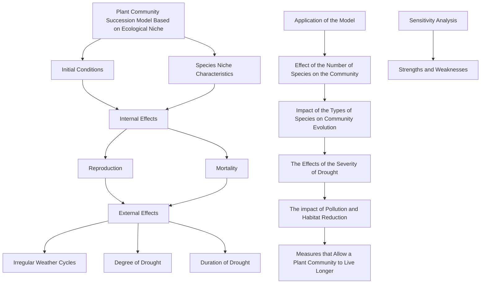
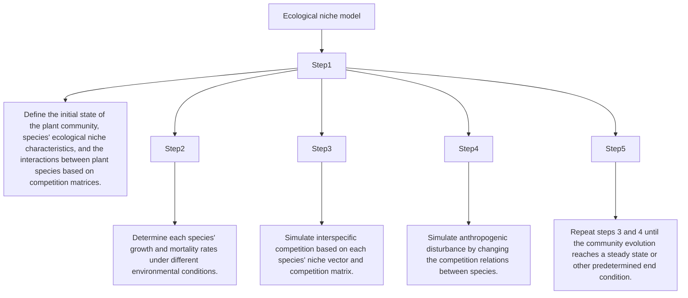
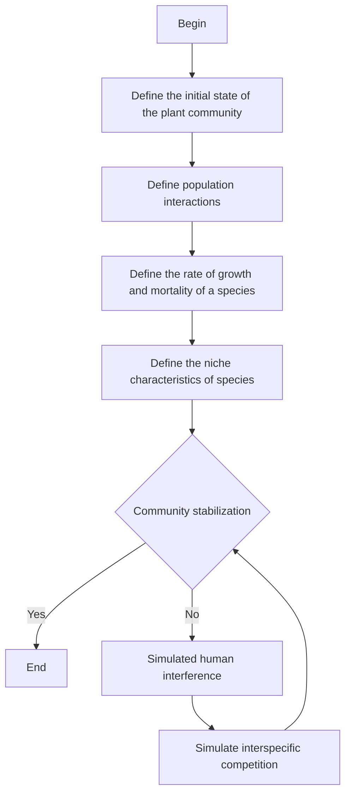
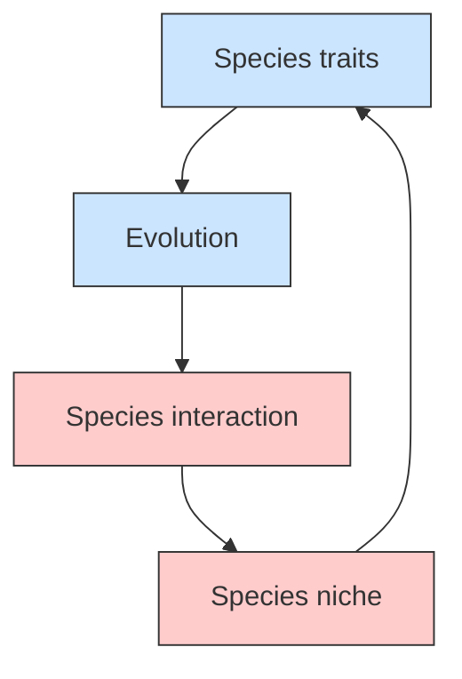
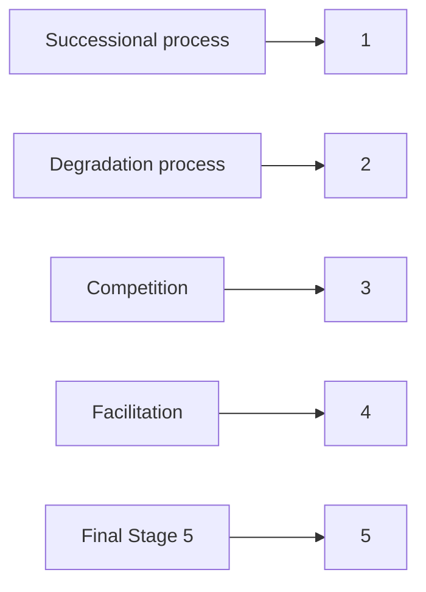

# Community Succession Simulation: Surviving Drought

## Summary

The species richness of plant communities has a significant influence on their ability to withstand drought. From an ecological niche perspective, we simulate plant community succession under drought conditions and analyze the effects of various factors.

First, we develop the Plant Community Succession Model based on niche theory to simulate community succession under drought conditions. The model applies changes in niche width as the indicator to simulate community succession and utilizes competition matrix to describe interactions between species, including competition and facilitation. Then, the Niche Width Model is established, comprehensively considering the effects of reproduction, mortality, and uncertainties. Among them, reproduction depends on the degree of drought, niche width, interspecific relationships, and environmental capacity, while mortality depends on the degree of drought and the niche width. Uncertainties are measured with Gaussian white noise.

A niche width differential equation model is built based on the Beverton-Holt and the Lotka-Volterra equations. To account for various irregular weather cycles, we utilize random variables obeying normal distribution to simulate the extent and duration of drought. As a case study, we simulate the evolution of a three-species community and draw the conclusion that the total niche width of the community increases, suggesting long-term survival.

To investigate the influence of species number on community dynamics, we utilize the Plant Community Evolution Model to simulate communities containing one to four species separately. The results demonstrate that three species are necessary for the community to benefit. Additionally, as the number of species increases, the drought resistance improves and then stabilizes.

Based on the competition matrix, we set up three distinct communities and discuss their drought resistance through simulations. It can be concluded that facilitation-dominated relationships enhance drought resistance and increase the community’s survival time. Moreover, we vary the frequency and intensity of drought and then conclude that species extinction is more likely to occur during severe droughts.

Pollution and habitat shrinkage affect plant communities’ niche width and competitive relationships. Therefore, we adjust the niche width and competition matrix accordingly. The results indicate that pollution and habitat shrinkage may cause the extinction of certain species.

Finally, based on the impact of various factors, we recommend some measures to ensure the long-term viability of a plant community. Additionally, we also analyze the significance of protecting vulnerable communities for the overall health of ecosystems.

Keywords: Community succession; Drought resistance; Niche width; Population interactions; Beverton-Holt equation

## Contents

## 1 Introduction 2

1.1 Background 2  
1.2 Restatement of the Problem . . 2  
1.3 Our Work

## 2 Notations and Assumptions 4

2.1 Notations 4  
2.2 Assumptions . . 4

## 3 Plant Community Evolution Model 5

3.1 Model Overview . . 5  
3.2 Initial Conditions and Niche Characteristics of Species 6  
3.3 Rules of Plant Community Evolution . . 7

3.3.1 Effects of Species Reproduction on Niche Width 8  
3.3.2 Effects of Species Mortality on Niche Width . . 9

3.4 Irregular Weather Cycles . . . . 10  
3.5 Simulation of Plant Community Evolution . . . 11

3.5.1 Plant Species and Initial Parameters 11  
3.5.2 Irregular Weather Simulation . . 12  
3.5.3 Simulation Results of Species Evolution . . 13

## 4 Application of Plant Community Evolution Model 15

4.1 Effect of the Number of Species on the Community . . 15

4.1.1 The Minimal Number of Species for the Community to Benefit . . . . 15  
4.1.2 The Effect of Increasing Species Number on Community . . . 17

4.2 Impact of the Types of Species on Community Evolution 17  
4.3 The Effects of the Severity of Drought . . 18  
4.4 The impact of Pollution and Habitat Reduction . . . 19  
4.5 Measures that Allow a Plant Community to Live Longer . . . . 20

## 5 Sensitivity Analysis 21

5.1 Sensitivity to Unpredictable Factors 21  
5.2 Sensitivity to Drought Coefficient . . 22

## 6 Strengths and Weaknesses 23

6.1 Strengths . . . 23  
6.2 Weaknesses 23

## 7 Conclusion 23

## Referrence 24

## 1 Introduction

## 1.1 Background

Plants of different species possess varying susceptibilities and abilities to resist drought[1]. Extensive observations have indicated that the species richness of plant communities significantly impacts their ability to adapt to water scarcity over the long term[2]. Communities containing a larger number of species tend to exhibit higher resistance to drought stress in subsequent generations, whereas those with fewer species exhibit lower resistance. Thus, analyzing the association between drought adaptability and the number of species in plant communities is critical for their survival over extended periods.

natural_image

World map with color-coded regions and heat signatures, showing continents and oceans (no text or labels)

Figure 1: World drought situation from NIDIS

## 1.2 Restatement of the Problem

• Develop a model to predict the evolution of plant communities under various irregular weather cycles and consider the interactions between species.  
• Determine the minimum number of species required for the community to benefit and the impact of increased species numbers on the community.  
• Analyze the effect of species type on community evolution  
• Discuss the impact of the greater or less frequency and width of drought.  
• Analyze the impact of other factors such as pollution and habitat reduction on the model  
• According to the model, determine what should be done to ensure the long-term viability of a plant community and the impacts on the larger environment.

## 1.3 Our Work

To sum up the full article, we

• develop an ecological niche model considering uncertain weather cycles to simulate plant community evolution. The model accounts for species interactions and successional processes based on inter-species competition, and establishes competition matrices to describe population interactions within the community.  
• use the model to determine the minimum number of species required for a community to benefit from increased species numbers. The model considers the ecological niche width of each population under uncertain drought conditions, using differential equations based on the Beverton-Holt and Lotka-Volterra equations.  
• analyze the impact of different species types on community evolution. The model shows that populations of different types have different interactions, and mutualism may lead to greater drought resistance. However, competition predominance during severe and prolonged droughts may cause population extinction, reducing species richness and community stability.  
• study the effects of various drought cycles on community evolution using the model. The analysis reveals that frequent and longer droughts may have negative impacts on populations, while less frequent droughts may make populations more adaptable to drought environments.  
• discuss the impact of other factors, such as pollution and habitat reduction, on community evolution. The model sets pollution and habitat reduction coefficients to affect ecological niche width and species interactions, thereby influencing community succession. Pollution and habitat reduction increase competition, allowing more competitive populations to occupy resources, but may lead to species extinction and affect community stability.  
• propose measures to ensure the long-term viability of plant communities and their impacts on the larger environment. Increasing the number of species in a community may improve drought adaptability, but must be balanced with avoiding competition, ensuring mutualism, and reducing environmental pollution and habitat reduction to ensure community stability and long-term viability.

flowchart

Figure 2: The flow chart of our work

## 2 Notations and Assumptions

## 2.1 Notations

<table><tr><td>Symbols</td><td>Description</td></tr><tr><td>C</td><td>Competition matrix of species</td></tr><tr><td>L</td><td>Niche width of species</td></tr><tr><td>Γ</td><td>Species&#x27; sensitivity to drought</td></tr><tr><td> $l_i(t)$ </td><td>Niche width of the i-th species at time t</td></tr><tr><td> $b_i(t)$ </td><td>Increase in niche width of the i-th species due to its reproduction</td></tr><tr><td> $d_i(t)$ </td><td>fraction of niche width of the i-th species reduced by death</td></tr><tr><td> $\sigma_i(t)$ </td><td>Gaussian white noise for unpredictability</td></tr><tr><td>K(t)</td><td>Niche width of a community at time t</td></tr><tr><td> $g_i$ </td><td>Growth rate of the i-th species under no competition condition</td></tr><tr><td>dr</td><td>Drought coefficient that describes the extent of the drought</td></tr><tr><td>f(dr)</td><td>Drought response function that impact death rate</td></tr><tr><td> $t_{INR}$ </td><td>Time interval until the next drought</td></tr><tr><td> $t_d$ </td><td>Duration of the drought</td></tr></table>

## 2.2 Assumptions

To simplify the problem and make it convenient for us to simulate real-life conditions, we make the following basic assumptions, each of which is properly justified.

• Assumption 1: The number of species in the plant community will not increase.

Justification: We assume a closed system where no new species are introduced or can colonize the plant community.

• Assumption 2: Species don’t mutate but the population and the resources it controls change over time.

Justification: The timescale of the study is relatively short, and genetic changes and mutations that could lead to ecological changes are assumed to be negligible.

• Assumption 3: The competitive or mutually-beneficial relationship between species in a community remains the same.

Justification: The interactions between species in a community are complex and can change over time due to a variety of factors. This is to simplify the model and focus on the effects of drought on the community structure.

• Assumption 4: The drought sensitivity coefficient of each species in the community is fixed and does not change with time and space.

Justification: To make the models simple and easy to understand, niche parameters for each species are often treated as invariants that can help us better understand the interactions between species and the effects of drought events on community structure.

## 3 Plant Community Evolution Model

Ecological niche refers to a species’ position in a community in terms of its functional relationships and roles with related species, considering time and space. Niche width is an indicator of the diversity of resources used by organisms [3]. The wider the niche width of a species, the less specialized it is, and the stronger its adaptability to the environment.

## 3.1 Model Overview

Ecological niche model describes plant community evolution based on interspecific interactions[4]. According to the ecological niche model, each species occupies a specific ecological niche with particular resource utilization strategies and environmental adaptability. The model considers species interactions through resource competition and cooperation.

The basic steps of the ecological niche model to simulate plant community evolution are as follows.

flowchart

Figure 3: Steps of the ecological niche model

The evolution process of community-based on niche model is shown in figure 4.

flowchart

Figure 4: The evolution process of community

## 3.2 Initial Conditions and Niche Characteristics of Species

At the initial moment of community succession, there are m species, and the environmental capacity is K. Environmental capacity is the maximum number of populations a given environment can tolerate.

The drought sensitivity coefficient is a metric frequently used to characterize a plant species’ sensitivity to drought. This coefficient is typically a value between 0 and 1, where higher values indicate greater sensitivity to drought.

The susceptibility of a community to drought can be represented by the following vector:

$$
\Gamma = \left[ \gamma_ {1}, \gamma_ {2}, \dots , \gamma_ {m} \right] \tag {1}
$$

where $\gamma _ { i }$ refers to the drought sensitivity coefficient of i-th species.

In the ecological niche model, the competition matrix is a matrix describing the competitive and mutually beneficial relationship [5] between different species, which is expressed as follows:

$$
C = \left[ \begin{array}{c c c c} c _ {1 1} & c _ {1 2} & \dots & c _ {1 m} \\ c _ {2 1} & c _ {2 2} & \dots & c _ {2 m} \\ \vdots & \vdots & \ddots & \vdots \\ c _ {m 1} & c _ {m 2} & \dots & c _ {m m} \end{array} \right] \tag {2}
$$

where $c _ { i j }$ refers to the competition coefficient between the i-th species and the j-th species.

When $c _ { i j } = 0$ , there is no competition between the two species. $c _ { i j } > 0$ indicates that the i-th species harms the survival and reproduction of the j-th species, namely, competition. In contrast, $c _ { i j } < 0$ indicates that the i-th species positively impacts the existence and reproduction of the j-th species, that is, symbiosis or mutualism. The greater the absolute value of the competition coefficient, the stronger the competitive or mutually beneficial relationship.

The competition matrix usually needs to be based on experimental data, ecological survey data, or other relevant data and knowledge to estimate. Considering that the competition between species is bidirectional and mutually influencing, the competition matrix is usually symmetric, namely cij = cji. $c _ { i j } = c _ { j i }$

text_image

Facilitation
- Neutralism
0
+
Competition

Figure 5: Schematic diagram of species’ competition

In ecology, an ecological niche refers to the function and role of a species in its ecosystem. It refers to the species’ position in an ecosystem, the way it uses resources, and the interaction between the species and its surroundings.

Niche width refers to the sum of all kinds of resources that organisms can use, which is an indicator of the diversity of resources used by organisms. Let the niche width of a community be:

$$
L = \left[ l _ {1}, l _ {2}, \dots , l _ {m} \right] \tag {3}
$$

where $l _ { i }$ represents the sum of the resources used by i-th species. The larger the L value, the more resources the species can utilize.

Considering the expansion of the community, the sum K of the ecological niche of each species can change within a specific range.

$$
K (t) = \sum_ {i = 1} ^ {m} l _ {i} (t) \tag {4}
$$

## 3.3 Rules of Plant Community Evolution

Niche width is affected by the population’s number of individual deaths and reproduction. To more accurately simulate the effects of climatic instability and drought on plant community evolution, a random disturbance term was taken to the niche model. The niche model is shown in the equation

below:

$$
l _ {i} (t + 1) = l _ {i} (t) + b _ {i} (t) - d _ {i} (t) + \sigma_ {i} (t) \tag {5}
$$

where

• $l _ { i } ( t )$ is the niche width of the i-th species at time t;  
• $b _ { i } ( t )$ is the increase in niche width of the i-th species due to its reproduction;  
• $d _ { i } ( t )$ is the fraction of niche width of the i-th species reduced by death;  
• $\sigma _ { i } ( t )$ is Gaussian white noise with a mean of 0 and a variance of $\sigma ^ { 2 }$ .

It is worth noting that, in practice, we need to make appropriate adjustments to the random disturbance term to ensure that it does not have an excessive effect on the simulation results. In addition, the model requires sensitivity analysis and validation to ensure its reliability and repeatability.

flowchart

Figure 6: Species interactions and community evolution

## 3.3.1 Effects of Species Reproduction on Niche Width

In this paper, the increase in the niche width of each species due to reproduction is influenced by the current niche width, environmental capacity, and interspecific competition. The larger the current niche width of a species or the environmental capacity, the more it reproduces, and the more it increases its niche width. On the contrary, the greater the competition between species, the less it breeds and the less they increase its niche width. Therefore, the expression of $b _ { i } ( t )$ is obtained based on the Beverton-Holt[6] equation and the Lotka-Volterra equation[7][8], as follows

$$
b _ {i} (t) = g _ {i} l _ {i} (t) \left(1 - \frac {l _ {i} (t) + \sum_ {j = 1} ^ {j \neq i} c _ {i j} l _ {j} (t)}{K (t)}\right) \tag {6}
$$

where $g _ { i }$ represents the non-competitive growth rate of the i-th species, which is only affected by environmental conditions. The more suitable the environmental conditions are for this species, the larger $g _ { i }$ is.

Under drought environmental conditions, plants’ water resources decrease, and their growth rates are correspondingly lower. The more sensitive a species is to drought, its growth rate will be lower under drought conditions. The drought sensitivity coefficient is not static but varies with drought conditions. The non-competitive growth rate of species is

$$
g _ {i} = g _ {\max} e ^ {- d r \times \gamma} \tag {7}
$$

where $d r$ is the drought coefficient, which measures the degree of drought, $\gamma$ is the drought sensitivity coefficient of i-th species, and $g _ { m a x }$ is the maximum growth rate of it.

## 3.3.2 Effects of Species Mortality on Niche Width

The decrease in niche width due to mortality is proportional to the niche width of the species. Considering that the mortality rate of plants increases during drought, a drought response function $f ( d r )$ is the response function of species to drought degree. This function can simulate the adverse effects of drought on plant communities. Therefore, the expression of $d _ { i } ( t )$ is acquired as follows:

$$
d _ {i} (t) = f (d r) \beta_ {i} l _ {i} (t) \tag {8}
$$

where $f ( d r )$ describes the species mortality due to drought, and $\beta _ { i }$ refers to the proportionality coefficient.

The greater the degree of drought, the greater the mortality rate of plant species. When the degree of drought is small, the environment is suitable for the growth of plants where the mortality rate of species is at a low level and does not change much. However, when the drought is severe, the environment is harsh. Hence, the mortality rate of plants will be at a high level. Therefore, $f ( d r )$ can be determined based on the Logistic function.

$$
f (x) = \frac {1}{1 + e ^ {- x}} \tag {9}
$$

Let $x = 1 2 ( d r - 0 . 5 )$ , namely, map $d r$ from [0, 1] to $[ - 6 , 6 ]$ .

$$
f (d r) = \frac {1}{1 + e ^ {- 1 2 (d r - 0 . 5)}} \tag {10}
$$

The image of function $f ( d r )$ is shown below:

line chart

| dr   | f(dr) |
| ---- | ----- |
| 0.0  | 0.0   |
| 0.2  | 0.05  |
| 0.4  | 0.3   |
| 0.6  | 0.75  |
| 0.8  | 0.95  |
| 1.0  | 1.0   |

Figure 7: The image of function $f ( d r )$

By substituting Equation(6) and (8) into Equation (5), we obtain:

$$
l _ {i} (t + 1) = l _ {i} (t) + g _ {i} l _ {i} (t) \left(1 - \frac {l _ {i} (t) + \sum_ {j = 1} ^ {j \neq i} c _ {i j} l _ {j} (t)}{K (t)}\right) - f (d r) \beta_ {i} l _ {i} (t) + \sigma_ {i} (t) \tag {11}
$$

Then, the differential form of niche width can be obtained.

$$
\frac {d l _ {i} (t)}{d t} = g _ {i} l _ {i} (t) \left(1 - \frac {l _ {i} (t) + \sum_ {j = 1} ^ {j \neq i} c _ {i j} l _ {j} (t)}{K (t)}\right) - f (d r) \beta_ {i} l _ {i} (t) + \sigma_ {i} (t) \tag {12}
$$

## 3.4 Irregular Weather Cycles

Considering the fluctuation of the climatic environment, the uncertainty of drought cycles, and drought levels, we simulate the effects of these uncertainties by introducing random variables. Climate change is considered a stochastic process. The simulation of climate environment fluctuation is based on random numbers generated by a random number generator. Besides, the drought cycle and the degree of drought obey certain probability distributions.

This paper uses the exponential distribution to model the probability of drought events. The exponential distribution is the probability distribution of the time interval between events in a Poisson point process, i.e., a process in which events occur continuously and independently at a constant average rate.

λ is the parameter of the exponential distribution, which reflects the frequency of drought events. When λ is larger, the frequency of drought events is higher. Conversely, when λ is smaller, the frequency and degree of drought events are lower. Therefore, the frequency of drought occurrence is adjusted by the value of λ.

$$
P \left(t _ {I N R}\right) = 1 - e ^ {- \lambda t _ {I N R}} \tag {13}
$$

where $P \left( t _ { I N R } \right)$ denotes the probability of a drought event occurring in the time interval $t _ { I N R }$ .

The degree and duration of drought vary for each drought event. In an attempt to simplify matters, we consider that the degree and duration of drought satisfy a mutually independent onedimensional normal distribution.

$$
\begin{array}{l} d r \sim N \left(\mu_ {d}, \sigma_ {d} ^ {2}\right) \tag {14} \\ t _ {d} \sim N (\mu_ {t}, \sigma_ {t} ^ {2}) \\ \end{array}
$$

where $d r$ is the drought coefficient, which represents the degree of drought, and $t _ { d }$ is the duration of drought.

By adjusting the probability, intensity, and duration of drought, models can simulate the effects of changing climate conditions on plant community succession. When no drought occurs, dr is the given default value. The climate change process is shown in Figure 8.

text_image

dr
td1
td2
td3
td4
Normal Drought Drought Normal Drought Drought
dr0
O t

Figure 8: Irregular weather cycles

## 3.5 Simulation of Plant Community Evolution

## 3.5.1 Plant Species and Initial Parameters

In this paper, the total time length of the community evolution simulated is 100 years with a time step of 1 year. Besides, in order to simplify the problem, there were three species in the community in the first place. For each species, its drought sensitivity coefficient, initial ecological niche width, and maximum growth coefficient are given in Table 1. Specific data can be obtained through field surveys or based on literature, and the following data are only to show how our model is applied.

Table 1: Related parameters of three species

<table><tr><td>Species</td><td> $\gamma_i$ </td><td> $g_{max}$ </td><td> $\beta_i$ </td><td>Initial  $l_i$ </td></tr><tr><td>1</td><td>0.5</td><td>0.23</td><td>0.1</td><td>2</td></tr><tr><td>2</td><td>0.7</td><td>0.15</td><td>0.1</td><td>2</td></tr><tr><td>3</td><td>0.2</td><td>0.33</td><td>0.1</td><td>2</td></tr></table>

Parameters of the ecosystem :

$$
\left\{ \begin{array}{l} C = \left[ \begin{array}{c c c} 0 & - 0. 2 & 0. 4 \\ - 0. 2 & 0 & 0. 6 \\ 0. 4 & 0. 6 & 0 \end{array} \right] \\ K = 1 0 \\ d r \sim N (1. 5, 0. 3 ^ {2}) \\ t _ {d} \sim N (1 5, 5 ^ {2}) \\ P (t; \lambda = 0. 0 4) = 1 - e ^ {- \lambda t} \end{array} \right. \tag {15}
$$

## 3.5.2 Irregular Weather Simulation

According to the rules of the weather simulation in Section 3.4, the weather for the next 100 months can be obtained. The algorithm for irregular weather simulation is shown below.

Algorithm 1 Irregular Weather Simulation  
Input: Maximum iterations n
Output: Drought coefficient dr at certain time point
1: $P(t_{INR}) \leftarrow 1 - \exp^{-\lambda t_{INR}}, \lambda = 0.04;$ ▷ The probability of drought
2: $dr_{0} \leftarrow 0.2;$ 3: $t_{INR} \leftarrow 0;$ 4: $i \leftarrow 0$ 5: while $i \leq n$ do
6: $r \leftarrow rand();$ 7: $p \leftarrow Exponential(\lambda, t_{INR});$ 8:    if $r \leq p$ then
9:    dayn $\leftarrow round(2 * randn() + 10);$ ▷ dayn is the duration of the drought
10:    for $j \leftarrow i: i + dayn - 1$ do
11: $dr_{j} = 0.15 * randn() + 0.6;$ 12:    end for
13: $i \leftarrow i + dayn;$ ▷ Update the time interval points
14: $t_{INR} \leftarrow 0;$ ▷ reset $t_{INR}$ to 0
15:    else
16: $dr_{i} \leftarrow dr0;$ 17: $t_{INR} \leftarrow t_{INR} + 1;$ ▷ Update the time interval since the last drought
18: $i \leftarrow i + 1;$ ▷ Update the time points
19:    end if
20: end while

The weather over the next 100 years can be acquired utilizing the irregular weather simulation algorithm, which is displayed in Figure 9.

bar chart

| Time (/year) | dr    |
| ------------ | ----- |
| 0            | 0.52  |
| 5            | 0.55  |
| 10           | 0.58  |
| 15           | 0.70  |
| 20           | 0.75  |
| 25           | 0.78  |
| 30           | 0.60  |
| 35           | 0.75  |
| 40           | 0.80  |
| 45           | 0.82  |
| 50           | 0.90  |
| 55           | 0.70  |
| 60           | 0.72  |
| 65           | 0.65  |
| 70           | 0.55  |
| 75           | 0.68  |
| 80           | 0.72  |
| 85           | 0.85  |
| 90           | 0.75  |
| 95           | 0.62  |
| 100          | 0.48  |

Figure 9: Irregular weather simulation for 100 years

As shown in Figure 9, in the beginning, the climate is in a normal state, and the environment is favorable. Over time, the plant community will face irregular drought, with various durations and degrees.

flowchart

Figure 10: Succession process of plant community

## 3.5.3 Simulation Results of Species Evolution

According to equation(12), the difference equation of their niche widths can be obtained for each species. Thus, we get the niche widths of each species over 100 years by solving the differential equations.

We have

$$
\left\{ \begin{array}{l} \frac {d l _ {i} (t)}{d t} = g _ {i} l _ {i} (t) \left(1 - \frac {l _ {i} (t) + \sum_ {j = 1} ^ {j \neq i} c _ {i j} l _ {j} (t)}{K (t)}\right) - f (d r) \beta_ {i} l _ {i} (t) + \sigma_ {i} (t) \\ l _ {i} (0) = l _ {i 0} \end{array} \right. \tag {16}
$$

where $\sigma _ { i } ( t )$ obeys $N ( 0 , 0 . 5 ^ { 2 } )$ .

The niche widths of the three species in 100 years are displayed in Figure 11.

line chart

| Time (/year) | Species1 | Species2 | Species3 |
| ------------ | -------- | -------- | -------- |
| 0            | 2.0      | 2.0      | 2.0      |
| 10           | 3.5      | 2.5      | 3.5      |
| 20           | 4.8      | 2.9      | 5.0      |
| 30           | 4.5      | 2.7      | 4.5      |
| 40           | 7.0      | 4.1      | 5.2      |
| 50           | 5.5      | 3.2      | 3.5      |
| 60           | 8.0      | 4.7      | 3.2      |
| 70           | 7.5      | 6.0      | 3.8      |
| 80           | 7.0      | 4.8      | 2.5      |
| 90           | 7.8      | 5.7      | 2.8      |
| 100          | 8.5      | 6.2      | 2.9      |

Figure 11: The niche widths of the three species in 100 years

From Figure 11, the niche widths of all three species are equal to 2 at the beginning. Under irregular weather, the niche widths of species 1 and 2 increase with fluctuation, while species one increases the fastest. In general, the niche width of species three increases first, decreases, and eventually levels off. Drought is bad for almost all species.

Under irregular weather conditions, the proportion of niche width for each species also varies over time. Figure 12 shows the proportion of niche width for each species in years 1, 20, 40, 60, 80, and 100.

pie chart

| Category | Percentage (%) |
| :--- | :--- |
| Species1 | 33.33 |
| Species2 | 33.33 |
| Species3 | 33.33 |

(a) In the Ist year

pie chart

| Category | Percentage (%) |
| :--- | :--- |
| Species1 | 40.09 |
| Species2 | 23.18 |
| Species3 | 36.72 |

(b) In the 20th year

pie chart

| Category | Percentage (%) |
| :--- | :--- |
| Species1 | 46.55 |
| Species2 | 27.87 |
| Species3 | 25.58 |

(c) In the 40th year

pie chart

| Category | Percentage (%) |
| :--- | :--- |
| Species1 | 48.78 |
| Species2 | 34.01 |
| Species3 | 17.21 |

(d) In the 60th year

pie chart

| Category | Percentage (%) |
| :--- | :--- |
| Species1 | 47.61 |
| Species2 | 34.05 |
| Species3 | 18.34 |

(e) In the 80th year

pie chart

| Category | Percentage (%) |
| :--- | :--- |
| Species1 | 47.1 |
| Species2 | 37.5 |
| Species3 | 15.4 |

(f) In the 100th year  
Figure 12: The proportion of niche width for each species in years 1, 20, 40, 60, 80, and 100

As can be seen in Figure 12, in the first year, we assume all three species had equal proportions of niche width. As time progresses, the proportion of niche width of species 1 increases. By the 60th year, the proportion of niche widths of each species stabilizes.

The evolution of the plant community is mainly affected by drought. Figure 13 demonstrates the effect of drought occurrence on the total niche width of the community.

bar-line hybrid chart

| Time (/year) | dr    | Niche Width |
| ------------ | ----- | ----------- |
| 0            | 0.2   | 6           |
| 5            | 0.5   | 9           |
| 10           | 0.6   | 10          |
| 15           | 0.7   | 11          |
| 20           | 0.8   | 12          |
| 25           | 0.7   | 13          |
| 30           | 0.6   | 14          |
| 35           | 0.7   | 15          |
| 40           | 0.8   | 16          |
| 45           | 0.7   | 17          |
| 50           | 0.6   | 18          |
| 55           | 0.7   | 17          |
| 60           | 0.6   | 16          |
| 65           | 0.5   | 15          |
| 70           | 0.6   | 16          |
| 75           | 0.7   | 17          |
| 80           | 0.6   | 16          |
| 85           | 0.7   | 15          |
| 90           | 0.6   | 14          |
| 95           | 0.5   | 15          |
| 100          | 0.4   | 16          |

Figure 13: Variation of drought coefficient dr and niche width over time

As shown in Figure 13, it can be seen that when no drought occurred, the total niche width of the community showed an increasing trend. This indicates that the environment is suitable for the growth of plants and the population reproduces more at this time. However, when drought occurred, the total niche width showed a decreasing trend. Besides, the more severe the drought, i.e., the greater the dr, the faster the total niche width decreases. It demonstrates that drought inhibits the reproduction of the population and the inhibitory effect increases as the degree of drought increases.

## 4 Application of Plant Community Evolution Model

## 4.1 Effect of the Number of Species on the Community

In natural environments, species have competitive and mutualistic relationships with each other. When the environment is harsher, such as drought, the mutualistic relationships between species are enhanced in order to survive. As a result, the overall drought resistance of the community is enhanced. To investigate the effect of species number on the community, we simulate the evolution of communities containing one to four species separately using the Plant Community Evolution Model in Section 3.

## 4.1.1 The Minimal Number of Species for the Community to Benefit

According to the Plant Community Evolution Model in Section 3, the evolution of communities containing 1, 2, 3 and 4 species can be simulated, which is shown in Figure 14.

line chart

| Time (/year) | Niche Width |
| ------------ | ----------- |
| 0            | 2.0         |
| 5            | 2.3         |
| 10           | 1.8         |
| 15           | 0.8         |
| 20           | 0.4         |
| 25           | 0.5         |
| 30           | 0.4         |
| 35           | 0.3         |
| 40           | 0.4         |
| 45           | 0.9         |
| 50           | 0.5         |
| 55           | 0.3         |
| 60           | 0.4         |
| 65           | 0.2         |
| 70           | 0.1         |
| 75           | 0.1         |
| 80           | 0.1         |
| 85           | 0.1         |
| 90           | 0.1         |
| 95           | 0.1         |
| 100          | 0.1         |

(a) One species

line chart

| Time (/year) | Species1 | Species2 | Total |
| ------------ | -------- | -------- | ----- |
| 0            | 2.0      | 2.0      | 4.0   |
| 10           | 3.5      | 3.0      | 6.5   |
| 20           | 2.5      | 2.0      | 4.0   |
| 30           | 3.5      | 2.5      | 6.5   |
| 40           | 3.0      | 2.0      | 4.0   |
| 50           | 3.5      | 3.0      | 7.0   |
| 60           | 3.0      | 2.5      | 5.5   |
| 70           | 2.5      | 2.0      | 4.0   |
| 80           | 3.0      | 2.5      | 4.5   |
| 90           | 2.5      | 2.0      | 4.0   |
| 100          | 3.5      | 2.5      | 6.0   |

(b) Two species

line chart

| Time (/year) | Species1 | Species2 | Species3 | Total |
| ------------ | -------- | -------- | -------- | ----- |
| 0            | 2.0      | 2.0      | 2.0      | 6.0   |
| 10           | 4.0      | 3.0      | 3.0      | 11.0  |
| 20           | 5.0      | 3.5      | 3.5      | 12.0  |
| 30           | 6.0      | 4.0      | 4.0      | 15.0  |
| 40           | 7.0      | 4.5      | 4.5      | 16.0  |
| 50           | 8.0      | 5.0      | 5.0      | 17.0  |
| 60           | 7.0      | 4.5      | 4.5      | 16.0  |
| 70           | 6.0      | 4.0      | 4.0      | 12.0  |
| 80           | 7.0      | 4.5      | 4.5      | 14.0  |
| 90           | 8.0      | 5.0      | 5.0      | 13.0  |
| 100          | 9.0      | 6.0      | 6.0      | 19.0  |

(c) Three species

line chart

| Time (/year) | Species1 | Species2 | Species3 | Species4 | Total |
| ------------ | -------- | -------- | -------- | -------- | ----- |
| 0            | 2.0      | 2.0      | 2.0      | 2.0      | 8.0   |
| 10           | 3.5      | 3.0      | 3.0      | 2.5      | 13.0  |
| 20           | 4.0      | 3.5      | 3.5      | 2.5      | 12.0  |
| 30           | 5.5      | 4.0      | 4.0      | 3.0      | 16.0  |
| 40           | 6.0      | 4.5      | 4.5      | 3.5      | 17.0  |
| 50           | 7.0      | 5.0      | 5.0      | 4.0      | 16.0  |
| 60           | 6.5      | 5.5      | 5.5      | 4.5      | 16.5  |
| 70           | 5.5      | 4.5      | 4.5      | 4.0      | 12.0  |
| 80           | 6.0      | 4.5      | 4.5      | 4.0      | 13.0  |
| 90           | 6.5      | 4.5      | 4.5      | 4.0      | 13.5  |
| 100          | 8.0      | 6.0      | 3.5      | 2.5      | 18.0  |

(d) Four species  
Figure 14: Prediction of seawater temperature for 4 years respectively

From Figure 14, we can see that when there is only one species in a community, the species will slowly die out under irregular drought conditions. When there are two species, the ecological niche width of each species fluctuates drastically with the occurrence of drought. It indicates that the population is not able to survive stably in the long term when facing irregular drought.

When there are three species, the niche width of each species increases with fluctuation. It demonstrates that this community can improve drought resistance through interspecific mutualism, thus enabling the community for long-term survival. The situation of the four species was similar to that of the three species. Therefore, it can be concluded that the minimal number of species for the community to benefit is three.

## 4.1.2 The Effect of Increasing Species Number on Community

According to the four community evolution simulation results in section 4.1.1, we can draw the conclusion that as the number of species grows, the greater the width of the ecological niche of the community, the stronger its drought resistance. When the number of species increases to a certain value, its drought resistance tends to stabilize or may even decrease.

Single-species communities tend to be less drought-resistant than communities of multiple species. Communities of multiple species tend to have higher resource utilization, facilitation effects, and species diversity effects. Therefore, they can be better adapted to drought environments, exhibiting greater drought resistance. The principle is as follows:

• Ecological niche partitioning: It refers to the difference in resource utilization between different species, thus avoiding competition between plants. It allows the community to take advantage of the limited resources and enhances its resistance to drought.  
• Facilitation effect: There may be reciprocal symbiosis among multiple species, thus improving the efficiency of water and nutrient utilization and enhancing the resistance of plants to drought.  
• Species diversity effect: Diversity is a measure of the number and diversity of species in an ecosystem. An increase in diversity can increase the stability of the system and reduce its exposure to external disturbances, thus enhancing the drought resistance of the community.

However, from the perspective of the ecological niche model, the drought resistance of communities with too many species is not necessarily stronger. Too many species will lead to overlapping ecological niches and more intense interspecific competition. It also results in a decrease in the stability of the community, thus making the community less resistant to drought.

## 4.2 Impact of the Types of Species on Community Evolution

The types of species in different plant communities vary. Therefore, the interactions between species also vary. Some communities have more intense species competition among them, while others have predominant interspecific mutualism among them. In this paper, based on the species competition relationships in Section 3, we design competitive communities and mutualistic communities by changing the competition matrix.

## • General plant community

There are both competitive-dominated and facilitation-dominated relationships among species of the plant community which are denoted by the competition matrix in Section 3.

$$
C = \left[ \begin{array}{c c c} 0 & - 0. 2 & 0. 4 \\ - 0. 2 & 0 & 0. 6 \\ 0. 4 & 0. 6 & 0 \end{array} \right] \tag {17}
$$

## • Competitive plant community

Competitive plant communities are dominated by competitive relationships between species. The competition matrix is as follows:

$$
C = \left[ \begin{array}{c c c} 0 & 1. 0 & 0. 8 \\ 1. 0 & 0 & 0. 9 \\ 0. 8 & 0. 9 & 0 \end{array} \right] \tag {18}
$$

## • Mutualistic plant community

Mutualistic plant communities are dominated by mutualistic relationships between species. The competition matrix is as follows:

$$
C = \left[ \begin{array}{c c c} 0 & - 0. 3 & - 0. 2 \\ - 0. 3 & 0 & - 0. 2 5 \\ - 0. 2 & - 0. 2 5 & 0 \end{array} \right] \tag {19}
$$

Evolution of the three communities is demonstrated in Figure 15. It can be seen that mutualisticdominated community would have a larger ecological niche width and more species reproduction. This indicates that the more drought resistant it is. On the contrary, When there is intense competition between species in a community, the smaller the width of its ecological niche, the less the population reproduces, indicating its weaker drought resistance.

area chart

| Time (/year) | General | Compete | Mutualism |
| ------------ | ------- | ------- | --------- |
| 0            | 6       | 6       | 6         |
| 10           | 8       | 8       | 12        |
| 20           | 10      | 8       | 13        |
| 30           | 12      | 9       | 25        |
| 40           | 16      | 10      | 30        |
| 50           | 12      | 9       | 40        |
| 60           | 17      | 9       | 33        |
| 70           | 18      | 8       | 25        |
| 80           | 14      | 8       | 22        |
| 90           | 16      | 9       | 20        |
| 100          | 17      | 10      | 38        |

Figure 15: Evolution of communities with three distinct compositions

## 4.3 The Effects of the Severity of Drought

An increase in the degree and duration of drought can negatively affect plant communities. The severity of drought can be simulated by adjusting the drought coefficient dr and drought duration $t _ { d }$ in Plant Community Evolution Model. When the drought becomes more severe, dr and $t _ { d }$ obey the following normal distribution:

$$
d r \sim N (0. 8, 0. 1 ^ {2}) \tag {20}
$$

$$
t _ {d} \sim N (1 2, 3 ^ {2})
$$

When the drought is more mild, $d r$ and $t _ { d }$ obey the following normal distribution:

$$
\begin{array}{l} d r \sim N (0. 4 5, 0. 1 5 ^ {2}) \\ \text {当} \sim N (0. 1 5 ^ {2}) \end{array} \tag {21}
$$

$$
t _ {d} \sim N (8, 1. 5 ^ {2})
$$

Based on Plant Community Evolution Model, the process of community succession in the three drought conditions is shown in Figure 16.

line chart

| Time (/year) | General | Severe | Mild |
| ------------ | ------- | ------ | ---- |
| 0            | 6       | 6      | 6    |
| 10           | 11      | 13     | 13   |
| 20           | 12      | 10     | 16   |
| 30           | 15      | 14     | 18   |
| 40           | 17      | 10     | 20   |
| 50           | 16      | 14     | 19   |
| 60           | 15      | 10     | 21   |
| 70           | 13      | 12     | 22   |
| 80           | 14      | 10     | 22   |
| 90           | 15      | 9      | 21   |
| 100          | 17      | 10     | 18   |

Figure 16: Community succession in the three drought conditions

From figure 16, we can see that as drought intensifies, the niche width of the community decreases, which means more species die. Therefore, the community can survive for a shorter period of time.

## 4.4 The impact of Pollution and Habitat Reduction

Pollution and habitat shrinkage can decrease the ecological niche width, limiting the number of available resources for organisms. This reduction in resources increases competition intensity, allowing more competitive species to dominate and exert additional pressure on other species, resulting in their decline or extinction.

In the Plant Community Evolution model, extinct species will be removed from the competition matrix. This may lead to changes in competitive relationships, which may affect the competitive ability of other species and the community succession process.

Pollution and habitat shrinkage will affect the ecological niche width and competitive relationships of plant communities. Therefore, the ecological niche width and competition matrix can be adjusted as follows.

$$
\begin{array}{l} L ^ {\prime} = L \left(1 - P _ {r}\right) H \\ C _ {1} = C \left(1 - P _ {r}\right) H \end{array} \tag {22}
$$

$$
C \prime = C (1 - P _ {r}) H
$$

where $L \prime$ refers to the adjusted niche width, C′ refers to the adjusted competition matrix, $P _ { r }$ refers to the contamination degree of plant community, H refers to the habitat reduction coefficient.

According to the Plant Community Evolution Model, the evolution of communities facing pollution and shrinking habitats can be simulated. The result is displayed in Figure 17.

area chart

| Time (/year) | General | Pr = 0.1, H = 0.9 | Pr = 0.5, H = 0.5 |
| ------------ | ------- | ----------------- | ----------------- |
| 0            | 6       | 4                 | 1                 |
| 20           | 12      | 8                 | 1                 |
| 40           | 16      | 11                | 1                 |
| 60           | 14      | 10                | 1                 |
| 80           | 13      | 9                 | 1                 |
| 100          | 17      | 11                | 1                 |

Figure 17: Evolution of plant communities facing pollution and shrinking habitats

As shown in Figure 17, the community ecological niche width is relatively reduced when pollution is light and habitat reduction is less. At this time, the plant community is still able to survive stably for a long time. When the pollution is heavy and the habitat is reduced more, the ecological niche width is close to 0, that is, many species in the community will become extinct at this time.

## 4.5 Measures that Allow a Plant Community to Live Longer

The analysis of the ecological niche model reveals that diverse plant communities have higher drought resistance in arid environments. This is due to the complementary ecological niches of different species that reduce competition and enable better adaptation to the challenges of drought.

To ensure the long-term survival of plant communities, the following measures can be taken:

1. Protect the natural environment, maintain the integrity and stability of the ecosystem, and reduce human activities’ damage to the natural environment. In particular, vegetation and water sources should be protected to prevent excessive logging and overgrazing, excessive use of fertilizers and pesticides, and excessive exploitation of water resources, etc.  
2. Encourage plant diversity and maintain the diversity of communities. By planting different types of plants, the diversity of the plant community can be increased, the adaptability and resistance of plants can be improved, competition between plants can be reduced, and the stability of the community can be maintained.  
3. Promote water-saving measures. Water is an important resource for maintaining life. Humans can adopt water-saving measures such as the rational use and conservation of water resources,

reducing pollution and destruction of natural water sources, and providing a better growth environment for plants.

4. Cultivate drought-resistant varieties. Drought-resistant plant varieties can be developed through breeding or gene editing technology to improve plants’ drought resistance and better adapt to arid environments.

text_image

Save
the PLANET

Figure 18: Save the planet and Protect our common home

In summary, the niche model suggests that each species in a biological community has a specific niche and interacts with each other through competition and mutualism. Protecting fragile communities can maintain ecosystem stability and ecological diversity. Furthermore, protecting fragile communities is essential for human self-interest as plants and animals in the ecosystem provide resources for human needs, and damage to the ecosystem can affect human production and livelihood. Therefore, protecting fragile communities is significant for maintaining ecosystem stability, ecological diversity, and safeguarding human self-interest.

## 5 Sensitivity Analysis

## 5.1 Sensitivity to Unpredictable Factors

When establishing the differential equation for the population niche width, we added white noise to simulate the effect of unpredictable factors on community succession. The variance of white noise needs to be within a certain range. If the variance is too small, it cannot simulate the effect of unpredictable factors. If the variance is too large, it will affect the correctness of the community succession process.

line chart

| Time (/year) | σ = 0.5 | σ = 5.5 | σ = 10.5 |
| ------------ | ------- | ------- | -------- |
| 0            | 6.0     | 6.0     | 6.0      |
| 20           | 12.5    | 12.0    | 11.5     |
| 40           | 16.0    | 16.5    | 16.0     |
| 60           | 17.0    | 17.5    | 17.0     |
| 80           | 13.0    | 14.0    | 13.5     |
| 100          | 17.5    | 18.0    | 17.5     |

Figure 19: Sum of niche widths of community under different white noise

The variance of white noise has a minor effect on the overall ecological niche width of the community. This is because we calculate the white noise of each species independently, and when there are many species or sufficient simulation times, the overall ecological niche width of the community changes little. However, certain accidental factors may have a negative impact on all species in the community, rather than independent effects on each species. Therefore, more complex models are needed to obtain better results when considering unpredictable interference.

## 5.2 Sensitivity to Drought Coefficient

The drought coefficient is used to describe the sensitivity of species to drought, and we adjust the drought coefficient to observe the performance of species and communities with different drought adaptability.

stacked bar chart

| Time (/year) | Species1 | Species2 | Species3 |
| ------------ | -------- | -------- | -------- |
| 1            | 2        | 2        | 2        |
| 50           | 6        | 4        | 4        |
| 100          | 9        | 7        | 2        |

Figure 20: Niche widths of species under different drought coefficients

It can be seen from the figure that the more sensitive a species is to drought, the smaller its ecological niche width will be, and the smaller the ecological niche width of the entire community will be.

## 6 Strengths and Weaknesses

## 6.1 Strengths

• The ecological niche model provides a comprehensive understanding of the ecological relationship between different species, including competition and cooperation, and can simulate the evolution of plant communities over time.  
• The model is flexible and can be adapted to different environmental conditions, such as drought events or habitat loss, which allows for the assessment of the potential impact of these disturbances on the community.  
• The ecological niche model can incorporate empirical observations of plant species’ interactions, making it a useful tool for testing ecological theories and predicting communit responses to environmental change.

## 6.2 Weaknesses

• The model can be sensitive to the initial conditions of the community, and small changes in these conditions can result in significant differences in community evolution over time.  
• The model assumes that species interactions are solely based on competition and cooperation for resources, which may not capture all ecological interactions in a community, such as predation or parasitism.  
• The conditions that the parameters of the competition matrix need to satisfy may not be consistent with the actual situation in nature, such as the competition matrix not necessaril being a symmetric matrix.

## 7 Conclusion

• A community of multiple species generally exhibits stronger drought resistance than a community of a single species due to the greater resource utilization efficiency, and species diversity effects.  
• When the number of species increases to a certain level, their drought resistance tends to become stable or even decrease. This is because too many species will lead to ecological niche overlap, resulting in intensified interspecific competition.  
• Communities dominated by mutualistic relationships have stronger drought adaptation abilities.

• When droughts occur more frequently and last longer, species may not be able to adapt quickly to the changing environment, resulting in a reduction in the population size of some species, which disrupts the ecological equilibrium. Instead, if drought occurs less frequently, species may be more likely to adapt to the arid environment, as they have more time to adjust to the drought conditions.  
• Habitat population and reduction both lead to a decrease in the ecological niche width, intensifying the degree of competition. Competitive species probably occupy more resources, exerting greater competition pressure on other species, leading to a decrease or extinction of other species.

## References

[1] DT Rosenow et al. “Drought tolerant sorghum and cotton germplasm”. In: Agricultural Water Management 7.1-3 (1983), pp. 207–222.  
[2] J Sardans and Josep Peñuelas. “Plant-soil interactions in Mediterranean forest and shrublands: impacts of climatic change”. In: Plant and soil 365 (2013), pp. 1–33.  
[3] Mustaqeem Ahmad et al. “Niche width analyses facilitate identification of high-risk endemic species at high altitudes in western Himalayas”. In: Ecological Indicators 126 (2021), p. 107653.  
[4] Jitka Polechová and David Storch. “Ecological niche”. In: Encyclopedia of ecology 2 (2008), pp. 1088–1097.  
[5] Andrew D Letten, Po-Ju Ke, and Tadashi Fukami. “Linking modern coexistence theory and contemporary niche theory”. In: Ecological Monographs 87.2 (2017), pp. 161–177.  
[6] M De la Sen. “The generalized Beverton–Holt equation and the control of populations”. In: Applied Mathematical Modelling 32.11 (2008), pp. 2312–2328.  
[7] S Das and PK Gupta. “A mathematical model on fractional Lotka–Volterra equations”. In: Journal of Theoretical Biology 277.1 (2011), pp. 1–6.  
[8] Martin Bohner and Rotchana Chieochan. “The Beverton–Holt q-difference equation”. In: Journal of Biological Dynamics 7.1 (2013), pp. 86–95.