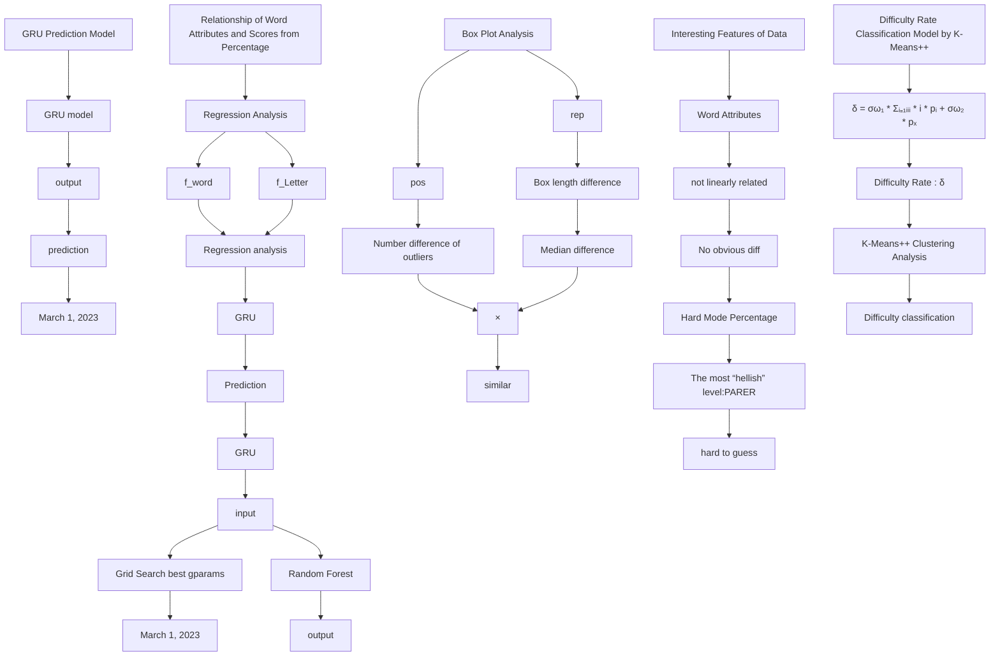
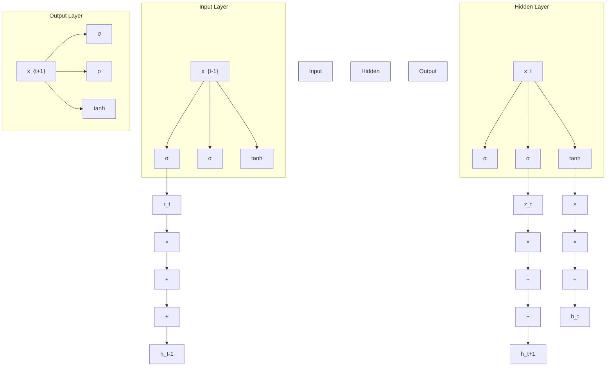
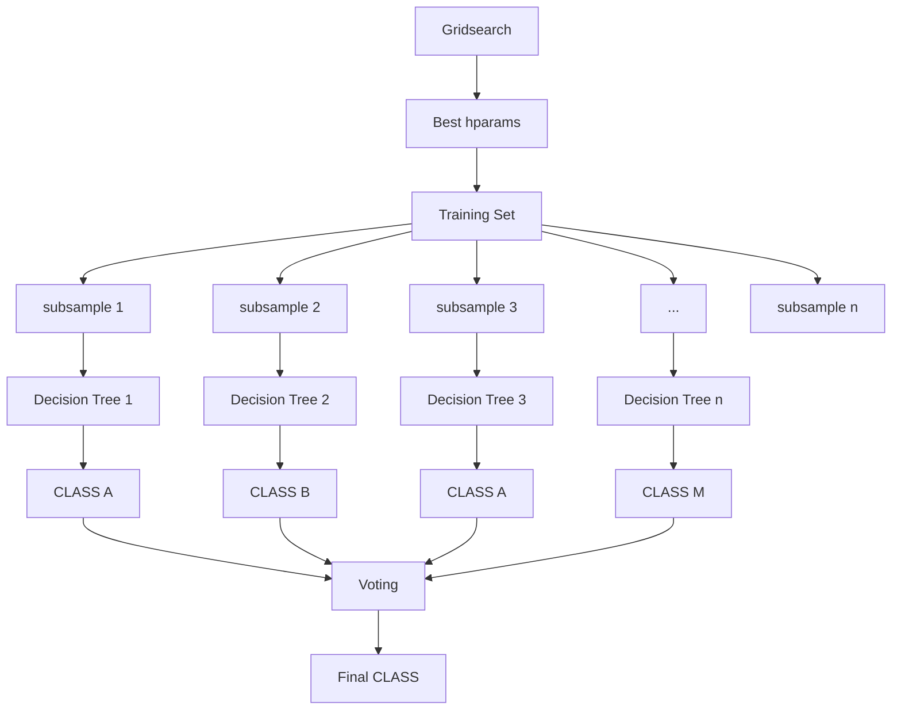

# Revitalizing a Classic Game: Uncovering the Secrets of Wordle through Data Analysis

Summary

In the digital era, language is often conveyed through abbreviations, emojis, and voice messages. However, the Wordle game, provided by the New York Times, offers a chance to return to the basics of language. Thus, we conducted a data analysis of the results yielded by Wordle.

Firstly, we established a GRU Prediction Model to predict the number of reported results on March 1, 2023. The model uses the effective Gated Recurrent Unit (GRU) algorithm. Therefore, predictions made by the training set to the testing have the relative error rate of 2.1569%, and the relative RESE of 6.4957%, indicating a good accuracy of the model predictions. The predicted interval for the number of reported results on March 1, 2023 is $\mathbf { 2 0 3 6 7 } \pm 2 . 0 1 5 6 9 \%$ .

Secondly, we conducted a data analysis on the attributes of words and score defined by the percentage of scores. Then, we defined four attributes of the words: word frequency, sum of letter frequencies,repetition patterns of letters(2/3 or none), and main part of speech. For the first two, we performed regression analysis with the variable "score". The Pearson correlation coefficient between $f _ { w o r d }$ and score is -0.3165, and $f _ { l e t t e r }$ and score-0.4005.rep and pos can be used to categorize the words.The box plot results showed that the Median difference of the box plot for rep was 0.13004, while pos was only 0.05973.Therefore, we believe that $f _ { w o r d } ,$ fletter, and rep can affect the percentage of scores, while pos can not.

Thirdly, we have developed GSRF Prediction Model to predict the percentages of 1 to X for EERIE on March 1, 2023. The Grid-Search Random Forest (GSRF) algorithm is an improved random forest algorithm by using the best combination of hyperparameters. We selected the three parameters, $f _ { w o r d } , f _ { l e t t e r } ,$ and rep as inputs for the model. The model’s training results show a MSE of 20.70641 and a MAE of 3.24388,indicating good predictive performance.(Table 10) The predicted results for EERIE are (1,7,23,30,23,13,3). In addition, we conducted sensitivity analysis by adding Gaussian noise to $f _ { w o r d }$ and $f _ { l e t t e r }$ separately, and the results showed that the model has low sensitivity and is thus highly stable.

Fourthly, Difficulty Rate Classification Model using the K-Means++are conducted. We first defined the difficulty date δ of each word first. The difficulty rate of EERIE is 0.35916 by predicted distribution. Then, we use K-Means++, to analyze the δ of each word and obtained five levels of difficulty (Table11). EERIE was classified into the third level. Finally, we compared the model’s classification with the manul difficulty ratings for a subset of sampled words and achieved a match rate of 93.33%, confirming the accuracy of the model.

Finally, we explored two other data features.Afterwards, a letter supported by our stable models has been written for the Puzzle Editor of the New York Times.

Keywords: GRU;Regression Analysis;Box Plot Analysis;GSRF;K-Means++

## Contents

## 1 Introduction 3

1.1 Problem Background 3  
1.2 Restatement of the Problem . 3  
1.3 Data Cleaning . 4  
1.4 Our Work 4

## 2 Assumptions 5

## 3 Notations 5

## 4 GRU Prediction Model 5

4.1 Description of GRU Algorithm . 6  
4.2 Prediction on March 1,2023 7

## 5 Relationship of Word Attributes and Scores from Percentage 8

5.1 score Defined by Percentage 9  
5.2 Regression Analysis . . . 9

5.2.1 $f _ { w o r d } \mathrm { : }$ :Word Frequency 9  
5.2.2 $f _ { L e t t e r }$ :Letter Frequency 10

5.3 Box Plot Analysis 11

5.3.1 rep:Repetition of Letter 11  
5.3.2 pos:Part of Speech 12

## 6 GSRF Prediction Model 13

6.1 Description of GSRF Algorithm 13  
6.2 Prediction for EERIE on March 1,2023 . 14  
6.3 Prediction evaluation analysis . . 15

## 7 Difficulty Rate Classification Model by K-Means++ 16

7.1 δ: Difficulty Rate 16

7.2 K-Means++ Clustering Analysis 16  
7.3 Difficulty classification for EERIE 17  
7.4 Accuracy Discussion of Classification Model 18

## 8 Interesting Features of Data 19

8.1 Feature 1:Relationship of Word Attributes and Hard Mode Percentage . . . 19  
8.2 Feature 2:Why "PARER" Has The Most "Hellish" Level of Difficulty . . . . . . . . 20

## 9 Model Sensitivity Analysis 21

9.1 Sensitivity Analysis for $f _ { w o r d }$ in GSRF Prediction Model 21  
9.2 Sensitivity Analysis for $f _ { l e t t e r }$ in GSRF Prediction Model 21

## 10 Model Evaluation and Further Discussion 22

10.1 Strengths 22  
10.2 Weaknesses And Further Discussion 22

## 11 Letter 24

A Samples 25  
B Difficluty Rate of Partial Words 25

## 1 Introduction

## 1.1 Problem Background

In this digital age, we have become accustomed to using abbreviations, emojis, and voice messages to communicate. However, sometimes these modes of communication can strip away the beauty and depth of language itself. But a word-guessing game, Wordle allows us to return to the essence of language in a fresh way. By feeling the rhythm and meaning of each letter and word, we can gain a deeper understanding of the magic of language and appreciate its inherent charm.

Wordle is a popular daily puzzle that the New York Times currently provides, which challenges players to guess a secret five-letter word in six or fewer tries. At the beginning of each round, the system randomly selects a word, and the player must use deduction and logic to guess the answer within the allotted number of guesses. With each guess, the system indicates which letters appear in the word and whether they are in the correct position. What’s more, players can play in “Hard Mode”, which requires that once a player correctly guesses a letter in the answer, they must continue to use that letter in all subsequent guesses.

Numerous users, although not all, share their scores on Twitter. Wordle Stats, a Twitter robot developed by Benjamin Leis, can be used to track and analyze daily score reports of Wordle. By tracking and analyzing the daily data reports from Wordle Stats, we may be able to improve our word-guessing skills and gain a better understanding of the patterns and usage of the English language.

text_image

WORDLE

Figure 1: Wordle[2]

## 1.2 Restatement of the Problem

We need to analyze the data provided by the New York Times on Wordle and answer the following questions:

1. Develop a prediction model to forecast the number of reported results for a future day and provide a prediction interval.  
2. Analyze whether word attributes have an impact on the percentage of scores reported that were played in Hard Mode, and how they impact.  
3. Build another prediction model to forecast the percentages of (1, 2, 3, 4, 5, 6, X), and use EERIE on March 1, 2023 as an example to make specific predictions. Model evaluation is also required.

4. Develop a classification model to classify the difficulty level of words and obtain the difficulty level of the word "EERIE". Model evaluation is also required.  
5. Explore other possible interactions in the data and see if any interesting features can be found.

## 1.3 Data Cleaning

Observing the provided data, some problems and corresponding processing are found as follows.

Referencing the Wordle Status and we discovered that there were some erroneous data in the attachment. These included incorrect word lengths, spelling errors, and incorrect values in Number of reported results, among others. For instance, the word at 314 was mistakenly written as "tash". Additionally, the Number of reported results at 529 was erroneously recorded as 2569. To address these issues, we conducted data cleaning to minimize errors , and to enhance the quality and accuracy of our data . The following are the results of our data cleaning process.

<table><tr><td>Original data</td><td>marxh(473)</td><td>tash(314)</td><td>clen(525)</td><td>rprobe(545)</td><td>2569(529)</td></tr><tr><td>Data after cleaning</td><td>marsh</td><td>trash</td><td>clean</td><td>probe</td><td>25569</td></tr></table>

Table 1: Data cleaning

During our data inspection, we identified instances where the sum of the proportion of attempts for certain days did not equal 100% due to statistical errors. To address this issue, we recalculated the proportions for each day so that the sum would be exactly 100%. By doing so, we aimed to reduce errors associated with the same variable on different days and to improve the accuracy of $\begin{array} { r } { \sum _ { i = 1 } ^ { X } p _ { i } = 1 0 0 \% } \end{array}$

## 1.4 Our Work

flowchart

Figure 2: Our work

## 2 Assumptions

To simplify our modeling, we make the following assumptions:

• Assumption1 The percentage of scores reported that were played in Hard Mode can be represented by the percentages of (1, 2, 3, 4, 5, 6, X). Because Wordle status had previously compiled the values of (1, 2, 3, 4, 5, 6, X) for both the overall and hard mode in Wordle 207, we found that the two sets of values differed by only 1%[1].This is beneficial for our subsequent analysis.  
• Assumption2 No matter how many tries a player takes, the likelihood of sharing their Wordle results on Twitter is equal. This assumption can lead to more accurate data analysis.  
• Assumption3 Every player does not know the answer before playing Wordle and does not cheat during the gameplay. This ensures that the percentage of scores is both objective and accurate.

## 3 Notations

<table><tr><td>Symbol</td><td>Decription</td></tr><tr><td>score</td><td>the combination of the percentage of scores</td></tr><tr><td> $f_{word}$ </td><td>the word frequency</td></tr><tr><td> $f_{letter}$ </td><td>the letter frequency</td></tr><tr><td>rep</td><td>the repetition of word</td></tr><tr><td>pos</td><td>the part of speech of word</td></tr><tr><td>σ</td><td>the difficulty rate</td></tr><tr><td>MSE</td><td>the Mean Squared Error</td></tr><tr><td>MAE</td><td>the Mean Absolute Error</td></tr><tr><td>d</td><td>the Euclidean distance</td></tr><tr><td>SSE</td><td>the Sum of Squared Errors</td></tr></table>

Table 2: Key notations used in this paper

## 4 GRU Prediction Model

The number of reported results varies from day to day, and analyzing the changes in this data can to some extent reflect the trends of active Wordle users. By studying historical data and trends, it may even be possible to make informed predictions about future reported results. So in this section, we applied the Gated Recurrent Unit(GRU) algorithm to perform machine learning on the provided number of reported results, and ultimately made a prediction for the number of reported results on March 1, 2023.

## 4.1 Description of GRU Algorithm

GRU (Gated Recurrent Unit) is a type of recurrent neural network (RNN) that is commonly used for time series analysis. It has similar properties to the LSTM (Long Short-Term Memory) architecture but is generally faster to compute.

The main idea behind the GRU architecture is to have two gates, a reset gate and an update gate, which control the flow of information through the network. The reset gate decides how much of the previous hidden state should be forgotten, while the update gate decides how much of the new input should be added to the current hidden state.

flowchart

Figure 3: An Overview of the Algorithm Flow of GRU

The update equations of GRU are as follows:

$$
r _ {t} = \sigma \left(W _ {i r} x _ {t} + b _ {i r} + W _ {h r} h _ {t - 1} + b _ {h r}\right)
$$

$$
z _ {t} = \sigma \left(W _ {i z} x _ {t} + b _ {i z} + W _ {h z} h _ {t - 1} + b _ {h z}\right)
$$

$$
\tilde {h} _ {t} = \tanh \left(W _ {i n} x _ {t} + b _ {i n} + r _ {t} * \left(W _ {h n} h _ {t - 1} + b _ {h n}\right)\right) \tag {1}
$$

$$
h _ {t} = (1 - z _ {t}) * \tilde {h} _ {t} + z _ {t} * h _ {(t - 1)}
$$

where:

<table><tr><td>Symbol</td><td>Decription</td></tr><tr><td> $z_t$ </td><td>the update gate</td></tr><tr><td> $r_t$ </td><td>the reset gate</td></tr><tr><td> $h_t$ </td><td>the hidden state at time t</td></tr><tr><td> $h_{t-1}$ </td><td>the hidden state at time  $t - 1$  or at time 0</td></tr><tr><td> $\tilde{h}_{t}$ </td><td>the new candidate hidden state</td></tr><tr><td> $\sigma$ </td><td>the sigmoid function</td></tr><tr><td>*</td><td>the Hadamard product</td></tr><tr><td> $x_{t}$ </td><td>the input</td></tr><tr><td> $W_{ir}, W_{hr}, W_{iz}, W_{hz}, W_{in}, W_{hn}$ </td><td>the parameters that need to be trained</td></tr><tr><td> $b_{ir}, b_{hr}, b_{iz}, b_{hz}, b_{in}, b_{hn}$ </td><td>the parameters that need to be trained</td></tr></table>

Table 3: Notations used in Equation1

In this approach, the historical data of a time series is fed into a GRU model to learn the patterns in the sequence, which can then be used to predict future data points.

## 4.2 Prediction on March 1,2023

With the support of Python’s extensive library, we have opted to use the GRU model provided by PyTorch. PyTorch is a machine learning library based on Python, and its distinctive feature is dynamic computational graph, which is different from static computational graphs. The dynamic computational graph can be changed during runtime, which means the model can be modified according to our needs. This is very useful when dealing with variable-length sequence data and is well-suited for predicting the number of reported results that we need to predict. In PyTorch, we can utilize the torch.nn.GRU[3] class to easily construct and train GRU models, as well as use the model for making predictions.

We used 80% of the daily "Number of reported results" time series data from January 7, 2022 to December 31, 2022 as the training set and the remaining 20% as the test set for our GRU model. The visualization of the prediction results on the test set is shown in Figure4:

line chart

| Date | Number_of_reported_results | Prediction |
| --- | --- | --- |
| 1 | 80000 | 30000 |
| 2 | 150000 | 29000 |
| 3 | 250000 | 28000 |
| 4 | 350000 | 27000 |
| 5 | 360000 | 26000 |
| 6 | 340000 | 25000 |
| 7 | 320000 | 24000 |
| 8 | 300000 | 23000 |
| 9 | 280000 | 22000 |
| 10 | 260000 | 21000 |
| 11 | 240000 | 20000 |
| 12 | 220000 | 19000 |
| 13 | 200000 | 18000 |
| 14 | 180000 | 17000 |
| 15 | 160000 | 16000 |
| 16 | 140000 | 15000 |
| 17 | 120000 | 14000 |
| 18 | 110000 | 13000 |
| 19 | 100000 | 12000 |
| 20 | 90000 | 11000 |
| 21 | 85000 | 10500 |
| 22 | 80000 | 10000 |
| 23 | 75000 | 9500 |
| 24 | 70000 | 9000 |
| 25 | 65000 | 8500 |
| 26 | 60000 | 8000 |
| 27 | 55000 | 7500 |
| 28 | 50000 | 7000 |
| 29 | 45000 | 6500 |
| 30 | 45000 | 6500 |
| 31 | 45000 | 6500 |
| 32 | 45000 | 6500 |
| 33 | 45000 | 6500 |
| 34 | 45000 | 6500 |
| 35 | 45000 | 6500 |
| 36 | 45000 | 6500 |
| 37 | 45000 | 6500 |
| 38 | 45000 | 6500 |
| 39 | 45000 | 6500 |
| 40 | 45000 | 6500 |
| 41 | 45000 | 6500 |
| 42 | 45000 | 6500 |
| 43 | 45000 | 6500 |
| 44 | 45000 | 6500 |
| 45 | 45000 | 6500 |
| 46 | 45000 | 6500 |
| 47 | 45000 | 6500 |
| 48 | 45000 | 6500 |
| 49 | 45000 | 6500 |
| 50 | 45000 | 6500 |
| 51 | 45000 | 6500 |
| 52 | 45000 | 6500 |
| 53 | 45000 | 6500 |
| 54 | 45000 | 6500 |
| 55 | 45,877 | - |
| 56 | - | - |

Figure 4: The prediction results on the test set."Deviation" represents relative error rate of between prediction data and original data.

From Figure 3, it can be seen that the average deviation is around 0.06, indicating that the prediction data deviate from the original data by only about 6%. At the same time, an interesting phenomenon is observed: the deviation for December 25, 2022, Christmas Day, is close to 50%, which is due to a sharp drop in the number of reported results on this day in the original data. It is easy to associate this with the fact that it is a major holiday. Such a result belongs to the outlier in time series analysis, and there is enough reason to remove this value and calculate the mean and root-mean-square error(RMSE) of the remaining data. And the calculation method for RMSE is as follows:

$$
R M S E = \sqrt {\frac {\sum_ {i = 1} ^ {n} (x _ {t} - \hat {x} _ {t}) ^ {2}}{n}} \tag {2}
$$

As shown in Table 2 below, the relative error rate between the prediction data and the original data is 2.1569%, indicating a small deviation between the two values. Meanwhile, the relative RMSE is calculated by dividing the RMSE by the original data, and in statistics, an error is considered small when this value is less than 10%. Therefore, it can be concluded that the GRU model has good predictive performance for the number of reported results, and we select the relative error rate of 2.1569% as the error interval for model prediction.

<table><tr><td> $\bar{x}_{t}$ </td><td> $\bar{\hat{x}}_{t}$ </td><td>Relative error</td><td>Relative error rate</td><td>RMSE</td><td>Relative RESE</td></tr><tr><td>24956.1667</td><td>25494.4569</td><td>538.29019</td><td>2.1569%</td><td>1621.0881</td><td>6.4957%</td></tr></table>

Table 4: Statistical analysis of prediction data and original data.

By leveraging the pre-trained GRU model, we can make predictions for the following 60 days and obtain a forecast interval for the number of reported results on March 1, 2023:

$$
x _ {M a r c h 1, 2 0 2 3} = 2 0 3 6 7 \pm 2. 0 1 5 6 9
$$

## 5 Relationship of Word Attributes and Scores from Percentage

In this section, we conducted a data analysis on four attributes of words and score which is derived from the percentage of scores. Through regression analysis, we found that word frequency and letter frequency of words are linearly correlated with score. Through boxplot analysis, we found that score of words with different letter repetition patterns has some differences, while the score of words with different parts of speech does not show significant differences. The overview of the results are shown in Figure5

text_image

f\( _{word} \)
f\( _{Letter} \)
rep
pos
...
S
C
O
R
E

Figure 5: The overview of the results in Section 4

## 5.1 score Defined by Percentage

The percentage of daily attempts is the percentage of scores on that day. However, when investigating the relationship between word attributes and percentages of scores, it is difficult and not conducive to analysis the relationship between a word attribute and the distribution of the percentage of scores composed of seven numbers. Therefore, we processed the seven percentage values into a single number, defining it as the score.

score is composed of two parts. One part is the weighted average of tris from 1 to 6, and the other part is the percentage of $" \mathbf { X " }$ . The reason for considering the percentage of $" \mathbf { X " }$ is that Wordle allows only one attempt per day, so the percentage of "X" actually represents the failure rate of guessing on that day, which cannot be ignored. However, since "X" does not have a specific number of tries, it cannot participate in the calculation of the weighted average, so we have divided the score into two parts and assigned weights to them using the Entropy Weighting Method.score is defined as follows:

$$
\text { score } = \omega_ {1} * \sum_ {i = 1} ^ {6} i * p _ {i} + \omega_ {2} * p _ {X} \tag {3}
$$

where:

• $p _ { i }$ denotes the percentage of i tries(try) and $i \in \{ 1 , 2 , 3 , 4 , 5 , 6 , X \}$  
• $\omega _ { 1 }$ and $\omega _ { 2 }$ denote the weights of two parts of score respectively. And we set $\omega _ { 1 }$ as 0.5 and $\omega _ { 2 }$ as 0.5 by Entropy Weighting Method.

## 5.2 Regression Analysis

## 5.2.1 fword:Word Frequency

When attempting Wordle puzzles, words that are more commonly used in everyday language are often easier for people to recall, such as "study" and "train." Therefore, when the solution word has a high frequency of use, it is likely that the percentage distribution of tries will be skewed towards fewer tries, leading to a decrease in the value of score. To address this issue, we first used a combination of website[4] and Python to obtain reliable usage frequencies $f _ { w o r d }$ for each word. Then, we conducted regression analyses on both the $f _ { w o r d }$ and score.

The regression analysis results of word frequency and score are shown in Figure6(a) and Table3. The Pearson correlation coefficient is -0.3165, and the Spearman correlation coefficient is -0.2956, indicating a certain linear correlation between word frequency and score. Also, by observing the scatter plot in Figure6(a), it can be seen that there is no data distribution in the lower left and upper right corners of the image. This suggests that situations where a word has a high frequency but is difficult to guess and thus results in a low score, as well as situations where a word has a low frequency but is easy to guess and thus results in a high score, are unlikely to occur. Therefore, it is reasonable to conclude that there is a certain linear correlation between word frequency and score.

scatter plot

| Word frequency(log10) | score |
| --------------------- | ----- |
| -8.0                  | 1.5   |
| -7.5                  | 2.0   |
| -7.0                  | 2.1   |
| -6.5                  | 2.2   |
| -6.0                  | 2.3   |
| -5.5                  | 2.1   |
| -5.0                  | 2.0   |
| -4.5                  | 1.9   |
| -4.0                  | 1.8   |
| -3.5                  | 1.7   |
| -3.0                  | 1.6   |

(a) Word frequency

scatter plot

| Letter frequency | score |
| ---------------- | ----- |
| 0.10             | 2.3   |
| 0.15             | 2.2   |
| 0.20             | 2.1   |
| 0.25             | 2.0   |
| 0.30             | 1.9   |
| 0.35             | 1.8   |
| 0.40             | 1.7   |
| 0.45             | 1.6   |

(b) Letter frequency

Figure 6: Regression analysis between word attributes and score

<table><tr><td>Regression with score</td><td>Pearson</td><td>Spearman</td></tr><tr><td>Word frequency</td><td>-0.3165</td><td>-0.3256</td></tr><tr><td>Letter frequency</td><td>-0.4238</td><td>-0.4005</td></tr></table>

Table 5: Regression analysis between word attributes and score

## 5.2.2 $f _ { L e t t e r } { \mathrm { : } }$ Letter Frequency

Each letter has its own usage frequency. When Wordle players use words with higher letter frequencies for guessing, they may have a higher chance of hitting the letters in the answer and thus receive more clues, reducing the number of tries.

Letter frequency, $f _ { L e t t e r }$ is obtained by adding up the usage frequency of each letter in the words. The data on letter frequency is obtained from the Google Books Ngram Viewer[4], which includes a corpus of books and other publications from 1500 to 2008 with high reliability. For example, the frequency of the letter $" \mathrm { e } "$ is 11.1607%, while the frequency of the letter $" z "$ is only 0.0772%. $f _ { L e t t e r }$ is defined as follows:

$$
f _ {\text { Letter }} = \sum_ {1} ^ {5} f _ {a, b, c \dots} \tag {4}
$$

We conducted a regression analysis between $f _ { L e t t e r }$ and score, similar to word frequency. The regression analysis results of letter frequency and score are shown in Figure6(b) and Table3. The Pearson correlation coefficient is -0.4238, and the Spearman correlation coefficient is -0.4005, indicating a certain linear correlation between letter frequency and score(even more than word frequency). Also, by observing the scatter plot in Figure6(b), it can be seen that there is no data distribution in the lower left and upper right corners of the image. This also suggests that situations where a word has a high frequency but is difficult to guess and thus results in a low score, as well as situations where a word has a low frequency but is easy to guess and thus results in a high score, are unlikely to occur. Therefore, it is reasonable to conclude that there is a certain linear correlation between letter frequency and score.

## 5.3 Box Plot Analysis

## 5.3.1 rep:Repetition of Letter

When there are repeated letters in the answer word, there may be a greater chance of hitting the letter when guessing and obtaining a hint, reducing the number of attempts, given a fixed word length. Analyzing the words from January 7, 2022 to December 31, 2022, we found that there are cases where a letter was repeated twice or three times(very few cases) in a word. Therefore, we divided the words into two categories: with or without repeated letters. We wanted to know if there was a significant difference in the score of words with and without repeated letters. To this end, we used box plot analysis:

boxplot chart

| Group             | Value |
| ----------------- | ----- |
| With repetition   | 8     |
| Without repetition| 16    |

(a) Boxplot of repetition

line chart

| score | With repetition | Without repetition |
|-------|-----------------|--------------------|
| 1.4   | 0.0             | 0.0                |
| 1.6   | 0.0             | 0.0                |
| 1.8   | 0.3             | 1.5                |
| 2.0   | 2.0             | 3.0                |
| 2.2   | 3.0             | 1.0                |
| 2.4   | 0.0             | 0.0                |

(b) Density of repetition  
Figure 7: Boxplot analysis between Repetition of Letter and score

<table><tr><td>Median difference</td><td>Box length difference</td><td>Number difference of outliers</td></tr><tr><td>0.130037</td><td>0.00556</td><td>2</td></tr></table>

Table 6: Boxplot analysis between Repetition of Letter and score

From Figure7(a) and Table6, the median difference was 0.130037 and the box length difference was 0.00556. From Figure7(b), it can be seen that there is a significant difference in the distribution of the two categories of data. Therefore, we believe that there is a certain difference in the score situation between words with and without repeated letters.

## 5.3.2 pos:Part of Speech

Part of speech(POS) is also an important attribute of a word. We are interested in whether there are differences in score among words with different POS.

We used the popular Python natural language processing toolkit Natural Language Toolkit[5], which contains various text processing and language analysis tools, including Part-of-Speech Tagging. Using this tool, we performed Part-of-Speech Tagging on the words from January 7, 2022 to December 31, 2022. Words were mainly divided into four categories: Nouns, Adjectives, Adverbs, and Verbs. Subsequently, we conducted a box plot analysis of the "score" of these four types of words:

boxplot chart

| Category   | Min    | Q1     | Median | Q3     | Max    |
| ---------- | ------ | ------ | ------ | ------ | ------ |
| Noun       | 1.65   | 2.05   | 2.05   | 2.15   | 2.35   |
| Adjective  | 1.70   | 2.00   | 2.00   | 2.10   | 2.25   |
| Adverb     | 1.80   | 2.05   | 2.05   | 2.15   | 2.25   |
| Verb       | 1.85   | 2.05   | 2.05   | 2.10   | 2.15   |

(a) Boxplot of POS

line chart

| score | Noun | Adjective | Adverb | Verb |
|-------|------|-----------|--------|------|
| 1.4   | 0.0  | 0.0       | 0.0    | 0.0  |
| 1.6   | 0.0  | 0.0       | 0.0    | 0.0  |
| 1.8   | 0.5  | 0.5       | 0.5    | 0.5  |
| 2.0   | 2.5  | 2.7       | 2.5    | 3.8  |
| 2.2   | 1.5  | 1.5       | 2.0    | 1.5  |
| 2.4   | 0.0  | 0.0       | 0.0    | 0.0  |

(b) Density of POS

Figure 8: Boxplot analysis between POS and score

<table><tr><td>Median difference1</td><td>Median difference2</td><td>Median difference3</td></tr><tr><td>0.024991</td><td>-0.05973</td><td>-0.05972</td></tr></table>

Table 7: Boxplot analysis between POS and score

From Figure8(a) and Table7, the median difference between Noun and Adjective is 0.024991, the median difference between Noun and Adverb is -0.05973 and the median difference between Noun and Verb is -0.05972. From Figure8(b), it can be observed that the central tendency of the four categories of data is quite similar. Therefore, we conclude that the score of words does not show significant differences across different POS.

## 6 GSRF Prediction Model

In Section 4, we processed the percentages of (1, 2, 3, 4, 5, 6, X) into a single parameter score. While a single parameter can capture some overall characteristics of these seven numbers, the specific meanings of these seven numbers cannot be expressed individually and important details and meanings may also be lost.

Unlike the time series prediction in Section 4, the distribution of the reported results theoretically should be determined by the attributes of the answer words on that day rather than the time series. Therefore, we chose the Grid-Search Random Forest (GSRF) algorithm to determine the best strategy for predicting the distribution of the reported results using the three attributes of the words themselves. With the best strategy obtained from the model trained on existing data, we predicted the distribution of the reported results of EERIE on March 1, 2023, and achieved good prediction performance.

## 6.1 Description of GSRF Algorithm

The GSRF algorithm consists of Random Forest and GridSearchCV.

GridSearchCV is a parameter optimization algorithm commonly used to fine-tune hyperparameters in machine learning models to optimize their performance. It iterates through a specified parameter grid and trains and evaluates the model for each possible parameter combination, ultimately outputting the best parameter set and corresponding model performance metric.

Random Forest is a machine learning algorithm that is an ensemble of multiple decision trees. The training process of Random Forest is based on multiple decision trees, with the algorithm randomly selecting a subset of features for training in each decision tree. During prediction, Random Forest aggregates the predictions from each decision tree by averaging or voting to obtain the final prediction.

Different from the ordinary Random Forest algorithm, the GSRF algorithm can train and predict the Random Forest model using the best hyperparameter combination, which significantly improves the model’s performance and avoids issues such as overfitting or underfitting.The algorithmic flow of GSRF is shown Figure9.

flowchart

Figure 9: The algorithmic flow of GSRF

## 6.2 Prediction for EERIE on March 1,2023

In Section 4, we performed data analysis on the relationship between word attributes and the percentage of scores. We found that the word frequency $f _ { w o r d } .$ , letter frequency $f _ { l e t t e r }$ , and repetition of letters rep have some influence on the percentage of scores. Therefore, we used these three attributes of the word itself as input parameters for the Random Forest model to predict the distribution of the reported results:

$$
\left(f _ {\text { word }}, f _ {\text { letter }}, \text { rep }\right) \xrightarrow {\text { GSRF }} (1, 2, 3, 4, 5, 6, X) \tag {5}
$$

We take the word "eerie" that we want to predict for example, and its three input word attributes are shown in Table8. It should be noted that we set the rep value to 1.5 for words with repeated letters, and set the rep value to 1 for words without repeated letters. This is reasonable because GSRF normalizes the input data before calculation. Since rep has only two possible values, it will be processed as 0 and 1.

<table><tr><td> $f_{word}$ ,</td><td> $f_{letter}$ ,</td><td>ref</td></tr><tr><td>0.00023%</td><td>0.418799</td><td>1.5</td></tr></table>

Table 8: Word attributes of EERIE

Next, we trained the GSRF model using the word frequency, letter frequency, and repetition information of each word from January 7, 2022 to December 31, 2022, in order to learn the distribution of their reported results. To achieve this, we utilized the RandomForestRegressor algorithm from the scikit-learn (sklearn) machine learning library’s ensemble module [6], as well as the GridSearchCV algorithm from the sklearn.model\_selection module [7]. With the trained GSRF model, we made predictions on the distribution of reported results for the word "eerie" using its three word attributes. The results are presented in Table9 and Table10:

<table><tr><td>max depth,</td><td>max features,</td><td>min samples leaf</td><td>min samples split</td><td>n estimators</td></tr><tr><td>10</td><td>&#x27;sqrt&#x27;</td><td>2</td><td>10</td><td>200</td></tr></table>

Table 9: The best hyperparameter combination by GridSearchCV

<table><tr><td>1</td><td>2</td><td>3</td><td>4</td><td>5</td><td>6</td><td>X</td></tr><tr><td>1.07508%</td><td>6.51769%</td><td>23.30265%</td><td>30.29725%</td><td>23.13552%</td><td>13.27519%</td><td>2.40859%</td></tr><tr><td>MSE: 20.70641</td><td>MAE: 3.24388</td><td></td><td></td><td></td><td></td><td></td></tr></table>

Table 10: Prediction for the word EERIE on March 1, 2023

## 6.3 Prediction evaluation analysis

When using machine learning algorithms for prediction, two commonly used evaluation metrics are the Mean Squared Error (MSE) and Mean Absolute Error (MAE). MSE is the average of the squared differences between the prediction and origin data, while MAE is the average of the absolute differences between the prediction and origin data. They are calculated as follows:

$$
M S E = \frac {1}{n} \sum_ {i = 1} ^ {n} (y _ {i} - \hat {y} _ {i}) ^ {2} \tag {6}
$$

$$
M A E = \frac {1}{n} \sum_ {i = 1} ^ {n} \left| y _ {i} - \hat {y} _ {i} \right| \tag {7}
$$

where:

• n denotes the number of samples, $y _ { i }$ denotes the origin data, and $\hat { y } _ { i }$ denotes the prediction data.

According to the data presented in Table10, the GSRF Prediction Model had a very good prediction performance for the distribution of reported results for "EERIE" on March 1, 2023, with a MSE of 20.70641 and MAE of 3.24388. This indicates that the model was able to accurately predict the reported results for the word based on its attributes, demonstrating the effectiveness of the GSRF algorithm for this task.

Considering that a word’s attributes are not limited to the three we applied, other unexplored attributes could also influence the distribution of the reported results. Incorporating these additional attributes as inputs to the model could potentially improve its predictive accuracy. Moreover, the time when a word appears might also have an impact on the distribution, as was the case with the special instance of "Christmas Day".

• Regarding the issue of incomplete word attributes, our model has already attempted to comprehensively consider the properties that are beneficial to the prediction.  
• As for whether time is a factor, it remains uncertain.

Based on the above analysis, we consider our prediction model to be a comprehensive and accurate one.

## 7 Difficulty Rate Classification Model by K-Means++

In this section, we define the difficulty rate δ of words using the distribution of reported results and calculated δ for "EERIE" and the words from January 7, 2022, to December 31, 2022. Then, we used the K-Means++ algorithm to perform clustering analysis on the difficulty rate of words and obtained a scientific classification of the difficulty rate. EERIE was classified in level 3. Finally, we randomly sampled words, manually labeled their difficulty levels, and used the K-Means++ model for clustering analysis. The results show that our classification model is relatively accurate.

## 7.1 δ: Difficulty Rate

The difficulty level of a word can be directly determined by the percentages of (1, 2, 3, 4, 5, 6, X). It is observed that when a word is particularly difficult or hard to guess, the percentage of larger tries (e.g. 5 or 6) increases.

Similar to the score in Section 4, the difficulty rate δ is still composed of two parts. One part is the weighted average of the percentages of (1, 2, 3, 4, 5, 6), and the other part is X. However, unlike the X component in score which is calculated as a percentage, the difference in magnitude between X and the other part is relatively larger when calculating δ. As X reflects the percentage of people who failed to answer the question on a given day, it should be given more weight when measuring the difficulty of a word. To balance the two parameters of δ, we use the Sigmoid function to normalize these two data and then assign weights using the Entropy Weighting Method to obtain the difficulty rate δ:

$$
\delta = \sigma \omega_ {1} * \sum_ {i = 1} ^ {6} i * p _ {i} + \sigma \omega_ {2} * p _ {X} \tag {8}
$$

where:

• $p _ { i }$ denotes the percentage of i tries(try) and i ∈ {1, 2, 3, 4, 5, 6, X}  
• $\sigma$ denotes the sigmoid function  
• $\omega _ { 1 }$ and $\omega _ { 2 }$ denote the weights of two parts of score respectively. And we set $\omega _ { 1 }$ as 0.5 and $\omega _ { 2 }$ as 0.5 by Entropy Weighting Method.

## 7.2 K-Means++ Clustering Analysis

K-Means clustering algorithm is a common unsupervised machine learning algorithm used to divide data into several categories. It pre-specifies the initial number of clusters and the initial cluster centers, and divides the sample set into different clusters according to the size of the distance between the samples. The Euclidean distance is used as a measure of the similarity between data objects, with similarity being inversely proportional to the distance between data objects. The larger the similarity, the smaller the distance. Based on the similarity between the data objects and the cluster centers, the position of the cluster centers is continuously updated, and the sum of squared errors (SSE) of the clusters is continuously reduced. When the SSE no longer changes or the objective function converges, the clustering ends and the final result is obtained.

The Euclidean distance formula between data objects and cluster centers in space is:

$$
d (X, C _ {i}) = \sqrt {\sum_ {j = 1} ^ {m} \left(X _ {j} - C _ {i j}\right) ^ {2}} \tag {9}
$$

where:

• X denotes data objects  
• $C _ { i }$ denotes the $i _ { t } h$ cluster center  
• m denotes dimensionality of data objects  
• $X _ { j }$ and $C _ { i j }$ denote the j-th attribute values of X and Ci, respectively

The formula for calculating the SSE of the entire dataset is:

$$
S S E = \sum_ {i = 1} ^ {k} \sum_ {X \in C _ {i}} | d (X, C _ {i}) | ^ {2} \tag {10}
$$

where:

• k denotes the number of clusters

In traditional K-Means algorithm, the initialization of cluster centers is usually randomly selected from k sample points. However, this random selection method is prone to local optima, leading to poor clustering results. The probability selection process introduced by K-Means++ algorithm can make the cluster centers more dispersed, making it easier to find the global optimal solution, and thereby improving the quality of clustering results.

## 7.3 Difficulty classification for EERIE

Using the K-Means algorithm in the scikit-learn library of Python[8] with the "k-means++" initialization parameter set, we can perform a clustering analysis on the calculated difficulty rate δ of each word. The analysis divides the difficulty coefficients of the words into five levels, ranging from level 1 to level 5, with a higher level indicating a greater difficulty of the word. The calculated difficulty rate δ of the word "ERRIE" is 0.35916, which corresponds to level 3 in the difficulty hierarchy.The results are shown in Figure10 and Table11 as follows:

line chart

| Level | Value |
|-------|-------|
| Level 1 | 0.0 |
| Level 2 | 0.2 |
| Level 3 | 0.35 |
| Level 4 | 0.6 |
| Level 5 | 0.9 |

(a)

pie chart

| Level | Value |
|---|---|
| level 1 | 40 |
| level 2 | 55 |
| level 3 | 25 |
| level 4 | 5 |
| level 5 | 2 |

(b)

Figure 10: Difficulty rate classification

<table><tr><td>Level</td><td>Number</td><td>Percentage</td><td>Valuable Percentage</td></tr><tr><td>1</td><td>131</td><td>36.2%</td><td>36.2%</td></tr><tr><td>2</td><td>152</td><td>42.4%</td><td>42.4%</td></tr><tr><td>3</td><td>69</td><td>19.1%</td><td>19.1%</td></tr><tr><td>4</td><td>7</td><td>2%</td><td>2%</td></tr><tr><td>5</td><td>1</td><td>0.3%</td><td>0.3%</td></tr><tr><td>Sum</td><td>6.51769%</td><td>23.30265%</td><td>30.29725%</td></tr></table>

Table 11: Results of clustering analysis

## 7.4 Accuracy Discussion of Classification Model

Finally, we randomly sampled 30 words, manually labeled their difficulty levels, and used the K-Means++ model for clustering analysis. Comparing the manually labeled difficulty levels of sample words with the difficulty levels obtained from the clustering analysis, 28 out of 30 data points matched, resulting in a 93.33% match rate. This indicates that the difficulty level classification obtained by the model is consistent with our subjective judgment of word difficulty. Therefore, we believe that our classification model is relatively accurate. The data for the word samples are presented in the AppendixA.

## 8 Interesting Features of Data

## 8.1 Feature 1:Relationship of Word Attributes and Hard Mode Percentage

We are interested in whether the properties of words are related to the proportion of users who choose the Hard Mode daily. Since the properties of words are to some extent related to difficulty, if the words are too difficult one day and increase users’ frustration, users may not choose the Hard Mode the next day. Therefore, we conducted data analysis on the four attributes of words and the daily percentage of Hard Mode, including regression analysis and boxplot analysis. The results show that the percentage of Hard Mode is not linearly related to word frequency and letter frequency. There is also no significant difference in the percentage of Hard Mode among words with different letter repetitions and different parts of speech. The results are shown as follows:

scatter plot

| Word frequency(log10) | Percentage of hard mode |
| --------------------- | ----------------------- |
| -8                    | 0.11                    |
| -7                    | 0.13                    |
| -6                    | 0.09                    |
| -5                    | 0.08                    |
| -4                    | 0.07                    |
| -3                    | 0.06                    |

(a) Word frequency

scatter plot

| Letter frequency | Percentage of hard mode |
| ---------------- | ----------------------- |
| 0.10             | 0.09                    |
| 0.15             | 0.10                    |
| 0.20             | 0.08                    |
| 0.25             | 0.09                    |
| 0.30             | 0.13                    |
| 0.35             | 0.11                    |
| 0.40             | 0.08                    |
| 0.45             | 0.05                    |

(b) Letter frequency  
Figure 11: Regression analysis between word attributes and Hard Mode peercentage

line chart

| score | Noun | Adjective | Adverb | Verb |
|-------|------|-----------|--------|------|
| 1.4   | 0.0  | 0.0       | 0.0    | 0.0  |
| 1.6   | 0.0  | 0.0       | 0.0    | 0.0  |
| 1.8   | 0.5  | 0.5       | 0.5    | 0.5  |
| 2.0   | 2.5  | 2.7       | 2.5    | 3.8  |
| 2.2   | 1.5  | 1.5       | 2.0    | 1.5  |
| 2.4   | 0.0  | 0.0       | 0.0    | 0.0  |

(a) Boxplot of repetition

line chart

| score  | With repetition | Without repetition |
| ------ | --------------- | ------------------ |
| 0.000  | 0.0             | 0.0                |
| 0.025  | 3.0             | 4.0                |
| 0.050  | 6.0             | 7.0                |
| 0.075  | 15.0            | 16.0               |
| 0.100  | 24.0            | 23.0               |
| 0.125  | 1.0             | 1.0                |
| 0.150  | 0.0             | 0.0                |

(b) Density of repetition

boxplot chart

| Category   | Min    | Q1     | Median | Q3     | Max    |
| ---------- | ------ | ------ | ------ | ------ | ------ |
| Noun       | 0.01   | 0.06   | 0.08   | 0.09   | 0.13   |
| Adjective  | 0.03   | 0.06   | 0.08   | 0.09   | 0.10   |
| Adverb     | 0.04   | 0.07   | 0.09   | 0.09   | 0.10   |
| Verb       | 0.05   | 0.07   | 0.09   | 0.09   | 0.10   |

(c) Boxplot of POS

line chart

| score   | Noun  | Adjective | Adverb | Verb  |
| ------- | ----- | --------- | ------ | ----- |
| 0.000   | 0.0   | 0.0       | 0.0    | 0.0   |
| 0.025   | 3.0   | 2.5       | 2.0    | 1.5   |
| 0.050   | 6.0   | 7.0       | 7.5    | 8.0   |
| 0.075   | 12.0  | 11.0      | 13.0   | 14.0  |
| 0.100   | 24.0  | 17.0      | 21.0   | 22.0  |
| 0.125   | 8.0   | 6.0       | 7.0    | 8.0   |
| 0.150   | 0.0   | 0.0       | 0.0    | 0.0   |

(d) Density of POS  
Figure 12: Boxplot analysis between POS and Hard Mode peercentage

## 8.2 Feature 2:Why "PARER" Has The Most "Hellish" Level of Difficulty

In Section 8, we found that the difficulty date of the word "parer" is as high as 0.98, far exceeding the second-place word "mummy" with a score of 0.69. Looking back at the original data, we are surprised to discover that on the day of "parer", the "X" percentage was as high as 48%, indicating that 48% of players were unable to guess the answer. While browsing the user comments on Wordle Stats, some comments provided a possible explanation.(Figure13) It suggested that when the word to be guessed has many similar words (i.e. with similar letter composition or positions), and those similar words have a higher frequency of everyday use than the solution word, it becomes difficult to guess the correct word.

text_image

A D T E U
P A C E R
P A G E R
P A T E R
P A L E R
P A P E R

(a) User comment1[9]

text_image

P A L E R
P A Y E R
P A P E R
P A C E R
P A V E R

(b) User comment2[10]  
Figure 13: User comments

## 9 Model Sensitivity Analysis

We conducted a sensitivity analysis on the input parameters of the GSRF Prediction Model to test its sensitivity to changes in the input parameters in predicting the distribution of the reported results. The specific method is to add Gaussian noise to the model’s input parameters. However, for the word repetition level, there are only two types of data, and the noise added to rep will be directly eliminated by the model when normalizing the input data. Therefore, we only conducted sensitivity analysis on word frequency and letter frequency. Gaussian noise is defined as follows:

$$
p (x) = \frac {1}{\sigma \sqrt {2 \pi}} \exp \left(- \frac {(x - \mu) ^ {2}}{2 \sigma^ {2}}\right) \tag {11}
$$

where:

• x the amplitude of a random signal, µ denotes the mean, σ denotes the standard deviations

## 9.1 Sensitivity Analysis for $f _ { w o r d }$ in GSRF Prediction Model

After adding 1 Gaussian noise to the word frequency, the results are shown in Figure14:

radar chart

| Number of Tries | original data | Word Frequency with Gaussian Noise |
| --------------- | ------------- | ----------------------------------- |
| 1 try           | 7%            | 7%                                  |
| 2 tries         | 14%           | 14%                                 |
| 3 tries         | 21%           | 21%                                 |
| 4 tries         | 28%           | 28%                                 |
| 5 tries         | 14%           | 14%                                 |
| 6 tries         | 7%            | 7%                                  |

bar-line hybrid chart

| Time | original data (%) | Word Frequency with Gaussian Noise (%) | Δ(R) (k) |
|---|---|---|---|
| 1 try | 0.0 | 0.0 | 0.0 |
| 2 tries | 5.8 | 5.7 | 0.3 |
| 3 tries | 23.3 | 22.7 | 0.6 |
| 4 tries | 31.6 | 31.1 | 0.5 |
| 5 tries | 22.1 | 22.1 | -0.2 |
| 6 tries | 12.2 | 12.7 | 0.4 |
| X | 4.5 | 5.2 | 0.9 |

Figure 14: Sensitivity of word frequency

The visual results from sensitivity analysis indicate that the GSRF Prediction Model exhibits low sensitivity to changes in word frequency, indicating a high level of stability.

## 9.2 Sensitivity Analysis for $f _ { l e t t e r }$ in GSRF Prediction Model

After adding 1 Gaussian noise to the letter frequency, the results are shown in Figure15:

radar chart

| Number of Tries | original data | Word Frequency with Gaussian Noise |
| --------------- | ------------- | ----------------------------------- |
| 1 try           | ~8%           | ~16%                                |
| 2 tries         | ~16%          | ~24%                                |
| 3 tries         | ~24%          | ~32%                                |
| 4 tries         | ~32%          | ~32%                                |
| 5 tries         | ~24%          | ~24%                                |
| 6 tries         | ~16%          | ~16%                                |

(a)

bar-line hybrid

| Category | original data (%) | Letter Frequency with Gaussian Noise (%) | Δ (R) (%) |
|---|---|---|---|
| 1 try | 0.00 | 0.00 | 1.5 |
| 2 tries | 6.00 | 3.50 | 2.8 |
| 3 tries | 23.50 | 20.00 | 3.3 |
| 4 tries | 31.50 | 35.00 | 3.7 |
| 5 tries | 22.00 | 26.00 | 3.9 |
| 6 tries | 12.50 | 12.00 | -0.5 |
| X | 4.50 | 3.00 | 1.2 |

(b)  
Figure 15: Sensitivity of letter frequency

The visual results from sensitivity analysis indicate that the GSRF Prediction Model exhibits relatively low sensitivity to changes in letter frequency, indicating a high level of stability.

## 10 Model Evaluation and Further Discussion

## 10.1 Strengths

1. GRU: The GRU algorithm in Section 4 has several advantages when used for prediction tasks. GRU can effectively handle sequential data with variable-length inputs, making it well-suited for time series prediction. And GRU typically requires fewer parameters to train compared to other recurrent neural networks, such as LSTM, making it computationally more efficient and easier to train. Therefore, the relative error rate of our prediction result is only 2.1569.  
2. GSRF: Different from the ordinary Random Forest algorithm, the GSRF algorithm in Section 6 can train and predict the Random Forest model using the best hyperparameter combination, which significantly improves the model’s performance and avoids issues such as overfitting or underfitting.  
3. K-Means++:In traditional K-Means algorithm, is prone to local optima, leading to poor clustering results. The probability selection process introduced by K-Means++ algorithm Section 7 can make the cluster centers more dispersed, making it easier to find the global optimal solution, and thereby improving the quality of clustering results.  
4. K-Means++Our analysis in the word attribute analysis in Section 5 and data feature mining in Section 8 is relatively comprehensive and constructive.

## 10.2 Weaknesses And Further Discussion

1. There are more attributes of words, such as vowels and consonants.  
2. Time factor may be incorporated into the prediction of the distribution of the reported results.

3. Our model uses a large number of machine learning algorithms. More advanced methods and data training techniques can be selected. For example, the K-Means algorithm has variations such as Mini-Batch K-Means and Genetic K-Means algorithms. The most suitable algorithm from each variation can be selected for analyzing the current data.

## References

[1] https://twitter.com/WordleStats/status/1481687496241164291  
[2] https://www.marca.com/tecnologia/2022/02/14/620a2ee522601da7288b4599. html  
[3] https://pytorch.org/docs/stable/generated/torch.nn.GRU.html  
[4] https://books.google.com/ngrams/  
[5] http://www.nltk.org/  
[6] https://scikit-learn.org/stable/modules/generated/sklearn.ensemble. RandomForestRegressor.html  
[7] https://scikit-learn.org/stable/modules/generated/sklearn.model\_ selection.GridSearchCV.html  
[8] https://scikit-learn.org/stable/modules/generated/sklearn.cluster. KMeans.html  
[9] https://twitter.com/WordleStats/status/1571182427007221764  
[10] https://twitter.com/s\_harmony\_/status/1570624760530477057

## 11 Letter

Dear Puzzle Editor of the New York Times.

I hope this message finds you well.I am writing to share the results of our analyses of Wordle data.

Firstly, we established a GRU Prediction Model to predict the number of reported results on March 1, 2023. The model uses the effective Gated Recurrent Unit (GRU) algorithm. Therefore, predictions made by the training set to the testing have the relative error rate of 2.1569%, and the relative RESE of 6.4957%, indicating a good accuracy of the model predictions. The predicted interval for the number of reported results on March 1, 2023 is 20367 ± 2.01569

Secondly, we conducted a data analysis on the attributes of words and score defined by the percentage of scores played in Hard Mode to explore their relationship. Then, we defined four attributes of the words: word frequency, sum of letter frequencies, repetition patterns of letters (2/3 or none), and pos: main part of speech. For $f _ { w } o r d$ and $f _ { l } e t t e r$ , we performed regression analysis with the variable "score". The Pearson correlation coefficient between $f _ { w } o r d$ and score is -0.3165, and f etter and score -0.4005. rep and pos can be used to categorize the words. The box plot results showed that the Median difference of the box plot for rep was 0.13004, while pos was only 0.05973. Therefore, we believe that $f _ { w } o r d ,$ fletter, and rep can affect the percentage of scores, while pos can not.

Thirdly, we have developed GSRF Prediction Model to predict the percentages of 1 to X for EERIE on March 1, 2023. The Grid-Search Random Forest (GSRF) algorithm is an improved random forest algorithm by using the best combination of hyperparameters. We selected the three parameters, $f _ { w } o r d ,$ fletter, and rep as inputs for the model. The model’s training results show a MSE of 20.70641 and a MAE of 3.24388, indicating good predictive performance. (Table 10) The predicted results for EERIE are (1,7,23,30,23,13,3). In addition, we conducted sensitivity analysis by adding Gaussian noise to $f _ { w } o r d$ and fletter separately, and the results showed that the model has low sensitivity and is thus highly stable.

Fourthly, Difficulty Rate Classification Model using the K-Means++ are conducted. We first defined the difficulty date δ of each word first. The difficulty rate of EERIE is 0.35916 by predicted distribution. Then, we used the improved clustering analysis algorithm, K-Means++, to analyze the δ of each word and obtained five levels of difficulty (Table11). EERIE was classified into the third level. Finally, we compared the model’s classification with the manul difficulty ratings for a subset of sampled words and achieved a match rate of 93.33%, confirming the accuracy of the model.

Finally, we found that the four word attributes we analyzed do not affect the percentage of users selecting the hard mode. We also investigated why "parer" is the only word in the fifth difficulty level, with a high difficulty coefficient of 0.98. It turns out that the difficulty of a word may be linked to the word’s similarity to other words and the frequency of use of these similar words.

You can read the full text of our model if you would like to learn more detailed information.

Sincerely,

Team 2300348

A Samples

<table><tr><td>Word</td><td>Manual</td><td>Model</td><td>Word</td><td>Manual</td><td>Model</td><td>Word</td><td>Manual</td><td>Model</td></tr><tr><td>atoll</td><td>3</td><td>3</td><td>foyer</td><td>5</td><td>5</td><td>twang</td><td>4</td><td>4</td></tr><tr><td>train</td><td>1</td><td>1</td><td>flock</td><td>4</td><td>4</td><td>bloke</td><td>4</td><td>4</td></tr><tr><td>madam</td><td>5</td><td>5</td><td>hairy</td><td>3</td><td>3</td><td>primo</td><td>5</td><td>5</td></tr><tr><td>peach</td><td>2</td><td>2</td><td>other</td><td>3</td><td>3</td><td>depth</td><td>2</td><td>2</td></tr><tr><td>admit</td><td>3</td><td>3</td><td>knoll</td><td>5</td><td>5</td><td>brine</td><td>3</td><td>3</td></tr><tr><td>trait</td><td>4</td><td>4</td><td>buggy</td><td>5</td><td>5</td><td>class</td><td>4</td><td>5</td></tr><tr><td>recap</td><td>3</td><td>3</td><td>favor</td><td>5</td><td>5</td><td>natal</td><td>5</td><td>5</td></tr><tr><td>carry</td><td>3</td><td>5</td><td>happy</td><td>1</td><td>1</td><td>atone</td><td>2</td><td>2</td></tr><tr><td>found</td><td>5</td><td>5</td><td>aphid</td><td>4</td><td>4</td><td>thyme</td><td>2</td><td>2</td></tr><tr><td>molar</td><td>4</td><td>4</td><td>bough</td><td>5</td><td>5</td><td>wacky</td><td>5</td><td>5</td></tr></table>

B Difficluty Rate of Partial Words

<table><tr><td>Word</td><td>value</td><td>group</td><td>Word</td><td>value</td><td>group</td><td>Word</td><td>value</td><td>group</td></tr><tr><td>stein</td><td>0.139130856</td><td>1</td><td>treat</td><td>0.0894603</td><td>1</td><td>cloth</td><td>0.173900245</td><td>1</td></tr><tr><td>aloud</td><td>0.108252609</td><td>1</td><td>dream</td><td>0.097017869</td><td>1</td><td>poise</td><td>0.139130856</td><td>1</td></tr><tr><td>today</td><td>0.196054096</td><td>1</td><td>panic</td><td>0.151548495</td><td>1</td><td>glory</td><td>0.183128816</td><td>1</td></tr><tr><td>stair</td><td>0.064625023</td><td>1</td><td>doubt</td><td>0.12793931</td><td>1</td><td>caulk</td><td>0.310999245</td><td>2</td></tr><tr><td>grate</td><td>0.174870226</td><td>1</td><td>solar</td><td>0.173476571</td><td>1</td><td>infer</td><td>0.323441505</td><td>2</td></tr><tr><td>happy</td><td>0.203454774</td><td>1</td><td>choke</td><td>0.178493799</td><td>1</td><td>movie</td><td>0.317155672</td><td>2</td></tr><tr><td>metal</td><td>0.17185657</td><td>1</td><td>tepid</td><td>0.117904854</td><td>1</td><td>donor</td><td>0.23639953</td><td>2</td></tr><tr><td>tiara</td><td>0.168933189</td><td>1</td><td>begin</td><td>0.22372847</td><td>1</td><td>bluff</td><td>0.308941723</td><td>2</td></tr><tr><td>hoard</td><td>0.181350828</td><td>1</td><td>thyme</td><td>0.205706341</td><td>1</td><td>piney</td><td>0.349255486</td><td>2</td></tr><tr><td>avert</td><td>0.226157463</td><td>1</td><td>robin</td><td>0.208597166</td><td>1</td><td>beady</td><td>0.285658995</td><td>2</td></tr><tr><td>Word</td><td>value</td><td>group</td><td>Word</td><td>value</td><td>group</td><td>Word</td><td>value</td><td>group</td></tr><tr><td>cynic</td><td>0.246710978</td><td>2</td><td>showy</td><td>0.327805763</td><td>2</td><td>eject</td><td>0.360750519</td><td>3</td></tr><tr><td>lofty</td><td>0.313559582</td><td>2</td><td>cargo</td><td>0.289792582</td><td>2</td><td>gully</td><td>0.475589662</td><td>3</td></tr><tr><td>unfit</td><td>0.258769444</td><td>2</td><td>blown</td><td>0.253373134</td><td>2</td><td>sever</td><td>0.435166278</td><td>3</td></tr><tr><td>flock</td><td>0.263786672</td><td>2</td><td>glyph</td><td>0.233683305</td><td>2</td><td>vivid</td><td>0.407453933</td><td>3</td></tr><tr><td>carry</td><td>0.293076879</td><td>2</td><td>nasty</td><td>0.236784568</td><td>2</td><td>comma</td><td>0.373391992</td><td>3</td></tr><tr><td>condo</td><td>0.339162962</td><td>2</td><td>creak</td><td>0.303318231</td><td>2</td><td>wedge</td><td>0.376850239</td><td>3</td></tr><tr><td>sweet</td><td>0.304997854</td><td>2</td><td>shard</td><td>0.292839653</td><td>2</td><td>motto</td><td>0.355507495</td><td>3</td></tr><tr><td>soggy</td><td>0.308474029</td><td>2</td><td>elope</td><td>0.293112002</td><td>2</td><td>droll</td><td>0.362206003</td><td>3</td></tr><tr><td>flood</td><td>0.271312514</td><td>2</td><td>howdy</td><td>0.38417086</td><td>3</td><td>mummy</td><td>0.685643564</td><td>4</td></tr><tr><td>story</td><td>0.23657413</td><td>2</td><td>gamer</td><td>0.368070525</td><td>3</td><td>parer</td><td>0.978421619</td><td>5</td></tr></table>