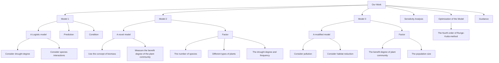

# The Comprehensive Prediction Model for Drought-Striken Plant Communities

## Summary

Global warming is becoming more and more serious, which has also led to increased drought in some areas. It seriously affects the long-term viability of local plant communities. In order to understand the changing patterns of plant communities in arid regions, we propose three models, a Logistic model that takes into account drought and intermediate interactions, a new model that measures changes in biomass and benefits, and a modified model that takes into account pollution and habitat reduction.

First, we establish a Logistic model considering drought and interspecific interactions to predict the population changes of four plant species in the Tengger Desert, Northwest China. Through the comparison of plant quantity changes under regular and irregular drought cycles, it is found that different plants have different adaptability to drought environment because of their own characteristics. At the same time, we find that heavy rainfall followed by rapid drought processes can seriously threaten plant survival.

Second, we use biomass to construct a new model to measure the benefit degree of plant communities, and randomly select 2, 3 and 4 species from the four plant species for analysis. On the one hand, we find that as the number of species increases, more and more selected combinations show positive benefits, and the benefits are gradually increasing.On the other hand, we divide the plants into sensitive types and drought-tolerant types, and find that the biomass of sensitive types is more susceptible to fluctuation of drought intensity, while the biomass of drought-tolerant types remain stable under drought, but decrease due to increased competition under sufficient rainfall.

Third, we use the Monte Carlo method to generate two new precipitation distributions with greater and lesser drought frequency and severity, and analyzed four plant species using the previous model. We find that plant biomass remain stable in both conditions, but not in the same amount.

Fourth, we modify the previous model by introducing pollution degree and habitat reduction index, and analyze the changes in the number of four plants again in combination with the actual situation of factory construction. We find that habitat loss has a bigger side effect than pollution, and the combination of the two keeps plant populations lower over time.

Fifth, we conduct sensitivity analysis of some initial parameters of the four plants to explore how these parameters affect the model and simulation experiment.We find that the maximum number of individual plants under ideal conditions has a relatively large effect on the experiment, but it is within the acceptable range. This reflects the robustness of our model.

At last, we optimize the solving method of the model. We use the fourth order Runge-Kutta method to solve the model and get more accurate prediction results. We also use the analysis results to make valuable suggestions on how to improve the viability of plant communities under drought conditions and contribute to environmental governance.

Keywords: drought; interations; biomass; benefits; pollution; habitat reduction;

## Contents

## 1 Introduction· · 1

1.1 Background ·  
1.2 Problem Restatement · ·  
1.3 Our Work · · 2

## 2 Assumptions · · 2

## 3 List of Notation · · 3

## 4 Model Establishment and Solution 3

4.1 The Model for Predicting Changes in a Plant Community 3

4.1.1 The Establishment of a Modified Logistic Model· · · · · 3  
4.1.2 Population Predictions Using Modified Models · · · · 5

4.2 Further Analysis of the Modified Model · · b

4.2.1 The Relationship between the Number of Species and Benefits· · · · · · · 7  
4.2.2 The Effects of Different Species Type· · · · · · 10  
4.2.3 The Effects of Drought Severity and Frequency · · · · · 13  
4.2.4 The Effects of Pollution and Habitat Reduction · · · · · 16  
4.2.5 Suggestions to Ensure the Viability of a Community · · · · · · · · 17

4.3 Sensitivity Analysis · · · 18  
4.4 Optimization of the Model· · · 19

## 5 Model Evaluation 19

5.1 Strengths · · 19  
5.2 Weaknesses 19

## Appendices · · · 21

## 1 Introduction

## 1.1 Background

At present, the impact of global warming on ecological environment is more and more serious. Climate warming will lead to increased drought and desertification in some areas. Drought-hit areas are not conducive to maintaining biological diversity and species stability. The production and living of people has also been affected.

Take Tengger Desert for example, it is the fourth largest desert in China. In recent years, the phenomenon of desertification near the Tengger Desert cannot be ignored. In addition, groundwater in the Tengger Desert was found to have been polluted for years by factory emissions, seriously affecting the stability of the region’s ecosystem.We use this as a background to explore changes of plant species in drought-hit areas and provide valuable advice for maintaining the long-term viability of plant communities.


<details>
<summary>natural_image</summary>

Dramatic landscape with a lone dead tree emerging from cracked dry earth at sunset, no text or symbols present.
</details>

(a) A drought-hit area[12]


<details>
<summary>natural_image</summary>

Desert landscape with sand dunes and sparse shrubs under a blue sky with scattered clouds (no text or symbols visible)
</details>

(b) The Tengger Desert[13]  
Figure 1: Effects of global warming

## 1.2 Problem Restatement

• Establish a mathematical model to predict the changes of plant communities in irregular drought cycles. The model needs to take into account the interactions between plant species.  
• Explore how many plant species are needed to benefit a plant community. Describe the variation pattern of plant community benefit degree and species number.  
• Explore how different plant types affect changes in the number and benefit of plants under drought cycles.  
• Explore how different frequency and degree of drought affect plant community changes. At this point, analyze the effect of the number of plant species on the change of the whole population.  
• Explore changes in plant abundance and benefits with drought cycles that take into account changes in environmental pollution and habitat reduction.  
• Give advise on maintaining the long-term viability of plant communities and their impact on the environment

## 1.3 Our Work

According to the requirements, our work is as follows.


<details>
<summary>flowchart</summary>


</details>

Figure 2: Our Work

## 2 Assumptions

• When there is no drought and no interaction, the population growth of a species under ideal conditions with sufficient environmental resources conforms to the logistic curve.  
• There are only two types of interaction between multiple species: competition and mutua benefit. There are no other complex interactions.  
• Suppose that the degree of drought is only related to precipitation, not to other factors.  
• Assume that environmental factors other than drought, pollution, habitat loss (such as wind, sunlight, temperature, animals, microorganisms...) are not taken into account.  
• The types of plants are divided into sensitive and drought-tolerant types, without considering other types.  
• The model is not suitable for extreme weather conditions, such as severe drought and flood.

## 3 List of Notation

Table 1: The List of Notation

<table><tr><td>Symbol</td><td>Meaning</td></tr><tr><td> $x_i$ </td><td>The number of plants in a single species i</td></tr><tr><td> $r_i$ </td><td>The growth rate of species i</td></tr><tr><td> $N_i$ </td><td>The maximum capacity of species i</td></tr><tr><td> $\sigma_{ij}$ </td><td>The interspecific relationship index between  $x_j$  and  $x_i$ .</td></tr><tr><td> $k_{sigma}^{(ij)}$ </td><td>The influence gradient of the interaction index  $\sigma_{ij}$  and drought stress S.</td></tr><tr><td>S</td><td>The degree of drought stress</td></tr><tr><td>S0</td><td>Critical degree of drought stress.</td></tr><tr><td>P</td><td>Precipitation</td></tr><tr><td> $P_{max}$ </td><td>The maximum precipitation</td></tr><tr><td> $L_i$ </td><td>The maximum growth rate</td></tr><tr><td> $k_i$ </td><td>The influence gradient between the growth rate of species  $r_i$  and precipitation P</td></tr><tr><td> $\alpha_i$ </td><td>The influence gradient between the maximum number of plants  $N_i$  and the degree of drought stress S</td></tr><tr><td> $N_i^0$ </td><td>The ideal maximum number of plants in a single species under the initial condition</td></tr><tr><td> $B_i$ </td><td>The biomass of species i.</td></tr><tr><td>n</td><td>The total number of species</td></tr><tr><td>k</td><td>The number of selected species( $0 < k <= n$ )</td></tr><tr><td>T</td><td>The total stress degree</td></tr><tr><td>PO</td><td>The pollution degree</td></tr><tr><td>δ</td><td>The pollution of a single moment</td></tr><tr><td> $\mu_i$ </td><td>The purification factor of species i</td></tr><tr><td>H</td><td>The impact of habitat reduction</td></tr><tr><td>A</td><td>The habitat area</td></tr><tr><td> $A_0$ </td><td>The initial habitat area</td></tr></table>

## 4 Model Establishment and Solution

## 4.1 The Model for Predicting Changes in a Plant Community

In this problem, we construct a modified Logistic model that takes into account the interactions between different species and the degree of drought stress. Using this model, combined with meteorological data from the National Bureau of Statistics[1] and species data from relevant literature[2] , we predicted the population changes of four plant species during several irregular drought cycles in the area around the Tengger Desert in northwest China.

## 4.1.1 The Establishment of a Modified Logistic Model

Without considering the interaction between species and drought stress, the Logistic model of idealized population growth of a single species is shown in Formula 1.

$$
\frac {d x _ {i}}{d t} = r _ {i} x _ {i} (1 - \frac {x _ {i}}{N _ {i}}) \tag {1}
$$

Where $x _ { i }$ represents the number of plants in a single species, $r _ { i }$ represents the growth rate of the species, and $N _ { i }$ represents the maximum number of plants in a single species under a specific environmental capacity. When considering interspecific relationships, A correction term needs to be introduced, as shown in Formula 2.

$$
\frac {d x _ {i}}{d t} = r _ {i} x _ {i} (1 - \frac {x _ {i}}{N _ {i}} - \sum_ {j} \sigma_ {i j} \frac {x _ {j}}{N _ {j}}) \tag {2}
$$

Where $\sigma _ { i j }$ represents the interspecific relationship index between $x _ { j }$ and $x _ { i }$ . When $\sigma _ { i j } > 0$ , the interspecific relationship is competition.The growth rate of species will decrease or even become negative. When $\sigma _ { i j } < 0$ , the interspecific relationship is mutually beneficial.The rate of increase in the number of plants in a single species will be greater.

The index of interaction between species is also affected by the degree of drought stress. It has been shown that when drought stress is low and water is abundant, the relationships between species tend to be more competitive. When drought stress is high and water resources are scarce, the relationship between species tends to be mutually beneficial, so as to meet their own development needs and improve their adaptability in extreme environments. The relationship between the interaction index σij among species and the degree of drought stress S is shown in Formula 3. $\sigma _ { i j }$

$$
\sigma_ {i j} = - k _ {\text { sigma }} ^ {(i j)} \left(S - S _ {0}\right) \tag {3}
$$

$k _ { s i g m a } ^ { ( i j ) }$ is the influence gradient of the interaction index $\sigma _ { i j }$ and drought stress S. S0 is the critical drought stress degree. When the drought stress degree is lower than the critical value, $\sigma _ { i j } > 0$ . When the drought stress degree is higher than the critical value, $\sigma _ { i j } < 0$ , the relationship between species is mutually beneficial. Therefore, a reasonable linear relationship between the interaction index of species and the degree of drought stress is established.

The precipitation $P$ is used to describe the degree of drought stress S, and the value range of S is restricted between 0 and 1, as shown in Formula 4.

$$
S (t) = 1 - \frac {P (t)}{P _ {\max}} \tag {4}
$$

It can be found that precipitation P is negatively correlated with the degree of drought stress S. Where P max is the maximum amount of precipitation in the area over a period of time.

We find that precipitation not only affects the interaction index between species by influencing the degree of drought stress, but also affects the growth rate of each species. Since plants can drown when there is too much rain in arid regions, growth rates do not increase indefinitely, but gradually slow down. So the growth rate is not simply linearly proportional to precipitation. We assume that the growth rate $r _ { i }$ has a Logistic relationship with precipitation $P$ , as shown in Formula 5.

$$
r _ {i} (t) = \frac {L _ {i}}{1 + e ^ {- k _ {i} \cdot P (t)}} \tag {5}
$$

In the formula, $L _ { i }$ represents the maximum growth rate of the species, $k _ { i }$ represents the influence gradient between the growth rate of the species and precipitation.

In addition, the precipitation $P$ also affects the maximum number of plants in a single species N i, which is assumed to be linearly positive, as shown in Formula 6.

$$
N _ {i} (t) = \left(1 - \alpha_ {i} (S (t) - S 0)\right) \cdot N _ {i} ^ {0} \tag {6}
$$

Where is $\alpha _ { i }$ the influence gradient between the maximum number of plants in a single species and the degree of drought stress, and $N _ { i } ^ { 0 }$ is the ideal maximum number of plants in a single species under the initial condition.

By substituting the expression of $r _ { i } , S , N _ { i } , \sigma _ { i j }$ into Formula 2, we can get the differential equation describing the number of plants in a single species as well as the interaction between species and precipitation, and successfully construct the mathematical model.

## 4.1.2 Population Predictions Using Modified Models

Combined with data from the National Bureau of Statistics[1] and related literature[2], we make population predictions for four plant species in the southeastern Tengger Desert of China. They are Salsola passerina, Reaumuria soongarica, Ceratoides latens and Kalidium foliatum. For convenience, we’d like to call them plant A, B, C and D.

The average monthly precipitation for the region from 2018 to 2021 is shown in Figure 1. We will predict and analyze the changes of the number of four plants in the 48 months through the modified model.

Taking the number of plants in the article as a reference, we analyze the changes in the number of plants in the following 48 months and got the number of four plants in each month. The initial numbers $x _ { i }$ of plants A,B,C and D are 34, 34, 29 and 33 respectively.

In addition, according to the different adaptive capacities of the four plants involved in the paper to drought, the initial ideal maximum capacity $N _ { i } ^ { 0 }$ is set proportionally, which is respectively 200, 153, 137, 36. It can be seen that plant D has poor adaptability to drought, so its initial ideal maximum capacity is the lowest.

According to the different root lengths of the four plants in the paper, the maximum growth rate $L _ { i }$ can be estimated as 5, 3.5 and 5, 2.5 plants per month respectively. It can be found that the longer the root system is, the stronger the ability to absorb water from the soil and the faster the growth rate. Therefore, this hypothesis is reasonable.


<details>
<summary>bar chart</summary>

| Index | Value |
|---|---|
| 1 | 5 |
| 2 | 3 |
| 3 | 4 |
| 4 | 12 |
| 5 | 17 |
| 6 | 2 |
| 7 | 117 |
| 8 | 88 |
| 9 | 24 |
| 10 | 8 |
| 11 | 4 |
| 12 | 0 |
| 13 | 0 |
| 14 | 0 |
| 15 | 0 |
| 16 | 5 |
| 17 | 15 |
| 18 | 87 |
| 19 | 4 |
| 20 | 2 |
| 21 | 14 |
| 22 | 11 |
| 23 | 4 |
| 24 | 0 |
| 25 | 0 |
| 26 | 0 |
| 27 | 0 |
| 28 | 3 |
| 29 | 9 |
| 30 | 43 |
| 31 | 13 |
| 32 | 83 |
| 33 | 27 |
| 34 | 0 |
| 35 | 6 |
| 36 | 0 |
| 37 | 0 |
| 38 | 1 |
| 39 | 28 |
| 40 | 14 |
| 41 | 14 |
| 42 | 11 |
| 43 | 0 |
| 44 | 9 |
| 45 | 48 |
| 46 | 5 |
| 47 | 14 |
| 48 | 0 |
</details>

Figure 3: Precipitation in 48 months

Through data fitting and empirical analysis, the quantitative values of other coefficients in the differential equation model can be reasonably estimated, which are αi = 0.6, S0 = 0.5, k(ij)sigma $\alpha _ { i } = 0 . 6 , S 0 = 0 . 5 , k _ { s i g m a } ^ { ( i j ) } =$ 0.002, $k _ { i } = 0 . 0 1$ , as shown in Table 2.

Table 2: Initial Parameter Settings

<table><tr><td>Plant</td><td> $x_{i}$ </td><td> $N_{i}^{0}$ </td><td> $L_{i}$ </td><td> $\alpha_{i}$ </td><td>S0</td><td> $k_{sigma}^{(ij)}$ </td><td> $k_{i}$ </td></tr><tr><td>A</td><td>34</td><td>200</td><td>5</td><td rowspan="4">0.6</td><td rowspan="4">0.5</td><td rowspan="4">0.002</td><td rowspan="4">0.01</td></tr><tr><td>B</td><td>34</td><td>153</td><td>3.5</td></tr><tr><td>C</td><td>29</td><td>137</td><td>5</td></tr><tr><td>D</td><td>33</td><td>36</td><td>2.5</td></tr></table>

Since the time data were discrete, we converted the differential equation into a difference equation, and iterated through matlab to calculate the changes in the number of four plants in the drought cycle, as shown in appendices-Listing 1 and Figure 4(a).


<details>
<summary>line chart</summary>

| Time/month | A    | B    | C    | D    |
| ---------- | ---- | ---- | ---- | ---- |
| 0          | 30   | 30   | 30   | 30   |
| 5          | 160  | 120  | 100  | 25   |
| 10         | 260  | 170  | 90   | 35   |
| 15         | 140  | 110  | 95   | 25   |
| 20         | 240  | 170  | 110  | 25   |
| 25         | 150  | 110  | 100  | 25   |
| 30         | 190  | 130  | 110  | 25   |
| 35         | 220  | 160  | 80   | 30   |
| 40         | 170  | 120  | 100  | 25   |
| 45         | 200  | 140  | 110  | 25   |
| 50         | 150  | 120  | 100  | 25   |
</details>

(a) regular drought cycles


<details>
<summary>line chart</summary>

| Time/month | A    | B    | C    | D    |
| ---------- | ---- | ---- | ---- | ---- |
| 0          | 30   | 30   | 30   | 30   |
| 5          | 150  | 120  | 100  | 25   |
| 10         | 250  | 170  | 140  | 35   |
| 15         | 140  | 110  | 95   | 25   |
| 20         | 160  | 120  | 100  | 25   |
| 25         | 140  | 110  | 95   | 25   |
| 30         | 150  | 130  | 100  | 25   |
| 35         | 220  | 160  | 80   | 30   |
| 40         | 170  | 120  | 100  | 25   |
| 45         | 200  | 140  | 130  | 25   |
| 50         | 150  | 110  | 70   | 25   |
</details>

(b) irregular drought cycles  
Figure 4: The number of plants in regular and irregular drought cycles

As can be seen from Figure 4(a), with the change of precipitation in Figure 3, the number of the four plant species will reach the peak in the period of high precipitation, and maintain a relatively low level in the period of low precipitation. At the same time, it can be found that in the peak period of population, the inter-specific competition is intensified, and there are significant differences in the number of the four plants. During periods of precipitation scarcity, all four species would stabilize at a low level and not become extinct due to mutualism. In addition, plant D fluctuates only at a low level due to its weak drought resilience and small initial ideal maximum capacity.

The comparison between Figure 4(a) and Figure 3 further shows that the number of four plants changes dramatically during the period of rapid precipitation changes, especially during the 20th month when the number of plants A,B and C drops sharply. This shows that the rapid drought process will seriously threaten the survival of plants, which provides a certain reference value for desert management in the future.

It can be seen from the precipitation data in Figure 3 that the precipitation changes periodically every year. In order to simulate the extremely irregular drought cycle, we changed the precipitation in the 18th month to one-tenth of the original data, and then used the model to predict the result, as shown in Figure 4(b).

As can be seen from the figure, since the precipitation at this time does not change dramatically in the eighteenth month or so, the number of plants A,B and C will not decline rapidly and will remain at a stable level, indicating that plants are very sensitive to drastic changes in precipitation conditions.

Through the analysis of the changes in the number of four plant species in regular and irregular drought cycles, it is found that the established model has certain robustness. The model is reasonable and accurate, and can reflect the changes of plant quantity in arid areas to a certain extent. It provides a certain reference value for guiding desert planting in the future.

## 4.2 Further Analysis of the Modified Model

## 4.2.1 The Relationship between the Number of Species and Benefits

## (1)Build Models that Describe the Benefits

To explore the relationship between the number of species and the benefit, we need to measure the benefit according to biomass rather than just the number of plants in different species. Biomass is the total amount of organic matter living in a unit area at any given time. Because each species varies greatly in mass, size, and physiological structure, so does its biomass.

At the same time, we can quantify the benefits mathematically. First, suppose there are n species, and only one species is allowed to grow in the environment. The numerical curves of each species in this environment over time can be obtained by using the established model. Multiply the number of each species by the corresponding biomass. Compare these data at each moment and build a curve using the largest data. The curve is called the baseline, as shown in the formula 7,where $x _ { i }$ is the number of a species, $B _ { i }$ is the biomass of the species.

$$
B _ {0} (t) = \max \left\{B _ {i} \cdot x _ {i} (t) \mid i = 1, 2, 3, \dots , n \right\} \tag {7}
$$

Next, k of the n species are selected to be placed in the environment. The numerical curves of k species in this environment were obtained by using the model. Multiply the number by the corresponding biomass and sum together to get the change curve of the total biomass. Finally, the difference between the curve and the base line reflects the degree of benefit B, as shown in the Formula 8.

$$
B (t) = \sum_ {i = 1} ^ {k} B _ {i} \cdot x _ {i} (t) - B _ {0} (t) \tag {8}
$$

Only when $B > 0$ can the whole plant community get benefits, and different k values can be selected for more detailed analysis.

## (2)Make Benefit Analysis according to the Actual Situation

Based on the data from the first question, combined with relevant information from the Bureau of Statistics and literature, a benefit analysis was made for four plant species in Tengger Desert. Due $k _ { s i g m a } ^ { ( i j ) }$ mentioned in Formula 3 is also different, and so is the critical degree of drought stress S0. According to the measurement of root-shoot ratio in literature[2], the quantitative values of both can be reasonably estimated and given in matrix form, as shown in formula 9 and 10.Compared with the first question, the data is accurate and reasonable.

$$
K _ {s i g m a} = 0. 1 \times \left[ \begin{array}{c c c c} 0 & 0. 7 6 3 & 1. 1 0 & 4. 1 1 \\ 1. 3 1 & 0 & 1. 4 5 & 5. 3 9 \\ 0. 9 0 5 & 0. 6 9 1 & 0 & 3. 7 2 \\ 0. 2 4 3 & 0. 1 8 5 & 0. 2 6 9 & 0 \end{array} \right] \tag {9}
$$

$$
S _ {0} = \left[ \begin{array}{c c c c} 0 & 0. 5 2 3 & 0. 5 3 3 & 0. 6 2 4 \\ 0. 3 1 8 & 0 & 0. 5 4 4 & 0. 6 6 3 \\ 0. 3 7 4 & 0. 4 0 4 & 0 & 0. 6 1 2 \\ 0. 4 6 6 & 0. 4 7 4 & 0. 4 6 3 & 0 \end{array} \right] \tag {10}
$$

In the matrix, K (ij) $K _ { s i g m a } ^ { ( i j ) } , S _ { 0 } ^ { ( i j ) }$ respectively represents the influence of plant j on plant i, j=1,2,3,4, i=1,2,3,4, The numbers 1, 2, 3, and 4 represent plants A,B,C, and D.

The data in the references for the settings of the other parameters are basically consistent with question 1. Data about biomass B is added in the table

Table 3: Initial Parameter Settings

<table><tr><td>Plant</td><td> $x_{i}$ </td><td> $N_{i}^{0}$ </td><td> $L_{i}$ </td><td>B</td><td> $\alpha_{i}$ </td><td> $k_{i}$ </td></tr><tr><td>A</td><td>34</td><td>200</td><td>5</td><td>371.49</td><td rowspan="4">0.002</td><td rowspan="4">0.01</td></tr><tr><td>B</td><td>34</td><td>153</td><td>3.5</td><td>156.32</td></tr><tr><td>C</td><td>29</td><td>137</td><td>5</td><td>230.66</td></tr><tr><td>D</td><td>33</td><td>36</td><td>2.5</td><td>178.71</td></tr></table>

At this point, we still assume that $\alpha _ { i } , k _ { i }$ is a constant relative to the four plants, and we will change it in later problems to get closer to the real situation.

When k=2, two plants are selected from the four plants, and there are six results in total, which are AB, AC, AD, BD, BC and CD respectively. The biomass change curves of each plant were obtained by using the model and compared with the baseline named "single", as shown in Figure 5.

Table 4: k=2,Benefit Analysis

<table><tr><td>Type</td><td>AB</td><td>AC</td><td>AD</td><td>BC</td><td>BD</td><td>CD</td></tr><tr><td> $\mathrm{B}(\times 10^{4})$ </td><td>2.1257</td><td>2.7259</td><td>1.2740</td><td>-2.8521</td><td>-1.0951</td><td>-2.2441</td></tr></table>

By averaging the benefit values at all times, the average benefit of each combination is obtained.As can be seen from the Figure 5 and Table 4, when k=2, benefits are positive in three cases, and negative in the other three, and the overall relationship is that $B ( A C ) > B ( A B ) > B ( A D ) >$ $0 > B ( B D ) > B ( C D ) > B ( B C )$ .


<details>
<summary>line chart</summary>

| Time/month | single | data1 | data2 | data3 | data4 | data5 | data6 |
| ---------- | ------ | ----- | ----- | ----- | ----- | ----- | ----- |
| 0          | 12000  | 12000 | 12000 | 12000 | 12000 | 12000 | 12000 |
| 5          | 55000  | 75000 | 85000 | 68000 | 45000 | 35000 | 32000 |
| 10         | 75000  | 78000 | 88000 | 65000 | 42000 | 38000 | 35000 |
| 15         | 52000  | 72000 | 78000 | 63000 | 41000 | 37000 | 34000 |
| 20         | 92000  | 88000 | 128000| 68000 | 65000 | 42000 | 38000 |
| 25         | 55000  | 75000 | 82000 | 67000 | 43000 | 36000 | 33000 |
| 30         | 58000  | 76000 | 85000 | 69000 | 44000 | 37000 | 34000 |
| 35         | 52000  | 74000 | 83000 | 66000 | 42000 | 35000 | 32000 |
| 40         | 65000  | 78000 | 87000 | 68000 | 45000 | 38000 | 34000 |
| 45         | 75000  | 82000 | 92000 | 72000 | 48000 | 41000 | 36000 |
| 50         | 58000  | 79000 | 86000 | 71000 | 46000 | 39000 | 33000 |
</details>

Figure 5: k=2,Biomass Distribution


<details>
<summary>line chart</summary>

| Time/month | single | data1 | data2 | data3 | data4 |
| ---------- | ------ | ----- | ----- | ----- | ----- |
| 0          | 12000  | 25000 | 25000 | 25000 | 20000 |
| 5          | 55000  | 105000| 95000 | 100000| 55000 |
| 10         | 52000  | 102000| 98000 | 105000| 58000 |
| 15         | 53000  | 103000| 97000 | 102000| 56000 |
| 20         | 15000  | 65000 | 85000 | 95000 | 52000 |
| 25         | 54000  | 110000| 92000 | 98000 | 54000 |
| 30         | 55000  | 128000| 95000 | 115000| 56000 |
| 35         | 43000  | 148000| 92000 | 118000| 54000 |
| 40         | 65000  | 118000| 93000 | 112000| 53000 |
| 45         | 52000  | 132000| 94000 | 115000| 56000 |
| 48         | 7500   | 11200 | 960   | 1180   | 58    |
| 49         | 42     | 112   | 97    | 118   | 58    |
</details>

Figure 6: k=3,Biomass Distribution

When k=3, three plants ware selected from the four plants, and there are four results in total, which are ABC, ABD, ACD, BCD respectively. The biomass change curves of each plant were obtained by using the model and compared with the baseline named "single", as shown in Figure 6.

Table 5: k=3,Benefit Analysis

<table><tr><td>Type</td><td>ABC</td><td>ABD</td><td>ACD</td><td>BCD</td></tr><tr><td> $\mathrm{B}\left( {\times {10}^{4}}\right)$ </td><td>5.1470</td><td>3.6501</td><td>4.3094</td><td>-0.1416</td></tr></table>

By averaging the benefit values at all times, the average benefit of each combination is obtained.As can be seen from the Figure 6 and Table 5, when k=3, benefits are positive in three cases, and negative in the other one, and the overall relationship is that $B ( A B C ) > B ( A C D ) > B ( A B D ) >$ $0 > B ( B C D )$ .

When k=n=4, there is one results in total, which is ABCD. The biomass change curves obtained by using the model and compared with the baseline named "single", as shown in Figure 7.


<details>
<summary>line chart</summary>

| Time/month | single   | data1    |
| ---------- | -------- | -------- |
| 0          | 15000    | 30000    |
| 1          | 25000    | 60000    |
| 2          | 40000    | 90000    |
| 3          | 55000    | 120000   |
| 4          | 60000    | 125000   |
| 5          | 65000    | 125000   |
| 6          | 50000    | 125000   |
| 7          | 95000    | 140000   |
| 8          | 75000    | 125000   |
| 9          | 55000    | 135000   |
| 10         | 55000    | 125000   |
| 11         | 55000    | 125000   |
| 12         | 55000    | 125000   |
| 13         | 55000    | 125000   |
| 14         | 55000    | 125000   |
| 15         | 55000    | 125000   |
| 16         | 55000    | 125000   |
| 17         | 60000    | 125000   |
| 18         | 90000    | 135000   |
| 19         | 15000    | 12500    |
| 20         | 2500     | 1250     |
| 21         | 450      | 125      |
| 22         | 55        | 125      |
| 23         | 55       | 125      |
| 24         | 55       | 125      |
| 25         | 55       | 125      |
| 26         | 55       | 125      |
| 27         | 55       | 125      |
| 28         | 55       | 125      |
| 29         | 60       | 125      |
| 30         | 75       | 135      |
| 31         | 48       | 135      |
| 32         | 85       | 135      |
| 33         | 43       | 135      |
| 34         | 55       | 135      |
| 35         | 65       | 135      |
| 36         | 75       | 135      |
| 37         | 65       | 135      |
| 38         | 75       | 135      |
| 39         | 65       | 135      |
| 40         | 75       | 135      |
| 41         | 65       | 135      |
| 42         | 75       | 135      |
| 43         | 65       | 135      |
| 44         | 75       | 135      |
| 45         | 65       | 135      |
| 46         | 85       | 135      |
| 47         | 43       | 135      |
| 48         | 65       | 135      |
| 49         | -        | -        |
</details>

Figure 7: k=4,Benefit Analysis

Under this circumstance, $\mathbf { B } ( \mathrm { A B C D } ) { = } 6 . 9 8 7 { \times } 1 0 ^ { 4 }$ , which is the largest comparied to k=2 and k=3.

Through the longitudinal comparison of different k values, it can be found that the greater the number of species, the greater the proportion of cases with positive benefits. In addition, the maximum positive benefit increased with the increase of the number of species.

## 4.2.2 The Effects of Different Species Type

We can divide plants into standard, sensitive and drought-tolerant types. Formula 6 is corrected by multiplying the coefficient $\beta _ { i }$ in front of $\alpha _ { i } .$ , as shown in Formula 11. $\beta _ { i }$ of standard, sensitive and drought-tolerant types are 1,0.5 and 1.5, indicating the sensitivity of $N _ { i }$ with S.

$$
N _ {i} (t) = \left(1 - \beta_ {i} \alpha_ {i} (S (t) - S 0)\right) \cdot N _ {i} ^ {0} \tag {11}
$$

By substituting the revised formula 11 into the differential equation model, a model considering different plant types is established.

(1)The Relationship between Species Type and Population Size


<details>
<summary>line chart</summary>

| Time/month | A    | B    | C    | D    |
| ---------- | ---- | ---- | ---- | ---- |
| 0          | 30   | 30   | 30   | 30   |
| 5          | 140  | 100  | 90   | 20   |
| 10         | 230  | 160  | 130  | 40   |
| 15         | 140  | 120  | 100  | 20   |
| 20         | 220  | 150  | 160  | 30   |
| 25         | 140  | 120  | 100  | 20   |
| 30         | 190  | 140  | 130  | 30   |
| 35         | 210  | 150  | 140  | 20   |
| 40         | 170  | 130  | 110  | 20   |
| 45         | 195  | 140  | 135  | 25   |
| 50         | 160  | 120  | 110  | 25   |
</details>

(a) Sensitive type


<details>
<summary>line chart</summary>

| Time/month | A   | B   | C   | D   |
| ---------- | --- | --- | --- | --- |
| 0          | 30  | 30  | 30  | 30  |
| 5          | 210 | 170 | 140 | 30  |
| 10         | 215 | 180 | 150 | 30  |
| 15         | 215 | 180 | 150 | 30  |
| 20         | 215 | 180 | 150 | 30  |
| 25         | 215 | 180 | 150 | 30  |
| 30         | 215 | 180 | 150 | 30  |
| 35         | 215 | 180 | 150 | 30  |
| 40         | 215 | 180 | 150 | 30  |
| 45         | 215 | 180 | 150 | 30  |
| 50         | 215 | 180 | 150 | 30  |
</details>

(b) Drought tolerant type


<details>
<summary>line chart</summary>

| Time/month | A   | B   | C   | D   |
| ---------- | --- | --- | --- | --- |
| 0          | 30  | 30  | 30  | 30  |
| 5          | 190 | 150 | 130 | 30  |
| 10         | 170 | 150 | 130 | 30  |
| 15         | 180 | 150 | 120 | 30  |
| 20         | 200 | 160 | 130 | 30  |
| 25         | 180 | 150 | 120 | 30  |
| 30         | 180 | 150 | 120 | 30  |
| 35         | 200 | 150 | 130 | 30  |
| 40         | 180 | 150 | 120 | 30  |
| 45         | 190 | 150 | 130 | 30  |
| 50         | 180 | 150 | 130 | 30  |
</details>

(c) Standard type  
Figure 8: The Relationship between Species Type and Population Size

As can be seen from Figure 8(c), the stability of the standard type is good, and the population remains stable within a certain range when precipitation fluctuates greatly.

It can be seen from 8(a) that the population of sensitive type fluctuates greatly with precipitation and has poor stability. According to 8(b), the population of drought-tolerant types can still maintain a high level when precipitation drops sharply, but there will be an abnormal decline in the period when precipitation rises sharply. This is because when precipitation is higher, the inter-specific competition of drought-tolerant types will be more intense, leading to population decline.

## (2)The Relationship between Species Type and Benefits

According to 9(a),9(c) and 9(e), it can be seen that for sensitive type, after reaching stability, with the increase of species number k, the biomass under partial combination conditions increases substantially, and the benefits are also increasing.

From 9(b),9(d),9(f), it can be seen that for drought-tolerant types, after reaching stabilization, with the increase of k, more and more cases still become beneficial, despite the abnormal decline in competition.

As can be seen from Table 6 and 7, the average benefit of sensitive type is greater than that of drought-tolerant type. As the number of species k increased, the benefit of sensitive type increased faster.


<details>
<summary>line chart</summary>

| Time/month | single | data1 | data2 | data3 | data4 | data5 | data6 |
| ---------- | ------ | ----- | ----- | ----- | ----- | ----- | ----- |
| 0          | 1      | 1     | 1     | 1     | 1     | 1     | 1     |
| 5          | 4      | 5     | 4     | 3     | 2     | 3     | 2     |
| 10         | 9      | 10    | 8     | 6     | 5     | 6     | 5     |
| 15         | 2      | 3     | 2     | 2     | 2     | 2     | 2     |
| 20         | 1      | 2     | 1     | 1     | 1     | 1     | 1     |
| 25         | 1      | 2     | 1     | 1     | 1     | 1     | 1     |
| 30         | 1      | 2     | 1     | 1     | 1     | 1     | 1     |
| 35         | 1      | 2     | 1     | 1     | 1     | 1     | 1     |
| 40         | 1      | 2     | 1     | 1     | 1     | 1     | 1     |
| 45         | 1      | 2     | 1     | 1     | 1     | 1     | 1     |
| 50         | 1      | 2     | 1     | 1     | 1     | 1     | 1     |
</details>

(a) k=2, Sensitive type


<details>
<summary>line chart</summary>

| Time/month | single | data1 | data2 | data3 | data4 | data5 |
| ---------- | ------ | ----- | ----- | ----- | ----- | ----- |
| 0          | 1      | 1     | 1     | 1     | 1     | 1     |
| 5          | 6      | 7     | 8     | 7     | 6     | 9     |
| 10         | 7      | 8     | 9     | 8     | 7     | 10    |
| 15         | 6      | 7     | 8     | 7     | 6     | 9     |
| 20         | 8      | 6     | 7     | 6     | 5     | 8     |
| 25         | 7      | 6     | 7     | 6     | 5     | 8     |
| 30         | 7      | 6     | 7     | 6     | 5     | 8     |
| 35         | 6      | 6     | 7     | 6     | 5     | 8     |
| 40         | 7      | 6     | 7     | 6     | 5     | 8     |
| 45         | 6      | 6     | 7     | 6     | 5     | 8     |
| 50         | 7      | 6     | 7     | 6     | 5     | 8     |
</details>

(b) k=2, Drought tolerant type


<details>
<summary>line chart</summary>

| Time/month | single | data1 | data2 | data3 | data4 |
| ---------- | ------ | ----- | ----- | ----- | ----- |
| 0          | 1      | 2     | 2     | 2     | 2     |
| 5          | 5      | 8     | 8     | 8     | 8     |
| 10         | 9      | 10    | 10    | 10    | 10    |
| 15         | 1      | 8     | 8     | 8     | 8     |
| 20         | 2      | 12    | 12    | 12    | 12    |
| 25         | 1      | 8     | 8     | 8     | 8     |
| 30         | 1      | 8     | 8     | 8     | 8     |
| 35         | 2      | 8     | 8     | 8     | 8     |
| 40         | 1      | 8     | 8     | 8     | 8     |
| 45         | 1      | 8     | 8     | 8     | 8     |
| 50         | 1      | 8     | 8     | 8     | 8     |
</details>

(c) k=3, Sensitive type


<details>
<summary>line chart</summary>

| Time/month | single | data1 | data2 | data3 | data4 |
| ---------- | ------ | ----- | ----- | ----- | ----- |
| 0          | 1      | 1     | 1     | 1     | 1     |
| 5          | 6      | 12    | 10    | 8     | 12    |
| 10         | 7      | 14    | 11    | 9     | 13    |
| 15         | 6      | 13    | 10    | 8     | 12    |
| 20         | 8      | 14    | 11    | 9     | 13    |
| 25         | 6      | 13    | 10    | 8     | 12    |
| 30         | 6      | 13    | 10    | 8     | 12    |
| 35         | 8      | 14    | 11    | 9     | 13    |
| 40         | 6      | 13    | 10    | 8     | 12    |
| 45         | 7      | 13    | 10    | 8     | 12    |
| 50         | 6      | 12    | 9     | 7     | 11    |
</details>

(d) k=3, Drought tolerant type


<details>
<summary>line chart</summary>

| Time/month | angle     | disk1     |
| ---------- | --------- | --------- |
| 0          | 1.0       | 3.0       |
| 5          | 5.0       | 10.0      |
| 10         | 9.0       | 15.0      |
| 15         | 1.0       | 10.0      |
| 20         | 2.0       | 15.0      |
| 25         | 1.0       | 10.0      |
| 30         | 1.0       | 13.0      |
| 35         | 2.0       | 14.0      |
| 40         | 1.0       | 12.0      |
| 45         | 2.0       | 13.0      |
| 50         | 1.0       | 8.0       |
</details>

(e) k=4, Sensitive type


<details>
<summary>line chart</summary>

| Time/month | single       | data1        |
| ---------- | ------------ | ------------ |
| 0          | 1            | 2            |
| 5          | 6            | 14           |
| 10         | 6            | 15           |
| 15         | 6            | 15           |
| 20         | 8            | 10           |
| 25         | 6            | 15           |
| 30         | 6            | 15           |
| 35         | 8            | 10           |
| 40         | 6            | 15           |
| 45         | 7            | 15           |
| 50         | 6            | 15           |
</details>

(f) k=4, Drought tolerant type  
Figure 9: The Relationship between Species Type and Biomass Distribution

Table 6: k=2, Benefit Analysis of the sensitive and drought-tolerant type

<table><tr><td>Type</td><td>AB</td><td>AC</td><td>AD</td><td>BC</td><td>BD</td><td>CD</td></tr><tr><td>B of sensitive type( $\times 10^{4}$ )</td><td>0.0000</td><td>-1.5088</td><td>4.0707</td><td>0.6203</td><td>0.0000</td><td>-1.1004</td></tr><tr><td>B of drought-tolerant type( $\times 10^{4}$ )</td><td>2.4879</td><td>3.2105</td><td>1.3025</td><td>-3.6076</td><td>-1.4339</td><td>-2.8891</td></tr></table>

Table 7: k=3, Benefit Analysis of the sensitive and drought-tolerant type

<table><tr><td>Type</td><td>ABC</td><td>ABD</td><td>ACD</td><td>BCD</td></tr><tr><td>B of sensitive type( $\times 10^{4}$ )</td><td>0.0000</td><td>6.1294</td><td>6.6526</td><td>2.9947</td></tr><tr><td>B of drought-tolerant type( $\times 10^{4}$ )</td><td>5.9455</td><td>4.0524</td><td>4.8102</td><td>-0.3003</td></tr></table>

Further considering the more complex case, when one of the four plants is drought-tolerant and the other three are sensitive, the benefit analysis for k=2,3, and 4 is given, as shown in Figure 10 and Table 8, 9. The results showed that the benefits of mixed types were not much different from those of all drought-tolerant types.


<details>
<summary>line chart</summary>

| Time/month | single | data1 | data2 | data3 | data4 | data5 |
| ---------- | ------ | ----- | ----- | ----- | ----- | ----- |
| 0          | 1.0    | 1.0   | 1.0   | 1.0   | 1.0   | 1.0   |
| 5          | 6.0    | 8.0   | 7.0   | 6.0   | 5.0   | 4.0   |
| 10         | 9.0    | 10.0  | 9.0   | 8.0   | 7.0   | 6.0   |
| 15         | 6.0    | 8.0   | 7.0   | 6.0   | 5.0   | 4.0   |
| 20         | 8.0    | 9.0   | 8.0   | 7.0   | 6.0   | 5.0   |
| 25         | 6.0    | 8.0   | 7.0   | 6.0   | 5.0   | 4.0   |
| 30         | 7.0    | 9.0   | 8.0   | 7.0   | 6.0   | 5.0   |
| 35         | 8.0    | 10.0  | 9.0   | 8.0   | 7.0   | 6.0   |
| 40         | 6.0    | 8.0   | 7.0   | 6.0   | 5.0   | 4.0   |
| 45         | 7.0    | 9.0   | 8.0   | 7.0   | 6.0   | 5.0   |
| 50         | 6.0    | 8.0   | 7.0   | 6.0   | 5.0   | 4.0   |
</details>

(a) k=2


<details>
<summary>line chart</summary>

| Time/month | single | data1 | data2 | data3 | data4 |
| ----------- | ------ | ----- | ----- | ----- | ----- |
| 0           | 1      | 1     | 1     | 1     | 1     |
| 5           | 6      | 10    | 10    | 10    | 10    |
| 10          | 6      | 15    | 10    | 10    | 10    |
| 15          | 6      | 10    | 10    | 10    | 10    |
| 20          | 9      | 14    | 10    | 10    | 10    |
| 25          | 6      | 10    | 10    | 10    | 10    |
| 30          | 6      | 10    | 10    | 10    | 10    |
| 35          | 8      | 14    | 10    | 10    | 10    |
| 40          | 6      | 10    | 10    | 10    | 10    |
| 45          | 7      | 12    | 10    | 10    | 10    |
| 50          | 6      | 12    | 10    | 10    | 10    |
</details>

(b) k=3


<details>
<summary>line chart</summary>

| Time/month | single | total |
| ---------- | ------ | ----- |
| 0          | 1.0    | 3.0   |
| 5          | 6.0    | 13.0  |
| 10         | 6.5    | 14.0  |
| 15         | 6.0    | 13.5  |
| 20         | 3.5    | 14.5  |
| 25         | 6.0    | 13.5  |
| 30         | 6.0    | 13.0  |
| 35         | 5.0    | 14.0  |
| 40         | 6.5    | 13.5  |
| 45         | 6.0    | 13.0  |
| 50         | 6.5    | 13.5  |
</details>

(c) k=4  
Figure 10: Mixed type’s biomass distribution

Table 8: k=2, Benefit Analysis of Mixed Type

<table><tr><td>Type</td><td>AB</td><td>AC</td><td>AD</td><td>BC</td><td>BD</td><td>CD</td></tr><tr><td> $\mathrm{B}(\times 10^{4})$ </td><td>2.4735</td><td>2.9990</td><td>1.1841</td><td>-3.4156</td><td>-1.3137</td><td>-2.8962</td></tr></table>

Table 9: k=3, Benefit Analysis of Mixed Type

<table><tr><td>Type</td><td>ABC</td><td>ABD</td><td>ACD</td><td>BCD</td></tr><tr><td> $\mathrm{B}(\times 10^{4})$ </td><td>5.7179</td><td>3.9472</td><td>4.5077</td><td>-0.2993</td></tr></table>

## 4.2.3 The Effects of Drought Severity and Frequency

## (1)Establish precipitation with different frequency and degree of drought

First draw the frequency histogram of the original 48-month precipitation distribution. The frequency of the part with less precipitation was increased through reasonable setting to construct a new frequency histogram,as shown in Figure 11.


<details>
<summary>histogram</summary>

| Bin Range | Frequency |
|---|---|
| 0 - 5 | 23 |
| 5 - 10 | 4 |
| 10 - 15 | 13 |
| 15 - 20 | 5 |
| 20 - 25 | 2 |
| 25 - 30 | 5 |
| 30 - 35 | 0 |
| 35 - 40 | 1 |
| 40 - 45 | 4 |
| 45 - 50 | 0 |
| 50 - 55 | 0 |
| 55 - 60 | 0 |
| 60 - 65 | 0 |
| 65 - 70 | 1 |
| 70 - 75 | 1 |
| 75 - 80 | 0 |
| 80 - 85 | 0 |
| 85 - 90 | 0 |
| 90 - 95 | 0 |
| 95 - 100 | 0 |
| 100 - 105 | 0 |
| 105 - 110 | 0 |
| 110 - 115 | 0 |
| 115 - 120 | 1 |
</details>

(a) The original distribution


<details>
<summary>histogram</summary>

| Bin Range | Frequency |
|---|---|
| 0 - 5 | 36 |
| 5 - 10 | 2 |
| 10 - 15 | 9 |
| 15 - 20 | 3 |
| 20 - 25 | 4 |
| 25 - 30 | 2 |
| 30 - 35 | 2 |
| 35 - 40 | 0 |
| 40 - 45 | 0 |
| 45 - 50 | 0 |
| 50 - 55 | 0 |
| 55 - 60 | 0 |
| 60 - 65 | 0 |
| 65 - 70 | 0 |
| 70 - 75 | 0 |
| 75 - 80 | 1 |
| 80 - 85 | 1 |
| 85 - 90 | 0 |
| 90 - 95 | 0 |
| 95 - 100 | 0 |
| 100 - 105 | 0 |
| 105 - 110 | 0 |
| 110 - 115 | 0 |
| 115 - 120 | 0 |
</details>

(b) The new distribution  
Figure 11: Frequency histogram of old and new precipitation distributions

Each segment in the frequency histogram represents the probability of being in that precipitation interval.

It can be found that each precipitation interval corresponds to a certain probability range, and the sum of these probability ranges is 1. First, using the Monte Carlo method, we randomly generate 60 numbers between 0 and 1, representing 60 months. Secondly, each number will correspond to a probability range, indicating that the precipitation of the day can only be within the corresponding precipitation range of the probability range. Finally, the months falling within the same precipitation range are evenly distributed to get the precipitation of each month, as shown in appendices-Listing 2.


<details>
<summary>line chart</summary>

| month | Prevalence/yr |
| ----- | ------------- |
| 0     | 5             |
| 5     | 10            |
| 10    | 85            |
| 15    | 25            |
| 20    | 5             |
| 25    | 10            |
| 30    | 15            |
| 35    | 20            |
| 40    | 10            |
| 45    | 5             |
| 50    | 50            |
| 55    | 10            |
| 60    | 5             |
</details>

(a) The precipitation with greater drought


<details>
<summary>line chart</summary>

| month | radius/mm |
| ----- | --------- |
| 0     | 45        |
| 5     | 40        |
| 10    | 85        |
| 15    | 45        |
| 20    | 45        |
| 25    | 115       |
| 30    | 15        |
| 35    | 45        |
| 40    | 45        |
| 45    | 115       |
| 50    | 45        |
| 55    | 115       |
| 60    | 45        |
</details>

(b) The precipitation with less drought

Figure 12: The number of plants in regular and irregular drought cycles  


<details>
<summary>line chart</summary>

| Time/month | A    | B    | C    | D    |
| ---------- | ---- | ---- | ---- | ---- |
| 0          | 70   | 60   | 30   | 35   |
| 5          | 85   | 75   | 55   | 10   |
| 10         | 100  | 70   | 60   | 15   |
| 15         | 90   | 80   | 45   | 20   |
| 20         | 110  | 85   | 65   | 15   |
| 25         | 85   | 70   | 60   | 15   |
| 30         | 115  | 85   | 75   | 15   |
| 35         | 105  | 80   | 60   | 15   |
| 40         | 130  | 75   | 50   | 15   |
| 45         | 100  | 80   | 60   | 15   |
| 50         | 110  | 85   | 65   | 15   |
| 55         | 190  | 125  | 135  | 25   |
| 60         | 70   | 85   | 0    | 15   |
</details>

Figure 13: The changes in the number of four plants with greater drought

The Figure 12(a) show the new precipitation distributions with greater drought frequency and degree. By bringing the new precipitation distribution data into the previous model, we can first predict the changes in the number of four plants under the condition of greater frequency and degree of drought, as shown in Figure 13.

In addition, we also use the Monte Carlo method to make a 60-month precipitation distribution with less frequency and degree of drought, as shown in the Figure 12(b).

We compared two conditions of greater and less drought severity and frequency with the number of species k=2,3,4.,and analyzed the effects of drought severity and frequency on the benefits of different species, just the same operation in 4.2.1 and 4.2.2.

  
Figure 14: Biomass distribution with greater drought, $\mathrm { k } { = } 2 , 3 , 4$


<details>
<summary>line chart</summary>

| Time/month | single | data1 | data2 | data3 | data4 | data5 | data6 |
| ---------- | ------ | ----- | ----- | ----- | ----- | ----- | ----- |
| 0          | 1000   | 1000  | 1000  | 1000  | 1000  | 1000  | 1000  |
| 5          | 7000   | 9000  | 10000 | 7000  | 3000  | 6000  | 4000  |
| 10         | 8000   | 10000 | 11000 | 7500  | 3500  | 6500  | 4500  |
| 15         | 7500   | 9500  | 12000 | 7000  | 3800  | 6800  | 4800  |
| 20         | 7800   | 9800  | 11500 | 7200  | 4000  | 7000  | 5000  |
| 25         | 8500   | 11500 | 13500 | 7800  | 4200  | 7500  | 5200  |
| 30         | 6500   | 9500  | 12500 | 7500  | 4500  | 7200  | 5500  |
| 35         | 7500   | 11500 | 12800 | 7800  | 4800  | 7800  | 5800  |
| 40         | 7200   | 11800 | 12200 | 7600  | 4600  | 7600  | 5600  |
| 45         | 6800   | 12500 | 13500 | 7900  | 4900  | 7900  | 6200  |
| 48         | 150    | -     | -     | -     | -     | -     | -     |
| 49         | -      | -     | -     | -     | -     | -     | -     |
| 50         | -      | -     | -     | -     | -     | -     | -     |
</details>


<details>
<summary>line chart</summary>

| Time/month | single | data1 | data2 | data3 | data4 |
| ---------- | ------ | ----- | ----- | ----- | ----- |
| 0          | 0      | 0     | 0     | 0     | 0     |
| 5          | 0.7    | 1.2   | 1.0   | 1.1   | 0.6   |
| 10         | 0.7    | 1.2   | 1.0   | 1.1   | 0.6   |
| 15         | 0.7    | 1.2   | 1.0   | 1.1   | 0.6   |
| 20         | 0.7    | 1.2   | 1.0   | 1.1   | 0.6   |
| 25         | 0.7    | 1.2   | 1.0   | 1.1   | 0.6   |
| 30         | 0.7    | 1.2   | 1.0   | 1.1   | 0.6   |
| 35         | 0.7    | 1.2   | 1.0   | 1.1   | 0.6   |
| 40         | 0.7    | 1.2   | 1.0   | 1.1   | 0.6   |
| 45         | 0.7    | 1.2   | 1.0   | 1.1   | 0.6   |
| 48         | 0      | 0     | 0     | 0     | 0     |
| 49         | 0      | 0     | 0     | 0     | 0     |
| 50         | 0      | 0     | 0     | 0     | 0     |
</details>


<details>
<summary>line chart</summary>

| Time/month | single   | data1    |
| ---------- | -------- | -------- |
| 0          | 10000    | 30000    |
| 5          | 70000    | 130000   |
| 10         | 70000    | 130000   |
| 15         | 80000    | 130000   |
| 20         | 70000    | 130000   |
| 25         | 70000    | 130000   |
| 30         | 60000    | 130000   |
| 35         | 70000    | 130000   |
| 40         | 70000    | 130000   |
| 45         | 60000    | 130000   |
| 48         | 10000    | 13000    |
| 49         | 1500     | 1300     |
</details>

Figure 15: Biomass distribution with less drought, k=2,3,4

With the increase and decrease of drought frequency and intensity, the biomass changes became stable and kept at a high level. As the number of species increases, the biomass becomes more stable.The specific benefit analysis is shown in the Table 10 and 11.

Table 10: k=2, Benefit analysis of different drought frequency and degree

<table><tr><td>Type</td><td>AB</td><td>AC</td><td>AD</td><td>BC</td><td>BD</td><td>CD</td></tr><tr><td>B of greater drought( $\times 10^{4}$ )</td><td>2.1050</td><td>2.7134</td><td>1.2109</td><td>-2.9592</td><td>-1.1804</td><td>-2.3689</td></tr><tr><td>B of drought-tolerant type( $\times 10^{4}$ )</td><td>2.3048</td><td>2.8819</td><td>1.3063</td><td>-3.2511</td><td>-1.2454</td><td>-2.5550</td></tr></table>

Table 11: k=3, Benefit analysis of different drought frequency and degree

<table><tr><td>Type</td><td>ABC</td><td>ABD</td><td>ACD</td><td>BCD</td></tr><tr><td>B of greater drought( $\times 10^{4}$ )</td><td>5.0631</td><td>3.6418</td><td>4.2837</td><td>-0.1046</td></tr><tr><td>B of less drought( $\times 10^{4}$ )</td><td>5.5306</td><td>3.6953</td><td>4.4305</td><td>-0.2784</td></tr></table>

## 4.2.4 The Effects of Pollution and Habitat Reduction

## (1)Establish models that take into account pollution and habitat reduction

When pollution is considered, the total stress degree T is determined jointly by drought degree S and pollution degree $P O _ { \mathrm { { \ell } } }$ , as shown in the Formula 12. t is a discrete point in time

$$
T (t) = S (t) + P O (t) \tag {12}
$$

By substituting $T$ for $S$ into the original model, we can obtain the model after taking pollution into account.

The P O of this moment depends on the total P O of the previous moments, the pollution of the last moment and the purification degree of the plant, as shown in Formula 13.

$$
P O (t + 1) = P O (t) + \delta (t) - \sum_ {i = 1} ^ {n} \mu_ {i} x _ {i} \tag {13}
$$

$\mu _ { i }$ refers to the purification factor of plant i. $\delta$ is a random result within a small range, ,greater than 0, much less than 1. $\mu _ { i }$ also satisfies this requirement.

We use H to describe the impact of habitat reduction. It can be seen that habitat reduction affects the value of $N _ { i }$ , as shown in the Formula 14.

$$
N _ {i} (t) = N _ {0} ^ {i} \cdot H (t) \tag {14}
$$

Where H can be determined by the proportion of habitat reduction, A is the current habitat area and A0 is the initial habitat area, as shown in the Formula 15.

$$
H (t) = \frac {A (t)}{A _ {0}} \tag {15}
$$

## (2)Simulation using real situations

Considering the following real situation, the factory was built in this area from the 25th month. In the following three months, pollution δ remain stable, while the habitat area A decreased with the construction progress. After three months, pollution no longer increased and the habitat area still remain stable, as shown in Table 12.

Table 12: Pollution and habitat change

<table><tr><td>month</td><td>[1,24]</td><td>25</td><td>26</td><td>27</td><td>[28,48]</td></tr><tr><td>H</td><td>1</td><td>0.9</td><td>0.8</td><td>0.7</td><td>0.7</td></tr><tr><td>δ</td><td>0</td><td colspan="4">[0.02,0.06]</td></tr></table>

The following is the change in the number of the four plants when only pollution is considered, only habitat change is considered and both are considered, as shown in Figure 16(a), 16(b), 16(c). The code is in appendices-Listing 4.

It can be found that only habitat reduction compared to only pollution shows a significant decline in plant numbers at the 25th month. When both are considered, the number of plants drops sharply to a low level after the 25th month, more severe than the other two situations.


<details>
<summary>line chart</summary>

| Time/month | A    | B    | C    | D    |
| ---------- | ---- | ---- | ---- | ---- |
| 0          | 100  | 30   | 30   | 20   |
| 5          | 160  | 120  | 100  | 20   |
| 10         | 220  | 170  | 160  | 30   |
| 15         | 140  | 110  | 90   | 20   |
| 20         | 210  | 150  | 100  | 20   |
| 25         | 150  | 110  | 90   | 20   |
| 30         | 140  | 110  | 90   | 20   |
| 35         | 200  | 150  | 100  | 30   |
| 40         | 140  | 110  | 90   | 20   |
| 45         | 160  | 120  | 80   | 20   |
| 50         | 130  | 100  | 90   | 20   |
</details>

(a) Pollution


<details>
<summary>line chart</summary>

| Time/month | A    | B    | C    | D    |
| ---------- | ---- | ---- | ---- | ---- |
| 0          | 30   | 30   | 30   | 30   |
| 5          | 160  | 120  | 100  | 25   |
| 10         | 220  | 170  | 160  | 35   |
| 15         | 140  | 110  | 100  | 25   |
| 20         | 210  | 150  | 140  | 30   |
| 25         | 150  | 110  | 100  | 25   |
| 30         | 120  | 90   | 80   | 20   |
| 35         | 160  | 120  | 110  | 25   |
| 40         | 120  | 90   | 80   | 20   |
| 45         | 130  | 100  | 90   | 25   |
| 50         | 140  | 90   | 80   | 25   |
</details>

(b) Habitat reduction


<details>
<summary>line chart</summary>

| Time/month | A    | B    | C    | D    |
| ---------- | ---- | ---- | ---- | ---- |
| 0          | 100  | 70   | 30   | 20   |
| 5          | 140  | 100  | 40   | 25   |
| 10         | 230  | 160  | 120  | 35   |
| 15         | 145  | 110  | 100  | 25   |
| 20         | 210  | 150  | 110  | 30   |
| 25         | 155  | 120  | 90   | 20   |
| 30         | 100  | 80   | 60   | 15   |
| 35         | 130  | 90   | 70   | 15   |
| 40         | 80   | 60   | 50   | 10   |
| 45         | 60   | 40   | 30   | 10   |
| 50         | 75   | 50   | 40   | 10   |
</details>

(c) Pollution and habitat reduction  
Figure 16: The effects of drought severity and frequency

## 4.2.5 Suggestions to Ensure the Viability of a Community

Firstly, through the change of irregular drought cycle on the number of plants in 4.1.1 and the influence of drought frequency in 4.2.3, it can be found that the growth of plants is better under the condition of adequate precipitation and long-term stability. Therefore, we can ensure the stability and diversity of plant communities by performing appropriate artificial rainfall during dry months.

Secondly, it can be found from 4.2.1 that an appropriate increase in the number of species is also beneficial to ensure the long-term viability of the plant community.In addition, 4.2.2 shows that the number of sensitive types fluctuates greatly with precipitation, while the drought-tolerant types compete strongly in the period of sufficient precipitation. Therefore, the mixed planting of the two types of plants is also conducive to the stability of the community by making use of their strengths and avoiding their weaknesses.

Finally, reducing pollution emissions from nearby areas, improving the living environment in arid areas, and increasing the number of plant habitats will also play a positive role in maintaining the viability of the community.

## 4.3 Sensitivity Analysis

Considering that some initial parameters of the model do not change during the simulation experiment, such as $L _ { i } , N _ { i } ^ { 0 }$ and $k _ { i }$ . Therefore, based on the mixed type in 4.2.2, we adjusted each of the above parameters of plant $\mathrm { A , B , C }$ and D by $\pm 5 \% \mathrm { a n d } \pm 1 0 \%$ , and calculated the average total biomass of the four plants in 48 months, as shown in the Figure 17. For accurate quantitative analysis, we calculated the proportion of change in average total biomass when parameters of plants $\mathrm { A , B , C }$ and D changed by $\pm 5 \% { , } \pm 1 0 \%$ , as shown in the Table 13.


<details>
<summary>line chart</summary>

| x     | Series 1 | Series 2 | Series 3 | Series 4 |
|-------|----------|----------|----------|----------|
| -10%  | 6880     | 6885     | 6887     | 6888     |
| -5%   | 6885     | 6890     | 6892     | 6893     |
| 0%    | 6890     | 6895     | 6897     | 6898     |
| 5%    | 6895     | 6900     | 6902     | 6903     |
| 10%   | 6915     | 6910     | 6905     | 6907     |
</details>

(a) $L _ { i }$


<details>
<summary>line chart</summary>

| x     | Series 1 | Series 2 | Series 3 |
|-------|----------|----------|----------|
| -10%  | 6.6      | 6.8      | 6.8      |
| -5%   | 6.7      | 6.8      | 6.8      |
| 0%    | 6.9      | 6.9      | 6.9      |
| 5%    | 7.0      | 6.9      | 6.9      |
| 10%   | 7.2      | 7.0      | 6.9      |
</details>

(b) $N _ { i } ^ { 0 }$


<details>
<summary>line chart</summary>

| X-Axis (%) | Y-Axis (×10⁴) |
| :--- | :--- |
| -10 | 6.896 |
| -5 | 6.893 |
| 0 | 6.891 |
| 5 | 6.888 |
| 10 | 6.886 |
</details>

(c) $k _ { i }$  
Figure 17: The sensitivity analysis between biomass and parameter $L _ { i } , N _ { i } , k _ { i }$

Table 13: Sensitivity analysis between total biomass and plant parameters

<table><tr><td rowspan="2">Plant</td><td colspan="4"> $L_i$ </td><td colspan="4"> $N_i^0$ </td><td colspan="4"> $k_i$ </td></tr><tr><td>-10%</td><td>-5%</td><td>5%</td><td>10%</td><td>-10%</td><td>-5%</td><td>5%</td><td>10%</td><td>-10%</td><td>-5%</td><td>5%</td><td>10%</td></tr><tr><td>A(%)</td><td>0.164</td><td>0.100</td><td>0.148</td><td>0.366</td><td>1.656</td><td>0.829</td><td>0.829</td><td>1.66</td><td rowspan="4">0.071</td><td rowspan="4">0.035</td><td rowspan="4">0.035</td><td rowspan="4">0.070</td></tr><tr><td>B(%)</td><td>0.081</td><td>0.044</td><td>0.051</td><td>0.107</td><td>3.38</td><td>1.69</td><td>1.69</td><td>3.38</td></tr><tr><td>C(%)</td><td>0.094</td><td>0.052</td><td>0.064</td><td>0.144</td><td>4.23</td><td>2.11</td><td>2.11</td><td>4.23</td></tr><tr><td>D(%)</td><td>0.053</td><td>0.029</td><td>0.033</td><td>0.067</td><td>0.737</td><td>0.369</td><td>0.369</td><td>0.737</td></tr></table>

From the data in the Figure 17 and Table 13, it is found that the change of total biomass with $N _ { i } ^ { 0 }$ is relatively obvious. However,the influence of the three parameters on the total biomass is small and within the acceptable range, which reflects the robustness of the model to some extent.

## 4.4 Optimization of the Model

In 4.1.2, we used a first-order difference equation to solve the changes in the number of four plants over 48 months. Now, the fourth-order Runge-Kutta formula is used to optimize the solution model. The code is shown in the appendices-Listing3.


<details>
<summary>line chart</summary>

| Time/month | A | B | C | D |
| --- | --- | --- | --- | --- |
| 0 | 120 | 120 | 120 | 30 |
| 1 | 130 | 130 | 130 | 30 |
| 2 | 140 | 140 | 140 | 30 |
| 3 | 150 | 150 | 150 | 30 |
| 4 | 160 | 160 | 160 | 30 |
| 5 | 170 | 170 | 170 | 30 |
| 6 | 180 | 180 | 180 | 30 |
| 7 | 190 | 190 | 190 | 30 |
| 8 | 200 | 200 | 200 | 30 |
| 9 | 210 | 210 | 210 | 30 |
| 10 | 220 | 220 | 220 | 30 |
| 11 | 230 | 230 | 230 | 30 |
| 12 | 240 | 240 | 240 | 30 |
| 13 | 250 | 250 | 250 | 30 |
| 14 | 260 | 260 | 260 | 30 |
| 15 | 270 | 270 | 270 | 30 |
| 16 | 280 | 280 | 280 | 30 |
| 17 | 290 | 290 | 290 | 30 |
| 18 | 300 | 300 | 300 | 30 |
| 19 | nan | nan | nan | nan |
|  | nan | nan | nan | nan |
|  | nan | nan | nan | nan |
|  | nan | nan | nan | nan |
|  | nan | nan | nan | nan |
|  | nan | nan | nan | nan |
|  | nan | nan | nan | nan |
|  | nan | nan | nan | nan |
|  | nan | nan | nan | nan |
|  | nan | nan | nan | nan |
|  | nan | nan | nan | nan |
|  | nan | nan | nan | nan |
|  | nan | nan | nan | nan |
|  | nan | nan | nan | nan |
|  | nan | nan | nan | nan |
|  | nan | nan | nan | nan |
</details>

Figure 18: The number of four plants in 48 months(optimized)

By comparing Figure 4 and Figure 18, it can be found that the population change in Figure 18 is smoother and does not decrease significantly, so the optimized model can predict the population change more accurately.

## 5 Model Evaluation

## 5.1 Strengths

• The Logistic growth model is used to innovatively construct a modified model considering multiple factors such as species interaction, drought degree, pollution and habitat reduction.  
• The biomass is used to construct a reasonable model for evaluating the degree of benefit in a certain plant community.  
• Use the Monte Carlo Method to build different drought frequency and degree of precipitation distribution.  
• The fourth order Runge-Kutta method is used to solve the model. The results are more accurate.

## 5.2 Weaknesses

• There is no complete consideration of more plant types and number of species.  
• The model is not robust to extreme climate.  
• Functions of some variables can change from linear to more complex relationships.

## References

[1] Average precipitation statistics of major cities in China, China Statistical Yearbook  
[2] Yang Haotian, Li Xinrong, Liu Lichao, Jia Rongliang, Wang Zengru, Li Xiaojun, Li Gang. Biomass allocation of four shrubs in desert grassland [J]. Journal of Desert Research,2013,33(5):1340-1348 (Chinese)  
[3] Yu, Xiao, Ruo-Xuan Ji, Yuan Chang, Chao Shen, Hui-Hong Guo, Xin-Li Xia, Wei-Lun Yin, and Chao Liu. "Growth Stability of Four Drought Resistant Plant Species in Different Regions." Ying Yong Sheng Tai Xue Bao 32.12 (2021): 4212-222. Web.  
[4] Farooq, M., A. Wahid, N. Kobayashi, D. Fujita, and S. M. A. Basra. "Plant Drought Stress: Effects, Mechanisms and Management." Agronomy for Sustainable Development 29.1 (2009): 185-212. Web.  
[5] Descamps, Charlotte, Muriel Quinet, and Anne-Laure Jacquemart. "The Effects of Drought on Plant–pollinator Interactions: What to Expect?" Environmental and Experimental Botany 182 (2021): 104297. Web.  
[6] Luo, Ruiping, and Benjamin Gilbert. "Timing of Short-term Drought Structures Plant–herbivore Dynamics." Oikos 2022.1 (2022): N/a. Web.  
[7] Patel, Jaykumar, and Avinash Mishra. "Plant Aquaporins Alleviate Drought Tolerance in Plants by Modulating Cellular Biochemistry, Root-architecture, and Photosynthesis." Physiologia Plantarum 172.2 (2021): 1030-044. Web.  
[8] Born, Norman, David Behringer, Sascha Liepelt, Sarah Beyer, Michael Schwerdtfeger, Birgit Ziegenhagen, and Martin Koch. "Monitoring Plant Drought Stress Response Using Terahertz Time-Domain Spectroscopy." Plant Physiology (Bethesda) 164.4 (2014): 1571-577. Web.  
[9] Liu, Yanrong, Dedai Jiang, Jianping Yan, Kexin Wang, Shiwen Lin, and Wanjun Zhang. "ABA-insensitivity of Alfalfa (Medicago Sativa L.) during Seed Germination Associated with Plant Drought Tolerance." Environmental and Experimental Botany 203 (2022): 105069. Web.  
[10] Chen, Huiying, Kunxian Tang, Yuanmin Sun, Luchun Cai, and Hui Song. "Drought-tolerant Plants Screening and Drought-resistant Technology Research for Island Vegetation Restoration." Ying Yong Hai Yang Xue Xue Bao = Journal of Applied Oceanography 35.2 (2016): 223-28. Web.  
[11] Zhang, Min, Lin Yang, Ruqian Hao, Xiaoxiong Bai, Ying Wang, and Xuan Yu. "Droughttolerant Plant Growth-promoting Rhizobacteria Isolated from Jujube (Ziziphus Jujuba) and Their Potential to Enhance Drought Tolerance." Plant and Soil 452.1-2 (2020): 423-40. Web.  
[12] https://www.52112.com/pic/30647.html  
[13] https://www.zcool.com.cn/work/ZMzcwNDAzNDQ=.html

## Appendices

Here are some partial key code we used in our model as follow.

Listing 1: Prediction of changes in the number of four plants  
```matlab
for j = 1: (NumofMonth-1)
ri = 0.5 * Li. / (1 + exp(k * D(j)));
ksigma = 0.002 * ones(4, 4);
s0 = 0.5 * ones(4, 4);
sigma = -ksigma .* (s(j) - s0);
for counti = 1:4
    for countj = 1:4
    if countj == counti
    sigma(countj, counti) = 1;
    end
    end
end
tmp1 = 1 - sigma * (x(j, :). / Ni)';
Ni = (1 - 0.6 * (s(j + 1) - 0.5)) * [200 153 137 36];
x(j + 1, :) = x(j, :) + x(j, :). * ri .* (tmp1');
end
```

Listing 2: Generate precipitation data with greater frequency and degree of drought  
```matlab
clear
% generate a new kind of climate
P = xlsread("T and rainfall.xlsx", 'sheet2', 'E2:E49');
h = histogram(P, 0:5:120);
times = h.Values;
f0 = times/sum(times);
% stem(2.5:5:117.5, f0)
reference0 = cumsum(f0);
myrand = rand(60, 1);
myrainfall0 = zeros(60, 1);
for i = 1:60
    for j = 1:24
    if myrand(i) <= reference0(j)
    myrainfall0(i) = unifrnd(5*(j-1), 5*j);
    break
    end
    end
end

plot(myrainfall0)
f1 = f0;
f1(24) = 0;
f1(18) = 0.1*f0(18);
f1(3) = f0(3)+0.9*f0(18)+f0(24);
reference1 = cumsum(f1);
myrand = rand(60, 1);
myrainfall1 = zeros(60, 1);
for i = 1:60
    for j = 1:24
```

```matlab
if myrand(i)<=reference1(j)
myrainfall1(i) = unifrnd(5*(j-1),5*j);
break
end
end
plot(myrainfall1)
% save myrainfall1.mat myrainfall1

f2 = f0;
f2(9:10) = f0(1:2);
f2(1:2) = f0(9:10);
reference2 = cumsum(f2)
myrand = rand(60,1);
myrainfall2 = zeros(60,1);
for i = 1:60
    for j = 1:24
    if myrand(i)<=reference2(j)
    myrainfall2(i) = unifrnd(5*(j-1),5*j);
    break
    end
    end
end
plot(myrainfall2)
% save myrainfall2.mat myrainfall2
```

Listing 3: Optimized model using the fourth-order Runge-Kutta method  
```matlab
for j = 1:(NumofMonth-1)
ri = 0.5*Li./(1+exp(-k*s(j)));
sigma = -ksigma.*(s(j)-s0);
for counti = 1:4
    for countj = 1:4
    if countj == counti
    sigma(countj,counti) = 1;
    end
    end
end

% Runge-Kutta method
f = zeros(4,4);
f(1,:) = fi(x,sigma,Ni,ri,j,0);
f(2,:) = fi(x,sigma,Ni,ri,j,f(1,:));
f(3,:) = fi(x,sigma,Ni,ri,j,f(2,:));
f(4,:) = fi(x,sigma,Ni,ri,j,2*f(3,:));

x(j+1,:) = x(j,:) + 1/6*(f(1,:)+2*f(2,:) + 2*f(3,:) + f(4,:));
for count = 1:4
    if x(j+1,count) < 0
    x(j+1,count) = 0;
    end
end

Ni = (1-0.6*(s(j+1)-0.5))*[200 153 137 36];
end

function dx = fi(x,sigma,Ni,ri,j,f)
x(j,:) = x(j,:) + 0.5*f;
tmp0 = zeros(1,4);
for count = 1:4
    if Ni(count) < 1
```

```matlab
tmp0(count) = 0;
else
tmp0(count) = x(j,count)/Ni(count);
end
end
tmp1 = 1 - sigma * (x(j,:)./Ni)';
dx = x(j,:).*ri.*(tmp1');
end
```

Listing 4: Simulation considering the pollution and habitat reduction  
```matlab
for j = 1:(NumofMonth-1)
ri = 0.5*Li./(1+exp(-k*T(j)));
sigma = -ksigma.*(T(j)-s0);
PO = PO+delta(j)-mu*sum(x(j,:));
if PO<0
    PO = 0;
end
    T(j) = s(j)+PO;
for counti = 1:4
    for countj = 1:4
    if countj == counti
    sigma(countj,counti) = 1;
    end
    end
end
    f = zeros(4,4);
f(1,:) = fi(x,sigma,Ni,ri,j,0);
f(2,:) = fi(x,sigma,Ni,ri,j,f(1,:));
f(3,:) = fi(x,sigma,Ni,ri,j,f(2,:));
f(4,:) = fi(x,sigma,Ni,ri,j,2*f(3,:));

x(j+1,:) = x(j,:) + 1/6*(f(1,:) + 2*f(2,:) + 2*f(3,:) + f(4,:));
for count = 1:4
    if x(j+1,count) < 0
    x(j+1,count) = 0;
    end
end
Ni = H(j)*(1-0.6*(T(j)-0.5))*[200 153 137 36];

end
function dx = fi(x,sigma,Ni,ri,j,f)
x(j,:) = x(j,:) + 0.5*f;

tmp0 = zeros(1,4);
for count = 1:4
    if Ni(count) < 1
    tmp0(count) = 0;
    else
    tmp0(count) = x(j,count)/Ni(count);
    end
end

tmp1 = 1- sigma*(x(j,:)./Ni)';
dx = x(j,:).*ri.*(tmp1');
end
```