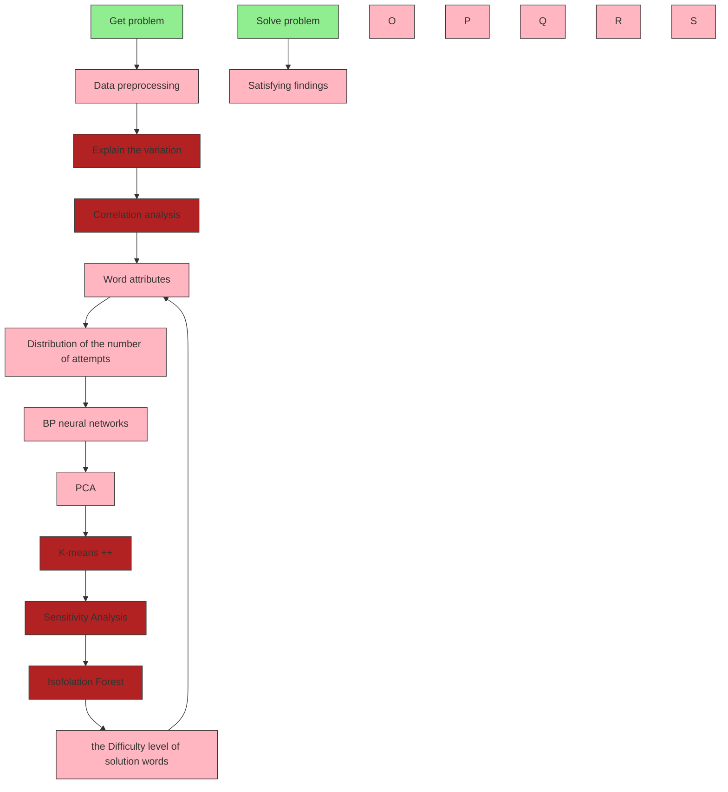
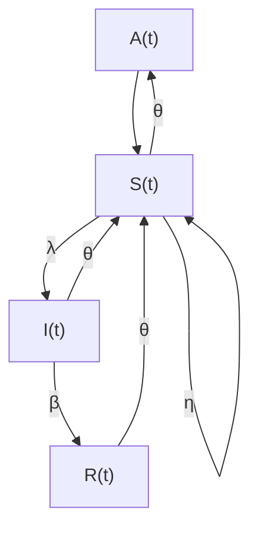
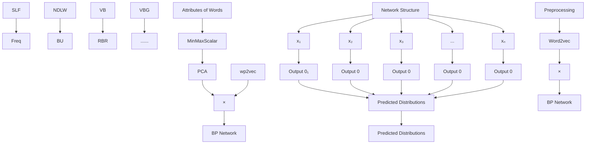

# Crack the Wordle Puzzle:

# Word Attribute Analysis Approaches

## Summary

In the past 600 days, a five-letter puzzle game called ”Wordle” has been launching a blast of upsurge on Twitter. Wordle players’ scores reports are crucial for managers as they provide valuable information for evaluating game difficulty, predicting player numbers and making timely adjustments. To better analyze the reports and provide game improvement suggestions, we conduct in-depth and close studies on this topic from multiple perspectives and levels.

Firstly, to explain the changes in the number of Wordle reports and make predictions, we use an analogy between playing Wordle and the spread of infectious diseases. We compare playing Wordle with infection, players with infected individuals, individuals who have not played Wordle for a long time with susceptible individuals, individuals who have become tired of the game with recovered individuals, sharing on Twitter with transmission, and quitting the game with recovery. Based on these assumptions, we use the SIRS model to fit the curve and explain the overall trend. We also use the Prophet model to insert breakpoints to explain data oscillations and provide a prediction interval for future data. Model evaluation results show that our model has high interpretability and accuracy.

Next, we extract various word attributes from a word database containing a large amount of corpus information and use multiple linear regression to investigate whether there is a relationship between word attributes and Hard-Mode scores. We then test the significance of the model based on the F-statistic. The result shows no significant correlation between these two factors.

Besides, we construct a BP neural network model based on the previously extracted word attributes to predict the distribution of the number of word guesses. The evaluation results show that the model has high prediction accuracy and efficiency, laying a solid foundation for next step analysis.

Furthermore, we use K-means++ clustering algorithm to divide words into three categories: easy, medium, and hard. We analyze the relationship between word attributes and difficulty to classify solution words by difficulty. We find that the difficulty of a word is closely related to the number of different letters in the word, the sum of letter frequencies, and the breadth of usage of the word in different fields, but there is no significant evidence of a correlation between difficulty and word frequency. Combined with the previous BP neural network model, we can accurately classify words.

In addition, we find that common words such as ”mummy” and ”watch” have a higher guessing difficulty, and there is also a certain correlation between the first letter of a word and its guessing difficulty.

Finally, we present predictive data and improvement suggestions to the editors of The New York Times to assist in improving Wordle and boosting the appealing feature of the game.

Keywords: Prophet; SIRS; Multiple Linear Regression; BP Neural Network; K-Means++

## Contents

## 1 Introduction 3

1.1 Background . . 3  
1.2 Restatement of the Problem . . 3

## 2 Assumptions and Notations 4

2.1 Assumptions 4  
2.2 Notations 4

## 3 Model 1-Integration of Interpretation and Prediction Model based on Prophet and SIRS 5

3.1 Data Preprocessing and Exploratory Analysis 5

3.1.1 Data Collection and Pre-processing 5  
3.1.2 Data Description and Exploratory Analysis . . 5

3.2 Prophet Model 6  
3.3 Explanation of the Changes in the Number of Reports . . 9  
3.4 Extracting the Attributes of Words 10  
3.5 Impact of Word Attributes on the Proportion of Hard-Mode Reports . . 12

3.5.1 Model Establishment . 12  
3.5.2 Significance Test of Regression Equation 12

## 4 Model 2-Distribution Prediction Model based on BP Neural Network 13

4.1 Model Building of BP . 13  
4.2 Model Uncertainty of BP . 14  
4.3 Model Evaluation of BP 14  
4.4 Model Prediction of BP . 14

## 5 Model 3-Difficulty Classification based on K-Means++ 14

5.1 Clustering Analysis based on K-Means++. . 14  
5.2 Relationship between Word Attributes and Difficulty Levels . . . 15

5.2.1 Relationship Between Difficulty Levels and NDLW . 15  
5.2.2 Relationship between Difficulty Levels and SLF . 17  
5.2.3 Relationship between Difficulty Levels and BU and Freq . . . . 17

5.3 PCA Discussion on the Accuracy of Model Classification . . 18  
5.4 Determining the Difficulty Level of ”EERIE” 19

## 6 Interesting Surprise 20

6.1 Are These Words Really that Difficult? . 20  
6.2 Which Initial Letter Poses the Greatest Challenge for Solution Words? . . . . . 20  
6.3 What Words Can Make Wordle Continue to be Popular? 21

## 7 Sensitivety Analysis 22

## 8 Model Assessment 23

8.1 Strengths 23  
8.2 Weaknesses 23

## References 23

## Letter 24

## Appendices 25

## Appendix A Regression Equation 25

## 1 Introduction

## 1.1 Background

Recently, Twitter has sparked a trend of sharing the Wordle report. Puzzle game developers in the past were often not very clear about the difficulty of their games for the public. Games that are too difficult can be frustrating, while too easy can be boring. With the development of information technology, using big data analysis to control the difficulty of puzzles has become the key to making puzzles more interesting. The New York Times’ Wordle game has collected statistics on the number of tries by players and the number of reports on Twitter. This data can be used to evaluate the number of players and the difficulty of a particular word, maintain players’ enthusiasm, and make the game more attractive.

## 1.2 Restatement of the Problem

The New York Times collected 359 days of Wordle player score reports, including report time, number, percentage of difficult mode reports, and number of attempts. To control for gameplay and estimate the number of players, it is necessary to analyze the trend of report numbers, mine information contained in word attributes, and measure the difficulty of words. To achieve these goals, we need to:

Analyze the reasons for the changes in the number of reports on a large time scale (overall trend) and small time scale (data mutation).  
Collect and mine potential word attributes.  
Analyze whether the percentage of difficult mode reports is related to word attributes.  
Analyze the distribution of attempts and its potential relationship with word attributes.  
Identify the influence of word attributes on difficulty.  
Mine other information that could help improve Wordle.

flowchart

Figure 1: the Flow Chart in this Paper

## 2 Assumptions and Notations

## 2.1 Assumptions

To simplify the model, we have made several assumptions. However, we may need to relax some of these assumptions to optimize the model and increase its applicability in complex realworld environments.

The number of Twitter users is essentially constant, and the probability of each user receiving information related to Wordle is equal.  
All Wordle players are Twitter users, and all Twitter users are potential Wordle players.  
The word for each day in Wordle is completely random and chosen from all five-letter words.  
Players who report their game results on Twitter are a random sample of all players.  
People may get tired of playing Wordle, but they may eventually want to play again after a long time.

## 2.2 Notations

Table 1: 18 Part-of-Speech Symbols

<table><tr><td>Symbols</td><td>Definition</td></tr><tr><td>NN</td><td>Noun, singular or mass</td></tr><tr><td>JJ</td><td>Adjective</td></tr><tr><td>RB</td><td>Adverb</td></tr><tr><td>VBP</td><td>Verb, non-3rd person singular present</td></tr><tr><td>VBD</td><td>Verb, past tense</td></tr><tr><td>NNS</td><td>Noun, plural</td></tr><tr><td>VBN</td><td>Verb, past participle</td></tr><tr><td>VB</td><td>Verb, base form</td></tr><tr><td>IN</td><td>Preposition or subordinating conjunction</td></tr><tr><td>VBZ</td><td>Verb, 3rd person singular present</td></tr><tr><td>VBG</td><td>Verb, gerund or present participle</td></tr><tr><td>MD</td><td>Modal</td></tr><tr><td>PRP</td><td>Possessive pronoun</td></tr><tr><td>RBR</td><td>Adverb, comparative</td></tr><tr><td>CC</td><td>Coordinating conjunction</td></tr><tr><td>JJR</td><td>Adjective, comparative</td></tr><tr><td>DT</td><td>Determiner</td></tr><tr><td>JJS</td><td>Adjective, superlative</td></tr></table>

Table 2: Notations of Word Attributes Used in the Paper

<table><tr><td>Symbols</td><td>Definition</td></tr><tr><td>Freq</td><td>Word Frequency</td></tr><tr><td>SLF</td><td>the Sum of Letter Frequencies</td></tr><tr><td>BU</td><td>the Breadth of Usage of a Word</td></tr><tr><td>NDLW</td><td>the Number of Different Letters in a Word</td></tr><tr><td>a-z</td><td>the Number of Letters from a to z in a Word</td></tr></table>

## 3 Model 1-Integration of Interpretation and Prediction Model based on Prophet and SIRS

## 3.1 Data Preprocessing and Exploratory Analysis

## 3.1.1 Data Collection and Pre-processing

In addressing task 1, it is dispensable to analyze the attributes of words related to the prob lem and collect relevant data.The possible factors include the frequency, the breadth of the usage in different fields, the number of different letters in words and parts of speech. In general Natural Language Processing (NLP), there are 36 commonly used parts of speech[2], of which we selected 18 types relevant to this task as shown in Table 1.

To process missing values, abnormal values and repeated observations in the original data set, we apply a series of data processing methods: data cleaning, establishment of dummy variables for discrete variables, logarithmic transformation of the number of reports and set-up of new attributes. The four steps enable the elimination of extraneous information and facilitate the identification and extraction of relevant information from the dataset.

Step 1: In the stage of data cleaning, we use Python to check for missing, outlier and duplicate values. By measuring length of words, we check for empty or unusually long values. We find that there are no empty values but three outliers: ”tash”, ”clen” and ”rprobe”. After searching and comparing online, we correct those words as ”trash”, ”clean” and ”probe”. Furthermore, using the ”duplicate()” method, we check for duplicate values with no duplicate value found.

Step 2: To make the discrete variable of part-of-speech easier to be processed by the model, we construct 17 dummy variables to convert the discrete variable into binary variables.

Step 3: We plan to use a time series model to predict the number of reports on March 1, 2023. In these types of models, it is crucial to eliminate heteroscedasticity in the data. Taking the logarithm of the data does not change its nature or correlation, but it compresses the scale of the variable. By shrinking the absolute values of the data, it is easier to eliminate the problem of heteroscedasticity. Therefore, we logarithmically transform the reported quantity.

Step 4: To comprehensively explore the influence of various word attributes on reported Hard-Mode-played scores, we further extract the attributes of words and establish several new variables. This will be elaborated in Section 3.4.

## 3.1.2 Data Description and Exploratory Analysis

The data is visualized to dig into the inherent rules, which is helpful for modeling. Figure

2 depicts the correlation between the variables, while Figure 3 presents the distribution of the number of attempts in a histogram. Figure 4 displays the changing curve of the total number of reports and the proportion of reports in difficult mode over time.

heatmap

| | Number (Total) | Number (Hard) | 1 try | 2 tries | 3 tries | 4 tries | 5 tries | 6 tries | 7+ tries (X) |
|---|---|---|---|---|---|---|---|---|---|
| Number (Total) | 0.95 | 0.85 | 0.35 | 0.30 | 0.25 | 0.20 | 0.15 | 0.10 | 0.05 |
| Number (Hard) | 0.90 | 0.80 | 0.30 | 0.25 | 0.20 | 0.15 | 0.10 | 0.05 | 0.00 |
| 1 try | 0.75 | 0.65 | 0.60 | 0.55 | 0.50 | 0.45 | 0.40 | 0.35 | -0.15 |
| 2 tries | 0.65 | 0.55 | 0.50 | 0.45 | 0.40 | 0.35 | 0.30 | 0.25 | -0.25 |
| 3 tries | 0.60 | 0.50 | 0.45 | 0.40 | 0.35 | 0.30 | 0.25 | 0.20 | -0.35 |
| 4 tries | 0.55 | 0.45 | 0.40 | 0.35 | 0.30 | 0.25 | 0.20 | 0.15 | -0.45 |
| 5 tries | 0.50 | 0.45 | 0.40 | 0.35 | 0.30 | 0.25 | 0.20 | 0.15 | -0.55 |
| 6 tries | 0.45 | 0.40 | 0.35 | 0.30 | 0.25 | 0.20 | 0.15 | 0.10 | -0.65 |
| 7+ tries (X) | 0.40 | 0.35 | 0.30 | 0.25 | 0.20 | 0.15 | 0.10 | 0.05 | -0.75 |

Figure 2: Correlation Matrix

bar chart

| Category | Value |
|---|---|
| 0 | 220 |
| 1 | 125 |
| 2 | 10 |
| 3 | 2 |
| 4 | 1 |
| 5 | 1 |
| 6 | 1 |

  
Figure 3: Distribution Histogram

We can see that the correlation between variables is generally weak, and the distribution of the number of attempts shows a state of low at both ends and high in the middle. The trend of the quantity curve is somewhat similar to the infection curve, which will be analyzed in detail in the following steps.

## 3.2 Prophet Model

The Prophet algorithm provided by Facebook[3] can not only handle time series data with some outliers but also deal with partially missing values. It can almost automatically predict the future trends of time series. Based on time series decomposition and machine learning fitting, it uses the open-source tool pyStan to fit the model, so it can obtain the predicted results quickly.

After performing a logarithmic transformation on the data(elaborated in Section 3.1.1), we use Prophet to establish a multiplication model with the parameters listed in Table 3, where τ is a parameter that controls the slope of the linear function at the breakpoint.For the rate of change at a changepoint, denoted as $\Delta .$ , it follows that $\Delta \sim L a p l a c e ( 0 , \tau )$ . As τ decreases, $\Delta$ approaches $0 .$ Therefore, increasing $\tau$ will broaden the upper and lower limits of the predicted values. The trend term uses the default piecewise linear function. Setting more changepoints and increasing the range of breakpoints makes the model more sensitive to changes in time series data, which improves the fitting effect.

line chart

| Date     | Number of reported results | Number in hard mode |
| -------- | -------------------------- | -------------------- |
| 2022-01  | ~80000                     | ~2000                |
| 2022-02  | ~300000                    | ~15000               |
| 2022-03  | ~250000                    | ~10000               |
| 2022-04  | ~150000                    | ~8000                |
| 2022-05  | ~100000                    | ~6000                |
| 2022-06  | ~80000                     | ~5000                |
| 2022-07  | ~60000                     | ~4500                |
| 2022-08  | ~50000                     | ~4000                |
| 2022-09  | ~45000                     | ~3500                |
| 2022-10  | ~40000                     | ~3000                |
| 2022-11  | ~35000                     | ~2500                |
| 2022-12  | ~30000                     | ~2000                |
| 2023-01  | ~25000                     | ~1500                |

Figure 4: Quantity Curve

Table 3: Prophet Model Parameter Setting

<table><tr><td>the Number of Changepoints</td><td colspan="2">60</td></tr><tr><td>τ</td><td colspan="2">0.8</td></tr><tr><td>the Range of Changepoints</td><td colspan="2">0.9</td></tr><tr><td rowspan="5">Holidays</td><td>Valentine</td><td>2022/02/14</td></tr><tr><td>Easter</td><td>2022/04/24</td></tr><tr><td>Halloween</td><td>2022/10/31</td></tr><tr><td>Thanksgiving</td><td>2022/11/24</td></tr><tr><td>Christmas</td><td>2022/12/25</td></tr></table>

A Prophet model typically consists of a trend term $g ( t )$ , a seasonal term $s ( t )$ , a holiday effect term $h ( t )$ and an residual term $\varepsilon ( t ) . \ g ( t )$ is a piecewise linear function that satisfies:

$$
g (t) = (k + a (t) \Delta) t + (m + a (t) ^ {\intercal} \gamma) \tag {1}
$$

where $k$ represents the growth rate, $\Delta$ represents the change in growth rate, and m represents the offset parameter. $s ( t )$ contains the weekly periodic changes:

$$
s (t) = \sum_ {n = 1} ^ {N} \left(a _ {n} \cos \left(\frac {2 \pi n t}{P}\right) + b _ {n} \sin \left(\frac {2 \pi n t}{P}\right)\right) \tag {2}
$$

where $P$ is the period time, and $( a _ { n } , b _ { n } ) , ( n = 1 \ldots N )$ follow a normal distribution. $h ( t )$ illustrates the potential impact of holidays on the outcome:

$$
h (t) = \sum_ {i = 1} ^ {L} k _ {i} * l _ {\{t \in D _ {i} \}} \tag {3}
$$

where $k _ { i } , i = 1$ . . . L follow a normal distribution. Based on the parameters and functions above, a multiplicative model is established:

$$
y (t) = g (t) * s (t) * h (t) * \varepsilon (t) \tag {4}
$$

We use the data from 2022-01-07 to 2022-11-21 as the training set and the data from 2022- 11-21 to 2022-12-31 as the test set. The fitting result is shown in Figure 5, where the red vertical line represents the breakpoint we set.

line chart

| ds       | predicted_number | predicted_number_lower | predicted_number_upper |
| -------- | ---------------- | ---------------------- | ---------------------- |
| 2022-01  | 11.3             | 11.4                   | 11.5                   |
| 2022-02  | 12.6             | 12.5                   | 12.7                   |
| 2022-03  | 12.4             | 12.3                   | 12.5                   |
| 2022-04  | 11.9             | 11.8                   | 12.0                   |
| 2022-05  | 11.5             | 11.4                   | 11.6                   |
| 2022-06  | 11.0             | 10.9                   | 11.1                   |
| 2022-07  | 10.7             | 10.6                   | 10.8                   |
| 2022-08  | 10.5             | 10.4                   | 10.6                   |
| 2022-09  | 10.3             | 10.2                   | 10.4                   |
| 2022-10  | 10.2             | 10.1                   | 10.3                   |
| 2022-11  | 10.1             | 10.0                   | 10.2                   |
| 2023-01  | 10.0             | 9.5                    | 10.8                   |

Figure 5: Prophet Forecasting

We evaluate the effectiveness of the model using four metrics: R-squared, MSE, RMSE, and MAPE, which are as follows:

$$
\begin{array}{l} M S E = \frac {1}{n} \sum_ {i = 1} ^ {n} \left(y _ {i} - \widehat {y} _ {i}\right) ^ {2} \\ R M S E = \sqrt {\frac {1}{n} \sum_ {i = 1} ^ {n} \left(y _ {i} - \widehat {y} _ {i}\right) ^ {2}} \tag {5} \\ \end{array}
$$

$$
R ^ {2} = 1 - \frac {\sum_ {i = 1} ^ {n} (y _ {i} - \widehat {y} _ {i}) ^ {2}}{\sum_ {i = 1} ^ {n} (y _ {i} - \bar {y}) ^ {2}}
$$

$$
M A P E = \frac {100\%}{n} \sum_ {i = 1} ^ {n} \left| \frac {\widehat {y _ {i}} - y _ {i}}{y _ {i}} \right|
$$

where $\hat { y } _ { i }$ represents the fitted value and $y _ { i }$ represents the actual value.The results are shown in Table 4. The R-squared value is close to 1, indicating an excellent fit of the model. As our final results are obtained by taking the exponential of the log-transformed data, the small RMSE and MSE can be considered. The MAPE of 4.8% indicates a small average absolute percentage error. Overall, the established model is suitable for prediction.

Based on the data above, we reduce $\tau$ to increase the precision of the prediction interval. We then reestablish the model and predict that the number of reported results on March 1, 2023 is 14534, with a prediction interval of (13175, 16128)(95% confidence level). These prediction results indicate that the popularity of Wordle is decreasing over time.

Table 4: Evaluation of the Prophet

<table><tr><td>R-squared</td><td>MSE</td><td>RMSE</td><td>MAPE</td></tr><tr><td>0.9924</td><td>60340502</td><td>7767.9149</td><td>4.8002</td></tr></table>

## 3.3 Explanation of the Changes in the Number of Reports

The changes in the number of reports can be decomposed into trend, seasonal, and holiday components as shown in Figure 6. We will explain the changes in report numbers from these three aspects.

line chart

| ds       | trend |
| -------- | ----- |
| 2022-01  | 11.3  |
| 2022-02  | 12.6  |
| 2022-03  | 12.4  |
| 2022-04  | 11.9  |
| 2022-05  | 11.4  |
| 2022-06  | 11.0  |
| 2022-07  | 10.7  |
| 2022-08  | 10.5  |
| 2022-09  | 10.4  |
| 2022-10  | 10.3  |
| 2022-11  | 10.2  |
| 2023-01  | 10.0  |

line chart

| ds       | holidays |
| -------- | -------- |
| 2022-01  | 0.00     |
| 2022-03  | -0.10    |
| 2022-05  | -0.08    |
| 2022-11  | -0.05    |
| 2023-01  | 0.00     |

line chart

| Day of week | weekly |
| ----------- | ------ |
| Sunday      | -0.03  |
| Monday      | -0.01  |
| Tuesday     | 0.01   |
| Wednesday   | 0.028  |
| Thursday    | 0.006  |
| Friday      | 0.017  |
| Saturday    | -0.025 |

Figure 6: Time Series Decomposition Plot

## Seasonal and Holiday Effects:

Holidays cause a decrease in the number of reports, such as a slight dip in the number of reports around Valentine’s Day as seen in the linear trend chart. In the weekly effect, the number of reports increases from Sunday to Wednesday and decreases from Wednesday to Saturday (with a rebound on Friday). This suggests that people tend to play Wordle as a pastime on workdays, and have less interest on holidays.

## Explanation of Overall Variation:

The SIRS infectious disease model can explain changes in the trend component well. Our assumptions are as follows:

Assumption 1: All Twitter users $A ( t )$ can be divided into three groups:

(1) Ordinary Twitter users $S ( t )$ . They may be influenced by seeing some Wordle player’s score reports on Twitter and may be motivated to become Wordle players. They correspond to ”susceptible individuals”;  
(2) Wordle players I(t). Some players will post reports on Twitter, which will attract others to become Wordle players. They correspond to ”infected individuals”;  
(3) Tired players $R ( t )$ . They will not play Wordle for a period of time, but may start playing again after this time. They correspond to ”recovered individuals”.

Assumption 2: Ordinary players S may have a probability of λ of being infected; in players I, they have a probability of β of getting tired of playing Wordle and not playing for a period of time; in tired players R, there is a probability of η of being influenced by external factors and starting to play Wordle again. Ordinary players S, players I, and tired players R may all have a probability of natural removal of a certain θ.

flowchart

Figure 7: Player State Transitions

Based on the above assumptions, after setting the parameters, the number of players can be fitted by solving the differential equations, and then multiplied by a certain proportion to calculate the number of score reports on Twitter. The corresponding fitting curve of the report quantity is shown in Figure 8, which conforms to the trend curve of Prophet. Therefore, the SIRS model can be used to explain the overall trend of the change. Wordle became popular from January 2022, and the number of players reached its peak around February (the number of reports also reached its peak). After that, the game gradually cooled down, the number of players decreased, and the number of reports also decreased.

## 3.4 Extracting the Attributes of Words

To investigate the impact of the attributes of words on the proportion of reports of challenging patterns, we first need to extract various useful properties of words.

## 1. the Number of Different Letters in a Word(NDLW)

In general, the fewer different letters a word has, the lower the probability of guessing a letter in the trial, and the more difficult the puzzle becomes. We count the distribution of words with different numbers of letters and the average proportion of people who made 5+ tries, and the results are shown in Table 5. As can be seen from the table, the fewer different letters a word has, the higher the proportion of people who made 5+ tries, indicating that the puzzle is more difficult. Therefore, the number of different letters in a word is an important attribute of the word.

scatterplot

| Time (days) | Actual data | SIRS model |
| ----------- | ----------- | ---------- |
| 200         | 80000       | 80000      |
| 210         | 150000      | 150000     |
| 220         | 250000      | 250000     |
| 230         | 350000      | 350000     |
| 240         | 320000      | 320000     |
| 250         | 280000      | 280000     |
| 260         | 250000      | 250000     |
| 270         | 220000      | 220000     |
| 280         | 200000      | 200000     |
| 290         | 180000      | 180000     |
| 300         | 160000      | 160000     |
| 310         | 140000      | 140000     |
| 320         | 120000      | 120000     |
| 330         | 110000      | 110000     |
| 340         | 100000      | 100000     |
| 350         | 90000       | 90000      |
| 360         | 85000       | 85000      |
| 370         | 80000       | 80000      |
| 380         | 75000       | 75000      |
| 390         | 70000       | 70000      |
| 400         | 65000       | 65000      |
| 410         | 60000       | 60000      |
| 420         | 55000       | 55000      |
| 430         | 52500       | 52500      |
| 440         | 51250       | 51250      |
| 450         | 5125        | 5125       |
| 460         | 5125        | 5125       |
| 470         | 5125        | 5125       |
| 480         | 5125        | 5125       |
| 490         | 5125        | 5125       |
| 500         | 5125        | 5125       |
| 510         | 5125        | 5125       |
| 520         | 5125        | 5125       |
| 530         | 5125        | 5125       |
| 540         | 5125        | 5125       |
| 550         | 5125        | 5125       |

Figure 8: Fitted Curve of the SIRS

Table 5: Varieties of Letters in Words and Proportion of 5+ Tries

<table><tr><td>Different Letters</td><td>Number of Words</td><td>Proportion of 5+ Tries</td></tr><tr><td>3</td><td>6</td><td>62.50%</td></tr><tr><td>4</td><td>94</td><td>45.10%</td></tr><tr><td>5</td><td>259</td><td>34.90%</td></tr></table>

## 2. the Frequency of Word Usage in Daily Life(Freq)

In general, the more frequently a word is used in daily life, the more familiar people are with it, and vice versa. The more unfamiliar a word in a puzzle is, the more difficult the puzzle becomes. Therefore, the frequency of word usage in daily life is also an essential attribute. We use the word frequency data from Wolfram[4], which is calculated from the Google Books dataset.

## 3. the Breadth of Word Usage in Different Fields(BU)

The more widespread the usage of a word, the more people are familiar with it, and vice versa. The less familiar people are with the words in a puzzle, the more difficult the puzzle becomes. The prevalence of a word is defined as the number of corpora in which the word appears among 100 corpora (data from ”Word Frequencies in Written and Spoken English”).

## 4. the Sum of Letter Usage Frequency(SLF)

When playing the Wordle game, players usually try words that contain more common letters to gain more information. Therefore, whether the letters in a word are common or not is also an important attribute to measure the difficulty of a word. We define the $S L F$ to describe this attribute of a word:

$$
S L F = \sum_ {i = 1} ^ {5} f r e q u e n c y _ {i} \tag {6}
$$

where frequency represents the frequency of the $i ^ { t h }$ letter in the word. The letterfrequency data is obtained from the website Algoritmy[1].

## 5. the Sum of a Letter in a Word

The sum of a letter in a word is also an attribute of the word, as the puzzles consist of five letters that can be the same or different.

## 6. Part-of-Speech of a Word

The part-of-speech of a word is one of the most common attributes of a word.

## 3.5 Impact of Word Attributes on the Proportion of Hard-Mode Reports

The proportion of reports in the hard mode is defined as follows:

$$
\text { percentage } _ {\text { hard }} = \frac {\text { number } _ {\text { hard }}}{\text { number } _ {\text { reported }}} \tag {7}
$$

We establish a multiple linear regression model based on the least squares method and use the significance test of the regression equation (i.e., F-test) to study whether word attributes have an impact on the proportion of Hard-Mode reports.

## 3.5.1 Model Establishment

Multiple linear regression describes the relationship of the dependent variable y with independent variables $x _ { 1 } , x _ { 2 } , \ldots , x _ { m }$ by the following equation:

$$
\hat {y} = \beta_ {0} + \beta_ {1} x _ {1} + \beta_ {2} x _ {2} + \dots + \beta_ {m} x _ {m} + \varepsilon \tag {8}
$$

where $\beta _ { 0 }$ is the constant term, $\beta _ { k }$ is the regression coefficient of the kth independent variable, and ε is the random error term.We perform a multiple linear regression with $F r e q , S L F$ , $N D L W , B U$ , the Sum of a Letter in a Word, Part-of-Speech of a Word as independent variables, and $p e r c e n t a g e _ { h a r d }$ as the dependent variable. Due to the length of the obtained regression equation, it is included in Appendix A.

## 3.5.2 Significance Test of Regression Equation

## 1. Hypothesis Formulation:

Null hypothesis: $H _ { 0 } : \beta _ { 0 } = \beta _ { 1 } = \cdot \cdot \cdot \beta _ { m } = 0 ;$

Alternative hypothesis: $H _ { 1 } : \beta _ { 0 } , \beta _ { 1 } , \cdot \cdot \cdot , \beta _ { m }$ are not all equal to 0.

## 2. Calculate F-statistic:

$$
F = \frac {S S R / m}{S S E / (n - m - 1)} \sim F (m, n - m - 1) \tag {9}
$$

where $\begin{array} { r } { S S R = \sum _ { i = 1 } ^ { n } ( \hat { y } i - \bar { y } ) ^ { 2 } } \end{array}$ represents the regression sum of squares, and $S S E =$ $\sum i = 1 ^ { n } ( y _ { i } - { \hat { y } } _ { i } ) ^ { 2 }$ represents the residual sum of squares.

3. Making Decisions The rejection region of the test is $F > F _ { \alpha } ( m , n - m - 1 )$ , based on the given significance level of $\alpha = 0 . 0 5$ . We establish a multiple linear regression model with word attributes as independent variables and the proportion of reports in hard mode as the dependent variable.

The F-statistic of the regression equation is 1.058 with a corresponding P-value of $\mathbf { 0 . 3 7 9 } \left( > \alpha = 0 . 0 5 \right)$ , indicating that the regression equation does not exhibit statistical significance. Therefore, we conclude that word attributes do not have a significant impact on the proportion of reports in hard mode.

## 4 Model 2-Distribution Prediction Model based on BP Neural Network

## 4.1 Model Building of BP

We first preprocess the data by combining pretraining with Global Vectors model (GloVe) and dimensionality reduction with PCA.Word embedding is a technique that maps words to real-valued vectors and is a fundamental application in natural language processing. GloVe model is one of the word embedding models, which adopts squared loss and fits the word vectors to the global statistical information calculated based on the entire dataset. We use pre-trained word vectors from the GloVe model as features.

flowchart

Figure 9: Implementation Process

In addressing task 2, we use the word properties obtained from the first sub-question as part of the features, normalize them, and extract the principal components using PCA. We combine the extracted principal components with the word vectors pre-trained using the GloVe model and use them as the input features for the BP neural network. In the BP neural network, we input the word features and use the percentage distribution of each word as the label. We select 80% of the data as the training set and 20% as the test set to train the neural network and test its performance. Since the amount of data given is small, we choose to establish a low-complexity network, which includes an input layer, a single hidden layer, and an output layer. The hidden layer contains 1024 hidden units, and the ReLU function is used as the activation function. Dropout is applied during training to drop 50% of the network units to counter overfitting. The L2-norm is selected as the loss function, the Adam optimizer is used for gradient optimization during backpropagation, and the learning rate is set to 0.05. Xavier random initialization is used.

## 4.2 Model Uncertainty of BP

Neural networks have considerable randomness, and the initialization parameters in the Xavier method of the neural network are sampled from a uniform distribution. Additionally, dropout randomly drops neurons in the hidden layer. This means that the training results of the neural network may vary each time. To address this issue, we try to train the model multiple times and select the best model.

The model output may be negative, and to address this issue, we choose to adjust the negative values to 0.

Since the output values cannot be directly used as percentages, as their sum may exceed or be less than 100, we divide each output by the total sum to obtain the final predicted percentages.

## 4.3 Model Evaluation of BP

The evaluation results on the test set are as follows:

Table 6: Evaluation on Test Set

<table><tr><td>MAE</td><td>MSE</td><td>MAPE</td></tr><tr><td>3.2302</td><td>21.857</td><td>32.9194</td></tr></table>

On the test set, the mean absolute error (MAE) of the neural network is around 4, indicating that the average absolute difference between predicted values and true values is 4, which indicates a high accuracy of the model. Other metrics also support this conclusion.

## 4.4 Model Prediction of BP

We predict the distribution of people trying different times and the result is as follows. We are confident that the error is within 3%.

## 5 Model 3-Difficulty Classification based on K-Means++

## 5.1 Clustering Analysis based on K-Means++.

The K-Means algorithm is an unsupervised learning method and a clustering algorithm based on partitioning. It usually uses Euclidean distance as the metric to measure the similarity between data objects, and the similarity is inversely proportional to the distance between data objects. The larger the similarity, the smaller the distance. The algorithm requires a predetermined initial number of clusters k and k initial cluster centers. Based on the similarity between the data object and the cluster center, the algorithm continuously updates the position of the cluster center and reduces the sum of squared errors (SSE) of the clusters. When SSE no longer changes or the objective function converges, the clustering ends, and the final result is obtained.

<table><tr><td>Try Times</td><td>Percentage(%)</td></tr><tr><td>1</td><td>0</td></tr><tr><td>2</td><td>6</td></tr><tr><td>3</td><td>18</td></tr><tr><td>4</td><td>29</td></tr><tr><td>5</td><td>27</td></tr><tr><td>6</td><td>15</td></tr><tr><td>7+</td><td>5</td></tr></table>

Table 7: Predicted Result of ”EERIE”

pie chart

| Category | Value |
|---|---|
| 1 try | 4 |
| 2 tries | 6 |
| 3 tries | 22 |
| 4 tries | 32 |
| 5 tries | 23 |
| 6 tries | 12 |
| 7+ tries | 4 |

Figure 10: Predicted Result of ”EERIE”

The categories ”1 try”, ”2 tries”, up to ”7+ tries” well reflect the difficulty of the puzzles. We use these variables as inputs and employ the K-Means++ algorithm to classify the difficulty of the words. The specific process is as follows:

Step 1:Determine the number of clusters k and initialize k cluster centers.

Step 2:Calculate the Euclidean distance between the data points and the k initial cluster centers, and cluster partition based on the minimum distance, resulting in k regions.

Step 3:Calculate the center position of each cluster obtained in the previous step and use it as the next iteration’s cluster center.

Step 4:Repeat the above steps until the change between the last two clustering results meets the accuracy requirements.

The elbow rule chart in Figure 11 is used along with our experience in differentiating game difficulty to determine the number of clusters. We choose the number of clusters to be k=3, representing three levels of difficulty: hard, medium, and easy.

Finally, we obtain the clustering results, which show that cluster 1 contains 135 words, cluster 2 contains 156 words, and cluster 3 contains 68 words. The statistical results of the mean and standard deviation of each property in the clusters are shown in Table 8. By calculating the average proportion of tries with 5+ tries in each cluster, we obtain Table 9. By observing Table 8 and Table 9, we categorize the words in Cluster 1, Cluster 2, and Cluster 3 as easy, medium, and hard, respectively.

## 5.2 Relationship between Word Attributes and Difficulty Levels

## 5.2.1 Relationship Between Difficulty Levels and NDLW

The distribution of word difficulty levels for words with different NDLW is shown in Figure 12, and the proportion of NDLW of different difficulty levels is shown in Table 10. We found that the proportion of words with fewer different letters increases with increasing difficulty level. In the dataset provided for this study, there are six words that have only three different letters.

line chart

| Number of clusters (n) | SSE |
|---|---|
| 1 | 70000 |
| 2 | 37000 |
| 3 | 26000 |
| 4 | 20500 |
| 5 | 17000 |
| 6 | 15000 |
| 7 | 13000 |
| 8 | 12000 |
| 9 | 11000 |

Figure 11: K-value Optimization

Table 8: Results and Significance Tests of K-means Clusters for Different Categories

<table><tr><td rowspan="2"></td><td colspan="5">Cluster Categories (means ± sd)</td></tr><tr><td>1 (n=135)</td><td>2 (n=156)</td><td>3 (n=68)</td><td>F-value</td><td>P-value</td></tr><tr><td>1 try</td><td>0.8 ± 1.057</td><td>0.269 ± 0.459</td><td>0.279 ± 0.452</td><td>21.307</td><td>0.000***</td></tr><tr><td>2 tries</td><td>9.459 ± 4.168</td><td>4.013 ± 1.749</td><td>2.868 ± 1.962</td><td>168.146</td><td>0.000***</td></tr><tr><td>3 tries</td><td>30.748 ± 3.81</td><td>20.212 ± 3.516</td><td>12.574 ± 4.108</td><td>594.862</td><td>0.000***</td></tr><tr><td>4 tries</td><td>33.637 ± 3.824</td><td>35.487 ± 3.819</td><td>25.647 ± 4.485</td><td>150.08</td><td>0.000***</td></tr><tr><td>5 tries</td><td>17.807 ± 3.159</td><td>26.436 ± 3.115</td><td>28.794 ± 5.732</td><td>268.933</td><td>0.000***</td></tr><tr><td>6 tries</td><td>6.43 ± 2.261</td><td>11.596 ± 3.05</td><td>21.662 ± 4.188</td><td>565.646</td><td>0.000***</td></tr><tr><td>7+ tries (X)</td><td>1.081 ± 0.931</td><td>1.974 ± 1.169</td><td>8.132 ± 7.035</td><td>119.123</td><td>0.000***</td></tr></table>

Table 9: Average Proportion of 5+ tries for Different Categories

<table><tr><td>Cluster categories</td><td>Average Proportion of 5+ tries</td></tr><tr><td>Cluster 1</td><td>25.35%</td></tr><tr><td>Cluster 2</td><td>39.92%</td></tr><tr><td>Cluster 3</td><td>58.59%</td></tr></table>

Table 10: Proportion of NDLW Across Difficulty Levels

<table><tr><td rowspan="2">Cluster Categories</td><td colspan="3">Proportion of NDLW</td></tr><tr><td>5</td><td>4</td><td>3</td></tr><tr><td>Easy</td><td>90.78%</td><td>9.22%</td><td>0%</td></tr><tr><td>Medium</td><td>63.13%</td><td>35.63%</td><td>1.24%</td></tr><tr><td>Hard</td><td>52.94%</td><td>41.18%</td><td>5.88%</td></tr></table>

stacked bar chart

| Number of different letters | 3-Hard | 2-Medium | 1-Easy |
|---|---|---|---|
| 3.0 | 5 | 0 | 0 |
| 4.0 | 25 | 60 | 15 |
| 5.0 | 35 | 95 | 110 |

Figure 12: Relationship between Difficulty Levels and NDLW

Two of them are classified as medium difficulty, namely ”motto” and ”madam”, while the other four are classified as difficult, namely ”fluff”, ”mummy”, ”cacao”, and ”vivid”. Based on the above analysis, we have sufficient evidence to suggest that the fewer different letters a word contains, the more difficult it is to guess.

## 5.2.2 Relationship between Difficulty Levels and SLF

histogram

| Sum of letter frequencies | Easy Count | Medium Count | Hard Count |
|---|---|---|---|
| 0.10-0.15 | 1 | 0 | 2 |
| 0.15-0.20 | 3 | 6 | 1 |
| 0.20-0.25 | 4 | 9 | 4 |
| 0.25-0.30 | 25 | 15 | 8 |
| 0.30-0.35 | 25 | 30 | 13 |
| 0.35-0.40 | 15 | 10 | 4 |
| 0.40-0.45 | 12 | 5 | 7 |
| 0.45-0.50 | 4 | 1 | 1 |

Figure 13: Relationship between Difficulty Levels and NDLW

The distribution of the SLF for words of different difficulty levels is shown in Figure 13 and Table 11. We focus mainly on the part where the SLF is less than 0.2 and greater than 0.4 because it represents the relationship between the difficulty level and the majority of letter frequency sum. It can be observed that as the difficulty level increases, the proportion of whose SLF less than 0.2 will increase, while the proportion of whose SLF greater than 0.4 will decrease. This means that the more commonly used letters in a word, the easier it is to be guessed, and vice versa.

## 5.2.3 Relationship between Difficulty Levels and BU and Freq

Table 12 shows the distribution of word breadth for different levels of difficulty. The breadth of a word is defined as the number of corpora in which the word appears out of a total of 100 corpora, and it takes integer values between 0 and 100. The table indicates that the more widely a word is used in different fields, the easier the corresponding puzzle, and vice versa.

Table 11: Distribution of the SLF Across Difficulty Levels

<table><tr><td rowspan="2">Cluster Categories</td><td colspan="3">Proportion of SLF</td></tr><tr><td>&lt; 0.2</td><td>0.2-0.4</td><td>&gt;0.4</td></tr><tr><td>Easy</td><td>2.84%</td><td>86.52%</td><td>10.64%</td></tr><tr><td>Medium</td><td>10%</td><td>85.63%</td><td>4.37%</td></tr><tr><td>Hard</td><td>13.24%</td><td>85.29%</td><td>1.47%</td></tr></table>

At the same time, we attempt to find a relationship between the difficulty level of a word and its frequency of use in everyday life. Although there is a difference in the mean frequency of different levels of difficulty, the mean value is sensitive to outliers. Therefore, we first sort the words by frequency and then use a histogram to show their distribution, as shown in Figure 14. Ultimately, we find that there is no significant relationship between the difficulty level and the frequency of use in everyday life, as the distribution of word frequencies for different levels of difficulty is fairly uniform.

Table 12: Distribution of BU Across Difficulty Levels

<table><tr><td rowspan="2">Cluster Categories</td><td colspan="3">BU</td></tr><tr><td>0-33.33</td><td>33.33-66.66</td><td>66.66-100</td></tr><tr><td>Easy</td><td>9.93%</td><td>12.77%</td><td>77.30%</td></tr><tr><td>Medium</td><td>19.38%</td><td>21.87%</td><td>58.75%</td></tr><tr><td>Hard</td><td>22.06%</td><td>26.47%</td><td>51.47%</td></tr></table>

stacked bar chart

| Order of word frequency | Cluster categories 1-Easy | Cluster categories 2-Medium | Cluster categories 3-Hard |
| :--- | :--- | :--- | :--- |
| 0-50 | 18 | 14 | 7 |
| 50-100 | 16 | 19 | 7 |
| 100-150 | 18 | 20 | 4 |
| 150-200 | 18 | 19 | 7 |
| 200-250 | 18 | 19 | 8 |
| 250-300 | 18 | 19 | 8 |
| 300-350 | 12 | 19 | 4 |
| 350-400 | 7 | 17 | 7 |

Figure 14: Relationship between Difficulty Levels and Freq

## 5.3 PCA Discussion on the Accuracy of Model Classification

The discussion of model classification accuracy can be divided into two parts. The first part is whether there is a significant difficulty difference among the words in each cluster, and the second part is the effectiveness of K-Means clustering. As mentioned earlier, in the first part, the average proportion of tries with 5+ tries for each cluster’s words is 25.35%, 39.92%, and 58.59%, respectively, which shows a significant difficulty difference among the clusters.

Regarding the second part, we conduct principal component analysis (PCA) on seven features, including ”1 try”, ”2 tries” to ”7+ tries”. We find that the variance explained by the first two principal components reaches 82.88% (> 80%). Therefore, we take the first two principal components to create a scatter plot, as shown in Figure 15. From this scatter plot, it is evident that the words are well differentiated, and the K-Means clustering effect is good.

scatterplot

| Component1 | Component2 | Cluster categories |
| ---------- | ---------- | ------------------ |
| -15        | 10         | 3-Hard             |
| -10        | -5         | 3-Hard             |
| -5         | -10        | 3-Hard             |
| 0          | -15        | 2-Medium           |
| 5          | -20        | 2-Medium           |
| 10         | -10        | 1-Easy             |
| 15         | -5         | 1-Easy             |
| 20         | 0          | 1-Easy             |

Figure 15: PCA on the Accuracy of Model Classification

From the perspective of evaluation metrics, we compared K-Means++ with other clustering methods like the Partitioning Around Medoids(PAM) and the Gaussian Mixture Model(GMM) and the results are shown in Table 13. From the comparison results, it can be seen that K-Means++ has a better clustering effect.

Table 13: Model Evaluation

<table><tr><td>Model</td><td>Silhouette Coefficient</td><td>CH Score</td></tr><tr><td>K-Means++</td><td>0.372</td><td>309.326</td></tr><tr><td>PAM</td><td>0.347</td><td>303.049</td></tr><tr><td>GMM</td><td>0.347</td><td>291.637</td></tr></table>

## 5.4 Determining the Difficulty Level of ”EERIE”

According to the results of the second question, we obtain the distribution of EERIE’s relevant percentages (1, 2, 3, 4, 5, 6, X), which is [0, 6, 18, 29, 27, 15, 5]. By inputting this distribution into our model, we determine that the difficulty level of ”EERIE” is ”medium”.

## 6 Interesting Surprise

## 6.1 Are These Words Really that Difficult?

After categorizing words by their difficulty levels, we find that the difficulty level of the word ”mummy” is ”difficult”. When we calculate the proportion of words that have been attempted ”5 times or more” and sort them in descending order, we are surprised to find that ”mummy” is ranked second in difficulty, with 82% of people attempting it five or more times. As we have been familiar with the word ”mummy” since childhood, we subjectively thought it was an easy word, making the opposite result all the more surprising. Additionally, other similar words include ”watch”, ”catch”, ”prize”, etc. In fact, this confirms our view that ”there is no significant relationship between word frequency and difficulty level.”

## 6.2 Which Initial Letter Poses the Greatest Challenge for Solution Words?

We use hypothesis testing to identify which initial letter makes for the most difficult word puzzles. Firstly, we tally the frequency of each initial letter among all the words. Next, we define the difficulty coefficient of a word as the sum of the ”5 tries”, ”6 tries”, and ”7 or more tries $\mathbf { ( X ) ^ { \flat } }$ categories, and calculate the difficulty coefficient of all the words. After sorting the difficulty coefficients and selecting the top 20% most difficult words, we tally the initial letters of these words. We then calculate the probability of each letter being the initial letter of a word that enters the top 20% most difficult list. Some of the results are shown in Table 14.

Assuming that the probability of a word starting with a certain letter entering the top 20% most difficult list is 0.2, that is

$$
H _ {0}: \quad p = 0. 2 \tag {10}
$$

Let n be the total number of times the letter appears as the first letter and k be the number of times the letter appears as the first letter in a word that enters the top 20% most difficult list. Then we have

$$
k \sim B (n, 0. 2) \tag {11}
$$

Since both n and k are known, we can calculate the probability P of this situation occurring. Taking the significance level α as 0.05, when $P < \alpha = 0 . 0 5$ , we reject the null hypothesis and believe that $p$ is not equal to 0.2. We have calculated the P values for all the letters and sorted them in ascending order. Some of the results are shown in Table 15.

According to Table 15, for the letters e, s, f, w, and a, their corresponding P values are less than 0.05, so $p \neq 0 . 2$ is significant. The Hard rates of words with initial letters $e , f ,$ and w are greater than 0.2. Therefore, we have sufficient reason to believe that words with initial letters $e ,$ ) $f ,$ , and w are difficult, with words starting with e being the most difficult. Likewise, we can find that the letter t corresponds to the easiest words when used as the first letter. Specific data can be found in Table 16.

Table 14: the Relationship of First Letters and Difficulty

<table><tr><td>the First Letter</td><td>Total</td><td>Hard(20%)</td><td>Easy(20%)</td><td>Hard Rate</td><td>Easy Rate</td></tr><tr><td>a</td><td>28</td><td>2</td><td>5</td><td>0.071</td><td>0.179</td></tr><tr><td>b</td><td>20</td><td>4</td><td>3</td><td>0.200</td><td>0.150</td></tr><tr><td>c</td><td>33</td><td>7</td><td>10</td><td>0.212</td><td>0.303</td></tr><tr><td>d</td><td>12</td><td>4</td><td>5</td><td>0.333</td><td>0.418</td></tr><tr><td>e</td><td>10</td><td>6</td><td>0</td><td>0.600</td><td>0.000</td></tr><tr><td>f</td><td>22</td><td>8</td><td>2</td><td>0.364</td><td>0.091</td></tr><tr><td>g</td><td>17</td><td>5</td><td>1</td><td>0.294</td><td>0.059</td></tr><tr><td>h</td><td>11</td><td>4</td><td>2</td><td>0.364</td><td>0.182</td></tr><tr><td>...</td><td>...</td><td>...</td><td>...</td><td>...</td><td>...</td></tr></table>

Table 15: Statistics of Initial Letters of Difficult Words

<table><tr><td>the First Letter</td><td>Total</td><td>Hard(20%)</td><td>Hard rate</td><td>P value</td></tr><tr><td>e</td><td>10</td><td>6</td><td>0.6</td><td>0.006</td></tr><tr><td>s</td><td>51</td><td>4</td><td>0.078</td><td>0.011</td></tr><tr><td>f</td><td>22</td><td>8</td><td>0.364</td><td>0.036</td></tr><tr><td>w</td><td>11</td><td>5</td><td>0.455</td><td>0.039</td></tr><tr><td>a</td><td>28</td><td>2</td><td>0.071</td><td>0.046</td></tr><tr><td>r</td><td>13</td><td>0</td><td>0</td><td>0.055</td></tr><tr><td>t</td><td>30</td><td>3</td><td>0.1</td><td>0.079</td></tr><tr><td>...</td><td>...</td><td>...</td><td>...</td><td>...</td></tr></table>

Table 16: Statistics of Initial Letters of Easy Words

<table><tr><td>The first letter</td><td>Total</td><td>Easy(20%)</td><td>Easy rate</td><td>P value</td></tr><tr><td>t</td><td>30</td><td>16</td><td>0.533</td><td>0</td></tr><tr><td>d</td><td>12</td><td>5</td><td>0.417</td><td>0.053</td></tr><tr><td>c</td><td>33</td><td>10</td><td>0.303</td><td>0.056</td></tr><tr><td>s</td><td>51</td><td>13</td><td>0.255</td><td>0.081</td></tr><tr><td>...</td><td>...</td><td>...</td><td>...</td><td>...</td></tr></table>

## 6.3 What Words Can Make Wordle Continue to be Popular?

An upward mutation point indicates a sudden increase in a trend that was supposed to decline. This may mean that the word corresponding to the upward mutation point is more likely to stimulate communication and spread among people, which led to an increase in the number of reports on that day. To detect upward mutation points, we first used the Isolation Forest algorithm to detect all mutation points, and then used the positivity or negativity of the first-order difference to search for upward mutation points. At the same time, we calculated the mutation rate and selected mutation points with a mutation rate greater than 5% as the final points. The results are shown in the table below.

<table><tr><td>Date</td><td>Word</td><td>Date</td><td>Word</td><td>Date</td><td>Word</td></tr><tr><td>2022/2/8</td><td>frame</td><td>2022/3/18</td><td>saute</td><td>2022/4/18</td><td>flair</td></tr><tr><td>2022/2/15</td><td>aroma</td><td>2022/3/21</td><td>their</td><td>2022/4/22</td><td>plant</td></tr><tr><td>2022/2/17</td><td>shake</td><td>2022/3/24</td><td>chest</td><td>2022/4/26</td><td>heist</td></tr><tr><td>2022/2/19</td><td>swill</td><td>2022/3/27</td><td>nymph</td><td>2022/4/29</td><td>tarsh</td></tr><tr><td>2022/2/22</td><td>thorn</td><td>2022/3/30</td><td>stove</td><td>2022/5/2</td><td>story</td></tr><tr><td>2022/3/2</td><td>nasty</td><td>2022/4/1</td><td>snout</td><td>2022/5/4</td><td>train</td></tr><tr><td>2022/3/5</td><td>brine</td><td>2022/4/2</td><td>trope</td><td>2022/5/9</td><td>shine</td></tr><tr><td>2022/3/11</td><td>watch</td><td>2022/4/8</td><td>scare</td><td>2022/5/11</td><td>farce</td></tr><tr><td>2022/3/15</td><td>tease</td><td>2022/4/13</td><td>chunk</td><td>2022/12/26</td><td>judge</td></tr></table>

line chart

| Date       | Mutation point | Upward Mutation point |
| ---------- | -------------- | --------------------- |
| 2022-01    | ~15000         | ~15000                |
| 2022-02    | ~36000         | ~34000                |
| 2022-03    | ~28000         | ~29000                |
| 2022-04    | ~25000         | ~26000                |
| 2022-05    | ~17000         | ~18000                |
| 2022-06    | ~14000         | ~15000                |
| 2022-07    | ~11000         | ~12000                |
| 2022-08    | ~9000          | ~10000                |
| 2022-09    | ~7000          | ~8000                 |
| 2022-10    | ~6000          | ~7000                 |
| 2022-11    | ~5000          | ~6000                 |
| 2022-12    | ~4500          | ~5500                 |
| 2023-01    | ~3500          | ~4500                 |

Figure 16: Sensitivety Analysis

The New York Times may be able to learn from the characteristics of these upsurge words to enhance the fun of Wordle.

## 7 Sensitivety Analysis

line chart

| Epoch | RandomForestTrain | RandomForestTest |
|-------|-------------------|------------------|
| 1     | 6.0               | 11.0             |
| 20    | 2.5               | 6.5              |
| 30    | 2.4               | 6.5              |
| 40    | 2.3               | 6.5              |
| 50    | 2.3               | 6.5              |
| 60    | 2.3               | 6.5              |
| 70    | 2.3               | 6.5              |
| 80    | 2.3               | 6.5              |
| 90    | 2.3               | 6.5              |
| 100   | 2.3               | 6.5              |
| 110   | 2.3               | 6.5              |
| 120   | 2.3               | 6.5              |
| 130   | 2.3               | 6.5              |
| 140   | 2.3               | 6.5              |
| 150   | 2.3               | 6.5              |

line chart

| Epoch | RandomForestTrain | RandomForestTest |
|-------|-------------------|------------------|
| 1     | 2.5               | 7.5              |
| 4     | 2.4               | 7.3              |
| 8     | 2.3               | 7.0              |
| 12    | 2.2               | 6.8              |
| 16    | 2.1               | 6.7              |
| 20    | 2.0               | 6.6              |
| 24    | 1.9               | 6.5              |
| 28    | 1.8               | 6.4              |
| 32    | 1.7               | 6.3              |
| 36    | 1.6               | 6.2              |
| 40    | 1.5               | 6.1              |
| 44    | 1.4               | 6.0              |
| 48    | 1.3               | 5.9              |
| 52    | 1.2               | 5.8              |
| 56    | 1.1               | 5.7              |
| 60    | 1.0               | 5.6              |
| 64    | 0.9               | 5.5              |
| 68    | 0.8               | 5.4              |
| 72    | 0.7               | 5.3              |
| 76    | 0.6               | 5.2              |
| 80    | 0.5               | 5.1              |

line chart

| Epoch | RandomForestTrain | RandomForestTest |
|-------|-------------------|------------------|
| 80    | 5.3               | 7.0              |
| 90    | 5.1               | 6.9              |
| 100   | 4.9               | 6.8              |
| 110   | 4.7               | 6.7              |
| 120   | 4.5               | 6.6              |
| 130   | 4.3               | 6.5              |
| 140   | 4.1               | 6.4              |
| 150   | 3.9               | 6.3              |
| 160   | 3.7               | 6.2              |
| 170   | 3.5               | 6.1              |
| 180   | 3.3               | 6.0              |
| 190   | 3.1               | 5.9              |
| 200   | 2.9               | 5.8              |
| 210   | 2.7               | 5.7              |
| 220   | 2.5               | 5.6              |
| 230   | 2.3               | 5.5              |
| 240   | 2.1               | 5.4              |
| 250   | 1.9               | 5.3              |
| 260   | 1.7               | 5.2              |
| 270   | 1.5               | 5.1              |

line chart

| Epoch | RandomForestTrain | RandomForestTest |
|-------|-------------------|------------------|
| 1     | 7.0               | 8.0              |
| 3     | 5.5               | 7.5              |
| 4     | 4.5               | 7.2              |
| 5     | 3.8               | 7.0              |
| 6     | 3.2               | 6.8              |
| 7     | 2.8               | 6.7              |
| 8     | 2.5               | 6.6              |
| 9     | 2.3               | 6.5              |
| 10    | 2.2               | 6.4              |
| 11    | 2.1               | 6.3              |
| 12    | 2.0               | 6.2              |
| 13    | 1.9               | 6.1              |
| 14    | 1.8               | 6.0              |

Figure 17: Sensitivety Analysis

In improving the BP neural network model, we used a random forest model to perform regression on the results of three attempts. We selected parameters $n _ { e s t i m a t o r s } ( \mathrm { t h e }$ number of weak evaluators), $m a x _ { f e a t u r e s }$ (the maximum number of sampling features) $\mathrm { , } m a x _ { \mathit { s a m p l e s } }$ (the maximum sample size for random sampling), and $m a x _ { d e p t h }$ (the maximum depth of the tree) for sensitivity analysis. In each parameter analysis, we only varied that parameter while keeping the other parameters at their default values. We performed 5-fold cross-validation on the dataset, and took the average of the RMSE on the training and test sets as the result for each parameter value. As shown in Figure 17, the RMSE on the training and test sets gradually decreases and stabilizes as the parameter values increase. The RMSE under various parameter changes is stable at around 6.60. This indicates that the model is not sensitive to parameter changes and is relatively stable.

## 8 Model Assessment

## 8.1 Strengths

1. The Prophet model takes into account the influence of holidays on time series and has stronger interpretability of the model parameters, which helps us understand the changes in the number of reports.  
2. The SIRS model has excellent explanatory power for the trend term of the Prophet model.  
3. The BP neural network has the ability to output multiple targets and does not require separate models for each target.  
4. The K-Means++ model has the characteristics of simplicity and practicality and is suitable for the dataset of this question.

## 8.2 Weaknesses

1. The Prophet model is somewhat inadequate for long-term forecasting, similar to traditional time series models to some extent.  
2. The parameters of the BP neural network have randomness during initialization, and the trained model contains this randomness, which means that in some cases, the output results of the model are not always a unique value.  
3. Although we are working hard to find word attributes related to the difficulty of the puzzle, there may still be some word attributes that we have overlooked.

## References

[1] Algoritmy.net. Letter frequency english, Accessed on 2023-02-18.  
[2] Steven Bird, Ewan Klein, and Edward Loper. Natural Language Processing with Python. O’Reilly Media, 2009.  
[3] Sean J Taylor and Benjamin Letham. Forecasting at scale. The American Statistician, pages 0–0, 2017.  
[4] Wolfram.com. Wordfrequencydata, Accessed on 2023-02-18.

Dear Sir or Madam,

We are honored to present our analysis on the number of reports and word difficulty of Wordle after data analysis and modeling. We are confident that our interesting findings will be beneficial to you. The following are some of our theoretical analyses and numerical predictions.

1. The number of reports will decrease slightly, but will rise again. The process of playing games is like an infection, people will always tire of it after liking, and like it again after being tired of. The number of players is just like an infection curve, which increases over time, reaches a peak, and then gradually decreases. Furthermore, the number of reports tends to decrease during holidays and weekends, resulting in small oscillations in the curve. According to our model, the number of reports will drop to the range of (10,452, 21,454) on March 1, 2023(95% confidence level). Nonetheless, it will increase later.  
2. No word attribute affects the proportion of scores reported that were played in Hard Mode. The multiple linear regression model obtained by fitting shows an R-squared value of only 0.129. Correspondingly, the p-value is 0.379, which is much greater than 0.05. This indicates that there is almost no correlation between word attributes and the proportion of Hard-Mode reports. This is reasonable because no one knows what the word is before playing, and therefore, a word’s attributes do not affect whether one plays in difficult mode or not.  
3. We can predict the distribution of the answer tries more accurately based on the attributes of words. By training a BP neural network model, we can grasp the answer rate of words based on their properties. For example, for the word ”EERIE”, the distribution of the number of people’tries should be as follows: 0% passed in one try, 6% passed in two tries, 22% passed in three tries, 32% passed in four tries, 23% passed in five tries, 12% passed in six tries, and 4% failed to pass. We are confident that the margin of error is within 3%.  
4. The attributes that contribute to the difficulty of guessing words may be different from what you imagine. Through K-means++ clustering, we divided word difficulty into three levels based on the proportion of successful tries and analyzed the relationship between difficulty and word attributes. Combining the neural network model mentioned earlier, we can directly judge the difficulty of a word based on its attributes. People may think that the difficulty of guessing a word is related to its frequency of use, but in fact, this is incorrect. In Wordle, the difficulty of guessing a word is related to the variety of letters in the word, the sum of the frequencies of use of each letter, and the breadth of its usage in different fields. Based on our analysis, the word ”EERIE” should be classified as having medium difficulty.K-means++ model performed better than other similar models, thereby increasing the credibility of our results.

Next, we will introduce some interesting findings: We bet you never thought ”mummy” is the second most difficult word to guess! Up to 82% of players need to try five or more times to solve it. Other similar words include ”watch”, ”catch”, ”prize”, and so on. This is because the difficulty of guessing a word is related to what letter it starts with, for example, words starting with ”e”, ”s”, ”f”, ”w”, and ”a” are more difficult to guess, while starting with ”t” easier to guess. You can try to use these interesting characteristics to design games.

These are all suggestions and strategies our team has provided to your company. Thank you for precious time. Hope that our models and these conclusion can be helpful to you!

Sincerely,

MCM Team Members

## Appendices

## Appendix A Regression Equation

Here is the regression equation refered in 3.5.1

$$
\begin{array}{l} \hat {y} = \underset {(0. 0 0 0)} {0. 0 4 5} - \underset {(0. 3 6 5)} {8. 6 9 6} F r e q + \underset {(0. 0 0 0)} {0. 0 0 7} S L F - \underset {(0. 2 5 0)} {0. 0 0 3} N D L W + \underset {(0. 0 0 3)} {0. 0 0 8} a \\ + 0. 0 0 7   b + 0. 0 0 6   c + 0. 0 0 9   d + 0. 0 1 0   e + 0. 0 1 0   f + 0. 0 0 8   g (0.133) \\ + 0. 0 0 7 h + 0. 0 1 0 i + 0. 0 2 7 j + 0. 0 0 3 k + 0. 0 0 6 l + 0. 0 0 7 m (0.40) \\ + 0. 0 0 6   n + 0. 0 0 5   o + 0. 0 0 7   p + 0. 0 0 7   q + 0. 0 0 4   r + 0. 0 0 4   s (0.144) \\ + 0. 0 0 8 t + 0. 0 0 9 u + 0. 0 1 0 v + 0. 0 0 5 w + 0. 0 1 1 x + 0. 0 1 0 y (12) \\ + 0. 0 2 2   z + 0. 0 1 6   V B G - 0. 0 2 0   V B - 0. 0 1 6   C C + 0. 0 0 8   J J (0.032) \\ + 0. 0 1 9 V B Z + 0. 0 1 9 V B N + 0. 0 1 6 V B D - 0. 0 1 0 M D (0.525) \\ + 0. 0 0 8   N N + 0. 0 1 0   N N S + 0. 0 1 4   R B R + 0. 0 1 2   V B P (0.348) \\ - 0. 0 0 8 \underset {(0. 7 0 0)} {J J S} - 0. 0 0 7 \underset {(0. 7 4 2)} {J J R} + 0. 0 0 3 \underset {(0. 9 1 8)} {P R P} - 0. 0 1 9 D T (0.377) \\ R ^ {2} = 0. 1 2 9, N = 3 5 9 \\ \end{array}
$$