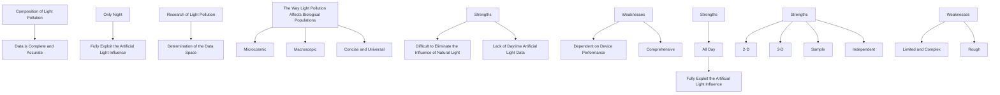
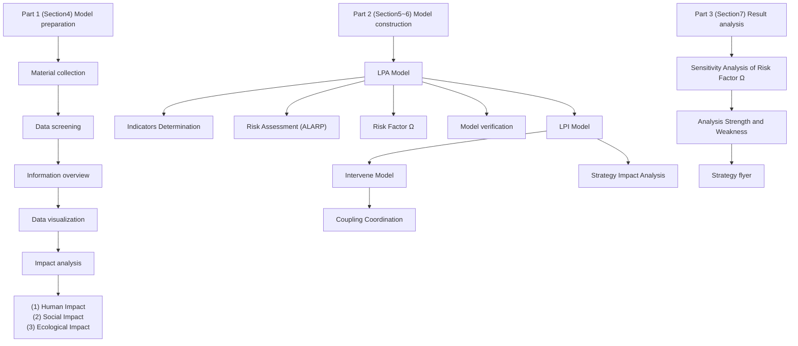
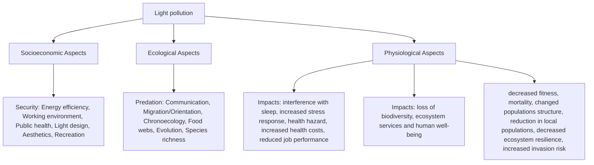
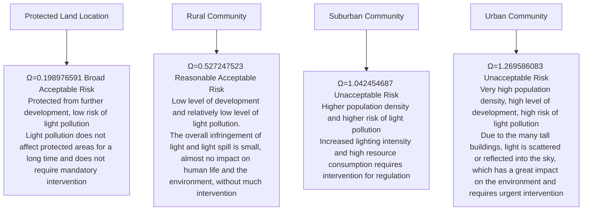

# Recast Mystletainn to Fight the Artificial God of Light

## Summary

Bright windows, blazing streetlights, pulsating neon...human beings are slowly being deprived of the dark night. Since the invention of artificial light, this artificial light has gradually started to affect animals, plants and human health. It is sad that the technological light that should bring convenience has brought harm. To better measure and intervene in the effects of light pollution, we study light pollution to better enjoy this light.

Several models are established: Model I: Pollution Quantification Model; Model II: Risk Assessment Model; Model III: Intervention Strategy Model.

Prepare for establishing models, we analyzed the composition and main impact aspects of light pollution. By visualizing the results of a large number of data collected from official databases, we initially focused on areas worth studying.

For Model I: According to some literature and the results of similar natural system studies, we propose to use human factors, social factors and ecological factors, a total of 13 indicators, combined with EWM-AHP algorithm to obtain objective light pollution quantification results $Q _ { p o s i t i \nu e } , \ Q _ { n e g a t i \nu e } .$ . Then we randomly selected ten areas of light intensity and our model calculation for comparison, the Pearson correlation coefficient is 0.8002, which verifies the validity of our model.

For Model II: We defined a light pollution risk indicator Ω based on the ALARP criterion and "Cost-Risk" analysis, where the negative impact growth rate is assumed to be normally distributed. Based on the literature, we calculate the expectation of 6% and apply Ω to the four regions we selected to evaluate the risk of light pollution after one year and analyze it to propose countermeasures. Theoretically, the model allows for mediumand long-term prediction of light pollution risk.

For Model III: We modeled three different strategies - "energy", "environment", "human security" and related factors respectively, and finally obtained the feasibility of intervention scenarios through coupling coordination analysis, And the final evaluation value of the three aspects is calculated through the secondary indicators after the intervention. We selected two sites, Rutland and Westminster with a coordination index of 5 and 3, to study the impact of the three intervention strategies based on a coupled coordination analysis. The results showed that the best intervention strategy in rural Rutland was the "Human Friendly Strategy", which improved the Human Health Index score by 10%. The best intervention strategy for Westminster was the Resource Friendly Strategy, which improved the overall score from 50.0080 to 59.6481.

Finally, we evaluated the sensitivity analysis by adjusting the parameter ?? of the environmental part of the LPA model up or down by 5%, and the results showed that our pollution quantification model was more resistant to interference. Afterwards, we created a flyer to inform people in the Westminster area of the UK about the effects of light pollution and the options and benefits of implementing a lighting curfew.

Keywords: EWM-AHP Algorithm, ALARP, Risk Indicator Ω, Coupling Coordination Analysis

## Contents

## 1 Introduction 3

1.1 Problem Background 3  
1.2 Restatement of the Problem 3  
1.3 Literature Review . . 4  
1.4 Our work . . 5

## 2 Assumptions and Explanations 5

## 3 Notations 6

## 4 Model Preparation 6

4.1 Light Pollution Composition and Impact 6  
4.2 Data Overview 7  
4.2.1 Data Collection 7  
4.2.2 Data Screening . . 8

## 5 LPA(Light Pollution Assessment)Model 8

5.1 Light Pollution Impact Quantification 9  
5.1.1 Indicators Determination 9  
5.1.2 Weight Calculation . . 11  
5.1.3 Light Pollution Quantitative Outcome . . 13

5.2 Risk Assessment . 14  
5.2.1 Risk Assessment Criterion . . . 14  
5.2.2 Risk Factor Ω 14

5.3 Model Verification . 15

5.4 Case Study . . 16

## 6 LPI(Light Pollution Intervene)Model 17

6.1 Intervention Strategies . . 17  
6.1.1 Resource Friendly Strategy 17  
6.1.2 Environment Friendly Strategy . . 18  
6.1.3 Human Friendly Strategy . . . . 18

6.2 System Coupling Model . 19  
6.2.1 Coupling Coordination Parameters 19

6.3 Evaluation of Intervention Results 20

6.3.1 Rutland’s Intervention Results 20

6.3.2 Westminster’s Intervention Results . . 21

## 7 Sensitivity Analysis 22

## 8 Strengths and Further Discussion 23

8.1 Strengths . . . 23  
8.2 Further Discussion 23

## References 23

## 1 Introduction

## 1.1 Problem Background

"When I see photos of this, of the Earth, I see environmental catastrophe. These aren’t jewels, those are tumors." said Kelsey Johnson in her TED speech "The problem of light pollution – and 5 ridiculously easy ways to fix it". Light is a fundamental component of the world and one of the pillars of civilization. The development of human civilization has been accelerated by the invention of artificial light and its use.

However, with the rapid growth of artificial light usage year by year, the poor

natural_image

Satellite orbiting Earth with illuminated city lights, showing continents and cloud patterns (no text or symbols)

Figure 1: Night View of the Earth Showed in Kelsey Johnson’s Speech

and excessive use of artificial light has also caused serious consequences: astronomical light pollution has caused the degradation of the night sky scene, and the exploration of the depths of the universe is limited [1], ecological light pollution not only pollutes the air, ocean currents, etc. but also makes the maturation of plants delayed or accelerated, the migration patterns of wild animals change while including humans, obesity, insomnia, physical and mental health damage, etc. The problems are rapidly increasing.

Artificial light is a double-edged sword, which brings blessings and opens Pandora’s Box. One of the key issues and turning points for the future advancement of human society will be how to reduce the effects of light pollution through appropriate intervention.

## 1.2 Restatement of the Problem

The management of light pollution problems is a complex issue that requires full consideration of various factors. To measure and mitigate the effects of light pollution at different locations, we need to complete the following questions:

• Create a broadly applicable indicator that will allow measurement of the risk levels of light pollution at various locations.  
• Apply the indicator to four distinct site types and offer a logical analysis of the findings.  
• Put out three potential intervention options to deal with light pollution, along with a discussion of the precise steps required for each strategy and its potential effects.  
• Apply the indicators to two locations, determine the best intervention plan for each site, and go over how that intervention strategy affects the level of risk at that site.  
• Make a flyer outlining the most effective intervention method for one of the indicated sites.

## 1.3 Literature Review

We searched the literature with the keyword "light pollution" and found that the research on this issue in recent years can be divided into three main parts: the composition of light pollution, the determination of the data space of light pollution modeling, and the way light pollution affects biological populations. The following will mainly discuss the proposed models.

♦ First, as far as the composition of light pollution is concerned: light pollution is commonly divided into white bright pollution, daytime pollution, and color pollution, with the difference that in [2], Zhaoli Liu et al. considered light pollution throughout the day, while the vast majority of authors only studied light pollution at night.  
♦ Second, the light pollution modeling data space can be divided into two-dimensional and three-dimensional. M. Liu et al. partly used two-dimensional data such as image data and remote sensing data for modeling [3], while Zheng Wen et al. combined height and other information for modeling three-dimensional data [4].  
♦ Finally, the effects of light pollution on biological populations have both macroscopic and microscopic dimensions. Xuefeng Tang et al. explored the effects of light pollution from different light sources on the microvasculature of organisms [5], while more authors have explored the effects of extensive light pollution on the habits and health of organisms at the macroscopic level.  
⋆ The advantages and disadvantages of different research methods for different concerns of light pollution can be visualized as shown in Figure 2.

flowchart

Figure 2: Literature Review Framework

## 1.4 Our work

This problem actually requires us to quantify the harm of light pollution and formulate reasonable strategies to mitigate its impact. To avoid complicated descriptions, and intuitively reflect our work process, the flow chart is shown in Figure 3.

flowchart

Figure 3: Flow Chart of Our Work

## 2 Assumptions and Explanations

Considering those practical problems always contain many complex factors, first of all, we need to make reasonable assumptions to simplify the model, and each hypothesis is closely followed by its corresponding explanation:

▼ Assumption 1: The data we use are accurate and valid.  
▲ Explanations: The data in this article comes directly from the latest results of the major online official databases and published literature.  
▼ Assumption 2: Light pollution in the night mainly for light pollution, daytime light pollution is almost negligible.  
▲ Explanations: Due to the long-term formation of biological habits and ecological laws during the day, under the augmentation of natural light, the impact of light pollution during the day is minimal compared to the impact of light pollution at night.  
▼ Assumption 3: The natural light pollution part of the light pollution we are discussing is represented by aurora pollution.  
▲ Explanations: Most of the natural light pollution only affects biology and society during daytime, based on assumption 2, we think this part of natural light pollution can

be neglected, so the natural light pollution part only focuses on the aurora borealis pollution to simplify the model.

▼ Assumption 4: The composition of biological populations at the sites studied by our model, such as the proportion of vertebrates and invertebrates to biological populations, is relatively stable.

▲ Explanations: The "biological population" is a large concept, and biodiversity makes light pollution affect each organism differently, so we make this assumption to better focus on the quantification and intervention of light pollution.

Additional assumptions are made to simplify analysis for individual sections. These assumptions will be discussed at the appropriate locations.

## 3 Notations

Some important mathematical notations used in this paper are listed in Table 1.

Table 1: Notations Used in this Paper

<table><tr><td>Symbol</td><td>Description</td></tr><tr><td> $Q_{positive}$ </td><td>Quantitative results of positive impact</td></tr><tr><td> $Q_{negative}$ </td><td>Quantitative results of negative impact</td></tr><tr><td> $Score_x$ </td><td>Scores of “x”-related indicators</td></tr><tr><td> $Area_x$ </td><td>Area of region &quot;x&quot;</td></tr><tr><td> $BR_x$ </td><td>Biological ratio of &quot;x&quot;</td></tr><tr><td> $LB_x$ </td><td>Light brightness of region &quot;x&quot;</td></tr><tr><td> $Num_x$ </td><td>Number of &quot;x&quot;</td></tr><tr><td> $C_s$ </td><td>Change rate of &quot;x&quot;</td></tr></table>

\* There are some variables that are not listed here and will be discussed in detail in each section.

## 4 Model Preparation

## 4.1 Light Pollution Composition and Impact

Light pollution is a large and complex concept, the consensus of most studies is that the source of pollution is divided into natural light pollution and artificial light pollution, according the composition of pollution is divided into white bright pollution, daytime pollution, colored light pollution, according to the common form of pollution can be divided into glare, spill light, and light trespass...

The composition of light pollution is very complex, but it is undeniable that no matter what light pollution will cause a huge impact. Most studies classify the effects of light pollution into 3 aspects: socio-economic, ecological, and physiological, the specific effects are shown in Figure 4.

flowchart

Figure 4: Impact of Light Pollution(from Literature [6])

## 4.2 Data Overview

## 4.2.1 Data Collection

The problem does not provide us with data directly, so we need to consider what data to collect when building the model and what data to collect during the process of building the model. Through the analysis of the problem, we collected the main data in Table 2. Since the amount of data is too large to list them all, it is a good way to visualize the data.

Table 2: Main Data Description and Source

<table><tr><td>Data Description</td><td>Data Source</td></tr><tr><td rowspan="4">Light Pollution-Related Indicators</td><td>https://www.ons.gov.uk/</td></tr><tr><td>https://ourworldindata.org/</td></tr><tr><td>https://hub.jncc.gov.uk/</td></tr><tr><td>https://www.earthdata.nasa.gov/</td></tr><tr><td rowspan="2">Night Lighting</td><td>https://www.nightearth.com/</td></tr><tr><td>https://www.ngdc.noaa.gov/</td></tr><tr><td>Remaining Mentioned Data</td><td>Various Related Literature</td></tr></table>

To avoid the interference of more unknown factors in the model and to simplify the model complexity, we mainly collected data from the UK and studied it considering the small differences in geography, customs, etc. within a country.

## 4.2.2 Data Screening

With the help of various visualization tools, we present some of the data as shown in Figure 5.

text_image

Glasgow
UNITED KINGDOM
in
AM
LONDON

(a) UK Night Light Brightness

text_image

© Mapbox © OSM

natural_image

Choropleth map of the United Kingdom showing regional divisions (no text or labels visible)

natural_image

Map of the United Kingdom showing regional divisions (no text or labels visible)

natural_image

Map of the United Kingdom showing regional divisions (no text or labels visible)

natural_image

Map of England showing regional divisions with no visible text or labels

natural_image

Map of the United Kingdom showing regional divisions (no text or labels visible)

  
(b) Some Indicators Related to Light Pollution in the UK  
Figure 5: Some Data Visualization

From Figure 5, we can observe that certain regions always maintain high or low levels of the indicators, and these regions would be excellent choices for the later model to be used for the case study.

## 5 LPA(Light Pollution Assessment)Model

Light pollution is a very ambitious topic, based on our literature review, we choose to model the macroscopic effects of light pollution mainly for nighttime, using mainly 2-dimensional data in the modeling process to simplify the model and a small amount of 3-dimensional data to improve the model accuracy.

This part is divided into two main models: the light pollution impact quantification model and the light pollution risk assessment model. The light pollution quantification model quantifies the impact of light pollution through various representative data; the light pollution risk assessment model evaluates the risk of light pollution according to certain risk assessment criteria.

## 5.1 Light Pollution Impact Quantification

## 5.1.1 Indicators Determination

As shown in Figure 4, the impact of light pollution can be mainly divided into the impact on humans, the impact on society, and the impact on ecology. Therefore, we use these three main aspects as the first-level indicators.

For human health impact and social impact, we considered 73 official related indicators in combination with literature and finally retained the 10 most representative secondary indicators to construct our model. On this basis, we supplemented three secondary indicators related to the ecological environment from ecological constituents to improve our quantitative model. The specific description and indicators selected are shown in Table 3.

Table 3: Indicators Selected

<table><tr><td>Object</td><td>Indicators</td><td>Description</td></tr><tr><td rowspan="7">Human</td><td>DR</td><td>Death rate</td></tr><tr><td>LE</td><td>Life-expectancy</td></tr><tr><td>PHS</td><td>Physical health status</td></tr><tr><td>OOR</td><td>Overweight and obesity rate</td></tr><tr><td>MH</td><td>Mental health</td></tr><tr><td>AE</td><td>Anxious emotions</td></tr><tr><td>WB</td><td>Well-being</td></tr><tr><td rowspan="3">Society</td><td>GPC</td><td>GDP per capita</td></tr><tr><td>UR</td><td>Unemployment rate</td></tr><tr><td>CR</td><td>Crime rate</td></tr><tr><td rowspan="3">Ecology</td><td>EP</td><td>Environmental pollution</td></tr><tr><td>RC</td><td>Resource consumption</td></tr><tr><td>DS</td><td>Diversity of species</td></tr></table>

## • Human Health Impact

## – 1. Physical Health

Light pollution hazards can cause accelerated aging and death of normal cells in people who are active and work for long periods of time, and may induce various diseases[7]. [8] shows that artificial light at night can cause obesity. Based on the data available, we specifically measured the effects of light pollution on human physiological health using the effects of light pollution on "human death rate"(DR), "life expectancy"(LE), "physical health status"(PHS), and "overweight and obesity rate"(OOR).

## – 2. Mental Health

Depending on the [8], light can have varying degrees of visual, psychological, and emotional effects on people, with increasing effects over time. Residents who live in a light-polluted environment for a long time experience strong psy-

chological discomfort.

Therefore, we specifically use "mental health"(MH), "anxious emotions"(AE), and "well-being"(WB) to measure the state of human mental health.

## • Social Impact

## – 1. Social Development

The use of light contributes to a certain extent to the economic level and development of a region, so light plays a positive economic role, and we measure this positive impact in terms of regional "GDP per capita"(GPC).

However, at the same time, the use of light makes the working hours increase significantly, and the reduction of the daily workload per capita makes some people unemployed, which is one of the negative effects of light, and we use the "unemployment rate"(UR) as a specific measure.

## – 2. Social Stability

Light pollution makes it increasingly difficult to manage law and order, especially when people’s physical and mental health is impaired, unemployment, and other negative conditions, and crime often occurs, so we use the indicator "crime rate"(CR) to show the negative impact of light pollution on social stability.

## • Ecological Impact

## – 1. Resource Consumption

Light pollution means that a large number of natural resources are being used improperly. Based on the data obtained, we plotted Figure 6 below and calculated a pearson correlation coefficient of 0.85293 between electricity consumption and light pollution, indicating that electricity consumption and light pollution are positively and strongly correlated, which means that the resources used to generate electricity, such as coal and oil, are being used excessively or improperly.

line chart

| City       | Artif bright | Electricity consumption |
| ---------- | ------------ | ------------------------ |
| Beijing    | 700          | 1000                     |
| Fujian     | 2000         | 2500                     |
| Heilongjiang | 50           | 1000                     |
| Jiangxi    | 800          | 1500                     |
| Shandong   | 4800         | 6800                     |
| Shanghai   | 2500         | 1500                     |
| Sichuan    | 1500         | 3000                     |
| Tianjin    | 500          | 1000                     |
| Xinjiang   | 50           | 2500                     |
| Zhejiang   | 2700         | 4800                     |

Figure 6: Pearson Correlation Coefficient

Assuming that most of the world uses natural resources in the same way and that the conversion rate between electricity consumption and light generation is stable, we can express "resource consumption"(RC) based on electricity consumption(EC). Resource consumption is calculated as follows:

$$
R C = \frac {E C \cdot \alpha}{\beta} \tag {1}
$$

where ?? represents the proportion of natural resources used for electricity generation and $\beta$ represents the conversion rate of electricity generation

## – 2. Environment

Since light pollution causes reduced visibility at night and pollution to the air and space environment, we define "environmental pollution"(EP) in terms of the ratio of zenith brightness to natural night sky brightness.

According to the Treanor model [9], the zenith brightness to natural night sky brightness ratio can be defined as:

$$
E P = \frac {L (r)}{L _ {N}} = (\frac {A}{r} + \frac {B}{r ^ {2}}) \cdot e ^ {(- k r)} \tag {2}
$$

Where the larger the ?? ?? value indicates the greater the light pollution disturbance, $L ( r )$ is the zenith brightness, $L _ { N }$ is the natural night sky brightness, and ??(km) is the distance between the light source and the observation point. ??, ?? are the observation constants, which are proportional to the urban population, and the observation constants for Italy, for example, are:

$$
A = 1. 8 0 \times 1 0 ^ {- 5} \cdot p, \quad B = 1 3. 6 \times 1 0 ^ {- 5} \cdot p \tag {3}
$$

where ?? is the number of urban population and take $k = 0 . 0 2 6 .$ .

We take the city as a square and assume that the distance $r = 1 0$ .

## – 3. Biology

We collected biodiversity data from several areas, and the impact factor of light pollution on biodiversity was defined as $\gamma .$ considering those areas cover a large area and cover many topographies, etc., biodiversity will be diversified accordingly, and the impact of light pollution on each organism cannot be generalized, so to ensure the accuracy of the assessment, we assumed that organisms are equally distributed in each area, while we standardized to species per $l m ^ { 2 }$ .

We define the biological impact indicator(DS) as the sum of the product of the number of biological species $\frac { B _ { t o t a l } } { A r e a }$ ???????? and ?? per square kilometer[8]:

$$
D S = \frac {B _ {\text { total }}}{\text { Area }} \cdot B R _ {\text { vertebrate }} \cdot \gamma_ {\text { vertebrate }} + \frac {B _ {\text { total }}}{\text { Area }} \cdot B R _ {\text { invertebrate }} \cdot \gamma_ {\text { invertebrate }} \tag {4}
$$

## 5.1.2 Weight Calculation

Since we need to calculate $Q _ { p o s i t i v e }$ and $\mathcal { Q } _ { n e g a t i v e }$ from three levels: human health, society, and ecology, based on the above analysis, we get the $Q _ { p o s i t i v e }$ is:

$$
Q _ {\text { positive }} = G P C \tag {5}
$$

And when calculating $\scriptstyle Q _ { n e g a t i v e } ,$ to make the model more reasonable, we need to calculate the weights of the 12 secondary indicators corresponding to the three primary indicators of human health, society and ecology environment to obtain the $\mathcal { Q } _ { n e g a t i v e }$ in the following equation:

$$
Q _ {\text { negative }} = \sum_ {i = 1} ^ {\text { Num } _ {\text { negative }}} \text { Indicator } _ {i} \cdot w _ {i} \tag {6}
$$

where ???????????????????? is the ??-th negative indicator, $w _ { i }$ is the weight corresponding to the ??-th negative indicator and $N u m _ { n e g a t i \nu e }$ is the number of negative indicators.

In the following we will focus mainly on the calculation of the weights of each negative indicator:

## 1. Data Normalization

We need to normalize the data for different metrics in order to compare them on the same scale. For different types of data, we use different normalization methods.

For the "cost attributes $\mathrm { t y p e " } ,$ , i.e. the smaller the better type of data, we use the following normalization:

$$
\tilde {x} _ {i j} = \frac {\max \left\{x _ {i} \right\} - x _ {i j}}{\max \left\{x _ {i} \right\} - \min \left\{x _ {i} \right\}} \tag {7}
$$

For the "benefit attributes type", i.e. the larger the better type of data, we normalize using the following equation:

$$
\tilde {x} _ {i j} = \frac {x _ {i j} - \min \left\{x _ {i} \right\}}{\max \left\{x _ {i} \right\} - \min \left\{x _ {i} \right\}} \tag {8}
$$

Suppose we have ?? sets of data with $N u m _ { H u m a n } / \ N u m _ { S o c i e t y } / N u m _ { E c o l o g y }$ indicators above in each set. $\tilde { x } _ { i j }$ represents the ??-th data in the ??-th group. max $\left\{ x _ { i } \right\}$ represents the maximum data in the ??-th group.min $\left\{ x _ { i } \right\}$ represents the minimum data in the ??-th group.

## 2. Entropy Weight Method

After standardizing each indicator to obtain standard data, we normalize the data by the following equation:

$$
p _ {i j} = \frac {\tilde {x} _ {i j}}{\sum_ {j = 1} ^ {m} \tilde {x} _ {i j}} (i = 1, 2, \dots , N u m _ {H u m a n} / N u m _ {S o c i e t y} / N u m _ {E c o l o g y}; j = 1, 2, \dots , m) (9)
$$

Calculate the entropy $E _ { i }$ of the ?? index:

$$
E _ {i} = - \frac {\sum_ {j = 1} ^ {m} p _ {i j} \cdot \ln p _ {i j}}{\ln m} (i = 1, 2, \dots , N u m _ {H u m a n} / N u m _ {S o c i e t y} / N u m _ {E c o l o g y}) \tag {10}
$$

Based on the information entropy, we will further calculate the weight $w _ { i }$ of each evaluation indicator we defined before is calculated as follows:

$$
\omega_ {i} = \frac {1 - E _ {i}}{\sum_ {i = 1} ^ {n} (1 - E _ {i})} \tag {11}
$$

We form a vector of the obtained weights and call the vector as "evaluation vector", denoted as $\vec { \Phi } ~ = ~ ( \phi _ { 1 } , \phi _ { 2 } , \cdot \cdot \cdot ~ , \phi _ { N u m _ { H u m a n } } / N u m _ { S o c i e t y } / N u m _ { E c o l o g y } ) ;$ ; By composing a vector of the obtained influences of different aspects and calling this vector as "influence degree vector", denoted as $\vec { S } \ = \ ( S _ { 1 } , S _ { 2 } , \cdot \cdot \cdot \ , S _ { N u m _ { H u m a n } / N u m _ { S o c i e t y } / N u m _ { E c o l o g y } } )$ , then the final evaluation value is:

$$
\operatorname{Score} _ {x} = \vec {\Phi} \cdot \vec {S} ^ {T} = \sum_ {i = 1} ^ {\text {Num} _ {x}} \phi_ {i} \cdot S _ {i} \tag {12}
$$

where ?? represents "Human", "Society" or "Ecology".

## 5.1.3 Light Pollution Quantitative Outcome

As our first-level indicator system is divided into three dimensions: human health, society, and ecology, we apply EWM to each of these three dimensions and objectively obtain the weights of each indicator, which are shown in Table 4.

Table 4: the Weights of each Indicator

<table><tr><td>Object</td><td>Indicator</td><td>Weight</td><td>Object</td><td>Indicator</td><td>Weight</td></tr><tr><td rowspan="7">Human</td><td>DR</td><td>0.2404</td><td rowspan="3">Society</td><td rowspan="2">UR</td><td rowspan="2">0.4498</td></tr><tr><td>LE</td><td>0.1145</td></tr><tr><td>PHS</td><td>0.1086</td><td>CP</td><td>0.5502</td></tr><tr><td>OOR</td><td>0.1569</td><td rowspan="4">Ecology</td><td>RC</td><td>0.257</td></tr><tr><td>MH</td><td>0.1789</td><td>DS</td><td>0.3236</td></tr><tr><td>AE</td><td>0.1073</td><td>EP</td><td>0.4194</td></tr><tr><td>WB</td><td>0.0932</td><td></td><td></td></tr></table>

To assign weights to these three first-level indicators to obtain the final light pollution risk assessment values, we used AHP (hierarchical analysis) to construct a judgment matrix to obtain the weights of the three first-level indicators:

$$
\delta = (0. 1 2 8 3, 0. 2 7 6 4, 0. 5 9 5 4) \tag {13}
$$

where the consistency ratio of the judgment matrix = 0.0053, and the consistency is acceptable.

Eventually, our light pollution risk safety score is calculated as follows:

$$
Q _ {\text { negative }} = \delta_ {1} \cdot \text { Score } _ {\text { Human }} + \delta_ {2} \cdot \text { Score } _ {\text { Society }} + \delta_ {3} \cdot \text { Score } _ {\text { Ecology }} \tag {14}
$$

## 5.2 Risk Assessment

## 5.2.1 Risk Assessment Criterion

Risk, in short, is the uncertainty between investments and benefits over a period of time in the future. The ALARP (as low as reasonably practicable) criterion is a common criterion for risk assessment and is still widely used for the selection of acceptable risks and the development of reasonable risk control plans [10].

The ALARP criterion divides risks into three zones: unacceptable, reasonably acceptable, and widely acceptable, as shown in Figure 7(a).

risk-threshold diagram

| Risk Level                     | Value |
| ------------------------------ | ----- |
| Broad Acceptable Risk Zone      |       |
| Reasonable Acceptable Risk Zone (ALARP) |       |
| Unacceptable Risk Zone          |       |

(a) ALARP criterion

line chart

| Cost | Risk |
|------|------|
| Low  | High |
| High | Low  |

(b) Cost-Risk Curve  
Figure 7: Diagram of Risk Assessment Criterion

• If the risk is in the unacceptable zone, measures must be taken to reduce the risk, regardless of the benefits.  
• If the risk is in the widely acceptable zone, the risk is at a very low level and can be ignored.  
• The area in between is the reasonably acceptable zone, and the risk needs to be reduced as much as possible under economically feasible circumstances, i.e., whether to take risk control measures through "Cost-Risk" Analysis in Figure 7(b).

## 5.2.2 Risk Factor Ω

In the above model, light pollution brings positive impacts on the socio-economic level as well as a series of negative impacts. Assuming that socio-economic development will bring about human, social, and ecological progress in the future, we believe that the risk of light pollution comes from the interrelationship between the positive and negative impacts of light pollution.

We initially define the risk factor Ω as:

$$
\Omega = \frac {\widetilde {Q _ {\text { negative }}}}{\widetilde {Q _ {\text { positive }}}} \tag {15}
$$

where $\widetilde { Q _ { n e g a t i v e } }$ and $\widetilde { Q _ { p o s i t i \nu e } }$ means standardized $\mathcal { Q } _ { n e g a t i v e }$ and $Q _ { p o s i t i v e }$ .

Considering that risk needs to be combined with prediction and judgment of the future, we define the risk assessment period as one year. Since it is difficult for people and organisms to change in the short term, among the negative impacts, it is mainly the environmental indicators in ecology that are changing during the assessment period, and the change in environmental indicators drives the positive impact - the change in GPC.

Combining the above analysis to amend the definition of Ω, we obtain the $\Omega \cdot$

$$
\Omega = \frac {\widetilde {Q _ {\text { negative }}} \cdot (1 + C _ {\text { negative }})}{\widetilde {Q _ {\text { positive }}} \cdot (1 + C _ {\text { positive }})} \tag {16}
$$

where the degree of variation $C _ { n e g a t i v e }$ of environmental indicators in ecology we assume to conform to a normal distribution, while the degree of variation $C _ { p o s i t i v e }$ of GPC is more stable. Thus, the actual definition of the risk factor is:

$$
\Omega = \frac {\widetilde {Q _ {\text { negative }}} \cdot \left(1 + \frac {e ^ {- \frac {(C _ {\text { positive }} - \mu) ^ {2}}{2 \sigma^ {2}}}}{\sqrt {2 \pi} \sigma}\right)}{\widetilde {Q _ {\text { positive }}} \cdot \left(1 + C _ {\text { positive }}\right)} \tag {17}
$$

where $\mu$ is the expectation of the $C _ { p o s i t i v e }$ and $\sigma$ is the variance of the $C _ { p o s i t i v e }$ .

## 5.3 Model Verification

<table><tr><td>Region</td><td>Light Pollution</td><td>Negative Impact</td></tr><tr><td>Dominica</td><td>1</td><td>1</td></tr><tr><td>Bonaire, Sint Eustatius and Saba</td><td>0.564061669</td><td>0.940177668</td></tr><tr><td>Togo</td><td>0.048416537</td><td>0.695940627</td></tr><tr><td>Myanmar</td><td>0.006225138</td><td>0.382548072</td></tr><tr><td>Democratic Republic of the Congo</td><td>0.010053727</td><td>0.456201507</td></tr><tr><td>Belize</td><td>0.069283009</td><td>0.723490386</td></tr><tr><td>Ghana</td><td>0.003758426</td><td>0.299561453</td></tr><tr><td>New Caledonia</td><td>0.080745814</td><td>0.746542224</td></tr><tr><td>Cameroon</td><td>0.02004345</td><td>0.553019229</td></tr><tr><td>Armenia</td><td>0.041596425</td><td>0.659057686</td></tr></table>

(a) Light Brightness and Negative Impact Values for 10 Regions

line chart

| Country      | Total light pollution | Score |
| ------------ | --------------------- | ----- |
| Armenia      | 0K                    | -60   |
| Belize       | 50K                   | -50   |
| Bonaire,..   | 100K                  | -40   |
| Cameroon     | 50K                   | -50   |
| Democra...    | 100K                  | -60   |
| Dominica     | 250K                  | -70   |
| Ghana        | 100K                  | -30   |
| Myanmar      | 250K                  | -20   |
| New Cale...   | 100K                  | -10   |
| Togo         | 50K                   | -20   |

(b) Data Line Chart  
Figure 8: Model Verification Data

We randomly selected 10 areas shown in Figure 8(a), normalized their light intensity with negative effects, visualized to get the line graph shown in Figure 8(b), and calculated the pearson correlation coefficient for these two values to get a correlation coefficient of 0.8002, which is higher than 0.8, indicating that the correlation between the two data is extremely strong, indicating that our model is able to effectively measure the effect of light pollution to a greater extent.

## 5.4 Case Study

Combining the risk assessment criterion ALARP and risk factor Ω, we obtain the following risk assessment standards[10]:

$$
\Omega = \left\{ \begin{array}{c c} 0 \sim 0. 3 5 & \text { Broad   Acceptable   Risk } \\ 0. 3 5 \sim 0. 9 & \text { Reasonable   Acceptable   Risk } \\ > 0. 9 & \text { Unacceptable   Risk } \end{array} \right. \tag {18}
$$

Choose the UK as the main study country, we took one area in each of the three different density layers and selected a protected area where development is prohibited by government or private entities, and the four different types of sites obtained are shown in Table 5.

Table 5: Information about the Selected Location

<table><tr><td>Type</td><td>Location</td><td>Density of Population</td></tr><tr><td>Protected Land Location</td><td>Shropshire</td><td>101</td></tr><tr><td>Rural Community</td><td>Rutland</td><td>107.5</td></tr><tr><td>Suburban Community</td><td>Elmbridge</td><td>1,459.6</td></tr><tr><td>Urban Community</td><td>Westminster</td><td>9,514</td></tr></table>

Applying the LPA model to these four sites, the values obtained for the three aspects of the security level assessment are shown in Figure 9(a), combined with the risk factor ?????????? for each, and the following judgments and recommendations are made in Figure 9(b).

stacked bar chart

| Region | Category | Value |
| :--- | :--- | :--- |
| Shropshire | Ecology | 54.43 |
| Shropshire | Human | 9.18 |
| Shropshire | Society | 11.52 |
| Rutland | Ecology | 48.69 |
| Rutland | Human | 9.06 |
| Rutland | Society | 8.11 |
| Elmbridge | Ecology | 43.23 |
| Elmbridge | Human | 8.04 |
| Elmbridge | Society | 9.78 |
| Westminster | Ecology | 15.33 |
| Westminster | Human | 8.20 |
| Westminster | Society | 26.48 |

(a) Score of Three Security Levels in Four Community

flowchart

(b) Risk and Assessment Results of Four Community  
Figure 9: Results of LPA applications

## • Human Health Aspect Analysis

Through Figure 9(a) we can visualize that the level of human health security in these four regions is not very different, and our analysis suggests that medical security is good in cities, and the impact of light pollution on human health in cities can be compensated by technological leadership in medical care.

## • Social Aspect Analysis

The low light in protected areas and rural areas subliminally affects crime rates, and the high crime rate leads to a much lower level of social safety in these two areas than in urban communities, consistent with the fact that low light levels in communities may lead to increased crime. The positive contribution of light is also affirmed.

## • Ecological Aspect Analysis

The ecological impact of light pollution is the most significant, with significant disparities among the four regions. High population density, nighttime activities in commercial areas, and human activities lead to high artificial light brightness in urban and suburban areas and serious ecological damage. The Figure 10 below clearly shows the visibility of the sky in different areas, with the urban areas barely able to see the stars.

text_image

7 Excellent
Dark Sky Site
6 Dark Sky Site
5 Rural Sky
4 Suburban/Rural Transition
3 Suburban Sky
2 Bright Suburban Site
1 City/Suburbia Transition
0 City/Inner City Sky

Figure 10: Starry Sky Conditions in Different Areas

## 6 LPI(Light Pollution Intervene)Model

## 6.1 Intervention Strategies

## 6.1.1 Resource Friendly Strategy

Curfew, which refers to the prohibition of nighttime activities, for light pollution around the introduction of light nuisance regulations. Here we understand it to limit the time of artificial light use at night, which will directly affect resource consumption.

First, we assume that people’s mental health will not be affected by the imposition of curfew, and if curfew is imposed, the time to restrict the use of artificial light is fixed, and we set the efficiency of regulation as ??, which means the annual rate of reduction in resource consumption. The first required resource consumption is $R C _ { 0 } ,$ , so we can get the total reduced resource consumption in year ?? as

$$
R C (t) = R C _ {0} (1 - E) ^ {t} \tag {19}
$$

Due to the decrease in light use, the low luminance environment may lead to an increase in crime rate, so we assume that the initial crime rate is $C R _ { 0 }$ and the crime growth rate is $r _ { C R } ,$ then the crime rate in year ?? is

$$
C R (t) = C R _ {0} \left(1 + r _ {C R}\right) ^ {t} \tag {20}
$$

Considering the uncontrollable nature of the regulation of crime rate reduction, we simulate it with logistic regression. We introduce the natural rate of reduction in crime rate after government regulation as $\gamma ,$ and the target amount of crime reduction as $T C _ { 0 }$ .

$$
C R _ {\text { reduce }} (t) = \frac {C R _ {0}}{\left(1 + \frac {C R _ {0}}{T C _ {0}} - 1\right) e ^ {- \gamma t}} \tag {21}
$$

## 6.1.2 Environment Friendly Strategy

The effectiveness of reducing sky glow over cities through lighting interventions is limited due to the limitations of technological development and human activities. Based on the literature [11], we understand that a sustained decrease in atmospheric aerosols due to the reduction of air pollution would also reduce the risk of light pollution. Intervention strategies to mitigate air pollution can reduce the brightness of the night sky in and around cities.

Data from literature studies show that the change from polluted air $( A O D = 0 . 3 )$ to clean atmosphere results in a 3.2-fold decrease in night sky brightness (?? ????), i.e., the NSB decreases to about 30% of its initial level for a source 1.3 km away from the observer. The more distant the observation point from the light source the more significant the ?? ???? reduction. To simplify the model, we use an observation point at a distance of 1.3 km for our study.

Let the additional resource consumption required to reduce air pollution to the clean atmosphere $( A O D < 0 . 1 5 )$ per 0.01 reduction be $R C _ { a i r . }$ , then the total additional resource consumption required to reduce air pollution is:

$$
R C _ {\text { extra }} = \frac {(A O D - 0 . 1 5)}{0 . 0 1} \cdot R C _ {\text { air }} \tag {22}
$$

We specify the environmental impact of the ?? ???? reduction as:

$$
E P = 1. 3 E P _ {0} \tag {23}
$$

For biological effects are:

$$
B i o l o g y = \frac {B _ {t o t e l}}{A r e a} \cdot \frac {1}{L B (1 - 30\%) ^ {t}} \tag{24}
$$

## 6.1.3 Human Friendly Strategy

The literature [12] shows that light sources with narrow spectral line widths produce greater effects on organisms compared to light sources with wide spectral line widths, so when choosing a daily lighting source, it is appropriate to use a light source with a wide yellowish continuous spectrum and avoid using single wavelength light sources to reduce visual monotony and strobe pollution. We recommend a total ban on outdoor light emitted at wavelengths less than 540???? to reduce the adverse health effects of reduced melatonin production and circadian rhythm disturbances in humans and animals.

At the same light output, white LED lighting produces a road brightness $6 \%$ to 11% lower than $H P S ,$ and we compromise by choosing 8.5% as the reduction rate of artificial light brightness, and setting the rate of increase of human health index as $r _ { P H S } ,$ , the human health index in year ?? is:

$$
P H S (t) = P H S _ {0} \left(1 + r _ {P H S}\right) ^ {t} \tag {25}
$$

The biological impact ?????????????? at year ?? after the intervention is:

$$
\text {Biology} = \frac {B _ {\text {totel}}}{\text {Area}} \cdot \frac {1}{L B (1 - 8.5 \%) ^ {t}} \tag{26}
$$

## 6.2 System Coupling Model

To obtain the feasibility and final evaluation values of the intervention programs, we first did coupled coordination analysis and compared the three first-order indicators in the original LPA model and the first-order indicators in the LPA model after the intervention of the three programs.

## 6.2.1 Coupling Coordination Parameters

The coupling degree of the three first-level indicators is:

$$
C _ {L P A} = \sqrt [ 3 ]{\frac {\text { Score } _ {\text { Human }} \cdot \text { Score } _ {\text { Society }} \cdot \text { Score } _ {\text { Ecology }}}{(\text { Score } _ {\text { Human }} + \text { Score } _ {\text { Society }} + \text { Score } _ {\text { Ecology }}) ^ {3}}} \tag {27}
$$

The coordination index is:

$$
T _ {L P A} = \alpha_ {\text { Human }} \cdot \text { Score } _ {\text { Human }} + \beta_ {\text { Society }} \cdot \text { Score } _ {\text { Society }} + \gamma_ {\text { Ecology }} \cdot \text { Score } _ {\text { Ecology }} \tag {28}
$$

where $\alpha _ { H u m a n } \beta _ { S o c i e t y . }$ , and $\gamma _ { E c o l o g y }$ represents the weight of the corresponding system, The final coupling coordination is as follows:

$$
D _ {L P A} = \sqrt {C _ {L P A} \cdot T _ {L P A}} \tag {29}
$$

The defined degree of coordination is shown in Table 6:

Table 6: Defined Degree of Coordination

<table><tr><td>Coordination level</td><td>Degree of coordination</td></tr><tr><td>1</td><td>Extreme disordered</td></tr><tr><td>2</td><td>Severe disordered</td></tr><tr><td>3</td><td>Moderate disordered</td></tr><tr><td>4</td><td>Mild disordered</td></tr><tr><td>5</td><td>Nearly disordered</td></tr><tr><td>6</td><td>Barely coordinated</td></tr><tr><td>7</td><td>Primary coordinated</td></tr><tr><td>8</td><td>Intermediate coordinated</td></tr><tr><td>9</td><td>Good coordinated</td></tr><tr><td>10</td><td>Quality coordinated</td></tr></table>

## 6.3 Evaluation of Intervention Results

For the Shropshire reserve, the coordination index was 8 for each of the three impact aspects before the original intervention, and we did not think that too much intervention was needed. We therefore chose two sites, Rutland with a coordination index of 5, and Westminster with a coordination index of 3, to study the impact of the three intervention strategies.

## 6.3.1 Rutland’s Intervention Results

Before intervention, the unweighted human security score was 70.6022, social security score was 29.3440, and ecological environment score was 81.7827. the coordination index after applying three different intervention strategies was 5, 7, and 7, and the coordination of intervention strategy one was relatively poor. the comparison of different scores after applying three strategies is shown in Figure 11.

• Intervention Strategy I: Resource Friendly Strategy

After applying the curfew strategy, the human, social, and ecological scores are 70.6022, 26.4082, and 83.5198, respectively. Although the reduction in resource consumption brings about an increase in ecological safety scores, the increase in crime rate due to too little nighttime lighting leads to a significant decrease in social safety scores, and coupled with the low resource consumption in the countryside itself, the curfew strategy is not effective for the countryside.

• Intervention Strategy II: Environment Friendly Strategy

The human, social, and ecological scores were 70.6022, 29.3440, and 85.8223, respectively. the AOD of the village was 0.25, and the additional resource consumption brought by clean air was not significant, the NBS reduction obtained was considerable, and the ecological safety score increased. However, since the original rural community ecological score was 81.7827, the post-intervention change was small.

• Intervention Strategy III: Human Friendly Strategy

bar chart

| Category | Original | Strategy1 | Strategy2 | Strategy3 |
| :--- | :--- | :--- | :--- | :--- |
| Ecology | 81.5 | 82.5 | 85.0 | 82.5 |
| Society | 29.0 | 26.5 | 29.5 | 29.5 |
| Human | 70.5 | 70.5 | 70.5 | 78.0 |

Figure 11: Different Scores of the three Strategies for Rutland

Human, social, and ecological scores were 78.1381, 29.3440, and 83.0021, respectively. According to the relevant literature we defined $r _ { P H S } = 1 2 . 8 4 \%$ and human health score increased by 10%, which is a significant improvement, so switching to a light source with a small wavelength has a significant effect on human health in rural areas, and we implemented intervention strategy three for rural villages.

## 6.3.2 Westminster’s Intervention Results

Before intervention, the unweighted human security scores were 63.8930, 95.8180, and 25.7414. the coordination index after applying three different intervention strategies was 5, 3, and 4. a comparison of the different scores after applying the three strategies is shown in Figure 12:

bar chart

| Category | Original | Strategy1 | Strategy2 | Strategy3 |
| :--- | :--- | :--- | :--- | :--- |
| Ecology | 26 | 35 | 27 | 26 |
| Society | 96 | 111 | 96 | 96 |
| Human | 64 | 64 | 64 | 66 |

Figure 12: Different Scores of the three Strategies for Westminster

## • Intervention Strategy I: Resource Friendly Strategy

After applying the curfew strategy, the human, social, and ecological scores were 63.8930, 111.2475, and 34.7695, respectively. the intervention of this strategy resulted in a significant reduction in resource consumption and a significant improvement in ecological scores in urban areas. Also, nighttime light is appropriate and crime rate is reduced to some extent after adding government intervention. This indicates that the curfew strategy is urgently needed to control the effects of light pollution in the general environment.

## • Intervention Strategy II: Environment Friendly Strategy

The human, social, and ecological scores were 63.8930, 95.8180, and 25.7692, respectively. In this strategy, although the decrease in NBS allowed the ecological environment to improve, the original ?????? of 0.36 in urban areas and the more serious air pollution, and the cost of resource consumption required to clean the air to clean air was too great for the strategy to work in the city.

## • Intervention Strategy III: Human Friendly Strategy

Human, social, and ecological scores were 65.9782, 95.8180, and 25.3840, respectively. according to the relevant literature we defined urban areas $r _ { P H S } = 9 . 6 5 \% ,$ urban areas originally had high human health scores, and human health security scores increased after the intervention, but due to the large base, the change was not as good as strategy 1, so for urban areas we implemented curfew strategy most effectively.

## 7 Sensitivity Analysis

line chart

| Number | r+5% | r-5% | r |
|---|---|---|---|
| 1 | 0.1091 | 0.1091 | 0.1091 |
| 2 | 0.3687 | 0.3687 | 0.3413 |
| 3 | 0.2733 | 0.3118 | 0.2866 |
| 4 | 0.7259 | 0.8597 | 0.7884 |
| 5 | 0.4482 | 0.5309 | 0.4868 |
| 6 | 0.8269 | 0.9793 | 0.898 |

Figure 13: Changes in EP by Region after the ?? Change

We perform sensitivity analysis on the LPA model. In order to verify the stability of the model and determine whether the model will be disturbed by a variety of factors. We originally preset the distance parameter ?? from 10 up and down by 5%, and the environmental impact indicator EP obtained for six regions is compared with the original comparison as shown in Figure 13.

It can be seen that the change of r has little impact on the overall environment, and the trend is the same as the original one after the change. When the distance takes a small change in value, it does not our assessment of the environmental impact of light pollution, and its error is within an acceptable range. Therefore, we can consider our model to be stable and can be used to solve practical problems.

## 8 Strengths and Further Discussion

## 8.1 Strengths

• Our model uses the latest database from official websites and official journals to collect more than 300 data for each indicator, and the research results have high reference values and can be applied in real life.  
• The effect of light pollution is quantified by our LPA model, which allows the results of the model to be visualized with high accuracy. The evaluation indexes were selected with reference to many works of literature, and the factors selected were objective and characterized.  
• Our model is robust and easily scalable so that it can be used to simulate and predict any country or region as long as the relevant data is provided, and providing more relevant indicators will improve the accuracy of the model.  
• Our LPA model uses a combination of AHP and EWM to determine the weights when weighting the indicators. This method compensates to a certain extent for the shortcoming that the indicator weights under EWM vary with the sample or even overly depend on the sample, while the method reduces the subjectivity of hierarchical analysis.

## 8.2 Further Discussion

• We conducted our intervention strategy assessment assuming that all countries or regions would actively cooperate with our proposed interventions. There may be some deviation of the results from our predictions when actually implemented.  
• Our model transforms the sudden impact from natural disasters, etc. into a normally distributed rate of change of light pollution impact, so our model deviates from reality.

## References

[1] Longcore T, Rich C. Ecological light pollution[J]. Frontiers in Ecology and the Environment, 2004, 2(4): 191-198.  
[2] Zhaoli Liu, Shanying Jiang. Case analysis of environmental impact assessment of light pollution from glass curtain wall[J]. Sichuan Environment, 2009, 28(05): 85-90. DOI:10.14034/j.cnki.schj.2009.05.017.  
[3] M.Liu, Q.L.Hao, Y.Liu. Progress in the application of remote sensing technology in the study of urban nighttime light pollution[J]. Journal of Lighting Engineering, 2019, 30(02):109-116+122.  
[4] Wen Zheng. Measurement method of light pollution[J]. Lamps and Lighting, 2021, 45(03):9-14.  
[5] Xuefeng Tang. Experimental exploration of the effects of light pollution on living organisms[D]. The Nanjing University of Aeronautics and Astronautics, 2006.  
[6] Hölker F, Moss T, Griefahn B, et al. The dark side of light: a transdisciplinary research agenda for light pollution policy[J]. Ecology and Society, 2010, 15(4).  
[7] Falchi F, Cinzano P, Elvidge C D, et al. Limiting the impact of light pollution on human health, environment and stellar visibility[J]. Journal of environmental management, 2011, 92(10): 2714-2722.  
[8] S.L. Chen. The impact of light pollution on the environment and health[J]. Chinese Tropical Medicine, 2007, 7(6): 5.  
[9] Xiao-Ming Su. A Comprehensive evaluation of light pollution in residential areas[D]. Tianjin University, 2012.  
[10] Huangling Ouyang, Changsheng Qu. Exploration of acceptable risk level in environmental risk assessment of contaminated sites[J]. Environmental Monitoring and Warning, 2017, 9(04): 10-13.  
[11] Kocifaj, M., Barentine, J.C. Air pollution mitigation can reduce the brightness of the night sky in and near cities. Sci Rep 11, 14622 (2021). https://doi.org/10.1038/s41598-021-94241-1  
[12] Falchi F, Cinzano P, Elvidge C D, et al. Limiting the impact of light pollution on human health, environment and stellar visibility[J]. Journal of environmental management, 2011, 92(10): 2714-2722.

# LIGHT

# POLLUTION

The night sky here needs you, Westminster

## Effects of light pollution

LIGHT POLUTTIONMAY HARM YOUR HEALTH.

LIGHT POLLUTION WASTESENERGY AND MONEY.

LIGHT POLLUTIONDEVASTATES WILDLIFE

LIGHT POLLUTION CANMAKE YOU LESS SAFE.

## Protecting the night sky starts with Curfew!

##

##

## You reap what you sow

natural_image

Illustration of a brown house with snow-covered roof and windows, floating with stars above (no text or symbols)

a. Improve the night environment.  
b. Better quality of life and health.  
c. Better protect ecological diversity.  
d. Save on city energy bills  
e. Starry night sky.

natural_image

Illustration of a stylized owl with large eyes and brown beak against a solid pink background (no text or symbols)

++