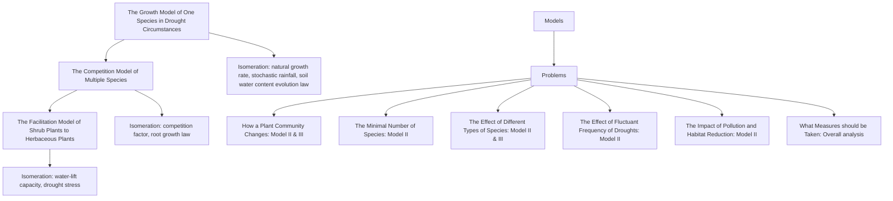
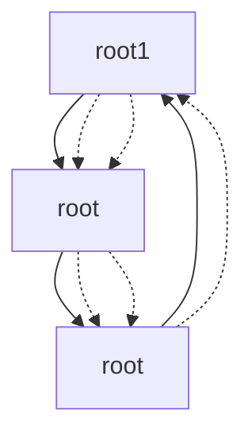

## A Methodology to Simulate Drought-Stricken Plant Communities

## Summary

The study of plant communities in arid areas is an indispensable part of environmental protection. In these regions, annual plants are important components of vegetation, by virtue of their unique characteristics. This paper presents a method of simulation for the growth, competition, and facilitation of annual plants, which can be applied to various circumstances.

To begin with, we establish the Growth Model of annual plants. At first, we determine the relationship between soil water content and the natural growth rate in Logistic Model. Then, we build the differential equation of soil water content, based on the stochastic rainfall model. Finally, we establish the law of annual plant reproduction. To estimate the statistical parameters in the stochastic rainfall model, we use Normal Equation to get the optimal parameters according to Least Square Method.

Based on the Growth Model, we establish the Competition Model of various plants to simulate their root competition. For the competition coefficient in Lotka-Volterra Model, we innovatively determine its relationship with root growth and water-utilizing capacity of plants. Considering the structure of root system, we estimate the parameters in the model reasonably.

Based on the Competition Model, we further establish the Facilitation Model of shrub plants to herbaceous plants. Given the water-lifting action of shrub plants, we modify the water absorption rate in the Competition Model. So far, our models have been elaborated and the parameters have been estimated properly.

After that, we use the fourth order Runge-Kutta algorithm to give numerical solutions to the differential equations. And the problems in the Requirement have been solved as follows:

Based on the results from our TOPSIS model, at least eight plant species are required to provide overall benefits for the community. As the number of plant species grows, the scale of the community will decrease, while the community will embrace better stability.  
By improving the water absorption efficiency of herbaceous plants, shrubs can reduce the interspecific competition, make the average biomass of different herbaceous plants close to each other, and improve the stability of biodiversity.  
Under more severe drought conditions provided in Section 5.4, the scale of the community will be decreased by over 67% and the fluctuation of the evolution will be enlarged by over 36%. But these indexes still follow the similar trend in Section 5.2 as the number of species grows regardless of different weather cycles.  
The effects of two typical types of pollutants are compared. The results show that pollutants such as acid rain are more dangerous because it can decrease the scale by 14.6% and increase the fluctuation by 14.4% at the same time. Also, the diminishment of habitat by 50% will cause the system to lose 22.9% of its scale but reduce 8.7% of its fluctuation.  
Based on our model and analysis, our strategies are expressed from two main aspects： the Preservation and Modification of the ecosystem.

Finally, the sensitivity and stability of the model are fully analyzed.

Keywords: Growth Model; Competition model; Facilitation model; 4th Runge-Kutta; TOPSIS

## Content

## 1 Introduction ........

1.1 Background .  
1.2 Restatement of the Problem . 3  
1.3 Our Work. ∆

## 2 Assumptions and Justifications......

## 3 Notations .....

## 4 Model Establishment ....

4.1 The Growth Model of One Species in Drought Circumstances.. .. 6  
4.2 The Competition Model of Multiple Species.. 9  
4.3 The Facilitation Model of Shrub Plants to Herbaceous Plants . 12  
4.4 Reasonable Estimation of Essential Parameters . 13

## 5 Model Computed and Results Analysis ..... ..15

5.1 Model Computed Algorithm . .15  
5.2 Evaluation of the Benefit for a Multi-Plants Community. .16  
5.3 The Effect of Different Types of Species in the Community... .17  
5.4 The Effect of Fluctuant Frequency of Drought .18  
5.5 The Impact of Other Factors on Plant Community. .19  
5.6 Measures Needed for Long-Term Viability .... .20

## 6 Sensitivity Analysis and Stability Analysis ........... ....21

6.1 Sensitivity Analysis... .21  
6.2 Stability Analysis . 22

## 7 Strengths and Weaknesses.... .24

7.1 Strengths .24  
7.2 Weaknesses . 24

## References .... 25

## 1 Introduction

## 1.1 Background

Arid environments are characterized by limited and variable rainfall that supplies resources in pulses. And grasslands, mostly covered by herbages and shrubs, are quite sensitive to the shortage of water. Plenty of observations reveal that the number of different species has essential effects on how a plant community adapts to droughts which may take place at changeable frequencies and wide range of severity. To be specific, plants are better adapted to drought conditions in communities with several species, rather than in those with only one species. Therefore, this phenomenon, which is a consequence of localized biodiversity, is of great research value.

text_image

Plant Community
tree (rare)
herbage
shrub

Figure 1: A Plant Community in Arid Environment

## 1.2 Restatement of the Problem

Considering the background information and limiting conditions identified in the problem statement, we are supposed to address the following issues:

Build a mathematical model to describe drought adaptability with regard to the number of species in a plant community. Notably, we need to predict what changes will take place when a plant community is exposed to variable weather cycles. And our model should account for interactions between different species in this process.  
Find out the minimal number of species necessary for a plant community to benefit from localized biodiversity. And forecast what will happen when the number of species increases. What is more, we should analyze the sensitivity of the model by changing the types of species in the plant community.

Discuss whether the number of species have the same impact on the overall population if the occurrence of droughts has fluctuant frequency and greater variation. Meanwhile, we should also take other factors such as pollution and habitat reduction into consideration.  
Illustrate what measures should be taken to ensure the long-term viability of a plant community. Conclude the impacts of this phenomenon on the larger environment.

## 1.3 Our Work

In this paper, we establish three mathematical models progressively and address six problems, which are listed below:

flowchart

Figure 2: Models and Problems

## 2 Assumptions and Justifications

To simplify the problems, we make the following assumptions, each of which is justified.

Assumption 1: The research object of this paper is mainly summer-type annual plants, whose life cycle is from spring to autumn. The biomass of these plants will be converted into the biomass of seed banks in winter.

Justification: According to [1], annual plants have the characteristics of fast growth, strong reproductive ability and short life cycle. These plants are an important part of vegetation in arid areas, with high research value.

Assumption 2: Rainfall is completed instantaneously in arid areas, and there is no additional water supply between two rains.

Justification: The duration of each rainfall in arid areas is far shorter than the timescale in years which we want to study. At the same time, the vast majority of arid areas are short of surface water resources, such as rivers and lakes. So, we can consider that the only way for water supply is rainfall.

Assumption 3: Water evaporation is directly proportional to the total water amount in the soil in arid areas.

Justification: The evaporation effect of water in arid areas is significant throughout the year. In addition, the soil in arid areas is usually loose. Therefore, the water in the soil is exposed to air uniformly, so we can infer that the water evaporation is proportional to the total water amount.

Assumption 4: Annual plants have a regular period of flowering and fruiting, and the duration of flowering is short.

Justification: Annual plants have fixed life cycle and regular flowering period. Due to the influence of arid environment, the flowering period of plants is generally short, often within several days. This span is also far shorter than the time-scale in years which we want to study.

Assumption 5: The average biomass (or average mass) of plants is directly proportional to the volume of the root system.

Justification: It can be seen that a plant needs more resources if its biomass is larger. And the main limitation of plants is the shortage of water in arid areas. Considering that the root system is the main way for plants to absorb water, it is plausible to assume that the average biomass of plants is directly proportional to the volume covered by roots.

Assumption 6: In the experimental area, the plants distribute evenly.

Justification: In order to reduce the competition for resources, the plants tend to distribute evenly all over the area.

Assumption 7: In the process of plant growth (between germination and flowering), the death of the whole plant is not considered.

Justification: In our model, environmental restricts and interspecific competitions are considered to have an impact on the average biomass of the plants. We ignore the possibility that the above factors may lead to the death of the whole plant.

## 3 Notations

The primary notations used in this paper are listed in Table 1.

Table 1: Notations used in this paper

<table><tr><td>Symbol</td><td>Definition</td><td>Unit</td></tr><tr><td> $r$ </td><td>inherent growth rate</td><td>—</td></tr><tr><td> $B_{i}$ </td><td>the average biomass of species  $i$ </td><td> $kg$ </td></tr><tr><td> $K_{i}$ </td><td>the maximum average biomass of species  $i$  within environmental limit</td><td> $kg$ </td></tr><tr><td> $R$ </td><td>resource availability (soil water content)</td><td> $kg$ </td></tr><tr><td> $f_{i}(R)$ </td><td>the rate of resource uptake per unit biomass</td><td>—</td></tr><tr><td> $c_{i}$ </td><td>the conversion efficiency from water to biomass increment</td><td>—</td></tr><tr><td> $m_{i}$ </td><td>the loss rate of plants per unit time</td><td>—</td></tr><tr><td> $a_{i}$ </td><td>to what extent water absorption rate changes with resource availability</td><td>—</td></tr><tr><td> $d_{i}$ </td><td>the upper limit of water absorption rage</td><td>—</td></tr><tr><td> $\theta_{i}$ </td><td>controls the variation trend of the uptake curve</td><td>—</td></tr><tr><td> $Bank_{i}$ </td><td>the biomass of seed bank of species  $i$ </td><td> $kg$ </td></tr><tr><td> $\phi_i$ </td><td>the conversion ratio from the total biomass into seeds</td><td>—</td></tr><tr><td> $\sigma_{ij}$ </td><td>the water resources consumed by unit biomass of plant  $i$  is  $\sigma_{ij}$  times of that of plant  $j$ , in which plant  $j$  is located</td><td>—</td></tr><tr><td> $D_i$ </td><td>the average diameter of root extension of plant  $i$ </td><td> $m$ </td></tr><tr><td> $\lambda_i$ </td><td>the relative water-utilizing capacity</td><td>—</td></tr><tr><td> $S_i$ </td><td>the average root coverage of plant  $i$ </td><td> $m^2$ </td></tr><tr><td> $S_i'$ </td><td>the average overlapping area of plant  $i$  and other plants</td><td> $m^2$ </td></tr><tr><td> $V_i$ </td><td>the volume of the root system of a plant  $i$ </td><td> $m^3$ </td></tr><tr><td> $\beta_i$ </td><td>scale factor of  $B_i$  to  $V_i$ </td><td>—</td></tr><tr><td> $n_i$ </td><td>the number of plants</td><td>1</td></tr><tr><td> $d_i'$ </td><td>the upper limit of water absorption rage with competition</td><td>—</td></tr><tr><td> $h$ </td><td>the water-lift capacity of shrubs per unit biomass</td><td>—</td></tr><tr><td> $L_{total}$ </td><td>the root length in total</td><td> $m$ </td></tr><tr><td> $L_{normal}$ </td><td>the average length of a root</td><td> $m$ </td></tr><tr><td> $z$ </td><td>root coefficient</td><td>1</td></tr><tr><td> $M^{(k)}$ </td><td>the total weight of the plant species in the  $k^{th}$  year</td><td> $kg$ </td></tr><tr><td> $E$ </td><td>the average total weight</td><td> $kg$ </td></tr><tr><td> $var$ </td><td>the yearly fluctuation of the total weight (variance of the data)</td><td> $kg^2$ </td></tr></table>

## 4 Model Establishment

## 4.1 The Growth Model of One Species in Drought Circumstances

This section establishes the growth model of only one species in drought circumstances. In this case, there is only one species in a certain area. We define $B _ { i }$ as the average biomass of species , which will increase according to Logistic Model. We have

$$
\frac {d B _ {i}}{d t} = r _ {i} B _ {i} \left(1 - \frac {B _ {i}}{K _ {i}}\right) \tag {1}
$$

where $r _ { i }$ is inherent growth rate, $K _ { i }$ is the maximum average biomass of species within environmental limit.

In arid and semi-arid regions, plants have relatively unique growth laws, and the extreme climate conditions and water resource constraints have a serious impact on the normal growth of plants [2][3]. Therefore, it is necessary to modify formula (1) according to the environmental characteristics of arid regions.

## Natural growth rate against drought conditions

According to the research on the growth of plants in arid regions [4], the inherent growth rate of plants is related to the characteristics of themselves and soil water content of the local land, which can be expressed as follows:

$$
r _ {i} = c _ {i} f _ {i} (R) - m _ {i} \tag {2}
$$

where $r _ { i }$ is the inherent growth rate, is resource availability (soil water content), $f _ { i } ( R )$

is the rate of resource uptake per unit biomass as a function of resource availability, $c _ { i }$ represents the conversion efficiency of plants to convert absorbed water into biomass increment, and $m _ { i }$ is the loss rate of plants per unit time, which is caused by the metabolism, natural death and the destruction from other creatures.

In particular, $f _ { i } ( R )$ here can be formulated as

$$
f _ {i} (R) = \frac {a _ {i} R ^ {\theta_ {i}}}{1 + a _ {i} d _ {i} R ^ {\theta_ {i}}} \tag {3}
$$

where $a _ { i }$ denotes to what extent water absorption rate changes with resource availability, $d _ { i }$ controls the upper limit of water absorption rage, and $\theta _ { i }$ controls the variation trend of the uptake curve.

## − The stochastic rainfall model

As is mentioned in Assumption 2, the raining in drought areas can be treated as an instantaneous impulse of water. Therefore, we need two variables to determine a specific rainfall. Specifically, $t _ { p }$ denotes the relative time of the rainfall within a year, and denotes the total volume of the rain.

In literature [3], the author provides a model to predict the timing of the rain impulse in a year and the amount of rain in drought areas. At first, the timing of the rainfall is a random draw from the Beta Distribution with parameters and $q$ . It can be written as [5]

$$
g (t) = \frac {\Gamma (p + q)}{\Gamma (p) \Gamma (q)} t ^ {p - 1} (1 - t) ^ {q - 1}, (0 \leq t \leq 1) \tag {4}
$$

where is the Gamma Function, and $g ( t )$ is the probability density of the timing in a year.

The amount of rain is also treated as a random draw from the log-natural distribution, in which parameters $\mu$ and $\sigma$ are respectively the mean and variance of the natural log of the amount of rainfall. Hence, can be obtained as

$$
\text { rainfall } = \exp (\zeta), \zeta \sim N \left(\mu , \sigma^ {2}\right) \tag {5}
$$

## ⚫ The law of water content changing in the soil

According to Assumption 2, there is no additional water supply between two rains. Therefore, the water in the soil continues decreasing, mainly due to the absorption of plants and evaporation. In particular, as is mentioned in Assumption 3, water evaporation is directly proportional to the total water amount. Setting the scale factor as , we have

$$
\frac {d}{d t} R = - f _ {i} (R) B _ {i} - \epsilon R \tag {6}
$$

Meanwhile, we mark the instant of rainfall as $t _ { p }$ . According to Assumption 2, the water stored in the soil changes instantaneously

$$
R \mid_ {\text { after   raining }} = R \mid_ {\text { before   raining }} + \text { rainfall } \tag {7}
$$

## The law of plant life and the evolution of seed bank

According to Assumption 4, summer-type annual plants have a regular period of flowering. In this process, plants complete flowering, mating and fruiting. In general, annual plants wither and die after the period of flowering, but their seeds will grow next year at a ratio (marked as $\eta _ { i } )$ . At the same time, a certain proportion of the total biomass is converted into new seeds and added to the seed bank (marked as $B a n k _ { i } )$ . Assuming the conversion ratio from the total biomass into seeds as $\phi _ { i } .$ , we can infer the seed bank of species changes as follows:

$$
\left. \text {Bank} _ {i} \right| _ {\text {after fruiting}} = \left. \text {Bank} _ {i} \right| _ {\text {before fruiting}} + \phi_ {i} B _ {i} | _ {\text {before fruiting}} \tag {8}
$$

To sum up, we obtain the evolution model of species in arid environments without competition with other species. Specifically, the evolution rules are as follows:

(i) In the process of growth, the average biomass $B _ { i }$ and soil water content follow the differential equations below

$$
\left\{ \begin{array}{l} \frac {d B _ {i}}{d t} = (c _ {i} f _ {i} (R) - m _ {i}) B _ {i} \left(1 - \frac {B _ {i}}{K _ {i}}\right), \\ \frac {d}{d t} R = - f _ {i} (R) B _ {i} - \epsilon R. \end{array} \right. \tag {9}
$$

(ii) When the rain occurs in $t _ { p }$ , soil water content will change instantaneously

$$
R \mid_ {\text { after   raining }} = R \mid_ {\text { before   raining }} + \text { rainfall } \tag {10}
$$

(iii) After the period of flowering, plant population generates seed. $\mathrm { S o } .$ , the total biomass $B _ { i }$ and the seed bank $B a n k _ { i }$ are described by the following equations

$$
\left\{ \begin{array}{l} B _ {i} \mid_ {\text {after fruiting}} = (1 - \phi_ {i}) B _ {i} \mid_ {\text {before fruiting}}, \\ \text {Bank} _ {i} \mid_ {\text {after fruiting}} = \text {Bank} _ {i} \mid_ {\text {before fruiting}} + \phi_ {i} B _ {i} \mid_ {\text {before fruiting}}. \end{array} \right. \tag {11}
$$

(iv) After the period of flowering, all summer-type annual plants will die. And in the spring of the next year, some seeds germinate and start to grow at a ratio $\eta _ { i }$ , which means

$$
\left\{ \begin{array}{l} B _ {i} \mid_ {\text {after flowering}} = 0, \\ B _ {i} \mid_ {\text {next year}} = \eta_ {i} \text {Bank} _ {i} \mid_ {\text {after fruiting}}. \end{array} \right. \tag {12}
$$

line chart

| days | average biomass |
| ---- | --------------- |
| 0    | 0.2             |
| 150  | 0.2             |
| 200  | 0.4             |
| 250  | 0.5             |
| 300  | 0.5             |
| 350  | 0.5             |
| 375  | 0.5             |

line chart

| years | average biomass |
| ----- | --------------- |
| 0     | 0.49            |
| 2     | 0.47            |
| 4     | 0.38            |
| 6     | 0.36            |
| 8     | 0.45            |
| 10    | 0.44            |
| 12    | 0.41            |
| 14    | 0.42            |
| 16    | 0.33            |
| 18    | 0.39            |
| 20    | 0.34            |

Figure 3: One Species Changes in One Year and 30 Years

## 4.2 The Competition Model of Multiple Species

As is mentioned earlier, we established the growth model of one species against irregular climate change. In this section, we take the competition among multiple species into account. We consider the competition between two species first. Based on Lotka-Volterra Model, we introduce the influence factor [6] to express the competition on the basis of formula (9)

$$
\left\{ \begin{array}{l} \frac {d B _ {1}}{d t} = \left(c _ {1} f _ {1} (R) - m _ {1}\right) B _ {1} \left(1 - \frac {B _ {1}}{K _ {1}} - \sigma_ {2 1} \frac {B _ {2}}{K _ {2}}\right), \\ \frac {d B _ {2}}{d t} = \left(c _ {2} f _ {2} (R) - m _ {2}\right) B _ {2} \left(1 - \frac {B _ {2}}{K _ {2}} - \sigma_ {1 2} \frac {B _ {1}}{K _ {1}}\right). \end{array} \right. \tag {13}
$$

where $\sigma _ { 1 2 } \mathrm { ~ , ~ } \ \sigma _ { 2 1 }$ represent the competition between two populations. Considering that in arid environments, the main resource for competition is water, we define $\sigma _ { 1 2 } \mathrm { ~ , ~ } \ \sigma _ { 2 1 }$ as follows:

$\begin{array} { r l } { \ \diamond } & { { } \ \sigma _ { i j } } \end{array}$ indicates that the water resources consumed by unit biomass of plant is $\sigma _ { i j }$ times of that of plant $j$ , in which plant is located.

We deduce the values of $\sigma _ { 1 2 }$ and $\sigma _ { 2 1 }$ from the perspective of root growth [7]. Assuming that the average diameter of root extension of plant is $D _ { i }$ , we get the average radius as $D _ { i } / 2$ . Thus, the root coverage area is $\pi { D _ { i } } ^ { 2 } / 4$ . If the root coverage between plant 1 and plant 2 overlaps, we can infer that there is competition for water resources between these two plants.

text_image

Plant 1
Battlefield
Plant 2
D₁
D₂

Figure 4: The Battlefield between Two Plants

First, normalize the water-utilizing capacity parameters $a _ { 1 } , \textrm { \textit { a } } _ { 2 }$ , and obtain the relative water-utilizing capacity $\lambda _ { 1 } , ~ \lambda _ { 2 }$ , which satisfy

$$
\lambda_ {1} + \lambda_ {2} = 1 \tag {14}
$$

According to the definition of $\sigma _ { 1 2 } \mathrm { ~ , ~ } \ \sigma _ { 2 1 }$ , we can deduce that

$$
\left\{ \begin{array}{l} \sigma_ {1 2} = \frac {\lambda_ {1} S _ {2} ^ {\prime}}{\lambda_ {2} S _ {2}}, \\ \sigma_ {2 1} = \frac {\lambda_ {2} S _ {1} ^ {\prime}}{\lambda_ {1} S _ {1}}. \end{array} \right. \tag {15}
$$

where

$S _ { 1 } { ' }$ indicates the average overlapping area of plant 1 and other plants, $S _ { 2 } { ' }$ indicates the average overlapping area of plant 2 and other plants, $S _ { 1 } { = } \pi D _ { 1 } { } ^ { 2 } / 4$ , which is the average root coverage of plant 1, $S _ { 2 } = \pi { D _ { 2 } } ^ { 2 } / 4$ , which is the average root coverage of plant 2.

As for the root coverage $S _ { i }$ and average overlapping area $S _ { i } { ' }$ , we can estimate them based on the number and average biomass of plants in the experimental area.

According to Assumption 5, we can figure out the volume of the root system from the average biomass of plants by

$$
V _ {i} = \beta_ {i} B _ {i} = \frac {1}{2} * \frac {4}{3} \pi \left(\frac {D _ {i}}{2}\right) ^ {3} \tag {16}
$$

where $\beta _ { i }$ is a scale factor, and $V _ { i }$ is the volume of the root system of a plant , which can be estimated from the growth data of plants. Specifically, we can collect the data of root length and plant biomass during the plant growth and thus determine the scale factor.

From the volume of the root system, we can further obtain the root coverage area by

$$
S _ {i} = \sqrt [ 3 ]{\frac {9 \pi V _ {i} ^ {2}}{4}} \tag {17}
$$

As is mentioned in Assumption 7, we assume the number of plants (marked as $n _ { i } )$ remain constant in the process of growth (between germination and flowering). Thus, based on Assumption 6, we estimate the average overlapping area of various plants by

$$
S _ {i} ^ {\prime} = S _ {i} - \frac {S _ {\text { total }}}{\sum_ {k = 1} ^ {2} n _ {k}}, (i = 1, 2) \tag {18}
$$

It is worth noting that if the result of the average overlapping area is less than 0. We infer that there is no competition between this plant and other plants. Then, we sort out the differential equations model of two plant populations competing during the growth period in a year, which can be described as

$$
\left\{ \begin{array}{l} \frac {d}{d t} B _ {1} = (c _ {1} R - m _ {1}) B _ {1} \left(1 - \frac {B _ {1}}{K _ {1}} - \sigma_ {2 1} \frac {B _ {2}}{K _ {2}}\right), \\ \frac {d}{d t} B _ {2} = (c _ {2} R - m _ {2}) B _ {2} \left(1 - \frac {B _ {2}}{K _ {2}} - \sigma_ {1 2} \frac {B _ {1}}{K _ {1}}\right), \\ \frac {d}{d t} R = - \sum_ {i = 1} ^ {2} f _ {i} (R) B _ {i} n _ {i} - \varepsilon R. \end{array} \right. \tag {19}
$$

The parameters in formula (19) can be determined by the following rules:

$$
\left\{ \begin{array}{l} \sigma_ {1 2} = \frac {\lambda_ {1} S _ {2} ^ {\prime}}{\lambda_ {2} S _ {2}}, \\ \sigma_ {2 1} = \frac {\lambda_ {2} S _ {1} ^ {\prime}}{\lambda_ {1} S _ {1}}, \\ S _ {i} ^ {\prime} = S _ {i} - \frac {S _ {\text {total}}}{2}, (i = 1, 2), \\ \sum_ {k = 1} n _ {k} \\ \lambda_ {1} + \lambda_ {2} = 1. \end{array} \right. \tag {20}
$$

Finally, we get the differential equations model of plant populations competing with each other in the growth period in a year, which can be described as

$$
\left\{ \begin{array}{l} \frac {d B _ {i}}{d t} = \left(c _ {i} f _ {i} (R) - m _ {i}\right) B _ {i} \left(1 - \frac {B _ {i}}{K _ {i}} - \sum_ {j \neq i} \sigma_ {j i} \frac {B _ {j}}{K _ {j}}\right), (i = 1, 2, 3, \dots , N), \\ \frac {d}{d t} R = - \sum_ {i = 1} ^ {N} f _ {i} (R) B _ {i} n _ {i} - \varepsilon R. \end{array} \right. \tag {21}
$$

The parameters in formula (21) can be determined by the following rules:

$$
\left\{ \begin{array}{l} \sigma_ {j i} = \frac {\lambda_ {j} S _ {i} ^ {\prime}}{\lambda_ {i} S _ {i}}, (i, j = 1, 2, 3, \dots , N), (i \neq j) \\ S _ {i} ^ {\prime} = S _ {i} - \frac {S _ {\text {total}}}{\sum_ {k = 1} ^ {N} n _ {k}}, (i = 1, 2, 3, \dots , N), \\ \sum_ {n = 1} ^ {N} \lambda_ {n} = 1. \end{array} \right. \tag {22}
$$

Based on the differential equations above, the final model can be obtained by considering formula (10\~12) comprehensively.

line chart

| days | species one | species two | species three | species four | species five |
|------|-------------|-------------|--------------|--------------|--------------|
| 0    | 0.200       | 0.200       | 0.200        | 0.200        | 0.200        |
| 100  | 0.204       | 0.204       | 0.204        | 0.204        | 0.204        |
| 350  | 0.205       | 0.205       | 0.205        | 0.205        | 0.205        |

line chart

| years | species one | species two | species three | species four | species five |
| ----- | ----------- | ----------- | ------------- | ------------ | ------------ |
| 0     | 0.22        | 0.21        | 0.20          | 0.20         | 0.20         |
| 5     | 0.24        | 0.18        | 0.14          | 0.11         | 0.07         |
| 10    | 0.26        | 0.19        | 0.13          | 0.09         | 0.06         |
| 15    | 0.23        | 0.17        | 0.12          | 0.08         | 0.05         |
| 20    | 0.28        | 0.18        | 0.11          | 0.07         | 0.05         |
| 25    | 0.32        | 0.20        | 0.13          | 0.08         | 0.04         |
| 30    | 0.31        | 0.19        | 0.12          | 0.07         | 0.04         |

Figure 5: A Plant Community Changes in One Year and 30 Years

## 4.3 The Facilitation Model of Shrub Plants to Herbaceous Plants

In Sec. 4.2, we established the interspecific competition model of plants during circles of drought from the perspective of root competition of water. This model applies to all plants. However, against drought stress, shrub plants play a unique role in facilitating the growth of herbaceous plants [8]. This facilitation is mainly reflected in the fact that shrub plants can improve the survival and growth of herbaceous plants. Considering that the introduction of shrub plants cannot boost the soil water content $R$ directly, we infer that shrub plants can improve the limiting factor of the water absorption rate (which is marked as $f _ { i } ( R ) )$ ). According to formula (3), we see that $f _ { i } ( R )$ is affected by $a _ { i }$ and $d _ { i }$ . Due to the reason that $a _ { i }$ denotes to what extent water absorption rate changes with resource availability, it is an inherent attribute of a plant. We regard that $a _ { i }$ would not change with the introduction of shrubs. Thus, we speculate that shrubs can affect $f _ { i } ( R )$ by influencing $d _ { i }$ . Based on the competition model in Sec. 4.2, we further modify the parameter $d _ { i }$ to $d _ { i } ^ { \phantom { \dagger } }$ .

According to the research of Richards team [9] and Prieto team [10], we find that shrub roots can lift water from the deep soil onto the shallow soil. This process can improve the environment of shallow soil and facilitate other plants to absorb water. Considering the smaller $d _ { i }$ , the higher the water absorption rate of plants, we infer that

$$
d _ {i} ^ {\prime} = \frac {1}{1 + h \sum_ {j \neq i} \frac {B _ {j}}{K _ {j}} \delta_ {j}} d _ {i} \tag {23}
$$

where

is a scale factor, which reflects the water-lift capacity of shrubs per unit biomass,

$$
\delta_ {j} = \left\{ \begin{array}{l} 1, p l a n t j i s s h r u b, \\ 0, p l a n t j i s o t h e r p l a n t s. \end{array} \right.
$$

The analysis of formula (23) shows that when there are no shrubs around plant $i , d _ { i } ^ { \prime }$ is equal to $d _ { i }$ . When shrubs exist, the more biomass of shrubs, the smaller $d _ { i } ^ { \phantom { \dagger } }$ is. Therefore, the water absorption rate $f _ { i } ( R )$ will raise if there are shrubs around plant .

Meanwhile, according to the research of Butterfield team [11], the facilitating effect of shrubs on soil moisture will decrease with the increase of drought. Considering that soil water content is one of the criteria to measure the degree of drought, we further modify formula (23):

$$
d _ {i} ^ {\prime} = \left(\frac {1}{1 + h \sum_ {j \neq i} \frac {B _ {j}}{K _ {j}} \delta_ {j}} d _ {i}\right) e ^ {\frac {1}{R}} \tag {24}
$$

where is resource availability (soil water content). With the increase of the soil water content, $d _ { i } ^ { \phantom { \dagger } }$ decreases monotonically. Thus, $f _ { i } ( R )$ increases, which means the plant absorbs water at a higher rate.

Because the facilitation mechanism of shrubs on herbaceous plants is complex and uncertain, there is no relatively consistent research results at present [8]. Therefore, we establish the model above according to the analysis of specific situations. And we will give our own estimation of the parameters in the simulation.

## 4.4 Reasonable Estimation of Essential Parameters

In this section, we make reasonable estimations of the parameters in the previous model.

## Statistical parameters in the stochastic rainfall model

According to the stochastic rainfall model established in Sec. 4.1, the average amount of rain in a year can be obtained as . Since $\zeta \sim N ( \mu , \sigma ^ { 2 } )$ , we need determine the mean $\mu$ and variation $\sigma ^ { 2 }$ .

We looked up the annual precipitation in areas of different degrees of drought. We find the average annual precipitation in severe drought areas is only 32.5mm [12], such as the southern edge of the Taklimakan Desert. The average annual precipitation in moderately arid areas is about 113.2mm [13], like the primitive desert in the middle of the Hexi Corridor in China. And this data is about 360mm for semi-arid areas [14], like the Sandi Cypress Nature Reserve in Wushen Banner, Inner Mongolia, China.

Considering that our experimental area is $1 0 0 0 0 { \mathrm { m } } ^ { 2 } ; { \mathrm { ~ } }$ , the average annual precipitation mass is 325kg, 1132kg and 3600kg against the different drought degrees above. According to the rule in statistics, there is a probability of 95% that $\mu \in [ \mu - 3 \sigma , \mu + 3 \sigma ]$ . We have

$$
\left\{ \begin{array}{l} e ^ {u + 3 \sigma} = 3 6 0 0, \\ e ^ {\mu} = 1 1 3 2, \\ e ^ {u - 3 \sigma} = 3 2 5. \end{array} \Rightarrow \left[ \begin{array}{c c} 1 & 3 \\ 1 & 0 \\ 1 & - 3 \end{array} \right] \left[ \begin{array}{l} \mu \\ \sigma \end{array} \right] = \left[ \begin{array}{l} 8. 1 8 9 \\ 7. 0 3 2 \\ 5. 7 8 4 \end{array} \right] \right. \tag {25}
$$

The equations about $\mu$ and $\sigma$ above are overdetermined. According to normal equations, we obtain the optimal parameter values based on Least Square Method

$$
[ \mu \sigma ] ^ {T} = (A ^ {T} A) ^ {- 1} A ^ {T} B \tag {26}
$$

where A is the coefficient matrix of $\mu , ~ \sigma$ in formula (25), B is .

Finally, we obtain that $\mu { = } 7 . 0 0 1 7 , \enspace \sigma { = } 0 . 4 0 0 8$ .

## Scale factor $\beta _ { i }$ between the volume of the root system and the biomass of plant

In arid environments, plant roots cover a wider area as much as possible. According to the discussion on the topological structure of root system [13], an ideal model is binary branching.

flowchart

Figure 6: Binary Branching Model of Plant Roots

For further discussion, we introduce the concept of root and root connection length, shown in Figure 6. Reaumuria soongorica (RS) and Nitraria tangutorum (NT) are two common populations in desert areas. According to [12], the average root length in total of RS is 3185.5cm, with an average root connection length of 29.8cm. While the average root length in total of NT is 4802.5cm, and the average root connection length is 49.0cm.

By analyzing the characteristic of binary branching, we have

$$
L _ {\text { total }} = L _ {\text { normal }} (2 ^ {z} - 1) \tag {27}
$$

where $L _ { t o t a l }$ is the root length in total, $L _ { n o r m a l }$ is the average length of a root and $z$ is a root coefficient, which reflects how many branches are there in the root system.

Next, we plug the average root length in total and the average root connection length into formula (27). We obtain

$$
z _ {R S} \approx 7, z _ {N T} \approx 7 \tag {28}
$$

Then, we consider that plant roots will extend around in spherical shape in order to absorb water. So, we estimate the diameter of root system as follows:

$$
\left\{ \begin{array}{l} D _ {R S} = 2 z _ {R S} L _ {\text {normal} | R S} = 4. 1 7 m, \\ D _ {N T} = 2 z _ {N T} L _ {\text {normal} | N T} = 6. 8 6 m. \end{array} \right. \tag {29}
$$

We simplify the root system as half a sphere, so we can also obtain the volume of roots.

Taking the mass of a single plant of two populations into account, we determine $\beta _ { R S }$ and $\beta _ { N T }$ by formula (16). Since these two populations are representative in arid areas, we estimate the universal scale factor $\beta$ according to the average of the two values, which derives

$$
\beta \approx \frac {\beta_ {R S} + \beta_ {N T}}{2} = 1 0 8. 9 \tag {30}
$$

Since $\beta$ is a scale factor between the volume of roots and the biomass of plant, it reflects a universal law. Therefore, we regard that this scale factors of different plants are approximately equal. In the simulation, we substitute the scale factor of different species $\beta _ { i }$ by .

## Estimation of other parameters

Besides the above two parameters, we also need determine $c _ { i } , a _ { i }$ and $K _ { i }$ .

As is mentioned in the previous description (Sec. 4.1), $c _ { i }$ represents the conversion efficiency of plants to convert absorbed water into biomass increment and $a _ { i }$ denotes to what extent water absorption rate changes with resource availability. According to [4], the reasonable range of $c _ { i }$ is , while the range of $a _ { i }$ is . When considering different plant species, we take values within the above range to ensure the rationality of the final results.

According to the early analysis in Sec. 4.1, $K _ { i }$ is the maximum average biomass of species within environmental limit. It is obvious that $K _ { i }$ should be unequal for different species. However, as for summer-type annual plants which are studied in our paper, $K _ { i }$ is generally less than 0.5kg [7]. So, it is rational to set the value around .

## 5 Model Computed and Results Analysis

## 5.1 Model Computed Algorithm

Considering the high accuracy and strong stability of the fourth order Runge-Kutta algorithm, we apply this method for computing the differential equations listed in formula (21). At first, we sort the differential equations into the form of ${ \dot { \boldsymbol { x } } } = f ( t , { \boldsymbol { x } } )$ , where $\boldsymbol { x } = [ B _ { 1 } , B _ { 2 } , \cdots , B _ { n } , R ] ^ { T }$ . Then, we construct the following differential iteration scheme to compute the first order differential equations:

$$
\left\{ \begin{array}{l} x _ {i} = x _ {i - 1} + \Delta t \left(\frac {1}{6} g _ {1} + \frac {1}{3} g _ {2} + \frac {1}{3} g _ {3} + \frac {1}{6} g _ {4}\right), \\ g _ {1} = f (t _ {i - 1}, x _ {i - 1}), \\ g _ {2} = f \left(t _ {i - 1} + \frac {1}{2} \Delta t, x _ {i - 1} + \frac {1}{2} g _ {1} \Delta t\right), \\ g _ {3} = f \left(t _ {i - 1} + \frac {1}{2} \Delta t, x _ {i - 1} + \frac {1}{2} g _ {2} \Delta t\right), \\ g _ {4} = f (t _ {i - 1} + \Delta t, x _ {i - 1} + g _ {3} \Delta t). \end{array} \right. \tag {31}
$$

where is the time step of the computing process.

The details of computing are shown as follows:

Table 2: Illustration of the MATLAB Simulation

<table><tr><td>Input:</td></tr><tr><td>(1) The characteristics of various species, the initial condition of the community</td></tr><tr><td>(2) The simulation time period</td></tr><tr><td>(3) The timing of rainfall based on the beta distribution model</td></tr><tr><td>(4) The amount of water of each rainfall based on the log-normal distribution model</td></tr><tr><td>While: t &lt; Time</td></tr><tr><td>(1) If: at the beginning of a yearA specific proportion of the seed in seedbank will germinateEnd</td></tr><tr><td>(2) Calculate the increase of the biomass of respective species  $B_i$  and the total underground water storage R at the moment using R-K method</td></tr><tr><td>(3) If: the rainfall is encounteredincrease the water storage R by the water amount rainfallEnd</td></tr><tr><td>(4) If: the flowering period in the year has been overconvert  $\phi_i$  of the biomass  $B_i$  to the increase of the seed bankall annual plants dieEnd</td></tr><tr><td>(5) record the evolution of the communityEnd</td></tr></table>

## 5.2 Evaluation of the Benefit for a Multi-Plants Community

For a community of plants, there are two aspects to evaluate its performance facing the irregular weather conditions. One is the weight of all plants, which should be as high as possible. Another is that extreme fluctuations should be avoided to ensure the stability of the ecosystem. To conclude, an ideal ecosystem is supposed to reach the balance between its scale and stability.

The scale of the community in the $k ^ { t h }$ year can be modeled as the total weight of the plant species (marked as $M ^ { ( k ) } )$ ), which can be written as：

$$
M ^ {(k)} = \sum_ {i} B _ {i} ^ {(k)} n _ {i} ^ {(k)} \tag {32}
$$

where ${ B _ { i } } ^ { ( k ) }$ is the average biomass of plant in the $k ^ { t h }$ year, and $n _ { i }$ is the total number of the plant species in this year. To simplify the analysis of the problem, we limit the time within a period of $k _ { \operatorname* { m a x } }$ years.

Considering the total weight of plant of each year, we can calculate the average total weight in this period (marked as $E )$ , which is:

$$
E = \frac {1}{k _ {\max}} \sum_ {k = 1} ^ {k _ {\max}} M ^ {(k)} \tag {33}
$$

The yearly fluctuation of the total weight can be treated as the variance of the data (marked as ), which is expressed as:

$$
\operatorname{var} = \frac {1}{k _ {\max}} \sum_ {k = 1} ^ {k _ {\max}} \left(M ^ {(k)} - E\right) ^ {2} \tag {34}
$$

If biodiversity actually brings benefits to the plant community, it can be reflected by higher scale or lower fluctuation. To evaluate the balance between these two aspects, we employ the method of TOPSIS. TOPSIS (Technique for Order Preference by Similarity to an ideal solution) is a commonly used method in multi-objective decision analysis. Hence, we employ this model to evaluate the performance of the evolution of a plant community. If the performance of the evaluation is better than the case where there is only one plant species, it means the plant community has benefited from the biodiversity. Therefore, we are able to determine how many species are required to benefit the community. The results are shown as follows:

<table><tr><td>Type Number</td><td>Average</td><td>Variance</td></tr><tr><td>1</td><td>946.7</td><td>60119.4</td></tr><tr><td>2</td><td>816.2</td><td>30061.8</td></tr><tr><td>3</td><td>718.9</td><td>24348.6</td></tr><tr><td>4</td><td>647.4</td><td>14108.8</td></tr><tr><td>5</td><td>588.5</td><td>11546.3</td></tr><tr><td>6</td><td>545.7</td><td>10504.2</td></tr><tr><td>7</td><td>511.3</td><td>8892.4</td></tr><tr><td>8</td><td>482.2</td><td>7438.2</td></tr><tr><td>9</td><td>458.5</td><td>5607.4</td></tr><tr><td>10</td><td>431.1</td><td>5267.8</td></tr></table>

Figure 7: Evaluation of the Community’s Scale and Stability Using TOPSIS

Meanwhile, this model also helps reveal what will happen as the number of species grows. What we need to do is enlarge the species number as the input of the simulation program.

The more species there are in the region, the lower the total weight of plants and the smaller the fluctuation the community has to experience against irregular weather conditions. This phenomenon can be explained intuitively by the differential equation model given in formula (21). As the number of species grows, the growth of the plant community will be subjected to more friction due to the more intense competition for the limited water resources. In this community of severe competition, any type of species is inhibited to grow to an extreme large scale within a short time. Therefore, the relative proportion of different species can be maintained, which results in higher stability of the plant community.

The benefit evaluation index deduced with TOPSIS (Figure 7) shows that when the number of species are more than eight, the index will be larger than that of one species. Therefore, over eight types of species are required for the community to gain overall benefit with respect to both the scale and stability of the community.

## 5.3 The Effect of Different Types of Species in the Community

This section presents the impacts of different types of species on the evolution of the plant community. Based on the competition model in Sec.4.2, we find that the greater the difference in $c _ { i }$ between different species in a plant community, the greater the total biomass, but the lower its stability. We further consider the contribution of shrub plants to other plants in the above environment according to the model in Sec.4.3. Specifically, we simulate two types of plant communities and compare their differences.

In the first case, there are three types of different herbages and one type of shrub. As is mentioned in Sec. 4.3, the shrub is able to facilitate the growth of herbages by improving their water absorption rate. Therefore, aside from the competition among species, the cooperation also exists. In the second case, the plant community is constituted by three types of herbages without the shrubs. In other words, there is only competition among species. These two plant communities are put in the same weather circumstances, and the simulation shows their evolution results are as follows:

line chart

| years | without shrub | with shrub |
| ----- | ------------- | ---------- |
| 0     | 750           | 450        |
| 2     | 450           | 250        |
| 4     | 750           | 350        |
| 6     | 450           | 600        |
| 8     | 1100          | 650        |
| 10    | 950           | 600        |
| 12    | 1150          | 700        |
| 14    | 1000          | 500        |
| 16    | 650           | 700        |
| 18    | 1250          | 650        |
| 20    | 1150          | 700        |

line chart

| years | species one without shrub | species one with shrub | species two without shrub | species two with shrub | species three without shrub | species three with shrub |
| ----- | -------------------------- | ----------------------- | -------------------------- | ----------------------- | --------------------------- | ------------------------- |
| 0     | 0.30                       | 0.30                    | 0.30                       | 0.30                    | 0.30                        | 0.30                      |
| 2     | 0.39                       | 0.35                    | 0.35                       | 0.35                    | 0.32                        | 0.28                      |
| 4     | 0.35                       | 0.22                    | 0.28                       | 0.22                    | 0.24                        | 0.22                      |
| 6     | 0.30                       | 0.22                    | 0.22                       | 0.22                    | 0.17                        | 0.21                      |
| 8     | 0.31                       | 0.22                    | 0.22                       | 0.22                    | 0.16                        | 0.21                      |
| 10    | 0.32                       | 0.22                    | 0.22                       | 0.21                    | 0.15                        | 0.21                      |
| 12    | 0.33                       | 0.22                    | 0.22                       | 0.21                    | 0.14                        | 0.21                      |
| 14    | 0.33                       | 0.22                    | 0.21                       | 0.21                    | 0.13                        | 0.21                      |
| 16    | 0.34                       | 0.22                    | 0.21                       | 0.21                    | 0.14                        | 0.21                      |
| 18    | 0.35                       | 0.22                    | 0.23                       | 0.21                    | 0.13                        | 0.21                      |
| 20    | 0.34                       | 0.22                    | 0.21                       | 0.21                    | 0.12                        | 0.21                      |

Figure 8: The Effect of Shrubs on the Biomass of Plant Community

According to the analysis of evolution data, the first community (Dotted line in Figure 8) shows a relatively lower average total weight and a much smaller variance than that of the second community (Solid line in Figure 8). This difference indicates that the addition of shrub leads to a relatively lower scale of the community, due to the root competition. However, the plant community has a much higher stability facing the irregular weather conditions. More importantly, as can be seen from the figure above, shrubs can reduce the competition between different herbages, which is conducive to the maintenance of biodiversity.

## 5.4 The Effect of Fluctuant Frequency of Drought

The drought weather conditions usually come in the form of less rainfall amount each time and lower raining frequency. In order to simulate the impact of various frequency and occurrence of droughts on the plant community, it is a good idea to accordingly alter the time distribution and water amount of each rainfall. When the drought occurs, the rainfall will have less probability to have the same frequency (There is even likely to be no rainfall in the whole year!). This requires a new random variable to control the raining times. Besides, the water amount of each rainfall will also be lower and suffer from more fluctuations, indicating a smaller $\mu$ and a higher $\sigma$ . The rainfall against different circumstances is depicted as follows:

bar chart

| Simulation Time[year] | Rainfall amount[kg] |
| --------------------- | ------------------- |
| 0                     | 200                 |
| 1                     | 540                 |
| 2                     | 270                 |
| 3                     | 100                 |
| 4                     | 350                 |
| 5                     | 0                   |
| 6                     | 420                 |
| 7                     | 350                 |
| 8                     | 420                 |
| 9                     | 360                 |

bar chart

| Simulation Time [year] | Rainfall amount [kg] |
| :--- | :--- |
| 0.5 | 920 |
| 1.5 | 840 |
| 2.5 | 1030 |
| 3.5 | 1880 |
| 4.5 | 700 |
| 5.5 | 1000 |
| 6.5 | 560 |
| 7.5 | 1420 |
| 8.5 | 1040 |
| 9.5 | 780 |
| 10.5 | 890 |

Figure 9: The Rainfall Distribution under Severe and Less Frequent Drought

In our simulations, we suppose that $\tau$ corresponds to the Poisson Distribution with the parameter $\lambda = 1$ . Meanwhile, the $\mu$ and $\sigma$ are also changed to create more severe drought conditions. The simulation results are shown as follows:

line chart

| Simulation Time[year] | normal | severe |
| --------------------- | ------ | ------ |
| 20                    | 400    | 330    |
| 21                    | 620    | 330    |
| 22                    | 600    | 330    |
| 23                    | 330    | 0      |
| 24                    | 550    | 520    |
| 25                    | 380    | 0      |
| 26                    | 490    | 0      |
| 27                    | 400    | 0      |
| 28                    | 670    | 190    |
| 29                    | 500    | 190    |
| 30                    | 660    | 0      |
| 31                    | 420    | 270    |
| 32                    | 520    | 180    |
| 33                    | 510    | 180    |
| 34                    | 480    | 270    |
| 35                    | 470    | 370    |
| 36                    | 600    | 0      |
| 37                    | 450    | 0      |
| 38                    | 440    | 320    |
| 39                    | 410    | 0      |
| 40                    | 520    | 190    |
| 41                    | 480    | 190    |
| 42                    | 550    | 160    |
| 43                    | 480    | 160    |
| 44                    | 550    | 290    |
| 45                    | 480    | 290    |
| 46                    | 550    | 290    |
| 47                    | 480    | 290    |
| 48                    | 550    | 290    |
| 49                    | 480    | 290    |
| 50                    | 550    | 420    |
| 51                    | 480    | 290    |
| 52                    | 550    | 290    |
| 53                    | 480    | 290    |
| 54                    | 550    | 290    |
| 55                    | 670    | 310    |
| 56                    | 510    | 310    |
| 57                    | 670    | 310    |
| 58                    | 510    | 310    |
| 59                    | 510    | 310    |
| 60                    | 510    | 310    |

line chart

| Simulation Time[year] | normal | severe |
| --------------------- | ------ | ------ |
| 20                    | 0.20   | 0.07   |
| 21                    | 0.19   | 0.09   |
| 22                    | 0.18   | 0.10   |
| 23                    | 0.19   | 0.12   |
| 24                    | 0.18   | 0.11   |
| 25                    | 0.19   | 0.00   |
| 26                    | 0.18   | 0.00   |
| 27                    | 0.19   | 0.00   |
| 28                    | 0.18   | 0.00   |
| 29                    | 0.19   | 0.13   |
| 30                    | 0.18   | 0.12   |
| 31                    | 0.19   | 0.09   |
| 32                    | 0.18   | 0.06   |
| 33                    | 0.17   | 0.05   |
| 34                    | 0.18   | 0.09   |
| 35                    | 0.19   | 0.15   |
| 36                    | 0.18   | 0.00   |
| 37                    | 0.19   | 0.00   |
| 38                    | 0.18   | 0.17   |
| 39                    | 0.19   | 0.18   |
| 40                    | 0.18   | 0.17   |
| 41                    | 0.19   | 0.16   |
| 42                    | 0.18   | 0.11   |
| 43                    | 0.19   | 0.16   |
| 44                    | 0.18   | 0.17   |
| 45                    | 0.19   | 0.16   |
| 46                    | 0.18   | 0.16   |
| 47                    | 0.19   | 0.16   |
| 48                    | 0.18   | 0.16   |
| 49                    | 0.19   | 0.16   |
| 50                    | 0.18   | 0.16   |
| 51                    | 0.19   | 0.16   |
| 52                    | 0.18   | 0.16   |
| 53                    | 0.19   | 0.16   |
| 54                    | 0.18   | 0.16   |
| 55                    | 0.19   | 0.16   |
| 56                    | 0.18   | 0.16   |
| 57                    | 0.19   | 0.16   |
| 58                    | 0.18   | 0.16   |
| 59                    | 0.19   | 0.16   |
| 60                    | 0.18   | 0.16   |

Figure 10: Evolution of The Plant Community under Normal and Severe Drought

Against severe drought conditions, the overall water resource availability will be furthermore limited. Therefore, it is understandable that the evolution of plant species will bring out not only lower scale, but also lower stability. Besides, our model shows that the scale and stability of the plant community follow the similar trend (mentioned in the Sec. 5.2) as the number of species grows, which is shown in the following table:

Table 3: The Community’s Scale and Stability Indexes of Less Frequent Drought

<table><tr><td>Type Number</td><td>4</td><td>6</td><td>8</td><td>10</td><td>12</td><td>24</td></tr><tr><td>Average</td><td>209.06</td><td>184.75</td><td>162.48</td><td>153.6</td><td>147.22</td><td>117.14</td></tr><tr><td>Variance</td><td>26346</td><td>15428</td><td>13606</td><td>12569</td><td>7277.6</td><td>3986.1</td></tr></table>

## 5.5 The Impact of Other Factors on Plant Community

## − The impact of different types of pollution

Generally speaking, pollutants alter plants’ metabolism and make them vulnerable to disease or pest infestation. In this section, we study the impacts of two typical kinds of pollutants on the plant community, which are the photochemical smog and the acid rain. Their specific damages on the plants are presented as follows [15]:

 Photochemical smog occurs due to chemical reactions among nitrous oxides from industry activities and VOCs. The resulting products are ground level ozone and peroxyacetyl nitrate. Plants exposed to these contaminants are weaker and have lower chances of survival. Hence, the impact of Photochemical smog can be modeled as in increase of loss rate of plants (marked as $m _ { i } )$ .  
 Acid rain arises from the chemical reactions among Sulphur and nitrogen dioxide with other materials in the atmosphere. Direct exposure of acid rain makes it harder for plants to photosynthesize. Hence, the impact of Acid rain can be treated as a decrease of the conversion efficiency (marked as $c _ { i } )$ .

To simulate the impact of pollution on the plant community, the loss rate of plants and the conversion efficiency should be modified accordingly. The simulation results of the growth of the plant community with contaminants are shown as follows:

  
Figure 11: The Evolution of Community Exposed to Various Pollutants

Compared with the non-polluted cases, the plant community exposed to pollution turn out to achieve lower scale. Besides, it is also notable that different types of contaminants influence the system’s stability in different ways. For the contaminants which increase the loss rate of biomass, such as photochemical smog, it doesn’t impose too much negative influences on the stability. However, this is not the same case when the plants are exposed to the acid rain, which reduces the conversion efficiency. When exposed to these pollutants, the plants community will bring out a much lower stability than that in the non-polluted cases. This phenomenon can be illustrated by the significance of water usage in drought regions.

## The impact of habitat reduction

Similarly, our model can also be utilized to explore the impact of habitat reduction on the growth of species. And the simulation results are shown as follows:

line chart

| years | habitat area is 10000 square meters | habitat area is 15000 square meters | habitat area is 20000 square meters |
| ----- | ------------------------------------ | ------------------------------------ | ------------------------------------ |
| 30    | 650                                  | 450                                  | 620                                  |
| 35    | 520                                  | 650                                  | 720                                  |
| 40    | 480                                  | 550                                  | 680                                  |
| 45    | 380                                  | 580                                  | 700                                  |
| 50    | 550                                  | 620                                  | 710                                  |
| 55    | 420                                  | 580                                  | 730                                  |
| 60    | 510                                  | 590                                  | 710                                  |

<table><tr><td>area(m2)</td><td>Average of total biomass(kg)</td></tr><tr><td>10000</td><td>476.9</td></tr><tr><td>15000</td><td>551.7</td></tr><tr><td>20000</td><td>618.8</td></tr></table>

Figure 12: The Results of Habitat Reduction

It shows that the smaller the habitat is, the smaller the scale is. Since there are less space for the plant species to grow, there will be more intersections of the roots of different plants.

## 5.6 Measures Needed for Long-Term Viability

Based on the simulation results, we obtain a series of strategies to ensure the long-term viability of the plant communities. Our ideas are expressed from two aspects, the Preservation and Modification of the ecosystem.

## Preservation

The ecosystems of plant communities have survived in arid areas for millions of years, indicating its intrinsic robustness facing severe conditions. Therefore, actions should be taken to preserve the naturalness of the communities. Specific strategies are as follows:

(1) Preserve the biodiversity of the plant community. From the simulation of our model in Sec. 4.2 and Sec. 4.3, we found that the competition and facilitation between multiple plant species both guarantee the stability of the system facing severe natural conditions.  
(2) Protect the water resources in drought regions. If water is over exploited, it will add to the shortage of water, reducing the scale and stability of plant communities.  
(3) Prevent and control the pollution. From our analysis in Sec. 5.5, pollutants, especially those like acid rain, have been proved to damage the scale and stability of plant community.

(4) Maintain the habitat of plants. A large enough habitat can leave sufficient living space for the individuals, which helps avoid the severe competition between species.

## Modifications

Despite all these advantages of natural grass communities, they are still vulnerable to severe drought conditions. And modifications can be made to improve the viability of plant communities. Specific strategies are as follows:

(1) Introduce new species. We found that species such as shrub can bring facilitation to other species and add more stability to the ecosystem, which is consistent with the literature. Therefore, some suitable species can be introduced.  
(2) Build irrigation facilities. Some irrigation facilities, such as the Karez in Iran, can gather and preserve the water from the rainfall with less evaporation. So, increasing the soil water availability through artificial facilities is also worth consideration.

## 6 Sensitivity Analysis and Stability Analysis

## 6.1 Sensitivity Analysis

In Sec. 4, we established three models, which include many parameters. In Sec. 4.4, we make reasonable estimations of most parameters. However, it is still difficult to estimate some values through calculation, and the only way for us is to refer to literatures. In this Section, we conduct sensitivity analysis for the parameters got from literatures.

First of all, is the maximum average biomass of species , which reflects the restriction of environment on plant growth. Considering that what we study are mostly annual plants in arid environments, the maximum average biomass of different species should not differ a lot. Therefore, in the previous simulation, we assume that different species have the same .By adjusting the value of , we get the sensitivity analysis curve (taking the competition of three species as an example):

line chart

| years | maximum average biomass is 0.45kg | maximum average biomass is 0.50kg | maximum average biomass is 0.55kg |
| ----- | ---------------------------------- | ---------------------------------- | ---------------------------------- |
| 0     | 450                                | 650                                | 700                                |
| 2     | 150                                | 380                                | 600                                |
| 4     | 350                                | 550                                | 620                                |
| 6     | 400                                | 580                                | 650                                |
| 8     | 420                                | 520                                | 630                                |
| 10    | 380                                | 450                                | 680                                |
| 12    | 620                                | 750                                | 850                                |
| 14    | 600                                | 730                                | 870                                |
| 16    | 500                                | 600                                | 700                                |
| 18    | 480                                | 550                                | 650                                |
| 20    | 550                                | 620                                | 720                                |

Total Biomass

line chart

| years | maximum average biomass is 0.45kg | maximum average biomass is 0.50kg | maximum average biomass is 0.55kg |
| ----- | ---------------------------------- | ---------------------------------- | ---------------------------------- |
| 0     | 0.23                               | 0.24                               | 0.26                               |
| 2     | 0.39                               | 0.28                               | 0.32                               |
| 4     | 0.21                               | 0.22                               | 0.24                               |
| 6     | 0.25                               | 0.27                               | 0.31                               |
| 8     | 0.23                               | 0.25                               | 0.27                               |
| 10    | 0.26                               | 0.30                               | 0.33                               |
| 12    | 0.24                               | 0.27                               | 0.30                               |
| 14    | 0.26                               | 0.30                               | 0.33                               |
| 16    | 0.21                               | 0.31                               | 0.34                               |
| 18    | 0.26                               | 0.29                               | 0.32                               |
| 20    | 0.24                               | 0.27                               | 0.30                               |

Average Biomass of Species 1

line chart

| years | maximum average biomass is 0.45kg | maximum average biomass is 0.50kg | maximum average biomass is 0.55kg |
| ----- | ---------------------------------- | ---------------------------------- | ---------------------------------- |
| 0     | 0.19                               | 0.19                               | 0.19                               |
| 2     | 0.32                               | 0.18                               | 0.18                               |
| 4     | 0.13                               | 0.10                               | 0.10                               |
| 6     | 0.16                               | 0.14                               | 0.13                               |
| 8     | 0.13                               | 0.12                               | 0.11                               |
| 10    | 0.17                               | 0.16                               | 0.15                               |
| 12    | 0.13                               | 0.12                               | 0.12                               |
| 14    | 0.13                               | 0.13                               | 0.13                               |
| 16    | 0.14                               | 0.14                               | 0.13                               |
| 18    | 0.13                               | 0.13                               | 0.12                               |
| 20    | 0.12                               | 0.12                               | 0.11                               |

Average Biomass of Species 2

line chart

| years | maximum average biomass is 0.45kg | maximum average biomass is 0.50kg | maximum average biomass is 0.55kg |
| ----- | ---------------------------------- | ---------------------------------- | ---------------------------------- |
| 0     | 0.16                               | 0.15                               | 0.16                               |
| 2     | 0.22                               | 0.14                               | 0.13                               |
| 4     | 0.08                               | 0.06                               | 0.05                               |
| 6     | 0.11                               | 0.08                               | 0.07                               |
| 8     | 0.07                               | 0.06                               | 0.05                               |
| 10    | 0.11                               | 0.10                               | 0.09                               |
| 12    | 0.07                               | 0.06                               | 0.05                               |
| 14    | 0.08                               | 0.07                               | 0.06                               |
| 16    | 0.09                               | 0.08                               | 0.07                               |
| 18    | 0.08                               | 0.07                               | 0.06                               |
| 20    | 0.06                               | 0.05                               | 0.04                               |

Average Biomass of Species 3  
Figure 13: Effect of Different Values of

Then, we analyze the sensitivity of $\theta _ { i }$ (which controls the variation trend of the uptake curve) and $\phi _ { i }$ (which is the conversion ratio from plant biomass into seeds).

line chart

| years | the characteristic of uptake curve is 1.8 | the characteristic of uptake curve is 2.0 | the characteristic of uptake curve is 2.2 |
| ----- | ---------------------------------------- | ---------------------------------------- | ---------------------------------------- |
| 0     | 500                                      | 500                                      | 500                                      |
| 2     | 250                                      | 700                                      | 700                                      |
| 4     | 400                                      | 650                                      | 650                                      |
| 6     | 550                                      | 700                                      | 700                                      |
| 8     | 500                                      | 550                                      | 550                                      |
| 10    | 600                                      | 650                                      | 650                                      |
| 12    | 350                                      | 750                                      | 750                                      |
| 14    | 500                                      | 550                                      | 550                                      |
| 16    | 650                                      | 700                                      | 700                                      |
| 18    | 550                                      | 650                                      | 650                                      |
| 20    | 700                                      | 700                                      | 700                                      |

Figure 14: Effect of Different Values of $\theta _ { i }$

line chart

| years | transform rate is 1.05% | transform rate is 1.20% | transform rate is 1.35% |
| ----- | ------------------------ | ------------------------ | ------------------------ |
| 0     | 500                      | 550                      | 600                      |
| 2     | 180                      | 400                      | 700                      |
| 4     | 350                      | 650                      | 750                      |
| 6     | 500                      | 600                      | 700                      |
| 8     | 550                      | 650                      | 750                      |
| 10    | 500                      | 600                      | 700                      |
| 12    | 550                      | 650                      | 750                      |
| 14    | 650                      | 750                      | 800                      |
| 16    | 600                      | 700                      | 750                      |
| 18    | 550                      | 650                      | 700                      |
| 20    | 580                      | 680                      | 720                      |

Figure 15: Effect of Different Values of $\phi _ { i }$

It can be seen that our models perform well in sensitivity analysis of various parameters. With the reproduction of plants from generation to generation, the fluctuation of parameter values has less impact on the results. This shows that our model has good long-term stability.

## 6.2 Stability Analysis

## Influence of initial value on the results

We choose two initial values of the model $( B _ { i | i n i t i a l }$ which is the initial average biomass and $n _ { i | i n i t i a l }$ which is the initial number). We perturb the two values randomly, with a disturbance variable follows uniform distribution.

The mean of disturbance variable is , and the variation is

$$
\frac {1}{1 2} \left(0. 1 B _ {i | i n i t i a l}\right) ^ {2} o r \frac {1}{1 2} \left(0. 1 n _ {i | i n i t i a l}\right) ^ {2} \tag {35}
$$

Next, we observe the effect of disturbance on long-term results:

line chart

| years | initial value one of random disturbance | initial value two of random disturbance | initial value three of random disturbance |
| ----- | ---------------------------------------- | ----------------------------------------- | ------------------------------------------ |
| 0     | 500                                      | 500                                       | 500                                        |
| 2     | 250                                      | 800                                       | 800                                        |
| 4     | 400                                      | 600                                       | 600                                        |
| 6     | 450                                      | 550                                       | 550                                        |
| 8     | 550                                      | 650                                       | 650                                        |
| 10    | 800                                      | 900                                       | 900                                        |
| 12    | 700                                      | 750                                       | 750                                        |
| 14    | 300                                      | 300                                       | 300                                        |
| 16    | 700                                      | 750                                       | 750                                        |
| 18    | 600                                      | 600                                       | 600                                        |
| 20    | 800                                      | 850                                       | 850                                        |

Figure 16: Influence of Random Disturbance on Long-Term Stability of Model

In the figure above, the value of total biomass of plants is the maximum biomass of annual plants (before death). It can be seen that the long-term stability of the model is satisfying.

## Relationship between the parameters and stability of the results

When we discuss the stability of the equilibrium point of differential equations, we often determine the possible equilibrium point by calculating the partial derivative. Then, we study the characteristic equation of the coefficient matrix and analyze the phase trajectory. And finally, we determine the conditions for the equation to be stable at a reasonable equilibrium point [6].

Based on the competition model established in Sec. 4.2, we consider the competition between two species. And now we just consider the growth within a year, that is, we ignore the process of flowering, fruiting and death. According to formula (19, 20), we can obtain the possible equilibrium point of the two species:

$$
P _ {1} (0, K _ {2}), P _ {2} (K _ {1}, 0), P _ {3} \left(\frac {K _ {1} (1 - \sigma_ {2 1})}{1 - \sigma_ {2 1} \sigma_ {1 2}}, \frac {K _ {2} (1 - \sigma_ {1 2})}{1 - \sigma_ {2 1} \sigma_ {1 2}}\right), P _ {4} (0, 0) \tag {36}
$$

If the average biomass of two species $\left( B _ { 1 } , \ B _ { 2 } \right)$ are expected to meet at $P _ { 3 }$ , we can obtain the requirements of the parameter values by the method above:

$$
\left\{ \begin{array}{l} \sigma_ {1 2} = \frac {\lambda_ {1} S _ {2} ^ {\prime}}{\lambda_ {2} S _ {2}} <   1, \\ \sigma_ {2 1} = \frac {\lambda_ {2} S _ {1} ^ {\prime}}{\lambda_ {1} S _ {1}} <   1. \end{array} \right. \tag {37}
$$

According to the definition and formula (18), the average root coverage $S _ { i }$ is significantly larger than the average overlapping area $S _ { i } ^ { \phantom { \dagger } }$ in general. At the same time, for the drought-tolerant annual plants, there is no distinct different in their relative water absorption capacity $\lambda _ { i }$ , which can be described as $S _ { i } { ' } / S _ { i } { < } 1$ $\lambda _ { 2 } / \lambda _ { 1 } \approx 1$

Therefore, formula (37) is reasonable and easy to meet in our model.

## 7 Strengths and Weaknesses

## 7.1 Strengths

With full considerations on the complexity of the evolution of annual plant species, our model takes the form of differential equations on the basis of the Logistic Model. Meanwhile, the instantaneous jumps of the plant communities due to the reproduction and death of the plants are also included. Theoretically, our model is able to predict the state of community at any given time.  
⚫ We consider the impact of water availability on the plant communities in our model using the relationship between the natural growth rate and the soil water content. So, our model is able to simulate the evolution of plant communities against various drought conditions.  
The facilitation and competition between different species are modeled based on the previous study of Botany and Lotka-Volterra Model. Therefore, our model is able to simulate the evolution of various communities in which the interactions between species are different.  
Using fourth order Runge-Kutta algorithm to calculate the numerical solutions of the differential equations, our model features computational accuracy and strong stability.  
⚫ TOPSIS is employed to evaluate the evolutions of different plant communities. By virtue of both simplicity and comprehensibility, this method efficiently measures the overal performance of a specific plant community with respect to both the scale and the stability.

## 7.2 Weaknesses

In our model, soil water only comes from rainfall, and decreases only due to the evaporation and consumptions of species. Whereas the actual development of groundwater is much more complicated than that, as the factors such as underground rivers are not negligible.  
Various types of droughts are defined with different frequencies and precipitations of rainfall. However, drought varies in many other aspects, such as the local temperature, wind circulation, and so forth. Therefore, more dimensions should be included to better describe the drought.  
Although the multiple parameters in our model ensure the flexibility of the model, some of which are difficult to calculate precisely, so we give a proper estimation based on our references. However, we have rigorous derivation and analysis of the key parameters in the model.

## References

[1] Floristic composition, distribution, and resource types of desert annual plants in Xinjiang DU Jiaqian [J]. Arid Zone Research,2022,39(01): 185-209.  
[2] Leopold, A. C. (1964). Plant growth and development. Plant growth and development.  
[3] Seleiman, M. F., Al-Suhaibani, N., Ali, N., Akmal, M., Alotaibi, M., Refay, Y., ... & Battaglia, M. L. (2021). Drought stress impacts on plants and different approaches to alleviate its adverse effects. Plants, 10(2), 259.  
[4] Chesson, P., Gebauer, R. L., Schwinning, S., Huntly, N., Wiegand, K., Ernest, M. S., ... & Weltzin, J. F. (2004). Resource pulses, species interactions, and diversity maintenance in arid and semi-arid environments. Oecologia, 141, 236-253.  
[5] Johnson NL, Kotz S, Balakrishnan N (1995) Continuous univariate distributions, vol 2, 2nd edn. Wiley, New York  
[6] JIANG Qi-yuan (2011). Mathmatical model. Higher Education Press.  
[7] Fan, L., & Zizhen, L. (2003). Interspecific competition model and application of plants in sandy area. Acta Botanica Boreali-occidentalia Sinica, 23(1), 138-140.  
[8] LUO, G. S. C. T. X., & Zhang, E. L. L. (2022). Advances in the study of shrub facilitation on herbs in arid and semi-arid regions. Chinese Journal of Plant Ecology, 46(11):1321- 1333.  
[9] Richards JH, Caldwell MM (1987). Hydraulic lift: substantial nocturnal water transpor between soil layers by Artemisia tridentata roots. Oecologia, 73, 486-489.  
[10]Prieto I, Padilla FM, Armas C, Pugnaire FI (2011). The role of hydraulic lift on seedling establishment under a nurse plant species in a semi-arid environment. Perspectives in Plant Ecology Evolution and Systematics, 13, 181-187.  
[11]Butterfield BJ, Bradford JB, Armas C, Prieto I, Pugnaire FI (2016). Does the stressgradient hypothesis hold water? Disentangling spatial and temporal variation in plant effects on soil moisture in dryland systems. Functional Ecology, 30, 10-19.  
[12]GUO, J. H., ZENG, F. J., LI, C. J., & Zhang, B. (2014). Root architecture and ecological adaptation strategies in three shelterbelt plant species in the southern Taklimakan Desert. Chinese Journal of Plant Ecology, 38(1), 36.  
[13] Li-shan, S. H. A. N., Yi, L. I., Wei, R. E. N., Shi-ping, S. U., Qiu-lian, D. O. N. G., & Dong-mei, G. E. N. G. (2013). Root architecture of two desert plants in central Hexi Corridor of Northwest China. Yingyong Shengtai Xuebao, 24(1).  
[14]He Weiming. Distribution Characteristic of Root Area of Sabina Vulgaris under Different Habitats. Scientia Silvae Sinicae, 2000, 36(5): 17-21.  
[15]"Greentumble."[online].Available: https://greentumble.com/effect-of-pollution-on-plants/