# DIGNP: Dynamic Indicator-Goal Network for Prioritization

Summary

The UN has established 17 Sustainable Development Goals (SDGs) to address global challenges related to economic, technological, and environmental issues, among others. To make the world a better place, in order to grasp the priority relationship of SDG, we develop the Dynamics Indicator-Goal Network for Prioritization (DIGNP).

First of all, to create a network of the SDGs that can capture the complex and dynamic relationships between the different goals and their linkages over time, we utilized System Dynamics modeling. To begin with our model, we first select several most influential indicators of each SDG using correlation. Then we lay out the Indicator Network and the correspondent Goal Network. The relationships between the goals are assessed by comprehensively analyzing the correlations between indicators and the impact of indicators on the goals.

Next, we establish a priority evaluation system that prioritizes SDGs and predicts their impact and achievement over the next decade following the initiation of priority. Based on the topology of the constructed SDG Network, we have developed five key indicators for measuring the priority of each goal. Using the Entropy Weight Method, we then develop our SDG Priority Ranking System. The first five SDGs are SDG 17, SDG 3, SDG 1, SDG 4, SDG 13, ranked by priority. Based on the priority, we forecast the future evolution of the SDGs by Auto Regressive Integrated Moving Average (ARIMA). Our analysis indicates that if our priorities are initiated, SDGs will improve faster by a priority term.

Furthermore, considering the goal adjustment, our dynamic SDG Network automatically adjusts its topology and priority rankings based on changes in any indicator or goal nodes. Goal accomplishment cause subtraction of the node in our networks, which alter edge weight and the priority score. Goal addition lead to addition of the node in our networks. Our results show that incorporating Access to Information and Communication Technologies as a new SDG is critical to enhancing the connection between SDGs and advancing their achievement.

Meanwhile, the network topology and priority of the SDGs can also be significantly impacted by various international crises, influencing the progress of UN. In the case of forest fires, SDG 13, SDG 15, SDG 11 are underlined, and they call UN to implement SDG-aligned initiatives that foster resilience and sustainable development. It is crucial for the UN to recognize these potential impacts and adjust its strategy to address the most urgent challenges as they emerge.

Finally, we promote the construction of our SDG Network and prioritization to a general model Dynamics Indicator-Goal Network for Prioritization. With reasonable data input, a global, dynamic and automatic Indicator and Goal Network can be constructed and priorities can be figure out. What’s more, we design a User Interface for those who utilize our DIGNP model.

Keywords: Sustainable Development Goals, System Dynamics, Dynamic Network, Priority Evaluation, Correlation Coefficient, CVM, EWM, ARIMA

## Contents

## 1 Introduction 2

1.1 Background and Problem Restatement 2  
1.2 Our Work 2

## 2 Definitions, Assumptions and Notations 2

## 3 SDG Network Construction by System Dynamics 4

3.1 Data Pre-processing . . 5  
3.2 Selection of Indicators by Correlation 5  
3.3 Indicators and SDGs Interactivity  
3.4 Section Summary: from Indicator Network to Goal Network . 9

## 4 Dynamic SDG Network with Priority-oriented and Time-based Development 10

4.1 SDG Priority Evaluation System . . 10  
4.2 Priority-Oriented Development Prediction by ARIMA . . 13

## 5 Dynamic SDG Network with Goal Adjustment 15

5.1 Subtraction of the Node: Goal Accomplishment . . 15  
5.2 Addition of the Node: Goal Inclusion 17

## 6 Dynamic SDG Network with by Global Crises 18

6.1 The Impact of International Crises on Dynamic SDG Network 18  
6.2 Effect on the Progress of UN 20

## 7 Generalized Priority Network: DIGNP 21

## 8 Sensitivity Analysis 22

## 9 Strength and Weakness 22

## 10 References 23

## 11 Appendix 24

## 1 Introduction

## 1.1 Background and Problem Restatement

The United Nations (UN) has identified 17 Sustainable Development Goals (SDGs) to enhance the lives of people worldwide. These goals address pressing global challenges related to economics, technology, the environment,etc., and are interdependent, meaning progress in one area can affect others in positive or negative ways.[1] Achieving all SDGs is a dynamic process subject to limitations in funding and other resources, as well as global events such as climate change.

Therefore, setting priorities for these goals is urgent for the UN and other global institutes. To help with this, our team proposes the following tasks:

1. First, construct a network involving 17 SDGs to shown their relationship.  
2. Next, establish priority evaluation system to prioritize SDGs and move the UN’s work forward. Then predict the impact and achievement for the next 10 years after priority initiation.  
3. Furthermore, analyze the impact of achieving one SDG on the network structure and priorities, and propose additional SDGs to the UN with their possible impact.  
4. Meanwhile, discuss the effects of global crises such as technological advances, global pandemics, climate change, regional wars, and refugee movements on our network and priority. From this point, summarize their effects on UN.  
5. Finally, generalize the SDG network approach to other circumstance, so as to help other organizations set priorities for their goals.

## 1.2 Our Work

Our work flow of this paper is shown in Figure 1 on Page 3.

## 2 Definitions, Assumptions and Notations

To help our reader better grasp the idea of our network, some basic definitions are listed below.

• Indicator: Indicators for the SDGs are specific and measurable targets that are used to track progress towards achieving the goals  
• Goal Node: Nodes representing 17 SDGs  
• Indicator Node: Nodes representing indicators of each SDG  
• Indicator Network: A weighted oriented graph, with all indicator nodes as vertexes, and each indicator node connected to one goal node

flowchart

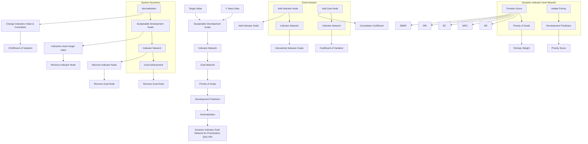

Figure 1: Our Work: Dynamic Indicator-Goal Network for Prioritization

• Goal Network: A weighted oriented graph, with all goal node as vertexes  
• Edge Weight (of Indicator Network or Goal Network): Weight of each edge connecting indicator nodes in Indicator Network or connecting goal nodes in SDG Network, whose value tells the strength of influence between the indicators or between the SDGs

We make the following major assumptions to build our model.

• Assumption 1: When the officially-given indicators of a SDG reach their optimal value and stay optimal for a certain period, we say that the SDG is achieved.  
Justification: Fluctuation above and below the target line implies instability. What we expect is time-durable improvement of each goal.  
• Assumption 2: We assume that the nodes in the network stay connected and impact each other in a relatively fast speed (within several months or a year).

Justification: With the impact of UN, different departments will be closely linked, and the progress of one SDG will impact the others in a relatively fast speed.

• Assumption 3: Statistical properties of the network such as the indicators’ data will not change abruptly and stays predictable.

Justification: Major influence factors are continuous and relatively stable within a short term.

In this paper, some important notations are listed in Table 1.

Table 1: Definitions of the Model Variable Parameters

<table><tr><td>Symbol</td><td>Definition</td></tr><tr><td>INet</td><td>The graph of Indicator Network</td></tr><tr><td>GNet</td><td>The graph of Goal Network</td></tr><tr><td> $G_i$ </td><td>TheithGoal of SDGs,  $i = 1, \cdots, 17$ </td></tr><tr><td> $I_i(j)$ </td><td>Thejth indicator of theithGoal of SDGs</td></tr><tr><td> $W_{ind}(I_i(j) \to I_{i'}(j'))$ </td><td>The edge weight in the Indicator Network</td></tr><tr><td> $W_{goal}(G_i \to G_j)$ </td><td>The edge weight in the SDG Network</td></tr><tr><td> $\lambda((I_i(j))$ </td><td>The contribution(weight) of  $I_i(j)$  to  $G_i$ </td></tr><tr><td> $\mu_1, \cdots, \mu_5$ </td><td>The weight of 5 priority indicators</td></tr><tr><td>Y</td><td>Number of years that we collect data of each  $I_i(j)$ </td></tr><tr><td> $PS(G_i)$ </td><td>Priority score of  $G_i$ </td></tr><tr><td> $PF_m(n)$ </td><td>Priority factor from priority  $G_m$  to affected  $G_m$ </td></tr></table>

## 3 SDG Network Construction by System Dynamics

flowchart

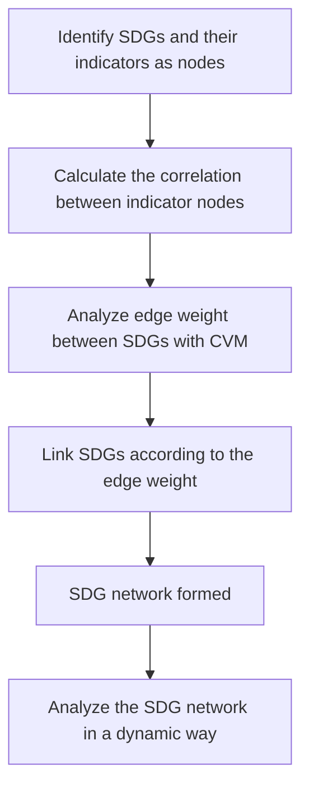

Figure 2: Flow Chart of the SDG Network Construction

## 3.1 Data Pre-processing

## 3.1.1 Data Collection

First, data for the 17 SDGs and their indicators are collected. To guarantee the accuracy and authority of our data, we choose the following official database. Data of 241 officially given indicators [1] of 17 SDGs, from 2000 to 2022, are collected. In the following analysis, Y = 23.

Table 2: Data Sources

<table><tr><td>Data Source</td><td>Website</td></tr><tr><td>UN Statistics</td><td>https://unstats.un.org/sdgs/dataportal</td></tr><tr><td>SDG DATA GATEWAY Explorer</td><td>https://dataexplorer.unescap.org/</td></tr><tr><td>Food and Agriculture Organization of UN</td><td>https://www.fao.org/home/en/</td></tr></table>

## 3.1.2 Data Normalization

In order to eliminate the influence of different units and dimensions, we normalize the data of each indicators as $x _ { n o r }$ , according to their optimal value $x _ { o p t }$ .

• For “cost-minimized” indicators:

$$
x _ {n o r} = \frac {x - x _ {o p t}}{x _ {m a x} - x _ {o p t}} \tag {1}
$$

• For “benefit-maximized” indicators:

$$
x _ {n o r} = \frac {x _ {o p t} - x}{x _ {o p t} - x _ {m i n}} \tag {2}
$$

If $x _ { n o r } = 0 .$ , the corresponding indicator is noted as “achieved”. All negative value of $x _ { n o r }$ will be recorded as zero, which indicates “over-achievement”. When all the indicators of one SDG are “achieved” for a period of time, we can view this SDG as “achieved”.

## 3.2 Selection of Indicators by Correlation

To increase the efficiency of our model, we use correlation analysis to select the most influential indicators for each SDG.

Take the indicator selection process of SDG 7 Affordable and Clean Energyas an example. There are six indicators for SDG 7, we denote them as follows.1

Table 3: Six Official Indicators of SDG 7

<table><tr><td>Official Code</td><td>Indicator</td><td>Official Code</td><td>Indicator</td><td>Official Code</td><td>Indicator</td></tr><tr><td>C070101</td><td>PPAE</td><td>C070102</td><td>PPCFT</td><td>C070201</td><td>RESEC</td></tr><tr><td>C070301</td><td>EIGDP</td><td>C070a01</td><td>IntAid</td><td>C200208</td><td>IREGC</td></tr></table>

We calculate the correlation coefficient between two indicators by:

$$
r _ {i j} = \frac {\sum_ {y = 1} ^ {Y} (x _ {y i} - \bar {x} _ {i}) (x _ {y j} - \bar {x} _ {j})}{\sqrt {\sum_ {y = 1} ^ {Y} (x _ {y i} - \bar {x} _ {i}) ^ {2} \sum_ {y = 1} ^ {Y} (x _ {y j} - \bar {x} _ {j}) ^ {2}}} \tag {3}
$$

Considering positive and negative correlation, we use the absolute value of each $r _ { i j }$ to develop the correlation matrix. Heat-map the correlation between six indicators are shown in Figure 3.

heatmap

| | PPAE | PPCFT | RESEC | EIGDP | IntAid | IREGC |
|---|---|---|---|---|---|---|
| PPAE | 0.85 | 0.75 | 0.90 | 0.80 | 0.85 | 0.95 |
| PPCFT | 0.80 | 0.70 | 0.85 | 0.75 | 0.80 | 0.90 |
| RESEC | 0.75 | 0.65 | 0.95 | 0.70 | 0.75 | 0.85 |
| EIGDP | 0.85 | 0.75 | 0.80 | 0.75 | 0.80 | 0.90 |
| IntAid | 0.85 | 0.75 | 0.95 | 0.75 | 0.80 | 0.95 |
| IREGC | 0.85 | 0.75 | 0.90 | 0.85 | 0.90 | 0.95 |

Figure 3: Correlation between Six Indicators of SDG 7

We define the total correlation within this group of jth indicator to be:

$$
r _ {i, t o t a l} = \sum_ {j = 1} ^ {n} \left| r _ {i j} \right| \tag {4}
$$

$r _ { i , t o t a l }$ evaluates the capability of the $i ^ { t h }$ indicator to interpret other indicators’ trend. The higher the $r _ { i , t o t a l }$ , the more trend of other indicators can be reflected by the $i ^ { t h }$ indicator’s pattern.

Table 4 shows each indicator’s $r _ { i , t o t a l }$ in descend order.

Table 4: Rank of Six Indicators of SDG 7

<table><tr><td>Indicator</td><td>Total Correlation</td><td>Rank</td><td>Indicator</td><td>Total Correlation</td><td>Rank</td></tr><tr><td>IREGC</td><td>5.505261807</td><td>1</td><td>EIGDP</td><td>5.409986028</td><td>4</td></tr><tr><td>PPCFT</td><td>5.488285432</td><td>2</td><td>IntAid</td><td>4.911156508</td><td>5</td></tr><tr><td>PPAE</td><td>5.431849345</td><td>3</td><td>RESEC</td><td>4.186710177</td><td>6</td></tr></table>

Accordingly, we select two indicators for SDG 7:

1. Installed renewable energy-generating capacity in developing countries (in watts per capita)  
2. Proportion of population with primary reliance on clean fuels and technology

A full list of selected indicators for other 16 SDGs can be found in Appendix.

## 3.3 Indicators and SDGs Interactivity

## 3.3.1 Analyze Edge Weight between Indicators with Correlation

Next, we look into the relationship between indicators between SDGs, with which we determine the edge weight of Indicator Network.

Given two SDG $G _ { m }$ and $G _ { n } ,$ we construct the matrix using indicator vector of Y years, where $x _ { y j }$ stands for the yth year jth factors in the sequence $( I _ { m } ( 1 ) , \cdot \cdot \cdot , I _ { n } ( 1 ) , \cdot \cdot \cdot )$ . we calculate the correlation coefficient between any two indicators by

$$
r _ {i j} = \frac {\sum_ {y = 1} ^ {Y} (x _ {y i} - \bar {x} _ {i}) (x _ {y j} - \bar {x} _ {j})}{\sqrt {\sum_ {y = 1} ^ {Y} (x _ {y i} - \bar {x} _ {i}) ^ {2} \sum_ {y = 1} ^ {Y} (x _ {y j} - \bar {x} _ {j}) ^ {2}}} \tag {5}
$$

By computing ${ \binom { 4 4 } { 2 } } \ = \ 9 4 6$ correlation coefficients of each indicators, we obtain a fully-connected indicator network. The weight of each edge is

$$
W _ {i n d} (I _ {m} (i) \rightarrow I _ {n} (j)) = W _ {i n d} (I _ {n} (j) \rightarrow I _ {m} (i)) = r _ {i j} = r _ {j i} \tag {6}
$$

Figure 4 shows an example of a local indicator network. Here, the width of each edge represent its weight.

flowchart

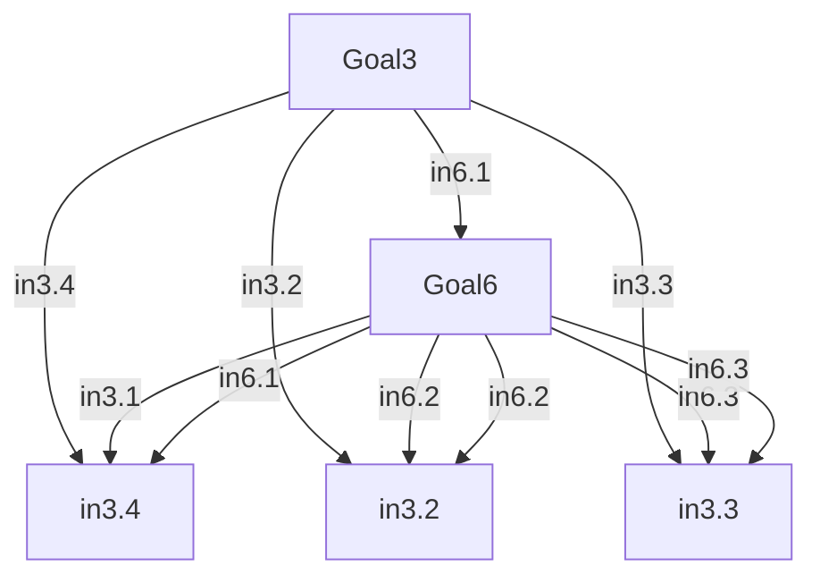

Figure 4: a Local Indicator Network between SDG 3 and SDG 6

## 3.3.2 Analyze Edge Weight between SDGs with CVM

The basic idea of Coefficient of Variation Method(CVM) is to assign a weight to each index according to the degree of variation between the current value and the target value. Larger gap means that the index is harder to reach the target value, so a greater weight should be assigned.

Firstly, average value and standard deviation of indicator $I _ { n } ( j )$ of $G _ { n }$ are

$$
\bar {x} (I _ {n} (j)) = \frac {1}{Y} \sum_ {y = 1} ^ {Y} x _ {y} (I _ {n} (j)) \quad S (I _ {n} (j)) = \sqrt {\frac {1}{Y - 1} \sum_ {y = 1} ^ {Y} [ x _ {y} (I _ {n} (j)) - \bar {x} (I _ {n} (j)) ]} \tag {7}
$$

Second, the variation coefficient and weight of each indicator $I _ { n } ( j )$ of $G _ { n }$ are

$$
V (I _ {n} (j)) = \frac {S (I _ {n} (j))}{\bar {x} (I _ {n} (j))} \quad \lambda (I _ {n} (j)) = \frac {V (I _ {n} (j))}{\sum_ {j = 1} V (I _ {n} (j))} \tag {8}
$$

Next, for Goals $G _ { m }$ and $G _ { n } , m , n \in [ 1 , 1 7 ]$ , we define the interactivity from $G _ { m }$ to $I _ { n } ( j )$ of $G _ { n }$ to be

$$
I n a c t _ {G _ {m} \rightarrow I _ {n} (j)} = \sum_ {I _ {m} (i) \in I N e t} \lambda (I _ {n} (j)) \cdot W (I _ {m} (i) \rightarrow I _ {n} (j)) \tag {9}
$$

Finally, we obtain interactivity from $G _ { m }$ to $G _ { n } .$ , calculated by

$$
I n a c t _ {G _ {m} \rightarrow G _ {n}} = \sum_ {I _ {n} (j) \in I N e t} I n a c t _ {G _ {m} \rightarrow I _ {n} (j)} \tag {10}
$$

which is the edge weight from $G _ { m }$ to $G _ { n }$ . That is

$$
W _ {\text { goal }} (G _ {m} \rightarrow G _ {n}) = \text { Inact } _ {G _ {m} \rightarrow G _ {n}} \tag {11}
$$

Figure 5 and Figure 6 graphically illustrate the calculation of interactivity.

flowchart

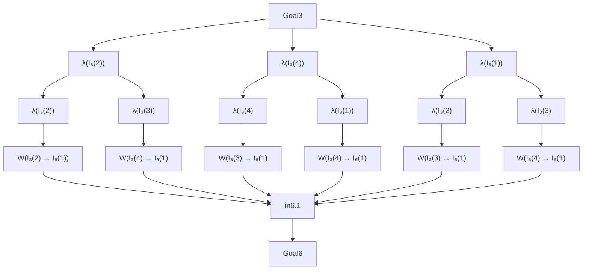

Figure 5: Illustration of Interactivity from $G _ { 3 }$ to $I _ { 6 } ( 1 )$

flowchart

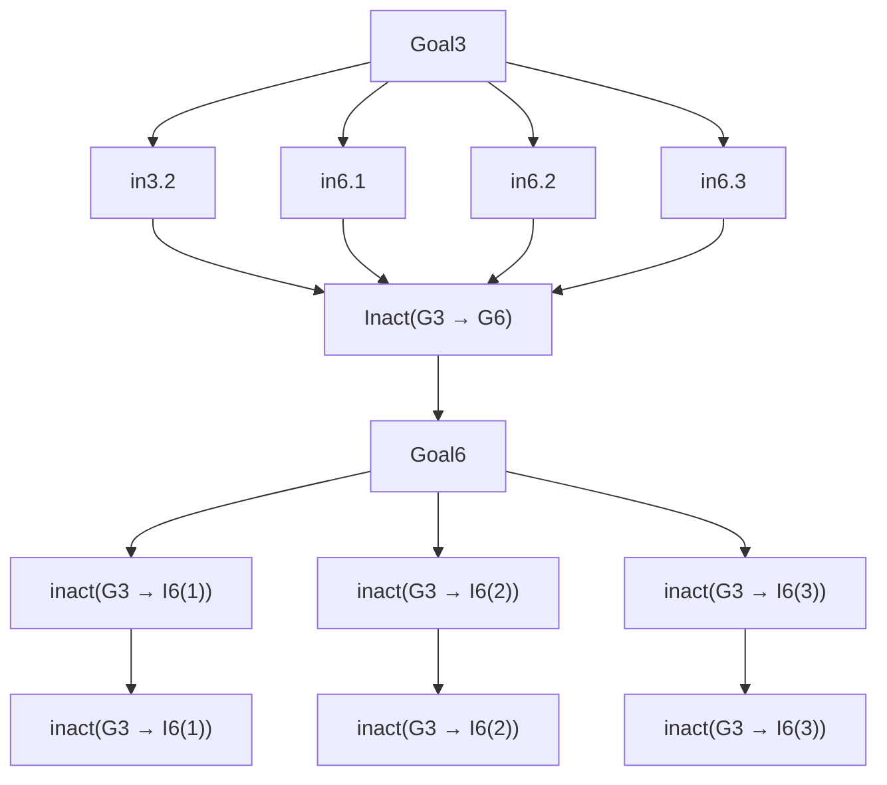

Figure 6: Illustration of Interactivity from $G _ { 3 }$ to $G _ { 6 }$

For convenience of later analysis, we normalize the weight of all edges to the range [0,10] and round them to 2 decimals. In the SDG Network in Figure 72, larger edge weight stands for higher influence of the source node SDG to the target node SDG. Connections between SDG 17 and other SDGs are highlighted.

flowchart

```mermaid
graph TD
  A["SDG3: Good Health and Well-being"] --> B["SDG15: Life on Land"]
  A --> C["SDG16: Peace and Justice Strong Institutions"]
  A --> D["SDG2: Zero Hunger"]
  A --> E["SDG5: Gender Equity"]
  A --> F["SDG10: Reduced Inequality"]
  A --> G["SDG8: Decent Work and Economic Growth"]
  A --> H["SDG9: Industry, Innovation and Infrastructure"]
  A --> I["SDG11: Sustainable Cities and Production"]
  A --> J["SDG12: Responsible Consumption and Production"]
  A --> K["SDG13: Climate Action"]
  A --> L["SDG14: Life below Water"]
  A --> M["SDG15: Life on Land"]
  A --> N["SDG6: Clean Water and Sanitation"]
  A --> O["SDG7: Affordable and Clean Energy"]
  A --> P["SDG17: Partnerships to achieve the Goal"]
  A --> Q["SDG4: Quality Education"]
  A --> R["SDG8: Decent Work and Economic Growth"]
  A --> S["SDG1: No poverty"]
```

Figure 7: SDG Network (with Edge of SDG 17 Highlighted)

## 3.4 Section Summary: from Indicator Network to Goal Network

To create a network of the SDGs that allows us to model the complex, dynamic relationships between the different goals and their interlinkages over time, we build the model based on System Dynamics modeling. System Dynamics modeling is a powerful tool to identify the dynamic nature of problems and analyze the interactions between different variables of a system.[2]

The SDGs are interconnected. Progress in one SDG can affects progress in other SDGs. System Dynamics provides a framework for understanding these interconnections and feedback loops and for simulating the impacts of different policies and interventions on the SDGs. By modeling the system as a whole, rather than just focusing on individual SDGs in isolation, we can better understand the potential unintended consequences of different policies and identify more effective strategies for achieving the SDGs.

Our innovative idea is the mapping relationship between Indicator Network and Goal Network. Once we construct network among indicators with their correlation, a correspondent Goal Network is automatically generated. This thought is illustrated in Figure 8.

flowchart

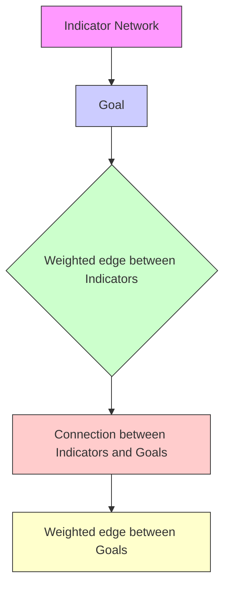

Figure 8: Mapping relationship between Indicator Network and Goal Network

In the SDG Network, all goal nodes are interconnected. This feature stands in line with the reality. For instance, SDG 5 (Gender Equality) is closely linked to SDG 8 (Decent Work and Economic Growth), as empowering women and girls is vital to creating a more inclusive and equitable economy. SDG 16 (Peace, Justice and Strong Institutions) is dependent on the achievement of many other SDGs as it is difficult to achieve peaceful and just societies without addressing issues such as poverty, inequality, and lack of access to education and healthcare. Therefore, it is important to view the SDGs as a whole and to work towards achieving them in an integrated and coordinated manner.

## 4 Dynamic SDG Network with Priority-oriented and Time-based Development

## 4.1 SDG Priority Evaluation System

## 4.1.1 Priority Indicators

Based on the topology of the constructed SDG Network, we mainly develop 5 indicators for priority measurement of each goal. We also give the calculation methods of these indicators in the following paragraphs.

## 1. Node Efficiency (NE)[3]

Node Efficiency evaluates how difficult can we reach other nodes in the graph starting from the source node. Usually, edge weight is used as an index of accessibility: the greater the weight, the easier to travel.

When we apply it to SDG Network, it tells how much UN can achieve in other SDGs while focusing and working hard on one SDG. It is formulated as:

$$
N E (G _ {i}) = \frac {1}{n - 1} \sum_ {G _ {j} \in G N e t} ^ {n} W _ {\text { goal }} (G _ {i} \rightarrow G _ {j}) \tag {12}
$$

## 2. Weighted Eigenvector Centrality (WEC)[4]

Eigenvector Centrality accounts for the significance of a node’s neighbours. The more influential the neighbouring node is, the higher the eigenvector centrality.

That is to say, if a SDG is tied to some other SDG with high priority, this SDG is bound to have a relatively high priority. However, since our SDG Network is a complete graph, all vertexes are linked, we modify traditional eigenvector centrality as weighted eigenvector centrality.

To calculate WEC, we define the weighted adjacency matrix to be $A = \left( a _ { i j } \right)$ , such that

$$
\left\{ \begin{array}{l} a _ {i j} = 0, \quad i = j \\ a _ {i j} = w _ {i j}, \quad i \neq j \end{array} \right. \tag {13}
$$

WEC is formulated as

$$
W E C (G _ {i}) = \frac {1}{\lambda} \sum_ {G _ {j} \in G N e t} a _ {i j} W E C (G _ {j}) \tag {14}
$$

where λ is the largest eigenvalue of matrix $A = \left( a _ { i j } \right)$ .

## 3. Betweenness Centrality (BC)[5]

Betweenness centrality refers to the frequency with which a node lies on the shortest path between two other nodes in a network. In reality, if a SDG situated in the shortest path between other two SDGs frequently, it must have higher priority to be initiated, since it acts as a bridge between the interaction of other goals.

Since greater weight in SDG Network represents greater interactivity, it is negatively proportional to the path length between SDGs. Thus we define the path length of each edge as

$$
d (G _ {i} \rightarrow G _ {j}) = \frac {1}{W (G _ {i} \rightarrow G _ {j})} \tag {15}
$$

and apply Dijkstra Algorithm to calculate the shortest paths.

Then the Betweenness Centrality of $G _ { i }$ should be

$$
B C \left(G _ {i}\right) = \sum_ {G _ {i} \neq G _ {j} \neq G _ {k}} \frac {\sigma_ {G _ {j} \rightarrow G _ {k}} \left(G _ {i}\right)}{\sigma_ {G _ {j} \rightarrow G _ {k}}} \tag {16}
$$

where $\sigma _ { G _ { j }  G _ { k } } ( G _ { i } )$ equals to the number of times that shortest paths between other nodes bypass $G _ { i }$ , while $\sigma _ { G _ { j }  G _ { k } }$ equals to total shortest path counts.

## 4. Sum of Relative Influence Intensity (SRI)[3]

Noticeably, the priority of each goal is not only determined by how much it interacts with its neighbouring goal, but also how drastically other goals affect its neighbour. That is, the proportion it takes on other goals’ “received impact”.

We numerically measure such proportion by Relative Influence Intensity RI.

$$
R I (G _ {i} \rightarrow G _ {j}) = \frac {W (G _ {i} \rightarrow G _ {j})}{\sum_ {k \neq j} W (G _ {k} \rightarrow G _ {j})} \tag {17}
$$

Then, Sum of Relative Influence Intensity is

$$
S R I (G _ {i}) = \sum_ {j \neq i} R I (G _ {i} \rightarrow G _ {j}) \tag {18}
$$

## 5. Sum of Maximum Network Flow (SMNF)

If we view each weighted edge as a flow container, maximum network flow from source node $G _ { i }$ to terminal node $G _ { j }$ show how much output of the jth SDG can be earned from input in the ithe SDG. In order to attain $S M N F ( G _ { i } )$ , we first solve the maximum network flow problem below.

$$
\begin{array}{l} M N F (G _ {i} \to G _ {j}) = \max N F (G _ {i} \to G _ {j}) \qquad i \neq j \\ \text { s.t. } \left\{ \begin{array}{l} \sum f l o w (G _ {p} \to G _ {q}) - \sum f l o w (G _ {q} \to G _ {p}) = \left\{ \begin{array}{l} N F (G _ {i} \to G _ {j}), p = i \\ - N F (G _ {i} \to G _ {j}), p = j \\ 0, k \neq i, j \end{array} \right. \\ 0 \leq f l o w (G _ {p} \to G _ {q}) \leq W (G _ {p} \to G _ {q}) \\ 0 \leq f l o w (G _ {q} \to G _ {p}) \leq W (G _ {q} \to G _ {p}) \end{array} \right. \tag {19} \\ \end{array}
$$

With the aid of Ford-Fulkerson algorithm, we get $M N F ( G _ { i } \to G _ { j } )$ for all $j .$ Then sum of maximum network flow of $G _ { i }$ is:

$$
S M N F (G _ {i}) = \sum_ {i \neq j} M N F (G _ {i} \rightarrow G _ {j}) \tag {20}
$$

## 4.1.2 Evaluate Priority Score by EWM

Now we can develop our SDG Priority Ranking System with the aid of 5 priority indicators. Entropy Weight Method (EWM) is an objective weighting method. It gives larger weight to the indicators that provide more information, so that we can distinguish data with more ease. From this point, we set the Priority Score of $G _ { i }$ to be

$$
P S (G _ {i}) = \mu_ {1} \cdot N E (G _ {i}) + \mu_ {2} \cdot W E C (G _ {i}) + \mu_ {3} \cdot B C (G _ {i}) + \mu_ {4} \cdot S R I (G _ {i}) + \mu_ {5} \cdot S M N F (G _ {i}) \tag {21}
$$

where weight index $\mu _ { 1 } , \cdots , \mu _ { 5 }$ is calculated by EWM.

The result of each weight and the priority ranking result is shown in Table 5 and Table $_ { 6 . }$

Table 5: EWM Weight of Priority Indicators

<table><tr><td>NE</td><td>WEC</td><td>BC</td><td>SRI</td><td>SMNF</td></tr><tr><td>0.1058</td><td>0.2470</td><td>0.1085</td><td>0.3218</td><td>0.2169</td></tr></table>

Table 6: Top 5 Priority Ranking Result by Descending Order

<table><tr><td>Priority Rank</td><td>SDG</td><td>Priority Score</td></tr><tr><td>1</td><td>SDG17: Partnerships to achieve the Goal</td><td>6.2875</td></tr><tr><td>2</td><td>SDG3: Good Health and Well-being</td><td>5.9972</td></tr><tr><td>3</td><td>SDG1: No poverty</td><td>5.9725</td></tr><tr><td>4</td><td>SDG4: Quality Education</td><td>5.8123</td></tr><tr><td>5</td><td>SDG13: Climate Action</td><td>5.4183</td></tr></table>

Compared with the SDG priority proposed by the Copenhagen Consensus Center [8], our priority ranking is reasonable and applicable to real-world development. It’s not surprising that SDG17: Partnerships to achieve the Goal is the top priority ranks first, as only if all countries collaborate under the guidance of UN can we achieve other goals efficiently.

## 4.2 Priority-Oriented Development Prediction by ARIMA

## 4.2.1 Combination of ARIMA and Priority Factor

With the advancement of science and technology, and with the increasing focus on sustainable development, human development, and collaboration, it is expected that progress towards achieving SDGs [6] will continue. However, the degree of progress made will depend on various factors such as economic development, technological innovation, political stability, and environmental sustainability [7]. To forecast the future trends, we can use the auto regressive integrated moving average (ARIMA), which is a quantitative prediction tool that combines historical trend data with assumptions about future trends and scenarios.

If our priorities are initiated, the improvement of SDGs will be positively influenced. Therefore, we add priority term to the ARIMA result. Combining priority influence with ARIMA prediction, we can better estimate the impact of one SDG on another.

First, we forecast the trend of each indicator by ARIMA.

Next, we define the priority factor $P F _ { m } ( n )$ as follow.

$$
P F _ {m} (n) = \frac {P S (G _ {m}) \cdot P S (G _ {n})}{\left[ \max _ {i} (P S (G _ {i})) \right] ^ {2}} \tag {22}
$$

If $G _ { m }$ is set as the priority in the next period, $P F _ { m } ( n )$ times of $G _ { m }$ advance will be added to $G _ { n }$ advance.

flowchart

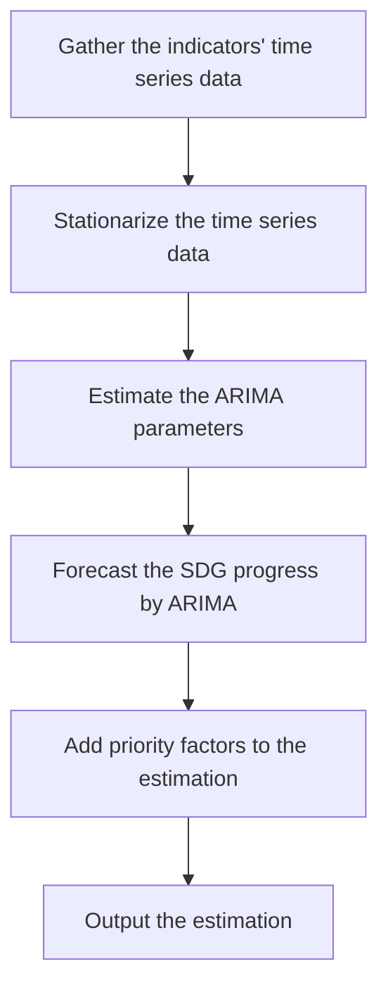

Figure 9: Flow Chart of the ARIMA Prediction with Priority Term

Finally, we add priority term to ARIMA result and visualize the reasonable achievement.

$$
\text { Prediction   Result } (G _ {n}) = \text { ARIMA   result } (G _ {n}) + P F _ {m} (n) \cdot \text { ARIMA   result } (G _ {m}) \tag {23}
$$

## 4.2.2 Achievement in 2023 under Priority initiation

Figure 10 and 11 show the result of adding correlation impact in the network. We can see that when we consider the impact of the dynamic network and the priority, the SDGs will be driven by each other.

For example, achieving SDG 1 (No Poverty) could be a driver for achieving SDG 3 (Good Health and Well-Being), as poverty can lead to poor health outcomes. In turn, achieving SDG 3 could be a driver for achieving SDG 4 (Quality Education), as healthier children may be more likely to attend and perform well in school.

By placing SDG17(Partnership to achieve the Goal) in the first priority, reasonable promotion of SDG 1 and 3 are shown in Figure 10 and 11.

line chart

| Year | Before Prioritization | After Prioritization |
|------|------------------------|-----------------------|
| 2020 | 6.5                    | 6.5                   |
| 2021 | 5.5                    | 5.5                   |
| 2022 | 4.5                    | 4.5                   |
| 2023 | 3.5                    | 3.5                   |
| 2024 | 2.5                    | 2.5                   |
| 2025 | 1.5                    | 1.5                   |
| 2026 | 1.0                    | 1.0                   |
| 2027 | 0.5                    | 0.5                   |
| 2028 | 0.2                    | 0.2                   |
| 2029 | 0.1                    | 0.1                   |
| 2030 | 0.0                    | 0.0                   |

Figure 10: Prediction of the Proportion of the Population Living below the International Poverty Line (indicator of SDG 1)

line chart

| Year | After Prioritization | Before Prioritization |
|------|----------------------|------------------------|
| 2015 | 72.0                 | 71.9                   |
| 2016 | 72.2                 | 72.1                   |
| 2017 | 72.4                 | 72.3                   |
| 2018 | 72.6                 | 72.5                   |
| 2019 | 72.8                 | 72.7                   |
| 2020 | 72.9                 | 72.8                   |
| 2021 | 73.0                 | 72.9                   |
| 2022 | 73.1                 | 73.0                   |
| 2023 | 73.2                 | 73.1                   |
| 2024 | 73.3                 | 73.2                   |
| 2025 | 73.4                 | 73.3                   |
| 2026 | 73.5                 | 73.4                   |
| 2027 | 73.6                 | 73.5                   |
| 2028 | 73.7                 | 73.6                   |
| 2029 | 73.8                 | 73.7                   |
| 2030 | 73.9                 | 73.8                   |

Figure 11: Prediction of World Life Expectancy (indicator of SDG 3)

By estimating the 17 SDGs’ progress, we can see from the figure that SDG 1 (No poverty) is reasonable to be achieved in the next 10 years, and it is likely that 95% people can have access to affordable and clean energy.

In the next 10 years, it is reasonable to achieve significant progress towards these priorities if sufficient resources and support are provided by solid global partnership. For example, progress can be made towards reducing greenhouse gas emissions and increasing renewable energy adoption, expanding access to quality education, promoting healthy lifestyles, and investing in sustainable urban planning. While it may not be possible to achieve all SDGs completely, significant progress can be made towards creating a more sustainable and equitable world.

## 5 Dynamic SDG Network with Goal Adjustment

Our dynamic SDG Network will adjust its topology as well as priority rank automatically in accordance with the modification of any indicator node and goal node.

## 5.1 Subtraction of the Node: Goal Accomplishment

flowchart

```mermaid
graph TD
  A["Population below international poverty line"] -->|in 1.1| B["People whose livelihoods were disrupted by disasters"]
  B -->|in 1.3| C["Agricultural export subsidies"]
  C -->|in 2.1| D["Zero Hunger"]
  D -->|in 3.1| E["World Life Expectancy"]
  E -->|in 1.2| F["Population using basic sanitation services"]
  F -->|in 1.2| G["Good Health & Well-being"]
  G -->|in 3.1| H["..."]
  H --> I["W_ind(I₁(1) → ...)=0"]
  I --> J["..."]
  J --> K["..."]
  K --> L["W_ind(I₁(2) → I₃(1))=0"]
  L --> M["..."]
  M --> N["..."]
  N --> O["W_ind(I₁(3) → ...)=0"]
  O --> P["..."]
  P --> Q["..."]
  Q --> R["..."]
  R --> S["..."]
  S --> T["..."]
  T --> U["W_ind(I₁(1) → ...)=0"]
  U --> V["..."]
  V --> W["W_ind(I₁(2) → ...)=0"]
  W --> X["..."]
  X --> Y["W_ind(I₁(3) → ...)=0"]
  Y --> Z["..."]
  Z --> AA["..."]
  AA --> AB["W_ind(I₁(1) → ...)=0"]
  AB --> AC["..."]
  AC --> AD["W_ind(I₁(2) → ...)=0"]
  AD --> AE["..."]
  AE --> AF["W_ind(I₁(3) → ...)=0"]
  AF --> AG["..."]
  AG --> AH["W_ind(I₁(1) → ...)=0"]
  AH --> AI["..."]
  AI --> AJ["W_ind(I₁(2) → ...)=0"]
  AJ --> AK["..."]
  AK --> AL["W_ind(I₁(3) → ...)=0"]
  AL --> AM["..."]
  AM --> AN["W_ind(I₁(1) → ...)=0"]
  AN --> AO["..."]
  AO --> AP["W_ind(I₁(2) → ...)=0"]
  AP --> AQ["..."]
  AQ --> AR["W_ind(I₁(3) → ...)=0"]
  AR --> AS["..."]
  AS --> AT["W_ind(I₁(1) → ...)=0"]
  AT --> AU["..."]
  AU --> AV["W_ind(I₁(2) → ...)=0"]
  AV --> AW["..."]
  AW --> AX["W_ind(I₁(3) → ...)=0"]
  AX --> AY["..."]
  AY --> AZ["W_ind(I₁(1) → ...)=0"]
  AZ --> BA["..."]
  BA --> BB["W_ind(I₁(2) → ...)=0"]
  BB --> BC["..."]
  BC --> BD["W_ind(I₁(3) → ...)=0"]
  BD --> BE["..."]
  BE --> BF["W_ind(I₁(1) → ...)=0"]
  BF --> BG["..."]
  BG --> BH["W_ind(I₁(2) → ...)=0"]
  BH --> BI["..."]
  BI --> BJ["W_ind(I₁(3) → ...)=0"]
  BJ --> BK["..."]
  BK --> BL["W_ind(I₁(1) → ...)=0"]
  BL --> BM["..."]
  BM --> BN["W_ind(I₁(2) → ...)=0"]
  BN --> BO["..."]
  BO --> BP["W_ind(I₁(3) → ...)=0"]
  BP --> BQ["..."]
  BQ --> BR["W_ind(I₁(1) → ...)=0"]
  BR --> BS["..."]
  BS --> BT["W_ind(I₁(2) → ...)=0"]
  BT --> BU["..."]
  BU --> BV["W_ind(I₁(3) → ...)=0"]
  BV --> BW["..."]
  BW --> BX["W_ind(I₁(1) → ...)=0"]
  BX --> BY["W_ind(I₁(2) → ...)=0"]
  BY --> BZ["..."]
  BZ --> CA["W_ind(I₁(2) → ...)=0"]
  CA --> CB["..."]
  CB --> CC["W_ind(I₁(3) → ...)=0"]
  CC --> CD["..."]
  CD --> CE["W_ind(I₁(1) → ...)=0"]
  CE --> CF["..."]
  CF --> CG["W_ind(I₁(2) → ...)=0"]
  CG --> CH["..."]
  CH --> CI["W_ind(I₁(3) → ...)=0"]
  CI --> CJ["..."]
  CJ --> CK["W_ind(I₁(1) → ...)=0"]
  CK --> CL["..."]
  CL --> CM["W_ind(I₁(2) → ...)=0"]
  CM --> CN["..."]
  CN --> CO["W_ind(I₁(3) → ...)=0"]
  CO --> CP["..."]
  CP --> CQ["W_ind(I₁(1) → ...)=0"]
  CQ --> CR["..."]
  CR --> CS["W_ind(I₁(2) → ...)=0"]
  CS --> CT["..."]
  CT --> CU["W_ind(I₁(3) → ...)=0"]
  CU --> CV["..."]
  CV --> CW["W_ind(I₁(1) → ...)=0"]
  CW --> CX["..."]
  CX --> CY["W_ind(I₁(2) → ...)=0"]
  CY --> CZ["..."]
  CZ --> DA["W_ind(I₁(3) → ...)=0"]
  DA --> DB["..."]
  DB --> DC["..."]
```

Figure 12: Illustration: Cutting off Indicators of SDG 1 from the Indicator Network

flowchart

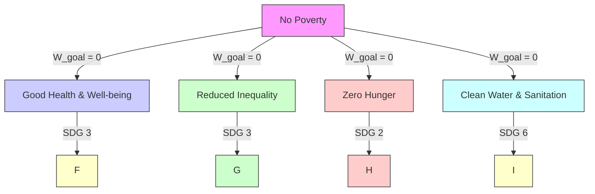

Figure 13: Illustration: Cutting off SDG 1 from the SDG Network

## 5.1.1 Dynamic Resulting Network and Priority

According to Assumption 1, if a SDG $G _ { i }$ is achieved, all of $I _ { i } ( j )$ data for several years stays zero. Consequently, the correlation coefficients between $I _ { i } ( j )$ and $I _ { i ^ { \prime } } ( j ^ { \prime } )$ (indicators from other SDG) vanish. In the resulting Indicator Network, all edge weight coming out from $I _ { i } ( j )$ collapse to zero. This is illustrated in Figure 12.

Because the edge weight in Goal Network is calculated by those in Indicator Network, the corresponding edge weight in resulting SDG Network will vanish as well. This process is like dragging SDG 1 out of the SDG Network, which is illustrated in Figure 13.

Our dynamic SDG network will automatically transform based on Algorithm 1.

Algorithm 1: Dynamic Resulting Network and Priority with Goal Accomplishment  
Input: GNet, INet, achieved goal $G_{achieve}$ Output: Resulting SDG Network GNet and priority ranking for all indicator node I connected to $I_{achieve}(j)$ do $W_{ind}(I \rightarrow I_{achieve}(j)) \leftarrow 0;$ end
for all goal node $G_i \in GNet$ except $G_{achieve}$ do $W_{goal}(G_i \rightarrow G_{achieve})$ and $W(G_{achieve} \rightarrow G_i) \leftarrow 0;$ Calculate all other $W_{goal}$ by Equation (7) to (11);
end
for all goal node $G_i \in GNet$ except $G_{achieve}$ do
    Calculate priority score $PS(G_i)$ by Equation (12) to (21);
end
Return ranking result based on $PS(G_i)$ ;

## 5.1.2 Case Analysis

If SDG 1 (No Poverty is achieved), the resulting network is shown in Figure 14 and the top five priorities after this achievement are listed in Table 7.

Table 7: Priority Result by Descending Order after Eliminating Porverty

<table><tr><td>Priority Rank</td><td>SDG</td><td>Priority Score</td></tr><tr><td>1</td><td>SDG17: Partnerships to achieve the Goal</td><td>6.3825</td></tr><tr><td>2</td><td>SDG6: Clean Water and Sanitation</td><td>6.2041</td></tr><tr><td>3</td><td>SDG4: Quality Education</td><td>5.9201</td></tr><tr><td>4</td><td>SDG3: Good Health and Well-being</td><td>5.5672</td></tr><tr><td>5</td><td>SDG10: Reduced Inequality</td><td>5.5629</td></tr></table>

flowchart

```mermaid
graph TD
  A["SDG1: Climate Action"] --> B["SDG11: Sustainable Cities and Communities"]
  C["SDG2: Zero Hunger"] --> D["SDG16: Peace and Justice Strong Institutions"]
  E["SDG3: Good Health and Well-being"] --> F["SDG4: Quality Education"]
  G["SDG5: Gender Equity"] --> H["SDG4: Reduced Inequality"]
  I["SDG6: Clean Water and Sanitation"] --> J["SDG17: Partnerships to achieve the Goal"]
  K["SDG7: Affordable and Clean Energy"] --> L["SDG8: Decent Work and Economic Growth"]
  M["SDG9: Industry, Innovation and Infrastructure"] --> N["SDG12: Responsible Consumption and Production"]
  O["SDG13: Climate Action"] --> P["SDG15: Life on Land"]
  Q["SDG14: Life below Water"] --> R["SDG17: Partnerships to achieve the Goal"]
  S["SDG16: Peace and Justice Strong Institutions"] --> T["SDG10: Reduced Inequality"]
  U["SDG17: Partnerships to achieve the Goal"] --> V["SDG17: Partnerships to achieve the Goal"]
```

Figure 14: Resulting Network after SDG 1 Achievement

## 5.2 Addition of the Node: Goal Inclusion

In today’s digital age, Access to Information and Communication Technologies (ICTs) should also be proposed to UN for the inclusion [9]. Though its slightly mentioned in SDG 9, it is playing an more and more critical role. It varies from groups to groups, such as developed and developing countries, rural and urban areas, and different socioeconomic classes. The lack of access to ICTs can limit individuals and communities’ opportunities for education, health, and economic growth, and block the SDGs development.

To illustrate how a new SDG impacts the Dynamic SDG Network, the method is similar to that in Section 3. The selected indicators are

1. proportion of the population that uses the Internet  
2. mobile broadband subscriptions per 100 inhabitants  
3. proportion of individuals using the Internet who have basic digital skills

After adding the SDG18: Access to Information and Communication Technologies (ICTs), the result SDG network is visualized as Figure 15.

Promoting access to ICTs in developing countries is critical for achieving many of the existing SDGs, including quality education, gender equality, decent work and economic growth, industry, innovation and infrastructure, and reduced inequalities. For instance, providing access to educational resources can improve quality education, while promoting digital skills can enhance employment opportunities and contribute to economic growth. Access to information and communication can also help to reduce inequalities by providing equal opportunities for underrepresented groups, such as women, minorities, and marginalized communities. Additionally, ICTs can facilitate access to healthcare services, promote environmental sustainability, and support peacebuilding efforts. Therefore, including Access to Information and Communication Technologies as a new SDG is significant to enhance the connection between SDGs, advancing their accomplishment.

flowchart

```mermaid
graph TD
  A["SDG15: Life on Land"] --> B["SDG18: Access to Information and Communication Technologies"]
  A --> C["SDG2: Zero Hunger"]
  A --> D["SDG5: Gender Equity"]
  A --> E["SDG6: Clean Water and Sanitation"]
  A --> F["SDG7: Affordable and Clean Energy"]
  A --> G["SDG9: Industry, Innovation and Infrastructure"]
  A --> H["SDG10: Reduced Inequality"]
  A --> I["SDG11: Sustainable Cities and Production"]
  A --> J["SDG12: Responsible Consumption and Production"]
  A --> K["SDG13: Climate Action"]
  A --> L["SDG14: Life below Water"]
  A --> M["SDG15: Life on Land"]
  A --> N["SDG16: Peace and Justice Strong Institutions"]
  A --> O["SDG17: Partnerships to achieve the Goal"]
  A --> P["SDG3: Good Health and Well-being"]
  A --> Q["SDG4: Quality Education"]
  A --> R["SDG8: Decent Work and Economic Growth"]
  A --> S["SDG9: Industry, Innovation and Infrastructure"]
  A --> T["SDG10: Reduced Inequality"]
  A --> U["SDG11: Sustainable Cities and Production"]
  A --> V["SDG12: Responsible Consumption and Production"]
  A --> W["SDG13: Climate Action"]
  A --> X["SDG14: Life below Water"]
```

Figure 15: The SDG Network with a New SDG

Algorithm 2: Dynamic Resulting Network and Priority with Goal Inclusion  
Input: GNet, INet, goal $G_{add}$ and its indicators $\{I_{add}(1),\cdots\}$ to be added, Y year data for those indicators
Output: Resulting SDG Network $\widetilde{GNet}$ and priority ranking
for all indicator node $I \in INet$ do
    Calculate $W_{ind}(I \to I_{ADD}(j))$ by Equation 5 to 6;
end
for all goal node $G_i \in GNet$ do
    Calculate all $W_{goal}$ by Equation 7 to 11;
end
for all goal node $G_i \in GNet$ do
    Calculate priority score $PS(G_i)$ by Equation 12 to 21;
end
Return ranking result based on $PS(G_i)$ ;

## 6 Dynamic SDG Network with by Global Crises

## 6.1 The Impact of International Crises on Dynamic SDG Network

The progress towards the SDGs can be significantly impacted by various international crises, including technological advances, global pandemics, climate change, regional wars, and refugee movements.

For example, forest fires can have a significant impact on the SDG network. They can result in environmental degradation, economic instability, and social unrest, which can hinder progress towards achieving the SDGs. The effects of forest fires can be linked to several SDGs, such as SDG 13 (Climate Action), SDG 15 (Life on Land), and SDG 11 (Sustainable Cities and Communities).

flowchart

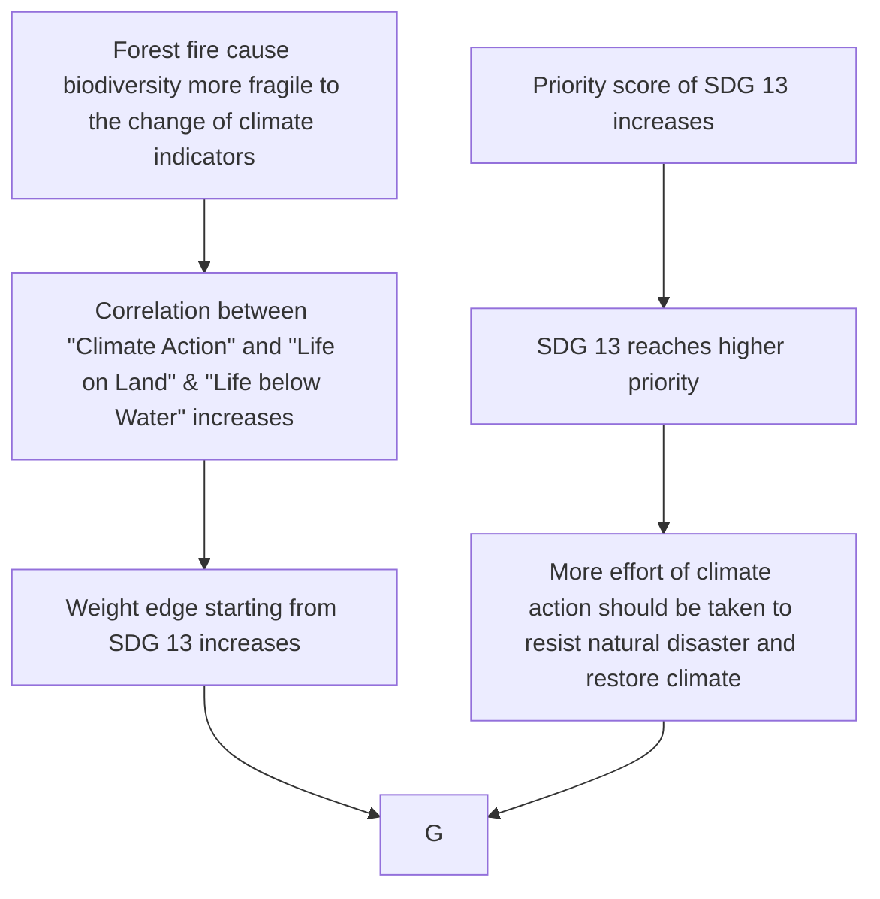

Figure 16: The flow chart of the impact of forest fires on SDG Network

The 2019-2020 Australian bushfires, which burned over 18 million hectares of land, destroyed over 5,900 buildings, and caused numerous fatalities, can have a ripple effect on the network of SDGs. The steps of the impact of forest fires on SDG Network are shown in Figure 16. The contribution of fire to climate change by releasing large amounts of carbon dioxide into the atmosphere can exacerbate the effects of SDG 13 (Climate Action). A preliminary estimation of net emissions for the 2020 fire season has been made by the National Greenhouse Accounts, which is approximately 830 million tonnes of carbon dioxide equivalent [12]. The impact of fires on environmental degradation and loss of biodiversity can affect SDG 15 (Life on Land). Additionally, the destruction of homes, infrastructure, and livelihoods call for progress towards achieving SDG 11 (Sustainable Cities and Communities).

The SDG Network’s response to the Australian bushfires is demonstrated by Figure 17.

Other global crises impact the SDG network in the following ways.

• Technological advance: Enhance correlation between SDG 12 (Responsible Consumption and Production) and SDG 11 (Sustainable Cities and Communities), since rational utility of technology stimulates health growth of human settlement.  
• Global pandemics: Enhance correlation between SDG 3 (Good Health and Well-being) and SDG 8 (Decent Work and Economic Growth), SDG 12 (Responsible Consumption and Production). Large-scale infection drastically depress the social productivity. Therefore, substantial medical system play crucial role in guarding economy growth.  
• Regional war: Enhance correlation between SDG 16 (Peace and Justice Strong Institute) and SDG 1 (No Poverty), SDG 3 (Good Health and Well-being), etc. That’s because people’s livelihood

depend more on their government and international relationship.

flowchart

```mermaid
graph TD
  SDG13["SDG13: Climate Action"] --> SDG15["SDG15: Life on Land"]
  SDG13 --> SDG17["SDG17: Partnerships to achieve the Goal"]
  SDG13 --> SDG6["SDG6: Clean Water and Sanitation"]
  SDG13 --> SDG11["Sustainable Cities and Communities"]
  SDG13 --> SDG9["SDG9: Industry, Innovation and Infrastructure"]
  SDG13 --> SDG12["Sustainable Consumption and Production"]
  SDG13 --> SDG8["SDG8: Decent Work and Economic Growth"]
  SDG13 --> SDG4["SDG4: Quality Education"]
  SDG13 --> SDG3["SDG3: Good Health and Well-being"]
  SDG15 --> SDG14["SDG14: Life below Water"]
  SDG17 --> SDG2["SDG2: Zero Hunger"]
  SDG17 --> SDG8
  SDG17 --> SDG4
  SDG6 --> G7["G7: Affordable and Clean Energy"]
  SDG3 --> SDG3
  SDG3 --> SDG8
  SDG3 --> SDG4
  SDG8 --> SDG4
  SDG4 --> SDG9
    style SDG13 fill:#90EE90,stroke:#333
    style SDG15 fill:#90EE90,stroke:#333
    style SDG17 fill:#90EE90,stroke:#333
    style SDG6 fill:#FFD700,stroke:#333
    style SDG11 fill:#FFD700,stroke:#333
    style SDG9 fill:#FFD700,stroke:#333
    style SDG12 fill:#FFD700,stroke:#333
    style SDG12 fill:#FFD700,stroke:#333
    style SDG17 fill:#FFD700,stroke:#333
    style SDG17 fill:#FFD700,stroke:#333
    style SDG17 fill:#FFD700,stroke:#333
    style SDG17 fill:#FFD700,stroke:#333
    style SDG17 fill:#FFD700,stroke:#333
    style SDG12 fill:#FFD700,stroke:#333
    style SDG12 fill:#FFD700,stroke:#333
    style SDG12 fill:#FFD700,stroke:#333
    style SDG12 fill:#FFD700,stroke:#333
    style SDG12 fill:#FFD700,stroke:#333
    style SDG11 fill:#FFD700,stroke:#333
    style SDG11 fill:#FFD700,stroke:#333
    style SDG11 fill:#FFD700,stroke:#333
    style SDG11 fill:#FFD700,stroke:#333
    style SDG11 fill:#FFD700,stroke:#333
    style SDG12 fill:#FFD700,stroke:#333
    style SDG12 fill:#FFD700,stroke:#333
    style SDG12 fill:#FFD700,stroke:#333
    style SDG12 fill:#FFD700,stroke:#333
    style SDG18 fill:#FFD700,stroke:#333
    style SDG18 fill:#FFD700,stroke:#333
    style SDG18 fill:#FFD700,stroke:#333
    style SDG18 fill:#FFD700,stroke:#333
    style SDG18 fill:#FFD700,stroke:#333
    style SDG12 fill:#FFD700,stroke:#333
    style SDG12 fill:#FFD700,stroke:#333
    style SDG12 fill:#FFD700,stroke:#333
    style SDG12 fill:#FFD700,stroke:#333
    style SDG16 fill:#FFD700,stroke:#333
    style SDG16 fill:#FFD700,stroke:#333
    style SDG16 fill:#FFD700,stroke:#333
    style SDG16 fill:#FFD700,stroke:#333
    style SDG16 fill:#FFD700,stroke:#333
    style SDG12 fill:#FFD700,stroke:#333
    style SDG12 fill:#FFD700,stroke:#333
    style SDG12 fill:#FFD700,stroke:#333
    style SDG12 fill:#FFD700,stroke:#333
    style SDG14 fill:#FFD700,stroke:#333
    style SDG14 fill:#FFD700,stroke:#333
    style SDG14 fill:#FFD700,stroke:#333
    style SDG14 fill:#FFD700,stroke:#333
    style SDG14 fill:#FFD700,stroke:#333
    style SDG18 fill:#FFD700,stroke:#333
    style SDG18 fill:#FFD700,stroke:#333
    style SDG18 fill:#FFD700,stroke:#333
    style SDG18 fill:#FFD700,stroke:#333
```

Figure 17: The SDG Network Affected by Forest Fires

• Refugee movement: Enhance correlation between SDG 16 (Peace and Justice Strong Institute) and SDG 10 (Reduced Inequality), SDG 11 (Sustainable Cities and Communities), etc. From refugees’ perspective, identity as “refugee” impede their equal opportunity of development. From receiver countries’ point of view, social stability may be affected and they need balance between humanistic protection and social stability.

## 6.2 Effect on the Progress of UN

From the network perspective, after forest fire, several SDGs are prioritized according to Figure 17. The rebuilding process presents an opportunity for the country to prioritize and implement SDG-aligned initiatives that foster resilience and sustainable development. These initiatives can include supporting clean energy, enhancing biodiversity and ecosystem restoration, and investing in sustainable infrastructure, which can bring the world closer to achieving all the SDGs [10].

Extending case study to a wider range of global crises, global crises can disrupt the global economy, social stability, and environmental sustainability, which can in turn affect progress towards achieving the SDGs. Moreover, crises can bring attention to previously overlooked or under-prioritized issues, highlighting the need for action and leading to the better priority of goals or targets within the UN’s framework.

Overall, global crises can have a significant impact on the network of SDGs and their priorities, which in turn can affect the UN’s ability to achieve its goals. It is important for UN to be aware of these potential effects and to adapt its approach to prioritize the most pressing challenges as they arise.

## 7 Generalized Priority Network: DIGNP

Our Dynamic SDG Network and prioritization evaluation have high generalizability. We formulate the general step of its establishment as Dynamic Indicator-Goal Network for Prioritization (DIGNP). With enough data, any other company or organization can figure out their Indicator and Goal Network, as well as goal priority with the assistance of DIGNP model. The general steps of DIGNP establishment are

1. Preparation: collect data set of all indicators of each goal, as well as the optimal value of indicators  
2. Data Pre-processing: normalize data with optimal value  
3. Establish Indicator Network: figure out edge weight by Equation (5) to (6)  
4. Map Indicator Network to Goal Network: figure out edge weight by Equation (7) to (11)  
5. Generate Priorities: calculate priority score by Equation (12) to (21), then sort goals in priority order. If prediction after prioritization is needed for reference, carry it out by Equation (22) to (23)  
6. Update: Add new data to the database and go back to step 2, repeat for each update

Furthermore, we design the User Interface of DIGNP in Figure 18, with which customers can grasp the network and priority information concretely.

flowchart

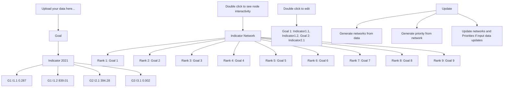

Figure 18: User Interface of DIGNP

## 8 Sensitivity Analysis

In the prediction model of the SDGs progress, we use the time series model ARIMA. The ARIMA model has three hyper-parameters

• $p \mathrm { : }$ number of autoregressive terms, namely number of past values used to predict  
• $d \colon$ number of differencing required to make the time series stationary  
• $q \mathrm { : }$ the number of moving average terms, namely number of past errors used to predict

We use the data from 2000-2015 to predict the data from 2016-2020 and judge its accuracy. By conducting the sensitivity test, we notice slight error with p variation. This show that a suitable choice of hyper-parameter is crucial to our prediction.

line chart

| p value | Proportion of the population living below the international poverty line | Prevalence of undernourishment | World Life Expectancy |
| ------- | ------------------------------------------------------------------ | ----------------------------- | ---------------------- |
| 1       | 0.8                                                              | 1.5                           | 2.5                    |
| 2       | 0.5                                                              | 1.0                           | 1.8                    |
| 3       | 0.4                                                              | 0.8                           | 1.3                    |
| 4       | 0.1                                                              | 0.4                           | 1.0                    |
| 5       | 0.5                                                              | 0.9                           | 2.1                    |
| 6       | 0.5                                                              | 1.1                           | 2.3                    |
| 7       | 0.5                                                              | 1.3                           | 2.7                    |
| 8       | 0.5                                                              | 1.5                           | 2.8                    |
| 9       | 0.6                                                              | 1.6                           | 2.8                    |
| 10      | 1.1                                                              | 2.1                           | 3.6                    |

Figure 19: Sensitivity Analysis of $\dot { p }$

Figure 19 shows the accuracy of the estimation when p varies, we can see that when $p = 4$ , the general result is relatively close to the real value. Similarly, we obtain d = 1 and $q = 2$ .

## 9 Strength and Weakness

## Strength

• Globality: In our DIGNP, all indicators and goals are connected to each other. With the idea of “Human Community with a Shared Future”, variation of one factor echoes response from others, improving an aspect in our life makes a difference to our mutual development.  
• Dynamics: The strength of a dynamic network model lies in its ability to capture complex interactions between various variables, as well as changes in those interactions over time.  
• Automation: With a solid algorithm, our DIGNP will auto-adjust the network topology and priority result in response to internal and external variation. All math works are done behind the UI, with which customers can enjoy smart and in-time network & priority management.

## Weakness

• Data Dependency: To build up a DIGNP, one needs data from bunches of indicators over a long period. High accuracy priority and prediction even require more data.  
• Indicator & Goal Input Dependency: UN has proposed SDG after rational consideration, which guarantees the overall viability of our SDG network. However, we cannot guarantee that all users of DIGNP have a full understanding of their goals and indicators. Input lacking in comprehensiveness causes deviation in network & priority output.

## 10 References

[1] United Nations Statistics Division. (2021). Global indicator framework for the Sustainable Development Goals and targets of the 2030 Agenda for Sustainable Development. Retrieved from https://unstats.un.org/sdgs/indicators/indicators-list/  
[2] Ghaffarianhoseini, A., Berardi, U., & Ghaffarianhoseini, A. (2019). System Dynamics Modeling for Sustainable Energy and Environmental Management: A Critical Review. IEEE Access, 7, 21995- 22007. doi: 10.1109/ACCESS.2019.2897064  
[3] Wang, Xue-Qi, Zhang, Jie, & Liu, Jing-Bo. (2017). Node importance evaluation method of directed weighted network based on multiple influence matrices. Acta Physica Sinica, 66(5), 050201. doi: 10.7498/aps.66.050201  
[4] Ruhnau, B. (2000). Eigenvector-centrality — a node-centrality? Social Networks, 22(4), 357-365.  
[5] Freeman, L., Borgatti, S., & White, D. (1991). Centrality in valued graphs: A measure of betweenness based on network flow. Social Networks, 13(2), 141-154.  
[6] Sachs, J. (2015). Goal-based development and the SDGs: Implications for development finance. Oxford Review of Economic Policy, 31(3/4), 268-278.  
[7] Rassanjani, S. (2018). Ending Poverty: Factors That Might Influence the Achievement of Sustainable Development Goals (SDGs) in Indonesia. Journal of Public Administration and Governance, 8(3), 114.  
[8] SDGs in Order. (n.d.). Copenhagen Consensus Center. Retrieved February 17, 2023, from https://www.sdgsinorder.org/  
[9] Haenssgen, Marco J. (2018). The struggle for digital inclusion: Phones, healthcare, and marginalisation in rural India. World Development, 104, 358-374. doi: 10.1016/j.worlddev.2017.12.022  
[10] Abram, N., Henley, B., Gupta, A., Lippmann, T., Clarke, H., Dowdy, A., . . . Boer, M. (2021). Connections of climate change and variability to large and extreme forest fires in southeast Australia. Communications Earth & Environment, 2(1), 1-17.  
[11] Tariq, A., Shu, H., Li, Q., Altan, O., Khan, M.R., Baqa, M.F., & Lu, L. (2019). Quantitative Analysis of Forest Fires in Southeastern Australia Using SAR Data. Remote Sensing, 11(19), 2282. https://doi.org/10.3390/rs11192282  
[12] Storey, M., & Price, O. (2022). Statistical modelling of air quality impacts from individual forest fires in New South Wales, Australia. Natural Hazards and Earth System Sciences, 22(12), 4039-4062.

## 11 Appendix

The serial number of indicators below are that of the official-given number[1].

Table 8: Selected Indicators for SDGs

<table><tr><td>SDGs</td><td>Indicators</td></tr><tr><td>SDG1: No poverty</td><td>C010101, C010301, C010a02</td></tr><tr><td>SDG2: Zero Hunger</td><td>C020101, C020301, C020b02</td></tr><tr><td>SDG3: Good Health and Well-being</td><td>C030201, C030402, C030b01, C030c01</td></tr><tr><td>SDG4: Quality Education</td><td>C040102, C200306</td></tr><tr><td>SDG5: Gender Equity</td><td>C050201, C050502</td></tr><tr><td>SDG6: Clean Water and Sanitation</td><td>C060101, C060201, C060b01</td></tr><tr><td>SDG7: Affordable and Clean Energy</td><td>C070102, C200208</td></tr><tr><td>SDG8: Decent Work and Economic Growth</td><td>C080501, C080502, C080802</td></tr><tr><td>SDG9: Industry, Innovation and Infrastructure</td><td>C090201, C090501, C090c01</td></tr><tr><td>SDG10: Reduced Inequality</td><td>C100501, C200205</td></tr><tr><td>SDG11: Sustainable Cities and Communities</td><td>C110101, C110401, C110702</td></tr><tr><td>SDG12: Responsible Consumption and Production</td><td>C200202, C120501</td></tr><tr><td>SDG13: Climate Action</td><td>C200305, C130202</td></tr><tr><td>SDG14: Life below Water</td><td>C140101, C140701</td></tr><tr><td>SDG15: Life on Land</td><td>C150101, C200210</td></tr><tr><td>SDG16: Peace and Justice Strong Institutions</td><td>C160102, C200205, C160a01</td></tr><tr><td>SDG17: Partnerships to achieve the Goals</td><td>C170101, C170801, C171101</td></tr></table>