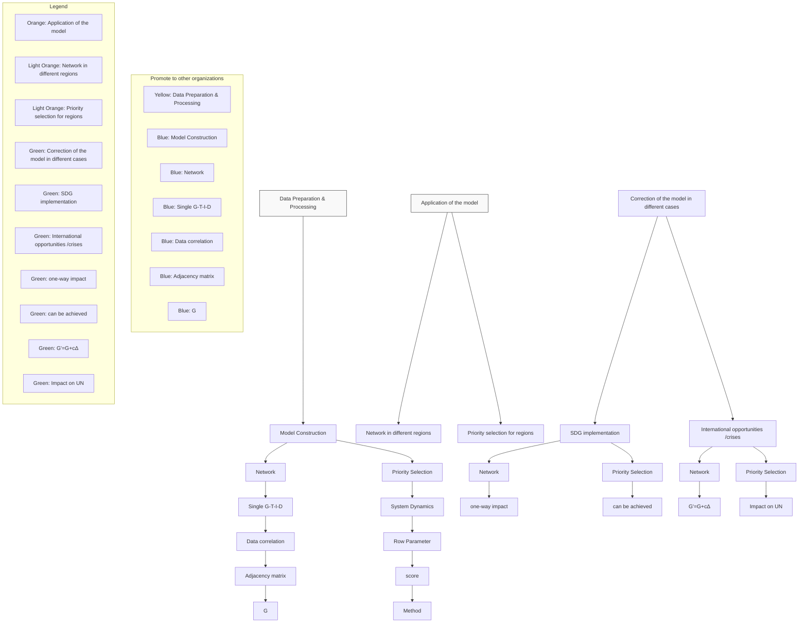
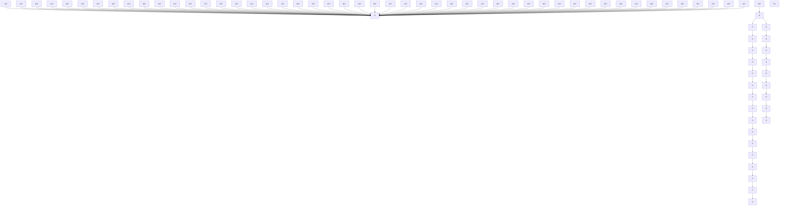
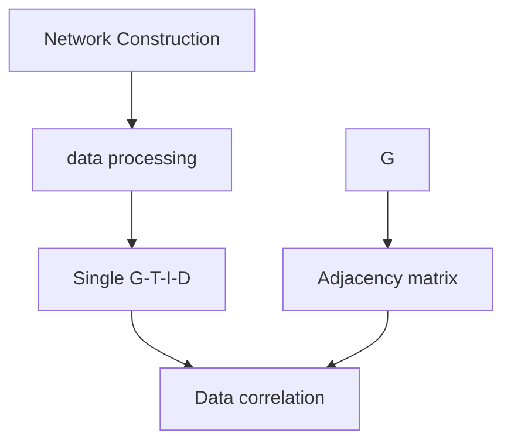
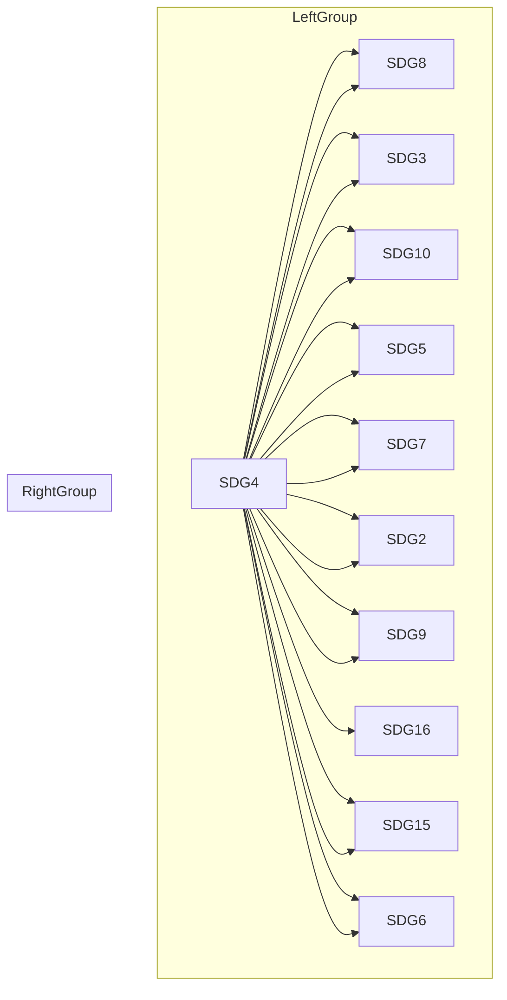
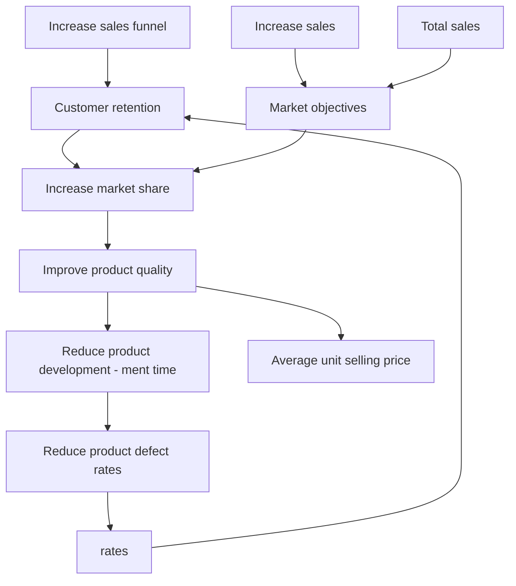

# Connecting the Dots: Unpacking the Network Systems of SDGs

Summary

The Sustainable Development Goals are not just a call to action, but a vision of hope for a better world where all people can thrive, nature can flourish, and societies can prosper in harmony with one another. To achieve sustainable development, it is critical to study relationship between SDGs and select the most effective priority goals.

For problem one, A multi-layer network approach was employed to establish a model for analyzing the interrelationships and impacts of SDGs, which improved upon the UN’s goal-targetindicator model by obtaining separate networks for each SDG. The final model was derived by computing the Pearson correlation coefficient matrix and network connections. The network models for 10 regions were visualized, revealing that in the WLD region, SDG8 had a positive impact on other SDGs, particularly on SDG4, while SDG17 had a negative impact on 14 SDGs.

For problem two, we proposed a network-based evaluation algorithm for problem two, which considers feedback mechanisms and time impact to identify achievable goals and assess project effectiveness. Scores for each SDG were visualized for 10 regions, recommending SDG4 in five regions, including WLD and ARB. Achievable goals within 10 years were identified for 9 regions achieving SDG1 and 2 regions achieving SDG17.

For problem three, we proposed a revised plan to analyze the impact of network model changes when implementing a specific SDG, identifying new feasible goals with smaller impact on other SDGs. Using WLD as an example, we modified the network model to account for the one-way impact of achieved SDGs on other SDGs, visualizing and analyzing the results. We used an evaluation algorithm to determine the optimal priority target, finding that when implementing SDG4 in WLD, the optimal priority shifted to SDG8. We also recommend incorporating technology and digitalization as new development goals, given their positive impact on SDG2, SDG3, SDG7.

For problem four, we modified the model to respond to crises/opportunities by introducing a perturbation matrix to represent event impact and exploring its effect on optimal development goals. In the case of WLD/local wars, the optimal goal shifted from SDG1 to SDG17. Analyzing SDG9 under 7 events, we determined that natural disasters had the greatest impact on the UN’s work.

For problem five, our hierarchical network modeling approach can be promoted to analyze goal connections and select priority development goals in other fields. It can refine business goals into targets, indicators, and data in companies. We used business goals as an example, established a network model, and determined the optimal priority development goals. Our method is not limited to the SDG field but can also help other organizations and individuals achieve their goals.

We have concluded that our model has strong robustness, high stability, and good interpretabil ity. This provides scientific guidance and support for achieving the SDGs.

Keywords: SDG, Multiple Complex Networks, Pearson correlation coefficient, system dynamics

## Contents

## 1 Introduction 2

1.1 Background . . 2  
1.2 Overview 2  
1.3 Restatement of the Problem .  
1.4 Our Works . . 3

## 2 Model Preparation 4

2.1 Assumptions and Justification 4  
2.2 Notations 5  
2.3 Data Preparation 5

## 3 Sub-model I: Establishment of Relationship Networks 6

3.1 Multiple Complex Model for Interactions among SDGs . . 6

3.1.1 Introducing Multiple Complex Networks 6  
3.1.2 Analyzing Relationships among SDGs using Multilayer Complex Networks 6

3.2 Result Analysis and Presentation . . 9

3.2.1 Result . . . 9  
3.2.2 In Different Regions 10

## 4 Sub-model II: Choice of Priorities Based on Relationship Network 10

4.1 Evaluation Method for Priorities Effectiveness . 10  
4.2 Priority Development Decision-making 12  
4.3 Priority Decision-making in other Regions . . . . 13  
4.4 Reasonably Achievable SDG for the next Decade 14

## 5 Sub-model III: The Impact of the Realization of a Particular SDG 15

5.1 Impact on Network Structure . . 15  
5.2 Impact on Priority Selection 16  
5.3 Other Goals that could be Considered 17

## 6 Sub-model IV: Impact of International Events or Crises 18

6.1 Impact on Network Model and Priority Selection 18  
6.2 Numerical Simulation and Results Analysis 19  
6.3 Impact on UN Sustainable Development Business . . 20

## 7 Promoting Model:Setting Target Priorities for other Organizations 21

## 8 Robustness Testing and Analysis of Pros and Cons 22

8.1 Robustness Testing 22  
8.2 Pros 23  
8.3 Cons . . 23

## Reference 24

## 1 Introduction

## 1.1 Background

To promote sustainable development for all humanity, the establishment of the Sustainable Development Goals (SDGs) embodies humanity’s hope for the future. The interrelatedness, mutual support or opposition between these goals affects the implementation of all of them.

In addition, international events such as technological advances, global pandemics, war, and refugee crises also have a significant impact on the implementation of SDGs. Therefore, interdisciplinary and comprehensive research methods are needed to understand and address these complex relationships and impacts.

## 1.2 Overview

The sustainable development goals (SDGs) are tightly interconnected and constitute an indivisible whole, making it crucial to study their interrelationships. There has been extensive research conducted by various sectors of society on the relationships between SDGs. In 2015, the United Nations proposed 169 specific targets to elaborate the 17 goals. And the International Council for Science has used network models to study the interconnections between goals. Other scholars have conducted research from different perspectives, such as linkage pathways, degree of interaction, sustainable development goal models and execution methods. They have achieved many results.

However, current research has certain limitations because it is limited to expert knowledge and does not fully utilize economic data. Moreover, there is still a lack of quantitative research on how to use the relationships between SDGs to prioritize goals.

## 1.3 Restatement of the Problem

Our main challenge is to develop a network model that describes the relationships between the seventeen Sustainable Development Goals (SDGs), and to use this model to support decisionmaking and assess potential impacts. Specifically, our objectives are as follows:

• To construct a network structure that describes the relationships between the seventeen SDGs.  
• Using the network structure to evaluate the effectiveness of a single SDG in promoting business development, and determining the priority issues and achievable goals within the next ten years.  
• To explore the impact of achieving a specific SDG on the network structure, as well as how achieving that SDG would influence priority setting decisions, and to discuss other SDGs that could be incorporated into the United Nations agenda.  
• To discuss the impact of international events such as technological advances and global pandemics on the network structure and priority setting decisions, and to examine the implications of such disruptions for sustainable development.  
• To promote the method of constructing network structures to other companies and organiza tions to help them determine the priority of their goals.

## 1.4 Our Works

According to the requirements of the task, our work mainly includes the following aspects:

• Data collection and preprocessing: We collected 169 targets and 241 indicators data from UN experts, as well as time-series data of 500 sustainable development indicators from 1967 to 2018, covering ten research regions.  
• Model establishment: Based on the correlation between data and the 4-layer network structure from goals to data, we constructed the SDG relationship network model. Using the relationship network model G, we proposed an evaluation method to assess the effectiveness of prioritizing the implementation of a particular SDG.  
• Model application: Based on the established network model, we visualized the network graph of ten research regions. Using the evaluation method, we also visualized the effectiveness of prioritized strategies for ten regions. Analyzing the visualization results, we drew conclusions.

Based on the network model, we established a model to describe the impact of different timeframes on the degree of SDG implementation. We established a model for the SDGs that can be reasonably achieved in different regions within ten years.

• Model adjustment for implementing a specific SDG: Based on the network model, we modified the weight and adjusted the network model, considering the impact on selecting priority items. We also proposed some new goals that could be included in the UN’s considerations, such as technological development and digitalization, and analyzed the reasons from the perspective of other SDG impacts.  
• Model adjustment during international crises or opportunities: Based on the network model and evaluation method, we derived a new relationship network G’, introduced the anti-interference index c, and proposed a relationship formula between the disturbance Δx and G’ and the original network G. We modified the network model, considering the impact on selecting priority items, and analyzed the impact on the UN’s mission before and after the crisis  
• Promotion of model analysis methods: We promoted the analysis method of the relationship network to other fields, such as analyzing the relationship between a company’s strategic goals, to help leaders prioritize development items.

We conducted robustness and stability analysis, considering the disturbance of different research regions and events on the model. We concluded that the model has strong stability and robustness. In addition, we also analyzed the advantages and disadvantages of the model.

flowchart

Figure 1: Our work

## 2 Model Preparation

## 2.1 Assumptions and Justification

To simplify the problem and make it convenient for us to simulate real-life conditions, we make the following basic assumptions, each of which is properly justified.

• Consider the cascading effects between SDGs, such as reducing poverty and hunger may promote health and education, but at the same time may have negative impacts on climate change and the environment, thus affecting aspects such as species diversity.  
• Consider the differences in the network of SDGs relationships between countries in different regions and development levels.  
• Assume that the effects between SDGs are stable, i.e., the relationship network does not change over time.  
• Assume that the obtained data are real and reliable, and ignore the small noise in the data.  
• Assume that there is only a linear relationship between the data of different indicators,although non-linear relationships are widely present, it is difficult to estimate. Therefore, we choose variables with a sufficiently large correlation coefficient, meaning that we greatly reduce the possible influence on the results.  
• Assume that the influence between two targets is the same, i.e., the adjacency matrix is an undirected power map.

## 2.2 Notations

<table><tr><td>Variable Name</td><td>M</td><td>eanings</td><td>Examples</td></tr><tr><td>N</td><td colspan="2">Nodes, e.g. Ng denotes the set of Goal nodes</td><td> $N_g$ ,  $N_t$ ,  $N_i$ ,  $N_d$ .</td></tr><tr><td>A</td><td colspan="2">Adjacency matrix</td><td> $A_{gg}$ ,  $A_{tt}$ ,  $A_{ii}$ ,  $A_{dd}$ , etc.</td></tr><tr><td>G</td><td colspan="2">Relationship Network Model</td><td> $G = A_{gg}$ .</td></tr><tr><td>x</td><td colspan="2">The degree of realization of SDGs , as a 1*17 matrix</td><td> $x_0$ ,  $x_1$ , etc.</td></tr><tr><td>Δx</td><td colspan="2">Perturbations arising , for 1*17 matrix</td><td>Δx.</td></tr><tr><td>c</td><td colspan="2">Anti-interference coefficient, related</td><td>c</td></tr></table>

## 2.3 Data Preparation

In the data preparation stage, we conducted the identification of indicators and collection areas, multi-layer data collection, and World Bank data processing, and finally obtained the following data.

• data on 169 targets and 241 indicators derived from UN expert studies.  
• time series data from 1967 to 2018 for 10 regions, 500 indicators about sustainable development.

For indicator identification, we used the Goal-Target-Indicator structure derived from the UN study to collect Targets and Indicator data. Second, we selected 10 study regions. These are the World (WLD), members of the Organization for Economic Cooperation and Development (OECD) (OED), the Arab World (ARB), Central Europe and the Baltics (CEB), East Asia & Pacific (EAS), East Asia & Central Asia (ECS), the European Union (EUU), Latin America & the Caribbean (LCN), the Middle East & North Africa (MEA) North Africa (MEA), and North America (NAC).

text_image

Multiple Layers Data
169 Targets
241 Indicators
WorldBank Data
NAC
LCN
OED
CEB
EUU
ECS
MEA
ARB
WLD
EAS

Figure 2: Regional Data preparation

For data collection and processing, we collected time-series data for 263 countries and regions from websites such as World Bank. The final data were obtained after processes such as processing missing values, eliminating useless data, sorting by region, and classifying the data in G-T-I structure.

## 3 Sub-model I: Establishment of Relationship Networks

## 3.1 Multiple Complex Model for Interactions among SDGs

## 3.1.1 Introducing Multiple Complex Networks

Multilayer Complex Networks(MCNs) refer to complex network models composed of multiple layers or networks, which can interact or depend on each other. Unlike traditional network models, multilayer complex networks allow different types of nodes and connections to intersect across different layers, and allow nodes to have overlapping relationships across different layers.

Multilayer complex networks have wide applications in describing and analyzing complex realworld systems, such as social networks, biological networks, and transportation networks. They can provide a more comprehensive perspective to describe the structure and function of the system, and can better capture the multiple relationships between nodes.

Analytical methods of multilayer complex networks include graph-theoretical methods, complex network models and methods, as well as machine learning methods, among others. By analyzing multilayer complex networks, we can better understand the evolution and behavior of the system, and provide new insights and methods for solving practical problems.

In summary, the study of multilayer complex networks has great potential for understanding complex systems and addressing real-world problems. The development of analytical methods and models for multilayer complex networks can provide a new perspective and approach for the study of complex systems.

## 3.1.2 Analyzing Relationships among SDGs using Multilayer Complex Networks

The interrelationships among SDGs are highly complex, as each goal can potentially affect the implementation of other goals. Moreover, there are many indicators that can be used to represent the degree of goal attainment, and simply linking goals to data indicators may overlook their intricate relationships. Therefore, we turn to a data-driven approach, namely MCNs, to analyze the relationships among data indicators, which can indirectly construct the interrelationships among SDGs. This approach can help us better understand the mutual impacts among SDGs and provide new ideas and methods for solving practical problems.

## • $G - T - I$ framework determined by UN experts:

The United Nations has identified 169 specific indicators to assess whether the 17 sustainable development goals (SDGs) have been achieved. For instance, SDG7 is evaluated using seven indicators, including increasing the proportion of renewable energy and improving energy efficiency. UN experts have established links between Targets and used Indicators to quantify them. For example, Target 1.1 under SDG1 (no poverty) is ”to eradicate extreme poverty and hunger globally,” while Target 1.2 is ”to ensure that everyone has access to adequate social protection and healthcare.” Indicator 1.1.1 under Target 1.1 is ”Proportion of population below the international poverty line, by sex, age, employment status and geographical location (urban/rural).” Based on the $G - T - I$ system established by UN experts and known data, we can establish a direct relationship between World Bank Data and Indicators. This allows us to present the changes between goals and data more systematically. By connecting 241 Indicators with 500 Data indicators, we ultimately obtained 17 isolated $G - T - I - D$ networks. Using SDG9 as an example, the network structure is shown in Figure 3.

```mermaid
graph TD
  A["SDG9 Resilient Infrastructure"] --> B["SP.RU R.TOT L.ZS"]
  A --> C["9.1.1"]
  A --> D["9.1.2"]
  A --> E["9.1"]
  A --> F["9.2"]
  A --> G["9.2.1"]
  A --> H["9.3"]
  A --> I["9.3.1"]
  A --> J["9.4"]
  A --> K["9.5"]
  A --> L["9.5.2"]
  A --> M["9.5.1"]
  A --> N["9.4.1"]
  A --> O["9.3.2"]
  A --> P["9.3.1"]
  A --> Q["9.2"]
  A --> R["9.2.2"]
  A --> S["NV.IN D.MA NE.ZS"]
  A --> T["NV.IN D.MA NE.CD"]
  A --> U["Proportion of small-scale industries with a loan or line of credit"]
  A --> V["Total official international support"]
  A --> W["IE.PPI. TRAN. CD"]
  A --> X["IE.PPI. TELE. CD"]
  A --> Y["SP.PO P.SCIE. RD.P6"]
```

flowchart

Figure 3: G T I D network

## • Describing the Mechanism of Interconnection in the G-T-I-D Network:

As shown in Figure 4, two $G - T - I - D$ networks are connected through the correlation of D. N represents the node matrix, with $N _ { g } , N _ { t } , N _ { i } , N _ { d }$ representing the goals, targets, indicators, and data nodes, respectively. A represents the adjacency matrix, with $A _ { g g } [ 1 7 \times 1 7 ] , A _ { t t } [ 1 6 9 \times 1 6 9 ] , A _ { i i } [ 2 4 1 \times$ 241], $A _ { d d } [ 5 0 0 \times 5 0 0 ]$ representing the adjacency matrices between goals, targets, indicators, and data, respectively. $A _ { g t } [ 1 7 \times 1 6 9 ] , \ A _ { t i } [ 1 6 9 \times 2 4 1 ]$ ], and $A _ { i d } [ 2 4 1 \times 5 0 0 ]$ represent the adjacency matrices between goals and targets, targets and indicators, and indicators and data, respectively. The adjacency matrices of these four initial ones matrices are given by a single $G - T - I - D$ structure.

The linking of the Datas is based on the Pearson correlation coefficient values. (the datas were connected when the r exceeded 0.9 with $p < 0 . 1$ significance level.)

flowchart

Figure 4: two $G - T - I - D$ network

## • Calculation of G  G Adjacency Matrix:

First, calculate the correlation between data: We calculated the correlation coefficients between World Bank data indicators to obtain the $A _ { d d }$ matrix.

Then, the $I - I$ adjacency matrix $A _ { i i }$ was obtained as $A _ { i i } = A _ { i d } \cdot A _ { d d } \cdot A _ { d i }$ , and the $T - T$ adjacency matrix was obtained as ${ \cal A } _ { t t } = A _ { t i } \cdot A _ { i d } \cdot A _ { d d } \cdot A _ { d i } \cdot A _ { i t }$ . Finally, the $G - G$ adjacency matrix was obtained as ${ \cal A } _ { g g } = { \cal A } _ { g t } \cdot { \cal A } _ { t i } \cdot { \cal A } _ { i d } \cdot { \cal A } _ { d d } \cdot { \cal A } _ { d i } \cdot { \cal A } _ { i t } \cdot { \cal A } _ { t g }$ . The process is illustrated in Figure 5.

flowchart

Figure 5: calculation of $A _ { g g }$

## 3.2 Result Analysis and Presentation

## 3.2.1 Result

The elements of the G  G adjacency matrix $A _ { g g }$ represent the weights that denote the interconnections among the 17 SDGs. By distinguishing only between 0 and non-zero elements, we can obtain an undirected and unweighted graph of the SDGs, which represents the existence of influence between two SDGs. If we consider the weight values, the greater the absolute value, the higher the degree of influence between two SDGs, with the sign indicating mutual support or counterbalance between the two SDGs. We use orange-red and light-blue colors to represent the mutually supportive and antagonistic relationships between SDGs, respectively, and the brightness of the connecting line color indicates the degree of influence between SDGs. We visualize the SDG impact network as shown in Figure 6 after optimizing its structure.

radar chart

| Label | Value |
|---|---|
| SDG6 | 100 |
| SDG5 | 100 |
| SDG4 | 100 |
| SDG3 | 100 |
| SDG2 | 100 |
| SDG1 | 100 |
| SDG17 | 100 |
| SDG16 | 100 |
| SDG15 | 100 |
| SDG14 | 100 |
| SDG13 | 100 |
| SDG12 | 100 |
| SDG11 | 100 |
| SDG10 | 100 |
| SDG9 | 100 |
| SDG8 | 100 |
| SDG7 | 100 |
| SDG6 | 50 |
| SDG5 | 50 |
| SDG4 | 50 |
| SDG3 | 50 |
| SDG2 | 50 |
| SDG1 | 50 |
| SDG17 | 50 |
| SDG16 | 50 |
| SDG15 | 50 |
| SDG14 | 50 |
| SDG13 | 50 |
| SDG12 | 50 |
| SDG11 | 50 |
| SDG10 | 50 |
| SDG9 | 50 |
| SDG8 | 50 |
| SDG7 | 50 |
| SDG6 | 25 |
| SDG5 | 25 |
| SDG4 | 25 |
| SDG3 | 25 |
| SDG2 | 25 |
| SDG1 | 25 |
| SDG17 | 25 |
| SDG16 | 25 |
| SDG15 | 25 |
| SDG14 | 25 |
| SDG13 | 25 |
| SDG12 | 25 |
| SDG11 | 25 |
| SDG10 | 25 |
| SDG9 | 25 |
| SDG8 | 25 |
| SDG7 | 25 |
| SDG6 | 25 |
| SDG5 | 25 |
| SDG4 | 25 |
| SDG3 | 25 |
| SDG2 | 25 |
| SDG1 | 25 |
| SDG17 | 25 |
The chart displays a network diagram connecting labeled nodes (SDG) to their corresponding labels (e.g., 'SDG6' for the top node). The red lines connect the nodes to the edges of the graph, suggesting connections or relationships between these nodes.

Figure 6: Weighted graph of SDGs interconnection (using WLD as an example)

In the WLD region, SDG8, SDG10, and SDG4 have a positive impact on 14 SDGs, indicating that these three goals have been well implemented and executed in the region. SDG8 focuses on economic growth and employment, SDG10 focuses on reducing inequality, and SDG4 focuses on quality education. These three goals have a common feature in that they make important contributions to economic and social development and occupy a significant position in the development of the WLD region. Therefore, the positive impact of these three goals on other SDGs is not surprising.

In contrast, SDG17 has a negative impact on 16 SDGs, indicating that there are some problems with the implementation of SDG17 in the WLD region. SDG17 focuses on global partnerships, including development assistance, trade, and technology transfer, but in the WLD region, the development of these aspects faces some challenges

## 3.2.2 In Different Regions

Considering that the connections and influences between SDGs in different regions may vary, we used data from different regions to verify the generated network structure. The SDG networks of eight regions are shown in Figure 7.

network graph

| Category | Subgroup | Value |
| --- | --- | --- |
| ARB | SD02 | 38 |
| ARB | SD03 | 19 |
| ARB | SD04 | 38 |
| OED | SD01 | 19 |
| OED | SD02 | 19 |
| OED | SD03 | 38 |
| OED | SD04 | 38 |
| OED | SD05 | 19 |
| OED | SD06 | 19 |
| OED | SD07 | 19 |
| OED | SD08 | 38 |
| OED | SD09 | 19 |
| OED | SD10 | 19 |
| OED | SD11 | 19 |
| OED | SD12 | 38 |
| OED | SD13 | 19 |
| OED | SD14 | 19 |
| OED | SD15 | 19 |
| OED | SD16 | 19 |
| OED | SD17 | 38 |
| OED | SD18 | 19 |
| OED | SD19 | 19 |
| OED | SD20 | 38 |
| OED | SD21 | 19 |
| OED | SD22 | 19 |
| OED | SD23 | 38 |
| OED | SD24 | 38 |
| OED | SD25 | 19 |
| OED | SD26 | 19 |
| OED | SD27 | 38 |
| OED | SD28 | 19 |
| OED | SD29 | 19 |
| OED | SD30 | 38 |
| OED | SD31 | 19 |
| OED | SD32 | 19 |
| OED | SD33 | 38 |
| OED | SD34 | 38 |
| OED | SD35 | 19 |
| OED | SD36 | 19 |
| OED | SD37 | 38 |
| OED | SD38 | 38 |
| NAC | SD01F | 38 |
| NAC | SD02F | 19 |
| NAC | SD03F | 38 |
| NAC | SD04F | 38 |
| NAC | SD05F | 19 |
| NAC | SD06F | 19 |
| NAC | SD07F | 38 |
| NAC | SD08F | 38 |
| NAC | SD09F | 19 |
| NAC | SD10F | 19 |
| NAC | SD11F | 38 |
| NAC | SD12F | 38 |
| NAC | SD13F | 19 |
| NAC | SD14F | 19 |
| NAC | SD15F | 38 |
| NAC | SD16F | 38 |
| MEA | SD02F | 38 |
| MEA | SD03F | 19 |
| MEA | SD04F | 38 |
| MEA | SD05F | 38 |
| MEA | SD06F | 19 |
| MEA | SD07F | 19 |
| MEA | SD08F | 38 |
| MEA | SD09F | 38 |
| MEA | SD10F | 19 |
| MEA | SD11F | 19 |
| MEA | SD12F | 38 |
| MEA | SD13F | 38 |
| MEA | SD14F | 19 |
| MEA | SD15F | 19 |
| MEA | SD16F | 38 |

Figure 7: Weighted graph of SDGs interconnection (using WLD as an example)

In the CEB region, SDG4 has a negative impact on six other goals, including SDG3, and only a positive impact on SDG8. On the other hand, in the EAS region, SDG4 has a positive impact on all 16 SDGs. In the OED region, most of the SDGs have negative impacts on each other, while in the MEA region, most of the SDGs have positive impacts on each other. The reasons for these differences may be related to various factors, such as economic, social, cultural, and political differences.

In the CEB region, a lack of educational and health resources may be the reason for the negative impact of SDG4 on other goals. For instance, a shortage of education and health resources could lead to higher levels of disease and poverty, thereby having a negative impact on SDG3.

On the other hand, in the EAS region, success in education and health may be the reason for the positive impact of SDG4 on other goals. For example, good levels of education and health may help to improve employment rates, promote economic growth, and thus have a positive impact on SDG8.

## 4 Sub-model II: Choice of Priorities Based on Relationship Network

## 4.1 Evaluation Method for Priorities Effectiveness

• Quantifying the Implementation of SDGs by Adopting Standards:

If we use some numbers to represent the current level of implementation of these 17 SDGs, we can standardize these numbers so that their range is limited to values between 0 and 1. If we represent the level of implementation of these 17 SDGs with $x _ { 1 }$ to $x _ { 1 7 }$ , then the range of values is from

0 to 1. Then, we can use these numerical values as a 17-dimensional vector $x = [ x _ { 1 } , x _ { 2 } , \dotsc , x _ { 1 7 } ]$ , which can represent the level of implementation of 17 SDGs in a certain region.

## • Consider the Effects of Prioritizing the Development of a Specific SDG:

If we want to measure the impact of changes in implementation levels, we can use a coefficient matrix to calculate the changes in the implementation vector $x _ { 0 }$ . Specifically, assuming the coefficient matrix is A, which is the adjacency matrix $A _ { g g }$ of the relationship network among SDGs, the implementation vector $x _ { 0 }$ can be calculated after one iteration as follows:

$$
x _ {1} = A x _ {0}
$$

Here, $x _ { 1 }$ represents the new value of the implementation vector $x _ { 0 }$ after one iteration. This new value reflects the impact of changes in implementation levels on other indicators. If an element in $x _ { 1 }$ becomes closer to 1, it indicates an improvement in the implementation level of the corresponding indicator, and vice versa.

It should be noted that the values of the coefficient matrix A should be between 0 and 1. If a coefficient is greater than 1, it can be viewed as 1, and if it is less than 0, it can be viewed as 0. This ensures that each element of the calculated implementation vector $x _ { 1 }$ is between 0 and 1.

## • Consider the Cascading Effects:

However, the relationships between these goals are not always straightforward and can be complex. For example, investing heavily in education may have a short-term impact on economic development, but in the long run, education can accelerate the development of the economy and technology. Therefore, when considering the cascading effects of prioritizing a particular SDG, it is important to take into account both short-term and long-term effects and the potential feedback loops between different goals. This requires a more nuanced analysis and modeling approach to capture the complex interdependencies between the SDGs.

$$
x _ {n} = A ^ {n} x _ {0}, \quad n o t \quad x _ {n} = A \cdot (n x _ {0})
$$

Therefore, we need to revise the original model. Here, we should not only consider the impact of SDG 1 on SDG 2, but also the impact of SDG 1 on SDG 3, and then the impact of SDG 3 on SDG 2.Figure 8 shows the chain efforts of such iteration. This indicates that within a certain period of iteration, which is several years, we should always expect that the significant development of one SDG will have not only a direct impact but also indirect impacts on other SDGs.

In addition, we cannot simply assume that the development of a certain SDG will not have an impact on itself. For example, without other limiting conditions, the vigorous development of the economy (SDG 8) itself will have a positive impact on economic development, which is called a ”positive feedback mechanism”.

```mermaid
graph TD
  A["SDG1"] -->|effectiveness from SDG1 to SDG3| B["SDG3"]
  B -->|effectiveness from SDG1 to SDG4| C["SDG4"]
  C -->|effectiveness from SDG2 to SDG3| D["SDG2"]
  D -->|effectiveness from SDG2 to SDG4| E["SDG4"]
  E -->|effectiveness from SDG3 to SDG4| F["SDG3"]
  F -->|effectiveness from SDG1 to SDG2| G["SDG2"]
  G -->|effectiveness from SDG2 to SDG3| H["SDG3"]
  H -->|effectiveness from SDG1 to SDG4| I["SDG4"]
  I -->|effectiveness from SDG2 to SDG3| J["SDG2"]
  J -->|effectiveness from SDG2 to SDG4| K["SDG4"]
  K -->|effectiveness from SDG3 to SDG4| L["SDG3"]
  L -->|effectiveness from SDG1 to SDG3| M["SDG1"]
  M -->|effectiveness from SDG1 to SDG2| N["SDG2"]
  N -->|effectiveness from SDG2 to SDG3| O["SDG3"]
  O -->|effectiveness from SDG3 to SDG4| P["SDG4"]
  P -->|effectiveness from SDG4 to SDG5| Q["SDG5"]
  Q -->|effectiveness from SDG5 to SDG6| R["SDG6"]
  R -->|effectiveness from SDG6 to SDG7| S["SDG7"]
  S -->|effectiveness from SDG7 to SDG8| T["SDG8"]
  T -->|effectiveness from SDG8 to SDG9| U["SDG9"]
  U -->|effectiveness from SDG9 to SDG10| V["SDG10"]
  V -->|effectiveness from SDG10 to SDG11| W["SDG11"]
  W -->|effectiveness from SDG11 to SDG12| X["SDG12"]
  X -->|effectiveness from SDG12 to SDG13| Y["SDG13"]
  Y -->|effectiveness from SDG13 to SDG14| Z["SDG14"]
  Z -->|effectiveness from SDG14 to SDG15| AA["SDG15"]
  AA -->|effectiveness from SDG15 to SDG16| AB["SDG16"]
  AB -->|effectiveness from SDG16 to SDG17| AC["SDG17"]
  AC -->|effectiveness from SDG17 to SDG18| AD["SDG18"]
  AD -->|effectiveness from SDG18 to SDG19| AE["SDG19"]
  AE -->|effectiveness from SDG19 to SDG20| AF["SDG20"]
  AF -->|effectiveness from SDG20 to SDG21| AG["SDG21"]
  AG -->|effectiveness from SDG21 to SDG22| AH["SDG22"]
  AH -->|effectiveness from SDG22 to SDG23| AI["SDG23"]
  AI -->|effectiveness from SDG23 to SDG24| AJ["SDG24"]
  AJ -->|effectiveness from SDG24 to SDG25| AK["SDG25"]
  AK -->|effectiveness from SDG25 to SDG26| AL["SDG26"]
  AL -->|effectiveness from SDG26 to SDG27| AM["SDG27"]
  AM -->|effectiveness from SDG27 to SDG28| AN["SDG28"]
  AN -->|effectiveness from SDG28 to SDG29| AO["SDG29"]
  AO -->|effectiveness from SDG29 to SDG30| AP["SDG30"]
  AP -->|effectiveness from SDG30 to SDG31| AQ["SDG31"]
  AQ -->|effectiveness from SDG31 to SDG32| AR["SDG32"]
  AR -->|effectiveness from SDG32 to SDG33| AS["SDG33"]
  AS -->|effectiveness from SDG33 to SDG34| AT["SDG34"]
  AT -->|effectiveness from SDG34 to SDG35| AU["SDG35"]
  AU -->|effectiveness from SDG35 to SDG36| AV["SDG36"]
  AV -->|effectiveness from SDG36 to SDG37| AW["SDG37"]
  AW -->|effectiveness from SDG37 to SDG38| AX["SDG38"]
  AX -->|effectiveness from SDG38 to SDG39| AY["SDG39"]
  AY -->|effectiveness from SDG39 to SDG40| AZ["SDG40"]
  AZ -->|effectiveness from SDG40 to SDG41| BA["SDG41"]
  BA -->|effectiveness from SDG41 to SDG42| BB["SDG42"]
  BB -->|effectiveness from SDG42 to SDG43| BC["SDG43"]
  BC -->|effectiveness from SDG43 to SDG44| BD["SDG44"]
  BD -->|effectiveness from SDG44 to SDG45| BE["SDG45"]
  BE -->|effectiveness from SDG45 to SDG46| BF["SDG46"]
  BF -->|effectiveness from SDG46 to SDG47| BG["SDG47"]
  BG -->|effectiveness from SDG47 to SDG48| BH["SDG48"]
  BH -->|effectiveness from SDG48 to SDG49| BI["SDG49"]
  BI -->|effectiveness from SDG49 to SDG50| BJ["SDG50"]
```

flowchart

Figure 8: chain efforts

## • New Modified Model:

Based on the above, using the nth power of the influence coefficient matrix ${ A _ { g g } } ^ { n } = A ^ { n }$ can approximately reflect the impact of a sudden change in one indicator on other indicators. This impact can represent the effect of a strong SDG development on the progress of other goals in the short term or over several years.

Therefore, if n is taken to be infinity or sufficiently large, it can represent the long-term changes of other goals when one goal is significantly developed. The arithmetic sum of the vectors of

$$
y = | | A _ {g g} ^ {n} | | = | | A ^ {n} | | _ {1}
$$

can then represent the score obtained from the significant development of that goal. By further comparing the scores obtained from the significant development of each goal, we can identify the priority development goals and the possible achievement of other goals.

## 4.2 Priority Development Decision-making

Using WLD as an example, we applied our evaluation model and calculated the network relationships for WLD. To represent the prioritization of SDG1, we some initial values and evaluated the impact on the other 16 SDGs. By quantifying the impact on each SDG and summing them, we obtained an effectiveness value for the development of SDG1. The same process was repeated for each SDG. The effectiveness values for the development of the 17 SDGs in WLD were obtained and presented in a table, as shown in Figure 9. Further analysis of the results will be provided.

bar chart

| Choice Of SDG Priorities | Validity scores |
|---|---|
| 1 NO POVERTY | 8.7 |
| 2 ZHI HUNDERS | 8.4 |
| 3 GOOD HEALTH AND WELL-BEING | 8.5 |
| 4 QUALITY EDUCATION | 10 |
| 5 GENDER EQUALITY | 7.1 |
| 6 CLEAR WATER AND SANITIZATION | 6.5 |
| 7 LETTRENGTH AND COAL THERMIS | 1.7 |
| 8 RECENT WORK AND ECONOMIC GROWTH | 9.3 |
| 9 INDUSTRY, ASSOCIATION AND INFRASTRUCTURE | 4.0 |
| 10 RESTRICTED INEQUALITIES | 8.0 |
| 11 ROLLARAMOIC COLD AND COMMUNITIES | 1.1 |
| 12 RESPONSIBLE CONSUMPTION AND PRODUCTION | 4.2 |
| 13 CLIMATE ACTION | 1.6 |
| 14 LIFE BELOW WATER | 1.3 |
| 15 LIFE ON LAND | 6.5 |
| 16 PEACE, RECOISE AND COLDING INSTITUTIONS | 5.0 |
| 17 FAITHINGS/PLS FOR THE GOALS | 7.5 |

Figure 9: Effectiveness of prioritizing the development of 17 SDGs(taking WLD as an example)

## 4.3 Priority Decision-making in other Regions

Applying the model to the network relationship models of the other eight regions, we obtained effectiveness values for the development of the 17 SDGs, which are presented in a table as shown in the Figure 10.

bar chart

| Region | Value |
|---|---|
| NAC | 100 |
| CEB | 80 |
| EUU | 95 |
| ICN | 75 |
| EAS | 65 |
| ION | 55 |
| MEA | 70 |
| OCE | 60 |
| OCE | 50 |
| OCE | 45 |
| OCE | 40 |
| OCE | 35 |
| OCE | 30 |
| OCE | 25 |
| OCE | 20 |
| OCE | 15 |
| OCE | 10 |
| OCE | 5 |
| OCE | 0 |

Figure 10: Effectiveness of prioritizing the development of 17 SDGs in other regions

It can be observed that the priority development needs vary across different regions. For instance, in the MEA region, there is a higher demand for the development of SDG 1 and 2, while the demand for SDG 13-15 is relatively lower. On the other hand, in the NAC region, there is a higher demand for the development of SDG 13-15, and a lower demand for SDG 1-2. The difference in development needs between these two regions does not imply that they do not need to develop in those aspects. Sometimes, it may be due to the fact that they have already achieved a relatively high level of development, resulting in lower effectiveness in further development. At other times, it may be because they need to prioritize the development of other SDGs.

Moreover, by plotting these development needs as line graphs and placing them at one Figure 11. The varying priority levels for developing different SDGs across different regions can be clearly visualized.

line chart

| CHOICE OF PRIORITIES | WLD  | ARB  | CEB  | EAS  | ECS  | EUU  | LCN  | MEA  | NAC  | OED  |
| --------------------- | ---- | ---- | ---- | ---- | ---- | ---- | ---- | ---- | ---- | ---- |
| SDG1                  | 2.8  | 2.2  | 4.5  | 4.3  | 2.5  | 4.4  | 2.7  | 2.1  | 0.0  | 4.5  |
| SDG2                  | 2.6  | 2.0  | 2.8  | 2.5  | 2.0  | 1.5  | 2.6  | 1.8  | 3.8  | 2.7  |
| SDG3                  | 2.0  | 1.5  | -0.5 | 1.0  | -0.5 | 0.5  | -0.5 | 1.5  | -2.5 | -0.5 |
| SDG4                  | 2.8  | 2.5  | -0.5 | 2.0  | -0.5 | 2.5  | -0.5 | 2.0  | -2.5 | 6.0  |
| SDG5                  | 2.0  | 1.5  | -0.5 | 1.0  | -0.5 | 1.5  | -0.5 | 1.5  | -2.5 | -0.5 |
| SDG6                  | 1.5  | 1.0  | -0.5 | 0.5  | -0.5 | 1.0  | -0.5 | 1.0  | -2.5 | -0.5 |
| SDG7                  | -0.5 | -0.5 | -0.5 | -0.5 | -0.5 | -0.5 | -0.5 | -0.5 | -2.5 | -0.5 |
| SDG8                  | -0.5 | -0.5 | -0.5 | -0.5 | -0.5 | -0.5 | -0.5 | -0.5 | -2.5 | -0.5 |
| SDG9                  | -0.5 | -0.5 | -0.5 | -0.5 | -0.5 | -0.5 | -0.5 | -0.5 | -2.5 | -0.5 |
| SDG10                 | -0.5 | -0.5 | -0.5 | -0.5 | -0.5 | -0.5 | -0.5 | -0.5 | -2.5 | -2.5 |
| SDG11                 | -0.5 | -0.5 | -0.5 | -0.5 | -0.5 | -0.5 | -0.5 | -0.5 | -2.5 | -2.5 |
| SDG12                 | -0.5 | -0.5 | -0.5 | -0.5 | -0.5 | -0.5 | -0.5 | -0.5 | -2.5 | -2.5 |
| SDG13                 | -0.5 | -0.5 | -0.5 | -0.5 | -0.5 | -0.5 | -0.5 | -0.5 | -2.5 | -2.5 |
| SDG14                 | -0.5 | -0.5 | -0.5 | -0.5 | -0.5 | -0.5 | -0.5 | -0.5 | -2.5 | -2.5 |
| SDG15                 | -0.5 | -0.5 | -0.5 | -0.5 | -0.5 | -0.5 | -0.5 | -0.5 | -2.8 | -2.8 |
| SDG16                 | -1.0 | -1.0 | -1.0 | -1.0 | -1.0 | -1.0 | -1.0 | -1.0 | -1.8 | -3.2 |
| SDG17                 | -1.8 | -1.8 | -1.8 | -1.8 | -1.8 | -1.8 | -1.8 | -1.8 | -2.8 | -3.2 |
The chart displays the importance scores of various criteria (WLD, ARB, CEB, EAS, ECS, EUU, LCN, MEA, NAC, OED) across different priority levels (SDG1 to SDG17). The Y-axis represents the importance score, and the X-axis represents the priority level (SDG1 to SDG17). The legend is not explicitly labeled but corresponds to each category on the line.

Figure 11: Line graph of effectiveness of prioritizing the development

We validated the priority assessment for different regions and found that it is generally consistent with reality, indicating that our model has good robustness.

## 4.4 Reasonably Achievable SDG for the next Decade

In our previous model, we analyzed and quantified the numerical representation of SDG implementation. We set the year n = 10 to calculate the development progress of the 17 SDGs ten years later and selected coefficients to evaluate the development progress based on the current actual development level. According to the evaluation results, the SDGs that these ten regions can achieve in the next ten years are presented in the Figure 12.

Within ten years, SDG1 can be achieved in nine regions, SDG4 in eight regions, while only one region can achieve SDG13, SDG14, SDG16, and SDG17.

SDG1, which aims to eradicate poverty, is one of the most fundamental and prerequisite goals for achieving other Sustainable Development Goals. Its implementation typically requires government policy support and commitment, as well as broad efforts in social and economic development. Therefore, the fact that 9 regions can achieve SDG1 within 10 years may indicate that these regions have relatively developed economic and social infrastructure, government commitment to invest in poverty reduction plans, and good international support.

In contrast, SDG13, SDG14, and SDG16 require more global cooperation and policy action to achieve. As climate change and marine protection issues often involve global environmental and economic impacts, progress requires coordinated international action. The achievement of SDG16 also requires the establishment of effective political and judicial systems, which may face some difficulties in certain regions.

heatmap

| Regions | 1 NO POVERTY | 2 UNH HEALTH CAREER | 3 GOOD HEALTH AND WELL-BEING | 4 QUALITY EDUCATION | 5 GENDER EQUALITY | 6 CLEAN WATER AND SANITATION | 8 RECENT WORK AND ECONOMIC GROWTH | 10 REDUCED INEQUALITIES | 13 CLIMATE ACTION | 15 LIFE ON LAND | 16 PRALE JUSTICE AND STRONG INVESTMENTS | 17 PARTNERSHIPS FOR THE GOALS |
| --- | --- | --- | --- | --- | --- | --- | --- | --- | --- | --- | --- | --- |
| NAC | 1 NO POVERTY | 2 UNH HEALTH CAREER | 3 GOOD HEALTH AND WELL-BEING | 4 QUALITY EDUCATION | 5 GENDER EQUALITY | 6 CLEAN WATER AND SANITATION | 8 RECENT WORK AND ECONOMIC GROWTH | 10 REDUCED INEQUALITIES | 13 CLIMATE ACTION | 15 LIFE ON LAND | 16 PRALE JUSTICE AND STRONG INVESTINGS | 17 PARTNERSHIPS FOR THE GOALS |
| MEA | 1 NO POVERTY | 2 UNH HEALTH CAREER | 3 GOOD HEALTH AND WELL-BEING | 4 QUALITY EDUCATION | 5 GENDER EQUALITY | 6 CLEAN WATER AND SANITATION | 8 RECENT WORK AND ECONOMIC GROWTH | 10 REDUCED INEQUALITIES | 13 CLIMATE ACTION | 15 LIFE ON LAND | 16 PRALE JUSTICE AND STRONG INVESTATIONS | 17 PARTNERSHIPS FOR THE GOALS |
| LCN | 1 NO POVERTY | 2 UNH GENDER | 4 QUALITY EDUCATION | 5 GENDER EQUALITY | 6 CLEAN WATER AND SANITATION | 7 CLEAN WATER AND SANITATION | 8 RECENT WORK AND ECONOMIC GROWTH | 10 REDUCED INEQUALITIES | 13 CLIMATE ACTION | 15 LIFE ON LAND | 16 PRALE JUSTICE AND STRONG INVESTMENTS | 17 PARTNERSHIPS FOR THE GOALS |
| EUU | 1 NO POVERTY | 2 UNH GENDER | 4 QUALITY EDUCATION | 5 GENDER EQUALITY | 6 CLEAN WATER AND SANITATION | 7 CLEAN WATER AND SANITATION | 8 RECENT WORK AND ECONOMIC GROWTH | 10 REDUCED INEQUALITIES | 13 CLIMATE ACTION | 15 LIFE ON LAND | 16 PRALE JUSTICE AND STRONG INVESTMENTS | - |
| ECS | 1 NO POVERTY | 2 UNH GENDER | 4 QUALITY EDUCATION | 5 GENDER EQUALITY | 6 CLEAN WATER AND SANITATION | 7 CLEAN WATER AND SANITATION | 8 RECENT WORK AND ECONOMIC GROWTH | 10 REDUCED INEQUALITIES | 13 CLIMATE ACTION | 15 LIFE ON LAND | 16 PRALE JUSTICE AND STRONG INVESTMENTS | - |
| EAS | 1 NO POVERTY | 2 UNH GENDER | 3 GOOD HEALTH AND WELL-BEING | 4 QUALITY EDUCATION | 5 CLEAN WATER AND SANITATION | 6 CLEAN WATER AND SANITATION | 8 RECENT WORK AND ECONOMIC GROWTH | 10 REDUCED INEQUALITIES | 13 CLIMATE ACTION | 15 LIFE ON LAND | 16 PRALE JUSTICE AND STRONG INVESTMENTS | - |
| CEB | 1 NO POVERTY | 2 UNH GENDER | 3 GOOD HEALTH AND WELL-BEING | 4 QUALITY EDUCATION | 5 CLEAN WATER AND SANITATION | 6 CLEAN WATER AND SANITATION | 8 RECENT WORK AND ECONOMIC GROWTH | 10 REDUCED INEQUALITIES | 13 CLIMATE ACTION | 15 LIFE ON LAND | 16 PRALE JUSTICE AND STRONG INVEGETS | - |
| ARB | 1 NO POVERTY | 2 UNH GENDER | 3 GOOD HEALTH AND WELL-BEING | 4 QUALITY EDUCATION | 5 CLEAN WATER AND SANITATION | 6 CLEAN WATER AND SANITATION | 8 RECENT WORK AND ECONOMIC GROWTH | 10 REDUCED INEQUALITIES | 13 CLIMATE ACTION | 15 LIFE ON LAND | 16 PRALE JUSTICE AND STRONG INVENTIONS | - |
| OED | 1 NO POVERTY | 2 UNH GENDER | 3 GOOD HEALTH AND WELL-BEING | 4 QUALITY EDUCATION | 5 CLEAN WATER AND SANITATION | 6 CLEAN WATER AND SANITATION | 8 RECENT WORK AND ECONOMIC GROWTH | 10 REDUCED INEQUALITIES | 13 CLIMATE ACTION | 15 LIFE ON LAND | 16 PRALE JUSTICE AND STRONG INVENUES | - |
| WLD | 1 NO POVERTY | 2 UNH GENDER | 3 GOOD HEALTH AND WELL-BEING | 4 QUALITY EDUCATION | 5 CLEAN WATER AND SANITATION | 6 CLEAN WATER AND SANITATION | 8 RECENT WORK AND ECONOMIC GROWTH | 10 REDUCED INEQUALITIES | 13 CLIMATE ACTION | 15 LIFE ON LAND | 16 PRALE JUSTICE AND STRONG INVERGULS | - |

Figure 12: Reasonably achievable SDGs for the next decade in 10 regions

## 5 Sub-model III: The Impact of the Realization of a Particular SDG

## 5.1 Impact on Network Structure

The attainment of a specific SDG can have a significant impact on the realization of other SDGs, as the SDGs are interdependent. It is possible that implementing a particular SDG will result in transforming some of the pre-existing bidirectional impacts in the network to unidirectional impacts. While completed SDGs will continue to have positive or negative effects on the incomplete SDGs, the incomplete SDGs will no longer affect the completed SDGs. Accordingly, the G G adjacency matrix $A _ { g g }$ can be modified to incorporate these changes by converting the bidirectional impacts to unidirectional ones, leading to a new network of interrelationships between SDGs.

We also have focused on the area of WLD and used SDGs as a case study to analyze the effects of implementing this SDG on the network of interrelationships. To compare the network of interrelationships before and after the implementation of SDGs, we have generated Figure 13. Our analysis reveals that after achieving SDG4, the highest priority item is to achieve SDG8, followed by SDG17. Therefore, considering the connections with SDG4, the number of connections between SDG8 and SDG17 increases, meaning that more SDGs are influenced by their development.

flowchart

Figure 13: Comparison of the relational network before and after SDG4 implementation

## 5.2 Impact on Priority Selection

The completion of a specific SDG can affect the prioritization of development targets by altering the network structure.

To evaluate the effectiveness by our model, we have abstracted the element of $A _ { g g } ( i , j )$ as the impact of SDGi to SDGj. By summing and normalizing each row of the matrix $A _ { g g } ,$ we have derived the comprehensive impact score of SDGi to all 17 SDGs (in 10 regions) to aid in selecting the optimal development target that balances multiple goals.

After implementing a specific SDG, the network of interrelationships, $A _ { g g } .$ , undergoes a transformation to $A _ { g g } ^ { \prime }$ . However, the same approach for evaluating effectiveness can be applied to $A _ { g g } ^ { \prime }$ in order to prioritize development targets.

Taking the area of WLD as a case study, we examined the impact of implementing SDGs on the prioritization of development targets. We applied our assessment method to calculate the comprehensive scores for developing all 17 SDGs, both before $A _ { g g }$ and after $A _ { g g } ^ { \prime }$ implementation. The results of the comparison between the prioritization of development targets before and after the implementation of SDGs are shown in Figure 14.

Our analysis reveals that during the process of focusing on achieving SDG4 (Quality Education), we observed a phenomenon of decreased priority in SDG7 (Affordable and Clean Energy) and SDG14 (Life Below Water). This is because there is a high degree of overlap between SDG4 and SDG7/SDG14, and due to the widespread promotion of education, more people have become aware of the importance of SDG7 and SDG14. As a result, the priority for further development of these two SDGs has decreased.

bar chart

|        | Before | After |
| ------ | ------ | ----- |
| SDG1   | 0.93   | 0.97  |
| SDG2   | 0.92   | 0.95  |
| SDG3   | 0.92   | 0.95  |
| SDG4   | 1.00   | -     |
| SDG5   | 0.84   | 0.86  |
| SDG6   | 0.81   | 0.84  |
| SDG7   | 0.49   | 0.40  |
| SDG8   | 0.96   | 1.00  |
| SDG9   | 0.60   | 0.57  |
| SDG10  | 0.89   | 0.92  |
| SDG11  | 0.49   | 0.57  |
| SDG12  | 0.67   | 0.70  |
| SDG13  | 0.36   | 0.47  |
| SDG14  | 0.49   | 0.44  |
| SDG15  | 0.81   | 0.84  |
| SDG16  | 0.72   | 0.71  |
| SDG17  | 0.87   | 0.90  |

Figure 14: Comparison of priority selection scores before and after SDGs implementation

## 5.3 Other Goals that could be Considered

While the SDGs are a broad, inclusive framework, it still has some shortcomings and challenges. If some of the goals have been achieved, we believe there are others that can be taken into accountincluding Technology Innovation and Digitalization and regional variability elimination. We will analyze the reasons for this in terms of the impact of these goals on other SDGs.

## • Technological Innovation and Digital Technologies:

In the context of sustainable development goals, social, economic, and environmental sustainability has received widespread attention, but there has been relatively less focus on technological innovation and digitization, which is a shortcoming. Technological innovation and digital technologies have important impacts on the achievement of multiple SDG targets.

For example, in SDG 2 (Zero Hunger), the development of agricultural technology and digital technology can improve agricultural productivity, increase food supply, and enhance food safety. In SDG 3 (Good Health and Well-being), digital technology can support the development and innovation of healthcare services, such as telemedicine and electronic health records. In SDG 4 (Quality Education), digital technology can improve education content and teaching methods, such as online learning and virtual reality technology. In SDG 7 (Affordable and Clean Energy), innovative technology can improve the production efficiency of renewable energy and reduce energy consumption, such as solar, wind, and geothermal energy. In SDG 11 (Sustainable Cities and Communities), digital technology can promote sustainable development of cities and communities, such as smart transportation, smart city management, and smart buildings.

In summary, technological innovation and digital technology play a promoting role in achieving multiple SDG targets, providing important support for sustainable development.

## • Regional Equality:

Although sustainable development goals are a global framework, the needs and challenges of different regions and countries are different. Ignoring the impact of regional differences is harmful. Therefore, regional equality (eliminating regional differences) has a significant impact on the implementation of multiple SDG targets, particularly on the following targets:

SDG 1 (No Poverty), SDG 2 (Zero Hunger), SDG 3 (Good Health and Well-being), SDG 4 (Quality Education), SDG 9 (Industry, Innovation and Infrastructure), and SDG 10 (Reduced Inequality). Eliminating regional differences can reduce the gap between rich and poor areas, improve the living standards of people in poverty-stricken areas, enhance agricultural production and food supply in rural areas, promote the equitable distribution of healthcare resources, reduce the gap between urban and rural education levels, and balance economic development and infrastructure in different regions, thus promoting social equity and common prosperity.

In conclusion, eliminating regional differences is of great significance for the implementation of SDGs, as it can improve the comprehensiveness and coordination of SDG goals and promote the process of sustainable development.

## 6 Sub-model IV: Impact of International Events or Crises

## 6.1 Impact on Network Model and Priority Selection

First, we modeled the expressions of the SDGs relationship networks before and after the occurrence of opportunities or crises. We used $x _ { 0 }$ to represent the initial level of implementation of the 17 SDGs, $x _ { 2 } ( 1 { \cdot } 1 7 )$ to represent the level of implementation of the 17 SDGs after the occurrence of opportunities or crises, and $x _ { 1 } ( 1 \cdot 1 7 )$ to represent the level of SDG implementation after being affected but without opportunities or crises. We used $\Delta x ( 1 \cdot 1 7 )$ to represent the disturbance to the development of the 17 SDGs brought by opportunities or crises. We used G and G2 to represent the SDGs relationship networks before and after the occurrence of opportunities or crises.

If there is no opportunity or crisis, the initial state $x _ { 0 }$ changes to $x _ { 1 }$ after being influenced by the network. this process can be expressed as

$$
x _ {1} = x _ {0} \cdot G \tag {1}
$$

When an opportunity or crisis occurs, the degree of realization $x _ { 0 }$ in the initial state changes to the degree of realization $x _ { 2 }$ after the opportunity or crisis. this process can be expressed as

$$
x _ {2} = x _ {0} \cdot G ^ {\prime} \tag {2}
$$

Therefore, $x _ { 1 } , x _ { 2 }$ can be linked by perturbing $\Delta x$ , and the relationship between them can be expressed as

$$
x _ {2} = x _ {1} + \Delta x \tag {3}
$$

Combine the equations1,2,3

$$
x _ {0} \cdot G ^ {\prime} = x _ {0} \cdot G + \Delta x \tag {4}
$$

Assuming that $x _ { 0 }$ is invertible, it is further obtained that

$$
G ^ {\prime} = G + x _ {0} ^ {- 1} \cdot \Delta x \tag {5}
$$

Here,we define the inverse of $x _ { 0 } ^ { - 1 }$ s.t.  $x _ { 0 } ^ { - 1 } \cdot x _ { 0 } = E _ { 1 7 \cdot 1 7 }$

Let ${ \cal G } ^ { \prime } = c \cdot \Delta x$ , where $G _ { i j }$ represents the resistance of SDGi to the disturbance of SDGj at the development level of $x _ { 0 }$ .

The SDG network $G ^ { \prime }$ under the occurrence of opportunities or crises can be represented as:

$$
G ^ {\prime} = G + \Delta G, \Delta G = c \cdot \Delta x
$$

where $c$ is related to $x _ { 0 } ,$ , representing the resistance of the region to opportunities or risks in the implementation of a certain SDG level.

We will continue to use the previously adopted method for evaluating the effectiveness of priority development issues.

## 6.2 Numerical Simulation and Results Analysis

We quantified the impact of progress or crisis on the 17 SDGs and expressed it as a 1\*17 perturbation matrix. Natural disasters have a significant impact on SDG goal attainment, so we included natural disasters in the events considered.

We analyzed the impacts of six events on the implementation of SDGs based on common sense and available data.

For example, climate change poses significant threats to ecosystems and human health, including sea-level rise, temperature increases, and natural disasters, which negatively affect the implementation of SDG13, set to -1. War leads to social instability and damages infrastructure, economy, ecology, and human health, which negatively affect the implementation of SDG1, set to -0.8.

Combining the analysis, we finally obtained the disturbance matrix $\Delta x$ for SDG implementation under six opportunities or risks, as shown in Table 1.

<table><tr><td>Event Name</td><td>Perturbation matrix</td></tr><tr><td>Technological advances</td><td>[0,0,0.1,0,-0.2,0.6,-0.5,0.8,0,0,0.9,0,0,0,-0.3,0.5,0]</td></tr><tr><td>Global Epidemics</td><td>[-0.5,-0.9,-0.8,-0.3,0,0,-0.1,0,0,0,0,0,0,0.4,-0.6,-0.7]</td></tr><tr><td>Climate Change</td><td>[-0.9,-0.8,-1,-0.6,0,0,-0.8,0,0,0,0,0,0,0.7,-0.4,-0.6]</td></tr><tr><td>Regional Wars</td><td>[-0.7,-0.8,-0.9,-1,0,0,-0.7,0,0,0,0,0,0,0.5,-0.8,-0.5]</td></tr><tr><td>Refugee Movement</td><td>[-0.7,-0.5,-0.6,-0.7,0,0,-0.6,0,0,0,0,0,0,0.7,-0.9,-0.4]</td></tr><tr><td>Natural Disasters</td><td>[-0.3,-0.2,0.3,0,0,-0.2,0.5,0,0,-0.2,0,0,0,0.3,0.3,0.3]</td></tr></table>

Table 1: Perturbation matrix of each events

Taking ARB and natural disasters as examples, we provided the initial development level $x _ { 1 }$ . We then calculated $x _ { 2 }$ and $G ^ { \prime }$ using the derived formulas. Based on $G ^ { \prime }$ and the effectiveness assessment method, we presented the development relationship network and the priority development scores of SDGs before and after the impact of natural disasters in ARB, as shown in Figure 15.

radar chart

| Category | Before Region Wars | With Region Wars |
| -------- | ------------------ | ---------------- |
| SDG1     | 0.8                | 0.6              |
| SDG2     | 0.7                | 0.9              |
| SDG3     | 0.6                | 0.8              |
| SDG4     | 0.5                | 0.7              |
| SDG5     | 0.4                | 0.6              |
| SDG6     | 0.5                | 0.7              |
| SDG7     | 0.6                | 0.8              |
| SDG8     | 0.7                | 0.9              |
| SDG9     | 0.8                | 0.7              |
| SDG10    | 0.7                | 0.8              |
| SDG11    | 0.6                | 0.7              |
| SDG12    | 0.5                | 0.6              |
| SDG13    | 0.4                | 0.5              |
| SDG14    | 0.5                | 0.6              |
| SDG15    | 0.6                | 0.7              |
| SDG16    | 0.7                | 0.8              |
| SDG17    | 0.8                | 0.9              |

Figure 15: The effectiveness of prioritizing SDG development in regions affected by Region Wars in the ARB

The development effectiveness of SDGs varies in different circumstances, and war is one of the most significant factors that can influence the priority setting of SDG development. As revealed in our analysis, the effectiveness of developing SDG3 (good health and well-being) and SDG17 (partnerships for the goals) becomes more crucial during wartime. The former is critical for enhancing people’s health and survival ability, while the latter can help countries jointly cope with the challenges brought by war. However, due to the potential economic recession and social instability that may arise during war, the realization of SDG1 (no poverty) and SDG4 (quality education) may become more difficult and uncertain, leading to a relatively lower priority in the development agenda. Therefore, it is essential to carefully consider the impact of war on SDG development and prioritize accordingly, to ensure a comprehensive and coordinated approach towards sustainable development.

## 6.3 Impact on UN Sustainable Development Business

By comparing $x _ { 1 } , x _ { 2 }$ , and $\Delta x ,$ , we can evaluate the impact of opportunities and challenges on the United Nations Sustainable Development Plan. For example, in the case of all events in the WLD region, as shown in the Figure 16,

From here, we can see that natural disasters have the greatest impact on the prioritization of the 17 SDGs. It has a huge negative effect on all of our SDGs, especially SDG4, where lack of sufficient funds or manpower for education is a major issue, as well as SDG1 and SDG8, as natural disasters can destroy people’s homes, damage their property, and greatly affect the economic development and job security of regions and countries.

Moreover, in most cases, people tend to lower the priority of SDGs during natural disasters because these events often call for unity and cooperation among individuals and communities in different regions and countries. Therefore, in such situations, the effectiveness of prioritizing the development of SDG17 is relatively low.

stacked bar chart

| Category | Normal | Technological advances | Global Epidemics | Climate Change | Regional Wars | Refugee Movement | Natural Disasters |
|---|---|---|---|---|---|---|---|
| SDG1 | 0.8 | 0.6 | 0.5 | 0.4 | 0.3 | 0.4 | 0.5 |
| SDG2 | 0.7 | 0.5 | 0.4 | 0.3 | 0.2 | 0.3 | 0.4 |
| SDG3 | 0.6 | 0.5 | 0.4 | 0.3 | 0.2 | 0.3 | 0.4 |
| SDG4 | 0.9 | 0.7 | 0.6 | 0.5 | 0.4 | 0.5 | 0.6 |
| SDG5 | 0.5 | 0.4 | 0.3 | 0.2 | 0.1 | 0.2 | 0.3 |
| SDG6 | 0.4 | 0.3 | 0.2 | 0.1 | 0.1 | 0.2 | 0.3 |
| SDG7 | 0.1 | 0.1 | 0.1 | 0.1 | 0.1 | 0.1 | 0.1 |
| SDG8 | 1.0 | 0.8 | 0.7 | 0.6 | 0.5 | 0.6 | 0.7 |
| SDG9 | 0.5 | 0.4 | 0.3 | 0.2 | 0.1 | 0.2 | 0.3 |
| SDG10 | 0.7 | 0.6 | 0.5 | 0.4 | 0.3 | 0.4 | 0.5 |
| SDG11 | 0.2 | 0.2 | 0.1 | 0.1 | 0.1 | 0.2 | 0.3 |
| SDG12 | 0.3 | 0.2 | 0.1 | 0.1 | 0.1 | 0.2 | 0.3 |
| SDG13 | 0.1 | 0.1 | 0.1 | 0.1 | 0.1 | 0.1 | 0.2 |
| SDG14 | 0.1 | 0.1 | 0.1 | 0.1 | 0.1 | 0.1 | 0.2 |
| SDG15 | 0.6 | 0.5 | 0.4 | 0.3 | 0.2 | 0.3 | 0.4 |
| SDG16 | -1.5 | -1.2 | -1.3 | -1.4 | -1.6 | -1.7 | -1.8 |
| SDG17 | -2.5 | -2.2 | -2.3 | -2.4 | -2.6 | -2.7 | -2.8 |
The chart displays a stacked area chart with no explicit title or axis labels, but the visual structure implies comparative contributions across categories for each category.

Figure 16: Priority development level of different SDGs in different events

## 7 Promoting Model:Setting Target Priorities for other Organizations

• Our method has strong generalizability.In this paper, we refined the goals based on UN expert recommendations, decomposing abstract SDGs into more specific targets, and further breaking down these targets into quantifiable indicators. We then linked the available data with these indicators, constructing a hierarchical network of single targets. Based on the interrelationship of data, we indirectly linked multiple single-goal networks through the network structure to obtain complex interdependence relationships among goals and between different levels.  
• Regarding a company’s strategic objectives, a similar method can be used for analysis.Assuming that the company has four strategic objectives, namely market goal, innovation goal, profit goal, and social goal.  
• A hierarchical network model can be used to analyze these objectives, taking the market goal as an example, which can be broken down into two specific targets: increasing market share and improving product quality.  
• Among them, increasing market share can be further refined into quantifiable indicators such as increasing sales, expanding sales channels, expanding market coverage, and increasing brand awareness. The increasing sales indicator can be measured using specific data such as total sales, sales volume, and average unit price.

• The network diagram of a single objective is shown in Figure 17, and similar analysis methods can be used to obtain a multi-layer network of the four macro objectives.

Based on the correlation between the data, the relationship network G between macro objectives can be obtained, and the best priority development item can be identified through this network.

flowchart

Figure 17: Single-layer network of a certain company

The same approach can be applied to analyze goals for any organization or individual, regardless of whether they are commercial, non-profit, or personal. Breaking down abstract goals into specific sub-goals and further refining them into quantifiable metrics can help people better understand their goal, track and evaluate their progress towards them, and identify the critical factors affecting goal achievement. By using a network, relationships between goals can be better understood, and this can aid organizations or individuals in selecting priority items among numerous goals.

## 8 Robustness Testing and Analysis of Pros and Cons

## 8.1 Robustness Testing

• In Model I, we conducted a regional test by setting different regions to examine the stability of the model with respect to regions.  
• In Model II, we set different SDG priority orders to test the stability of the model with respect to SDGs.

• In Model III, we tested the stability of the model regarding time by setting different time lengths.  
• In Model IV, we examined the stability of the model under different perturbations by provid ing various disturbances.

Our testing in these four aspects was conducted in a progressive manner, meaning that our model ensures stability across all four dimensions.

## 8.2 Pros

• Considers the chain reactions among SDGs, which is more in line with the reality of the situation and provides a more accurate representation of the interconnectedness of the SDGs  
• The network is complex, and its structure is hierarchical, making it highly interpretable an easy to understand.  
• The model has high generalizability and can be extended to other domains or areas.  
• It is stable and robust, indicating that the model is less likely to be influenced by outliers or unexpected changes.

## 8.3 Cons

• The model does not ues nonlinear relationships between the SDGs, which may limit its ability to capture more complex interactions between the goal.  
• Discarding too many data sets with small linear correlation, which may lead to the loss of valuable information on the interrelationships between SDGs.

## References

[1] Nasir Ahmad, Sybil Derrible, Shunsuke Managi. A network-based frequency analysis of Inclusive Wealth to track sustainable development in world countries. Journal of Environmental Management, 2018.  
[2] Cameron Allen, Graciela Metternicht, Thomas Wiedmann. National pathways to the Sustainable Development Goals (SDGs): A comparative review of scenario modelling tools. Environmental Science & Policy, Volume 66, 2016.  
[3] Ana Paula Barbosa-Póvoa, Cátia da Silva, Ana Carvalho. Opportunities and challenges in sustainable supply chain: An operations research perspective. European Journal of Operational Research, Volume 268, Issue 2, 2018.  
[4] Morten Bidstrup, Lone Kørnøv, Maria Rosário Partidário. Cumulative effects in strategic environmental assessment: The influence of plan boundaries. Environmental Impact Assessment Review, Volume 57, 2016.  
[5] Viktor Sebestyén, Miklós Bulla, Ákos Rédey, János Abonyi. Network model-based analysis of the goals, targets and indicators of sustainable development for strategic environmental assessment. Journal of Environmental Management, Volume 238, 2019.  
[6] Viktor Sebestyén, Miklós Bulla, Ákos Rédey, János Abonyi. Data-driven multilayer complex networks of sustainable development goals. Data in Brief, Volume 25, 2019. The World Bank  
[7] Dataset of All Indicators. 2018. https://data.worldbank.org/indicator?tab=all