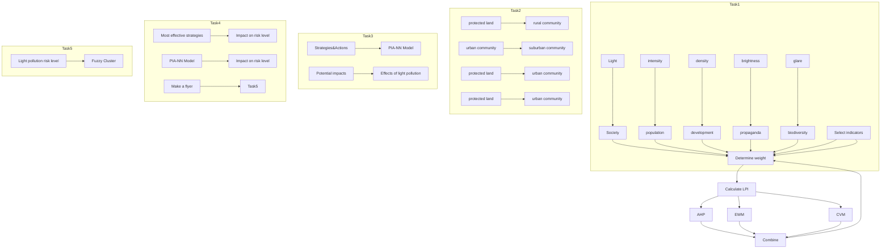
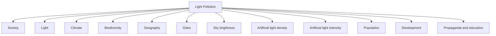

# Turn out the Lights, Turn up the Stars

# Summary

Light pollution is a type of environmental pollution caused by human activities, which has negative impacts on wildlife, plants, and human health. With the continuous development of urbanization and industrialization, the problem of light pollution is becoming increasingly severe. Therefore, the evaluation and improvement of the risk level of light pollution is particularly important.

Firstly, we collected data on ten indicators from 55 regions and divided these ten indicators into three areas: Light, Society, and Nature. Then we combined the analytic hierarchy process, entropy weight method, and coefficient of variation method to calculate the combined weights of these indicators to construct the formula of light pollution index (LPI) and then build the LSN evaluation model. Finally, we use fuzzy cluster analysis to classify all locations into four categories, thus dividing the light pollution level into four classes.

Secondly, we choose New York City, Bellevue, Sedona and Yellowstone National Park as a representative of each location type. Using the LSN evaluation model, their LPI were calculated to be 35.55, 41.33, 76.94, 84.18. Thus, their light pollution levels were obtained as Grade I, Grade II, Grade III, Grade IV respectively.

Thirdly, we proposed three intervention strategies and their specific actions, constructed a PIA-NN model, and studied the potential effects of concrete actions on light pollution effects. The three intervention strategies are: reduce artificial light intensity & strengthen publicity and education & expand vegetation area. We quantitatively reflected the "potential impact" of the three intervention strategies on the light pollution effect by combining Spielman's correlation coefficient and the BP neural network model.

Next, we selected two representative regions, Sedona and New York City, to explore the effects of three intervention strategies on light pollution levels in the two regions using the PIA-NN model and the LSN evaluation model. The results show that for both areas, reducing the intensity of artificial light is the most effective intervention strategy to reduce the risk level of light pollution.

Finally, we will choose New York City as the location for the campaign and design a beautiful flyer around its corresponding most effective intervention strategy.

## Contents

## 1 Introduction .....

1.1 Problem Background  
1.2 Our Work.

## 2 Assumptions and Justifications.....

## 3 Notations .....

## 4 Light-Society-Nature (LSN)Evaluation Model ....

4.1 Establishment of evaluation system.. 6  
4.2 Determination of the Weights for Indicators... 9  
4.3 The establishment of LSN Evaluation Model. 12  
4.4 The Application of LSN Evaluation Model . 13

## 5 Possible intervention strategies......... ....16

5.1 Strategy proposal and specific actions. .16  
5.2 Potential impact analysis- Neural Network (PIA-NN) Model. 17

## 6 Which strategy works best? . .19

6.1 The result of Sedona, Arizona. .20  
6.2 The result of New York City, New York . .20  
6.3 Final result . .21

## 7 Sensitivity Analysis.. .21

## 8 Model Evaluation and Further Discussion....... ..22

8.1 Strengths .22  
8.2 Weaknesses . .23  
8.3 Further Discussion 23

## 9 Conclusion...... .23

## References .... .24

## 1 Introduction

## 1.1 Problem Background

natural_image

World map at night showing illuminated city lights across continents (no text or labels visible)

Light pollution was first raised by astronomers in the 1950s.[1] With the acceleration of urbanization and economic development, the demand for night lighting gradually increased. At the same time, humans overuse or use artificial light sources unreasonably at night, which destroys the natural darkness. According to data from the International Dark-Sky Association, over 80% of the global population lives in areas affected by light pollution,[2] and about 99% of urban residents in Europe and the United States cannot observe the Milky Way at night.[3] In many large cities worldwide, the brightness at night can even reach the level of daytime.

The issue of light pollution is increasingly affecting people's daily lives, including work and leisure activities. It not only disrupts the beautiful view of our night sky but also has negative impacts on human health, safety, and the ecological environment. According to astronomical studies, a clear sky free of light pollution can display around 7,000 stars, while only 20-60 stars are visible in large cities. Excessive artificial light at night can disturb the circadian rhythm of living organisms, leading to poor sleep quality and higher rates of insomnia. Moreover, excessive light exposure to the human eye can damage the retina and iris, resulting in a sharp decline in vision. High beam lights on well-lit city streets can also cause transient "visual loss" to pedestrians or drivers on the opposite side of the street, contributing to a higher incidence of traffic accidents. Additionally, light pollution can also alter the growth cycle of plants and affect the migration patterns of wildlife.

Therefore, the issue of light pollution requires urgent attention and regulation globally

## 1.2 Our Work

First, we propose the Light-Society-Nature (LSN) Evaluation Model, which is used to evaluate the light pollution risk level of a location. Specifically, the model considers many indicators reflecting light pollution. Based on these indicators, we establish a secondary evaluation system. Considering that different methods have their limitations, the weights of the indicators are determined by a combination of the Analytic Hierarchy Process (AHP), Entropy Weight Method (EWM), and Coefficient of Variation Method (CVM). We select 55 representative locations worldwide and calculate their light pollution index based on relevant data, and the different levels of light pollution were determined by fuzzy clustering.

Second, we selected four different types of locations in the US and used the LSN evaluation model to calculate the light pollution index for each location, and analyzed the reasonableness of the results with the actual local conditions.

Then, in our previously constructed indicators, we have proposed three intervention strategies while taking into account their feasibility. For each intervention strategy, specific actions have been provided. We also build a PIA-NN model to analyze the potential impact of these actions on light pollution effects. The results will be visualized and analyzed for rationality.

Thereafter, we select two locations from Task 2 as our study subjects and use the PIA-NN model and the LSN evaluation model to analyze the impact of three intervention strategies on their light pollution risk levels, and make corresponding analyses.

Finally, we will choose New York City as the location for the campaign and design a beautiful flyer around its corresponding most effective intervention strategy.

flowchart

Figure 1：The structure of our paper

## 2 Assumptions and Justifications

Assumption1: In this paper, LPI (Light Pollution Index) is defined as the score of the light environment of a region. The higher the LPI value, the lower the level of light pollution in the region.

Justification: The lower the level of light pollution in an area, the better the light environment in that place. Depending on people's usage habits, it is common for better conditions to correspond to higher scores.

Assumption2: In the correlation analysis, only factors with strong correlation are retained and factors with small correlation are removed.

Justification: The factors affecting light pollution are complex. If factors of lesser rele vance are also taken into account, it will make the study results less significant and may even produce misleading conclusions.

Assumption3: Assume the data collected from the internet is true and reliable.

Justification: In the process of studying light pollution, we select the most typical areas in the world, so the extensiveness of the data is guaranteed; all data are obtained from the official website, so the reliability of the data is guaranteed

## 3 Notations

The key mathematical notations used in this paper are listed in Table 1.

Table 1: Notations used in this paper

<table><tr><td>Symbol</td><td>Description</td><td>Unit</td></tr><tr><td> $L$ </td><td>Value of Light</td><td>-</td></tr><tr><td> $S$ </td><td>Value of Society</td><td>-</td></tr><tr><td> $N$ </td><td>Value of Nature</td><td>-</td></tr><tr><td> $S_{location}$ </td><td>Value of the area</td><td> $km^{2}$ </td></tr><tr><td> $trp$ </td><td>Atmospheric transparency</td><td> $m$ </td></tr><tr><td> $wet$ </td><td>Atmospheric humidity</td><td>%</td></tr><tr><td> $h$ </td><td>Altitude</td><td> $feet$ </td></tr><tr><td> $t$ </td><td>Sunshine duration</td><td> $h$ </td></tr><tr><td> $S_{green}$ </td><td>Green area</td><td> $km^{2}$ </td></tr><tr><td> $C_{wild}$ </td><td>Species of wild animals</td><td>-</td></tr><tr><td> $\omega$ </td><td>Indicators weight</td><td>%</td></tr><tr><td>LPI</td><td>Light Pollution Index</td><td>-</td></tr></table>

\*Other symbols instructions will be given in the text.

## 4 Light-Society-Nature (LSN)Evaluation Model

In this section, we establish the Light-Society-Nature (LSN) Evaluation Model to measure the light pollution risk level of a location in a region broadly. Firstly, after determining indicators of every level, we established a comprehensive evaluation system.[4] And then the weight of each indicator is determined by the combined weight method. Finally, we calculated the Light-Pollution Index (LPI), so as to identify the light pollution risk level of a location.

Considering that the risk level of light pollution varies greatly in different locations within a large range, we should choose as small a location as possible, such as a community or a residential district, when discussing the risk level of light pollution, rather than choosing a large area such as a country or a city. Therefore, we screened 55 representative sites around the world and used relevant data of these 55 sites as the database of this paper. Based on this, we established the Light-Society-Nature (LSN) Evaluation Model.

## 4.1 Establishment of evaluation system

After referring to a large number of previous studies and relevant papers, we summarized three key factors reflecting the risk level of light pollution: light factor (L), social factor (S) and natural factor (N), which were taken as the first-level indicators in the evaluation system. After further thinking and induction, we concretized the indicators and selected 10 specific indicators as the second-level indicators in the evaluation system.[5] The specific evaluation system is as follows, as shown in the Figure 2.

flowchart

Figure 2: Evaluation system diagram

## 4.1.1 Light

The light factor is the most important factor in determining the risk level of light pollution. After a lot of literature review and rigorous analysis, we finally determined that the specific light factor include the following four points:

## $L _ { 1 }$ . Artificial light intensity

Artificial light intensity refers to the brightness of light generated by human activities. In light pollution research, artificial light intensity is an important indicator, which is used to measure the intensity and influence of artificial light on the surrounding environment at night. Artificial light intensity is usually measured using photometers or related measuring instruments, and it is measured in units of candela/square meter (μcd/m²), indicating the brightness of the light source per unit area. The data of artificial light intensity can be obtained through the official website of Light pollution map.

## $L _ { 2 }$ . Artificial light density

Artificial light density refers to the number of artificial lights in a certain location, usually expressed by the number of lights per unit area, such as the number of street lamps per square kilometer. High artificial light density means that there are more lights in an area. These lights will produce more artificial light at night. Therefore, artificial light density is one of the important factors affecting light pollution.

In order to facilitate the determination of the specific value of the artificial light density, we define that the artificial light density of a location can be expressed as the ratio of the artificial light intensity $( L _ { 1 } )$ to the area $( S _ { l o c a t i o n } )$ according to the understanding of its definition. The definition formula of $L _ { 2 }$ is as follows:

$$
L _ {2} = \frac {L _ {1}}{S _ {\text { location }}} \tag {1}
$$

Where $\boldsymbol { S _ { l o c a t i o n } }$ can be available through national statistical yearbooks.

## $L _ { 3 }$ . Sky brightness

Sky brightness refers to the level of brightness visible in a region of the sky, usually expressed in terms of luminous flux per unit area, such as moonlight or starlight flux per square meter. It is closely related to the light pollution. The more severe the light pollution is, the higher the sky brightness will be, which can reduce nighttime air transparency and obstruct starlight and moonlight.

The increase in sky brightness can have a negative impact on the biological environment and ecosystems. For example, it can affect the behavior and migration of nocturnal animals, interfere with plant growth and species reproduction, disrupt human circadian rhythms and physiological rhythms, and even affect human health.

Sky brightness in different regions can be obtained by using the Light Pollution Map website.

## $L _ { 4 }$ . Glare

Glare refers to a visual state where an extremely bright light source, contrasting with the background, causes discomfort and reduces visibility for the eyes.[6] Glare has a significant impact on the level of light pollution, with higher glare values indicating more severe light pollution in an area, and lower glare values indicating a lower level of light pollution.

Glare is the most common in outdoor, such as in the glass curtain walls of buildings, which can produce intense glare under sunlight, significantly impacting people's safety, damaging the urban living environment, and potentially causing traffic safety hazards.

According to the international common glare calculation formula, and combined with the understanding of the meaning of glare, the value of $L _ { 4 }$ is determined by the following formula:

$$
L _ {4} = - 8 \cdot \frac {L _ {1}}{S _ {\text { location }}} \cdot \lg \frac {0 . 2 5}{L _ {3}} \tag {2}
$$

## 4.1.2 Society

Social factors are one of the important influencing factors of light pollution. Social factors include regional population, level of regional development, education, and publicity efforts, among many other aspects. These factors affect people's awareness and attitudes toward light pollution, thus influencing their behavior. When establishing an evaluation system for light pollution, social factors are essential part.

## $S _ { 1 }$ . Population

The population of an area refers to the number of people living in a particular region, which is closely related to light pollution. On one hand, as the population increases, the demand for lighting also increases. On the other hand, the population also determines the scope of light pollution. Generally, areas with a larger population have higher levels of artificial light source density and light pollution. Conversely, in areas with a smaller population, the degree of light pollution may be relatively lower.

Population data for different areas can be obtained from national statistical yearbooks of various countries.

## $S _ { 2 }$ . Development

The level of regional development usually refers to the economic, social, and environmental development level, which can be measured by indicators such as GDP.

The GDP of different regions can be obtained from the national statistical yearbooks of various countries.

However, it should be noted that increasing the level of regional development does not necessarily lead to a higher level of light pollution. Developed urban areas often have more artificial light sources and higher light intensity, but they also have more advanced technology and management methods, which can effectively control light pollution problems. On the other hand, regions with lower levels of development may lack sufficient technology and funding to control light pollution, which can lead to higher levels of light pollution.

## $S _ { 3 }$ . Propaganda and education

An area's level of education and publicity regarding light pollution typically refers to the extent of promotion and education on light pollution in that area. This includes the dissemination of knowledge on light pollution, its harmful effects, and prevention measures. Stronger promotion and education can increase public awareness of light pollution, increase attention to light pollution, and thus reduce light pollution in the area.

To quantitatively describe the extent of an area's education and publicity on light pollution, we use public attention to light pollution as a measure. This can be achieved by calculating the number of searches related to light pollution keywords on Google Trends in the area.

## 4.1.3 Nature

Natural factors have a close relationship with light pollution. The impact of natural factors on light pollution mainly includes aspects such as regional climate, geographical location, and biodiversity. When establishing an evaluation system for light pollution, it is necessary to consider the natural environmental characteristics of the region and quantify the impact of natural factors on light pollution.

## $N _ { 1 }$ . Climate

Climate refers to the long-term average weather conditions in a particular region, including atmospheric transparency, humidity, temperature, and air pressure.[7] The impact of climate on light pollution is complex. We refer to previous research and select atmospheric transparency ( ) and humidity ( ) as the main indicators for measuring the impact of climate factors on light pollution. The value of $N _ { 1 }$ is determined by the following formula:

$$
N _ {1} = t r p ^ {\prime} + w e t ^ {\prime} \tag {3}
$$

Where $t r p ^ { \prime } , w e t ^ { \prime }$ are obtained by standardizing the raw data obtained from the National Atmospheric Administration. The specific standardization formula is as follows:

$$
\operatorname{trp} _ {i} ^ {\prime} = \frac {\max \left\{t r p _ {1} , \cdots , t r p _ {5 5} \right\} - t r p _ {i}}{\max \left\{t r p _ {1} , \cdots , t r p _ {5 5} \right\} - \min \left\{t r p _ {1} , \cdots , t r p _ {5 5} \right\}} (i = 1, 2, \dots , 5 5) \tag {4}
$$

$$
w e t _ {i} ^ {\prime} = \frac {\max \left\{w e t _ {1} , \cdots , w e t _ {5 5} \right\} - w e t _ {i}}{\max \left\{w e t _ {1} , \cdots , w e t _ {5 5} \right\} - \min \left\{w e t _ {1} , \cdots , w e t _ {5 5} \right\}} (i = 1, 2, \dots , 5 5) \tag {5}
$$

## $N _ { 2 }$ . Geography

The geography of an area includes factors such as latitude, longitude, and altitude. These factors affect the local daylight hours, atmospheric density, topography, and other factors, which affect the local light pollution situation. For example, at high latitudes, the short daylight hours in winter require increased brightness and quantity of lighting facilities to maintain normal production and living activities, which increases the risk of light pollution; while at higher altitudes, there are relatively fewer human activities and less artificial light at night, so the degree of light pollution is less. Accordingly, we selects altitude( ) and sunlight duration( ) as the main indicators to measure the influence of geographical location on the light pollution level. The value of $N _ { 2 }$ is determined by the following formula:

$$
N _ {2} = h ^ {\prime} + t ^ {\prime} \tag {6}
$$

Where $h ^ { \prime } , t ^ { \prime }$ are obtained by standardizing the raw data ${ \mathbf { } } h , t$ obtained from the National Atmospheric Administration. The specific standardization formula is as follows:

$$
h _ {i} ^ {\prime} = \frac {h _ {i} - \min \left\{h _ {1} , \cdots , h _ {5 5} \right\}}{\max \left\{h _ {1} , \cdots , h _ {5 5} \right\} - \min \left\{h _ {1} , \cdots , h _ {5 5} \right\}} (i = 1, 2, \dots , 5 5) \tag {7}
$$

$$
t _ {i} ^ {\prime} = \frac {t _ {i} - \min \left\{t _ {1} , \cdots , t _ {5 5} \right\}}{\max \left\{t _ {1} , \cdots , t _ {5 5} \right\} - \min \left\{t _ {1} , \cdots , t _ {5 5} \right\}} (i = 1, 2, \dots , 5 5) \tag {8}
$$

## $N _ { 3 }$ . Biodiversity

Biodiversity refers to the variety of life forms in the area and is closely related to light pollution. Light pollution can cause damage to the ecosystem at night. At the same time, the loss of biodiversity can also exacerbate the effects of light pollution and lead to severe light pollution. Considering both animal and plant factors, we selected green areas $( S _ { g r e e n } )$ and wildlife species $( C _ { w i l d } )$ as the main indicators of biodiversity. The value of $N _ { 3 }$ is determined by the following formula:

$$
N _ {3} = \frac {S _ {\text {green}}}{S _ {\text {location}}} + \frac {C _ {\text {wild}}}{S _ {\text {green}}} \tag {9}
$$

Where $S _ { g r e e n }$ and $C _ { w i l d }$ are available through the official website of the National Forestry Administration of each country.

## 4.2 Determination of the Weights for Indicators

There are many methods to determine the weight of indicators. To make our model more accurate, we decide to use the combination weighting method to calculate the weight of all indicators. Our combination weighting method combines Analytic Hierarchy Process (AHP) in the subjective weighting method and Entropy Weight Method (EWM) and the Coefficient of Variation Method (CVM) in the objective weighting method. Because the AHP judgment is more subjective, it is easy to change by the subjective influence of the decision maker. At the same time, because of the high sensitivity of the data, it may cause errors due to the data itself. Therefore, our combination weighting method synthesizes these methods to help us reduce errors and improve accuracy.

## 4.2.1 Analytic Hierarchy Process

First, a hierarchy diagram is constructed based on the previously selected metrics, as shown in Figure 3 below.

stacked bar chart

| Category       | Value |
| -------------- | ----- |
| Light          | L     |
| Society        | S     |
| Nature         | N     |

Figure 3: Hierarchy diagram

Then we construct judgment matrices for the primary indicators and each set of secondary indicators separately:

$$
A = (a _ {i j}) _ {n \times n}
$$

Where $a _ { i j }$ represents the importance of relative to $x _ { j }$ , while $n$ represent the quantity of indicators in each group. Because of the limited space, we will not show the judgmen matrix.

Calculate the weight of each indicator and perform a consistency check. The weights of each indicator calculated by this method are denoted as $\omega _ { j 1 }$ .

## 4.2.2 Entropy Weight Method

First, the data of the indicators of 55 locations in the database are aggregated to form an original matrix X. Because the types of indicators are different, we need to normalize the original matrix. Next, to eliminate the influence of dimensionality, we need to standardize the normalized matrix, and then we get the matrix Y. We combine the normalization and standardization process of indicators in this paper, and the specific calculation formula is as follows:

${ \mathrm { P o s i t i v e ~ i n d i c a t o r s : } } x _ { i j } ^ { \prime } = { \frac { x _ { i j } - \operatorname* { m i n } \left\{ x _ { 1 j } , \cdots , x _ { n j } \right\} } { \operatorname* { m a x } \left\{ x _ { 1 j } , \cdots , x _ { n j } \right\} - \operatorname* { m i n } \left\{ x _ { 1 j } , \cdots , x _ { n j } \right\} } }$ i (10)

${ \mathrm { N e g a t i v e ~ i n d i c a t o r s : ~ } } x _ { i j } ^ { \prime } = { \frac { \operatorname* { m a x } \{ x _ { 1 j } , \cdots , x _ { n j } \} - x _ { i j } } { \operatorname* { m a x } \{ x _ { 1 j } , \cdots , x _ { n j } \} - \operatorname* { m i n } \{ x _ { 1 j } , \cdots , x _ { n j } \} } }$ (11)

Where $i = 1 , 2 , \cdots , 5 5 , x _ { i j }$ represents the th indicator of the th region in the previous evaluation system.

Then, we use the Entropy Weight Method (EWM) to calculate the weight of the indicators.

We calculate the probability matrix $P _ { i j }$ .

According to the concepts of self-information and entropy in the information theory, we can calculate the information entropy of each evaluation indicator, hence we can obtain:

$$
E _ {j} = - \frac {1}{\ln 5 5} \sum_ {i = 1} ^ {5 5} P _ {i j} \ln (P _ {i j}) \tag {12}
$$

Let $d _ { j } = 1 - E _ { j }$ , which is define as the information utility value. The entropy weight of each indicator is given by normalizing the information utility value in the following. The normalization is determined by the following equation:

$$
\omega_ {j} = \frac {d _ {j}}{\sum_ {j} d _ {j}} \tag {13}
$$

The weights of each indicator calculated by this method are denoted as $\omega _ { j 2 }$ .

## 4.2.3 Coefficient of Variation Method

Furthermore, we apply Coefficient of Variation Method (CVM) to weight our indicators.

First, normalize the original matrix to obtain the matrix .

Then, based on the previous database, we find the mean and standard deviation for the 55 data of each index, so that the coefficient of variation can be calculated as follows:

$$
C V _ {j} = \frac {\sigma_ {j}}{\mu_ {j}} \tag {14}
$$

Finally, normalize the coefficient of variation to get the weights of each index:

$$
\omega_ {j} = \frac {C V _ {j}}{\sum_ {j} C V _ {j}} \tag {15}
$$

The weights of each indicator calculated by this method are denoted as $\omega _ { j 3 }$ .

## 4.2.4 Combination weight

By the above three methods, we calculated three different weights $( \omega _ { j 1 } , \omega _ { j 2 } , \omega _ { j 3 } )$ for each indicator. To make the model more accurate, we chose the mean value of the three weights as the final weights of each indicator to minimize the error.

$$
\omega_ {j} = \frac {\omega_ {j 1} + \omega_ {j 2} + \omega_ {j 3}}{3} \tag {16}
$$

The final results of the weights of each indicator are shown in Figure 4 below.

pie chart

| Category | Percentage (%) |
| :--- | :--- |
| Light | 73.06 |
| Artificial light intensity | 44.39 |
| Artificial light density | 31.74 |
| Society | 18.84 |
| Population | 31.96 |
| Glare | 15.68 |
| Sky brightness | 8.20 |
| Propaganda and education | 12.20 |
| Climate | 52.78 |
| Geography | 33.25 |
| Biodiversity | 13.97 |
The chart displays a single data point for 'Light' at 73.06%. The other categories are also labeled on the chart.

Figure 4: The combination weight diagram of each indicator

## 4.3 The establishment of LSN Evaluation Model

Considering the impact of Light, Society and Nature on light pollution, we developed the LSN Evaluation Model. In this model, we introduce LPI (Light Pollution Index) to quantita tively describe the risk level of light pollution. In addition, according to the selected database, we divided the values of LPI into four intervals by fuzzy cluster analysis, in other words, the light pollution risk level is divided into four levels.

## 4.3.1 Calculation of Light Pollution Index（LPI）

After the previous efforts, we can know the data source of each indicator and its calculation method. The weight of each indicator is obtained by the combination weighting method. The weights corresponding to indicators L, S, and N are regarded as the extent of the influence of these three indicators on LPI, that means, the greater the weight, the more serious the influence of the corresponding indicator on LPI. Accordingly, this paper reasonably and extremely creatively constructs the formula for calculating LPI:

$$
L P I = 1 0 0 \cdot \left(\omega_ {L} \cdot L + \omega_ {S} \cdot S + \omega_ {N} \cdot N\right) \tag {17}
$$

Similarly, based on the same lines, we construct the formulae for L, S, and N:

$$
\left\{ \begin{array}{l} L = \omega_ {L _ {1}} \cdot L _ {1} ^ {\prime} + \omega_ {L _ {2}} \cdot L _ {2} ^ {\prime} + \omega_ {L _ {3}} \cdot L _ {3} ^ {\prime} + \omega_ {L _ {4}} \cdot L _ {4} ^ {\prime} \\ S = \omega_ {S _ {1}} \cdot S _ {1} ^ {\prime} + \omega_ {S _ {2}} \cdot S _ {2} ^ {\prime} + \omega_ {S _ {3}} \cdot S _ {3} ^ {\prime} \\ N = \omega_ {N _ {1}} \cdot N _ {1} ^ {\prime} + \omega_ {N _ {2}} \cdot N _ {2} ^ {\prime} + \omega_ {N _ {3}} \cdot N _ {3} ^ {\prime} \end{array} \right. \tag {18}
$$

Where $L _ { 1 } ^ { \prime } , L _ { 2 } ^ { \prime } , L _ { 3 } ^ { \prime } , L _ { 4 } ^ { \prime } ; S _ { 1 } ^ { \prime } , S _ { 2 } ^ { \prime } , S _ { 3 } ^ { \prime } ; N _ { 1 } ^ { \prime } , N _ { 2 } ^ { \prime } , N _ { 3 } ^ { \prime }$ are obtained by standardizing

$L _ { 1 } , L _ { 2 } , L _ { 3 } , L _ { 4 } ; S _ { 1 } , S _ { 2 } , S _ { 3 } ; N _ { 1 } , N _ { 2 } , N _ { 3 }$ in the previous 4.1.1

## 4.3.2 Determination of light pollution risk levels

The data of 55 typical locations in the previous paper were put into the LSN model to calculate the LPI values of each location. Then, using fuzzy cluster analysis, all locations were divided into 4 categories, thus classifying the light pollution levels into 4 classes, defined as: Grade Ⅰ: Heavy pollution, Grade Ⅱ: Moderate pollution, Grade Ⅲ: Minimal pollution, and Grade Ⅳ: Unpolluted. The specific class classification is shown in the following table:

Table 2: Scale of light pollution

<table><tr><td>Grade</td><td>I</td><td>II</td><td>III</td><td>IV</td></tr><tr><td>Light pollution risk level</td><td>Heavy pollution</td><td>Moderate pollution</td><td>Minimal pollution</td><td>Unpolluted</td></tr><tr><td>LPI</td><td>&lt;40</td><td>40~60</td><td>60~80</td><td>&gt;80</td></tr></table>

As can be seen from the above table, according to the LPI value of a certain location, the risk level of light pollution at that location can be determined.

Grade I (Heavy pollution) locations have the most serious light pollution, and the intensity and density of artificial light are very high, such as the center of developed cities;

Grade II (Moderate pollution) locations have a moderate level of light pollution, such as the outskirts of cities industrial areas, and residential areas;

Grade III (Minimal pollution) locations have less light pollution phenomenon, such as the countryside or fields;

Grade IV(Unpolluted) locations, almost no light pollution phenomenon, and the area is mostly untouched by human activities, such as national parks and nature reserves.

## 4.4 The Application of LSN Evaluation Model

In this section, we have selected four different types of locations within the United States based on the requirements of Task 2. We collected relevant indicator data and applied the established LSN model to determine the level of light pollution in each location.

Table 3: Location selection table

<table><tr><td>Type</td><td>Location</td></tr><tr><td>An urban community.</td><td>New York City, New York</td></tr><tr><td>A suburban community</td><td>Bellevue, Washington</td></tr><tr><td>A rural community</td><td>Sedona, Arizona</td></tr><tr><td>A protected land location</td><td>Yellowstone National Park</td></tr></table>

## 4.4.1 Case Ⅰ：An urban community

Urban communities are densely populated areas with concentrated buildings and welldeveloped infrastructure, where people engage in economic activities and have a rich social life. We have selected New York City, New York as our research site and the relevant data are as follows:

Table 4: Data of New York City, New York

<table><tr><td> $S_{location}$ (km2)</td><td>1213.4</td></tr><tr><td>Artificial light intensity ( $\mu cd/m^2$ )</td><td>11700</td></tr><tr><td>Sky brightness (mag./arc sec2)</td><td>17.4</td></tr><tr><td>Population</td><td>8336817</td></tr><tr><td>GDP ($)</td><td>95159</td></tr><tr><td>Wet (%)</td><td>65</td></tr><tr><td>Atmospheric transparency (miles)</td><td>6</td></tr><tr><td>Altitude (feet)</td><td>16</td></tr><tr><td>Sunshine time (h)</td><td>2055</td></tr><tr><td> $S_{green}$ (km2)</td><td>20</td></tr><tr><td> $Count_{wild}$ </td><td>37</td></tr></table>

Put the above data into the LSN Evaluation Model, the LPI value for New York City is 35.55, which falls under Grade I, indicating a very severe level of light pollution.

New York City has high population density and urban infrastructure. High population density means that there are many sources of artificial light in the city, including streetlights, building lights, and illuminated signs. The tall buildings reflect and scatter light, creating a phenomenon known as skyglow, which also increases the level of light pollution. Another factor contributing to light pollution in New York City is the city's role as a hub of economic and cultural activity. Many businesses, cultural institutions, and public spaces in the city are open late into the night, and the city's tourism industry also relies heavily on well-lit attractions and landmarks. This means that the city requires a lot of outdoor lighting, which can be a significant source of light pollution.

## 4.4.2 Case Ⅱ：A suburban community

A suburban community is an area that is typically located on the outskirts of a larger urban area. It is a mix of residential and commercial development. Suburban communities often have low to moderate population density, single-family homes, and their proximity to larger urban areas. Therefore, they fall into the category of moderate brightness environment. We have chosen Bellevue, Washington as the study location, and its relevant data are as follows:

Table 5: Data of Bellevue, Washington

<table><tr><td> $S_{location}$ (km2)</td><td>94.5</td></tr><tr><td>Artificial light intensity ( $\mu cd/m^2$ )</td><td>3420</td></tr><tr><td>Sky brightness (mag./arc sec2)</td><td>18.7</td></tr><tr><td>Population</td><td>147599</td></tr><tr><td>GDP ($)</td><td>72357</td></tr><tr><td>Wet (%)</td><td>75</td></tr><tr><td>Atmospheric transparency (miles)</td><td>8</td></tr><tr><td>Altitude (feet)</td><td>62</td></tr><tr><td>Sunshine time (h)</td><td>1778</td></tr><tr><td> $S_{green}$ (km2)</td><td>53</td></tr><tr><td> $Count_{wild}$ </td><td>57</td></tr></table>

By inputting the above data into the LSN Evaluation Model, the LPI value for Bellevue, Washington is 41.33, which corresponds to Grade II. That means Bellevue has moderate levels of light pollution.

Although suburban areas have located some distance from the city center, they are the best choice for people who want to move away from crowded urban areas. This has led to a rising population in the suburbs and an increasing amount of artificial lighting outdoors, which inevitably leads to a degree of light pollution.

## 4.4.3 Case Ⅲ：A rural community

A rural community is an area outside of an urban or suburban area. It is typically characterized by open spaces, natural landscapes, and smaller population densities, and includes small towns, villages, and remote areas. Rural communities have limited access to modern infrastructure and services and are therefore low luminance environmental zones. We selected Sedona, Arizona as the study area with the following relevant data:

Table 6: Data of Sedona, Arizona

<table><tr><td> $S_{location}$ (km2)</td><td>49.7</td></tr><tr><td>Artificial light intensity ( $\mu cd/m^2$ )</td><td>90.6</td></tr><tr><td>Sky brightness (mag./arc sec2)</td><td>21.54</td></tr><tr><td>Population</td><td>10356</td></tr><tr><td>GDP ($)</td><td>48385</td></tr><tr><td>Wet (%)</td><td>45</td></tr><tr><td>Atmospheric transparency (miles)</td><td>120</td></tr><tr><td>Altitude (feet)</td><td>1344</td></tr><tr><td>Sunshine time (h)</td><td>278</td></tr><tr><td> $S_{green}$ (km2)</td><td>58</td></tr><tr><td> $Count_{wild}$ </td><td>35</td></tr></table>

Substituting the above data into the LSN Evaluation Model, we obtained the LPI value of 76.94 for Sedona, Arizona, which corresponds to Grade Ⅲ. That means Sedona has less light pollution.

This is due to its distance from major cities and low population density. However, as cities expand and demand for outdoor lighting increases in rural areas, even rural communities are beginning to be affected by light pollution. Such as the proliferation of LED lighting in rural areas has contributed to an increase in light pollution and disrupt natural sleep patterns in humans and wildlife.

## 4.4.4 Case Ⅳ：A protected land location

On protected lands, there is little to no permanent population, so the intensity and density of artificial light are low, and they are almost unaffected by light pollution. These are natural dark environments, such as national parks and nature reserves.

Yellowstone National Park is a national park in the western United States, primarily located in Wyoming. It was established in 1872 and is the world's first national park. Yellowstone National Park is a haven for outdoor enthusiasts and is also an International Dark Sky Park. Therefore, we have selected Yellowstone National Park as our study site, and the relevant data is as follows:

Table 7: Data of Yellowstone National Park

<table><tr><td> $S_{location}$  (km2)</td><td>8983</td></tr><tr><td>Artificial light intensity ( $\mu cd/m^2$ )</td><td>1.46</td></tr><tr><td>Sky brightness (mag./arc sec2)</td><td>21.99</td></tr><tr><td>Population</td><td>0</td></tr><tr><td>GDP ($)</td><td>0</td></tr><tr><td>Wet (%)</td><td>65</td></tr><tr><td>Atmospheric transparency (miles)</td><td>150</td></tr><tr><td>Altitude (feet)</td><td>2546</td></tr><tr><td>Sunshine time (h)</td><td>250</td></tr><tr><td> $S_{green}$  (km2)</td><td>93</td></tr><tr><td> $Count_{wild}$ </td><td>67</td></tr></table>

When we input the above data into the LSN Evaluation Model, we obtain an LPI value of 84.18 for Yellowstone National Park, which is a high value and corresponds to Grade IV. This indicates that the park enjoys a good light environment and is minimally affected by light pollution.

This is consistent with the fact that, as a key protected area, Yellowstone National Park has made many efforts to reduce light pollution in the park to protect the natural environment at night, such as turning off non-essential lights at night, encouraging visitors to use red-filtered flashlights, which are less disruptive to wildlife and humans. As a result, the park can maintain a natural nighttime environment.

## 5 Possible intervention strategies

Light pollution is an increasingly severe problem that affects people's production and lives. Light pollution alters our view of the night sky, has environmental impacts and affects our health and safety. To mitigate the negative effects of light pollution, we propose three possible intervention strategies and indicates their specific actions. Then, we constructed the PIA-NN Model based on the Spearman correlation coefficient and BP neural network model, which is used to analyze the potential impact of these specific actions on the light pollution effect.

## 5.1 Strategy proposal and specific actions

From the evaluation system constructed in the previous paper, the most significant factors affecting light pollution levels are Light, Society, and Nature, which are divided into ten specific indicators under them. We target three different indicators and consider their applicability. Finally, we propose three intervention strategies and their specific actions to address the light pollution problem.

## 5.1.1 Strategy Ⅰ: Reduce artificial light intensity

Too much artificial light intensity will make the sky bright at night. This not only affects human circadian rhythms and health but also impacts the feeding and migration of wildlife, thus disrupting the ecological balance. Therefore, reducing the artificial light intensity in a given area can greatly alleviate light pollution and mitigate its harmful effects.

To reduce artificial light intensity, specific actions can be taken:

Optimizing lighting equipment: Replace high-power lighting equipment with lowpower LED lights; Use sound-activated sensor lights in residential areas and building corridors.  
Regulating lighting usage: Restrict lighting equipment to necessary areas, such as indoor areas and areas that require night safety; Remove lighting equipment in suburban and rural areas where there are no residents.  
Reducing nighttime activities: Try to minimize large-scale gatherings and celebrations at night, or reduce their scale and frequency.  
Smart city planning: In urban planning, design lamps to be shielded and direct light only to the areas that require lighting, without dispersing light to the surrounding en vironment..

## 5.1.2 Strategy Ⅱ：Strengthen publicity and education

We can increase public awareness of light pollution through education and promote concern for its harmful effects. This will encourage the public to participate in light pollution prevention, ultimately relieving the problem. To enhance our efforts, we can take the following actions:

Post informational posters: Display posters in public areas, communities, and schools to educate the public on light pollution and raise awareness.  
Host community events: Conduct promotional events in the community, such as lectures, seminars, and exhibitions, to help the public understand the impact of artificial light pollution and ways to reduce it.  
Utilize media outreach: Use various media channels, such as TV, radio, newspapers,

magazines, and the internet, to promote the importance of reducing light pollution and its harmful effects.

Strengthen school education: Provide knowledge and methods on light pollution to students through school courses, campus bulletins, and instructional videos to encourage them to be proactive participants and advocates for environmental protection.

## 5.1.3 Strategy Ⅲ：Expand vegetation area

Expanding vegetation area is an effective way to reduce light pollution, as vegetation can block and absorb it. Vegetation can absorb certain wavelengths of light pollution, as well as reflect and scatter light, thus reducing the degree of light pollution. The larger the leaf area and density of vegetation, the stronger the absorption and reflection of light pollution. Therefore, expanding vegetation area can address light pollution. Here are some specific actions for expanding vegetation coverage:

Tree planting: Planting various types of trees in urban and rural areas can increase vegetation coverage and ease light pollution.  
⚫ Greening buildings: In urban areas, planting trees, lawns, and other green vegetation on buildings and roads can increase urban vegetation coverage and reduce light pol lution through reflection and scattering by vegetation.  
Protect existing vegetation: Protecting existing forests, grasslands, wetlands, etc., and preventing excessive development and destruction, can maintain vegetation's alleviation of light pollution.

## 5.2 Potential impact analysis- Neural Network (PIA-NN) Model

First, we identified three direct influencing factors: artificial light intensity, propaganda and education, and biodiversity, which will be directly affected by three intervention strategies.

Next, we calculated the Spearman correlation coefficients between each of the three direct influencing factors and other factors, and identified the indirect influencing factors that are closely related to each of them.

To analyze the potential impact of specific actions on the effects of light pollution, understanding the changing trends and degrees of these indirect influencing factors is crucial.

To achieve this, we developed the Potential Impact Analysis-Neural Network (PIA-NN) Model. By building a neural network, we obtained the changing trends and degrees of the indirect influencing factors in response to the corresponding direct influencing factors, and analyzed the potential impact of specific actions on the effects of light pollution.

## 5.2.1 Establishment of model

To investigate the potential impact of specific actions on light pollution effects, it is first necessary to determine the influence of three direct influences on other light pollution factors. For this purpose, combined with the database of this paper, we develop the PIA-NN model.

To explore the relationship between the factors, we tested the normality of the factors and found that only the sky brightness data were normal.[8] Therefore, we chose Spearman's correlation coefficient to measure the correlation between the factors.[9] The specific calculation of Spearman's correlation coefficient is as follows:

$$
r _ {s} = 1 - \frac {6 \sum_ {i = 1} ^ {n} d _ {i}}{n (n ^ {2} - 1)} \tag {19}
$$

where is the sample size, and $n = 5 5$ in this paper; denotes the equivalence difference between the two factor data.

From the calculation of Spearman's correlation coefficient, it can be seen that there is a significant positive correlation between artificial light intensity and artificial light density, glare and sky brightness, and a significant negative correlation with biodiversity. In addition, propaganda and education have a significant negative correlation with artificial light intensity, sky brightness, and glare, and a significant positive correlation with biodiversity. Finally, biodiversity has a significant positive correlation with sky brightness and glare.

After obtaining the correlations between the above three groups of corresponding factors, we used the Neural Fitting app in Matlab to establish three neural networks based on the previous database, which are:

1. The neural network between artificial light intensity and artificial light density, glare, sky brightness, and biodiversity. (Strategy I)  
2. The neural network between propaganda and education and artificial light intensity, sky brightness, glare, and biodiversity. (Strategy II)  
3. The neural network between biodiversity and sky brightness and glare. (Strategy III)

Through these three neural networks, we can clearly see the trend and degree of change of the corresponding indirect influences as the three direct influences change.

## 5.2.2 Result and Analysis

According to the above PIA-NN model, we obtained the trends of three groups of indirect influences with their corresponding direct influences, which are as follows:

(Strategy I) The trends of artificial light density, glare, sky brightness and biodiversity with artificial light intensity.

(Strategy II) The trends of artificial light intensity, sky brightness, glare and biodiversity with propaganda and education

(Strategy III) Trends of sky brightness and glare with biodiversity.

The results are visualized in the following figures:

scatter plot

| Propaganda and education | Artificial light intensity | Sky brightness | Glare | Biodiversity |
| --- | --- | --- | --- | --- |
| 2 | 6 | 4 | 8 | 2 |
| 3 | 5 | 4 | 7 | 3 |
| 4 | 5 | 3 | 6 | 4 |
| 5 | 4 | 3 | 5 | 5 |
| 6 | 4 | 2 | 4 | 6 |
| 7 | 3 | 2 | 3 | 7 |
| 8 | 3 | 2 | 2 | 8 |
| 9 | 3 | 2 | 1 | 8 |
| 10 | 3 | 2 | 1 | 9 |
| 11 | 3 | 2 | 1 | 9 |
| 12 | 3 | 2 | 1 | 9 |
| 13 | 2 | 2 | 1 | 9 |
| 14 | 2 | 2 | 1 | 9 |
| 15 | 2 | 2 | 1 | 9 |
| 16 | 2 | 2 | 1 | 9 |
| 17 | 2 | 2 | 1 | 9 |
| 18 | 2 | 2 | 1 | 9 |
| 19 | 2 | 2 | 1 | 9 |
| 20 | 2 | 2 | 1 | 9 |
| 21 | 2 | 2 | 1 | 9 |
| 22 | 2 | 2 | 1 | 9 |
| 23 | 2 | 2 | 1 | 9 |
| 24 | 2 | 2 | 1 | 9 |
| 25 | 2 | 2 | 1 | 9 |
| 26 | 2 | 2 | 1 | 9 |
| 27 | 2 | 2 | 1 | 9 |
| 28 | 2 | 2 | 1 | 9 |
| 29 | 2 | 2 | 1 | 9 |
| 30 | 2 | 2 | 1 | 9 |
| 31 | 2 | 2 | 1 | 9 |
| 32 | 2 | 2 | 1 | 9 |
| 33 | 2 | 2 | 1 | 9 |
| 34 | 2 | 2 | 1 | 9 |
| 35 | 2 | 2 | 1 | 9 |
| 36 | 2 | 2 | 1 | 9 |
| 37 | 2 | 2 | 1 | 9 |
| 38 | 2 | 2 | 1 | 9 |
| 39 | 2 | 2 | 1 | 9 |
| 40 | 2 | 2 | 1 | 9 |

(b): Strategy Ⅱ

line chart

| Artificial light intensity | Sky brightness | Glare | Artificial light density | Biodiversity |
| --------------------------- | -------------- | ----- | ------------------------- | ----------- |
| 0                           | 2              | 2     | 2                         | 2           |
| 2                           | 3              | 3     | 3                         | 2           |
| 4                           | 4              | 4     | 4                         | 2           |
| 6                           | 5              | 5     | 5                         | 2           |
| 8                           | 6              | 6     | 6                         | 2           |
| 10                          | 7              | 7     | 7                         | 2           |
| 12                          | 8              | 8     | 8                         | 2           |
| 14                          | 9              | 9     | 9                         | 2           |
| 16                          | 10             | 10    | 10                        | 2           |
| 18                          | 10             | 10    | 10                        | 2           |
| 20                          | 10             | 10    | 10                        | 2           |

(a): Strategy Ⅰ

line chart

| Biodiversity | Sky brightness | Glare |
| ----------- | -------------- | ----- |
| 2           | 8.5            | 8.0   |
| 3           | 7.5            | 7.8   |
| 4           | 7.0            | 7.5   |
| 5           | 6.5            | 7.0   |
| 6           | 6.0            | 6.5   |
| 7           | 5.5            | 6.0   |
| 8           | 5.0            | 5.5   |
| 9           | 4.5            | 5.0   |
| 10          | 4.0            | 4.5   |
| 11          | 3.5            | 4.0   |
| 12          | 3.0            | 3.5   |
| 13          | 2.5            | 3.0   |
| 14          | 2.0            | 2.5   |
| 15          | 1.5            | 2.0   |
| 16          | 1.0            | 1.5   |
| 17          | 0.5            | 1.0   |
| 18          | 0.0            | 0.5   |
| 19          | -0.5           | 0.0   |
| 20          | -1.0           | -0.5  |
| 21          | -1.5           | -1.0  |
| 22          | -2.0           | -1.5  |

(c): Strategy Ⅲ  
Figure 5: The result of PIA-NN

From the above figure we can conclude that:

From Figure(a), it can be seen that as the intensity of artificial light decreases, artificial light density, sky brightness and glare all decrease, with the most obvious decrease in sky brightness, followed by glare, and the weakest decrease in artificial light density, while at the same time, the biodiversity increases significantly. This indicates that the specific action of the first strategy will lead to darker nights, which further responds to the circadian rhythm of organisms and improves the quality of people's sleep while providing a better ecological environment for wildlife; in addition, glare will be reduced and road traffic will be safer at night; and biodiversity will increase, indicating that the ecological environment of the area has improved and is more suitable for human, animal and plant life.

From Figure(b), it can be seen that with the increase in light pollution awareness and education, the artificial light intensity, sky brightness, and glare are significantly reduced, and the biodiversity still increases. This indicates that the specific actions of the second strategy will raise people's consciousness and actively participate in light pollution prevention actions, thus reducing artificial light intensity and giving the city a night and a starry sky; the reduction of glare can effectively reduce the incidence of people's eye diseases and thus have a positive impact on people's health; the increase of biodiversity can provide a better living environment for human beings.

From Figure (c), it can be seen that with the increase of biodiversity, there is a clear trend of decreasing both sky brightness and glare, with the degree of decrease of sky brightness being more obvious. This indicates that the specific actions of the third strategy have a potential impact similar to the first two cases, improving people's impression of the sky, reducing the incidence of traffic accidents, and bringing a positive impact on people's physical and mental health.

## 6 Which strategy works best?

In this section, we investigate the different effects of implementing the three intervention strategies separately for different regions. Based on the evaluation of light pollution levels in four different regions in the previous section 4.4, we selected two representative regions considering the feasibility of intervention strategies in different regions. One is Sedona, Arizona, a rural community with low light pollution, and the other is New York City, New York, a large city with high light pollution, and we simulate the implementation of three different intervention strategies in these two areas.

The three intervention strategies proposed in this paper will directly affect the three indicators of artificial light intensity, publicity and education efforts, and biodiversity, respectively, and since there is a correlation between these three direct impact indicators and certain other indicators, changes in these three direct impact indicators will lead to changes in the corresponding indirect impact indicators, and we apply the three neural networks established in the previous paper to predict the changes in each group of indirect impact indicators.

The PIA-NN Model allows us to obtain the values of the indicators of the area after the implementation of the strategy and the achievement of the target. Finally, by comparing the LPI of the area before and after the implementation of the strategy, we can clearly see the impact of the strategy on the level of light pollution risk in the area.

In order to exclude the effect of time and intensity on the effect of the strategy, we set the predefined target for each strategy as: the strategy increases or decreases the corresponding direct impact indicator by the same degree, e.g., 10% increase or decrease. This is used as the basis to calculate the LPI of the region after the implementation of the strategy.

## 6.1 The result of Sedona, Arizona

The results of implementing three different intervention strategies for Sedona, Arizona are as follows:

bar chart

| Strategy | 110% | 100% | 90% |
| :--- | :--- | :--- | :--- |
| Strategy I | 75.99 | 76.94 | 77.43 |
| Strategy II | 78.01 | 76.94 | 75.23 |
| Strategy III | 78.12 | 76.94 | 75.34 |

Figure 6: The result of Sedona, Arizona

The above graph shows that Strategy I was the most effective intervention for Sedona, Arizona. The community's LPI increased significantly when the target of Strategy I was 90%, i.e., when the implementation of Strategy I reduced the artificial light intensity to 90%. However, it is worth noting that once the artificial light intensity increases, e.g., to 110%, the LPI in the area also decreases rapidly. Strategy II and Strategy III both have an increase in LPI, but not as much as Strategy I.

## 6.2 The result of New York City, New York

The results of implementing three different intervention strategies for New York City, New York are as follows:

bar chart

| Strategy | 110% | 100% | 90% |
| :--- | :--- | :--- | :--- |
| Strategy I | 32.54 | 35.55 | 37.64 |
| Strategy II | 36.03 | 35.55 | 35.01 |
| Strategy III | 35.99 | 35.55 | 34.96 |
The chart displays a vertical axis labeled 'LPI' with percentages (110%, 100%, 90%) and a horizontal axis labeled 'Strategy'. The bars are colored light blue for the 110% threshold and dark blue for the 90% threshold.

Figure 7: The result of New York City, New York

From the above figure we can see that the LPI of New York City, New York is very low and it is in the severe light pollution class. Although the implementation of the three intervention strategies proposed in this paper will improve the LPI of New York City, New York, the implementation of the strategies still puts New York City, New York in the severe light pollution class. The LPI improves the fastest with a predetermined target of 90% for Strategy I. The implementation of Strategy II and Strategy III has little effect on the LPI values in this area, but in comparison Strategy II is more effective than Strategy III.

## 6.3 Final result

Comparing the previous two figures, we can conclude that the implementation of Strategy I is the most effective in reducing light pollution in Sedona, Arizona and New York City, New York with the same intended goal, but the difference is that the impact of Strategy I on New York City, New York is more obvious. The difference is that Strategy I has a more pronounced effect on New York City, New York.

Strategy I is to prevent light pollution at the source. From the previous analysis, we can see that artificial light intensity is closely related to artificial light density, glare, and sky brightness, which are the main factors affecting light pollution and take up a large weight in the LSN evaluation system, so reducing artificial light intensity has a significant effect on improving the LPI in the LSN evaluation system.

## 7 Sensitivity Analysis

In constructing the PIA-NN model, we verified the correlations among artificial light intensity, publicity and education efforts, biodiversity, and other indicators separately, and screened the relevant indicators to build the neural network. It is possible that the incompleteness of the consideration of the problem led to the neglect of some indicators related to artificial light intensity, publicity and education efforts, and biodiversity, which could have an impact. To test this possible influence, we reconstructed the neural network of artificial light intensity with glare, biodiversity, and sky brightness, and observed the relationship between the original model and this model with glare, biodiversity, and sky brightness by changing artificial light intensity. The results are as follows.

scatterplot

| Artificial light intensity | Biodiversity | Group   |
| -------------------------- | ----------- | ------- |
| 0.1                        | 0.4         | before  |
| 0.15                       | 0.35        | after   |
| 0.2                        | 0.38        | before  |
| 0.25                       | 0.36        | after   |
| 0.3                        | 0.34        | before  |
| 0.35                       | 0.32        | after   |
| 0.4                        | 0.30        | before  |
| 0.45                       | 0.28        | after   |
| 0.5                        | 0.26        | before  |
| 0.55                       | 0.24        | after   |
| 0.6                        | 0.22        | before  |
| 0.65                       | 0.20        | after   |
| 0.7                        | 0.18        | before  |
| 0.75                       | 0.16        | after   |
| 0.8                        | 0.14        | before  |
| 0.85                       | 0.12        | after   |
| 0.9                        | 0.10        | before  |
| 0.95                       | 0.08        | after   |

(b): Biodiversity - Artificial light intensity

scatterplot

| Artificial light intensity | Glare | Group   |
| -------------------------- | ----- | ------- |
| 0.1                        | 0.15  | before  |
| 0.15                       | 0.18  | after   |
| 0.2                        | 0.22  | before  |
| 0.25                       | 0.25  | after   |
| 0.3                        | 0.28  | before  |
| 0.35                       | 0.30  | after   |
| 0.4                        | 0.32  | before  |
| 0.45                       | 0.35  | after   |
| 0.5                        | 0.38  | before  |
| 0.55                       | 0.40  | after   |
| 0.6                        | 0.42  | before  |
| 0.65                       | 0.45  | after   |
| 0.7                        | 0.48  | before  |
| 0.75                       | 0.50  | after   |
| 0.8                        | 0.55  | before  |
| 0.85                       | 0.58  | after   |
| 0.9                        | 0.60  | before  |
| 0.95                       | 0.62  | after   |
| 1.0                        | 0.65  | before  |

(a): Glare - Artificial light intensity

scatterplot

| Artificial light intensity | Sky brightness | Group   |
| -------------------------- | -------------- | ------- |
| 0.1                        | 0.2            | before  |
| 0.15                       | 0.25           | after   |
| 0.2                        | 0.3            | before  |
| 0.25                       | 0.35           | after   |
| 0.3                        | 0.4            | before  |
| 0.35                       | 0.45           | after   |
| 0.4                        | 0.5            | before  |
| 0.45                       | 0.55           | after   |
| 0.5                        | 0.6            | before  |
| 0.55                       | 0.65           | after   |
| 0.6                        | 0.7            | before  |
| 0.65                       | 0.75           | after   |
| 0.7                        | 0.8            | before  |
| 0.75                       | 0.85           | after   |
| 0.8                        | 0.9            | before  |
| 0.85                       | 0.95           | after   |

(c): Sky brightness - Artificial light intensity  
Figure 8: The result of PIA-NN

As can be seen from the figure, after changing the artificial light intensity, the values of the three metrics predicted using the two neural networks before and after are relatively close. It shows that removing the indicator of artificial light density has almost no effect on the analysis of glare, biodiversity, and sky brightness. It also shows that the unconsidered factor does not affect the analysis of existing factors and the model is robust.

## 8 Model Evaluation and Further Discussion

## 8.1 Strengths

To ensure the reliability of the results, the data used in this paper are the most accurate and up-to-date data available on the official website. In addition, various factors have been considered in an attempt to synthesize the problem. Therefore, the results of this paper are of a high reference value.  
We have considered various indicators of light, social and natural aspects to make our evaluation model more comprehensive, accurate, and objective.  
In this paper, the PIA-NN model is constructed in combination with a neural network model. In finding the correlation between indicators, the neural network approximates a continuous function of arbitrary complexity and arbitrary accuracy by a hidden layer containing enough neurons. Compared to other linear models, the neural network model has superior performance, making its results more accurate.  
The results of our model are also consistent with common sense and experience.

## 8.2 Weaknesses

Due to the limited time, only the data of 55 regions are selected as our database in this paper, and the LNS evaluation system is established, and the light pollution is roughly divided into four categories by fuzzy cluster analysis, but it is not clear the range of LPI values.

The data used in the model is incomplete. For objective reasons, we cannot obtain all the data of the required indicators, and these data inevitably have missing values. Although we have taken care of the missing values, the accuracy of the model fit is still affected to some extent

## 8.3 Further Discussion

Since the database in this paper has only 55 regions, the classification of light pollution risk levels based on this database may have bias. Therefore, we can collect more data from different regions to form a database for analysis, and get more accurate and reasonable criteria for classifying light pollution risk levels.

## 9 Conclusion

This paper developed a broadly applicable evaluation model to identify the light pollution risk level of a location. We select 55 representative locations around the world and use the relevant data of these locations as the database of this paper. Brought all the data into LSN Evaluation Model to calculate the LPI value of each area, and then the 55 areas were divided into four classes by fuzzy cluster analysis, thus dividing the light pollution level into four grades, defined as: Grade I: Heavy pollution, Grade II: Moderate pollution, Grade III: Minimal pollution, Grade IV: Unpolluted.

Based on the above model, we choose New York City, Bellevue, Sedona and Yellowstone National Park as a representative of each location type. Their LPI values were calculated to be 35.55, 41.33, 76.94, 84.18. Thus, their light pollution risk levels were obtained as Grade I, Grade II, Grade III, Grade IV respectively.

To effectively address light pollution, we propose three possible intervention strategies and indicate specific actions. Finally, we construct a PIA-NN Model to analyze the potential impact of these specific actions on the light pollution effect.

Based on the above model, we choose Sedona and New York City as research subjects. Three different intervention strategies were simulated for these two areas separately. It was concluded that the implementation of Strategy I was the most effective in reducing light polluion levels in both areas.

## References

[1] Liu Ming, Li Weishan, Hao Qingli, Guo Xiaowei. Review on monitoring methods and models of urban night sky brightness [J]. Journal of Lighting Engineering,2017,28(03):45-50.  
[2] Falchi, Fabio, et al. "The new world atlas of artificial night sky brightness." Science advances 2.6 (2016): e1600377.  
[3] Falchi, Fabio, et al. "The new world atlas of artificial night sky brightness." Science ad vances 2.6 (2016): e1600377.  
[4] Liu Ming, Zhang Baogang, Pan Xiaohan, et al. Research on evaluation index and method of light pollution in urban lighting planning [J]. Journal of Lighting Engineering,2012,23(4):22-27,55. (in Chinese) DOI:10.3969/j.issn.1004-440X.2012.04.004.  
[5] Cao Meng.Study on evaluation system of night light pollution in residential areas of Tianjin [D]. Tianjin: Tianjin University,2008. DOI:10.7666/d.y1531280.  
[6] Xu Qiaoyun. Research on glare Pollution Evaluation of building Glass Curtain Wall [J]. Daily Appliances,2019(08):26-29.  
[7] Cinzano, P., Falchi, F., & Elvidge, C. D. (2001). The first world atlas of the artificial night sky brightness. Monthly Notices of the Royal Astronomical Society, 328(3), 689-707.  
[8] Kline R , Kline R B , Kline R . Principles and Practice of Structural Equation Modelling[J]. Journal of the American Statistical Association, 2011, 101(12).  
[9] Hauke J, Kossowski T. Comparison of Values of Pearson's and Spearman's Correlation Co efficients on the Same Sets of Data[J]. Quaestiones Geographicae, 2011, 30(2):87-93.

## TURNOUT THE-LIGHTS

## TURN UP.THE STARS

## Last time you saw stars?

Too much light pollution washes out our night sky

More than 80% of the world .livesunider light-polluted skies

Light pollution affects our health and safty

Disrupts sleep for 50% of çity dwellers.

Address light pollution

3 STEPS!

1.Only light: if needed, when needed,& where needed.

2.Prefer LED: use warm-white or amber LED lights

3.Downlighting: keepit low &shielded