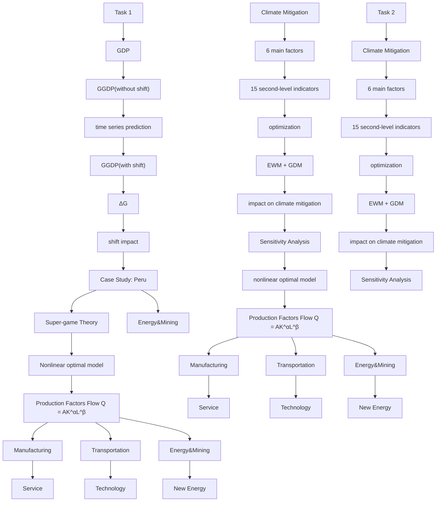
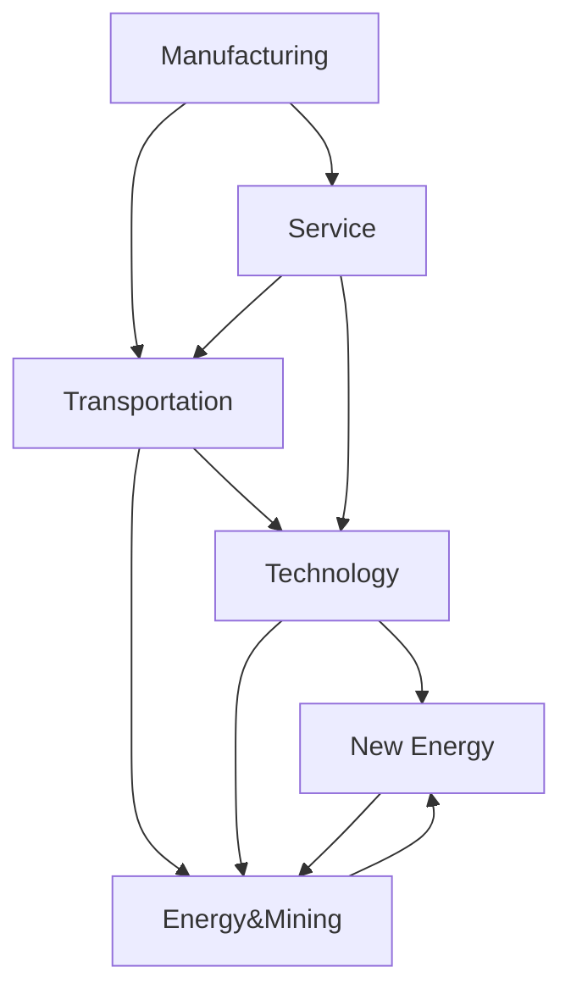
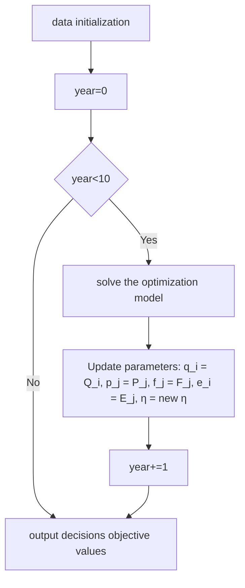

# Beyond GDP: Green GDP Revolution Leading the Way to a Sustainable Future

## Summary

Traditionally, GDP is used as the key indicator for measuring a country’s economic health and guiding its development. However, the preservation of resources for future generations is also important besides current economic production. To address this need, the green GDP(GGDP) is introduced as a way to evaluate a country’s potential for sustainable development. We explore the potential global impact of replacing GDP with GGDP as the primary economic indicator and utilize mathematical models.

For task 1, we suggest an accounting method for GGDP and forecast the global GGDP accordingly. Our method builds on the Adjusting GDP for environmental damage approach, improving it by subtracting environmental damage from the traditional GDP. Four main aspects of environmental damage are considered in our calculations for the estimation of GGDP. We also study the relationship between GGDP and GDP and derive the Ratio Life Cycle Law. Applying the ratio life cycle law and time series analysis, we forecast that the worldwide GGDP will reach 144 billion \$ in 2050, with a GGDP-to-GDP ratio of 0.76.

For task 2, we first establish a Comprehensive Evaluation Model of climate mitigation to study the impact of the shift on climate mitigation. We build an indicator system by selecting six first-level indicators and 15 second-level indicators using AHP. We then use Group Decision Method and Entropy Weight Method to calculate weights. With the prediction results from task 1, we analyze the effect of the shift on each secondary indicator and evaluate the impact on various aspects of climate mitigation. The results indicate that greenhouse gas emissions will see the biggest improvement until 2050, with an expected reduction of 26.61% in $C O _ { 2 }$ emissions and 49.71% in $N O _ { x }$ emissions.

For task 3, we measure the upsides and downsides of the shift. To analyze its impact on various industries worldwide, we establish a Nonlinear Programming Model of Production Factors Flow and examine the flow of capital and labor among the six industries most affected by the shift. Our analysis of the 10-year impact of the shift globally shows that the technology and service industry will benefit the most, while manufacturing, energy, and mining will be the hardest hit. We also examine the total value and find that, in the long run, the shift will increase global production, underscoring its worthiness.

For task 4, we analyze the impact of the shift on Peru. Based on our previous models, we conclude that Peru is still in the initial stages, with GGDP growing at a low speed and the area that Peru needs to improve on the most is energy efficiency. Considering Peru’s unique industrial structure and its competition with Chile in the South American copper market, We build a Supergame Model. After analysis, we recommend that Peru should shift after full development of the economy in the future .

Finally, sensitivity analysis is performed. We observe that the value of the objective function changes with parameter adjustments, and the changing trend is logical. This demonstrates the sensitivity and reliability of our model.

Keywords: Green GDP, Climate Mitigation, Life Cycle Curve, AHP, EWM, Nonlinear Programming, Super-game Theory

## Contents

## 1 Introduction 1

1.1 Background  
1.2 Restatement of the Problem . .  
1.3 Our Work

## 2 Model Preparations 2

2.1 Notations 3  
2.2 Data Collection and Cleaning . . . 3

## 3 The Calculation of GGDP 4

3.1 The Calculation of GGDP 4  
3.2 Global Statistics . 4  
3.3 The Forecast of GGDP 6

## 4 Model I: Evaluation Model of Climate Mitigation 7

4.1 Establishment of AHP model .

## 5 Model II: Nonlinear Programming Model of Global Impacts 13

5.1 Flow Analysis of Production Factors 13  
5.2 Optimization Model for Production Factors Flow 14  
5.3 Results of Impact . . 1 6

## 6 Case Study: How Peru Survives The Shift 17

6.1 Introduction to Peru . 17  
6.2 Impact of the Shift on Peru 18  
6.3 Rational Peru Game Model 19  
6.4 Analysis Conclusions of Peru . . 20

## 7 Sensitivity Analysis 21

## 8 Model Evaluation 22

8.1 Strengths 22  
8.2 Weaknesses 22

## 1 Introduction

## 1.1 Background

GDP (gross domestic product) is a commonly used indicator to measure the growth of a country or region. But it has caused controversy among many economists in recent years because those negative factors such as pollution and deterioration of the living environment caused by the pure pursuit of economic growth are ignored.

The concept of green GDP originated from the ecological Demand Index (EDI) was proposed by the Massachusetts Institute of Technology in 1971. This index mainly describes the quantitative measurement of the relationship between economic growth and resource & environmental pressure. In 1993, the Department of Economic and Social Affairs of the United Nations proposed the concept of green GDP, and in the revised system of National Accounts, it proposed the concept of "gross value" and "net worth". Since then, scientists from various countries continued to improve the concept of green GDP in their sustainable development projects.

## 1.2 Restatement of the Problem

For the requirements given, we restate them to help better position the focus of our work.

• We need to choose a method of calculating GGDP to measure climate mitigation for Task 1.  
• In Task 2, we’re supposed to build a model to assess the global impact of the shift in climate mitigation.  
• In Task 3, compare the benefits of climate mitigation and the potential disadvantages of this shift.  
• In Task 4, analyze the impact of this shift for a specific country, including resources and sustainable development aspects.  
• In addition, we need to provide advice to the leaders of the selected country on whether to shift to GGDP.

## 1.3 Our Work

Based on the restatement of requirements, our work can be concluded as follows:

• Establish the calculation method of GGDP and calculate the GGDP data of 75 major countries around the world from 1965 to 2021.  
• Build a comprehensive evaluation system for climate. By predicting the future GGDP through the ratio life cycle theory, we can quantitatively estimate the trend of each environmental factor in the GGDP calculation formula. Since the environmental factors are related to the secondary indicators in the evaluation system, we can predict the global impact of climate mitigation accordingly.

• Establish a nonlinear programming model to study the impact of the shift from the flow of production factors among various industries, so as to explore its advantages and resistance.  
• Analyze the impact of the shift on Peru based on previous models, and establish a super-game model for Peru’s copper mining industry.  
• Make sensitivity analysis for the nonlinear-programming model when parameters grow or shrink.

flowchart

Figure 1: The Framework of Our Study

## 2 Model Preparations

• Statistics we collect from websites are actual and reliable. Our data were collected from official statistical websites and databases and underwent scientific pre-processing.  
• The overall situation can be estimated through samples. Due to missing statistics, we are unable to study all countries in the world. So we need to assume that the 75 countries we study are representative of the global situation  
• Neglect the explosive changes when forecasting over the few decades. Global disasters such as severe epidemics will bring immeasurable impacts from all aspects, which we cannot predict.

• Indirect environmental losses are omitted. For the sake of feasibility and avoiding double counting, we believe that the most important environmental losses come from four aspects: greenhouse gas, thermal power generation, waste discharge, and natural resource loss.  
• As for greenhouse gases, we only considered carbon capture and $N O _ { x }$ . These two categories of greenhouse gases have the most ecological impact.

\*The assumptions under specific models are given in the following sections.

## 2.1 Notations

Table 1: Notations

<table><tr><td>Symbol</td><td>Definition</td><td>Unit</td></tr><tr><td> $C_k$ </td><td>the constant coefficient for term  $k$ </td><td>-</td></tr><tr><td> $E_{total}$ </td><td>the total electricity consumption</td><td> $kWh$ </td></tr><tr><td> $KtCO_2$ </td><td>the carbon dioxide emission</td><td> $kt$ </td></tr><tr><td> $KW$ </td><td>the mass of total waste</td><td> $kt$ </td></tr><tr><td> $p$ </td><td>the disposal cost of unit quality waste</td><td>$</td></tr><tr><td> $NRD$ </td><td>total natural resource depletion</td><td>trillion $</td></tr><tr><td> $G$ </td><td>the value of GGDP without the impact of shift</td><td>trillion $</td></tr><tr><td> $\hat{G}$ </td><td>the value of GGDP with the impact of shift</td><td>trillion $</td></tr></table>

\*Other notations instructions will be given in the text.

## 2.2 Data Collection and Cleaning

Collecting sufficient data is the basis of developing a complete index system. Our data are mainly collected from the World Bank website, Wind database, and national bureau of statistics. The data sources are summarized in Table 2.

<table><tr><td>Database</td><td>Website</td></tr><tr><td>World Bank</td><td>https://data.worldbank.org/</td></tr><tr><td>OECD</td><td>https://stats.oecd.org/</td></tr><tr><td>UN DH-Library</td><td>https://www.un.org/en/library/page/databases</td></tr><tr><td>BEA Data</td><td>https://www.bea.gov/data</td></tr></table>

Data pre-processing is divided into three steps: data filling, handling outliers, and normalization.

• Data Filling: If there is a relatively strong correlation with other years, we use the regression interpolation method, or we use the average value of other years to fill in the missing ones.  
• Handling Outliers: We analyzed each indicator and deviated from the abnormal data that may damage the accuracy and efficacy of our models.

• Data Normalization:We normalize the data of different indicators so that they can be compared on the same scale. We classify the used indicators into benefit attributes and cost attributes and scale them to [0, 1].

## 3 The Calculation of GGDP

## 3.1 The Calculation of GGDP

Green GDP aims to provide a more comprehensive measure of economic performance by accounting for the negative externalities of economic growth, such as air and water pollution, deforestation, and depletion of non-renewable resources.

There is no single "official" calculation method for Green GDP. We choose ANI as the basis of our approach because it is an expansion of GDP. The part of measuring ecological development is added to the basis of GDP. However, there are also many forms of the formula of ANI. To avoid controversy, we revised GGDP into two parts: GDP and environmental destruction cost. [1]

$$
G G D P = G D P - c \left(C O _ {2}\right) - c (E l e) - c (W a) - c (R D) \tag {1}
$$

The first deduction means the costs of $C O _ { 2 }$ pollution (as $C O _ { 2 }$ emissions times carbon market price), second the costs of energy pollution, third the opportunity costs of one tonne of waste that could be used in the production of electrical energy), and a fourth is the adjusted savings of natural resource depletion as a percentage of the gross national income per country.

More specifically, the formula can be rewritten as:

$$
G G D P = G D P - C _ {1} * K t C O _ {2} * P C D M - C 2 * (1 - \delta) * E _ {\text {total}} * \text {Pelect} - C _ {3} * T W * p - \left(\frac {G N I}{1 0 0} * \% N R D\right) \tag {2}
$$

where $C _ { k }$ represents the constant coefficient for term ??, $K t C O _ { 2 }$ represents the carbon dioxide emissions expressed as kilotonnes, ???????? is the average volume-weighted price for carbon in PPP, $E _ { t o t a l }$ is the total electricity consumption, ???? is the mass of total waste and $p$ is the disposal cost of unit quality waste. GNI (Gross national income) is the sum of value added by all resident producers plus any product taxes (fewer subsidies) not included in the valuation of output plus net receipts of primary income (compensation of employees and property income) from abroad. NRD represents natural resource depletion as a sum of net forest depletion, energy depletion, and mineral depletion.

## 3.2 Global Statistics

We need the data on GDP, $C O _ { 2 }$ emissions, power consumption, and mineral and forest consumption of each country to calculate the GGDP. Due to the large degree of missing statistics, we finally select 75 countries as the representation of the global situation from 1965 to 2021. The shift from GDP to GGDP is fundamentally a change in the country’s attitude towards environmental protection. That is to say, the country attaches great importance to environmental protection. Hence, the impact of the shift can be studied through those most environmental-consciously countries.

We choose ten countries with the highest GGDP-to-GDP ratio in 2021. The global average value and the ten countries’ average value of GDP and GGDP are shown in Figure 2. As shown in the figure, the trend of the average GDP of the ten most environmental-consciously countries is similar to it in other countries, so we can deduce that the shift will not change the development trend of GDP overall.

line chart

| Year | 10 representative countries' GDP | other countries' GDP |
| ---- | --------------------------------- | --------------------- |
| 1965 | 0.05                              | 0.10                  |
| 1970 | 0.10                              | 0.12                  |
| 1975 | 0.15                              | 0.14                  |
| 1980 | 0.20                              | 0.18                  |
| 1985 | 0.18                              | 0.20                  |
| 1990 | 0.35                              | 0.30                  |
| 1995 | 0.40                              | 0.42                  |
| 2000 | 0.45                              | 0.48                  |
| 2005 | 0.65                              | 0.68                  |
| 2010 | 0.85                              | 0.95                  |
| 2015 | 0.88                              | 1.10                  |
| 2020 | 0.98                              | 1.30                  |

line chart

| Year | 10 representative countries' GDP | other countries' GDP |
| ---- | --------------------------------- | --------------------- |
| 1965 | 0.01                              | 0.05                  |
| 1970 | 0.03                              | 0.04                  |
| 1975 | 0.08                              | 0.06                  |
| 1980 | 0.12                              | 0.10                  |
| 1985 | 0.15                              | 0.12                  |
| 1990 | 0.25                              | 0.15                  |
| 1995 | 0.30                              | 0.18                  |
| 2000 | 0.35                              | 0.20                  |
| 2005 | 0.50                              | 0.35                  |
| 2010 | 0.65                              | 0.55                  |
| 2015 | 0.68                              | 0.65                  |
| 2020 | 0.78                              | 0.68                  |

Figure 2: Global GDP and GGDP values

The ratio of GGDP to GDP can be used to measure countries’ environmental protection degrees. The left subfigure of Figure 3 reflects the average ratio of the ten countries in half a century, showing the trends that are primarily synchronized and eventually approaching a limit.

Compared to the rest countries, these ten countries show a clear cyclical growth trend. As firstmover countries, their growth is mainly due to progressively better environmental policies. We can use this cyclical trend to predict the impact of GGDP as a policy shift for each country

line chart

| Year | Average of ten representative countries' | Average of Other Countries' |
|------|------------------------------------------|------------------------------|
| 1965 | 0.35                                     | 0.50                         |
| 1970 | 0.48                                     | 0.48                         |
| 1975 | 0.65                                     | 0.60                         |
| 1980 | 0.70                                     | 0.65                         |
| 1985 | 0.72                                     | 0.60                         |
| 1990 | 0.75                                     | 0.55                         |
| 1995 | 0.76                                     | 0.35                         |
| 2000 | 0.77                                     | 0.45                         |
| 2005 | 0.78                                     | 0.50                         |
| 2010 | 0.79                                     | 0.55                         |
| 2015 | 0.79                                     | 0.58                         |
| 2020 | 0.79                                     | 0.59                         |

line chart

| Time Stage     | Ratio |
| -------------- | ----- |
| initial stage  | Low   |
| growth stage   | High  |
| maturity stage | High  |

Figure 3: The ratio chart and ratio life cycle curve

We make the mean curve of these ten countries(the right chart of Figure 3 ), and name it as ratio life cycle curve. We summarize the following rules through curves of more countries:

• There is an upper limit of the ratio, and it can be assumed that all countries will reach this upper limit in the future.

• The development of the ratio in each country can be divided into three stages: the initial stage, the growth stage, and the maturity stage. These three stages are closely related to the country’s performance in environmental protection and comply with the growth of the country’s environmental protection capacity.  
• In the initial stage, the country attaches great importance to economic growth, and lacks of environmental protection awareness, so the ratio is low and stable.  
• In the growth stage, as a mature economy, the country begins to pay attention to sustainable development, and the ratio also increased rapidly.  
• Finally, in the maturity stage as the country’s performance in environmental protection has been perfect, the ratio will keep approaching its theoretical upper limit.  
• The theoretical upper limit can raise slowly. It is related to the development degree and resource endowment of environmental protection technology in the current world. When science and technology keep improving and the utilization of resources is constantly optimized, the upper limit of the ratio will climb at a slow speed.

## 3.3 The Forecast of GGDP

## 3.3.1 Prediction Method

According to the ratio life cycle theory in the previous section, we can predict with the following steps:

• Step 1, identify the stage by the rate of a country over five years.  
• Step 2, predict the development of the ratio base on the ratio life cycle curve.  
• Step 3, the time series is used to predict the GDP of the country, and then multiply the GDP by the ratio to obtain the future GGDP.

In this way, we implicitly divide all countries into three categories, giving them corresponding prediction rules. Until 2050, the global GGDP is shown in the figure below. We also mark the predicted 2050 GGDP on the map.

area chart

| Year | GDP (trillion dollars) | GDP/GDP ratio | Ratio |
|------|------------------------|---------------|-------|
| 2022 | ~58                    | ~0.5          | 0.5   |
| 2025 | ~60                    | ~0.55         | 0.55  |
| 2028 | ~61                    | ~0.6          | 0.6   |
| 2031 | ~62                    | ~0.65         | 0.65  |
| 2034 | ~63                    | ~0.7          | 0.7   |
| 2037 | ~64                    | ~0.75         | 0.75  |
| 2040 | ~65                    | ~0.8          | 0.8   |
| 2043 | ~65                    | ~0.8          | 0.8   |
| 2046 | ~66                    | ~0.8          | 0.8   |
| 2049 | ~67                    | ~0.8          | 0.8   |

Figure 4: The Prediction of GGDP values

## 3.3.2 Forecast Conclusions

• Replacing GDP with GGDP as the most important evaluation indicator of the economy has a significant effect on promoting the increase of global GGDP.  
• For each country, the impact of the shift is different, which is related to the stages of the ratio life cycle.  
• In the short term, the countries in the growth stage benefit most, whose GGDP-to-GDP ratio wil start to rise rapidly.  
• In the medium term, considering the stage transition, more countries will enter a new stage and benefit from the shift, and the global GGDP will have a significant increase.  
• In the long term, almost all countries will be in the mature stage. Due to the development of science and technology and society, the upper limit of the ratio can continue to increase, and the global environmental protection level will usher in a new leap.

## 4 Model I: Evaluation Model of Climate Mitigation

Climate mitigation refers to efforts aimed at reducing greenhouse gas emissions and thus slowing down the rate of climate change. Climate mitigation involves reducing the amount of GHG emissions from human activities such as energy production, transportation, agriculture, and deforestation, etc. There are various strategies and techniques that can be used for climate mitigation, such as increasing the use of renewable energy and improving energy efficiency. Here we establish an indicator system to measure the impact of the shift on climate mitigation.

## 4.1 Establishment of AHP model

## 4.1.1 Standards of the Evaluation Model

The climate mitigation evaluation model for a country or region of climate mitigation should satisfy the following requirements:

• The evaluation model is universal, and it can be used to measure any one country or region.  
• The model should be comprehensive, exhausting various aspects of climate mitigation.  
• The selected indicators are reliable and representative, with no duplication between them.

## 4.1.2 Indicators Selection

The comprehensive performance of a country or region in climate mitigation is related to many factors, the most important is pollution emissions because greenhouse gases have a direct impact on the atmosphere. Human waste may also cause irreversible harm to the environment. Besides, energy evaluation is also necessary, because the higher the proportion of clean energy when the country’s daily energy consumption, the more the country contributes to climate mitigation. In addition, scientific and technological development can also help to improve the climate problems and save the environment. Other factors related to climate mitigation include forests, policy, and public awareness.

<table><tr><td>Level 1</td><td>Level 2</td><td>Description</td><td>Type</td></tr><tr><td rowspan="2">Greenhouse gas emissions</td><td>CGE</td><td>Total carbide gas emissions as Kt</td><td>-</td></tr><tr><td>NGE</td><td>Total NOx Gas Emissions as Kt</td><td>-</td></tr><tr><td rowspan="2">Social</td><td>GS</td><td>Government spending on environmental protection, % of government spending</td><td>+</td></tr><tr><td>PE</td><td>Public awareness of environmental protection, reflected through questionnaires</td><td>+</td></tr><tr><td rowspan="3">Nature Resources</td><td>FC</td><td>Forest cover as  $k^{m^2}$ </td><td>+</td></tr><tr><td>EI</td><td>Energy self-sufficiency rate</td><td>+</td></tr><tr><td>MDR</td><td>Mineral depletion rate</td><td>-</td></tr><tr><td rowspan="2">Technology</td><td>GHRC</td><td>Garbage handling and recycling capabilities</td><td>+</td></tr><tr><td>CCC</td><td>Carbon capture capacity</td><td>+</td></tr><tr><td rowspan="4">Energy efficiency</td><td>BEE</td><td>Building energy efficiency</td><td>+</td></tr><tr><td>IPEE</td><td>Industrial production energy efficiency</td><td>+</td></tr><tr><td>VFE</td><td>Vehicle fuel efficiency</td><td>+</td></tr><tr><td>FE</td><td>Fossil energy power generation, % of total power generation</td><td>-</td></tr><tr><td rowspan="2">Waste discharge</td><td>IW</td><td>Total amount of industrial waste generated as Kt</td><td>-</td></tr><tr><td>CW</td><td>Total amount of civil waste generated as Kt</td><td>-</td></tr><tr><td colspan="4">Note:+: The more benefit indicators,the better-: The better the lack of cost indicators</td></tr></table>

Figure 5: Indicator System for Evaluation of Climate Mitigation

Based on the above description, we establish an AHP model and compile six main factors and select 15 indicators that measure climate mitigation.

## 4.1.3 Calculation of Weights

Determination of the weights is essential to evaluate the different contributions of the indicators. Consequently, two weighting models are adopted to calculate the weight vector.

The traditional AHP model uses Group Decision Method(GDM) to determine the weight of each indicator. This method requires experts to give the comparison matrix of all main factors. GDM has its rationality, but it is very subjective.

The entropy weight method (EWM) is another commonly used weighting method. It assumes that the greater the degree of dispersion, the greater the degree of differentiation, and the more information can be derived. Thus, a higher weight should be given to the indicator, and vice versa[3].

We combine these two methods to determine the weights for our evaluation model, which both increase credibility and reflect the importance we attach to each factor.

• First, we use EWM to find the weights of all secondary indicators. The specific steps to calculate each first-level indicator are as follows. For a first-level indicator ??, there are ?? second-level indicators of ?? country.

Step 1, for the indicator ??, calculate the probability $p _ { i j }$ of country ?? , where $x _ { i j }$ is the country ??’s value of indicator ??.

$$
p _ {i j} = \frac {x _ {i j}}{\sum_ {j = 1} ^ {m} x _ {i j}} \tag {3}
$$

Step 2, calculate the entropy value $E _ { i }$ of indicator ??.

$$
E _ {i} = \frac {\sum_ {j = 1} ^ {m} p _ {i j} \cdot \ln p _ {i j}}{m} \tag {4}
$$

Step 3, calculate the weight $w _ { i }$ of indicator ??.

$$
w _ {i} = \frac {1 - E _ {i}}{\sum_ {i = 1} ^ {n} 1 - E _ {i}} \tag {5}
$$

Step 4, add the values of each second-level indicator by weight, then get the value of the first-level indicator ??.

$$
X _ {k j} = \sum_ {i = 1} ^ {n} w _ {i} \cdot x _ {i j} \tag {6}
$$

With second-level indicators’ weights obtained, we can calculate each first-level indicator. Similarly, we obtain the weight vector of first-level indicators.

• Second, we use GDM to subjectively determine the weight of each first-level indicator. Three experts vote on the importance of the six first-level indicators for climate mitigation, and specific steps are as follows.

## (1)Pairwise comparisons between different factors

Three experts voted to compare the importance of the main factors.

$$
\text { Greenhouse   Gas } \geq \text { Energy } > \text { Waste   Discharge } > \text { Forest } > \text { Technology } \approx \text { Socsail\&Policy } \tag {7}
$$

## (2)Calculation of comparison matrix

With the relationship discussed before, we get our comparison matrix $( b _ { i j } ) _ { 6 \times 6 }$ .

$$
\begin{array}{c c c c c c} & F _ {1} & F _ {2} & F _ {3} & F _ {4} & F _ {5} & F _ {6} \\ F _ {1} & 1 & \frac {1}{3} & \frac {1}{5} & \frac {1}{7} & \frac {1}{9} & \frac {1}{9} \\ F _ {2} & 3 & 1 & \frac {1}{3} & \frac {1}{5} & \frac {1}{7} & \frac {1}{7} \\ F _ {3} & 5 & 3 & 1 & \frac {1}{3} & \frac {1}{5} & \frac {1}{5} \\ F _ {4} & 7 & 5 & 3 & 1 & \frac {1}{3} & \frac {1}{3} \\ F _ {5} & 9 & 7 & 5 & 3 & 1 & 1 \\ F _ {6} & 9 & 7 & 5 & 3 & 1 & 1 \end{array} ,
$$

## (3)Consistency Test

We can calculate the eigenvalues and eigenvectors of the matrix before. Next, we need to perform consistency test with the maximum eigenvalue $\lambda _ { m a x }$ .

$$
C I = \frac {\lambda_ {m a x} - n}{n - 1} \tag {8}
$$

$$
C R = \frac {C I}{R I} \tag {9}
$$

where $R I = 1 . 2 6$ when $n = 6 .$ For the above comparison matrix, we obtain $C R = 0 . 0 4 4 < 0 . 1$ , thus the comparison matrix is acceptable.

## (4)Calculate to obtain weights

Having Passed the consistency test, we can get the weights of the main factors by the eigenvector corresponding to the maximum eigenvalue: Greenhouse Gas(0.475), Energy(0.257), Waste Discharge(0.135), Forest(0.068), Technology(0.033), Social&Policy(0.033) .

• Third, We combine the two sets of weights. With the principle of Minimum Relative Information Entropy, we establish an optimization model to minimize the relative deviation of the results under the two decision methods.

$$
\min \sum_ {j = 1} ^ {n} w _ {j} (\ln w _ {j} - \ln \alpha_ {j}) + \sum_ {j = 1} ^ {n} w _ {j} (\ln w _ {j} - \ln \beta_ {j})
$$

$$
\text { s.t. } \left\{ \begin{array}{l} \sum w _ {j} = 1 \\ w _ {j} > 0 \\ j = 1, 2, \ldots , n \end{array} \right.
$$

Lagrange Multiplier Method is used to solve the above optimization problem, and we got the final weights:

$$
w _ {j} = \frac {\left(\gamma_ {\mathrm{j}} \alpha_ {\mathrm{j}}\right) ^ {0 . 5}}{\sum_ {j = 1} ^ {n} \left(\gamma_ {\mathrm{j}} \alpha_ {\mathrm{j}}\right) ^ {0 . 5}} \tag {10}
$$

In the following figures, we show the results of our evaluation model. The left figure reflects the weight of every indicator, and the right one shows how the 10 representative countries in our rating system scored in 2021.

The main factor that matters most is greenhouse gas emissions. The rise in the concentrations of greenhouse gases will directly lead to the rise in the temperature on the earth. The main cause of global warming is that human use of fossil fuels (such as coal, oil, etc.) in nearly a century, and emit a large number of greenhouse gases such as $C O _ { 2 }$ . While energy efficiency and natural resources are also vital.

Through rigorous calculations, we obtained a combined weight score for all countries based on the entropy method and AHP. Ten countries representing each situation were selected to show the scores. According to our evaluation results, the country that performs best in climate mitigation is Switzerland, which gets a score of 0.72.

pie chart

| Category | Percentage (%) |
| :--- | :--- |
| Greenhouse gas emissions | 13.52 |
| Social | 4.24 |
| Nature Resources | 1.03 |
| Technology | 3.44 |
| Energy efficiency | 6.36 |
| Waste discharge | 10.87 |
| Total | 16.43 |
| Total (Greenhouse gas emissions) | 13.52 |
| Total (Social) | 4.24 |
| Total (Nature Resources) | 1.65 |
| Total (Technology) | 5.79 |
| Total (Energy efficiency) | 1.44 |
| Total (Waste discharge) | 1.44 |

bar chart

| Country | EWM score | AHP score | Combined Weight Score |
| :--- | :--- | :--- | :--- |
| Switzerland | 0.69 | 0.71 | 0.70 |
| Ireland | 0.62 | 0.64 | 0.65 |
| Lithuania | 0.68 | 0.62 | 0.64 |
| Australia | 0.64 | 0.62 | 0.63 |
| Japan | 0.52 | 0.60 | 0.59 |
| India | 0.44 | 0.42 | 0.42 |
| Mexico | 0.37 | 0.44 | 0.35 |
| Peru | 0.27 | 0.30 | 0.30 |
| Saudi Arabia | 0.24 | 0.16 | 0.21 |
| Turkmenistan | 0.20 | 0.12 | 0.14 |

Figure 6: AHP Model for Evaluation of Climate Mitigation

## 4.1.4 Evaluation results

For Task 2, we need to use the previous prediction results and evaluation model to estimate the impact on climate mitigation after switching indicators. In Section 3.3, we predict the development of GGDP $\hat { G }$ with the shift. The development of $\hat { G }$ involves both natural economic growth and policy shocks. In this part, we predict another GGDP ?? directly based on historical data by ARIMA. This means that $G$ only takes into account the natural growth of the economy and is not subject to policy shocks, which is the counterfactual result of $\hat { G } .$ Hence, the difference between them reflects the effect of the policy.

$$
\Delta G = \hat {G} - G \tag {11}
$$

At the same time, based on our previous deduction, GGDP is affected by both GDP and environmental damage, and the implementation of the policy will not significantly change the trend of GDP growth. So treatment effect Δ?? can be used to explain the impact of the conversion on environmental damages.

As is stated before, environmental damage is mainly caused by greenhouse gas emissions, thermal power generation, waste discharge, and resource destruction, so the impact can also be decomposed into these four aspects. We evenly distribute this part of the impact to these four aspects, so that the value of carbon dioxide emissions reduction, electricity savings, waste reduction, and resource savings can be estimated.

Finally, we obtain that if the shift happens in 2019(Δ?? = 10.6????????????????\$), the world can reduce carbon dioxide emissions by 4425 million metric tonnes, save electricity by 2376.22 TWh, reduce waste emissions by 7898 million metric tonnes by 2050. What is more, the global consumption of minerals, metals, fossil fuels, and biomass will be reduced by 23 billion tons, and the recycling rate of raw materials will increase from 8.6% to 19.7%.

We plug these values into our climate mitigation evaluation models, the impact will benefit climate mitigation globally in the following ways:

• The most direct impact of this shift is the substantial reduction of greenhouse gases. Considering the huge negative effect of greenhouse gases on GGDP, enterprises, and governments will actively or passively adopt pollution treatment devices. We calculate that by 2050 carbide gas emissions will drop by 27.61% and NOx gas emissions by 49.71%.

• Governments will implement more stringent environmental protection policies. Moreover, they will substantially increase investment in environmental protection. According to the indicator weight calculation, enterprises polluting the environment will pay an additional price of 300.00%. The public will also have higher environmental awareness, and the proportion of citizens with high environmental quality may increase from 6.23% to 45.11%.  
• This shift will also promote human beings’ attention to forest resources. We estimate that the forest area in some deforestation areas (such as the Amazon rainforest, etc.) will stop negative growth, the global forest area will increase by 4.00% by 2050, and the health of the forest ecosystem will increase by 20.16%.  
• Developed countries will have a trans-epochal improvement in carbon capture technology and waste disposal technology. Unfortunately, these technologies may not be affordable for a large number of developing countries. Even so, global waste disposal will rise to 35.55% by 2050.  
• Building energy efficiency and industrial production energy efficiency both increased by 10.13%. With the development of electric vehicle technology and the phase-out of fuel vehicles, the fuel efficiency of vehicles will increase by 68.33%. Meanwhile, fossil fuel power generation will only exist in a handful of developing countries. The share of fossil fuels in total energy is expected to drop from 80.79% today to 27.86%.

line chart

| Cumulative carbon emissions since 1850 (Gt) | Average Temperature Change (Celsius) |
| ------------------------------------------ | ------------------------------------ |
| 1980                                       | ~0.0                                 |
| 2000                                       | ~0.5                                 |
| 2021                                       | ~1.0                                 |
| 2035                                       | ~1.5                                 |
| 2050                                       | ~2.0                                 |

Figure 7: Prediction interval of temperature change with different carbon emissions

In conclusion, the shift significantly improves all six dimensions in the AHP model, which will lead to a significant increase (44.18%) in the global Climate Mitigation Score. As shown in Figure 7, according to the research of the IPCC (Intergovernmental Panel on Climate Change), global temperature change is directly related to carbon emissions. So the shift will also help meet the United Nations’ goal of 1.5 degrees Celsius of global warming by 2050[4].

## 5 Model II: Nonlinear Programming Model of Global Impacts

In 3.3.2, we prove the increasing positive impact of the shift on sustainable development over time. In Section 4, we analyzed the impact of the shift on climate mitigation in details. Moreover, in this section, we describe the global impact of the shift in more aspects and analyze the advancement and weakness respectively.

## 5.1 Flow Analysis of Production Factors

Analyzing the impact of a policy can also be conducted by studying the development of different industries. Replacing GGDP with GDP will have a huge impact on traditional industries with high energy consumption and pollution. At the same time, it will also greatly encourage the development of certain industries, such as new energy industries. Globally, the most damaged industries are manufacturing, transportation, energy and mining, which we name sunset industries of the shift. The three most benefited industries are service industry, technological industry and new energy industries, which named sunrise industries.

Considering the two most important factors of production, capital and labor, we can use their flows to analyze the impact of shift on each industries. Although the output value of all industries is increasing every year, the country’s development will be tilted from sunset industries to sunrise industries. Globally, affected by the shift, capital and population will move from the sunset industries to the sunrise industries, as shown in the figure below.

flowchart

Figure 8: The Flow of Production Factors

Although the shift has taken place, the short-term development goal of countries in the world is still to maximize the total output value. The total flow of capital can be estimated by $\Delta G .$ , because Δ?? represents not only the value loss caused by environmental damage, but also the loss of high-pollution and high-energy-consuming industries. Production factors will flow to other industries. Based on the flow relationship of production factors among industries, we can build an nonlinear programming model.

## 5.2 Optimization Model for Production Factors Flow

Before we build the model, we need to make some specific assumptions:

• We only consider the two factors of production, capital and labor.  
• Affected by the shift, the production factors will flow from sunset industries to sunrise industries the sunrise industry.  
• The flow occurs at the end of each year.  
• Every Industry has labor load limit.  
• After the flow, each industry has a fixed annual growth rate of capital and labor.

The value of output per year can be calculated using the Douglas Production Function. For each industry, we use the last five years of data to estimate the parameters in the production function.

$$
Q = A \cdot K ^ {\alpha} L ^ {\beta} \tag {12}
$$

With the above rules, we can build a flow optimization model.

Table 2: Notations of Nonlinear Programming Model

<table><tr><td>Symbol</td><td>Type</td><td>Definition</td></tr><tr><td>i</td><td>index</td><td>the index of sunset industries</td></tr><tr><td>j</td><td>index</td><td>the index of sunrise industries</td></tr><tr><td> $x_{ij}$ </td><td>decision variable</td><td>capital flow from industry i to industry j in one year</td></tr><tr><td> $y_{ij}$ </td><td>decision variable</td><td>labor flow from industry i to industry j in one year</td></tr><tr><td> $Q_i$ </td><td>decision variable</td><td>total output value of industry i at the end of the year</td></tr><tr><td> $E_i$ </td><td>decision variable</td><td>total labor of industry i at the end of the year</td></tr><tr><td> $P_j$ </td><td>decision variable</td><td>total output value of industry j at the end of the year</td></tr><tr><td> $F_j$ </td><td>decision variable</td><td>total labor of industry j at the end of the year</td></tr><tr><td> $p_j$ </td><td>parameter</td><td>total output value of industry j at the beginning of the year</td></tr><tr><td> $f_j$ </td><td>parameter</td><td>total labor of industry j at the beginning of the year</td></tr><tr><td> $e_i$ </td><td>parameter</td><td>total labor of industry i at the beginning of the year</td></tr><tr><td> $q_i$ </td><td>parameter</td><td>total output value of industry i at the beginning of the year</td></tr><tr><td> $\eta$ </td><td>parameter</td><td>total capital flow due to shift</td></tr><tr><td> $\lambda$ </td><td>parameter</td><td>industry labor fluctuation range coefficient</td></tr><tr><td> $\omega_i$ </td><td>parameter</td><td>annual output value growth rate of industry i</td></tr><tr><td> $\delta_j$ </td><td>parameter</td><td>annual output value growth rate of industry j</td></tr><tr><td> $\alpha_i$ </td><td>parameter</td><td>The first exponent of the Douglas production function of industry i</td></tr><tr><td> $\beta_i$ </td><td>parameter</td><td>The second exponent of the Douglas production function of industry j</td></tr><tr><td>k</td><td>parameter</td><td>The annual growth grate of industry labor</td></tr></table>

$$
\max \sum_ {i = 1} ^ {3} A _ {i} \cdot P _ {i} ^ {\alpha_ {i}} F _ {i} ^ {\beta_ {i}} + \sum_ {j = 1} ^ {3} A _ {j} \cdot Q _ {j} ^ {\alpha_ {j}} E _ {j} ^ {\beta_ {j}}
$$

$$
\text {s.t.} \left\{ \begin{array}{l} \eta = \sum_ {i = 1} ^ {3} \sum_ {j = 1} ^ {3} x _ {i j} \\ P _ {i} = (p _ {i} + \sum_ {i = 1} ^ {3} x _ {i j}) (1 + \omega_ {i}), \quad \forall j \\ F _ {j} = (f _ {j} + \sum_ {i = 1} ^ {3} y _ {i j}) (1 + k _ {f j}), \quad \forall j \\ Q _ {j} = (q _ {i} - \sum_ {j = 1} ^ {3} x _ {i j}) (1 + \delta_ {j}), \quad \forall i \\ E _ {i} = (e _ {i} - \sum_ {j = 1} ^ {3} y _ {i j}) (1 + k _ {e j}), \quad \forall i \\ F _ {i} \leq f _ {i} (1 + \lambda), \quad \forall i \\ E _ {j} \geq e _ {j} (1 - \lambda), \quad \forall j \\ a l l d e c i s i o n v a r i e b l e s > 0 \\ i, j = 1, 2, 3 \end{array} \right.
$$

It is an annual decision model of the flow of production factors. Its results are based on the changes in the output value and labor population of each industry. Due to the expansion of the industry scale, the labor population will increase every year. Therefore, we use the historical five-year data of the labor population to linearly fit it to estimate the population increase. In addition, the annual total flow of capital is Δ?? of each year estimated in the previous model.

On this basis, we apply our nonlinear model to estimate the development of industries in the next ten years as the flow chart shown below.

flowchart

Figure 9: Calculation Flow Chart

According to the results of our model, the changes in total output value of the six industries are shown in the figure below. The total output value without shift is a convex function, and the growth is mainly determined by the manufacturing industry. For better observation, we lay a straight line as a reference. The result of the solution after the shift occurs is shown in the broken line in the figure below. In the short term, the growth of the total output value is lower than the reference line. It is because the sunrise industries to which the production factors are transferred is weaker than the traditional industry in transforming the production factors into output value. As time goes by, since the average annual growth rates of the sunrise industries are significantly higher than sunset industries’, it is getting closer to the reference line, and it is expected to exceed it in the future, reflecting the benefits of shift for long-term development.

line chart

| Year | Baseline | Optimal objective function value |
|------|----------|----------------------------------|
| 2021 | 60       | 58                               |
| 2022 | 61       | 60                               |
| 2023 | 62       | 62                               |
| 2024 | 63       | 64                               |
| 2025 | 64       | 64                               |
| 2026 | 65       | 65                               |
| 2027 | 66       | 65                               |
| 2028 | 67       | 66                               |
| 2029 | 68       | 68                               |
| 2030 | 69       | 71                               |
| 2031 | 70       | 75                               |
| 2032 | 71       | 79                               |
| 2033 | 72       | 83                               |

Figure 10: Optimal Total Output of 6 Industries

In addition, the ratio of each industry’s output value and labor, comparing with the predicted value of conventional growth after ten years, is shown in the figure below.

bar chart

change in capital
| Category | Blue Bar Value | Green Bar Value |
| :--- | :--- | :--- |
| New energy | 0.09805 | 0.1305 |
| Technology | 0.0935 | 0.1576 |
| Service | 0.0443 | 0.0912 |
| Transportation | 0.0922 | 0.0565 |
| Energy&Mining | 0.1223 | 0.0400 |
| Manufactory | 0.5474 | 0.4207 |

bar chart

change in labor
| Category | Change in labor (value) | Change in labor (not shift) |
| :--- | :--- | :--- |
| New energy | 0.0075 | 0.0982 |
| Technology | 0.1259 | 0.2101 |
| Service | 0.3744 | 0.4232 |
| Transportation | 0.1123 | 0.0965 |
| Energy&Mining | 0.1807 | 0.0411 |
| Manufactory | 0.1992 | 0.1221 |

Figure 11: Comparison of Industry Growth Rate Changes

## 5.3 Results of Impact

Through the nonlinear programming model of the flow of production factors, we quantitatively analyze the short-term impact of the shift.

• The shift will have a restraining effect on the development of the global economy, reducing the growth of total output value of the 6 industries by 5% at least.  
• The impact of the shift on the output value varies from industries. Among them, sunrise industries such as service industry, new energy, and technology industries are expected to increase by

30.53%, while sunset industries such as manufacturing, mining, and transportation are expected to decrease by 17.92%.

• The shift will lead to the redistribution of labor among industries, which may cause a large number of unemployment and spark workers’ protests.  
• The inhibitory effect of shift on certain industries will inhibit the economic development of countries that rely on them as pillar industries.

Besides, the shift also has some other push resistance. As for the cost, a huge administrative costs will be caused. As for technology, it is quite difficult to measure the environmental loss accurately. Therefore, it can be inferred that the shift is a huge burden for economically underdeveloped countries.

In the long run, since the parameters of the production function change greatly over time and cannot be ignored, we qualitatively analyze the impact of shift.

• In the long run, the traditional energy industry is constantly being replaced by the new energy industry. The mining industry has reached a steady state after shrinking. The growth of high technology can alleviate the damage caused by the manufacturing and transportation industries to the environment. The global industrial optimization and upgrading has been completed, and the shift leads a new wave of economic growth.  
• The scale of the sunrise industry has expanded, and the jobs provided are sufficient to solve the unemployment caused by the shrinkage of the sunset industry.  
• High technology has developed by leaps and bounds, and at the same time global education has also been greatly improved.  
• Energy regulation has been strengthened, breaking the resource monopoly of some countries and promoting global equity.

The shift can improve the well-being of people around the world in the future. Combined with its significance of climate mitigation, qw fully prove that the switch is worthwhile at a global scale.

## 6 Case Study: How Peru Survives The Shift

## 6.1 Introduction to Peru

Peru is a country in western South America, bordering Ecuador and Colombia in the north, Brazil and Bolivia in the east, Chile in the south and the Pacific Ocean in the west. In 2021, Peru’s GDP reached US \$224.725 billion, with a per capita GDP of US \$6,888, with an economic growth rate of 13.3% and an inflation rate of 6.43%. Peru’s total exports will reach US \$55.07 billion in 2021. Among them, mineral products accounted for more than 64% of the total foreign trade exports.

Peru has many excellent mineral resources. For example, the Tromoc copper mine is one of the largest copper mines in the world and has great economic value and development prospects. Moreover, Peru is one of the world’s largest mineral exporters. Among them, copper ore is one of its main export minerals.Peru and neighboring Chile meet almost all of the copper mining needs in the region. Copper mine development has brought great economic benefits and a lot of jobs to Peru. At the same time, inevitably, the mining industry has a lot of irreversible effects on the natural environment, leading to the country low GGDP .

natural_image

Aerial view of a winding dirt road cutting through deep, layered mineral ore mines under construction (no visible text or symbols)

Figure 12: Peruvian copper mine

## 6.2 Impact of the Shift on Peru

According to our prediction model above, Peru is now in its "initial stage" with a low and stable GGDP to GDP ratio (around 30%). After the shift, Peru’s GGDP will enter the "growth stage". According to our forecast model, the proportion will level off after 20 years of high-speed growth to enter the "maturity stage". Figure 13 shows our forecasts for Peru’s GDP, GGDP and GGDP-to-GDP ratio in the next 30 years.

area chart

| year | GDP (trillion dollars) | GGDP (trillion dollars) | Proportion |
|------|------------------------|-------------------------|----------|
| 2016 | 0.20                   | 0.10                    | 0.48     |
| 2019 | 0.23                   | 0.11                    | 0.47     |
| 2022 | 0.22                   | 0.11                    | 0.48     |
| 2025 | 0.24                   | 0.13                    | 0.55     |
| 2028 | 0.26                   | 0.15                    | 0.60     |
| 2031 | 0.28                   | 0.17                    | 0.63     |
| 2034 | 0.30                   | 0.19                    | 0.65     |
| 2037 | 0.32                   | 0.21                    | 0.65     |
| 2040 | 0.34                   | 0.23                    | 0.65     |
| 2043 | 0.36                   | 0.25                    | 0.65     |
| 2046 | 0.38                   | 0.27                    | 0.65     |
| 2049 | 0.40                   | 0.29                    | 0.65     |

Figure 13: Forecast of main indicators of Peru’s future economy

According to our AHP model, after the shift, all six main factors will improve andthe climate mitigation score will increase by 21.91% . At the same time, according to our programming model, there will be large-scale capital and labor outflows in Peru’s mining and energy industries. The inflow of capital and personnel is aimed at the service industry mainly. Considering the industrial structure of Peru, the mining industry in Peru is the most affected by the shift. Next, we will targetedly analyze the mining industry on whether to shift.

## 6.3 Rational Peru Game Model

The shift is a policy factor for national decision-making. Once shift, the country will macro-control and restrict mineral mining, which will have a fatal impact on the mining industry. Moreover, this important decision-making is usually irreversible. For Peru and Chile, it is irrational to choose shift. Using traditional game theory to analyze, it will be concluded that neither of them wants to give up the copper mine market and continue to maintain two oligopolies. Due to the complexity of the actual circumstance, we can analyze Peru’s decisions with different Chile’s decisions.

## 6.3.1 Rational Chile: Static Game Model with Complete Information

Without information of Peru’s choice, Chile rationally chooses to shift. If the shift is carried out at this time, the original market share will be annexed by Chile, thereby changing the original balanced oligopoly position. This will have a huge impact on the Peruvian economy, because Peru will not be able to develop other pillar industries in the short term . Therefore, rational Peru will choose not to shift, and the game between the two countries is a Duopoly model[5].

In this game, the two players are Peru and Chile, which produce homogeneous products and compete for output, so their decision is the annual copper mine output. According to the conclusion of Cournot competition, the equilibrium output is $\begin{array} { r } { q * = \frac { a - c } { 3 } } \end{array}$ , which is only related to the market price-demand function and cost function.

## 6.3.2 Brave Chile: Super Game Theoretic Model

The brave Chile still carry out the shift under the premise of taking great risks, but this does not mean that Chile will let Peru become the hegemon of the South American copper mine market. Thus Chile chooses to cooperate with Chile, that is to say, persuade Chile to shift, and form an alliance, so as to jointly control the price of copper mine and safeguard the interests of the alliance.

After negotiating an agreement with Peru, Peru promised to jointly shift with Chile, adopt a strategy of reducing copper mine production, and increase prices, thereby protecting the economic interests of the alliance. We assume that Chile has a strong environmental commitment and will abide by the Union’s rules. At this time, Peru, which has not yet taken any action, is faced with the temptation to monopolize the copper mine market. At this point, Peru is on the side of the information advantage, while Chile is on the side of the information disadvantage. Therefore, a new game is established, and Peru can choose to cooperate or deceive. Since the alliance between Peru and Chile is long-term, and the specific policies of the two countries will change every year, we can consider this game to be repeated, and the trust between the two countries will affect their strategies.

Considering the information asymmetry and repetition of the game, we apply Super-game Analysis of Market Disorder to study the decision-making mechanism[6] of Peru.

To simplify the analysis, we assume that Peru have two choices in each game, deceiving or cooperating. Deceiving means violating the alliance regulations and adopting high-yield strategies to quickly annex the Chile’s share, while cooperating means complying with the alliance regulations or even joining the shift.

In a game, if both Peru and Chile abide by the rules of the alliance, this result is called a "cooperative solution", and it is assumed that Peru can obtain profit $\pi _ { c }$ per year. Conversely, if Peru deceives Chile through information superiority, which makes the principle of reciprocity trampled, this result is called a "deception solution", and it is assumed that Peru can obtain a one-time profit $\pi _ { d }$ . Clearly, if Peru and Chile had only one chance to make decision, cheating would be Peru’s optimal strategy.

However, since Chile and Peru are the only two oligarchs of copper mine in South America, their game is not a one-shot deal. The game between the two needs to be repeated. However, since being deceived by Peru for the first time, Chile will adjust its strategy in time, that is, adopt a more moderate approach of sustainable development. In order to protect the interests of the country, Chile will also restore copper mine production, to re-enter the market competition, in which case Peru’s earnings would suffer, with a profit of $\pi _ { d }$ per year.

In addition, we also need to consider the time factor. This time factor not only reflects the discount of future profits, but also reflects the future impact of sustainable development. Corresponding to the two strategies of Peru, the time factors are $\mu _ { d }$ and $\mu _ { c }$ respectively.

Therefore, we get that the long-run profit of Peru’s choice of cooperation is

$$
\Gamma_ {c} = \frac {\pi_ {c}}{1 - \mu_ {c}} \tag {13}
$$

and the long-run profit of Peru’s choice of cooperation is

$$
\Gamma_ {d} = \pi_ {d} + \frac {\mu_ {d} \pi_ {p}}{1 - \mu_ {d}} \tag {14}
$$

If the violation of the alliance agreement may cause Chile to impose sanctions on Peru in other aspects, or Peru faces a deterioration of its international reputation, we take these additional losses into account as a penalty ??, and the conditions for Peru to choose to cooperate are

$$
\frac {\pi_ {c}}{1 - \mu_ {c}} \geq \pi_ {d} - F + \frac {\mu_ {d} \pi_ {p}}{1 - \mu_ {d}} \tag {15}
$$

Analyzing the above inequality, we get that Peru may choose to cooperate under the following circumstances.

• The time factor $\mu _ { d }$ will bring great costs to Peru, that is, in the future, Peru will need to spend a lot of money on environmental restoration, industrial transformation, etc.  
• The penalty ?? is too large or $\pi _ { p }$ is too small. Once Peru chooses to deceive, it may be sanctioned by international organizations or threatened by Chile, resulting in immeasurable losses.  
• The time factor of shift $\mu _ { c }$ will bring great benefits to Peru. Peru is willing to temporarily sacrifice profits for future development.

## 6.4 Analysis Conclusions of Peru

Through the previous analysis, we believe that Peru is still in the development stage at this stage, and it is almost the only way to develop its economy by sacrificing the environment. Therefore, adopting a radical environmental protection strategy like shift will face huge resistance. But for sustainable development, shifting the economy into a stable future will bring great benefits to Peru, especially in terms of ecological restoration and climate mitigation. From the perspective of the ratio life cycle, Peru is now in its infancy, and the shift in the future will allow it to enter the growth stage, and GGDP wil increase rapidly.

Shift is both an opportunity and a challenge for Peru, so it is necessary to take a cautious attitude. On the one hand, domestic environmental protection policies need to be gradually promoted to avoid impacting the pillar industries of mining and forestry and hindering economic development. On the other hand, it is urgent to optimize the industrial structure, and the layout of the development of new energy industry and service industry can better benefit from the future shift.

In terms of international cooperation, Peru needs to pay close attention to Chile’s position on shift, and try not to express its position first, so as not to become a party with information disadvantage. At the same time, try our best to reach an alliance of interests with Chile to jointly maintain the stability of the copper mine market and the national economic interests. Peru strengthens technology transfer and knowledge sharing with developed countries, and learns from developed countries’ environmental protection experience and technology.

## 7 Sensitivity Analysis

When fluctuations in the parameters occurs, for instance , in the nonlinear programming model, the total capital flow increases, or the industry’s demand for personnel increases, there will be relatively changes in model outcomes. Therefore, sensitivity analysis is performed to evaluate the model.

We have already analyzed the influence of parameter changes in the super-game theory model, so here we mainly conduct sensitivity analysis on Model II, mainly considering the input parameters ?? and ?? we estimated.

line chart

| Year | 0.9λ  | λ    | 1.1λ  | 1.5λ  |
|------|-------|------|-------|-------|
| 2021 | 58.0  | 58.5 | 59.0  | 59.5  |
| 2022 | 60.0  | 60.5 | 61.0  | 61.5  |
| 2023 | 62.0  | 62.5 | 63.0  | 63.5  |
| 2024 | 63.0  | 63.5 | 64.0  | 64.5  |
| 2025 | 64.0  | 64.5 | 65.0  | 65.5  |
| 2026 | 65.0  | 65.5 | 66.0  | 66.5  |
| 2027 | 66.0  | 66.5 | 67.0  | 67.5  |
| 2028 | 67.0  | 67.5 | 68.0  | 68.5  |
| 2029 | 68.0  | 68.5 | 69.0  | 69.5  |
| 2030 | 70.0  | 70.5 | 71.0  | 71.5  |
| 2031 | 73.0  | 73.5 | 74.0  | 74.5  |
| 2032 | 77.0  | 77.5 | 78.0  | 78.5  |
| 2033 | 81.0  | 81.5 | 82.0  | 82.5  |

line chart

| Year | 0.9η | η    | 1.1η | 1.5η |
|------|------|------|------|------|
| 2021 | 58.5 | 58.5 | 58.5 | 58.5 |
| 2022 | 60.0 | 60.0 | 60.0 | 60.0 |
| 2023 | 62.0 | 62.0 | 62.0 | 62.0 |
| 2024 | 63.5 | 63.5 | 63.5 | 63.5 |
| 2025 | 64.5 | 64.5 | 64.5 | 64.5 |
| 2026 | 65.5 | 65.5 | 65.5 | 65.5 |
| 2027 | 66.5 | 66.5 | 66.5 | 66.5 |
| 2028 | 67.5 | 67.5 | 67.5 | 67.5 |
| 2029 | 68.5 | 68.5 | 68.5 | 68.5 |
| 2030 | 70.0 | 70.0 | 70.0 | 70.0 |
| 2031 | 73.0 | 73.0 | 73.0 | 73.0 |
| 2032 | 76.0 | 76.0 | 76.0 | 76.0 |
| 2033 | 78.0 | 78.0 | 78.0 | 78.0 |

Figure 14: Sensitivity analysis

From the above two figures, we can observe that changes in ?? and ?? can both affect the total output value, and the direction of change is consistent. As can be seen from the two figures below, ?? and ?? will affect the optimal flow of production factors. The main gains of ?? are reflected in the new energy industry and the technology industry, while ?? mainly improves the service industry. At the same time, the overall change trend for each industry is stable when the parameters are changed. These show that our model can make optimal decisions while being sensitive.

## 8 Model Evaluation

## 8.1 Strengths

• Inclusive and universal Our global equity evaluation model is applicable to measure global development.  
• Quantification Our models quantify climate mitigation levels by indicators and calculate weights combining both subjective and objective methods.  
• Innovation We creatively establish a nonlinear programming model to study the change in different industries.  
• Coupledness All models can be coupled together, and calculation results can be transferred to each other.

## 8.2 Weaknesses

• Accuracy relies on statistics. Our model contains lots of indicators calculation, so the results have high requirements for the amount and accuracy of data.  
• The calculation process of our model is relatively complicated, and it takes a lot of work to run it once.  
• For the long-term effects, our model lacks quantitative calculations.

## References

[1] Stjepanovic, Sasa et al. “Green GDP: an analysis for developing and developed countries.” E & M Ekonomie A Management 22 (2019): 4-17.  
[2] Maxim, Laura; Spangenberg, Joachim H.; O’Connor, Martin (November 2009). "An analysis of risks for biodiversity under the DPSIR framework". Ecological Economics. 69 (1): 12–23.  
[3] Nancy Fullman, Measuring performance on the Healthcare Access and Quality Index for 195 countries and territories and selected subnational locations: a systematic analysis from the Global Burden of Disease Study 2016, The Lancet, Volume 391, Issue 10136, 2018, Pages 2236- 2271, ISSN 0140-6736.  
[4] IPCC (2018). Global Warming of 1.5°C: IPCC Special Report on impacts of global warming of 1.5°C above pre-industrial levels in context of strengthening response to climate change, sustainable development, and efforts to eradicate poverty (1 ed.). Cambridge University Press.  
[5] Vives, Xavier (October 1984). "Duopoly information equilibrium: Cournot and bertrand". Journal of Economic Theory. 34 (1): 71–94. doi:10.1016/0022-0531(84)90162-5. ISSN 0022-0531.  
[6] Yang Meizhi. Super game analysis of market disorder [J]. Development Research, 2011 (04): 118-120.

## A Report to the leaders of Peru

Peru is a country with abundant natural resources, which contribute significantly to its economy. However, economic activities, if not properly regulated, may lead to environmental degradation.

The Green GDP provides a more comprehensive view of economic development that incorporates environmental factors. Based on our mathematical model for the shift from GDP to GGDP, Peru is now in the initial stage of green development, that is, economic development is the main goal, and the emphasis on environmental protection and sustainable development is not high. It is estimated that within 20 years, Peru will enter the growth period and usher in the rapid development of GGDP. We use 15 indicators to analyze Peru’s level of climate mitigation from six aspects and find that its contribution to the world is lower than the average level, and it needs to improve in terms of efficiency and ecological restoration. If Peru carries out the switch reform that enables the Peruvian government to monitor environmental degradation and promote sustainable development, there will be huge progress in green development, which will help protect the living homes of future generations.

radar chart

| Stage             | Peru Ratio | World Average Ratio |
| ----------------- | ---------- | ------------------- |
| Initial stage     | 0          | 0                   |
| Growth stage      | 100        | 100                 |
| Maturity stage   | 100        | 100                 |

Figure 15: Comparison of indicators between Peru and the world and its position on the life cycle curve

In terms of the economy, the shift has a complex impact on industrial development. For Peru, copper mine exports account for a large proportion of GDP, so this flow trend is not conducive to Peru’s economic development in the short term. In addition, Peru will also face the problem of population unemployment, because the shrinking of the mining industry will cause a large number of miners to be laid off, and the scale of the new energy industry and service industry is not enough to provide enough jobs.

In terms of international relations, the most closely related to Peru is Chile, which is also an oligarch in the copper mining market. Peru needs to ensure that it is not at an information disadvantage. After observing Chile’s position, it can then measure its current development and long-term benefits, so as to make an optimal response.

Combining the national conditions of Peru and our analysis, Peru must seek a balance between economic development and environmental protection to achieve sustainable development. While adopting the Green GDP as the primary national development indicator is a significant choice, it requires careful consideration and gradual improvement over time. We recommend that Peru focus on promoting economic growth while safeguarding the environment and shift when the economy enters a stable phase in the future.