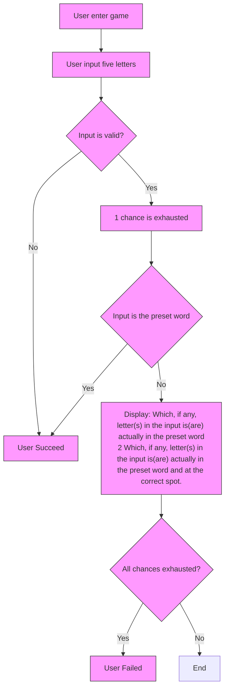
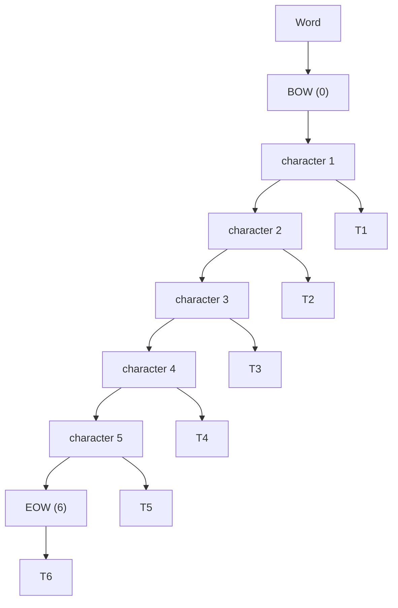
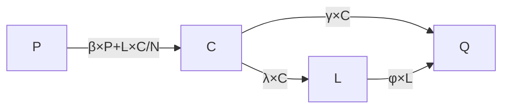

## Viral Spread Characteristics and Difficulty Determinants of Wordle Modeling Based on Differential Equations and K-nearest Neighbors

Recently, Wordle, a puzzle game, has been spreading widely around the world and has a high level of buzz on social media such as Twitter. Understanding the spread mechanism of the Wordle craze and the factors influencing the difficulty of the game may shed some light on important issues such as understanding the viral spread in the Internet era and the way the human brain associates words.

We developed an epidemiology-like differential equation model describing the variation in the total number of reports based on the SIR model and fitted the model using a genetic algorithm to minimize the MSE. We then used the fitted model to make a point forecast of the total number of reports on March 1, 2023. To obtain confidence intervals for the predictions, we used the Bootstrap method. To improve the speed of fitting the Bootstrap sample, we used the computationally faster Nelder-Mead method, based on the same initial parameters optimized by a genetic algorithm. The 1000 Bootstrap estimates were arranged from smallest to largest, and the 25th and 975th estimates were selected as the lower and upper bounds of the prediction interval.

Two characteristic lexical internal features are built in this paper. We define regularity and purity (negentropy) features by assuming first-order Markovianity of the occurrence probability of characters in the English lexicon. All indications are that they are indeed related to the difficulty of the lexicon being guessed. Regularities such as the number of repeated characters and the frequency of vocabulary use in everyday life are also used in this paper for prediction and interpretation.

KNN regression has the excellent property of ensuring that the predicted distribution still sums to zero, so we use the KNN regression model to make predictions about the distribution of Wordle scores. The covariance matrix is widely used in this paper for initial selection of variables and determining the relationship between variables. In KNN regression, we use the covariance matrix to select independent variables that are significantly correlated with the distribution and use cross-validation to select the optimal independent variables and K values. To predict the future distribution of scores for a particular puzzle word, we again used the bootstrap method to obtain 95% confidence intervals.

We used the median scores of Wordle players to measure the difficulty of the words in the puzzle, classifying the difficulty as ‘easy’, ‘normal’, and ‘hard’. We initially screened features that were significantly correlated with difficulty based on the covariance matrix, used a KNN classifier to classify the features based on the initial screening, and selected the K value with the highest prediction accuracy after cross-validation. The results show that the features can effectively predict the difficulty classification of words. For the prediction of word difficulty, we used the KNN classifier and the difficulty-related features we established to assign them to existing categories.

In further exploration of the data, our most important finding is that the variation in the percentage of Hard Mode shows a high degree of similarity to the variation in the faithful players assumed in our initially built contagion-like model, which somewhat corroborates the soundness of our model.

## Contents

## Letter 2

## 1 Introduction 4

1.1 Background and Question Restatement 4

## 2 Preparation for modeling 5

2.1 Assumptions . . 5  
2.2 Notations . . 5  
2.3 Data Cleaning . . 6

## 3 Word Feature Engineering 6

3.1 Regularity . . . 6  
3.2 Purity . . . 7  
3.3 Repetition 8  
3.4 Frequency . . . 9  
3.5 Feature Generation 9

## 4 Modeling the Number of Reported Results 9

4.1 Intuition: What is in the Trend 9  
4.2 Terminology and Assumptions . . 10

4.2.1 Terminology . . . 10  
4.2.2 Assumptions 10

4.3 From SIR Model to Our PCQL Model 11

4.3.1 Review of SIR Model . 11  
4.3.2 Our PCQL Model . 11

4.4 Model Fitting and Prediction 12

## 5 Is Word Itself affect Hard Mode Ratio 13

5.1 It Seems to Be True . . 13  
5.2 It is Very Likely Not True . . . 15

## 6 Predicting Score Distribution 15

6.1 KNN Regression 16  
6.2 Feature Selection and Parameter Tuning . . 16  
6.3 Predicting and Bootstrapping . . 18

## 7 Difficulty Classification 20

7.1 Difficulty Evaluation . . 20  
7.2 Difficulty Prediction 20

## 8 Other Interesting Insights 21

## References 24

## Letter

To: Puzzle Editor of the New York Times

From: Team 2307166

Date: February 1st, 2023

Subject: Re: On Our Puzzle Game, Wordle

Dear Editor,

Thank you for your letter asking for information about your famous Wordle game. Considering that it is a popular puzzle game worldwide, the analysis of its popularity trends and dissemination mechanism, as well as its word difficulty, is important not only for your company, but also for the dissemination of Internet trends in general and for the understanding of human language.

First, the number of Wordle game scores uploaded on Twitter fits well with the traditional epidemic spread model; the difference is that epidemic patients eventually lose their ability to spread, while a fraction of Wordle players become veteran players who continue to play Wordle and spread related information. If the number of results on Twitter is a true reflection of Wordle’s hotness, then our epidemiology-like model tells us that Wordle has entered the tail end, or plateau, of its life cycle; for example, we predict that the number of reports for March 1, 2023 is included in the interval [11173.04,17069.15] at a 95% confidence level; we know from the model that in order to continue its spreading ability, you should broaden the user base - which, of course, is difficult; or you can try to increase the stickiness of loyal users to continue the life of the game: for example, by adding special events to develop user habits and slow down the exit of old users.

Regarding the issue of Hard Mode player ratio you mentioned; we conclude that the attributes of words do not affect this ratio. Since players should not know the information about the word of the day until they try the game every day; and since the evolution of loyal players in our model is similar to the trend of this ratio, it may mean that the change in this ratio can be explained by the life cycle of the game alone. There may be some teams that believe that certain specific indicators of difficulty are related to this proportion, but that is likely because there is an overall trend in those characteristics over time, as is the case with the proportion of Hard Mode players, so statistical tools such as regression may misidentify this trend over time as a direct relationship between the two.

You have also asked us to predict the distribution of results for specific dates and spe cific words. Based on our experiments, the effect of considering the date factor is not signif icant, so we use only word information: we average the outcome distributions of a number of words that are similar to the words you wish to predict as the predicted outcome. The exact number of words to average and how the factors for evaluating similarity are cho sen is determined by the machine through some testing methods. By assuming that the tweet data is representative, we determine the prediction interval by some special statistical methods. For example, our distribution estimate for the word EERIE is (0.20 4.87 23.55 35.36 23.75 9.94 2.33). The prediction interval is around 5% above and below the predicted value - depending on the specific number of attempts. The uncertainty in our predictions lies mainly in the fact that we do not deal with changes in player structure - according to our class epidemiological model, the proportion of loyal players may increase, which might make changes in the number of attempts for the same words half a month later.

We believe that the distribution of the number of guesses people make is an important indicator of the difficulty of a word. We therefore classify word difficulty accordingly into three categories: easy, moderate and difficult. By doing something similar to the previous paragraph, we can predict the difficulty of new words; for example, we consider EERIE to be of average difficulty. The number of repeated letters, weighted purity and weighted regularity are related to the difficulty rating, with the first two positively correlated and the last two negatively correlated. The latter two are statistical indicators that we designed to measure the difficulty properties of words.

In addition to the issues you were interested in earlier, there are also some other insights, that may be useful to you:

We found an increasing temporal trend in the proportion of challenge mode reports, which is consistent with the assumption of the presence of loyal players established in the model we used to predict the total number of reports in the previous section. In fact, the time trend of the challenge mode reporting ratio is highly similar to the time trend of our hypothetical loyal player ratio, and we have reason to believe that the challenge mode reporting ratio and the number of loyal players have some correlation, which means you can observe the trend of the challenge mode reporting ratio to determine the change of the wordle loyal player ratio and thus optimize your business strategy.

We also found that the distribution of wordle players’ scores has a certain pattern with the difficulty of wordle, in which the percentage of successful guesses from the first to the third attempt is negatively correlated with the difficulty level, while the percentage of successful guesses from the fourth to the seventh or more attempts is positively correlated with the difficulty level. You can summarize the change in difficulty of wordle by observing the change in the distribution of players’ scores.

Choosing words with repeating letters as the wordle significantly reduces the likelihood that a player will guess the wordle on the 1st attempt, which is likely related to the fact that players generally choose to use strategies that do not contain repeating letters as their initial guesses. If you want to reduce the difficulty of the game to attract more players, you can increase the likelihood of players guessing the puzzle by indicating the number of repeating letters in the word at the time of play.

Best,

MCM Team #2307166

## 1 Introduction

## 1.1 Background and Question Restatement

Wordle is a puzzle game in which Players try to solve the puzzle by guessing a fiveletter word in six tries or less, receiving feedback with every guess. The flow is shown in Figure 1.

flowchart

Figure 1: Flow chart of Wordle

We are employed by the New York Times to use only the data they send us to analyze and answer following questions.

## Question 1 Question 1 consists of two sub-questions:

1. How does the date and other factors influence the number of reported results? If a certain date is given, how to predict the number of reported results? (A prediction interval is asked)  
2. Is there any attributes of the word itself affect the percentage of scores reported that were played in Hard Mode? (A mechanism analysis is in demand)

Question 2 How to predict the distribution of tries if a certain date and solution word are given? What factors that can influence the result might be omitted? (A prediction interval, or analysis of the predictive ability of the prediction model is needed)

Question 3 How to measure difficulty? How to separate solution words into different groups according to their difficulty? For each group, what is the identity of the words? How to classify new solution words? (Analysis of the predictive ability of the classification model is needed)

Question 4 Find interesting features in the data set!

## 2 Preparation for modeling

## 2.1 Assumptions

Main assumptions are:

Words in English Words in the given data are English words, thereby share some common probabilistic identities with other English words in dictionaries.

Players Prefer Generality Words that look like valid English words are more easily remem bered and given priority for trial.

Model-specific assumptions will be presented in subsequent sections.

## 2.2 Notations

The primary notations used in this paper are listed in Table 1.

Table 1: Notations

<table><tr><td>Symbol</td><td>Definition</td></tr><tr><td> $w_i$ </td><td>word i</td></tr><tr><td> $c_i$ </td><td>character i</td></tr><tr><td> $c_{i,j}$ </td><td>j-th character in word i</td></tr><tr><td> $T_i$ </td><td>transition process i</td></tr><tr><td> $\text{Reg } (w_i)$ </td><td>regularity of word i</td></tr><tr><td> $\text{Irr } (w_i)$ </td><td>irregularity of word i</td></tr><tr><td> $\text{Pur } (w_i)$ </td><td>purity of word</td></tr></table>

## 2.3 Data Cleaning

While examining the dataset we found two types of outliers in the dataset: word lengths that are not 5 and an unusually low number of total reports. Details of the anomalous data are as follows.

<table><tr><td>Date</td><td>Contest number</td><td>Word</td><td>Number of reported results</td></tr><tr><td>2022/12/16</td><td>545</td><td>rprobe</td><td>22853</td></tr><tr><td>2022/11/26</td><td>525</td><td>clen</td><td>26381</td></tr><tr><td>2022/4/29</td><td>314</td><td>tash</td><td>106652</td></tr><tr><td>2022/11/30</td><td>529</td><td>study</td><td>2569</td></tr></table>

To ensure the correctness of the data, we chose to use the removal of anomalous data instead of correction and interpolation.

For KNN regression and classification, to avoid the effect of magnitudes on calculating the distance between observations, we normalized the data according to the following equation.

$$
x _ {i j} ^ {*} = \frac {x _ {i j} - \overline {{x}}}{s d (X _ {j})},
$$

where $x _ { i j }$ is i-th observation of criteria j, $X _ { j }$ is all the observations of criteria j, ??∗ is normalized data. The normalized data had a mean of 0 and a variance of 1.

## 3 Word Feature Engineering

## 3.1 Regularity

In English, valid words usually have regular patterns of form, which are quite hard to capture and formalize by mankind, but it can influence the choices of people when playing Wordle, because those words that are regular may be more familiar to English users.

Assuming that each character’s probabilistic distribution is just determined by its previous character in the word, we try to model the process with a Bi-gram-like[1] chain, which estimate the possibility that one character emerge given that previous one character in the word is known; to make use of the information of the start and end of the word, we made two virtual characters BOW and EOW at the beginning and the end of the word, as described by Figure 2.

Regularity is defined as the geometric mean of the probability of the transfer process of each character to its successor, as described by the formula

$$
\mathrm{Reg} (w _ {i}) = \sqrt [ n ]{\prod_ {j = 1} ^ {n} P (c _ {i , j} \mid c _ {i , j - 1})},
$$

flowchart

Figure 2: Virtual characters and transition processes

in which $P \left( c _ { i } \mid c _ { i - 1 } \right)$ , sometimes also denoted as $P \left( T _ { i } \right)$ in this paper, is used to represent the possibility of transition from character ?? − 1 to character ??.

## 3.2 Purity

If a character in the word is given, how much information can we gain about its succeed ing character? This is a significant factor in Wordle, because the game’s feedback would tell us wether the guessed letter is actually in the word of the day, so if succeeding word is more unpredictable, it will to harder to solve the puzzle.

The purity of a character $c _ { i }$ is defined below:

$$
\operatorname{Pur} \left(c _ {i}\right) = \sum_ {j = 1} ^ {n} P \left(c _ {i + 1} \mid c _ {i}\right) \log \left(P \left(c _ {i + 1} \mid c _ {i}\right)\right),
$$

that $\mathrm { i s } , - \mathrm { E n t r o } \left( c _ { i + 1 } \right)$ , with the assumption from section 3.1 that each character’s prob abilistic distribution is just determined by its previous character in the word.

The higher the purity of a character, the smaller the number of next characters inferred from that character and the higher the probability that some specific character will occur. In other words, the probability of guessing the correct next character is greater, i.e., the uncertainty of the next character is smaller, as shown in Figure 3. The probabilities and purities are generated from 5 letter words from bestwordlist.com[6], without any frequency weighting.

The purity of word ?? is simply defined as

$$
w _ {i} = \sum_ {j = 1} ^ {n} \mathrm{Pur} (c _ {i, j}).
$$

bubble chart

| k |  | nan | nan | nan | nan | nan | nan | nan | nan | nan | nan | nan | nan | nan | nan | nan | nan | nan | nan | nan | nan | nan | nan | nan |
| --- | --- | --- | --- | --- | --- | --- | --- | --- | --- | --- | --- | --- | --- | --- | --- | --- | --- | --- | --- | --- | --- | --- | --- | --- |
| j |  | nan | nan | nan | nan | nan | nan | nan | nan | nan | nan | nan | nan | nan | nan | nan | nan | nan | nan | nan | nan | nan | nan | nan |
| i |  | nan | nan | nan | nan | nan | nan | nan | nan | nan | nan | nan | nan | nan | nan | nan | nan | nan | nan | nan | nan | nan | nan | nan |
| h |  | nan | nan | nan | nan | nan | nan | nan | nan | nan | nan | nan | nan | nan | nan | nan | nan | nan | nan | nan | nan | nan | nan | nan |
| g |  | nan | nan | nan | nan | nan | nan | nan | nan | nan | nan | nan | nan | nan | nan | nan | nan | nan | nan | nan | nan | nan | nan | nan |
| f |  | nan | nan | nan | nan | nan | nan | nan | nan | nan | nan | nan | nan | nan | nan | nan | nan | nan | nan | nan | nan | nan | nan | nan |

Figure 3: Purity and Succeeding Character

## 3.3 Repetition

The repetition index of words includes two items: the number of repeated letters and the maximum number of repeated letters. Repeated letters are defined as letters that appear more than or equal to 2 times in a word. The number of repeated letters refers to the number of repeated letters in a word. For example, there are no repeated letters except ‘p’ in ‘apple’, so the number of repeated letters in ‘apple’ is 1, while the letters ‘c’ and ‘a’ in ‘cacao’ are repetitive letters, so the number of repeated letters in ‘cacao’ is 2. The maximum number of repeated letters refers to the maximum number of repeated letters in a word. For example, the ‘m’ in ‘mummy’ is repeated 3 times, so the maximum number of repeated letters in ‘mummy’ is 3, ‘c’ and ‘a’ in ‘cacao’ are repeated twice, so the maximum number of repeated letters in cacao is 2, while the maximum number of repeated letters in words without repeating letters and the maximum number of repeated letters are 0.

The effect of word repetition on the difficulty of Wordle is obvious: Wordle will only provide information about whether the answer word contains the input letter and whether the letter is in the correct position, but not whether the letter is repeated or the number of times it is repeated. If the answer word contains duplicate letters, it may mislead the player to try other letters, thus increasing the number of attempts and making Wordle more difficult. At the same time, if the repeated letters are repeated more times, the information about the answer words provided by Wordle will be further reduced, thus increasing the difficulty of Wordle again.

## 3.4 Frequency

It is a reasonable assumption that people will preferentially think of those words in the available word space that they are most familiar with, regardless of whether the choice is constrained by available information, so word frequency in everyday use is a worthwhile factor both for evaluating word difficulty and for predicting the distribution of attempts.

## 3.5 Feature Generation

For word frequency, we simply used a frequency list by Dave Hermit[2], whose corpus sources are movie subtitles

Regularity is trained on a 5-letter word list from bestwordlist.com[6]; both a frequency weighted version and a unweighted version are generated; notably that when training weighted version, log function is used to avoid float underflow, so the frequency of zero are set to 1 to avoid arithmetic problems.

Purity is trained on a some word list with similar method with Regularity.

## 4 Modeling the Number of Reported Results

## 4.1 Intuition: What is in the Trend

To give a thorough picture of how the number of reported results varies, we analyze the trend by hand, and have drawn some simple conclusions.

First, there is no periodicity in the trend that is visible to the naked eye. Given the characteristics of small games, weekly frequency periodicity is possible, but we found no periodicity under weekly frequency when we used the F-test.

The overall trend consists of a relatively steep upward segment and a long-tailed downward segment, and the sequence is rather smooth.

These properties are too obvious to be negligible. The trend satisfies the shape of a typical sequence of the number of infected individuals in a disease epidemic. And speaking in terms of mechanism, the spread of the behavior of playing Wordle and sharing scores can be very viral, so we take a epidemiology-like approach to model the process.

scatterplot

| Date       | TotalNumber |
| ---------- | ----------- |
| Jan 2022   | ~80000      |
| Apr 2022   | ~350000     |
| Jul 2022   | ~100000     |
| Oct 2022   | ~30000      |
| Jan 2023   | ~10000      |

Figure 4: Number of Reported Scores and the Fitted Curve of Our Model

## 4.2 Terminology and Assumptions

## 4.2.1 Terminology

We define terminologies of this section as follows:

TP Twittering Playing: the behavior of playing Wordle and twittering about it;

TPer those who choose to do TP.

## 4.2.2 Assumptions

Consistency of Behavior TPers do TP everyday, and non-TPers, including those who transformed from TPers, never do TP.

Viral Marketing the probability of non-TPers transforming into TPers is determined by the number of TPers they may contact with.

Potential Customers while some non-TPers have the possibility to transform into TPers, other non-TPers may not be possible to become TPers. The number of initial potential customers is represented with ?? in this section.

No Return non-TPers transformed from TPers will never become TPers again.

## 4.3 From SIR Model to Our PCQL Model

## 4.3.1 Review of SIR Model

A basic SIR Model consists of a system of four differential equations[3]:

$$
\begin{array}{l} \frac {\mathrm{d} S (t)}{\mathrm{d} t} = \frac {- \beta \times S (t) \times I (t)}{N}, \\ \frac {\mathrm{d} I (t)}{\mathrm{d} t} = \frac {- \beta \times S (t) \times I (t)}{N} - \gamma \times I (t), \\ \frac {\mathrm{d} R (t)}{\mathrm{d} t} = \gamma \times I (t), \\ \end{array}
$$

where S means the susceptible population; I means the infected population; and R is the recovered population. This can match our question pretty well because we can deem S as target customers, I as score sharers, and R as those who tried and had been tired with this behavior.

However, there is still something different from epidemics: although most players sharing their scores might be just catching up with fashion, not all the score sharers would be cured quickly; some people sharing the score would pick up the habit and take playing the game and sharing the score as their daily tasks. So we are going to add something new in the SIR model.

## 4.3.2 Our PCQL Model

Our PCQL Model is an ODE model with 4 variables and 4 parameters, that are:

Variable P(otential) those who might become TPers, have chance to become the Crowd.

Variable C(rowd) normal TPers who will get bored quickly; a fraction of them will become the Quitted or the Loyal everyday.

Variable Q(uitted) those who tired with the game or uploading scores.

Variable L(oyal) those who would not easily giving up TP.

Parameter $\beta$ (Participation Factor) (participation refers to participation in TP), representing the attractiveness of TP to the Potentials, the number of people attracted and participating in unit time at moment t is $\frac { \beta \times P ( t ) \times ( C ( t ) + L ( t ) ) } { N }$

Parameter ?? (Boredom Coefficient) representing the rate at which people who have been attracted to do TP get bored with TP, the number of people who have been TPers becoming the Quitted in unit time at moment t is $\gamma \times C ( t )$ .

Parameter ?? (Conversion Factor) representing the possibility of the Crowd TPers becoming the Loyal TPers; the number of TPers at the moment of t who are converted into loyal TPers per unit time is $\lambda \times C ( t )$ .

Parameter $\phi$ (Loyal Player Boredom Coefficient) representing the rate at which Wordle’s loyal TPers get bored of TP, the number of loyal TPers who will no longer do TP in unit time at moment t is $\phi \times L ( t )$ .

flowchart

Figure 5: Average Transition Quantity per Time Step

Figure 5 gives an intuitional impression of the model.

$$
\begin{array}{l} \frac {\mathrm{d} P (t)}{\mathrm{d} t} = \frac {- \beta \times P (t) \times (C (t) + L (t))}{N}, \\ \frac {\mathrm{d} C (t)}{\mathrm{d} t} = \frac {\beta \times P (t) \times (C (t) + L (t))}{N} - \gamma \times C (t) - \lambda \times C (t), \\ \frac {\mathrm{d} Q (t)}{\mathrm{d} t} = \gamma \times C (t), \\ \frac {\mathrm{d} L (t)}{\mathrm{d} t} = \lambda \times C (t) - \phi \times L (t). \\ \end{array}
$$

## 4.4 Model Fitting and Prediction

The model uses MSE as the loss function to estimate the model parameters. since the formal solution of the system of differential equations is difficult to compute and therefore cannot be estimated by least squares using conventional methods, only the numerical solution of the differential equations can be computed directly and the MSE is minimized using an optimization algorithm. at the same time, the differential equations cannot be used to compute the prediction intervals using conventional algorithms, so we use the Bootstrap method to obtain the point predictions and prediction intervals.

The Bootstrap method requires a large number of calculations, and the time cost of fitting using the optimization algorithm is high, so we choose the Nelder-Mead method, which is computationally faster. Since the Nelder-Mead algorithm requires specifying an initial solution for the function, we first use the genetic algorithm[5] to obtain a relatively good initial solution, and then use the Nelder-Mead method to select the parameters that minimize the MSE, and the initial parameters obtained by the genetic algorithm are shown in the following table. The curve of the model from this set of parameters can be seen in Figure 4.

<table><tr><td> $\beta$ </td><td> $\gamma$ </td><td> $\lambda$ </td><td> $\phi$ </td></tr><tr><td>1.77e-01</td><td>1.77e-02</td><td>1.04e-03</td><td>1.14e-03</td></tr></table>

1000 Bootstrap samples were generated, and within each sample the initial parameters obtained using the genetic algorithm were used as the initial solution of the Nelder-Mead method, fitted to minimize the parameters of the MSE and to predict the number of reports on March 1, 2023, to obtain 1000 Bootstrap predictions. The obtained predicted values were arranged in ascending order and the predicted values at the 2.5% and 97.5% quartiles were selected as the upper and lower bounds of the 95% prediction interval. The obtained prediction intervals were as follows.

<table><tr><td>Mean</td><td>2.5%</td><td>97.5%</td></tr><tr><td>14689.9</td><td>11173.04</td><td>17069.15</td></tr></table>

We therefore estimate that the number of reports for March 1, 2023 is included in the interval [11173.04,17069.15] at a 95% confidence level.

## 5 Is Word Itself affect Hard Mode Ratio

## 5.1 It Seems to Be True

We use the covariance matrix to identify the variables that affect the percentage of players participating in the Hard Mode. We counted the correlation coefficients between the seven attributes corresponding to words: word frequency, weighted purity, unweighted purity, weighted regularity, unweighted regularity, number of repeated letters and maximum number of letter repetitions and the percentage of players participating in the Hard Mode, and the results are shown in Figure 6.

The covariance matrix shows that none of the attributes of the words, except for weighted regularity and unweighted regularity, are significantly correlated with the percentage of players participating in the Hard Mode. Since players do not know the words before they play the Wordle, it is reasonable that most of the attributes of the words are not significantly correlated with the percentage of players participating in the Hard Mode.

The relatively significant correlation between weighted and unweighted regularity on the percentage of participants in the Hard Mode seems to imply that the attributes of the Wordle can influence the percentage of participants in the Hard Mode to some extent. However, we ran separate linear regressions on the percentage of participation in the mode using weighted regularity and unweighted regularity, and the results are shown in the following table.

line chart

| Group | HardRatio | freq | Entro_weighted | Entro_unweighted | Reg_weighted | Reg_unweighted | RepNumber | MaxRepTimes |
| --- | --- | --- | --- | --- | --- | --- | --- | --- |
| 1 | 0.05 | -0.040 | -0.058 | -0.019 | -0.149** | -0.116* | 0.087 | 0.074 |
| 2 | 0.10 | -0.06 | -0.029 | -0.009 | 0.409*** | 0.127* | 0.030 | 0.039 |
| 3 | 0.125 | -0.08 | -0.04 | 0.746*** | 0.006 | 0.025 | 0.061 | 0.089 |
| 4 | 0.25 | -1.0 | -0.075 | 0.680*** | -0.011 | 0.084 | -0.193*** | -0.167** |
| 5 | 0.35 | -1.25 | -1.15 | 0.680*** | -0.152** | -0.135* | -0.152** | -0.135* |
| 6 | 0.45 | -1.5 | -1.35 | 0.680*** | -0.193*** | -0.167** | 0.926*** | 0.926*** |
| 7 | 0.55 | -1.75 | -1.55 | 0.680*** | -0.193*** | -0.167** | 0.926*** | 0.926*** |
| 8 | 0.65 | -2.0 | -1.75 | 0.680*** | -0.193*** | -0.167** | 0.926*** | 0.926*** |
| 9 | 0.75 | -2.25 | -1.95 | 0.680*** | -0.193*** | -0.167** | 0.926*** | 0.926*** |
| 10 | 0.85 | -2.5 | -2.15 | 0.680*** | -0.193*** | -0.167** | 0.926*** | 0.926*** |
| 11 | 0.95 | -2.75 | -2.35 | 0.680*** | -0.193*** | -0.167** | 0.926*** | 0.926*** |
| 12 | 1.05 | -3.0 | -2.55 | 0.680*** | -0.193*** | -0.167** | 0.926*** | 0.926*** |
| 13 | 1.15 | -3.25 | -2.75 | 0.680*** | -0.193*** | -0.167** | 0.926*** | 0.926*** |
| 14 | 1.25 | -3.5 | -2.95 | 0.680*** | -0.193*** | -0.167** | 0.926*** | 0.926*** |
| 15 | 1.35 | -3.75 | -3.15 | 0.680*** | -0.193*** | -0.167** | 0.926*** | 0.926*** |
| 16 | 1.45 | -4.0 | -3.35 | 0.680*** | -0.193*** | -0.167** | 0.926*** | 0.926*** |
| 17 | 1.55 | -4.25 | -3.55 | 0.680*** | -0.193*** | -0.167** | 0.926*** | 0.926*** |
| 18 | 1.65 | -4.5 | -3.75 | 0.680*** | -0.193*** | -0.167** | 0.926*** | 0.926*** |
| 19 | 1.75 | -4.75 | -3.95 | 0.680*** | -0.193*** | -0.167** | 0.926*** | 0.926*** |

Figure 6: Covariance Matrix

Table 5: Regression Results of Hard Mode Percentage on Weighted Regularity

<table><tr><td></td><td>Estimate</td><td>Std.Error</td><td>t value</td><td>Pr(&gt;|t|)</td><td></td></tr><tr><td>(Intercept)</td><td>0.082177</td><td>0.00274</td><td>29.987</td><td>&lt;2e-16</td><td>***</td></tr><tr><td>Reg_weighted</td><td>-0.021913</td><td>0.007788</td><td>-2.814</td><td>0.00517</td><td>**</td></tr><tr><td>Multiple R-squared: 0.02212</td><td></td><td></td><td></td><td></td><td></td></tr><tr><td>Adjusted R-squared: 0.01933</td><td></td><td></td><td></td><td></td><td></td></tr></table>

Table 6: Regression results of Hard Mode Percentage on Unweighted Regularity

<table><tr><td></td><td>Estimate</td><td>Std.Error</td><td>t value</td><td>Pr(&gt;|t|)</td><td></td></tr><tr><td>(Intercept)</td><td>0.082177</td><td>0.00274</td><td>29.987</td><td>&lt;2e-16</td><td>***</td></tr><tr><td>Reg_unweighted</td><td>-0.148223</td><td>0.067780</td><td>-2.187</td><td>0.0294</td><td>**</td></tr><tr><td colspan="6">Multiple R-squared: 0.01348</td></tr><tr><td colspan="6">Adjusted R-squared: 0.01066</td></tr></table>

The R2 and Adjust R2 of the weighted regularity versus Hard Mode percentage regression model are only 0.022 and 0.019, while the R2 and Adjust R2 of the unweighted regularity versus Hard Mode percentage regression model are only 0.013 and 0.011, which represents that the weighted regularity explains only about 2% of the change in challenge mode percentage, while the unweighted regularity explains only about 2% of the change in Hard Mode The unweighted regularity explains only about 1.2% of the variation in the percentage of the Hard Mode, which is not strong enough to explain. In addition, the regression coefficient of weighted regularity is -0.022 and the regression coefficient of unweighted regularity is -0.01, while the weighted regularity of the observed samples in the dataset is 95% concentrated in the range of 0.081 to 0.612 and the unweighted regularity is 95% concentrated in the range of 0.041 to 0.109, which means that the extreme changes in weighted regularity and unweighted regularity in the dataset have an average effect on the percentage of Hard Mode of only 1%. This means that the average effect of extreme changes in weighted and unweighted regularity on the percentage of challenge patterns in the data set is only 1%, which is not significant compared to the average value of 7.52% for the percentage of challenge patterns.

## 5.2 It is Very Likely Not True

In addition to the lack of explanatory power, the significant correlation is most likely due to the pseudo-regression. The following table shows the results of the regressions of weighted regularity and percent Hard Mode on time.

Table 7: Regression Results of Hard Mode Percentage on Time

<table><tr><td></td><td>Estimate</td><td>Std.Error</td><td>t value</td><td>Pr(&gt;|t|)</td><td></td></tr><tr><td>(Intercept)</td><td>-2.893e-04</td><td>1.751e-03</td><td>-0.165</td><td>0.869</td><td>***</td></tr><tr><td>Date</td><td>1.988e-04</td><td>4.453e-06</td><td>44.655</td><td>&lt;2e-16</td><td>***</td></tr><tr><td colspan="6">Multiple R-squared: 0.8507</td></tr><tr><td colspan="6">Adjusted R-squared: 0.8503</td></tr></table>

Table 8: Regression Results of Weighted Regularity on Time

<table><tr><td></td><td>Estimate</td><td>Std.Error</td><td>t value</td><td>Pr(&gt;|t|)</td><td></td></tr><tr><td>(Intercept)</td><td>0.3814810</td><td>0.0305641</td><td>12.481</td><td>&lt;2e-16</td><td>***</td></tr><tr><td>Date</td><td>-1.668e-04</td><td>7.77e-05</td><td>-2.146</td><td>0.0325</td><td>*</td></tr><tr><td colspan="6">Multiple R-squared: 0.01299</td></tr><tr><td colspan="6">Adjusted R-squared: 0.01017</td></tr></table>

The regression results indicate that the Hard Mode percentage is positively correlated with time, while the weighted regularity is negatively correlated with time, and the negative correlation between them is most likely caused by the time trend rather than the existence of a causal relationship between them.

In summary, we conclude that the significant correlation between weighted regularity and unweighted regularity and Hard Mode percentages does not prove that word attributes influence whether players choose the Hard Mode, a finding that is also consistent with our hypothesis above that players do not know the puzzle words before participating in Wordle.

## 6 Predicting Score Distribution

In predicting the distribution of reported scores, we need to ensure that the sum of the scores is equal to 100%, and the K-Nearest-Neighbors Regression method can satisfy this constraint well, so we choose KNN regression to predict the distribution of scores.

scatterplot

| Date       | Hard Number Ratio | Weighted Regularity |
| ---------- | ----------------- | ------------------- |
| Jan 2022   | ~0.04             | ~0.3                |
| Apr 2022   | ~0.06             | ~0.3                |
| Jul 2022   | ~0.08             | ~0.3                |
| Oct 2022   | ~0.10             | ~0.3                |
| Jan 2023   | ~0.11             | ~0.3                |

Figure 7: Time Trend of Hard Mode Report Ratio and Weighted Regularity

## 6.1 KNN Regression

KNN is a typical nonparametric method, the basic idea of which is to calculate the distance between observations in the training set, select the K observations closest to the observations and use the average of their corresponding dependent variables as the fitted values of the model, which is calculated as follows.

$$
\hat {f} (x _ {0}) = \frac {1}{K} \sum_ {x _ {i} \in N _ {0}} (f (x _ {i})),
$$

where $N _ { 0 }$ is the set of the K closest observations to $x _ { 0 } ,$ , and ${ \hat { f } } \left( x _ { 0 } \right)$ is the fitted value of the model.

Since KNN uses the mean value of the dependent variable as the prediction, it ensures that the predicted value obtained after fitting the seven scores to the observations still sums to 100%.

## 6.2 Feature Selection and Parameter Tuning

According to the covariance matrix, we can see that the distribution of guessing scores has a significant correlation with the number of Hard Mode Results, word frequency, the number of repeated letters, the purity of vocabulary, the weighted purity of vocabulary, the regularity of vocabulary, the weighted regularity of vocabulary, and the maximum number of repetitions of repeated letters. It can also be seen that there is a significant correlation between the purity of vocabulary and the weighted purity of vocabulary, the regularity of vocabulary and the weighted regularity of vocabulary, and repeated use may lead to poor prediction; at the same time, since we do not know the data of the number of people in the Hard Mode in the prediction, the prediction result will be unreliable if we use the predicted value of the number of people in the Hard Mode, so we need to conduct further in these five variables filtering. Also, it is known from the idea of KNN method that the choice of K determines the performance of the model. We use the cross-validation method to calculate the prediction errors of KNN models using different independent variables with different K values, and the K value that makes the smallest cross-validation error is used for the model. To ensure a moderate computational effort, we use ten-fold cross-validation.

line chart

| Variable | TotalNumber | ardModeNumb | HardRatio | RepNumber | MaxRepTimes | try1 | tries2 | tried3 | tries4 | tries5 | tries6 | triesX |
| --- | --- | --- | --- | --- | --- | --- | --- | --- | --- | --- | --- | --- |
| 9e-06 | 0.924*** | Corr: | -0.888*** | Corr: | Corr: | Corr: | Corr: | Corr: | Corr: | Corr: | Corr: | Corr: |
| 6e-06 | 0.924*** | Corr: | -0.888*** | Corr: | Corr: | Corr: | Corr: | Corr: | Corr: | Corr: | Corr: | Corr: |
| 3e-06 | 0.924*** | Corr: | -0.888*** | Corr: | Corr: | Corr: | Corr: | Corr: | Corr: | Corr: | Corr: | Corr: |
| 0e+00 | 0.924*** | Corr: | -0.888*** | Corr: | Corr: | Corr: | Corr: | Corr: | Corr: | Corr: | Corr: | Corr: |
| 16000 | 0.924*** | Corr: | -0.888*** | Corr: | Corr: | Corr: | Corr: | Corr: | Corr: | Corr: | Corr: | Corr: |
| 12000 | 0.924*** | Corr: | -0.888*** | Corr: | Corr: | Corr: | Corr: | Corr: | Corr: | Corr: | Corr: | Corr: |
| 8000 | 0.924*** | Corr: | -0.888*** | Corr: | Corr: | Corr: | Corr: | Corr: | Corr: | Corr: | Corr: | Corr: |
| 4000 | 0.924*** | Corr: | -0.888*** | Corr: | Corr: | Corr: | Corr: | Corr: | Corr: | Corr: | Corr: | Corr: |
| 0.10 | 0.924*** | Corr: | -0.761*** | Corr: | Corr: | Corr: | Corr: | Corr: | Corr: | Corr: | Corr: | Corr: |
| 0.05 | 0.924*** | Corr: | -0.761*** | Corr: | Corr: | Corr: | Corr: | Corr: | Corr: | Corr: | Corr: | Corr: |

Figure 8: Covariance Matrix(1)

line chart

| Entro_weighted | ntro_unweight | teg_unweight | Reg_weighted | freq | try1 | tries2 | tried3 | tries4 | tries5 | tries6 | triesX |
| --- | --- | --- | --- | --- | --- | --- | --- | --- | --- | --- | --- |
| 0.5 | 0.746*** | 0.025 | 0.006 | -0.029 | 0.138** | 0.270*** | 0.271*** | 0.014 | -0.243*** | -0.257*** | -0.081 |
| 1.4 | 0.746*** | 0.025 | 0.006 | -0.029 | 0.138** | 0.270*** | 0.271*** | 0.014 | -0.243*** | -0.257*** | -0.081 |
| 13 | 0.746*** | 0.025 | 0.006 | -0.029 | 0.138** | 0.270*** | 0.271*** | 0.014 | -0.243*** | -0.257*** | -0.081 |
| 12 | 0.746*** | 0.025 | 0.006 | -0.029 | 0.138** | 0.270*** | 0.271*** | 0.014 | -0.243*** | -0.257*** | -0.081 |
| 11 | 0.746*** | 0.025 | 0.006 | -0.029 | 0.138** | 0.270*** | 0.271*** | 0.014 | -0.243*** | -0.257*** | -0.081 |
| 13 (top) | 0.746*** | 0.025 | 0.006 | -0.029 | 0.138** | 0.270*** | 0.271*** | 0.014 | -0.243*** | -0.257*** | -0.081 |
| 12 (bottom) | 0.746*** | 0.025 | 0.006 | -0.029 | 0.138** | 0.270*** | 0.271*** | 0.014 | -0.243*** | -0.257*** | -0.081 |
| 11 (top) | 0.746*** | 0.025 | 0.006 | -0.029 | 0.138** | 0.270*** | 0.271*** | 0.014 | -0.243*** | -0.257*** | -0.081 |
| 13 (bottom) | 0.746*** | 0.025 | 0.006 | -0.029 | 0.138** | 0.270*** | 0.271*** | 0.014 | -0.243*** | -0.257*** | -0.081 |
| 12 (top) | 0.746*** | 0.025 | 0.006 | -0.029 | 0.138** | 0.270*** | 0.271*** | 0.014 | -0.243*** | -0.257*** | -0.081 |
| 11 (bottom) | 0.746*** | 0.025 | 0.006 | -0.029 | 0.138** | 0.270*** | 0.271*** | 0.014 | -0.243*** | -0.257*** | -0.081 |

Figure 9: Covariance Matrix(2)

Before performing the fit, to remove the effect of the magnitude on the distance between observations, we standardized the independent variables using the following equation, standardizing the mean of each independent variable to 0 and the variance to 1.

$$
X _ {i} ^ {*} = \frac {X _ {i} - \overline {{X}}}{s d (X)}
$$

The cross-validation results are shown in Figure 10.

line chart

| K   | Both!Hard | Both&Hard | UnW!Hard | UnW&Hard | W!Hard | W&Hard |
|-----|-----------|-----------|----------|----------|--------|--------|
| 0   | 17.5      | 17.2      | 17.0     | 17.8     | 16.8   | 16.5   |
| 5   | 13.5      | 13.8      | 14.0     | 14.5     | 13.2   | 13.0   |
| 10  | 12.8      | 12.9      | 13.0     | 13.2     | 12.5   | 12.4   |
| 15  | 12.6      | 12.7      | 12.9     | 13.0     | 12.3   | 12.2   |
| 20  | 12.5      | 12.6      | 12.8     | 13.0     | 12.2   | 12.1   |
| 25  | 12.4      | 12.5      | 12.7     | 13.0     | 12.1   | 12.0   |
| 30  | 12.3      | 12.4      | 12.6     | 13.0     | 12.0   | 11.9   |
| 35  | 12.2      | 12.3      | 12.5     | 13.0     | 11.9   | 11.8   |
| 40  | 12.1      | 12.2      | 12.4     | 13.0     | 11.8   | 11.7   |
| 45  | 12.0      | 12.1      | 12.3     | 13.0     | 11.7   | 11.6   |
| 50  | 11.9      | 12.0      | 12.2     | 13.0     | 11.6   | 11.5   |

Figure 10: Cross-Validation Results

\*: $\mathbf { \nabla } ^ { \prime } \& ( \mathbf { \nabla } )$ is including, while ‘!’ is excluding; ‘UnW’ is unweighted word features; ‘W’ is word frequency weighted word features.

From the figure, it can be seen that the KNN model using weighted regularity and weighted purity and without the number of challenge patterns performs best at K=15. Therefore, we chose word frequency, number of repeated letters, weighted purity of words, weighted regularity of words, and maximum number of repetitions of repeated letters as model independent variables and set the model K=15. The MSE of the model was 12.35.

## 6.3 Predicting and Bootstrapping

Now we determine each attribute of EERIE.

<table><tr><td>Frequency</td><td>3264</td></tr><tr><td>Weighted Purity</td><td>10.86</td></tr><tr><td>Weighted Regularity</td><td>0.32</td></tr><tr><td>Number of Repeated Word</td><td>1</td></tr><tr><td>Max Times of Repeated</td><td>3</td></tr></table>

The attributes of EERIE were input into the KNN model and their predicted distributions were obtained as shown in the following table.

<table><tr><td>1 try</td><td>2 tries</td><td>3 tries</td><td>4 tries</td><td>5 tries</td><td>6 tries</td><td>X</td></tr><tr><td>0.20</td><td>4.87</td><td>23.55</td><td>35.36</td><td>23.75</td><td>9.94</td><td>2.33</td></tr></table>

We calculated the prediction intervals for the KNN model using the Bootstrap method and obtained the 95% confidence intervals for the predicted values of each score as shown in Figure 11.

bar chart

| tries | 1 | 2 | 3 | 4 | 5 | 6 |
| --- | --- | --- | --- | --- | --- | --- |
|  |  |  |  |  |  |  |
|  |  |  |  |  |  |  |
|  |  |  |  |  |  |  |
|  |  |  |  |  |  |  |
|  |  |  |  |  |  |  |
|  |  |  |  |  |  |  |
|  |  |  |  |  |  |  |
|  |  |  |  | 35 |  |  |
|  |  |  |  | 25 |  |  |
|  |  |  |  | 22 |  |  |
|  |  |  |  | 10 | 9 | 1 |
|  |  |  |  | 5 | 4 | 2 |
|  |  |  |  | 2 | 1 | 1 |
|  |  |  |  | 1 | 0 | 0 |
|  |  |  |  | 0 | 0 | 0 |
|  |  |  |  | 0 | 0 | 0 |
|  |  |  |  | 0 | 0 | 0 |
|  |  |  |  | 0 | 0 | 0 |
|  |  |  |  | 0 | 0 | 0 |
|  |  | 8 | 10 | 10 | 10 | 10 |
|  |  | 8 | 10 | 10 | 10 | 10 |
|  |  | 8 | 10 | 10 | 10 | 10 |
|  |  | 8 | 10 | 10 | 10 | 10 |
|  |  | 8 | 15 | 15 | 15 | 15 |
|  |  | 8 | 15 | 15 | 15 | 15 |
|  |  | 8 | 15 | 15 | 15 | 15 |
|  |  |  |  |  |  |  |
|  |  |  |  |  |  |  |
|  |  |  |  |  |  |  |
|  |  |  |  |  |  |  |
|  |  |  |  |  |  |  |
|  |  |  |  |  |  |  |
|  |  |  |  |  |  |  |
|  |  |  | - | - | - | - |
|  | - | - | - - | - - | - - | - |
|  | - - | - | - - | - - | - - | - |
|  | - - | - | - - | - - | - - | - |
|  | - - | - | - - | - - | - - | - |
|  | - - | - | - - | - - | - - | - |
|  | - - | - | - - | - - | - - | - |
|  | - - | - | - - | - - | - - | - |
|  | - - | - | - - | - - | - - | - |

Figure 11: Predicted tries Distribution for EERIE and 95% Confidence Intervals

It can be seen that the error range of the model is small.

## 7 Difficulty Classification

## 7.1 Difficulty Evaluation

The difficulty of Wordle can be measured by the number of attempts players make to guess the puzzle word, and the higher the number of attempts, the more difficult Wordle is. We can obtain the distribution of the final number of attempts from the dataset, and we define the median number of attempts to measure the difficulty of the wordle. The median number of attempts refers to the number of attempts made by players at 50% of the score distribution to guess the word. The median number of attempts for ‘abbey’ is 5.

Since there are only three words with a median of 6, we combined the words with a median of 6 with those with a median of 5 to obtain three difficulty levels: easy, normal, and hard, which correspond to a median of 3, 4, and 5 or 6, respectively.

## 7.2 Difficulty Prediction

We use the covariance matrix to filter the word attributes corresponding to difficulty, and filter out the number of repeated letters, weighted purity and weighted regularity as attributes related to classification. We use KNN to verify the accuracy of the classification.

  
Figure 12: Covariance Matrix

We used cross-validation to obtain the best K values for KNN using accuracy (i.e., the number of correct predictions as a percentage of all predictions) as the selection criterion, and the results of cross-validation are shown in Figure 13.

We chose K=8 as the parameter, and the prediction accuracy was 75.28%.

We substituted the three data of EERIE and obtained the prediction result that EERIE belongs to the ordinary difficulty. Based on the cross-validation error of the model at K=8, we consider the accuracy of this prediction to be about 75.28%, with an accuracy interval of [63.16%,82.76%].

line chart

| k    | Precise |
| ---- | ------- |
| 1.0  | 0.695   |
| 2.0  | 0.696   |
| 3.0  | 0.698   |
| 4.0  | 0.700   |
| 5.0  | 0.740   |
| 6.0  | 0.732   |
| 7.0  | 0.750   |
| 8.0  | 0.752   |
| 9.0  | 0.750   |
| 10.0 | 0.748   |

Figure 13: The Results of Cross-Validation

## 8 Other Interesting Insights

As shown in Figure 14, the proportion of Hard Mode in the total number of reports gradually increases as time passes. In fact, this phenomenon is consistent with our PCQL Model, in which we assume that there are loyal TPers, or loyal players, and that the proportion of loyal players will increase as time passes because loyal players are much less likely to quit playing than regular players, as shown in Figure 15. We can assume that the proportion of loyal players prefers challenges, so the increase in the proportion of Hard Mode reflects the increase in the proportion of loyal players to some extent.

The proportion of words guessed in the riddle on the 4th time is the cut-off for vocabulary difficulty. The covariance matrix shows that as the indicator positively correlated with difficulty increases, the proportion of riddles that are guessed the 4th to 7th time increases and the proportion of riddles that are guessed the 1st to 3rd time decreases.

As shown in the figure below, the proportion of players guessing correctly on the first try is positively correlated with the total number of reported scores, which may be due to the fact that as the number of reports increases, the probability of people knowing the puzzle in advance from social media increases, thus leading to a positive correlation between the proportion of first guesses and the total number of reported scores. At the same time, the proportion of players' first guesses was significantly negatively correlated with the number of puzzle words with repeating letters, reflecting the possible strategy of using words that do not have repeating letters as initial guesses when players play wordle, as this eliminates as many incorrect letters and positions as possible.

line chart

| Date       | HardRatio |
| ---------- | --------- |
| Jan 2022   | 0.02      |
| Apr 2022   | 0.06      |
| Jul 2022   | 0.08      |
| Oct 2022   | 0.09      |
| Jan 2023   | 0.10      |

Figure 14: The Proportion of Hard Mode in the Total Number of Reports

area chart

| Date       | L     | C     |
| ---------- | ------- | ------- |
| Jan 2022   | ~350000 | ~350000 |
| Apr 2022   | ~150000 | ~150000 |
| Jul 2022   | ~50000  | ~50000  |
| Oct 2022   | ~20000  | ~20000  |
| Jan 2023   | ~10000  | ~10000  |

Figure 15: The Proportion of Ls in TPs in Our Model with Parameters as Previous Mentioned

scatterplot

| 0.926*** | 0.926*** | -0.222*** | -0.351*** | Corr: -0.351*** | Corr: -0.419*** | Corr: -0.092 | Corr: 0.409*** | Corr: 0.337*** | Corr: 3 tres | Corr: x tres |
| --- | --- | --- | --- | --- | --- | --- | --- | --- | --- | --- |
| -0.219*** | -0.219*** | -0.319*** | -0.354*** | Corr: -0.354*** | Corr: -0.354*** | Corr: -0.031 | Corr: 0.345*** | Corr: 0.263*** | Corr: 3 tres | Corr: x tres |
| 0.619*** | 0.619*** | 0.619*** | 0.336*** | Corr: 0.336*** | Corr: 0.336*** | Corr: -0.267*** | Corr: -0.424*** | Corr: -0.216*** | Corr: 3 tres | Corr: x tres |
| 0.754*** | 0.754*** | 0.754*** | -0.153** | Corr: -0.153** | Corr: -0.792*** | Corr: -0.586*** | Corr: -0.890*** | Corr: -0.880*** | Corr: 3 tres | Corr: x tres |
| 0.340*** | 0.340*** | 0.340*** | -0.890*** | Corr: -0.890*** | Corr: -0.890*** | Corr: -0.513*** | Corr: -0.647*** | Corr: -0.647*** | Corr: 3 tres | Corr: x tres |

Figure 16: Covariance Matrix

line chart

| TotalNumber | try1 |
| ----------- | ---- |
| 0           | 0.25 |
| 1e+05       | 0.50 |
| 2e+05       | 0.75 |
| 3e+05       | 1.00 |

Figure 17: The Proportion of Guessing Correctly on the First Try and the Total Number of Reported Scores

## References

[1] Markov A. A. “An Example of Statistical Investigation of the Text Eugene Onegin Concerning the Connection of Samples in Chains.” In: Science in Context 19 (2007), pp. 591–600. ISSN: 1474-0664.  
[2] Hermit Dave. GitHub - hermitdave/FrequencyWords: Repository for Frequency Word List Generator and processed files. GitHub. URL: https://github.com/hermitdave/FrequencyWords (visited on 02/18/2023).  
[3] W. O. Kermack and A. G. McKendrick. “A Contribution to the Mathematical Theory of Epidemics.” In: Proceedings of the Royal Society of London. Series A, Containing Papers of a Mathematical and Physical Character 115.772 (1927), pp. 700–721. ISSN: 09501207.  
[4] R Core Team. R: A Language and Environment for Statistical Computing. R Foundation for Statistical Computing. Vienna, Austria, 2022. URL: https://www.R-project.org/.  
[5] Luca Scrucca. “GA: A Package for Genetic Algorithms in R”. In: Journal of Statistical Software 53.4 (2013), pp. 1–37. DOI: 10.18637/jss.v053.i04.  
[6] Word Lists - 5-Letter Words. URL: https://www.bestwordlist.com/5letterwords.htm (visited on 02/18/2023).