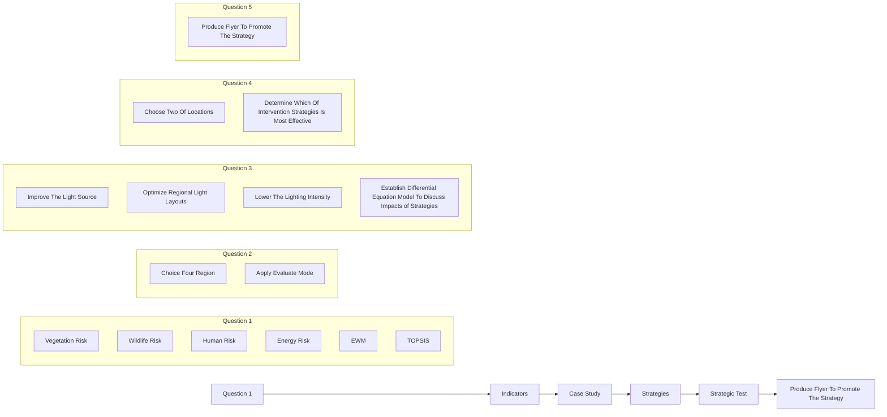
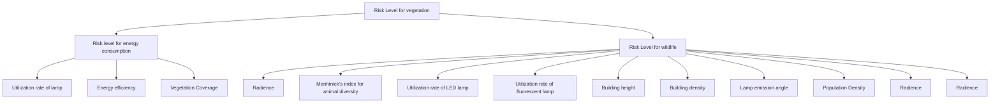
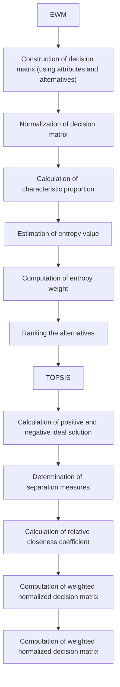
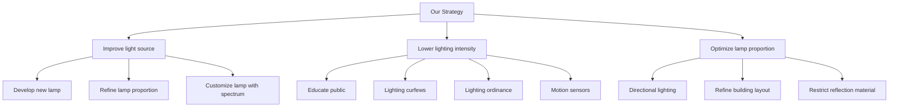

# Protect the Night, Control the Light!

Summary

People generally are struck by the ’beauty’ of city lights without realizing that these are also images of pollution, like admiring the beauty of the rainbow colours that gasoline produces in water and not recognising that it is chemical pollution. In this paper, we construct a broadly applicable Light Pollution Risk Assessment Model to assess the risk level of a given location, and propose an Intervention Strategy Model to mitigate the effects of light pollution in various locations.

For Task 1, we propose a Light Pollution Risk Assessment Model. The model integrates risks from four dimensions: humans, wildlife, plants, and energy waste caused by light pollution. Considering multiple related indicators, EWM-TOPSIS is applied to solve the overall risk score, which is divided into four levels: fragile(0-1), poor(1-2), ordinary(2-3), and good(3-4).

For Task 2, the Light Pollution Risk Assessment Model is applied to four typical regions in Shenzhen, representing urban, suburban, rural, and protected areas. In the data preparation phase, we use nighttime remote sensing and multi-spectral remote sensing data to estimate the Normalized Difference Vegetation Index (NDVI), nighttime radiance, and population density in the study areas. The protected area has a risk score of 0.357992, while the rural community has a risk score of 1.859474, the suburban community has a risk score of 2.114942, and the urban community has a risk score of 3.19662. These scores correspond to the fragile, poor, ordinary, and good levels, respectively.

For Task 3, we develop three intervention strategies including improving the light source, lowering the lighting intensity and optimizing regional light layouts. Then we list multiple specific actions for each strategy. Intervention Strategy Model based on Differential Equation is established to quantify how three strategies impact the risk level.

For Task 4, we select urban and suburban communities to verify the effectiveness of the three intervention strategies. Over the next 50 years, the risk scores after the implementation of the three strategies are reduced by approximately 2%, 6%, and 3% respectively. It can be concluded that the second strategy, lowering the lighting intensity that aims to reduce the total amount of light radiance is the most effective intervention strategy for both urban and suburban areas.

Finally, the sensitivity analysis of the risk assessment model shows that the fluctuation of a single evaluation indicator by -10% - 10% has a reasonable impact on the final risk score shown in Figure 16. Therefore, the model is robust to changes in a single indicator. Besides, the sensitivity analysis of the Strategy Model shown in Figure 17 means that our model is robust to the growth rate.

Keywords: Light Pollution; Intervention strategies; EWM-TOPSIS; Differential Equation

## Contents

## 1 Introduction 3

1.1 Problem Background . 3  
1.2 Restatement of the Problem 4  
1.3 Our Work . . 4

## 2 Assumptions and Explanations 4

## 3 Notations 5

## 4 Task 1: Regional Light Pollution Risk Level Metric 6

4.1 Problem Description and Analysis . . . 6  
4.2 Indicator selection . . . 6  
4.3 Light Pollution Risk Evaluation Model based on EWM-TOPSIS 8

4.3.1 EWM-TOPSIS 8  
4.3.2 Model establishment . 10

## 5 Task 2: Metric Application and Result Interpretation 11

5.1 Data Preparation 11  
5.2 Metric Application and Result Interpretation 13

## 6 Task 3: Intervention Strategies and Specific Actions 14

6.1 Strategy 1: Improve the light source 14  
6.2 Strategy 2: Lower the lighting intensity . . . . 16  
6.3 Strategy 3: Optimize regional lighting layouts 17

## 7 Task 4: Strategy Determination and Impacts Evaluation 18

7.1 Strategy Implementation and Impacts Evaluation 18  
7.2 Strategy Determination . . . . 20

## 8 Sensitivity Analysis 20

8.1 Evaluation model sensitivity . . . 20  
8.2 Strategy model sensitivity . . . 21

## 9 Strength and Weakness 21

9.1 Strength 21  
9.2 Weakness . . 22

## 10 Conclusion 22

## 11 Flier 23

## References 24

## 1 Introduction

## 1.1 Problem Background

Looking at the International Space Station’s images of the Earth at night, people generally are struck by the ’beauty’ of city lights, as if they were lights on a Christmas tree, without realizing that these are also images of pollution. It is like admiring the beauty of the rainbow colours that gasoline produces in water and not recognising that it is chemical pollution.

The inappropriate or excessive use of artificial light, known as light pollution, can have serious environmental consequences for humans, wildlife, and our climate. Components of light pollution include:

• Light trespass: light falling where it is not intended or needed  
• Over-illumination: lighting intensity higher than that which is appropriate  
• Light cluster: bright, confusing and excessive grouping of light sources

The impacts of light pollution can be far-reaching and varied, affecting both natural and human systems. There is a growing body of evidence that links light pollution to measurable negative impacts on human health, wildlife, and the environment. Some examples of these negative impacts include:

• Harming human health and effecting crime and safety  
• Disrupting the ecosystem and wildlife  
• Increasing energy consumption  
• Affecting astronomical observations

It is important to understand these impacts and to take steps to mitigate them to minimize the negative effects on our environment, health, and economy. There’s a lot of room for improvement - if we light more carefully, we should be able to reduce negative influences, whilst still lighting the ground.

There are several intervention strategies that can be employed to address light pollution, such as using shielded, directional and energy-efficient lighting, enacting lighting ordinances and implementing lighting curfews etc.

natural_image

Nighttime aerial view of a illuminated urban region with city lights, Earth visible in the background (no text or symbols)

(a) Image taken from the International Space Station. (Image credit: NASA)

text_image

Light Trespass
Light where needed

(b) Light trespass falls where it is not needed. (Image credit: Twitter @St Brian)  
Figure 1: Light Pollution Display

## 1.2 Restatement of the Problem

We were asked by COMAP’s Illumination Control Mission (ICM) to promote awareness of the impacts of light pollution and develop intervention strategies to mitigate negative impacts.

Task 1: Address a broadly applicable metric to measure the light pollution risk level of a location, incorporating both human and non-human concerns.  
Task 2: Apply our metric and interpret its results on four diverse types of locations including a protected land location, a rural community, a suburban community, and an urban community.  
Task 3: Outline three possible intervention strategies to address light pollution and discuss specific actions that can be taken to implement each strategy. Consider the potential impacts of these actions on the overall effects of light pollution.  
Task 4: Select two locations and apply the previously developed metric to determine the most effective intervention strategy for each location in addressing light pollution. Discuss how the chosen intervention strategy impacts the risk level for the location.

## 1.3 Our Work

In order to avoid complicated descriptions, intuitively reflect our work process, the flow chart is shown in Figure 2:

flowchart

Figure 2: Flow Chart of Our Work

## 2 Assumptions and Explanations

Considering that practical problems always contain many complex factors, first of all, we need to make reasonable assumptions to simplify the model, and each hypothesis is closely followed by its corresponding explanation:

Assumption 1: We divide the types of lighting fixtures used in the market into LED, fluorescent, and other lighting fixtures.

Explanation: The spectra and energy efficiency of LED and fluorescent lamps are significantly different from those of other lighting fixtures on the market. To simplify the model, we categorize the main types of lighting fixtures into LED, fluorescent, and other lighting fixtures.

Assumption 2: We assume that the indicators that we have not selected in the evaluation model have a small impact on the system.

Explanation: There are too many factors that affect light pollution to consider, so this assumption is reasonable and helps to avoid unnecessary trouble when building the model.

Assumption 3: During the research period of the strategy model, variables such as population density, species richness, vegetation coverage, and the luminous efficiency of various lighting fixtures in different regions and cities remain relatively stable.

Explanation: These variables may experience some fluctuation, but to simplify the model, we ignore these small changes.

Assumption 4: We assume that the four selected regions are representative enough, so the weight coefficients of the evaluation model that we established in previous research can be applied to any location in the world for risk assessment. Explanation:The four regions we selected have typical urban, suburban, rural, and protected area characteristics. To simplify the problem and make the model applicable to any region, the weight coefficients of the model indicators obtained from these four regions can be considered constant.

## 3 Notations

Some important mathematical notations used in this paper are listed in Table 1.

Table 1: Notations used in this paper

<table><tr><td>Symbol</td><td>Description</td></tr><tr><td>L</td><td>Radiance</td></tr><tr><td>PD</td><td>Population Density</td></tr><tr><td>VC</td><td>Vegetation Coverage</td></tr><tr><td>Dmn</td><td>Menhinick&#x27;s index for animal diversity</td></tr><tr><td> $P_F$ </td><td>Utilization rate of fluorescent lamp</td></tr><tr><td> $P_L$ </td><td>Utilization rate of LED lamp</td></tr><tr><td> $P_O$ </td><td>Utilization rate of other kinds of lamps</td></tr><tr><td>Angle</td><td>Lamp emission angle</td></tr><tr><td> $P_M$ </td><td>Utilization rate of high reflective building materials</td></tr><tr><td>H</td><td>Average height of buildings</td></tr><tr><td>BD</td><td>Building density</td></tr><tr><td>R</td><td>Scores of light pollution risk level</td></tr><tr><td> $R_h$ </td><td>Risk for humans</td></tr><tr><td> $R_v$ </td><td>Risk for vegetation</td></tr><tr><td> $R_w$ </td><td>Risk for wildlife</td></tr><tr><td> $R_e$ </td><td>Risk for energy consumption</td></tr><tr><td>η</td><td>Energy efficiency</td></tr></table>

\*There are some variables that are not listed here and will be discussed in detail in each section.

## 4 Task 1: Regional Light Pollution Risk Level Metric

## 4.1 Problem Description and Analysis

Traditionally, people use Sky Quality Meters(SQMs) and remote sensing data to evaluate light pollution levels in a given area.However, neither of them can provide information about the spectral content of the light, resulting in difficulties when studying the impacts of light pollution on ecosystems and wildlife, as different species may have different sensitivities to different wavelengths of light.

We propose a method to combine the light source spectrum and light intensity to calculate the response of the specified biological behavior to the light source spectrum, evaluating the impacts such as plant maturation delayed or accelerated, migration patterns of wildlife affected and human circadian rhythms confused.

To capture ground-level effects which light pollution has on humans, wildlife, vegetation, energy consumption, we take both radiance(brightness) and spectrum into consideration to assess the light pollution risk through the following steps:

Step 1: Investigate sources of light pollution.  
Step 2: Choose a rich and comprehensive set of evaluation indicators.  
Step 3: Assess the light pollution risk of humans, vegetation, wildlife and energy consumption using EWM-TOPSIS Model.  
Step 4: Calculate the final score and classify pollution risks into four levels.

## 4.2 Indicator selection

Some indicators that could be used to measure the risk of light pollution are shown in Figure 3:

flowchart

Figure 3: Indicator selection

## 1. Radiance

Radiance is a measure of the amount of light energy emitted in different directions from a light source. It is used in the field of light pollution research to estimate the luminance of the sky at night, which is an important indicator of light pollution.

Using radiance to estimate luminance is a well-established method in the field of light pollution research, and has been used in numerous studies to assess the impacts of different sources of light on the night sky.

The Luojia 1-01 remote sensing satellite is equipped with a high sensitivity nighttime imaging camera, which can provide nighttime light images at 130-m spatial resolution with a width of 260 km. The spatial resolution of Luojia 1-01 is significantly higher than DMSP/OLS and NPP/VIIRS used in the previous study of light pollution, providing the potential for a detailed investigation of urban light pollution. Luojia 1-01 data can be freely available from the Hubei Data and Application Center of the High-Resolution Earth Observation System (http://www.hbeos.org.cn).

According to the official calibration equation, the Luojia 1-01 image was radiometric calibrated to covert the digital number (DN) value to radiance:

$$
L = D N ^ {3 / 2} \cdot 1 0 ^ {- 1 0} \tag {1}
$$

where L is the radiance $W \cdot \mathrm { m ^ { - 2 } } \cdot \mathrm { s r ^ { - 1 } } \cdot \mu \mathrm { m ^ { - 1 } }$ , DN is the digital number value.

## 2. Building height, density and material

High-rise buildings require more lighting to illuminate their larger surface areas, which can contribute to increased light pollution. In addition, tall buildings can block out natural light, leading to an increased need for artificial lighting.

Higher building density can result in more artificial lighting being used to illuminate buildings, streets, and public spaces. This can lead to increased levels of light pollution in urban areas.

Buildings made from highly reflective materials such as glass can increase the amount of light reflected into the surrounding environment, leading to more light pollution and vice versa.

## 3. Proportions of different types of lamps

According to scientific research, blue light exposure effectively suppressed melatonin secretion, leading to changes in the circadian rhythm; green light inhibited plant growth and development. So we choose two widely used lamp and study the spectrum shown in Figure 4.

line chart

| Wavelength | Count |
| ---------- | ----- |
| 380        | 0.0   |
| 400        | 0.1   |
| 420        | 0.2   |
| 430        | 0.1   |
| 440        | 0.1   |
| 450        | 0.1   |
| 460        | 0.1   |
| 470        | 0.1   |
| 480        | 0.1   |
| 490        | 0.2   |
| 500        | 0.3   |
| 510        | 0.2   |
| 520        | 0.1   |
| 530        | 0.1   |
| 540        | 1.0   |
| 550        | 0.9   |
| 560        | 0.8   |
| 570        | 0.7   |
| 580        | 0.6   |
| 590        | 0.5   |
| 600        | 0.4   |
| 610        | 0.3   |
| 620        | 0.2   |
| 630        | 0.1   |
| 640        | 0.1   |
| 650        | 0.1   |
| 660        | 0.1   |
| 670        | 0.1   |
| 680        | 0.1   |
| 690        | 0.1   |
| 700        | 0.1   |
| 710        | 0.1   |
| 720        | 0.1   |
| 730        | 0.1   |
| 740        | 0.1   |
| 750        | 0.1   |
| 760        | 0.1   |
| 770        | 0.1   |
| 780        | 0.1   |

(a) Spectrum of a fluorescent lamp

line chart

| Wavelength | Count |
| ---------- | ----- |
| 380        | 0.0   |
| 390        | 0.0   |
| 400        | 0.0   |
| 410        | 0.0   |
| 420        | 0.0   |
| 430        | 0.0   |
| 440        | 0.0   |
| 450        | 0.9   |
| 460        | 0.8   |
| 470        | 0.4   |
| 480        | 0.5   |
| 490        | 0.6   |
| 500        | 0.6   |
| 510        | 0.6   |
| 520        | 0.6   |
| 530        | 0.6   |
| 540        | 0.6   |
| 550        | 0.6   |
| 560        | 0.6   |
| 570        | 0.6   |
| 580        | 0.6   |
| 590        | 0.6   |
| 600        | 0.6   |
| 610        | 0.6   |
| 620        | 0.6   |
| 630        | 0.6   |
| 640        | 0.6   |
| 650        | 0.6   |
| 660        | 0.5   |
| 670        | 0.4   |
| 680        | 0.3   |
| 690        | 0.2   |
| 700        | 0.1   |
| 710        | 0.1   |
| 720        | 0.1   |
| 730        | 0.1   |
| 740        | 0.1   |
| 750        | 0.1   |
| 760        | 0.1   |
| 770        | 0.1   |

(b) Spectrum of a LED lamp  
Figure 4: Spectrum of a fluorescent and LED lamp

Obviously, fluorescent lamp has a more negative impact on vegetation and LED lamp has a more negative impact on human and wildlife. Here, we use the proportion of different types of lamps to quantify how the spectrum affects humans, vegetation and wildlife.

Light emission angle also matters. When outdoor lighting fixtures are poorly designed or installed, light can be emitted at high angles, leading to upward and outward light pollution.

## 4. Density of population, plants and animals

When the population density, vegetation coverage and species diversity index of a region are larger, there will be a wider range of objects subject to the negative impact of light pollution. Therefore, we chose the following three indicators:

Population density refers to the average number of people in a certain unit area of land during a certain period of time, calculated by dividing the total population by the total area. The vegetation coverage rate usually refers to the proportion of forest area to the total land area, and is generally expressed as a percentage. In particular, we choose to use Menhinick’s diversity index to express the animal diversity.

$$
D m n = D = \frac {S}{\sqrt {N}} \tag {2}
$$

where Dmn is Menhinick’s diversity index, N is the total number of individuals in the sample and S is the species number.

## 4.3 Light Pollution Risk Evaluation Model based on EWM-TOPSIS

## 4.3.1 EWM-TOPSIS

The basic principle of TOPSIS is that the most desirable alternative is nearest to the positive-ideal solution and farthest from the negative-ideal solution. In other words, the positive-ideal solution is the best value solution for each alternative by maximizing the profit criteria and minimizing the cost criteria. The step-wise working details of EWM and TOPSIS are shown in Figure 4.

(1) Build decision matrix Z. Based on the indicator system for the light pollution risk , we establish a multi-attribute decision matrix.

$$
\mathbf {Z} = \left[ \begin{array}{c c c c} x _ {1 1} & x _ {1 2} & \dots & x _ {1 n} \\ x _ {2 1} & x _ {2 n} & \dots & x _ {2 n} \\ \vdots & \vdots & & \vdots \\ x _ {m 1} & x _ {m 2} & \dots & x _ {n m} \end{array} \right] _ {m \times n} \tag {3}
$$

where $x _ { i j } ( i = 1 , 2 , \cdot \cdot \cdot m ; j = 1 , 2 , \cdot \cdot \cdot , n )$ is the j-th indicator parameter value of the i-th plan.

(2) Normalization of the decision matrix. Since the units of the parameters in the decision matrix are not consistent, the matrix needs to be dimensionless and standardized. The commonly used normalization method is the average value method.

$$
d _ {i j} = \frac {x _ {i j}}{\sum_ {i = 1} ^ {m} x _ {i j}} \tag {4}
$$

flowchart

Figure 5: Flow Chart of EWM-TOPSIS

where $d _ { i j }$ is the weight of the j-th indicator for the i-th plan.

(3) Determine the metric weights based on the EWM method. In multi-indicator. In decision problems, each indicator is represented by the indicator weight coefficient degree of importance.

$$
H \left(d _ {j}\right) = 1 + \frac {\sum_ {i = 1} ^ {m} d _ {i j} \ln d _ {i j}}{\ln m} \tag {5}
$$

where $H ( d _ { j } )$ is the coefficient of variation for the jth criterion.

$$
W _ {j} = \frac {H (d _ {j})}{\sum_ {j = 1} ^ {n} H (d _ {j})} \tag {6}
$$

where $W _ { j }$ is the weight of the jth indicator.

(4) Construct the weighted decision matrix V.

$$
\mathbf {V} = \left(v _ {i j}\right) _ {m \times n} = \left(W _ {j} d _ {i j}\right) _ {m \times n} \tag {7}
$$

(5) According to the positive and negative ideal solutions $C ^ { + } , C ^ { - }$ , calculate the degree of proximity of each evaluated object to the ideal solution. The evaluated objects that are closer to the positive ideal solution are considered as the optimal evaluated objects. Therefore, we have:

$$
\begin{array}{l} L _ {i} ^ {+} = \sqrt {\sum_ {j = 1} ^ {n} \left(v _ {i j} - c _ {j} ^ {+}\right) ^ {2}} \\ L _ {i} ^ {-} = \sqrt {\sum_ {j = 1} ^ {n} \left(v _ {i j} - c _ {j} ^ {-}\right) ^ {2}} \tag {8} \\ d _ {i} ^ {+} = \frac {L _ {i} ^ {-}}{L _ {i} ^ {+} + L _ {i} ^ {-}} \\ \end{array}
$$

where $L _ { i } ^ { + }$ and $L _ { i } ^ { - }$ represent the distances between each evaluated object and the positive and negative ideal solutions, respectively; $d _ { i } ^ { + }$ represents the relative closeness of each evaluated object to the positive ideal solution. The larger the value of relative closeness, the closer the candidate object is to the ideal solution, and the corresponding solution is the optimal solution.

## 4.3.2 Model establishment

To score better, we use min-max normalization to perform a linear transformation on the original data of $R _ { h } R _ { v } R _ { w } R _ { e }$ . The formula to achieve getting all the scaled data in the range (0, 1) is the following:

$$
x _ {\text { norm }} = \frac {x - \min (x)}{\max (x) - \min (x)} \tag {9}
$$

## 1. Risk for Humans

Exposure to lighting that contains a high level of blue light can disrupt the normal circadian rhythm of melatonin, often leading to an increased risk of insomnia, stress, various diseases, and even cancer. By blocking wavelengths below 530nm with a filter, blue light components are prevented from reaching the eyes, preserving the production of human nighttime melatonin. This means that the blue components of light have the most severe impact on the environment and human health.

$$
R _ {h} = \left(P D \cdot d _ {i} ^ {+}\right) _ {\text { norm }} \tag {10}
$$

## 2. Risk for plant

LED lights emit high levels of blue light, which can be particularly disruptive to plant growth and development. Blue light is an important cue for many plant species, as it is involved in regulating the timing of flowering and other growth processes. However, exposure to high levels of blue light at night can disrupt these processes and lead to reduced plant growth and productivity. In addition, blue light can interfere with the production of the hormone melatonin, which regulates circadian rhythms in plants, leading to further disruptions in plant growth and development.

$$
R _ {p} = (\frac {V C \times P _ {F}}{\ln L}) _ {\text { norm }} \tag {11}
$$

## 3. Risk for Wildlife

One of the most well-known impacts of light pollution on wildlife is its effect on the behavior and health of nocturnal animals. Many species, such as bats, birds, and insects, rely on darkness for navigation, hunting, and mating. Artificial light at night can disrupt these behaviors and lead to reduced reproductive success, altered migration patterns, and increased mortality. For example, bright lights can disorient and attract migrating birds, causing them to collide with buildings or become exhausted and vulnerable to predation.

$$
R _ {w} = (D m n \times P _ {L} \cdot \ln L) _ {\text { norm }} \tag {12}
$$

## 4. Risk for energy consumption

$$
R _ {e} = (\sum P _ {i} \cdot (1 - \eta_ {i})) _ {\text { norm }}, \quad i = F, L, O \tag {13}
$$

## 5. Calculate the final score of light pollution risk

Finally, we add four normalized risk score to get the final score of light pollution risk score.

$$
R = R _ {h} + R _ {v} + R _ {w} + R _ {e} \tag {14}
$$

where R is the total risk score, $R _ { h } , R _ { v } , R _ { w } , R _ { e }$ are four risk scores calculated above.

## 5 Task 2: Metric Application and Result Interpretation

## 5.1 Data Preparation

Shenzhen is a major sub-provincial city and one of the special economic zones of China. The total area of the city is around 4000 km2. We have chosen 4 separated regions of Shenzhen to evaluate their light pollution risk level, as urban community, suburban community, rural community and protected area.

1. Urban community: Futian district. Futian, a district located at the heart of Shenzhen, has benefited from an extremely rapid growth rate since it was first established in 1980.  
2. Suburban community: Guangming district. Since Guangming district is Shenzhen’s new district with developed agriculture, We selected it as the suburban research area for study.  
3. Rural community: Pingshan district. Located in the northeast of Shenzhen, Pingshan district is one of the most remote area in Shenzhen, therefore it is a suitable rural area.  
4. Protected land: Wutong Mountain Reserve. Wutong Mountain Reserve owns a total area of 31.82 km2. Its vegetation area is also quite large.

text_image

Suburban community
Rural Community
Urban community
Protected land

Figure 6: Four diverse types of locations

In order to obtain the vegetation coverage of each study area, we introduced NDVI (Normalized Difference Vegetation Index).

$$
N D V I = \frac {N I R - R}{N I R + R} \tag {15}
$$

where NIR is spectral reflectance measurements acquired in near-infrared regions, R is spectral reflectance measurements acquired in the red (visible) regions.

Using Landsat remote sensing image and ArcGIS raster calculator tool, the NDVI map of Shenzhen can be extracted as follow:

heatmap

| Region | NDVI |
|--------|------|
| Central | 0.95 |
| Northeast | 0.85 |
| Southeast | 0.75 |
| Midwest | 0.65 |
| Southwest | 0.55 |
| West Coast | 0.45 |
| Mountain West | 0.35 |
| Northern East | 0.25 |
| Northern West | 0.15 |
| Southern West | 0.05 |
| Eastern Central | 0.90 |
| Western Central | 0.80 |
| Central North | 0.70 |
| Northeast North | 0.60 |
| Southeast North | 0.50 |
| South Central | 0.40 |
| Northeast South | 0.30 |
| Southern South | 0.20 |
| Northern South | 0.10 |
| Central South | 0.95 |
| Northeast South | 0.85 |
| Southeast South | 0.75 |
| Southern South | 0.65 |
| Northern South | 0.55 |
| Central West | 0.45 |
| Northeast West | 0.35 |
| Southeast West | 0.25 |
| Southern West | 0.15 |
| Northern West | 0.05 |
| Central West | 0.90 |
| Northeast West | 0.80 |
| Southeast West | 0.70 |
| Southern West | 0.60 |
| Northern West | 0.50 |
| Central East | 0.40 |
| Northeast East | 0.30 |
| Southeast East | 0.20 |
| Southern East | 0.10 |
| Northern East | 0.05 |
| Central East | 0.95 |
| Northeast East | 0.85 |
| Southeast East | 0.75 |
| Southern East | 0.65 |
| Northern East | 0.55 |
| Central West | 0.45 |
| Northeast West | 0.35 |
| Southeast West | 0.25 |
| Southern West | 0.15 |
| Northern West | 0.05 |
| Central West | 0.95 |
| Northeast West | 0.85 |
| Southeast West | 0.75 |
| Southern West | 0.65 |
| Northern West | 0.55 |
| Central West | 0.45 |
| Northeast West | 0.35 |
| Southeast West | 0.25 |
| Southern West | 0.15 |
| Northern West | 0.05 |
| Central West | 0.95 |
| Northeast West | 0.85 |
| Southeast West | 0.75 |
| Southern West | 0.65 |
| Northern East | 0.55 |
| Northeast East | 0.45 |
| Southeast East | 0.35 |
| Southern East | 0.25 |
| Northern East | 0.15 |
| Central East | 0.95 |
| Northeast East | 0.85 |
| Southeast East | 0.75 |
| Southern East | 0.65 |
| Northern East | 0.55 |
| Central West | 0.45 |
| Northeast West | 0.35 |
| Southeast West | 0.25 |
| Southern West | 0.15 |
| Northern West | 0.15 |
| Central West | 0.95 |
| Northeast West | 0.85 |
| Southeast West | 0.75 |
| Southern West | 0.65 |
| Northern West | 0.55 |
| Central West | 0.45 |
| Northeast West | 0.35 |
| Southeast West | 0.25 |
| Southern West | 0.15 |
| Northern West | 0.15 |
| Central West | 0.95 |
| Northeast East | 0.85 |
| Northeast West | 0.75 |
| Southeast East | 0.65 |
| Southern East | 0.55 |
| Northern East | 0.45 |
| Northeast East | 0.35 |
| Southeast East | 0.25 |
| Southern East | 0.15 |
| Northern East | 0.15 |
| Central West | 0.95 |
| Northeast West | 0.85 |
| Southeast West | 0.75 |
| Southern West | 0.65 |
| Northern West | 0.55 |
| Central West | 0.45 |
| Northeast West | 0.35 |
| Southeast West | 0.25 |
| Southern West | 0.15 |
| Northern East | 0.15 |
| Northeast East | 0.95 |
| Northeast West | 0.85 |
| Southeast East | 0.75 |
| Southern East | 0.65 |
| Northern East | 0.55 |
| Central West | 0.45 |
| Northeast West | 0.35 |
| Southeast West | 0.25 |
| Southern West | 0.15 |
| Northern West | 0.15 |
| Central West | 0.95 |
| Northeast East | 0.85 |
| Northeast West | 0.75 |
| Southeast East | 0.65 |
| Southern West | 0.55 |
| Northern East | 0.45 |
| Northeast East | 0.35 |
| Southeast East | 0.25 |
| Southern East | 0.15 |
| Northern East | 0.15 |
| Central West | 0.95 |
| Northeast West | 0.85 |
| Southeast West | 0.75 |
| Southern West | 0.65 |
| Northern East | 0.55 |
| Northeast East | 0.45 |
| Southeast East | 0.35 |
| Southern West | 0.25 |
| Northern West | 0.15 |
| Central West | 0.15 |
| Northeast West | 0.95 |
| Northeast East | 0.85 |
| Northeast West | 0.75 |
| Southeast East | 0.65 |
| Southern East | 0.55 |
| Northern East | 0.45 |
| Central West | 0.35 |
| Northeast West | 0.25 |
| Southeast West | 0.15 |
| Southern West | 0.15 |
| Northern East | 0.15 |
| Northeast East | 0.95 |
| Northeast West | 0.85 |
| Southeast East | 0.75 |
| Southern East | 0.65 |
| Northern East | 0.55 |
| Central West | 0.45 |
| Northeast West | 0.35 |
| Southeast West | 0.15 |
| Southern West | 0.15 |
| Northern East | 0.15 |
| Northeast East | 0.95 |
| Northeast West | 0.85 |
| Southeast East | 0.75 |
| Southern East | 0.65 |
| Northern East | 0.45 |
| Northeast East | 1e-12 (N/A) (approximate)

Figure 7: Spatial distribution of NDVI values in Shenzhen, 2020

In addition, we also collected the population density distribution map of Shenzhen and the luminous remote sensing image from Luojia 1 satellite. Overlay and average the areal vector data of the four study areas with the above three statistical maps to obtain the V C, P D and L of the study area.

heatmap

| Region | PD Value |
|--------|----------|
| Various regions in central and eastern Canada | 0–200 (color-coded) |

Figure 8: Population density map of Shenzhen in 2020 (units: individuals/0.01 km2).

## 5.2 Metric Application and Result Interpretation

Taking the indicator data of the four research areas as the input of the risk rating evaluation model, we can get the risk scores of the four dimensions of vegetation, wildlife, energy consumption and human life in the four areas.

3d bar chart

| Category     | 0    | 0.2  | 0.4  | 0.6  | 0.8  | 1    |
| ------------ | ---- | ---- | ---- | ---- | ---- | ---- |
| vegetation   | 0.0  | 0.0  | 0.0  | 0.0  | 0.0  | 0.0  |
| wildlife      | 0.1  | 0.15 | 0.2  | 0.3  | 0.4  | 0.5  |
| energy       | 0.2  | 0.3  | 0.45 | 0.6  | 0.75 | 0.95 |
| human        | 0.15 | 0.25 | 0.35 | 0.55 | 0.7  | 0.9  |
| reserve      | 0.15 | 0.25 | 0.35 | 0.45 | 0.65 | 0.85 |
| rural        | 0.15 | 0.25 | 0.35 | 0.45 | 0.65 | 0.85 |
| suburban     | 0.15 | 0.25 | 0.35 | 0.45 | 0.65 | 0.85 |
| city         | 0.15 | 0.25 | 0.35 | 0.45 | 0.65 | 0.85 |

Figure 9: Risk scores of four locations in four dimensions

Analyzing the urban area score: The risk score for all dimensions in urban areas is very high, except for the wildlife dimension, as the total amount of light radiation in urban areas is much greater than in the other three types of areas, but the number of wild animals in cities is very small.

Analyzing the suburban area score: The vegetation in suburban areas has the highest risk score for light pollution, possibly due to its significantly higher vegetation coverage compared to cities. Additionally, due to the difference in development level, the use of fluorescent lamps in the suburbs is also high

Analyzing the rural and protected area score: The risk score for rural and protected areas is generally low, as their total exposure to light radiation is much lower than that of cities and suburbs. However, these areas have a high risk score in the wildlife dimension due to their abundance of wildlife.

Sum the four dimensions to get the total risk score of the four regions:

Table 2: Total risk score of the four regions

<table><tr><td>Protected land</td><td>Rural community</td><td>Suburban community</td><td>Urban community</td></tr><tr><td>0.357992</td><td>1.859474</td><td>2.114942</td><td>3.19662</td></tr></table>

According to our scoring criteria, the light pollution risk scores of the four research areas fall into the risk levels of good, ordinary, poor and fragile respectively (Fig. 10).

bar chart

| Land Type           | Risk Level |
| ------------------- | ---------- |
| Protected region    | 0          |
| Rural Community     | 1          |
| Suburban community  | 2          |
| Urban community     | 3          |
| Fragile             | 4          |

Figure 10: Risk level evaluation of four selected locations

## 6 Task 3: Intervention Strategies and Specific Actions

Based on our above evaluation model, it can be seen that it is urgent to implement certain intervention strategies for light pollution. Based on our research and understanding of the mechanism of light pollution, we propose three intervention strategies from three different perspectives to reduce the degree of light pollution.

flowchart

Figure 11: Risk level evaluation of four selected locations

## 6.1 Strategy 1: Improve the light source

Action 1: Customize lamps with specific spectrum This involves developing lamps with unique spectrums that are optimized to minimize light pollution in specific environments or applications. By customizing the lamps, it is possible to improve the efficiency of the lighting and reduce the amount of light that is unnecessarily dispersed into the environment. This approach would require a thorough understanding of the lighting needs of the specific environment, as well as the impact that light pollution has on the local ecosystem. By designing and customizing lamps with specific spectrums, it is possible to reduce the negative effects of light pollution while still providing adequate lighting for the intended purpose.

## Action 2: Refine new lamps layout

From the above research, we found that the improper and excessive use of fluorescent lamps, LEDs, and floodlights has aggravated the harm of light pollution. We consider reducing the use of such lamps to reduce light pollution.

We know that fluorescent lamps can inhibit plant growth and increase the risk of light pollution in the region. In this regard, the first action proposed by us is to advocate reducing the excessive use of fluorescent lamps, and at the same time develop and produce new lamps to replace fluorescent lamps, so as to reduce the proportion of fluorescent lamps. Regardless of the development of new luminaires, we assume that after a period of educational advocacy, the proportion of fluorescent lamp use in the region drops to a minimum ratio x1min (generally not exactly 0), which satisfies a retardation drop model similar to Logistics:

$$
\frac {\mathrm{d} P _ {L}}{\mathrm{d} t} = r _ {1} \cdot P _ {L} (1 - \frac {P _ {L}}{P _ {L m i n}}) \tag {16}
$$

where $P _ { L }$ is the proportion of fluorescent lamps used, $P _ { L m i n }$ is the minimum proportion of ideal fluorescent lamps used, and $r _ { 1 }$ represents the rate of decline of the proportion of fluorescent lamps used.

After the development of new lamps, they will replace fluorescent lamps. The relationship between the proportion of people using fluorescent lamps and the new lamps can be described by a differential equation similar to a population competition equation.

$$
\left\{ \begin{array}{l} \frac {\mathrm{d} P _ {L}}{\mathrm{d} t} = r _ {1} \cdot P _ {L} (1 - \frac {P _ {L}}{P _ {L m i n}} - \sigma_ {1} \cdot \frac {P _ {N}}{P _ {N m a x}}) \\ \frac {\mathrm{d} P _ {N}}{\mathrm{d} t} = r _ {2} \cdot P _ {N} (1 - \frac {P _ {N}}{P _ {N m a x}} - \sigma_ {2} \cdot \frac {P _ {L}}{P _ {L m i n}}) \end{array} \right. \tag {17}
$$

where $P _ { N }$ represents the usage ratio of the new lamps, $P _ { N m a x }$ represents the maximum usage ratio of the new lamps in the local lamp market, and $r _ { 2 }$ represents the rate of increase in the usage of new lamps. $\sigma _ { 1 }$ represents the degree to which the new lamps can replace fluorescent lamps (the competitiveness of the new lamps relative to fluorescent lamps, and the larger the competitiveness, the larger this value), and $\sigma _ { 2 }$ represents the degree to which fluorescent lamps can replace new lamps (the competitiveness of fluorescent lamps relative to new lamps, and the larger the competitiveness, the larger this value).

## Action 3: Develop new lamps with better spectrum

Many large cities had decreases in DNB radiance in the city center but increases in outlying areas. These decreases can often be directly attributed to replacement of older lamps with LEDs. This is vividly demonstrated by photographs of Milan, Italy, taken by astronauts on the International Space Station in 2012 and 2015 (Fig. 5, A and B). The street lights in the city changed from yellow/orange (sodium vapor) to white (LED), whereas the surrounding areas remained yellow/orange. As a result, the radiance observed by the DNB decreased (Fig. 5C) because of the sensor’s lack of sensitivity to light in the range of 400 to 500 nm. Similar transitions can be seen (and verified with newspaper accounts) in many cities worldwide.

natural_image

Aerial night view of a densely built urban area with illuminated streets and buildings (no visible text or symbols)

natural_image

Aerial night view of a densely built urban area with visible roads and buildings, surrounded by dark land (no text or symbols)

natural_image

Pixelated abstract image with no discernible text, symbols, or structured content

text_image

Milan, Italy
0	5	10	15 km

bar chart

| Fractional radiance change | Value |
| -------------------------- | ----- |
| Decreased                  | 0.5   |
| No change                  | 1.0   |
| Increased                  | 2.0   |

Figure 12: Change in lighting technology in Milan, Italy, observed from space.

Potential Impacts: Improving the spectral distribution of lamps and adjusting their usage ratio corresponds to changes in the Pf, Pl, and Po in the risk assessment model. Designing new lamps requires high R&D (Research & Design) costs, which includes examining the environmental effects of the lighting location and light source spectrum, and searching for new lighting materials that meet the requirements, which requires a lot of manpower and resources. Secondly, forcibly changing the current lamp structure can result in the waste of many lamps that have not yet reached their useful life, causing unnecessary waste.

## 6.2 Strategy 2: Lower the lighting intensity

Action 1: Educate the public We can provide information about responsible outdoor lighting practices, raise awareness about the importance of preserving dark skies and the beauty of the natural night environment and encourage more individuals to get involved in the fight against light pollution.

## Action 2: Implement lighting curfews

According to news reports, Germany is taking precautions and recently implemented energy consumption controls in municipal engineering to alleviate the energy crisis. Night lights in major cities across the country, such as those in landmarks, monuments, city halls, museums, libraries, etc., have been turned off. In the capital city of Berlin, after sunset, lights inside 200 landmark buildings, including the Victory Column and Berlin Cathedral, are also synchronously turned off.

## Action 3: Enact lighting ordinances

To prevent unnecessary light pollution, it is recommended to refrain from using luminances or illuminances that exceed the minimum requirement for a given task. Additionally, whenever possible, lights should be dimmed to reduce their brightness.

## Action 4: Use motion sensors

Instead of keeping lights on during the night for security reasons, the installation of motion sensors on the lights can prove helpful. Motion sensors will only have the lights on when motion is detected, thus reducing the overall costs on electricity while at the same time cutting back on light pollution at night. Dimmers and timers can also help to reduce average illumination levels and save even more energy.

Potential Impacts: All of the above actions aim to reduce the total amount of light radiation, L, but regional economic development and community safety are closely related to lighting. Low light levels can lead to increased crime rates because it provides an ideal environment for criminal activity. In areas with low lighting, it is more difficult to detect suspicious behavior, and criminals are more likely to remain undetected. This increases their confidence in committing crimes and their likelihood of getting away with it. In addition, low lighting can make it difficult for witnesses to provide accurate descriptions of criminals or their activities, which can hinder law enforcement efforts to identify and apprehend them. Furthermore, low lighting can create a sense of fear and unease among residents, making them feel vulnerable and more susceptible to criminal activity. All of these factors contribute to an increased crime rate in areas with low lighting. Reducing the brightness at night may make people less willing to go out, which can suppress the activity of regional economic development and have a negative impact on it.

## 6.3 Strategy 3: Optimize regional lighting layouts

Action 1: Equip shielded and directional lighting Do not allow luminaires to send any light directly at and above the horizontal, with particular care to cut the light emitted at low elevations (in the range gamma ¼ 90 135 above the downward vertical, i.e. 0e45 from the horizon plane). In practice, light in this range travels long distances through the atmosphere and enhances the additive property of light pollution (Cinzano and Castro, 2000; Luginbuhl et al.,2009), an effect that compounds the problem, especially in densely populated areas. An additional limitation on the light leaving the fixture downward (in the range gamma ¼ 80 90 from the downward vertical, i.e. 0e10 below the horizon plane) should also be enforced. This is because the nearly specular reflection of asphalt at grazing incidence considerably increases the amount of light at low angles above the horizontal (although this reflected light is much more subject to screening by surrounding vegetation and buildings). This limitation will also improve the comfort and visual performance of road users by lowering the direct glare from fixtures.

text_image

Very bad
Bad
Better
Best

(a) Directional lighting

text_image

Light reflected back due
to heavy clouds
Direct upward light
Upward reflected light
Useful light
Glare
zone
Direct glare
Light trespass
Area to be lit

(b) Shielded lighting  
Figure 13: Equip shielded and directional lighting

## Action 2: Limit building height and density

We can increase green spaces: Increasing the amount of green space in urban areas can help to reduce the overall density of buildings, which can in turn reduce the amount of light that is emitted into the night sky.

## Action 3: Restrict reflection material

We can choose to use more opaque materials, such as concrete, brick, or wood, which are less reflective and can help to reduce light pollution. Finally, the use of light control technologies, such as light shields or directional lighting, can also be employed to minimize the amount of light that is emitted and reflected from buildings.

Potential Impacts: In this strategy, Action 1 aims to reduce the angle index in the risk assessment model. Reasonable restrictions on building height and density can reduce the H and BD indices. Managing the use of building materials and utilizing low-reflectance coefficient building materials as much as possible can reduce the Rm index. However, on the contrary, the reduction of building height and density will lead to a sharp decrease in the number of residents within the same area, which will bring pressure to housing. This impact is particularly significant in urban areas.

## 7 Task 4: Strategy Determination and Impacts Evaluation

Balancing trade-offs, such as safety-energy conservation trade-off, developmentenvironment trade-off, health-convenience trade-off etc., requires careful consideration of the specific circumstances and goals of a particular location or community. Here, we selected cities and suburbs as areas to verify the effectiveness of the strategy.

It is important to consider the long-term impacts of lighting choices and to evaluate potential intervention strategies for their effectiveness in reducing light pollution while also meeting the other needs of the community. Here, we assess the impacts of the next 50 years.

## 7.1 Strategy Implementation and Impacts Evaluation

The effects of each strategy are as follows:

area chart

| year | urban-after strategy (risk level change) | suburban-after strategy (risk level change) | urban-before strategy (risk level change) | suburban-before strategy (risk level change) |
|---|---|---|---|---|
| 1 | 0.00 | 0.00 | 0.00 | 0.00 |
| 6 | 0.01 | 0.02 | 0.05 | 0.01 |
| 11 | 0.03 | 0.04 | 0.08 | 0.01 |
| 16 | 0.05 | 0.06 | 0.12 | 0.01 |
| 21 | 0.06 | -0.02 | 0.11 | -0.01 |
| 26 | 0.06 | -0.04 | 0.10 | -0.03 |
| 31 | 0.06 | -0.06 | 0.09 | -0.05 |
| 36 | 0.06 | -0.08 | 0.08 | -0.07 |
| 41 | 0.06 | -0.10 | 0.07 | -0.09 |
| 46 | 0.06 | -0.12 | 0.06 | -0.11 |
| 51 | 0.06 | -0.14 | 0.05 | -0.13 |

Figure 14: Risk score change after implementing strategy

By changing the current lamp use ratio through various policies, $P _ { F } , P _ { L }$ and $P _ { O }$ can change in the next 50 years. Therefore, the risk score changes of the research area in the next 50 years can be obtained by taking these three indicators as variables.

It can be seen from the results in the Figure 14 that the urban risk score will experience a rapid growth of about 17 years without strategic intervention, and then begin to decline slowly; After policy intervention, the radian of this growth will decrease and enter a stable period ahead of time. The risk score of suburbs would have declined year by year without policy intervention, but replacing more light sources can accelerate this process.

In general, the strategy of changing the light source can slow down the increase of risk or accelerate the decrease of risk in both research areas.

By lower the light intensity, the L in evaluation model can be reduced. Therefore, we can get the risk score decline in the next 50 years.

area chart

| year | urban-after strategy | suburban-after strategy |
| ---- | -------------------- | ----------------------- |
| 1    | 0.0                  | 0.0                     |
| 6    | -0.05                | -0.02                   |
| 11   | -0.07                | -0.03                   |
| 16   | -0.09                | -0.04                   |
| 21   | -0.1                 | -0.05                   |
| 26   | -0.12                | -0.06                   |
| 31   | -0.14                | -0.07                   |
| 36   | -0.16                | -0.08                   |
| 41   | -0.18                | -0.09                   |
| 46   | -0.2                 | -0.1                    |

Figure 15: Risk score decline

Since we assume that the total amount of light radiation L will remain stable without policy intervention, the risk score of the corresponding region will also remain unchanged in this case, with the change of 0.

After the implementation of the strategy, the risk scores of both urban and suburban research areas decreased. Among them, the decline in urban areas is greater. We analyze the possible reason for this phenomenon is that the population density in cities is far greater than that in suburbs, so the decline in L value can lead to a more significant reduction in risk score.

According to the decline ratio of angle, H, BD and $P _ { m }$ determined by us in Task 3, the risk scores before and after the implementation of the strategy are compared through the evaluation model in Table 3.

The optimized layout strategy has little impact on the light pollution risk score of urban and suburban areas, both within the range of 0.01 0.05. We speculate that this is because the weights of angle, H, BD and $P _ { m }$ in $R _ { h }$ calculation are small, and the impact on the overall risk assessment is also small.

Table 3: Change of risk score

<table><tr><td>Region</td><td>Urban</td><td>Suburban</td></tr><tr><td>before strategy</td><td>3.19662</td><td>1.414942</td></tr><tr><td>after strategy</td><td>3.183761</td><td>1.374156</td></tr><tr><td>change</td><td>0.012859</td><td>0.040786</td></tr></table>

## 7.2 Strategy Determination

Based on the application effects of the above three strategies, it can be concluded that strategy 2 can have the most obvious and stable impact on the regional light pollution risk assessment. It can be concluded that reducing the total amount of light radiation L through a series of publicity and education policies for the public is the most effective intervention strategy.

## 8 Sensitivity Analysis

## 8.1 Evaluation model sensitivity

Since our evaluation model contains many different indicators, the change of an indicator in a region should not have a significant impact on the risk score of that region. In order to verify the robustness of the evaluation model, we selected four indicators: L, H, BD, angle, and adjusted them by 10% from the current value to see the change of the final risk score. We will analyze the data of suburban areas.

line chart

| float percentage | L    | H    | BD   | angle |
| ---------------- | ---- | ---- | ---- | ----- |
| -10              | 1.22 | 1.29 | 1.29 | 1.27  |
| -8               | 1.24 | 1.29 | 1.30 | 1.28  |
| -6               | 1.26 | 1.29 | 1.30 | 1.29  |
| -4               | 1.28 | 1.29 | 1.30 | 1.30  |
| -2               | 1.30 | 1.30 | 1.30 | 1.30  |
| 0                | 1.30 | 1.30 | 1.30 | 1.30  |
| 2                | 1.32 | 1.30 | 1.30 | 1.31  |
| 4                | 1.33 | 1.30 | 1.30 | 1.31  |
| 6                | 1.33 | 1.30 | 1.30 | 1.32  |
| 8                | 1.33 | 1.30 | 1.30 | 1.32  |
| 10               | 1.33 | 1.30 | 1.30 | 1.32  |

Figure 16: Sensitivity to L,H,BD,Angle

It can be concluded that the change range of H, BD and angle is small, about $4 \% ,$ and the risk score caused by the fluctuation of L value is large, about 10%. On the whole, it reflects that changes in individual indicators will not lead to excessive changes in risk scores.

In addition, we can also confirm from the figure that the change of L value has a great impact on the risk assessment, and it is very suitable to be the key direction for the government to formulate strategies.

## 8.2 Strategy model sensitivity

We have changed the rate of decline, $\mathbf { r , }$ in the proportion of fluorescent and LED lights after implementing the policy. We have drawn a sensitivity analysis graph for urban communities, and it can be seen that the final change in the proportion of fluorescent lights is minimal and the overall trend remains consistent. This indicates that our model is robust.

line chart

| year | r=0.02 | r=0.025 | r=0.03 | r=0.04 | r=0.05 |
| ---- | ------ | ------- | ------ | ------ | ------ |
| 1    | 0.30   | 0.30    | 0.30   | 0.30   | 0.30   |
| 5    | 0.22   | 0.21    | 0.20   | 0.19   | 0.18   |
| 9    | 0.16   | 0.15    | 0.14   | 0.13   | 0.12   |
| 13   | 0.13   | 0.12    | 0.11   | 0.10   | 0.09   |
| 17   | 0.11   | 0.10    | 0.09   | 0.08   | 0.07   |
| 21   | 0.10   | 0.09    | 0.08   | 0.07   | 0.06   |
| 25   | 0.09   | 0.08    | 0.07   | 0.06   | 0.05   |
| 29   | 0.08   | 0.07    | 0.06   | 0.05   | 0.04   |
| 33   | 0.07   | 0.06    | 0.05   | 0.04   | 0.03   |
| 37   | 0.06   | 0.05    | 0.04   | 0.03   | 0.02   |
| 41   | 0.05   | 0.04    | 0.03   | 0.02   | 0.01   |
| 45   | 0.04   | 0.03    | 0.02   | 0.01   | 0.01   |
| 49   | 0.03   | 0.02    | 0.01   | 0.01   | 0.01   |

(a) Sensitivity to $P _ { F }$

line chart

| year | r=0.02 | r=0.025 | r=0.03 | r=0.04 | r=0.05 |
| ---- | ------ | ------- | ------ | ------ | ------ |
| 1    | 0.16   | 0.16    | 0.16   | 0.16   | 0.16   |
| 5    | 0.45   | 0.45    | 0.45   | 0.45   | 0.45   |
| 9    | 0.60   | 0.60    | 0.60   | 0.60   | 0.60   |
| 13   | 0.68   | 0.68    | 0.68   | 0.68   | 0.68   |
| 17   | 0.72   | 0.72    | 0.72   | 0.72   | 0.72   |
| 21   | 0.75   | 0.75    | 0.75   | 0.75   | 0.75   |
| 25   | 0.77   | 0.77    | 0.77   | 0.77   | 0.77   |
| 29   | 0.78   | 0.78    | 0.78   | 0.78   | 0.78   |
| 33   | 0.79   | 0.79    | 0.79   | 0.79   | 0.79   |
| 37   | 0.80   | 0.80    | 0.80   | 0.80   | 0.80   |
| 41   | 0.81   | 0.81    | 0.81   | 0.81   | 0.81   |
| 45   | 0.82   | 0.82    | 0.82   | 0.82   | 0.82   |
| 49   | 0.83   | 0.83    | 0.83   | 0.83   | 0.83   |

(b) Sensitivity to $P _ { O }$  
Figure 17: Sensitivity to $P _ { F }$ and $P _ { O }$

## 9 Strength and Weakness

## 9.1 Strength

• We used RS (Remote Sensing) data and GIS (Geographical Information System) analysis to obtain indicators such as radiation brightness and vegetation coverage in the study area, which means that our data sources are more comprehensive and scientific.  
• Our light pollution risk assessment model selects a rich and comprehensive set of evaluation indicators, which not only consider basic indicators such as radiation brightness, but also incorporate spectral information and reflection principles related to lighting into the model.  
• In our strategic planning, we formulated strategies from the perspectives of lighting fixtures, buildings, and users, hoping to influence the indicators in the risk assessment model and thereby reduce the risk of light pollution. We referred to policies and related research on light pollution in different regions, and developed detailed action plans for each strategy.  
• From our sensitivity analysis results, it can be seen that the evaluation and strategy models we have developed are stable and can be widely applicable to different regions.

## 9.2 Weakness

• For some of the negative impacts of light pollution intervention strategies, we only conducted textual discussions and did not quantify these negative impacts.

• Light pollution is not only a scientific problem, but also a complex social problem. Although we strive to consider as many factors as possible, there is still a lot of room for expanding the assessment indicators in the risk assessment model.

## 10 Conclusion

The beauty of city lights can often be deceiving, as it is also a form of pollution that can have detrimental effects on humans, wildlife, plants, and energy waste. This paper proposes a comprehensive Light Pollution Risk Assessment Model and Intervention Strategy Model to address this issue. By assessing the risk level of a given location and implementing effective intervention strategies such as improving the light source and lowering lighting intensity, we can mitigate the effects of light pollution in various locations. The results from applying the models in typical regions of Shenzhen and conducting sensitivity analysis show that the intervention strategies can effectively reduce the risk scores. This research provides a valuable contribution towards the development of sustainable lighting practices and encourages further investigation and action towards mitigating light pollution.

text_image

City Center
Sky
City
Sky
Suburban
Sky
Rural
Sky
Protected
Region Sky
Protect the Night,
night!

## pProtect the LightControl JOIN JOIN THE FIGHT, THE FITURN OFF TuRn OFF ThI

## LIGHT POLLUTIONHURTS OUR PLANET

The inappropriate or excessive use of artificial light can have serious environmental consequences for humans, wildlife, and our climate.

LIGHT POLLUTIONDEVASTATESWILDLIFE.

LIGHT POLLUTIONMAKES YOU LESSSAFE.

LIGHT POLLUTIONWASTES ENERGYAND MONEY.

LIGHT POLLUTIONHARMS YOURHEALTH.

## THE LIGHT

natural_image

Night scene with a house and silhouetted trees, alongside a starry night sky with stars (no text or symbols visible)

Based on our model, the light pollution risk level for urban residents can be effectively reduced with following actions:

1. Turn off the lights when not in use.

2. Choose appropriate brightness.

3. Choose low-energy lighting fixtures.

## References

[1] Falchi F, Bará S. Light pollution is skyrocketing[J]. Science, 2023, 379(6629): 234- 235.  
[2] Kyba C C M, Kuester T, Sánchez de Miguel A, et al. Artificially lit surface of Earth at night increasing in radiance and extent[J]. Science advances, 2017, 3(11): e1701528.  
[3] Kim K H, Choi J W, Lee E, et al. A study on the risk perception of light pollution and the process of social amplification of risk in Korea[J]. Environmental Science and Pollution Research, 2015, 22: 7612-7621.  
[4] Huang S, Tang L, Hupy J P, et al. A commentary review on the use of normalized difference vegetation index (NDVI) in the era of popular remote sensing[J]. Journal of Forestry Research, 2021, 32(1): 1-6.  
[5] Huang W, Shuai B, Sun Y, et al. Using entropy-TOPSIS method to evaluate urban rail transit system operation performance: The China case[J]. Transportation Research Part A: Policy and Practice, 2018, 111: 292-303.  
[6] Chalkias C, Petrakis M, Psiloglou B, et al. Modelling of light pollution in suburban areas using remotely sensed imagery and GIS[J]. Journal of environmental management, 2006, 79(1): 57-63.  
[7] Kim K H, Choi J W, Lee E, et al. A study on the risk perception of light pollution and the process of social amplification of risk in Korea[J]. Environmental Science and Pollution Research, 2015, 22: 7612-7621.  
[8] Wise S. Studying the ecological impacts of light pollution on wildlife: amphibians as models[J]. Starlight: A Common Heritage; Cipriano, M., Jafar, J., Eds, 2007: 209-218.  
[9] Mizon B. Light pollution: responses and remedies[M]. Springer Science Business Media, 2012.  
[10] Longcore T, Rodríguez A, Witherington B, et al. Rapid assessment of lamp spectrum to quantify ecological effects of light at night[J]. Journal of Experimental Zoology Part A: Ecological and Integrative Physiology, 2018, 329(8-9): 511-521.  
[11] Isobe S I, Hamamura S. Light pollution and its energy loss[J]. Astrophysics and Space Science, 2000, 273: 289-294.  
[12] Sun B, Zhang Y, Zhou Q, et al. Street-scale analysis of population exposure to light pollution based on remote sensing and mobile big data—Shenzhen city as a case[J]. Sensors, 2020, 20(9): 2728.