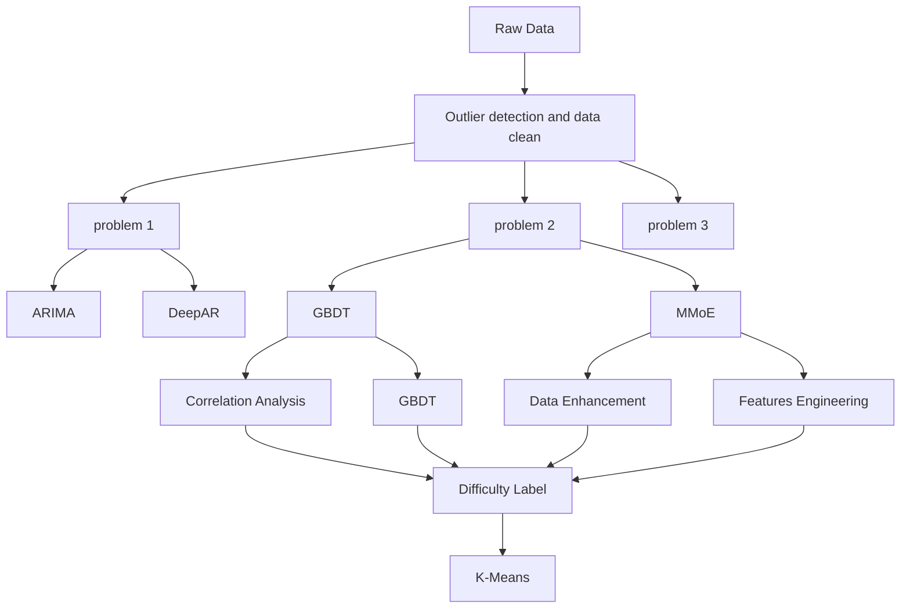

# Words Behind Wordle: Puzzle Game Analysis Using Machine Learning and Time Series Theory

Summary

Wordle is a popular puzzle currently offered daily by New York Times. Players try to solve the puzzle by guessing a five-letter word in six tries or less, receiving feedback with every guess. Making full use of relative information can effectively help editors to improve operational performance.

Firstly, to explain the variation and predict the future value, a time series model based on the number of reported results is introduced. After determining the optimal groups of orders, ARIMA(0,1,1) model is used to forecast the prediction interval of the number of reported results on March 1, 2023, which is [10139.23, 30808.07](80% confidence). To find out if any attributes of the word affect the hard mode percentage, a words attributes system and a LightGBM model are introduced. The results show that there are some lag attributes that have some but less effect than lag Hard Mode percentage itself.

Secondly, to predict the associated percentages of (1, 2, 3, 4, 5, 6, X), two models are established based on GBDT and MMoE. The results show that the MMoE model significantly outperforms the GBDT model, with MSE of 145. Then, we attemptd to improve the model by using data augmentation and feature engineering methods. The former leads to a large amount of noise, which fails to achieve the expected effect, and the latter slightly improves the model performance. The prediction of the final model for the word EERIE is (0.649, 7.579, 26.298, 32.614, 20.930, 9.63, 2.298).

Thirdly, K-means model is introduced to cluster the samples into 4 groups with the distribution of attempt times as the features by difficulty. In order to determine which features of the words are associated with the classifications, we used the classification as the output feature and all the attributes of the words as the input feature to establish a LightGBM model for training. The accuracy of the test set reaches 70%. The importance of the output features is sorted. Finally, the model is used to predict the category of the EERIE word, and the prediction result is Group 2.

Finally, some interesting features of the dataset are found in dataset. The characteristics of large frequency words, the shape of distribution of attempt number and the correlation of the word features are discussed.

In addition, we evaluated the advantages and disadvantages of the model and proposed some suggestions, and carried out a sensitivity analysis of the model to the commission rate, thereby proved the reliability and stability of the model.

Keywords: Wordle ; ARIMA; LightGBM; MMoE; data augmentation; feature engineering; K-means; sensitivity analysis

## Contents

## 1 Introduction 3

1.1 Problem Background 3  
1.2 Restatement of the Problem 4

## 2 General Assumptions and Model Overview 4

2.1 Assumptions . . . 4  
2.2 Model Overview 4

## 3 Model Preparation 5

3.1 Notations . 5  
3.2 Data Preprocessing . 5

## 4 Model I: Time-Series Forecasting Model 7

4.1 The concept of Time Series . 7  
4.2 Stationarity of time series 7  
4.3 Model Building 8  
4.4 Forecasting Results 9

## 5 Extraction and Analyse Attributes of the Word 9

5.1 Extraction of Word Attributes 9  
5.2 Word Attributes Overview . 10

## 6 Model II: Explaining Hard Mode Percentage Using LightGBM 11

6.1 Introduction of LightGBM 11  
6.2 Data Description and Preprocessing 12  
6.3 Model Results and Evaluation . 13

## 7 Model III: Multiple Input - Multiple Output Regression Model 15

7.1 White Noise Verification 15  
7.2 Model Introduction 16

7.3 Model Refinement 17  
7.3.1 Data Augmentation 17  
7.4 Feature Engineering 17  
7.5 Model Results and Evaluation . 17

## 8 Model IV: LightGBM Classifier based on K-means Clustering Model 18

8.1 Concept of K-means Clustering . . 18  
8.2 Clustering Model Building . . 19  
8.3 Evaluation of Clustering Result 20  
8.4 Identification of Important Attributes 20  
8.5 Classfication Result and Evaluation . 20

## 9 Other Interesting Features of the Data Set 21

## 10 Sensitivity Analysis 22

10.1 Sensitivity Analysis for Question 1 . 22  
10.2 Sensitivity Analysis for Question 3 23

## 11 Strengths and Weaknesses 23

11.1 Strengths . 23  
11.2 Weaknesses 24

## 12 A Memorandum to the New York Times Puzzle Editor 24

## 1 Introduction

## 1.1 Problem Background

At the beginning of 2022, a simple but novel game gained great popularity on Twitter. This is the web word game Wordle written by Josh Wardle and published by the New York Times Company.

The game was fairly unknown at the very beginning, but after Wardle creatively added a function that allows players to copy the results into a grid of colored square emojis to share, it immediately attained public attention. As of mid-January 2022, there have been more than 2 million people have played and more than 1.2 million Wordle results have been posted on Twitter.

In Wordle, players have to guess a word with five English letters within six chances in one day. After each attempt, the players may get three types of feedback: green if the letter is in the correct position; yellow if the answer contains the letter while the letter is in the wrong place; gray if the answer does not have the letter at all. The gameplay is similar to games like Mastermind, but Wordle will clearly indicate which letters were guessed correctly. [1]

Apart from that,Wordle has another game mode. On the basis of the above regular rules, the "Hard Mode" requires once a player has found a correct letter in a word, those letters must be used in subsequent guesses.

In fact, there is a profound mathematical mechanism behind the seemingly simple game. We can’t help wondering what mechanism affects the efficiency of players to make correct guesses, and what laws exist behind the constantly changing number of reported results on Twitter. On what basis do players choose Hard Mode?

We expect to solve the above problems through mathematical modeling to effectively predict the future operation of the game and provide Puzzle Editor of the New York Times with business suggestions.


<details>
<summary>text_image</summary>

The New York Times
WORDLE
A DAILY WORD GAME
</details>

Figure 1: NY Times Wordle


<details>
<summary>text_image</summary>

R A I S E
M O U N T
G R I M E
C R I M P
</details>

Figure 2: Example of solution

## 1.2 Restatement of the Problem

As we have a data set containing the date, contest number, word of the day, the number of people reporting scores that day, the number of players on Hard Mode, and the distribution of the reported results. We need to build mathematical models to solve the following problems for New York Times Company:

## Question 1:

1. Develop a model which explains the variation of the reported results number, then make a prediction of this number for Match 1,2023 using the developed model.  
2. Find out the possible attributes of the given word which may influence the per centage of scores reported that were played in Hard Mode, and give the inherent mechanism of the influence.

Question 2: Develop a model that forecasts the distribution of the reported results of a given word on a day to come.Then discuss the uncertainties and the accuracy of the prediction model.

Question 3: Adopt a mathematical model to classify solution words by difficulty, identify the attributes of a given word that link with each classification as well as evaluate the accuracy of the classification.

Question 4: Discuss and find other features within the data set.

## 2 General Assumptions and Model Overview

## 2.1 Assumptions

To simplify the problem, we make the following basic assumptions, each of which is properly justified.

1. The number of reported results on Twitter can effectively represent the total number of players on the day, and the percentage of scores reported that were played in Hard Mode is the same as that of all players.  
2. The distribution of the reported results recorded in the dataset is completely accurate.  
3. There are correlations and differences between the associated percentages of 1 try, 2 tries,· · · , X.  
4. The word difficulty is proportional to the average number of tries to guess the result.

## 2.2 Model Overview

In summary, the whole modeling process can be shown as follows:


<details>
<summary>flowchart</summary>


</details>

Figure 3: Model Overview

## 3 Model Preparation

## 3.1 Notations

Important notations used in this paper are listed in Table 1,

<table><tr><td>Symbols</td><td>Definitions</td></tr><tr><td> $y_{t}^{T}$ </td><td>The number of reported results at day t</td></tr><tr><td> $y_{t}^{T'}$ </td><td>The first-order difference sequence of  $y_{t}^{T}$ </td></tr><tr><td> $y_{t}^{T''}$ </td><td>The first-order difference sequence of  $y_{t}^{T}$  (after May 16, 2022)</td></tr><tr><td> $y_{t}^{H}$ </td><td>Number of reported results in Hard Mode at day t</td></tr><tr><td> $pct_{t}$ </td><td>The percentage of scores reported that were played in Hard Mode at day t</td></tr><tr><td> $distribute_{i}$ </td><td>The percentage that guessed the word in i tries</td></tr></table>

Table 1: Notations

## 3.2 Data Preprocessing

The data we use includes the data files given as Problem C Data Wordle.xlsx

This file gives nearly all the information we need for solving the problem. But before using it, the data needs to be preprocessed.

Firstly, we need to exclude outliers in the data set, that is, remove the points where the percentage of scores reported that were played in Hard Mode (hereinafter referred to as Hard Mode Percentage) is too far away from the other data. When making a scatter plot with a smooth line of the Reported results number, Number in hard mode, and Hard Mode Percentage concerning time, we can easily find the existence of outliers, which are marked with red dots in the following figures.


<details>
<summary>line chart</summary>

| Date       | Percent of hard mode | Number of reported results |
| ---------- | --------------------- | --------------------------- |
| 2022-01    | ~0.0                  | ~350000                     |
| 2022-03    | ~0.1                  | ~150000                     |
| 2022-05    | ~0.1                  | ~75000                      |
| 2022-07    | ~0.1                  | ~50000                      |
| 2022-09    | ~0.1                  | ~40000                      |
| 2022-11    | ~0.1                  | ~35000                      |
| 2023-01    | ~0.1                  | ~35000                      |
</details>


<details>
<summary>line chart</summary>

| Date       | Percent of hard mode | Number in hard mode |
| ---------- | --------------------- | ------------------- |
| 2022-01    | 0.0                   | 16000               |
| 2022-03    | 0.1                   | 14000               |
| 2022-05    | 0.2                   | 10000               |
| 2022-07    | 0.3                   | 8000                |
| 2022-09    | 0.4                   | 6000                |
| 2022-11    | 0.5                   | 4000                |
| 2023-01    | 0.6                   | 2000                |
</details>

Figure 4: Scatterplots of the three Time Series in the Dataset

Using the method of rolling boundary statistics, select the Hard Mode Percentage for 30 days before and 30 days after a certain day as the sample group, then construct the rolling interval according to the following equation:

$$
\text { Means } \pm 3 \times (\text { Standard   Deviation }) \tag {1}
$$

If the Hard Mode Percentage for that day falls outside this interval, it is an outlier. According to this method, we tested the data set and obtained 4 outlier points. After eliminating the outliers, we used the linear interpolation method to complete the original data to obtain a more stationary data set.

In addition, we also found that there are spelling errors in the data set. For example, some given words only contain four letters, which contradicts the game’s rule of 5 letters. We removed the sample data with misspelled words to ensure the validity of the data.

All data samples to be processed and processing results are shown in the table below.

Table 2: Data Preprocessing Checklist(Outliers and Misspelling)

<table><tr><td>Date</td><td>Error location</td><td>Adjustment</td><td>Adjusted number</td></tr><tr><td>2022/11/30</td><td>Number of reported results</td><td>interpolation</td><td>10.37%</td></tr><tr><td>2022/11/26</td><td>Word</td><td>Deletion</td><td>N/A</td></tr><tr><td>2022/11/01</td><td>Number in hard mode</td><td>interpolation</td><td>9.48%</td></tr><tr><td>2022/10/05</td><td>Word</td><td>Deletion</td><td>N/A</td></tr><tr><td>2022/09/16</td><td>Number in hard mode</td><td>interpolation</td><td>8.15%</td></tr><tr><td>2022/04/29</td><td>Word</td><td>Deletion</td><td>N/A</td></tr><tr><td>2022/02/13</td><td>Number in hard mode</td><td>interpolation</td><td>3.54%</td></tr></table>

## 4 Model I: Time-Series Forecasting Model

## 4.1 The concept of Time Series

A time series is a sequence of numbers listed in time order. Most commonly, a time series is a sequence taken at successive equally spaced points in time. Time series analysis includes methods for analyzing time series data to extract meaningful statistics and other characteristics of the data. Time series forecasting is the use of a model to predict future values based on previously observed values.

## 4.2 Stationarity of time series

If we want to make a time series forecast, we must first ensure its stationarity. A stationary time series should have no trend and seasonality, that is to say, its mean and variance are constant.

However, from Figure 4, we can easily derive that the time series of the number of reported results has an obvious trend and isn’t stationary. To ensure our judgment, we then adopted the ADF (Augmented Dickey-Fuller) test. The null hypothesis of this test is that the time series is not stationary. [2] The resulting significant test statistic is -1.9608 while the p-value is 0.5934, which cannot reject the null hypothesis. This confirms our judgment.

In view of the non-stationarity of the data, we performed first-order difference processing on the data. We set the time series of the number of reported results as $y _ { t } ^ { T }$ , and constructed its first-order difference sequence $y _ { t } ^ { T ^ { \prime } } = y _ { t } ^ { T } - y _ { t - 1 } ^ { T }$ . Made a scatter plot with a smooth line, as shown in the figure below:


<details>
<summary>line chart</summary>

| Date       | First phase | Second phase |
| ---------- | ----------- | ------------ |
| 2022-01    | ~55000      | -            |
| 2022-02    | ~45000      | -            |
| 2022-03    | ~-75000     | -            |
| 2022-04    | ~15000      | -            |
| 2022-05    | ~-25000     | ~0           |
| 2022-06    | ~-10000     | ~500         |
| 2022-07    | ~-5000      | ~100         |
| 2022-08    | ~-5000      | ~50          |
| 2022-09    | ~-5000      | ~50          |
| 2022-10    | ~-5000      | ~50          |
| 2022-11    | ~-5000      | ~50          |
| 2023-01    | ~-5000      | ~50          |
</details>

Figure 5: Time Series of $y _ { t } ^ { T }$ After Difference Process

It can be seen from the figure that the time series of the number of reported results being processed has a large variance before May 16, 2022, with a small variance after that, so the data after May 16 is selected as the new time series to predict the future value,

recorded as $y _ { t } ^ { T ^ { \prime \prime } }$

After that, we carried out the ADF test for $y _ { t } ^ { T ^ { \prime \prime } }$ again, this time p-value is 0.01 which rejects the null hypothesis, indicating that the time series after the first-order difference is stationary.

## 4.3 Model Building

After ensuring the stationarity of the time series, we can use the ARIMA (Autoregressive Integrated Moving Average Model) model for time series forecasting. [3] The general expression of the model has the following form, ARIMA(p,d,q):

$$
(1 - \sum_ {i = 1} ^ {p} \alpha_ {i} L ^ {i}) (1 - L) ^ {d} y _ {t} = \alpha_ {0} + (1 + \sum_ {i = 1} ^ {q} \beta_ {i} L ^ {i}) \epsilon_ {t} \tag {2}
$$

Its essence is to combine difference(d), autoregressive model(AR(p)), and moving average model(MA(q)). p is the order of the autoregressive model, d is the order of difference, and q is the order of the moving average model. By drawing the autocorrelation (ACF) diagram and partial autocorrelation (PACF) diagram of the time series $y _ { t } ^ { T ^ { \prime \prime } }$ , it is found that ACF is first-order truncated and PACF is tailed, so we can choose ARIMA(0,1,1)as the target model.


<details>
<summary>line chart</summary>

| Lag | ACF     |
| --- | ------- |
| 0   | 1.0000  |
| 1   | -0.4500 |
| 2   | -0.1000 |
| 3   | -0.0500 |
| 4   | -0.0200 |
| 5   | 0.0500  |
| 6   | 0.0800  |
| 7   | 0.1200  |
| 8   | 0.0300  |
| 9   | -0.1500 |
| 10  | -0.1800 |
| 11  | 0.0200  |
| 12  | 0.0500  |
| 13  | 0.0300  |
| 14  | -0.0500 |
| 15  | -0.0800 |
| 16  | -0.1200 |
| 17  | -0.1500 |
| 18  | -0.1800 |
| 19  | -0.2200 |
| 20  | 0.1500  |
| 21  | -0.1500 |
| 22  | -0.1800 |
| 23  | -0.1200 |
| 24  | -0.1500 |
| 25  | -0.1800 |
| 26  | -0.1200 |
| 27  | -0.1500 |
| 28  | -0.1800 |
| 29  | -0.1200 |
| 30  | -0.1500 |
| 31  | -0.1800 |
| 32  | -0.1200 |
| 33  | -0.1500 |
| 34  | -0.1800 |
| 35  | -0.1200 |
| 36  | -0.1500 |
| 37  | -0.1800 |
| 38  | -0.1200 |
| 39  | -0.1500 |
| 40  | 0.1500  |
</details>


<details>
<summary>line chart</summary>

| Lag | PACF    |
| --- | ------- |
| 0   | 1.0000  |
| 1   | -0.4000 |
| 2   | -0.2500 |
| 3   | -0.2000 |
| 4   | -0.1500 |
| 5   | -0.1000 |
| 6   | -0.0500 |
| 7   | 0.0000  |
| 8   | 0.0500  |
| 9   | 0.1000  |
| 10  | 0.1500  |
| 11  | 0.2000  |
| 12  | 0.2500  |
| 13  | 0.3000  |
| 14  | 0.3500  |
| 15  | 0.4000  |
| 16  | 0.4500  |
| 17  | 0.5000  |
| 18  | 0.5500  |
| 19  | 0.6000  |
| 20  | 0.6500  |
| 21  | 0.7000  |
| 22  | 0.7500  |
| 23  | 0.8000  |
| 24  | 0.8500  |
| 25  | 0.9000  |
| 26  | 0.9500  |
| 27  | 1.0000  |
| 28  | -0.1500 |
| 29  | -0.2000 |
| 30  | -0.2500 |
| 31  | -0.3000 |
| 32  | -0.3500 |
| 33  | -0.4000 |
| 34  | -0.4500 |
| 35  | -0.5000 |
| 36  | -0.5500 |
| 37  | -0.6000 |
| 38  | -0.6500 |
| 39  | -0.7000 |
| 40  | -0.7500 |
</details>

Figure 6: Autocorrelation and Partial Autocorrelation

At the same time, the best ARIMA parameters can also be obtained by using the auto.arima command in R language, resulting ARIMA(1,1,1) and ARIMA(3,1,1).

In order to determine the best of all obtained ARIMA parameters, we use the information criterion (Akaike Information Criterion) to aid judgment. The AIC values of the three optional models are 4200.897/4202.825/4205.466, and ARIMA(0,1,1) has the smallest AIC value, so it is selected as the final model.

To determine the validity of the ARIMA(0,1,1) model, we further made a white noise residual test. Test result shows that the p-values of the LB statistics are all above the threshold of 0.05, so the model passed the test and we can use ARIMA(0,1,1) to explain the variation of the number of reported results.

## 4.4 Forecasting Results

Using the ARIMA(0,1,1) model and substituting the date, the forecast results are shown as the following graph:


<details>
<summary>line chart</summary>

| Date       | Observed values | Predicted values | Forecast values | 80% confidence interval | 95% confidence interval |
| ---------- | --------------- | ---------------- | --------------- | ----------------------- | ----------------------- |
| 2022-06    | ~72000          | ~68000           | -               | -                       | -                       |
| 2022-07    | ~48000          | ~45000           | -               | -                       | -                       |
| 2022-08    | ~38000          | ~36000           | -               | -                       | -                       |
| 2022-09    | ~35000          | ~33000           | -               | -                       | -                       |
| 2022-10    | ~30000          | ~28000           | -               | -                       | -                       |
| 2022-11    | ~28000          | ~26000           | -               | -                       | -                       |
| 2022-12    | ~25000          | ~23000           | -               | -                       | -                       |
| 2023-01    | ~18000          | ~16000           | ~17000          | ~18–25                  | ~16–35                  |
| 2023-02    | ~15000          | ~13000           | ~14000          | ~15–35                  | ~13–45                  |
| 2023-03    | ~12000          | ~10000           | ~11000          | ~12–45                  | ~11–45                  |
</details>

Figure 7: Forecasting Results

For March 31, 2023, the prediction interval of the number of reported results with a confidence level of 80% is [10139.23, 30808.07], the prediction interval with a confidence level of 95% is [4668.516, 36278.78], and the predicted expected value is 20473.65.

## 5 Extraction and Analyse Attributes of the Word

## 5.1 Extraction of Word Attributes

The difficulty of word-quiz games like Wordle is closely related to the attributes of the given word. In view of the characteristics of the Wordle game rules, the difficulty of it mainly depends on the memorability of the given word and the difficulty for the player to recall this word. Many educators and linguists have studied the factors that affect students’ vocabulary memorization. For example, Laufer, B. (1990) [4] listed many word attributes that influence vocabulary learning performance. For Wordle, in order to get the answer, in addition to learning and memorizing words, it is also essential to infer the result based on known information, which difficulty is affected by many attributes of the word as well.

When selecting the attributes of the word, referring to existing research such as Jakub Jagoda & Tomasz Boi ´nski (2018) [5], we can get some common word attributes that affect quiz difficulty, such as word frequency, part of speech, number of vowels, number of repeated letters and the word’s emotional tendency. In addition, the research of psycholinguists also provides us with many innovative indicators, such as the number of orthographic neighbors that a word has, the number of syllables in the main pronunciation, and so on.

## 5.2 Word Attributes Overview

Our attributes data mainly originate from The English Lexicon Project [6], a linguistics project jointly participated by several universities, which aims to provide standardized behavioral and descriptive datasets for 40,481 words and 40,481 non-words. The data can be obtained by visiting elexicon.wustl.edu. In addition, some Python packages and algorithms can also provide us with data about word attributes.

Other research results we have used include the SUBTLEX language library, Bysbaert et al. (2014) research on Concreteness Rating [7], Hoffman et al. (2013) research on Semantic Diversity [8] and DeDeyne, et al. (2018) on Association Frequency Research [9].

It is worth noting that word attributes in different time periods may have different effects on game difficulty. For example, actually, players do not know what exactly is today’s given word before they start playing, so we can naturally guess that the word attributes of today’s word have limited influence on the difficulty of today’s game. But at the same time, the word attributes of the past may significantly affect the difficulty of the game that players assume. If the word of the past few days is difficult to infer, then the players of the day may be less inclined to choose Hard Mode, and even lose the game because of a lack of confidence. Research on the hysteresis effect of past word attributes will become one of the focuses of the modeling below.

The following table lists all the word features extracted in our research, their meanings, and data sources:

Table 3: Word Attributes Overview

<table><tr><td>Attribute Notation</td><td>Meaning of the Attribute</td><td>Data Sources</td></tr><tr><td>word_freq</td><td>How often the word is used in everyday life</td><td>Database from Kaggle</td></tr><tr><td>num_vowel</td><td>Number of vowels in the word</td><td>Counted using python</td></tr><tr><td>num_repeat</td><td>Number of repeated letters</td><td>Counted using python</td></tr><tr><td>part of speech</td><td>Such as nouns, pronouns, etc.</td><td>Python package NLTK</td></tr><tr><td>sentiment</td><td>Sentimental attributes of words1</td><td>Package vaderSentiment</td></tr><tr><td>Ortho_N</td><td>The number of orthographic neighbors that a word has</td><td>English Lexicon Project</td></tr><tr><td>Phono_N</td><td>The number of phonological neighbors2 that a word has</td><td>English Lexicon Project</td></tr><tr><td>OG_N</td><td>The number of phonographic neighbors3 that a word has</td><td>English Lexicon Project</td></tr><tr><td>BG_Sum</td><td>The sum of the bigram count for a particular word</td><td>English Lexicon Project</td></tr><tr><td>NPhon</td><td>The number of phonemes in the main4 pronunciation</td><td>English Lexicon Project</td></tr><tr><td>SUBTLCD</td><td>The SUBTLEX contextual diversity5</td><td>SUBTLEX</td></tr><tr><td>OLD</td><td>The mean of the closest 20 LD neighbors for the orthograph</td><td>English Lexicon Project</td></tr><tr><td>PLD</td><td>The mean of the closest 20 LD neighbors for the phonology</td><td>English Lexicon Project</td></tr><tr><td>Concreteness_Rating</td><td>The mean of the Concreteness Ratings</td><td>Bysbaert et al. (2013)</td></tr><tr><td>Semantic_Diversity</td><td>The Semantic Diversity</td><td>Hoffman et al.(2013)</td></tr><tr><td>Assoc_Freq_R123</td><td>Number of Times Word is one of first three associates</td><td>DeDeyne, et al.(2018)</td></tr><tr><td>NMorph</td><td>The number of Morphemes</td><td>English Lexicon Project</td></tr></table>

1 Such as positive, negative, etc.  
2 This statistic excludes homophones  
3 This statistic excludes homophones  
4 The diphthongs $/ \mathrm { a I } / , / \mathrm { a U } / , / \mathrm { O I } / ,$ , and the affricates /tS/ and /dZ/, each count as single phonemes  
5 % of films containing the word

## 6 Model II: Explaining Hard Mode Percentage Using Light-GBM

## 6.1 Introduction of LightGBM

LightGBM is a novel GBDT (Gradient Boosted Decision Tree) algorithm proposed by Ke in 2017 (Ke et al., 2017) [10]. GBDT has the functional characteristics of Gradient Boosting and Decision Tree, and has the advantages of good training effect and not easy to overfit. Its advantages include fast training speed, high accuracy, low memory usage, and support for parallel computing. It can be used to solve the problems encountered by GBDT in massive data processing.

One of the characteristics of LightGBM is the use of a Histogram-based decision tree algorithm, which first discretizes the continuous eigenvalues into k values, and then generates a histogram with a width of k. When traversing samples, it uses the discretized value as an index. After a traversal, the histogram accumulates the required statistics and then traverses to find the optimal segmentation point through the discrete value of the histogram.


<details>
<summary>flowchart</summary>


</details>

Figure 8: Histogram-Based Decision Tree Algorithm

Another feature of LightGBM is to adopt a more efficient leaf growth strategy, namely the leaf growth strategy with depth limitation (Leaf-wise). Before splitting, this strategy first traverses all the leaves in the tree, and then finds the leaf with the largest splitting gain to split again, and repeats this operation. Experiments have proved that under the same number of splits, Leaf-wise can get higher accuracy, and a maximum depth limit to prevent over-fitting has been added to Leaf-wise.

The leaf-wise leaf growth strategy is shown in the figure below, where the white and black dots represent the leaves with the maximum and non-maximum split gains, respectively:

```mermaid
graph TD
  A1["●"] --> B1["●"]
  A2["●"] --> B2["●"]
  A3["●"] --> B3["●"]
  A4["●"] --> B4["●"]
  A5["●"] --> B5["●"]
  A6["●"] --> B6["●"]
  A7["●"] --> B7["●"]
  A8["●"] --> B8["●"]
  A9["●"] --> B9["●"]
    
    style A1 fill:#000,stroke:#000
    style A2 fill:#000,stroke:#000
    style A3 fill:#000,stroke:#000
    style A4 fill:#000,stroke:#000
    style A5 fill:#000,stroke:#000
    style A6 fill:#000,stroke:#000
    style A7 fill:#000,stroke:#000
    style A8 fill:#000,stroke:#000
    style A9 fill:#000,stroke:#000
    
    %% Light blue arrow pointing right
    %% Light green arrow pointing left
    %% Light blue arrow pointing right
    %% Light green arrow pointing left
    %% Light green arrow pointing right
    %% Light blue arrow pointing left
    %% Light green arrow pointing right
    %% Light green arrow pointing left
```


<details>
<summary>flowchart</summary>


</details>

Figure 9: Schematic Diagram of Leaf-Wise Tree Growth

## 6.2 Data Description and Preprocessing

The main purpose of this model is to identify whether the attributes of words affect the Hard Mode percentage, as well as explore the mechanism of influence. Therefore, the label of the model is the Hard Mode percentage of the current period, denoted as pctt.

Considering the hysteresis effect of the previous word attributes and label itself on the label of the current period, our feature sequence includes the lag terms from one period(1 day) to five period (5 days of all the attributes indicators involved in Table $^ { 3 , }$ as well as the current value of Hard Mode percentage and one period to five period lag terms of it. If all the attributes of the given word in period t are denoted as $\Sigma ,$ then the model input contains:

$$
p c t _ {t - 1}, p c t _ {t - 2}, \dots , p c t _ {t - 5}; X _ {t}, X _ {t - 1}, \dots , X _ {t - 5} \tag {3}
$$

In order to ensure the validity and reliability of the model, the data set needs to be preprocessed. A very important step is to normalize the value of each attribute and map the data to [0, 1]. The method is listed below:

$$
v _ {s} = \frac {v - v _ {\text { min }}}{v _ {\text { max }} - v _ {\text { min }}} \tag {4}
$$

Among them, $v _ { s }$ is the standardized value, v is the original value, $v _ { m } a x ,$ and $v _ { m } i n$ represent the maximum and minimum values of the attribute respectively. The normalized data are collectively referred to as $D a t a _ { i n p u t }$ .

## 6.3 Model Results and Evaluation

We utilized the above data, and input the feature sequence to train the model with the ratio of training set : test set = 4 : 1. Then the model would assign different weights to different features by making a large amount of historical data correlation calculation, and output the estimated (or predicted) value of Hard Mode Percentage using these weights.

For the purpose of verifying the reliability of the LightGBM model, we used MSE, RMSE, and SMAPE of the prediction results as the measurement indicators of the model accuracy. After parameter optimization, the calculation results of each indicator within the training set and validation set are as follows:

Table 4: Model Accuracy Test Results

<table><tr><td></td><td>MSE</td><td>RMSE</td><td>SMAPE</td></tr><tr><td>Training set</td><td> $3.623 \times 10^{-6}$ </td><td>0.0019</td><td>0.0253</td></tr><tr><td>validation set</td><td> $3.382 \times 10^{-5}$ </td><td>0.0058</td><td>0.0690</td></tr></table>

As all the indicators are apparently small, we can easily assert that the model result fits the real data very well. This conclusion can also be drawn from the scatter plot of the predicted value and the observed value below.


<details>
<summary>line chart</summary>

| Date       | Hard mode percentage |
| ---------- | -------------------- |
| 2022-01    | 0.015                |
| 2022-02    | 0.030                |
| 2022-03    | 0.045                |
| 2022-04    | 0.060                |
| 2022-05    | 0.075                |
| 2022-06    | 0.085                |
| 2022-07    | 0.090                |
| 2022-08    | 0.095                |
| 2022-09    | 0.100                |
| 2022-10    | 0.105                |
| 2022-11    | 0.108                |
| 2023-01    | 0.105                |
</details>

Figure 10: Comparison of Predicted Results of LightGBM and Observed Value

Due to the reliability of the model, we can use the weight of each feature to judge whether the attributes of the word affect the Hard Mode Percentage. It can be concluded from the weight map of the feature that time lag items of the label itself are the most influential, while the time lag items of the word attributes are the next. Therefore, the Hard Mode Percentage of the current day’s game is related to the given words’ attributes of the previous periods and has almost nothing to do with the word attributes today, despite the ratio being mainly affected by its own lag terms.

As mentioned in subsection 5.2, if the words in the previous periods are difficult, the player will be more inclined not to choose Hard Mode for the current period. What’s more, since the player does not know the difficulty of the current period of words before choosing, the word attributes of the current period should not affect the player’s choice which is consistent with the predictions of our model.


<details>
<summary>bar chart</summary>

Feature importance
| Features | Feature importance |
| :--- | :--- |
| pct_3 | 573 |
| pct_4 | 522 |
| pct_2 | 521 |
| pct_5 | 491 |
| BG_Sum_1 | 317 |
| pct_1 | 290 |
| PLD_1 | 233 |
| BG_Sum_2 | 221 |
| Semantic_Diversity_1 | 209 |
| Semantic_Diversity_2 | 173 |
| OLD_1 | 168 |
| BG_Sum | 155 |
| word_freq_2 | 153 |
| Ortho_N_2 | 145 |
| PLD_2 | 142 |
| Semantic_Diversity_5 | 141 |
| Assoc_Freq_R123_3 | 140 |
| Concreteness_Rating_1 | 136 |
| Phono_N_2 | 136 |
| word_freq | 133 |
</details>

Figure 11: Relative Importance of Features

## 7 Model III: Multiple Input - Multiple Output Regression Model

Multiple input - multiple output regression model is mainly used to solve the regression problem involving predicting two or more values when given an input example. Generally, there are two types of ideas - one is to train multiple regressors based on the machine learning model, and the other is to modify the number of output layers based on the deep learning model. Experience has shown that due to the large amount of neural network parameters, when the data amount is small, using feature engineering and ensemble learning method may have better prediction results than directly using deep learning models.

## 7.1 White Noise Verification

Firstly, we ran a white noise test 1on each of the associated percentages of guess attempts for a future date2. If the data passed the white noise test, it means that it is not affected by the time trend. Therefore, we can use the cross-sectional data of word attributes and distribution for subsequent modeling and predictions.

Take date as the horizontal axis and the percentage of 1 to 7 or more tries as the vertical axis to make a smooth-lined scatter plot. It can be seen from the figure that the trend of 2-6tries is relatively stationary, while the percentage of 1 and 7tries have some less stationary values. The reason may be that there are extremely easy and extremely difficult questions on certain days.

At the same time, it can be seen from the ACF diagram that the autocorrelation coefficients of 2-7 tries are relatively small, while the autocorrelation coefficient of 1 try is slightly larger.


<details>
<summary>line chart</summary>

| Day | Value |
|---|---|
| 1 Apr/24 | 5.87 |
| 2 May/24 | 6.39 |
| 3 Jun/24 | 7.12 |
| 4 Jul/24 | 7.08 |
| 5 Aug/24 | 7.05 |
| 6 Sep/24 | 7.03 |
| 7 Oct/24 | 7.01 |
| 8 Nov/24 | 6.99 |
| 9 Dec/24 | 6.98 |
| 10 Jan/25 | 6.97 |
| 11 Feb/25 | 6.96 |
| 12 Mar/25 | 6.95 |
| 1 Mar/26 | 6.94 |
| 2 Apr/27 | 6.93 |
| 3 Apr/27 | 6.92 |
| 4 Apr/27 | 6.91 |
| 5 Apr/27 | 6.90 |
| 6 May/27 | 6.89 |
| 7 Jun/27 | 6.88 |
| 8 Jul/27 | 6.87 |
| 9 Aug/27 | 6.86 |
| 10 Sep/27 | 6.85 |
| 11 Oct/27 | 6.84 |
| 12 Nov/27 | 6.83 |
| 1 Mar/28 | 6.82 |
| 2 Apr/29 | 6.81 |
| 3 Apr/29 | 6.80 |
| 4 Apr/29 | 6.79 |
| 5 Apr/29 | 6.78 |
| 6 May/29 | 6.77 |
| 7 Jun/29 | 6.76 |
| 8 Jul/29 | 6.75 |
| 9 Aug/29 | 6.74 |
| 10 Sep/29 | 6.73 |
| 11 Oct/29 | 6.72 |
| 12 Nov/29 | 6.71 |
| 1 Mar/30 | 6.70 |
| 2 Apr/31 | 6.69 |
| 3 Apr/31 | 6.68 |
| 4 Apr/31 | 6.67 |
| 5 Apr/31 | 6.66 |
| 6 May/31 | 6.65 |
| 7 Jun/31 | 6.64 |
| 8 Jul/31 | 6.63 |
| 9 Aug/31 | 6.62 |
| 10 Sep/31 | 6.61 |
| 11 Oct/31 | 6.60 |
| 12 Nov/31 | 6.59 |
| 1 Mar/32 | 6.58 |
| 2 Apr/33 | 6.57 |
| 3 Apr/33 | 6.56 |
| 4 Apr/33 | 6.55 |
| 5 Apr/33 | 6.54 |
| 6 May/33 | 6.53 |
| 7 Jun/33 | 6.52 |
| 8 Jul/33 | 6.51 |
| 9 Aug/33 | 6.50 |
| 10 Sep/33 | 6.49 |
| 11 Oct/33 | 6.48 |
| 12 Nov/33 | 6.47 |
| 1 Mar/34 | 6.46 |
| 2 Apr/35 | 6.45 |
| 3 Apr/35 | 6.44 |
| 4 Apr/35 | 6.43 |
| 5 Apr/35 | 6.42 |
| 6 May/35 | 6.41 |
| 7 Jun/35 | 6.40 |
| 8 Jul/35 | 6.39 |
| 9 Aug/35 | 6.38 |
| 10 Sep/35 | 6.37 |
| 11 Oct/35 | 6.36 |
| 12 Nov/35 | 6.35 |
| 1 Mar/36 | 6.34 |
| 2 Apr/37 | 6.33 |
| 3 Apr/37 | 6.32 |
| 4 Apr/37 | 6.31 |
| 5 Apr/37 | 6.30 |
| 6 May/37 | 6.29 |
| 7 Jun/37 | 6.28 |
| 8 Jul/37 | 6.27 |
| 9 Aug/37 | 6.26 |
| 10 Sep/37 | 6.25 |
| 11 Oct/37 | 6.24 |
| 12 Nov/37 | 6.23 |
| 1 Mar/38 | 6.22 |
| 2 Apr/39 | 6.21 |
| 3 Apr/39 | 6.20 |
| 4 Apr/39 | 6.19 |
| 5 Apr/39 | 6.18 |
| 6 May/39 | 6.17 |
| 7 Jun/39 | 6.16 |
| 8 Jul/39 | 6.15 |
| 9 Aug/39 | 6.14 |
| 10 Sep/39 | 6.13 |
| 11 Oct/39 |
</details>

Figure 12: Scatted Plot and ACF Diagram For the Distribution of Reported Results

We conducted the Box-Pierce White Noise Test on these 7 percentages, and found out their p-values were all higher than 0.05, which passed the test.

## 7.2 Model Introduction

Therefore, our analysis tried to compare the effects of the following two models on this data set, then adopted data augmentation, feature engineering and other methods to improve the model effect.

• Multiple output regression model based on GBDT algorithm:

The idea of this model is to train multiple regressors based on the GBDT algorithm, respectively fitting the seven dependent variables of 1 try to 7 or more tries (X), with no correlation between the regressors.

• Multiple output regression model based on MMoE:

Multi-task learning refers to the method of training multiple objective functions at the same time. Its main advantage is that it can improve the learning efficiency and quality of each task. In addition, it can effectively overcome the shortcomings of large task noise, insufficient training samples, high data dimensionality, and sparse data sets.

The framework of multi-task learning widely adopts the shared-bottom structure, which means the hidden layer at the bottom is shared between different tasks. This structure can essentially reduce the risk of overfitting, but the effect may be affected by task differences and data distribution.


<details>
<summary>flowchart</summary>

```mermaid
graph TD
    subgraph a["(a)"]
  A1["Output A"] --> A2["Tower A"]
  B1["Output B"] --> B2["Tower B"]
  A2 --> C["Shared Bottom"]
  B2 --> C
  C --> D["Input"]
    end

    subgraph b["(b)"]
  E1["Output A"] --> E2["Tower A"]
  F1["Output B"] --> F2["Tower B"]
  E2 --> G["Expert 0"]
  E2 --> H["Expert 1"]
  E2 --> I["Expert 2"]
  G --> J["Input"]
  H --> J
  I --> J
  J --> K["Gate"]
    end

    subgraph c["(c)"]
  L1["Output A"] --> L2["Tower A"]
  M1["Output B"] --> M2["Tower B"]
  L1 --> N["Expert 0"]
  L1 --> O["Expert 1"]
  L1 --> P["Expert 2"]
  N --> Q["Input"]
  O --> Q
  P --> Q
  Q --> R["Gate A"]
  R --> S["Input"]
  S --> T["Gate B"]
    end

    style (a) fill:#4CAF50,stroke:#333
    style (b) fill:#4CAF50,stroke:#333
    style (c) fill:#4CAF50,stroke:#333
    linkStyle 0 stroke:#333,stroke-width:2px
    linkStyle 1 stroke:#333,stroke-width:2px
    linkStyle 2 stroke:#333,stroke-width:2px
    linkStyle 3 stroke:#333,stroke-width:2px
    linkStyle 4 stroke:#333,stroke-width:2px
    linkStyle 5 stroke:#333,stroke-width:2px
    linkStyle 6 stroke:#333,stroke-width:2px
    linkStyle 7 stroke:#333,stroke-width:2px
    linkStyle 8 stroke:#333,stroke-width:2px
    linkStyle 9 stroke:#333,stroke-width:2px
    linkStyle 10 stroke:#333,stroke-width:2px
    linkStyle 11 stroke:#333,stroke-width:2px
    linkStyle 12 stroke:#333,stroke-width:2px
    linkStyle 13 stroke:#333,stroke-width:2px
    linkStyle 14 stroke:#333,stroke-width:2px
    linkStyle 15 stroke:#333,stroke-width:2px
    linkStyle 16 stroke:#333,stroke-width:2px
    linkStyle 17 stroke:#333,stroke-width:2px
    linkStyle 18 stroke:#333,stroke-width:2px
    linkStyle 19 stroke:#333,stroke-width:2px
    linkStyle 20 stroke:#333,stroke-width:2px
    linkStyle 21 stroke:#333,stroke-width:2px
    linkStyle 22 stroke:#333,stroke-width:2px
    linkStyle 23 stroke:#333,stroke-width:2px
    linkStyle 24 stroke:#333,stroke-width:2px
    linkStyle 25 stroke:#333,stroke-width:2px
    linkStyle 26 stroke:#333,stroke-width:2px
    linkStyle 27 stroke:#333,stroke-width:2px
    linkStyle 28 stroke:#333,stroke-width:2px
    linkStyle 29 stroke:#333,stroke-width:2px
    linkStyle 30 stroke:#333,stroke-width:2px
    linkStyle 31 stroke:#333,stroke-width:2px
    linkStyle 32 stroke:#333,stroke-width:2px
    linkStyle 33 stroke:#333,stroke-width:2px
    linkStyle 34 stroke:#333,stroke-width:2px
    linkStyle 35 stroke:#333,stroke-width:2px
    linkStyle 36 stroke:#333,stroke-width:2px
    linkStyle 37 stroke:#333,stroke-width:2px
    linkStyle 38 stroke:#333,stroke-width:2px
    linkStyle 39 stroke:#333,stroke-width:2px
    linkStyle 40 stroke:#333,stroke-width:2px
    linkStyle 41 stroke:#333,stroke-width:2px
    linkStyle 42 stroke:#333,stroke-width:2px
    linkStyle 43 stroke:#333,stroke-width:2px
    linkStyle 44 stroke:#333,stroke-width:2px
    linkStyle 45 stroke:#333,stroke-width:2px
    linkStyle 46 stroke:#333,stroke-width:2px
    linkStyle 47 stroke:#333,stroke-width:2px
    linkStyle 48 stroke:#333,stroke-width:2px
    linkStyle 49 stroke:#333,stroke-width:2px
    linkStyle 50 stroke:#333,stroke-width:2px
```
</details>

Figure 1: (a) Shared-Bottom model. (b) One-gate MoE model. (c) Multi-gate MoE model  
Figure 13: MMoE’s Advantage Shown by Comparison

Therefore, a content recommendation team at Google proposed a Multi-gate Mixtureof-Experts (MMoE) multi-task learning structure. The improvement of MmoE is that, compared with the basic shared-bottom structure, it captures the differences in tasks without significantly increasing the requirements of model parameters. Compared with all tasks sharing a gating network (One-gate MoE model, as shown above), each task in MMoE uses separate gating networks. The gating networks of each task realize the selective utilization of experts through different final output weights. Gating networks of different tasks can learn different modes of combining experts, so the model takes into account the relevance and differences of captured tasks, which is very suitable for predicting the number of player attempts in this problem.

We input word attributes and ran the two models described in Section 7.2 to predict the distribution of the reported results, but the prediction results still need to be optimized.

## 7.3 Model Refinement

## 7.3.1 Data Augmentation

For multi-input and multi-output problems, neural networks are generally used for modeling processing, but neural networks or deep learning require a large amount of data to be used for training. As the total sample size in this question is 359, it is difficult to get sufficient data for training the neural network. However, it may be possible to expand the data set through data augmentation.

CTGAN is a collection of Deep Learning based synthetic data generators for single tabular data, which is able to learn from observed data and generate synthetic data with high fidelity [11]. It should be noted that the data generator cannot limit the relationship between variables, the sum of percentage from 1 try to 7 tries in the generated sample may be quite different from 100%. So we used CTGAN to generate new samples, filtered out the samples that meet the conditions and merge them into the original data set. Finally, our sample size was about 4000.

After obtaining the enhanced samples, the above two models were retrained. However, we found that the training results did not improve significantly, possibly because the original sample size was too small.

## 7.4 Feature Engineering

Generally speaking, data and features determine the upper limit of machine learning, and models and algorithms only approach this upper limit. In addition to optimizing the model from the perspective of data, it is also possible to extract features from the original data to the maximum extent, that is, feature engineering.

OpenFE is a new framework for automated feature generation for tabular data. [12]Using OpenFE as a tool, we perform feature engineering on the unaugmented and augmented datasets separately to generate datasets containing new features. After this process, we retrained the above two models using the new data set. Luckily, the results have been significantly improved.

## 7.5 Model Results and Evaluation

Our prediction for the word EERIE on March 1, 2023 is as follows:

The predictive effectiveness of the two types of models shows obvious differences. The multiple output regression model based on GBDT has a large variance in total MSE between the training set and the verification set. This indicates that the machine learning model has poor model generalization performance when the data set is small. The MSE of the training set and validation set when using the multiple output regression model based on MMoE are relatively close. What’s more, they are apparently lower than the former model, showing an obvious advantage.

Unexpectedly, data augmentation led to a significant decline in the performance of both types of models, indicating that the new data brings greater noise to model training; feature engineering has no effect on the former, however brings a small improvement in the performance of the latter. Therefore, we finally chose the multiple output regression model based on MMoE plus features engineering mode. After parameter optimization, the prediction results of the word EERIE on March 1, 2023 are as follows:

<table><tr><td rowspan="2">Percent in Number</td><td>1 try</td><td>2 tries</td><td>3 tries</td><td>4 tries</td><td>5 tries</td><td>6 tries</td><td>7 or more tries (X)</td><td>Total</td></tr><tr><td>0.649</td><td>7.579</td><td>26.298</td><td>32.614</td><td>20.930</td><td>9.63</td><td>2.298</td><td>99.998</td></tr></table>

Table 5: Prediction Result of Distribution

## 8 Model IV: LightGBM Classifier based on K-means Clustering Model

The purpose of this model is to classify solution words by difficulty. When making classification, We first use the K-means clustering model to divide the word samples in the data set into several groups according to the average number of puzzle-solving attempts. After that, use the LightGBM algorithm to classify them into corresponding groups by using the attributes of the given words.

## 8.1 Concept of K-means Clustering

Distance-based clustering often uses measurement methods, such as K-means, K-medoids, etc. Among them, the current most popular heuristic method is the K-means algorithm. So we used the percentage that guessed the word in one to seven tries given in the data set as clustering basis and ran the K-means clustering model.

Given a set of data points and the number of clusters required, the K-means algorithm moves the data points into each cluster domain iteratively according to a specific distance function, the general implementation steps are as follows:

1. Given a sample word data set with a size of n, let the number of iterations be R, and randomly select k words as the initial cluster centers according to the specified number of clusters k, labeled as $C _ { j } ( r ) , \mathbf { j } { = } 1 , 2 , 3 , \cdots , \mathbf { k } ; \mathbf { r } { = } 1 , 2 , 3 , \cdots , \bar { \mathbf { R } } .$ .  
2. Calculate the similarity distance $D ( X _ { i } , C _ { j } ( r ) )$ between each data object in the sample and the initial cluster center; among them, $\mathrm { i } { = } 1 , 2 , 3 , { \ldots } , \mathrm { n }$ , then form a cluster $W _ { j . }$ , if it satisfies the formula (5)

$$
\sum_ {i = 1} ^ {n} \left| D \left(X _ {i + 1}, C _ {j} (r)\right) - D \left(X _ {i}, C _ {j} (r)\right) \right| ^ {2} <   \varepsilon \tag {5}
$$

Then $X _ { i } \in W _ { j } , X _ { i }$ is denoted as w, where ϵ is any given positive number.

3. Calculate k new cluster centers, the calculation formula is as follows:

$$
C _ {j} (r + 1) = \frac {1}{n} \sum_ {i = 1} ^ {n j} X _ {i} ^ {(j)} \tag {6}
$$

The formula for calculating the value of the clustering criterion function is as follows:

$$
E (r + 1) = \sum_ {i = 1} ^ {k} \sum_ {w \in W _ {j}} | w - C _ {j} (r + 1) | ^ {2} \tag {7}
$$

4. To judge whether the clustering is reasonable, the discriminant formula is listed below:

$$
\left| E (r + 1) - E (r) \right| <   \varepsilon \tag {8}
$$

If the result is reasonable, the iteration terminates; while if it is not, return to steps 2 and 3.

## 8.2 Clustering Model Building

In order to determine a reasonable number of clusters k, we first made k=1, 2, 3...,10 as the experimental number of clusters, then used Python to run the K-means clustering model. Finally, calculate the sum of squares due to error (SSE) of the results with different k values. With the number of clusters k as the horizontal axis and SSE as the vertical axis, a scatter diagram with a trend line is made as follows:


<details>
<summary>line chart</summary>

| Number of Clusters | SSE  |
| ------------------ | ---- |
| 1                  | 55   |
| 2                  | 32   |
| 3                  | 24   |
| 4                  | 19   |
| 5                  | 17   |
| 6                  | 15   |
| 7                  | 13   |
| 8                  | 12   |
| 9                  | 11   |
</details>

Figure 14: Determine the Number of Clusters

We had to make a balance between the minimal value of SSE and the smallest possible amount of the number of groups. It can be derived from the figure that when the k value is less than 4, as the number of clusters increases, the SSE decreases rapidly. On the contrary, when k is greater than 4, the downward trend is not obvious. So the most suitable k value Which achieves the aforementioned balance is 4.

## 8.3 Evaluation of Clustering Result

In order to verify the effectiveness of clustering, we calculated the mean difficulty value for each group, which is represented by the average number of attempts a player has to make to guess the word. The more tries a player made, the more difficult the given word is. The calculation formula is as follows:

$$
\text { Average   Number   of   Tries } = \sum_ {i = 1} ^ {7} \text { distribute } _ {i} \times i \tag {9}
$$

The number of words in each group, the average number of tries to guess the word as well as Skewnesses in each group are shown in the table below.

Table 6: Clustering Result Evaluation

<table><tr><td>Group</td><td>0</td><td>1</td><td>2</td><td>3</td></tr><tr><td>No.of Words</td><td>34</td><td>127</td><td>125</td><td>57</td></tr><tr><td>Average Difficulty</td><td>3.574</td><td>3.951</td><td>4.326</td><td>4.800</td></tr><tr><td>Skew</td><td>0.320</td><td>0.246</td><td>0.0918</td><td>-0.181</td></tr></table>

The data in the table shows that the average number of tries and skewness of each group are significantly different, indicating that our Clustering is relatively effective.

## 8.4 Identification of Important Attributes

We have divided words into groups according to difficulty in the analysis above. Next, we would further make an in-depth analysis, hoping to link the classification of word difficulty with its own attributes, and solve the problem of "why is this word more difficult"?

We again used the LightGBM model, taking the 4 clustered groups obtained by the clustering algorithm as labels, and used the word attributes listed in subsection 5.2 as input features to train the lightGBM model. The training result(Figure 15) reflects the importance of each attribute of the word in terms of affecting the word’s difficulty level. What’s more, we can utilise the model to classify a given word into clustered groups above.

Therefore, most of the attributes of the word are related to classification, while the most relevant attributes are BG\_sum, num\_repeat, Semantic\_diversity, P LD, and P hono\_N. The impact of word attributes on difficulty also mainly comes from these five indicators.

## 8.5 Classfication Result and Evaluation

Referring to the result of 7.4,the key attributes of the word "EERIE" are:

We input these attributes into the LightGBM classification model, and the output showed that this word belongs to the second category, which is the second lowest level of difficulty.


<details>
<summary>bar chart</summary>

Feature importance
| Features | Importance |
| :--- | :--- |
| BG_Sum | 63 |
| num_repeat_2 | 43 |
| Semantic_Diversity | 43 |
| PLD | 31 |
| Phono_N | 30 |
| Ortho_N | 25 |
| word_freq | 24 |
| Concreteness_Rating | 23 |
| OLD | 22 |
| Assoc_Freq_R123 | 20 |
| OG_N | 18 |
| SUBTLCD | 17 |
| word_sen_neu | 10 |
| NSyll | 9 |
| num_vowel | 7 |
| NPhon | 7 |
| NMorph | 6 |
| cixing_NN | 2 |
</details>

Figure 15: Importance of Features in Classfication

Table 7: Part of key attributes of EERIE

<table><tr><td>Word</td><td>Phono_N</td><td>BG_Sum</td><td>PLD</td><td>Semantic_Diversity</td><td>num_repeat</td></tr><tr><td>EERIE</td><td>8</td><td>11159</td><td>1.4</td><td>1.487</td><td>4</td></tr></table>

We used a variety of indicators to measure the accuracy of the LightGBM classification model. The results are shown in the table below. By analyzing the results, we could assert that our model made a quite accurate classification regarding the words in the data set.

Table 8: Mesuring Accuracy of Classification

<table><tr><td></td><td>Accuracy</td><td>Precision</td><td>Recall</td><td>F1-score</td></tr><tr><td>Validation set</td><td>71.13%</td><td>71.85%</td><td>66.54%</td><td>69.09%</td></tr><tr><td>Traning set</td><td>98.28%</td><td>98.82%</td><td>98.79%</td><td>98.28%</td></tr></table>

## 9 Other Interesting Features of the Data Set

1. It can be seen from Figure 4 that the number of users of the game rose rapidly in a short period of time, while then declining rapidly, reflecting the short-term popularity of the game. In addition, the percentage of people who chose the Hard Mode gradually increased over time, indicating that users gradually mastered the game.  
2. Figure 16 is a word cloud diagram drawn according to the frequency of use. Most of the high-frequency words are pronouns and auxiliary verbs, followed by nouns.  
3. Observing the distribution of the number of user attempts in Figure 17, the kernel density function of less difficult words is flat and skewed to the right; while the kernel density function of more difficult words has a higher peak value, mostly concentrated at 4 times.


<details>
<summary>text_image</summary>

OTHER
STUDY
MONEY
THEIR
POWER
MONTH
</details>

Figure 16: The Word Cloud

4. It can be seen from Figure 18 that, among the various word attributes, the correlations between OrthoN , P honoN , and word frequency are strong.


<details>
<summary>line chart</summary>

| Number of try | Density |
| ------------- | ------- |
| 1             | 0.00    |
| 2             | 0.01    |
| 3             | 0.03    |
| 4             | 0.05    |
| 5             | 0.03    |
| 6             | 0.01    |
| 7             | 0.00    |
</details>

Figure 17: Kernel Density Function Plot


<details>
<summary>heatmap</summary>

| Model | Ortho_N | Phono_N | OLN | BB_Sun | MPon | MSyll | SUBTLOD | OLD | PLD | Concreteness_Rating | Semantic_Diversity | Assoc_Freq_R123 | NMorph | num_voxel | word_freq |
| --- | --- | --- | --- | --- | --- | --- | --- | --- | --- | --- | --- | --- | --- | --- | --- |
| Ortho_N | 1.0 | 0.4 | 0.8 | 0.3 | -0.3 | -0.3 | 0.1 | -0.7 | -0.5 | 0.2 | 0.1 | 0.2 | -0.1 | -0.2 | 0.0 |
| Phono_N | 0.4 | 1.0 | 0.4 | -0.0 | -0.6 | -0.4 | 0.2 | -0.4 | -0.8 | 0.2 | 0.0 | 0.1 | -0.2 | -0.1 | 0.1 |
| OLN | 0.8 | 0.4 | 1.0 | 0.2 | -0.2 | -0.3 | 0.1 | -0.6 | -0.5 | 0.2 | 0.1 | 0.1 | -0.1 | -0.2 | -0.0 |
| BG_Sun | 0.3 | -0.0 | 0.2 | 1.0 | 0.1 | 0.1 | 0.0 | -0.3 | -0.1 | 0.0 | 0.1 | 0.0 | 0.1 | 0.1 | 0.1 |
| MPhon | -0.3 | -0.6 | -0.2 | 0.1 | 1.0 | 0.4 | -0.2 | 0.3 | 0.6 | -0.2 | -0.1 | -0.1 | 0.2 | -0.0 | -0.2 |
| NSyll | -0.3 | -0.4 | -0.3 | 0.1 | 0.4 | 1.0 | -0.1 | 0.4 | 0.5 | -0.2 | -0.1 | -0.0 | 0.4 | 0.3 | -0.0 |
| SUBTLOD | 0.1 | 0.2 | 0.1 | 0.0 | -0.2 | -0.1 | 1.0 | -0.1 | -0.2 | -0.1 | 0.5 | 0.5 | -0.1 | -0.0 | 0.7 |
</details>

Figure 18: Correlation of Attributes

## 10 Sensitivity Analysis

## 10.1 Sensitivity Analysis for Question 1

By constructing the LightGBM model, we solved the problem of what factors (contemporaneous or lagged) influence the current Hard Mode percentage. In order to test the sensitivity of the model, we applied random perturbations to the top five influential attributes derived in 8.4. Then observed whether there was a significant change in the relative importance of attributes. The results are shown in the table below:

Within it, the disturbance range p means that for the original value x, a random number within the range of $[ ( 1 - p ) x , ( 1 + p ) x ]$ is used to reassign x. No matter which number is drawn, it will not cause a great impact on the importance of attributes regarding predicting Hard Mode Percentage.

Table 9: Sensitivity Analysis for Model of Question 1

<table><tr><td>Attribute Name</td><td>Disturbance range p</td></tr><tr><td>BG_Sum_1</td><td>When p is less than 0.15, the ranking of word attributes remains unchanged</td></tr><tr><td>BG_Sum_2</td><td rowspan="4">Ranking of word attributes with the second-largest to fifth-largest influence keeps steady when p is less than 0.1</td></tr><tr><td>Semantic_Diversity_1</td></tr><tr><td>Semantic_Diversity_2</td></tr><tr><td>OLD_1</td></tr></table>

It can be derived from the table that, to a certain extent, small-scale data disturbance will not affect the importance ranking of word attributes, which means that the model passed the sensitivity test.

## 10.2 Sensitivity Analysis for Question 3

In order to analyze the sensitivity of the classification model in this paper, we repeatedly deleted x randomly selected samples from the total samples. We subsequently analyzed whether the classification results had changed significantly, which is shown in the table below:

Table 10: Sensitivity Analysis for Model of Question 3

<table><tr><td>heightx</td><td>The number of times among 100 repeated tests when the classification result didn’t change</td></tr><tr><td>1</td><td>100</td></tr><tr><td>2</td><td>100</td></tr><tr><td>3</td><td>98</td></tr><tr><td>4</td><td>95</td></tr><tr><td>5</td><td>90</td></tr></table>

We can derive from the table that after 100 times of random deletion of 1-5 samples from the overall data set, the number of times among 100 repeated tests when the classification result didn’t changes still reaches more than 90. That means, to a certain extent, small-scale sample changes will not have a significant impact on the classification result. The model for question 3 passed the sensitivity test as well.

## 11 Strengths and Weaknesses

## 11.1 Strengths

1. We have fully exploited a variety of word attributes that adequately reflected the information content of words as much as possible.  
2. The model fully considered the data of the current period and lagged terms.  
3. We tried a variety of machine learning and deep learning models as well as made an in-depth comparison of their performances.

## 11.2 Weaknesses

1. We didn’t try to adopt a time series prediction model based on deep learning.  
2. We didn’t fully overcome the problem of poor prediction accuracy caused by a small amount of data.

## 12 A Memorandum to the New York Times Puzzle Editor

## Dear Editor:

We are a professional business analysis team from MCM. It‘s a great honor to be invited to answer your operation questions.

We are very delighted to see the game Wordle achieved great success in 2022. But to ensure long-term steady operation, you also need to have a deep understanding of the game’s operating mechanism. At your request, we analyzed the data mined from Twitter and we are here to answer your questions with confidence:

First of all, we adopted a time-series forecasting model which effectively explained the variation of the reported results’ number. Using this model, we are 80% sure that the number of reported results on March 1, 2023, should be between [10139, 30808]. Then, by adopting a machine learning model, we found out that the word attributes from the past have a limited impact on the percentage of scores reported that were played in Hard Mode, whereas word attributes of today’s word almost have no impact at all.

Then, we used a refined deep-learning model to predict the distribution of the reported results. For instance, for the word EERIE on March 1, 2023, the forecasted probability distribution should be [0.649,7.579,26.298,32.614,20.930,9.63,2.298] (%)from 1 to 7 or more tries. This result passed a set of accuracy evaluations so it could be trusted.

After that, we established a difficulty classification model which is capable of classifying any given word by analyzing its attributes. When considering the word EERIE, the classification model infers that it should belong to the second easiest group of all 4 groups classified by difficulty. What’s more, we derived the top 5 attributes that are associated with classification.

Lastly, we further explored other interesting features of this data set, including word cloud map, kernel density classification map, etc.

By analyzing the recent operational performance of Wordle, we further made several suggestions on Wordle’s future operation:

1. There is a downward trend of the number of players, so new playing mode should be introduced to attract new players.  
2. The hard mode pct is increasing steadily. In order to improve the gaming experi ence, you should consider improving the difficulty of certain days’ game.

3. In the future, you can consider setting 4 different game difficulties according to the classification result we acquired above.

Hope you find our suggestions helpful and wish Wordle become better and better!

Yours, Sincerely

MCM Team # 2307946

## References

[1] W. contributors, “Wordle. in wikipedia, the free encyclopedia,” Wikipedia, 2023.  
[2] C. R. Nelson and C. I. Plosser, “Trends and random walks in macroeconmic time series: Some evidence and implications,” Journal of Monetary Economics, vol. 10(2), pp. 139–162, 1982.  
[3] T. Jakaša, I. Androˇcec, and P. Sprˇci´c, “Electricity price forecasting — arima model approach,” in 2011 8th International Conference on the European Energy Market (EEM), pp. 222–225, 2011.  
[4] B. Laufer, “Ease and difficulty in vocabulary learning: Some teaching implications,” Foreign Language Annals, vol. 23, pp. 147–155, 1990.  
[5] J. Jagoda and T. Boi ´nski, “Assessing word difficulty for quiz-like game,” pp. 70–79, 2018.  
[6] D. Balota, M. Yap, and t. Hutchison, K.A., “The english lexicon project,” Behavior Research Methods, vol. 39, p. 445–459, 2007.  
[7] M. Brysbaert and V. Warriner, A. B.and Kuperman, “Concreteness ratings for 40 thousand generally known english word lemmas,” Behavior Research Methods, vol. 46(3), p. 904–911, 2014.  
[8] P. Hoffman, M. Lambon Ralph, and T. Rogers, “Semantic diversity: A measure of semantic ambiguity based on variability in the contextual usage of words,” Behavior Research Methods, vol. 45, p. 718–730, 2013.  
[9] S. De Deyne, D. Navarro, A. Perfors, and et al., “The “small world of words” english word association norms for over 12,000 cue words,” Behavior Research Methods, vol. 51, p. 987–1006, 2019.  
[10] G. Ke, Q. Meng, T. Finley, T. Wang, W. Chen, W. Ma, Q. Ye, and T.-Y. Liu, “Lightgbm: A highly efficient gradient boosting decision tree,” vol. 30, 2017.  
[11] L. Xu, M. Skoularidou, A. Cuesta-Infante, and K. Veeramachaneni, “Modeling tabular data using conditional gan,” NeurIPS, 2019.  
[12] T. Zhang, Z. Zhang, Z. Fan, H. Luo, F. Liu, W. Cao, and J. Li, “Openfe: Automated feature generation beyond expert-level performance,” 2022.