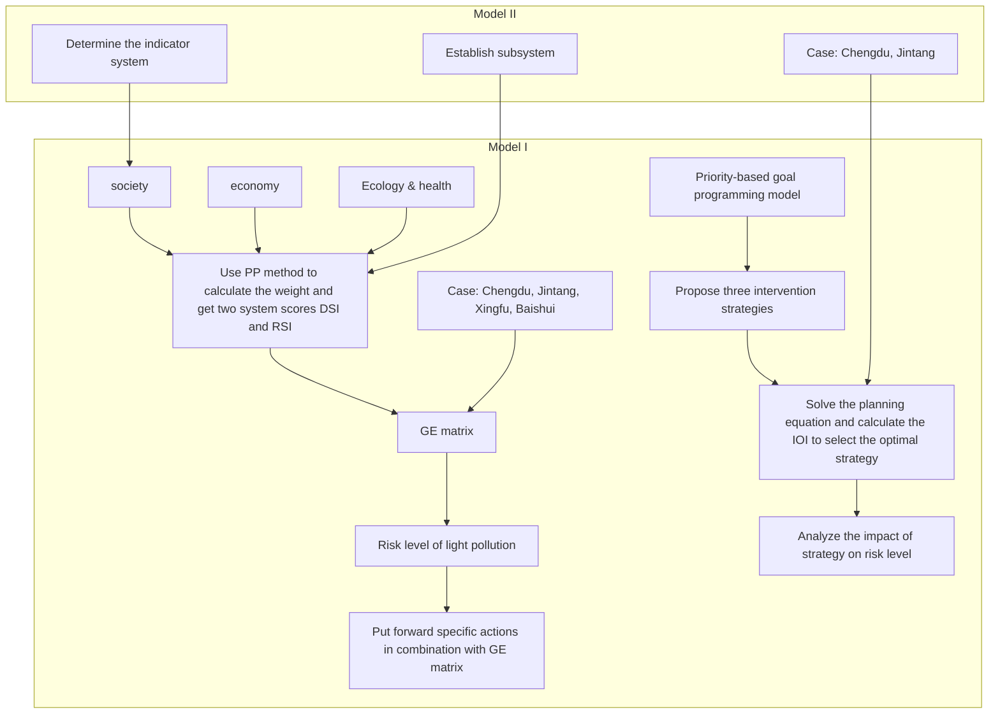
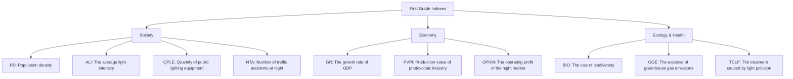
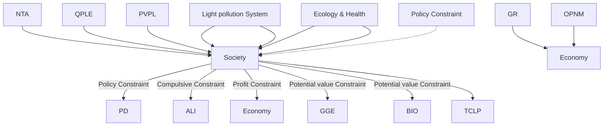
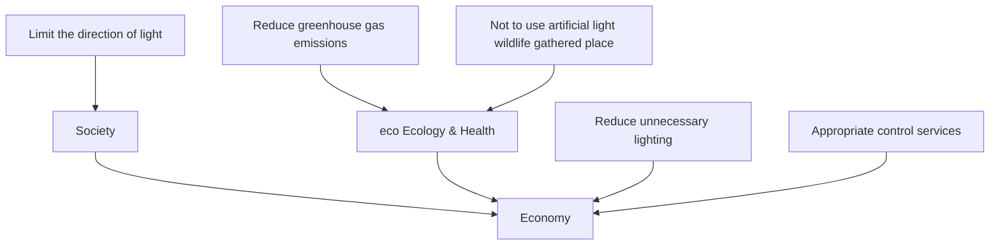

# The brighter the light, the deeper the shadows

## Summary

Light pollution is a new source of environmental pollution, which brings various adverse effects to society, human beings, and even the whole ecosystem. Thus, we established a broad light pollution risk assessment model and a flexible intervention strategy model to reduce the impact of light pollution.

Firstly, we build a risk assessment model based on GE matrix. Our team select 10 indicators from social, economic and ecological&health dimensions to establish a system (Figure3). Then re-divide the indicators into artificial light damage system(DS) and requirement system(RS).We get the weight of indicators by projection pursuit method. Next, we define the scores of our two systems as DSI and RSI respectively. Taking DSI and RSI as the horizontal and vertical coordinate axis of the GE matrix, the GE matrix can be divided into 9 regions (Ⅰ\~Ⅸ) and 3 levels $( \mathrm { A } , \mathrm { B } , \mathrm { C } )$ .Level A,B and C are in descending order.

Secondly, ignoring intra-regional differences, we apply our risk assessment model to four regions in China: Chengdu (urban), Jintang(suburban), Xingfu Vil(rural), Baishuihe Nature Reserve (protected). The results show that the risk level of light pollution in Chengdu is level B. Jintang is level C. Xingfu Vil and Baishuihe Nature Reserve are level A.

Thirdly, we establish a goal programming model for intervention strategy formulation. We introduce priority factors $P _ { i }$ and positive and negative bias variables $( d _ { i } ^ { + } , d _ { i } ^ { - } )$ to implement region-specific flexible intervention strategies from three dimensions. We take the weighted sum of the $( d _ { i } ^ { + } , d _ { i } ^ { - } )$ of all constraints as the objective function. Then establish the constraint conditions through the secondary indicators of three dimensions (equation 10). Furthermore, we discuss three targeted intervention strategies: social, economic, and ecological &health strategies. For example, social intervention strategies mainly control artifi cial light intensity and other actions at the social dimension. While intervention in the other two dimensions is secondary. The specific actions of each strategy and their impact on light pollution risk are detailed in 5.2.

Further, in order to select the most effective intervention strategy in a specific region, we introduce Intervention Optimization Index (IOI). Based on the goal programming model, we select the strategy corresponding to the minimum value of IOI by changing the priority factor and adjusting the constraint conditions. We apply our intervention strategy model to Chengdu and Jintang. The optimal strategy in Chengdu is social intervention strategy while Jintang is economic intervention strategy. We use GE matrix to compare and analyze the light pollution risk level and various indicators before and after intervention. The light pollution risk level is increased from B to A in Chengdu, and C to B in Jintang. After interven tion, IOI in Chengdu and Jintang decrease by 13.4%and 11.1%.

Finally, we analyze the sensitivity and robustness of four constraint parameters of objective programming of intervention strategy. It is worth mentioning that we introduced the MAPE index to test the robustness of our model. The results show that the MAPE of target planning in Chengdu and Jintang is 1.5% and 3.0%. Our model is very robust.

Keywords: light pollution; Projection pursuit ; GE matrix; Priority factor ; Goal planning

## Contents

## 1 Introduction.......

1.1 Problem Background  
1.2 Restatement of the Problem... 4  
1.3 Our Work

## 2 Assumptions and Justifications ...

## 3 Notations..........

## 4 Light pollution risk assessment model .........

4.1 Reorganizing index - Establish DS and RS system  
4.2 PP：Solution for Risk Assessment Model.  
4.3 Our metric: risk assessment via GE matrix .  
4.4 Application: four diverse types of locations in China ..10

## 5 Light pollution intervention model ........... .....13

5.1 Reanalysis of light pollution risk system. .13  
5.2 Priority-based intervention strategy model . .14  
5.3 Choice of intervention strategy.... .16  
5.4 Case Studies: Chengdu City and Jintang County ..... .17

## 6 Sensitivity and robustness analysis .......

## 7 Model Evaluation and Further Discussion ........ .2

7.1 Strengths. .22  
7.2 Weaknesses .22

## References....... .24

## Appendices ............ .25

## 1 Introduction

## 1.1 Problem Background

With the rapid development of urbanization, the global trend of using external lighting to illuminate cities for night-time activities is on the rise. The problem of light pollution was first raised in the 1930s by the International Astronomical Society, which believed that light pollution was a negative effect on astronomical observation caused by outdoor lighting in cities to brighten the sky.

Internationally, light pollution is divided into three categories—white light pollution, artificial day and color light pollution. White light pollution is mainly due to the reflection of buildings and color light pollution is mainly used in indoor entertainment. This paper only discusses the artificial day which brought by outdoor artificial light.

The harm caused by light pollution has a great impact on human society and ecological environment.[1] With the development of cities and the continuous increase of population, the number of lights used by private, commercial and public is increasing. People can travel, pro duce, trade and consume at night, which brings great economic benefits to the city. However, too much light has bad effects on people's physical and mental health, causing many diseases. At the same time, people in certain occupations, such as drivers, often face white light pollution. That causes great harm to their eyesight. Excessive and non-compliant use of light leads to traffic accidents and other problems, which in turn brings certain economic losses to people.

Ecological light pollution has obvious influence on the behavior of organisms and population ecology in natural environment. Light pollution will lead to the loss and dislocation of biological direction (especially for nocturnal animals), and confusion about sleep schedules. This in turn may affect their foraging, breeding, migration and communication.[2]

text_image

Astronomical light pollution reduces the number of visible stars
Unshielded lights can cause both astronomical and ecological light pollution
Sky glow from cities disrupts distant ecosystems
Tall, lighted structures are collision hazards
Shielded lights reduce astronomical light pollution but may still cause ecological light pollution

Figure 1: Diagram of ecological and astronomical light pollution

Today, people's life and the normal operation of society cannot do without artificial light. For example, street lighting makes it possible for people to travel normally and safely at night.

The popularization of street lighting reduces the crime rate. The negative effects of artificial light: light pollution cannot be improved by blindly banning the use of artificial lights. Measures should be taken to integrate the specific economic, ecological, population and other aspects of a place. Therefore, our team build a model to identify the level of light pollution risk in a place, propose intervention strategies, and analyze its impact.

## 1.2 Restatement of the Problem

In order to formulate effective light pollution intervention policies, it is necessary to study how to measure and mitigate the impact of light pollution in different places. Our team undertook the following work:

Establish a light pollution risk level assessment model.  
Assess the risk level of light pollution in four different regions and analyze the assessment results based on the actual situation.  
Develop three detailed intervention policies and analyze their potential impact on the impact of light pollution.  
Select two locations, determine the most effective intervention strategy, and study the influence of intervention strategy on the light pollution risk level at this location.  
 Develop a one-page leaflet to promote a local light pollution intervention strategy.

## 1.3 Our Work

First of all, we build a system with society, economy, ecology & health which are the first indicators. 10 factors as population density are put into the second indicators. Then we build the artificial light damage system (DS) and the artificial light requirement system RS. We divide the secondary indicators into the two systems according to whether they belong to the requirement or the damage. DSI and RSI scores are used to assess the light pollution risk levels of the two systems respectively. The weights of the indicators are determined by plugging the data of 40 countries into the PP(projection pursuit) method. Then, we combine DSI and RSI scores with GE matrix to comprehensively assess the risk level of light pollution. We apply our model to Chengdu, Jintang County, Xingfu Village and Baishuihe Nature Reserve in China. The light pollution risk level of these four areas are obtained and the results were analyzed.

Then we build a light pollution intervention model. On the basis of the second indicators , we analyze the relationship between the second indicators and made preparations for the formulation of intervention strategies. We then build a goal programming model. Our target is to reduce light pollution, improve or maintain the existing order of social, economic and ecology & health. Priority factors are introduced to reflect the priorities of intervention strategies. Then, we put forward three intervention strategies: social intervention strategy, economic intervention strategy, ecological and health intervention strategy. At the same time, the concrete measures and effects of these three strategies are discussed. Based on the system established in the first question and the actual situation, specific measures are proposed for each strategy. We also analyze the impact of these actions on the effects of light pollution.

Further, we propose the intervention optimization index (IOI). By changing the selection of priority factors, goal programming model is solved and the value of the IOI is calculated.

We evaluate the effect of three intervention strategies by combining GE matrix, and then select the optimal strategy.

Finally, we choose Chengdu and Jintang County to get the most effective strategies and specific actions for the two regions respectively through our model. We further discuss the impact of these strategies on risk levels.

flowchart

Figure 2: Our work

## 2 Assumptions and Justifications

The risk assessment of light pollution and the formulation of intervention strategies should take into account economic, social, ecological and other factors. It is not possible to model every possible scenario. So we make some reasonable assumptions to simplify the model, each with a corresponding explanation:

Assumption1：A region under study is a whole unit, regardless of its internal regional differences.

Justification1: The areas we selected for study vary greatly, but the overall characteristics of these areas are significant. Therefore, we can ignore the differences in different places inside. This study is a prerequisite for our in-depth study.

Assumption2: Ignore government costs and other factors when formulating strategies.

Justification2: Some factors have little influence, or ignoring some factors can simplify the model.

Assumption3: Assume that the mathematical relationship between secondary indicators is independent of each other.

Justification3: Facilitate the establishment of models and the proposal of strategies.

## 3 Notations

The key mathematical notations used in this paper are listed in Table 1.

Table 1: Notations used in this paper

<table><tr><td>Symbol</td><td>Description</td></tr><tr><td>DSI</td><td>An index that reflects the magnitude of a positive effect</td></tr><tr><td>RSI</td><td>An index that reflects the magnitude of a negative effect</td></tr><tr><td> $\omega_j$ </td><td>The weight of the secondary index (i = 1, 2, ...)</td></tr><tr><td> $z_i$ </td><td>One-dimensional space projection (i = 1, 2, ...)</td></tr><tr><td> $r_{ij}$ </td><td>The distance between the projected eigenvalues</td></tr><tr><td> $S_w$ </td><td>The standard deviation of the projected eigenvalue</td></tr><tr><td> $D_w$ </td><td>The local density of the projection eigenvalues</td></tr><tr><td> $x_{ij}$ </td><td>Second Grade Index (i = 1,2; j = 1, 2, ..., 5)</td></tr><tr><td> $P_k$ </td><td>priority factors (k = 1, 2, ..., n-1)</td></tr><tr><td> $d_m^+$ </td><td>the target value is not allowed to be reached (m = 1, 2, ...)</td></tr><tr><td> $d_m^-$ </td><td>the target value is allowed to be exceeded (m = 1, 2, ...)</td></tr><tr><td>IOI</td><td>the intervention optimization index</td></tr></table>

## 4 Light pollution risk assessment model

The assessment of the risk level of light pollution is an important prerequisite to propose intervention strategies for light pollution in a specific area. According to relevant literature [3][4][5], light pollution interacts with society, economy and ecology& health. We comprehensively consider the endogenous correlation between light pollution and these above factors. Then we extract 3 primary indexes and 10 secondary indexes, and preliminarily establish the light pollution risk system as shown in the figure 3.

In addition, we do not consider many redundant factors, which will eliminate unnecessary obstacles for the subsequent model optimization, thus conducive to the subsequent analysis of index mechanism.

flowchart

PS: Indexes belonging to the requirement system are marked in redwhile indexes belonging to the damage system are marked in black  
Figure 3: Light pollution risk level indicator system

## 4.1 Reorganizing index - Establish DS and RS system

Generally speaking, risk assessment needs to consider the advantages and disadvantages, supply and demand relationship and other factors. Metric of the risk of light pollution should be based on two perspectives:

a) Damage of the excessive use of artificial light, including adverse effects on society , people's lives and destruction to the ecological environment.  
b) The requirement of artificial light for human normal work and life. This is mainly reflected in industrial production, urban construction and other production activities.

By considering the relationship between the secondary index and the risk of light pollution, we reclassify the secondary index and sort out the two evaluation subsystems of DS (artificial light damage system) and RS (artificial light requirement system). The specific indicators of each subsystem are shown in the following table.

Table 2: Symbolic Notation of the secondary indicators

<table><tr><td>DS Indicators</td><td>NRC</td><td>EC</td><td>GGE</td><td>BIO</td><td>DCLP</td></tr><tr><td>Symbolic Notation</td><td> $x_{21}$ </td><td> $x_{22}$ </td><td> $x_{23}$ </td><td> $x_{24}$ </td><td> $x_{25}$ </td></tr><tr><td>RS Indicators</td><td>PD</td><td>ALI</td><td>QPLE</td><td>GR</td><td>PVPI</td></tr><tr><td>Symbolic Notation</td><td> $x_{11}$ </td><td> $x_{12}$ </td><td> $x_{13}$ </td><td> $x_{14}$ </td><td> $x_{15}$ </td></tr></table>

\*All indicators in the table are abbreviations for secondary indicators. Detailed secondary indicators and their types are in the Appendix.

Therefore, We can obtain the linear relationship between each system and the classified indicators. The scores of the two subsystems are used as the benefit index to evaluate the risk of light pollution, and are calculated as DSI and RSI respectively. We define ?? as the weight. So we get the following formula:

$$
D S I = \sum_ {i = 1} ^ {5} w _ {1 i} x _ {1 i} ^ {*} \tag {1}
$$

$$
R S I = \sum_ {i = 1} ^ {5} w _ {2 i} x _ {2 i} ^ {*} \tag {2}
$$

Where $x _ { 1 i } ^ { * } , x _ { 2 i } ^ { * }$ refer to the data after min-max normalization particularly. In the later model, we continue to use $x _ { 1 i } , x _ { 2 i }$ to represent the data which has been processed.

Next, we select 40 countries in the world that are affected by light pollution to varying degrees, and use projection pursuit method (PP) to solve and analyze the CS and RS evaluation models.

## 4.2 PP：Solution for Risk Assessment Model

The basic principle of projection pursuit method is to project the high-dimensional data to the low-dimensional space through some combination, and to reflect the features of the original high-dimensional data by maximizing the projection index. We can study and evaluate high dimensional data by analyzing one-dimensional data. We use projection pursuit method to assign weights to each index under DS and RS system respectively. Finally, the result of weighting is converted into the projection score of one-dimensional space.

## The steps of projection pursuit are as follows:

I. Analyze the index of the sub-system (DS and RS). The indicators are processed in a positive and standardized way.  
II. Construct linear projections. Observe the data from different directions to find the optimal projection direction that fully reflects the characteristics of the indicators. We pick some random projection directions $w = ( w _ { 1 } , w _ { 2 } , w _ { 3 } . . . w _ { m } )$ , and calculate the size of the projection index function. Determine the projection solution of the maximum index function as the optimal projection direction. For the i th sample, its one-dimensional space projection can be expressed as:

$$
z _ {i} = \sum_ {j = 1} ^ {m} w _ {j} x _ {i j} \tag {3}
$$

III. Construct the projection index function. Depending on the definition of the optimal projection direction, we want the distribution of the projection eigenvalues $z _ { i }$ to satisfy:

1. As a whole, the projection cluster is spread out as far as possible.  
2. Local projection points are as dense as possible.

In order to meet the above conditions, the objective function may be constructed as:

$$
\max Q (w) = S _ {w} D _ {w} \tag {4}
$$

Where $S _ { w }$ is the standard deviation of the projected eigenvalue, and $D _ { w }$ is the local density of the projected eigenvalue. The formula is as follows:

$$
S _ {w} = \sqrt {\sum_ {i = 1} ^ {n} (z _ {i} - \overline {{z _ {w}}}) / (n - 1)} \tag {5}
$$

$$
w = \sum_ {i = 1} ^ {n} \sum_ {j = 1} ^ {n} (R - r _ {i j}) u (R - r _ {i j}) \tag {6}
$$

Where $r _ { i j }$ means the distance between the projection eigenvalue, $r _ { i j } = | z _ { i } - z _ { j } | ( i , j =$ $1 , 2 , \ldots n )$ . ??(??) is the step function which is $u ( t ) = \left\{ { 0 , t < 0 } \atop { 1 , t \geq 0 }  \right\}$ , R is the parameter for estimating the local scatter density, and we take ?? = 0.1?????? $( r _ { i j } )$ .

IV. Optimize the projection direction. To sum up, in order to find the optimal projection direction ??, we build a nonlinear optimization model:

$$
\max Q (w) = S _ {w} D _ {w} \tag {7}
$$

$$
s. t. \left\{ \begin{array}{c} \sum_ {j = 1} ^ {m} w _ {j} ^ {2} = 1 \\ 0 <   w _ {j} <   1 \\ S _ {w} = \sqrt {\sum_ {i = 1} ^ {n} (z _ {i} - \overline {{z _ {w}}}) / (n - 1)} \\ D _ {w} = \sum_ {i = 1} ^ {n} \sum_ {j = 1} ^ {n} (R - r _ {i j}) u (R - r _ {i j}) \\ u (t) = \left\{ \begin{array}{l l} 0, t <   0 \\ 1, t \geq 0 \end{array} \right. \\ r _ {i j} = | z _ {i} - z _ {j} | \\ R = 0. 1 m a x (r _ {i j}) \end{array} \right. \tag {8}
$$

This is a complex nonlinear optimization. We consider using GA algorithm to optimize the solution process. We obtain the optimized projection weight?? $\mathbf { \Psi } = ( w _ { 1 } , w _ { 2 } , w _ { 3 } , \dots , w _ { m } )$ by using MATLAB ga toolbox. Finally, the weight results are represented by radar map(Figure 4). We believe that the weight obtained is universal, and this result is still used in the later models.

radar chart

|        | Value  |
| ------ | ------ |
| NTA    | 0.701  |
| OPNM   | 0.155  |
| GGE    | 0.498  |
| BIO    | 0.201  |
| TCLP   | 0.446  |

radar chart

|        | Value  |
| ------ | ------ |
| PD     | 0.425  |
| ALI    | 0.612  |
| QPLE   | 0.314  |
| GR     | 0.215  |
| PVPI   | 0.566  |

Figure 4: Weight radar map

Through the linear relation of DSI, RSI and index, the score of DS system and RS system can be calculated respectively. Two scores that assess the level of light pollution risk.

## 4.3 Our metric: risk assessment via GE matrix

In order to better assess the risk level of light pollution in a certain area, we carefully consider the significance and relationship between DS and RS. And we adopt GE matrix assisted analysis. The GE Matrix, also known as the McKinsey Matrix, is an efficient tool for analyzing business strategy. Measures business competitiveness and market attractiveness by introducing multiple factors and quantifying scores. Determine the position of business in the business strategy of the enterprise, so as to formulate the strategy in line with the development of the enterprise.

We believe that DSI and RSI reflect the relative risk (benefit and harm) of light pollution from two dimensions, which is similar to the relationship between business competitiveness and market attractiveness on enterprise business strategy. Then we use DSI as the horizontal axis and RSI as the vertical axis to describe the risk level of light pollution according to its distribution on the GE matrix. Both the calculated DSI and RSI are normalized so that their values were between (0,1). According to the actual situation, DSI and RSI are divided into three grades (Table X).

Table 3：Index classification

<table><tr><td>The value of DSI</td><td>Level</td><td>The value of RSI</td><td>Level</td></tr><tr><td>0~0.3</td><td>Low</td><td>0~0.3</td><td>Low</td></tr><tr><td>0.3~0.7</td><td>Medium</td><td>0.3~0.7</td><td>Medium</td></tr><tr><td>0.7~1</td><td>High</td><td>0.7~1</td><td>High</td></tr></table>

heatmap

| ISRI \ DSI | 0.1 | 0.2 | 0.3 | 0.4 | 0.5 | 0.6 | 0.7 | 0.8 | 0.9 | 1.0 |
| :---: | :---: | :---: | :---: | :---: | :---: | :---: | :---: | :---: | :---: | :---: |
| Optimal range | 0.1 | 0.2 | 0.3 | 0.4 | 0.5 | 0.6 | 0.7 | 0.8 | 0.9 | 1.0 |
| IX | 0.1 | 0.2 | 0.3 | 0.4 | 0.5 | 0.6 | 0.7 | 0.8 | 0.9 | 1.0 |
| VIII | 0.1 | 0.2 | 0.3 | 0.4 | 0.5 | 0.6 | 0.7 | 0.8 | 0.9 | 1.0 |
| VII | 0.1 | 0.2 | 0.3 | 0.4 | 0.5 | 0.6 | 0.7 | 0.8 | 0.9 | 1.0 |
| VI | 0.1 | 0.2 | 0.3 | 0.4 | 0.5 | 0.6 | 0.7 | 0.8 | 0.9 | 1.0 |
| V | 0.1 | 0.2 | 0.3 | 0.4 | 0.5 | 0.6 | 0.7 | 0.8 | 0.9 | 1.0 |
| I | 0.1 | 0.2 | 0.3 | 0.4 | 0.5 | 0.6 | 0.7 | 0.8 | 0.9 | 1.0 |
The image contains a grid where each cell is colored according to its value, and the text 'Optimal point' is highlighted in red on the top-left corner.

Figure 5: GE matrix diagram

We visualize the GE matrix (Figure 5).Since both DSI and RSI are divided into three levels, the GE matrix is divided into nine parts. Then we combine GE matrix to evaluate the risk of light pollution:

1) DSI represents the magnitude of the negative effect caused by artificial light. The higher the DSI, the greater the degree of damage to the assessed object by artificial light, which is not conducive to the sustainable development of ecological environment. RSI stands for positive effects caused by artificial light. The higher the RSI is, the greater the system needs and relies on artificial light. In order to maintain normal social life and economic development, human beings still need to use a large number of artificial light sources.  
2) The smaller the DSI is and the larger the RSI is, the lower the relative risk of light pollution is. We set regions VI, VII, and VIII as A, I, V, and IX as B, and II, III, and VI as C. The risk of light pollution is similar in areas of the same grade. The risk levels in regions A, B and C decreased successively.  
3) At the same time, we believe that region VII is the ideal region in the GE matrix, and its light pollution risk is at a relatively low degree. The coordinate (0,1) is set to the optimal ideal point.

## 4.4 Application: four diverse types of locations in China

China is one of the countries with the most severe light pollution, with a large population and rich geographical environment. Therefore, we apply the light pollution risk assessment model to China. First, collect the global data as sample analysis, and then choose Sichuan

Province as the case study object. Then, the risk assessment model is applied to the following four sites: Chengdu City (an urban community), Jintang County (a suburban community), Xingfu Vil (a rural community), Baishuihe Nature Reserve (a protected land location).The data collect for each indicator are shown in Table 4. In addition, we combine GE matrix and the actual situation of the local comparative analysis.

Some of the points are listed below:

The scope of Chengdu in this paper only includes several major districts in the urban area of Chengdu, not all the districts under the jurisdiction of Chengdu.  
Jintang County is a relatively concentrated area in the suburbs of Chengdu City, so it is taken as one of the objects of evaluation.  
The population density of the nature reserve is extremely low, but there are still a few staff members staying here.  
In order to facilitate the assessment of local light pollution risk level, this section temporarily does not consider the impact of local policies, and only collects and analyzes relevant data.

text_image

Baishuihe Nature
Reserve
Xingfu Vil
Chengdu
Jintang
Pido District
Wengyang District
Shuang District
Chongyang District
Dai County
Guangzhou District
Guangzhou District
Zhongjiang County
Liujiang District
Mianzhuang District
Guangzhou District
Guangzhou District
Xingfu Vil
Chengdu
Jintang
Pido District
Wengyang District
Shuang District
Chongyang District
Dai County

Figure 6: Light pollution map

Based on the data collected from authoritative literatures [6][7][8] and websites [9][10], we have sorted out important data (parts) as shown in Table 4.

Table 4: Partial data for four locations

<table><tr><td></td><td>PD</td><td>ALI</td><td>QPLE</td><td>......</td></tr><tr><td>Chengdu</td><td>2868</td><td>204.93</td><td>1559880</td><td>......</td></tr><tr><td>Jintang</td><td>838</td><td>145.16</td><td>43330</td><td>......</td></tr><tr><td>Xingfu Vil.</td><td>384</td><td>1.70</td><td>3321</td><td>......</td></tr><tr><td>Baishuihe Na-ture Reserve</td><td>15</td><td>0.03</td><td>169</td><td>......</td></tr></table>

We substitute the data of the four regions under each index into the two evaluation subsystems of DS and RS constructed above, and get the corresponding DSI and RSI. The specific values are shown in the square bar chart below. According to the values of DSI and RSI, trace the corresponding points in the GE matrix diagram:

  
Figure 7: value of Index (left) and points in GE matrix diagram (right)

The figure above shows the GE matrix of the four regions, and the histogram of DSI and RSI. According to the light pollution risk assessment method in $4 . 3 ,$ it can be concluded that Chengdu is in B, Jintang is in C, Xingfu Vil and Baishuihe Nature Reserve are in A. Here is an explanation of the risks of light pollution in four regions:

I Chengdu：RSI scores are relatively high, indicating that Chengdu artificial lighting demand is large. Chengdu, as the core and important hub of Sichuan Province, has witnessed rapid urban expansion and population growth in recent years. Urban areas carry a city's housing, industry, and commerce. The city of Chengdu has developed a night-time economy and built large service industries, such as night markets. Road lighting, airports, high-speed trains and so on all require the use of a lot of artificial lights. The huge benefits generated by Chengdu's night economy cannot be separated from the use of night lights.

However, the high DSI score indicates that Chengdu also suffers more losses from artificial lighting. The excessive use of artificial lights makes the city too bright at night, which will have a certain impact on the people living in the city. Turning on the lights of commercial street billboards all night has caused a waste of resources and led to some civil disputes. The large number of vehicles has resulted in a large number of accidents at night due to the use of wrong lights. Ecological problems are serious.

Jintang, a suburban county of Chengdu, has a relatively high RSI. Jintang's proximity to downtown Chengdu has attracted many people to settle there. The suburbs are mainly used for housing and industry. No bustling commercial streets, no need to generate huge economic benefits to the city. Suburban population is large, the use of artificial lights in private and public facilities is more, there is little need for a large number of lighting commercial streets.

Jintang has a high DSI index. Since the suburbs are mainly where people live, the negative effects of excessive artificial lighting are obvious. The harm to people's body and living environment is relatively large. At the same time, due to the incomplete construction planning and management system in this area, there is a relatively obvious phenomenon of excessive use of artificial light.

XingfuVil, a village near Chengdu. RSI scores are high, but lower than those in the suburbs. Lighting demand in rural communities mainly comes from people's life and agricultural production. The rural population is smaller than the suburbs, there is no large service industry, night markets, etc., less night lighting can meet the needs. As this area is close to a big city like Chengdu, the rural population and demand are larger than those of other areas (especially remote areas), and the positive impact of artificial light is larger. Rural natural environment area accounts for a large proportion of animals and plants. The low DSI score in this area indicates that the loss of light pollution is relatively small. People and living things are less exposed to light pollution.

I The RSI index of Baishuihe Nature Reserve is low, and its demand for light is less. A low DSI indicates light pollution. The population of protected areas is usually small, so the need for lighting is naturally low, but some protected areas have tourist areas, which have an impact on the natural environment. In addition, rangers patrolling the forest at night or lighting some monitoring equipment also contribute to weak light pollution in the area.

To sum up, Chengdu and Jintang have a high risk of light pollution, which is also due to the inevitable negative effects of urbanization. However, appropriate intervention measures can be taken to reduce or weaken the negative effects without affecting the normal living needs of human beings. Light pollution risk levels for XingfuVil and Baishuihe Nature Reserve are low, because natural ecosystems and wildlife occupy most of the area. Thus artificial light is more likely to diffuse into the natural environment and cause significant impacts on a large number of wildlife. So appropriate interventions are still needed to limit light pollution in the area.

## 5 Light pollution intervention model

In the previous section, we developed a model that allows for a broad assessment of light pollution risk levels, and evaluated regions in China. In this section, we expect to propose three different intervention policies to effectively intervene light pollution in different areas. In addition, we apply our intervention policies to specific places and analyze their impact on the level of light pollution risk in that place.

## 5.1 Reanalysis of light pollution risk system

Various influencing factors should be considered comprehensively in formulating the intervention strategy of light pollution in a certain area. According to the index system established above (Figure 3), systematic intervention strategies can be established. We find that the secondary indicators in the lower part of the light pollution risk system are intrinsically related, which may affect the degree of light pollution harm and may reflect the demand for artificial light.

Therefore, we start from three dimensions, namely first-level indicators (Society, Economy, Ecology&Health) and conduct correlation analysis for second-level indicators. The relationship between primary indicators and light pollution must also be obtained. Combining with the actual situation, we consider three feasible measures under the Angle of light pollution intervention.

Next, we visualized the results of the analysis using Vensim, as shown in Figure 8.

flowchart

Figure 8: System dynamics analysis of light pollution system

## 5.2 Priority-based intervention strategy model

We regard the adoption of intervention strategies as goal planning: that is, the objectives of intervention strategies are proposed from three dimensions (Society, Economy, Ecology & Health). Try to improve or maintain the existing order of social, economic and ecology while reducing light pollution. Our intervention strategies should be biased, for example, focus on light pollution interventions in the social dimension, while interventions in the other two dimensions are regarded as secondary.

So we took inspiration from multi-objective programming and introduced priority factors. We think that interventions on light pollution are prioritized in different dimensions. The degree of intervention is reflected by priority factors through goal programming. For n priority factors, we specify:

$$
P _ {k} \gg P _ {k + 1}, k = 1, 2, \dots n - 1
$$

Where $P _ { k } \gg P _ { k + 1 }$ 1 means that $P _ { k }$ has a higher priority than $P _ { k + 1 }$ .

We take Chengdu as an example, and we still use the data of 2022 indicators in 4.4. At the same time, we consider positive deviation variables $( d _ { i } ^ { + } )$ and negative deviation variables $( d _ { i } ^ { - } )$ in the goal programming. The deviation variable represents the part of the decision value that does not reach the target value. Therefore, different from rigid constraints in linear programming, constraints containing deviation variables are called soft constraints (target constraints). If we hope the intervention to be prioritized from high to low is: Society, Ecology & Health, and Economy, then the goal-planning model should be:

$$
\min y = P _ {1} d _ {1} ^ {+} + P _ {2} \left(d _ {2} ^ {-} + d _ {2} ^ {+}\right) + P _ {3} d _ {3} ^ {+} \tag {9}
$$

$$
s. t. \left\{ \begin{array}{c} \sum_ {i = 1} ^ {5} \omega_ {1 i} x _ {1 i} \geq 1. 1 \sum_ {j = 1} ^ {5} \omega_ {2 j} x _ {2 j} \\ x _ {1 1} - 0. 0 0 1 x _ {2 1} + d _ {1} ^ {-} - d _ {1} ^ {+} = 0 \\ x _ {2 3} + x _ {2 4} + x _ {2 5} + d _ {2} ^ {-} - d _ {2} ^ {+} = 2 0 0 \\ x _ {1 5} + x _ {2 2} - 0. 1 5 x _ {1 4} + d _ {3} ^ {-} - d _ {3} ^ {+} = 0 \\ x _ {1 2} \leq 1 5 0 \\ x _ {i j}, d _ {m} ^ {-}, d _ {m} ^ {+} \geq 0 (i = 1, 2; j = 1, 2, \dots , 5; m = 1, 2, 3) \end{array} \right. \tag {10}
$$

In the constraint condition, $\omega _ { 1 i }$ and $\omega _ { 2 j }$ represent the index weights obtained by the projection pursuit method in 4.2. We apply rigid constraints on RS and DS systems, requiring RSI to be 10% higher than DSI. In the constraint, including $d _ { i } ^ { + }$ means that the target value is not allowed to be reached, including $d _ { i } ^ { - }$ means that the target value is allowed to be exceeded, and including $( d _ { i } ^ { - } + d _ { i } ^ { + } )$ means that the target value is just reached. Our objective function y should measure and minimize the positive and negative deviations of all constraints, and constrain second-level indexes of each dimension to different degrees.

For example, the constraint $x _ { 1 1 } - 0 . 0 0 1 x _ { 2 1 }$ means that the number of traffic accidents at naight should not be greater than 1‰ of population density. $x _ { 1 5 } + x _ { 2 2 } - 0 . 1 5 x _ { 1 4 }$ indicates that the combined output value of the PV industry and the night market service industry does not exceed 15% of GDP. The constraint condition of $x _ { 2 3 } + x _ { 2 4 } + x _ { 2 5 } = 2 0$ indicates that the loss of GGE, BIO and TCLP is not more than 20 billion yuan. The numerical value of each index can be solved by MATLAB.

We are primarily concerned with light pollution interventions from the social dimension, so it is given the priority $P _ { 1 }$ . Ecology & Health and economics come second, and we assign priority $P _ { 2 }$ and $P _ { 3 } ,$ respectively. We assign weight to each priority according to the actual local conditions. $P _ { 1 }$ is considered to be twice the relationship of $P _ { 2 }$ and $P _ { 2 }$ is 1.5 times the relationship of $P _ { 3 }$ . We define three main intervention strategies according to priority $P _ { 1 } \mathbf { \cdot }$ : Social intervention strategy, economic intervention strategy, and ecological & health intervention strategy. Our intervention strategy is highly targeted, and several relevant interventions are explained in the figure below. According to the different bias, analyze the secondary indexes, we get the following intervention strategy, the interpretation of the related intervention measures as shown in figure 9.

## Social dimension

In accordance with the International Dark Sky Association regulations, artificial light distribution, to reduce the light invasion phenomenon[11]. Reasonable planning of green space and color space. establish and improve a legal system for the prevention and control of light pollution and unify standards for its control. Utilizing light sources of minimum intensity necessary to accomplish the light's purpose.

## Economic dimension

Reduce unnecessary lighting. Turning lights off using a timer or occupancy sensor or manually when not needed. Lighting is for the convenience of human activities in the dimly lit space. However, in some places where human activities are few at night, the intensity of artificial light is very high, which not only causes the waste of energy, but also aggravates the light pollution in the area. Adjusting the type of lights used, so the light waves emitted are those that are less likely to cause severe light pollution problems.

## Ecological and health dimension

Limiting greenhouse gas emissions. Artificial light sources will produce carbon dioxide and other greenhouse gases, damaging the ecological environment. Reducing the greenhouse gases produced by lighting is also a way to reduce the harm of light pollution. Use minimal or no artificial light sources in areas where wildlife animals gather together. Wild animals and plants have adapted their life style to nature, and human activities often have negative effects on them. Human beings should try to avoid their own activities' impact on wild animals and plants.

As a matter of fact, the causes of light pollution are many and the effects are complex. So there are a number of possible intervention strategies, and here is just a brief list of some of the specific measures that are available and the potential impact of taking those actions.

flowchart

Figure 9: Concept map of the intervention strategies

## 5.3 Choice of intervention strategy

Next, we can repeat the priority intervention strategy model. By changing the priorities of Society, Ecology & Health, and Economy, adjusting the constraints appropriately, and solving the goal planning, we can gain the optimized intervention strategy data of the group $A _ { 3 } ^ { 3 } =$ 6. However, with only intervention strategy data, we cannot determine which priorities are most likely to reduce light pollution.

Therefore, we combine the GE matrix and get inspiration, by calculating the distance between the optimal point (0,1), proposed the intervention optimization index (IOI).And we evaluate the effect of the intervention strategies. We believe that the smaller the IOI value, the better the effect of such intervention strategies on the optimization of light pollution risk level. This is an evaluation method to optimize system synthesis. Its calculation formula is:

$$
I O I = 1 0 0 \times \sqrt {(D S I - 0) ^ {2} + (R S I - 1) ^ {2}} \tag {11}
$$

The size of IOI is determined by DSI and RSI, and the interval value of IOI in this paper is between 0 and 141.4. In reality, due to limitations, we cannot reach the optimal ideal point, but can only get infinitely close to it.

## 5.4 Case Studies: Chengdu City and Jintang County

In order to test the effectiveness of our proposed intervention policy, We select Chengdu City and Jintang County as research objects. Because Chengdu City and Jintang County are very different in economic level, degree of modernization and other practical conditions, so the priority of their intervention strategies should be different. Also,the specific actions of the same intervention dimension will be slightly different. This is reflected in the difference of target planning and constraint conditions of the two regions. For example, in terms of the constraint conditions of artificial light intensity, Chengdu City and Jintang County are different. Our constraints are comprehensive and involve three intervention dimensions. See Section 4.2 for the target planning of Chengdu, and the target planning of Jintang County is as follows:

$$
\min y = P _ {1} d _ {1} ^ {+} + P _ {2} \left(d _ {2} ^ {-} + d _ {2} ^ {+}\right) + P _ {3} d _ {3} ^ {+} \tag {12}
$$

$$
s. t. \left\{ \begin{array}{c} \sum_ {i = 1} ^ {5} \omega_ {1 i} x _ {1 i} \geq 1. 0 8 \sum_ {j = 1} ^ {5} \omega_ {2 j} x _ {2 j} \\ x _ {1 5} + x _ {2 2} - 0. 1 2 x _ {1 4} + d _ {1} ^ {-} - d _ {1} ^ {+} = 0 \\ x _ {2 3} + x _ {2 4} + x _ {2 5} + d _ {2} ^ {-} - d _ {2} ^ {+} = 1 8 \\ x _ {1 1} - 0. 0 0 1 x _ {2 1} + d _ {3} ^ {-} - d _ {3} ^ {+} = 0 \\ x _ {1 2} \leq 1 1 0 \\ x _ {i j}, d _ {m} ^ {-}, d _ {m} ^ {+} \geq 0 (i = 1, 2; j = 1, 2, \dots , 5; m = 1, 2, 3) \end{array} \right. \tag {13}
$$

Then, we apply our intervention strategy model to Chengdu City and Jintang County. The process for combining model ideas with a specific locale is:

Algorithm : Intervention Strategies for Specific Locations
Input: Objective planning of intervention strategies model
Output:IOI $_{optimal}$ , optimal intervention strategies
1: Initialize objective function $y, P_{1}, P_{2}$ and $P_{3}$ ;
2: IOI=[];//Set the list of solutions
3: Max number of iterations=6;
4: k←0;
5: while (k<Max number of iterations)
6: if no optimal solution to the equation then
7: adjust the constraints appropriately;
8: else
9: figure out the optimal solution( $x_{11}, x_{12}...x_{24}, x_{25}$ );
10: RSI← $\sum_{i=1}^{5}\omega_{1i}x_{1i};$ RSI← $\sum_{i=1}^{5}\omega_{2i}x_{2i};$ 11: IOI[k]← $100 \times \sqrt{(DSI - 0)^{2} + (RSI - 1)^{2}}$ ;
12: change $P_{1}, P_{2}$ and $P_{3}$ for different dimensions ;
13: k++;

<table><tr><td>14:</td><td>end if</td></tr><tr><td>15:</td><td>end while</td></tr><tr><td>16:</td><td> $IOI_{optimal} \leftarrow min(IOI); // Obtain the optimal intervention strategies$ </td></tr><tr><td>17:</td><td>return  $IOI_{optimal};$ </td></tr></table>

Further, we obtain the IOI of Chengdu and Jintang County under the above 6 different intervention strategies. Through mapping the bubble chart of IOI (IOI value as small as possible, figure10), we can obtain what kind of the optimization of regional light pollution more comprehensive intervention strategy, and get the optimal IOI. For Chengdu, the social intervention strategy is better, while for Jintang County, the economic intervention strategy is better.

More specifically, Chengdu's priorities from high to low are Society, Ecology & Health, Economy while Jintang's priorities are Economy ,Ecology & Health, and Society in descending order.

bubble chart

| | Chengdu | Jintang |
|---|---|---|
| 1 | 79.12 | 91.31 |
| 2 | 70.73 | 83.06 |
| 3 | 89.74 | 71.97 |
| 4 | 86.17 | 66.67 |
| 5 | 93.45 | 69.98 |
| 6 | 88.34 | 71.55 |

Figure 10: the bubble chart of IOI

Table 5: The results of goal programming

<table><tr><td>Second grade in-dexes</td><td>PD( $x_{11}$ )</td><td>ALI( $x_{12}$ )</td><td>QPLE( $x_{13}$ )</td><td>GR( $x_{14}$ )</td><td>PVPI( $x_{15}$ )</td></tr><tr><td>Chengdu</td><td>2506.81</td><td>143.45</td><td>1513985</td><td>37.76</td><td>3.63</td></tr><tr><td>Jintang</td><td>822.64</td><td>101.61</td><td>62496</td><td>1.81</td><td>0.13</td></tr><tr><td>Second grade in-dexes</td><td>NTA( $x_{21}$ )</td><td>OPNM( $x_{22}$ )</td><td>GGE( $x_{23}$ )</td><td>BIO( $x_{24}$ )</td><td>TCLP( $x_{25}$ )</td></tr><tr><td>Chengdu</td><td>1.56</td><td>2.42</td><td>81.15</td><td>76.87</td><td>41.98</td></tr><tr><td>Jintang</td><td>0.93</td><td>0.09</td><td>7.63</td><td>5.91</td><td>5.41</td></tr></table>

We obtain the optimal value of the second-level index (Table 5), DSI and RSI by solving the objective programming. Using DSI and RSI as coordinates to draw on GE matrix graph, the optimization effect after intervention strategy can be intuitively seen. We combine GE matrix to discuss the corresponding intervention strategies for two sites respectively.

heatmap

| Region | DSI | RSI | Label |
| --- | --- | --- | --- |
| Chengdu | 0.95 | 0.85 | IX |
| Jintang | 0.72 | 0.65 | V |
| Jintang | 0.68 | 0.73 | X |
| Jintang | 0.55 | 0.64 | VII |
| Jintang | 0.12 | 0.98 | VII |
| Optimized Chengdu | 0.68 | 0.73 | X |
| Optimized Chengdu | 0.72 | 0.65 | VI |
| Optimized Jintang | 0.55 | 0.64 | VII |
| Optimized Jintang | 0.55 | 0.64 | VII |
| Optimized Jintang | 0.55 | 0.64 | VII |
| Optimized Jintang | 0.55 | 0.64 | VII |
| Optimized Jintang | 0.55 | 0.64 | VII |
| Optimized Jintang | 0.55 | 1.00 | VII |
| Optimized Jintang | 0.55 | 1.00 | VII |
| Optimized Jintang | 0.55 | 1.00 | VII |
| Optimized Jintang | 0.55 | 1.00 | VII |
| Optimized Jintang | 0.55 | 1.00 | VII |
| Optimized Jintang | 0.55 - 0.72 | 0.65 - 0.73 | X |
| Optimized Jintang | 0.55 - 0.72 | 0.65 - 0.73 | VII |
| Optimized Jintang | 0.55 - 0.72 | 0.65 - 0.73 | VII |
| Optimized Jintang | 0.55 - 0.72 | 0.65 - 0.73 | VII |
| Optimized Jintang | 0.55 - 0.72 | 1.00 - 1.00 | VII |
| Optimized Jintang | 0.55 - 0.72 | 1.00 - 1.00 | VII |
| Optimized Jintang | 0.55 - 0.72 | 1.00 - 1.00 | VII |

Figure 11: The optimal results in GE matrix diagram

## a) Chengdu

Analysis: As for the light pollution risk intervention in Chengdu, we focus on the social dimension, respectively constraining the population density and the number of lamps, and controlling the night traffic and the city. At the same time, the ecological diversity of birds, which are seriously damaged by light pollution, should be maintained, and human health should be paid attention to. The economic constraint is relatively loose, mainly try to maintain the power supply and the normal operation of the night market.

GE matrix can reflect the expected result after we implement intervention strategy macroscopically. The demand index RSI for artificial light in the city is slightly reduced while the light pollution level is greatly improved. After the implementation of the intervention strategy, the light pollution risk index of Chengdu is expected to reach Grade A.

We use the percentage bar chart (Figure 12) to compare some important secondary indicators before and after optimization. Interventions are specifically proposed based on the optimization results in Table 5.

## Intervention strategies:

 ALI is required to be reduced by 30% for significant optimization effect.  
 Strengthen traffic control and strictly control the number of traffic accidents at night.  
 Optimize the urban lighting system planning, according to the population density and lighting demand degree, divide strong main lighting area and weak lighting area.  
 Reduce the brightness of neon lights and LED screens, and try to use monochromatic light to reduce the clutter caused by colored lights.  
 Public lighting systems minimize the impact on the interior of residential buildings, reducing the medical costs of light pollution-related diseases (TCLP) by 20 percent.  
 Establish a sound legal system to set standards for the control and treatment of light pollution.  
 Limit the intensity of light in the city's upper air to reduce the impact on aerial animals.  
 Promote knowledge about light pollution and provide residents with environmental awareness and initiative.

The results of the priority-based programming model can be used as a reference for the

goals to be achieved in each field.

## b) Jintang

Analysis: For the light pollution risk intervention in Jintang County, we focus on the economic dimension. Adjust the industrial structure, especially the expansion industry that consumes a lot of artificial light. The profit of the output value of the photovoltaic industry is also strictly limited. Ecologically restrain the energy dissipation caused by artificial light, which is mainly greenhouse gases, and protect the biodiversity. In the social dimension, our constraints are looser in order to maintain relative stability.

GE matrix can reflect the expected result after we implement intervention strategy macroscopically. The DSI of light pollution in Jintang County, a suburb, can be reduced from 0.726 to 0.554.IOI decreased by 17.81%. After the implementation of the intervention strategy, the potential risk of light pollution in Jintang County has been improved and is expected to reach Grade B.

We use the percentage bar chart (Figure 12) to compare some important secondary indicators before and after optimization. Interventions are specifically proposed based on the optimization results in Table 5.

## Intervention strategies:

 Control the opening hours of night services and night markets.  
 Limit PV enterprise output value (PVPI) profit reduction by 20%.  
 Focus on protecting birds in rural areas that are severely affected by light pollution.  
 The adoption of new, more energy efficient light sources will reduce greenhouse gas emissions from the manufacture of light sources by 15%.

The results of the priority-based programming model can be used as a reference for the goals to be achieved in each field.

stacked bar chart

Chengdu
| Category | before | after |
| :--- | :--- | :--- |
| BIO | 63.25 | 76.87 |
| PD | 2868 | 2506.81 |
| ALI | 204.93 | 143.45 |

stacked bar chart

Jintang
| Model | before (%) | after (%) |
|---|---|---|
| GGE | 9.13 | 7.63 |
| PVPI | 0.15 | 0.13 |
| OPNM | 0.16 | 0.09 |

Figure 12: Percentage histogram

## 6 Sensitivity and robustness analysis

The statistics obtained in reality are often inaccurate, and our model inputs may have some biases. These biases may affect the results of our model. Therefore, we conducted sensitivity analysis for the light pollution intervention strategy model.

We set appropriate step sizes respectively to change the parameters of constraint conditions of the light pollution intervention planning model. Solve the models and evaluate the IOI value of each model. The results of sensitivity analysis are shown in line figure 13.

  
Figure 13: Sensitivity analysis

The above figure shows the sensitivity of four parameters of target planning for light pollution intervention in Chengdu and Jintang respectively. It can be seen that the inflection point occurs when the parameter values in Figure a,b and c are 0.6,192 and 0.09 respectively. After the inflection point, the output IOI value of the model tends to be stable with the change of parameters. It is worth mentioning that the parameters we selected in goal programming in 4.1 are in a stable interval. IOI value in Figure d fluctuates slightly around 66.67, indicating that this parameter is not sensitive. In addition, we found that the parameters in Figure (a) and Figure (c) were significantly negatively correlated with IOI to some extent, and the IOI decreased by 13.4% and 11.1% in $( 0 , 6 \times 1 0 ^ { - 4 } )$ and (0.05, 0.09) respectively. Therefore, the above two parameters need to be reasonably controlled in the actual intervention model.

Table 7: the mean absolute percentage error

<table><tr><td>MAPE(%)</td><td>Model robustness</td></tr><tr><td>&lt; 10</td><td>High robustness</td></tr><tr><td>10 – 20</td><td>Good robustness</td></tr><tr><td>20 – 50</td><td>Reasonable robustness</td></tr><tr><td>&gt; 50</td><td>Weak robustness</td></tr></table>

Finally, we took inspiration from MAPE, a predictive evaluation indicator, and introduced MAPE to test the robustness of the model. MAPE stands for mean absolute percentage error, which reflects the robustness of the model. The MAPE criteria used to judge the model are shown in Table x. We calculated the MAPE of each parameter's change to IOI within the stable range. Select the maximum MAPE for the model's MAPE. The MAPE of Chengdu intervention planning model was 1.5%, and that of Jintang intervention planning model was 3.0%.According to Table 7, the goal planning of our intervention strategy is highly robust.

## 7 Model Evaluation and Further Discussion

## 7.1 Strengths

（1） We introduce GE matrix to measure the risk level of light pollution. Establish mul tiple objective indicators from the two dimensions of benefit and harm, and obtain the weight of each index by using the projection pursuit method to conduct a comprehensive evaluation of light pollution.  
（2） The goal programming model can flexibly adjust the priority. The introduction of priority factor can arrange the primary and secondary order for several objectives to achieve different optimization effects. Therefore, decision-makers can choose the policy with the best optimization effect according to different emphases.

## 7.2 Weaknesses

（1） We offer intervention strategies that do not take into account the costs of implementation. When the government takes specific intervention measures, it often needs to pay a certain cost, such as replacing the old lighting lamps with new energy-saving lamps and cut-off lamps, and the government needs to invest money to buy these lamps. Therefore, better intervention strategies should consider the relationship between the costs and benefits of inputs.  
（2） Lack of more representative indicators. Because the research on light pollution has not established a unified standard, the world's specific data collection on light pollution is insufficient, the existing data reflect the degree of light pollution is not comprehensive.

## CHENGDU

natural_image

Abstract blue starburst graphic with a central exclamation mark (no text or symbols)

## Light pollution makes us lose the starry sky!

## Eueryone's health in the city is affected by light pollution!

## LIGHT POLLUTION

Reduce the average light intensity by 30%; Strengthen traffic control and strictly control the number of traffic accidents at night;

## Our Initiative

Promote knowledge about light pollution and provide residents with environmental awareness and intiative;

Limit the intensity of light in the city's upper air to reduce the impact on aeriaal;

Optimize the urban lighting system planning;

Establish a sound legal system to set standards for the control and treatment of light pollution.

## References

[1] Xiao D S,Yang S. A review of population spatial distribution based on nighttime light data［J］.Remote Sensing for Land and Resources,2019,31( 3) : 10－19  
[2] Longcore T, Rich C. Ecological light pollution[J]. Frontiers in Ecology and the Environment, 2004, 2(4): 191-198.  
[3] Hao Ying, Li Wenjun, Zhang Peng, Zhang Jinyan, Xu Yang, &Sun Hongbo (2014). A review of light pollution research at home and abroad. China's population·resources and environment(S1), 3.  
[4] Gallaway, T, Olsen, R. N, & Mitchell, D. M. (2010). The economics of global light pollution. Ecological Economics, 69 (3), 658-665.  
[5] Pawson, S. M., & Bader, M. (2014). Led lighting increases the ecological impact of light pollution irresp.  
[6] Liao Shunbao, & ze-hui li. (2004). The relationship between population distribution and land use and the spatial experiment of population data in Sichuan province. Resources and environment of the Yangtze River basin, 13(6) , 557-561.  
[7] Wang aiying, Shi gang. Light pollution in urban nightscape lighting. Urban Planning (4) , 95-96.  
[8] Hong Yu. (2018) . Street lamp and urban society: A study centered on Chengdu Street Lamp Management Institute (1939-1949) . Doctoral dis-sertation, Sichuan Normal University.  
[9] List of continents by GDP (nominal). (2020, 2). Retrieved from Wikipedia: https://en.wikipedia.org/wiki/List\_of\_continents\_by\_GDP\_(nominal)  
[10] Light pollution statistics. (2022). Retrieved from Wikipedia: https://www.lightpollutionmap.info/LP\_Stats/  
[11] Light pollution . (2022). Retrieved from encyclopedia article by TheFreeDictionary

Appendices

<table><tr><td>First Grade Index</td><td>Second Grade Index</td><td>Unit</td><td>System</td><td>Effect</td></tr><tr><td rowspan="4">Society</td><td>Population density (PD)</td><td>Population/km2</td><td>R</td><td>+</td></tr><tr><td>Number of traffic accidents at night (NTA)</td><td></td><td>D</td><td>-</td></tr><tr><td>The average light intensity (ALI)</td><td>million lux</td><td>R</td><td>+</td></tr><tr><td>Quantity of public lighting equipment (QPLE)</td><td>thousand</td><td>R</td><td>+</td></tr><tr><td rowspan="3">Economy</td><td>The growth rate of GDP (GR)</td><td>billion per year</td><td>R</td><td>+</td></tr><tr><td>The operating profit of the night market (OPNM)</td><td>billion per year</td><td>D</td><td>-</td></tr><tr><td>Production value of photovoltaic industry (PVPI)</td><td>billion per year</td><td>R</td><td>+</td></tr><tr><td rowspan="3">Ecology &amp; Health</td><td>The expense of greenhouse gas emissions (GGE)</td><td>billion</td><td>D</td><td>-</td></tr><tr><td>The loss of biodiversity (BIO)</td><td>billion</td><td>D</td><td>-</td></tr><tr><td>The treatment caused by light pollution (TCLP)</td><td>billion</td><td>D</td><td>-</td></tr></table>

DSI and RSI results for 40 countries using the projection pursuit assessment model:

<table><tr><td>Country</td><td>DSI</td><td>RSI</td><td>Country</td><td>DSI</td><td>RSI</td></tr><tr><td>Afghanistan</td><td>0.412</td><td>0.785</td><td>Lebanon</td><td>0.886</td><td>0.794</td></tr><tr><td>Argentina</td><td>0.261</td><td>0.423</td><td>Malaysia</td><td>0.854</td><td>0.717</td></tr><tr><td>Australia</td><td>0.312</td><td>0.784</td><td>Mexico</td><td>0.621</td><td>0.505</td></tr><tr><td>Bhutan</td><td>0.884</td><td>0.745</td><td>New Zealand</td><td>0.300</td><td>0.647</td></tr><tr><td>Brazil</td><td>0.801</td><td>0.812</td><td>Nigeria</td><td>0.438</td><td>0.644</td></tr><tr><td>Canada</td><td>0.312</td><td>0.948</td><td>North Korea</td><td>0.446</td><td>0.598</td></tr><tr><td>Chile</td><td>0.644</td><td>0.721</td><td>Norway</td><td>0.300</td><td>0.761</td></tr><tr><td>China</td><td>0.771</td><td>0.743</td><td>Oman</td><td>0.866</td><td>0.735</td></tr><tr><td>Denmark</td><td>0.446</td><td>0.902</td><td>Pakistan</td><td>0.871</td><td>0.632</td></tr><tr><td>Egypt</td><td>0.700</td><td>0.806</td><td>Portugal</td><td>0.808</td><td>0.759</td></tr><tr><td>Finland</td><td>0.211</td><td>0.841</td><td>Romania</td><td>0.396</td><td>0.487</td></tr><tr><td>France</td><td>0.401</td><td>0.695</td><td>Russia</td><td>0.899</td><td>0.902</td></tr><tr><td>Germany</td><td>0.331</td><td>0.774</td><td>South Korea</td><td>0.926</td><td>0.761</td></tr><tr><td>Greece</td><td>0.294</td><td>0.861</td><td>Spain</td><td>0.523</td><td>0.844</td></tr><tr><td>India</td><td>0.924</td><td>0.941</td><td>Thailand</td><td>0.716</td><td>0.649</td></tr><tr><td>Iraq</td><td>0.841</td><td>0.753</td><td>Tonga</td><td>0.276</td><td>0.335</td></tr><tr><td>Ireland</td><td>0.774</td><td>0.641</td><td>Ukraine</td><td>0.622</td><td>0.617</td></tr><tr><td>Italy</td><td>0.521</td><td>0.861</td><td>United States</td><td>0.796</td><td>0.859</td></tr><tr><td>Japan</td><td>0.746</td><td>0.896</td><td>Vietnam</td><td>0.914</td><td>0.861</td></tr><tr><td>Jordan</td><td>0.209</td><td>0.417</td><td>Yemen</td><td>0.197</td><td>0.498</td></tr></table>