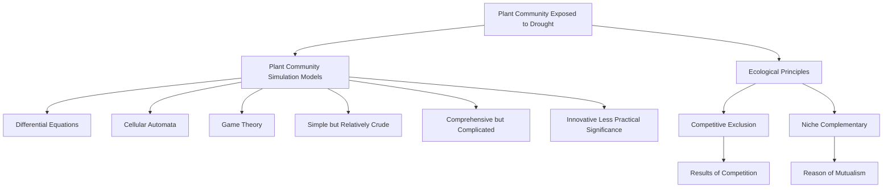
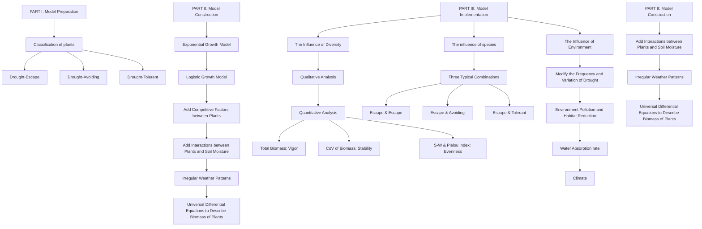
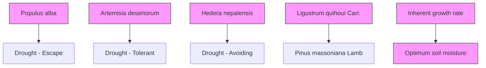

## The Warriors against Drought: Plant Communities

Summary

As the severe drought increases since the global warming, many plant communities die out for lack of water, while others can recover after drought. To explore this phenomenon, we develop GIID model to describe the response of communities to drought and analyse whether species diversity can help communities withstand drought.

Before all the models are established, we select five typical plant species and classifiy them into three categories, according to their inherent growth rate and optimum soil moisture. In addition, we estimate the parameters used in our models.

For Task 1: To simulate plant growth and interspecific competition, we first developed the Lotka-Volterra competition model. Then, considering optimum soil moisture of each species, we set the environmental capacity of them as a function of soil moisture. Finally, we modeled the soil moisture variation to describe the interaction between plants and the environment. We consider the water absorption by plants, irregular rainfall, and other factors. We summarize these analysis and devise our GIID model. Then, we verify the correctness of model. The results are shown in Figure 7.

For Task 2: First, we do the qualitative analysis and find that the Five Species Community is more stable in drought. To quantify how the community benefits from the species diversity, we calculate total biomass, coefficient of variation of total biomass, and S-W index to evaluate the vigor, stability, and evenness of the ecosystem respectively. The experimental results show that as the number of species increases, the total biomass of the community increases and then decreases, while the stability and evenness keep increasing. Besides, two species are required for the community to benefit. The results are shown in Figure 10 to 13.

For Task 3: To explore the effect of species type, we choose three typical species combinations and each combination is simulated separately. We find that combinations with moderate differences in optimum soil moisture increase the total biomass and stability of the community. And if the differences in optimum soil moisture of species are too small or too large, the community would not benefit.

For task 4: We adjust the magnitude and frequency of droughts, and the experiment results show that: when droughts become stronger and more frequent, the complementary effect among species also becomes stronger. And the biomass of the community increases as the number of species increases. When droughts are less frequent, the competition among species is stronger, and the increase in the number of species lead to decrease in total biomass. The increase in the number of species always enhances community stability.

For Tasks 5 and 6: We attributed the effects of habitat loss and environmental pollution to the decrease in environmental capacity. So we set up a step function to simulate this process. We find that habitat loss and environmental pollution will lead to decrease in total community biomass, while multi species community will still have high stability in this process. Next, we illustrate the measures to ensure the long-term viability of the community. We also describe the impact of the community on the environment based on above findings.

Finally, we change the plant competition intensity, water absorption rate and climate patterns in order to perform sensitivity analysis on these parameters. We find that our model is sensitive to all of them. We also analyze the strengths and weaknesses of the model and discuss how to improve it.

Keywords: Lotka-Volterra Model, Biodiversity, Irregular Drought, Complementary Effect

## Contents

## 1 Introduction 3

1.1 Problem Background . . 3  
1.2 Restatement of the Problem 3  
1.3 Literature Review . . 4  
1.4 Our Work . 4

## 2 Model Preparation 4

2.1 Assumptions and Justifications 4  
2.2 Notations . . 5  
2.3 Classification of Plants . 6  
2.4 Data Collection and Parameter Estimation . . 6

## 3 Task1 : The GIID Model 7

3.1 The Growth and Compete of Plants . . 8  
3.2 The Interaction between Plants and Water . . 9

3.2.1 Relationship Between Water and Environmental Capacity . . 9  
3.2.2 Variation of Soil Moisture . . 9

3.3 The Simulation of Irregular Weather . . . 10  
3.4 Model Implementation . . 10

3.4.1 Single Species Community 11  
3.4.2 Five Species Community 11

## 4 Task 2 and 3 : Effect of Species Diversity 12

4.1 Task 2 : Effect of the Number of Species 12

4.1.1 Qualitative Analysis 12  
4.1.2 Quantitative Analysis 13  
4.1.3 Model Implementation and Validation . . 14

4.2 Task 3 : Effect of the Type of Species 16

4.2.1 Three Representative Species Combinations 16  
4.2.2 Our Conclusion . . . 17

## 5 Task 4,5 and 6 : Impacts of Environmental Change on Species 18

5.1 Task 4 : Changes in the Magnitude and Frequency of Drought . . 18  
5.2 Task 5 : Impacts from Habitat Reduction and Environmental Pollution . . . . . 20  
5.3 Task 6 : Further Discussion on Community Viability . . . 21

5.3.1 Ensuring Community Viability . . . . 21  
5.3.2 The Impact of Communities on the Larger Environment . . . 22

## 6 Sensitivity Analysis 22

6.1 Plant Water Absorption Rate β 22  
6.2 Plant Competition Intensity α . . . . 23  
6.3 Climate Conditions . . . 23

## 7 Model Evaluation 24

7.1 Strengths . . 24  
7.2 Weaknesses and Possible Improvements . . 25

## References 25

## 1 Introduction

## 1.1 Problem Background

In recent years, the frequency of extreme weather events has increased dramatically around the world because of the global warming. Drought is one of the extreme weather events that will have a huge impact on our lives. The image shown below is collected from the U.S. drought monitoring website Drought. gov. It reflects the drought conditions in the U.S. between 8 Feb. 2023 and 14 Feb. 2023.

heatmap

| State       | Value |
| ----------- | ----- |
| Alabama     | 0.8   |
| Alaska      | 0.7   |
| Arizona     | 0.6   |
| Arkansas    | 0.5   |
| California  | 0.4   |
| Colorado    | 0.3   |
| Connecticut | 0.2   |
| Delaware    | 0.1   |
| Florida     | 0.9   |
| Georgia     | 0.7   |
| Hawaii      | 0.6   |
| Idaho       | 0.5   |
| Illinois    | 0.4   |
| Indiana     | 0.3   |
| Iowa        | 0.2   |
| Kansas      | 0.1   |
| Kentucky    | 0.3   |
| Louisiana   | 0.2   |
| Maine       | 0.1   |
| Maryland    | 0.4   |
| Massachusetts | 0.3   |
| Michigan    | 0.2   |
| Minnesota   | 0.1   |
| Mississippi | 0.2   |
| Missouri    | 0.3   |
| Montana     | 0.4   |
| Nebraska    | 0.5   |
| Nevada      | 0.6   |
| New Hampshire | 0.7 |
| New Jersey  | 0.8   |
| New Mexico  | 0.6   |
| New York    | 0.5   |
| North Carolina | 0.4 |
| North Dakota | 0.3 |
| Ohio        | 0.2   |
| Oklahoma    | 0.1   |
| Oregon      | 0.3   |
| Pennsylvania | 0.2 |
| Rhode Island | 0.1   |
| South Carolina | 0.2 |
| South Dakota | 0.3 |
| Tennessee   | 0.4   |
| Texas       | 0.5   |
| Utah        | 0.6   |
| Vermont     | 0.7   |
| Virginia    | 0.8   |
| Washington  | 0.6   |
| West Virginia | 0.5 |
| Wisconsin   | 0.4   |
| Wyoming     | 0.3   |

Figure 1: Distribution of drought in the United States Source : https://www.drought.gov/current-conditions

As we can see from the graph, 34.55% of U.S. territory is exposed to drought, which affects 252.9 million acres of crops and 74.3 million people. During the extreme droughts, we can easily discover that different plant communities behave differently. Plants in grassland and farmland are almost dead, while multi-species communities are less affected and thrive after drought. Based on the above analysis, it is essential and urgent to study how plants respond to drought and how the diversity of species in a plant community helps the plants withstand drought.

## 1.2 Restatement of the Problem

• According to the requirements, we should firstly develop a mathematical model to pre dict how a plant community changes over time as it is exposed to various irregular weather cycles. And we are required to consider the interaction between different plant species during the cycles of drought.  
• Secondly, we should extend our model to a long-term time and a larger environment.  
• Thirdly, we need to do a further discussion on the relationships between the number of plant species and the benefits of the plant community gets, and to explore what happens when the number of species increases. Besides, we should pay attention to the impact of the type of species on the results we obtained previously.  
• We are also required to study whether the number of species will have the same effect on the total plant population under the drought with higher or lower frequency and wider variation. Then we should take other factors like pollution and habitat reduction, etc. into account.  
• Finally, based on all results above, we should figure out what need to be done to ensure the viability of the community and what the impacts of the plant community on the larger environment are.

## 1.3 Literature Review

In order to study the plant communities in drought, we need to know the existing methods to simulate plant communities and the corresponding ecological principals. According to the literature [1, 2, 3, 4], for the simulation, there are mainly three methods and for the principles, there are mainly two principles we need to use. As the following figure shows:

flowchart

Figure 2: Literature Review

## 1.4 Our Work

The problem requires us to explore interactions between plants and enviroments, and measure the effects of species diversity. We mainly carry out the following work.

• Based on the analysis of several factors such as plant growth, interspecific competition, and the competition for water resources, a GIID model was developed.  
• Explore the effects of number of species and type of species  
• Explore the effects of other factors such as changes in drought frequency, habitat reduction, and environmental pollution.

In order to avoid complex textual descriptions, we use flowcharts to show our work, which is shown in Figure 3.

## 2 Model Preparation

## 2.1 Assumptions and Justifications

To simplify the given problems, we make the following basic assumptions:

Assumption 1: The water absorption rate of each plant is proportional to its biomass. Justification: According to literature[7], When intense competition between plants occurs, each resource obtained by a plant is proportional to its biomass.

Assumption 2: The main factor affecting plant growth is the soil moisture. And there’s different optimum soil moisture for different plants to grow.

flowchart

Figure 3: Our Work

Justification: The factors affecting plant growth such as temperature, moisture, and sunshine are coupled in the real world. However, we just focus on the growth of plant community under extreme drought. Therefore, to simplify our models, we ignore other factors, and only take the soil moisture into consideration. When a plant grows under moderate soil moisture, it will grow fast, but it can not grow when it is lack of water or flooded. So there’s a optimum soil moisture.

## Assumption 3: Under the appropriate conditions, all plants share a common environmental capacity.

Justification: Most of plants are producers and obtain energy in the same way (all from photosynthesis). Under the appropriate conditions, they all have the opportunity to absorb all solar energy in the habitat. So they can reach the same maximum biomass, which means they share a same environmental capacity.

## Assumption 4: During our study, the effects of accidental events such as plant invasion and sudden changes in climate patterns are not considered.

Justification: Although the plants grow in a natural environment, to simplify our model, we assume that the plant community is in a relatively closed environment. So there is no invasive species and no large, rapid changes in climate patterns.

## Assumption 5: In plant communities, the only source of water is precipitation.

Justification: There may be various ways for communities to get water, such as dew, fog and precipitation. Since dew and fog carry little water, we ignore their effects, and only consider the precipitation.

## 2.2 Notations

The key notations are shown in Table 1.

Table 1: Notation

<table><tr><td>Symbol</td><td>Unit</td><td>Description</td></tr><tr><td> $r_i$ </td><td> $day^{-1}$ </td><td>the inherent growth rate of the i-th plant</td></tr><tr><td> $x_i$ </td><td>kg</td><td>the biomass of the i-th plant</td></tr><tr><td> $Env_i$ </td><td>kg</td><td>the environmental capacity of the i-th plant</td></tr><tr><td>W</td><td>-</td><td>the soil moisture</td></tr><tr><td> $bestW_i$ </td><td>-</td><td>the optimum soil moisture of the i-th plant</td></tr><tr><td>α</td><td>-</td><td>the intensity of competition</td></tr><tr><td>β</td><td>-</td><td>the intensity of water absorption</td></tr></table>

## 2.3 Classification of Plants

We are required to study the relationship between species diversity in plant communities and the response of plant communities to drought, so we must include several different plants in our models. However, it is difficult to solve models for changes of multiple plants population over time because these models consist of several coupled differential equations and a bunch of parameters. To balance the computational efficiency and the accuracy of our models, we classify plants into three categories based on their different strategies for coping with drought, and selected one or two plants in each category as representatives.

Based on the study by Gao xiaoyan [4], we classified plants into three categories as follows:

• Drought-Escape Plant: These plants have a high inherent growth rate, which gives them the ability to complete their life cycle before drought occurs. As a price for rapid growth, these plants are not good at coping with droughts. And once a drought arrives, their aboveground parts will wither rapidly to reduce water consumption. Typical drought-escape plants are Hedera nepalensis and Ligustrum quihoui Carr..  
• Drought-Avoiding Plant: These plants have a moderate inherent growth rate, however, they usually have the ability to withstand droughts. When soil moisture drops, these plants can reduce water loss by closing stomata or other ways [7], so that they can grow in droughts for a period of time. Typical drought-avoiding plants include Pinus massoniana Lamb and Populus alba.  
• Drought-Tolerant Plant: These plants have a quite low inherent growth rate. Some of them even grow only a few centimetres within a whole year. Such plants often have special structures in their bodies to store water, which allows them to absorb large amounts of water from few rainfalls in a year, so that they can maintain their growth. We choose Artemisia desertorum as the representative species.

Based on the above analysis, we found there’s a trade-off between plant growth rate and the ability to withstand drought. Then We can distinguish these plants by their inherent growth rate and optimum soil moisture. Using the inherent growth rate as the horizontal axis and the optimum soil moisture as the vertical axis, we can mark the positions of the three types of plants as shown in Figure 4.

## 2.4 Data Collection and Parameter Estimation

In the above, We classified plants species into three categories and selected five representative plants. In order to simulate their growth at different soil moisture, we need to collect or estimate their inherent growth rate and the optimum soil moisture for them. Through the study of [5], we can get the relevant data, which are shown in the Table 2.

flowchart

Figure 4: Trade off between inherent growth rate and optimum humidity

Table 2: Inherent Growth Rate and Optimum Survival Humidity

<table><tr><td>Species</td><td>Optimum Soil Moisture</td><td>Inherent Growth Rate</td></tr><tr><td>Hedera nepalensis</td><td>69%</td><td> $4.57 \times 10^{-3} day^{-1}$ </td></tr><tr><td>Ligustrum quihoui Carr.</td><td>62%</td><td> $3.79 \times 10^{-3} day^{-1}$ </td></tr><tr><td>Pinus massoniana Lamb</td><td>45%</td><td> $9.33 \times 10^{-4} day^{-1}$ </td></tr><tr><td>Populus alba</td><td>53%</td><td> $1.15 \times 10^{-3} day^{-1}$ </td></tr><tr><td>Artemisia desertorum</td><td>25%</td><td> $3.15 \times 10^{-4} day^{-1}$ </td></tr></table>

We can’t get the inherent growth rates directly from literature so we need to estimate them. In the following, we choose the Pinus massoniana Lamb as an example to clarify the estimation process and discuss the reasonableness of the results. literature [6] showed that this tree with a height of 2.5m and a trunk radius of 0.09m grew 7cm tall in one month without any change in the radius of the trunk. Considering that the density of wood is a constant, the inherent growth rate of the Pinus massoniana Lamb can be estimated using the following equation:

$$
r _ {\text { pop.al. }} = \frac {\text { Increased   Biomass }}{\text { Initial   Biomass } \times 3 0 \text { days }} = \frac {\text { Increased   Volume }}{\text { Initial   Volume } \times 3 0 \text { days }} = \frac {7}{2 5 0 \times 3 0} = 9. 3 3 \times 1 0 ^ {- 4} \mathrm{day} ^ {- 1} \tag {1}
$$

The inherent growth rate and the optimum soil moisture of these five plants in the Table 2 are consistent with the characteristics we elaborated in Section 3.2: drought-tolerant plants grow the slowest and drought-escape plants grow the fastest. And the higher the inherent growth rate, the lower the tolerance for the drought. This indicates that the parameters we estimated are reasonable.

## 3 Task1 : The GIID Model

In this section, we will establish the GIID Model, in order to describe the Growth of plants, the Interactions between plants and enviroment, and the influence of Irregular Drought.

## 3.1 The Growth and Compete of Plants

Considering that the plant populations are often difficult to be directly counted, it is better to choose the plant biomass to develop the plant growth equations.

Firstly, we consider the ideal situation, where the plant can grow endlessly in the case of unlimited space and other resources. Let $r _ { i }$ denote the inherent growth rate of the i-th plant, then it’s biomass $x _ { i }$ should satisfy the following equation:

$$
\frac {\mathrm{d} x _ {i} (t)}{\mathrm{d} t} = x _ {i} (t) r _ {i} \tag {2}
$$

Due to the limited growth environment and according to the Assumption 3, all plants share a common environmental capacity Env , so the inherent growth rate will decrease linearly, i.e., $r _ { i } ( t ) = r _ { i } - x _ { i } / E n v$ . Thus, we introduce the Logistic Growth Model then the plant growth equation should be rewritten as follows:

$$
\frac {\mathrm{d} x _ {i} (t)}{\mathrm{d} t} = x _ {i} (t) r _ {i} (1 - \frac {x _ {i} (t)}{E n v}) \tag {3}
$$

In addition, we should choose the initial biomass of plants. We assume that the initial biomass of all kinds of plants is the same, which is the $x _ { 0 } \colon$

$$
x _ {i} (0) = x _ {0} \tag {4}
$$

Finally, we obtain the following first-order nonlinear differential equation :

$$
\left\{ \begin{array}{l} \frac {\mathrm{d} x _ {i} (t)}{\mathrm{d} t} = x _ {i} (t) r _ {i} \left(1 - \frac {x _ {i} (t)}{E n v}\right) \\ x _ {i} (0) = x _ {0} \end{array} \right. \tag {5}
$$

By solving the above differential equation, we can get the relationship between the plant biomass and time.

$$
x _ {i} (t) = \frac {\text { Env }}{1 + \left(\frac {\text { Env }}{x _ {i} (0)} - 1\right) \exp (- r _ {i} t)} \tag {6}
$$

When various species of plants live in the same area, the interaction between different species is inevitable. This is because there is an overlap in the ecological niches of multiple plants. They compete for natural resources like nutrients and sunlight. In this case, the growth and reproduction of one plant is then influenced by the others.

The Lotka-Volterra model is useful in dealing with the problem of competition between species. The basic idea is that one species (the ith plant) will be subject to resistance from all other species as it grows. Suppose that there are n species of plants growing on a piece of land, then the equation describes the biomass of the i-th of plant will be rewritten as:

$$
\frac {\mathrm{d} x _ {i} (t)}{\mathrm{d} t} = x _ {i} (t) r _ {i} \left(1 - \frac {x _ {i} (t)}{E n v} - \alpha \sum_ {j = 1, j \neq i} ^ {n} \frac {c _ {j}}{c _ {i}} x _ {j} (t)\right) \tag {7}
$$

where $\alpha$ is the intensity of competition. And $c _ { i }$ is the competitive ability of the i-th plant, which is a constant normalized to the range of [0, 1]. The $c _ { j } / c _ { i }$ term in the equation represents the influence exerted by j-th plant on i-th plant. Therefore, The higher the competitive ability of the plant, the more likely it is to win in the competition.

## 3.2 The Interaction between Plants and Water

## 3.2.1 Relationship Between Water and Environmental Capacity

Above, we designed the models to describe the plant growth under the environment constraints, and the interactions between species. However, interactions between plants and the larger environment also have an important role on the competition. According to Assumption 2, under the drought, soil moisture is the most important factor determines whether a plant will live or die.

Assuming that W is the soil moisture, and bestWi represents the optimum soil moisture of the ith plant. Then We use $E n v _ { i }$ to denote the environmental capacity of the ith plant affected by soil moisture.

Envi has several important features:

• when W equals to bestWi, Envi will equal to Env;  
• when there is a huge difference between W and bestWi, which means $| W - b e s t W _ { i } | $ $+ \infty , E n v _ { i }$ will approaches to zero.

According to the central limit theorem, the environmental capacity of each plant should follow the Normal Distribution when the number of plant species tends to infinity, so we can express the environmental capacity as follows:

$$
E n v _ {i} = E n v \times \exp \left(- \frac {\left(W - b e s t W _ {i}\right) ^ {2}}{M N W _ {i}}\right) \tag {8}
$$

where $M N W _ { i }$ is the constant controlling the decay rate, which is called moisture niche breadth of i-th plant in ecology. According to the study [5], the plant can hardly survive when the soil moisture drops to 20% of its optimum. So when $W ^ { ' } = 0 . 2 b e s t W _ { i } ,$ , we assume that the biomass of the ith plant can only reach to 0.01Env:

$$
0. 0 1 E n v = E n v \times \exp (- \frac {(0 . 8 b e s t W _ {i}) ^ {2}}{M N W _ {i}}) \tag {9}
$$

By solving the above equation, we can get $M N W _ { i } = 0 . 1 4 b e s t W _ { i }$

## 3.2.2 Variation of Soil Moisture

The soil moisture is not a constant during the growth of plants. Due to the combined effect of plant absorption, rainfall and evaporation, the soil moisture W will change with time. The variation of W is related to the water absorbed by each plant, and it is also influenced by the precipitation $p ( t )$ and the rate of evaporation. Therefore, we can use the following differential equation to describe the change of soil moisture:

$$
\frac {\mathrm{d} W (t)}{\mathrm{d} t} = - \beta \sum_ {i} x _ {i} (t) W (t) - \gamma W (t) + p (t) \tag {10}
$$

Where

• $\beta W ( t ) x _ { i } ( t )$ is the water absorption rate of the i-th plant.

According to the Assumption 1, the water absorbed by each plant is proportional to its biomass. In addition, related studies [7] showed that the water absorption rate of plant will increase when the soil moisture become higher. To simplify the model, we assume that the water absorption rate is also proportional to the soil moisture $W ( t )$ . So the water absorption rate of the i-th plant can be written as $\beta W ( t ) x _ { i } ( t )$ , and $\beta$ is the water absorption intensity.

• $\gamma W ( t )$ is the evaporation rate.

literature [7] showed that the evaporation rate of soil in subtropical or temperate regions is proportional to the soil moisture. Therefore, the evaporation rate can be expressed as $\gamma W .$ , and $\gamma$ is a constant to describe the evaporation intensity. Based on the monitored data for the evaporation rate of grassland, we can estimate that $\gamma = 0 . 1 2 \mathrm { d a y } ^ { - 1 }$

• $p ( t )$ represents the precipitation

According to the Assumption 3, this is the only way to supply water for the plant community. It can be obtained from weather records.

## 3.3 The Simulation of Irregular Weather

In order to predict how species change when the plant community is exposed to various irregular weather cycles and time of droughts when precipitation should be abundant, we need to simulate weather conditions. Therefore, we devise a function to describe periodic and non-periodic precipitation in plant communities as below:

$$
p (t) = \left[ A _ {0} + A _ {1} \cdot \left| \sin (\frac {\pi}{T} t) \right| + A _ {2} \cdot \delta (t - t _ {0}) \right] \times \frac {1 + I}{2} \tag {11}
$$

## Where

• $A _ { 0 }$ is the minimum precipitation in the whole year, and also represents the precipitation in the dry season.

• $\begin{array} { r } { A _ { 1 } \cdot \left| s i n ( \frac { 2 \pi } { T } t ) \right| } \end{array}$ is a function with the period of $T ,$ which represents the periodic variation of the precipitation. To make the simulation more realistic, we set $T = { \mathrm { 1 y e a r } } .$ .

• $A _ { 2 } \cdot \delta ( t - t _ { 0 } )$ represents the extreme weather occurring randomly. $t _ { 0 }$ is the time when extreme weather occurs.

• $( 1 + I ) / 2$ represents the droughts occurring randomly. In one year, I can only be set to 0 or 1. When I takes 0, the precipitation of this year is half of the normal year. That means the occurrence of the severe droughts. And we assume that the probability of drought occurrence in each year is 30%.

## 3.4 Model Implementation

Based on the models described above for plant biomass growth, competition, and the interactions between plant and larger environment, we can finally obtain the universal differential equations of the model:

$$
\left\{ \begin{array}{l} \frac {\mathrm{d} x _ {i} (t)}{\mathrm{d} t} = x _ {i} (t) r _ {i} \left(1 - \frac {x _ {i} (t)}{E n v} - \alpha \sum_ {j = 1, j \neq i} ^ {n} \frac {c _ {j}}{c _ {i}} x _ {j} (t)\right) \\ \frac {\mathrm{d} W (t)}{\mathrm{d} t} = - \beta \sum_ {i} x _ {i} (t) W (t) - \gamma W (t) + p (t) \end{array} \right. \tag {12}
$$

Because we cannot get the analytical solution of the equations directly, we need to use some numerical methods. However, This equation set is not suitable to use the 4th-5th order Runge-Kutta solver in Matlab, because the $p ( t )$ term is affected by some random factors. Considering this is only an 1-order system, we discretize it by converting the differential equation into the difference equation. Next, we solve it recursively with a time interval of $\Delta t = 5 \mathrm { d a y s }$ . Consequently, the result is as follows:

## 3.4.1 Single Species Community

To observe the changes in biomass of various plants over time under the periodic weather fluctuations and non-periodic drought, we first select the Pinus massoniana Lab from the drought-avoiding type and the Hedera nepalensis from the drought-escape type. Then we plant them individually without considering their competition with other plants. Finally, the results are as below:

line chart

| Time (days) | P.alba (kg) |
|-------------|-------------|
| 0           | 0           |
| 500         | 20          |
| 1000        | 80          |
| 1500        | 200         |
| 2000        | 520         |
| 2500        | 280         |
| 3000        | 280         |
| 3500        | 480         |
| 4000        | 450         |

Figure 5: Biomass of Pinus massoniana Lab

line chart

| Time (days) | the Biomass of Plants (kg) |
| ----------- | -------------------------- |
| 0           | 0                          |
| 100         | 180                        |
| 200         | 310                        |
| 300         | 150                        |
| 400         | 320                        |
| 500         | 100                        |
| 600         | 300                        |
| 700         | 290                        |
| 800         | 220                        |

Figure 6: Biomass of Hedera nepalensis

With results in both figures, we can identify several remarkable phenomena:

• The biomass of both plants are influenced by the periodic weather change, resulting in fluctuations. However, the fluctuation of the P.massoniana.L is less compared to the H.nepalensis. This is mainly because the P.massoniana.L is a drought-avoiding plant, which is less sensitive to the soil moisture. On the contrary, the H.nepalensis, as a drought-escape plant, can grow only with high soil moisture. Therefore, when drought occurs, the H.nepalensis is more susceptible.  
• During the recovery process of the drought, the H.nepalensis recovers relatively quickly. Because it has a large inherent growth rate, which allows it to recover its biomass quickly when the soil moisture is suitable for its growth.

As stated above, the changes of the biomass of these two plants with time differ obviously. Besides, they are consistent with the plants’ own optimum soil moisture and inherent growth rates. This indicates that our model is reasonable.

## 3.4.2 Five Species Community

To investigate how a multiple plant community copes with drought, we simulated the changes in biomass over time as five species interacted with each other.

From the Figure 7, we can draw the following conclusions:

• Under the conditions we set, the two drought-avoiding plants (H.nepalensis and L.quihoui.C) became the dominant species of the community. However, the drought-tolerant plants (A.desertorum) had little biomass and could grow only when drought appeared and the population of others declined. This is mainly due to the very low inherent growth rate of the drought-tolerant plants and their weak competitive ability.  
• The changes of biomass over time are similar for plants belonging to the same type, while there are large differences for plants belonging to different types.

line chart

| Time (days) | P.alba | P.massoniana.L | H.nepalensis | L.quihoui.C | A.desertorum |
|-------------|--------|----------------|--------------|-------------|--------------|
| 0           | 10     | 10             | 10           | 10          | 3            |
| 100         | 40     | 25             | 72           | 64          | 3            |
| 200         | 65     | 45             | 45           | 50          | 5            |
| 300         | 75     | 60             | 38           | 40          | 8            |
| 400         | 78     | 68             | 39           | 40          | 3            |
| 500         | 78     | 72             | 39           | 39          | 3            |
| 600         | 77     | 74             | 35           | 38          | 4            |
| 700         | 75     | 75             | 39           | 39          | 3            |

Figure 7: Changes in biomass of the five species over time

• During our simulation, this plant community underwent succession: at the beginning, the biomass of two drought-escape plants grew rapidly and prevailed; however, with the growth of the drought-avoiding plants(P.alba and P.massoniana.L), the biomass of the drought-escape plants gradually declined. This is because the drought-escape plants have weak competitive ability and high soil moisture requirements.  
• In a Five plants community, the total biomass is much less volatile than a Single plant community.

## 4 Task 2 and 3 : Effect of Species Diversity

Through the modeling of plant communities above, we have found that both periodical changes in climate and irregular droughts lead to changes of the biomass of plants. From the Figures 6 and 7 above, we can conclude that the variation of biomass is much narrower when five species coexist than when only one species survives. Therefore, it is important to explore the impact of species diversity.

## 4.1 Task 2 : Effect of the Number of Species

## 4.1.1 Qualitative Analysis

In order to qualitatively analyze the effect of the number of species, we simulated a Single Plant Community and a Five Plants Community. Then we observe the biomass of each species in these communities. To make our simulation more effectively in describing the long-term variation of the community, we set the simulation time to 50 years. And the results are as follows:

From the Figure 8 and 9, we can clearly see the impact of the climate cycles and the occurrence of irregular droughts on different communities.

• Both periodic climate and irregular droughts bring fluctuation to biomass: periodic climate brings small fluctuations to the biomass of various plants, while irregular droughts bring greater fluctuations because it last longer.

line chart

| Time (years) | P.alba Biomass (kg) |
| ------------ | ------------------- |
| 0            | 0                   |
| 5            | 280                 |
| 10           | 550                 |
| 15           | 280                 |
| 20           | 550                 |
| 25           | 500                 |
| 30           | 600                 |
| 35           | 280                 |
| 40           | 500                 |
| 45           | 550                 |
| 50           | 450                 |

Figure 8: biomass of Single Plant Community

line chart

| Time (years) | P.alba | P.massoniana.L | H.nepalensis | L.quihoui.C | A.desertorum |
| ------------ | ------ | -------------- | ------------ | ----------- | ----------- |
| 0            | 10     | 10             | 70           | 60          | 5           |
| 10           | 75     | 75             | 35           | 35          | 5           |
| 20           | 75     | 75             | 35           | 35          | 5           |
| 30           | 75     | 75             | 35           | 35          | 5           |
| 40           | 75     | 75             | 35           | 35          | 15          |
| 50           | 75     | 75             | 35           | 35          | 10          |

Figure 9: biomass of Five Plants Community

• The total biomass in Five Plants Community is lower than Single Plant Community, due to the competition among species for water and other resources.  
• The total biomass fluctuated less when the five species coexisted, which indicates that the Five Plants Community has greater stability than Single Plant Community.

## 4.1.2 Quantitative Analysis

In order to To verify the community is actually benefiting from the coexisting of plants, we should quantitatively describe its characteristics. Inspired by a study of communities in northwest China, we will use several representative indicators which can be easily calculated to evaluate the community.

The most important indicator for a community is the total biomass, which reflects whether the plants in the community are growing prosperously. If the biomass of the i-th plant is denoted as $x _ { i } ,$ the total biomass T B in the community is the sum of the biomass of all plants. Since the total biomass of the community changes continuously over time, we take the mean of the total biomass as a measure of the community’s prosperity.

$$
\overline {{{T B}}} = \frac {1}{T _ {\max}} \int_ {0} ^ {T _ {\max}} \sum_ {i = 1} ^ {n} x _ {i} (t) d t \tag {13}
$$

where the $T _ { \mathrm { m a x } }$ in the equation is the total time needed to run the simulation program.

We know that the variation in total community biomass over time is related to the stability of the community. The smaller the variation of total biomass, the smaller the loss of biomass when the community is facing an irregular drought, which means that the community is more stable. In general, we can use the standard deviation of total biomass to measure its variation, but the standard deviation is influenced by the mean value and the dimension (the measurement unit) of the data. To eliminate this effect, we define a dimensionless indicator: the coefficient of variation (CoV) of total biomass. We can divide the standard deviation of the total biomass by the mean value to calculate this indicator:

$$
C o V = \frac {\operatorname{std} (T B)}{\overline {{T B}}} = \frac {\sqrt {\int_ {0} ^ {T _ {\max}} (T B (t) - \overline {{T B}}) ^ {2} d t}}{\overline {{T B}}} \tag {14}
$$

In physics, we usually use "entropy" to measure the degree of disorder of a system.

Shannon-Wiener index [9] is a measure of species evenness inspired by the concept of entropy: in a community, the average number of each species is $\begin{array} { r } { \bar { x } _ { i } = \int _ { 0 } ^ { T _ { \operatorname* { m a x } } } x _ { i } ( t ) / T _ { \operatorname* { m a x } } d t } \end{array}$ R Tmax xi(t)/Tmaxdt and the total average biomass, already defined above, is $\overline { { T B } }$ . Then the proportion of the i-th species is $\bar { x } _ { i } / \overline { { T B } }$ . The Shannon-Wiener index (S-W index) is defined as:

$$
H = \sum_ {i = 1} ^ {n} - \frac {\bar {x} _ {i}}{\overline {{T B}}} \log \frac {\bar {x} _ {i}}{\overline {{T B}}} \tag {15}
$$

According to its expression, we can find that the S-W index will reach its maximum when the proportion of each species gets same, $\mathrm { i . e . , } \bar { x } _ { i } = \bar { T B } / n$ . And the more uneven the distribution of each species is, the smaller the S-W index is.

The S-W index measures the absolute evenness of the community, and since its maximum value is log n, Pielou index is defined to measure the relative evenness of the communities :

$$
J = \frac {H}{\log n} \tag {16}
$$

The Pielou index is a value between [0, 1] that measures the relationship between the current evenness of the community and the maximum evenness that the community can achieve.

## 4.1.3 Model Implementation and Validation

We collected data on five plant species in Section 2.4, two of which are drought-escape plants, two of which are drought-avoiding plants, and one of which is drought-tolerant plant. Now, we will change the number of plants in the community by planting one to five species into the community separately. Then we will simulate the changes of biomass of various plants over time, and use the results to calculate indicators defined above. We will try all possible combinations of plants, for example, when the number of species $n = 2 ,$ there are a total of $C _ { 5 } ^ { 2 } = 1 0$ combinations.

We first identified the relationship between the total biomass and the number of species, as the Figure 10 suggests. And then we observed the relationship between the community stability(measured by the CoV of biomass), as the Figure 11 shows. Each point in the figure represents a species combination. And straight lines connect the mean values of indicators for each species combinations with different numbers of species in the community.

From these graphs, we can notice two remarkable phenomena:

• With the increasing number of species, the mean value of total biomass increased and then decreased.

When the number of species was two, the total biomass was the greatest. Further, when the number of species increased from one to two, the total biomass became higher. This is because of the complementary effect among certain species, whose mechanism will be discussed below. And when the number of species increased from two to five, the total biomass became lower. This is because there were so many species in the communitywhich strengthened the competition for water and other resources, and this competition narrowed the living space of each plant species.

• The CoV of the total biomass tended to decrease as the number of species continued to increase.

This indicates that the communities with more species have lower fluctuations in the total biomass. That is, they are more stable and more resistant to drought.

scatterplot

| Number of Species | Total Biomass (kg) |
| ----------------- | ------------------ |
| 1                 | 330                |
| 1                 | 340                |
| 1                 | 325                |
| 2                 | 380                |
| 2                 | 450                |
| 2                 | 370                |
| 2                 | 380                |
| 2                 | 310                |
| 2                 | 200                |
| 2                 | 220                |
| 3                 | 360                |
| 3                 | 340                |
| 3                 | 280                |
| 3                 | 240                |
| 3                 | 210                |
| 3                 | 190                |
| 4                 | 240                |
| 4                 | 280                |
| 4                 | 220                |
| 5                 | 230                |

Figure 10: The relationship between total biomass and number of species

scatterplot

| Number of Species | Coefficient of Variation |
| ----------------- | ------------------------ |
| 1                 | 0.26                     |
| 2                 | 0.19                     |
| 3                 | 0.10                     |
| 4                 | 0.04                     |
| 5                 | 0.02                     |

Figure 11: The relationship between CoV of total biomass and number of species

The following Figure 12 shows the relationship between the S-W index and the number of species. And the Figure 13 shows the relationship between the Pielou index and the number of species:

scatterplot

| Number of Species | Shannon-Wiener Index |
| ----------------- | --------------------- |
| 1                 | 0.0                   |
| 2                 | 0.35                  |
| 3                 | 0.75                  |
| 4                 | 1.1                   |
| 5                 | 1.4                   |

Figure 12: Relationship between S-W index and number of species

scatterplot

| Number of Species | Pielou Index |
| ----------------- | ------------ |
| 1                 | 0.0          |
| 2                 | 0.5          |
| 3                 | 0.7          |
| 4                 | 0.8          |
| 5                 | 0.9          |

Figure 13: Relationship between Pielou index and number of species

From these figure, we can find that the values of S-W index and Pielou index were increasing as the number of species increased. The Pielou index reached 0.87 when the number of species reached 5. This suggests that the distribution of species in the community was already very close to the even distribution. Therefore, we conclude that the higher the number of species in the community, the better the balanced development of each species. This is because when the number of species is higher, the interspecific competition increases, which makes it difficult for any one plant to have a biomass that far exceeds that of the others.

According to our conclusion, although a higher number of species may lead to a decrease in the total biomass of the community, the variation of total biomass will be reduced. Besides, the community’s ability to resist drought will increase. At the same time, the distribution of the species in the community will be more even, and each plant will have enough space to survive and develop. They are consistent with the results of related studies, so it reflects the reasonableness of our model. Compared with the case of Single plant community, the total biomass increased slightly when there were two plants, and the drought resistance increased significantly, so that at least two different plants could make the community benefit.

## 4.2 Task 3 : Effect of the Type of Species

Above, we explored the relationship between number of species and total biomass, we also described the relationship between number of species and stability. However, it is also evident from Figure 10 and Figure 11 that the total biomass and CoV are significantly different for different species combinations. For example, if there are two different species in the community, the lowest total biomass is 200kg and the highest total biomass is 400kg. Thus, the type of species can also have a large impact on our model. To analyze this effect, we chose three typical species combinations, each consisting of two different species, and we will simulate each species combination separately.

## 4.2.1 Three Representative Species Combinations

If two species in a community have the same inherent growth rate, tolerance to drought, and competitive ability, then the biomass of them will vary with the same pattern. It is the different attributes of the two species that lead to the differences in their biomass trends. With this in mind, we selected three representative species combinations: (a) H.nepalensis and L.quihoui.C, which all belong to the drought-escape plant and differ little in various attributes; (b) H.nepalensis and P.alba which respectively belong to drought-escape plant and drought-avoiding plant. And there is a moderate different in their optimum soil moisture. (c) H.nepalensis and A.desertorum, which belong to drought-escape and drought-tolerant plants respectively, and differ greatly in their optimum soil moisture. Figure 14 shows the pattern of variation in biomass with time for each of these species combinations:

line chart

| Time (years) | H.nepalensis | L.quihou.C |
| ------------ | ------------ | ---------- |
| 0            | 120          | 120        |
| 5            | 125          | 145        |
| 10           | 120          | 140        |
| 15           | 125          | 135        |
| 20           | 120          | 130        |
| 25           | 125          | 135        |
| 30           | 120          | 130        |
| 35           | 125          | 135        |
| 40           | 120          | 130        |
| 45           | 125          | 135        |
| 50           | 120          | 130        |

(a)

line chart

| Time (years) | P.alba | H.nepalensis |
| ------------ | ------ | ------------ |
| 0            | 40     | 300          |
| 5            | 80     | 150          |
| 10           | 100    | 120          |
| 15           | 120    | 160          |
| 20           | 90     | 170          |
| 25           | 100    | 180          |
| 30           | 110    | 175          |
| 35           | 120    | 160          |
| 40           | 70     | 220          |
| 45           | 90     | 210          |
| 50           | 110    | 120          |

(b)

line chart

| Time (years) | H.nepalensis (kg) | A.desertorum (kg) |
| ------------ | ----------------- | ---------------- |
| 0            | 0                 | 0                |
| 5            | 350               | 0                |
| 10           | 200               | 0                |
| 15           | 300               | 0                |
| 20           | 250               | 0                |
| 25           | 350               | 0                |
| 30           | 200               | 0                |
| 35           | 300               | 0                |
| 40           | 250               | 0                |
| 45           | 300               | 0                |
| 50           | 250               | 0                |

(c)  
Figure 14: Biomass Comparison between different combinations

From the Figure 14, we can conclude the growth pattern of these three different species combinations.

• In the community (a) formed by the combination of two drought-avoiding plant, the biomass of the two plants changed synchronously: both dropped sharply when the drought came and recovered rapidly after the end of the drought. This is because both plants have similar optimum soil moisture, so both of them are significantly affected by drought.  
• In the community (b) formed by the combination of drought-escape plant and drought avoiding plant, the biomass of both plants was also significantly affected by drought. But the biomass of the two plants showed opposite trends. This is because during the period of sufficient precipitation, the soil moisture was high and suitable for the growth of drought-escape plant, and it could become the dominant species, while droughtavoiding plant grew very slowly because of the limitation of competition. During the period of drought, the environment was not suitable for the growth of drought-escape plant, so its biomass decreased significantly, which reduced the competitive pressure

faced by drought-avoiding plant, so the drought-avoiding plant could grow during the drought.

• In the community (c) formed by the combination of drought-escape plant and droughttolerant plant, almost only drought-escape plant was growing. And drought-tolerant plant was nearly extinct in this community. This may because the conditions require for the growth of the two plants are so different that their coexistence in the same community is very difficult. And the compete ability of drought-tolerant plant is lower, which leads to the its extinct.

The variation trends of the total biomass of the three species combinations over time are shown in Figure 15. And we also calculated the total biomass and CoV of the biomass of the three combinations respectively, as shown in Table 3.

line chart

| Time (years) | Total Biomass(kg) |
| ------------ | ----------------- |
| 0            | 210               |
| 5            | 270               |
| 10           | 260               |
| 15           | 240               |
| 20           | 250               |
| 25           | 230               |
| 30           | 260               |
| 35           | 240               |
| 40           | 270               |
| 45           | 250               |
| 50           | 280               |

(a)

line chart

| Time (years) | Total Biomass(kg) |
| ------------ | ----------------- |
| 0            | 100               |
| 5            | 350               |
| 10           | 250               |
| 15           | 270               |
| 20           | 260               |
| 25           | 270               |
| 30           | 265               |
| 35           | 240               |
| 40           | 290               |
| 45           | 270               |
| 50           | 230               |

(b)

line chart

| Time (years) | Total Biomass(kg) |
| ------------ | ----------------- |
| 0            | 0                 |
| 1            | 280               |
| 2            | 130               |
| 3            | 340               |
| 4            | 290               |
| 5            | 130               |
| 6            | 340               |
| 7            | 290               |
| 8            | 130               |
| 9            | 340               |
| 10           | 290               |
| 11           | 130               |
| 12           | 340               |
| 13           | 290               |
| 14           | 130               |
| 15           | 340               |
| 16           | 290               |
| 17           | 130               |
| 18           | 340               |
| 19           | 290               |
| 20           | 130               |
| 21           | 340               |
| 22           | 290               |
| 23           | 130               |
| 24           | 340               |
| 25           | 290               |
| 26           | 130               |
| 27           | 340               |
| 28           | 290               |
| 29           | 130               |
| 30           | 340               |
| 31           | 290               |
| 32           | 130               |
| 33           | 340               |
| 34           | 290               |
| 35           | 130               |
| 36           | 340               |
| 37           | 290               |
| 38           | 130               |
| 39           | 340               |
| 40           | 290               |
| 41           | 130               |
| 42           | 340               |
| 43           | 290               |
| 44           | 130               |
| 45           | 340               |
| 46           | 290               |
| 47           | 130               |
| 48           | 340               |
| 49           | 290               |
| 50           | 130               |

(c)  
Figure 15: Total Biomass of different species combinations

Table 3: Total Biomass and Coefficient of Variation

<table><tr><td>Combination</td><td>Total Biomass(kg)</td><td>CoV of Biomass</td></tr><tr><td>(a)</td><td>206.5</td><td>0.1526</td></tr><tr><td>(b)</td><td>250.3</td><td>0.0632</td></tr><tr><td>(c)</td><td>220.8</td><td>0.1051</td></tr></table>

## 4.2.2 Our Conclusion

From the Figure 15 and the Table 3 we can find that the biomass of species combinations (a) and (c) fluctuated quite a lot and they even lost nearly half of their total biomass when the drought occurred. On the contrary, the biomass of species combination (b) fluctuated less and the total biomass was also higher than the other two species combinations. This is because the species combination (b) is consist of drought-escape plant and drought-avoiding plant, and their optimum soil moisture are different, so that the advantages of these two species can complement each other. In the period of sufficient precipitation and the period of drought, there are different dominant species in the community, resulting in the total biomass of the community relatively stable. By contrast, in species combination (c), the two plants were so different that they could not coexist. Therefore, we conclude that species combination has a great influence on both the total biomass and the stability of the community. In general, the more significant the differences in soil moisture between plants in the community are, the easier it is for the plant community to survive in a drastically changing environment. The stability and the total biomass of the community are generally higher as well. Of course, the difference between each plant should not be too large, since the difference which is too large can lead to the extinct of one of the species.

## 5 Task 4,5 and 6 : Impacts of Environmental Change on Species

In this section, we will discuss the effects on communities caused by external environmental changes that can manifest as changes in the frequency or magnitude of droughts, habitat encroachment, environmental contamination, and so on.

## 5.1 Task 4 : Changes in the Magnitude and Frequency of Drought

Now, we discuss the effects of changes in drought magnitude and frequency on the community. In the Equation 11 used to simulate precipitation above, we set the probability of drought to 30% and set the precipitation in a drought year to 1/2 of a normal year. When the frequency of drought increases, we adjust the probability of drought to $5 0 \dot { \% } ;$ when the magnitude of drought increases, we change the precipitation in a drought year to $1 / 3$ of a normal year. After varying the frequency and magnitude of drought, we simulated the change in biomass of each species over time within a Five Plants Community and plotted the total biomass curve of the community;

line chart

| Time (years) | P.alba | P.massoniana.L | H.nepalensis | L.quihoui.C | A.desertorum |
| ------------ | ------ | -------------- | ------------ | ----------- | ----------- |
| 0            | 10     | 10             | 72           | 64          | 3           |
| 5            | 78     | 58             | 33           | 34          | 16          |
| 10           | 60     | 74             | 32           | 40          | 10          |
| 15           | 72     | 76             | 32           | 39          | 5           |
| 20           | 70     | 75             | 32           | 39          | 5           |
| 25           | 68     | 74             | 32           | 39          | 28          |
| 30           | 65     | 73             | 32           | 39          | 5           |
| 35           | 70     | 75             | 32           | 39          | 16          |
| 40           | 72     | 76             | 32           | 39          | 5           |
| 45           | 74     | 77             | 32           | 39          | 12          |
| 50           | 70     | 75             | 32           | 39          | 12          |

Figure 16: Biomass of each plants during more severe drought

line chart

| Time (years) | Total Biomass(kg) |
| ------------ | ----------------- |
| 0            | 40                |
| 5            | 200               |
| 10           | 220               |
| 15           | 230               |
| 20           | 220               |
| 25           | 210               |
| 30           | 220               |
| 35           | 230               |
| 40           | 210               |
| 45           | 230               |
| 50           | 230               |

Figure 17: Total biomass of the community

It can be seen that the communities suffering from more severe drought are very different from the previous ones. From the Figure 16 and the Figure 17, we can draw two conclusions:

• The increase in the magnitude and frequency of drought causes changes in the distribution of species in the community

the biomass of both drought-avoiding and drought-tolerant plants decreases, while their decrease leaves space for the survival of drought-tolerant plants. So the biomass of drought-tolerant plants increases significantly during drought.

• The fluctuations in the biomass of the community remained small (no more than 10%) in the extreme drought climate.

That is due to the growth of drought-tolerant plants during the drought, which indicates the strong stability of the Five Plants Community.

Then, we are supposed to quantify how the increase in drought magnitude and frequency actually affects the total biomass and stability of the community, and whether the increase in species diversity can actually help the community withstand drought. So we vary the number of plants in the community, put one to five species into the community respectively. We calculate the total biomass to measure the vigor of the community, and the CoV of the total biomass to describe the stability. The following Figure 18 and Figure 19 show our calculation results. In this simulation, we also tried all species combinations, each point represents a species combination, and the straight line connects the mean values of all species combinations.

line chart

| Number of Species | Baseline | Greater Frequency | Greater Frequency + Wider Variation |
| ----------------- | -------- | ----------------- | ------------------------------------- |
| 1                 | 330      | 195               | 140                                   |
| 2                 | 330      | 260               | 160                                   |
| 3                 | 260      | 225               | 170                                   |
| 4                 | 240      | 220               | 185                                   |
| 5                 | 230      | 225               | 195                                   |

line chart

| Number of Species | Baseline | Greater Frequency | Greater Frequency + Wider Variation |
| ----------------- | -------- | ----------------- | ------------------------------------- |
| 1                 | 0.26     | 0.32              | 0.56                                  |
| 2                 | 0.20     | 0.25              | 0.37                                  |
| 3                 | 0.10     | 0.11              | 0.16                                  |
| 4                 | 0.03     | 0.04              | 0.13                                  |
| 5                 | 0.02     | 0.03              | 0.09                                  |

Figure 18: Total biomass under different drought Figure 19: CoV of total biomass under different conditions drought conditions

From the figures above, we can find that:

• The total biomass of the community is bound to decrease as the drought increases.  
The total biomass of the community was maximum when the drought conditions took the initial value (drought probability 30% and precipitation in drought years decreased to 1/2); when increasing the frequency of drought, the total biomass of the community decreased; when increasing both the frequency of drought and the magnitude of drought, the total biomass of the community decreased further. This is because the drought environment is not suitable for the growth of most of the plants and may increase competition for water resources within the community.  
• The more severe the drought, the greater the contribution of species diversity to the community.  
From the trend of the total biomass curve, when the drought condition takes the initial value, the total biomass increases and then decreases as the number of species increases. When the drought frequency increases, the total biomass still increases and then decreases, but the increase becomes bigger and the decrease becomes smaller. When the drought frequency and drought magnitude increase simultaneously, the total biomass increases as the number of species increases. This can be explained by the complementary effect mentioned above: during the occurrence of drought, drought-tolerant plants can grow to compensate for the biomass loss of other plants, and the more intense the drought is, the more significant this complementary effect becomes.  
• Drought increases the fluctuation of biomass in communities, but increases in number of species can always reduce this fluctuation.  
From the trend of the CoV of total biomass, the more intense the drought is, the higher the CoV is. This is because severe drought is usually accompanied by rapid changes in rainfall, which will cause the biomass of the community to change rapidly as well. Regardless of the degree of drought, the CoV always decreases with the increase in the number of species in the community. That is, the increase in the number of species always leads to higher stability of the community.

In addition, to simulate the decrease of drought frequency, we set the probability of drought occurrence to 10% and the precipitation in drought years is still set to 50% of normal years. We plotted the variation of the total biomass of the community with the number of species as follows:

line chart

| Number of Species | Baseline | Less Frequency |
| ----------------- | -------- | -------------- |
| 1                 | 330      | 545            |
| 2                 | 330      | 395            |
| 3                 | 260      | 285            |
| 4                 | 235      | 245            |
| 5                 | 225      | 230            |

Figure 20: Relationship between total biomass and number of species

At this time, the biomass of the community declined continuously with the increase in the number of species, because drought occurred less at this time and the complementary effect in multiple species community was not significant. On the contrary, the competition among multiple species limited the increase of total biomass.

## 5.2 Task 5 : Impacts from Habitat Reduction and Environmental Pollution

In this section, we will study the effects of habitat reduction and pollution. The total land available for plant to survive has been squeezing by the logging and consequently and caused a decrease in the environmental capacity of the community. In addition, due to the excessive emission, some lands are polluted, which makes it difficult for plants to survive. So the actual land available for plants in the community will be reduced, which will also lead to the reduction of environmental capacity. Thus, the consequences of habitat reduction and pollution can be attributed to the reduction of environmental capacity.

Therefore, we will gradually reduce the environmental capacity of the plant community and observe the changes in plant biomass during this process. We set the environmental capacity as a step function to simulate the gradual habitat reduction or environmental pollution:

$$
E n v = \left\{ \begin{array}{l l} 1 0 0 0 & t \in [ 0, 1 0 ] (\text { years }) \\ 6 0 0 & t \in [ 1 0, 2 0 ] (\text { years }) \\ 5 0 0 & t \in [ 2 0, 3 0 ] (\text { years }) \\ 4 0 0 & t \in [ 3 0, 4 0 ] (\text { years }) \\ 3 0 0 & t \in [ 4 0, 5 0 ] (\text { years }) \end{array} \right. \tag {17}
$$

This function represents that in [0, 10] years, the habitat is not reduced and the environment is not polluted, while in [10, 20] years, the environmental capacity decreases to 60% of the original, and so on. Finally, in [40, 50] years, the environmental capacity decreases to 30% of the original. We simulated the changes in biomass of various plants over time in a Single Plant Community and in a Five Plant Community, and compared the average biomass of the latter four stages with the average biomass when the environmental capacity was Env = 1000 (the environment was not polluted and the habitat was not reduced) . We calculate the rate of biomass loss, and the results are shown in Figure 21 and Figure 22.

line chart

| Time (years) | Biomass Loss Rate |
| ------------ | ----------------- |
| 0            | 0.00%             |
| 10           | 3.25%             |
| 20           | 27.13%            |
| 30           | 64.56%            |
| 40           | 72.45%            |

Figure 21: biomass of Single Plant Community

line chart

| Time (years) | P.alba | P.massoniana.L | H.nepalensis | L.quihoui.C | A.desertorum |
| ------------ | ------ | -------------- | ------------ | ----------- | ------------ |
| 0            | 10     | 10             | 10           | 10          | 10           |
| 10           | 70     | 75             | 35           | 35          | 10           |
| 20           | 65     | 75             | 30           | 35          | 10           |
| 30           | 60     | 75             | 30           | 35          | 10           |
| 40           | 55     | 75             | 30           | 35          | 10           |
| 50           | 50     | 75             | 30           | 35          | 10           |

Figure 22: biomass of Five Plant Community

From these figures, we can draw three remarkable conclusions:

• The total biomass of an ecosystem decreases when the environmental capacity decreases.

When environmental capacity decreased to 70% of the original, the Single Plant Community and the Five Plant Community lost 72.45% and 18.16%of their biomass respectively.

• Species diversity can help communities resist environmental pollution

Single Plant Community is vulnerable to environmental pollution or habitat reduction. By the time the environmental capacity was reduced to 40% of the original, the biomass had already lost 60%. When the community was exposed to drought, the biomass remained at a low level and the community almost lost its ability to recover from the effects of drought. On the Contrary, Five Plant Community only lost 19% of biomass when the environmental capacity was reduced to 30% of the initial, and the biomass of each species still recovered after the community was affected by drought. This indicates that the coexistence of multiple species gave the community better resistance not only to drought, but also to environmental pollution and habitat reduction.

## 5.3 Task 6 : Further Discussion on Community Viability

## 5.3.1 Ensuring Community Viability

In the above analysis, we obtained differential equation models to describe the changes in plant biomass, considering the effects of drought and irregular weather cycles. Based on all the conclusions, we found that the long-term viability of a plant community mainly depends on three levels: population level, community level and ecosystem level.

• Population Level We found that the drought resistance of various plants are different. Considering that droughts will inevitably increase in the future, to ensure the viability of plant communities, we’d better choose plants with relatively low optimum soil moisture, such as drought-tolerant plants. Under different soil moisture, the dominant species varies from drought-escape plant to drought-tolerant plant. Therefore, droughttolerant plants can be moderately planted to improve the stability of the communities when the drought arrives.

• Community level We found that multi-species communities are more stable than singlespecies communities. Therefore, we should ensure the presence of at least two different plants in a plant community. At the same time, we found that there are differences in the characteristics of different plants so we should pay extra attention when we select species. We should select plants with relatively large differences that can provide ecological niche complementarity for the plant community and make it resilient in the face of adverse weather such as drought. However, we should avoid making the difference between two species too large to prevent one of the plants from becoming extinct in competition.

• Ecosystem level We found that pollution and the reduction of habitats can have a greater impact on plant communities, so we should call on people to protect the environment, reduce pollution emissions, and be wary of factors such as invasive species which can damage the habitats of plants.

## 5.3.2 The Impact of Communities on the Larger Environment

• Plant communities are part of the ecosystem, and the number and types of species in them can also affect the stability of the ecosystem.

• Because many plants have a large root system, when they thrive they can act as a soil consolidator, thus preventing and controlling soil desertification.

• Plants are the producers of the ecosystem, so a stable plant community can provide the necessary energy for the region, thus sustaining the survival of various organisms under drought.

Therefore, the impact of plant communities on the environment cannot be ignored.

## 6 Sensitivity Analysis

In the above, several unknown parameters are not obtained from estimation, and we set them manually. To illustrate how changes in these parameters affect the simulation results, we perform a sensitivity analysis by varying the values of these parameters and observing the changes in the simulation results.

## 6.1 Plant Water Absorption Rate $\beta$

We vary the value of the plant water absorption rate $\beta$ and plot the change in biomass of each species in the community over time as follows:

It can be seen from the Figure 23: as $\beta$ increases, the plant community has two significant changes:

• The total biomass in the community keeps decreasing.

In the process of $\beta$ changing from $1 0 ^ { - 3 } \mathrm { t o } 2 \times 1 0 ^ { - 2 }$ , the total biomass decreases by about 32%. This is because as $\beta$ increases, the more intense the competition for water resources is, and the less water resources are available in the environment, so the environmental capacity of plants keeps decreasing.

• The higher the $\beta ,$ the stronger the response of plants to drought.

This is because the higher the water absorption rate of plants, the less soil moisture during drought. Then, the drought will exert a larger influence on the environmental capacity of plants.

line chart

| Time (days) | P.alba | P.massoniana.L | H.nepalensis | L.quihoul.C | A.desertorum |
|-------------|--------|----------------|--------------|------------|-------------|
| 0           | 10     | 10             | 10           | 10         | 0           |
| 100         | 60     | 30             | 70           | 60         | 0           |
| 200         | 70     | 50             | 40           | 40         | 0           |
| 300         | 75     | 60             | 35           | 35         | 5           |
| 400         | 78     | 65             | 38           | 38         | 10          |
| 500         | 79     | 70             | 38           | 38         | 5           |
| 600         | 78     | 72             | 38           | 38         | 5           |
| 700         | 75     | 75             | 38           | 38         | 5           |
| 800         | 75     | 75             | 38           | 38         | 5           |

(a)

line chart

| Time (days) | P.alba | P.massoniana.L | H.nepalensis | L.quihoui.C | A.desertorum |
|-------------|--------|----------------|--------------|-------------|-------------|
| 0           | 10     | 10             | 10           | 10          | 10          |
| 100         | 45     | 40             | 45           | 45          | 15          |
| 200         | 55     | 50             | 40           | 40          | 18          |
| 300         | 60     | 55             | 35           | 35          | 19          |
| 400         | 62     | 60             | 33           | 33          | 19          |
| 500         | 60     | 62             | 32           | 32          | 19          |
| 600         | 58     | 64             | 31           | 31          | 19          |
| 700         | 57     | 65             | 30           | 30          | 19          |
| 800         | 56     | 66             | 29           | 29          | 19          |

(b)

line chart

| Time (days) | P.alba | P.massoniana.L | H.nepalensis | L.quihoui.C | A.desertorum |
|-------------|--------|----------------|--------------|-------------|-------------|
| 0           | 10     | 10             | 10           | 10          | 10          |
| 100         | 45     | 40             | 45           | 40          | 15          |
| 200         | 50     | 40             | 35           | 30          | 18          |
| 300         | 40     | 40             | 25           | 25          | 20          |
| 400         | 38     | 42             | 25           | 25          | 22          |
| 500         | 45     | 48             | 35           | 30          | 23          |
| 600         | 40     | 50             | 30           | 35          | 22          |
| 700         | 45     | 48             | 35           | 30          | 21          |
| 800         | 45     | 48             | 30           | 30          | 20          |

(c)  
Figure 23: (a) $\hbar \beta = 1 0 ^ { - 3 }$ (b) $\rho = 1 0 ^ { - 2 }$ ( $\mathrm { { \ ; } ) \beta = 2 \times 1 0 ^ { - 2 } }$

## 6.2 Plant Competition Intensity α

The competition intensity α is an important factor affecting the relationships of plants. We varied the value of α and plotted the change curve of biomass of each species in the community as follows:

line chart

| Time (days) | P.alba | P.massoniana.L | H.nepalensis | L.quihou.C | A.desertorum |
|-------------|--------|----------------|--------------|------------|-------------|
| 0           | 10     | 10             | 10           | 10         | 0           |
| 100         | 60     | 30             | 70           | 60         | 0           |
| 200         | 70     | 45             | 45           | 45         | 0           |
| 300         | 75     | 55             | 35           | 35         | 0           |
| 400         | 78     | 65             | 38           | 38         | 0           |
| 500         | 78     | 70             | 38           | 38         | 0           |
| 600         | 75     | 72             | 38           | 38         | 0           |
| 700         | 75     | 75             | 38           | 38         | 0           |
| 800         | 75     | 75             | 38           | 38         | 0           |

(a)

line chart

| Time (days) | P.alba | P.massoniana.L | H.nepalensis | L.quihoui.C | A.desertorum |
|-------------|--------|----------------|--------------|-------------|-------------|
| 0           | 10     | 10             | 10           | 10          | 10          |
| 100         | 20     | 15             | 17           | 15          | 15          |
| 200         | 25     | 20             | 15           | 13          | 15          |
| 300         | 25     | 22             | 13           | 13          | 15          |
| 400         | 25     | 23             | 13           | 13          | 15          |
| 500         | 25     | 23             | 13           | 13          | 15          |
| 600         | 25     | 24             | 13           | 13          | 15          |
| 700         | 25     | 24             | 13           | 13          | 15          |
| 800         | 25     | 24             | 13           | 13          | 15          |

(b)

line chart

| Time (days) | P.alba | P.masoniana.L | H.nepalensis | L.quihoul.C | A.desertorum |
|-------------|--------|---------------|--------------|------------|-------------|
| 0           | 3.0    | 10.5          | 10.5         | 10.5       | 10.5        |
| 700         | 2.5    | 4.0           | 4.0          | 4.0        | 4.0         |

(c)  
Figure 24: $( \mathsf { a } ) \alpha = 1 0 ^ { - 4 }$ (b) $\alpha = 1 0 ^ { - 3 }$ (c $) \alpha = 1 0 ^ { - 2 }$

From the Figure 24, it can be seen that as α increases, the plant community also has two significant changes:

• The increase of α lead to a significant decrease in biomass.  
This is because the larger α, the stronger the competition among plants, and the plants will Suppress each other. This leads to the decrease of biomass.

• As α increases, some plants will not be able to survive in the community.

At $\alpha = 1 0 ^ { - 3 }$ , the plants that cannot survive are drought-tolerant plants; at $\alpha = 1 0 ^ { - 2 } ,$ , drought-avoiding plants cannot survive either. This is the competitive exclusion principle in biology. When the intensity of competition is small, species can coexist, while when the intensity of competition increases, species that are not adapted to the environment will gradually be excluded from the current community until only one or two "the strongest" are left in the community.

## 6.3 Climate Conditions

During all the above simulations, we used climate conditions of a typical subtropical regions, so we set $A _ { 1 } = 3 0 , A _ { 2 } = 9 8$ . In fact, the values of precipitation parameters may substantially affect the distribution of populations in the community. Here, we change the values of $A _ { 1 } , A _ { 2 }$ and plot the variation of biomass in the community over time as follows:

line chart

| Time (years) | P.alba | P.massoniana.L | H.nepalensis | L.quihoul.C | A.desertorum |
| ------------ | ------ | -------------- | ------------ | ----------- | ----------- |
| 0            | 10     | 10             | 60           | 60          | 5           |
| 5            | 80     | 70             | 40           | 40          | 5           |
| 10           | 75     | 75             | 35           | 35          | 5           |
| 15           | 75     | 75             | 35           | 35          | 5           |
| 20           | 75     | 75             | 35           | 35          | 5           |
| 25           | 75     | 75             | 35           | 35          | 5           |
| 30           | 75     | 75             | 35           | 35          | 5           |
| 35           | 75     | 75             | 35           | 35          | 10          |
| 40           | 75     | 75             | 35           | 35          | 5           |
| 45           | 75     | 75             | 35           | 35          | 5           |
| 50           | 75     | 75             | 35           | 35          | 5           |

(a)

line chart

| Time (years) | P.alba | P.massoniana.L | H.nepalensis | L.quihoul.C | A.desertorum |
| ------------ | ------ | -------------- | ------------ | ----------- | ----------- |
| 0            | 10     | 10             | 90           | 75          | 5           |
| 10           | 45     | 45             | 65           | 70          | 5           |
| 20           | 45     | 45             | 65           | 70          | 5           |
| 30           | 45     | 45             | 65           | 70          | 5           |
| 40           | 45     | 45             | 65           | 70          | 5           |
| 50           | 45     | 45             | 65           | 70          | 5           |

(b)

line chart

| Time (years) | P. alba | P. massoniana L | H. nepalensis | L. quihoui C | A. desertorum |
| ------------ | ------- | --------------- | ------------ | ------------ | ------------ |
| 0            | 10      | 10              | 10           | 10           | 10           |
| 5            | 55      | 55              | 35           | 35           | 55           |
| 10           | 50      | 50              | 30           | 30           | 60           |
| 15           | 55      | 55              | 30           | 30           | 60           |
| 20           | 50      | 50              | 30           | 30           | 60           |
| 25           | 55      | 55              | 30           | 30           | 60           |
| 30           | 50      | 50              | 30           | 30           | 60           |
| 35           | 55      | 55              | 30           | 30           | 60           |
| 40           | 50      | 50              | 30           | 30           | 60           |
| 45           | 55      | 55              | 30           | 30           | 60           |
| 50           | 50      | 50              | 30           | 30           | 60           |

(c)  
Figure 25: (a) $A _ { 1 } = 3 0$ , $A _ { 2 } = 9 8$ (b)A1 = 150, A2 = 30 (c)A1 = 10, A2 = 28

• Figure 25(a) represents an initial subtropical climate;  
• Figure 25(b) represents a typical tropical rainforest climate with greater precipitation and smaller fluctuations, in which drought-escape plants are dominant because of their extremely high growth rates;  
• Figure 25(c) represents a typical tropical desert climate. The total biomass of this community is significantly reduced, and drought-tolerant plants are dominant because they can survive in environments with low soil humidity.

In summary, the competition intensity among species, the water absorption rate of plants, and the climate pattern are all key factors affecting the growth of plants in the community. These parameters must be estimated and measured more accurately when applying the model to practice.

## 7 Model Evaluation

## 7.1 Strengths

• We described the mechanics of the interaction between plant and environment in detail.

Instead of making the too crude assumption that plant growth rates are directly proportional to precipitation, we modeled the interaction by assuming different plants absorb water from the soil at different rates, causing the soil moisture to decrease. And the soil moisture affects plant growth. This makes our model more realistic and more convincing.

• Our analysis of plant communities is carried out at both qualitative and quantitative levels.

We not only used the curves of biomass for a qualitative analysis of the plant growth process, but also calculated various indicators, such as the total biomass of the plant communities and the CoV of the total biomass to quantitatively measure the stability of the plant communities. These analysis made us easier to explain why the communities benefit from diversity.

• Our interpretation of the experimental results is very detailed.

For each of the simulations we carried out, we not only described the results, but also tried to trace the reasons behind the intuitive results. Besides, we use some biological theories to explain our conclusions.

## 7.2 Weaknesses and Possible Improvements

• Our description of changes in soil moisture is too simple.  
we assume that the absorption rate of plants is proportional to soil moisture and that the rate of evaporation of water is also proportional to soil moisture, and these assumptions may not be very reasonable. In practice, these relationships may need to be further discussed with more experiment or research results.  
• We used a self-created precipitation function to simulate weather change and did not use real climate data.  
Our self-created precipitation function cannot simulate the full details of realistic weather changes, which may make our model biased. In the practical application of the model, historical precipitation data can be found directly.

• We ignored all factors other except precipitation.

In reality, plant growth may also be affected by other factors such as temperature and sunshine, and we need to carefully consider variations in these factors if we wish to further improve the accuracy of our models.

## References

[1] H. J. W. MUTSAERS, A Dynamic Equation for Plant Interaction and Application to Yield-density-time Relations, Annals of Botany, Volume 64, Issue 5, November 1989, Pages 521531.  
[2] Ehleringer, J.R., Phillips, S.L., Schuster, W.S.F. et al. Differential utilization of summer rains by desert plants. Oecologia 88, 430434 (1991).  
[3] SARAH E. PARK, LAURENCE R. BENJAMIN, ANDREW R. WATKINSON, The Theory and Application of Plant Competition Models: an Agronomic Perspective, Annals of Botany, Volume 92, Issue 6, December 2003, Pages 741748.  
[4] Gao Xiaoyan. Study on drought resistance and its physiological mechanism in several species of Sedum[D]. Inner Mongolia Agricultural University, 2009.  
[5] Zhao Xuelin,Wang Taitan,Meng Wenting et al. Soil moisture status and water quantity monitoring of Yang Chai and Black Sagebrush in Mao Wu Su sandy area[J]. Xinjiang Agricultural Science,2021,58(05):937-946.  
[6] Li XL,Liu YJ,Sun Fei et al. Spatial and temporal patterns of soil moisture and its response to rainfall variation in the clay layer of the interdune mound of white thorn scrub in the Ulaanbaatar Desert[J]. Soil and Water Conservation Bulletin,2022,42(06):39-46.  
[7] Kirschner GK, Xiao TT, Blilou I. Rooting in the Desert: A Developmental Overview on Desert Plants. Genes. 2021; 12(5):709.  
[8] Yang XG, Liu CHH, Wang L et al. Ecological restoration and reconstruction of desert grasslands: water-mediated system response, ecological thresholds and reciprocal feedbacks driven by artificial vegetation[J]. Journal of Ecology,2023,43(01):95-104.  
[9] Zhang JC, Zhang JX, Yuan HB et al. Plant community types and their diversity in Kumtag Desert[J]. Grassland Science,2012,29(10):1581-1588.