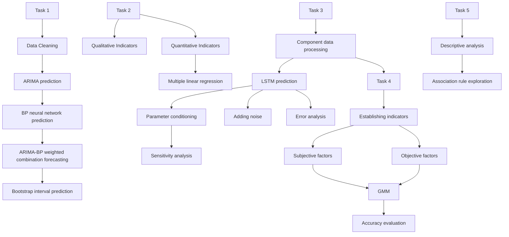
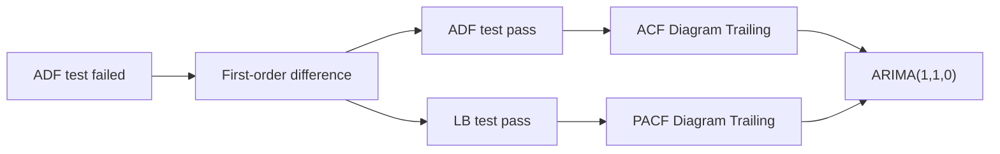
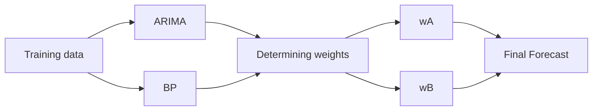

## Uncover the Hidden Secrets in Wordle Results

Since Wordle has become a popular puzzle game, it has accumulated a large amount of data. In this paper, we define a series of metrics and build several models to explore the hidden information in Wordle results.

First, after preprocessing the given data and analyzing the time series diagram of the number of reported results, we found that the changes can be divided into 3 stages. To forecast the number of reported results, we developed a weighted optimization model based on ARIMA and BP neural network. The prediction interval is then given using the Bootstrap method. We packaged this process as ARIMA-BP Interval Prediction Model Based On Bootstrap. Thus, we finally predicted the interval prediction value obtained on March 1, 2023 at 95% confidence level to be about (19504.74, 20383.26).

Then, we defined 3 qualitative and 4 quantitative attributes of words and used them to build a Multiple Linear Regression Model with the percentage of hard mode’s players. We found that the proportion will decrease by an average of 0.618 when the initial letter changes from a vowel to a consonant while it will increase by an average of 0.017 fo each one-unit increase in word internal distance.

After that, we made the percentage distribution prediction of the reported results based on LSTM Model. To ensure the percentage is around 100%, we first processed the component data using a spherical coordinate transformation. Then we use them as output variables, the 7 word attributes and number of results as input to train our LSTM model. The prediction of EERIE based on this are [2%, 11%, 25%, 24%, 19%, 14%, 5%]. We changed the model’s parameters and added noise to do sensitivity analysis. Meanwhile, we introduced COV to measure the uncertainty of the model prediction, and found that it is around 0.4. For error analysis, we use MSE, RMSE and R2 to measure the prediction accuracy, and their values are shown in Table 7.

We extracted 6 indicators: RDC, TE, SK, NFC, NON, and HL to measure the difficulty of words. We built a GMM Clustering Model based on these indicators and thus classifying 5 difficulty levels. We classified the word EERIE as difficulty level III.

In addition, by counting the frequency of each letter in five positions, we found S as the initial letter has the most frequency and more specific statistical results are shown in Table 9. We also used the Association Rule Model based on Apriori algorithm to mine the word combination pattern in Wordle. Ideally, we found that the letters A,S,E and F,T,L usually appear together in Wordle.

Finally, we evaluated and refined the model and reported the findings in a letter to the the Puzzle Editor of the New York Times.

Keywords: ARIMA-BP, LSTM, GMM, Apriori Algorithm, Word Attributes

## Contents

## 1 Introduction.........

1.1 Background . .3  
1.2 Problem Restatement. .3  
1.3 Our Work .. 4

## 2 Assumptions and Notations....

## 3 ARIMA-BP Interval Prediction Model Based On Bootstrap ....

3.1 Data Preprocessing.. 5  
3.2 Point Prediction Based on a Combined ARIMA-BP Model. 5  
3.3 Interval Prediction Based on Bootstrap Method. .9

## 4 Exploring the Impact of Word Attributes on Hard Mode Based on Multiple Linear Regression Model.... ..10

4.1 Defining Qualitative Attributes of Words. .10  
4.2 Defining Quantitative Attributes of Words. 11  
4.3 Building a Multiple Linear Regression Model. 11  
4.4 Results Analysis .12

## 5 Percentage Distribution Prediction Based on LSTM Model .... ..13

5.1 Processing of Component Data ....... .13  
5.2 How to Predict. .14  
5.3 Sensitivity Analysis .... .15  
5.4 Error Analysis.. .17

## 6 Word Difficulty Evaluation Based on GMM Model.... .18

6.1 Description of Indicators to Evaluate the Difficulty of Words. .18  
6.2 GMM Clustering Model Building..... .19  
6.3 Analysis of Clustering Results .20

## 7 Other interesting features of the dataset to explore.... .21

7.1 Word Frequency Statistics for 5 Letter Positions .. .21  
7.2 Exploration of the Combination Pattern Between Words . .21

## 8 Model Evaluation and Improvement .... .22

8.1 Strengths and Weaknesses .... .22  
8.2 Model Improvements .23

## 9 Conclusion .... .23

## 10 Letter to the Puzzle Editor of the New York Times ........ References ..... .25

## 1 Introduction

## 1.1 Background

Wordle is an online word puzzle game invented by Josh Wardle during the epidemic. The New York Times newspaper which is well known for the games it publishes has bought Wordle on February 2021[1]. Wordle only allows one game to be played per day, and every player in the world plays to guess the same five-letter word in six tries or less each day[2]. Players can play in regular mode or hard mode. They can share their scores via Twitter, thus attracting more people to play and share.

text_image

R O A S T
A D O R E
A L O U D
A R O M A
A M O N G
You Won!
Q W E R T Y U I O P
A S D F G H J K L
☒ Z X C V B N M Enter

Figure 1: Wordle Game

Back in October 2021, less than 5,000 visits registered to its web page while by January 2022, traffic had skyrocketed to over 45 million. Some of us also love this game, Figure 1 shows one result that we got. The green tile indicates that the secret solution word has the letter in the precise location. The yellow tile implies that the answer has the letter but not at the correct location. Grey tiles indicate the letters are not contained in the solution at all[3].

Now we have a file of daily results from January 7, 2022 to December 31, 2022. This file includes twelve key variables that are crucial in our later research. In the file, the percentages of the number of people for the seven tries may not sum to 100% due to rounding.

## 1.2 Problem Restatement

By analyzing the above background, we summarize the tasks that need to be addressed as follows：

Task 1: Develop a model to explain the daily variation in the total number of people reporting scores on Twitter and use it to give a prediction interval for the total number of people on March 1, 2023.  
Task 2: Determine whether the attributes of words affect the percentage of players who choose the hard mode and explain the obtained results accordingly.  
Task 3: If given a future date and the specific word, build a model to predict the percentage of 1-X tries in this day. After that, the word EERIE on March 1, 2023 should be used as a specific example of the model prediction, while analyzing the uncertainties of the model and the accuracy of the prediction.  
Task 4: Develop a model to classify the difficulty of the words and identify the attributes of them under each category. Use this model to determine how difficult the word EERIE is? Finally, discuss the accuracy of the classification model.  
· Task 5: List and describe some other interesting features of the dataset.

## 1.3 Our Work

flowchart

Figure 2: Our work

## 2 Assumptions and Notations

Assumption 1: The number of daily online gamers in the data set is a time-dependent set of series and is independent of seasonal changes.

Reason: Therefore, we can use ARIMA as well as LSTM models to predict a series of data for March 1,2023.

Assumption 2: The scores reported by players on Twitter on a daily basis are normal and reliable.

Reason: To ensure that the model we build based on the dataset can reliably predict a range of data for March 1,2023.

Assumption 3: Assuming that Wordle's development process is consistent with the game's life cycle theory.

Reason: This assumption reduces the impact of external uncertainties on Wordle game predictions, thus making the whole process of prediction and analysis more efficient.

In this work, we use the symbols in Table 1 in the model construction. Other nonefrequent-used symbols will be introduced once they are used.

Table 1: Notations

<table><tr><td>Symbols</td><td>Definition</td></tr><tr><td> $w_{A}$ </td><td>Weights of the ARIMA model</td></tr><tr><td> $w_{B}$ </td><td>Weights of the BP model</td></tr><tr><td> $P_{Ai}$ </td><td>Predicted value of ARIMA model</td></tr><tr><td> $P_{Bi}$ </td><td>Predicted value of BP model</td></tr><tr><td> $L_{i}$ </td><td>Distance between letters</td></tr><tr><td>NF</td><td>Noise factor</td></tr><tr><td> $C_{i}$ </td><td>the ratio of players at different guess counts</td></tr></table>

## 3 ARIMA-BP Interval Prediction Model Based On Bootstrap

## 3.1 Data Preprocessing

By reviewing the given data, we found that there are no missing values, but there are five outliers. One of them does not exist and two of them has less than 5 letters, we deleted these three rows of data due to the difficulty of obtaining the true values of these words. The two remaining outliers are caused by data entry errors. In order to avoid an excessive reduction in the amount of data, we changed them by combining the previous and later data as well as the semantics of them. In addition, the sum of the percentages in the original data are all in [98%, 102%], which is not much different from 100%, so they are reasonable and do not need to be processed. In summary, the preprocessing of the raw data is summarized in Table 2.

Table 2: Data Preprocessing

<table><tr><td>Outliers</td><td>Variable Type</td><td>Contest number</td><td>Preprocessing method</td></tr><tr><td>marxh</td><td>Word</td><td>473</td><td>Delete an entire row</td></tr><tr><td>clen</td><td>Word</td><td>525</td><td>Delete an entire row</td></tr><tr><td>tash</td><td>Word</td><td>314</td><td>Delete an entire row</td></tr><tr><td>2569</td><td>Number of reported results</td><td>529</td><td>Change to 22569</td></tr><tr><td>rprobe</td><td>Word</td><td>545</td><td>Change to probe</td></tr></table>

## 3.2 Point Prediction Based on a Combined ARIMA-BP Model

## 3.2.1 Variation Explaining

In the data preprocessing, although there are word entry errors, their corresponding numbers of reported results are not affected, so the complete reported data are analyzed in this problem. By observing and analyzing the characteristics of the changes in the number of reported results from Jan.7, 2022 to Dec 31, 2022, we found that they can be divided into 3 phases, as shown in Figure 3.

Based on the game lifecycle and player lifecycle theory[4], and combined with Wordle's game features, we explain the reasons for the changes as follows.

Phase 1: Rapid Growth Period (January 7, 2022 - February 2, 2022)

Since the launch of Wordle's web version, it has been updated with only one puzzle a day. This artificial scarcity enhances players' desire for challenge and anticipation. The sharing function of Wordle uses emoji blocks to refer to the results of the game, which is very recognizable and easy to spread, while also avoiding spoilers, thus attracting more new players to play Wordle. In addition, the traditional popularity of crossword puzzles and the easy-to-play game mechanics have contributed to Wordle's further popularity. During this period, Wordle's overall growth in the number of results reported is 348.85%, with the number peaking at 361,908 on February 2.

line chart

| Date       | Number of reported results |
| ---------- | --------------------------- |
| 2022/1/7   | ~1.0×10⁵                    |
| 2022/2/2   | ~3.6×10⁵                    |
| 2022/5/29   | ~0.6×10⁵                    |
| 2022/12/31 | ~0.2×10⁵                    |

Figure 3: Changes in the number of reported results

## Phase 2: Rapid Decline Period (February 3, 2022 - May 29, 2022)

During this period, Wordle experiences an overall 84.29% decline in the number of reported results, which is the general nature of internet fads. When the popularity of the game reaches its peak, it faces a significant loss of players due to gamers’ declining interest and boredom with the game. The singularity of Wordle's game mechanic can contribute to this. Furthermore, the emergence of competing games in the market such as ‘Words with Friends’ and Wordle's pirated games makes Wordle lose players further.

## Phase3: Stable Reduction Period (May 30, 2022 – December 31, 2022)

The overall decrease in the number of results reported for Wordle in this phase is 64.14%. Rapidly losing players in Phase 2 go to play Wordle generally because of its popularity among the general public and they will quickly leave when Wordle is no longer hot or the next trend emerges. The remaining players are often loyal Wordle players or players who have developed user stickiness due to the game's social circle. At this point, the number of reports will still drop but not by much.

## 3.2.2 Reasons for Model Selection

Predicting the number of reported results is a problem in the field of time series analysis. The traditional ARIMA model is capable of extracting deterministic information from historical data in order to predict the trend of variables over time, however, this model requires extensive testing before application, and the process of determining the order of the model is subjective to some extent [5]. In recent years, with the development of artificial intelligence, machine learning algorithms have been widely applied to the field of data classification and prediction. Among which, BP neural network model which is efficient and convenient can effectively break the limits of traditional time series prediction models. Considering these factors, we decide to combine the advantages of traditional time series models and machine learning models. It means that first of all, we use ARIMA model and BP neural network model to predict the number of reported outcomes separately, and then we use weighted average to combine the two models to obtain a more reliable ARIMA-BP combined prediction model.

## 3.2.3 ARIMA Forecasting

We first used the traditional ARIMA model for point prediction of the number of reported results, and this process is shown in Figure 4：

flowchart

Figure 4: ARIMA model building process

First, we performed ADF smoothness test on the variable ‘Number of reported results’ in the preprocessed data set and found that it wasn’t smooth. Therefore, we differenced the series to the first order and tested the differenced series again. After that, we observed the ACF and PACF plot of the differenced series, and found that the ACF plot showed the characteristics of trailing tails and the PACF plot showed the characteristics of 1st order truncated tails. Therefore, the following ARIMA(1,1,0) model can be developed for the original series:

$$
\left\{ \begin{array}{l} (1 - \phi_ {1} B) (1 - B) x _ {t} = \varepsilon_ {t} \\ E (\varepsilon_ {t}) = 0, \operatorname{Var} (\varepsilon_ {t}) = \sigma_ {\varepsilon} ^ {2}, E (\varepsilon_ {t} \varepsilon_ {s}) = 0, s \neq t, \\ E (x _ {s} \varepsilon_ {t}) = 0, \forall s <   t \end{array} \right.
$$

where $x _ { t }$ is the ${ \mathfrak { t } } ^ { \mathrm { { t h } } }$ time series value, B is the delay operator, $\phi _ { 1 }$ is the coefficient of the moving self-averaging polynomial.

## 3.2.4 BP Neural Network Prediction

BP neural network is a multilayer feedforward neural network trained according to the error back propagation algorithm, which can iterate and repair its own weights continuously based on the relationship between input and output variables so as to finally estimate the exact functional relationship[6]. Its algorithm is explained by the following pseudo-code.：

## Algorithm 1: Prediction of the Number of Reported Results

Input：Training set D

Output: test set E

Learning rate η; Data normalization (normalization formula)

Create network; Train the network

repeat for D

Forward propagation; Backward propagation

until for reaches end condition

Using the network; Inverse normalization of data

BP neural network prediction with test set E

end: The completed BP neural network trained

## 3.2.5 Analysis of Results

The result obtained using the ARIMA(1,1,0) model prediction is shown in Figure 5, and using the BP neural network model prediction is shown in Figure 6:

line chart

| x    | y       |
| ---- | ------- |
| 0    | 1e+04   |
| 50   | 2.5e+05 |
| 100  | 1.5e+05 |
| 150  | 1.0e+05 |
| 200  | 8.0e+04 |
| 250  | 7.0e+04 |
| 300  | 6.5e+04 |
| 350  | 6.0e+04 |

Figure 5: ARIMA prediction effect

line chart

| x    | y       |
| ---- | ------- |
| 0    | 0.8e+05 |
| 50   | 3.5e+05 |
| 100  | 1.5e+05 |
| 150  | 0.7e+05 |
| 200  | 0.4e+05 |
| 250  | 0.3e+05 |
| 300  | 0.25e+05|
| 350  | 0.2e+05 |

Figure 6: BP neural network prediction effect

It can be seen that the ARIMA model has a better effect prediction, and the point prediction $\mathrm { P _ { A } }$ obtained using this model for the number of results reported on March 1, 2023 is about 20598.84. BP neural network model has some bias in the early stage but has relatively good prediction effect in the later stage. The point prediction value $\mathrm { P _ { B } }$ obtained using this model on March 1, 2023 is about 19496.05.

## 3.2.6 Weighted Portfolio Model Forecast

In order to improve the accuracy and robustness of the model prediction, we derived a new combined ARIMA-BP prediction model based on ARIMA and BP neural network model by using the prediction errors to weight the two models. The design idea of this weighted combined forecasting model is shown in Figure 7:

flowchart

Figure 7: Combined model design

We first calculate the average prediction error for each of the two prediction models:

$$
\overline {{{{P E A ^ {2}}}}} = \frac {1}{N} \sum_ {i = 1} ^ {N} \left(R _ {i} - P _ {A i}\right) ^ {2}, \overline {{{{P E B ^ {2}}}}} = \frac {1}{N} \sum_ {i = 1} ^ {N} \left(R _ {i} - P _ {B i}\right) ^ {2}.
$$

After that, we use the share of the average prediction error squared of either model in the total average prediction error squared of the two models to reflect the weight accounted for by the other model, i.e.

$$
w _ {A} = \frac {\overline {{P E B ^ {2}}}}{\overline {{P E A ^ {2}}} + \overline {{P E B ^ {2}}}} \approx 0. 4 0 6, w _ {B} = \frac {\overline {{P E A ^ {2}}}}{\overline {{P E A ^ {2}}} + \overline {{P E B ^ {2}}}} \approx 0. 5 9 4.
$$

Thus, the point prediction value of the $\mathrm { i ^ { t h } }$ series in the final ARIMA-BP combination model obtained is calculated as:

$$
P _ {i} = w _ {A} P _ {A i} + w _ {B} P _ {B i}. \tag {1}
$$

Through the analysis of the prediction errors above, it is obvious that the overall prediction error of ARIMA model is relatively high, while the BP neural network model may be overfitted. Therefore, the combined ARIMA-BP prediction model can correct the errors of these two models, thus making the prediction results more realistic.

line chart

| Serial number | Arima | BP Neural Network | Arima-BP |
| ------------- | ----- | ----------------- | -------- |
| 300           | 2000  | 1500              | 1800     |
| 305           | 4500  | 3200              | 3100     |
| 310           | 2200  | 2700              | 2400     |
| 315           | 3900  | 2600              | 2800     |
| 320           | 2900  | 1800              | 2000     |
| 325           | 3100  | 1200              | 1900     |
| 330           | 2400  | 1700              | 2100     |
| 335           | 2000  | 1600              | 1800     |
| 340           | 2900  | 1900              | 2100     |
| 345           | 3800  | 4800              | 4400     |
| 350           | 3000  | 1400              | 1500     |
| 355           | 5400  | 5300              | 5400     |
| 360           | 1100  | 900               | 800      |

Figure 8: Prediction errors of three models

The final point forecast for the number of results reported on March 1, 2023 using this combined ARIMA-BP model is approximately 19944.

## 3.3 Interval Prediction Based on Bootstrap Method

The Bootstrap method is an important method used in statistics for interval prediction, which first assumes that the data set obeys an unknown distribution, and later estimates the distribution interval of the sample by repeatedly sampling the given data set [7].We took the data predicted under the weighted combination model for the next 60 periods as the sample set, after which we sampled it 1000 times with put-back to obtain the 1000 Bootstrap sample set， $\mathrm { Y ^ { B } = ( Y _ { 1 } , ~ \ Y _ { 2 } , ~ \cdots \to , ~ \ Y _ { 1 0 0 0 } ) }$ .

For each subsample, the distribution is in line with that of the sample, so we calculated the standard deviation (SD) of these 1000 subsample sets as the SD of the sample:

$$
\sqrt {\operatorname{Var} (y)} = \sqrt {\frac {1}{N - 1} \sum_ {i = 1} ^ {N} \left(y i - \bar {y}\right) ^ {2}}.
$$

According to the central limit theorem, it is known that the set of samples obtained by conducting 1000 draws approximately obeys the normal distribution. Therefore, the upper and lower limits of the confidence interval of the sample at confidence level 1-α can be calculated with the help of z-statistic：

$$
y = \hat {y} \pm Z _ {\alpha / 2} \times \sqrt {\operatorname{Var} (y)}. \tag {2}
$$

Taking the confidence levels of 95%, 90% and 80% respectively, the final prediction intervals for the number of results reported on March 1, 2023 are shown in Table 3.

Table 3: Forecast interval

<table><tr><td>Confidence level</td><td>Lower limit</td><td>Upper limit</td></tr><tr><td>95%</td><td>19504.74</td><td>20383.26</td></tr><tr><td>90%</td><td>19575.33</td><td>20312.67</td></tr><tr><td>80%</td><td>19656.69</td><td>20231.31</td></tr></table>

From a statistical point of view, the number of people reporting Wordle scores on Twitter on March 1, 2023 will be approximately in the range of (19,504.74, 20,383.26), which will be a decrease compared to the current situation.

## 4 Exploring the Impact of Word Attributes on Hard Mode

## Based on Multiple Linear Regression Model

Exploring the effects of certain attributes of words on the proportion of players choosing Hard Mode is a multiple-input variable, single-output variable modeling problem. We decided to develop a multiple linear regression model to derive whether word attributes affect the percentage of scores reported that were played in Hard Mode and the extent of their effects. The input variables X1-X7 are defined as follows.

## 4.1 Defining Qualitative Attributes of Words

First we made an overview of all the words in the dataset, and drew a word cloud map for the 356 words after preprocessing in Figure 9. We found that each word is different and its frequency is 1, so its size in the word cloud map is about the same.

text_image

HINGS
MOMMY
INPUT
ADORE
AEXIM
CANNY
BRAVE
BLADE
ALON
MOZZLE
BEUGH
BLAND
SANSI
GARL
BRAID
BRADF
ALON
MOZZLE
BEUGH
BLAND
SANSI
GARL
BRAID
ALON
MOZZLE
BEUGH
BLAND
SANSI
GARL
BRAID
ALON
MOZZLE
BEUGH
BLAND
SANSI
GARL
BRAID
ALON
MOZZLE
BEUGH
BLAND
SANSI
GARL
BRAID
ALON
MOZZLE
BEUGH
BLAND
SANSI
GARL
BRAI
BALDZ GLASS
SANSI
GARL
BRAI
BALDZ GLASS
SANSI
GARL
BRAI
BALDZ GLASS
SANSI
GARL
BRAI
BALDZ GLASS
SANSI
GARL
BRAI
BALDZ GLASS
SANSI
GARL
BRAI
BALDZ GLASS
SANSI
GARL
BBOZE GLASS
SANSI
GARL
BBOZE GLASS
SANSI
GARL
BBOZE GLASS
SANSI
GARL
BBOZE GLASS
SANSI
GARL
BBOZE GLASS
SANSI
GARL
BBOZE GLASS
SANSI
GARL
BBOZE GLASS
SANSI
GARL
BBOZE GLAS

Figure 9: A word cloud map for the 357 words

By searching for relevant literature, we classified the word attributes into 3 qualitative attributes and 4 quantitative attributes for a total of 7 word attributes.

## Part of speech (X1)

Part of speech is the most basic attribute of a word, the major classes are noun, verb and adjective[8]. By analyzing the parts of speeh of these 356 words, we divided the parts of speech of words into four categories: noun, verb, adjective and others.

## Uncommon extent (X2)

The extent of uncommonness is also one of the qualitative attributes of words. We used the COCA corpus to find the frequency of occurrence of each word in practical applications such as spoken speech, fiction books, magazines and newspapers, and academic journals. Using 3000 as a cut-off point, we divided the words into two categories: common and uncommon.

## Whether the initial letter a vowel or a consonant letter (X3)

Starting with a vowel or consonant letter is also a qualitative attribute of a word. The vowel letters are a, e, i, o, u, which may affect the rate of players who uses Hard Mode.

## 4.2 Defining Quantitative Attributes of Words

## Number of vowel letters (X4)

The number of vowel letters is one of the quantitative attributes of words. By counting that number for each word, we found that it takes values in [0, 3] (the value is an integer).

## Maximum number of letter repetitions (X5)

A word can be composed of different letters or may contain repeated letters, and the maximum number of letter repetitions can also be used as a quantitative property of a word. By counting that number for each word, we found that it takes values in the range [1,3] (the value is an integer).

## Emotional polarity value (X6)

Each word tends to imply a certain emotional attitude, and we used the SenticNet emotion dictionary to get the emotional polarity values for 356 words. In that, negative values represent negative emotions and positive values imply positive emotions.

## ⚫ Word internal distance (X7)

We define the internal distance of a word (WID) as the sum of the distances of each adjacent letter in it (see Equation 3), and the letter distance is the distance between their positions (L) in the alphabet, e.g. A and C have a letter distance of 2 and ABBEY has an internal distance of 24.

$$
W I D _ {n} = \sum_ {i = 1} ^ {4} \left| L _ {i + 1} - L _ {i} \right|, n = 1, 2, 3 \dots 3 5 7 \tag {3}
$$

## 4.3 Building a Multiple Linear Regression Model

Currently we have obtained data for 7 independent variables, but since 3 qualitative data: X1-X3, are categorical variables, we need to assign values to them before substituting them into the model. We assigned values to each category as follows.

$$
X 1 = \left\{ \begin{array}{l} 1, n o u n \\ 2, v e r b \\ 3, a d j e c t i v e \\ 4, o t h e r s \end{array} , X 2 = \left\{ \begin{array}{l} 1, c o m m o m \\ 2, u n c o m m o m \end{array} , X 3 = \left\{ \begin{array}{l} 1, v o w e l \\ 2, c o n s o n a n t \end{array} \right. \right. \right.
$$

The dependent variable (Y) is the percentage of scores reported that were played in Hard Mode, which can be calculated according to equation (4).

$$
Y = \frac {\text { Number   in   hard   mode }}{\text { Number   of   reported   results }} \times 100 \% \tag{4}
$$

Descriptive statistics for all variables identified are shown in Figure 10 and Table 4. As seen in (a), there are more uncommon words in the dataset than common ones, and more words with initial consonant letters than vowel letters; as seen in (b), there are the most nouns in the dataset, accounting for 53%, 61% of words with only one vowel letter, and 29% of words with more than two maximum repetitions of letters.

bar chart

| Category | Value |
| :--- | :--- |
| Common | 117 |
| Uncommon | 240 |
| vowel | 60 |
| consonant | 297 |

(a) X2 – X3

pie chart

| Category | Maximum number of letter repetitions (%) | Number of vowel letters |
| :--- | :--- | :--- |
| noun | 1 | 0 |
| verb | 29 | 1 |
| adjective | 61 | 2 |
| others | 4 | 3 |

(b) X1, X4 – X5  
Figure 10: Descriptive statistics of variables

As seen in Table 4, the average value of emotional polarity value among the 356 words is 0.0355, which is positive; the average value of word internal distance is 33.3726; the average percentage of people reported to play hard mode is 7.52%

Table 4: Descriptive statistics of variables

<table><tr><td>Variable</td><td>Minimum</td><td>Maximum</td><td>Average</td><td>Standard deviation</td></tr><tr><td>X6</td><td>-1</td><td>0.999</td><td>0.0355</td><td>0.6448</td></tr><tr><td>X7</td><td>7</td><td>71</td><td>33.3726</td><td>11.9655</td></tr><tr><td>Y</td><td>1.17%</td><td>13.33%</td><td>7.52%</td><td>0.0223</td></tr></table>

Then, a multiple linear regression model can be developed as follows.

$$
Y = \beta_ {0} + \sum_ {i = 1} ^ {7} \beta_ {i} X _ {i} + \varepsilon
$$

In the model, $\beta _ { 0 } , \beta _ { i }$ are the parameters of the model and is the error term. Substituting the variable data, the final fitted regression model is:

$$
\begin{array}{l} \hat {Y} = 6. 8 5 5 - 0. 0 0 7 X 1 + 0. 3 0 5 X 2 - 0. 6 1 8 X 3 + 0. 1 3 6 X 4 \\ + 0. 3 9 4 X 5 - 0. 0 2 5 X 6 + 0. 0 1 7 X 7 \\ \end{array}
$$

## 4.4 Results Analysis

The results of the significance tests for the model as a whole and for the regression parameters of each independent variable are collated in Table 5.

Table 5: Model and parameter significance results

<table><tr><td>Variable</td><td>t-value (F-value)</td><td>P-value</td><td>Variable</td><td>t-value</td><td>P-value</td></tr><tr><td>Model</td><td>1.747</td><td>0.097</td><td>X4</td><td>0.662</td><td>0.509</td></tr><tr><td>X1</td><td>-0.053</td><td>0.958</td><td>X5</td><td>1.551</td><td>0.122</td></tr><tr><td>X2</td><td>1.210</td><td>0.227</td><td>X6</td><td>-0.138</td><td>0.890</td></tr><tr><td>X3</td><td>-1.798</td><td>0.073</td><td>X7</td><td>1.655</td><td>0.099</td></tr></table>

First, the P-value of the model as a whole is 0.097, which is significant at the 10% level of significance, indicating that the model is significant. Second, among the 7 independent variables, only X3 and X7 have a P-value significant at the 10% level, which are 0.073 and 0.099 respectively, indicating that the regression coefficients of these two variables are significant. The p-values of the other variables are more than 0.1, so their regression coefficients are not significant.

Thus, the two word attributes of whether the initial letter of a word is a vowel or a consonant letter and word internal distance have a significant effect on the proportion of players who report playing the hard mode, and other five variables of part of speech, uncommon extent, number of vowel letters, maximum number of letter repetitions, and emotional polarity value do not have a significant effect on this rate. When other variables are held constant, the proportion will decrease by an average of 0.618 when the initial letter changes from a vowel to a consonant; the proportion will increase by an average of 0.017 for each one-unit increase in word internal distance.

## 5 Percentage Distribution Prediction Based on LSTM Model

## 5.1 Processing of Component Data

Currently, we know the percentage of players reporting scores on Twitter who guessed the word or were unable to solve the puzzle in 1 to 6 attempts per day, and these percentages add up to an approximate 100%.

bar chart

| Category | Value (%) |
|---|---|
| 1: | 0 |
| 2: | 6 |
| 3: | 22 |
| 4: | 33 |
| 5: | 24 |
| 6: | 12 |
| X: | 3 |

Figure 11: Percentage of successful attempts

It can be seen that these percentage data together form a set of component data $\mathrm { X } { = } ( x _ { I } , x _ { 2 } , \cdots { \times } \cdot \cdot , x _ { 7 } )$ , and that the values of the seven components in X approximately satisfy the constraint:

$$
\sum_ {i = 1} ^ {7} x _ {i} \approx 1, 0 \leqslant x _ {i} <   1. \tag {5}
$$

Therefore, the prediction of the percentage of future dates with respect to $( 1 , 2 , \cdots , 6 , \mathrm { X } )$ can be considered as a prediction problem for the component data. In order to satisfy the restrictions of equation (5), instead of directly using the original data set as the output variable for prediction, we first performed a spherical coordinate transformation on the component data.

We open the root of each component $x _ { i }$ of the component data to obtain $y _ { i } = { \sqrt { x _ { i } } }$ ,

which gives us the new vector group $Y = \left( y _ { 1 } , y _ { 2 } , \cdots , y _ { 7 } \right)$ . Y can be viewed as a point on

the hypersphere, so we map Y into the hypersphere, i.e.

$$
\left\{ \begin{array}{l} \theta_ {7} = \arccos y _ {7} \\ \theta_ {6} = \arccos \left(\frac {y _ {6}}{\sin \theta_ {7}}\right) \\ \theta_ {5} = \arccos \left(\frac {y _ {5}}{\sin \theta_ {7} \sin \theta_ {6}}\right) \\ \vdots \\ \theta_ {2} = \arccos \left(\frac {y _ {2}}{\sin \theta_ {7} \sin_ {6} \cdots \sin \theta_ {3}}\right) \end{array} \right.
$$

After the above processing, we can use $\theta _ { 2 } - \theta _ { 7 }$ as the output variable and use the model to predict it. After the prediction results are available, the final component data $\mathbf { X } 1 { - } \mathbf { X } 7$ can be obtained by inverse transformation.

## 5.2 How to Predict

For the percentage prediction of the number of attempts by players in the specified future date, we view it as an information mapping problem between multiple inputs and multiple outputs. In this process, we consider the output variable as the percentage component data that we transformed using ball coordinates. As for the input variables, we consider two main aspects: the number of players and the properties of the words. From the previous analysis, we have found that the number of players changes over time, which may cause the percentage of attempts by players to change accordingly. On the other hand, the attributes of words will have a direct impact on the success rate of players' guesses and thus on the distribution of percentages. Therefore, in addition to the number of players per day, we include the seven words’ attributes already defined earlier as input variables. Finally, for the selection of the prediction model, we chose the LSTM deep learning model, and we will describe the application of this model in detail below.

LSTM model is a long short-term memory network model that allows the analysis of input data using time series and predicts the future trend of these input data by using the core idea of cell state operation [9]. The working principle of this model can be represented in Figure 12, where yellow represents the arithmetic operations and blue represents the learned neural network.

```mermaid
graph TD
  A["ct-1"] --> B["×"]
  C["h_{t-1}"] --> D["σ"]
  E["xt"] --> F["×"]
  G["ft"] --> H["σ"]
  I["it"] --> J["σ"]
  K["ct"] --> L["tanh"]
  M["ot"] --> N["σ"]
  O["ct"] --> P["tanh"]
  Q["ht"] --> R["×"]
  S["ct"] --> T["×"]
  U["ht"] --> V["×"]
  W["ct"] --> X["×"]
  Y["ct"] --> Z["×"]
  AA["ct"] --> AB["×"]
  AC["ct"] --> AD["×"]
  AE["ct"] --> AF["×"]
  AG["ct"] --> AH["×"]
  AI["ct"] --> AJ["×"]
  AK["ct"] --> AL["×"]
  AM["ct"] --> AN["×"]
  AO["ct"] --> AP["×"]
  AQ["ct"] --> AR["×"]
  AS["ct"] --> AT["×"]
  AU["ct"] --> AV["×"]
  AW["ct"] --> AX["×"]
  AY["ft"] --> AZ["×"]
  BA["i_t"] --> BB["σ"]
  BC["c_t"] --> BD["×"]
  BE["ct"] --> BF["×"]
  BG["o_t"] --> BH["σ"]
  BI["tanh"] --> BJ["×"]
  BK["xt"] --> BL["x_t"]
  BM["h_t"] --> BN["ct"]
```

flowchart

Figure 12: The working principle of LSTM

The LSTM model has the ability to remove or add information to each module by

setting up "gates", and in general it consists of four steps：

Step 1: Decide the discarded information in the cell: this operation first reads the current input $x _ { t }$ and the pre-neuron information $h _ { t - I ; }$ , after which the forgetting gate $f _ { t }$ determines the discarded information：

$$
f _ {t} = \sigma (W _ {f} [ h _ {t - 1}, x _ {t} ] + b _ {f})
$$

Step 2: Determine the new information stored in the cell state: this operation uses the sigmoid layer as the input gate layer to determine the updated values and creates a new vector of candidate values via the tanh layer which are then added to the state：

$$
i _ {t} = \sigma \left(W _ {i} \left[ h _ {t - 1}, x _ {t} \right] + b _ {i}\right), \tilde {c} _ {t} = \tanh \left(W _ {c} \left[ h _ {t - 1}, x _ {t} \right] + b _ {c}\right)
$$

Step 3: Update the cell state. This operation updates $c _ { t - l }$ to $c _ { t }$ and multiplies the old state with ft, while discarding the information that needs to be discarded, after which the new candidate value is determined.

$$
c _ {t} = f _ {t} \cdot c _ {t - 1} + i _ {t} \cdot \tilde {c} _ {t}
$$

Step 4: Determine the output: This operation uses the sigmoid layer to determine the portion of the cell state that is output, followed by processing the cell state through tanh and multiplying it with the output of the sigmoid layer by.

$$
o _ {t} = \sigma \left(W _ {0} \left[ h _ {t - 1}, x _ {t} \right] + b _ {0}\right), h _ {t} = o _ {t} \cdot \tanh \left(c _ {t}\right)
$$

After that, we use the word EERIE as an example, and the number of players who report their scores on that day is predicted to be about 19944 using the ARIMA-BP weighted model, while the set of attribute vectors for this word is (3, 2, 4, 3, 1, 1, 26). Bringing these input attributes into our LSTM model, while inverse transforming the obtained results, we can get the final percentage distribution of the number of player attempts on March 1, 2023:

Table 6: Results

<table><tr><td>1 try</td><td>2 tries</td><td>3 tries</td><td>4 tries</td><td>5 tries</td><td>6 tries</td><td>X</td></tr><tr><td>2%</td><td>11%</td><td>25%</td><td>24%</td><td>19%</td><td>14%</td><td>5%</td></tr></table>

It can be seen that on March 1, 2023, for the word EERIE, about 13% of the players could guess the word in 2 trys, about 49% of the players could guess it in 3 to 4 guesses, while 5% of the players failed to guess the word in the required number of attempts.

## 5.3 Sensitivity Analysis

We explored the uncertainties of our model and predictions through sensitivity analysis, which was performed separately for the model using two methods: adjusting the model parameters and adding noise in the form of a normal distribution to the variables.

## Adjusting the model parameters

For parameter adjustment, we adjusted the batchsize and epoch parameters of the LSTM model five times, with specific adjustment values of [25, 250], [50, 500], [75, 750], [100, 1000], and [125,1500]. We considered the percentage of players with 7 attempt types per word as a prediction whole and used the coefficient of variation (COV) to measure the degree of dispersion between the 7 percentage values. The formula for COV is:

$$
C O V = \frac {s}{\overline {{x}}}
$$

Based on the prediction idea of the LSTM model above, we re-predicted the data using the model after adjusting the parameters and calculated the COVs for the predicted data. If the overall distribution of COVs is similar as the model is adjusted, the uncertainty of the model is lower, and vice versa is higher. With the variation of batchsize (bs) and epoch (ep), the scatter plot of COVs of 356 words is shown in Figure 13.

box plot

| bs   | ep   |
| ---- | ---- |
| 25   | 250  |
| 50   | 500  |
| 75   | 750  |
| 100  | 1000 |
| 125  | 1500 |

Figure 13: Sensitivity and uncertainty analysis (1)

As seen in Figure 13, the variations of the model parameters (bs, ep)have an effect on the distribution of the COVs of the predicted data. The distributions of COVs are similar under the model parameters except for bs=75, ep=750 where the distribution are more concentrated, indicating that the uncertainty of the model and prediction is low.

## Adjusting noise

For adding noise, we first randomly generated a normal distribution matrix M356×7, which was then multiplied by a noise coefficient NF and added to a matrix T7×356 consisting of the original data from one try to X tries to calculate the new output data set N of the model. The formula is expressed as follows. We adjusted the values of NF to 0.1, 0.15, 0.2, 0.25 and 0.3 respectively.

$$
N = T _ {3 5 6 \times 7} + N F \times M _ {3 5 6 \times 7}
$$

Similarly, we re-predicted the data using the model after adding noise and calculated the COVs for the predicted data. With the variation of NF, the scatter plot of COVs of 356 words is shown in Figure 14.

box plot

| NF    | COV Value |
|-------|-----------|
| 0.1   | 0.6       |
| 0.1   | 0.8       |
| 0.1   | 0.9       |
| 0.15  | 0.6       |
| 0.15  | 0.8       |
| 0.15  | 0.9       |
| 0.2   | 0.6       |
| 0.2   | 0.9       |
| 0.2   | 1.0       |
| 0.25  | 0.6       |
| 0.25  | 0.9       |
| 0.25  | 1.0       |
| 0.3   | 0.6       |
| 0.3   | 0.9       |
| 0.3   | 1.0       |

Figure 14: Sensitivity and uncertainty analysis (2)

As seen in Figure 14, the variations of the noise factor (NF) also have an effect on the distribution of the COVs of the predicted data. The distribution of COVs is more consistent across words when NF is 0.2 and above, which also indicates that the uncertainty of the model and prediction is lower at this time. We defined the overall extreme difference of the COV (Equation 6) to indicate the degree of uncertainty.

$$
\text { Uncertainty } = \max (C O V) - \min (C O V) \tag {6}
$$

From the variation of model parameters, the uncertainty of model and prediction is 0.4321; from the variation of noise coefficient, this uncertainty is 0.4794.

## 5.4 Error Analysis

We use error analysis to measure the confidence of the model prediction. The smaller the prediction error, the higher our confidence in the model we build. By reviewing the literature[10], we determined to use the mean absolute error (MAE), the root mean squared error (RMSE) and the coefficient of determination (R2) to evaluate the effectiveness of the model prediction.

## Mean absolute error (MAE)

MAE is the weighted average of the absolute values of the differences between the predicted $( \hat { y } _ { n } )$ and true values $( y _ { n } )$ of the model. Mean absolute error does not consider

the direction of the error, but only the average error magnitude of the predicted value. Therefore, this indicator can avoid the problem of mutual offset, and then can reflect the size of the actual prediction error more accurately. The range of MAE is [0, +∞), and the smaller the MAE is, the better the model fitting. The formula is as follows.

$$
M A E = \frac {1}{N} \sum_ {n = 1} ^ {3 5 7} \left| y _ {n} - \hat {y} _ {n} \right|
$$

## − Root mean squared error (RMSE)

RMSE is the average root of the expected value of the square of the difference between the true value and the predicted value. It measures the deviation between the predicted and true values and is more intuitive in terms of order of magnitude. The range of the RMSE is [0, +∞), and the smaller the RMSE value, the better the model's predictive ability. The formula is as follows.

$$
R M S E = \sqrt {\frac {1}{N} \sum_ {n = 1} ^ {3 5 7} \left(y _ {n} - \hat {y} _ {n}\right) ^ {2}}
$$

## − Coefficient of determination (R2)

$\mathtt { R } ^ { 2 }$ is used to measure the goodness of fit of the model predictions to the actual values. The range of it is [0,1], a value close to 1 indicates that the model fits well; if the value is close to 0, the model is poorly fitted. The formula is as follows.

$$
R ^ {2} = 1 - \frac {\sum_ {n = 1} ^ {3 5 7} \left(y _ {n} - \hat {y} _ {n}\right) ^ {2}}{\sum_ {n = 1} ^ {3 5 7} \left(y _ {n} - \overline {{y}}\right) ^ {2}}
$$

According to the formula of the above 3 indicators, we calculated the prediction error of the percentage of players making 1 try - X tries respectively, and then found the mean value of them. The calculation results are collated in Table 7.

Table 7: Error analysis

<table><tr><td>Indicators</td><td>1 try</td><td>2 tries</td><td>3 tries</td><td>4 tries</td><td>5 tries</td><td>6 tries</td><td>X tries</td><td>Average</td></tr><tr><td>MAE</td><td>0.543</td><td>3.361</td><td>7.168</td><td>4.162</td><td>5.350</td><td>5.443</td><td>2.403</td><td>4.062</td></tr><tr><td>RMSE</td><td>0.911</td><td>4.414</td><td>8.868</td><td>5.423</td><td>6.590</td><td>6.865</td><td>4.302</td><td>5.339</td></tr><tr><td> $R^2$ </td><td>0.899</td><td>0.986</td><td>0.993</td><td>0.989</td><td>0.986</td><td>0.993</td><td>0.998</td><td>0.978</td></tr></table>

As seen in Table 7, the MAE of all prediction results is within 8, with an average MAE of 4.062 and an average RMSE of 5.339, both of which have small values, indicating that the prediction error of the model is small. In addition, the overall R2 of the model is 0.978, which indicates that the model fits extremely well and the model has good prediction effect. Therefore, we have confidence in our model to a large extent.

## 6 Word Difficulty Evaluation Based on GMM Model

## 6.1 Description of Indicators to Evaluate the Difficulty of Words

The difficulty of a word is influenced by its natural properties, and it can also be reflected by the number of attempts made by the player. Therefore, before classifying the difficulty of words, we first defined some indicators that can measure the difficulty of words in terms of both subjectivity (S) and objectivity (O).

## Calculating the relative difficulty coefficient (S)

The number of players of each attempt of type can be obtained from the number of results reported and the later percentage, and to reduce the effect of decreasing numbers in time series changes, we preprocessed the number of players (NP) using extreme difference normalization:

$$
N P _ {i j} ^ {\prime} = \frac {N P _ {i j} - N P _ {\mathrm{min}}}{N P _ {\mathrm{max}} - N P _ {\mathrm{min}}}.
$$

We define the score for one guess-X guesses as [1, 7], where a higher score indicates a more difficult word. The score is multiplied by the number of people to obtain the total score (TS) for each word under different guesses. Then the importance of different number of guesses to word difficulty was assigned based on AHP, and the weights Wi were obtained by the eigenvalue method as [0.0285, 0.0428, 0.0662, 0.1016, 0.1558, 0.2404, 0.3648] respectively. The consistency index C.R is 0.0176<0.1, indicating that the weights calculated based on the judgment matrix weights are valid. From this we define the relative difficulty coefficient (RDC) of words as follows.

$$
R D C = W _ {i} \times T S \tag {7}
$$

## Try expectations (S)

We consider the ratio of players at different guess counts (Ci) as the probability of occurrence of that count (Pi), and define the try expectation (TE) which is also the average times each word is guessed as follows. Harder words have bigger TE.

$$
T E = \sum_ {i = 1} ^ {7} P _ {i} \times C _ {i} \tag {8}
$$

## Skewness coefficient (S)

The skewness coefficient (SK) can reflect the distribution of the data. For the number of attempts data, words are more difficult when SK is less than 0 while the data are leftskewed distributed, and vice versa. Its calculation formula is as follows.

$$
S K = \frac {n \sum \left(x _ {i} - \bar {x}\right) ^ {3}}{(n - 1) (n - 2) s ^ {3}}
$$

## Word frequency coefficient (O)

Based on the COCA corpus, we counted the word frequencies of more than 350 words in Wordle, and then we defined the word frequency coefficient of the word with the highest frequency as 1, the coefficient of the word with the lowest frequency as 0, and the coefficient of the word with the middle frequency as 0.5. In this way, all of the word frequencies can be mapped to the interval [0, 1]. The conversion equation for the word frequency coefficient in the lower interval is：

$$
\underline {{F C}} = 0 + \frac {F R E - F R E _ {\min}}{F R E _ {m i d} - F R E _ {\min}} \times 0. 5.
$$

The conversion equation for the word frequency coefficient in the upper interval is：

$$
\overline {{F C}} = 0. 5 + \frac {F R E - F R E _ {m i d}}{F R E _ {\max} - F R E _ {m i d}} \times 0. 5.
$$

## Number of orthographic neighbors (O)

Orthographic neighbors are defined as words which are the same length but differ by one letter (such as scare and stare)[11]. We collect this data of each word from “MCWord: An Orthographic Wordform Database”. The more orthographic neighbors a word has, the more difficult it is for the player to pinpoint the word, and the more difficult it is.

## Harmony level (O)

We use the harmony level to indicate the degree of harmony between the reading and writing of a word from the perspective of the cognitive ability of Wordle players.

First, we use H to denote the ratio between the length of a word and the length of its phonetic symbols, i.e.

$$
H = \frac {L W}{L T}
$$

The closer the value of H is to 1, the better the harmony level of the word. Therefore, we can calculate the absolute value of the difference between H and 1. We define the harmony level of the word corresponding to the smallest absolute value as 1, and the harmony level of the word corresponding to the largest absolute value as 0. In this way, the harmony levels of all words can be also mapped to the interval [0, 1].

## 6.2 GMM Clustering Model Building

After specifying the indicators used to express the difficulty level of words, we chose a GMM model to cluster these indicator values to classify the difficulty level of words. Compared with the traditional K-means clustering, GMM clustering belongs to the hybrid clustering, which uses M’ distance to measure the constraint relationship between different variables, and can be considered as a better clustering method.

The GMM algorithm assumes that the samples obey k mixed Gaussian distribution functions, and for each sample point, the probability that it belongs to the kth multivariate Gaussian distribution can be calculated as follows.

$$
p \left(x ^ {(i)} \mid z ^ {(i)} = j\right) = \frac {1}{(2 \pi) ^ {\frac {n}{2}} \left| \sum \right.} e ^ {- \frac {1}{2} \left(x ^ {(i)} - \mu_ {j}\right) \sum^ {- 1} \left(x ^ {(i)} - \mu_ {j}\right) ^ {T}}
$$

After that, the parameters of each multivariate Gaussian distribution function can be updated by the EM algorithm：

$$
\mu_ {j} = \frac {\sum_ {i = 1} ^ {m} w _ {j} ^ {(i)} x ^ {(i)}}{\sum_ {i = 1} ^ {m} w _ {j} ^ {(i)}}, \sum j = \frac {\sum_ {i = 1} ^ {m} w _ {j} ^ {(i)} \left(x ^ {(i)} - \mu_ {i}\right) \left(x ^ {(i)} - \mu_ {i}\right) ^ {T}}{\sum_ {i = 1} ^ {m} w _ {j} ^ {(i)}}.
$$

Based on the above process, the iterative loop is continued until the Gaussian parameters converge and the loop is stopped. After that, we can classify the samples into categories by the calculated Gaussian parameters.

## 6.3 Analysis of Clustering Results

The clustering results based on the GMM model are shown in Table 8. Since the evaluation criteria of relative difficulty coefficient (RDC) is more comprehensive among these six indicators, which is a weight score calculated by refining the proportional characteristics of players under different guesses. It is more decisive for the difficulty of words than other indicators. Therefore, we mainly divided the difficulty level by the size of RDC of each category, and the division results are as follows.

Table 8: Clustering Results

<table><tr><td>Difficulty Level</td><td>TE</td><td>SK</td><td>RDC</td><td>WFC</td><td>NON</td><td>HL</td></tr><tr><td>I</td><td>4.1548</td><td>0.6371</td><td>0.4158</td><td>0.351</td><td>0</td><td>0.3324</td></tr><tr><td>II</td><td>4.1920</td><td>0.4875</td><td>0.4345</td><td>0.3684</td><td>3.7589</td><td>0.3705</td></tr><tr><td>III</td><td>4.1866</td><td>0.5483</td><td>0.4656</td><td>0.3571</td><td>1.3984</td><td>0.3496</td></tr><tr><td>IIII</td><td>4.0888</td><td>0.1631</td><td>0.5786</td><td>0.4379</td><td>11.3750</td><td>0.4167</td></tr><tr><td>IIIII</td><td>4.2992</td><td>0.2261</td><td>0.5941</td><td>0.3782</td><td>6.8958</td><td>0.3524</td></tr></table>

The words in difficulty level I are the easiest compared to the words in other categories, with the lowest RDC in this category; the highest skewness coefficient (SK) and a rightskewed distribution, indicating that a higher percentage of players guessed the words in this category correctly with fewer attempts; the number of orthographic neighbors (NON) is 0, indicating that players are able to locate the words easily.

The ROC of words in difficulty level IIIII is 0.5941, the highest; the try expectation is also the highest, and the average number of times players guessed the words in this category is 4.2992. The specific attribute values of the remaining difficulty categories are shown in Table 8.

Based on the definitions and formulas of the 6 indicators, the 6 attribute values of EERIE were obtained as shown in Figure 15. By calculating the Marxist distance between the 6 indicator values of the word and the corresponding indicators of the 5 difficulty levels classified, we found that the distance between the word and difficulty level III is the closest, so we believe that EERIE belongs to difficulty level III.

radar chart

| Category | Value |
| -------- | ----- |
| TE       | 4.09  |
| SK       | -0.14 |
| RDC      | 0.11  |
| WFC      | 0.50  |
| NON      | 1.00  |
| HL       | 1.00  |

Figure 15: six attribute values of EERIE

area chart

| Cluster | Silhouette Value |
| ------- | ---------------- |
| 1       | 0.7              |
| 2       | 0.8              |
| 3       | 0.8              |
| 4       | 0.8              |
| 5       | 0.0              |

Figure 16: Accuracy of the model

As is shown in Figure 16, the Silhouette Value can reflect the accuracy of GMM model clustering. The closer the Silhouette Value is to 1, the higher the accuracy of the model has. According to the results, our Silhouette Values of the five categories aggregated into are all in the range of 0.8 attachment, which shows that the clustering effect we obtained using the GMM model has a high degree of accuracy.

## 7 Other interesting features of the dataset to explore

## 7.1 Word Frequency Statistics for 5 Letter Positions

We counted the frequency of letters in 5 letter positions for each of the 356 words, and Table 9 demonstrates the letters with the top 8 frequencies in 5 letter positions and their frequencies. We found that 's' as the initial letter has the most frequently, 'o' is most frequent as the 2nd and 3rd letter, and 'e' is most frequent as the 4th and 5th letter.

Table 9: Letters with the top 8 frequencies in 5 letter positions

<table><tr><td>First Letter</td><td>Frequency</td><td>Second Letter</td><td>Frequency</td><td>Third Letter</td><td>Frequency</td><td>Fourth Letter</td><td>Frequency</td><td>Fifth Letter</td><td>Frequency</td></tr><tr><td>s</td><td>51</td><td>o</td><td>51</td><td>o</td><td>50</td><td>e</td><td>43</td><td>e</td><td>73</td></tr><tr><td>c</td><td>32</td><td>a</td><td>47</td><td>i</td><td>44</td><td>a</td><td>30</td><td>y</td><td>49</td></tr><tr><td>t</td><td>29</td><td>l</td><td>41</td><td>a</td><td>42</td><td>r</td><td>29</td><td>t</td><td>46</td></tr><tr><td>a</td><td>28</td><td>r</td><td>36</td><td>e</td><td>29</td><td>t</td><td>27</td><td>r</td><td>35</td></tr><tr><td>p</td><td>23</td><td>h</td><td>33</td><td>u</td><td>28</td><td>n</td><td>26</td><td>l</td><td>24</td></tr><tr><td>f</td><td>22</td><td>e</td><td>28</td><td>n</td><td>23</td><td>l</td><td>24</td><td>d</td><td>20</td></tr><tr><td>b</td><td>20</td><td>i</td><td>23</td><td>r</td><td>19</td><td>i</td><td>23</td><td>h</td><td>18</td></tr><tr><td>m</td><td>19</td><td>n</td><td>17</td><td>p</td><td>14</td><td>c</td><td>19</td><td>k</td><td>16</td></tr></table>

## 7.2 Exploration of the Combination Pattern Between Words

Generally speaking, the letters that make up a word are not independent of each other, but have certain back-and-forth associations. These letters with back-and-forth associations can form a pool of resources from which players can select letters for guessing to help improve the correct rate. Therefore, from this perspective, we aim to explore the combination pattern between individual words.

To reduce the complexity of the discussion, we assume that the order of word occurrences is not considered, while only the combination pattern of the 255 words that do not appear with repeated letters is explored. We solve this problem with the help of the Association Rule Model, while using the following three definitions to determine the strength of the association between letters.

Sup: it indicates the probability that the item set X appears in the whole data N, i.e.：

$$
S u p (X) = \frac {s u m (X)}{N}
$$

Conf: It represents the probability that one variable X changes conditional on the other variable Y also changing, i.e.

$$
C o n f (X \rightarrow Y) = \frac {S u p (X \cup Y)}{S u p (X)}
$$

Lift: It can reflect the degree of elevation of the probability of change of one variable X on the change of another variable Y. If its absolute value is greater than 1, it means that there is indeed a correlation between these two objects.

$$
L i f t (X \rightarrow Y) = \frac {S u p (X Y)}{S u p (X) S u p (Y)} = \frac {C o n f (X \rightarrow Y)}{S u p (Y)}
$$

In exploring the combination laws between words using the association rule model, we first perform letter splitting of words and convert the split words into the form of Bool values of 0 or 1. After that, we used the efficient and streamlined Apriori Algorithm for the analysis of association rules, specifying Sup of 0.5, and filter out the association laws and confidence values between letters when the Lift is greater than 1.

Table 10: Word combination pattern

<table><tr><td>Letters that appear</td><td>Letters that may appear together</td><td>Conf</td><td>Letters that appear</td><td>Letters that may appear together</td><td>Conf</td></tr><tr><td>a / k / s</td><td>e</td><td>1</td><td>e / n / r</td><td>i</td><td>1</td></tr><tr><td>l / p / t</td><td>a</td><td>1</td><td>p / r / t</td><td>e</td><td>1</td></tr><tr><td>b / e / n</td><td>i</td><td>1</td><td>g / h / t</td><td>i</td><td>1</td></tr><tr><td>c / r / t</td><td>e</td><td>1</td><td>i / m / s</td><td>t</td><td>1</td></tr><tr><td>d / p / t</td><td>e</td><td>1</td><td>d / f</td><td>e / t</td><td>0.6</td></tr><tr><td>h / i / s</td><td>e</td><td>1</td><td>f / t</td><td>l / o</td><td>0.5</td></tr></table>

Using the Association Rule Model we can get a lot of laws between letter combinations, but due to pages limitation we only show 12 possible cases, according to which players can spell specific words more efficiently to some extent.

## 8 Model Evaluation and Improvement

## 8.1 Strengths and Weaknesses

In making the prediction of the number of people on March 1 2023, we used two models, ARIMA model as well as BP Neural Network, and performed a weighted calculation based on the sum of squared residuals of both, which compensated to some extent for the shortcomings of both algorithms.  
We first transformed the original data with the spherical coordinates when using the LSTM model before, so that the sum of the predicted values of the percentages about (1, 2, 3, 4, 5, 6, X) in the future dates is more close to 100%.  
When considering the uncertainties of the LSTM model, we added the disturbance of appropriate noise to perturb the model, and later calculated their coefficients of variation, thus making our prediction results more credible.  
When considering the characteristics of the data set, we used the Apriori algorithm, and found that the occurrence of some letters among the words given daily has some correlation by mining the features between the data.  
In our exploration, we found that the total number of players in the dataset reported daily was decreasing, but the percentage of those who chose the difficult mode was increasing when we were limited by space to give a literal description of it and did not explore it in depth.

## 8.2 Model Improvements

· In the subsequent study, when clustering the data using the GMM mixture model, we can take into account the importance of each indicator in depth, so that we can add certain weights to each indicator.  
We only used the Association Rule Algorithm to find correlations for some letter combinations, but in reality, the composition of words is much more complex than we thought (such as different positions of each letter), so we should also start to consider building a more comprehensive model to describe them.

## 9 Conclusion

In this article, we employed different models to analyze the information of Wordle results. In general, we have achieved the following conclusions：

· Compared to 2022, the number of players reporting results will approximately be in the range of (19,504.74, 20,383.26) at a 95% confidence level.  
Whether the initial letter of a word is a vowel or a consonant letter and word internal distance will affect the proportion of players who report playing the hard mode, and the proportion will decrease by an average of 0.618 when the former change from a vowel to a consonant while increasing by an average of 0.017 for each one-unit increase in word internal distance.  
On 2023/3/1, for the word EERIE, about 49% of the players could guess it in 3 to 4 guesses, and the uncertainty of this result is about 0.4 and at the same time the average prediction error is about 5.339. In addition, we found that EERIE belongs to difficulty level III, which is moderately difficult.

## 10 Letter to the Puzzle Editor of the New York Times

Feburary 20th, 2023

Dear Sir / Madam,

We are writing this letter to you because we want to report to you our basic findings on Wordle game data from January 31, 2022 to December 31, 2022. We hope that these results will be useful to you.

First, we found that the changes of the number of reported results on Twitter can be roughly divided into 3 phases: Rapid Growth Period (Jan.7, 2022-Feb.2, 2022), Rapid Decline Period (Feb.3, 2022-May 29, 2022) and Stable Reduction Period (May 30, 2022-Dec.31, 2022). By building a weighted ARIMA-BP model, we predict that the number of reported results on March 1, 2023 will be 19,944, and with the help of the Bootstrap method, we obtain a 95% prediction interval of (19,504.74, 20,383.26).

Second, we defined the word attributes of solution words in Wordle and divided them into 3 qualitative attributes and 4 quantitative attributes, and by building a multiple linear regression model for these 7 attribute variables and the percentage of players in Hard Mode, we found whether the initial letter of a word is a vowel or a consonant letter and word internal distance have a significant effect on the proportion.

Then, based on these 7 defined word attributes and the number of reported results, we established their relationship with the result distribution by LSTM model and predicted the distribution for the word EERIE on March 1, 2023 as [2%, 11%, 25%, 24%, 19%, 14%, 5%], which corresponded to a number of guesses ranging from one to more than seven. This prediction method can also apply to other solution words.

Again, based on the data of the number of guesses made by players for each word and the attributes of words, we defined three subjective indicators: relative difficulty coefficient, try expectations, skewness coefficient, and three objective ones: word frequency coefficient, number of orthographic neighbors, and harmony level to jointly measure the difficulty of words. Using these 6 indicators, we classify the words in Wordle into 5 difficulty levels by GMM clustering model. Taking the word EERIE as an example, we classified it into Difficulty level III according to its data for 6 indicators.

Finally, we counted the frequency of each letter in the 5 positions of the word in the dataset and found that the solution words tend to have ‘s’ as the initial letter, the highest frequency of the 2nd and 3rd positions is the letter ‘o’, and the highest frequency of the 4th and last positions is ‘e’. In addition, we have used the algorithm of association rules to explore the inter-letter connections in Wordle puzzles, and obtained the association rule that when ‘a’, ‘k’, and ‘s’ appear at the same time, ‘e’ tends to appear as well.

Thanks for taking your time out of your busy schedule to read the letter. We hope this can help you manage and operate Wordle better.

Sincerely,

Team#2309397

## References

[1] Match, S. (2022). The New York Times buys Wordle. The New York Times.  
[2] Anderson, B. J., & Meyer, J. G. (2022). Finding the optimal human strategy for wordle using maximum correct letter probabilities and reinforcement learning. arXiv preprint arXiv:2202.00557.  
[3] Short, M. B. (2022). Winning Wordle Wisely—or How to Ruin a Fun Little Internet Game with Math. The Mathematical Intelligencer, 44(3), 227-237.  
[4] Kummer, L. B. M., Nievola, J. C., & Paraiso, E. C. (2017). Digital Game Usage Lifecycle: a systematic literature review. In Brazilian Symposium on Computer Games and Digital Entertainment (SBGames) (pp. 1163-1172).  
[5] Ariyo, A. A., Adewumi, A. O., & Ayo, C. K. (2014, March). Stock price prediction using the ARIMA model. In 2014 UKSim-AMSS 16th international conference on computer modelling and simulation (pp. 106-112). IEEE.  
[6] Buscema, M. (1998). Back propagation neural networks. Substance use & misuse, 33(2), 233-270.  
[7] Masarotto G. Bootstrap prediction in tervals for auto regressions [J]. International Journal of Forecasting. 1990,6(2),229-239.  
[8] Kornfilt, J. (2020). Parts of speech, lexical categories, and word classes in morphology. In Oxford Research Encyclopedia of Linguistics.  
[9] S. Siami-Namini, N. Tavakoli and A. S. Namin, "The Performance of LSTM and BiLSTM in Forecasting Time Series," 2019 IEEE International Conference on Big Data (Big Data), Los Angeles, CA, USA, 2019, pp. 3285-3292.  
[10] Chicco, D., Warrens, M. J., & Jurman, G. (2021). The coefficient of determination R-squared is more informative than SMAPE, MAE, MAPE, MSE and RMSE in regression analysis evaluation. PeerJ Computer Science, 7, e623.  
[11] Li, I. (2022). Analyzing difficulty of Wordle using linguistic characteristics to determine average success of Twitter players.