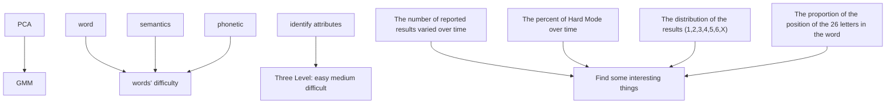
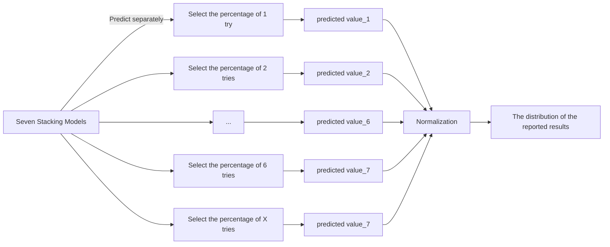
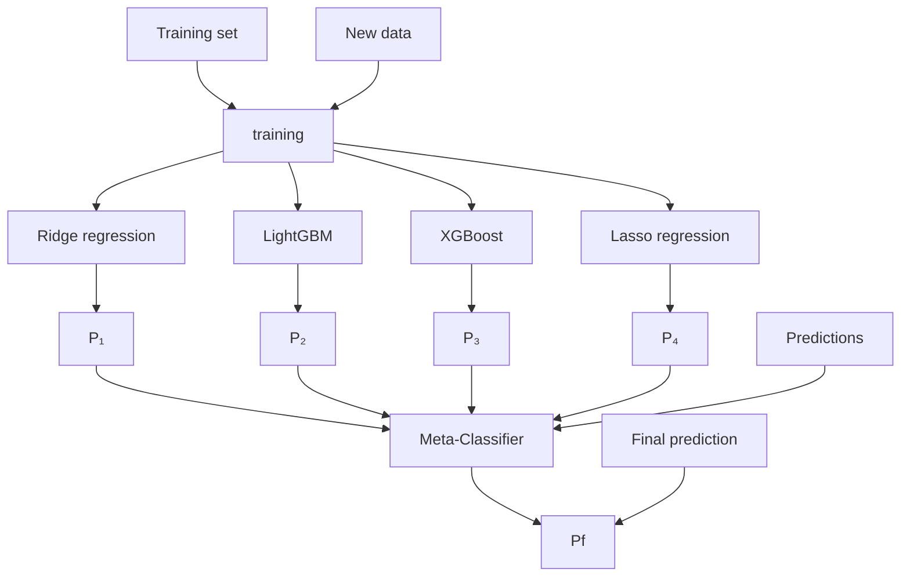

# Uncover the Puzzle of Words : Evidence from Wordle

## Summary

Using up to six guesses, players are asked to predict a five-letter word in Wordle, which provides feedback after each guess. We all know that different words have various characteristics that could influence how well a player performs. In this regard, our team modeled and evaluated the provided data to arrive at some intriguing conclusions.

For task 1, after data preprocessing, we first use the ARIMA model to forecast the number of reported results and find that it can only capture the linear part. Second, we take the LSTM model to capture the information of the non-linear part. Finally, we combine them to form ARIMA-LSTM model, which yields more accurate predictions with an RMSE of 0.0432. We finally arrive at a prediction interval of [9614,43109] for March 1, 2023. Subsequently, we define five word attributes, such as syllable count and entropy, and analyze their correlation with the percentage of people reporting scores in the difficult mode through the Spearman correlation coefficient, and find them to be significantly correlated.

For task 2, we use five preferred word attributes and competition number to predict the distribution of results using a stacking model that combines linear regression models (Ridge regression, Lasso regression) and tree models (XGBoost, LightGBM). We find that the stacking model improves the goodness of fit of the prediction results to 83.77%. Moreover, the MSE, RMSE, and MAE all indicate that the stacking model has a better capacity for learning. On March 1, 2023, the anticipated distribution of “EERIE” will be [1,2,3,4,5,6,X]=[0,0,9,18,26,37,10].

For task 3, we select seven additional word attributes to measure the words’ difficulty level, and then downscale the metrics by principal component analysis (PCA). We then use Gaussian Mixture Model(GMM) to cluster the words into three categories: difficult, moderate and easy. To get the true difficulty of the words, we calculate the expected number of tries for each word, which is used to compare with the classification results. It demonstrates that our model has a 67% accuracy rate. We explore interesting findings on the properties of the given words associated with each classification from three different perspectives: entropy, number of letters and frequency. Finally, we classified "EERIE" into the category of "difficult" based on its attribute.

For task 4, we perform a visual analysis of the provided dataset and discover some intriguing properties in three areas: (1) the number of reported results and the percentage of players who try the hard mode; (2) the distribution of tries; and (3) the frequency of letters in each position. These characteristics provide some interesting and feasible ideas for players to solve the problem.

We also conduct sensitivity analysis, which shows how different samples affect the word difficulty clustering model. And then the strengths and weaknesses of our model are summarized. Finally, a letter to the editor of the New York Times presenting the overall ideas and results of our paper is written in the end of paper.

Keywords: ARIMA-LSTM Model; Correlation Analysis; Stacking; PCA; GMM; Wordle;

## Contents

## 1 Introduction 3

## 2 Assumptions and Symbols 4

2.1 Model Hypothesis . . 4  
2.2 Symbols and Definitions 4

## 3 Data Pre-processing 4

## 4 Task 1: Interval Prediction & Correlation Analysis 5

4.1 Prediction for the Number of Reported Results . . 5

4.1.1 Autoregressive Integrated Moving Average Model . . . 5  
4.1.2 Building Predictive Models . . 5  
4.1.3 ARIMA-LSTM Model 7  
4.1.4 Analysis of Results . 7

4.2 Construction of Word Attributes 8  
4.3 Correlation Analysis 10

4.3.1 Spearman Correlation Coefficient 10  
4.3.2 Correlation Coefficient Heat Map 10  
4.3.3 Significance Analysis . . . . 11

## 5 Task 2: Prediction of Result Distribution Based on Stacking Algorithm 12

5.1 Stacking Method Model Fusion . 12  
5.2 Introduction to Predictive Models 13

5.2.1 Linear regression model . . 13  
5.2.2 Tree Model . . . 14

5.3 Prediction Results and Analysis . . . 14  
5.4 Model Evaluation . 15

## 6 Task 3: Gaussian Mixture-Based Classification Model 15

6.1 Word Attribute and Difficulty Index Establishment 15  
6.2 Classification Model of Gaussian Mixture . . 16  
6.3 Visual Analysis of Single Word Features 17  
6.4 Analysis of Classification Effect of Gaussian Mixture Model 18  
6.5 Identification of Word Attributes Associated with Classification Results 19

## 7 Task 4: Interesting Features 20

## 8 Sensitivity Analysis 22

## 9 Model Advantages and Disadvantages 23

9.1 Advantages . . 23  
9.2 Disadvantages . . . 23

## References 24

## 1 Introduction

Wordle is a daily puzzle offered by The New York Times that requires players to guess a five-letter real word within six attempts to solve, and is now available in more than 60 languages. Players receive feedback for each guess, specifically that the tile will change color to give feedback after the word is submitted. Players can play in either regular mode or hard mode. Hard mode requires that once the player has found the correct letters in a word, those letters must be used in subsequent guesses, which adds to the difficulty of the game.

As Wordle grew in popularity, The New York Times wanted us to analyze and model the data it provided.To address these issues, our team will take the following steps.

• Perform outlier processing on the data provided by COMAP official.  
• An ARIMA-LSTM model was built to predict the number of reported results.  
• Construct 12 word attributes and indicators reflecting the difficulty of the words.  
• Develop models that can predict the distribution of reported results based on the given words at future dates using Stacking model fusion algorithms.  
• Calculate mean square error (MSE), mean absolute error (MAE), and $R _ { 2 }$ as evaluation metrics to verify the accuracy of the model.  
• Classification and identification of solution words based on GMM clustering using the constructed word difficulty metrics.  
• Describe the number of player guesses, the position of the 26 letters appearing in the word, and other interesting properties we found.  
• Write a letter for the editor of the New York Times that includes our prediction results and interesting findings.

Our modeling framework is shown in Figure 17.

Problem1：Predict the number of the reported results  

```mermaid
graph TD
  A["ARIMA model"] --> B["Predict interval for the number of the reported results"]
  C["LSTM model"] --> B
  D["Attributes of the word"] --> E["commonness rating"]
  D --> F["entropy"]
  D --> G["frequency"]
  D --> H["number of letters"]
  D --> I["number of vowels"]
  J["PCA"] --> K["GMM"]
  K --> L["words' difficulty"]
  M["phenetic"] --> N["classify &quot;EERIE&quot;"]
    O["Three Level: easy medium difficult"] -.-> P["identify attributes"]
  Q["a future word"] --> R["distribution of the reported results"]
  S["a future date"] --> R
  T["linear models"] --> U["stacking model"]
  V["tree models"] --> U
  W["predict &quot;EERIE&quot;"] --> U
  X["1 try"] --> R
  Y["2 tries"] --> R
    Z["..."]
  AA["X tries"] --> R
  AB["Find some interesting things"] --> AC["The number of reported results varied over time"]
  AD["The percent of Hard Mode over time"] --> AE["The distribution of the results (1,2,3,4,5,6,X)"]
  AF["The proportion of the position of the 26 letters in the word"] --> AG
```

flowchart

Problem2：Predict the distribution of the reported results

Problem3：Classify words by difficulty  

flowchart

Problem4：Some interesting features  
Figure 1: Workflow

## 2 Assumptions and Symbols

## 2.1 Model Hypothesis

To simplify our problem, we make the following basic assumptions, each of which is sufficiently reasonable.

• Assume that on January 1, 2023, March 1, 2023, there are no unexpected factors that will change the data substantially.

Since we can only use the data in the additional data file, which is up to December 31, 2022, we ignore the heat that this topic may bring to Wordle later or other influencing factors that may cause drastic fluctuations in the data.

• Assume that the scores that users report on Twitter are true and reliable.

If users report their scores on Twitter as false, the distribution of reported results in the dataset may be difficult to predict using only the properties of a given word for a given date.

• The disturbance term is assumed to follow an independent normal distribution.

## 2.2 Symbols and Definitions

Table 1: Notations

<table><tr><td>Symbols</td><td>Description</td></tr><tr><td> $r_t$ </td><td>The number of results reported on day  $t$ </td></tr><tr><td> $H(X)$ </td><td>The information entropy size of word  $X$ </td></tr><tr><td> $ρ$ </td><td>Spearman rank correlation coefficient</td></tr><tr><td> $f_r$ </td><td>Word attribute: a measure of common usage in the coca dataset</td></tr><tr><td> $f_n$ </td><td>Word attribute: word frequency of SUBTLEX-US corpus</td></tr><tr><td> $f_{tn}$ </td><td>Word attribute: number of lexical labels</td></tr><tr><td> $f_d$ </td><td>Word property: consonant doubling</td></tr><tr><td> $f_p$ </td><td>Word property: phoneme length</td></tr><tr><td> $f_{vow}$ </td><td>Word property: number of vowels</td></tr><tr><td> $f_c$ </td><td>Word attribute: specificity rating</td></tr><tr><td> $λ$ </td><td>GMM model parameters</td></tr><tr><td> $p_k(d_i)$ </td><td>Gaussian component density function</td></tr><tr><td> $μ_k$ </td><td>Mean vector of the  $k$ th Gaussian component</td></tr></table>

## 3 Data Pre-processing

Since we can only use the official COMAP dataset ’Problem\_C\_Data\_Wordle.xlsx’, and the given data is obtained by mining Twitter, there is a possibility of data anomalies, so we pre-processed this part of the data before building the model.

• Fill: We replace the outliers in Number of reported results with the average of the before and after data.

• Reject: We remove the entire data where the sum of the distribution of the reported results deviates from 100%.  
• We remove the entire word that has a number of letters not equal to 5, including "clen" and "tash".

## 4 Task 1: Interval Prediction & Correlation Analysis

## 4.1 Prediction for the Number of Reported Results

## 4.1.1 Autoregressive Integrated Moving Average Model

Since the data are time series and the amount of data is small, after considering various prediction models, we first chose the ARIMA model to predict the number of reported outcomes.

## 4.1.2 Building Predictive Models

In the ARIMA $( p , d , q )$ model, AR is the autoregressive, $p$ is the autoregressive term; MA is the moving average, $q$ is the number of moving average terms, and d is the number of differences made when the time series becomes stationary. The model is based on the principle of converting a non-stationary series $r _ { t }$ into a stationary series $r _ { t }$ by differencing of order d. The regression is then performed with $r _ { t }$ as the dependent variable and the lagged term of $r _ { t }$ and the lagged terms of the random error terms at and at as the independent variables. For simplicity of writing, the latter denotes the number of reported results in terms of $r _ { t }$ sequence.

## Step 1. Sequence smoothing (determine the parameter d)

First of all, we perform a smoothness test on the time series $r _ { t }$ of Number of reported results. As can be seen from figure2 below, the two time series have a clear trend and the autocorrelation coefficients decay relatively slowly. Also, we performed a unit root test and found that the series has a unit root.

line chart

| Lag | Autocorrelation | Partial Autocorrelation |
| --- | --------------- | ----------------------- |
| 0   | 1.00            | 1.00                    |
| 1   | 1.00            | 0.95                    |
| 2   | 1.00            | 0.50                    |
| 3   | 1.00            | 0.25                    |
| 4   | 1.00            | 0.00                    |
| 5   | 1.00            | -0.25                   |
| 6   | 1.00            | -0.50                   |
| 7   | 1.00            | -0.75                   |
| 8   | 1.00            | -0.75                   |
| 9   | 1.00            | -0.75                   |
| 10  | 1.00            | -0.75                   |
| 11  | 1.00            | -0.75                   |
| 12  | 1.00            | 0.25                    |
| 13  | 1.00            | 0.60                    |
| 14  | 1.00            | -1.00                   |
| 15  | 1.00            | -1.00                   |
| 16  | 1.00            | 1.00                    |
| 17  | 1.00            | -0.25                   |
| 18  | 1.00            | -0.25                   |
| 19  | 1.00            | -0.25                   |
| 20  | 1.00            | -0.25                   |
| 21  | 1.00            | -0.25                   |
| 22  | 1.00            | -0.25                   |
| 23  | 1.00            | -0.25                   |
| 24  | 1.00            | -0.25                   |
| 25  | 1.00            | 0.25                    |
| 26  | 1.00            | 0.60                    |
| 27  | 1.00            | 0.50                    |
| 28  | 1.00            | 0.50                    |
| 29  | 1.00            | 0.65                    |
| 30  | 1.00            | 0.65                    |

(a) Sequence $r _ { t }$

scatterplot

| Point | Autocorrelation | Partial Autocorrelation |
|-------|-----------------|--------------------------|
| 1     | 1.00            | 1.00                     |
| 2     | -0.40           | -0.40                    |
| 3     | 0.15            | 0.15                     |
| 4     | -0.10           | -0.10                    |
| 5     | 0.10            | 0.10                     |
| 6     | -0.05           | -0.05                    |
| 7     | 0.20            | 0.20                     |
| 8     | -0.05           | -0.05                    |
| 9     | 0.15            | 0.15                     |
| 10    | -0.05           | -0.05                    |
| 11    | 0.10            | 0.10                     |
| 12    | -0.05           | -0.05                    |
| 13    | 0.15            | 0.15                     |
| 14    | -0.10           | -0.10                    |
| 15    | 0.15            | 0.15                     |
| 16    | -0.20           | -0.20                    |
| 17    | 0.25            | 0.25                     |
| 18    | -0.15           | -0.15                    |
| 19    | 0.15            | 0.15                     |
| 20    | -0.10           | -0.10                    |
| 21    | 0.15            | 0.15                     |
| 22    | -0.15           | -0.15                    |
| 23    | 0.15            | 0.15                     |
| 24    | -0.15           | -0.15                    |
| 25    | 0.20            | 0.20                     |
| 26    | -0.25           | -0.25                    |
| 27    | 0.25            | 0.25                     |
| 28    | -0.25           | -0.25                    |
| 29    | 0.15            | 0.15                     |
| 30    | -0.15           | -0.15                    |

(b) Sequence $\bar { r } _ { t }$  
Figure 2: Autocorrelation plot and Partial Autocorrelation plot of rt sequence

Therefore $r _ { t }$ is a non-stationary series and needs to be further smoothed.

Let $\bar { r } _ { t } = r _ { t ^ { - } } r _ { t - 1 }$ . After taking the first order difference, the smoothness test is performed on the differenced $r _ { t }$ . From the following figure3, we can observe that the series after difference always fluctuate randomly around some value and there is no significant trend. The autocorrelation coefficient decays rapidly, and only the closely spaced series values have a significant effect. Also, the p-values of the unit root tests all converge to 0. Therefore, there is no unit root. $r _ { t }$ is already a smooth series. Since we use the first-order difference method to obtain the smooth series, $d = 1$ .

line chart

| Date       | Value   |
| ---------- | ------- |
| Feb 2022   | 60000   |
| Mar        | -80000  |
| Apr        | 20000   |
| May        | 20000   |
| Jun        | 0       |
| Jul        | 0       |
| Aug        | 0       |
| Sep        | 0       |
| Oct        | 0       |
| Nov        | 0       |
| Dec        | 0       |

Figure 3: Time series plots of sequence $\bar { r _ { t } }$

## Step 2. determination of $p$ and $q$ order.

The $\mathrm { A R I M A } ( p , d , q )$ model takes the form:

$$
\bar {r} _ {t} = r _ {t} - r _ {t - 1} \tag {1}
$$

$$
\bar {r} _ {t} = \phi_ {0} + \sum_ {i = 1} ^ {p} \phi_ {i} \bar {r} _ {t - i} + \varepsilon_ {t} - \sum_ {i = 1} ^ {q} \theta_ {i} \varepsilon_ {t - i} \tag {2}
$$

where $\varepsilon _ { t }$ is a white noise sequence and $p$ and $q$ are non-negative integers. The Bayesian information criterion (BIC) is commonly used to determine the optimal order of the model, which is constructed based on the likelihood function. Based on historical data, the BIC values of the model at different orders are calculated by computer programming loops to find the order p and q that minimizes the BIC, i.e., the optimal order of the model. After determining the optimal order, we perform parameter estimation and test that the data are found to be statistically significant.

## Step 3. residual test

To determine the validity of the model, a residual test is also required, in which a white noise verification of the residual series $\varepsilon _ { t }$ is required. If the residuals are randomly normally distributed and not autocorrelated, the residual series approximates the white noise series, indicating a good model fit. We use the Ljung-Box statistic $Q ( m )$ to test the proximity of white noise:

$$
Q (m) = T (T + 2) \sum_ {l = 1} ^ {m} \frac {\hat {\rho} _ {l} ^ {2}}{T - l} \tag {3}
$$

When the p-value of the test is greater than 0.05, it means that the residual series $\varepsilon _ { t }$ passes the test at 5% confidence level, i.e., the residual series is white noise. The test of the residual series of the data in this paper finds that it is not white noise, which means that there is still useful information in the residuals and the model needs to be modified to extract further information.

The ARIMA model’s prediction of the reported outcome quantities lacks a residual term that is not accurate enough, which is especially evident in the prediction outside the original data. However, the ARIMA model is still able to capture the trends in the reported number of outcomes well, which means that it can predict the linear part of the reported number of outcomes well.

## 4.1.3 ARIMA-LSTM Model

The prediction results of the ARIMA model are not very volatile due to the fact that the residual part of this result is not well predicted reasonably well, so this paper further improves the prediction model by combining ARIMA with LSTM neural network.

LSTM neural network nonlinear prediction model Long short-term memory network (LSTM) is a modified recurrent neural network that can solve the long-term dependence problem and remembering information for a long time is actually their default behavior.LSTM adds a memory unit to each neural unit in the hidden layer based on RNN: the information transmission band called "cell state "The LSTM uses structures such as forgetting gates, input gates, and output gates to control the memorized information on the time series. In this way, LSTM can dig deeper into the underlying patterns between the data, making the prediction more accurate and reliable.

Therefore, in order to compensate the shortcomings of ARIMA model and further improve the prediction accuracy, we use a combined linear and nonlinear model for prediction. To this end, we firstly, based on the ARIMA prediction results and the actual number of reported results on the residual series of number of reports, which is used as the expected output of the LSTM neural network; secondly, the phase space reconstruction of the original data is performed, and the optimal number of reports is finally determined as 18; thirdly, the data reconstructed in the optimal order is used as the LSTM input; fourthly, the training set is input into the LSTM neural network , the learning modeling and prediction of the residual series test set is performed to obtain the ARIMA residual series prediction value; finally, the prediction results of ARIMA and LSTM neural network models are summed to obtain the final prediction results of the reported number of outcomes.

## 4.1.4 Analysis of Results

The prediction results are shown in Figure 4. The predicted value curve and the actual value curve still basically match, and the fluctuation trend remains consistent, and the model can accurately predict the inflection point, and the prediction results are better. And compared with the single model prediction results, the results are more volatile and more realistic in terms of the number of results reported in real life.

line chart

| x | bound | value_true | value_predict |
| --- | --- | --- | --- |
| 0 | 80000 | 80000 | 80000 |
| 50 | 250000 | 250000 | 250000 |
| 100 | 150000 | 150000 | 150000 |
| 150 | 80000 | 80000 | 80000 |
| 200 | 40000 | 40000 | 40000 |
| 250 | 30000 | 30000 | 30000 |
| 300 | 25000 | 25000 | 25000 |
| 350 | 22000 | 22000 | 22000 |
| 400 | 21000 | 21000 | 21000 |
| 450 | 23000 | 23000 | 23000 |
| 500 | 24000 | 24000 | 24000 |
| 550 | 25000 | 25000 | 25000 |
| 600 | 26000 | 26000 | 26000 |
| 650 | 27000 | 27000 | 27000 |
| 700 | 28000 | 28000 | 28000 |
| 750 | 29000 | 29000 | 29000 |
| 800 | 30000 | 30000 | 30000 |
| 850 | 31000 | 31000 | 31000 |
| 900 | 32000 | 32000 | 32000 |
| 950 | 33000 | 33000 | 33000 |
| 1K | 34.5K | 34.5K | 34.5K |
| K+ | ~3.5K | ~3.5K | ~3.5K |
| K+ + K- | ~3.5K | ~3.5K | ~3.5K |
| K+ + K+ | ~3.5K | ~3.5K | ~3.5K |
| K+ + K+ | ~3.5K | ~3.5K | ~3.5K |
| K+ + K+ | ~3.5K | ~3.5K | ~3.5K |
| K+ + K+ | ~3.5K | ~3.5k | ~3.5k |
| K+ + K+ | ~3.5k | ~3.5k | ~3.5k |
| K+ + K+ | ~3.5k | ~3.5k | ~3.5k |
| K+ + K+ | ~3.5k | ~3.5k | ~3.5k |
| K+ + K+ | ~3.5k | ~3.5k | ~3.6K |
| K+ + K+ | ~3.6K | ~3.6K | ~3.6K |
| K+ + K+ | ~3.7K | ~3.7K | ~3.7K |
| K+ + K+ | ~3.8K | ~3.8K | ~3.8K |
| K+ + K+ | ~3.9K | ~3.9K | ~3.9K |
| K+ + K+ | ~4.1K | ~4.1K | ~4.1K |
| K+ + K+ | ~4.2K | ~4.2K | ~4.2K |
| K+ + K+ | ~4.3K | ~4.3K | ~4.3K |
| K+ + K+ | ~4.4K | ~4.4K | ~4.4K |
| K+ + K+ | ~4.5K | ~4.5K | ~4.5K |
| K+ + K+ | ~4.6K | ~4.6K | ~4.6K |
| K+ + K+ | ~4.7K | ~4.7K | ~4.7K |
| K+ + K+ | ~4.8K | ~4.8K | ~4.8K |
| K+ + K+ | ~4.9K | ~4.9K | ~4.9K |
| K+ + K+ | ~5.1K | ~5.1K | ~5.1K |
| K+ + K+ | ~5.2K | ~5.2K | ~5.2K |
| K+ + K+ | ~5.3K | ~5.3K | ~5.3K |
| K+ + K+ | ~5.4K | ~5.4K | ~5.4K |
| K+ + K+ | ~5.6K | ~5.6K | ~5.6K |
| K+ + K+ | ~5.7K | ~5.7K | ~5.7K |
| K+ + K+ | ~5.8K | ~5.8K | ~5.8K |
| K+ + K+ | ~6.1K | ~6.1K | ~6.1K |
| K+ + K+ | ~6.2K | ~6.2K | ~6.2K |
| K+ + K+ | ~6.3K | ~6.3K | ~6.3K |
| K+ + K+ | ~6.4K | ~6.4K | ~6.4K |
| K+ + K+ | ~6.6K | ~6.6K | ~6.6K |
| K+ + K+ | ~6.7K | ~6.7K | ~6.7K |
| K+ + K+ | ~6.8K | ~6.8K | ~6.8K |
| K+ + K+ | ~7.1K | ~7.1K | ~7.1K |
| K+ + K+ | ~7.2k | ~7.2k | ~7.2k |
| K+ + K+ | ~7.3k | ~7.3k | ~7.3k |
| K+ + K+ | ~7.4k | ~7.4k | ~7.4k |
| K+ + K+ | ~7.6k | ~7.6k | ~7.6k |
| K+ + K+ | ~7.7k | ~7.7k | ~7.7k |
| K+ + K+ | ~7.8k | ~7.8k | ~7.8k |
| K+ + K+ | ~8.1K | ~8.1k | ~8.1k |
| K+ + K+ | ~8.2k | ~8.2k | ~8.2k |
| K+ + K+ | ~8.3k | ~8.3k | ~8.3k |
| K+ + K+ | ~8.4k | ~8.4k | ~8.4k |
| K+ + K+ | ~8.6K | ~8.6k | ~8.6k |
| K+ + K+ | ~8.7k | ~8.7k | ~8.7k |
| K+ + K+ | ~8.9K | ~8.9k | ~8.9k |
| K+ + K+ | ~9.1K | ~9.1k | ~9.1k |
| K+ + K+ | ~9.2k | ~9.2k | ~9.2k |
| K+ + K+ | ~9.4K | ~9.4k | ~9.4k |
| K+ + K+ | ~9.5k | ~9.5k | ~9.5k |
| K+ + K+ | ~9.7K | ~9.7k | ~9.7k |
| K+ + K+ | ~9.8k | ~9.8k | ~9.8k |
| K+ + K+ | ~9.9k | ~9.9k | ~9.9k |
| K+ + K+ | >11M | >11M | >11M |
| k=1 | - | - | - |

Figure 4: ARIMA-LSTM Model - The number of results reported forecast results

In this section, the ARIMA model was used to predict the number of reported outcomes in the interval, and the LSTM model was used to predict the residual series to correct the short comings of the ARIMA model, and the final predicted value of the number of reported outcomes on March 1, 2023 was calculated to be 22577, with a prediction interval of [9614,43109].

## 4.2 Construction of Word Attributes

To explore whether any attributes of words affect the percentage of people reporting scores in the difficult mode, we first looked for attributes of a number of representative words. The following are the definitions of the attributes.

## Number of syllables

The number of syllables reflects the number of constituent elements of a word. In this paper, we choose the method of counting syllables to measure word length. A syllable is the smallest unit that an individual can produce in a single breath and usually contains a vowel or vowels plus one or more consonants.

## Word Class

A word class is a group of words that display the same formal properties. The data set given in the question contains seven main word classes: nouns, verbs, adjectives, adverbs, pronouns, conjunctions, and prepositions. Since pronouns, conjunctions and prepositions account for a small percentage, we categorize them as other.

## Vocabulary usage index

Vocabulary usage index. Generally speaking, the more words are used in daily life, the easier it is for players to answer the puzzle, and conversely the rare words will increase the difficulty for players to pass the game.

The Corpus of Contemporary American English (COCA) is a collection of the most frequently used words in the English-speaking world. It is extracted from a large corpus of words. A big data approach was used to automatically generate a word frequency list from various genres (most representative US newspapers, magazines, fiction, academic, and spoken language from 1990-2012), which is considered to be the most accurate word frequency list available today. Therefore, with the help of COCA, we defined the lexical common usage index as

$$
f _ {i} = \ln (p _ {i}) \tag {4}
$$

where $f _ { i }$ the lexical common usage index and $p _ { i }$ is the order in COCA, and COCA is ordered by word frequency from most frequent to least frequent, the further back the word is, the less common it is.

## The number of letters

The words given in the question are all composed of 5 letters, and having more than one repeated letter in a word can reduce the complexity of the word, which may reduce the difficulty of passing the game; it may also be due to the player’s inertia that the word will be composed of five different letters, and the repeated letters will increase the difficulty of the game instead.

## Word frequency

We consider the utilization of vocabulary on the web, where we use the number of relevant information on Google. With the help of Brysbert New’s study of the SUBTLEX-US corpus, we obtained frequency counts for all the words in the dataset.

## Information entropy

Information entropy can be used to describe the uncertainty of the source. In the game, Wordle will feedback the result of player input by changing the color of the tiles. The probability of each possible pattern to multiply the information content conveyed by this pattern to get the expected information content that a word can bring is also known as information entropy, and the higher the information entropy also means the higher the information content brought by this word in various situations. The statistics of the frequency of occurrence of 26 letters in English text from the COCA dataset are shown in the following figure5.

bar chart

| Category | Value (%) |
|---|---|
| e | 11.50 |
| a | 8.60 |
| i | 7.90 |
| r | 7.50 |
| t | 7.45 |
| o | 7.15 |
| n | 6.45 |
| s | 5.60 |
| l | 5.55 |
| c | 4.80 |
| u | 3.70 |
| p | 3.30 |
| m | 3.25 |
| d | 3.15 |
| h | 2.80 |
| g | 2.30 |
| b | 2.15 |
| y | 2.05 |
| f | 1.45 |
| v | 1.10 |
| w | 1.00 |
| k | 0.85 |
| x | 0.45 |
| z | 0.30 |
| q | 0.25 |
| j | 0.15 |

Figure 5: Frequency of 26 letters in the COCA dataset

When making a guess, the player will try to get the most information from each guess. Therefore an attempt will be made to cover the most high frequency letters in the first two attempts. For example, the combination of other + nails will cover 10 of the 11 most frequently occurring letters, and with a bit of luck some letters will be identified. Therefore, we use information entropy as a property of a word to describe the size of the information contained in the word. The greater the uncertainty of the word, the more information it contains, and the greater the information entropy. The specific formula is as follows.

$$
H (X) = - \sum_ {i = 1} ^ {n} p \left(x _ {i}\right) \log p \left(x _ {i}\right) \tag {5}
$$

where X denotes the word as a random variable, $P ( x )$ denotes the output probability function of the word, and $H ( X )$ denotes the information entropy size of the word X.

## 4.3 Correlation Analysis

## 4.3.1 Spearman Correlation Coefficient

We applied the method of correlation analysis to the five word attribute indicators constructed above and the percentage of scores reported that were played in Hard Mode, as measured by the spearman rank correlation coefficient, with the following idea.

The Spearman correlation coefficients of variables x and y were actually calculated using the rank order of the two columns of numbers. By arranging the variables $x = \{ x _ { 1 } , x _ { 2 } , \cdot \cdot \cdot , x _ { n } \}$ in ascending or descending order to obtain the sorted series $a = \{ a _ { 1 } , a _ { 2 } , \cdots , a _ { n } \}$ , the position of each element $x _ { i }$ within the variable x in the series a is denoted as $r _ { i }$ , which is called the element x. By arranging the variables $y = \{ y _ { 1 } , y _ { 2 } , \cdot \cdot \cdot , y _ { n } \}$ in the same way, we get the rank series $y = \{ y _ { 1 } , y _ { 2 } , \cdot \cdot \cdot , y _ { n } \}$ , and then we get the rank series $y = \{ y _ { 1 } , y _ { 2 } , \cdot \cdot \cdot , y _ { n } \}$ . The rank series s corresponding to the variable $y .$ . The rank difference series $d = \{ d _ { 1 } , d _ { 2 } , \cdot \cdot \cdot , d _ { n }$

is obtained by subtracting the series r and each element in the series s corresponding to each other, and then substituting it into the Spearman rank correlation coefficient formula.

$$
\rho = 1 - \frac {6 \sum_ {i = 1} d _ {i} ^ {2}}{n (n ^ {2} - 1)} \tag {6}
$$

where: n is the number of samples, corresponding to the total amount of data involved in the ranking; $\rho$ is the Spearman rank correlation coefficient between the variables of word frequency and the number of letters.

## 4.3.2 Correlation Coefficient Heat Map

The following graph depicts the relationship between the above metrics and the percentage of scores reported that were played in Hard Mode.

As can be seen from the figure6, most of the indicators do not correlate significantly with the proportion of players who choose the difficult mode, and only the number of vowels has a strong positive correlation with it.

Few attempts: 1 try, 2 tries, 3 tries Many tries: 5 tries, 6 tries, 7 or more tries(X)

The lexical commonness index, number of vowels and information entropy have a strong negative correlation with the proportion of guesses by few tries and a strong positive correlation with the proportion of multiple tries , with the opposite correlation for word frequency. This is consistent with our guess that the more common the word is in daily life and the more often it occurs, the easier it is to guess it by fewer attempts. The more informative a word is the less likely it is to be guessed within three attempts. Words with a higher number of vowels are more complex to pronounce and less likely to be game cleared after a small number of guesses.

The number of letters has a strong positive correlation with the proportion of in few attempts and a strong negative correlation with the proportion of multiple attempts, probably due to human inertia that repetitive letters make the game more difficult and therefore more difficult to guess after a small number of attempts.

There is a smaller correlation between word lexicality and number of guesses, prob ably because players consider word lexicality less when guessing.

heatmap

|  | hard ratio | 1 try | 2 tries | 3 tries | 4 tries | 5 tries | 6 tries | 7 or more tries (X) | commonness rating | frequency | number of letters | number of vowels | entropy | noun | verb | adjective | adverb | other Pos |
| --- | --- | --- | --- | --- | --- | --- | --- | --- | --- | --- | --- | --- | --- | --- | --- | --- | --- | --- |
| hard ratio | 1 | -0.48 | -0.13 | -0.047 | 0.18 | 0.027 | -0.072 | -0.057 | 0.068 | -0.057 | -0.015 | 0.14 | 0.049 | -0.015 | -0.013 | 0.062 | 0.014 | -0.076 |
| 1 try | -0.48 | 1 | 0.53 | 0.36 | -0.34 | -0.41 | -0.21 | -0.11 | -0.23 | 0.3 | 0.21 | -0.24 | -0.19 | -0.032 | -0.013 | 0.014 | 0.049 | 0.021 |
| 2 tries | -0.13 | 0.53 | 1 | 0.84 | -0.11 | -0.84 | -0.67 | -0.49 | -0.26 | 0.36 | 0.42 | -0.28 | -0.46 | -0.058 | 0.0081 | 0.033 | -0.039 | 0.088 |
| 3 tries | -0.047 | 0.36 | 0.84 | 1 | 0.27 | -0.91 | -0.91 | -0.75 | -0.21 | 0.24 | 0.35 | -0.21 | -0.43 | -0.026 | -0.091 | 0.059 | -0.0015 | 0.067 |
| 4 tries | 0.18 | -0.34 | -0.11 | 0.27 | 1 | -0.06 | -0.52 | -0.63 | 0.055 | -0.066 | -0.0052 | 0.082 | 0.089 | 0.017 | -0.11 | 0.045 | 0.076 | -0.046 |
| 5 tries | 0.027 | -0.41 | -0.84 | -0.91 | -0.06 | 1 | 0.78 | 0.55 | 0.21 | -0.26 | -0.37 | 0.25 | 0.44 | -0.017 | 0.062 | -0.0036 | 0.0099 | -0.044 |
| 6 tries | -0.072 | -0.21 | -0.67 | -0.91 | -0.52 | 0.78 | 1 | 0.91 | 0.19 | -0.2 | -0.26 | 0.16 | 0.32 | -0.01 | 0.12 | -0.05 | -0.0049 | -0.04 |

Figure 6: Heat Map of Correlation

## 4.3.3 Significance Analysis

For space reasons, we only give the correlation coefficients and significance levels of the indicators that were significantly correlated with the percentage of scores reported that were played in Hard Mode.

From the above table, we can see that there is a significant correlation (significant in the two-tailed test) between the five indicators for the number of syllables, the number of letters, common word index, word frequency and information entropy and the proportion of guessed or unsolvable puzzles (X) in one attempt, two attempts, three attempts, five attempts and six attempts, which is consistent with the results of the heat map analysis. In contrast, none of the four indicators was significantly correlated with the proportion of guesses made at four attempts. The proportion of guesses at four attempts can be seen as the transition point, and often these four indicators are opposite in sign to the correlation coefficients between the proportion of guesses at less than four attempts and the proportion of guesses at more than four attempts.

Table 2: Spearman’s correlation coefficient for each variable

<table><tr><td>x</td><td>com.rating</td><td>frequency</td><td>num. of letters</td><td>num. of vowels</td><td>entropy</td></tr><tr><td>1try</td><td>-0.231***</td><td>0.298***</td><td>0.208***</td><td>-0.243***</td><td>-0.192***</td></tr><tr><td>2tries</td><td>-0.264***</td><td>0.355***</td><td>0.424***</td><td>-0.276***</td><td>-0.464***</td></tr><tr><td>3tries</td><td>-0.206***</td><td>0.242***</td><td>0.347***</td><td>-0.207***</td><td>-0.428***</td></tr><tr><td>4tries</td><td>0.055</td><td>-0.066</td><td>-0.005</td><td>0.082</td><td>0.089</td></tr><tr><td>5tries</td><td>0.208***</td><td>-0.261***</td><td>-0.368***</td><td>0.247***</td><td>0.443***</td></tr><tr><td>6tries</td><td>0.189***</td><td>-0.202***</td><td>-0.263***</td><td>0.163***</td><td>0.317***</td></tr><tr><td>Xtries</td><td>0.212***</td><td>-0.201***</td><td>-0.164***</td><td>0.094***</td><td>0.231***</td></tr></table>

## 5 Task 2: Prediction of Result Distribution Based on Stacking Algorithm

In order to predict the distribution of reported results at a given future date and future word, we train seven stacking models to predict the specific proportion of each number of attempts (1,2,3,4,5,6,X) separately, and then normalize their corresponding predicted values as the final distribution prediction.

We built two linear regression models, Ridge and Lasso regression, and two tree models, XGBoost and LightGBM, based on the preferred word attributes (including ranking of commonness, word frequency, number of letters, number of vowels, and information entropy) and competition number, respectively, for comparison analysis, and The models were fused by integrating primary learners using the Stacking method, and the fused results have more accurate and efficient prediction effects.

flowchart

Figure 7: Distribution prediction flow chart

## 5.1 Stacking Method Model Fusion

The Stacking method is designed to reduce the generalization error of the models and is essentially a hierarchical structure of "stacking", which has the advantage of improving the accuracy of the prediction results. In this paper, a two-stage Stacking method is applied, and the steps are as follows.

## Layer 1.

1) In this paper, we split the data provided by the question into a training set and a test set in the ratio of 4:1, containing 286 and 71 data, respectively. 2) The training set is trained using Ridge regression, Lasso regression, XGBoost algorithm and Light-GBM algorithm. 3) Predict the data provided by the question using the four models completed in Step 2 and save the results.

## Layer 2.

1) The four prediction result datasets from step 3 of the first layer are used as new training set features, and together with the actual features of the data provided by the topic, the XGBoost algorithm with higher single model evaluation criteria in the first layer is selected as the metamodel for secondary training prediction. 2) The final results are obtained by predicting the validation set of the data provided by the topic with the trained XGBoost algorithm.

flowchart

Figure 8: Stacking Model Fusion Flowchart

## 5.2 Introduction to Predictive Models

## 5.2.1 Linear regression model

Ridge regression adds the least squares of the second-order regular term to the loss function, also called L2 parametrization, which has the effect of dimensionality reduction, and also limits the matching of the model parameters to the abnormal samples and deals with the highly correlated data sets, thus improving the fitting accuracy of the model to most normal samples. Our team used RidgeCV to adjust the regularization strength alpha to achieve a better fit at alpha 14.

Lasso regression is similar to the above mentioned Ridge regression in that it also deals with the co-linearity of the feature variables by constructing a penalty function. However, compared with Ridge regression, Lasso regression can compress the coefficients of relatively insignificant characteristic variables to zero by changing the penalty term from L2 to L1 parametric, so as to eliminate the variables; whereas Ridge regression only compresses the coefficients of characteristic variables to a certain extent and retains all variables of the regression model.

## 5.2.2 Tree Model

The core idea of XGBoost regression model is to calculate the information gain to reflect the degree of information uncertainty reduction of each feature variable. It is an optimized distributed gradient boosting library designed to be efficient, flexible and portable.

The LightGBM model is a decision tree algorithm that traverses the data to find the optimal splitting point based on the discrete values of the histogram. Like the XGBoost algorithm, it is an efficient implementation of GBDT, and is similar to XGBoost in that it uses the negative gradient of the loss function as a residual approximation to the current decision tree to fit a new decision tree.

## 5.3 Prediction Results and Analysis

The reported results of the five models selected in this paper are shown in Fig9. The reported results of the linear model are shown in Lasso regression, and the regression results of the tree model are shown in LightGBM algorithm.

line chart

| x    | true | predict |
| ---- | ---- | ------- |
| 0    | 9    | 8       |
| 1    | 3    | 5       |
| 2    | 2    | 4       |
| 3    | 6    | 7       |
| 4    | 8    | 6       |
| 5    | 10   | 5       |
| 6    | 1      | 8       |
| 7    | 10   | 7       |
| 8    | 2    | 8       |
| 9    | 5    | 6       |
| 10   | 4    | 5       |
| 11   | 12   | 7       |
| 12   | 6    | 5       |
| 13   | 17   | 8       |
| 14   | 3    | 5       |
| 15   | 8    | 7       |
| 16   | 9    | 6       |
| 17   | 2    | 4       |
| 18   | 9    | 7       |
| 19   | 3    | 5       |
| 20   | 14   | 8       |
| 21   | 2    | 6       |
| 22   | 22   | 11      |
| 23   | 8    | 7       |
| 24   | 2    | 5       |
| 25   | 3    | 4       |
| 26   | 5    | 5       |
| 27   | 2    | 3       |
| 28   | 2    | 2       |
| 29   | 2    | 1       |
| 30   | 2    | 1       |

(a) Lasso regresion result

line chart

| Step | true | predict |
| --- | --- | --- |
| 1 | 9 | 9 |
| 2 | 3 | 3 |
| 3 | 2 | 2 |
| 4 | 6 | 6 |
| 5 | 8 | 8 |
| 6 | 10 | 10 |
| 7 | 10 | 10 |
| 8 | 8 | 8 |
| 9 | 2 | 2 |
| 10 | 5 | 5 |
| 11 | 3 | 3 |
| 12 | 12 | 12 |
| 13 | 3 | 3 |
| 14 | 5 | 5 |
| 15 | 17 | 17 |
| 16 | 5 | 5 |
| 17 | 3 | 3 |
| 18 | 8 | 8 |
| 19 | 2 | 2 |
| 20 | 9 | 9 |
| 21 | 4 | 4 |
| 22 | 10 | 10 |
| 23 | 5 | 5 |
| 24 | 14 | 14 |
| 25 | 7 | 7 |
| 26 | 2 | 2 |
| 27 | 9 | 9 |
| 28 | 2 | 2 |
| 29 | 5 | 5 |
| 30 | 3 | 3 |
| 31 | 2 | 2 |
| 32 | 5 | 5 |
| 33 | 3 | 3 |
| 34 | 2 | 2 |
| 35 | 5 | 5 |
| 36 | 3 | 3 |
| 37 | 2 | 2 |
| 38 | 5 | 5 |
| 39 | 3 | 3 |
| 40 | 2 | 2 |
| 41 | 5 | 5 |
| 42 | 3 | 3 |
| 43 | 2 | 2 |
| 44 | 5 | 5 |
| 45 | 3 | 3 |
| 46 | 2 | 2 |
| 47 | 5 | 5 |
| 48 | 3 | 3 |
| 49 | 2 | 2 |
| 50 | 5 | 5 |
| 51 | 3 | 3 |
| 52 | 2 | 2 |
| 53 | 5 | 5 |
| 54 | 3 | 3 |
| 55 | 2 | 2 |
| 56 | 5 | 5 |
| 57 | 3 | 3 |
| 58 | 2 | 2 |
| 59 | 5 | 5 |
| 60 | 3 | 3 |
| 61 | 2 | 2 |
| 62 | 5 | 5 |
| 63 | 3 | 3 |
| 64 | 2 | 2 |
| 65 | 5 | 5 |
| 66 | 3 | 3 |
| 67 | 2 | 2 |
| 68 | 5 | 5 |
| 69 | 3 | 3 |
| 70 | 2 | 2 |
| 71 | 5 | 5 |
| 72 | 3 | 3 |
| 73 | 2 | 2 |
| 74 | 5 | 5 |
| 75 | 3 | 3 |
| 76 | 2 | 2 |
| 77 | 5 | 5 |
| 78 | 3 | 3 |
| 79 | 2 | 2 |
| 80 | 5 | 5 |

(b) LightGBM result  
Figure 9: Average Rating Value over the years

line chart

| Step | true | predict |
| ---- | ---- | ------- |
| 1    | 9.0  | 9.0     |
| 2    | 5.0  | 6.0     |
| 3    | 3.0  | 4.0     |
| 4    | 2.0  | 3.0     |
| 5    | 1.0  | 2.0     |
| 6    | 8.0  | 7.0     |
| 7    | 7.0  | 6.0     |
| 8    | 6.0  | 5.0     |
| 9    | 8.0  | 7.0     |
| 10   | 10.0 | 9.0     |
| 11   | 8.0  | 7.0     |
| 12   | 1.0  | 2.0     |
| 13   | 10.0 | 10.0    |
| 14   | 2.0  | 2.0     |
| 15   | 8.0  | 7.0     |
| 16   | 5.0  | 5.0     |
| 17   | 3.0  | 3.0     |
| 18   | 5.0  | 5.0     |
| 19   | 12.0 | 9.0     |
| 20   | 6.0  | 5.0     |
| 21   | 2.0  | 2.0     |
| 22   | 17.0 | 13.0    |
| 23   | 5.0  | 5.0     |
| 24   | 3.0  | 3.0     |
| 25   | 5.0  | 5.0     |
| 26   | 8.0  | 7.0     |
| 27   | 5.0  | 5.0     |
| 28   | 3.0  | 3.0     |
| 29   | 1.0  | 1.0     |
| 30   | 9.0  | 8.0     |
| 31   | 5.0  | 5.0     |
| 32   | 4.0  | 4.0     |
| 33   | 6.0  | 6.0     |
| 34   | 9.0  | 10.0    |
| 35   | 8.0  | 14.0    |
| 36   | 5.0  | 5.0     |
| 37   | 3.0  | 3.0     |
| 38   | 2.0  | 2.0     |
| 39   | 1.0  | 1.0     |
| 40   | 2.0  | 2.0     |
| 41   | -1.0 | -1.0    |
| 42   | -2.0 | -2.0    |
| 43   | -3.0 | -3.0    |
| 44   | -4.0 | -4.0    |
| 45   | -5.0 | -5.0    |
| 46   | -6.0 | -6.0    |
| 47   | -7.0 | -7.0    |
| 48   | -8.0 | -8.0    |
| 49   | -9.0 | -9.0    |
| 50   | -10.0| -10.0   |
| 51   | -11.0| -11.0   |
| 52   | -12.0| -12.0   |
| 53   | -13.0| -13.0   |
| 54   | -14.0| -14.0   |
| 55   | -15.0| -15.0   |
| 56   | -16.0| -16.0   |
| 57   | -17.0| -17.0   |
| 58   | -18.0| -18.0   |
| 59   | -19.0| -19.0   |
| 60   | -20.0| -20.0   |
| 61   | -21.0| -21.0   |
| 62   | -22.0| -22.0   |
| 63   | -23.0| -23.0   |
| 64   | -24.0| -24.0   |
| 65   | -25.0| -25.0   |
| 66   | -26.0| -26.0   |
| 67   | -27.0| -27.0   |
| 68   | -28.0| -28.0   |
| 69   | -29.0| -29.0   |
| 70   | -30.0| -30.0   |
| 71   | -31.0| -31.0   |
| 72   | -32.0| -32.0   |
| 73   | -33.0| -33.0   |
| 74   | -34.0| -34.0   |
| 75   | -35.0| -35.0   |
| 76   | -36.0| -36.0   |
| 77   | -37.0| -37.0   |
| 78   | -38.0| -38.0   |
| 79   | -39.0| -39.0   |
| 80   | -40.0| -40.0   |
| 81   | -41.0| -41.0   |
| 82   | -42.0| -42.0   |
| 83   | -43.0| -43.0   |
| 84   | -44.0| -44.0   |
| 85   | -45.0| -45.0   |
| 86   | -46.0| -46.0   |
| 87   | -47.0| -47.0   |
| 88   | -48.0| -48.0   |
| 89   | -49.0| -49.0   |
| 90   | -50.0| -50.0   |
| 91   | -51.0| -51.0   |
| 92   | -52.0| -52.0   |
| 93   | -53.0| -53.0   |
| 94   | -54.0| -54.0   |
| 95   | -55.0| -55.0   |
| 96   | -56.0| -56.0   |
| 97   | -57.0| -57.0   |
| 98   | -58.0| -58.0   |
| 99   | -59.0| -59.0   |
| 100  | -60.0| -60.0   |
| ... (multiple) | ... (multiple) | ... (multiple) |
The data is a series of 'true' and 'predict' markers connected by lines, representing the 'true' and 'predict' series respectively in the chart.

Figure 10: Stacking model result

The prediction results show that the linear model is more accurate in predicting data around the mean, while the tree model is more accurate in predicting the distribution of extreme values, and the Stacking fusion model retains the advantages of both models and compensates each other’s shortcomings. The model prediction accuracy is higher. In conclusion, the forecasting effect of the Stacking fusion model is better. The ratio of predicted EERIE on March 1, 2023 is obtained as $[ 1 , 2 , 3 , 4 , 5 , 6 , X ] =$ [0,0,9,18,26,37,10], respectively.

## 5.4 Model Evaluation

In this study, the cross-validation method was used to verify the accuracy of each model, and the mean square error (MSE), root mean square error (RMSE), mean absolute error (MAE), and R2 generated from the cross-validation results were used as evaluation indicators for the accuracy of the estimated and validated models. The larger the R2 corresponding to the estimation model, the smaller the MSE, RMSE and MAE indicate the higher the prediction accuracy of the model. The following table shows the model prediction results of various models with four indicators: (with "2 tries" as the dependent variable)

Table 3: Spearman’s correlation coefficient for each variable

<table><tr><td></td><td>MSE</td><td>RMSE</td><td>MAE</td><td> $R_2$ </td></tr><tr><td>Lasso</td><td>2.3771</td><td>1.5417</td><td>1.0727</td><td>0.6847</td></tr><tr><td>Ridge</td><td>2.1292</td><td>1.4592</td><td>0.9909</td><td>0.7151</td></tr><tr><td>XGBoost</td><td>1.9289</td><td>1.3888</td><td>0.9186</td><td>0.7856</td></tr><tr><td>LightGBM</td><td>1.8562</td><td>1.3642</td><td>0.9045</td><td>0.8062</td></tr><tr><td>Stacking</td><td>1.6768</td><td>1.2949</td><td>0.8623</td><td>0.8377</td></tr></table>

Compared with the single model above, this paper finds that the R2 of the Stacking model improves, and MSE, RMSE, and MAE all decrease in varying degrees. However, due to the variability and unpredictability of player behavior, as well as the possibility of unexpected events or external factors affecting player participation and performance, even the Stacking fusion model still has shortcomings in predicting the distribution of reported outcomes.

## 6 Task 3: Gaussian Mixture-Based Classification Model

To solve the third problem, we first selected seven English word attributes and features to measure the difficulty level of the words. The English words in the dataset were classified by visualization analysis and clustering of GMM through principal component analysis (PCA) for dimensionality reduction of the metrics. Finally, the classification results were compared with the real difficulty of the words, and the results showed that the real classification results overlapped highly with our GMM clustering results, confirming that the word features selected in this paper have a close relationship with word difficulty.

## 6.1 Word Attribute and Difficulty Index Establishment

## Dimension 1: Words

Frequent use (fr) Commonness is used to measure how often a word is used in daily life. This indicator is calculated by taking the logarithm of the ranking order of the common words of the word in the coca dataset, with higher values indicating a lower ranking, i.e., less common. Word frequency (fn) We considered the frequency of word usage and obtained frequency counts for all words in the dataset with the help of Brysbert New’s study of the SUBTLEX-US corpus. Number of letters contained (fd)

We consider that a word is made up of several letters, and letters that appear multiple times are not counted repeatedly.

## Dimension 2: Phonology

Phoneme length (fp) Many English words contain unaccented consonant letters, thus making them more difficult to remember. Therefore, we collected the phonetic length of each word to express the number of silent letters that may increase the difficulty of word memorization. By applying the CMU pronunciation dictionary data from NLTK, we obtained the phonetic sounds of all words.

Number of vowels (fvow) Beinborn et al used the ratio of vowels to consonants to find that words with very high and very low vowel ratios are more likely to cause spelling errors and are more difficult to spell than words with moderate vowel ratios. We directly introduce the number of vowels as a second phonological feature.

## Dimension 3: Semantics

Concreteness rating (fc) Concreteness ratings measure the degree to which the concept represented by a word is associated with a perceptible entity. According to Paivio’s dual-coding theory, concrete words are easier to remember than abstract words because they activate perceptual memory codes in addition to verbal codes, thus making concrete words relatively less difficult. We refer to Brysbaert’s findings to give the concreteness ratings of all words in the dataset given by the question.

Number of lexical labels (ftn) A word may have several lexical properties, which means that it can be used in a variety of contexts, and the more widely it is used the less difficult it is. NLTK, the Natural Language Toolkit, is what we use to label lexical properties.

## 6.2 Classification Model of Gaussian Mixture

In order to classify solution words, we built a word classification model based on Gaussian mixture model (GMM).

Gaussian mixture model (GMM) is a general probabilistic model. In general, as long as the Gaussian number is large enough, it can effectively model the continuous probability distribution of multidimensional vectors, and is therefore suitable for characterizing the semantic distribution of words and thus classifying them.

A Gaussian mixture model is a weighted combination of a series of Gaussian distributions. A Gaussian mixture density function consisting of M Gaussian components is a linear weighted sum of M Gaussian density functions.

$$
p \left(d _ {i} \mid \lambda\right) = \sum_ {k = 1} ^ {M} w _ {k} p _ {k} \left(d _ {i}\right) \tag {7}
$$

In the above equation λ is the GMM model parameter $, p _ { k } ( d _ { i } )$ is the Gaussian component density function, $w _ { k }$ is the weight of each Gaussian component.

$$
p _ {k} (d _ {i}) = \frac {1}{(2 \pi) ^ {\frac {D}{2}} | \Sigma_ {k} | ^ {\frac {1}{2}}} \exp \left\{- \frac {1}{2} \left(d _ {i} - \mu_ {k}\right) ^ {\mathrm{T}} \Sigma_ {k} ^ {- 1} \left(d _ {i} - \mu_ {k}\right) \right\} \tag {8}
$$

Here $\mu _ { k }$ is the mean vector of the kth Gaussian component , $\textstyle \sum _ { k }$ is the corresponding covariance matrix , and D is the dimension of the eigenvector . Thus, the GMM model can be represented by the following set of parameters :

$$
\lambda = \left\{w _ {k}, \mu_ {k}, \Sigma_ {k} \right\}, \quad k = 1, 2, \dots , M \tag {9}
$$

The use of GMM to classify words by word feature distribution is based on two starting points: 1) the Gaussian component of GMM can describe the distribution of certain word vectors; 2) the linear weighted Gaussian density function can approximate the probability distribution of arbitrary shapes, and we are uncertain about the probability distribution of the data, so GMM is chosen to classify words.

## 6.3 Visual Analysis of Single Word Features

For the features introduced in the previous section, we first perform power operations on the features such as consonant doubling fd, tag length ftn, phonetic fp, and specificity rating fc to obtain a better representation. Similarly, we take logarithms for the raw data of frequency fn. In addition, for word-to-vector features, we use Word2Vec’s Gensim implementation to convert all words into a 100-dimensional vector as fvec. Thus, we combine all 7 features into a 107-dimensional feature vector (100 dimensions from word-to-vector feature fvec + 7 dimensions of 7 features, fr...fc).

$$
D i f f i c u l t y f e a t u r e s = (f _ {r}, f _ {n}, f _ {t} n, f _ {d}, f _ {p}, f _ {v} o w, f _ {c}, f _ {v} e c) \tag {10}
$$

For intuitive analysis, we first downscaled the features to visualize the relationship between all features and difficulty. Therefore, principal component analysis (PCA) was used to reduce the dimensionality of the f features from 107 to 3 dimensions in Figure 12.

scatterplot

| factor 1 | factor 2 |
| -------- | -------- |
| -0.5000   | -0.5000  |
| -0.4000   | -0.4000  |
| -0.3000   | -0.3000  |
| -0.2000   | -0.2000  |
| -0.1000   | -0.1000  |
| 0.0000    | 0.0000   |
| 0.1000    | 0.1000   |
| 0.2000    | 0.2000   |
| 0.3000    | 0.3000   |
| 0.4000    | 0.4000   |
| 0.5000    | 0.5000   |

((a)) factor1 and factor2

scatter plot

| factor 1 | factor 2 | Difficulty level |
| --- | --- | --- |
| -0.5000 | 0.0000 | easy |
| -0.4000 | 0.1000 | easy |
| -0.3000 | 0.2000 | easy |
| -0.2000 | 0.3000 | easy |
| -0.1000 | 0.4000 | easy |
| 0.0 | 0.5000 | easy |
| 0.1 | 0.6000 | easy |
| 0.2 | 0.7000 | easy |
| 0.3 | 0.8000 | easy |
| 0.4 | 0.9000 | easy |
| 0.5 | 1.0000 | easy |
| 0.6 | 1.1000 | easy |
| 0.7 | 1.2000 | easy |
| 0.8 | 1.3000 | easy |
| 0.9 | 1.4000 | easy |
| 1.0 | 1.5000 | easy |
| 1.1 | 1.6000 | easy |
| 1.2 | 1.7000 | easy |
| 1.3 | 1.8000 | easy |
| 1.4 | 1.9000 | easy |
| 1.5 | 2.0000 | easy |
| 1.6 | 2.1000 | easy |
| 1.7 | 2.2000 | easy |
| 1.8 | 2.3000 | easy |
| 1.9 | 2.4000 | easy |
| 2.0 | 2.5000 | easy |
| 2.1 | 2.6000 | easy |
| 2.2 | 2.7000 | easy |
| 2.3 | 2.8000 | easy |
| 2.4 | 2.9000 | easy |
| 2.5 | 3.0000 | easy |
| 2.6 | 3.1000 | easy |
| 2.7 | 3.2000 | easy |
| 2.8 | 3.3000 | easy |
| 2.9 | 3.4000 | easy |
| 3.0 | 3.5000 | easy |
| 3.1 | 3.6000 | easy |
| 3.2 | 3.7000 | easy |
| 3.3 | 3.8000 | easy |
| 3.4 | 3.9000 | easy |
| 3.5 | 4.0000 | easy |
| 3.6 | 4.1000 | easy |
| 3.7 | 4.2000 | easy |
| 3.8 | 4.3000 | easy |
| 3.9 | 4.4000 | easy |
| 4.0 | 4.5000 | easy |
| 4.1 | 4.6000 | easy |
| 4.2 | 4.7000 | easy |
| 4.3 | 4.8000 | easy |
| 4.4 | 4.9000 | easy |
| 4.5 | 5.0000 | easy |
| 4.6 | 5.1000 | easy |
| 4.7 | 5.2000 | easy |
| 4.8 | 5.3000 | easy |
| 4.9 | 5.4000 | easy |
| 5.0 | 5.5000 | easy |
| 5.1 | 5.6000 | easy |
| 5.2 | 5.7000 | easy |
| 5.3 | 5.8000 | easy |
| 5.4 | 5.9000 | easy |
| 5.5 | 6.0000 | easy |
| 5.6 | 6.1000 | easy |
| 5.7 | 6.2000 | easy |
| 5.8 | 6.3000 | easy |
| 5.9 | 6.4000 | easy |
| 6.0 | 6.5000 | easy |
| 6.1 | 6.6000 | easy |
| 6.2 | 6.7000 | easy |
| 6.3 | 6.8000 | easy |
| 6.4 | 6.9000 | easy |
| 6.5 | 7.0000 | easy |
| 6.6 | 7.1000 | easy |
| 6.7 | 7.2000 | easy |
| 6.8 | 7.3000 | easy |
| 6.9 | 7.4000 | easy |
| 7.0 | 7.5000 | easy |
| 7.1 | 7.6000 | easy |
| 7.2 | 7.7000 | easy |
| 7.3 | 7.8000 | easy |
| 7.4 | 7.9000 | easy |
| 7.5 | 8.0000 | easy |
| 7.6 | 8.1000 | easy |
| 7.7 | 8.2000 | easy |
| 7.8 | 8.3000 | easy |
| 7.9 | 8.4000 | easy |
| 8.0 | 8.5000 | easy |
| 8.1 | 8.6 | difficult |
| -1 | -1 | difficult |
| -2 | -2 | difficult |
| -3 | -3 | difficult |
| -4 | -4 | difficult |
| -5 | -5 | difficult |
| -6 | -6 | difficult |
| -7 | -7 | difficult |
| -8 | -8 | difficult |
| -9 | -9 | difficult |
| -1 | -1 | difficult |
| -2 | -2 | difficult |
| -3 | -3 | difficult |
| -4 | -4 | difficult |
| -5 | -5 | difficult |
| -6 | -6 | difficult |
| -7 | -7 | difficult |
| -8 | -8 | difficult |
| -9 | -9 | difficult |
| -1 | -1 | difficult |
| -2 | -2 | difficult |
| -3 | -3 | difficult |
| -4 | -4 | difficult |
| -5 | -5 | difficult |
| -6 | -6 | difficult |
| -7 | -7 | difficult |
| -8 | -8 | difficult |
| -9 | -9 | difficult |
| -1 | -1 | difficult |
| -2 | -2 | difficult |
| -3 | -3 | difficult |
| -4 | -4 | difficult |
| -5 | -5 | difficult |
| -6 | -6 | difficult |
| -7 | -7 | difficult |
| -8 | -8 | difficult |
| -9 | -9 | difficult |
| -1 | -1 | difficult |
| -2 | -2 | difficult |
| -3 | -3 | difficult |
| -4 | -4 | difficult |
| -5 | -5 | difficult |

((b)) factor1 and factor3

scatter plot

| factor 2 | factor 3 | Difficulty level |
| -------- | -------- | ---------------- |
| -0.0001  | 0.0000   | easy             |
| 0.0000   | 0.0000   | easy             |
| 0.0001   | 0.0000   | easy             |
| 0.0002   | 0.0000   | easy             |
| 0.0003   | 0.0000   | easy             |
| 0.0004   | 0.0000   | easy             |
| 0.0005   | 0.0000   | easy             |
| 0.0006   | 0.0000   | easy             |
| 0.0007   | 0.0000   | easy             |
| 0.0008   | 0.0000   | easy             |
| 0.0009   | 0.0000   | easy             |
| 0.001    | 0.0000   | easy             |
| 0.0011   | 0.0000   | easy             |
| 0.0012   | 0.0000   | easy             |
| 0.0013   | 0.0000   | easy             |
| 0.0014   | 0.0000   | easy             |
| 0.0015   | 0.0000   | easy             |
| 0.0016   | 0.0000   | easy             |
| 0.0017   | 0.0000   | easy             |
| 0.0018   | 0.0000   | easy             |
| 0.0019   | 0.0000   | easy             |
| 0.002     | 0.0001   | easy             |
| 0.0021   | 0.0001   | easy             |
| 0.0022   | 0.0001   | easy             |
| 0.0023   | 0.0001   | easy             |
| 0.0024   | 0.0001   | easy             |
| 0.0025   | 0.0001   | easy             |
| 0.0026   | 0.0001   | easy             |
| 0.0027   | 0.0001   | easy             |
| 0.0028   | 0.0001   | easy             |
| 0.0029   | 0.001    | easy             |
| 2.5      | -1.5     | easy             |
| 3.5      | -2.5     | easy             |
| ...      | ...      |                 |

((c)) factor2 and factor3  
Figure 11: Two-dimensional graph of clustering results

scatterplot

| Factor 1 | Factor 2 | Difficulty level |
| -------- | -------- | ---------------- |
| -40000   | -40000   | difficult       |
| -20000   | -20000   | difficult       |
| 0        | 0        | difficult       |
| 20000    | 20000    | middle           |
| 40000    | 40000    | middle           |
| 60000    | 60000    | middle           |
| 80000    | 80000    | middle           |
| 100000   | 100000   | middle           |
| 120000   | 120000   | middle           |
| 140000   | 140000   | middle           |
| 160000   | 160000   | middle           |
| 180000   | 180000   | middle           |
| 200000   | 200000   | middle           |
| 220000   | 220000   | middle           |
| 240000   | 240000   | middle           |
| 260000   | 260000   | middle           |
| 280000   | 280000   | middle           |
| 300000   | 300000   | middle           |
| 320000   | 320000   | middle           |
| 340000   | 340000   | middle           |
| 360000   | 360000   | middle           |
| 380000   | 380000   | middle           |
| 400000   | 400000   | middle           |
| 420000   | 420000   | middle           |
| 440000   | 440000   | middle           |
| 460000   | 460000   | middle           |
| 480000   | 480000   | middle           |
| 500000   | 50000    | middle           |
| 52000    | 52      | easy             |
| 54      | -5       | easy             |
| 56      | -15     | easy             |
| 58      | -25     | easy             |
| 6      | -35     | easy             |
| -5       | -45     | easy             |
| -15     | -55     | easy             |
| -25     | -65     | easy             |
| -35     | -75     | easy             |
| -45     | -85     | easy             |
| -55     | -95     | easy             |
| -65     | -1    | easy             |
| -75     | -1.5    | easy             |
| -85     | -2.5    | easy             |
| -95     | -3.5    | easy             |
| -1    | -4.5    | easy             |
| -2.5    | -5.5    | easy             |
| -3.5    | -6.5    | easy             |
| -4.5    | -7.5    | easy             |
| -5.5    | -8.5    | easy             |
| -6.5    | -9.5    | easy             |
| -7.5    | -1    | easy             |
| -8.5    | -1.5    | easy             |
| -9.5    | -2.5    | easy             |
| -1    | -3.5    | easy             |
| -2.5    | -4.5    | easy             |
| -3.5    | -5.5    | easy             |
| -4.5    | -6.5    | easy             |
| -5.5    | -7.5    | easy             |
| -6.5    | -8.5    | easy             |
| -7.5    | -9.5    | easy             |
| -8.5    | -1    | easy             |
| -9.5    | -1.5    | easy             |
| -1    | -2.5    | easy             |
| -2.5    | -3.5    | easy             |
| -3.5    | -4.5    | easy             |
| -4.5    | -5.5    | easy             |
| -5.5    | -6.5    | easy             |
| -6.5    | -7.5    | easy             |
| -7.5    | -8.5    | easy             |
| -8.5    | -9.5    | easy             |
| -9.5    | -1    | easy             |
| -1    | -2.5    | easy             |
| -2.5    | -3.5    | easy             |
| -3.5    | -4.5    | easy             |
| -4.5    | -5.5    | easy             |
| -5.5    | -6.5    | easy             |
| -6.5    | -7.5    | easy             |
|
| -7.5    | -8.5    | easy             |
| -8.5    | -9.5    | easy             |
| -9.5    | -1    | easy             |
| -1     | -3.5    | easy             |
| -2.5    | -4.5    | easy             |
| -3.5    | -5.5    | easy             |
| -4.5    | -6.5    | easy             |
| -5.5    | -7.5    | easy             |
| -6.5    | -8.5    | easy             |
| -7.5    | -9     | easy             |
| -8.5    | -1      | easy             |
| -9.5    | -1.5    | easy             |
| -1     | 3      | easy             |
| -2.5    | 4      | easy             |
| -3.5    | 5      | easy             |
| -4.5    | 6      | easy             |
| -5.5    | 7      | easy             |
| -6.5    | 8      | easy             |
| -7.5    | 9      | easy             |
| -8.5    | 1      | easy             |
| -9.5    | 1.5     | easy             |
| -1     | 4      | easy             |
| -2.5    | 6      | easy             |
| -3.5    | 8      | easy             |
| -4.5    | 9      | easy             |
| -5.5    | 1      | easy             |
| -6.5    | 1.5     | easy             |
| -7.5    | 2      | easy             |
| -8.5    | 3      | easy             |
| -9.5    | 4      | easy             |
| -1     | 6      | easy             |
| -2.5    | 8      | easy             |
| -3.5    | 9      | easy             |
| -4.5    | 1      | easy             |
| -5.5    | 1.5     | easy             |
|
| -6.5    | 2      | easy             |
|
| -7.5    | 3      | easy             |
|
| -8.5    | 4      | easy             |
|
| -9.5    | 6      | easy             |
|
-1     |-1     }<fcel>-1       + (-1) + (-1) + (-1) + (-1) + (-1) + (-1) + (-1) + (-1) + (-1) + (-1) + (-1) + (-1) + (-1) + (-1) + (-1) + (-1) + (-1) + (-1) + (-1) + (-1) + (-1) + (-1) + (-1) + (-1) + (-1) + (-1)|

Figure 12: Three-dimensional graph of clustering results

In this figure, the three main axes represent the three common factors we obtained using factor analysis. The different colors indicate the different difficulty levels. Interestingly, Mummy, a word that appears a lot in everyday life, is classified in the difficulty category, which we believe is due to the presence of three identical letters "m" (which is hard to think of) making the word much more difficult. Although the first three principal components of the feature retain only about 72.8% of the variance, we can easily find that almost all words are grouped based on their difficulty level. This confirms that the features we have chosen are indeed closely related to the difficulty level.

## 6.4 Analysis of Classification Effect of Gaussian Mixture Model

To further classify the data, we used GMM to cluster the words. We called the Python scikit-learn package for GMM to train all the data and plotted the covariance of the data by the mean and covariance values. The results show that the covariances cover most of the data in their corresponding clusters. The total word counts of the GMM clusters for difficult, medium and easy words were 105, 100 and 150, respectively.

To explore the clustering effect in more detail, we defined the difficulty of each word based on the expected number of guesses needed to hit the word and compared it with the classification results, and the true difficulty of the word was defined as follows.

$$
E (d i f f _ {i}) = \sum_ {j = 1} ^ {n} j * p _ {j} \tag {11}
$$

where $E ( d i f f _ { i } )$ is the expected difficulty of the word, j is the number of times the word is guessed after j attempts, and if it is not guessed, we set the value of j to $7 ; p _ { j }$ is the proportion of guesses made in j attempts, and similarly $p _ { 7 }$ is the proportion of puzzles that cannot be solved. Finally, we sorted the expected difficulty in descending order, taking the trichotomies of difficulty and classifying them into three categories: difficult, moderate, and easy, to facilitate comparison with our prediction results.

In the three leftmost bars of the figure 16, we can find that the number of words with difficulty level 1 is the highest in this cluster. Accordingly, we named it "predicted difficulty level $1 " ,$ which corresponds to the green area at the bottom right of the figure above. The rightmost set of bars in Figure 2 has the highest number of words in difficulty level 3, and therefore corresponds to the purple area at the bottom left of the figure above, which is "predicted difficulty level 3". For the middle set of bars, since this cluster overlaps with the other two clusters, the prediction is not as good as for the difficulty level and the easy level, and we only get an accuracy of 60% for the clustering of words at the medium level of difficulty, i.e., the number of words with the same prediction level as the difficulty label as a percentage of the total number of words in each cluster. The middle bar corresponds to the red area at the top of the above figure13.

bar chart

| Prediction Level | Diff.Level1 | Diff.Level2 | Diff.Level3 |
| ---------------- | ----------- | ----------- | ----------- |
| Pred.Level1      | 81          | 28          | 20          |
| Pred.Level2      | 19          | 61          | 24          |
| Pred.Level3      | 17          | 31          | 74          |

Figure 13: Distribution of prediction clusters with different difficulty levels

## 6.5 Identification of Word Attributes Associated with Classification Results

To identify the attributes of a given word associated with each category, we explored whether word attributes such as information entropy, The number of letters, and word frequency differed at different prediction difficulty levels.

## Information entropy perspective

As shown in the figure14, the information entropy contained in words with difficulty level one is much smaller than that of words with higher difficulty levels, i.e., the higher the difficulty level of a word, the greater the information entropy and the more information it contains. This conclusion is consistent with the results of our previous analysis. The higher information entropy also means that the word brings higher information content in various situations, and therefore the higher the difficulty of the word.

stacked area chart

| X Value | Pred.Level1 | Pred.Level2 | Pred.Level3 |
| --- | --- | --- | --- |
| 1 | 16.5 | 17.0 | 18.0 |
| 7 | 16.8 | 17.2 | 18.2 |
| 13 | 17.0 | 17.5 | 18.5 |
| 19 | 17.2 | 17.8 | 18.8 |
| 25 | 17.5 | 18.0 | 19.0 |
| 31 | 17.8 | 18.2 | 19.2 |
| 37 | 18.0 | 18.5 | 19.5 |
| 43 | 18.2 | 18.8 | 19.8 |
| 49 | 18.5 | 19.0 | 20.0 |
| 55 | 18.8 | 19.2 | 20.2 |
| 61 | 19.0 | 19.5 | 20.5 |
| 67 | 19.2 | 19.8 | 20.8 |
| 73 | 19.5 | 20.0 | 21.0 |
| 79 | 19.8 | 20.2 | 21.2 |
| 85 | 20.0 | 20.5 | 21.5 |
| 91 | 20.2 | 20.8 | 21.8 |
| 97 | 20.5 | 21.0 | 22.0 |
| 103 | 20.8 | 21.2 | 22.2 |
| 109 | 21.0 | 21.5 | - |
| 115 | 21.2 | - | - |
| 121 | 21.5 | - | - |
| 127 | 21.8 | - | - |
| 133 | 22.0 | - | - |
| 139 | 22.5 | - | - |
| 145 | 23.0 | - | - |
| 150 | 24.0 | - | - |
| 155 | - | - | - |
| 160 | - | - | - |
| 165 | - | - | - |
| 170 | - | - | - |
| 175 | - | - | - |
| 180 | - | - | - |
| 185 | - | - | - |
| 190 | - | - | - |
| 195 | - | - | - |
| 200 | - | - | - |
| 205 | - | - | - |
| 210 | - | - | - |
| 215 | - | - | - |
| 220 | - | - | - |
| 225 | - | - | - |
| 230 | - | - | - |
| 235 | - | - | - |
| 240 | - | - | - |
| 245 | - | - | - |
| 250 | - | - | - |
| 255 | - | - | - |
| 260 | - | - | - |
| 265 | - | - | - |
| 270 | - | - | - |
| 275 | - | - | - |
| 280 | - | - | - |
| 285 | - | - | - |
| 290 | - | - | - |
| 295 | - | - | - |
| 300 | - | - | - |
| 305 | - | - | - |
| 310 | - | - | - |
| 315 | - | - | - |
| 320 | - | - | - |
| 325 | - | - | - |
| 330 | - | - | - |
| 335 | - | - | - |
| 340 | - | - | - |
| 345 | - | - | - |
| 350 | - | - | - |
| 355 | - | - | - |
| 360 | - | - | - |
| 365 | - | - | - |
| 370 | - | - | - |
| 375 | - | - | - |
| 380 | - | - | - |
| 385 | - | - | - |
| 390 | - | - | - |
| 395 | - | - | - |
| 400 | - | - | - |
| 405 | - | - | - |
| 410 | - | - | - |
| 415 | - | - | - |
| 420 | - | - | - |
| 425 | - | - | - |
| 430 | - | - | - |
| 435 | - | - | - |
| 440 | - | - | - |
| 445 | - | - | - |
| 450 | - | - | - |

Figure 14: Information entropy of different difficulty levels

## The number of letters perspective

As can be seen from the figure15, difficulty level one and difficulty level two contain words with five non-repeating letters, while difficulty level three contains 26% of words with two repeating letters and even 2% of words with three repeating letters, indicating that the presence of repeating letters in words does have an increasing effect on the difficulty of words.

  
Figure 15: The number of letters by Difficulty Level

## Word frequency perspective

The figure16 shows that words in difficulty level one appear more frequently in the database, while words in difficulty level three mostly appear between 0 and 7000 in the database, which shows that the more frequently words appear in daily life, the easier they are to be recognized, and the opposite is more difficult. This is consistent with our prediction results.

scatterplot

| Frequency of words | Pred.Level |
| --- | --- |
| 0 | 1.0 |
| 0 | 1.0 |
| 0 | 1.0 |
| 0 | 1.0 |
| 0 | 1.0 |
| 0 | 1.0 |
| 0 | 1.0 |
| 0 | 1.0 |
| 0 | 1.0 |
| 0 | 1.0 |

Figure 16: Word frequency of different difficulty levels

## 7 Task 4: Interesting Features

From the figure17, we find that the number of reported results shows a rapid growth trend in January and February 2022, and from March onwards the heat of Wordle slowly decreases, and the number of reported results shows a decreasing trend of recession type. After August 2022, the number of reported results does not change much, showing a fluctuating decline. The number of players who are willing to try the difficult mode tends to increase over time, with three large fluctuations, illustrating the unpredictability and unpredictability of player behavior, as well as the unpredictable impact of unexpected events or external factors on players’ participation in the game.

line chart

| Date     | Value   |
| -------- | ------- |
| 2022-01  | 80000   |
| 2022-02  | 280000  |
| 2022-03  | 350000  |
| 2022-04  | 250000  |
| 2022-05  | 150000  |
| 2022-06  | 100000  |
| 2022-07  | 60000   |
| 2022-08  | 50000   |
| 2022-09  | 40000   |
| 2022-10  | 35000   |
| 2022-11  | 30000   |
| 2022-12  | 25000   |
| 2023-01  | 20000   |

(a) Number of reported results

line chart

| Date     | Value  |
| -------- | ------ |
| 2022-01  | 0.02   |
| 2022-03  | 0.04   |
| 2022-05  | 0.07   |
| 2022-07  | 0.09   |
| 2022-09  | 0.11   |
| 2022-11  | 0.13   |
| 2023-01  | 0.10   |

(b) Hard Mode ratio  
Figure 17: Player information time series trend

We plotted a line graph of the percentage of guesses or the percentage of puzzles that could not be solved (X) after 1-6 attempts and found that the percentage of guesses after 4 attempts was usually higher than the other percentages, followed by the percentage of guesses after 3 attempts, while the percentage of guesses in one attempt was almost equal to 0 (the percentage of results with 0 guesses in one attempt was 61.21% of the total results), and a few people were able to guess on the second (the average percentage of second guesses was 5.84%). In addition, the percentage of people who could not solve the puzzle (X) was more volatile, with a mean value of 2.80%, but a maximum value (word "parer") of 48%, indicating that there are words in the data that are above the ability level of most people, which makes the Wordle game more challenging.

line chart

| Peak | Blue line |
| --- | --- |
| Peak | Gray line |
| Peak | Yellow line |
| Peak | Light blue line |
| Peak | Dark blue line |
| Peak | Dark gray line |
| Peak | Light gray line |
| Peak | Light green line |
| Peak | Dark green line |
| Peak | Dark gray line |
| Peak | Dark gray line (X) |
| End | Blue line |
| End | Grey line |
| End | Yellow line |
| End | Light blue line |
| End | Dark blue line |
| End | Dark gray line |
| End | Light gray line (X) |
| End (final) | Dark blue line (X) |
| End (final) | Dark gray line (X) |
| End (final) | Dark gray line (X) |
| End (final) | Dark gray line (X) |
| End (final) | Dark gray line (X) |
| End (final) | Dark gray line (X) |
| End (final) | Dark gray line (X) |
| End (final) | Dark gray line (X) |
| End (final) | Dark gray line (X) |
| End (-0.5) | Dark gray line (X) |
| End (-0.5) | Dark gray line (X) |
| End (-0.5) | Dark gray line (X) |
| End (-0.5) | Dark gray line (X) |
| End (-0.5) | Dark gray line (X) |
| End (-0.5) | Dark gray line (X) |

Figure 18: Proportion of correct guesses or unable to solve the puzzle after 1-6 attempts (X) (in ascending order of proportion of correct guesses in five attempts)

We explored the proportion of the 26 letters appearing in the positions of the words in the dataset, and the results showed that the five letters b, f, j, q, and s appear more frequently as the first letters of words, while d, l, t, and y appear more frequently at the end of words, and q appears only at the beginning and end of words. s appears most frequently in the position of the first letter, d appears most frequently at the last letter, and the middle three letters are n, o, and e appear most frequently. This can provide some interesting and feasible ideas for players to guess words and letters that are placed in words but misplaced.

stacked bar chart

| Letter | first (%) | second (%) | third (%) | fourth (%) | fifth (%) |
|---|---|---|---|---|---|
| a | 18 | 49 | 27 | 23 | 10 |
| b | 56 | 12 | 21 | 27 | 10 |
| c | 38 | 10 | 20 | 27 | 19 |
| d | 12 | 12 | 10 | 30 | 40 |
| e | 9 | 23 | 19 | 30 | 27 |
| f | 56 | 10 | 10 | 23 | 27 |
| g | 18 | 54 | 13 | 27 | 30 |
| h | 25 | 57 | 8 | 10 | 10 |
| i | 12 | 13 | 30 | 30 | 27 |
| j | 50 | 74 | 21 | 10 | 10 |
| k | 4 | 5 | 60 | 23 | 27 |
| l | 17 | 13 | 13 | 30 | 30 |
| m | 30 | 27 | 13 | 27 | 27 |
| n | 4 | 40 | 26 | 30 | 27 |
| o | 4 | 40 | 26 | 27 | 27 |
| p | 36 | 54 | 26 | 27 | 27 |
| q | 60 | 48 | 13 | 10 | 10 |
| r | 10 | 23 | 13 | 30 | 30 |
| s | 59 | 10 | 13 | 27 | 27 |
| t | 23 | 19 | 13 | 30 | 30 |
| u | 12 | 23 | 29 | 23 | 19 |
| v | 24 | 8 | 30 | 30 | 30 |
| w | 36 | 27 | 13 | 27 | 27 |
| x | 0.5 | 64 | 8 | 10 | 10 |
| y | 0.5 | 64 | 8 | 10 | 10 |
| z | 19 | 19 | 8 | 30 | 30 |

Figure 19: Proportion of the 26 letters appearing in words

## 8 Sensitivity Analysis

To test the reasonableness and generalizability of our GMM classification model, we expand the training samples to observe the changes in classification accuracy. The training sample in this paper comes from a word set W, which has 11998 English words that have been classified into three difficulty levels: easy, medium and difficult. Each difficulty level contains about 4000 words. Therefore we selected different training sets for words with letter numbers 4, 5, 6, 7, and 8. The number of words in each training set fluctuates up and down from 400, consistent with the amount of data provided by the question. Thus we get a total of 25 accuracies for different training sets of different words. We compared the difficulty labels calculated by the clustering model with the difficulty labels of the word set W. The accuracy rates were calculated according to the method described above.

3d bar chart

| Set    | Word length 4 | Word length 5 | Word length 6 | Word length 7 | Word length 8 |
| ------ | ------------- | ------------- | ------------- | ------------- | ------------- |
| set1   | 0.5           | 0.6           | 0.7           | 0.8           | 0.9           |
| set2   | 0.4           | 0.6           | 0.7           | 0.8           | 0.9           |
| set3   | 0.3           | 0.6           | 0.7           | 0.8           | 0.9           |
| set4   | 0.2           | 0.6           | 0.7           | 0.8           | 0.9           |
| set5   | 0.1           | 0.6           | 0.7           | 0.8           | 0.9           |

Figure 20: Accuracy of clustering for words containing different number of letters

As can be seen from the figure20, since the clustering model in this paper is trained on data containing words with five letters, the five training sets of words containing five letters show better classification results, followed by the training sets of words containing four or six letters. The classification accuracy decreases as the number of letters of words increases, especially for the training set 5 of words with 8 letters, which has an accuracy of only 49.31%. However, the accuracy of words with the number of letters around 5 all fluctuate slightly above and below 60%, indicating that our GMM classification model is robust and suitable for classifying words containing 5 letters with difficulty.

## 9 Model Advantages and Disadvantages

## 9.1 Advantages

• By combining the ARIMA model with the LSTM model, both linear and nonlinear cases are taken into account, thus focusing on both trend changes and volatility changes in the number of reported outcomes.

• The ARIMA-LSTM model can simply use the historical data of the number of reported outcomes themselves to predict their future trends and give the size of the prediction interval, which is more in line with real-life fluctuations than traditional mathematical and statistical methods.

• Based on Stacking model fusion algorithm combines multiple models to predict the distribution of results, which can give full play to the advantages of each model, has stronger learning ability and gets better prediction results, and provides a new idea for modeling.

• According to the results of sensitivity analysis, the GMM clustering model we established has excellent classification and recognition of the difficulty of words with 4-6 letters, and the model is applicable to a wide range of objects and has a high accuracy rate.

## 9.2 Disadvantages

• There are more computational indicators, which are tedious, and the model running speed needs to be improved.

• Due to time constraints, our description of word attributes and difficulty metrics may not be comprehensive enough, and more word attributes and larger English word difficulty data sets can be used for training in the future.

## References

[1] Brysbaert, M., Warriner, A. B., Kuperman, V. (2014). Concreteness ratings for 40 thousand generally known English word lemmas. Behavior Research Methods, 46(3), 904–911.  
[2] Paivio, A. (2013). Dual Coding Theory, Word Abstractness, and Emotion: A Critical Review of Kousta et al. (2011). Journal of Experimental Psychology: General, 142, 282–287.  
[3] Lisa Beinborn, Torsten Zesch, and Iryna Gurevych, “Predicting the Spelling Difficulty of Words for Language Learners,” Proceedings of the 11th Workshop on Innovative Use of NLP for Building Educational Applications, pp. 73–83, 2016.  
[4] Brysbaert, M., New, B. (2009). Moving beyond Kucera and Francis: A critical evaluation of current word frequency norms and the introduction of a new and improved word frequency measure for American English. Behavior Research Methods, 41(4), 977–90.  
[5] A survey of trust and reputation systems for online service provision[J] . Decision Support Systems . 2005 (2).  
[6] Hunter M. Breland, “Word Frequency and Word Difficulty: A Comparison of Counts in Four Corpora.” Psychological Science, vol. 7(2), pp. 96–99, 1996.  
[7] Edward Loper, and S. Bird, “NLTK: the Natural Language Toolkit,” ETMTNLP ’02 Proceedings of the ACL-02 Workshop on Effective tools and methodologies for teaching natural language processing and computational linguistics, vol. 1, pp.:63–70, 2002.  
[8] gensim models.word2bec-Word2vec embeddings, url: https: //radimrehurek.com/gensim/models/word2vec.html.  
[9] scikit-learn Machine Learning in Python, url: http://scikit-learn.org/ stable/.  
[10] Douglas Reynolds, “Gaussian mixture models,” Encyclopedia of biometrics, pp. 827-832, 2015.

Dear Puzzle Editor,

Thank you for providing us with the file of the daily results of the interesting puzzle Wordle so that we could analyze and model the results of Wordle, which allowed us to discover some interesting conclusions about the given dataset. At the request of your journal, we are pleased to have the opportunity to present to you our findings and conclusions, which we hope will be of interest to you.

## ·Results of interval prediction & correlation analysis

We predicted the number of reported outcomes by constructing an ARIMA-LSTM model, which yielded a prediction interval of [9614,43109] for March 1, 2023. Subsequently, we defined five word attributes such as syllable count and word class, which were found to be significantly correlated with each other by Spearman's correlation coefficient analysis. Among them, lexical commonness index, number of vowels, and information entropy, had strong negative correlations with the proportion of guesses in one attempt, two attempts, and three attempts, and strong positive correlations with the proportion of guesses in five and six attempts or the inability to solve the puzzle (X); word frequency and letter richness were the opposite.

## ·Distribution of results & EERIE distribution prediction

After that, we developed the Stacking model fusion algorithm to predict the distribution of the results and came up with the predicted distribution of EERIE on March 1, 2023 as [1,2,3,4,5,6,X]=[0,0,9,18,26,37,10]. We also used R2 and others as evaluation metrics for estimating the accuracy of the model and validating it, and proved that the performance of our model is optimal with a goodness-of-fit of 0.8377.

## ·Classification & EERIE Difficulty Prediction

In addition, we classify words into difficult, medium and easy categories according to their difficulty, and classify them into the category of "difficult" according to the attribute value of "EERIE". From three different perspectives of information entropy, letter richness and word frequency, we found that the information entropy of words in difficulty level 1 is much smaller than that of words in higher difficulty levels, and they appear more frequently in the database, and the words in difficulty level 3 contain more repeated letters.

## ·Some interesting features

Finally, our visual analysis of the data revealed that: most people guessed the puzzle after 3 or 4 attempts; very few were able to guess the puzzle in one go; and the percentage of people who could not solve the puzzle (X) fluctuated more, up to 48%. Among the words in the dataset, b, f, j, q, and s appear more frequently as the first letter of the word, while q appears only at the beginning and end of the word, and s, n, o, e, and d are the most frequently occurring letters.

We appreciate this opportunity to predict Wordle results and analyze the interesting findings in the dataset. Feel free to contact us for further information about the article.

Yours sincerely

MCM 2023 Team

text_image

L A L
B R O W N
J U M P S
G U A R S
S U G A R
2 n C ∀ B
e n ∀ B 2

