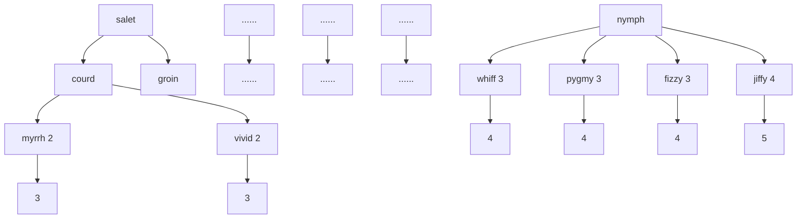
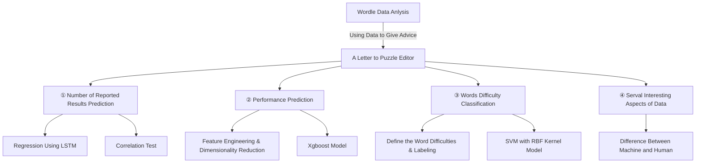
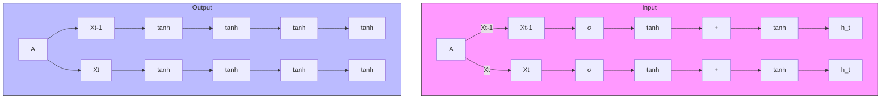
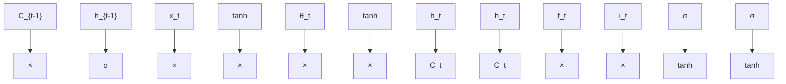
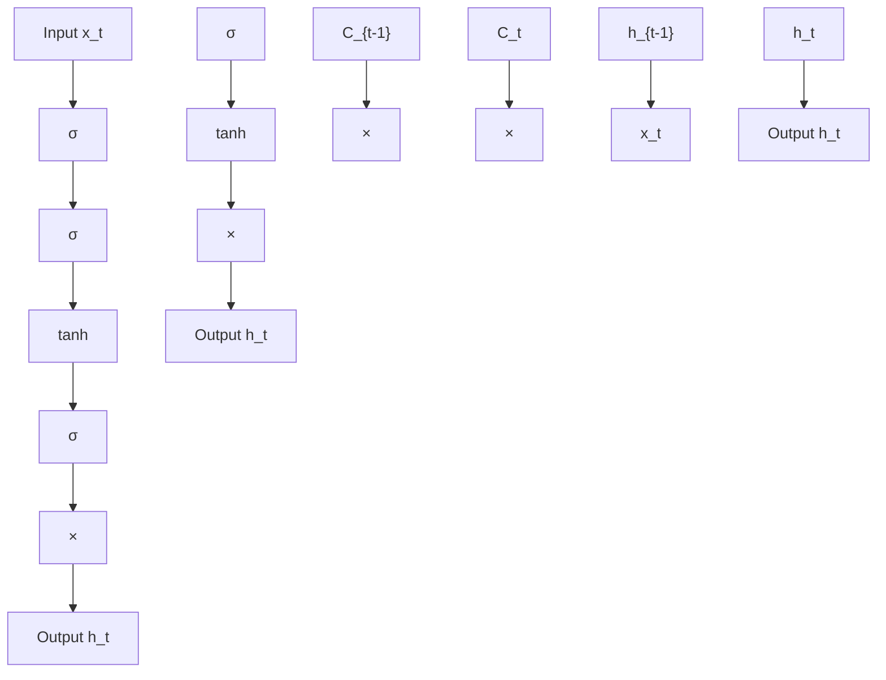
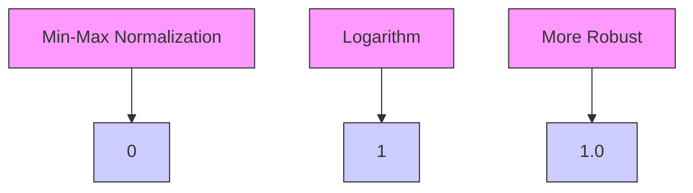
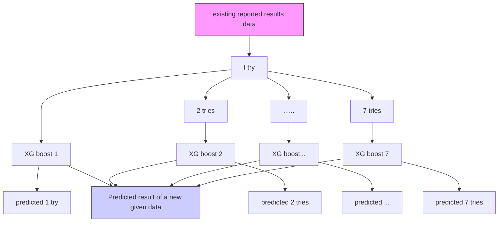

# Winners in Wordle

## Summary

Wordle is a phenomenal network game. Its appearance intensely aroused people's attention. Although it looks tiny, the hidden information behind it is huge and meaningful. Capturing and understanding this information will help the New York Times better design and operate Wordle.

We built three models to finish the tasks. Model I uses LSTM to forecast the number of reported scores in the future. Model II uses seven XGBoost regressors to predict the percentage distribution of a given the word. Model III classifies words by their difficulties using SVM with RBF kernel. Based on our three models, we can provide some advice to help improve Wordle.

The specific details are shown below:

Model I: LSTM is an improved recurrent neural network that can solve the long-distance dependence problem that other neural networks cannot handle. We trained processed data of the number of reported scores for the model and used an iterative method to predict the number until March 1st (2023). After 150 times of independent model training, the prediction interval is [20745.72, 22914.74]. Additionally, from the linear regression on the proportion of hard mode with word attributes, we can also find no correlation between hard-mode-ratio and target word.

Model II: To get the percentage distribution of a given day associated with a specific word, we trained seven separate XGBoost models. The $R^{2}$ of our model is 0.68, which can be accurately predicted with low uncertainty after testing. We apply "EERIE" to the model and gain a prediction percentage distribution, showing that ERRIE should be considered as an problematic word.

Model III: We quantified the difficulty of words by the unequally weighted average of percentage distribution and divided them into three levels: easy, medium and hard. Then we used labeled to fit SVM model with RBF kernel and gain an accuracy score of 0.6556 and an F1 score of 0.6634. Also, the classification result for EERIE is hard, consistent with the result in model 2.

Except for these three models, we also found some interesting observations from the dataset, one of which discussed the differences between human thinking and machine learning.

Finally, we write a letter including our models, results, and advice to the New York Times Wordle editor. We hope this letter will become a valuable reference for the further development of Wordle.

Keywords: Wordle; LSTM; Recursive Regression; XGBoost; Feature Engineering

## Contents

## 1 Introduction 3

1.1 Background 3  
1.2 Restatement of Problem 3  
1.3 Literature Review 4  
1.4 Our Work 5

## 2 Assumptions 5

## 3 Notations 5

## 4 Task 1: Fundamental Model for Predicting Results 6

4.1 Data Cleaning 6  
4.2 Formulating the Model 6  
4.2.1 Long-term and Short-term Memory 7  
4.2.2 Data Normalization 8  
4.2.3 Implementation of LSTM 9  
4.2.4 Prediction Interval from the Result 9

4.3 Correlation between Hard-mode Percentage and Words ..... 10

## 5 Task 2: Model for Predicting Percentage Distribution 11

5.1 Features Used to Measure the Performance of Reported Results ..... 11  
5.2 Feature Engineering 11  
5.3 XGBoost Model Training 11  
5.4 Uncertainties Involved in the Model 12  
5.5 Predicted Distribution of EERIE 13

## 6 Task 3: Classification of Words 14

6.1 Definition of Word Difficulty 14  
6.2 Feature Engineering 15  
6.3 Model Construction and Prediction ..... 15

6.4 Model Evaluation 15

## 7 Task 4: Other Interesting Findings 16

7.1 Fundamental Difference in Wordle Playing Strategy between Human Brain and Machine Learning 16  
7.2 Other Interesting Features . . . . . . . . . . . . . . . . . . . . . . . . . . . . . . . 17

## 8 Strengths and Weaknesses 18

8.1 Strengths 18  
8.2 Weaknesses 19

## 9 Letter 20

## References 22

## 1 Introduction

## 1.1 Background

Nowadays, a puzzle game called "Wordle" has taken the world by storm with its light-hearted approach and confusing but attractive yellow, green, and grey squares.

Generally speaking, it is a game that requires players to guess the correct words within less than six times. Players can only guess a word that is officially recognized. Every time players make a guess (no more than six wrong guesses), they will be given a hint in the form of yellow, green, and grey squares. A green indicates correct; a yellow indicates correct letter in the wrong location; and a grey means that the letter is not included in the word. Words Hard Mode makes the game more challenging by forcing players to use correct letters found before in subsequent guesses. The example of "Wordle" is shown in Figure.1.

text_image

W H I C H
O U G H T
R E T R Y
D E P T H
L O G I C
E X I S T

Figure 1: Example of Wordle Puzzle

To help the New York Times better understand the difficulty and audience of "Wordle", we hope to construct a prediction model using daily performance data posted by players on Twitter in 2022. In other words, to make the "Wordle" develop better, we should use the prediction model and get reasonable estimates of the number of future players, the distribution of reported results, and the measurement of word difficulty.

## 1.2 Restatement of Problem

- Construct a prediction model to explain the total variation and a prediction interval for the number of reported results on March 1st, 2023.  
- Verify whether the attributes of words would affect the percentage of players who post their hard-mode results on Twitter.

- Given fixed word, predict associated percentages of (1, 2, 3, 4, 5, 6, X) for a future date and explain uncertain factors. Apply the model on March 1st, 2023 with specific word "EERIE".  
- Develop and summarize a model to classify solution words by difficulty and identify the attributes of a given word. Apply the model to classify the word "EERIE" and discuss the accuracy.  
- List and describe other interesting findings of this dataset.

## 1.3 Literature Review

There are two primary tasks for the model: predicting the number of reported results with their associated percentages of $(1, 2, 3, 4, 5, 6, X)$ along the time axis, and measuring the difficulty level of a given word "EERIE".

In the time series field, models mainly focus on Long Short-Term Memory (LSTM), a kind of artificial neural network suitable for processing and predicting important events with very long intervals and delays in time series[1]. By using LSTM, we can gain much better performance than other traditional techniques. More specifically, the average reduction in the error rate obtained by LSTM compared to ARIMA was between $84\%$ and $87\%$ in forecasting time series[2].

In word classification, Laurent has already found an optimal strategy through a decision tree to solve the "Wordle" puzzle[3]. He indicated that the optimal process will take four steps on average and at most six steps to match the word. Based on his decision tree, Selby[4] implemented the optimal strategy and provides a file to illustrate it, which works as shown in Figure.2. For an example in Figure.2, if we want to get the target word "nymph", we should follow the red track and the expected depth (number of guesses) is 3.

flowchart

Figure 2: Working Process of Decision Trees

## 1.4 Our Work

Figure.3 shows the process of our work:  

flowchart

Figure 3: The Process of Our Work

## 2 Assumptions

Assumptions are made as follows to simplify the problem. Each of them is properly justified.

- Ignore the influence of extreme events, such as holidays and natural disasters, since these events rarely happen. So, we can ignore its effect on our model.  
- The 2020 Word Frequency Table can represent the frequency of words that all participants daily use. And the usage frequency has not changed significantly over the past three years.  
- The results reported by players were independently made by themselves without cheating.

Other specific assumptions, if necessary, will be mentioned and illustrated while we're establishing models.

## 3 Notations

Table.1 shows notations that should be used in equations:

Table 1: Notations

<table><tr><td>Symbol</td><td>Definition</td></tr><tr><td> $C_t$ </td><td>The output of the long-term memory</td></tr><tr><td> $h_t$ </td><td>The output of the short-term memory</td></tr><tr><td> $\mu$ </td><td>Average of the sample data</td></tr><tr><td> $sd$ </td><td>Standard deviation of the sample data</td></tr><tr><td> $i_{try}$ </td><td>Percentage of i try, i can be 1 to 6 or X</td></tr><tr><td> $w_t$ </td><td>Weighted average of performances in reported results</td></tr><tr><td> $E_w$ </td><td>Unequally weighted average of score distribution</td></tr></table>

## 4 Task 1: Fundamental Model for Predicting Results

## 4.1 Data Cleaning

After statistics and processing of data, it was found that there were two kinds of errors in the sample data: The first one is the lexical error, including length inconsistency, null character, and other problems. We do the correction based on official twitter as shown in Table.2; The second one is the data error. The total number of scores reported on January 30th, 2022 is an outlier because of its lack of magnitude. So we looked back at official twitter on that day and found the correct number is 25,569.

Table 2: Correction of Lexical Errors

<table><tr><td>Previous Word</td><td>rprobe</td><td>clen</td><td>tash</td><td>favor (with space)</td><td>na?ve</td><td>marxh</td></tr><tr><td>Corrected Word</td><td>probe</td><td>clean</td><td>trash</td><td>favor</td><td>naive</td><td>marsh</td></tr></table>

## 4.2 Formulating the Model

LSTM, unlike other kinds of artificial neural networks, combines long-term and short-term memory to ensure the stability and accuracy of the model along the time series. This unique feature can be shown as a repeating unit in Figure.4. Here we will briefly describe the principles used in our prediction model[5].

flowchart

Figure 4: Principle Graph of LSTM

## 4.2.1 Long-term and Short-term Memory

To understand the long-term memory's output, we should realize the function of oblivion gate (Figure.5). The oblivion gate is used to compare information between the hidden state in the previous layer and the current status information $X_{t}$ , and select the one with larger weights.

flowchart

Figure 5: Oblivion Gate

$$
f _ {t} = \sigma \left(W _ {f} \cdot [ h _ {t - 1}, x _ {t} ] + b _ {f}\right)
$$

The long-term memory output $(C_t)$ is the output above, and the formula is:

$$
C _ {t} = f _ {t} * C _ {t - 1} + i _ {t} * \tilde {C} _ {t} \tag {1}
$$

which can be described as an addition of two parts. The first part is the overlap of oblivion gate output $f_{t}$ and long-term memory output from the previous layer $C_{t-1}$ , and the second part is the information purified from the current status information.

The short-term memory output $(h_t)$ is the output below, and the formula is shown as below (Figure.6):

flowchart

Figure 6: Short-term Memory output

$$
o _ {t} = \sigma \left(W _ {o} \left[ h _ {t - 1}, x _ {t} \right] + b _ {o}\right)
$$

$$
h _ {t} = o _ {t} * \tanh (C _ {t})
$$

It can be described as a multiplication of two parts, the first part is an actication process just as the same as the oblivion gate, and the second part is the information purified from the current long-term memory output $(C_{t})$ . The final result will also present the overlap of activated signal and purified long-term memory output.

## 4.2.2 Data Normalization

The input data of the LSTM model should be normalized. However, the distribution of the number of reported scores is quite unbalanced. For example, the change of reported number from 07/24/2022 to 11/01/2022 is $39813 - 27502 = 12311$ . However, the ratio of change is only $3.4\%$ , scaled by the maximum number. In other words, the traditional Min-Max normalization will not take effect in this situation. Moreover, the number of reported scores roughly follows the gamma distribution, which includes the natural constant term. As a solution, a natural logarithm will be applied to the number of reported scores in the first step. After narrowing the gap, the number will be normalized by the Min-Max method to finally produce the LSTM model's input data, the total process is shown as Figure.7.

flowchart

Figure 7: Process of Data Normalization

## 4.2.3 Implementation of LSTM

In our task, we implement LSTM neural network by Pytorch. We aim to predict the score-reported number on March 1st based on the sample data with scores reported for 359 days, and it is a single input - single output LSTM model. Additionally, fundamental LSTM can only make one prediction at one time. However, our target is to predict the expected value after 60 days, so we recursively applied regressions for 60 times. This recursive process can continuously update sample data by adding latest output.

We only used one LSTM layer and one fully connected layer because of the small sample. Moreover, after cross-validation, we found that the best number of LSTM units was 5. Then, we focused on adjusting the "look back" parameter, which determines the days short-term memory needs to record, and finally found 33 days of looking back for the best performance.

Because of the randomness of the neural network, after 150 times of training, we get the following prediction for the reported number on March 1st, 2023, and the predicted average score reported numbers for 60 days (Figure.8).

histogram

| Predicted number of reported results in 1/3/2023 | Count |
|---|---|
| 20000 - 20250 | 6 |
| 20250 - 20500 | 4 |
| 20500 - 20750 | 7 |
| 20750 - 21000 | 21 |
| 21000 - 21250 | 41 |
| 21250 - 21500 | 60 |
| 21500 - 21750 | 104 |
| 21750 - 22000 | 82 |
| 22000 - 22250 | 68 |
| 22250 - 22500 | 53 |
| 22500 - 22750 | 43 |
| 22750 - 23000 | 18 |
| 23000 - 23250 | 12 |
| 23250 - 23500 | 4 |
| 23500 - 23750 | 3 |

(a) Distribution of Predicted Results on March 1st

line chart

| x    | y       |
| ---- | ------- |
| 0    | 20000   |
| 10   | 22500   |
| 20   | 21000   |
| 30   | 22500   |
| 40   | 21500   |
| 50   | 22000   |
| 60   | 21849.75|

(b) Average Reported Numbers on the Next 60 Days  
Figure 8: The Prediction Result Graph of the Model

## 4.2.4 Prediction Interval from the Result

The LSTM model created in 4.2.2 was trained for 150 times. Then, we can obtain the confidence interval of the variation in March 1st, 2023 by statistical calculation. The average for predicted data is 21,843.73, and the standard deviation is 560.21. We choose the $95\%$ confidence interval with the $|z|$ value of 1.96. The CI can be calculated by:

$$
[ \mu - | z | * s d, \mu + | z | * s d ] \tag {2}
$$

Therefore, the prediction interval is [20745.72, 22914.74] by $95\%$ confidence.

## 4.3 Correlation between Hard-mode Percentage and Words

If we consider lexical attributes from sample data, the result of correlation analysis will be biased. Therefore, we extract some basic properties of the word itself. Here we use four attributes: daily frequency, initial letter, serial letters, and average letter frequency.

- Daily frequency: From the Leipzig Corpora Collection[6], we find a word list that counts the frequency of words in daily life in 2022. Then, we extract all five-length English words and take their normalized rank as the first feature.  
- Initial letter: A binary variable shown whether the initial letter is a vowel.  
- Consecutive letters: Another binary variable indicated whether the word contains consecutive letters, such as "rr" in "carry".  
- Average letter frequency: By applying the frequency of letters in the alphabet from Concise Oxford Dictionary (9th edition, 1995), we create a variable to record the average frequency among five letters for each word[7].

We took a linear regression on the Hard Mode ratio to determine the effect of these four lexical attributes. The detailed result is shown below in Figure.9:

<table><tr><td rowspan="2" colspan="2">F(4, 354) = 1.69</td><td colspan="3">Number of obs = 359</td></tr><tr><td colspan="3">F(4, 354) = 1.69</td></tr><tr><td></td><td></td><td colspan="3">Prob &gt; F = 0.1519</td></tr><tr><td colspan="2">Ratio = β₀ + β₁ * freqrank_scale + β₂ * Head + β₃ * Continuous + β₄ * Letterfreq + _cons</td><td colspan="3">R-squared = 0.0154</td></tr><tr><td></td><td></td><td colspan="3">Root MSE = .02222</td></tr><tr><td>Ratio</td><td>Coef.</td><td>Robust Std. Err.</td><td>t</td><td>P&gt;|t|</td></tr><tr><td>freqrank_scale (Daily frequency)</td><td>.0048827</td><td>.0071223</td><td>0.69</td><td>0.493</td></tr><tr><td>Head (Initial letter)</td><td>.0072074</td><td>.0029224</td><td>2.47</td><td>0.014</td></tr><tr><td>Continuous (consecutive letters)</td><td>.0007349</td><td>.0037123</td><td>0.20</td><td>0.843</td></tr><tr><td>Letterfreq (Average letter frequency)</td><td>-.0002852</td><td>.0010079</td><td>-0.28</td><td>0.777</td></tr><tr><td>_cons</td><td>.0752282</td><td>.0062397</td><td>12.06</td><td>0.000</td></tr></table>

Figure 9: Linear Regression on Ratio

The F-statistics is 1.69, less than 2.397 ( $\alpha = 0.05$ ). Therefore, words will not affect the percentage of scores reported in Hard Mode at 5% significance level. Moreover, the conclusions are the same if we turn to analyze those four t-statistics.

## 5 Task 2: Model for Predicting Percentage Distribution

## 5.1 Features Used to Measure the Performance of Reported Results

Notice that there are two main aspects for estimating the model, time and difficulty of word. We first verify the correlation between time and the percentage distribution in that case. We use a weighted average $(w_{t})$ to represent the performances in reported results, with $w_{t} = \sum_{i=1}^{7} i * i_{try}$ . Then we did the linear regression of $w_{t}$ on time and discovered that the p-value of time is 0.457, which is much larger than 0.05. It shows no significant correlation between performance and time, so we consider the relationship between the performance and the difficulty of word. We will use those four attributes mentioned in chapter 4.3. Additionally, we add two new lexical attributes: depth and the maximum number of repeated letters.

- Depth: As mentioned in the literature review, depth can show the expected times for finding the correct answers with the help of the optimal decision tree – the larger the depth, the more challenging to answer the word.  
- Maximum same letter numbers (charNum): Based on Wordle game mechanics, it is hard to think of the same letter when it gets a green or yellow square response. We tend to try a letter that has yet to get a response. Repeating words also reduces the amount of information given to the player. For example, with the target word "wheel", if the players have already known that the correct answer contains "e", "h", "l", and "w", they will prefer to guess "whale" instead of "wheel". Because "whale" can provide more information than "wheel". Moreover, the larger the number of same letters is, the more complex the problem is.

## 5.2 Feature Engineering

After scanning the data, it was found that for the feature "Daily frequency", some words in the list have massive ranks. These ranks are so huge that should be considered as outliers. To reduce the impact of outliers in the model, RobustScaler is used to normalize the data.

Until now, the features that measure the difficulty of words are defined by human intuition. Those features should be further analyzed and determined their contributions to the word difficulty. Therefore, Recursive Feature Elimination (RFE) algorithm was used to rank those six features. Finally, "Daily frequency", "CharNum" and "Letter frequency" were selected as three dominant features.

## 5.3 XGBoost Model Training

As shown in Figure.10, we use seven XGBoost models to train each associated percentage of (1, 2, 3, 4, 5, 6, X) for a fixed word, using "Daily frequency", "CharNum" and "Initial letter". During the training process, cross-validation was used to determine the corresponding hyperparameters of each XGBoost model. Using the determined hyperparameters, the model's coefficient of determination $(R^2)$ is 0.68, showing that the model is indeed capable of predicting.

flowchart

Figure 10: The Process of XGBoost Training

## 5.4 Uncertainties Involved in the Model

Since our model was based on XGBoost, we need to use sensitivity analysis to measure the uncertainty of the model. We chose three words with similar difficulties: "Royal", "Sport", and "Prove", since differences among their daily frequency ranking and average letter frequency are both less than 2%. Additionally, "Royal" is a puzzle published on April 12th, 2022, which means its percentage distribution is known, while the remaining two are still unknown. We use our model to predict these two unknown percentage models and compare their differences with the distribution of "Royal".

Using a weighted average of distributions is a straightforward way to compare the differences between distributions, but equally weighted averages will make a loss in information. For example, the gap between 3 tries and 4 tries is smaller than the gap between 6 tries and X. After much deliberation, we finally settled on an unequally weighted average $E_{w}$ on every word, which is:

$$
E _ {w} = 1 _ {t r y} + 3 * 2 _ {t r y} + 5 * 3 _ {t r y} + 6 * 4 _ {t r y} + 7 * 5 _ {t r y} + 9 * 6 _ {t r y} + 1 1 * X _ {t r y} \tag {3}
$$

to compare the differences between distributions on different words.

Table 3: Sensitivity Analysis

<table><tr><td></td><td> $Freqrank_{scale}$ </td><td>charNum</td><td>letterFreq</td><td> $E_w$ </td></tr><tr><td>royal</td><td>-0.3638</td><td>1</td><td>6.10164</td><td>605</td></tr><tr><td>sport</td><td>-0.3624 (0.38%)</td><td>1 (0%)</td><td>6.1195 (0.29%)</td><td>601.3349 (0.66%)</td></tr><tr><td>prove</td><td>-0.3620 (0.50%)</td><td>1 (0%)</td><td>6.01592 (-1.4%)</td><td>607.6483 (0.44%)</td></tr></table>

As results shown in Table.3 that the variation range of $E_w$ is within 1%, thus the uncertainty

of the model is low.

The uncertainty may also caused by the prediction loss. When we trained seven independent XGBoost models, the sum percentages of 7 tries could not be completely equal to $100\%$ . The predicted values of 25 randomly selected test data are shown in the figure.11 below:

line chart

| x  | y      |
|----|--------|
| 0  | 99.30  |
| 1  | 99.80  |
| 2  | 99.60  |
| 3  | 100.00 |
| 4  | 99.50  |
| 5  | 101.00 |
| 6  | 98.68  |
| 7  | 100.50 |
| 8  | 99.70  |
| 9  | 99.60  |
| 10 | 100.50 |
| 11 | 98.80  |
| 12 | 101.79 |
| 13 | 99.30  |
| 14 | 100.50 |
| 15 | 99.30  |
| 16 | 100.90 |
| 17 | 100.30 |
| 18 | 99.20  |
| 19 | 98.80  |
| 20 | 101.00 |
| 21 | 101.79 |
| 22 | 100.50 |
| 23 | 100.70 |
| 24 | 98.90  |

Figure 11: Total Sum of Percentages in Performances

The sum of the 25 predicted values falls within the interval of $(98,102)$ , with a variance of 0.71 against 100. So the uncertainty is relatively small, indicating the low uncertainty.

## 5.5 Predicted Distribution of EERIE

Taking "EERIE" into the established model gives the following results (Figure.12).

pie chart

| Category | Value |
|---|---|
| 1 try | 1.0041 |
| 2 tries | 1.3331 |
| 3 tries | 11.9922 |
| 4 tries | 20.8153 |
| 5 tries | 34.4803 |
| 6 tries | 23.8940 |
| X | 5.7858 |

Figure 12: Pie Chart of Expected Distribution of Reported Scores on EERIE

This prediction result shows a relatively large $E_{w}$ value of 709.9076, which means that this word is preliminarily difficult. The difficulty analysis will be done in task 3. As mentioned above, with relatively high $R^{2}$ and less uncertainty, we have relatively high confidence in the prediction of "EERIE".

## 6 Task 3: Classification of Words

## 6.1 Definition of Word Difficulty

In this task, it is required to classify solution words by difficulty. Since the distribution of reported results depends mainly on the difficulty of the word, we decided to use the unequally weighted average mentioned in chapter 5.4 as the measurement of word difficulty.

To label the data provided, we first calculated the unequally weighted average of each word. We found that nearly 60% of the points fell between 600 and 700, while the other 40% was distributed almost evenly on two sides (Figure.13). Thus, we decided classification labels as "easy", "medium", and "hard" (Table.4). The smaller the unequally weighted average represents, the higher percentage of $i_{try}$ with small $i$ . In other words, the word is more simple.

histogram

| Bin Range | Frequency |
| --------- | --------- |
| 450-475   | 1         |
| 475-500   | 0         |
| 500-525   | 5         |
| 525-550   | 8         |
| 550-575   | 10        |
| 575-600   | 16        |
| 600-625   | 29        |
| 625-650   | 37        |
| 650-675   | 38        |
| 675-700   | 24        |
| 700-725   | 33        |
| 725-750   | 27        |
| 750-775   | 21        |
| 775-800   | 17        |
| 800-825   | 14        |
| 825-850   | 11        |
| 850-875   | 13        |
| 875-900   | 11        |
| 900-925   | 6         |
| 925-950   | 4         |
| 950-975   | 2         |
| 975-1000  | 3         |
| 1000-1025 | 2         |
| 1025-1050 | 1         |
| 1050-1075 | 1         |
| 1075-1100 | 1         |

Figure 13: Distribution of Weighted AveragePerformances

Table 4: Standard of Difficulty Label

<table><tr><td> $w_t$ </td><td>&lt;600</td><td>600-700</td><td>&gt;700</td></tr><tr><td>label</td><td>easy</td><td>medium</td><td>hard</td></tr></table>

## 6.2 Feature Engineering

Since the classification of word difficulty is related to the distribution of the performance, we will still use the three features selected by the RFE algorithm in chapter 5. According to these three features and assigned labels, the classification diagram of 359 provided data is shown in Figure.14(a):

scatterplot

| freqRank_scale | letterFreq | charNum | Category |
| -------------- | ---------- | ------- | -------- |
| 2              | 10         | 3.00    | Medium   |
| 4              | 8          | 2.75    | Hard     |
| 6              | 6          | 2.50    | Easy     |
| 8              | 4          | 2.25    | Medium   |
| 10             | 2          | 2.00    | Hard     |

(a) Without Target Word "EERIE"

scatterplot

| freqRank_scale | letterFreq | charNum | Category     |
| -------------- | ---------- | ------- | ------------ |
| 2              | 6          | 1.5     | Medium       |
| 4              | 7          | 1.8     | Hard         |
| 6              | 8          | 2.0     | Easy         |
| 8              | 9          | 2.2     | Word "EERIE" |

(b) With Target Word "EERIE"  
Figure 14: Classification Diagrams of Weighted Performances

It shows that the blue dots (easy) are concentrated in areas where $freqRank_{scale}$ is low (more common in life), letterFreq is high (more common in composing letters), and charNum is low (fewer repeated letters). The red dots (hard) are spread over contrary areas, while the green dots (median) are mostly in areas between them.

## 6.3 Model Construction and Prediction

We divided the sample data into the training set and the test set with the proportion of 3:1, and trained the RBF kernel SVM model. The three-dimensional features of EERIE is (0.0226, 9.7215, 3). After taking it into the model, we got the prediction label of "EERIE" as "hard", which was also consistent with the unequally weighted average result of its performance distribution in chapter 5 (709.9076>700). The above figure shows the position of the "EERIE" in the sample data space (Fig.14(b))

## 6.4 Model Evaluation

\- The Table.5 below shows four important metrics of classification model evaluation. They are all above 0.6, reflecting the high accuracy (can be described as higher than $60\%$ ) of the model.

Table 5: Four Criterias for Evaluating Model

<table><tr><td>Precision score</td><td>Recall score</td><td>F1 score</td><td>Accuracy score</td></tr><tr><td>0.6762</td><td>0.6556</td><td>0.6634</td><td>0.6556</td></tr></table>

- The confusion matrix(Figure.15(a)) shows that the classification for "easy" and "medium" is very good, but the classification for "Hard" is relatively weak.  
- The ROC curve (Figure.15(b)) shows the average curve of three types. The closer the ROC curve is to the upper left corner, the higher its sensitivity and the lower the misdiagnosis rate, thus our model have a good performance of prediction.

heatmap

| Category | Easy | Medium | Hard |
|---|---|---|---|
| Easy | 24 | 8 | 2 |
| Medium | 11 | 32 | 6 |
| Hard | 0 | 4 | 3 |

(a) Confusion Matrix of the Model

line chart

| False Positive Rate | average, ROC curve | Label = Easy, ROC curve | Label = Medium, ROC curve | Label = Hard, ROC curve |
| ------------------- | ------------------ | ----------------------- | ------------------------- | ----------------------- |
| 0.0                 | 0.0                | 0.0                     | 0.0                       | 0.0                     |
| 0.2                 | 0.4                | 0.3                     | 0.6                       | 0.3                     |
| 0.4                 | 0.8                | 0.7                     | 0.8                       | 0.5                     |
| 0.6                 | 0.9                | 0.8                     | 0.9                       | 0.5                     |
| 0.8                 | 0.95               | 0.9                     | 0.95                      | 0.65                    |
| 1.0                 | 1.0                | 1.0                     | 1.0                       | 1.0                     |

(b) ROC Curve of the Model  
Figure 15: Classification Diagrams of Weighted Performances

## 7 Task 4: Other Interesting Findings

## 7.1 Fundamental Difference in Wordle Playing Strategy between Human Brain and Machine Learning

As mentioned in Literature Review, there is an optimal strategy developed by the decision tree algorithm, in which the only thing that affects the number of tries used for each word is the word depth in the tree. However, when we analyzed the percentage distribution of the reported results (Figure.16), we found that the correlation between Depth and $w_{t}$ in the data set is very low, even smaller than the correlation between charNum and $w_{t}$ .

heatmap

|          | depth  | charNum | weighted |
|----------|--------|---------|----------|
| depth    | 1.000  |         |          |
| charNum  | 0.011  | 1.000   | 0.377    |
| weighted | 0.258  | 0.377   | 1.000    |

Figure 16: Heat Map about Correlation among $w_{t}$ , CharNum and Depth

It indicates that the depth feature contributes little to the performance of the player of Wordle.

This uncorrelation shows that when people play Wordle, they are less likely to do the puzzle with the help of the optimal strategy developed by the machine. Instead, humans have their own strategies and minds to deal with the puzzle. The given data illustrates the difference between machine "thinking" and human thinking, which is a provoking aspect that can be further studied.

## 7.2 Other Interesting Features

- Over time, the players' performances on the problem barely improved. This is a counterintuitive trait. Because intuitively, the longer a game is released, the better it will be understood and performed by the game players. Maybe it is caused by the problem of insufficient sample data.  
- Holidays also affect players' reported scores and performances to some extent. For example, both the number of reported results and the number in hard mode on Christmas Day are significantly lower than the data on adjacent days.  
- We have estimated that the percentages in hard mode has no correlation with the attributes of words in chapter 4. However, according to Figure.17, the percentage of hard mode tend to keep growing in the future.

line chart

| Date       | Value  |
| ---------- | ------ |
| 2022/1/7   | 0.02   |
| 2022/2/7   | 0.04   |
| 2022/3/7   | 0.05   |
| 2022/4/7   | 0.06   |
| 2022/5/7   | 0.07   |
| 2022/6/7   | 0.08   |
| 2022/7/7   | 0.09   |
| 2022/8/7   | 0.10   |
| 2022/9/7   | 0.11   |
| 2022/10/7  | 0.13   |
| 2022/11/7  | 0.10   |
| 2022/12/7  | 0.11   |

Figure 17: The Percentage of Hard Mode

Based on this information, we can speculate that the percentage of hard mode is related to the time, affected by players' familiarity with the game mechanics. With the increase of time, Players tend to become more and more challenging.

\- Figure.18 shows the scatter diagram of the distribution on the percentage of (1, 2, 3, 4, 5, 6, X). The yellow points, which indicate the percentage of 4 tries, are always on the top of the plots. No matter how the time and difficulty of the word change, the maximum-occupied try is always 4. It verifies the conclusion that the average optimal solution of the optimal decision tree is 4.

scatter plot

| Date | 1 try | 2 tries | 3 tries | 4 tries | 5 tries | 6 tries | 7 or more tries (X) |
| --- | --- | --- | --- | --- | --- | --- | --- |
| 2021/12/20 |  |  |  |  |  |  |  |
| 2022/2/8 |  |  |  |  |  |  |  |
| 2022/3/30 |  |  |  |  |  |  |  |
| 2022/5/19 |  |  |  |  |  |  |  |
| 2022/7/8 |  |  |  |  |  |  |  |
| 2022/8/27 |  |  |  |  |  |  |  |
| 2022/10/16 |  |  |  |  |  |  |  |
| 2022/12/5 |  |  |  |  |  |  |  |
| 2023/1/24 |  |  |  |  |  |  |  |

Figure 18: The Scatter Diagram of Distribution in Performances

## 8 Strengths and Weaknesses

## 8.1 Strengths

\- The model we used (LSTM neural networks) has higher accuracy and better performance than classical methods, such as ARIMA. In addition, it can process both single data points and the entire data series, making it suitable for processing datasets with time series and dealing with the main problems in task 1.

\- The result we concluded in task 2 and task 3 are perfectly matched, which shows a high accuracy and high level of confidence in our model. More specifically, the result of task 2 shows that people have poor performance dealing with "EERIE" in Wordle in general. At the same time, the result of task 3 shows that "EERIE" is a difficult word in the "hard" label.

## 8.2 Weaknesses

- The impact of special days (such as holidays or the MCM contests) is not taken into account.  
- The data is collected by tweets reported by players, may existing information gaps and influence the final expectationation results.  
- As the percentage data given by sample is rounded off, precision errors between data may occur when we substitute it into the model, and the total number of percentage in performances may not be 100.  
- The SVM classification model is weak in recognizing "hard" words.

Shenzhen, 518000

February 21, 2023

129 W. 29th Street

11th Floor

New York, NY, 10001-5105

Dear Puzzle Editor of the New York Times,

I'm writing to express our keen interest in the Wordle game on your website. Even one of our team members has been a big fan of Wordle since its launch, so we strongly hope that our model and predictions results will lead to a better future for your game.

Firstly, we used the LSTM model to predict the total number of players in the future. Although the total number of players will continue to decline, the percentage of the hard mode will fluctuate to rise. It indicates the hidden nature of players' challenging. However, this challenge has no significant correlation with the attributes of the word, so we suggest tweaking the game mechanics to take advantage of the players' challenge (more details below).

Secondly, we used XGBoost to predict the distribution of players' performances on a certain word. If the target word on March 1st were EERIE, the distribution would look like figure shown on the right. Although the small error caused by the round-off may affect the correctness, it is guaranteed that the fluctuation is less than 1%. We have a great deal of confidence in the correctness of the distribution prediction.

bar chart

Expected Percentage Distribution of EERIE on March 1
| Category | Expected Percentage |
| :--- | :--- |
| X | 5.7858 |
| 6 tries | 23.8940 |
| 5 tries | 34.4803 |
| 4 tries | 20.8153 |
| 3 tries | 11.9922 |
| 2 tries | 1.3331 |
| 1 try | 1.0041 |

Finally, we developed a model to measure the difficulty levels of words based on the sample data and the attributes of the words themselves. We quantified word difficulty for levels below 600 as easy, 600 to 700 as medium, and more than 700 as hard. For example, the word EERIE will have a difficulty level of 709.9076 (as a hard word). We use the confusion matrix, ROC, and other metrics to evaluate the model with a high accuracy of nearly $70\%$ . Therefore, this model can help you accurately measure the word difficulty in Wordle game.

In addition, we found that the average guessing time was always four with different words and dates. Some important holidays also affect the number of players. For better forecasting and planning in the future, it is essential to increase players' willingness to report their scores. At the same time, we compared the optimal solution of the Poirrier decision tree with the players' strategy and thinking. Although we could get the same expected average (four times), the process from the human brain is very different from the optimal solution of the decision tree. It shows the difference between the human brain and machine learning towards Wordle game.

Based on these conclusions, we strongly recommend adding a difficulty factor and a reward item to wordle games. The difficulty level determines the players' final score according to the mode chosen by the player and the difficulty label of the words by our classification model. In addition, the player can rank himself among all players according to his accumulated scores, which will significantly improve players' willingness to challenge. Moreover, we have simulated the reward mechanism of the game in the following figure.

text_image

WORDLE
P I A N O
P R E S S
P E R R Y
Hint: randomly give
a yellow square hint
on your keyboard
Chance: One
more chance to
guess the word
Q W E R T Y U I O P
A S D F G H J K L
ENTER Z X C V B N M

One of the two props can be randomly gained at the first sharing of results in one day, improving the accuracy of future samples and spreading the game's influence.

Our model and suggestions can help increase awareness and participation in your game. Good luck with your future development

Best wishes!

Yours sincerely,

Team #2311035

## References

[1] Hochreiter, S., & Schmidhuber, J. (1997). Long short-term memory. Neural Computation, 9(8), 17351780. https://doi.org/10.1162/neco.1997.9.8.1735  
[2] Siami-Namini, S., Tavakoli, N., & Siami Namin, A. (2018). A comparison of Arima and LSTM in forecasting time series. 2018 17th IEEE International Conference on Machine Learning and Applications (ICMLA). https://doi.org/10.1109/icmla.2018.00227  
[3] Poirrier, L. (2022, January 23). Laurent's Notes. Mathematical optimization over Wordle decision trees – Laurent's notes. Retrieved February 18, 2023, from https://www.poirrier.ca/notes/wordle/#decision-trees  
[4] Selby, A. (2022, January 19). The best strategies for wordle. The best strategies for Wordle - Things (various). Retrieved February 18, 2023, from https://sonorouschocolate.com/notes/index.php?title=The\_best\_strategies\_for\_Wordle  
[5] Olah, C. (2015, August 27). Understanding LSTM networks. Understanding LSTM Networks – colah's blog. Retrieved February 19, 2023, from http://colah.github.io/posts/2015-08-Understanding-LSTMs/  
[6] Corpora collection. Download Corpora English. (n.d.). Retrieved February 18, 2023, from https://wortschatz.uni-leipzig.de/en/download/English  
[7] University Communications | University of Notre Dame. (1970, February 23). University of Notre Dame. Retrieved February 18, 2023, from https://www.nd.edu/