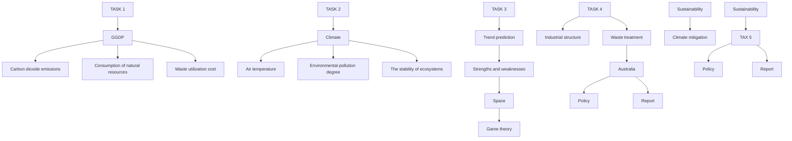
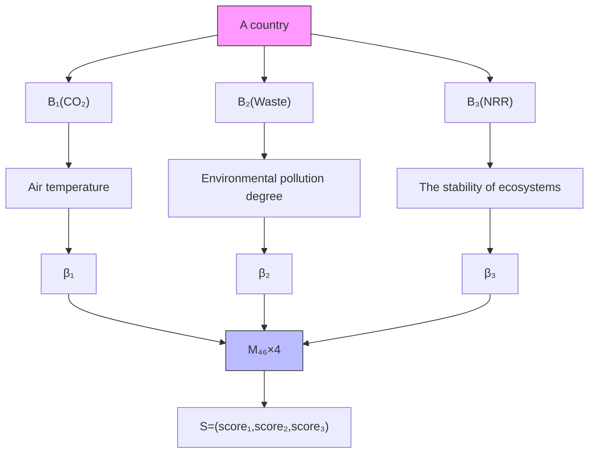
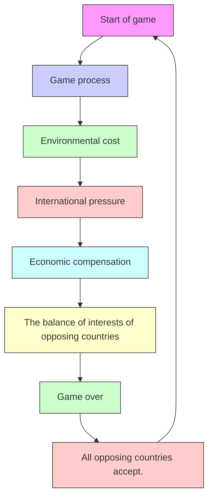

# "Green" GDP,Green planet

Summary

The concept of "green" GDP is an innovative one among many solutions to the growing impacts of climate change.GGDP successfully closely combines national sustainable development with global climate mitigation and environmental governance.

For Task1: According to SEEA and related references, GGDP is defined as GDP minus air pollution cost, waste utilization cost and resource consumption cost. Data of 46 countries are substituted into the calculation, and the Ratio of GGDP to GDP(RGG) of all countries in 2020 is obtained. The larger the value, the greener the economy.We find that the RGG is generally higher in developed countries, followed by most developing countries and lowest in resource-exporting countries.

For Task2: Referring to the impact of major international events on carbon dioxide emissions in previous years, the impact of GGDP on pollution indicators was estimated and the results were calculated. It was found that the global average RGG in 2040 increased from 0.9784 to 0.9881.Three climate indicators, namely, temperature, pollution and ecosystem balance is considered in this paper. Then, the world’s score on three indicators is calculated by three-level fuzzy comprehensive evaluation.The results show scores in 2040 increased from (0.2534,0.7591.03802) under normal conditions to (0.7139,1.2795,0.3846) after the adoption of GGDP, indicating a positive impact on climate mitigation.

For Task3: The feasibility of GGDP is analyzed from two dimensions of space and time.In the spatial dimension, the game theory is used to simulate the profit distribution process in different countries. The results show that all countries which initially opposed to the GGDP finally accepted the standard within 15 years.Different development modes are quantitatively analyzed in time dimension. In the 20th year, the adoption of GGDP generated more income than the conventional one, and in the following 40 years, an additional \$51.6 trillion of income was created globally.

For Task4: We consider Australia as an adopter of GGDP.Firstly, PVAR is used to analyze the industrial structure of Australia. It is concluded that the contribution of the tertiary industry to the economy is about 47.27%, higher than that of the secondary industry (21.07%), indicating that the industrial transformation in Australia will have a relatively positive driving effect on it.Then, comparing Australia with Germany ,we found that Australia has a low waste utilization rate and a high landfill rate.Finally, we tailor-made policies for Australia to help the country’s economic health improve rapidly.

For Task5: From the above analysis, it is clear that the adoption of GGDP in Australia is necessary.Recommendations are made to the leaders from three perspectives: economic development, environmental treatment, and waste utilization.

Finally, the sensitivity analysis of the model is carried out to verify the stability of the model, and the strengths and weaknesses of the model are analyzed.

Keywords:Fuzzy comprehensive evaluation,Time-space analysis,Game theory,PVAR

## Contents

## 1 Introduction 3

1.1 Background 3  
1.2 Restatement of the Problem 3  
1.3 Our Work . . 3

## 2 Model Preparation 4

2.1 Assumptions and Justification . . 4  
2.2 Glossary . . 5

## 3 Task 1: GGDP - An environmental prism through which to view economy 5

3.1 Selection of pollution indicators . . . 6  
3.2 Calculation of GGDP 6  
3.3 GGDP calculation results . . 7

## 4 Task2: Global climate mitigation of adopting GGDP 7

4.1 Forecasting GGDP changes 7

4.1.1 $C _ { p } , \bar { C } _ { w } , C _ { r }$ changes after the adoption of GGDP. . . . 8  
4.1.2 Change of RGG 8

4.2 Fuzzy integrated evaluation model for climate improvement . . . 9

4.2.1 Determining the main indicators of climate . . 9  
4.2.2 Solving for the affiliation of countries to the $B _ { i }$ protection level . 9  
4.2.3 Determining the World’s Level of Protection for $B _ { i }$ . . . 11  
4.2.4 Analysis of results . . 11

## 5 Task 3: It’s time to make the right choice 12

5.1 Spatial dimension of the game . . 12

5.1.1 Game players . . 12  
5.1.2 Game rules 12  
5.1.3 Game start . . . 13

5.2 Trade-offs in the time dimension 14

5.2.1 Benefit calculation 15  
5.2.2 Factors of change . . 15  
5.2.3 Presentation of results 16

## 6 Task 4: Australia’s economic health diagnosis under GGDP criteria 17

6.1 Industrial transformation to reduce overexploitation of resources . . . . 17

6.1.1 Use PVAR to analyze the contribution of industry to economy . . 18  
6.1.2 Analysis of results 20

6.2 Waste Reuse . . 21  
6.3 Policy Recommendations 21

## 7 Model Evaluation and Further Discussion 22

7.1 Sensitivity analysis . 22  
7.2 Model Strengths . . 23  
7.3 Model Weaknesses 23

## A document to the Australian Government 24

## References 25

## 1 Introduction

## 1.1 Background

Imagine a map of the world laid out in front of our eyes, and what comes to mind is not the exquisite arches of Utah, Tanzania’s Mount Kilimanjaro, or Australia’s gorgeous Great Barrier Reef; it is the hurricanes that ravage the United States, the famine in Africa caused by reduced food production, and Tuvalu in the Pacific Ocean about to be submerged by the sea. The disasters brought about by the climate crisis are destroying the civilization created by mankind step by step, if we don’t do something about it.

In this context, a new national economic measure is proposed, and a new indicator that goes beyond GDP - "green" GDP - may become a macroeconomic indicator more in line with the current context. The new indicator implies a new direction for human development of the country, including the concept of sustainable development and protection of the environment. However, this change may also cause complications in multilateral relations, and it is a question to ponder whether GGDP is the most appropriate option.

## 1.2 Restatement of the Problem

Considering the background information and constraints identified in the problem statement, we need to address the following tasks:

1. A GGDP calculation method that has been developed is selected and analyzed.  
2. Modeling is used to predict the impact of GGDP on global climate mitigation when it is adopted.  
3. Compare the advantages and disadvantages of adopting GGDP and discuss whether the switch is worthwhile.  
4. In-depth analysis of the impact of GGDP adoption in a selected country.  
5. Write our recommendations to the leaders of the selected countries on whether to adopt GGDP.

## 1.3 Our Work

For Task 1, we reviewed the literature on the GGDP calculation method and chose the calculation method proposed by Dr. Mijo Mirkovi´c in terms of the impact of social costs arising from environmental pollution. This method takes into account both the cost of damage and the cost of treatment and allows a more comprehensive accounting of the state of economic health of the country.

In Task 2, we make a comprehensive prediction of GGDP under the condition that political events have an impact on policy. The prediction results are also used in a model of fuzzy comprehensive evaluation to measure the impact of GGDP adoption on the world climate at the global scale.

Coming to Task 3, we have compared the advantages and disadvantages of adopting GGDP and not adopting GGDP in two dimensions, spatial and temporal, respectively, using game theory and predictive analysis, and concluded that the adoption of GGDP is necessary.

In Task 4 we selected Australia as the pilot country for GGDP. We first started with the calculation perspective of GGDP and analyzed the panel data of Australia’s industrial structure with PVAR to make predictions on the change of Australia’s industrial structure. Then, we pointed out the problems for Australia from the perspective of waste utilization. Finally, we give comprehensive policy recommendations.

flowchart

Figure 1: Our Work

## 2 Model Preparation

## 2.1 Assumptions and Justification

Assumptions: The national development directions set by countries after adopting the evaluation criteria of GGDP will be planned strictly according to the new criteria.

▷Justification: The criteria for evaluating the health of a country’s economy are central to a country’s development planning, and changes in the criteria will affect the direction of the country’s development.

Assumptions: The world will not experience any more sudden global events such as large-scale regional conflicts, wars or economic crises within the time horizon maintained by the vision.

▷Justification: The presence of war and economic crisis will perturb the results of our predictions and deviate from the objectives and directions of our study.

Assumptions: Under the current policy, the human energy structure and the efficiency of resource use will not change significantly in a short period of time.

▷Justification: In the absence of serious resource bias, human development and progress for technology is diffuse rather than concentrated, and there are generally no sudden technological advances in a single field.

## 2.2 Glossary

Table 1: Glossary

<table><tr><td>Glossary</td><td>Meaning</td><td>Unit</td></tr><tr><td> $E_{CO_2}$ </td><td>Annual Carbon Dioxide Emissions</td><td>kt</td></tr><tr><td>Waste</td><td>Annual Total Amount of Municipal Waste</td><td>kt</td></tr><tr><td>NRR</td><td>Total natural resource rents as a percentage of GDP</td><td>%</td></tr><tr><td>RGG</td><td>Ratio of GGDP to GDP</td><td>%</td></tr><tr><td> $B_1$ </td><td>Global Temperature</td><td>/</td></tr><tr><td> $B_2$ </td><td>Environmental Pollution Degree</td><td>/</td></tr><tr><td> $B_3$ </td><td>The Balance of the Ecosystem</td><td>/</td></tr></table>

Note: There are some variables that are not listed in Table 1 and will be discussed in detail in each section.

## 3 Task 1: GGDP - An environmental prism through which to view economy

Traditional GDP is the core indicator of national economic accounting, but it does not take into account the impact of depleted natural resources or increased pollution on a country’s future productive capacity, so a more comprehensive macroeconomic indicator consistent with sustainable development is needed. A "green" GDP is one that monetizes the loss of biodiversity and calculates the cost of climate change on top of GDP, which is arguably a more accurate indicator or measure of social well-being. At the same time, the integration of environmental statistics into national accounts, and thus the generation of green GDP data, would improve the ability of countries to manage their economies and resources. (Green GDP would arguably be a more accurate indicator or measure of societal well-being.) Meanwhile, the integration of environmental statistics into Meanwhile, the integration of environmental statistics into national accounts, and by extension, the generation of a green GDP figure, would improve countries’ abilities to manage their economies and resources[1].

Scholars have proposed many different methods for calculating GGDP, and this paper refers to a report published by Dr. Mijo Mirkovi´c in 2017[2], with some improvements based on it.

The highlight of this method is that it introduces the principle of waste-to-energy conversion by distinguishing between the actual cost of environmental damage and the opportunity cost of waste treatment, and takes into account the possible loss of turnover and social costs in a more comprehensive way.

## 3.1 Selection of pollution indicators

To calculate green GDP, we need to subtract the net consumption of natural capital, including environmental pollution, waste of available resources, and resource depletion, from traditional GDP, and we measure the net consumption of natural capital from these three aspects.

▷Air Treatment Costs $C _ { p }$

The impact of economic development on environmental pollution is mainly reflected in air pollution, of which carbon dioxide is the most important factor.We converted the total annual emissions of a country’s $C O _ { 2 } ( E _ { C O 2 } )$ (kilotons) multiplied by the market price of carbon in the country, MPC (kt), to convert the amount of pollution into an economic amount.

In 2006, the average volume-weighted price of CDM was about \$11.07 per tonne of $C O _ { 2 } [ 3 ]$ . Price in 2006 was then transformed into a price in other years by adjusting it with the cumulative rate of inflation.

▷Waste opportunity cost $C _ { w }$

The amount of waste generated in the world in 2021 is around 10 billion tons, this amount is huge, however the waste is there.The opportunity to be reused, considering the principle of waste and energy conversion, the total annual municipal waste is introduced and recorded as Waste (kt).

According to the EU waste statistics regulation, waste disposal can be divided into five types: recycling, energy recovery incineration, other incineration, disposal on land and land treatment. In this paper, we mainly consider incineration for electricity generation, and it is known that one thousand tons of waste is converted into $7 4 { , } 0 0 \dot { 0 }$ kWh per thousand tons of electricity, and this unit conversion is recorded as Elect (kWh/- ton), and then the electricity price in 2020 is adjusted by the cumulative inflation rate to the annual electricity price Plect (kWh). Finally, we multiply the amount of waste by the unit conversion and then by the electricity price to obtain the energy conversion economics of waste per year.

▷Natural resource consumption costs $C _ { r }$

The estimate of natural resource rent is the difference between the price of a commodity and the average cost of producing that commodity, and total natural resource rent is the sum rent of oil, gas, coal, mineral, and forest rent. Total natural resource rents are obtained by multiplying GDP by total natural resource rents as a percentage of GDP (denoted as NRR) to measure the consumption of natural resources. (Total natural resources rents are the sum of oil rents, natural gas rents, coal rents (hard and soft), mineral rents, and forest rents.)

## 3.2 Calculation of GGDP

We obtained the above data from highly recognized websites such as the World Bank and OECD database. We selected 46 countries from 1995 to $2 0 2 0 E _ { c o 2 }$ The seven indicators, Waste, Elect, Pelect, NRR and $\mathrm { G D P } . E _ { c o 2 }$ There are some missing indicators in $E _ { C O _ { 2 } }$ and Waste, and we take linear function to fill in this paper.

Then, based on the indicator GDP, the GGDP is calculated as follows:

$$
G G D P = G D P - E m _ {C O _ {2}} \times M P C - W a s t e \times E l e c t \times P e l e c t - G D P \times \frac {N R R}{1 0 0} \tag {1}
$$

Define RGG as:

$$
R G G = \frac {G G D P}{G D P} \times 100 \% \tag{2}
$$

Where GGDP and GDP are the GGDP and GDP of a country respectively, the larger the RGG is, the greener the economy of a country, and the range of values is [0,1].

## 3.3 GGDP calculation results

The 46 country RGG is shown below.

choropleth map

| Country | Value Range |
| --- | --- |
| United States | 0.99-1.00 |
| Canada | 0.98-0.99 |
| Mexico | 0.95-0.98 |
| Brazil | 0.85-0.95 |
| Argentina | 0.85-0.95 |
| United Kingdom | 0.70-0.85 |
| Germany | 0.99-1.00 |
| France | 0.98-0.99 |
| Italy | 0.95-0.98 |
| Spain | 0.95-0.98 |
| Australia | 0.85-0.95 |
| China | 0.85-0.95 |
| India | 0.70-0.85 |
| Japan | 0.99-1.00 |
| South Korea | 0.98-0.99 |
| Nigeria | 0.95-0.98 |
| Egypt | 0.95-0.98 |
| Saudi Arabia | 0.95-0.98 |
| Iran | 0.95-0.98 |
| Turkey | 0.95-0.98 |
| South Africa | 0.95-0.98 |
| Greenland | 0.95-0.98 |
| Iceland | 0.95-0.98 |
| Norway | 0.95-0.98 |
| Sweden | 0.95-0.98 |
| Finland | 0.95-0.98 |
| Denmark | 0.95-0.98 |
| Netherlands | 0.95-0.98 |
| Belgium | 0.95-0.98 |
| Switzerland | 0.95-0.98 |
| Austria | 0.95-0.98 |
| Poland | 0.95-0.98 |
| Ukraine | 0.95-0.98 |
| Russia | 0.95-0.98 |
| Canada | 0.95-0.98 |
| Mexico | 0.95-0.98 |
| Chile | 0.95-0.98 |
| Peru | 0.95-0.98 |
| Venezuela | 0.95-0.98 |
| Ecuador | 0.95-0.98 |
| Bolivia | 0.95-0.98 |
| Paraguay | 0.95-0.98 |
| Uruguay | 0.95-0.98 |
| Costa Rica | 0.95-0.98 |
| Panama | 0.95-0.98 |
| Jordan | 0.95-0.98 |
| Oman | 0.95-0.98 |
| Bahrain | 0.95-0.98 |
| Israel | 0.95-0.98 |
| Lebanon | 0.95-0.98 |
| Jordan | 0.70-0.85 |
| Kazakhstan | 0.70-0.85 |
| Uzbekistan | 0.70-0.85 |
| Turkmenistan | 0.70-0.85 |
| Kyrgyzstan | 0.70-0.85 |
| Mongolia | 0.70-0.85 |
| Sri Lanka | 0.70-0.85 |
| Nepal | 0.70-0.85 |
| Bhutan | 0.70-0.85 |
| Maldives | 0.70-0.85 |
| Mozambique | 0.70-0.85 |
| Madagascar | 0.70-0.85 |
| Cameroon | 0.70-0.85 |
| Angola | 0.70-0.85 |
| Zambia | 0.70-0.85 |
| Zimbabwe | 0.70-0.85 |
| Chad | 0.70-0.85 |
| Ethiopia | 0.70-0.85 |
| Eritrea | 0.70-0.85 |
| Somalia | 0.70-0.85 |
| Senegal | 0.70-0.85 |
| Guinea-Bissau | 0.70-0.85 |
| Sierra Leone | 0.70-0.85 |
| Liberia | 0.70-0.85 |
| Rwanda | 0.70-0.85 |
| Benin | 0.70-0.85 |
| Tanzania | 0.70-0.85 |
| Uganda | 0.70-0.85 |
| Kenya | 0.70-0.85 |
| Tanzania (Jungary) | 136,246 (not labeled) |
| Tanzania (Kazakhstan) | 136,246 (not labeled) |
| Tanzania (Malawi) | 136,246 (not labeled) |
| Tanzania (Nigeria) | 136,246 (not labeled) |
| Tanzania (South Africa) | 136,246 (not labeled) |
| Tanzania (Nigeria) | 136,246 (not labeled) |
| Tanzania (Nigeria) | 136,246 (not labeled) |
| Tanzania (Nigeria) | 136,246 (not labeled) |
| Tanzania (Nigeria) | 136,246 (not labeled) |
| Tanzania (Nigeria) | 136,246 (not labeled) |
| Tanzania (Niger) | 136,246 (not labeled) |
| Tanzania (Niger) | 136,246 (not labeled) |
| Tanzania (Niger) | 136,246 (not labeled) |
| Tanzania (Niger) | 136,246 (not labeled) |
| Tanzania (Niger) | 136,246 (not labeled) |
| Tanzania (Nigeria) | 136,246 (not labeled) |
| Tanzania (Nigeria) | 136,246 (not labeled) |
| Tanzania (Nigeria) | 136,246 (not labeled) |
| Tanzania (Nigeria) | 136,246 (not labeled) |
| Tanzania (N Niger) | 136,246 (not labeled) |
| Tanzania (N Niger) | 136,246 (not labeled) |
| Tanzania (N Niger) | 136,246 (not labeled) |
| Tanzania (N Niger) | 136,246 (not labeled) |
| Tanzania (N Niger) | 136,246 (not labeled) |
| Tanzania (Nigeria) | 136,246 (not labeled) |
| Tanzania (Nigeria) | 136,246 (not labeled) |
| Tanzania (Nigeria) | 136,246 (not labeled) |
| Tanzania (Nigeria) | 136,246 (not labeled) |
| Tanzania (N Nigeria) | 136,246 (not labeled) |
| Tanzania (N Nigeria) | 136,246 (not labeled) |
| Tanzania (N Nigeria) | 136,246 (not labeled) |
| Tanzania (N Nigeria) | 136,246 (not labeled) |
| Tanzania (N Nigeria) | 136,246 (not labeled) |
| Tanzania (N Niger) | 136,246 (not labeled) |
| Tanzania (N Niger) | 136,246 (not labeled) |
| Tanzania (N Niger) | 136,246 (not labeled) |
| Tanzania (N Niger) | 136,246 (not labeled) |
| Tanzania (N Nigeria) | 136,246 (not labeled) |
| Tanzania (N Nigeria) | 136,246 (not labeled) |
| Tanzania (N Nigeria) | 136,246 (not labeled) |
| Tanzania (N Nigeria) | 136,246 (not labeled) |
| Tanzania (N Niger) | 136,246 (not labeled) |
| Tanzania (N Niger) | 136,246 (not labeled) |
| Tanzania (N Niger) | 136,246 (not labeled) |
| Tanzania (N Niger) | 136,246 (not labeled) |
| Tanzania (N Niger) | 136,246 (not labeled) |

Figure 2: RGG of 46 countries.

The results show that there are significant differences in RGG among different countries: developed countries such as Western Europe and the United States have well-developed environmental protection systems and have higher RGG values; most developing countries have lower RGG values because they are still in the industrial transition period; a few resource-rich countries such as Russia and the Middle East countries have lower RGG values due to their heavy reliance on natural resources.

## 4 Task2: Global climate mitigation of adopting GGDP

## 4.1 Forecasting GGDP changes

The analysis of the RGG of the values obtained in the previous section shows that the accounting results of the GDP still occupy a significant place. At the same time, considering the initial implementation of GGDP, the model of sustainable development and the environmental impact do not have a significant impact on the traditional economic growth. We can consider that the impact of GGDP standard adoption on GDP is negligible, and its impact is mainly reflected in $C _ { p }$ The main impacts are $C _ { w }$ and C these three aspects.

Therefore, we need to take a different approach to the forecasting of these two components. Since data for 2021 and 2022 are missing for a few indicators, to ensure accurate results, we assume that the GGDP standard is implemented in each country at the beginning of 2021 and use time series analysis and linear fitting to forecast the natural growth data from 2021 to 2040 for each of the above indicators.

## 4.1.1 $C _ { p } , C _ { w } , C _ { r }$ changes after the adoption of GGDP.

After adopting the GGDP standard, countries begin to pay more attention to reducing the cost of pollution, the opportunity cost of waste, and the cost of natural resource consumption, as evidenced by $E _ { C O _ { 2 } }$ , Waste and NRR growth rates will decrease. In order to quantify the impact of the change in policy standards on the indicator, we refer to the change in the growth rate of $C O _ { 2 }$ emissions after the global financial crisis of 2007-2008 (Financial crisis of 2007-2008) and the release of the Sino-US joint statement on climate change in 2014, two hot events, and the analysis leads to The impact factor of these policy initiatives on the indicator θ is 3%.

line chart

| Year | United States | China |
| ---- | ------------- | ----- |
| 2004 | 5.7           | 4.9   |
| 2006 | 5.6           | 5.1   |
| 2008 | 5.5           | 5.3   |
| 2010 | 5.4           | 5.5   |
| 2012 | 5.1           | 5.7   |
| 2014 | 5.1           | 5.9   |
| 2016 | 4.9           | 6.0   |
| 2018 | 5.0           | 6.1   |

Figure 3: Map of $C O _ { 2 }$ changes in the US and China

Combined with the analysis of the above graph, after adopting the GGDP criteria, the $E _ { c o _ { 2 } }$ , the growth of both Waste and NRR will slow down to some extent, i.e., the growth rate at this time is equal to the natural growth rate plus the policy impact factor, and the growth rate of each cost slows down.

## 4.1.2 Change of RGG

GDP is not affected by GGDP and can be considered to have a natural growth trend thereafter, and a linear function is used to forecast the GDP of these countries separately from 2021 to 2040.

We projected the change in outcomes with and without the GGDP criterion for the following countries over the next 20 years, as shown in the Figure 4.

It can be found that most countries show different degrees of improvement in RGG after adopting the GGDP standard, with the most significant improvement in resource producing countries, indicating that adopting the GGDP standard can significantly mitigate climate change.

heatmap

| Country       | Value Range |
| ------------- | ----------- |
| North America | 0.99-1.00   |
| Europe        | 0.98-0.99   |
| Asia          | 0.95-0.98   |
| Africa        | 0.85-0.95   |
| South America | 0.70-0.85   |
| Australia     | 0.85-0.95   |
| Russia        | 0.95-0.98   |
| Mexico        | 0.95-0.98   |
| Brazil        | 0.95-0.98   |
| Argentina     | 0.95-0.98   |
| Canada        | 0.95-0.98   |
| United States | 0.95-0.98   |
| Germany       | 0.95-0.98   |
| France        | 0.95-0.98   |
| Japan         | 0.95-0.98   |
| Italy         | 0.95-0.98   |
| Spain         | 0.95-0.98   |
| United Kingdom| 0.95-0.98   |
| Netherlands   | 0.95-0.98   |
| Sweden        | 0.95-0.98   |
| Switzerland   | 0.95-0.98   |
| Norway        | 0.95-0.98   |
| Denmark       | 0.95-0.98   |
| Finland       | 0.95-0.98   |
| Ireland       | 0.95-0.98   |
| Austria       | 0.95-0.98   |
| Poland        | 0.95-0.98   |
| Ukraine       | 0.95-0.98   |
| Russia        | 0.95-0.98   |
| China         | 0.95-0.98   |
| India         | 0.95-0.98   |
| Brazil        | 0.95-0.98   |
| Israel        | 0.95-0.98   |
| Iran          | 0.95-0.98   |
| Saudi Arabia  | 0.95-0.98   |
| South Africa  | 0.95-0.98   |
| Nigeria       | 0.95-0.98   |
| Egypt         | 0.95-0.98   |
| Saudi Arabia  | 0.95-0.98   |
| Indonesia     | 0.95-0.98   |
| Philippines   | 0.95-0.98   |
| Vietnam       | 0.95-0.98   |
| Thailand      | 0.95-0.98   |
| Malaysia      | 0.95-0.98   |
| Singapore     | 0.95-0.98   |
| New Zealand   | 0.95-0.98   |
| Mexico        | 0.95-0.98   |
| Peru          | 0.95-0.98   |
| Colombia      | 0.95-0.98   |
| Venezuela     | 0.95-0.98   |
| Ecuador       | 0.95-0.98   |
| Bolivia       | 0.95-0.98   |
| Paraguay      | 0.95-0.98   |
| Uruguay       | 0.95-0.98   |
| Costa Rica    | 0.95-0.98   |
| Panama        | 0.95-0.98   |
| Nicaragua     | 0.95-0.98   |
| Belize        | 0.95-0.98   |
| Guyana        | 0.95-0.98   |
| Suriname      | 0.95-0.98   |
| French Guiana | 0.95-0.98   |
| Sierra Leone  | 0.95-0.98   |
| Liberia       | 0.95-0.98   |
| Rwanda        | 0.95-0.98   |
| Benin          | 0.95-0.98   |
| Burkina Faso  | 0.95-0.98   |
| Mali          | 0.95-0.98   |
| Ivory Coast    | 0.95-0.98   |
| Cameroon      | 0.95-0.98   |
| Angola        | 0.95-0.98   |
| Zambia        | 0.95-0.98   |
| Mozambique    | 0.95-0.98   |
| Madagascar    | 0.95-0.98   |
| Malawi        | 0.95-0.98   |
| Mauritania    | 0.95-0.98   |
| Senegal       | 0.95-0.98   |
| Madagascar    | 0.70-0.85   |
| Guinea        | 0.70-0.72   |
| Yemen         | 0.72-1    |
| Yemen         | 1           |
The chart includes a color-coded legend for the data series.

(a) Normal

choropleth map

| Country | Value Range |
| :--- | :--- |
| United States | 0.99-1.00 |
| Canada | 0.98-0.99 |
| Mexico | 0.95-0.98 |
| Brazil | 0.85-0.95 |
| Argentina | 0.85-0.95 |
| Australia | 0.70-0.85 |
| China | 0.98-0.99 |
| South Korea | 0.98-0.99 |
| Japan | 0.98-0.99 |
| Germany | 0.98-0.99 |
| France | 0.98-0.99 |
| Italy | 0.98-0.99 |
| Spain | 0.98-0.99 |
| Netherlands | 0.98-0.99 |
| United Kingdom | 0.98-0.99 |
| Israel | 0.98-0.99 |
| Russia | 0.98-0.99 |
| Chile | 0.98-0.99 |
| Kazakhstan | 0.98-0.99 |
| Ukraine | 0.98-0.99 |
| India | 0.98-0.99 |
| Indonesia | 0.98-0.99 |
| Philippines | 0.98-0.99 |
| Malaysia | 0.98-0.99 |
| Thailand | 0.98-0.99 |
| Vietnam | 0.98-0.99 |
| Nigeria | 0.98-0.99 |
| Egypt | 0.98-0.99 |
| Saudi Arabia | 0.98-0.99 |
| Iran (Islamic Republic of) | 0.98-0.99 |
| Pakistan (Islamic Republic of) | 0.98-0.99 |
| Bangladesh (Islamic Republic of) | 0.98-0.99 |
| Sri Lanka (Islamic Republic of) | 0.98-0.99 |
| Myanmar (Islamic Republic of) | 0.98-0.99 |
| Nepal (Islamic Republic of) | 0.98-0.99 |
| Bhutan (Islamic Republic of) | 0.98-0.99 |
| Maldives (Islamic Republic of) | 0.98-0.99 |
| Mozambique (Islamic Republic of) | 0.98-0.99 |
| Madagascar (Islamic Republic of) | 0.98-0.99 |
| Uganda (Islamic Republic of) | 0.98-0.99 |
| Senegal (Islamic Republic of) | 0.98-0.99 |
| Tanzania (Islamic Republic of) | 0.98-0.99 |
| Kenya (Islamic Republic of) | 0.98-0.99 |
| Ethiopia (Islamic Republic of) | 0.98-0.99 |
| Somalia (Islamic Republic of) | 0.98-0.99 |
| Madagascar (Islamic Republic of) | 0.70-0.85 |
The chart displays a color-coded legend for each country's score range, with darker shades indicating higher scores and lighter shades indicating lower scores.

(b) Adopting GGDP  
Figure 4: RRG difference in 2040 if GGDP is adopted or not

## 4.2 Fuzzy integrated evaluation model for climate improvement

In this section, we develop a three-level fuzzy integrated evaluation model for quantifying the gap in climate change mitigation outcomes between 2021 and 2040 for the world with and without GGDP.

## 4.2.1 Determining the main indicators of climate

• Global temperature $B _ { 1 }$

As an environmental problem that has plagued mankind in modern times, global temperature rise is the number one climate problem facing mankind. The right temperature is not only a prerequisite for human survival, but also has a deep connection with sea level rise and flooding.

• Environmental pollution $B _ { 2 }$

Over the past 200 years, mankind has been blindly immersed in the development benefits of industrialization, ignoring the destruction of the human home by its by-products and overspending on the common future of mankind. Air pollution, water pollution, and land pollution have become problems that we urgently need to solve.

• Ecosystem balance $B _ { 3 }$

Nature has the function of regulating itself, but uncontrolled destruction by humans has led to ecological imbalance: invasion of foreign species, loss of habitats of plants and animals, and a significant acceleration of species extinction. Maintaining ecological balance is the most important point in the harmony between human beings and nature.

The structure of the model is:

## 4.2.2 Solving for the affiliation of countries to the $B _ { i }$ protection level

Before the fuzzy integrated evaluation, we defined the following four rubrics and their meanings.

• Green: the climate is absolutely valued and the changes are substantially slowed down.  
• Sub-Green: climate is somewhat protected and changes are somewhat mitigated.  
• Normal: average of current climate protection in 2020.  
• Bad: Instead of being protected, the climate is deteriorating at a faster rate.

flowchart

Figure 5: Three-level fuzzy comprehensive evaluation framework diagram

The world is evolving, but we cannot use the criterion of change to evaluate future annual climate improvements; we use 46 national data for 2020 as the criterion for giving a rubric.

Let the data for 2020 for 46 countries be:

$$
D = \left( \begin{array}{l l l l} d _ {1 1} & d _ {1 2} & \dots & d _ {1 n} \\ d _ {2 1} & d _ {2 2} & \dots & d _ {2 n} \\ d _ {3 1} & d _ {3 2} & \dots & d _ {3 n} \end{array} \right) _ {3 \times 4 6} \tag {3}
$$

where each row represents $E _ { C O _ { 2 } }$ , Waste and NRR values, and the minimum and interquartile matrix of each pollution indicator is noted as:

$$
Q = \left( \begin{array}{c c c c} q _ {1 1} & q _ {1 2} & q _ {1 3} & q _ {1 4} \\ q _ {2 1} & q _ {2 2} & q _ {2 3} & q _ {2 4} \\ q _ {3 1} & q _ {3 2} & q _ {3 3} & q _ {3 4} \end{array} \right) \tag {4}
$$

where $q _ { i 1 }$ denotes the minimum value of $( d _ { i 1 } , d _ { i 2 } , \cdots , d _ { i n } )$ , and $q _ { i j } , 2 \leq j \leq 4$ denotes its $( j - 1 ) ^ { t h }$ quantile.

When evaluating the degree of protection by the 2020 standard, and referring to the grading criteria for air quality evaluation in climate testing, for a certain year in a certain country $x _ { i t } ,$ the affiliation degree of the "Sub-Green" rating is:

$$
a _ {i 2} \left(x _ {i t}\right) = \left\{ \begin{array}{l l} 0 & x _ {i t} <   = q _ {i 1} \\ \frac {x _ {i t} - q _ {i 1}}{q _ {i 2} - q _ {i 1}} & q _ {i 1} <   x _ {i t} \leq q _ {i 2} \\ \frac {q _ {i 3} - x _ {i t}}{q _ {i 3} - q _ {i 3}} & q _ {i 2} <   x _ {i t} \leq q _ {i 3} \\ 0 & x _ {i t} > q _ {i 3} \end{array} \right. \tag {5}
$$

The remaining three affiliations are found in a similar way and are not shown for space reasons, see Appendix. All affiliations of the three pollution indicators to $B _ { i }$ form the matrix $A _ { 3 4 }$ .

After obtaining the affiliation of three pollution indicators for a given country to Bi, we have:

$$
\beta = \text { Weight } \cdot A \tag {6}
$$

Where $\beta = \left( \beta _ { 1 } , \beta _ { 2 } , \beta _ { 3 } , \beta _ { 4 } \right)$ the affiliation of a certain country to Bi protection, Weight is the weight vector solved by AHP, different environmental indicators are affected by pollution differently, and the three weight vectors are:

$$
\left\{ \begin{array}{l} W _ {B 1} = (0. 7 4 0 2, 0. 0 7 5 7, 0. 1 8 4 0) \\ W _ {B 2} = (0. 0 9 5 5, 0. 6 5 4 2, 0. 2 5 0 2) \\ W _ {B 3} = (0. 1 4 2 8, 0. 1 4 2 8, 0. 7 1 4 2) \end{array} \right. \tag {7}
$$

## 4.2.3 Determining the World’s Level of Protection for $B _ { i }$

Countries have different levels of protection for $B _ { i } ,$ but a simple mean treatment is not common sense due to differences in country volume. We used 46 countries GDP ratios as weights for determining the final affiliation of each rubric:

$$
\text { world } = G D P _ {\text { ratio }} \cdot M _ {4 6 \times 4} \tag {8}
$$

where M is the affiliation matrix of 46 countries to $B _ { i } , G D P _ { r a t i o }$ is the GDP share of 46 countries, and wor $l d = ( w _ { 1 } , w _ { 2 } , w _ { 3 } , w _ { 4 } )$ is the global affiliation vector of $B _ { i }$ protection.

To quantify the change in the degree of environmental protection over time, we define:

$$
\operatorname{Score} _ {i} = 2 \times w _ {1} + 1 \times w _ {2} - 1 \times w _ {4} \tag {9}
$$

A higher value indicates a higher degree of environmental protection, and the range of values is [−1, 2]. The three environmental index scores are formed into a vector $S =$ $\left( S c o r e _ { 1 } , S c o r e _ { 2 } , S c o r e _ { 3 } \right)$ , and the closer the point is to (2, 2, 2) in the three-dimensional coordinates, the healthier the world economy is.

## 4.2.4 Analysis of results

The results of calculating the changes in the scores of the three climate dimensions for 46 countries in 2040 with and without GGDP using the above methods, respectively, are as Figure 6.

scatterplot

| Environment | Temperature | Ecology | Group |
| --- | --- | --- | --- |
| -0.5 | -0.8 | -0.9 | Before GGDP |
| -0.4 | -0.7 | -0.8 | Before GGDP |
| -0.3 | -0.6 | -0.7 | Before GGDP |
| -0.2 | -0.5 | -0.6 | Before GGDP |
| -0.1 | -0.4 | -0.5 | Before GGDP |
| 0.0 | -0.3 | -0.4 | Before GGDP |
| 0.1 | -0.2 | -0.3 | Before GGDP |
| 0.2 | -0.1 | -0.2 | Before GGDP |
| 0.3 | 0.0 | -0.1 | Before GGDP |
| 0.4 | 0.1 | 0.0 | Before GGDP |
| 0.5 | 0.2 | 0.1 | Before GGDP |
| 0.6 | 0.3 | 0.2 | Before GGDP |
| 0.7 | 0.4 | 0.3 | Before GGDP |
| 0.8 | 0.5 | 0.4 | Before GGDP |
| 0.9 | 0.6 | 0.5 | Before GGDP |
| 1.0 | 0.7 | 0.6 | Before GGDP |
| 1.1 | 0.8 | 0.7 | Before GGDP |
| 1.2 | 0.9 | 0.8 | Before GGDP |
| 1.3 | 1.0 | 0.9 | Before GGDP |
| 1.4 | 1.1 | 1.0 | Before GGDP |
| 1.5 | 1.2 | 1.1 | Before GGDP |
| 1.6 | 1.3 | 1.2 | Before GGDP |
| 1.7 | 1.4 | 1.3 | Before GGDP |
| 1.8 | 1.5 | 1.4 | Before GGDP |
| 1.9 | 1.6 | 1.5 | Before GGDP |
| 2.0 | 1.7 | 1.6 | Before GGDP |
| -0.5 | -0.8 | -0.9 | After GGDP |
| -0.4 | -0.7 | -0.8 | After GGDP |
| -0.3 | -0.6 | -0.7 | After GGDP |
| -0.2 | -0.5 | -0.6 | After GGDP |
| -0.1 | -0.4 | -0.5 | After GGDP |
| 0.0 | -0.3 | -0.4 | After GGDP |
| 0.1 | -0.2 | -0.3 | After GGDP |
| 0.2 | -0.1 | -0.2 | After GGDP |
| 0.3 | 0.0 | -0.1 | After GGDP |
| 0.4 | 0.1 | 0.0 | After GGDP |
| 0.5 | 0.2 | 0.1 | After GGDP |
| 0.6 | 0.3 | 0.2 | After GGDP |
| 0.7 | 0.4 | 0.3 | After GGDP |
| 0.8 | 0.5 | 0.4 | After GGDP |
| 0.9 | 0.6 | 0.5 | After GGDP |
| 1.0 | 0.7 | 0.6 | After GGDP |
| 1.1 | 0.8 | 0.7 | After GGDP |
| 1.2 | 0.9 | 0.8 | After GGDP |
| 1.3 | 1.0 | 0.9 | After GGDP |
| 1.4 | 1.1 | 1.0 | After GGDP |
| 1.5 | 1.2 | 1.1 | After GGDP |
| 1.6 | 1.3 | 1.2 | After GGDP |
| 1.7 | 1.4 | 1.3 | After GGDP |
| 1.8 | 1.5 | 1.4 | After GGDP |
| 1.9 | 1.6 | 1.5 | After GGDP |
| -0.5 | -0.8 | -0.9 | After GGDP |
| -0.4 | -0.7 | -0.8 | After GGDP |
| -0.3 | -0.6 | -0.7 | After GGDP |
| -0.2 | -0.5 | -0.6 | After GGDP |
| -o | -0 | - | After GGDP |
| -1 | - \ | - \ | After GGDP |
| -2 | - \ | - \ | After GGDP |
| ... | ... | ... | ... |
| ... | ... | ... | ... |
| ... | ... | ... | ... |
| ... | ... | ... | ... |
| ... | ... | ... | ... |
| ... | ... | ... | ... |
| ... | ... | ... | ... |
| ... | ... | ... | ... |
| ... | ... | ... | ... |
| ... | ... | ... | ... |
| ... | ... | ... | ... |
| ... | ... | ... | ... |
| ... | ... | ... | ... |
| ... | ... | ... | ... |
| ... | ... | ... | ... |
| ... | ... | ... | ... |

Figure 6: Scores of 46 countries of three climate indicators before and after GGDP

It can be seen that with the adoption of GGDP, countries’ scores tend to move toward (2,2,2) and GGDP promotes healthy economic development of countries.

## 5 Task 3: It’s time to make the right choice

From the global impact model, it is clear that the climate crisis on a global scale will be significantly mitigated when countries adopt GGDP as an evaluation criterion for national health. However, equity issues arising from the geographically different distribution of countries and the comparison of short- and long-term benefits for individual countries will influence governments’ decisions on the adoption of the resolution.

In order to provide an in-depth comparison of the potential advantages offered by climate mitigation and the potential disadvantages of the efforts needed to replace the status quo, we will conduct a comprehensive analysis in both spatial and temporal dimensions in an attempt to point governments in the right direction.

## 5.1 Spatial dimension of the game

Once we choose GGDP as the system for measuring national economies in the global state, the impact of the rule change will be felt in every country. However, each country will be affected by this change to a different extent. Countries that are more resource-dependent in their economic development will undoubtedly suffer more than others, and the imbalance of losses will make them opponents of this resolution.

Whether the impact of environmental mitigation can compensate for this loss, and whether the less affected countries will offer compensation to the opposing countries out of self-interest are important variables that we will model and address through game theory.

## 5.1.1 Game players

We designate total natural resource rents as a percentage of GDP (NRR) as a measure of the degree of dependence on resources for national development. Under this criterion, the supporting and opposing countries are identified from the 46 countries selected in the first question, and the remaining countries are neutral, who do not help any party in the game in material form.

• The opposing countries are: Iran, Saudi Arabia, Russia, Australia, Brazil.  
• The supporting countries are Iceland, Luxembourg, Switzerland, Belgium, France, Spain, Greece.

Without the GGDP, the benefit functions for the supporting and opposing countries are $F _ { 1 }$ and $F _ { 2 } ;$ with the GGDP, the gain functions of the pro- and con-states are $F _ { 3 }$ and $F _ { 4 }$ .The payoff function is a function related to the number of times the game is played, and we consider one year as a game cycle.

## 5.1.2 Game rules

• Any country will face the effects of environmental disasters (such as EDPS due to sea level rise, famine due to drought, and damage from extreme weather), and the damage curve from these disasters is L . We assume that the loss curves are the same for all countries, but the adoption of GGDP or not will affect the curve trend.

We use the adjusted curve $L _ { n }$ to denote the loss curve when GGDP is not used, where a is selected we refer to the global natural disaster losses as a percentage of global GDP from 1990-2017[4]. The loss curve with $L _ { y }$ denotes the loss curve with GGDP.

$$
\left\{ \begin{array}{l} L _ {n} = a ^ {t} \\ L _ {y} = \frac {1}{\sqrt {2 \pi} \sigma} \exp (- \frac {(t - 1 0) ^ {2}}{8}) + \epsilon \end{array} \right. \tag {10}
$$

• Countries with high resource dependence often suffer from excessive cutting of trees or overexploitation of energy when using resources to develop their economies. They have an inescapable responsibility for international environmental degradation, and we will introduce international pressure (P ) to concretize this responsibility. International pressure is the pressure exerted by the international community, where α is the time series value of global GDP.

$$
P = \ln^ {\alpha} t \tag {11}
$$

The increased value of international pressure will diminish as the number of games increases, which is in line with reality, since condemnation and public opinion have a limited impact on the country.

• The opposing country with the largest resource holdings $( R _ { s } )$ will receive a financial subsidy(s), which will be granted by the supporting country in consideration of its own interests. Consider that countries with large forestry holdings have made a greater contribution to global climate over the past few decades at the expense of their development space; mineral-rich countries have the responsibility of rationing global resources in addition to consuming more resources for domestic development. We must take into account the contribution they once made when the rules no longer change in their favor.

The total subsidy of the supporting country as a pool of funds to be distributed to the opposing country in proportion to the size of the proportion in relation to the resource holdings of the opposing country.p is the price coefficient.

$$
S = R _ {s} \times p \tag {12}
$$

## 5.1.3 Game start

When GGDP is not used, the gain functions of beneficiary and loser countries are only related to the loss curve Ln related to:

$$
\left\{ \begin{array}{l} F _ {1} = - L _ {n} (t) \\ F _ {2} = - L _ {n} (t) \end{array} \right. \tag {13}
$$

With the GGDP, the benefit functions for the beneficiary and opposing countries are as follows:

$$
\left\{ \begin{array}{l} F _ {3} = - L _ {n} (t) - R _ {s} \times p \\ F _ {4} = - L _ {n} (t) + P - \Delta C _ {r} + R _ {s} \times p \end{array} \right. \tag {14}
$$

For any country, the benefits of adopting GGDP at the same point in time are greater than the benefits of not adopting GGDP, i.e.

$$
\left\{ \begin{array}{l} F _ {1} <   F _ {3} \\ F _ {2} <   F _ {4} \end{array} \right. \tag {15}
$$

flowchart

Figure 7: Process of Game

Then the country will agree to use GGDP as a measure of its economic health. Due to space limitations, we present the results of the game in tabular form.

The country will agree to use GGDP as a measure of its economic health. Due to space limitations, we present the results of the game in tabular form.

Table 2: Game result table

<table><tr><td></td><td>1</td><td>2</td><td>3</td><td>4</td><td>5</td><td>6</td><td>7</td><td>8</td><td>9</td><td>10</td><td>11</td><td>12</td><td>13</td><td>14</td><td>15</td></tr><tr><td>Iran</td><td>R</td><td>R</td><td>R</td><td>R</td><td>R</td><td>R</td><td>R</td><td>R</td><td>R</td><td>R</td><td>R</td><td>R</td><td>R</td><td>R</td><td>A</td></tr><tr><td>Saudi Arabia</td><td>R</td><td>R</td><td>R</td><td>R</td><td>R</td><td>R</td><td>R</td><td>R</td><td>R</td><td>R</td><td>R</td><td>R</td><td>A</td><td>A</td><td>A</td></tr><tr><td>Russia</td><td>R</td><td>R</td><td>R</td><td>R</td><td>R</td><td>R</td><td>R</td><td>R</td><td>R</td><td>A</td><td>A</td><td>A</td><td>A</td><td>A</td><td>A</td></tr><tr><td>Australia</td><td>R</td><td>R</td><td>R</td><td>R</td><td>R</td><td>A</td><td>A</td><td>A</td><td>A</td><td>A</td><td>A</td><td>A</td><td>A</td><td>A</td><td>A</td></tr><tr><td>Australia</td><td>R</td><td>R</td><td>R</td><td>R</td><td>A</td><td>A</td><td>A</td><td>A</td><td>A</td><td>A</td><td>A</td><td>A</td><td>A</td><td>A</td><td>A</td></tr><tr><td>Support the country</td><td>Y</td><td>Y</td><td>Y</td><td>Y</td><td>N</td><td>N</td><td>Y</td><td>N</td><td>Y</td><td>Y</td><td>N</td><td>N</td><td>N</td><td>N</td><td>N</td></tr></table>

Where R is the rejection of GGDP by the opposing country and A is the acceptance. Y means that the supporting country agrees to continue additional subsidies and N means that the supporting country will not add additional subsidies. From the results of the game, it is clear that after the $1 6 _ { t h }$ year from the beginning of the game, all the opposing countries will agree to adopt the evaluation criteria of GGDP.

## 5.2 Trade-offs in the time dimension

The implementation of GGDP is a continuation of the concept of sustainable development. Sustainable development means "a development model that meets our needs today without compromising the needs of future generations, and that meets their needs"[5]. To further measure the total economic benefits of this development model to the world, we introduce the concept of environmental carrying capacity.

Environmental carrying capacity refers to the limit of the ability of a region’s environment to support human social and economic activities in a certain period and under a certain environmental state. We believe that the total global environmental carrying capacity is certain, and human beings have already transformed some non-renewable environmental resources into economic benefits, therefore, whether to adopt GGDP will affect the issue of using the remaining resources.

  
Figure 8: Comparison of different development modes

## 5.2.1 Benefit calculation

We define the equation of human transformation of environmental resources and economic benefits as

$$
E _ {c} = t \times v \times f - b \tag {16}
$$

Where t is the time series of human development time, we take one year as a node; v is the rate of human transformation for environmental resources and economic benefits; f is the efficiency of human transformation for environmental resources and economic benefits; and b is the impact of government policies on economic benefits. Standing on the global time dimension, we need to measure whether such a shift in development mode is worthwhile.

When GGDP is not used, the rate of human use of environmental resources is $v _ { n }$ , we fit the expression derived by fitting the data to the historical world resource use as follows[6]:

$$
V _ {n} = 1 2. 0 7 0 5 t + 1 2 9 9. 8 9 2 0 \tag {17}
$$

Since there is an upper limit to the amount of environmental resources available, the range of values of t will be influenced by the rate of resource use v. And when the available environmental resources reach the upper limit, the benefits will no longer increase. Also for practical considerations, we consider the value of f and b as a constant that is not changing with time.

Of course, the situation may change if a resolution of GGDP will be adopted globally.

## 5.2.2 Factors of change

• Constraints on the extraction and use of fossil energy will lead humanity to expand the use of clean energy. Technologies for harnessing hydropower, wind power, solar energy, geothermal energy, and ocean tides will develop rapidly worldwide, and the industrial transformation will be completed sooner. This will significantly improve conversion efficiencyf as less fossil energy will be consumed per unit of energy generated.

$$
\Delta f = \frac {1}{1 + e ^ {- t}} \tag {18}
$$

• The implementation of GGDP will seriously affect the income of firms in the energy industry, and in order to make up the difference in revenue, firms will try to improve their individual production efficiency of fossil energy driven by the interest. When every firm in society makes relevant attempts, it will eventually improve the social production efficiency, which will also significantly improve the conversion efficiency $f .$ .

$$
\Delta f = \sum_ {i = 1} ^ {t} (\sin i + 1) \tag {19}
$$

• Industrial transformation will threaten the interests of workers in traditional industries, and will amplify the conflicting issues of inequality and economic development. Related government commitments to full employment, regional policies and public sector investment will also change. In order to solve the social crisis that will exist, the state treasury will need to spend additional welfare subsidies $f s$ The government’s commitment to full employment, regional policies and public sector investments will change.

$$
f s = \frac {\sigma}{t} \tag {20}
$$

• In the past mining processing, manufacturers did not include the impact on climate in the calculation of the supply and demand curve, and this negative externality makes the equilibrium quantity produced by the firm $Q _ { r }$ is smaller than the optimal value $Q _ { p }$ . When the GGDP accounting approach is adopted, the high polluting firms will correct this difference. This move will cause a change in the curve of resource use v(t).

$$
v _ {i} = - \sum_ {i = 1} ^ {t} \frac {\lambda^ {i}}{i !} \tag {21}
$$

• the government for environmental remediation and production caused by the cost of pollution will take additional treatment costs. The cost to be spent m is the accounting difference between GGDP and GDP.

## 5.2.3 Presentation of results

When GGDP is not used, the function of the value that can be generated by the remaining resources is:

$$
E _ {c 1} = t _ {1} \times v _ {n} \times f \tag {22}
$$

When GGDP is used, the function of the value that can be generated by the remaining resources is:

$$
E _ {c 2} = t _ {2} \times (v _ {n} + v _ {i}) \times (f + \frac {1}{1 + e - t} + \sum_ {i = 1} ^ {t} (\sin i + 1)) - f s - m \tag {23}
$$

The result is shown in Figure 9

area chart

| t/year | Normal | Adopt GGDP |
| ------ | ------ | ---------- |
| 0      | 0.6    | 0.6        |
| 20     | 0.929  | 0.929      |
| 32     | 1.0    | 1.2        |
| 50     | 1.0    | 1.4        |

Figure 9: Total global natural resource income before and after the adoption of GGDP

## 6 Task 4: Australia’s economic health diagnosis under GGDP criteria

In Task 1 we get that Australia’s RGG in 2020 is 93.74%, while the world average score in the same period is at 98.44%. The results indicate that Australia has a high level of pollution in the process of economic development, which does not reach the world average, and has a low waste utilization rate and heavy reliance on resource over-exploitation.

Over-exploitation of resources in Australia causes irreversible damage to the climate and environment, and with the earth’s limited resource reserves, this over-exploitation development model is unsustainable. In addition, compared to Germany, which is also a developed capitalist country, Australia has a high level of waste and low utilization of waste. The implementation of the GGDP will have a positive impact on Australia’s move towards economically healthy and sustainable development.

## 6.1 Industrial transformation to reduce overexploitation of resources

Australia’s population, precipitation, forests and mineral resources are all located in coastal areas, with the interior being poorly developed due to drought. The presence of the mineral industry, which is a major contributor to the secondary sector, has severely damaged valuable land resources, and this development is limited by reserves and is not sustainable. The secondary sector’s appropriation of resources also limits the development of the tertiary sector.

While the secondary sector, particularly mining, has generated significant income for Australia, the structure is highly unsustainable and when the secondary sector reaches a bottleneck, both the secondary and tertiary sectors will be constrained[7]. Therefore, Australia needs to transform its industries in order to keep its economic growth in a healthy and stable state.

Under a government-led industrial transformation, the size of Australia’s mines will be reduced, and in most countries around the world, abandoned mines are commonly used to develop tertiary industries such as recreation and tourism. However, the impact of this transformation on Australia is unknown, and to measure this change, we use PVAR to analyze the contribution of the tertiary sector and the secondary sector respectively to the economy. When the contribution of the tertiary sector is greater than that of the secondary sector, it indicates that the transformation is effective and feasible.

## 6.1.1 Use PVAR to analyze the contribution of industry to economy

## ▷Step 1:Model construction

The panel vector auto regressive (PVAR) model can be used to explore the interrelationship between variables and their dynamic effects without any prior constraints on the relationship between variables, and is suitable for studying the interrelationship between the economy, the secondary sector and the tertiary sector.

$$
Y _ {i, t} = \alpha_ {0} + \sum_ {j = 1} ^ {k} \alpha Y _ {i, t - 1} + \eta_ {i} + \phi_ {i} + \epsilon_ {i, t} \tag {24}
$$

Where i denotes the eight regions of Australia (six states and two territories); t denotes the year. $Y _ { i , t }$ is an $m \times 1$ vector of $m$ observable endogeneity variables for individual i at time $t . \alpha _ { 0 }$ is a vector of intercept terms. $. \alpha _ { j }$ is the m × m coefficient matrix of the lagged variables. $\cdot Y _ { i , t - j }$ is the $j ^ { t h }$ order lag term of the endogenous variable. $\boldsymbol { \cdot } \boldsymbol { \eta } _ { i }$ is the individual fixed-effects term. $\mathcal { S } i$ is the time effect term. $\mathbf { \nabla } . \mathcal { E } _ { i , t }$ is the random perturbation term.

## ▷Step 2: Indicator Selection

In this paper, all industry total factor income, secondary industry total factor income and tertiary industry total factor income[8] were selected as observable endogenous variables for eight regions in Australia from 1990 to 2020, denoted as ATI, MTI and TTI, respectively, and all data were logged in order to reduce or eliminate the effect of heteroskedasticity on the model.

## ▷Step3: Smoothness test

To avoid the effect of spurious regressions on the validity of the subsequent analysis, the panel data need to be tested for stationarity. Unit root tests were performed using three methods, and the results were as follows.

Table 3: Panel unit root test results

<table><tr><td>Variables</td><td>IPS test</td><td>ADF-Fisher test</td><td>PP-Fisher test</td><td>Conclusion</td></tr><tr><td> $D(\ln ATI)$ </td><td>-6.6603***</td><td>47.7940***</td><td>89.5700***</td><td>Smooth and stable</td></tr><tr><td> $D(\ln MTI)$ </td><td>-7.5706***</td><td>38.4719***</td><td>142.3830***</td><td>Smooth and stable</td></tr><tr><td> $D(\ln TTI)$ </td><td>-4.2729***</td><td>56.3684***</td><td>36.0638***</td><td>Smooth and stable</td></tr></table>

1 Note: \*, \*\*, \*\*\* indicate significant at 10%, 5%, and 1% confidence level, respectively. The figures in the table represent the corresponding statistics in IPS test, LLC test, ADF-Fisher test, and PP-Fisher test, respectively, and 4 decimal places are reserved for all figures.

As can be seen from the above table, D(lnATI), D(lnMTI) and D(lnTTI) reject the original hypothesis of the existence of a unit root at the 1% significance level, indicating that the variables are smooth and can be analyzed in the next step.

## ▷Step4:Optimal lag order

The AIC, BIC, and HQIC information criteria were calculated for the model at each order, and the optimal lag order was determined based on the minimum values of

AIC, BIC, and HQIC to ensure the reliability and validity of the estimation results, as follows.

Table 4: Optimal lag order of PVAR model

<table><tr><td>lag</td><td>CD</td><td>J</td><td>P</td><td>MBIC</td><td>MAIC</td><td>MQIC</td></tr><tr><td>1</td><td>0.8576</td><td>36.0981</td><td>0.1132</td><td>-103.1964*</td><td>-17.9019*</td><td>-52.5026*</td></tr><tr><td>2</td><td>0.7666</td><td>22.5267</td><td>0.2094</td><td>-70.3363</td><td>-13.4733</td><td>-36.5404</td></tr><tr><td>3</td><td>0.9083</td><td>15.5045</td><td>0.078</td><td>-30.9270</td><td>-2.4955</td><td>-14.0290</td></tr></table>

1 Note: \* denotes the optimal lag order selected according to the MBIC, MAIC, and MQIC criteria.

From Table 4, it can be seen that the MBIC, MAIC, and MQIC determination indexes of the model lag one order are the smallest, then the lag one order can be determined as the optimal lag order of the model.

## ▷Step 5:Unit circle check stability

The stability of the model is verified by calculating the unit root eigenvalues of the model to see whether they all fall within the unit circle. As can be seen in Figure 1, all nine estimated points fall within the unit circle, indicating that the established PVAR model is stable and there is a long-term stable relationship between the variables.

scatter plot

| Real       | Imaginary |
| ---------- | --------- |
| -0.75      | 0.0       |
| -0.5       | 0.75      |
| -0.25      | 0.8       |
| 0          | 0.6       |
| 0.25       | 0.5       |
| 0.5        | 0.3       |
| 0.75       | 0.1       |
| 0          | -0.75     |
| -0.25      | -0.8      |
| -0.5       | -0.9      |
| -0.75      | -1.0      |

Figure 10: Unit circle inspection chart

## ▷Step6: GMM regression

D(lnATI), D(lnMTI) and D(lnTTI) were used as endogenous variables to construct PVAR models for generalized moment estimation, and the results are presented in the following table.

From the above table, we can see that MTI with one period lag has a significantly stronger positive shock to ATI, indicating that the development of secondary industry has a boosting effect on the economy, and TTI with one period lag has a significantly stronger positive shock to ATI, indicating that the tertiary industry has a strong pulling effect on the economy.

## ▷Step 7:Variance decomposition

The variance decomposition results can measure the contribution of different disturbance terms to the fluctuations of endogenous variables, as shown in Table 6. As can be seen from the Table 6, ATI is significantly influenced by all three aspects, TTI is the most important long-term influence factor, and the influence is stable, with 0 in the first period, growing rapidly to 47.91% in the second period, and then remaining basically stable, finally reaching 47.27%; itself is the second influence factor, with its own influence dominating in the first period, and then decreasing, finally accounting for only 31.66%; MTI is the third influence factor, which gradually increased from 0% in the first period to 21.07% in the tenth period, and finally stabilized.

Table 5: GMM estimation results

<table><tr><td>Variables</td><td>D(lnATI)</td><td>D(lnMTI)</td><td>D(lnTTI)</td></tr><tr><td>L.D(lnATI)</td><td>-1.67*(-1.5822)</td><td>-0.05**(-1.3479)</td><td>-2.34*(-0.0223)</td></tr><tr><td>L.D(lnMTI)</td><td>0.37**(2.0659)</td><td>0.11*(1.4232)</td><td>0.91(0.0996)</td></tr><tr><td>L.D(lnTTI)</td><td>2.46***(3.8617)</td><td>0.73***(2.1075)</td><td>2.41***(1.3248)</td></tr></table>

1 Note: \*, \*\*, \*\*\* indicate significant at 10%, 5%, 1% confidence level, respectively, and coefficients are in parentheses.

Table 6: Predicted variance decomposition

<table><tr><td rowspan="2">Prediction period</td><td colspan="3">Variance decomposition of ATI</td><td colspan="3">Variance decomposition of MTI</td><td colspan="3">Variance decomposition of TTI</td></tr><tr><td>ATI</td><td>MTI</td><td>TTI</td><td>ATI</td><td>MTI</td><td>TTI</td><td>ATI</td><td>MTI</td><td>TTI</td></tr><tr><td>1</td><td>1.0000</td><td>0.0000</td><td>0.0000</td><td>0.7555</td><td>0.2445</td><td>0.0000</td><td>0.2368</td><td>0.2573</td><td>0.5059</td></tr><tr><td>2</td><td>0.5208</td><td>0.0000</td><td>0.4591</td><td>0.4687</td><td>0.1643</td><td>0.3670</td><td>0.2906</td><td>0.2109</td><td>0.4985</td></tr><tr><td>3</td><td>0.4214</td><td>0.0309</td><td>0.4607</td><td>0.3778</td><td>0.1518</td><td>0.4704</td><td>0.2974</td><td>0.1985</td><td>0.5041</td></tr><tr><td>4</td><td>0.3800</td><td>0.0588</td><td>0.4632</td><td>0.3704</td><td>0.1407</td><td>0.5189</td><td>0.2917</td><td>0.2134</td><td>0.4948</td></tr><tr><td>5</td><td>0.3817</td><td>0.1277</td><td>0.4606</td><td>0.3608</td><td>0.2105</td><td>0.5387</td><td>0.3014</td><td>0.2125</td><td>0.4861</td></tr><tr><td>6</td><td>0.3619</td><td>0.1788</td><td>0.4658</td><td>0.3677</td><td>0.3009</td><td>0.4714</td><td>0.3068</td><td>0.2064</td><td>0.4868</td></tr><tr><td>7</td><td>0.3205</td><td>0.2240</td><td>0.4673</td><td>0.3500</td><td>0.3115</td><td>0.4384</td><td>0.3091</td><td>0.2044</td><td>0.4865</td></tr><tr><td>8</td><td>0.3142</td><td>0.2141</td><td>0.4689</td><td>0.3560</td><td>0.3002</td><td>0.4239</td><td>0.3109</td><td>0.2023</td><td>0.4869</td></tr><tr><td>9</td><td>0.3147</td><td>0.2132</td><td>0.4700</td><td>0.3459</td><td>0.2572</td><td>0.4169</td><td>0.3107</td><td>0.2009</td><td>0.4884</td></tr><tr><td>10</td><td>0.3166</td><td>0.2107</td><td>0.4727</td><td>0.3424</td><td>0.2141</td><td>0.4435</td><td>0.3103</td><td>0.2005</td><td>0.4891</td></tr></table>

## 6.1.2 Analysis of results

Based on the above analysis, it can be concluded that both the secondary and tertiary industries have a certain influence on the whole industry economy, but the influence factor of the tertiary industry is greater than that of the secondary industry, which indicates that the tertiary industry contributes more to the development of the Australian economy and suppressing part of the secondary industry will not cause significant negative impact on its economy. If the land resources and human resources occupied by these secondary industries are redirected to the development of tertiary industries, there will be a greater positive contribution to the country’s economy.

Therefore, for the sustainable and faster economic development of Australia, some of the secondary industries (such as mining) should be closed down in favor of the tertiary industries, which are less polluting than the secondary industries.

## 6.2 Waste Reuse

Australia produces the fourteenth largest amount of waste in the world and recycles less than half of it each year, which has a significant waste opportunity cost considering the total population of Australia. Germany, on the other hand, has a waste recycling rate of 83% in 2013, of which 65% is recycled and 18% is incinerated for energy recovery. Therefore, Australia can refer to the initiatives made by Germany in waste recycling and build more waste incineration power plants instead of landfills to improve the waste opportunity waste problem in the country.

bar chart

| Country   | Metric                                      | Value     |
| --------- | ------------------------------------------- | --------- |
| Germany   | Annual per capita garbage volume          | 2.7 t     |
| Germany   | Waste recovery and utilization rate        | 83%       |
| Germany   | The percentage of waste that goes to landfill | 3%        |
| Germany   | Proportion of waste disposed by incineration | 18%       |
| Australia | Annual per capita garbage volume          | 6.5 t     |
| Australia | Waste recovery and utilization rate        | 47%       |
| Australia | The percentage of waste that goes to landfill | 32%       |
| Australia | Proportion of waste disposed by incineration | 2%        |

Figure 11: Comparison of waste disposal in Germany and Australia

From the Figure 11, we can see that Australia mostly landfills waste that cannot be directly recycled, while Germany does incineration for power generation.

## ▷Value of occupied land resources

An incineration power plant average area of about 0.9 million square meters, while a medium-sized landfill covers an area of 67,000 square meters, so it is clear that landfills take up far more land resources than waste incineration.

## ▷Generated greenhouse gases

The current waste incineration technology can greatly reduce the production of greenhouse gases and harmful gases through purification, and only produce part of the carbon dioxide for photosynthesis of plants and crops, while Australia produces 5.88 million tons of methane and 3.528 million tons of carbon dioxide from landfills each year, these greenhouse gases accelerate global warming and can cause a series of natural disasters.

## ▷Economic benefits of conversion

In contrast to landfills, which do not generate economic benefits, incineration for power generation achieves energy recycling, and waste-to-energy generation in Germany accounts for 12% of total power generation, reducing energy consumption for power generation.

In general, Australia should follow Germany’s example and increase the recycling rate of its waste, which will reduce the damage to the environment and climate as well as improve the economic efficiency.

## 6.3 Policy Recommendations

## $C O _ { 2 }$ emissions policy:

• The government will collect feedback from the public and enterprises, and then adjust the amount of carbon tax on the basis of the feedback, and then implement the carbon tax nationwide.

• Prevent carbon leakage and reduce the flow of carbon-intensive products from areas with lower carbon taxes if states and territories impose different carbon taxes.  
• We are implementing a nature-based carbon sequestration program based on Australia’s strong agriculture, forestry and livestock industries, and setting annual carbon dioxide sequestration targets.

## Waste disposal policy:

• For the traditional disposal of waste in situ, a "three-step" strategic approach was developed: Reduce the number of landfill expansions->Reduce the number of landfill construction->Ban landfills altogether. For each development step, a deadline is planned and the progress is regularly monitored by the government.  
• Cooperate with European countries in areas related to the construction of waste treatment sites and introduce advanced European waste treatment technologies, such as cooperation in the construction of waste incineration sites and treatment technologies for incineration emission gases.

## Natural energy extraction and use policies:

• Reduce and control the damage and pollution caused to the resources and environment by the production process of mineral resources mining, processing and metallurgy, and realize a virtuous cycle of mineral resources development and ecological environmental protection; scale down the mineral industry and provide social resettlement and social subsidies to the unemployed workers; develop the abandoned mine site for secondary development, and if the ecology cannot be fully restored, develop the area into tourism and other tertiary industries.  
• Promote the development of innovative industries, vigorously promote the synergy of industrial policies and innovation policies; improve the efficiency of resource utilization, develop renewable energy and nuclear power, expand the use of clean coal and coal-bed methane, and reduce the proportion of direct coal combustion.

## 7 Model Evaluation and Further Discussion

## 7.1 Sensitivity analysis

Considering the different implementation efforts of governments and national organizations after GGDP was used to evaluate the health of the economy, the results of the sensitivity analysis, which analyzes the changes of the model results under the change of parameters, are as follows when the policy impact factor θ The results when taking different values are as follows. The stability of the model is verified by the fact that the relative relationship reflected by the results remains the same when different values are taken. It also shows that active participation of countries is a prerequisite for climate change mitigation, and when GGDP is proposed but not actively practiced by individual countries, the global climate will continue to deteriorate.

  
Figure 12: Stability test of θ

## 7.2 Model Strengths

• The model selects indicators scientifically and comprehensively. In determining the indicators, we compared the data completeness of several websites and compiled more complete raw data for 46 countries. These indicators represent the main factors of national environmental governance and make our study more reliable.  
• Our model is more comprehensive in considering the influencing factors when national policies are changed, and makes full reference to the impact of real historical events and international rules, which makes our analysis results more accurate.

## 7.3 Model Weaknesses

• Our model is not comprehensive enough for the analysis of global environmental change, and does not consider water resources, land resources, biodiversity, etc.  
• There is a certain subjective element in the trend of our curve in the forecast of future policy impact.

## A document to the Australian Government

To whom it may concern,

We are a policy steering team hired by ICM to analyze whether your country should replace GDP, the current measure of the national economy, with a new "green" GDP that integrates economic, environmental, and sustainable development - the GGDP. The new GGDP indicator will add three new dimensions to the GDP accounting system: carbon dioxide emissions, unrecycled waste, and natural resource dependence, which may seem like a challenge, but it will be well worth it. We will give you our analysis from three perspectives: economic development, environmental impact, and waste disposal.

We have analyzed the structure of the Australian economy using regression models and found that the tertiary sector has the highest value contribution to the economy, which is a good trend. The mining industry in the secondary sector still accounts for a large proportion of the economy’s value added. The mining industry itself can make a significant contribution to the national economy, but mineral reserves are finite. If the current rate of extraction is maintained, most of Australia’s mineral resources will be depleted within 50 to 100 years. In addition to the unsustainability of the mining industry itself, the extraction of minerals and the use of fossil energy will put heavy pressure on the environment. Damage to the environment will result in significant pollution costs in terms of both the actual cost of environmental damage and the opportunity cost of waste management, which is not taken into account in the traditional GDP accounting system.

The negative impacts of climate catastrophes have become so relevant to humanity that no country can rest on its laurels. 1,120 hectares of forest vegetation were burned by the 2019 Australian hill fires, killing 1.2 billion creatures, and a few island nations in the Pacific will be at risk of being engulfed around 2050, making Australia one of the best choices for climate refugees. The good news is that the implementation of the GGDP will significantly mitigate the human impact of climate change.

In addition, there are strict standards for waste disposal in the GGDP, and we note that Australia has excellent geography, but this has delayed support for waste disposal in Australia to some extent. When comparing Australia with Germany, Australia is lagging behind in terms of landfill rate, waste recycling rate and waste conversion rate. The proper disposal of waste not only affects the well-being of the Australian people and the country’s environmental governance, but also the economic resilience of the country.

Taking into account the above considerations, we sincerely recommend that you set GGDP as a new standard for measuring the health of your country’s economy, which will not only contribute to sustainable economic development, but will also make a great contribution to the mitigation of the world’s climate crisis.

Yours Sincerely,

Team #2311258

## References

[1] https://en.wikipedia.org/wiki/Green\_gross\_domestic\_product  
[2] Stjepanovi´c, S.; Tomi´c, D.; Škare, M. 2017. A new approach to measuring green GDP: a cross-country analysis, Entrepreneurship and Sustainability Issues 4(4): 574-590. https://doi.org/10.9770/jesi.2017.4.4(13)  
[3] Capoor, K.; Ambrosi, P. 2007. State and Trends of the Carbon Market 2007. World Bank Institute, World Bank.  
[4] https://ourworldindata.org/grapher/weather-losses-share-gdp  
[5] https://en.wikipedia.org/wiki/Sustainable\_development  
[6] https://data.worldbank.org.cn/indicator/EG.USE.PCAP.KG.OE?view=chart  
[7] Fogarty, K, Kragt, ME & White, B 2019, &apos;Pre- and post-mine land-use trends across the New South Wales and Queensland coal industry&apos;, in AB Fourie & M Tibbett (eds), Mine Closure 2019: Proceedings of the 13th International Conference on Mine Closure, Australian Centre for Geomechanics, Perth, pp. 937-950, https://doi.org/10.36487/ACG\_rep/1915\_74\_Fogarty  
[8] Australian Bureau of Statistics. (2020-21). Australian National Accounts: State Accounts. ABS. https://www.abs.gov.au/statistics/economy/nationalaccounts/australian-national-accounts-state-accounts/2020-21.