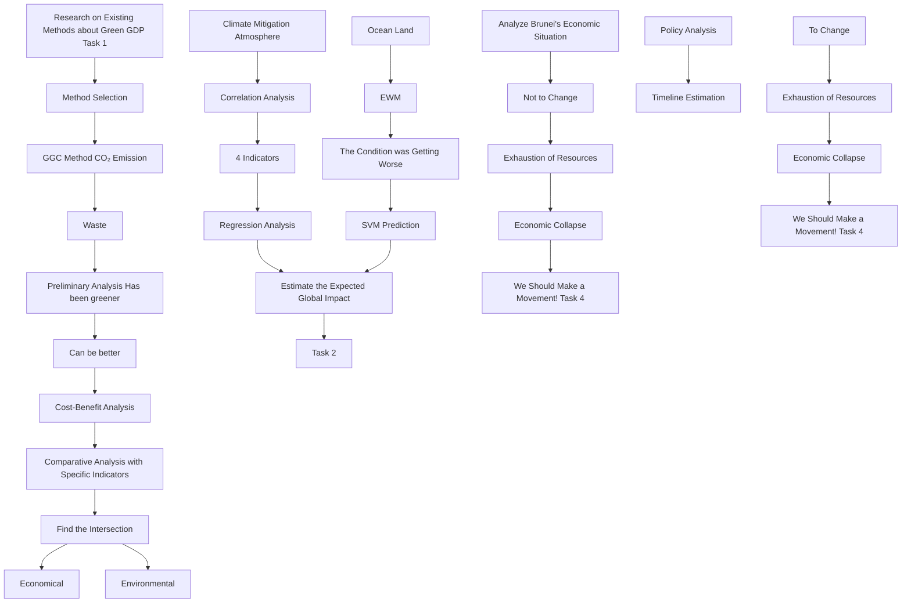
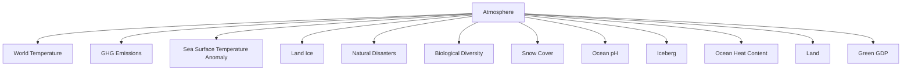
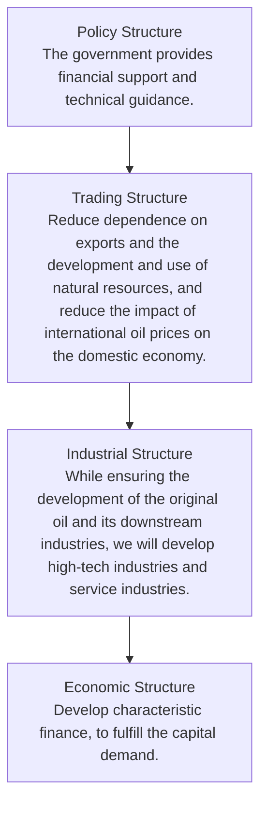

## Towards a Greener Climate -- Analysis Based on 4M System

With the continuous development of the world economy, human's exploitation of resources, and the gradual intensification of environmental damage, the global climate situation is becoming increasingly severe. So it is urgent to strike a balance between economic development and environmental resource protection. In order to evaluate the turnaround and global impact brought by using GGDP instead of GDP as an indicator to measure economic health, we established a 4M System: one Method, one Model, one Mould and one Movement.

For the Method, we read numerous literature on different calculation methods, from which we selected a GGDP Calculation Method that considered multiple factors such as resource consumption and emissions, based on which we conducted a preliminary analysis on 40 years' data of 160 countries in the world. The results show that the unhealthy share of GDP (defined as %DIF) in countries around the world has declined by 5% in the past 50 years. Meanwhile, even some of the countries that cause a lot of emissions and pollution can do better while maintaining economic growth.

For the Model, we developed the Climate Mitigation Impact Model, which includes 3 levels of indicators to describe the atmosphere, ocean and land conditions. Among them, Entropy Weight Method (EWM) was used to determine the weights of indicators. After that, we scored the past years and found a consistent decline from the 1970s to the present. Then, based on the results of correlation analysis and regression analysis, we found that the impact of %DIF on the world climate is up to 1/3 of climate change, and its reduction can improve environmental deterioration.

For the Mould, we first ran a Cost-benefit Analysis of the replacement and operated Ordinary Least Squares (OLS) regression, analyzing different impacts on people's livelihood between GDP and GGDP. The result indicates that the replacement is friendly to Gender Equality and Human Development, though a slightly increase on the Income Inequality. Then we considered the future. In terms of economy, we combined ARIMA, GM(1,1) and SVG to predict the future, which shows that world GDP and GGDP will fully recover in 2052 and 2055 respectively, with rapid growth after that. In terms of climate, the scores normalized by Logistic Function shows that after 2075, the climate score will increase again.

For the Movement, we selected Brunei for specific analysis, and predicted whether it should accept GGPT or not. We concluded that if Brunei did not carry out reform, it would face resource exhaustion and economic collapse; while after the reform, it would completely recover the economy by 2077. In addition, we have also made several targeted policy suggestions for Brunei's reform, including industrial structure, economic structure, trading structure, etc.

Finally, we arranged the above analysis into a one-page non-technical report to Brunei's leader, supporting Brunei's replacement of GDP with GGDP as the primary indicator of national economic health.

The sensitivity analysis at the end of the paper shows that no matter how large or small the short-term sacrifices countries make to push forward reforms, they will ultimately reap substantial benefits commensurate with the costs. At the end, we had a further discussion of this system, hoping that it can be more useful and leading us to a greener future.

Keywords: climate mitigation; Green GDP; regression analysis; ARIMA

## Contents

## 1 Introduction...

1.1 Problem Background . 3  
1.2 Restatement of the Problem  
1.3 Our Work.. /

## 2 Assumptions and Justifications............

## 3 Notations .....

## 4 Method: GGDP Calculation Method .

4.1 Review of Proposed Ways to Calculate GGDP F  
4.2 Our Selection 6  
4.3 Preliminary Application of the Calculation Method.

## 5 Model: Climate Mitigation Impact Model. ..8

5.1 Global Climate Assessment & Indicator Selection.. 8  
5.2 Weight Determination by EWM . .10  
5.3 Validation Assessment of the Scoring System ... 1

## 6 Mould: Econ-ecological Cost-benefit Analysis Mould.. .13

6.1 Discussing Costs and Benefits .. 13  
6.2 Analyze of Impact of the Switch by OLS . 14  
6.3 Finding the Intersection 15

## 7 Movement: GGDP as a Policy Shock in Brunei. .19

7.1 Analysis of Brunei’s Current Economic Structure.. .19  
7.2 Policy Making and its Difficulties . 19  
7.3 Prediction of Econ-ecological System Without the Switch .20  
7.4 Ideal Vision for Brunei’s Future.. .21

## 8 Sensitivity Analysis.. .22

## 9 Model Evaluation and Further Discussion.... ..22

9.1 Strengths .22  
9.2 Weaknesses . 23  
9.3 Further Discussion 23

## 10 Non-technical Report.... ...24

## References ... .25

## 1 Introduction

## 1.1 Problem Background

Gross Domestic Product, or GDP, is often used to measure a country's health and the growth rate of its economy. Higher GDP means better living standards, higher purchasing power and more lending opportunities for the country. For the sake of national economic health, governments are constantly striving for higher GDP. However, GDP only considers the output of goods and services, not the resources used to do so. In other words, it only takes into account economic progress rather than environmental damage and resource abuse.

Nowadays, many countries in the world are paying more and more attention to sustainable development, and coordinated development of economy and environment has been put on the agenda. Green GDP, or GGDP, has successfully incorporated resources and the environment into measures of the health of the nation's economy. If all governments agree to make GGDP a new goal for their own countries, the global climate crisis could be significantly alleviated, and we will enjoy a better ecological environment in the future. We pay attention not only to the pace, but also to the color of the economy.

natural_image

Panoramic cityscape at dusk with illuminated skyscrapers and a river in the distance (no visible text or signage)

Figure 1(a): The beautiful night view of New York

natural_image

Composite image showing industrial pipes, a rural scene with cattle, a city skyline, and a smokestack emitting vapor (no text or symbols)

Figure 1(b): The earth's serious climate crisis

## 1.2 Restatement of the Problem

Using GGDP as the primary measure of national economic health may have multiple impacts on national economies and the environment. In order to discuss these possible changes, we need to complete the following tasks in the context of the problem:

Task 1: Choose one of the GGDP calculation methods that have been developed so far and ensure that it has a measurable impact on climate change if it substitutes GDP.  
Task 2: Establish a model to estimate the global impact on climate mitigation when GGDP is used as a primary indicator of national economic health.  
Task 3: Based on the analysis of global impacts in Task 2, discuss whether the model proves that it is worthwhile to use GGDP as a substitute for GDP by comparison be tween the advantages of mitigating climate change and the possible disadvantages of trying to change the current situation.  
Task 4: According to the calculation method of GGDP proposed in Task 1 and the difference between it and the GDP calculation method, make a in-depth analysis of the influence on one country’s condition and behavior after GGDP come into use.  
− Task 5: Based on the analysis in Task 4, write a non-technical report to the country's

leaders on whether GGDP should replace GDP as the new measure of the country's economic health.

## 1.3 Our Work

Our work mainly includes the following aspects:

In Task 1, we did researches on a lot of literature on GGDP calculation methods and selected one that incorporated environmental health into economic assessment. A preliminary calculation followed the method and found that overall the world is becoming greener.

In Task 2, in order to establish a Climate Mitigation Impact Model, we selected part of indicators and used EWM to determine the weight, and then made SVM predictions. On the other hand, we conducted correlation analysis and regression analysis between the four selected indicators and GDP/GGDP. The combined results estimate the global impact of the change.

In Task 3, we first carried out Cost-Benifit Analysis of the reform, and then found the Intersection of economy and environment in the future through Comparative Analysis of specific indicators. The results suggest that the replacement of GDP with GGDP is worthwhile.

In Task 4, we analyze the economic and environmental conditions of Brunei by combining the above-mentioned model. If Brunei does not change, it will eventually face resource depletion and economic collapse. If Brunei actively pursues reforms, policy analysis and timeline estimates suggest that its economy will recover quickly and achieve sustainable growth, while the environment and resources will be protected. By contrast, we finally believe that Brunei should make a movement.

The figure below intuitively reflects our work:

flowchart

Figure 2: Flow chart of our work

## 2 Assumptions and Justifications

The real state of the economy is far more complex than what we will discuss below, so let's start by making some basic assumptions that will allow us to simplify our analysis as much as possible to arrive at factual and instructive results.

Assumption 1: In the future, the economy will proceed as normal, which means that there will be no big shocks to the world.

Justification: Uncertainties such as war or epidemics can make an economy hard to predict according to established models. At the same time, these negative shocks will cause economic volatility to increase dramatically, assuming that the world will not experience these events in the future.

C Assumption 2: In the future, there won't be some environmental event that dramatically affects the climate.

Justification: Chaos, the unpredictability of the natural world and the uncertainty of technological progress have an extremely serious effect on the world climate. But the probability of these things happening is very small, so we choose to ignore them.

Assumption 3: After the replacement, world leaders can change their economic and political goals and strive for them.

Justification: Only under this assumption can we determine the behavior of countries in the world after reform and make predictions for future economic and environmental conditions accordingly. Although there are many short-sighted or sophisticated leaders in the world, we don't consider them when discussing problems.

Assumption 4: Technology will continue to advance in the direction of our qualitative research.

Justification: This is the least of our worries, but worth mentioning. In fact, since the 20th century, the world has been undergoing a technological leap, from steam to electrical appliances to the information age, and the speed of technological development has far exceeded the expectations of scholars concerned.

## 3 Notations

The key mathematical notations used in this paper (mostly in the GGC Method) are listed in Table 1.

Table 1: Notations used in this paper

<table><tr><td>Symbol</td><td>Description</td><td>Unit</td></tr><tr><td>GDP</td><td>Gross Domestic Product</td><td>current US$</td></tr><tr><td>GGDP</td><td>Green GDP (Gross Domestic Product)</td><td>current US$</td></tr><tr><td> $KtCO_2$ </td><td>The amount of CO2 emitted by an economy in a year</td><td>kt</td></tr><tr><td>PCDM</td><td>The average volume-weighted price for carbon (in PPP)</td><td>US$/kt</td></tr><tr><td>Twaste</td><td>Total (commercial and industrial) waste</td><td>ton</td></tr><tr><td>Pelect</td><td>Price for 1 kWh of electrical energy</td><td>current US$</td></tr><tr><td>GNI</td><td>Gross National Income</td><td>current US$</td></tr><tr><td>%NRD</td><td>natural resources depletion % of GNI</td><td>%</td></tr></table>

## 4 Method: GGDP Calculation Method

## 4.1 Review of Proposed Ways to Calculate GGDP

Throughout the literature on green economy, we observe that the current GGDP calculation methods can be roughly divided into three categories. The first category is to revise the original GDP calculation methods, such as Global Green Economy Index(GGEI), Gross Ecosystem Product(GEP), Sustainable Economic Welfare Index, etc., which is characterized by subtracting part of the loss of environmental and resource factors on the basis of GDP. The second type is to directly introduce a brand new indicator to replace GDP to describe the economy. Typical indicators include Happiness Index and Human Development Index(HDI), which usually use some social methods to evaluate the economy. The third category does not change the method of calculating GDP itself, but supplements it by introducing other indicators, such as System of National Accounts(SNA), System of Environmental and Economic Accounting(SEEA) and National Accounting Matrix including Environmental Accounts(NAMEA).

## 4.2 Our Selection

In the first kind of calculation method mentioned above, we finally chose a method proposed by Stjepanović et al. The characteristic of this method is that it not only considers the quantitative component of the green economy, but also considers the opportunity cost as a qualitative component, and fully distinguishes the two calculations.[1] This method takes into account a number of key economic factors that are not reflected in traditional calculation methods, and the expression is as follows:

$$
G G D P = G D P - \left(K t C O _ {2} * P C D M\right) - \left(T w a s t e * 7 4 k W h ^ {*} * P e l e c t\right) - \left(\frac {G N I}{1 0 0} * \% N R D\right)
$$

⋇ 74kWh: Combustion (or recycling) of 1 ton of garbage can obtain 74kWh of electric energy on average.

The first subtraction represents the cost of carbon dioxide pollution measured by the carbon emissions multiply the market price of carbon; the second represents an opportunity cost, meaning the value of electricity that could have been generated per ton of waste; and the last represents the value of natural resources saved by the country as a percentage of national income. Compared with other calculation methods, this equation can measure the speed of a country's consumption of resources and waste discharge to the greatest extent, and it also retains the original GDP measurement to the greatest extent, reducing our calculation difficulty.[2]

It can be foreseen that if a country chooses GGDP calculated by above the method as the primary indicator to measure its economic health, then in order to achieve a higher GGDP, the government will strive to reduce carbon emissions and waste while pursuing economic growth, while at the same time protecting natural resources as much as possible. Policies to achieve these goals will directly or indirectly improve environmental health and have a positive impact on climate mitigation. This point will be further confirmed in the following discussion.

## 4.3 Preliminary Application of the Calculation Method

We preliminarily applied the selected calculation method to data from 160 countries and plotted Figure 3(a) and (b).[3] The variable in the figures is the proportion of the difference between GDP and GGDP of a country in GDP at a specific moment. This variable means the relative value of the environment and resources sacrificed by a country in the process of economic development, which is expressed as follows:

$$
\% D I F = \frac {| G D P - G G D P |}{G D P} \times 100
$$

heatmap

| Country | Value Range |
|---------|-------------|
| Africa | >20 (Red)   |
| South America | 10 - 20 (Pink) |
| Europe | 4 - 10 (Orange) |
| Asia | 2 - 4 (Green) |
| North America | 0 - 2 (Green) |
| Australia | 0 - 2 (Green) |
| Russia | 2 - 4 (Green) |
| Mexico | 4 - 10 (Orange) |
| Canada | 4 - 10 (Orange) |
| Brazil | 4 - 10 (Orange) |
| Argentina | 4 - 10 (Orange) |
| Colombia | 4 - 10 (Orange) |
| Peru | 4 - 10 (Orange) |
| Chile | 4 - 10 (Orange) |
| Ecuador | 4 - 10 (Orange) |
| Venezuela | 4 - 10 (Orange) |
| Oman | 4 - 10 (Orange) |
| Saudi Arabia | 4 - 10 (Orange) |
| Kuwait | 4 - 10 (Orange) |
| Bahrain | 4 - 10 (Orange) |
| United Kingdom | 4 - 10 (Orange) |
| Ireland | 4 - 10 (Orange) |
| France | 4 - 10 (Orange) |
| Germany | 4 - 10 (Orange) |
| Netherlands | 4 - 10 (Orange) |
| Italy | 4 - 10 (Orange) |
| Spain | 4 - 10 (Orange) |
| Portugal | 4 - 10 (Orange) |
| Greece | 4 - 10 (Orange) |
| Poland | 4 - 10 (Orange) |
| Hungary | 4 - 10 (Orange) |
| Romania | 4 - 10 (Orange) |
| Bulgaria | 4 - 10 (Orange) |
| Ukraine | 4 - 10 (Orange) |
| Kazakhstan | 4 - 10 (Orange) |
| Uzbekistan | 4 - 10 (Orange) |
| Turkmenistan | 4 - 10 (Orange) |
| Kyrgyzstan | 4 - 10 (Orange) |
| Tajikistan | 4 - 10 (Orange) |
| Mongolia | 4 - 10 (Orange) |
| Maldives | 4 - 10 (Orange) |
| Afghanistan | 4 - 10 (Orange) |
| Sudan | 4 - 10 (Orange) |
| Iraq | 4 - 10 (Orange) |
| Algeria | 4 - 10 (Orange) |
| Morocco | 4 - 10 (Orange) |
| Tunisia | 4 - 10 (Orange) |
| Jordan | 4 - 10 (Orange) |
| Lebanon | 4 - 10 (Orange) |
| Syria | 4 - 10 (Orange) |
| Yemen | 4 - 10 (Orange) |
| Oman | 4 - 10 (Orange) |
| Qatar | 4 - 10 (Orange) |
| Kuwait | 4 - 10 (Orange) |
| Bahrain | 4 - 10 (Orange) |
| Israel | 4 - 10 (Orange) |
| Lebanon | 4 - 10 (Orange) |
| Jordan | 4 - 10 (Orange) |
| Oman | 4 - 10 (Orange) |
| Qatar | 4 - 10 (Orange) |
| Israel | 4 - 10 (Orange) |
| Lebanon | 4 - 10 (Orange) |
| Jordan | 4 - 10 (Orange) |
| Oman | 4 - 10 (Orange) |
| Qatar | 4 - 10 (Orange) |
| Israel | 4 - 10 (Orange) |
| Lebanon | 4 - 10 ( Orange) |
| Jordan | 4 - 10 ( Orange) |
| Oman | 4 - 10 ( Orange) |
| Qatar | 4 - 10 ( Orange) |
| Israel | 4 - 10 ( Orange) |
| Lebanon | 4 - 10 ( Orange) |
| Jordan | 4 - 10 ( Orange) |
| Oman | 4 - 10 ( Orange) |
| Qatar | 4 - 10 ( Orange) |
| Israel | 4 - 10 ( Orange) |
| Lebanon | 4 - 10 ( Orange) |
| Jordan | 4 - 10 ( Orange) |
| Oman | 4 - <2 (Green) |
| Qatar | <2 (Green) |
| Israel | <2 (Green) |
| Lebanon | <2 (Green) |
| Jordan | <2 (Green) |
| Oman | <2 (Green) |
| Qatar | <2 (Green) |
| Israel | <2 (Green) |
| Lebanon | <2 (Green) |
| Jordan | <2 (Green) |
| Oman | <2 (Green) |
| Qatar | <2 (Green) |
| Israel | <2 (Green) |
| Lebanon | <2 (Green) |
| Jordan | <2 (Green) |
| Oman | <2 (Green) |
| Qatar |<2>

Fig. 3(a) the percentage in 1979

world map

| Country | Color |
|---|---|
| Africa | Red |
| Asia | Orange |
| Europe | Green |
| North America | Green |
| South America | Orange |
| Australia | Light Green |
| Central America | Orange |
| Middle East | Pink |
| Southeast Asia | Pink |
| South Asia | Pink |
| Oceania | Pink |
| Antarctica | Grey (not labeled) |

Fig. 3(b) the percentage in 2019  
Figure 3: Green GDP as a difference from GDP(%DIF)

From the figures, we can observe that the world is becoming "greener", which means that the calculation method we choose tells us that, on the whole, the countries in the world are doing less harm to the environment and sacrificing less resources in the course of development, in other words, unhealthy GDP is declining.

Figure 4 is another manifestation of the unhealthy GDP of the world in 2019. It is derived from the cluster analysis of the %DIF of each country and the GDP of that year. The resulting scatter chart shows the excellent performance of developed countries. This seems to indicate that greater political power and international influence can impact on the problems of environmental pollution and resources abuse, and thus have a greater say in environmental protection issues. At the same time, it makes us realize that higher GDP can be achieved even with less adverse environmental impact, that is to say, economic development does not necessarily sacrifice the environment and resources.

scatterplot

| GDP_Index | %DIF | Group |
| --------- | ---- | ----- |
| 20.00     | 19.0 | 2     |
| 21.00     | 18.0 | 2     |
| 22.00     | 20.0 | 2     |
| 23.00     | 14.0 | 2     |
| 24.00     | 16.0 | 2     |
| 25.00     | 16.0 | 2     |
| 26.00     | 10.0 | 1     |
| 27.00     | 5.0  | 1     |
| 28.00     | 3.0  | 1     |
| 29.00     | 1.0  | 1     |
| 30.00     | 1.0  | 1     |
| 31.00     | 1.0  | 1     |
| 22.00     | 13.0 | 3     |
| 23.00     | 12.0 | 3     |
| 24.00     | 15.0 | 3     |
| 25.00     | 16.0 | 3     |
| 26.00     | 5.0  | 3     |
| 27.00     | 3.0  | 3     |
| 28.00     | 1.0  | 3     |
| 29.00     | 1.0  | 3     |
| 30.00     | 1.0  | 3     |
| 31.00     | 1.0  | 3     |
| 23.00     | 12.0 | 3     |
| 24.00     | 13.0 | 3     |
| 25.00     | 14.0 | 3     |
| 26.00     | 8.0  | 3     |
| 27.00     | 5.0  | 3     |
| 28.00     | 3.0  | 3     |
| 29.00     | 1.0  | 3     |
| 30.00     | 1.0  | 3     |
| 31.00     | 1.0  | 3     |
| 24.50     | 16.5 | 3     |
| 25.50     | 16.5 | 3     |
| 26.50     | 8.5  | 3     |
| 27.50     | 5.5  | 3     |
| 28.50     | 3.5  | 3     |
| 29.50     | 1.5  | 3     |
| 30.50     | 1.5  | 3     |
| 31.50     | 1.5  | 3     |
| 25.5      | -    | -     |
| 26.5      | -    | -     |
| 27.5      | -    | -     |
| 28.5      | -    | -     |
| 29.5      | -    | -     |
| 30.5      | -    | -     |
| 31.5      | -    | -     |
| 26.5      | -    | -     |
| 27.5      | -    | -     |
| 28.5      | -    | -     |
| 29.5      | -    | -     |
| 30.5      | -    | -     |
| 31.5      | -    | -     |
| 27.5      | -    | -     |
| 28.5      | -    | -     |
| 29.5      | -    | -     |
| 30.5      | -    | -     |
| 31.5      | -    | -     |
| 28.5      | -    | -     |
| 29.5      | -    | -     |
| 30.5      | -    | -     |
| 31.5      | -    | -     |
| 29.5      | -    | -     |
| 30.5      | -    | -     |
| 31.5      | -    | -     |
| 32.5      | -    | -     |
| 29.5      | -    | -     |
| 30.5      | -    | -     |
| 31.5      | -    | -     |
| 32.5      | -    | -     |
| 31.5      | -    | -     |
| 32.5      | -    | -     |
| 31       | -    | -     |
| 32       | -    | -     |
| 33       | -    | -     |
| 34       | -    | -     |
| 35       | -    | -     |
| 36       | -    | -     |
| 37       | -    | -     |
| 38       | -    | -     |
| 39       | -    | -     |
| 40       | -    | -     |
| 41       | -    | -     |
| 42       | -    | -     |
| 43       | -    | -     |
| 44       | -    | -     |
| 45       | -    | -     |
| 46       | -    | -     |
| 47       | -    | -     |
| 48       | -    | -     |
| 49       | -    | -     |
| 50       | -    | -     |
| <22       >

Figure 4: Diagram for statistics of GDP Index and %DIF of each country

## 5 Model: Climate Mitigation Impact Model

## 5.1 Global Climate Assessment & Indicator Selection

## 5.1.1 Global Climate Trend

Climate change refers to statistically significant changes and deviations in the average state and dispersion of climate, which roughly includes three aspects, namely acid rain, ozone depletion and global warming. It is the most urgent problem facing all mankind at present and is related to the future of mankind.

Climate change within the normal range is an evolutionary process of nature itself. However, some human factors may cause the climate to accelerate the evolution of the adverse direction. Since the Industrial Revolution, with human activities, especially the increasing consumption of fossil fuels (coal, petroleum, etc.) and the massive destruction of forest vegetation, man-made emissions of carbon dioxide and other greenhouse gases have been on the rise, and research shows that these greenhouse gases are the main culprits of climate warming. Before 1750, atmospheric carbon dioxide level stood at about 280 ppm, but scientific observations since the turn of the century show that they have been increasing at a rate of about 1.8 ppm per year and now stand at nearly 360 ppm. Projections suggest that by the middle of the next century, carbon dioxide level will reach 560 ppm, leading to a global average temperature rise of between 1.5℃ and 4℃.

flowchart

Figure 5: The indicators of Climate Mitigation Impact Model

No one knows how long climate change will be still safe, but we all know how much climate change is wreaking havoc on people and global ecosystems:

Coastal lowlands are invaded by seawater as sea levels rise, land deteriorates and ports are damaged.

The pH of ocean water around the world is falling, making it difficult for it to remain as weakly alkaline as it should be, affecting the functioning of the entire marine ecosystem.  
The rapid melting of glaciers in the Himalayas, the Tibetan Plateau and other Arctic and Antarctic glaciers has left hundreds of millions of people facing water shortages and the threat of floods and droughts.  
Plant growth cycles are altered by carbon dioxide, causing large-scale agricultural disasters and damage to ecosystems, thus reducing food production and starving arid regions.  
High temperatures put a burden on the human circulatory system, which increases the risk and the death rate of infectious diseases such as malaria.

How to slow down climate change has long been a common problem faced by all countries in the world. In order to better measure the climate situation, we selected 3 first-level indicators and 11 second-level indicators, and showed them in Figure 5.

## 5.1.2 Indicator Selection of CMI Model

To establish our CMI model, we need to choose indicators that represent the climate condition. Through the discussion above, we finally conclude that the analysis can be carried out by measuring three major factors: the condition of the atmosphere, the ocean and the land. There are many inferior indicators under each superior indicator. Our model has considered totally 21 inferior indicators, as shown in Table 2.

Table 2: Indictor Table in CMI model

<table><tr><td>level 1</td><td colspan="2">level 2</td><td colspan="2">level 3</td><td>Type</td></tr><tr><td rowspan="4">Atmosphere</td><td rowspan="3">GHGE</td><td rowspan="3">GHG Emissions</td><td>CO2</td><td>yearly CO2 concentrations</td><td>-</td></tr><tr><td>CH4</td><td>yearly CH4 concentrations</td><td>-</td></tr><tr><td>N2O</td><td>yearly N2O concentrations</td><td>-</td></tr><tr><td>WT</td><td>World Temperature</td><td>WTA</td><td>world temperature anomaly</td><td>*</td></tr><tr><td rowspan="5">Land</td><td rowspan="2">LI</td><td rowspan="2">Land Ice</td><td>ALIM</td><td>Antarctica land ice mass</td><td>**</td></tr><tr><td>GLIM</td><td>Greenland land ice mass</td><td>**</td></tr><tr><td>BD</td><td>Biological Diversity</td><td>LPIA</td><td>living planet index average</td><td>**</td></tr><tr><td>ND</td><td>Natural Disasters</td><td>NRND</td><td>Number of reported natural disasters</td><td>*</td></tr><tr><td>SC</td><td>Snow Cover</td><td>SCNA</td><td>snow cover north America</td><td>*</td></tr><tr><td rowspan="6">Ocean</td><td>pH</td><td>Ocean pH</td><td>OPYA</td><td>ocean pH yearly average</td><td>*</td></tr><tr><td rowspan="2">OHC</td><td rowspan="2">Ocean Heat Content</td><td>2000m OHC</td><td>2000m ocean heat content</td><td>*</td></tr><tr><td>700m OHC</td><td>700m ocean heat content</td><td>*</td></tr><tr><td>SSTA</td><td>Sea Surface Temperature Anomaly</td><td>ASSTA</td><td>annual sea surface temperature anomaly</td><td>*</td></tr><tr><td rowspan="2">SI</td><td rowspan="2">Sea Ice</td><td>SIF_Ar</td><td>Arctic sea ice February</td><td>*</td></tr><tr><td>SIS_ArSIF_An</td><td>Arctic sea ice SeptemberAntarctic sea ice February</td><td>**</td></tr><tr><td rowspan="5"></td><td></td><td></td><td>SIS_An</td><td>Antarctic sea ice September</td><td>*</td></tr><tr><td rowspan="4">IB</td><td rowspan="4">Iceberg</td><td>LCGMB</td><td>Lemon Creek Glacier mass balance</td><td>+</td></tr><tr><td>GIMC</td><td>Greenland ice mass change</td><td>+</td></tr><tr><td>AIMC</td><td>Antarctica ice mass change</td><td>+</td></tr><tr><td>GGMB</td><td>Gulkana Glacier mass balance</td><td>+</td></tr><tr><td colspan="6">Note: +: Benefit Attributes -: Cost Attributes **: Interval Attributes *: Optimal Attributes</td></tr></table>

After identifying the variables and setting up the index framework, we collect data through authorization data, including National Aeronautics and Space Administration(NASA) and National Oceanic and Atmospheric Administration(NOAA).

## 5.2 Weight Determination by EWM

## 5.2.1 Data Normalization

We normalize the collected data and process the 21 inferior indicators, which can be divided into three categories: benefit attributes, cost attributes and interval attributes:

Benefit Attributes the larger the better.

$$
\hat {x} _ {i j} = \frac {x _ {i j} - \min \{x _ {i} \}}{\max \{x _ {i} \} - \min \{x _ {i} \}}
$$

Cost Attributes the smaller the better.

$$
\hat {x} _ {i j} = \frac {\max \{x _ {i} \} - x _ {i j}}{\max \{x _ {i} \} - \min \{x _ {i} \}}
$$

Interval Attributes whose optimal value lies in a certain interval [ a , b ].

$$
M = \max \left\{a - \min \{x _ {i} \}, \max \{x _ {i} \} - b \right\}
$$

$$
\hat {x} _ {i j} = \left\{ \begin{array}{l l} 1 - \frac {a - x _ {i j}}{M}, & x _ {i j} <   a \\ 1, & a \leq x _ {i j} \leq b \\ 1 - \frac {x _ {i j} - b}{M}, & x _ {i j} > b \end{array} \right.
$$

Optimal Attributes whose optimal value is a certain value a.

$$
M = \max \left\{a - \min \{x _ {i} \}, \max \{x _ {i} \} - a \right\}
$$

$$
\hat {x} _ {i j} = \left\{ \begin{array}{l l} 1 - \frac {a - x _ {i j}}{M}, & x _ {i j} <   a \\ 1 \qquad , & x _ {i j} = a \\ 1 - \frac {x _ {i j} - a}{M}, & x _ {i j} > a \end{array} \right.
$$

The classification of indicators is shown in Figure 4 above.

## 5.2.2 Weights Calculation – Entropy Weight Method(EWM)

To make the data further processed, we try to evaluate these indicators based on a mathematical model of Entropy Weight Method(EWM). According to the definition of information entropy, the entropy value can be used to judge the degree of dispersion of an indicator. The smaller the information entropy value is, the greater the degree of dispersion of the indicator, and the greater the influence, or weight, of the indicator on the comprehensive evaluation.

Therefore, the weight of each indicator can be calculated by using the tool of information entropy to provide a basis for comprehensive evaluation.

Given that there are totally m countries, we take the following steps to calculate the entropy, then weight, of indicators.

Step 1: Standardizing values.

$$
p _ {i j} = \frac {\hat {x} _ {i j}}{\sum_ {i = 1} ^ {m} \hat {x} _ {i j}}
$$

Step 2: Getting the information entropy.

$$
e _ {j} = - \frac {\sum_ {i = 1} ^ {m} p _ {i j} \ln p _ {i j}}{\ln m}
$$

Step 3: Getting the weight of the $j _ { t h }$ indicators.

$$
w _ {i} = \frac {1 - e _ {j}}{\sum_ {j = 1} (1 - e _ {j})}
$$

After analyzing the existing data, we get the weight table. In terms of space, we will no longer show specific data for 21 three-level indicators. We drew it on the sunrise chart (Figure 6). The size of the angle included in the sunrise chart is the weight of each indicator.

pie chart

| Category | Value |
|---|---|
| GIMC | 100 |
| AIMC | 95 |
| GGMB | 90 |
| LCGMB | 85 |
| SIS_Ar | 80 |
| SI | 75 |
| SIF_Ar | 70 |
| SIF_An | 65 |
| SIS_An | 60 |
| OHC | 55 |
| 2000m OHC | 50 |
| 700m OHC | 45 |
| PH | 40 |
| OPYA | 35 |
| SSITA | 30 |
| ASNSST | 25 |
| ALIM | 20 |
| GLIM | 15 |
| SCNNA | 10 |
| BD | 5 |
| NRND | 0 |
| CO2 | 0 |
| N2O | 0 |
| CH4 | 0 |
| WTA | 0 |
| Amo/sphere | 0 |
| Ocean | 100 |

Figure 6: Weight Table

line chart

| Year | Score |
|------|-------|
| 1952 | 62    |
| 1960 | 70    |
| 1964 | 75    |
| 1972 | 85    |
| 1976 | 90    |
| 1980 | 92    |
| 1984 | 93    |
| 1988 | 90    |
| 1992 | 88    |
| 1996 | 85    |
| 2000 | 80    |
| 2004 | 75    |
| 2008 | 70    |
| 2012 | 65    |
| 2016 | 55    |
| 2020 | 45    |

Figure 7: Climate score and trendline over the years

Based on the entropy and weight of indicators calculated above, we get the evaluation value to score our samples:

$$
S = 1 0 0 \sum_ {j} p _ {i j} w _ {j}
$$

## 5.3 Validation Assessment of the Scoring System

## 5.3.1 Scoring from 1952 to 2021

We use the evaluation value calculated above to score global climate conditions from 1952 to 2021. The results are shown in Figure 7 above.[4] From the figure, we observe that scores with year change showed an overall upward trend before the 1990s, and a downward trend thereafter. That is, global climate conditions were getting better before the 1990s, but have been getting worse since then until now. What’s more, the current climate condition has been worse

than it was in the 1960s.

## 5.3.2 Correlation Analysis of Secondary Indicators

It seems a little superfluous to analyze all the indicators, therefore here we analysed the correlation of the 11 secondary indicators we selected, and Figure 8 shows the correlation matrix as the result.

bubble chart

| Variable | GHGE | WT | pH | OHC | SSTA | SI | IB | LI | BD | ND | SC |
|---|---|---|---|---|---|---|---|---|---|---|---|
| GHGE | 0.84 | 0.58 | 0.58 | 0.93 | 0.74 | -0.69 | 0.36 | 0.68 | 0.50 | -0.83 | -0.59 |
| WT | 0.43 | 0.58 | 0.58 | 0.93 | 0.74 | -0.69 | 0.36 | 0.68 | 0.50 | -0.83 | -0.59 |
| pH | 0.50 | 0.63 | 0.63 | 0.93 | 0.74 | -0.69 | 0.36 | 0.68 | 0.50 | -0.83 | -0.59 |
| OHC | 0.89 | 0.87 | 0.87 | 0.67 | 0.74 | -0.69 | 0.36 | 0.68 | 0.50 | -0.83 | -0.59 |
| SSTA | -0.82 | -0.74 | -0.74 | -0.32 | -0.36 | -0.69 | 0.36 | 0.68 | 0.50 | -0.83 | -0.59 |
| SI | 0.12 | 0.26 | 0.26 | 0.87 | 0.80 | -0.36 | 0.36 | 0.68 | 0.50 | -0.83 | -0.59 |
| IB | -0.83 | -0.59 | -0.59 | 0.12 | 0.12 | -0.36 | 0.36 | 0.68 | 0.50 | -0.83 | -0.59 |
| LI | 0.98 | 0.84 | 0.84 | 0.46 | 0.51 | -0.58 | 0.87 | 0.68 | 0.50 | -0.83 | -0.59 |
| BD | 0.94 | 0.82 | 0.82 | 0.42 | 0.48 | -0.75 | 0.84 | -0.75 | -0.13 | -0.85 | -0.59 |
| ND | -0.51 | -0.51 | -0.51 | -0.32 | -0.32 | -0.32 | 0.47 | 0.20 | 0.52 | -0.44 | -0.44 |
| SC | -0.51 | -0.51 | -0.51 | -0.32 | -0.32 | -0.32 | 0.47 | 0.20 | 0.52 | -0.44 | -0.44 |
The chart displays a heatmap of correlation coefficients between variables for each variable, with values ranging from approximately -1 to +1, and the color scale indicates the strength of correlation (darker = stronger, lighter = weaker). The row labels are explicitly in English, and the column labels are explicitly labeled in English, so they do not correspond to any other data series in this image.

Figure 8: Variable correlation matrix

## 5.3.3 Regression Analysis

In our evaluation system, the change of one indicator may lead to the change of other indicators related to it. Therefore, in order to ensure the science and rationality of our evaluation system, we refer to Figure 8 to obtain correlation among indicators and select indicators with strong correlation for multiple linear regression, so as to establish the linear relationship between these indicators, thus quantifying its impact in the real world.

Based on this method, we finally decided to select GHGE, WT, pH and SSTA for multiple linear regression analysis. Meanwhile, we added sea level to our regression analysis. And their linear relationship between them, GDP and %DIF can be described by the following equations:

$$
G H G E = \beta_ {1 _ {G H G E}} G D P + \beta_ {2 _ {G H G E}} \% D I F + \epsilon_ {G H G E}
$$

$$
W T = \beta_ {1 _ {W T}} G D P + \beta_ {2 _ {W T}} \% D I F + \epsilon_ {W T}
$$

$$
pH = \beta_{1_{pH}}GDP + \beta_{2_{pH}}\% DIF + \epsilon_{pH}
$$

$$
S S T A = \beta_ {1 _ {S S T A}} G D P + \beta_ {2 _ {S S T A}} \% D I F + \epsilon_ {S S T A}
$$

We conducted multiple regression analysis on the above five data, and the results are shown in Table 3.

Table 3: Multiple regression analysis results of each variable

<table><tr><td>variable</td><td> $\widehat{\beta_1}$ </td><td> $\widehat{\beta_2}$ </td><td> $\epsilon$ </td><td>R-Squared</td><td>Prob&gt;F</td></tr><tr><td>GHGE</td><td>-5.87E-15</td><td>-0.0543549</td><td>0.4693056</td><td>0.9843</td><td>0.0000</td></tr><tr><td>WT</td><td>6.95E-15</td><td>0.00685598</td><td>0.4004318</td><td>0.9690</td><td>0.0000</td></tr><tr><td>pH</td><td>-1.18E-14</td><td>0.0504541</td><td>1.343313</td><td>0.9336</td><td>0.0000</td></tr><tr><td>SSTA</td><td>7.84E-15</td><td>0.0788071</td><td>0.25443</td><td>0.8911</td><td>0.0000</td></tr><tr><td>Sea Level</td><td>1.34E-12</td><td>1.037901</td><td>59.87316</td><td>0.9822</td><td>0.0000</td></tr></table>

We compared these data with real world data. According to the relevant data of the United Nations Environment Programme, the global temperature rises by about 0.2℃ every year, and the sea level rises by about 3.1 mm per year, while coefficients of % ????, the proportion of unhealthy GDP to GDP, are about 1/3 of the original data, which also means that the impact of % ???? on the world climate is up to 1/3 of climate change.

From these equations, we can conclude that when the % ???? falls, that is, when the world sacrifices less environment and resources in pursuit of economic development, the increase in greenhouse gases, the rise in land and sea surface temperatures, the decline in the pH of seawater, and the rise in sea level will all be significantly slowed down.

## 6 Mould: Econ-ecological Cost-benefit Analysis Mould

## 6.1 Discussing Costs and Benefits

Having discussed appropriate GGDP calculations and built models to measure global impact in previous tasks, it is now necessary to further explore the feasibility of using GGDP instead of GDP as the primary indicator of economic health.

In fact, not only the transition from GDP to GGDP, but also the progress of any big reform will face many obstacles, which is inevitable. In 1944, GDP was officially recognized as a statistical tool of a country's economic aggregate in the Bretton Woods System. Since then, all countries and regions in the world have focused on the goal of increasing GDP in their political targets, policy formulation and macro industrial layout. It is fair to say that the development of each country has been deeply marked by GDP. Therefore, to complete this transition, we must face resistance and pay a price. Reform must mean some giving up, but we should also see the benefits it brings us.

## 6.1.1 Costs Discussion

Intergenerational Equity: On the one hand, the impact of climate change and green house gas emission reduction will span centuries or even millennia, so it involves the trade-off between the welfare of current and future generations, namely intergenerational equity. Some argue, on ethical grounds, for aggressive climate policy and deep, immediate cuts in emissions. Others emphasize market efficiency and advocate incremental action, slowly reducing emissions in the short term. The views of the two groups are so sharply opposed that it is difficult to reach a consensus. If we use GGDP as a measure of economic performance, then countries will have to use less resources in order to improve GGDP. This will be difficult for some policy makers who are shortsighted and unwilling to sacrifice short-term achievements, even if it brings more social welfare to future generations in the long run.

Regional Equity: On the other hand, dealing with climate change has a strong externality and requires the cooperation of all countries in the world, which involves the sharing of responsibilities among countries in dealing with climate change, namely regional equity. If we take the maximization of global social welfare as our goal, then we need to carefully consider the weight of different countries. For example, for some underdeveloped regions, we should give priority to supporting their economic development and relax some restrictions. At the same time, there may be some transfer mechanisms, such as interregional technology transfer, capital transfer and emission quota purchase, when determining emission reduction targets.

## 6.1.2 Benefits Discussion

Sustainable Development: Since the calculation of GGDP requires the loss of environment and resources to be subtracted from GDP, in order to pursue high GGDP, governments of all countries will inevitably devote themselves to reducing industries with high energy consumption, pollution and emissions, and at the same time pay attention to saving natural resources during development, which is exactly in line with the basic concept of sustainable development.

Economic Growth: Unlike other indicators that describe regional development entirely in terms of environmental conditions, GGDP itself still takes GDP as the main body, which guarantees GDP growth. In other words, GGDP itself, born in the context of promoting environmental protection, is highly consistent with GDP, which measures economic development and growth.

Moderate Change: The GGDP itself is still centered on economic development, so it only requires some national adjustments to achieve sustainable development. As a result, reforming countries need to adjust only a small portion of their industries while retaining most of their old ones. Such a modest change would prevent the economy from experiencing drastic fluctuations, while ensuring social stability.

## 6.2 Analyze of Impact of the Switch by OLS

## 6.2.1 Data Selection

To further prove that replacing GDP with GGDP is worthwhile, we selected the following four indicators to comprehensively measure social welfare and human happiness from multiple perspectives:

− Gender Inequality Index(GII): This indicator reflects inequality between men and women on three dimensions: reproductive health, empowerment and the labor market. The greater the index, the greater the difference between men's and women's positions in society. This will not only hinder social progress to a certain extent, but may also cause serious gender conflicts.

Income Inequality(II): This reduces total social consumption and stifles economic growth. At the same time, inequality leads to rent-seeking behavior, which reduces the efficiency of resource allocation and ultimately leads to inequality of opportunities. In fact, historical data show that high income inequality is often accompanied by the potential risk of a financial crisis.

Human Development Index(HDI): Based on life expectancy, education levels and quality of life, the index provides a relatively comprehensive assessment of state and social welfare and can be applied to different groups. A higher HDI means a higher level of humanity and social progress.

Total Disease Burden(TDB): This measures the loss of human health and includes the burden of different diseases on different populations in different countries around the world. A higher TDB quantifies more years of life impaired by early death, illness and disability, and the corresponding loss of more human potential.

In fact, we initially selected a series of indicators that can measure social welfare from different perspectives, and conducted correlation coefficient and significance analysis on them. Finally, we found that the correlation coefficients of the above four indicators were all greater than 0.8 and the significance level was extremely low, which means that these indicators are not only highly reliable, but also strongly correlated with GDP and GGDP. Therefore, we finally decided to use these indicators and GDP and GGDP respectively for Ordinary Least Squares(OLS) regression analysis.[5]

## 6.2.2 Explanation of the Results

The result of the OLS regression analysis is shown by the following group of matrix:

$$
\left( \begin{array}{c} G I I \\ I I \\ H D I \\ T D B \end{array} \right) = \left( \begin{array}{c c} - 0. 0 0 1 9 & 0. 6 2 2 9 \\ - \mathbf {0 . 1 8 6 1} & 3 4. 9 7 4 9 \\ 0. 0 0 2 0 & 0. 5 7 0 4 \\ 5. 9 0 0 6 \mathrm{E} 5 & 2. 9 4 6 6 \mathrm{E} 8 \end{array} \right) \binom {G D P} {c o n s t} = \left( \begin{array}{c c} - \mathbf {0 . 0 0 1 9} & 0. 6 2 0 9 \\ - 0. 1 9 0 1 & 3 4. 9 8 8 0 \\ \mathbf {0 . 0 0 2 0} & 0. 5 7 0 3 \\ \mathbf {5 . 7 3 1 3 E} \mathbf {5} & 2. 9 5 2 9 \mathrm{E} \mathbf {8} \end{array} \right) \binom {G G D P} {c o n s t}
$$

Among them, better indicators of social welfare and human happiness have been marked. We found that when GDP was replaced by GGDP, GI and TDB decreased and HDI increased, which reflected that social welfare and human happiness were improved due to the implemen tation of GGDP, which were all attributed to the improvement of environment, resource conservation and mitigation of climate problems. It is worth noting that income inequality has slightly increased. This is because the governments of various countries have adjusted their industrial structure in pursuit of GGDP, which has led to changes in existing jobs in society. For example, some enterprises that rely on exploiting natural resources or emitting pollution have ceased operation, resulting in short-term unemployment for some workers. This is a reasonable cost of the process of change, and generally speaking, it is worthwhile to carry out the switch.

## 6.3 Finding the Intersection

For this reform, we've been talking about the past and the present. Now let's talk about the future.

## 6.3.1 Future Impact on Economy

In order to facilitate the analysis of future economic development, we rewrote the calculation method of GGDP:

$$
G G D P = \frac {E C}{E C P G D P} - \% D I F \times G D P
$$

In the formula, EC represents energy consumption, ECPGDP represents energy consumed for per unit of GDP (both measured in petroleum), this division represents GDP, and %DIF multiplies GDP represents the unhealthy part of GDP.

For EC and ECPGDP in the formula, we consulted historical data and made regression analysis to show their trends. Based on the calculation method of GGDP above, we now analyze what changes will the implementation of reform bring to the future economy:

1. EC. Governments will require companies to reduce emissions from production, or even shut down some of the biggest polluters, while promoting recycling, thus cut down the consumption of energy. From a macro perspective, we assume that after replacing GDP with GGDP, the annual energy consumption, namely EC, is less than before.  
2. ECPGDP. In order to increase the efficiency of energy consumption, more research funds will be used to develop new ways of energy use, such as promoting the development and application of clean energy and changing traditional energy-consuming processes. It is worth noting that research tends to lag. With reference to He et al., we believe that the revolution initiated at this time will not see a significant increase in the efficiency of energy consumption until 3 years later, and ECPGDP at this time will increase compared to the estimated value without reform.  
3. Other indicators mentioned in the previous calculation method. For example, carbon dioxide and waste emissions will be reduced, and more natural resources will be protected. These are, in fact, contributions to the various policies enacted to lower the %DIF, so subsequent discussions of future economic changes will not repeat these items.

We performed OLS regression analysis on the logarithm and time of the negative number of %DIF, and the significance level( ???? > ) was 0.0146. It is clear that we can accept the hypothesis that ln(-%DIF) is linearly dependent on the year. So we have:

$$
\% DIF = e ^ {a} e ^ {b t}
$$

Here is the year 1980, and the result of the regression is that ， -0.0127.

Finally, in order to predict the future EC and ECPGDP in the case of no change, we did OLS on both of them, and the specific results were as follows:

<table><tr><td></td><td> $\hat{a}$ </td><td> $\hat{b}$ </td><td>R-Squared</td><td>Prob&gt;F</td></tr><tr><td>ln(EC)</td><td>5.4832</td><td>-0.0192</td><td>0.9563</td><td>0.0000</td></tr><tr><td>ln(ECPGDP)</td><td>34.5717</td><td>0.0509</td><td>0.9365</td><td>0.0000</td></tr></table>

$$
\widehat {\ln (E C)} = 5. 4 8 3 2 - 0. 0 1 9 2 t
$$

$$
\ln \left(\widehat {E C P G D P}\right) = 3 4. 5 7 1 7 + 0. 0 5 0 9 t
$$

Based on the above analysis, we can write the estimated value of GGDP in the next few years:

$$
G G D P _ {e s t} = \left\{ \begin{array}{c} E C P G D P _ {e s t} \times E C _ {e s t} \times (1 - \delta) \times \big (1 - \% D I F _ {C h a n g e d} \big), \mathrm{in3years} \\ E C P G D P _ {e s t} \times (1 + \delta) \times E C _ {e s t} \times (1 - \delta) \times \big (1 - \% D I F _ {C h a n g e d} \big), \mathrm{after3years} \end{array} \right.
$$

And, of course, GDP is the part of the equation above minus the last term. At the same time, we have to predict the future change of GDP and GGDP, assuming no reform. In this situation, the predicted value of GGDP is:

$$
G G D P _ {e s t} = E C P G D P _ {e s t} \times E C _ {e s t} \times \left(1 - \% D I F _ {U n c h a n g e d}\right)
$$

We assume $\delta = 5 \%$ to predict the data for the next 80 years, and the calculated results are shown in the Figure 9.

line chart

| Year | GDP Unchanged | GGDP Unchanged | GDP Changed | GGDP Changed |
|------|---------------|----------------|-------------|--------------|
| 1970 |               |                |             |              |
| 2000 |               |                |             |              |
| 2005 |               |                |             |              |
| 2010 |               |                |             |              |
| 2015 |               |                |             |              |
| 2020 |               |                |             |              |
| 2023 |               |                |             |              |
| 2025 |               |                |             |              |
| 2030 |               |                |             |              |
| 2035 |               |                |             |              |
| 2040 |               |                |             |              |
| 2045 |               |                |             |              |
| 2050 |               |                |             |              |
| 2055 |               |                |             |              |
| 2060 |               |                |             |              |
| 2065 |               |                |             |              |
| 2070 |               |                |             |              |
| 2075 |               |                |             |              |
| 2080 |               |                |             |              |
| 2085 |               |                |             |              |
| 2090 |               |                |             |              |
| 2095 |               |                |             |              |
| 2100 |               |                |             |              |

Figure 9: Prediction of future GDP in two cases

heatmap

| Region         | Value |
| -------------- | ----- |
| Northern Europe| 100   |
| Western Europe | 80    |
| Eastern Europe | 70    |
| Southern Europe| 60    |
| Central Europe | 50    |
| Middle East    | 40    |
| North Africa   | 30    |
| South Africa   | 20    |
| Southeast Asia | 10    |
| Australia      | 5     |
| Antarctica     | 1     |

Figure 10: Recovery time of countries in the world

For the world, because the %DIF is low (it has been below 2% in recent decades), the curve of GDP and GGDP almost coincides. However, the curve after the implementation of the policy of replacing GDP with GGDP is quite different from the original curve. In the short term, the ECPGDP did not decrease due to the sharp decline in production capacity, and GGDP and GDP even experienced a decline (about 6 years back to the level). Thereafter, due to the decline in ECPGDP and the accelerated decline in %DIF, GDP accelerated and exceeded the predicted value in 2052 and 2055 respectively.

Of course, the economic conditions of countries around the world are very different, and the transition time of developed and developing countries cannot be generalized. We also forecast the position of "Intersection" of countries in the world based on their Resource Dependence Rates. The predicted results are shown in Figure 10 above. Obviously, some developed countries in Europe and the United States, which are less dependent on resources and have better financial conditions, can quickly make the transition in this world change. However, some countries in Africa and Southeast Asia have a relatively backward level of productivity and cannot develop non-industrial economy relatively quickly, which requires a longer transition time. In any case, fortunately, the Intersection of all countries in the future has occurred, which means that they have recovered and will usher in better development.

## 6.3.2 Future Impact on Climate

Indeed, we can see that the implementation of the reform has a profound impact on future economic development, but at the same time, we should pay more attention to the future environment and climate change. In 5.3, we specifically discussed the correlation between GGDP and various environmental factors. Now, we will use the prediction of future GGDP to score the future climate.

First, we predict the score of future climates, which is more difficult to predict than the economy. Therefore, we use Autoregressive Integrated Moving Average (ARIMA) time series prediction model, Gray Forecast Model GM(1,1) and Support Vector Machine (SVM) to predict the future. The prediction results are shown in Figure 11(a). Not surprisingly, because of the rapid decline in climate scores in recent years, ARIMA and GM give negative results in

2038 and 2080, respectively, which does not fit our definition of a climate score. Logistic Function is mainly used to normalize indexes without upper and lower limits. For the specific context in which our climate score is calculated, when raw data is infinity, the normalized indicator should be 100, and when the original index is minus infinity, the normalized index should be 0. For data close to the limit, its growth rate should slow. And that's what we're dealing with. For these reasons, we choose Logistic Function as our normalized function:

$$
y = \frac {1}{1 + \exp (- b (x - x _ {0}))}
$$

Where is the normalized result, is the raw data, $x _ { 0 }$ is the median value of the index we get, and ???? is a variable used to determine the speed of the value approaching 0 points.

line chart

| Year | GM(1,1) | SVG | ARIMA |
|------|---------|-----|-------|
| 1979 | 100     | 100 | 100   |
| 1986 | 95      | 95  | 95    |
| 1993 | 90      | 90  | 90    |
| 2000 | 85      | 85  | 85    |
| 2007 | 80      | 80  | 80    |
| 2014 | 75      | 75  | 75    |
| 2021 | 70      | 70  | 70    |
| 2028 | 65      | 65  | 65    |
| 2035 | 60      | 60  | 60    |
| 2042 | 55      | 55  | 55    |
| 2049 | 50      | 50  | 50    |
| 2056 | 45      | 45  | 45    |
| 2063 | 40      | 40  | 40    |
| 2070 | 35      | 35  | 35    |
| 2077 | 30      | 30  | 30    |
| 2084 | 25      | 25  | 25    |
| 2091 | 20      | 20  | 20    |
| 2098 | 15      | 15  | 15    |

Fig. 11(a): Before normalized

line chart

| Year | ARIMA | GM(1,1) | SVG |
|------|-------|---------|-----|
| 1979 | 90    | 90      | 90  |
| 1986 | 85    | 88      | 88  |
| 1993 | 88    | 85      | 85  |
| 2000 | 82    | 80      | 80  |
| 2007 | 75    | 75      | 75  |
| 2014 | 65    | 65      | 65  |
| 2021 | 55    | 55      | 55  |
| 2028 | 40    | 45      | 45  |
| 2035 | 20    | 35      | 35  |
| 2042 | 5     | 25      | 25  |
| 2049 | 0     | 15      | 15  |
| 2056 | 0     | 10      | 10  |
| 2063 | 0     | 5       | 5   |
| 2070 | 0     | 3       | 3   |
| 2077 | 0     | 2       | 2   |
| 2084 | 0     | 1       | 1   |
| 2091 | 0     | 0.5     | 0.5 |
| 2098 | 0     | 0.2     | 0.2 |
| 2104 | 0     | 0.1     | 0.1 |

Fig. 11(a): After normalized  
Figure 11: Schematic diagram of the results of three prediction methods

The three methods predict the future as shown in Figure 11(b) above. From the picture, we can see that ARIMA's forecast for the future is too pessimistic, while SVM tends to have almost constant climate conditions, both are not consistent with the real situation, so we choose to accept the results of the Gray Forecast Model.

Thereafter, according to the above forecast score and the Regression Analysis of %DIF and GGDP obtained by 5.3 on the forecast results, we re-predicted the future climate conditions after the reform, and the results are shown in the Figure 12. Clearly, the energy savings and emissions reductions that resulted from the transition immediately slowed climate deterioration, and by 2075, the climate score began to recover. From an ecological point of view, this means that the amount of carbon dioxide and waste digestion and renewable energy each year already exceeds the amount of human emissions and consumption of natural resources each year. Considering the climate situation, our change has been more than worth it, and it has had amazing results.

line chart

| Year | Not to Change | To Change |
| ---- | ------------- | --------- |
| 1979 | 90            | 90        |
| 1984 | 85            | 85        |
| 1989 | 80            | 80        |
| 1994 | 75            | 75        |
| 1999 | 70            | 70        |
| 2004 | 65            | 65        |
| 2009 | 60            | 60        |
| 2014 | 55            | 55        |
| 2019 | 50            | 50        |
| 2024 | 45            | 45        |
| 2029 | 40            | 40        |
| 2034 | 35            | 35        |
| 2039 | 30            | 30        |
| 2044 | 25            | 25        |
| 2049 | 20            | 20        |
| 2054 | 15            | 15        |
| 2059 | 10            | 10        |
| 2064 | 5             | 5         |
| 2069 | 0             | 0         |
| 2074 | -5            | -5        |
| 2079 | -10           | -10       |
| 2084 | -15           | -15       |
| 2089 | -20           | -20       |
| 2094 | -25           | -25       |
| 2099 | -30           | -30       |

Figure 12: Scoring comparison of climate with and without change

## 7 Movement: GGDP as a Policy Shock in Brunei

## 7.1 Analysis of Brunei’s Current Economic Structure

Located in Southeast Asia, Brunei relies heavily on the petroleum and gas industry for its development, with revenues accounting for over 60% of GDP and over 90% of exports.[6] Although Brunei has been diversifying its economy in recent years, its small domestic market has limited its long-term sustainable development. In 2021, Brunei's GDP per capita reached US \$44,809, ranking 23rd in the world. However, this economic success is due to its exploitation and dependence on natural resources such as petroleum and gas. Actually, after subtracting the damage to natural resources from its GDP per capita in terms of green and sustainable development, Brunei's GGDP per capita is outside the top 100 in the world. Brunei is a typical country that gains economic growth at the cost of environmental resources and is in urgent need of a revolution.

## 7.2 Policy Making and its Difficulties

Now, let’s imagine that the world is going to implement sustainable green development oriented by both economy and environmental resources, and it is decided to use GGDP instead of GDP to measure the degree of economic health of a country. Although such a change would require efforts for the whole world, no matter for developed countries dominated by the service and high-tech industries, nor for developing countries that had completed or were undergoing economic transformation, their development does not have a great dependence on natural resources, so they will not be too severely affected by this change. They could even phase in a series of modest policies, gradually adjusting the trade-offs between the economy and green development.

However, Brunei's situation is not so good, as it lacks mature primary and tertiary industries and relies on natural resources. Global change requires Brunei to drastically reduce its unhealthy economy, which will inevitably cause many contradictions, and that’s why we chose Brunei as the object of our in-depth study precisely, since the profound effects of the transformation are so valuable to do further in-depth study.

We will also face many tough choices in the specifics of reform. As is discussed in 6.1, from an ethical point of view, Brunei should immediately drastically reduce its exploitation of natural gas and petroleum. However, this will undoubtedly cause drastic economic fluctuations and even social unrest, which should be avoided. Therefore, we should gradually reduce Brunei's petroleum and gas output and try to reduce carbon dioxide emissions from a market point of view, which will have a better effect in the long run.

To be specific, we can implement the following changes in Brunei, at the same time, I will show these results in Figure 13:

flowchart

Figure 13: Policy making in Brunei

1. Speed up economic structural transformation and promote diversified economic development. While promoting the development of the middle and lower reaches of the petroleum industry, we should pay more attention to the non-petroleum part and develop high-tech industries, agricultural industries and service industries.  
2. In order to meet the large capital demand in the transformation process, Brunei should develop characteristic finance, establish a sound money market and capital market, and improve the efficiency of resource allocation.  
3. Brunei should actively explore green and clean energy, adjust the export structure, reduce the exploitation and utilization of natural resources from multiple levels, and shift to a more environmental-friendly way of resource utilization.  
4. In the transformation process at the initial stage of policy implementation, the Brunei government should, on the one hand, provide policy financial support for core enterprises involved in the reform, and on the other hand, provide high-tech enterprises with technology and talent introduction to accelerate their scientific research and innovation process.

## 7.3 Prediction of Econ-ecological System Without the Switch

Data suggest Brunei has 1.1 billion barrels of proven oil reserves and produces about 13 million barrels a year. If the transition from GDP to GGDP is not realized and Brunei continues to pump oil at the current rate in pursuit of economic development in the future, then the country's oil resources will be exhausted in about 85 years. Brunei's ecosystem will suffer serious damage, such as subsidence. On the other hand, the economic situation of Brunei itself is greatly affected by the price of oil and natural gas. If the human beings find cleaner and more efficient energy in the future and reduce the demand for oil and natural gas, or wait until these resources are completely exploited, then the economy of Brunei will fall into a huge crisis, and it will be difficult to recover in a short time. Therefore, the changes in Brunei are of extraordinary significance.

## 7.4 Ideal Vision for Brunei’s Future

In the data analysis of 4.3, we found that the %DIF of Brunei is significantly higher than

that of most countries in the world. Here, we separately forecast the future of Brunei after implementing the reform of replacing GDP with GGDP, and compare it with the world situation. Among them, we made linear regression for energy prices, exponential regression for %DIF, and recalculated the model at 6.3. Brunei’s future prediction is shown in Figure 14:

line chart

| Year | Not to Change | To Change |
|------|---------------|---------|
| 1970 | ~0            | ~0      |
| 1977 | ~0            | ~0      |
| 1984 | ~0            | ~0      |
| 1991 | ~0            | ~0      |
| 1998 | ~0            | ~0      |
| 2005 | ~0            | ~0      |
| 2012 | ~0            | ~10     |
| 2019 | ~0            | ~10     |
| 2026 | ~10           | ~10     |
| 2033 | ~20           | ~20     |
| 2040 | ~40           | ~40     |
| 2047 | ~60           | ~60     |
| 2054 | ~80           | ~80     |
| 2061 | ~100          | ~100    |
| 2068 | ~120          | ~120    |
| 2075 | ~150          | ~150    |
| 2082 | ~180          | ~180    |
| 2089 | ~250          | ~250    |
| 2096 | ~350          | ~400    |

Figure 14: Brunei’s future

According to the forecast results, world GDP and GGDP will recover to the no-reform expected level in 2052 and 2055, respectively, while Brunei's economy and energy will fully recover in 2077, more than 20 years later, which is consistent with our prediction.

## Now-2025

• Highly dependent on oil, production capacity structure imbalance .  
• High emissions and pollution , which have a serious impact on climate change.

## 2025-2055

• Policy adjustment, economic transformation, industrial upgrading, technological progress.  
• GDP and GGDP are still growing, but more slowly than before.

## 2055-2077

• GDP and GGDP began to recover rapidly, growing faster than it would without reform.  
• Half of the world's countries have completed their transformation, helping Brunei recover from difficulties .

## 2077-Future

• Brunei has emerged from the "throes" of transformation, and the GGDP has exceeded the expected level without reform.  
• Social welfare and people's happiness have been greatly improved, and the ecological environment has been protected.

Figure 15: Brunei's future with the GGDP replacement

Brunei has long been highly dependent on natural resources and has an unbalanced pro duction structure. If the situation is to improve in the future, it will have to go through a painful road. After the promulgation of the global reform policies, the Brunei government has responded positively and made efforts to pursue high GGDP, balance the economic and ecological balance, promote economic transformation and adjust the industrial structure. Although these measures have slowed Brunei's growth in recent decades, both GDP and GGDP will recover rapidly in the second half of the 21st century, when half of the world's countries have completed their transformation. International aid will help Brunei out of the difficulties faster.

Since the 2080s, Brunei's economy will have completely recovered to the level it was before the reform, social welfare and people's happiness will be greatly bettered, the ecological environment will be protected, and the global climate issue will be significantly improved. The whole process of this transformation is shown in Figure 15.

## 8 Sensitivity Analysis

We use the world's energy consumption in different years in models that predict future development in different countries. However, in the real situation of calculation, data from different sources often fluctuate due to artificial error and unpredictable factors, which may affect the results to some extent. Therefore, in order to test whether our model still has stability when external conditions are disturbed, we use sensitivity analysis to evaluate our model.

In order to simulate data fluctuations of different amplitude, we added 3%, 5% and 10% disturbances to the data of Energy Consumption(EC), which were brought into the prediction model for calculation and compared with the original situation without disturbance. The results are as follows:

line chart

| Year | No Change (Trillion) | 3% (Trillion) | 5% (Trillion) | 10% (Trillion) |
|---|---|---|---|---|
| 1970 | ~10 | - | - | - |
| 2000 | ~40 | - | - | - |
| 2005 | ~60 | - | - | - |
| 2010 | ~80 | - | - | - |
| 2015 | ~100 | - | - | - |
| 2020 | ~120 | ~100 | ~100 | ~100 |
| 2023 | ~130 | ~80 | ~60 | ~40 |
| 2025 | ~140 | ~100 | ~80 | ~60 |
| 2030 | ~160 | ~150 | ~120 | ~100 |
| 2035 | ~180 | ~200 | ~160 | ~140 |
| 2040 | ~210 | ~250 | ~220 | ~180 |
| 2045 | ~240 | ~300 | ~280 | ~240 |
| 2050 | ~280 | ~350 | ~360 | ~320 |
| 2055 | ~320 | ~420 | ~440 | ~380 |
| 2060 | ~360 | ~500 | ~540 | ~460 |
| 2065 | ~420 | ~600 | ~660 | ~580 |
| 2070 | ~480 | ~720 | ~780 | ~720 |
| 2075 | ~540 | ~840 | ~940 | ~880 |
| 2080 | ~610 | ~980 | ~1120 | ~1160 |
| 2085 | ~690 | ~1140 | ~1320 | ~1380 |
| 2090 | ~780 | ~1320 | ~1540 | ~1640 |
| 2095 | ~880 | ~1540 | ~1880 | ~1960 |
| 2100 | ~980 | ~1880 | ~2240 | ~3160 |

Figure 16: Relationship between different degrees of capacity reduction and expected GDP

It can be seen that despite certain fluctuations in the data, our model still gives similar results from a qualitative point of view, that is, economic sacrifice is made in the short term due to the pursuit of GGDP, but at some point in the future, it will recover to the level without reform, and achieve better growth at a faster speed later. Moreover, we find that the greater the sacrifice in the short term, the sooner the recovery will be achieved and the faster the future economic growth will be, which is precisely the nature of the policy.

## 9 Model Evaluation and Further Discussion

## 9.1 Strengths

1. Comprehensive: The greatest strength lies in the diversity within the model, which maximizes the combination of economic, climatic, environmental and social factors to make predictions about the macro perspective.

2. Rational: The GDP and GGDP forecasts based on OLS analysis and the climate conditions based on ARIMA and gray forecast are reasonable, and can reach the expected results in various statistical tests, which can better describe the development trend of various indicators in the future.

3. Credible: Our model yields relatively satisfactory results, through which we know that protecting the environment can not only mitigate climate change, but also pro mote economic development in the future.

4. Robust: Through sensitivity analysis, it is possible to demonstrate the effectiveness of the model under different perturbations of energy consumption. We also looked at extreme cases to some extent, such as changes in the rate of technological progress.

5. Intuitional: We did a good job of visualization. From work flow charts to indicator selection charts to policy recommendations, lengthy text descriptions and complex numerical results are presented in a large number of pictures.

## 9.2 Weaknesses

1. When we try to measure social welfare and human happiness, we choose four indicators. Although they are representative to a certain extent, they cannot comprehensively reflect all aspects of social welfare and human happiness, which will have a certain impact on the accuracy of evaluation.

2. In EWM model, in order to determine the weight of different indicators, we analyzed the data of different countries in the world for each indicator. Due to the large amount of data, it is inevitable that there will be a small number of missing values, which brings some inaccuracies to the determination of weight.

3. In the prediction model, we use regression analysis and time series analysis, which will make the prediction results have a high accuracy in a short time, but the prediction results for further future may have a more apparent deviation.

## 9.3 Further Discussion

 When measuring social welfare and human happiness, we tried our best to select some representative indicators. Actually, we can select more indicators to make a more comprehensive reflection and give a more accurate evaluation.

 When analyzing the economic and environmental conditions of the world, we can make cluster analysis on each country and give predictions based on different conditions according to its different characteristics, which will make our results more specific.

 When predicting the future development of the world and Brunei, we can take into account the possible future impacts on the economy, environment and climate, and incorporate them into our prediction model, which will make our model more close to the real world. We can add a random variable ???? to show this impact. For example,

$$
G G D P = \frac {E C}{E C P G D P} - \% D I F \times G D P + \varepsilon
$$

## 10 Non-technical Report

Dear King of Brunei,

We are an ICM team from COMAP. It is our great honor to present to you the results of our investigation about economic development. We have done extensive research on the economic, livelihood, resource and environmental conditions of your country. Here we wish to offer you some suggestions on how to measure economic health.

We have seen that your country is crawling in a vicennial reformation, and are still wondering when Brunei will get out of this predicament, or how long it will take to get out of this anxiety. We have carried a careful analysis, and put forward the scheme.

We have chosen a GGDP model to measure your country's economic health. Obviously, dependence on industry makes GGDP lower than GDP. Due to the gradual development of resources and the increase of emissions year by year, the value of GGDP in your country does not grow very fast.

In such context, we recommend that you make the transition to GGDP as the direction of your economic efforts. Your country can choose to make some policy adjustments to the transition process from GDP to GGDP. For example, reducing oil production by 5% a year more than expected could temporarily slow your economy. But according to the calculation, by 2077, your economic level, such as GDP and GGDP, will return to the expected level with no change. In the years to come, your dependence on fossil resources will be reduced and your economy will be structurally healthier. In other words, temporary sacrifices for longer-term happiness.

In addition, we also put forward some policy suggestions for your governance:

Firstly, change the industrial structure. Close down some enterprises with high pollution and high emissions, and develop agriculture, services and other industries. This can cushion the impact of industrial transformation and prepare for faster and healthier development in the future.

Secondly, change the economic structure. We will support and develop the banking and securities industries to ensure that they can meet the strong demand for loans from innovative enterprises.

Thirdly, change the trading structure. New industries can also change your import and export structure, reduce your sensitivity to international oil prices and over-exploitation of resources.

As you can see, the Earth's environment is under great threat today, and climate mitigation is an urgent issue. We strongly believe that Brunei will not only take into account the long-term well-being of its people, but also be fully aware of its role in the international community and fulfill its mission to that end. We wish that Brunei will not stop supporting the switch to GGDP and sustainable development, and strive for the prosperity of your country and the happiness of our people in the future.

Sincerely yours, 2023 ICM Team

## References

[1] Stjepanović, S., Tomić, D., & Škare, M. (2017). A new approach to measuring green GDP: a cross-country analysis. Entrepreneurship and Sustainability Issues, 4(4), 574- 590. doi: 10.9770/jesi.2017.4.4(13).  
[2] Stjepanović, S., Tomić, D., & Škare, M. (2019). Green GDP: an analysis for developing and developed countries. E+M Ekonomie a Management, 22(4), 4–17. doi: 10.15240/tul/001/2019-4-001.  
[3] Word Development Indicators (2020), https://databank.worldbank.org/source/world-development-indicators  
[4] OECD database (2020). https://data.oecd.org/  
[5] UN database (2020), https://data.un.org/  
[6] Abul Hassan. Risk management practices of Islamic banks of Brunei Darussalam［J］. The Journal of Risk Finance, 2009, 10(01): 23-37.  
[7] Hassan, Abul, Abdelkader Chachi. Corporate governance of the Islamic financial services industry in Brunei Darussalam［J］.Journal of Islamic Economics, Banking and Finance, 2008: 39-59.  
[8] World Bank, https://data.worldbank.org.cn/  
[9] BP, https://www.bp.com/