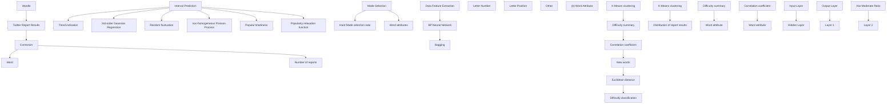
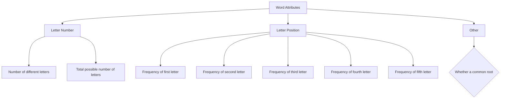
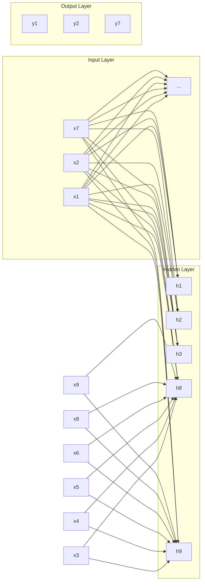
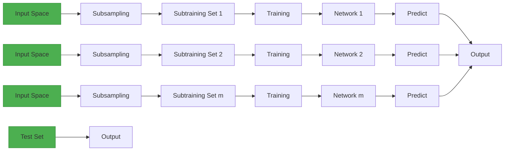

## Riddle of Wordle: Mining the Secret of Number Scores & Solution Words

## Summary

Wordle is a popular puzzle currently offered daily by the New York Times. The simple rules and clever propagation properties have contributed to its popularity. In this article, we build two prediction models for the prediction of the Twitter report number intervals and result distributions, respectively, and develop a model for classifying the difficulty of solution words.

In TASK 1: After data preprocessing, we build a Wordle report number prediction model based on 3rd-order gaussian regression and a non-homogeneous Poisson process from a statistical perspective. Among them, the Gaussian regression is used to predict the trend signs of report numbers, while the non-homogeneous Poisson process predicts the stochastic fluctuations of report numbers on this basis. Moreover, we use the popularity relaxation function to correct the stochastic process, which better approximates the popularity change. At a confidence level of 75%, we predict the interval of the number of reports on March 1, 2023 to be [7654, 20154]. In addition, we extract 8 attributes of words in terms of the number of letters, letter location and so on, finding that these attributes did not have an effect on the percentage of players' Hard Mode choices. Players' confidence in their performance ability and their play mentality may be the main reasons for whether they choose the Hard Mode or not.

In TASK 2: We first extract the data features that affect the distribution of reported results, including word attributes, and the percentage of difficulty patterns. Then, we build a BP neural network to make preliminary predictions on the distribution of guessing results for a certain solution word in the future. To improve the generalization performance of the prediction results, we build an integrated BP neural network based on Bagging. Then, we predict the distribution of the reported results of EERIE on March 1, 2023 as (0, 1, 6, 25, 31, 25, 13) (in %). We have more than 80% confidence that the absolute error of the predicted outcome for the percentage of each possible result does not exceed 5%.

In TASK 3: First, we build a word difficulty induction model based on the K-Means from the distribution of user's reported data, and divide the difficulty into 4 classes. Then, we explore the association between word attributes and difficulty based on Pearson’s coefficients, and take the attributes with correlation coefficients greater than 0.6 as difficulty classification attributes to build a word difficulty classification model. Moreover, we find that the frequency of the first and second letters of the solution words, the number of vowels contained in the pronunciation and the number of word properties have a high correlation with the difficulty classification. Finally, the difficulty classification result of EERIR is the most difficult.

In TASK 4: While exploring the statistical properties of the number of reports, we find that the distribution of the number of reports showed a similar pattern to its trend over time. In addition, we also notice that the percentage fluctuation of 3 tries to complete the game was the largest in the 359 days of reported outcome distribution data.

Finally, we perform a sensitivity analysis of the model and investigate the effect of changes in the variable parameters of the model on the results.

## Contents

## 1 Introduction .....

1.1 Problem Background . 3  
1.2 Restatement of the Problem  
1.3 Literature Review.  
1.4 Our Work. ′

## 2 Assumptions and Justifications......

## 3 Notations .........

## 4 Data pre-processing ....

## 5 Task 1: Report Number Prediction Model & Game Mode Selection Analysis ........

5.1 Data Exploration .. F  
5.2 Wordle Report Number Prediction Model 8  
5.3 Analysis of Game Mode Selection.. 11

## 6 Task 2: A Prediction Model for The Distribution of The Reported Results ...14

6.1 Building the BP Neural Network-based Prediction Model for the distribution of wordguessing results . .14  
6.2 Analysis of Uncertainties Affecting the Model. .16  
6.3 Analysis of the Results of the Prediction Model. 17

## 7 Task 3: Word Difficulty Classification Model ... 17

7.1 The Establishment of Word Difficulty Classification .. .18  
7.2 Analysis of Word Difficulty Classification Results .20

## 8 Task 4: Other Interesting Features.......... ...21

## 9 Sensitivity Analysis.. ..22

## 10 Model Evaluation and Further Discussion......... .23

10.1 Strengths .23  
10.2 Weaknesses .23  
10.3 Further Discussion .. .23

## 11 Conclusion.... .23

## References .... .24

## Letter .... .25

## 1 Introduction

## 1.1 Problem Background

Homer is a term used in the sport of baseball and is an informal American English word. Amazingly, Homer (home run) was searched over 79,000 times on the Cambridge Dictionary website and was searched 65,401 times on May 5. With that, Homer became the Cambridge Dictionary's 2022 Word of the Year. You may be wondering why, but it starts with Wordle, a very popular word-guessing game overseas. In 2022, the online puzzle game Wordle was all over social media. And Wordle's answer that day was Homer, which was difficult for non-US users who were not familiar with the word.

Wordle is currently a popular daily puzzle offered by The New York Times and has grown in popularity with more than 60 versions available. Players can choose between "regular mode" or "hard mode. Players attempt to solve the puzzle by guessing a five-letter word in six or fewer attempts, with each guess receiving feedback and a change in the color of the tile (green, yellow, gray). Note: Each guess must be a real word in English. Guesses that are not recognized as words by the contest are not allowed.

： A green tile indicates that the letter in that tile is in the word and in the correct location.  
： A yellow tile indicates that the letter in that tile is in the word but in the wrong location.  
： A gray tile indicates that the letter in that tile is not included in the word.

## 1.2 Restatement of the Problem

Considering the background information and the results in this file, we need to solve the following problems:

 Develop a model to account for changes in the number of reported outcomes and create a prediction interval for the number of reported outcomes on March 1, 2023. Analyze the extent to which attributes of words affect players' mode choices.  
Develop a model to predict the distribution of reported outcomes. Analyze the uncertainty factors that exist in the model and predictions.  
Develop a model to classify solution words by difficulty. Identify the attributes of the words associated with each classification.  
Describes other interesting features of the dataset.

## 1.3 Literature Review

In recent years, with the popularity of the Internet, social networks have gradually become the main medium for discussing what is happening in the real world, and users can generate and disseminate rich data streams on social platforms (e.g. Twitter) to gain insights into hot events that are happening. Popularity modeling and prediction have a wide range of applications in marketing, opinion monitoring, advertising and other scenarios, and time-series-based trend analysis is a research topic that has received much attention in the field of data mining and social network analysis in recent years. The idea of this type of research mainly draws on financial and epidemiological models. Shen et al [1] first established a Reinforced Poisson

Processes (RPP) model to predict dynamic prevalence using a heterogeneous Poisson process model, and considered the "rich get richer ". Zhao et al [2] developed a SEISMIC model based on the theory of self-excited point processes, assuming that past popularity will affect the future evolution of the process, and used a double stochastic process to portray the contagion of information. Wu et al [3] proposed a Bayesian network-based popularity prediction model (EPAB) based on temporal characteristics, user characteristics and network structure characteristics, and proposed the concept of early patterns to establish the relationship between early feature information and future heat changes.

However, the time series model requires the data set to contain timing information, and the data set that does not meet this condition cannot be modeled. Meanwhile, the sequential model and the deep learning method based on node behavior dynamics are not suitable for the forecast situation of this task based only on the reported data. On the one hand, the existing data set does not contain specific information such as who the reporter is, how many players there are at any given time, etc., so a node model cannot be built based on this data set. On the other hand, techniques such as deep learning are not well interpretable and cannot explain the trend of heat change mathematically, and require more training data.

In this paper, we try our best to extract all the information from the Data File. Aiming at the specific application scenario of Wordle, we not only realize the interval prediction of the number of future reports, but also carry out further analysis on the distribution of report results and the classification of word difficulty.

## 1.4 Our Work

We put forward three models to mine the information of the reported result data. The structure of our paper is shown in Figure 1.

flowchart

Figure 1: The structure of our paper

The rest of this paper is organized as follows. In Section II, we introduce the premise assumptions and justifications, and common variables in the formulas are mentioned in Section III. In Section IV, the data preprocessing before modeling is carried out. Section V establishes the prediction model of report number interval and explores the relationship between word attribute and pattern selection. In Section VI, we establish the report result distribution prediction model. In Section VII, we propose the word difficulty classification model. Section VIII continues to explore interesting features of the Data File. In Sections IX and X, the sensitivity of the model is analyzed and we further evaluate the advantages and disadvantages of the models. Finally, Section XI gives out the conclusions.

## 2 Assumptions and Justifications

We make some general assumptions to simplify our model. These assumptions together with corresponding justifications are listed below:

1. It is assumed that the change in the number of users in the report is a true reflection of the change in players in the actual situation.

There may be players who are enthusiastic about the game but do not tweet their results, so the number of reported users is often less than the actual value. However, we assume that players are willing to share their game results.

2. Assume that the game can be played only once per person per day, and that the questions are updated at 0:00 EST every day.

This assumption serves as the established rule of the game. This rule reflects the analyzability of the reported data. Also, it demonstrates the original intention of the game designer, Wardle, who "did not want players to spend more than three minutes per day".

3. It is assumed that in the game's setting, players are seen as people with a certain level of literacy and problem-solving skills.

There is no special connection between the words given in each game, but the player's mastery of the vocabulary directly determines the steps, speed, and correctness of the answers. We assume that the player has the ability to solve the problem and has the option to find the answer online when he cannot guess the answer.

4. It is assumed that the historical data is a good representation of all possible Wordle questions and player answers.

Since we only have 359 days of reported results data for 2022 and as the only reference data set. The data may be unrepresentative, and for the sake of analysis, we assume that it can show the question-and-answer patterns to some extent.

## 3 Notations

The key mathematical notations used in this paper are listed in Table 1.

Table 1: Notations used in this paper

<table><tr><td>Symbol</td><td>Description</td></tr><tr><td> $t_i$ </td><td>time, where i represents the number of days from that date to January 7, 2022</td></tr><tr><td> $y(t_i)$ </td><td>number of results reported on the day  $t_i$ </td></tr><tr><td> $\lambda(t)$ </td><td>the mean value of the number of reports on the day  $t$ </td></tr><tr><td> $f_\alpha$ </td><td>frequency of a given letter  $\alpha$  in 359 words of result data</td></tr><tr><td> $p_{mn}$ </td><td>the ratio of words with the  $n$ th letter  $m$  to all words</td></tr><tr><td> $k$ </td><td>number of clustering algorithm centers of mass</td></tr></table>

## 4 Data pre-processing

Before building the model, a preliminary check of the data in the report is needed. According to the rules of Wordle, each word is 5 letters long. But there are unusual statistics of 4 or 6 letters in the data. Errors in words can interfere with the analysis of word attributes later, so the word data were corrected based on past answer data1. Based on the relationship between the number of reports, we found that there was a large deviation between the number of results of No. 529 and the values on the before and after dates. Therefore, we considered it as abnormal data and corrected it by taking the average value of the data for each of the two days before and after. The overall pre-processing process is shown in Figure 2.

stacked bar chart

| Data Processing | #314 tash -> trash | #525 clen -> clean | #545 rprobe -> probe |
| --------------- | ----------------- | ------------------ | ------------------- |
| Value           | 24646             | 22628              | 2569                |
| Number of reported results | -                 | -                  | 26051               |

Figure 2: Data pre-processing

## 5 Task 1: Report Number Prediction Model & Game Mode Selection Analysis

To explore the variation pattern of the number of reported results obtained from Twitter over time, we first develop an interpretable model for describing and predicting the number of reports. From a statistical point of view, we portray the long-term temporal trends and stochastic fluctuations in the number of reports based on 3rd order gaussian regression and non-homogeneous Poisson process, respectively. Moreover, we observe that the size of the stochastic fluctuations in the number of reports is not only time-dependent but also related to the current heat level, so we introduce a popularity relaxation function to modify the stochastic process model. Finally, we enumerate eight attributes related to words and analyze the influence of word attributes on the choice of game mode with players through scatter plots.

## 5.1 Data Exploration

The number of reported results keeps changing over time, and Figure 3 shows the dynamic pattern of game hotness over time from the perspective of the number of people (the date takes January 7 as the starting point). In general, there is a certain pattern of popularity propagation law in the number of reports on the time scale. When Wordle exploded in the early days, there was a significant increase in the number; however, when the popularity period passed, the number showed a downward trend and leveled off, as shown in Figure 3(a). It is worth noting that there is a small random fluctuation between the number of reports per day and the overall trend. In addition, Figure 3(b) depicts the growth statistics of the cumulative number of reports over time (359 days in total). In other words, the process of the number of reports over time can be divided into two parts, which are trend signs and random fluctuation.

line chart

| Date | Number of Reported Results (×10⁴) |
| ---- | --------------------------------- |
| 150  | 6.0                               |
| 160  | 5.5                               |
| 170  | 5.0                               |
| 180  | 4.5                               |
| 190  | 4.0                               |

(a) Short-term random fluctuations

line chart

| Date | Number of Total Reported Results (×10⁷) |
| ---- | -------------------------------------- |
| 0    | 0                                      |
| 100  | 2.2                                    |
| 200  | 2.8                                    |
| 300  | 3.1                                    |
| 400  | 3.3                                    |

(b) Long-term cumulative trend  
Figure 3: Description of the number of reports

At the same time, we find that there is a correlation between the fluctuation of the number of reports within a short period and the number of reports of the game in that period. Considering the social property of sharing game reports on Twitter, we approximate that the number of reports in a certain period represents the recent hotness of the game.

scatterplot

| Popularity (×10⁵) | Fluctuation Size (×10⁴) |
| ----------------- | ------------------------ |
| 0.5               | 0.8                      |
| 0.7               | 1.2                      |
| 0.9               | 1.5                      |
| 1.1               | 1.8                      |
| 1.3               | 2.0                      |
| 1.5               | 2.2                      |
| 1.7               | 2.5                      |
| 1.9               | 2.8                      |
| 2.1               | 3.0                      |
| 2.3               | 3.2                      |
| 2.5               | 3.5                      |
| 2.7               | 3.8                      |
| 2.9               | 4.0                      |
| 3.1               | 4.2                      |
| 3.3               | 4.5                      |
| 3.5               | 4.8                      |
| 3.7               | 5.0                      |
| 3.9               | 5.2                      |

Figure 4: The relationship between the size of fluctuations in the number of reports and the popularity of the game

As shown in Figure 4, its horizontal axis is the two-period moving average of the number of game reports, and its vertical axis is the fluctuation of the daily number of reports relative to the two-period moving average of the day. It can be seen that as the mean value of the sliding window for the number of reports increases, the magnitude of fluctuations becomes larger, and the boundaries of the magnitude of fluctuations appear roughly linear. It is more difficult to accurately predict the number of game reports in this period when the game is popular.

## 5.2 Wordle Report Number Prediction Model

## 5.2.1 The establishment of report number prediction model

We want to build a mathematical model based on existing data to describe the process of changing the number of reported results on Twitter over time and to predict the popularity in a certain period in the future, and the model is explanatory for the change process. The problem is a popularity prediction problem that has often been discussed in recent years.

By reviewing the literature [4], we learned that two classes of heat prediction algorithms are commonly used in the industry, including temporal models based on node behavior dynamics and deep learning-based methods. However, they do not apply to the scenario studied in this paper. This is mainly due to the following two reasons:

1) The existing dataset does not contain specific information such as who the reporter is and how many people in total. It is not sufficient to build a node model based on this dataset.  
2) Deep learning does not have good interpretability and requires more training data to achieve better prediction results.

Therefore, we developed a Wordle Report Number Prediction model based on 3rd-order Gaussian regression and a non-homogeneous Poisson process from the statistical perspective.

## A trend prediction model based on Gaussian regression

In the Data File, there is a clear sign of a trend in the time series of the number of reports. We tried several regression algorithms to fit the trend in the number of reports over time, and the best result was a 3rd order Gaussian regression with a regression equation of:

$$
G (t; \boldsymbol {\theta}) = A _ {1} \exp \left[ - \left(\frac {t - B _ {1}}{C _ {1}}\right) ^ {2} \right] + A _ {2} \exp \left[ - \left(\frac {t - B _ {2}}{C _ {2}}\right) ^ {2} \right] + A _ {3} \exp \left[ - \left(\frac {t - B _ {3}}{C _ {3}}\right) ^ {2} \right] \tag {1}
$$

where $\pmb { \theta } = [ A _ { 1 } , A _ { 2 } , A _ { 3 } , B _ { 1 } . . . C _ { 1 } , C _ { 2 } , C _ { 3 } ]$ is the regression coefficient and is the time in days.

Then, we use the least squares method to regress it. Let the observation of the number of daily reports be $y ( t _ { i } )$ , and the regression result be:

$$
\hat {G} (t; \hat {\pmb {\theta}}) = \sum_ {n = 1} ^ {3} \hat {A} _ {n} \mathrm{exp} \left[ - \left(\frac {t - \hat {B} _ {n}}{\hat {C} _ {n}}\right) ^ {2} \right]
$$

Then its loss function is:

$$
L (\hat {\boldsymbol {\theta}}) = \sum_ {i = 1} ^ {3 5 9} \left[ y (t _ {i}) - \hat {G} (t _ {i}; \hat {\boldsymbol {\theta}}) \right] ^ {2} \tag {2}
$$

We take $\mathrm { a r g }$ min $L \left( { \hat { \mathbf { \theta } } } \right)$ as the regression result, and the corresponding $\hat { G } ( t ; \hat { { \mathbf { \boldsymbol { \theta } } } } )$ is the pre-dicted trend.

## Report number prediction model based on non-homogeneous Poisson process

The Poisson distribution describes the probability of a certain number of events occurring over a period of time under the condition that the event occurrence rate is constant, and thus can describe the probability of a certain number of reports uploaded in a day. We assume that the number of reports each day obeys a Poisson distribution, then these Poisson distributions form a non-homogeneous Poisson process in time, i.e., a Poisson process in which the arrival intensity varies with time.

The number of reports on the day is a random process $X ( t )$ that obeys a non-homogeneous Poisson process with arrival intensity $\lambda ( t )$ . The probability that the number of reports on the day is:

$$
P _ {k} (t) = P \{X (t) = k \} = \frac {\lambda (t) ^ {k}}{k !} e ^ {- \lambda (t)} \tag {3}
$$

where the meaning of $\lambda ( t )$ is the mean value $m _ { X } ( t ) = E \left[ X ( t ) \right]$ of the number of reports on the day . However, the mean value function cannot be derived from the available statistics. Therefore, we retreat and use the trend prediction result $\hat { G } ( t )$ from the previous Gaussian regression to approximate the mean function of the number of reports $m _ { X } \left( t \right)$ instead, such that $\lambda ( t ) = \hat { G } ( t )$ .

Thereby, the random fluctuations of the reported number can be well portrayed by introducing a non-homogeneous Poisson process.

## Random process correction based on popularity relaxation function

Since the random process $X ( t )$ mentioned above is not a completely independent incremental process in practice, the size of its random fluctuation is affected by its popularity. By analogy with the life cycle of online public opinion [5], this paper divides the life cycle of Wordle's popularity trend. Considering that the data are counted from January 7, the initial "formation" stage is omitted.

i. Explosion Period: the number of players surges due to the growth of popularity and the sharing of results on social platforms. The index of attention and action of Twitter users on this type of topic soars to its peak and fluctuates with greater uncertainty in its scope.

ii. Fading Period: the popularity is time-sensitive as the novelty of the game has passed for players. And, players' desire to share their achievements decreases, but it does not mean that the number of players decreases at this time. Nevertheless, the overall fluctuation of popularity is lower compared to the burst period.

iii. Dormant Period: the popularity leveled off, there were still many loyal players to the game, and the conversation remained. In general, the ups and downs do not change much.

In this paper, we observe that the random fluctuations in the number of reports do not exactly obey the Poisson distribution when the game is popular, and the fluctuations are significantly larger. As the game's popularity waned, so did the fluctuations. Therefore, we introduce a popularity relaxation function to modify the random process model.

As mentioned in Section 5.1, the boundary of the popularity relaxation phenomenon can be approximately reduced to a linear boundary, so we define the popularity relaxation function as $f ( k ) = l \cdot k + m$ , with being the number of reports and being constants.

The modified random process arrives at the intensity function as:

$$
\stackrel {\circ} {\lambda} _ {k} (t) = \lambda (t) \cdot f (k) \tag {4}
$$

Therefore, the probability that the number of reports is on the day after the correction of equation (3) is:

$$
\stackrel {\circ} {P} _ {k} (t) = \frac {\stackrel {\circ} {\lambda} _ {k} (t) ^ {k}}{k !} e ^ {- \stackrel {\circ} {\lambda} _ {k} (t)} \tag {5}
$$

We can calculate the prediction interval $[ \lambda ( t ) - l b , \lambda ( t ) + r b ]$ for the number of reports on the day with a certain confidence level $\beta$ based on $\mathring { P } _ { k } \left( t \right)$ , as shown in equation (6).

$$
\left\{ \begin{array}{l} l b = \underset {N} {\arg \min} \left| \frac {\beta}{2} - \sum_ {n = 1} ^ {N} \mathring {P} _ {\lambda (t) - n} (t) \right| \\ r b = \underset {M} {\arg \min} \left| \frac {\beta}{2} - \sum_ {m = 1} ^ {M} \mathring {P} _ {\lambda (t) + m} (t) \right| \end{array} \right. \tag {6}
$$

## 5.2.2 Establishing prediction intervals for future reported number results

Based on a trend forecasting model with Gaussian regression, we predict the long-term trend in the number of reports. The regression results in $R M S E = 6 0 3 4 . 7 , R ^ { 2 } = 0 . 9 9 5 5 3$ . This indicates that the regression results are more explanatory of the trend in the number of reports, and the root mean square error is about 2 orders of magnitude smaller than the number of reports. The regression coefficients are shown in Table 2, and we will show the specific trend prediction effects together with the prediction intervals.

Table 2: Regression coefficient of the trend prediction model

<table><tr><td colspan="6"> $\hat{\theta}$ </td></tr><tr><td> $A_{1}$ </td><td>1.57e+05</td><td> $B_{1}$ </td><td>33.01</td><td> $C_{1}$ </td><td>30.79</td></tr><tr><td> $A_{2}$ </td><td>9.69e+04</td><td> $B_{2}$ </td><td>48.2</td><td> $C_{2}$ </td><td>75.31</td></tr><tr><td> $A_{3}$ </td><td>4.846e+04</td><td> $B_{3}$ </td><td>5.864</td><td> $C_{3}$ </td><td>386.7</td></tr></table>

Then, by modifying the report number prediction model of the non-homogeneous Poisson process, the report number prediction interval of 75% confidence is obtained. Figure 5 shows the model's present description of the reported number results with future predictions, and the horizontal coordinates are the number of days to January 7, 2022.

line chart

| Date | Report Number | λ(t)     |
|------|---------------|----------|
| 0    | ~1.5×10⁵      | ~1.5×10⁵ |
| 50   | ~3.2×10⁵      | ~3.2×10⁵ |
| 100  | ~1.8×10⁵      | ~1.8×10⁵ |
| 150  | ~0.8×10⁵      | ~0.8×10⁵ |
| 200  | ~0.4×10⁵      | ~0.4×10⁵ |
| 250  | ~0.3×10⁵      | ~0.3×10⁵ |
| 300  | ~0.2×10⁵      | ~0.2×10⁵ |
| 350  | ~0.15×10⁵     | ~0.15×10⁵ |
| 400  | ~0.1×10⁵      | ~0.1×10⁵ |
| 450  | ~0.05×10⁵     | ~0.05×10⁵ |

Figure 5: Report number trends and 75% confidence level intervals predicting

From the figure above, we can find that our model can predict the long-term trend of the number of reports more accurately, and can also roughly estimate the random fluctuation interval of the number of reports per day. It is worth noting that the prediction interval is a good reflection of the timeliness of the heat, and the number of users shows a surge and significant fluctuation when the "Date" is about 40, as the number of users is in the "Explosion Period". When the "Date" is about 220, the number of users is in the "Dormant Period", and the number and fluctuation are relatively small and tend to be stable.

We predict that the number of reported results converges to 13,904 on March 1, 2023 (when the value of the horizontal coordinate is 419 in Figure 5). The results of the prediction intervals at different confidence levels are shown in Table 3.

Table 3: Prediction interval for the number of reports (on March 1st)

<table><tr><td>Confidence level</td><td>Left border of the prediction interval</td><td>Right border of the prediction interval</td></tr><tr><td>75%</td><td>7654</td><td>20154</td></tr><tr><td>85%</td><td>5434</td><td>23657</td></tr></table>

In general, the overall change pattern of the number of reports is determined by the social attributes and social laws of the game. And this changing pattern shows a clear trend, so a better prediction effect can be obtained through the regression model.

Based on the overall change trend, the number of reports also has a certain degree of random fluctuation. This stochastic fluctuation has the statistical characteristic of changing with time and heat. Therefore, the stochastic process can be applied to describe it.

## 5.3 Analysis of Game Mode Selection

## 5.3.1 Analysis of word attributes

First, we analyze the possible word attributes involved, which can be mined from the existing dataset in 3 main aspects: letter frequency, letter position and common word roots, etc.

flowchart

Figure 6: Analysis of word attributes

Number of different letters: It is expressed as the number of different letters in a word. Statistically, the range of values is 3 to 5. For example, the value of this attribute for the word "happy" is 4. This attribute reflects the internal variability of the word.

Total possible number of letters: It represents the sum of the frequencies of all letters in a word. Assuming that the frequency of the letter $" \alpha "$ in the 359-word result data is $f _ { \alpha }$ , the value of this attribute for the word "happy" is $f _ { h } + f _ { a } + 2 f _ { p } + f _ { y }$ . This attribute is an indication of the overall usage tendency of the word.  
Frequency of first letter: It indicates the frequency of the first letter of a word. For example, in 359 data items, the total number of the first letter of each word is 359, and the percentage of words with the first letter $" \mathrm { h } "$ is $p _ { h 1 }$ , then the value of this attribute for the word "happy" is $p _ { h 1 } / 3 5 9$ . This attribute reflects the local position tendency of the word.  
Frequency of second letter: It indicates the frequency of the second letter of a word. For example, in 359 data items, the total number of the second letter of each word is 359, and the percentage of words with the second letter $" \mathrm { a } "$ is $p _ { a 2 }$ . The value of this attribute for the word "happy" is $ { p _ { a 2 } } / 3 5 9$ . This attribute reflects the local position tendency of the word.  
Frequency of third letter: It indicates the frequency of the third letter of a word. For example, in 359 data items, the total number of the third letter of each word is 359, and the percentage of words with the third letter $" \mathrm { p } "$ is $p _ { p 3 }$ , then the value of this attribute for the word "happy" is $p _ { p 3 } / 3 5 9$ . This attribute reflects the local position tendency of the word.  
Frequency of forth letter: It indicates the frequency of the fourth letter of a word. For example, in 359 data items, the total number of the fourth letter of each word is 359, and the percentage of words with the fourth letter $" \mathrm { p } "$ is $p _ { p 4 }$ . The value of this attribute for the word "happy" is $p _ { p 4 } / 3 5 9$ . This attribute reflects the local position tendency of the word.  
Frequency of fifth letter: It indicates the frequency of the fifth letter of a word. For example, in 359 data items, the total number of the fifth letter of each word is also 359, and the percentage of words with the fifth letter "y" is $p _ { y 5 }$ , then the value of this attribute for the word "happy" is $p _ { y 5 } / 3 5 9$ . This attribute reflects the local position tendency of the word  
◼ Whether a common root: It indicates whether a word has common roots within it. For example, if the word "manly" contains the root "-ly", then the word has a value of 1; otherwise, it has a value of 0. This property reflects the local regularity of the word.

## 5.3.2 Analysis of the influence of word attributes on pattern selection

We wanted to find out whether the 8 attributes of the word listed in the previous section affected the user's choice of game mode. So, for each attribute, a scatter plot comparing the relationship between daily word attributes and Hard Mode choices was plotted in Figure 7.

In the figure below, the horizontal coordinates of each scatter plot are the percentage of Hard Mode choices (in %). It can be noticed that the individual attributes do not have a strong correlation with the percentage of Hard Mode. The presented word attributes do not affect the proportion of reported data for the Hard Mode. We believe that the reason for this phenomenon is that players are not informed about the solution word in advance. That is, the word attributes are unknown before most players choose the game mode, so the player's choice is not highly correlated with it.

scatterplot

| Number of different letters | attribute |
| --------------------------- | --------- |
| 0                           | 5.0       |
| 5                           | 5.0       |
| 10                          | 5.0       |
| 15                          | 5.0       |

scatter plot

| attribute | total_passible_number_of_letters |
| --------- | ------------------------------- |
| 200       | 10                              |
| 150       | 15                              |
| 100       | 20                              |
| 50        | 25                              |
| 100       | 30                              |
| 150       | 35                              |
| 200       | 40                              |
| 150       | 45                              |
| 100       | 50                              |
| 50        | 55                              |
| 100       | 60                              |
| 150       | 65                              |
| 200       | 70                              |
| 150       | 75                              |
| 100       | 80                              |
| 50        | 85                              |
| 100       | 90                              |
| 150       | 95                              |
| 200       | 100                             |
| 150       | 105                             |
| 100       | 110                             |
| 50        | 115                             |
| 100       | 120                             |
| 150       | 125                             |
| 200       | 130                             |
| 150       | 135                             |
| 100       | 140                             |
| 50        | 145                             |
| 100       | 150                             |
| 150       | 155                             |
| 200       | 160                             |
| 150       | 165                             |
| 100       | 170                             |
| 50        | 175                             |
| 100       | 180                             |
| 150       | 185                             |
| 200       | 190                             |
| 150       | 195                             |
| 100       | 200                             |
| 50        | 205                             |
| 100       | 210                             |
| 150       | 215                             |
| 200       | 220                             |
| 150       | 225                             |
| 100       | 230                             |
| 50        | 235                             |
| 100       | 240                             |
| 150       | 245                             |
| 200       | 250                             |
| 150       | 255                             |
| 100       | 260                             |
| 50        | 265                             |
| 100       | 270                             |
| 150       | 275                             |
| 200       | 280                             |
| 150       | 285                             |
| 100       | 290                             |
| 50        | 295                             |
| 100       | 300                             |
| 150       | 305                             |
| 200       | 310                             |
| 150       | 315                             |
| 100       | 320                             |
| 50        | 325                             |
| 100       | 330                             |
| 150       | 335                             |
| 200       | 340                             |
| 150       | 345                             |
| 100       | 350                             |
| 50        | 355                             |
| 100       | 360                             |
| 150       | 365                             |
| 200       | 370                             |
| 150       | 375                             |
| 100       | 380                             |
| 50        | 385                             |
| 100       | 390                             |
| 150       | 395                             |
| 200       | 400                             |
| 150       | 405                             |
| 100       | 410                             |
| 50        | 415                             |
| 100       | 420                             |
| 150       | 425                             |
| 200       | 430                             |
| 150       | 435                             |
| 100       | 440                             |
| 50        | 445                             |
| 100       | 450                             |
| 150       | 455                             |
| 200       | 460                             |
| 150       | 465                             |
| 100       | 470                             |
| 50        | 475                             |
| 100       | 480                             |
| 150       | 485                             |
| 200       | 490                             |
| 150       | 495                             |
| 100       | 500                             |
| 50        | 505                             |
| 100       | 510                             |
| 150       | 515                             |
| 200       | 520                             |
| 150       | 525                             |
| 100       | 530                             |
| 50        | 535                             |
| 100       | 540                             |
| 150       | 545                             |
| 200       | 550                             |
| -         | -                               |

scatter plot

| frequency of first letter | attribute |
| ------------------------- | --------- |
| 0                         | 0.0       |
| 1                         | 0.02      |
| 2                         | 0.03      |
| 3                         | 0.04      |
| 4                         | 0.05      |
| 5                         | 0.06      |
| 6                         | 0.07      |
| 7                         | 0.08      |
| 8                         | 0.09      |
| 9                         | 0.10      |
| 10                        | 0.11      |
| 11                        | 0.12      |
| 12                        | 0.13      |
| 13                        | 0.14      |
| 14                        | 0.15      |

scatter plot

| frequency of second letter | attribute |
| --------------------------- | --------- |
| 0                           | 0.14      |
| 1                           | 0.13      |
| 2                           | 0.12      |
| 3                           | 0.11      |
| 4                           | 0.10      |
| 5                           | 0.09      |
| 6                           | 0.08      |
| 7                           | 0.07      |
| 8                           | 0.06      |
| 9                           | 0.05      |
| 10                          | 0.04      |
| 11                          | 0.03      |
| 12                          | 0.02      |
| 13                          | 0.01      |
| 14                          | 0.00      |
| 15                          | 0.01      |

scatter plot

| frequency of third letter | attribute |
| ------------------------- | --------- |
| 0                         | 0.02      |
| 1                         | 0.03      |
| 2                         | 0.04      |
| 3                         | 0.05      |
| 4                         | 0.06      |
| 5                         | 0.07      |
| 6                         | 0.08      |
| 7                         | 0.09      |
| 8                         | 0.10      |
| 9                         | 0.11      |
| 10                        | 0.12      |
| 11                        | 0.13      |
| 12                        | 0.14      |
| 13                        | 0.15      |
| 14                        | 0.14      |
| 15                        | 0.13      |

scatter plot

| Frequency of forth letter | attribute |
| ------------------------- | --------- |
| 0                         | 0.0       |
| 1                         | 0.05      |
| 2                         | 0.07      |
| 3                         | 0.08      |
| 4                         | 0.09      |
| 5                         | 0.1       |
| 6                         | 0.08      |
| 7                         | 0.06      |
| 8                         | 0.04      |
| 9                         | 0.02      |
| 10                        | 0.01      |
| 11                        | 0.03      |
| 12                        | 0.05      |
| 13                        | 0.07      |
| 14                        | 0.09      |
| 15                        | 0.1       |

scatter plot

| attribute | frequency |
| --------- | --------- |
| 0.2       | 1         |
| 0.15      | 2         |
| 0.1       | 3         |
| 0.05      | 4         |
| 0.0       | 5         |

scatterplot

(h)Whether a common root
| x | attribute |
|---|---|
| 0 | 0 |
| 1 | 1 |
| 2 | 1 |
| 3 | 1 |
| 4 | 1 |
| 5 | 1 |
| 6 | 1 |
| 7 | 1 |
| 8 | 1 |
| 9 | 1 |
| 10 | 1 |
| 11 | 1 |
| 12 | 1 |
| 13 | 1 |
| 14 | 1 |
| 15 | 1 |

Figure 7: Correlation between the proportion of Hard Mode choices and word attributes

So what are the main factors associated with the Hard Mode selection ratio?

Table 4 provides a further visualization of the word content and date of some of the Hard Mode percentages. We can find that there are no obvious word attribute characteristics in the top ten reports and the bottom ten reports in the proportion ranking. However, the data with a high percentage of Hard Mode choices tend to appear in the last three months of 2022, while the data with a low proportion tend to appear in the first month of 2022 with a high correlation with time.

Table 4: The percentage of scores reported in Hard Mode

<table><tr><td colspan="3">Top 10</td><td colspan="3">Bottom 10</td></tr><tr><td>Date</td><td>Word</td><td>Percentage</td><td>Date</td><td>Word</td><td>Percentage</td></tr><tr><td>2022/11/1</td><td>piney</td><td>13.33%</td><td>2022/1/16</td><td>solar</td><td>2.36%</td></tr><tr><td>2022/9/16</td><td>parer</td><td>11.07%</td><td>2022/1/14</td><td>tangy</td><td>2.35%</td></tr><tr><td>2022/11/30</td><td>study</td><td>10.66%</td><td>2022/1/15</td><td>panic</td><td>2.26%</td></tr><tr><td>2022/10/23</td><td>mummy</td><td>10.32%</td><td>2022/1/12</td><td>favor</td><td>2.23%</td></tr><tr><td>2022/10/15</td><td>catch</td><td>10.27%</td><td>2022/1/10</td><td>query</td><td>2.09%</td></tr><tr><td>2022/12/26</td><td>judge</td><td>10.21%</td><td>2022/1/9</td><td>gorge</td><td>2.09%</td></tr><tr><td>2022/10/30</td><td>waltz</td><td>10.12%</td><td>2022/1/11</td><td>drink</td><td>1.96%</td></tr><tr><td>2022/10/12</td><td>ionic</td><td>10.11%</td><td>2022/1/8</td><td>crank</td><td>1.74%</td></tr><tr><td>2022/10/29</td><td>libel</td><td>10.08%</td><td>2022/1/7</td><td>slump</td><td>1.69%</td></tr><tr><td>2022/12/25</td><td>extra</td><td>10.04%</td><td>2022/2/13</td><td>robin</td><td>1.17%</td></tr></table>

To further explore this pattern, we visualized the change of the percentage of Hard Mode choice over time, as shown in Figure 8(a), the color of the heat map fades from blue to green as time increases, and there are only few dates with outlier fluctuations, i.e., the percentage of

Hard Mode choice shows an increasing trend, which can also be seen in the scatter plot of Figure 8(b). There is a very clear trend that the percentage of Hard Mode selection increases with time, not only incrementally, but also the growth rate is gradually slowing down.

heatmap

| Date | Value |
|---|---|
| 50 | 12 |
| 100 | 10 |
| 150 | 8 |
| 200 | 6 |
| 250 | 4 |
| 300 | 2 |
| 350 | 2 |

(a) Heat map over time  

scatterplot

| Date | Percentage of Hard Mode Results |
| ---- | ------------------------------- |
| 0    | 2                               |
| 50   | 4                               |
| 100  | 6                               |
| 150  | 8                               |
| 200  | 9                               |
| 250  | 10                              |
| 300  | 13                              |
| 350  | 10                              |

(b) Trends over time  
Figure 8: Description of the Hard Mode selection percentage

We believe that, on the one hand, this is because as the time spent playing the game in creases, the user's ability to perform in the game is also sufficiently improved, so some users who love challenges will gradually tend to choose a higher difficulty mode. On the other hand, many users may play with a more casual mindset and do not consider increasing the difficulty of the game even though their ability has increased. In other words, players' confidence level in their performance ability and their playing mentality may be the main reason for whether they choose the Hard Mode, rather than the attributes of the words.

## 6 Task 2: A Prediction Model for The Distribution of The Reported Results

To predict the distribution of future report results, we first extracted and constructed the data features. Then, we build a BP neural network model to take 7 data features as input and output the distribution of 7 guessed word results. Finally, the Bagging algorithm was adopted to integrate multiple BP neural networks to derive the final prediction results through a hard voting mechanism to reduce the generalization error of the prediction results.

## 6.1 Building the BP Neural Network-based Prediction Model for the distribution of word-guessing results

Considering that the result distribution of the number of word guesses shared on Twitter is likely to be different from that of the entire player population, and is related to many factors that are difficult to quantify and count, including the players' mindset and the familiarity of most players with the word of the day. Therefore, mechanistic modeling of the word-guessing outcome distribution may be difficult and unrealistic, and we decided to model the data for this problem. Of course, the approach implicitly assumes the condition that the historical data is a good representation of all possible questions and player answers for wordle, which is the biggest uncertainty of our model.

Given the solution word and the corresponding date, we have access to the properties of the words and all the information that can be predicted based on the time course. The total number of historical data is 359, which is likely to cause underfitting problems for deep learning algorithms, while the size of the data is acceptable for BP neural networks. Therefore, we decided to build a prediction model for the distribution of reports based on BP neural networks.

## 6.1.1 Extraction and construction of data features

Before building the neural network specifically, we first extract and construct the data features. As mentioned earlier, we want to predict the distribution of word-guessing results based on the solution words and the corresponding date. The sources of data features at this point include the words themselves and the predictable time course.

The information that can be obtained from the words themselves has been explored in Section 5.3.1, i.e., word attributes. We classified word attributes into 3 categories, including letter frequency, letter position, and common root words. Among them, our statistics for the attribute of whether it contains common word roots resulted in unbalanced data. As a Boolean value, only about 20 out of 359 data for this attribute had a true value. Therefore, this attribute is of no value for the training of the neural network, and we do not keep this feature. In addition, the feature Total possible number of letters, which has some repetitiveness, is also removed to compress the data dimension.

Finally, we also selected the percentage of people who chose the Hard Mode as a feature because the difficult choice of the game also affected the distribution of the number of guesses. As analyzed in Section 5.3.2, this feature has a clear trend and small fluctuations over time, so the feature is predictable for a determined future date. The value of this characteristic in the second half of 2022 mostly fluctuates around 9.5% and the variation is not significant anymore. So we make some simplifications and assume that it will remain this way for some time to come, without making more precise predictions. We take the average value of the difficult mode selection ratio for the latter 59 days as the forecast value.

## 6.1.2 Construction of BP neural network

For the report result distribution prediction problem, 7 data features such as Number of different letters constitute the input space, while 7 reported result distributions constitute the output space. The mathematical essence of the problem is to fit a mapping from a 7-dimensional input space to a 7-dimensional output space. A review of the literature [6] shows that for fitting such finite-dimensional space mappings, building neural networks usually requires only one hidden layer. Therefore, the BP neural network in this model has a total of three layers, which are the input layer, the hidden layer, and the output layer.

Since the input space and output space are both 7-dimensional, the number of neurons in the input layer $N _ { i }$ and the number of neurons in the output layer $N _ { o }$ are both 7. Referring to the empirical formula proposed in the literature [7], we set the number of hidden layer neurons $N _ { h }$ that satisfy equation (7).

$$
N _ {h} = \frac {N _ {s}}{\alpha (N _ {i} + N _ {o})}, \alpha = [ 2, 1 0 ] \tag {7}
$$

where $N _ { s }$ is the size of the training set and is a constant.

At this point, we have completed the construction of the BP neural network, the structure

of which is shown in Figure 9.

flowchart

Figure 9: Structure of BP neural network

## 6.1.3 Bagging-based prediction model with integrated BP neural network

In the training of the BP neural network, we randomly selected the training set according to 85%. After several tests, we found that the neural network obtained from each training always has unacceptable errors at very few samples in the test set. Moreover, the repetition rate of samples with large prediction errors was not high for different neural networks. Therefore, we decided to adopt the Bagging algorithm to integrate multiple BP neural networks. Then, the final results are derived through a hard voting mechanism, which has the effect of reducing the generalization error of the prediction results.

In the integration algorithm, we obtain different sub-training sets by randomly sampling 85% of the overall data times, and each time the percentage of sampling is also 85%. Then, neural networks are obtained based on these sub-training sets trained with the same parameters. Next, these neural networks are used to predict the distribution of word guesses. All neural networks output their respective predictions directly and the final prediction is obtained by a minority-majority voting mechanism [8]. The flow of this integrated algorithm is shown in Figure 10.

flowchart

Figure 10: Schematic diagram of integrated BP neural networkInput Hidden Output

To avoid the influence of accidental errors on voting results, is used for training.Layer Layer Layer

## 6.2 Analysis of Uncertainties Affecting the Model 1 1

The dataset we have and the selected data features are perhaps not well representative of 2 3 2 Wordle's questioning and players' answering, which would lead to poor generalization of our model.

In addition, the size of the dataset used for training, although acceptable, is still relatively limited. In the process of randomly selecting sub-training sets by the integration algorithm, the proportion of identical samples among the sub-training sets may be quite high. This can make the homogeneity between individual neural networks too high to function as an integration and voting mechanism.

## 6.3 Analysis of the Results of the Prediction Model

First, we arrange the data sets in descending order by time and select the top 85% of the data as the total training set. The remaining 15% of the data will be used as the test set to verify the model effect. Then, 85% of the total training set is randomly selected as the sub-training set each time, and neural networks are trained. Finally, these neural networks are integrated and the prediction effect is tested with the test set.

After several attempts, we found that we were able to achieve better prediction results when $N _ { h } = 9 , m = 1 0 0$ . In the test set, the model’s $R M S E = 3 . 6 9 7 5$ and the correlation coefficient is $R = 0 . 8 8 6 9$ . As shown in Figure 11, the model has different prediction effects on the distribution of the seven guess word results. Among them, the prediction result of 3 tries has the largest error, but the mean square error still does not exceed 5%.

bar-line hybrid

| Number of tries | Predict (%) | Observe (%) | Mean of error |
|---|---|---|---|
| 1 | 1.0 | 0.5 | 1.2 |
| 2 | 5.0 | 7.0 | 2.8 |
| 3 | 22.0 | 26.0 | 4.5 |
| 4 | 33.0 | 33.0 | 3.0 |
| 5 | 24.0 | 21.0 | 3.5 |
| 6 | 11.0 | 9.0 | 3.2 |
| 7 | 2.5 | 2.0 | 1.7 |

histogram

| Absolute Error Range | Density |
| :--- | :--- |
| 0.00 - 0.02 | 160 |
| 0.02 - 0.04 | 88 |
| 0.04 - 0.06 | 65 |
| 0.06 - 0.08 | 45 |
| 0.08 - 0.10 | 20 |
| 0.10 - 0.12 | 25 |
| 0.12 - 0.14 | 12 |
| 0.14 - 0.16 | 3 |
| 0.16 - 0.18 | 5 |
| 0.18 - 0.20 | 1 |

Figure 11: Mean Comparison and Mean Squared Distribution  
Figure 12: Absolute error distribution

The distribution of all errors was also counted. As shown in Figure 12. Although errors are inevitable, most of them are maintained within 6%. Among them, the absolute error within 2% accounts for about 38%, and the absolute error within 5% reaches more than 80%. Therefore, we have more than 80% confidence that the absolute error of the prediction result does not exceed 5%.

Finally, we predict the distribution of the number of guesses for the word ERRIE on March 1, 2023, as shown in Table 5.

Table 5: Prediction of the distribution of results for the word ERRIE

<table><tr><td>1 try</td><td>2 tries</td><td>3 tries</td><td>4 tries</td><td>5 tries</td><td>6 tries</td><td>(X)</td></tr><tr><td>0%</td><td>1%</td><td>6%</td><td>25%</td><td>31%</td><td>25%</td><td>13%</td></tr></table>

## 7 Task 3: Word Difficulty Classification Model

To classify the solution words reasonably, we first classified the difficulty based on the K-Means clustering algorithm. Then, we explored the association between word attributes and difficulty classification based on Pearson correlation coefficients, and constructed a word difficulty classification model. Finally, the new words can be classified according to this correlation.

## 7.1 The Establishment of Word Difficulty Classification

## 7.1.1 Word difficulty induction model based on K-Means clustering

Before categorizing solution words by difficulty, we need to define the difficulty first. To make the model result more similar to the user's game experience, we decided to define a difficulty division based on the user's guess count distribution. It should be noted that this is only an indication of difficulty, not the reason for determining the difficulty of solution words.

According to our definition of difficulty, the distribution of guesses reflects the difficulty of the word. Therefore, the first step to classifying vocabulary difficulty is to summarize the distribution of guessing times into certain categories. The essence of this problem is to explore the homogeneity and difference between the frequency distribution of historical guessing words. From a mathematical point of view, the homogeneity and difference of data can be described by distance, and the data can be grouped by distance. Therefore, we decided to use the K-Means algorithm to summarize the difficulty of the word.

First, a higher percentage of completed guesses indicates a higher difficulty of the puzzle. Therefore, the difference in difficulty in the distribution of the number of guesses is an absolute difference that can be described by the Euclidean distance. Then the difference between the guessing result and the guessing result is reflected in the Euclidean distance of the distribution vector of the two, as shown in equation (8).

$$
D _ {E} (\mathbf {A}, \mathbf {B}) = \sqrt {\sum_ {i = 1} ^ {7} \left(A _ {i} - B _ {i}\right) ^ {2}} \tag {8}
$$

Then, we need to determine how many levels of difficulty to classify, i.e., determine the number of centers of mass for the K-Means clustering algorithm. We will find the best result by multiple attempts. The goal is to make the difficulty classification without duplication or omission.

Next, samples are randomly selected as initial clustering centers in the whole set of samples $x = \{ x _ { 1 } , x _ { 2 } \dots x _ { 3 5 9 } \}$ , respectively, and noted as:

$$
\mu_ {1} ^ {(0)}, \mu_ {2} ^ {(0)}, \dots , \mu_ {k} ^ {(0)}
$$

Since we have decided to use the Euclidean distance to measure the differences between samples, we take equation (9) as the optimization objective of the algorithm, i.e., to minimize the Euclidean distance of all samples to their cluster centers.

$$
J (c, \mu) = \min \sum_ {i = 1} ^ {3 5 9} \| x _ {i} - \mu_ {c _ {i}} \| ^ {2} = \min \sum_ {i = 1} ^ {3 5 9} D _ {E} \left(x _ {i}, \mu_ {c _ {i}}\right) \tag {9}
$$

Where $c _ { i }$ is the cluster to which sample $x _ { i }$ belongs.

The distance between each sample point and each centroid is calculated iteratively. At the same time, the samples are allocated to the cluster with the smallest distance from the corresponding centroid:

$$
c _ {i} ^ {(t)} = \underset {m} {\arg \min} \| x _ {i} - \mu_ {m} ^ {(t)} \| ^ {2}
$$

At the end of each iteration, the average distance of sample points in each cluster is calculated as the centroid of the next iteration:

$$
\mu_ {n} ^ {(t + 1)} = \frac {1}{b} \sum_ {i: c _ {i} ^ {(t)} = n} ^ {b} x _ {i}
$$

At the same time, the objective function value $J ^ { ( t ) }$ of this iteration is compared with that of $J ^ { ( t - 1 ) }$ of the previous iteration. The objective function has converged, and then the clustering ends. The final is the difficulty level of each sample, and $\mu$ corresponds to the typical value of each difficulty level. In addition, the distance matrix between each sample and its clustering center is also obtained.

## 7.1.2 Correlation analysis of word attributes and difficulty ratings based on Pearson coefficients

After obtaining the difficulty grading results, we used Pearson correlation coefficients to analyze the association between each attribute of the word and the difficulty grading. This is because it is more difficult to confirm the causal relationship between attributes and difficulty, but correlation can be used instead when classifying.

First, we selected the frequency of occurrence of letters in five positions, such as Frequency of first letter (F1), Frequency of second letter (F2) mentioned in Section 5.3.1, as the word attributes to be analyzed. Based on this, we further counted the number of word classes (WCN) and the number of vowels (VN) contained in each solution word in the dataset. So far, we have obtained 7 word attributes $a _ { i 1 } , a _ { i 2 } , \ldots , a _ { i 7 }$ to be analyzed.

Then, we select the samples closest to the respective clustering centers as typical samples from the difficulty levels. The sets of representative typical attribute vectors $S _ { j } = [ a _ { j 1 } a _ { j 2 } \dots a _ { j 7 } ]$ are obtained, where $i = 1 , 2 , \ldots 3 5 9$ , denotes the th sample, and $j = 1 , 2 , \ldots , k$ , denotes the typical sample serial number of the th difficulty grading.

For the th attribute of the th sample, we calculate the Euclidean distance between that attribute of the sample and the corresponding attribute of the typical samples, respectively.

$$
\widehat {d i s t} _ {i j} ^ {(t)} = D _ {E} (a _ {i t}, a _ {j t})
$$

We let ${ W _ { i } } ^ { ( t ) } = [ d i s t _ { i 1 } ~ d i s t _ { i 2 } ~ . . . ~ d i s t _ { i k } ]$ , denoted as the attribute distance vector. And let $\widehat { W _ { i } } ^ { ( t ) } = \left[ \widehat { d i s t } _ { i 1 } ^ { ( t ) } \widehat { d i s t } _ { i 2 } ^ { ( t ) } \ldots \widehat { d i s t } _ { i k } ^ { ( t ) } \right]$ , denote the clustering distance vector.

Next, we calculated the Pearson correlation coefficients for the attribute distance vector $\widehat { W _ { i } } ^ { ( t ) }$ and the cluster distance vector $W _ { i } ^ { ( t ) }$ , and obtained the correlation coefficients:

$$
\rho_ {i} ^ {(t)} = \frac {\operatorname{cov} \left(\widehat {W _ {i}} ^ {(t)} , W _ {i} ^ {(t)}\right)}{\sigma_ {W _ {i} ^ {(t)}} \sigma_ {W _ {i} ^ {(t)}}}
$$

Where $\sigma _ { \widehat { W _ { i } } ^ { ( t ) } } , \ \sigma _ { W _ { i } ^ { ( t ) } }$ denote the variances of $\widehat { W _ { i } } ^ { ( t ) }$ and $W _ { i } ^ { ( t ) }$ , respectively.

Finally, we counted the mean value of the correlation coefficient ${ m _ { \rho } } ^ { ( t ) }$ for each attribute for all samples. We also set the boundary $M = 0 . 6$ when ${ m _ { \rho } } ^ { ( t ) } > M$ considering that the th word attribute and the difficulty are correlated. Finally, we filtered the attributes to obtain a vector of attributes $a t t r i b u t e s _ { i } = [ a _ { i l _ { 1 } } ~ a _ { i l _ { 2 } } ~ \ldots ~ a _ { i l _ { w } } ]$ .

## 7.1.3 Word difficulty discrimination based on Euclidean distance

For the future solution word, we can judge its difficulty by calculating its similarity to each typical sample. Since we built a prediction model for the distribution of the number of guesses for a given solution word at a future date in Section 6.2, we have two bases for judging the difficulty of words. One is based on the predicted distribution of the number of guess words, and the other is based on the attribute vector of the solution word .

1. Difficulty determination method based on the predicted distribution of reports:

The prediction model in Section 6.2 is used to predict the distribution of the number of guesses of words to obtain the prediction $\hat { \boldsymbol { x } }$ . Then the difficulty $\hat { \boldsymbol { c } }$ is judged based on the Euclidean distance and the assignment principle of the K-Means algorithm.

$$
\hat {c} = \arg \min _ {i} \left\| \stackrel {\wedge} {x} - \mu_ {i} \right\| ^ {2}
$$

where $\mu _ { i }$ is the center of mass of the -th difficulty, $i = 1 , 2 , \dots k$ .

2. Difficulty determination method based on attribute vectors:

The attribute vector $a t t r i b u t e s _ { x }$ of the solution word is counted, and then its difficulty $\hat { \boldsymbol { c } }$ is judged based on the Euclidean distance and the assignment principle of the K-Means algorithm.

$$
\hat {c} = \arg \min _ {j} \| \text { attributes } _ {x} - \text { attributes } _ {j} \| ^ {2}
$$

where is the typical sample attribute vector for the $j$ th difficulty, $j = 1 , 2 , \ldots , k$ .

## 7.2 Analysis of Word Difficulty Classification Results

text_image

bough
cling
axiom
aixiom
shawl
power
awful
shawly
gloat
gecko
caulk
aloft movie
alight movie
madam
piney
slung
piney
soggy
sunggy
bel
being
label
alight movie
alight movie
alight movie
alight movie
alight movie
alight movie
alight movie
alight movie
alight movie
alight movie
alight movie
alight movie
alight movie
alight movie
alight movie
alight movie
alight movie
alight movie
alight movie
alight movie
alight movie
alight movie
alight movie
alight movie
alight movie
alight movies

text_image

forgo
woken
shake
baker
hunky
cinch
elder
trove
coyly
homer
prize
zesty
stove
buggy
foyer
favor
taunt
sever
fluff
larva
gorge
liver
knoll sw ill
booze
ionic
hutch
dandy
proxy
found
vouch
lowly
cacao
oxide
gully
gauze
w altz
canny
trite
dodge
watch
abbey
goose
judge
enjoy
fewer
vivid
askew
cater

text_image

third point
solar
trope
braid
atone
doubt
train
drink
sloth
stein their
drive
unite
shine stick
clean
rusty
chest
sthat
thorn
heist
cheist
tiara charm plant stair
dream
trash chant atone
scour panic black alien
grate

text_image

money
mole
mable
circuit
circuit
circuit
circuit
circuit
circuit
circuit
circuit
circuit
circuit
circuit
circuit
circuit
circuit
circuit
circuit
circuit
circuit
circuit
circuit
circuit
circuit
circuit
circuit
circuit
circuit
circuit
circuit
circuit
circuit
circuit
circuit
circuit
circuit

Figure 13: Difficulty classification result word cloud

The results were obtained by K-Means clustering in four categories of difficulty, which were classified as Easy, Normal, Hard, and Master in order of difficulty from small to large, and a typical word was selected for visual analysis, as shown in Figure 14.

stacked bar chart

| Category | 1 try | 2 tries | 3 tries | 4 tries | 5 tries | 6 tries | (X) |
| :--- | :--- | :--- | :--- | :--- | :--- | :--- | :--- |
| Master | 0 | 2 | 11 | 23 | 29 | 24 | 11 |
| Dandy | 0 | 0 | 0 | 0 | 0 | 0 | 0 |
| Hard | 0 | 3 | 17 | 35 | 28 | 13 | 3 |
| Normal | 1 | 6 | 26 | 36 | 21 | 8 | 1 |
| Easy | 1 | 0 | 14 | 35 | 14 | 5 | 1 |

Figure 14: Word difficulty classification results bar chart

As we can see from the above graph, when the puzzle is easier, the distribution of reports tends to guess the solved word less often, and vice versa. For example, the distribution of reports for the word "Chest" is mainly in 2tries, 3tries, and 4tries, and the distribution is smaller in 6tries and 7tries.

Table 6: Correlation coefficient of word attributes and difficulty

<table><tr><td colspan="7"> $m_{\rho}$ </td></tr><tr><td>F1</td><td>F2</td><td>F3</td><td>F4</td><td>F5</td><td>WCN</td><td>VN</td></tr><tr><td>0.637634</td><td>0.813854</td><td>0.336972</td><td>0.417339</td><td>0.311806</td><td>0.81528</td><td>0.8989</td></tr></table>

After calculating the Pearson correlation coefficients between word attributes and difficulty ratings, we obtain the results in Table 6. The above table shows that some attributes have a strong correlation with difficulty. We take the word attributes with $m _ { \rho }$ greater than 0.6 as the difficulty classification attributes and form the attribute vector $= [ a _ { i 1 } \ a _ { i 2 } \ a _ { i 6 } \ a _ { i 7 } ]$ .

Finally, we calculate the distance from the attribute vector of the word EERIR to the attribute vector of the $j$ th difficulty typical sample , which are R1 4.2385, R2 3.0021, R3 2.1823, R4 0.6250, and the closest distance to "Dandy". Thus, the difficulty of the word EERIR was obtained as "Master".

## 8 Task 4: Other Interesting Features

In exploring the statistical properties of the number of reports, we found that the density of the distribution of the number of reports over 359 days showed a similar pattern to its trend over time. Then, we fitted the distribution of the number of reports. As shown in Figure 15, a good result can be achieved by fitting the number of reports using a log-normal distribution. Referring to Figure 16, it can be found that the distribution obtained from the fit shows a fairly high similarity to the change in the number of reports over time.

bar-line hybrid chart

| Number of Reported Result (×10⁵) | Density (Observed) | Density (Fit) |
| --------------------------------- | ------------------ | ------------- |
| 0.0                               | 8.0                | 0.0           |
| 0.5                               | 12.0               | 11.0          |
| 1.0                               | 3.0                | 6.0           |
| 1.5                               | 2.0                | 3.0           |
| 2.0                               | 1.0                | 1.5           |
| 2.5                               | 1.5                | 0.8           |
| 3.0                               | 1.0                | 0.4           |
| 3.5                               | 0.5                | 0.2           |

line chart

| Date | Numver if Reported Result |
| ---- | ------------------------- |
| 0    | 0                         |
| 50   | 3.5×10⁵                   |
| 100  | 1.5×10⁵                   |
| 150  | 0.8×10⁵                   |
| 200  | 0.5×10⁵                   |
| 250  | 0.4×10⁵                   |
| 300  | 0.3×10⁵                   |
| 350  | 0.2×10⁵                   |
| 400  | 0.1×10⁵                   |

Figure 15: Fitting to the distribution of report number Figure 16: Change in report number over time

However, we note that the distribution of the number of reports is not uniform in time, and this distribution does not take into account the time factor. So this fit does not provide much information for predicting the number of reports. This led us not to investigate the phe nomenon in more depth. However, we speculate that there may be some interesting statistical properties under this phenomenon.

In addition, when we explored the distribution of users' reported results, we found that the percentage fluctuation of 3 attempts to complete the game was the largest. As shown in Figure 17, we believe that this phenomenon is strongly related to the low prediction accuracy of our report distribution prediction model for 3-attempt game completion.

box plot chart

| Group | Median | Q1 | Q3 | Min | Max | Outliers |
| --- | --- | --- | --- | --- | --- | --- |
| 1 try | ~1 | ~0.5 | ~1.5 | ~0.5 | ~2.5 | None |
| 2 tries | ~2 | ~1.5 | ~3.5 | ~1.5 | ~48 | None |
| 3 tries | ~3 | ~2.5 | ~30 | ~1.5 | ~48 | None |
| 4 tries | ~25 | ~20 | ~35 | ~10 | ~48 | None |
| 5 tries | ~25 | ~20 | ~35 | ~10 | ~48 | ~45 |
| 6 tries | ~10 | ~5 | ~15 | ~2.5 | ~38 | ~38 |
| 7 or more tries (X) | ~2 | ~0.5 | ~1.5 | ~0.5 | ~28 | None |
| Other (Group 1) | ~1 | ~0.5 | ~1.5 | ~0.5 | ~28 | None |
| Other (Group 2) | ~2 | ~1.5 | ~3.5 | ~1.5 | ~48 | None |
| Other (Group 3) | ~2 | ~1.5 | ~3.5 | ~1.5 | ~48 | None |
| Other (Group 4) | ~2 | ~1.5 | ~3.5 | ~1.5 | ~48 | None |
| Other (Group 5) | ~2 | ~1.5 | ~3.5 | ~1.5 | ~48 | None |
| Other (Group 6) | ~2 | ~1.5 | ~3.5 | ~1.5 | ~48 | None |
| Other (Group 7) | ~2 | ~1.5 | ~3.5 | ~1.5 | ~48 | None |
| Other (Group 8) | ~2 | ~1.5 | ~3.5 | ~1.5 | ~48 | None |
| Other (Group 9) | ~2 | ~1.5 | ~3.5 | ~1.5 | ~48 | None |
| Other (Group 10) | ~2 | ~1.5 | ~3.5 | ~1.5 | ~48 | None |
| Other (Group 11) | ~2 | ~1.5 | ~3.5 | ~1.5 | ~48 | None |
| Other (Group 12) | ~2 | ~1.5 | ~3.5 | ~1.5 | ~48 | None |
| Other (Group 13) | ~2 | ~1.5 | ~3.5 | ~1.5 | ~48 | None |
| Other (Group 14) | ~2 | ~1.5 | ~3.5 | ~1.5 | ~48 | None |
| Other (Group 15) | ~2 | ~1.5 | ~3.5 | ~1.5 | ~48 | None |
| Other (Group 16) | ~2 | ~1.5 | ~3.5 | ~1.5 | ~48 | None |
| Other (Group 17) | ~2 | ~1.5 | ~3.5 | ~1.5 | ~48 | None |
| Other (Group 18) | ~2 | ~1.5 | ~3.5 | ~1.5 | ~48 | None |
| Other (Group 19) | ~2 | ~1.5 | ~3.5 | ~1.5 | ~48 | None |
| Other (Group 20) | ~2 | ~1.5 | ~3.5 | ~1.5 | ~48 | None |
| Other (Group 21) | ~2 | ~1.5 | ~3.5 | ~1.5 | ~48 | None |
| Other (Group 22) | ~2 | ~1.5 | ~3.5 | ~1.5 | ~48 | None |
| Other (Group 23) | ~2 | ~1.5 | ~3.5 | ~1.5 | ~48 | None |
| Other (Group 24) | ~2 | ~1.5 | ~3.5 | ~1.5 | ~48 | None |
| Other (Group 25) | ~2 | ~1.5 | ~3.5 | ~1.5 | ~48 | None |
| Other (Group 26) | ~2 | ~1.5 | ~3.5 | ~1.5 | ~48 | None |
| Other (Group 27) | ~2 | ~1.5 | ~3.5 | ~1.5 | ~48 | None |
| Other (Group 28) | ~2 | ~1.5 | ~3.5 | ~1.5 | ~48 | None |
| Other (Group 29) | ~2 | ~1.5 | ~3.5 | ~1.5 | ~48 | None |
| Other (Group 30) | ~2 | ~1.5 | ~3.5 | ~1.5 | ~48 | None |
| Other (Group 31) | ~2 | ~1.5 | ~3.5 | ~1.5 | ~48 | None |
| Other (Group 32) | ~2 | ~1.5 | ~3.5 | ~1.5 | ~48 | None |
| Other (Group 33) | ~2 | ~1.5 | ~3.5 | ~1.5 | ~48 | None |
| Other (Group 34) | ~2 | ~1.5 | ~3.5 | ~1.5 | ~48 | None |
| Other (Group 35) | ~2 | ~1.5 | ~3.5 | ~1.5 | ~48 | None |
| Other (Group 36) | ~2 | ~1.5 | ~3.5 | ~1.5 | ~48 | None |
| Other (Group 37) | ~2 | ~1.5 | ~3.5 | ~1.5 | ~48 | None |

Figure 17: Report distribution box chart

## 9 Sensitivity Analysis

For the prediction model of the number of reports in Task 1, we fine-tune the intercept of the popularity relaxation function by multiplying it by a certain scale factor to observe the sensitivity of the model. The average change in the corresponding prediction interval when the confidence level is 75% is then calculated as:

$$
m _ {\delta} = \frac {\sum_ {n = 1} ^ {N} \left(l b _ {n} + r b _ {n} - \widehat {l b _ {n}} - \widehat {r b _ {n}}\right)}{2 N}
$$

where is the length of the sequence. Then, we take separately for observation. When , the average variation of the prediction interval reached about 8.3%. When , the average variation of the prediction interval reaches about 32.71%. When , the average variation of the prediction interval reaches about 78.2%, and the left boundary of the prediction interval is close to 0 at this time.

This indicates that the model we have developed is somewhat robust, but is not very applicable to situations where there are large stochastic fluctuations even in steady periods.

## 10 Model Evaluation and Further Discussion

## 10.1 Strengths

⚫ We decompose the time series into trend signs and stochastic fluctuations and then make separate predictions. The model built according to this has a good interpretation of the time series patterns.

⚫ We do not define the difficulty of words by ourselves, but generalize the difficulty based on the results of user play. Therefore, the difficulty rating we obtained is more relevant to the user's play experience.

⚫ We applied the integration algorithm to weaken the generalization error caused by chance due to neural network training. Eventually, better prediction accuracy than individual neural networks is achieved.

## 10.2 Weaknesses

⚫ For the popular phases of the game, the prediction interval given by our reported volume prediction model is much wider compared to other phases. This leads to the possibility that our model's prediction results in such phases may not be very informative.

C Our model for predicting the distribution of reported outcomes relies heavily on the representativeness of the dataset. However, for the size of the provided dataset, it is more difficult to ensure the representativeness of the overall sample space.

## 10.3 Further Discussion

The model we build is based only on the existing data given in the report, but other available information can be further integrated. In the prediction model of the number of players, in addition to using time series information, we can also analyze the attractiveness of the game based on the text information posted by users and obtain players' emotional experience of the game; based on the personal information of users who share the results, we can simulate users as nodes and build an information dissemination model based on social network analysis, which in turn can portray the user behavior that affects the heat of game dissemination and make a more comprehensive popularity prediction.

## 11 Conclusion

To mine the Wordle report information, we propose a series of novel models to solve the problem of predicting the number of reports and the distribution of results. At the same time, we fully analyze the attributes of solution words and can classify the difficulty of a given word.

The proposed model only depends on the Data File and has good interpretation and rationality.

1. The report number prediction model can combine the long-term trend of quantity change over time with random fluctuations. The results of Gaussian regression on the number of reports describe the trend of the number of reports over time, while the non-homogeneous Poisson process describes the random fluctuation of the number of reports based on the trend. According to the life cycle of heat, we also introduce the popularity relaxation function to modify the random process model.  
2. The proportion of players choosing a game mode is less affected by the attributes of words, but is highly correlated with time. The level of confidence players have in their ability to perform and how they play is probably the main reason why they choose Hard Mode.  
3. The distribution of the reported results prediction model can combine the word attribute characteristics and the time characteristics that affect the proportion of Hard Mode. We predict the distribution of guessing results based on the BP neural network, and integrate the predicted results of neural networks through the Bagging algorithm to improve the generalization performance of the model.  
4. The word difficulty classification model can combine the distribution of report results with the attributes of words. Among them, the distribution of reported results only reflects the difficulty, while the word attributes are the root cause of the different difficulties. We divided the difficulty based on the K-Means algorithm, and explored the correlation between word attributes and difficulty classification based on the Pearson correlation coefficient. Finally, new words can be classified by difficulty based on this correlation.

## References

[1] Q. Zhao, M. A. Erdogdu, H. Y. He, A. Rajaraman, and J. Leskovec, "SEISMIC: A Self-Exciting Point Process Model for Predicting Tweet Popularity," ACM, 2015.  
[2] H. W. Shen, D. Wang, C. Song, and A. Barabási, "Modeling and Predicting Popularity Dynamics via Reinforced Poisson Processes," AAAI Press, 2014.  
[3] Q. Wu, C. Yang, X. Gao, H. Peng, and G. Chen, "EPAB: Early Pattern Aware Bayesian Model for Social Content Popularity Prediction," in 2018 IEEE International Conference on Data Mining (ICDM), 2018.  
[4] Z. Zhen, S. Shao, X. Gao, G.Chen, "Social Circle and Attention Based Information Popularity Prediction," Journal of Co puter Science, 2021.  
[5] J. Feng, "Research on social network event heat prediction based on text analysis," Harbin Institute of Tec nolog , 2018.  
[6] G. Ian, B. Yoshua, C. Aaron, "Deep Learning: Adaptive Computation and Machine Learning series," The MIT Press, 2016.  
[7] C. D. Ari, "How to choose the number of hidden layers and nodes in a feedforward neural net-work? " StackE c ange, https://stats.stackexchange.com/questions/181/how-tochoose-the-number-of-hidden-layers-and-nodes-in-a-feedforward-neural-netw.  
[8] L. Kai, L. J. Cui, "Diversity and Performance Comparison for Ensemble Learning Algorithms," Co puter Engineering, 2008.

## Letter

Dear Puzzle Editor of the New York Times,

We were happy to dig into the mystery behind Wordle's data through this modeling. Either for the joy of uncovering a puzzle or to spit out a question that is too difficult, the share button that appears immediately after completing Wordle allows players to bring their emotions of the moment to more people. Wordle has become a social currency as people continue to share it.

Based on the reported results data collected on Twitter over the past year, we built three models: a report number prediction model for interval prediction of future report numbers; a report distribution prediction model for predicting the distribution of the number of guesses on future report results; and a word difficulty classification model for classifying the difficulty of solving a given vocabulary. We have obtained some valuable findings that come from comprehensively digging into the deeper information of the reports, helping you to discover the secrets in last year's game data and to develop new puzzles.

First, we built a report number prediction model to describe past or predict future report number intervals to help you more easily track Wordle's popularity trends. We found that the overall pattern of change in the number of reports is determined by the social properties and social patterns of the game, while the random fluctuations in the number of reports have statistical properties that vary over time and in popularity.

We analyzed the properties of the daily solution words, which included features such as the number of letters, their locations and special roots. We preliminarily analyzed whether words influenced players' game mode choices. We concluded that the proportion of Hard Mode choices increased over time and then leveled off, while word attributes did not affect the proportion for Hard Mode. Players' level of confidence in their performance ability and their play mentality may be the main reasons for whether they choose the Hard Mode or not.

Next, we built a prediction model for the distribution of reported results based on Bagging's integrated BP neural network. We can predict the distribution of reported outcomes based on the future date and the solution word on that date. Simply put, this model takes into account both time series and word attributes, and helps you predict the distribution of players' guesses for a word on a given day after you have decided on the puzzle.

Then, based on the distribution of reported results, we classify the word difficulty based on the K-Means algorithm and explore the association between word attributes and difficulty by the Pearson correlation coefficient. Thus, we can calculate the difficulty of the solution word from the attributes of a newly given word based on the difficulty classification model.

Finally, we list the following results, which may provide some reference for you:

The interval for the number of reported results on March 1, 2023 is [7654, 20154].  
The distribution of the results of EERIR on March 1, 2023 is (0, 1, 6, 25, 31, 25, 13).  
The difficulty of EERIE words is “Master” (Hardest).

Thanks for taking the time out of your busy schedule to read my letter. Hope our advice can help.

Yours Sincerely,

Team # 2311717