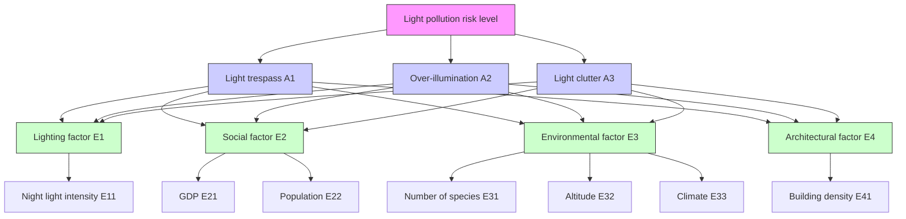
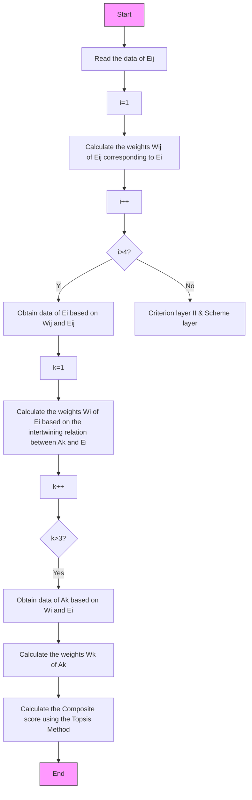

# Evaluation and Optimization of Light Pollution Based on EWM-TOPSIS

In order to alleviate the more and more serious light pollution phenomenon, this paper will analyze the issues related to the evaluation of light pollution risk levels and light pollution treatment by establishing mathematical models.

For problem 1, firstly, a hierarchical interactive evaluation index system with 7 factors that impact the risk level of regional light pollution is established in this paper. After that, an Evaluation Model of Light Pollution Risk Level is established based on this. A combination of the Entropy Weighting Method and TOPSIS is used to evaluate the selected specific locations that aim to formulate the metrics of light pollution risk level.

For problem 2, In order to visually reflect the light pollution risk levels of the four types of locations, this paper takes Shaanxi Province, China, as the research area, and utilizes ArcGIS geographic information software to calculate the geometric shape centers of the plots and extract the data of each index. On this basis, the constructed light pollution risk level model is applied to measure the light pollution level of the four types of locations and produce a map of light pollution risk distribution in Shaanxi Province in 2022. The results showed that urban communities, represented by Xi'an, Shaanxi Province, had the highest light pollution risk level of 0.407. Light pollution risk scores in protected land, rural and suburban communities were 1.1%, 6.8%, and 68.6% of urban communities, respectively.

For problem 3, this paper proposes three light pollution treatment strategies and quantitatively analyzes the impact of the three light pollution treatment strategies on each light pollution risk level evaluation index. In this way, a Light Pollution Treatment Optimization Model is constructed to optimize the evaluation indexes that affect the light pollution risk level. Lastly, the potential impact of light pollution treatment is analyzed by combining the optimized light pollution risk values.

For problem 4, nature reserves and urban communities are selected for evaluation among four types of sites, and the optimization model of light pollution treatment is applied to analyze the effectiveness of three light pollution treatment strategies for these two sites. To determine the optimal improvement strategies for the evaluation sites in the short-term (0-10 years), mediumterm (11-35 years), and long-term (36-50 years), respectively, this paper uses Logistic equations to predict the population data and also combines the predicted values of other factors by Arima time series method for the optimized light pollution score calculation. Comparing the risk levels before and after optimization, the results show that the optimal strategies for urban communities in the short-term, interim, and long-term are the strategies of raising residents' awareness of light pollution treatment, the strategies of regulating market standards, and the strategies of establishing a sound social monitoring mechanism, respectively; while in the next 50 years, the effects of the three optimal strategies on the treatment of protected land are not obvious, because the light pollution risk level in protected land itself is low and not easily influenced by external factors. For urban communities, crime rates increased by an average of 2.140%, and traffic accident rates decreased by an average of 2.135% in areas following light pollution treatment.

Finally, based on the results of solving the above mathematical model, we make flyers to advertise light pollution treatment measures in urban communities represented by Xi'an, China.

## Contents

## 1 Introduction.....................

1.1 Background . 3

1.1.1 Light Pollution 3

1.1.2 Sunshade (

1.2 Restatement of the Problem 4

## 2 Our Approach ..

## 3 Model Preparation..

3.1 Assumptions. 5

3.2 Notations 6

3.3 Study Region and Data Collection.. 6

## 4 Model Establishment and Result Analysis .............

4.1 Model I: Light Pollution Risk Evaluation Model . 6

4.1.1 Establishment of Interactive Evaluation Index System .. 6

4.1.2 Pre-processing of Evaluation Index .. 8

4.1.3 Construction of EWM-TOPSIS Evaluation Model . 8

4.2 Model II: Light Pollution Risk Measurement Application Model. 10

4.2.1 Classification of Land Types in the Region. 10

4.2.2 Selection of Evaluation Sites . 11

4.2.3 Data Extraction and Processing ... 12

4.2.4 Solution of Model II. 13

4.3 Model III: Light Pollution Treatment Optimization Model. 14

4.3.1 Formulation of Light Pollution Treatment Strategies.. . 15

4.3.2 Prediction of Evaluation Indicators 15

4.3.3 Quantification of the Impact of Treatment Strategies.. . 16

4.3.4 Judging the Strengths and Weaknesses of Treatment Strategies . . 18

4.3.5 Potential Impact of Light Pollution Treatment . . 18

4.4 Model IV: Light Pollution Treatment Application Model. 19

4.4.1 Selection of the Research Sites . 19

4.4.2 Prediction of Original Data of Evaluation Index .. . 20

4.4.3 Judging the Strengths and Weaknesses of Treatment Strategies . .. 21

4.4.4 Analysis of Potential Impact of Light Pollution Control . . 22

## 5 Test of the Model... 23

## 6 Evaluation and Improvement of the Model ..... . 23

6.1 Strengths of the Model. 23

6.2 Weaknesses of the Model . 23

## References......... . 24

## Flyer: Speak for the Stars… 25

## 1 Introduction

To enable reasonable modeling, this section will introduce the phenomenon of light pollution and the proper nouns involved in the paper. It will also sort out and evaluate the issue that the subject necessitates solving.

## 1.1 Background

## 1.1.1 Light Pollution

According to reference [1], light pollution, also known as light damage, is an ecologically damaging phenomenon caused by the excessive use of artificial light as humans enter industrial society. Light pollution is a by-product of industrial development, mainly from home lighting, industrial lighting, recreational activities, sports field lighting, etc. Its common forms include light trespass, over-illumination (e.g. Figure 1) and light clutter (e.g. Figure 2).

natural_image

Nighttime aerial view of a densely built cityscape with illuminated skyscrapers and a power transmission tower silhouette (no visible text or signage)

Figure 1 The City of Lights（https://baike.sogou.com）

natural_image

Nighttime aerial view of a futuristic cityscape with illuminated skyscrapers and colorful light trails (no visible text or symbols)

Figure 2 Colorful city lights （https://baike.sogou.com）

Light trespass is the phenomenon of artificial light covering the natural state of dark areas, while over-illumination refers to the use of light intensity higher than the required level, thereby creating light interference in the surrounding area phenomenon. These two phenomena are correlated in a certain way, meaning that over-illumination will cause light trespass at the same moment. Light clutter is a light pollution phenomenon which is caused by an excess of light wavelength and color blending.

The main countries seriously affected by light pollution are developed countries like Japan and the United States, as well as in developed areas of developing countries like China. Light pollution may cause human sleep deprivation, stress, disruption of plant and animal growth rhythms ,and other hazards, which can be mitigated by taking measures to improve lighting systems, laws, and regulatory systems.

## 1.1.2 Sunshade

Sunshade is a type of architectural design that, by rerouting light and altering its path, lowers the dangers of sunlight and light pollution. It is frequently used in tall houses made of

text_image

Reflection Block Area Glass Curtain Wall Incident Occlusion Region
Sunshade Strip
Reflected Light Incident Light
Sunshade Strip

Figure 3 Operating principle diagram of vertical sunshade(plan view)

text_image

Sunshade Strip
Incident Occlusion Region
Glass Curtain Wall
Reflection Block Area
Sunshade Strip
Incident Light
Reflected Light

Figure 4 Operating principle diagram of horizontal sunshade (longitudinal section)

glass curtain materials in urban areas [2]. Sunshades can be categorized into two categories: vertical sunshades and horizontal sunshades. Figures 3 and 4 above illustrate the corresponding operating principles for each category.

The incident shading area and the reflected shading area are created on the glass curtain wall by the sunshade, which significantly lowers the glass curtain wall's reflective area, as can be seen from the principle of the above figures [2]. Through the simultaneous use of vertical and horizontal sunshades, the light can also be reflected to the ground or light-absorbing materials, effectively reducing the light pollution brought on by secondary reflection of artificial light.

## 1.2 Restatement of the Problem

Light pollution can have a negative impact on people's daily lives and the ecosystem. This paper integrates various factors to evaluate the effects of light pollution in various locations and suggests some steps that can mitigate the effects of light pollution in an effort to increase people's awareness of the effects of light pollution. The following are the particular problems that need to be solved:

1. Establish an evaluation model that can assess the risk level of light pollution at any location by taking into account the population, biodiversity, geographical conditions, climatic conditions, and degree of development of the area.  
2. The light pollution risk level evaluation model is applied to evaluate the light pollution risk levels of the four types of locations involved in the question, and the reasons for the evaluation results are analyzed.  
3. Propose strategies to the light pollution issue and analyze the effects of each optimization strategy's measure on light pollution as well as the potential impacts of light pollution improvement on society.  
4. Two sites were selected from the four types of sites to determine the optimal light pollution management strategy for each. In addition, the impact of each strategy on the light pollution phenomenon is quantified, and the causes of the various impacts are analyzed.  
5. Make a flyer for local distribution to publicize light pollution measures in a particular location.

## 2 Our Approach

Combining the requirements of problem and relevant background information, through data collection, processing and analysis, the approach in this paper is as follows.

## ➢Measurement of light pollution risk

## 1.Establishment of light pollution risk evaluation model

A hierarchical interactive evaluation index system based on the categorization of light pollution phenomena will be established as the foundation for further scoring in response to the specifications stated in question 1. The entropy weight method is then used cyclically to compute the factors in the evaluation index system in a stratified fashion and determine their weights based on the samples of data that have been gathered. The specified locations are scored using the TOPSIS evaluation model in combination with the weights determined by the entropy weight method after standardizing and normalizing the various types of data. The scoring outcomes and established light pollution rating criteria can then be used to calculate the risk of light pollution at the designated location.

## 2.Establishment of light pollution risk measurement application model

In order to solve problem 2,this paper will first divide the land in the study area into the four land types specified by the question, using Shaanxi Province, China, as an example. Following that, ArcGIS software will compute the geometric shape centers of the divided land parcels using the WGS1984 projection coordinate system. The extracted value tool was used to extract each category of index's raster data to its associated shape-center points, whereupon the light pollution risk evaluation model was used to determine the shape-center light pollution risk score. Lastly, the light pollution risk value for this type of site is calculated using the average of the scores at the geometric center of the same type of site, eliminating individual differences and improving measurement accuracy.

## ➢Optimization of light pollution problems

## 3.Establishment of light pollution treatment optimization model

For problem 3, this paper incorporates the causes of light pollution and the objects they affect in order to develop three optimization strategies from both subjective and objective aspects, each of which includes a mix of mandatory and soft requirements. The impact is then quantified into the evaluation index system established by model 1 based on the predetermined measures, and the optimized factor values are then scored again using the Entropy Weight Method-TOPSIS evaluation model to determine the light pollution level following the implementation of the improvement measures. In order to compare the benefits and drawbacks of the three strategies and determine the potential effects of improving light pollution on society, the light pollution risk ratings before and after the improvement are compared.

## 4.Establishment of light pollution control application model

As required by question 4, in order to investigate the applicability of each policy in extreme situations and reasonably determine the optimization effectiveness of the centered locations of light pollution risk under the three policies, we will choose the two form centers with the largest difference in light pollution scores in 2022 among the form centers of divided plots in Shaanxi Province. In order to study the applicability of different strategies in the short term (next 0-10 years), medium term (next 11-35 years), and long term (next 36-50 years),we will gather data on some of the evaluation indicators for the two selected points in previous years and predict their values for the next 50 years using Logistic equations and Arima time series after identifying the optimization sites. Finally, to determine the optimal strategy for the two sites over time and the potential effects of reduced light pollution, the predicted original values and optimized values of the three policies were added year by year into model 1 for evaluation and comparison.

After solving all the problems, this paper will select the optimal light pollution improvement strategy for a specific location based on the model results and analysis, and write a flyer for dissemination.

## 3 Model Preparation

## 3.1 Assumptions

In this paper, the following reasonable assumptions are formulated in order to be able to solve the issue effectively.

1.For the next 50 years, there won't be a substantial change in the zoning of land use in the study region.

Explanation: Based on the four site types listed in the title, this research generally categorizes the site characteristics of the study region. Small-scale changes in site characteristics brought on by new construction, relocation, etc. have little impact on the parcel's overall characteristics.

2.Negligible changes in elevation of sites in the study area over a long period of time in the future.

Explanation: Elevation is a naturally occurring feature, and when crustal movement is not dramatic, even minor changes to it are insignificant in comparison to the current base.

3.Ecological collapse in the research area caused by a significant natural disaster or conflict is not taken into account.

## 3.2 Notations

Important notations used in this paper are listed in Table 1.

Table 1 Notations

<table><tr><td>Symbol</td><td>Definition</td><td>Unit</td></tr><tr><td> $W_j$ </td><td>Index weight</td><td>/</td></tr><tr><td> $D_i$ </td><td>Relative proximity</td><td>/</td></tr><tr><td> $E_A$ </td><td>Illumination intensity</td><td>Lx</td></tr><tr><td> $C_i$ </td><td>Crime rate</td><td>/</td></tr><tr><td> $T_i$ </td><td>Traffic accident rate</td><td>/</td></tr></table>

## 3.3 Study Region and Data Collection

The geographical center of China is the Shaanxi Province, which is situated in the country's interior and has a number of big and small towns, suburbs, and rural areas. Furthermore, Shaanxi Province is home to 12 environmental reserves, including the Qinling Nature Reserve, one of the biggest in China and one of the model reserves in Asia according to the Global Environment Facility in 1996 due to its remarkable and representative biodiversity. In conclusion, Shaanxi Province was selected as the study location in this work because it has four different types of sites in the topic and has a high reference value.

In this paper, a wide variety of economic statistics and geographic information data are used in the modeling process. These data primarily include nighttime light distribution data, precipitation distribution data, DEM digital elevation maps, GDP distribution data, population distribution data, biodiversity data, building density data, and the number of criminal suspects arrested and the number of traffic accidents occurred in Shaanxi Province, China, over a long period of time. Table 2 below lists the sources of these data.

Table 2 Data source summary

<table><tr><td>Website</td><td>Data format</td></tr><tr><td>https://www.resdc.cn/Default.aspx</td><td>.tif</td></tr><tr><td>http://srtm.csi.cgiar.org/srtmdata/</td><td>.tif</td></tr><tr><td>https://bio-one.org.cn</td><td>.xlsx</td></tr><tr><td>http://www.dsac.cn/</td><td>.xlsx</td></tr><tr><td>http://www.stats.gov.cn/</td><td>.xlsx</td></tr></table>

## 4 Model Establishment and Result Analysis

## 4.1 Model I: Light Pollution Risk Evaluation Model

The impact of light pollution depends on a variety of factors.As the study objects in this section, four elements and seven distinct evaluation indices for assessing the impact of light pollution will be used to build a hierarchical interactive light pollution risk level evaluation index system. And using this information, a complete evaluation approach that combines the TOPSIS method and the entropy weight method will be utilized to build a model for evaluating the risk level of light pollution.

## 4.1.1 Establishment of Interactive Evaluation Index System

Combined with the actual situation, lighting factors, social factors, environmental factors and policy factors are taken into account to build a light pollution risk level evaluation index system. The principles of indicator selection are as follows:

## ➢Lighting Factors

Artificial light is an essential factor in triggering the phenomenon of light pollution. Flashing neon lights and various lighting systems at night can cause the phenomenon of artificial daylight in cities when the light intensity is high enough, resulting in huge light pollution. Therefore, this paper measures the lighting factors in different areas by using the light intensity at night as an indicator, and the higher the light intensity at night in an area, the higher the level of light pollution risk in that area.

## ➢Social Factors

The number of lighting systems needed and the potential risk of light pollution in a region both increase with a region's level of development and population size. To measure the social elements in various regions, this paper uses the GDP (Gross Domestic Product) and population size of those regions as indicators

## ➢Environmental Factors

The level of light pollution risk in a region will also rely on the local environmental circumstances because, in addition to having a negative influence on daily human life, light pollution can also have a significant negative impact on the ecological environment.Normally, the risk of light pollution is lower and the number of lighting systems required is smaller in areas with higher altitudes and smaller populations. The amount of precipitation in various places is also an important aspect to take into account because one important cause of light pollution is the scattering of light through water vapor particles in the air to produce halos. Moreover, light pollution can make plants and animals more nocturnal, which has an impact on the diversity of species. The higher the danger of light pollution in a region, the less diverse that region is.

## ➢Architectural Factors

The level of light pollution risk in an area will usually be related to the construction planning of the area, such as construction land planning. The higher the planned building density, the more the number of buildings in the area. The increase in the number of buildings will lead to an increase in the number of lighting systems, while various decorations such as glass curtain walls, polished marble and paint of various buildings will also reflect light and produce light pollution such as glare, so the building density in different areas is also a factor we need to consider.

In summary, the light pollution phenomenon in a hierarchical manner is constructed as Figure 5 below.

flowchart

Figure 5 Hierarchical interactive evaluation index system

As can be seen from the figure above, over-illumination and light clutter, etc. It is obvious that different forms of light pollution phenomena depend on different factor indicators.

According to our analysis and definition of different factor indicators, the risk level of overillumination is primarily determined by lighting factors, social factors and environmental factors, the risk level of light clutter is mostly driven by social factors, and the risk level of light trespass depends on the influence of the above four elements. As illustrated in the above picture, various light pollution phenomena between and between various components will have mutual influence and restrictions, which is consistent with the actual situation.

## 4.1.2 Pre-processing of Evaluation Index

According to their characteristics, the different types of indicators can be classified as maximum indicators, minimal indicators, medium indicators, and interval-type indicators; only maximum indicators and minimal indicators are discussed in this work. The rating of the evaluation object increases as the value of maximum indicators increases and the value of minimal indicators decreases. It is frequently necessary to pre-process various types of evaluation indicators before building the model because of the different nature of evaluation indicators for different factors, which frequently results in huge differences in values that ultimately affect the evaluation effect of the model. The pre-processing methods are as follows.

## step1.Dimensionless processing

With the vector specification approach, each element of the original matrix is normalized to within , converting each indicator into a dimensionless value that can be compared among indicators. The principle is as follows.

$$
x _ {i 0} ^ {\prime} = \frac {x _ {i}}{\sqrt {\sum_ {i = 1} ^ {n} x _ {i} ^ {2}}} \tag {1}
$$

Where $x _ { i }$ is the original value of the index, $\boldsymbol { x } _ { i 0 } ^ { \prime }$ is the dimensionless value of the index.

## step2. Indicator normalization process

No processing is required for the maximum value indicator. For the minimal value indicator ,a forwarding process is required to convert it to a maximum value indicator, as follows.

$$
x _ {i} ^ {\prime} = M - x _ {i 0} ^ {\prime} \tag {2}
$$

Where is the allowed upper limit of the index, which is dimensionless and takes the value of 1. $\boldsymbol { x } _ { i } ^ { \prime }$ is the result of the normalization of the minimal index.

## 4.1.3 Construction of EWM-TOPSIS Evaluation Model

Generally, two evaluation methods are combined to achieve the goal of complementing each other's strengths and weaknesses in order to address the deficiencies of a single evaluation approach. The TOPSIS method is used in this paper to evaluate the object to be evaluated after the weights of each index are determined using the Entropy Weight Method. The specific steps are as follows.

## step1.Construction of evaluation matrix based on indicators

$$
R = \left[ \begin{array}{c c c c} r _ {1 1} & r _ {1 2} & \dots & r _ {1 n} \\ r _ {2 1} & r _ {2 2} & \dots & r _ {2 n} \\ \vdots & \vdots & & \vdots \\ r _ {m 1} & r _ {m 2} & \dots & r _ {m n} \end{array} \right] _ {m \times n} = \left(r _ {i j}\right) _ {m \times n} \tag {3}
$$

where, is the number of pre-selected evaluation individuals; is the number of evaluation indicators; and $r _ { i j }$ is the value of indicators after pre-processing.

## step2. Calculate the entropy value and determine the weights [3]

First, the weight of the th object under the th indicator is calculated, i.e., the contribution : $P _ { i j }$

$$
P _ {i j} = \frac {r _ {i j}}{\sum_ {i = 1} ^ {m} r _ {i j}} \tag {4}
$$

From this, we can calculate the entropy value $E _ { j }$ for the $j$ th indicator:

$$
E _ {j} = - \frac {1}{\ln n} \sum_ {i = 1} ^ {n} P _ {i j} \ln P _ {i j} \tag {5}
$$

This gives the weight $W _ { j }$ of each indicator as:

$$
W _ {j} = \frac {1 - E _ {j}}{\sum_ {i = 1} ^ {m} (1 - E _ {j})} \tag {6}
$$

This paper adopts the principle of Entropy Weight Method to calculate the relative weights of the bottom layer to the top layer layer by layer, and finally the absolute weights of the scheme layer and the guideline layer to the target layer are calculated from the relative weights due to the interaction phenomenon of the elements within the evaluation index system.The calculating principle is shown in Figure 6 below.

flowchart

Figure 6 Entropy weight method calculation process

step3. Construct the weighted normalized decision matrix [4]

$$
V = W _ {j} r _ {i j} ^ {\prime} = \left[ \begin{array}{c c c c} w _ {1} r _ {1 1} ^ {\prime} & w _ {2} r _ {1 2} ^ {\prime} & \dots & w _ {n} r _ {1 n} ^ {\prime} \\ w _ {1} r _ {2 1} ^ {\prime} & w _ {2} r _ {2 2} ^ {\prime} & \dots & w _ {n} r _ {2 n} ^ {\prime} \\ \vdots & \vdots & \vdots & \vdots \\ w _ {1} r _ {m 1} ^ {\prime} & w _ {2} r _ {m 2} ^ {\prime} & \dots & w _ {n} r _ {m n} ^ {\prime} \end{array} \right] _ {m \times n} \tag {7}
$$

step4. Calculate the relative proximity of pre-selected points [4]

In the weighted normalized decision matrix, the vector consisting of the largest element in each column is taken as the positive ideal point $u ^ { + }$ ：

$$
\left\{ \begin{array}{l} u ^ {+} = (u _ {1} ^ {+}, u _ {2} ^ {+},..., u _ {n} ^ {+}) \\ u _ {j} ^ {+} = \max \{u _ {i j} \} \quad (j = 1, 2,..., n) \end{array} \right. \tag {8}
$$

Similarly, take the vector consisting of the smallest element in each column as the negative ideal point $u ^ { - }$ ：

$$
\left\{ \begin{array}{l} u ^ {-} = (u _ {1} ^ {-}, u _ {2} ^ {-},..., u _ {n} ^ {-}) \\ u _ {j} ^ {-} = \min \{u _ {i j} \} \quad (j = 1, 2,..., n) \end{array} \right. \tag {9}
$$

From this, the relative proximity $D _ { i }$ of the evaluation sites can be calculated：

$$
D _ {i} = \frac {\left\langle \Delta u _ {i} , \Delta u \right\rangle}{\| \Delta u \| ^ {2}}, i = 1, 2, \dots m \tag {10}
$$

where， $\Delta { \mathrm u } = u ^ { + } - u ^ { - } ; ~ \Delta u _ { i } = u _ { i } - u ^ { - } ; ~ \lVert ~ \Delta u ~ \rVert$ is the Euclidean norm of $\Delta { \mathrm u }$ ：

$$
\| \Delta u \| = \left\{\sum_ {j = 1} ^ {m} (u _ {j} ^ {+} - u _ {j} ^ {-}) ^ {2} \right\} ^ {\frac {1}{2}} \tag {11}
$$

where, the value range of $D _ { i } { \mathrm { ~ i s } } [ 0 , 1 ]$ , and the larger $D _ { i }$ indicates the higher risk level of light pollution at the evaluation site.

## step5. Determine the risk level of light pollution

In this paper, the quintiles in statistics were used as the basis for the division [5], and the score intervals of the evaluation model were divided as shown in Table 3 below.

Table 3 Light pollution risk level evaluation table

<table><tr><td>Risk level</td><td>Low risk</td><td>Medium-low risk</td><td>Medium risk</td><td>Medium-high risk</td><td>High risk</td></tr><tr><td> $D_i$ </td><td>[0, 0.2]</td><td>(0.2, 0.4]</td><td>(0.4, 0.6]</td><td>(0.6, 0.8]</td><td>(0.8, 1]</td></tr></table>

Thus, the theoretical framework of the light pollution evaluation model is built and can be used for subsequent site-specific assessment of light pollution risk levels.

## 4.2 Model II: Light Pollution Risk Measurement Application Model

This section divides the four different land use types in Shaanxi province using ArcGIS geographic information software, extracts the geographic information data of various locations, and then uses Model I to calculate the light pollution risk level of each location in Shaanxi. This allows the light pollution risk level of the four different land use types to be more intuitively reflected.

## 4.2.1 Classification of Land Types in the Region

This paper will assess the risk of light pollution at four different types of sites in accordance with the demands of the subject. It is necessary to choose a study region that has four different types of sites at once in order to avoid geographical disparities and display the danger level of light pollution from various types of sites more intuitively.

Shaanxi Province in China was selected for this paper's study area based on the data analysis. The protected land, rural communities, suburban communities, and urban communities in Shaanxi Province were separated using ArcGIS geographic information software based on the geographic information features of Shaanxi Province, and the results of the division are shown in Figure 7.

text_image

The suburbs of Ganquan County
Scenery of Yanchuan County
Qinling Nature Reserve
Provincial capital
Downtown area of Xi'an
Urban Community
Suburban Community
Rural Community
Protected Land

Figure 7 Shaanxi Province land type division schematic (Scenic images from https://www.baidu.com/)

## 4.2.2 Selection of Evaluation Sites

In order to calculate the level of light pollution risk in four different types of regions, we calculate the geometric shape centers [6] of the plates in various regions based on the four types of geographic regions in Shaanxi Province as previously classified. The calculated centroid is shown in the Figure 8 below.

geographic map

| Region | Centroid Status | Location Type | Number of Communities |
|---|---|---|---|
| Central | Urban Community | Centroid of Urban Community | 33 |
| Central | Suburban Community | Centroid of Suburban Community | 32 |
| Central | Rural Community | Centroid of Rural Community | 17 |
| Central | Protected Land | Centroid of Protected Land | 0 |
| Northeast | Urban Community | Centroid of Urban Community | 28 |
| Northeast | Suburban Community | Centroid of Suburban Community | 27 |
| Northeast | Rural Community | Centroid of Rural Community | 13 |
| Southeast | Urban Community | Centroid of Urban Community | 25 |
| Southeast | Suburban Community | Centroid of Suburban Community | 21 |
| Southeast | Rural Community | Centroid of Rural Community | 16 |
| Midwest | Urban Community | Centroid of Urban Community | 29 |
| Midwest | Suburban Community | Centroid of Suburban Community | 15 |
| Midwest | Rural Community | Centroid of Rural Community | 3 |
| Southwest | Urban Community | Centroid of Urban Community | 30 |
| Southwest | Suburban Community | Centroid of Suburban Community | 24 |
| Southwest | Rural Community | Centroid of Rural Community | 9 |
| West Coast | Urban Community | Centroid of Urban Community | 15 |
| West Coast | Suburban Community | Centroid of Suburban Community | 11 |
| West Coast | Rural Community | Centroid of Rural Community | 6 |
| Mountain West | Urban Community | Centroid of Urban Community | 22 |
| Mountain West | Suburban Community | Centroid of Suburban Community | 19 |
| Mountain West | Rural Community | Centroid of Rural Community | 13 |
| Central Plains | Urban Community | Centroid of Urban Community | 26 |
| Central Plains | Suburban Community | Centroid of Suburban Community | 25 |
| Central Plains | Rural Community | Centroid of Rural Community | 10 |
| Northeastern Plains | Urban Community | Centroid of Urban Community (Suburban) | 28 |
| Northeastern Plains | Suburban Community (Rural) | Centroid of Suburban Community (Rural) | 21 |
| Northeastern Plains | Rural Community (Rural) | Centroid of Rural Community (Rural) | 16 |
| Southern Plains | Urban Community | Centroid of Urban Community (Rural) | 33 |
| Southern Plains | Suburban Community (Rural) | Centroid of Suburban Community (Rural) | 27 |
| Southern Plains | Rural Community (Rural) | Centroid of Rural Community (Rural) | 13 |
| Central Plains (Northern) | Urban Community | Centroid of Urban Community (Rural) | 28 |
| Central Plains (Northern) | Suburban Community (Rural) | Centroid of Suburban Community (Rural) | 25 |
| Central Plains (Northern) | Rural Community (Rural) | Centroid of Rural Community (Rural) | 13 |
| Central Plains (Central) | Urban Community (Rural) | Centroid of Urban Community (Rural) | 30 |
| Central Plains (Central) | Suburban Community (Rural) (Rural) | Centroid of Suburban Community (Rural) | 24 |
| Central Plains (Central) | Rural Community (Rural) (Rural) | Centroid of Rural Community (Rural) | 9 |
The chart displays a legend for 'Centroid of Protected Land' with color-coded regions: red triangles for Urban, yellow diamonds for Suburban, orange squares for Rural, and green stars for Protected Land. The central legend indicates that red triangles represent the highest number of community centers, while green stars represent the lowest. The data is presented in a grid layout with labeled regions along the map.

Figure 8 Distribution of evaluation points for different types of land

The geometric centroid divided by different types of land is calculated as shown in the following Table 4.

Table 4 Classification of different types of land evaluation points

<table><tr><td>Location types</td><td>Protected land location</td><td>Rural community</td><td>Suburban community</td><td>Urban community</td></tr><tr><td>Number</td><td>0-3</td><td>4-16</td><td>17-26</td><td>27-33</td></tr></table>

Finally, the central location of each region is evaluated, and the light pollution risk level of the central location of each region represents the overall light pollution risk level of each region.

## 4.2.3 Data Extraction and Processing

According to the evaluation system of light pollution risk level constructed in Model I, we need to determine the data of each index for each evaluation site.

## A.Geographic Information Data

The essential index data for each evaluation site are gathered using geo-visualized information data picture extraction in order to precisely compute the light pollution risk level of each evaluation site. The location data of official observation locations and the data they collected make up the visible geographic information data map. In order to generate the evaluation index data for each individual coordinate point in the entire map region, we combined the data provided in the visible geographic information data map using Kriging interpolation, which is based on the following concept [7].

$$
Z ^ {*} (x _ {0}) = \sum_ {i = 1} ^ {N} \lambda_ {i} Z (x _ {i}) \tag {12}
$$

Where $Z ( x _ { i } )$ is the target point evaluation index data; $\lambda _ { i }$ is the offset coefficient, which satisfies $\sum _ { i = 1 } ^ { N } \lambda _ { i } = 1 ( N { = } 1 2 0 ) ; Z ^ { * } ( x _ { 0 } )$ is the index estimation value. Thus, the distribution data of light intensity, GDP, population, altitude and precipitation in Shaanxi Province in 2022 obtained in this paper are shown in Figure 9 below.

heatmap

| Region | Population | GDP | Altitude (m) | Nocturnal Light Intensity (p) | Precipitation (p) |
| --- | --- | --- | --- | --- | --- |
| Central | 41965 | 542505 | 3740 | 3740 | 12081.3 |
| Provincial boundary | 2762.42 | 542505 | 3740 | 3740 | 12081.3 |
| Population | 41965 | 542505 | 3740 | 3740 | 12081.3 |
| Central boundary | 2762.42 | 542505 | 3740 | 3740 | 12081.3 |
| Provincial boundary | 2762.42 | 542505 | 3740 | 3740 | 12081.3 |
| Population | 41965 | 542505 | 15 | 15 | 12081.3 |
| Central boundary | 2762.42 | 542505 | 15 | 15 | 12081.3 |
| Provincial boundary | 2762.42 | 542505 | 15 | 15 | 12081.3 |
| Population | 41965 | 542505 | 15 | 15 | 12081.3 |
| Central boundary | 2762.42 | 542505 | 15 | 15 | 12081.3 |
| Provincial boundary | 2708.13 | 542505 | 15 | 15 | 12081.3 |
| Provincial boundary | 2762.42 | 542505 | 15 | 15 | 12081.3 |
| Population | 41965 | 542505 | 15 | 15 | 12081.3 |
| Central boundary | 2762.42 | 542505 | 15 | 15 | 12081.3 |
| Provincial boundary | 2762.42 | 542505 | 15 | 15 | 12081.3 |
| Provincial boundary | 2762.42 | 542505 | 15 | 15 | 12081.3 |
| Population | 41965 | 542505 | 15 | 15 | 12081.3 |
| Central boundary | 2762.42 | 542505 | 15 | 15 | 12081.3 |
| Provincial boundary | 2708.13 | 542505 | 15 | 15 | 12081.3 |
| Provincial boundary | 2762.42 | 542505 | 15 | 15 | 12081.3 |
| Population | 41965 | 542505 | 15 | 15 | 12081.3 |
| Central boundary | 2762.42 | 542505 | 15 | 15 | 12081.3 |
| Provincial boundary | 2762.42 | 542505 | 15 | 15 | 12081.3 |
| Provincial boundary | 2762.42 | 542505 | 15 | 15 | 12081.3 |
| Population | 41965 | 542505 | 15 | 15 | 12081.3 |
| Central boundary | 2762.42 | 542505 | 15 | 15 | 12081.3 |
| Provincial boundary | 2708.13 | 542505 | 15 | 15 | 12081.3 |
| Provincial boundary | 2762.42 | 542505 | 15 | 15 | 12081.3 |

text_image

(a) Altitude of Shaanxi Province in 2022
(b) Nocturnal light intensity in Shaanxi Province in 2022
• Centroid
      Provincial boundary
Altitude
Max:3740
Min:150
▲ Centroid
      Provincial boundary
Light intensity
Max:63
● Min:0

choropleth map

(d) Pop
| Region | Value |
|---|---|
| Central | 17 |
| Provincial boundary | 32 |
| GDP | Max:542505 |
| Min:63 | 9 |
| Centroid | 11 |
| 24 | 30 |
| 30 | 8 |
| 31 | 31 |
| 32 | 19 |
| 33 | 22 |
| 4 | 11 |
| 6 | 17 |
| 12 | 25 |
| 18 | 18 |
| 25 | 31 |
| 30 | 26 |
| 31 | 31 |
(d) Population

choropleth map

Population of Shaanxi province in 2022
| Region | Population (Millions) |
|---|---|
| Central Province | 43 |
| Provincial Boundary | 15 |
| Provincial boundary | 27 |
| Provincial boundary | 24 |
| Provincial boundary | 30 |
| Provincial boundary | 33 |
| Provincial boundary | 32 |
| Provincial boundary | 31 |
| Provincial boundary | 28 |
| Provincial boundary | 26 |
| Provincial boundary | 25 |
| Provincial boundary | 24 |
| Provincial boundary | 23 |
| Provincial boundary | 21 |
| Provincial boundary | 20 |
| Provincial boundary | 19 |
| Provincial boundary | 18 |
| Provincial boundary | 17 |
| Provincial boundary | 16 |
| Provincial boundary | 15 |
| Provincial boundary | 14 |
| Provincial boundary | 13 |
| Provincial boundary | 12 |
| Provincial boundary | 11 |
| Provincial boundary | 10 |
| Provincial boundary | 9 |
| Provincial boundary | 8 |
| Provincial boundary | 7 |
| Provincial boundary | 6 |
| Provincial boundary | 5 |
| Provincial boundary | 4 |
| Provincial boundary | 3 |
| Provincial boundary | 2 |
| Provincial boundary | 1 |
| Provincial boundary | 0 |
(e) Pre-

choropleth map

Cipitation in Shaanxi province in 2022
| Region | Precipitation (mm) |
|---|---|
| 1 | 27 |
| 2 | 21 |
| 3 | 16 |
| 4 | 19 |
| 5 | 33 |
| 6 | 17 |
| 7 | 18 |
| 8 | 10 |
| 9 | 26 |
| 10 | 10 |
| 11 | 11 |
| 12 | 25 |
| 13 | 13 |
| 14 | 14 |
| 15 | 23 |
| 16 | 16 |
| 17 | 32 |
| 18 | 18 |
| 19 | 19 |
| 20 | 20 |
| 21 | 28 |
| 22 | 22 |
| 23 | 20 |
| 24 | 30 |
| 25 | 31 |
| 26 | 26 |
| 27 | 13 |
| 28 | 28 |
| 29 | 9 |
| 30 | 30 |
| 31 | 31 |
Max:12081.3
Min:2762.42

Figure 9 Shaanxi Province Geographic data for each evaluation site in 2022

## B.Textual Data

For data like biodiversity and building density of the area, we collected and compiled them by finding relevant official documents for the four types of sites given in the question.

For biodiversity, we refer to the biodiversity data in the BioONE biodiversity big data platform to determine the biodiversity data for four different types of sites, as shown in Table 5 below.

Table 5 Biodiversity reference for different types of sites

<table><tr><td>Location types</td><td>Protected land location</td><td>Rural community</td><td>Suburban community</td><td>Urban community</td></tr><tr><td>plants</td><td>3646-4892</td><td>2896-3112</td><td>1592-2706</td><td>1204-1537</td></tr><tr><td>birds</td><td>449-508</td><td>340-358</td><td>197-316</td><td>160-169</td></tr><tr><td>beasts</td><td>71-89</td><td>37-61</td><td>17-33</td><td>6-14</td></tr><tr><td>amphibians</td><td>53-73</td><td>40-46</td><td>16-25</td><td>9-12</td></tr><tr><td>reptiles</td><td>81-95</td><td>43-54</td><td>27-37</td><td>14-24</td></tr><tr><td>Number of species</td><td>4300-5657</td><td>3356-3631</td><td>1849-3117</td><td>1393-1756</td></tr></table>

Combining geographic information data from specific evaluation sites, we can determine the biodiversity of different evaluation sites.

We gathered and summarized the geographical distribution information of construction land in Shaanxi Province for the building density of four different types of sites, as shown in Table 6 below. We can calculate the building density of the various evaluation sites using the geographic information data of the particular evaluation sites.

Table 6 Building density reference for different types of sites

<table><tr><td>Location types</td><td>Protected land location</td><td>Rural community</td><td>Suburban community</td><td>Urban community</td></tr><tr><td>Building density</td><td>0-1%</td><td>3%-5%</td><td>6%-9%</td><td>26%-30%</td></tr></table>

## 4.2.4 Solution of Model II

The weights of various assessment indicators between various levels can be derived using the entropy weighting method in accordance with the constructed evaluation system of light pollution risk level. Figure 10 below illustrates the specifics.

heatmap

(a) Criterion layer II-Scheme layer
| | E11 | E21 | E22 | E31 | E32 | E33 | E41 |
|---|---|---|---|---|---|---|---|
| E1 | 1 | 0 | 0 | 0 | 0 | 0 | 0 |
| E2 | 0 | 0.356 | 0.644 | 0 | 0 | 0 | 0 |
| E3 | 0 | 0 | 0 | 0.307 | 0.320 | 0.372 | 0 |
| E4 | 0 | 0 | 0 | 0 | 0 | 0 | 1 |

heatmap

(b) Criterion layer I-Criterion layer II
| | E1 | E2 | E3 | E4 |
|---|---|---|---|---|
| A3 | 0.434 | 0.385 | 0.020 | 0.160 |
| A2 | 0.521 | 0.455 | 0.024 | 0 |
| A1 | 0 | 0.722 | 0 | 0.278 |

heatmap

(c) Criterion layer I-Scheme layer
| | E11 | E21 | E22 | E31 | E32 | E33 | E41 |
|---|---|---|---|---|---|---|---|
| 0.521 | 0.434 | 0.137 | 0.248 | 0.003 | 0.006 | 0.008 | 0.160 |
| 0.521 | 0.162 | 0.162 | 0.293 | 0.007 | 0.007 | 0.009 | 0 |
| 0 | 0 | 0.257 | 0.465 | 0 | 0 | 0 | 0.278 |

Figure 10 Weights of each level of the evaluation system

As nighttime light intensity and building density have an impact on the lighting factor and the building factor separately in the scheme layer, thus, these two indications have a weight of 1 in the criterion layer. The 0 weight is present because some of the indications are unrelated and have no impact on one another. Nighttime light intensity has a higher weight on light trespass and over-illumination among the indicators, while the population factor has a higher weight on light clutter,which indicates population and nighttime light intensity are major factors impacting the danger level of light pollution in the area. This result makes sense because people are direct users of light and nighttime light levels have the most direct impact on light pollution.

The light pollution risk levels at the 34 selected geometric centers were calculated separately based on the weights, and the averages for the four site types in Shaanxi Province were then determined. The information is shown in Table 7 below.

Table 7 Shaanxi Province four types of land light pollution risk level

<table><tr><td>Location types</td><td>Protected land</td><td>Rural community</td><td>Suburban community</td><td>Urban community</td></tr><tr><td>Light pollution risk score</td><td>0.00456</td><td>0.02792</td><td>0.27889</td><td>0.40678</td></tr><tr><td>Risk level</td><td>Low risk</td><td>Low risk</td><td>Medium-low risk</td><td>Medium risk</td></tr></table>

In the four different types of locations, urban communities have the highest level of light pollution risk because of their dense population and high light usage. Suburban and rural communities have a relatively low level of light pollution risk, and protected areas have the lowest level of light pollution risk because of their sparse population and low light usage.

In order to make our model more applicable and meet the requirements of practical applications, we used the Kriging interpolation method to obtain a chart of the risk levels of light pollution for the entire area of Shaanxi Province based on the light pollution data of the 34 evaluation sites selected, as shown in Figure 11 below

heatmap

| Location | Light pollution risk score |
| -------- | ------------------------- |
| Downtown Xi'an | 0.00000406 - 0.00661 |
| Qinling Nature Reserve | 0.645 - 1 |

Figure 11 Map of light pollution risk levels across Shaanxi Province in 2022

From this, this enables us to determine the risk levels for the four different types of areas as well as the risk level of light pollution at each location on the map.

The light pollution risk level map shows that Xi'an, the largest city in Shaanxi Province, has the highest population and light usage, making it the area with the highest risk of light pollution. In contrast, the Qinling Nature Reserve has a lower risk of light pollution because it is protected land with very little population and light usage.

## 4.3 Model III: Light Pollution Treatment Optimization Model

In order to efficiently manage light pollution, in this part, three light pollution management strategies are suggested, and the exact steps involved in putting each plan into practice are explained. This paper forecasts changes in various evaluation indicators over the next 50 years in order to analyze the overall effects of different light pollution management strategies. It also examines the effects of different strategies on short-, medium-, and long-term risk levels of light pollution as well as briefly examines the potential effects of light pollution improvement.

## 4.3.1 Formulation of Light Pollution Treatment Strategies

Given that the effects of light pollution depend on a variety of factors, some of which may alter over time, the governance strategies may include both long-term and short-term plans. Moreover, light pollution treatment strategies can be split into direct protection from the source and indirect protection from other elements based on the optimization object [8]. This led to the three light pollution treatment strategies that are suggested in Table 8 below.

Table 8 Light pollution treatment strategy details

<table><tr><td>Treatment Strategy</td><td>Specific measures</td><td>Description</td></tr><tr><td rowspan="2">Raising awareness of residents to combat light pollution</td><td>Choose environmentally friendly light source</td><td>In the case of meeting normal living needs, residents are recommended to use energy-saving lamps and other environmentally friendly light sources with low light intensity to help reduce the impact of light pollution.</td></tr><tr><td>Selection of environmentally friendly building design</td><td>Building materials with high reflectivity such as highly reflective glass tend to reflect light, so when residents actively choose low-reflective building materials, they can reduce the occurrence of light pollution phenomena such as glare. At the same time, the use of structural designs to control light pollution on buildings (such as sunshades, etc.) can effectively reduce the direct reflection of light pollution.</td></tr><tr><td rowspan="2">Setting standards and norms</td><td>Regulating the lighting market</td><td>Formulate relevant standards to regulate the market for lamps and lanterns, and limit the production scale of high light intensity lamps and lanterns.</td></tr><tr><td>Establishing &quot;environmental red lines&quot;</td><td>When the relevant environmental indicators are lower than the &quot;environmental red line&quot;, appropriate mandatory strategies such as shutting down part of the lighting system to avoid light pollution to cause great damage to the ecological environment.</td></tr><tr><td rowspan="4">Establishment of a sound social regulatory mechanism</td><td>Regulatory light intensity</td><td>Formulate the maximum light intensity of lights allowed in each region and regulate them.</td></tr><tr><td>Regulatory social expansion</td><td>Maintain the orderly development of the society and avoid the increase of light pollution due to the rapid development of the society</td></tr><tr><td>Regulatory environment Indicators</td><td>The environmental indicators of the area are regulated to control the environmental impact of light pollution.</td></tr><tr><td>Regulatory building density</td><td>Regulate the construction industry, such as real estate, to prevent building density from expanding too fast and exacerbating light pollution.</td></tr></table>

## 4.3.2 Prediction of Evaluation Indicators

The above three light pollution reduction strategies and their specific activities will have an impact on a number of evaluation indicators according to the system built in this study for evaluating the danger level of light pollution. This paper forecasts the changes of several assessment indicators over the next 50 years in order to assess the timeliness of the treatment strategies because some indicators will alter over time. Also, the effects of the three treatment strategies on light pollution will be examined over three timespans: short-term (next ten years), medium-term (next 35 years), and long-term (next 50 years). The evaluation indicators' prediction process is as follows.

## ➢Population Projections

We use a separate logistic model [9] that is appropriate for population prediction, has a high data fit, and has a high prediction accuracy for demographic indicators because the weight of demographic indicators is relatively large in our evaluation system and changes in population size can significantly affect the results.

## ➢Other Indicators Projections

We utilized the ARIMA model [10] to make predictions for the data on light intensity, GDP, biodiversity, precipitation, and building density. On the basis of the application of Kriging interpolation, the data were initially extended by the addition of Gaussian perturbations [7]. The indicators of the selected assessment points were projected for the following 50 years after reviewing the current data patterns and completing the prediction model's testing.

## 4.3.3 Quantification of the Impact of Treatment Strategies

To obtain the improvement effect of the three strategies on light pollution, the impact of each specific measure in different strategies on each evaluation index needs to be analyzed. The specific quantification process is as follows.

## Strategy 1. Raising awareness of residents to combat light pollution

## ➢Selecting environmentally friendly light sources

The light intensity of various types of light sources in an area can directly affect the level of light pollution risk in that area. In this paper, we collected and compiled the lighting power of commonly used lamps [11] and the usage ratio of various types of lamps in China in 2020 [12], as shown in Table 9 below.

Table 9 Commonly used lamps and lanterns lighting power and market share

<table><tr><td>Lamp types</td><td>LED lamp</td><td>Incandescent lamp</td><td>Halogen tungsten lamp</td><td>Fluorescent lamp</td><td>Energy-saving lamp</td></tr><tr><td>Lighting power</td><td>100W</td><td>200W</td><td>250W</td><td>32W</td><td>11W</td></tr><tr><td>Usage ratio</td><td>78%</td><td>5.32%</td><td>0.58%</td><td>3.1%</td><td>13%</td></tr></table>

According to the law of illumination [13], we can obtain:

$$
E _ {A} = \frac {I}{r ^ {2}} \tag {13}
$$

Where $E _ { A }$ is the intensity of light; is the luminous intensity, that the light source luminous intensity is proportional to the lamp wattage; is a point to the distance of the light source.

Considering that LED lights have the advantages of stable luminescence, high brightness, good lighting effect, etc., and have an absolute share of the Chinese lighting market, it will have a deterrent effect on advocating people to use environmentally friendly light sources, so we define the proportion of people giving up LED and other light sources and choosing energysaving light sources as , then will gradually decrease over time.

$$
\alpha (t) = \alpha_ {0} - k \cdot t \quad t \in [ 0, 5 0 ] \tag {14}
$$

Where $\alpha _ { 0 }$ is the initial transfer rate, this paper takes the difference between the market share of energy-saving lamps and LED lamps is 65%; is the hysteresis coefficient of this function, $k = \frac { \alpha ( t ) } { \alpha _ { 0 } }$ , takes the value range is , from which we can get:

$$
\alpha (t) = \frac {\alpha_ {0}}{1 + \frac {t}{\alpha_ {0}}} \tag {15}
$$

After implementing this strategy and correcting the light intensity index $E _ { 1 1 }$ , the impact of the optimized measures on the light pollution evaluation system can be obtained as:

$$
E _ {1 1} ^ {\prime} = [ 1 - \alpha (t) ] E _ {1 1} \tag {16}
$$

## ➢Selecting environmentally friendly building design

Large-scale usage of highly reflecting mirrors in construction of cities tends to reflect and refract artificial light, causing secondary light pollution. Optimized building design or the use of low-reflective building materials can significantly lessen the effects of light pollution. The diffuse light reflecting capabilities of the new vermiculite steel construction materials enable them to minimize light pollution by 3.8% to 6.7% [14]. In addition, installing sunshades atop glass curtain walls can reflect light to lessen light pollution. This method has a 4.5% efficacy rate in mitigating light pollution [2].

The promotion of environmentally friendly building design essentially reduces the density of buildings that produce light pollution to some extent, whether through the use of new materials or the optimization of building design, and the more environmentally friendly buildings there are, the lower the density of buildings at risk of light pollution.Therefore, the implementation of this strategy will have the following effects on the building density index $E _ { 4 1 }$ .

$$
E _ {4 1} ^ {\prime} = E _ {4 1} \left(1 - \varphi_ {1}\right) \left(1 - \varphi_ {2}\right) \tag {17}
$$

Where $\varphi _ { 1 }$ is the effect of using environmentally friendly materials on light pollution treatment; $\varphi _ { 2 }$ is the effect of optimizing architectural design on light pollution treatment.

## Strategy 2. Setting standards and norms

## ➢Regulating the lighting market

Controlling the market for lamps and lanterns and expanding the market for intelligent lighting systems can reduce light intensity indicators and help lower the level of light pollution risk. The use of intelligent lighting tools, such as sound-controlled lights and timing lights, is essential to the management of light pollution.

For the growth of the smart lighting market, we employ a hysteresis model to fit the average growth rate of the smart lighting market , taking into account the hysteresis effect because the market will likely continue to be saturated.

$$
v (t) = v _ {0} - m \cdot t \quad t \in [ 0, 5 0 ] \tag {18}
$$

Where is the hysteresis coefficient , $\mathbf { \nabla } _ { m } = \frac { v ( t ) } { v _ { 0 } }$ takes values in the range , from which we obtain:

$$
v (t) = \frac {v _ {0}}{1 + \frac {t}{v _ {0}}} \tag {19}
$$

After implementing this strategies, the light intensity index was corrected to obtain the light intensity index optimized by this measure:

$$
E _ {1 1} ^ {\prime \prime} = [ 1 - v (t) ] E _ {1 1} \tag {20}
$$

## ➢Establishing "environmental red lines"

The impact of light pollution on the ecological environment, especially biodiversity, is immeasurable. Thus,it is imperative that the government and relevant ministries take action to lessen the impact of light pollution on the ecological environment. Based on this, the "environmental red line" is defined in this paper as 50% of the median of the regional biodiversity data interval; the precise values for the various regions are shown in Table 10 below.

Table 10 Four types of land corresponding to the "ecological red line"

<table><tr><td>Location types</td><td>Protected land</td><td>Rural</td><td>Suburban</td><td>Urban</td></tr><tr><td></td><td>location</td><td>community</td><td>community</td><td>community</td></tr><tr><td>Species median</td><td>4978.5</td><td>3493.5</td><td>2483</td><td>1574.5</td></tr><tr><td>Ecological red line</td><td>2489.25</td><td>1746.75</td><td>1241.5</td><td>787.25</td></tr></table>

When the regional biodiversity data is below the "environmental red line", to prevent the ecosystem from collapsing every year, the government must take mandatory steps to raise regional biodiversity statistics to 3% above the "environmental red line" after one year. In order to later calculate the optimization effect of the treatment strategies, the optimized indicator of the "environmental red line" is recorded as $E _ { 3 3 } ^ { \prime }$ .

## Strategy 3. Establishing a sound social regulatory mechanism

The strategy can be optimized for lighting factors, social factors, environmental factors, and building factors in accordance with the specific actions we suggest to establish an improved social regulatory mechanism, but there is a significant amount of uncertainty in the regulatory mechanism, and the regulatory-style management strategy may result in a rebound effect [15]. Thus, for the indicators (aside from DEM) predicted for the next 50 years, we establish a perturbation term $\beta$ under this optimization technique, and the range of $\beta$ is set to . By adding the optimized indicators to the assessment system for evaluation, the level of reduction in light pollution caused by the strategy may be measured.

## 4.3.4 Judging the Strengths and Weaknesses of Treatment Strategies

To obtain the optimal effects of the three different treatment strategies in the short-term, interim and long-term, we calculated the level of light pollution risk for the next 50 years at each evaluation site using Model I. The specific steps are as follows.

## step1.Scoring calculation for original solution and improvement strategy

Model I is used to calculate the light pollution risk level $D _ { 0 }$ of the evaluation site in the next 50 years, after which the optimized indicators of the three treatment strategies are substituted into Model I to evaluate the regional light pollution risk level $D _ { i }$ after the optimization of the three strategies in the next 50 years.

## step2. Calculation of treatment effect

Calculate the effectiveness $\overline { { \Delta D _ { i } } }$ of the three strategies to combat light pollution in three different time intervals: short-term (0-10 years), medium-term (11-35 years) and long-term (36- 50 years):

$$
\overline {{{{\Delta D _ {i}}}}} = \frac {1}{n} \sum_ {i = 1} ^ {n} (D _ {0} - D _ {i}) \tag {21}
$$

Where denotes the number of years in different periods; $\overline { { \Delta { D _ { i } } } }$ denotes the effect of different treatment strategies on light pollution, $\overline { { \Delta D _ { i } } } > 0 \mathrm { d e n o t e s }$ the positive effect of treatment strategies on light pollution treatment, and vice versa denotes the negative effect of treatment strategies on light pollution.

## step3. Selection of the optimal improvement strategy

The optimal treatment strategy for the evaluation site in the short-, medium-, and long-term is determined based on the magnitude of the treatment effect $\overline { { \Delta { D _ { i } } } }$ of the three strategies at the evaluation site over different time periods.

## 4.3.5 Potential Impact of Light Pollution Treatment

In the process of light pollution management, the reduction of its risk level can be a side reaction to the reduction of the area and intensity of artificial light radiation. This will inevitably result in further social phenomena, such as a rise in local crime rates and a drop in the frequency of traffic accidents. In this paper, we examine the potential effects of light pollution control using Shaanxi Province's crime and traffic incident rates as indicators.

## ➢Regional crime rate

The procedure of treating light pollution eventually diminishes the area's light intensity, which raises the crime rate in the area. We establish the following functional link between regional crime rate and the effects of various treatment strategies: the bigger the increase in regional crime rate, the better the effect of light pollution treatment.

$$
C _ {i} = C _ {0} \left(1 + \overline {{{\Delta D _ {i}}}}\right) \tag {22}
$$

Where $C _ { 0 }$ denotes the original crime rate of the area; $C _ { i }$ denotes the crime rate of the area after the implementation of the light pollution control strategies.

## ➢Traffic accident rate

During the implementation of light pollution control strategy, traffic accidents caused by light pollution will be reduced with the reduction of light pollution phenomena such as light clutter. Therefore, we construct a functional relationship between the regional traffic accident rate and the effect of light pollution control.

$$
T _ {i} = T _ {0} \left(1 - \overline {{\Delta D _ {i}}}\right) \tag {23}
$$

where, $T _ { 0 }$ denotes the original traffic accident rate of the area; $T _ { i }$ denotes the traffic accident rate of the area after the light pollution treatment.

## 4.4 Model IV: Light Pollution Treatment Application Model

This section chooses two sites from among four different types of sites and forecasts the data for each of their primary metrics in order to show the validity of Model III. The predicted data are used to determine the optimal short-term, interim, and long-term light pollution management strategies for the two locations as well as to analyze and discuss how the management strategies impact the risk levels of light pollution at the two sites.

## 4.4.1 Selection of the Research Sites

To verify the optimization effect of different treatment strategies for areas with different light pollution risk levels, we select Point 28 with the highest light pollution risk level and Point 2 with the lowest light pollution risk level among 34 evaluation points in Shaanxi Province in Model II for treatment optimization, and the geographical information of the two points is shown in Figure 12 below.

  
Land type: Protected land(Point 2)  
Position c0ordinate: (108.599°E, 33.689°N)  
Dependency: Itis the symbol of the boundary between  
north and south China, with rich animal and plant resources,  
mineral resources, water resources and so on.  
Land type: Urban community(Point 28)  
Position coordinate: (109.194°E, 34.357°N)  
Dependency: It is the economic and political center of  
Shaanxi Province and an important town in northwest China. It  
was once the capital of 13 dynasties in ancient China

Figure 12 Summary of optimized location information

The two sites in 2022 with the two most extreme ratings were selected in order to examine the environmental adaptability of different strategies. Thus, this can serve as a guide for selecting the method for other evaluation points with scores in between.

## 4.4.2 Prediction of Original Data of Evaluation Index

To facilitate the subsequent analysis of the optimization effects of different treatment strategies on the two evaluation sites in the short-, interim, and long-term, we predicted the data of light intensity, population, GDP, and biodiversity for the two sites over the next 50 years. Among them, the population data was predicted using a Logistic model, and the results are shown in Figure 13 below.

line chart

| Year | Point 2 | Point 28 |
|------|---------|----------|
| 2010 | ~10     | ~5       |
| 2020 | ~8      | ~15      |
| 2030 | ~10     | ~25      |
| 2040 | ~10     | ~35      |
| 2050 | ~10     | ~45      |
| 2060 | ~10     | ~55      |
| 2070 | ~10     | ~65      |
| 2080 | ~10     | ~75      |

Figure 13 Population projections of the evaluation sites for the next 50 years

Other data were predicted using the Arima model, and the predicted biodiversity results for the evaluation sites are shown in Figure 14.

line chart

| Year | Point 2 | Point 28 |
|------|---------|----------|
| 2010 | 4650    | 1700     |
| 2023 | 4300    | 1500     |
| 2030 | 4500    | 1300     |
| 2040 | 4450    | 1100     |
| 2050 | 4650    | 1000     |
| 2060 | 4350    | 950      |
| 2070 | 4650    | 1050     |
| 2080 | 4700    | 1150     |

Figure 14 Biodiversity projections of the evaluation sites for the next 50 years

The predicted results of the nighttime light usage data for the evaluation sites for the next 50 years are shown in Figure 15 below.

line chart

| Year | Point 2 | Point 28 |
|------|---------|----------|
| 2010 | 8       | 60       |
| 2015 | 5       | 60       |
| 2020 | 1       | 60       |
| 2023 | 1       | 60       |
| 2030 | 2       | 70       |
| 2040 | 3       | 80       |
| 2050 | 3       | 90       |
| 2060 | 3       | 95       |
| 2070 | 3       | 98       |
| 2075 | 3       | 95       |

Figure 15 Nighttime light intensity projections of the evaluation sites for the next 50 years

The important data are shown above, and the precipitation, building density, and GDP for the next 50 years are also predicted using Arima time series, which are not shown here for space reasons.

## 4.4.3 Judging the Strengths and Weaknesses of Treatment Strategies

Combining the predicted data of each indicator at the two sites in the next 50 years, the effect of three treatment strategies on the two evaluation sites was analyzed using the light pollution risk evaluation model established in the previous section.

## Strategy 1. Raising awareness of residents to combat light pollution

For the selected site 2 and 28, the light pollution risk levels in the next 50 years were predicted by equation (16) and (17) in the absence of policy intervention and optimization using strategy 1, as shown in Figure 16 and Figure 17 respectively.

line chart

| Year | Original | Optimized |
|------|----------|-----------|
| 2020 | 0.0008   | 0.0011    |
| 2025 | 0.0018   | 0.0020    |
| 2030 | 0.0011   | 0.0013    |
| 2035 | 0.0015   | 0.0019    |
| 2040 | 0.0017   | 0.0021    |
| 2045 | 0.0021   | 0.0024    |
| 2050 | 0.0022   | 0.0026    |
| 2055 | 0.0024   | 0.0028    |
| 2060 | 0.0031   | 0.0031    |
| 2065 | 0.0027   | 0.0033    |
| 2070 | 0.0033   | 0.0035    |
| 2075 | 0.0035   | 0.0037    |

Figure 16 Comparison before and after the optimization of the 2nd site in Strategy 1

line chart

| Year | Original | Optimized |
|------|----------|-----------|
| 2020 | 0.74     | 0.76      |
| 2025 | 0.69     | 0.70      |
| 2030 | 0.78     | 0.79      |
| 2035 | 0.81     | 0.82      |
| 2040 | 0.74     | 0.75      |
| 2045 | 0.84     | 0.86      |
| 2050 | 0.87     | 0.81      |
| 2055 | 0.83     | 0.84      |
| 2060 | 0.89     | 0.87      |
| 2065 | 0.91     | 0.90      |
| 2070 | 0.93     | 0.92      |
| 2075 | 0.94     | 0.95      |

Figure 17 Comparison before and after the optimization of the 28th site in Strategy 1

Through the figures we can learn that the treatment strategy 1 has a better optimization effect for site 2 in the short-, medium- and long-term, while it has a positive optimization effect only in the short term for point 28.

## Strategy 2. Setting standards and norms

For the selected sites 2 and 28, their light pollution risk levels for the next 50 years without strategy intervention and using strategy 2 optimization are shown in Figure 18 and Figure 19 below, respectively.

line chart

| Year | Original | Optimized |
|------|----------|-----------|
| 2020 | 0.0008   | 0.0012    |
| 2025 | 0.0018   | 0.0021    |
| 2030 | 0.0011   | 0.0015    |
| 2035 | 0.0016   | 0.0022    |
| 2040 | 0.0017   | 0.0019    |
| 2045 | 0.0022   | 0.0025    |
| 2050 | 0.0021   | 0.0028    |
| 2055 | 0.0024   | 0.0031    |
| 2060 | 0.0033   | 0.0034    |
| 2065 | 0.0027   | 0.0036    |
| 2070 | 0.0034   | 0.0037    |
| 2075 | 0.0035   | 0.0038    |

Figure 18 Comparison before and after the optimization of the 2nd site in Strategy 2

line chart

| Year | Original | Optimized |
|------|----------|-----------|
| 2020 | 0.74     | 0.73      |
| 2025 | 0.69     | 0.68      |
| 2030 | 0.76     | 0.77      |
| 2035 | 0.81     | 0.82      |
| 2040 | 0.74     | 0.76      |
| 2045 | 0.84     | 0.83      |
| 2050 | 0.87     | 0.85      |
| 2055 | 0.81     | 0.80      |
| 2060 | 0.89     | 0.88      |
| 2065 | 0.91     | 0.90      |
| 2070 | 0.93     | 0.91      |
| 2075 | 0.93     | 0.91      |

Figure 19 Comparison before and after the optimization of the 28th site in Strategy 2

From the figures, we can learn that the treatment Strategy 2 has relatively good optimization effect for site 2 in the short, medium and long term, while it has positive optimization effect only in the medium term for site 28.

## Strategy 3. Establishment of a sound social regulatory mechanism

For the selected sites 2 and 28, their light pollution risk levels for the next 50 years without policy intervention and using Strategy 2 optimization are shown in Figure 20 and Figure 21 below, respectively.

line chart

| Year | Original | Optimized |
|------|----------|-----------|
| 2020 | 0.0008   | 0.0008    |
| 2025 | 0.0018   | 0.0015    |
| 2030 | 0.0012   | 0.0010    |
| 2035 | 0.0016   | 0.0015    |
| 2040 | 0.0018   | 0.0017    |
| 2045 | 0.0022   | 0.0021    |
| 2050 | 0.0024   | 0.0023    |
| 2055 | 0.0026   | 0.0025    |
| 2060 | 0.0032   | 0.0031    |
| 2065 | 0.0028   | 0.0027    |
| 2070 | 0.0034   | 0.0033    |
| 2075 | 0.0036   | 0.0035    |

Figure 20 Comparison before and after the optimization of the 2nd site in of the 28th site in Strategy 3

line chart

| Year | Original | Optimized |
|------|----------|-----------|
| 2020 | 0.74     | 0.74      |
| 2025 | 0.68     | 0.68      |
| 2030 | 0.78     | 0.78      |
| 2035 | 0.82     | 0.82      |
| 2040 | 0.74     | 0.74      |
| 2045 | 0.86     | 0.86      |
| 2050 | 0.88     | 0.88      |
| 2055 | 0.81     | 0.81      |
| 2060 | 0.89     | 0.89      |
| 2065 | 0.91     | 0.91      |
| 2070 | 0.93     | 0.93      |
| 2075 | 0.94     | 0.94      |

Figure 21 Comparison before and after the optimization of the 28th site in Strategy 3

Analyzing the figures we can get that the treatment strategy 3 is not significant for site 2, but in the long-term, strategy 3 has a positive treatment effect on site 28.

The above targeted analysis of the three strategies reveals their optimization effects for the short-, medium- and long-term for sites 2 and 28. The optimization effects (i.e., the value of ) of each strategy are summarized in Table 11 below.

Table 11 Evaluation point each strategy optimization effect

<table><tr><td rowspan="2">Site</td><td colspan="3">Short-term</td><td colspan="3">medium-term</td><td colspan="3">long-term</td></tr><tr><td>Strategy 1</td><td>Strategy 2</td><td>Strategy 3</td><td>Strategy 1</td><td>Strategy 2</td><td>Strategy 3</td><td>Strategy 1</td><td>Strategy 2</td><td>Strategy 3</td></tr><tr><td>2</td><td> $1.73 \times 10^{-4}$ </td><td> $1.439 \times 10^{-4}$ </td><td> $8.461 \times 10^{-5}$ </td><td> $6.508 \times 10^{-5}$ </td><td> $4.45 \times 10^{-5}$ </td><td> $3.352 \times 10^{-5}$ </td><td> $3.035 \times 10^{-4}$ </td><td> $8.913 \times 10^{-5}$ </td><td> $5.189 \times 10^{-5}$ </td></tr><tr><td>28</td><td>0.019</td><td>0.006</td><td>-0.001</td><td>0.021</td><td>0.025</td><td>0.006</td><td>0.025</td><td>0.024</td><td>0.032</td></tr></table>

In summary, combining the graphs of the optimization effect of the governance strategy at sites 2 and 28 and the optimization effect table, we give the following conclusions.

1.For site 2, Strategy 1 has relatively good treatment effects in the short-term, interim and long-term, and it is recommended to use strategy 1 for light pollution treatment at site 2. Among them, the optimization effect of 3 of the treatment strategies on site 2 in different periods is not particularly obvious, because site 2 belongs to the nature reserve, which itself has a low level of light pollution risk and is not easily interfered by external factors.

2.For site 28, strategy 1, strategy 2 and strategy 3 have the best treatment effect in the short, medium and long term, respectively, so we suggest to implement strategy 1 in the short term, strategy 2 in the medium term and strategy 3 in the long term to ensure that light pollution can be effectively treated in different periods in the future.

## 4.4.4 Analysis of Potential Impact of Light Pollution Control

In addition, since site 2 is located in a nature reserve, there are no large-scale crimes and traffic accidents, so we choose the data of site 28 to solve the potential impact of light pollution control in Model 3. The results are shown in Table 12:

Table 12 Potential impact of light pollution control

<table><tr><td>Potential impact</td><td>Original data</td><td>Strategy 1</td><td>Strategy 2</td><td>Strategy 3</td><td>Improvement effect</td></tr><tr><td>Number of crimes</td><td>22997.1</td><td>23501.7</td><td>23476.5</td><td>23286.9</td><td>2.140%</td></tr><tr><td>Number of accidents</td><td>5555.4</td><td>5433.5</td><td>5440.1</td><td>5484.8</td><td>2.135%</td></tr></table>

Therefore, for urban communities, the implementation of light pollution control strategy will lead to an increase of crime rate of 2.140% and a decrease of traffic accident rate of 2.135%.

## 5 Test of the Model

To verify the sensitivity and stability of the model, we performed a sensitivity analysis of the values of the factor nighttime light intensity at evaluation site 2 and evaluation site 28 under the strategy 3 optimization measures in Model III. The perturbation term $\beta$ was modified within and a Gaussian perturbation was added to the original nighttime light intensity data. The results are shown in Figures 22 and 23 below.

line chart

| Year | Night light intensity at point 2 (β=5%) | Night light intensity at point 2 (β=-5%) | Night light intensity at point 2 (β_random) |
|------|------------------------------------------|-------------------------------------------|---------------------------------------------|
| 2030 | ~2.5                                     | ~2.3                                      | ~2.4                                        |
| 2040 | ~3.1                                     | ~2.8                                      | ~3.0                                        |
| 2050 | ~3.3                                     | ~3.0                                      | ~3.1                                        |
| 2060 | ~3.4                                     | ~3.1                                      | ~3.1                                        |
| 2070 | ~3.4                                     | ~3.1                                      | ~3.1                                        |

line chart

| Year | Night light intensity at point 28 (β=5%) | Night light intensity at point 28 (β=-5%) |
|------|------------------------------------------|-------------------------------------------|
| 2030 | ~68                                      | ~65                                       |
| 2040 | ~78                                      | ~70                                       |
| 2050 | ~85                                      | ~75                                       |
| 2060 | ~90                                      | ~80                                       |
| 2070 | ~98                                      | ~90                                       |

Figure 22 Test analysis of nighttime light intensity at site 2 Figure 23 Test analysis of nighttime light intensity at site 28

The figures show that for policy 3, the improvement measures have a high potential for improving the light intensity at night. At the same time, the model results for the $\beta$ changes are in a certain reasonable range, indicating that the established has a reasonable sensitivity and stability.

## 6 Evaluation and Improvement of the Model

## 6.1 Strengths of the Model

After completing the evaluation and analysis of the impact of light pollution and the analysis and discussion of light pollution treatment, the three advantages of the model constructed in this paper can be summarized as follows.

⚫Strength 1：The evaluation model of light pollution risk level integrates various factors such as environment and policy, and innovatively constructs a hierarchical interactive evaluation index system with better evaluation effect.  
⚫Strength 2：This paper uses ArcGIS geographic information software to extract and visualize raster data. The paper also makes a map of light pollution risk distribution in Shaanxi Province, which makes the data display more intuitive and makes the model more practical.  
⚫Strength 3：The model analyzes and optimizes the treatment effects of three different light pollution treatment strategies in three time dimensions: short-term, medium-term and longterm, which makes the model better applicable.

## 6.2 Weaknesses of the Model

However, the following problems exist in the construction and solution of the model in this paper, and their corresponding improvement measures are attached below it.

⚫Weakness 1：The analysis of the potential impact of light pollution treatment in this paper is not linked to the specific measures of light pollution treatment strategies, and the potential impact of light pollution treatment is not considered comprehensively.

Improvement 1：A correlation function between the potential impact of light pollution treatment and the indicators affected by light pollution control measures can be constructed to analyze the potential impact of light pollution control caused by each specific measure.

⚫Weakness 2 ： In this paper, the short-, medium-, and long-term impacts of three light pollution treatment strategies are analyzed without considering the interactions of the same treatment strategy itself at different time stages.

Improvement 2：Three different light pollution treatment strategies can be arranged and used in combination, and then the short-, medium- and long-term effects of various light pollution control strategies can be analyzed to further analyze the mutual effects of the same control strategy itself in different time stages.

## References

[1]Anonymous, Light pollution, https://zh.wikipedia.org, 2023, 2,17.  
[2]Zheng Gengtao. Study on the Application of Sunshade in Light Pollution Control of Glass Curtain Wall[J]. China Resources Comprehensive Utilization, 2020, 38(07): 53-56.  
[3]Chen Hongfang, Gao Yi, Liu Lixia. Comprehensive evaluation method of graduation requirement achievem ent degree based on entropy weight method and TOPSIS method [J]. HEILONGJIANG EDUCATION （Theory & Practice), 2023, No. 1416(02): 58-60.  
[4]Arezoo Azimifard, Seyed Hamed Moosavirad, Shahram Ariafar. Selection sustainable supplier countries for Iran’s steel industry at three levels by using AHP and TOPSIS methods [J]. Resource Policy, 2018, 57: 3 0, 44.  
[5]Jia Junping, He Xiaoqun, Jin Yongjin. Statistics（7th edition), China Renmin University Press, 2018.  
[6]Zhang Peng. Study on geometric properties of plane figures[J]. Journal of Yangzhou Vocational University, 1997(02): 51-57.  
[7]Zhang Qi, Ma Yanning, Wang Xiaojun, et al. Modeling of main discontinuities of rock tunnel based on opti mized Kriging interpolation method[J]. CHINA CIVIL ENGINEERING JOURNAL, 2022, 55(S2): 74- 82.  
[8]Ma Juntao, Yang Chunyu, Liang Shuying, et al. Classification and Evaluation of Urban Light Pollution and Related Measures[J]. Lamp and illumination, 2014, 38(02): 10-14.  
[9]Zhang Xiaole, Huang Jingxia. Analysis and prediction of the population based on Logistic regression model[J]. JOURNAL OF CHUXIONG NORMAL UNIVERSITY, 2013, 28(09): 9-13.  
[10]Zhang Lijuan, Yang Yuan, Mei Cheng, et al. Comparison of asphalt pavement performance prediction based on ARIMA and SVM models [J]. Sino-foreign highway, 2022, 42(02): 52-56.  
[11]Anonymous, Common wattage and specification of various luminaries and light sources, https://zhuanlan.z hihu.com/p/138450630, 2023.2.21.  
[12]Anonymous, Panorama of China's LED lighting industry in 2022, https://www.qianzhan.com/analyst/detai l/220/211118-6e06017a.html,2023.2.19.  
[13]Li Siqi. Calculation and selection of bulb power in chicken illumination[J]. Chinese poultry, 1997(09): 21- 22.  
[14]Liu Xijun, Tang Lina, Liang Guicai, et al. Construction Technique of Stee-l tile Roof with New Light and Environmental Vermiculite Type[J]. World of building materials, 2011, 32(02): 72-75.  
[15]Xu Ronghui. Research and Application of the Logistic Equation[J]. Journal of Xinzhou Teachers Universit y, 2011, 27(05): 28-30.  
[16]Kong Li, Hu Guangwen, Mu Xianzhong. Energy rebound effects associated with consumption distribution of residents in Beijing[J]. Resource Science, 2022, 44(10): 2022-2037.

## Fight light pollution: For the stars overhead

text_image

Use Energy Saving Lamps
Choose environmentally friendly building design
Strictly comply with environmental protection requirements
SPEAK for the Stars
By Team 2312411

## What you also could do:

1 .If you are a business person in the relevant industry, under the protection of market norms to show your skills!  
2.If you are in charge of the supervision department, please keep your eyes open and don't let go of those who destroy homes!