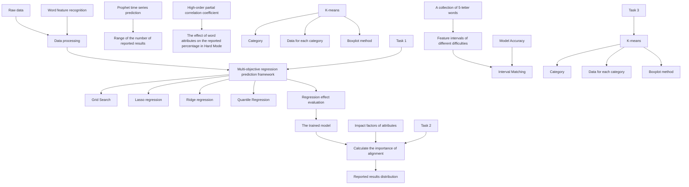
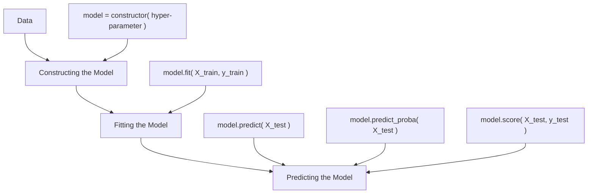
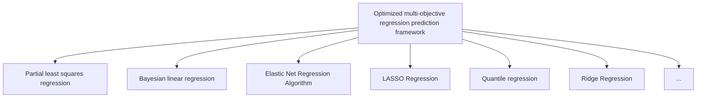

# Breaking the Wordle

Summary

As Wordle has become popular on social media, more and more users have played the scrabble game. How do time and word attributes affect the number of reports, distribution of attempts, and other report-related information? Therefore, a modeling analysis was conducted using the game data from 2022.

Before building the model, we cleaned and normalized the given data and identified word attributes such as the number of repeated letters, number of vowel letters, number of consonant letters, commonness, and frequency. Preliminary preparations were made for model building and solving.

First, to predict the number of future reports, a prophet-based time-series prediction model was built, considering the effects of trends, seasonality, and holidays. The predictions yielded a range of report numbers for March 1, 2023: [10355,18742]. Regarding the variation of report numbers, during the week, the number of reports tends to be highest on Wednesdays and lowest on weekends. In exploring the effect of word attributes on the proportion of difficulty reports, we calculated higherorder partial correlation coefficients for both, controlling for the interaction between word attributes, and found that the number of vowel letters, the number of non-repeats, and word commonness were negatively correlated. The number of consonant letters and the number of non-repeats was positively correlated.

Secondly, an optimized multi-objective regression prediction framework was developed to explore the effects of word attributes on the distribution of reported outcomes. The framework chose the optimal lasso regression to predict the test set with an RMSE of 0.80. The distribution of the number of attempts to predict ’EERIE’ was (0, 4, 17, 34, 30, 13, 2). The ranking importance of each attribute was calculated, and it was found that the number of consonant letters, number of vowel letters, and frequency had a more significant influence on the distribution of reported results with the influence factors of 4.226, 3.993, and 1.253, respectively.

Next, the above model was used to predict the distribution of reported outcomes for each word in the 5-letter word set. Then, K-means was used to classify the words into high (≥4.37), medium (4.13- 4.37), and low (<4.13) difficulty categories based on the average number of attempts, and it was found that the Number of duplicates, Maximum of repeats, Prevalence and Frequency differed significantly across categories. Moreover, the interval of each attribute was divided. According to the established model, ’EERIE’ is difficult. The model’s accuracy is 91.36 %by matching the attribute intervals for different difficulty words, and it can be inferred that the established model and the divided attribute intervals are reasonable.

Finally, the sensitivity analysis results demonstrate that our model is robust and reliable. In addition, The study of the data set also revealed the declining popularity of Wordle and the increasing percentage of difficult mode challenges, and provided the New York Times with suggestions for restoring the game’s popularity.

Keywords: Wordle analysis, Prophet, High-order partial correlation, Multi-objective regression forecasting, K-means

## Contents

## 1 Introduction 2

1.1 Problem Background . 2  
1.2 Restatement of the Problem . . 2  
1.3 Our Works . . 2

## 2 Preparation of the Models 3

2.1 Assumptions 3  
2.2 Notations 4

## 3 Data Processing 4

3.1 Data Cleaning . . . . 4  
3.2 Outlier rejection and standardization 4  
3.3 Word attribute determination 5

## 4 Task 1 7

4.1 Prophet algorithm . . 7  
4.2 Higher-order partial correlation analysis model 9

## 5 Task 2 12

5.1 Multi-objective regression prediction framework . . 12  
5.2 Establishment of prediction model 13  
5.3 Word prediction - EERIE 14  
5.4 Feature influence degree analysis . . . 15  
5.5 Model reliability analysis . . 15

## 6 Task 3 16

6.1 K-means clustering algorithm . . . . 17  
6.2 Selection of parameters 17  
6.3 Clustering results 18  
6.4 Word interval identification - EERIE 18  
6.5 Model reliability analysis . . 19

## 7 Interesting aspects of the data 20

## 8 Sensitivity Analysis 21

## 9 Strengths and Weaknesses 22

9.1 Strength . . . 22  
9.2 Weakness . . 22

## 10 Letter 22

## 1 Introduction

## 1.1 Problem Background

Crossword puzzles have always seemed inseparably linked to the media. Since January 2022, Wordle, the New York Times’ digital crossword, has become more and more popular in many countries[1].

How do players play Wordle? They are permitted to select five letters from a pool of 26 to construct a five-letter word that can be solved in no more than six attempts to conclude the Wordle puzzle successfully. After the player submits the word, the sticker’s color will change. Green is the correct letter, and yellow is the letter in the word but in the wrong place. There are two modes of play: normal mode and hard mode. Hard mode is where the correct letter (green or yellow) is found in the previous attempt and must be used in subsequent attempts.

Wordle updates the puzzle once a day, and many players report their scores on social media. As a result, data such as the number of people reporting their scores that day, the number of players participating in hard mode, and the percentage of players completing the puzzle on different attempts are all collected and counted. By using the available data wisely, we can solve some interesting problems.

## 1.2 Restatement of the Problem

Considering the background information, constraints outlined in the problem statement and additional guidance, we need to solve the following problems:

• Task 1: Establish a model that can explain and predict changes in the number of reported results and provide a prediction interval for the number of reported results on March 1, 2023. In addition, an examination of the impact of word attributes on the proportion of reports filed by players in the hard mode is necessary, accompanied by a rationale for this phenomenon.  
• Task 2: Develop a model that predicts reported outcomes’ distribution and explore the uncertainties the model and predictions have.  
• Task 3: Build a model for classifying words according to difficulty and determine the factors associated with word classification. This model is used to determine the difficulty of EERIE and to discuss the accuracy of the classification model.  
• Task 4: Enumerate and explicate additional noteworthy characteristics inherent in this dataset.  
• Task 5: Present a concise summary of the study findings in a letter addressed to the Puzzle Editor of the New York Times.

## 1.3 Our Works

Based on the analysis of the problem, we propose the model framework shown in figure 1, which is mainly composed of the following parts:

Data analysis: processes the reported data and identifies the characteristics of the words.

Predictive modeling: Prophet algorithm was chosen to build a time-series regression prediction model, and a higher-order partial correlation analysis was used to find the degree of influence of each attribute.

Development of a multi-objective regression prediction framework: use this framework to help us select a Lasso regression prediction model.

Difficulty interval division: the word difficulty was classified into three categories using the K-means algorithm and the classification results were validated by Lasso regression prediction.

flowchart

Figure 1: Model framework

## 2 Preparation of the Models

## 2.1 Assumptions

• Assumption 1. Assume that the user data given in the question is independently and identically distributed.  
Reason 1: this assumption ensures that the individual samples are independent of each other to avoid the influence of the modeling process due to the association between the samples.  
• Assumption 2. Assume that the pre-processed data is reliable.  
Reason 2: this assumption is made to ensure the accuracy of the model solution.  
• Assumption 3. Assume that the external environment associated with the game does not change abruptly  
Reason 3: external factors remain steady to ensure stable prediction models.

## 2.2 Notations

Table 1: Notations

<table><tr><td>Symbol</td><td>Definition</td></tr><tr><td> $s_j$ </td><td>Timestamp</td></tr><tr><td>k</td><td>Growth rate</td></tr><tr><td> $\delta_j$ </td><td>The amount of change in the growth rate on the timestamp</td></tr><tr><td>m</td><td>Offset amount</td></tr><tr><td> $\epsilon$ </td><td>Error term</td></tr><tr><td>N</td><td>Number of cycles in the seasonality model</td></tr><tr><td> $D_i$ </td><td>Period before and after a holiday</td></tr><tr><td> $\kappa_i$ </td><td>Range of holiday effects</td></tr><tr><td>P</td><td>Significance level</td></tr></table>

## 3 Data Processing

## 3.1 Data Cleaning

Topic C reports on the use of Wordle in the past year. However, we found a lot of dirty data in this report.

Table 2: Dirty data

<table><tr><td>Contest number</td><td>Word</td><td>Number of reported results</td><td>Number in hard mode</td><td>1 try</td><td>2 tries</td><td>3 tries</td><td>4 tries</td><td>5 tries</td><td>6 tries</td><td>7 or more tries (X)</td></tr><tr><td>525</td><td>clen</td><td>26381</td><td>2424</td><td>1</td><td>17</td><td>36</td><td>31</td><td>12</td><td>3</td><td>0</td></tr><tr><td>314</td><td>tash</td><td>106652</td><td>7001</td><td>2</td><td>19</td><td>34</td><td>27</td><td>13</td><td>4</td><td>1</td></tr><tr><td>540</td><td>naïve</td><td>21947</td><td>2075</td><td>1</td><td>7</td><td>24</td><td>32</td><td>24</td><td>11</td><td>1</td></tr><tr><td>473</td><td>marxh</td><td>30935</td><td>2885</td><td>0</td><td>9</td><td>30</td><td>35</td><td>19</td><td>6</td><td>1</td></tr><tr><td>207</td><td>favor</td><td>137586</td><td>3073</td><td>1</td><td>4</td><td>15</td><td>26</td><td>29</td><td>21</td><td>4</td></tr></table>

In the data shown above, the two words numbered 525, and 314 do not match the game because they are only 4 in length, so we inferred that the dataset blundered by under-entering the letters. To solve such a problem, we found the most similar letters to them instead by comparing them with artificial intelligence algorithms. The word numbered 540 is due to a misspelling of the letter, which should be ”naive.” We searched the word database and found that the word ”marxh,” numbered 473, did not exist. We then compared the shapes of the words with database analysis and concluded that the correct spelling should be ”marsh.” The word numbered 207 has an extra space in the input, so it is also an outlier. We can delete the extra space to get the correct data.

## 3.2 Outlier rejection and standardization

We use the 68–95–99.7 rule (3σ criterion) to screen and reject outliers[2]. We found an anomaly in the Number of reported results data for the word ’study’ on 2022/11/30, and we zeroed it to bring it

back to the same order of magnitude.

area chart

| Range   | Percentage |
|---------|----------|
| -3σ     | 0.1%     |
| -2σ     | 2.1%     |
| -1σ     | 13.6%    |
| 0       | 34.1%    |
| 1σ      | 34.1%    |
| 2σ      | 13.6%    |
| 3σ      | 2.1%     |

(a) 3σ criterion

scatterplot

| Date | Value |
|---|---|
| 12/20/2021 | 80000 |
| 2/8/2022 | 360000 |
| 3/30/2022 | 280000 |
| 5/19/2022 | 180000 |
| 7/8/2022 | 100000 |
| 8/27/2022 | 60000 |
| 10/16/2022 | 40000 |
| 12/5/2022 | 30000 |
| 1/24/2023 | 25000 |

(b) Deviation point rejection  
Figure 2: Outlier rejection

In addition, we also use the StandardScaler data normalization method, which normalizes the training set data by calculating the mean and standard deviation of the training set[3], see equation

$$
z = \frac {x - u}{s} \tag {1}
$$

x is the sample, u is the mean of the feature columns of the training set, and s is the standard deviation of the feature columns of the training set.

## 3.3 Word attribute determination

In the topic for the prediction of the reported results, we need to analyze the properties of the words. Combining Wordle’s gameplay and reviewing the analysis information of the relevant games, we classify the attributes of words into the following points.

1. The total frequency of letters appearing in words: Count the frequency of each letter appearing in the candidate word list. If a letter appears in 900 words, its frequency is 900. Then the candidate words are sorted by total letter frequency, and if a word contains more high-frequency letters, it is ranked first.

bubble chart

| Letter | Frequency |
|---|---|
| L | 3371 |
| T | 3295 |
| N | 2954 |
| U | 2512 |
| D | 2453 |
| Y | 2074 |
| S | 6665 |
| E | 6662 |
| A | 5992 |
| O | 4439 |
| R | 4160 |
| I | 3759 |
| K | 1506 |
| B | 1627 |
| G | 1644 |
| H | 1760 |
| M | 1976 |
| P | 2019 |
| C | 2028 |
| J | 291 |
| X | 288 |
Unit: Frequency

Figure 3: Total frequency of letters in a word

2. The number of vowel/consonant letters in a word: When players play Wordle, the first words are often chosen as AUDIO and LEFTY because this includes all the vowel letters: ’AEIOU.’ In the composition of words, vowel letters are easily known and, therefore, easily guessed.  
3. The number of occurrences of different vowel/consonant letters in a word (no duplication): The number of vowel/consonant letters is one of the attributes of a word that we infer affects the percentage of guessed words. Accordingly, the number of vowels/consonants is also essential in the percentage of reported words. Let us take ’there’ for example. The number of vowels is 2, The Number of vowels(no duplication) is 1, the number of consonants is 3, and the number of vowels(no duplication) is 3.

Table 3: Alphabetic properties

<table><tr><td>Word</td><td>Number of vowels</td><td>(no duplication)</td><td>Number of consonants</td><td>(no duplication)</td></tr><tr><td>there</td><td>2</td><td>1</td><td>3</td><td>3</td></tr></table>

4. Frequency of word usage: We use many words in our daily lives, some common and some not so familiar. People tend to guess common words more easily. Therefore, we have listed and sorted the frequency of use of all the five-letter words involved in this game. The following table shows the partially sorted data.

Table 4: Letter Commonness Ranking

<table><tr><td>Word</td><td>Times</td><td>Rank</td><td>Word</td><td>Times</td><td>Rank</td><td>Word</td><td>Times</td><td>Rank</td></tr><tr><td>which</td><td>0.002044</td><td>1</td><td>their</td><td>0.001954</td><td>2</td><td>would</td><td>0.001711</td><td>3</td></tr><tr><td>about</td><td>0.001407</td><td>4</td><td>could</td><td>0.001296</td><td>5</td><td>there</td><td>0.001273</td><td>6</td></tr></table>

5. The number of repeated letters and the maximum number of repetitions: There may be several repeated letters in the formation of a word. It isn’t common, but the number of times the letter is repeated also affects how successful a player is at guessing the word. Therefore, we counted these two attributes of the letters in words in the report as their characteristics.

Table 5: Alphabetic properties

<table><tr><td>Word</td><td>Number of duplicate</td><td>Maximum number of repeats</td><td>Word</td><td>Number of duplicate</td><td>Maximum number of repeats</td></tr><tr><td>cross</td><td>1</td><td>2</td><td>exist</td><td>0</td><td>0</td></tr><tr><td>glass</td><td>1</td><td>2</td><td>apply</td><td>1</td><td>0</td></tr></table>

## 4 Task 1

## 4.1 Prophet algorithm

## 4.1.1 Background of the algorithm

Although neural network models have become increasingly popular in recent years, this model usually requires a large amount of data for training. A dataset with only 400 or so data is not a good place to consider a neural network model.

On balance, we decided to use the Prophet model, an algorithm based on an additive model for predicting time series data with characteristics such as seasonality, trends, and holidays. Also, Prophet[4] has strong robustness to handle problems such as non-stationary time series and outliers. For this dataset, Prophet is a good choice.

## 4.1.2 Prediction model building based on Prophet algorithm

## 1. Prophet algorithm principle

The principle of Prophet algorithm is as follows:

$$
y (t) = g (t) + s (t) + h (t) + \epsilon \tag {2}
$$

g(t) denotes the trend term, which represents the time series trend over the non-period. s(t) denotes the period term, which is generally measured in weeks or years. h(t) denotes the holiday term, which represents the effect of those potential non-periodic holidays in the time series on the predicted values. ϵ denotes the error term or residual term, which indicates the fluctuations not predicted by the model, and ϵ follows a Gaussian distribution.

The Prophet algorithm models each of the model’s three components and then combines them to generate the forecast data.

## 2. Trend term model

Prophet’s implementation of the trend part applies two main models, one is the saturated growth model, and the other is the segmented linear model.

## • Saturation growth model

The saturation growth model, also known as the logistic growth model, is a model used to describe a system in which the growth rate gradually decreases and eventually stabilizes.

$$
g (t) = \frac {C (t)}{1 + \exp (- (k + a (t) ^ {T} \delta) \cdot (t - (m + a (t) ^ {T} \gamma)))} \tag {3}
$$

C(t) denotes the carrying capacity, a time function limiting the maximum value that can be grown. k denotes the growth rate.

## • Segmented growth model

$$
g (t) = \left(k + a (t) ^ {T} \delta\right) \cdot t + (m + a (t) ^ {T} \gamma) \tag {4}
$$

It is worth noting that the most significant difference between the segmented linear function and the logistic regression function is that the setting of y is different in the segmented linear function.

$$
\gamma_ {j} = - s _ {j} \delta_ {j} \tag {5}
$$

The model defines the points corresponding to changes in the growth rate k, called n changepoints. changeepoint prior scale is defined as the flexibility of the growth trend model.

## 3. Seasonality trends model

Since a time series may contain seasonal trends with multiple days, weeks, months, years, and other cycle types, the Fourier scale can be used to approximate this cycle property. The Fourier series is shown as follows.

$$
s (t) = \sum_ {n = 1} ^ {N} (a _ {n} c o s (\frac {2 \pi n t}{P}) + b _ {n} s i n (\frac {2 \pi n t}{P})) \tag {6}
$$

N denotes the number of periods one wishes to use in the model. Larger values of N allow for more complex seasonal functions to be fitted. However, they also introduce more overfitting problems.

## 4. Holiday effect model

In the natural environment, holidays can significantly impact the time series. Each holiday is not always the same, so the effects of different holidays at different points in time are treated as independent models. For the ith holiday, $D _ { i }$ denotes the period before and after the holiday.

In order to represent the holiday effect, a corresponding indicator function is needed, and a parameter $\kappa _ { i }$ is needed to represent the range of the holiday effect.

Assuming that there are L holidays, the holiday effect model is:

$$
h (t) = Z (t) \kappa = \sum_ {i = 1} ^ {L} \kappa_ {i} \cdot 1 _ {\{t \in D _ {i} \}} \tag {7}
$$

$$
Z (t) = \left(1 _ {\{t \in D _ {1} \}}, \dots , 1 _ {\{t \in D _ {L} \}}\right) \text {   and   } \kappa = (\kappa_ {1}, \dots , \kappa_ {L}) ^ {T}
$$

## 4.1.3 Parameter setting

We choose a trend term based on a segmented linear function for the trend term model. We set n changepoints to 25 and changepoint prior scale to 0.05. For seasonal trends, we set seasonality prior scale to 10. For holiday effects, we set holidays prior scale to 10. In addition, we set interval width to 0.80, mcmc samples to 0, and uncertainty samples to 1000.

## 4.1.4 Result

We set up the model using the parameter values shown in Figure a. When selecting a data range, it is usually necessary to consider the order of magnitude of the data. The reason for taking data starting from the same order of magnitude is to avoid the effects of data bias and errors and to ensure the accuracy and reliability of the data. Therefore, we screened the original data and selected data from after May 5, 2022. The final results we obtained are as follows.

Table 6: Predicted results

<table><tr><td>ds</td><td>yhat</td><td>yhat_lower</td><td>yhat_upper</td></tr><tr><td>2023-03-01</td><td>14425.58926</td><td>10355.27753</td><td>18741.54302</td></tr></table>

The model predicts a range of 10355 to 18742 for the number of reports on March 1, 2023.

scatterplot

| ds       | y      |
| -------- | ------ |
| 2022-05  | 85000  |
| 2022-06  | 70000  |
| 2022-07  | 55000  |
| 2022-08  | 45000  |
| 2022-09  | 35000  |
| 2022-10  | 30000  |
| 2022-11  | 25000  |
| 2022-12  | 20000  |
| 2023-01  | 15000  |
| 2023-02  | 12000  |
| 2023-03  | 10000  |

(a) Prediction Chart

line chart

| Day of week | weekly |
| ----------- | ------ |
| Sunday      | -1000  |
| Monday      | 100    |
| Tuesday     | 200    |
| Wednesday   | 600    |
| Thursday    | 400    |
| Friday      | 500    |
| Saturday    | -1000  |

(b) Weekly Trend Chart  
Figure 4: Forecast and trend charts

The graph above shows the time series trend and weekly seasonality. Figure a shows the general trend in the number of reports and the future forecast. From May 5, 2022, the number of reports decreases, and the decrease rate gradually becomes smaller. In addition, it predicts the report number interval for seventy days after January 1, 2023.

Figure b shows the weekly cyclical pattern, with significantly more people playing Wordle on Wednesdays. The number of weekend reports tends to be lower.

## 4.2 Higher-order partial correlation analysis model

## 4.2.1 Correlation analysis using Pearson’s correlation coefficient

The problem to be solved in this model is to perform a correlation analysis between the attributes of the words and the percentage of difficulty patterns separately. The attributes of the words have been classified in the data processing, but after analyzing the data of this question, we find a strong correlation between the attributes of the words. Therefore, we first conducted correlation tests for each variable to examine the Pearson correlation coefficients of each attribute with the percentage of difficulty patterns without controlling for other variables:

Table 7: Pearson correlation coefficient distribution

<table><tr><td>Attributes of words</td><td>R</td><td>P</td></tr><tr><td>Number of vowels</td><td>0.083460383</td><td>0.093068989</td></tr><tr><td>Number of vowels(non-repetition)</td><td>0.05075013</td><td>0.307685109</td></tr><tr><td>Number of consonants</td><td>-0.083460383</td><td>0.093068989</td></tr><tr><td>Number of consonants(non-repetition)</td><td>-0.106284281</td><td>0.032271311</td></tr><tr><td>Word commonness</td><td>0.094056604</td><td>0.058285504</td></tr><tr><td>The sum of the frequencies of letters</td><td>0.008176597</td><td>0.869535404</td></tr></table>

From the above table, we can see that the p-values of the significance tests for the correlation tests of each attribute and percent hard are almost all weakly correlated, and only the total ranking of word frequency of letters in words is strongly correlated. This result is not satisfactory. We analyzed the attributes of the words again and find that there is a strong correlation between these attributes, and the influence between the attributes cannot be ignored. To sum up, we chose the algorithm of higher-order biased correlation analysis to do correlation analysis on the percentage of each attribute in the word with the difficulty pattern to solve this problem[5].

## 4.2.2 Establishment of Higher-order partial correlation analysis model

(1) First-order partial correlation coefficient: The partial correlation coefficient of any two of the three variables is calculated after excluding the effect of the remaining one variable and is called the first-order partial correlation coefficient with the following formula:

$$
r _ {i j \cdot h} = \frac {r _ {i j} - r _ {i h} r _ {j h}}{\sqrt {\left(1 - r _ {i h} ^ {2}\right) \left(1 - r _ {j h} ^ {2}\right)}} \tag {8}
$$

In this equation, $r _ { i j }$ is the simple correlation coefficient between variables $x _ { i }$ and $x _ { j } , \ r _ { i h }$ is the simple correlation coefficient between variables $x _ { i }$ and $x _ { h }$ , and $r _ { j h }$ is the simple correlation coefficient between variables $x _ { j }$ and $x _ { h }$ .

(2) High-order partial correlation coefficient: Generally, if there are k $( k > 2 )$ variables $x _ { 1 } , x _ { 2 }$ , ..., $x _ { k }$ , then the formula of partial correlation coefficient of samples of order $\mathbf { g } \ ( \mathbf { g } \leq \mathbf { k } { - } 2 )$ for any two variables $x _ { i }$ and $x _ { j }$ is:

$$
r _ {i j \cdot l _ {1} l _ {2} \dots l _ {g}} = \frac {r _ {i j \cdot l _ {1} l _ {2} \cdots l _ {g - 1}} - r _ {i l _ {g} \cdot l _ {1} l _ {2} \cdots l _ {g - 1}} r _ {j l _ {g} \cdot l _ {1} l _ {2} \cdots l _ {g - 1}}}{\sqrt {\left(1 - r _ {i l _ {g} \cdot l _ {1} l _ {2} \cdots l _ {g - 1}} ^ {2}\right) \left(1 - r _ {j l _ {g} \cdot l _ {1} l _ {2} \cdots l _ {g - 1}} ^ {2}\right)}} \tag {9}
$$

where the right-hand sides are all partial correlation coefficients of order $\mathrm { g } { - } 1$ .

## 4.2.3 Analysis of results

In the higher-order partial correlation analysis, we need to control for irrelevant variables as a way to eliminate the influence of other variables on the studied variables. The results are as follows:

Table 8: Distribution of high-order bias correlation results

<table><tr><td>Attributes of words</td><td>High-order partial correlation coefficient</td><td>P</td></tr><tr><td>Number of vowels</td><td>-0.319578</td><td>4.37009E-11</td></tr><tr><td>Number of vowels(non-repetition)</td><td>-0.271561</td><td>2.72256E-08</td></tr><tr><td>Number of consonants</td><td>0.319578</td><td>4.37009E-11</td></tr><tr><td>Number of consonants(non-repetition)</td><td>0.306104</td><td>3.00056E-10</td></tr><tr><td>Word commonness</td><td>-0.080926</td><td>0.103481297</td></tr><tr><td>The sum of the frequencies of letters</td><td>-0.133207</td><td>0.007197084</td></tr></table>

As shown in the above table, the P-values corresponding to the attributes of the above six words are much less than 0.05. Therefore, the results can be considered statistically significant.

In general, the higher-order partial correlation coefficient, after taking the absolute value, is no correlation when it is 0-0.09, weak correlation when it is 0.1-0.3, moderate correlation when it is 0.3-0.5, and strong correlation when it is 0.5-1.0.

  
Figure 5: Heat map of high-order partial correlations of word attributes with percent hard

By analyzing the data as well as the results of the heat map, we obtained the following correlations of word attributes with the percentage of hard modes:

Table 9: Word attribute correlation result distribution

<table><tr><td>Attributes of words</td><td>Degree of correlation</td></tr><tr><td>Number of vowels</td><td>Moderate negative correlation</td></tr><tr><td>Number of vowels(non-repetition)</td><td>Weak negative correlation</td></tr><tr><td>Number of consonants</td><td>Moderate positive correlation</td></tr><tr><td>Number of consonants(non-repetition)</td><td>Moderate positive correlation</td></tr><tr><td>Word commonness</td><td>No correlation</td></tr><tr><td>The sum of the frequencies of letters</td><td>Weak negative correlation</td></tr></table>

## 5 Task 2

## 5.1 Multi-objective regression prediction framework

In this part, we need to address a prediction problem where the model we build can predict the percentage of user engagement related to the Wordle puzzle at a future date. We currently have user report data for Wordle during the past year, where we divide the words per day into several relevant attributes and take into account the effect of time of day, as users complete the game differently on weekends and weekdays.

Since the amount of data given in the question is very small, we give up using neural network to predict it, and instead use an optimized multi-objective regression prediction framework[6] to process it.

The specific process of using a multi-objective regression prediction framework to solve a forecasting problem is as follows:

flowchart

Figure 6: Operational process of multi-objective regression prediction framework

Our framework currently supports partial least squares regression algorithms, Bayesian linear regression-based hyperparameter tuning and feature selection algorithms, elastic network regression models, LASSO regression algorithm models, ridge regression algorithms, and high-performance quantile regression algorithms models. All these regression models can perform well for small data while being able to handle multiple classification tasks and suitable for incremental training. In addition, their well-adaptive ability, self-learning ability, and generalization ability also meet our requirements.

flowchart

Figure 7: Algorithm integrated evaluation analysis framework

## 5.2 Establishment of prediction model

## (1) Establishment of a multi-objective regression prediction framework

The multi-objective regression prediction framework divides the data into training and test sets and normalizes the data. It identifies the optimal parameters by grid search and evaluates the accuracy of the model based on the mean of the mean squared error, which in turn determines the best algorithmic model[7]. Then, the multi-objective regression prediction framework uses the best algorithm to make predictions on the data and returns the data at the original scale of inverse normalization. For our dataset, the output of the evaluation function-based algorithm evaluation framework is as shown below:

  
Figure 8: Output of a multi-objective regression prediction framework based on an evaluation function

From the output of the above figure, we can find that the root mean square error of the LASSO regression algorithm is the smallest, and the total average root mean square error of its multiple repeated fits is only 0.8, which can show that our regression model can predict the data very well.

## (2) Establishment of Lasso Regression Model

Lasso regression (LASSO, least absolute shrinkage and selection operator) is the addition of a penalty term of L1 parity to the residuals tiling and minimization:

$$
\min \sum e _ {i} ^ {2} + \lambda | | \hat {\beta} | | _ {1} = \min \sum (y _ {i} - \hat {y} _ {i}) ^ {2} + \lambda \sum_ {u = 1} ^ {k} \left| \hat {\beta} _ {u} \right| \tag {10}
$$

Because the L1 parametrization is in the form of an absolute value, it is not derivable at the zero point. Thus, it no longer has an analytic solution and can be solved using gradient descent (to be precise, a subgradient algorithm). Ridge regression cannot eliminate variables. The excellent property of LASSO regression is that it can produce sparsity, which can reduce some insignificant regression coefficients to zero for the purpose of eliminating variables.Its loss function is:

$$
J (w, b) = \frac {1}{2 m} \underset {w, b} {\operatorname{argmin}} \sum_ {i = 1} ^ {m} \left(\hat {y} _ {i} - y _ {i}\right) ^ {2} + \alpha \sum_ {i = 1} ^ {n} \| w _ {i} \| \tag {11}
$$

## 5.3 Word prediction - EERIE

First, the word EERIE can be attributed using the feature engineering established above. The relevant attributes of the word EERIE are as follows.

Table 10: Relevant attributes of the word EERIE

<table><tr><td>Date</td><td>Number of vowels</td><td>Number of vowels (non-repetition)</td></tr><tr><td>01/03/23</td><td>4</td><td>2</td></tr><tr><td>Word</td><td>Number of consonant</td><td>Word commonness</td></tr><tr><td>EERIE</td><td>1</td><td>224</td></tr><tr><td>Contest number</td><td>Number of consonant (non-repetition)</td><td>The sum of the frequencies of letters</td></tr><tr><td>620</td><td>1</td><td>27903</td></tr></table>

After the above multi-objective regression prediction framework, we identified a modified Lasso regression model to achieve the prediction of the percentage of word relevance at a given date. We performed Lasso regression prediction for the word EERIE to predict its reported percentage on March 1, 2023. We take the average of multiple fits as the final prediction to make the results more accurate.

Table 11: Precise results-EERIE

<table><tr><td>1 try</td><td>2 tries</td><td>3 tries</td><td>4 tries</td><td>5 tries</td><td>6 tries</td><td>7 or more tries (X)</td></tr><tr><td>0.023996469</td><td>3.60053273</td><td>16.9184627</td><td>33.8665962</td><td>30.5875392</td><td>12.9104259</td><td>2.09258948</td></tr></table>

Finally, the predicted percentage result was rounded, and the final predicted result was obtained:

Table 12: Final Results-EERIE

<table><tr><td>Date</td><td>Contest number</td><td>Word</td><td>1 try</td><td>2 tries</td><td>3 tries</td><td>4 tries</td><td>5 tries</td><td>6 tries</td><td>7 or more tries (X)</td></tr><tr><td>01/03/23</td><td>620</td><td>EERIE</td><td>0</td><td>4</td><td>17</td><td>34</td><td>30</td><td>13</td><td>2</td></tr></table>

## 5.4 Feature influence degree analysis

In order to get the word attributes that have a more significant influence on our prediction model, we propose an analysis based on Permutation Importance.

First, we obtain a trained Lasso model. Next, we disrupt the values of a certain column of data and then predict the obtained dataset. The predicted values are used with the true target values to calculate how much the loss function has been elevated due to random sorting. The amount of decay in the model performance represents the importance of the disordered column. Then, we recover the disordered column and repeat the previous operation on the next column of data until the importance of each column is calculated.

To make the results more general, we run the analysis three times to analyze the scores of different attributes and summarize the final fit results in the following figures, which help us to analyze the degree of influence of different attributes in the words on the model.

bar chart

| Feature | Num_3 | Num_2 | Num_1 |
| --- | --- | --- | --- |
| The sum of the frequencies of letters | 0.9 | 1.4 | 1.5 |
| Word commonness | 0.7 | 0.7 | 0.8 |
| Number of consonant(non-repetition) | 3.7 | 4.8 | 4.1 |
| Number of consonant | 0.9 | 1.0 | 0.8 |
| Number of vowels(non-repetition) | 2.8 | 3.9 | 5.3 |
| Number of vowels | 0.7 | 0.6 | 1.3 |
| Date | 0.5 | 0.5 | 0.9 |

Figure 9: Feature importance score Lasso

<table><tr><td>Weight</td><td>Feature</td></tr><tr><td>4.226±0.502</td><td>Number of consonant(non-repetition)</td></tr><tr><td>3.993±1.211</td><td>Number of vowels(non-repetition)</td></tr><tr><td>1.253±0.558</td><td>The sum of the frequencies of letters</td></tr><tr><td>0.896±0.187</td><td>Number of consonant</td></tr><tr><td>0.844±0.385</td><td>Number of vowels</td></tr><tr><td>0.678±0.118</td><td>Word commonness</td></tr><tr><td>0.517±0.314</td><td>Date</td></tr></table>

Figure 10: Heat map of the features importance of the seven attributes of words

In our model, we observed a strong correlation between the two attributes of the number of consonants (excluding repeated consonants) and the number of vowels (excluding repeated vowels) in words. Also, we found a moderate correlation between the sum of the frequencies of all letter occurrences in words, the number of consonants, and the number of vowels. In contrast, the correlations between word commonness and date were weaker.

## 5.5 Model reliability analysis

To evaluate the reliability of our prediction model, we used two methods. First, we calculated the root mean square error of the model prediction results to measure the deviation of the prediction results from the actual data. Second, we used the prediction model to forecast the given data and then compared the forecast with the actual data to assess the accuracy of the prediction results.

The root means square error is obtained by calculating the sum of squares of the deviations between the predicted and actual values divided by the ratio of the number of observations n and then taking the square root. The formula for the root mean square error is as follows.

$$
R M S E = \sqrt {\frac {1}{n} \cdot \sum \left(y _ {i} - y _ {i h a t}\right) ^ {2}} \tag {12}
$$

Where n is the number of samples, $y _ { i }$ is the actual value of the ith sample, and $y _ { i h a t }$ is the predicted value of the ith sample. The units of RMSE are the same as those of the target variable. We fit and graphically analyze the fitted lasso regression model results for the root mean square error.

According to the output plot of the lasso regression in Figure 7, we found that the RMSE of the three solutions did not exceed 0.85, and the average RMSE was 0.8. Generally speaking, the prediction accuracy is considered high when the RMSE does not exceed 2.

Here is an example of a graph comparing the degree of the trend of 5 successful guesses of words:

line chart

| Word    | 5 tries | pre5 |
|---------|---------|------|
| their   | 25      | 22   |
| light   | 28      | 23   |
| sound   | 10      | 24   |
| doubt   | 27      | 25   |
| apply   | 26      | 24   |
| angry   | 33      | 26   |
| depth   | 29      | 25   |
| cheek   | 28      | 26   |
| prime   | 32      | 27   |
| label   | 29      | 25   |
| elder   | 33      | 26   |
| merit   | 31      | 27   |
| shine   | 13      | 35   |
| ninth  | 29      | 26   |
| leapt   | 35      | 27   |
| apron   | 30      | 28   |
| cling   | 37      | 30   |
| maple   | 36      | 31   |
| lapse   | 29      | 27   |
| prick   | 31      | 28   |
| aloft   | 30      | 29   |
| clown   | 34      | 30   |
| crave   | 33      | 29   |
| scold   | 38      | 31   |
| whine   | 33      | 30   |
| tibia   | 35      | 29   |
| lilac   | 31      | 28   |
| taunt   | 36      | 30   |
| mince   | 37      | 31   |
| stomp   | 44      | 32   |
| knoll   | 13      | 33   |
| shirk   | 34      | 29   |
| shire   | 36      | 30   |
| primo   | 34      | 29   |
| glyph   | 31      | 28   |
| hutch   | 30      | 27   |
| egret   | 34      | 28   |

Figure 11: Comparison of the degree of the trend of 5 successful guesses of words

The blue curve is the percentage of 5 successes for the original data. In comparison, the orange curve is the percentage of 5 successes predicted by our prediction model, and it can be seen that the deviation of its prediction results is in the acceptable range.

## 6 Task 3

We think that the ”average number of tries” can represent the difficulty level of a word, but since the data set given in the question is too small, it would affect the performance of the clustering analysis. Therefore, we re-fit the framework of the Task 2 to the distribution of tries for the 12,974 words in the prediction dictionary after removing the time variable, and use this distribution to find the average number of tries. Following this, the average number of tries is clustered using K-means clustering[8].

## 6.1 K-means clustering algorithm

The K-means algorithm measures the similarity of different data objects by selecting a suitable distance formula[9]. The distance between data is inversely proportional to the similarity, i.e., the smaller the similarity, the larger the distance. K-means algorithm first needs to specify the initial number of clusters k and the corresponding initial cluster center C randomly from the given data objects, and calculate the distance from the initial cluster center to the rest of the data objects[10]. In this paper, we choose Euclidean distance. The Euclidean distance formula from the cluster center to other data objects in the space is:

$$
d \left(x, C _ {i}\right) = \sqrt {\sum_ {j = 1} ^ {m} \left(x _ {j} - C _ {i j}\right) ^ {2}} \tag {13}
$$

where x is the data object, $C _ { i }$ is the i-th cluster center, m is the dimension of the data object, and $x _ { j } , C _ { i j }$ are the attribute values of the j-th dimension of the data object x and the cluster center $C _ { i }$ .

According to the Euclidean distance measure of similarity, the target data with the highest similarity to the clustering center are assigned to the clusters of $C _ { i } .$ . And then the data objects in k clusters are averaged to form a new round of clustering centers. The calculation formula is:

$$
S S E = \sum_ {i = 1} ^ {k} \sum_ {x \in C _ {i}} | d (x, C _ {i}) | ^ {2} \tag {14}
$$

## 6.2 Selection of parameters

• Silhouette Coefficient method: This method evaluates the clustering quality by calculating the silhouette coefficients of each sample point. Where the silhouette coefficient integrates the magnitude of intra-cluster distance and inter-cluster distance and takes a value between [-1,1], the closer to 1 means the better clustering effect.  
• Davies-Bouldin index (abbreviated as DBI) method: This method evaluates the quality of clustering by calculating the ratio of the average distance of all points within each cluster to the cluster center and the shortest distance between different cluster centers.

After analysis, we classified the words into 3-5 categories based on difficulty, with the following parameters:

Table 13: Parameters

<table><tr><td>Number of clusters</td><td>Silhouette Coefficient</td><td>DBI</td></tr><tr><td>3</td><td>0.545003549</td><td>0.562683379</td></tr><tr><td>4</td><td>0.536022115</td><td>0.561324728</td></tr><tr><td>5</td><td>0.523517926</td><td>0.558397471</td></tr></table>

As illustrated in the table above, both Silhouette Coefficient and DBI are decreasing slightly as the number of clusters increases. To improve the accuracy of identifying word difficulty, we choose to cluster into 3 classes.

## 6.3 Clustering results

Based on the above analysis, we selected the K-means algorithm for clustering the data set into three classes and obtained the following clustering results.

Aggregate results:

Table 14: Aggregate results

<table><tr><td></td><td>Number of duplicate</td><td>Maximum of repeats</td><td>Number of vowels</td><td>Number of vowels(non-repetition)</td><td>Times</td></tr><tr><td>0</td><td>0.519623</td><td>0.63264</td><td>1.859318</td><td>1.546858</td><td>0.000002</td></tr><tr><td>1</td><td>0.019896</td><td>0.023617</td><td>1.77483</td><td>1.759786</td><td>0.000009</td></tr><tr><td>2</td><td>1.210897</td><td>1.182715</td><td>1.748239</td><td>1.354157</td><td>0.000001</td></tr><tr><td></td><td>Rank time</td><td>Weighted sums</td><td>Number of consonants</td><td colspan="2">Number of consonants(non-repetition)</td></tr><tr><td>0</td><td>18842.21231</td><td>423.226591</td><td>3.140682</td><td colspan="2">2.933519</td></tr><tr><td>1</td><td>20294.22727</td><td>403.383609</td><td>3.22517</td><td colspan="2">3.220317</td></tr><tr><td>2</td><td>16888.876</td><td>451.443208</td><td>3.251761</td><td colspan="2">2.434946</td></tr></table>

Difficulty interval division:

bar chart

| Category | Value |
|---|---|
| Easy | 4.13 |
| Mid | 4.37 |
| Hard | X |

Figure 12: Word difficulty interval

Analysis of the results shows that Number of duplicates, Maximum of repeats, Prevalence, and Frequency vary widely in different classifications. According to the quartile method, the normal value is generally defined as greater than $Q _ { L } - k I Q R$ or less than $Q _ { U } + k I Q R$ . Here, we k take 0.5, and the specific difficulty interval is shown below.

Table 15: Specific difficulty interv

<table><tr><td></td><td>Number of duplicate</td><td>Maximum of repeats</td><td>Normality</td><td>Frequency</td></tr><tr><td>easy</td><td>(0, 0)</td><td>(0, 0)</td><td>(0.000009, 0.002044)</td><td>(16767.75, 33314)</td></tr><tr><td>mid</td><td>(0, 1)</td><td>(0, 2)</td><td>(0.000003, 0.000012)</td><td>(14969.25, 29574.25)</td></tr><tr><td>hard</td><td>(1, 3)</td><td>(0, 2)</td><td>(0, 0.000004)</td><td>(6568, 28380.5)</td></tr></table>

## 6.4 Word interval identification - EERIE

’EERIE’ belongs to the difficulty interval.

We bring the word ’EERIE’ into the Lasso regression prediction model built in Part 2 and get its average number of attempts 4.384952125887, which means it belongs to the difficult word. It is easy to find that its attributes of Number of duplicate, Maximum of repeats, Normality, and Frequency are all in the difficult range we have classified. Therefore, we believe that the word ’EERIE’ belongs to the difficult interval.

## 6.5 Model reliability analysis

In order to evaluate the accuracy of our classification model, we used 405 data from January 7, 2022, to February 16, 2023, that had been identified for validation. The validation process was as follows.

First, we calculated the average number of guesses for each word. We classified the average number of word guesses into different intervals based on the clustering results described in the previous section. Then, we counted each attribute of each letter to compare which level of difficulty interval was hit for each attribute. The difficulty with the highest number of hits is the difficulty identified by the feature. If the classification result is the same as the result of the word hit interval, our model is considered accurate. The algorithm is implemented as follows:

Algorithm Classification verification algorithm based on interval matching
Input: Interval,Word $_{p}$ ,Sa
Output: Classification result,Forecast result
1: for i = 1 → len(data) do
2:    Word $_{p}$ 1 ← ∅,Word $_{p}$ 2 ← ∅ // Initialize the eigenvalue
3:    for j = 1,2,...,a do
4:    if sj = Interval then
5:    weight++ // Increasing weight
6:    else
7:    weight- // Decreasing weight
8:    end if
9:    Sum = Total(weight) // Weight summation
10:    Interval(Sj) // Partition by weight
11:    end for
12: end for
13: for i = 1 → a do
14:    Compare result and Interval(Sj)
15:    if result εInterval(Sj) then
16:    Weight(Sj)
17:    else
18:    continue
19:    end if
20: end for
21: return RMSE

The accuracy of our model is calculated to be 91. 3649025%. For small-scale data classification, our model has high accuracy.

## 7 Interesting aspects of the data

• The relationship between the number of reported results and the percentage of scores reported in Hard Mode

We try to find some other interesting features of this dataset, but we do not know where to start. So we search Wordle on social media to get a specific view of this game. During this period, we suddenly found that most of the reported results about this game were from the first half of 2022, while in the second half of the year, this game saw a significant drop in popularity. Accordingly, we associate and plot the relationship among the number of reports from players, the percentage of scores reported in Hard Mode, and the date. Because the difference between the percentage in Hard Mode and the number of reported results is too large, we multiply the value of the percentage of scores reported in Hard Mode by $1 0 ^ { 6 }$ in order to make the relationship graph more obvious.

line chart

| Date       | Number of reported results | hard percent*10^6 |
| ---------- | --------------------------- | ------------------ |
| 2022/1/7   | ~80,000                     | ~15,000            |
| 2022/2/7   | ~360,000                    | ~40,000            |
| 2022/3/7   | ~250,000                    | ~50,000            |
| 2022/4/7   | ~150,000                    | ~60,000            |
| 2022/5/7   | ~80,000                     | ~70,000            |
| 2022/6/7   | ~60,000                     | ~80,000            |
| 2022/7/7   | ~40,000                     | ~90,000            |
| 2022/8/7   | ~35,000                     | ~95,000            |
| 2022/9/7   | ~30,000                     | ~110,000           |
| 2022/10/7  | ~35,000                     | ~135,000           |
| 2022/11/7  | ~35,000                     | ~115,000           |
| 2022/12/7  | ~15,000                     | ~115,000           |

Figure 13: Hard mode percentage vs. Date vs. Num of reported

From the graph above we discover that as the number of reported results began to grow, the percentage in hard mode steadily increased. However, when the number of reported results peaked, the percentage in hard mode plummeted. We suppose that there was an influx of new players who were less familiar with Wordle and less likely to try the hard mode, which caused the percentage of hard mode to plummet. Over time, the number of daily reported results for Wordle has gradually decreased, but the percentage of hard modes has steadily increased. In response, we think Wordle has a loyal fan base that often plays Wordle and prefers hard mode. This indicates that the gaming ability of the enthusiastic fans is also slowly improving, and it also shows that this game helps to improve players English skills.

• The relationship among the average number of successes, number of reported results, and date for Wordle

Next, we analyze the relationship between the average number of successes, the total number of reports, and the date of Wordle. To make the scatter plot more visible, we multiplied the value of Average number of successes by $1 0 ^ { 5 }$ .

scatterplot

| Date       | Number of reported results | Average number of successes**10^5 |
| ---------- | --------------------------- | ---------------------------------- |
| 2021/12/20 | ~80,000                     | ~400,000                           |
| 2022/2/8   | ~350,000                    | ~450,000                           |
| 2022/3/30  | ~150,000                    | ~580,000                           |
| 2022/5/19  | ~70,000                     | ~450,000                           |
| 2022/7/8   | ~50,000                     | ~450,000                           |
| 2022/8/27  | ~40,000                     | ~600,000                           |
| 2022/10/16 | ~35,000                     | ~550,000                           |
| 2022/12/5  | ~15,000                     | ~450,000                           |
| 2023/1/24  | ~15,000                     | ~520,000                           |

Figure 14: Average number of successes vs. Date vs. Num of reported

As shown in the figure, the values of Average number of successes are mostly distributed between 4 and 5. This shows that the difficulty of the game remains almost constant, with almost every word being guessed 4-5 times. This supports our previous interesting finding that the game helps to improve players’ English and that the longer they play the game, the more willing they are to try the Hard Mode.

## 8 Sensitivity Analysis

In Part two, we artificially specify the proportion of the test set(POT) as 20%, and the change of this value will affect the model’s training. The results of the sensitivity analysis are shown in Table 7.

Table 16: Sensitivity analysis

<table><tr><td></td><td>POT =0.2</td><td>POT =0.1</td><td>POT =0.15</td><td>POT =0.25</td><td>POT =0.3</td></tr><tr><td>Partial least squares Regression</td><td>0.86</td><td>0.87(1.16%↑)</td><td>0.93(8.14%↑)</td><td>0.89(3.49%↑)</td><td>0.97(12.79%↑)</td></tr><tr><td>Elastic Net Regression</td><td>0.96</td><td>0.94(2.08%↓)</td><td>0.95(1.04%↓)</td><td>0.92(4.17%↓)</td><td>0.91(5.21%↓)</td></tr><tr><td>Bayesian linear regression</td><td>0.94</td><td>0.97(3.19%↑)</td><td>1.01(7.45%↑)</td><td>0.89(5.32%↓)</td><td>0.96(2.13%↑)</td></tr><tr><td>Lasso Regression</td><td>0.80</td><td>0.83(3.75%↑)</td><td>0.84(5.00%↑)</td><td>0.86(7.50%↑)</td><td>0.92(15.00%↑)</td></tr><tr><td>Ridge regression</td><td>0.98</td><td>0.91(7.14%↓)</td><td>0.93(5.10%↓)</td><td>0.93(5.10%↓)</td><td>0.92(6.12%↓)</td></tr><tr><td>Quantile regression</td><td>0.89</td><td>0.92(3.37%↑)</td><td>0.82(7.87%↓)</td><td>0.90(1.12%↑)</td><td>1.05(17.98%↑)</td></tr></table>

As shown in the results, by changing the proportion of the test set, the maximum rate of change is 10%, while the RMSE of the models are all less than 1.0, which proves that our model is not sensitive to the change of this parameter within the range of 0.5 times itself, and our model is robust and reliable.

## 9 Strengths and Weaknesses

## 9.1 Strength

• Prophet model provides excellent predictions for small data sets and adjusts the parameters quite freely, thus facilitating more accurate predictions of the number of reports we will have for future dates.  
• Higher-order partial correlation analysis can control irrelevant variables for correlation analysis of a variable, which facilitates us to eliminate the influence between words and more accurately analyze the degree of influence of variables.  
• Lasso regression model can perform well on small data while handling multiple classification tasks and being suitable for incremental training to make more accurate regression predictions on small data sets.  
• Permutation importance can perform data disruption and rearrangement analysis on the fitted model to more accurately derive the contribution of each piece of data.

## 9.2 Weakness

• Multi-objective regression prediction runs long, and the solution results need simple manual screening.

## 10 Letter

To: Puzzle Editor of the New York Times

From: Team 2314151

Date: February 20, 2023

Subject: The results of our team

Dear Puzzle Editor of the New York Times,

By building several models, we have completed an analysis of MCM’s statistics based on players’ participation in the Wordle puzzles that your website provides daily. We are honored to present you with the results of what we’ve analyzed.

Before building the model, we clarified and normalized the dataset you gave us and identified word attributes such as the number of repeated letters, number of vowel letters, number of consonant letters, commonness, and frequency. Next, I will describe the modeling solution process for you:

First, we considered the effects of trends, seasonality, and holidays and built a prophet-based timeseries forecasting model to explain the daily variation in the number of reports and to predict the interval of the number of reported outcomes on March 1, 2023: [10355,18742]. We found that the number of reported outcomes increased steeply from January to early February 2022 and that the number of reports tended to be highest on Wednesdays and lowest on weekends during the week in terms of the variation in the number of reports.

In exploring the influence of the attributes of the words on the reports, we first used a correlation analysis algorithm to solve for each attribute, however, we found that their Pearson correlation coefficients were all less than or approximately 0.1 and were uncorrelated. In order to overcome this association, we used a higher-order partial correlation analysis algorithm to perform correlation analysis on each attribute of the word while controlling for the interaction between the attributes of the word, and finally obtained the results we wanted: the number of vowel letters, the number of non-repeats, and the word commonness were negatively correlated, and the number of consonant letters and the number of non-repeats numbers is positively correlated.

Next, an optimized multi-objective regression prediction framework was developed to explore the effect of word attributes on the distribution of reported results. By feeding the data into the framework, a prediction model was selected that was most suitable for this dataset: the Lasso regression prediction model, which performed very well for the test set with a root mean square error of 0.8. Therefore, we established the Lasso regression prediction model to predict the reported results, and we first processed ’EERIE ’, the results of its attempt count distribution were obtained as (0, 4, 17, 34, 30, 13, 2).

Following this, we proposed an algorithm for ranking importance analysis to evaluate the established but this attribute, and finally found that the three attributes of number of consonant letters, number of vowel letters and frequency had a greater impact on the distribution of reported results with impact factors of 4.226, 3.993, and 1.253, respectively.

Then, we used the established Lasso regression prediction model to distribute the reported results for all 5-letter words in the dictionary database, and then used the K-Means algorithm to classify the above results into three categories of difficulty: high (≥ 4.37) medium (4.13-4.37) low (< 4.13), and found that Number of duplicate, Maximum of repeats, Prevalence, and Frequency were found to differ significantly in different classifications, and the intervals for each attribute were divided.

Then we bring ’EERIE’ into the interval division model, and since all its attributes hit the interval value of difficulty, its degree of being guessed is difficult, and its average number of attempts matches the difficulty interval division predicted using the Lasso regression model. Therefore, the degree of ’EERIE’ being guessed is difficult. Meanwhile, we obtained the accuracy of our model by matching the attribute intervals for different difficulty words, which is 91.36%, and we can see that our model is robust.

Finally, we performed a sensitivity analysis of the model, as shown in the results, by changing the proportion of the test set, the maximum rate of change is 10%, while the RMSE of the models are all less than 1.0, which proves that our model is not sensitive to the change of this parameter within the range of 0.5 times itself, and our model is robust and reliable. In addition, the study of the data set has revealed the declining popularity of Wordle and the increasing proportion of difficult mode challenges, and offers two suggestions for restoring the popularity of the game:

• Introduced online multiplayer challenge mode, you can invite friends to challenge together, so as to attract more people to participate.  
• Introducing Kids Mode, parents can let their children use this software to work on their English skills, playing and learning at the same time.

So that’s the summary of our research. We sincerely hope that it can provide you with useful information and look forward to your reply. Thank you!

Yours sincerely, Team # 2314151

## References

[1] Benton J. Anderson and Jesse G. Meyer. Finding the optimal human strategy for wordle using maximum correct letter probabilities and reinforcement learning, 2022.  
[2] Tarun Kumar. Solution of linear and non linear regression problem by k nearest neighbour approach: By using three sigma rule. In 2015 IEEE International Conference on Computational Intelligence Communication Technology, pages 197–201, 2015.  
[3] Michal S Gal and Daniel L Rubinfeld. Data standardization. NYUL Rev., 94:737, 2019.  
[4] Sean J Taylor and Benjamin Letham. Forecasting at scale. The American Statistician, 72(1):37–45, 2018.  
[5] Qibin Zhao, Cesar F. Caiafa, Danilo P. Mandic, Zenas C. Chao, Yasuo Nagasaka, Naotaka Fujii, Liqing Zhang, and Andrzej Cichocki. Higher order partial least squares (hopls): A generalized multilinear regression method. IEEE Transactions on Pattern Analysis and Machine Intelligence, 35(7):1660–1673, 2013.  
[6] Ertunga C Ozelkan and Lucien Duckstein. Multi-objective fuzzy regression: a general framework.¨ Computers & Operations Research, 27(7-8):635–652, 2000.  
[7] Mark Harman. Making the case for morto: Multi objective regression test optimization. In 2011 IEEE Fourth International Conference on Software Testing, Verification and Validation Workshops, pages 111–114, 2011.  
[8] Aristidis Likas, Nikos Vlassis, and Jakob J Verbeek. The global k-means clustering algorithm. Pattern recognition, 36(2):451–461, 2003.  
[9] John A Hartigan and Manchek A Wong. Algorithm as 136: A k-means clustering algorithm. Journal of the royal statistical society. series c (applied statistics), 28(1):100–108, 1979.  
[10] Greg Hamerly and Charles Elkan. Learning the k in k-means. Advances in neural information processing systems, 16, 2003.