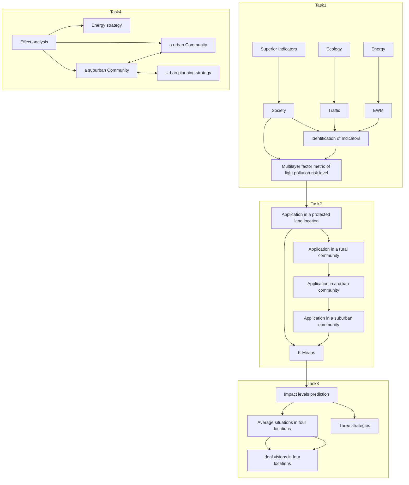
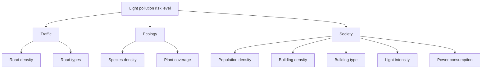

# Local Light Pollution Analysis: A Multi-layer Evaluation Model Summary

Light pollution is a growing concern for many communities and ecosystems around the world. In order to measure the level of light pollution in a region, this paper develops a Light Pollution System Model, which reflects the risk of light pollution in a region by selecting several relevant indicators. For four different regions, our Light Pollution System Model provides a good representation of their main characteristics, which makes it easy to propose targeted policies.

First, we identified four primary indicators: traffic, ecology, energy and society, and set several secondary indicators under each primary indicator to form the Light Pollution System Model. Finally, the entropy weighting method was used to determine the weights and establish the association between each indicator and the risk of light pollution.

Next, we used K-means clustering algorithm to divide the collected data into four classes and summarize the data distribution of indicators in four regions: Protected Land, Rural Community, Suburban Community and Urban Community. The clustering centers of the four classes were used as the data representatives of the four regions. Then, the data of the four regions were evaluated in the evaluation model, and the light pollution scores were calculated as Protected Land:0.053, Rural Community:0.174, Suburban Community:0.359, and Urban Com-munity:0.872. Urban community has the highest level of light pollution. Finally, the light pollution of each of the four regions was analyzed by the scores of the minor indicators.

To identify three possible intervention strategies, we used the top 10% of each region as the ideal vision, compared it with the regional average, and identified strategies focused on one or two main targets for each strategy to reduce light pollution levels. We then quantified the impact of each strategy on the target using a scale, which was classified as high (20%-50%), medium (10%- 20%), and low (2%-10%). Finally, three feasible strategies were obtained: green infrastructure strategy (around ecology indicators), energy strategy (around energy indicators), and urban planning strategy (around traffic and social indicators).

Finally, we used the urban area of Tosca, Italy, and the suburb of Latsia, in Cyprus, as application targets. The three strategies we designed were substituted to calculate the minimum and maximum possible impact on the area. The effects of the three strategies were compared and we obtained that energy strategy were the most suitable strategy for the urban area of Tosca, with light pollution coefficient LPR reduction levels: 4.8%-11.65%, while the urban planning strategy was the most suitable strategy for the suburban area of Latsia, with light pollution coefficient LPR reduction levels: 3.26%-7.51%. Then we analyzed the impact of the strategies on the small indicators and summarized the reasons for the impact areas of these two strategies from a detailed perspective. Finally, we conducted a sensitivity analysis of the Light Pollution System Model proposed in this paper, and the results show that the model performs as expected in practice, proving that the proposed model is reliable.

Keywords: Light Pollution System Model；K-means clustering algorithm；Entropy weight method

## Contents

## 1 Introduction......

1.1 Problem Background .  
1.2 Restatement of the Problem.  
1.3 Our Work..

## 2 Assumptions and Justifications .....

## 3 Notations .....

## 4 Light Pollution System Model ....

4.1 Main indicators and sub-indicators discussion  
4.2 Normalization of each indicator.. 8  
4.3 Using the entropy weight method to calculate the weights of indicators in the model ...9

## 5 Application of Light Pollution System Model in four regions .........

5.1 Using K-means clustering to obtain representative data .10  
5.2 Display of light pollution results in four locations 12

## 6 Three possible strategies for intervention .......

6.1 Confirming Target Indicators.. .13  
6.2 Three intervention strategies based on main indicators. .15

## 7 Application of Light Pollution System Model in practice.......

7.1 Urban object.. .19  
7.2 Suburban Object .. .21

## 8 Sensitivity Analysis ...........

## 9 Model Evaluation and Further Discussion.... ....23

9.1 Strengths .23  
9.2 Weaknesses . .24

## 10 Conclusion ... ..24

## References.... ..24

## 1 Introduction

## 1.1 Problem Background

Light pollution is a growing concern for many communities and ecosystems around the world. It is caused by the excessive or inappropriate use of artificial light, which can negatively affect the environment as well as the health and safety of humans and other organisms. For example, light pollution can disrupt the migratory patterns of birds, causing them to become disoriented and confused. Exposure to artificial light at night can disrupt human circadian rhythms, leading to poor sleep quality and associated health risks, such as obesity and diabetes.

The impact of light pollution varies depending on local development levels, population, biodiversity, geography and climate. To effectively address light pollution, it is important to develop a widely applicable measurement model and discuss intervention strategies that can be tailored to different regions.

## 1.2 Restatement of the Problem

Considering the background information and restricted conditions identified in the problem statement, we need to solve the following problems:

Problem 1: Create a measurement model that can be widely applied to identify the level of risk for light pollution in a given location.

Problem 2: Use the measurement model to assess the level of risk for light pollution in four different locations with diverse characteristics: a protected land area, a rural community, a suburban community, and an urban community.

Problem 3: Explain three potential intervention strategies that could be used to address light pollution and describe specific actions that could be taken to implement each strategy. Discuss the potential impact of each strategy in mitigating the negative effects of light pollution.

Problem 4: Select two locations for assessment using measurement models and determine the most effective intervention strategy for each location. The results of the model were analyzed and the selected intervention strategies were determined to reduce the light pollution risk level at each site.

Problem 5: For one of the locations that was assessed using the measurement model, and for which an effective intervention strategy was identified, create a one-page flyer to promote the strategy for the location.

## 1.3 Our Work

Because of the weakness of research in this area, we should study this problem further. The schematic diagram of our study is shown in Figure 1. First, an evaluation model with four main indicators and nine sub-indicators was developed, and the Entropy Weight Method was used to confirm the weights of all indicators by collecting relevant data from several authoritative data sites. Then, the k-Means clustering algorithm was used to summarize the distribution of indicators in the four regions and to find a representative value for each region. The data were also analyzed by substituting them into the evaluation model. In order to give an appropriate strategy, the top 10% of the best data for each region was used as the ideal vision, which was compared with the average data of the region as a whole to find the focus of the strategy.

Combining the weakness analysis and existing research, we propose three strategies with feasibility. To facilitate the impact assessment later, we quantified the degree of impact of each strategy on the indicator using a ranking. Finally, we explore the application of the strategies to the urban area of Tosca in

Italy and to the suburb of Latsia in Cyprus, analyzing the optimal strategy and the impact of the optimal strategy on the different indicators in the area.

flowchart

Figure 1: Flowchart of our study

## 2 Assumptions and Justifications

Assumption: The average lighting luminosity indicator in the light pollution risk assessment index selected in this paper is the nighttime luminosity.

Justification: Light pollution caused by lighting mainly comes from street lights and LED advertising signs in commercial gathering areas at night [5], daytime lighting is negligible, the main way to limit light pollution is to limit the brightness of lights at night.

Assumption: The brightness of street lights, LED billboards and other light-emitting equipment in use at night remains unchanged, as does the degree of light pollution generated by the use process.

Justification: Lighting devices such as LED lamps will remain at a fixed power during normal operation, with negligible variations, and are therefore considered to cause a fixed level of light pollution. Assumption: The level of light pollution in rural areas, suburban areas, conservation areas and urban areas is not affected by geographical location such as latitude, longitude and altitude.

Justification: Weather conditions are stochastic and cannot be predicted, so to simplify the model, the light pollution evaluation model proposed in this paper ignores these effects.

## 3 Notations

The key mathematical notations used in this paper are listed in Table 1.

Table 1: Notations used in this paper

<table><tr><td>Symbol</td><td>Description</td></tr><tr><td>TRA</td><td>Regional traffic light pollution risk indicators</td></tr><tr><td>ECO</td><td>Regional ecological light pollution risk indicators</td></tr><tr><td>ENE</td><td>Regional energy light pollution risk indicators</td></tr><tr><td>SOC</td><td>Regional social light pollution risk indicators</td></tr><tr><td>LPR</td><td>Regional Light Pollution Total Risk Indicator</td></tr><tr><td>RD</td><td>Road density in the region</td></tr><tr><td>SD</td><td>Density of species in the region</td></tr><tr><td>PC</td><td>Vegetation cover</td></tr><tr><td>PD</td><td>Population density</td></tr><tr><td>BD</td><td>Building density</td></tr><tr><td>BT</td><td>Building type, mainly used to measure the height of buildings in the area</td></tr><tr><td>BH</td><td>Building height</td></tr></table>

## 4 Light Pollution System Model

Light Pollution System Model depicts the influence of different factors on the level of light pollution in a region. This complex model is influenced by many links and factors. The framework is shown in Figure 2. We use three main indicators, including traffic, social and ecological, to measure the light pollution level. To facilitate the subsequent calculations, we introduce three symbols to represent the main indicators:

$$
(T R A, E C O, E N E, S O C) \tag {1}
$$

Where and represent traffic, ecology, energy, and society, respectively. Each of the main indicators is composed of several small indicators, the details of which will be described in section 4.1. As shown in the figure below, we have considered a total of 9 sub-indicators in the model. We describe the result of a linear combination of the three main indicators in terms of the light pollution level :

$$
L P R = w _ {1} T R A + w _ {2} E C O + w _ {3} E N E + w _ {4} S O C \tag {2}
$$

flowchart

Figure 2：Framework of Light Pollution System Model

## 4.1 Main indicators and sub-indicators discussion

In the process of establishing the Light Pollution System Model, we used 4 main indicators and 9 sub-indicators. We will elaborate on that.

## 4.1.1 Traffic

According to the study, the degree of traffic development in the region has an important influence on local light pollution [1], and the main sources of artificial light on traffic roads are lights caused by illuminated street lamps and passing vehicles, as well as reflections generated by the road surface. With the rapid development of cities and surrounding areas, the scale of traffic roads has also expanded, and in nature reserves and rural areas there are mostly main roads running through them, so the degree of traffic development is selected as a first-order indicator to measure the risk of regional light pollution.

In for nighttime artificial light remote sensing image analysis shows [1], according to the road classification, different levels of roads present different artificial light intensity because different levels of roads have different lighting needs and characteristics. For example, highways and major roads may require brighter lighting, which will result in the generation of more artificial light, while residential streets require less lighting and generate less artificial light.

Major light pollution is generated from primary, secondary and tertiary roads and is influenced by road density [1], and the effects of light pollution from other classes of roads are ignored in this paper. Therefore, the equation for the response of regional traffic development to the light pollution risk factor is defined as:

$$
T R A = \left(b _ {0} + b _ {1} y _ {1} + b _ {2} y _ {2} + b _ {3} y _ {3}\right) \times e ^ {R D} \tag {3}
$$

is the degree of response of traffic development to light pollution. $y _ { 1 } , ~ y _ { 2 } , ~ y _ { 3 }$ denote the number of primary, secondary, and tertiary roads in the area, respectively. $b _ { 0 }$ is a constant term. The coefficients $b _ { 1 } , \ b _ { 2 } , \ b _ { 3 }$ are the impact coefficients of each road on traffic volume, respectively. In Yan and Tan's study [1], the correlation coefficients $b _ { 0 } , ~ b _ { 1 } , ~ b _ { 2 } , ~ b _ { 3 }$ were calculated as 0.1432, 0.3383, 0.2164, and 0.4456, respectively, and the above values will be taken in the subsequent calculations in this paper.

indicates the road density of the area. Road density refers to the ratio of the total mileage of the road network to the area of the area in a given region. In areas with high road density, the lighting is more dense, which leads to a concentration of artificial light and produces bright diffuse light.

## 4.1.2 Ecology

The ecological status of an area can significantly reflect the risk of light pollution in that area [2] [3]. Light pollution can pose a serious threat to the ecosystem of a region. On the one hand, it can affect the number of local species, light pollution can confuse animal navigation or disturb animal habitats at night, leading to the death of a large number of animals, and light pollution may affect the migration of some species [2], thus reducing the number and density of local species. On the other hand, light pollution can interfere with plant phenology and thus affect the growth cycle of plants. However, green vegetation can be used to mitigate light pollution due to its radiation-absorbing properties [3], so increasing plant cover can effectively mitigate the risk of light pollution.

In this paper, we select ecology as a primary indicator to measure the risk of light pollution in the region, which is calculated from the two secondary indicators, species density and plant cover. Ecological status is defined as the product of species density and plant cover, as follows:

$$
E C O = S D \times P C \tag {4}
$$

?????? is the degree of ecological condition response to light pollution, and ???? is the species density and plant cover index, respectively. In order to better reflect the risk of light pollution, the species density index needs to reflect both the amount of species in the area and their trends in light pollution on an annual basis, so the species density index is defined as：

$$
S D = \left(1 + \frac {1}{h _ {i}}\right) ^ {\frac {h _ {i - 1}}{h _ {i}} \times 100 \%} \tag{5}
$$

$h _ { i }$ is the current species density of the area and $h _ { i - 1 }$ is the previous year's species density of the area. Taking the reciprocal of species density in the current area, the higher the species density, the lower the risk of light pollution. Taking the reciprocal of the variation trend of species density as the index, the effect of density is amplified when the trend of species density is increasing, and reduced when the trend of species density is decreasing, so as to better reflect the risk of light pollution. The local species density can be simply calculated from the area ?? and the local species density as:

$$
h _ {i} = \frac {q}{m} \times 100 \% \tag{6}
$$

Plant cover refers to the percentage of local vegetation planting area in the total area, then ???? can be simply calculated from the area ?? and local plant planting area as:

$$
P C = \frac {p}{m} \times 100 \% \tag{7}
$$

## 4.1.3 Energy

Energy is a very intuitive indicator to respond to the risk of light pollution. With the economic development and urbanization promotion, leisure areas and commercial concentrated areas mainly to enhance urban night scenery are increasing year by year, which to some extent leads to the proliferation of artificial light at night and causes serious light pollution [4].Power consumption is a major secondary indicator, and in addition, through the policy of light pollution reduction around the world, we know that reducing the brightness of indoor and outdoor lights and limiting commercial areas LED lighting levels are the main strategy at present [4][5], so in this paper, Power consumption and area average light intensity are selected as two secondary indicators of energy index.

## 4.1.4 Society

bar chart

Resident population: / Ten thousand
| Year | Resident population (Ten thousand) |
|---|---|
| 2022 | 1556.18 |
| 2021 | 1519.7 |
| 2020 | 1500.07 |
| 2019 | 1476.05 |
| 2018 | 1435.33 |
| 2017 | 1398.93 |
| 2016 | 1228.05 |
| 2015 | 1210.74 |
| 2014 | 1187.99 |
| 2013 | 1173.35 |
| 2012 | 1163.28 |

bar chart

Urban construction scale and area: / square kilometer
| Year | Urban construction scale (square kilometers) |
| :--- | :--- |
| 2012 | 472.57 |
| 2013 | 506.49 |
| 2014 | 519.19 |
| 2015 | 550.38 |
| 2016 | 604.07 |
| 2017 | 770.78 |
| 2018 | 810.11 |
| 2019 | 847.6 |
| 2020 | 879.79 |
| 2021 | 909.65 |
| 2022 | 977.6 |

（b）

natural_image

Thermal or heat map image showing a central region with color gradient from green to yellow, no visible text or symbols

（c）

natural_image

Thermal or heat map image showing a central hot spot surrounded by yellow and green areas, with an inset magnified view of a circular feature (no text or symbols)

（d）

natural_image

Thermal or heat map image showing a central hot spot surrounded by yellow and green areas, with an inset highlighting a specific region (no text or symbols)

（e）

natural_image

Thermal or heat map image showing a central hot spot surrounded by yellow and green areas, with an inset highlighting a small circular feature (no text or symbols)

（f）

  
Figure 3：（a）Permanent population of Chengdu, 2012-2022（b）Urban construction area of Chengdu from 2012 to 2022（c）-（f）VIIRS images of light pollution in Chengdu urban area and Tianfu International Airport in 2012, 2015, 2018 and 2021

Social factors are a major indicator to respond to the risk of light pollution, as shown in Figure 3, (c)-(f) show the visible infrared imaging radiometer (VIIRS) image maps in and around Chengdu urban area in 2012, 2015, 2018, and 2021, respectively. the VIIRS images are used to visually respond and measure the light pollution situation in the area [5], from the figure we can clearly conclude that with the We can clearly see that with the expansion of urban construction and population in Chengdu, the light pollution situation has been increasing. The lower right corner of the image map shows the area around Tianfu International Airport (the circled part is Tianfu International Airport), which has been under construction since 2016 and will be officially opened to traffic by 2021, which more obviously demonstrates the influence of social factors on the light pollution situation.

Integrating the above analysis, the three main aspects of population density, building density and building type are selected to form social factors in this paper. The degree of contribution of social indicators to the risk of light pollution is defined as:

$$
S O C = P D \times \sqrt {(B D - P C) \times B T} \tag {8}
$$

?????? is the response degree of social index to local light pollution risk, ???? and ???? are local population density and building density, respectively. building density refers to the density of buildings in an area. Areas with high building density, such as bustling business districts, usually require more lighting facilities, and dense buildings will generate more diffuse reflection, resulting in serious light pollution [5]. They can be easily calculated by the local population ??, the number of buildings ?? and the area respectively as:

$$
P D = \frac {s}{m} \times 100 \% \tag{9}
$$

$$
B D = \frac {r}{m} \times 100\%
$$

???? is the building type, mainly used to measure the height of buildings in the region. Studies show that high-rise buildings cause more light pollution and high energy consumption due to their large building size and light consumption [5]. However, the average value of building height may be affected by its minimax value, so the building height aggregation index ???? is defined to measure the height status of regional buildings. Assuming that building height in a region is normally distributed [4], ???? is the cumulative probability of the distribution model, which is defined as:

$$
B I = \int_ {\left| B H _ {a v g} - B H _ {m e d} \right|} ^ {B H _ {a v g} + B H _ {m e d}} \frac {1}{\sqrt {2 \pi} \delta} \exp \left(- \frac {\left(x - \max \left(B H _ {m e d} , B H _ {a v g}\right)\right) ^ {2}}{2 \delta^ {2}}\right) \tag {10}
$$

$B H _ { a v g }$ and $B H _ { m e d }$ are the mean and median of building height in the region, respectively. In this normal distribution model, is usually set at 0.2[6]. This means that the higher the probability of building height falling in the interval $[ | B H _ { a v g } - B H _ { m e d } | , B H _ { a v g } + B H _ { m e d } ]$ , the closer the height. The larger ???? is, the higher the average high confidence is. Therefore, ???? is defined as:

$$
B T = B H _ {a v g} ^ {B I} \tag {11}
$$

## 4.2 Normalization of each indicator

The indicators we have chosen include very large and very small indicators. At the same time the units of different indicators are different, so it will have an impact on the evaluation model. And the indicators we selected should have the same dimension and the larger indicates the stronger light pollution, so we give different data processing methods.

## 4.2.1 Maximum values normalization method

For some indicators such as population density, building density, and road density, which have enhanced benefits for light pollution, the maximization normalization method is used.

$$
f (x) = \frac {x}{x _ {\max}} \tag {12}
$$

Where is any data and $x _ { \mathrm { m a x } }$ is the maximum value of data in the index where the data resides.

## 4.2.2 Minimum values normalization method

For plant cover and other indicators with attenuating effect on light pollution, the minimization normalization method is adopted

$$
f (x) = 1 - \frac {x}{x _ {\max}} \tag {13}
$$

## 4.3 Using the entropy weight method to calculate the weights of indicators in the model

Entropy weight method is a method that uses the law of data itself to assign weight objectively. The calculation steps are as follows.

First calculate the information entropy of each indicator:

$$
e _ {j} = - \frac {1}{\ln n} \sum_ {i = 1} ^ {n} p _ {i j} \ln (p _ {i j}) \tag {14}
$$

Where, $e _ { j }$ is the information entropy of the th index, $p _ { i j }$ is the weight of the th data in the th index, and is the number of data.

Then calculate the information utility value and normalize to get the weight.

$$
d _ {j} = 1 - e _ {j}
$$

$$
W _ {j} = \frac {d _ {j}}{\sum_ {j = 1} ^ {m} d _ {j}} \tag {15}
$$

Where $d _ { j }$ is the information utility value of the $j$ th indicator, $W _ { j }$ is the corresponding weight of the th indicator, and is the number of indicators.

According to the above analysis, the final weight results are as follows:

Table 2: The weights of Light Pollution System Model

<table><tr><td>Traffic</td><td>Ecology</td><td>Energy</td><td>Society</td></tr><tr><td>Road density:12.93%</td><td>Species density:5.52%</td><td>Light intensity:18.99%</td><td>Population density:9.81%</td></tr><tr><td>Road types:8.50%</td><td>Plant coverage:10.38%</td><td>Power Consumption:15.15%</td><td>Building density:7.73%Building type:10.96%</td></tr></table>

pie chart

Traffic
| Category | Value |
|---|---|
| Road types | 0.6 |
| Road density | 0.4 |

Traffic

pie chart

Ecology
| Category | Value |
|---|---|
| Species density | 0.35 |
| Plant coverage | 0.65 |

Ecology

pie chart

| Category | Value |
|---|---|
| Power | 0.44 |
| Light intensity | 0.56 |

Energy

pie chart

Society
| Category | Value |
|---|---|
| Population | 0.34 |
| Building density | 0.27 |
| Building type | 0.39 |

Society  
Figure 4: Indicator Ring Weights Chart

## 5 Application of Light Pollution System Model in four regions

Protected land location, rural community, suburban community and urban community are four distinctive areas. However, there are many samples in these four areas, so we collect the relevant data and cluster the data to obtain the representative data of each of the four areas. The data are then taken into the Light Pollution System Model to calculate the representative results.

## 5.1 Using K-means clustering to obtain representative data

In this study, we collected data on eight environmental indicators from different regions of the world. These data were obtained from open sources such as the World Bank, the United Nations, national statistical offices and other scientific publications. We used the previous model to calculate the required indicators: population density, building density, building type, species density, plant growth trend, plant cover, road density and road type.

We classify the indicators and identify their distribution patterns using K-means clustering, which groups data points according to their similarity to each other. The algorithm assigns data points to clusters iteratively and updates the center of mass of each cluster until convergence is achieved.

The K-means clustering model is suitable for clustering environmental indicators in different regions of the world because it allows us to identify patterns in the distribution of indicators and to make comparisons between geographic regions. The eight indicators used in this study are quantifiable and can be standardized to ensure that they are equally weighted in the analysis. By using K-means clustering, we can group data points based on their similarity to each other and identify clusters that represent different geographic locations.

## 5.1.1 K-means clustering algorithm steps

1. Initialize the number of clusters and the initial position of their centers of mass.  
2. Assign each data point to the nearest center of mass based on the Euclidean distance between it and the center of mass.  
3. Update the position of each prime by taking the average of all data points assigned to it.  
4. Repeat steps 2-3 until the centers of mass converge, i.e., they no longer change.

## 5.1.2 Algorithm tuning

First, randomly initialize the centers and set the number of clusters to four based on the four geographic locations we want to compare (protected lands, rural communities, suburban communities, and urban communities).

We ran the K-means algorithm for 100 iterations and evaluated clustering quality using intra-cluster sum of squares ( ) and contour coefficients. measures the sum of the squares of the distance between each data point and its designated center of mass, with lower indicating better clustering. The can be calculated using the following formula:

$$
W C S S = \sum \left(x _ {i} - c _ {i}\right) ^ {2} \tag {16}
$$

Where $x _ { i }$ is the data point and $c _ { i }$ is the center of mass, and all the data points assigned to the center of mass are added. The silhouette coefficient measures the matching degree of data points in their specified clustering. The higher the silhouette coefficient is, the better the clustering effect is. The silhouette coefficient can be calculated by the following formula:

$$
S = \frac {(b - a)}{\max (a , b)} \tag {17}
$$

Where is the average distance between a data point and all other data points in the same cluster, and is the average distance between a data point and all data points in the nearest neighboring cluster. Finally, we use scatter plots to visualize the results and color them according to the assigned cluster data points. We also calculated the mean and standard deviation for each indicator of each cluster to provide a descriptive summary of the data.

This approach allows us to determine the distribution patterns of environmental indicators and compare them with different geographical locations.

## 5.1.3 Clustering results

The clustering diagram for the data is shown below, where the red cross indicates the centre of clustering for the current regional data.

scatterplot

| x    | y    | z    |
| ---- | ---- | ---- |
| 0.0  | 0.0  | 0.0  |
| 0.1  | 0.1  | 0.1  |
| 0.2  | 0.2  | 0.2  |
| 0.3  | 0.3  | 0.3  |
| 0.4  | 0.4  | 0.4  |
| 0.5  | 0.5  | 0.5  |
| 0.6  | 0.6  | 0.6  |
| 0.7  | 0.7  | 0.7  |
| 0.8  | 0.8  | 0.8  |
| 0.9  | 0.9  | 0.9  |
| 1.0  | 1.0  | 1.0  |

Protected Land

scatterplot

| x    | y    | z    |
| ---- | ---- | ---- |
| 0.0  | 0.0  | 0.0  |
| 0.1  | 0.2  | 0.1  |
| 0.2  | 0.3  | 0.2  |
| 0.3  | 0.4  | 0.3  |
| 0.4  | 0.5  | 0.4  |
| 0.5  | 0.6  | 0.5  |
| 0.6  | 0.7  | 0.6  |
| 0.7  | 0.8  | 0.7  |
| 0.8  | 0.9  | 0.8  |
| 0.9  | 1.0  | 0.9  |
| 1.0  | 1.1  | 1.0  |
| 1.1  | 1.2  | 1.1  |
| 1.2  | 1.3  | 1.2  |
| 1.3  | 1.4  | 1.3  |
| 1.4  | 1.5  | 1.4  |
| 1.5  | 1.6  | 1.5  |
| 1.6  | 1.7  | 1.6  |
| 1.7  | 1.8  | 1.7  |
| 1.8  | 1.9  | 1.8  |
| 1.9  | 2.0  | 1.9  |
| 2.0  | 2.1  | 2.0  |
| 2.1  | 2.2  | 2.1  |
| 2.2  | 2.3  | 2.2  |
| 2.3  | 2.4  | 2.3  |
| 2.4  | 2.5  | 2.4  |
| 2.5  | 2.6  | 2.5  |
| 2.6  | 2.7  | 2.6  |
| 2.7  | 2.8  | 2.7  |
| 2.8  | 2.9  | 2.8  |
| 2.9  | 3.0  | 2.9  |
| 3.0  | 3.1  | 3.0  |
| 3.1  | 3.2  | 3.1  |
| 3.2  | 3.3  | 3.2  |
| 3.3  | 3.4  | 3.3  |
| 3.4  | 3.5  | 3.4  |
| 3.5  | 3.6  | 3.5  |
| 3.6  | 3.7  | 3.6  |
| 3.7  | 3.8  | 3.7  |
| 3.8  | 3.9  | 3.8  |
| Note: The provided code does not contain any data series or labels in the image; it is a blank string for visualization purposes from the source image to display the chart type and axis descriptions of the data series.

Rural Community

scatterplot

| x | y | z |
| --- | --- | --- |
| 0.0 | 0.9 | 0.7 |
| 0.1 | 0.8 | 0.65 |
| 0.2 | 0.7 | 0.6 |
| 0.3 | 0.6 | 0.55 |
| 0.4 | 0.5 | 0.5 |
| 0.5 | 0.4 | 0.45 |
| 0.6 | 0.3 | 0.4 |
| 0.7 | 0.2 | 0.35 |
| 0.8 | 0.1 | 0.3 |
| 0.9 | 0.0 | 0.25 |
| 1.0 | -0.1 | 0.2 |
| 1.1 | -0.2 | 0.15 |
| 1.2 | -0.3 | 0.1 |
| 1.3 | -0.4 | 0.05 |
| 1.4 | -0.5 | 0.0 |
| 1.5 | -0.6 | -0.05 |
| 1.6 | -0.7 | -0.1 |
| 1.7 | -0.8 | -0.15 |
| 1.8 | -0.9 | -0.2 |
| 1.9 | -1.0 | -0.25 |
| 2.0 | -1.1 | -0.3 |
| 2.1 | -1.2 | -0.35 |
| 2.2 | -1.3 | -0.4 |
| 2.3 | -1.4 | -0.45 |
| 2.4 | -1.5 | -0.5 |
| 2.5 | -1.6 | -0.55 |
| 2.6 | -1.7 | -0.6 |
| 2.7 | -1.8 | -0.65 |
| 2.8 | -1.9 | -0.7 |
| 2.9 | -2.0 | -0.75 |
| 3.0 | -2.1 | -0.8 |
| 3.1 | -2.2 | -0.85 |
| 3.2 | -2.3 | -0.9 |
| 3.3 | -2.4 | -0.95 |
| 3.4 | -2.5 | -1.0 |
| 3.5 | -2.6 | -1.05 |
| 3.6 | -2.7 | -1.1 |
| 3.7 | -2.8 | -1.15 |
| 3.8 | -2.9 | -1.2 |
| 3.9 | -3.0 | -1.25 |
| 4.0 | -3.1 | -1.3 |
| 4.1 | -3.2 | -1.35 |
| 4.2 | -3.3 | -1.4 |
| 4.3 | -3.4 | -1.45 |
| 4.4 | -3.5 | -1.5 |
| 4.5 | -3.6 | -1.55 |
| 4.6 | -3.7 | -1.6 |
| 4.7 | -3.8 | -1.65 |
| 4.8 | -3.9 | -1.7 |
| 4.9 | -4.0 | -1.75 |
| 5.0 | -4.1 | -1.8 |
| 5.1 | -4.2 | -1.85 |
| 5.2 | -4.3 | -1.9 |
| 5.3 | -4.4 | -1.95 |
| 5.4 | -4.5 | -2.0 |
| 5.5 | -4.6 | -2.05 |
| 5.6 | -4.7 | -2.1 |
| 5.7 | -4.8 | -2.15 |
| 5.8 | -4.9 | -2.2 |
| 5.9 | -5.0 | -2.25 |
| 6.0 | -5.1 | -2.3 |
| 6.1 | -5.2 | -2.35 |
| 6.2 | -5.3 | -2.4 |
| 6.3 | -5.4 | -2.45 |
| 6.4 | -5.5 | -2.5 |
| 6.5 | -5.6 | -2.55 |
| 6.6 | -5.7 | -2.6 |
| 6.7 | -5.8 | -2.65 |
| 6.8 | -5.9 | -2.7 |
| 6.9 | -6.0 | -2.75 |
| 7.0 | -6.1 | -2.8 |
| 7.1 | -6.2 | -2.85 |
| 7.2 | -6.3 | -2.9 |
| 7.3 | -6.4 | -2.95 |
| 7.4 | -6.5 | -3.0 |
| 7.5 | -6.6 | -3.05 |
| 7.6 | -6.7 | -3.1 |
| 7.7 | -6.8 | -3.15 |
| 7.8 | -6.9 | -3.2 |
| 7.9 | -7.0 | -3.25 |
| 8.0 | -7.1 | -3.3 |
| 8.1 | -7.2 | -3.35 |
| 8.2 | -7.3 | -3.4 |
| 8.3 | -7.4 | -3.45 |
| 8.4 | -7.5 | -3.5 |
| 8.5 | -7.6 | -3.55 |
| 8.6 | -7.7 | -3.6 |
| 8.7 | -7.8 | -3.65 |
| 8.8 | -7.9 | -3.7 |
| 8.9 | -8.0 | -3.75 |
| 9.0 | -8.1 | -3.8 |
| 9.1 | -8.2 | -3.85 |
| 9.2 | -8.3 | -3.9 |
| 9.3 | -8.4 | -3.95 |
| 9.4 | -8.5 | -4.0 |
| 9.5 | -8.6 | -4 |
| nan | nan | nan |

Suburban Community

scatterplot

| x    | y    |
| ---- | ---- |
| 0.95 | 0.96 |
| 0.94 | 0.97 |
| 0.93 | 0.98 |
| 0.92 | 0.99 |
| 0.91 | 0.98 |
| 0.90 | 0.97 |
| 0.89 | 0.96 |
| 0.88 | 0.95 |
| 0.87 | 0.94 |
| 0.86 | 0.93 |
| 0.85 | 0.92 |
| 0.84 | 0.91 |
| 0.83 | 0.90 |
| 0.82 | 0.89 |
| 0.81 | 0.88 |
| 0.80 | 0.87 |
| 0.79 | 0.86 |
| 0.78 | 0.85 |
| 0.77 | 0.84 |
| 0.76 | 0.83 |
| 0.75 | 0.82 |
| 0.74 | 0.81 |
| 0.73 | 0.80 |
| 0.72 | 0.79 |
| 0.71 | 0.78 |
| 0.70 | 0.77 |
| 0.69 | 0.76 |
| 0.68 | 0.75 |
| 0.67 | 0.74 |
| 0.66 | 0.73 |
| 0.65 | 0.72 |
| 0.64 | 0.71 |
| 0.63 | 0.70 |
| 0.62 | 0.69 |
| 0.61 | 0.68 |
| 0.60 | 0.67 |
| 0.59 | 0.66 |
| 0.58 | 0.65 |
| 0.57 | 0.64 |
| 0.56 | 0.63 |
| 0.55 | 0.62 |
| 0.54 | 0.61 |
| 0.53 | 0.60 |
| 0.52 | 0.59 |
| 0.51 | 0.58 |
| 0.50 | 0.57 |
| 0.49 | 0.56 |
| 0.48 | 0.55 |
| 0.47 | 0.54 |
| 0.46 | 0.53 |
| 0.45 | 0.52 |
| 0.44 | 0.51 |
| 0.43 | 0.50 |
| 0.42 | 0.49 |
| 0.41 | 0.48 |
| 0.40 | 0.47 |
| 0.39 | 0.46 |
| 0.38 | 0.45 |
| 0.37 | 0.44 |
| 0.36 | 0.43 |
| 0.35 | 0.42 |
| 0.34 | 0.41 |
| 0.33 | 0.40 |
| 0.32 | 0.39 |
| 0.31 | 0.38 |
| 0.30 | 0.37 |
| 0.29 | 0.36 |
| 0.28 | 0.35 |
| 0.27 | 0.34 |
| 0.26 | 0.33 |
| 0.25 | 0.32 |
| 0.24 | 0.31 |
| 0.23 | 0.30 |
| 0.22 | 0.29 |
| 0.21 | 0.28 |
| 0.20 | 0.27 |
| 0.19 | 0.26 |
| 0.18 | 0.25 |
| 0.17 | 0.24 |
| 0.16 | 0.23 |
| 0.15 | 0.22 |
| 0.14 | 0.21 |
| 0.13 | 0.20 |
| 0.12 | 0.19 |
| 0.11 | 0.18 |
| 0.10 | 0.17 |
| 0.09 | 0.16 |
| 0.08 | 0.15 |
| 0.07 | 0.14 |
| 0.06 | 0.13 |
| 0.05 | 0.12 |
| 0.04 | 0.11 |
| 0.03 | 0.10 |
| 0.02 | 0.09 |
| 0.01 | 0.08 |
| -    | -    |

Urban Community  
Figure 5: Cluster diagram by region

The final cluster interval to the four regions is shown as follows:

Table 3: Original range values for 9 factors

<table><tr><td></td><td>Protected Land</td><td>Rural Community</td><td>Suburban Community</td><td>Urban Community</td></tr><tr><td>Population density</td><td>0-100</td><td>100-500</td><td>500-3000</td><td>3000-10000</td></tr><tr><td>Building density</td><td>0%-5%</td><td>5%-30%</td><td>30%-80%</td><td>80%-100%</td></tr><tr><td>Building height</td><td>0-2</td><td>2 to 5</td><td>5 to 10</td><td>10 to 50</td></tr><tr><td>Species density</td><td>-2% to +5%</td><td>-5% to +5%</td><td>-5% to +5%</td><td>-5% to +5%</td></tr><tr><td>Plant coverage</td><td>10% to 80%</td><td>10% to 80%</td><td>30% to 50%</td><td>10% to 30%</td></tr><tr><td>Road density</td><td>0 to 0.5</td><td>0.5 to 1</td><td>1 to 5</td><td>5 to 10</td></tr><tr><td>Road types</td><td>0 to 10,000</td><td>10,000 to 50,000</td><td>50,000 to 100,000</td><td>100,000 to 1,000,000</td></tr><tr><td>Light intensity</td><td>0 to 0.5</td><td>0.5 to 10</td><td>10 to 100</td><td>100 to 1000</td></tr><tr><td>power consumption</td><td>0-2000</td><td>2000-6000</td><td>6000-13000</td><td>13000-30000</td></tr></table>

We selected the cluster centroids to represent the indicator level of the region as shown below (the data are normalized to values from 0 to 1):

Table 4: Representative data for all indicators

<table><tr><td></td><td>Protected Land</td><td>Rural Community</td><td>Suburban Community</td><td>Urban Community</td></tr><tr><td>Population density</td><td>0.00094</td><td>0.0234</td><td>0.2536</td><td>0.8931</td></tr><tr><td>Building density</td><td>0.005</td><td>0.039</td><td>0.065</td><td>0.895</td></tr><tr><td>Building type</td><td>0.0132</td><td>0.2786</td><td>0.4625</td><td>0.8512</td></tr><tr><td>Species density</td><td>0.3542</td><td>0.8276</td><td>0.6259</td><td>0.1423</td></tr><tr><td>Plant growth trends</td><td>0.2341</td><td>0.9327</td><td>0.6882</td><td>0.0495</td></tr><tr><td>Plant coverage</td><td>0.9813</td><td>0.7154</td><td>0.4234</td><td>0.2452</td></tr><tr><td>Road density</td><td>0.07058</td><td>0.12537</td><td>0.72435</td><td>0.94816</td></tr><tr><td>Road types</td><td>0.0532</td><td>0.2981</td><td>0.7146</td><td>0.9267</td></tr></table>

At this point we have representative data for all indicators in the four regions, and next we will use the 4-part light pollution model to calculate the specific scores for each region.

## 5.2 Display of light pollution results in four locations

According to the data of each region in 5.1.3, the light pollution score can be calculated as follows:

Table 5: light pollution results in four locations

<table><tr><td></td><td>Protected Land</td><td>Rural Community</td><td>Suburban Community</td><td>Urban Community</td></tr><tr><td>Society</td><td>0.001925878</td><td>0.035849</td><td>0.08061</td><td>0.250204</td></tr><tr><td>Ecology</td><td>0.033322987</td><td>0.058009</td><td>0.097816</td><td>0.136571</td></tr><tr><td>Traffic</td><td>0.005077418</td><td>0.014869</td><td>0.064629</td><td>0.201415</td></tr><tr><td>Energy</td><td>0.000159192</td><td>0.002961</td><td>0.066892</td><td>0.233923</td></tr><tr><td>LPR</td><td>0.053480414</td><td>0.174683125</td><td>0.359560795</td><td>0.87296586</td></tr></table>

Table 4 lists the three main indicators and the total light pollution index . Table 5 shows the degree of light pollution from high to low in order of Urban Community, Suburban Community, Rural Community and Protected Land. This is also consistent with the general situation.

bar chart

| Category | Protected Land | Rural Community | Suburban Community | Urban Community |
| :--- | :--- | :--- | :--- | :--- |
| Traffic | 0.005 | 0.037 | 0.081 | 0.25 |
| Ecology | 0.034 | 0.059 | 0.098 | 0.137 |
| Society | 0.006 | 0.016 | 0.064 | 0.202 |
| Energy | 0.001 | 0.004 | 0.067 | 0.234 |

Figure 6: Application of Light Pollution System Model in four regions

The above bar chart more directly reflects the differences in the degree of light pollution in the four regions under different main indicators:

## ➢ Protected Land:

The low level of road traffic reflects the limited human activity and development in the area. Has a relatively high level of ecological health, as the area is usually protected because of its natural, cultural or historical importance. The level of social activity is relatively low because the area is not usually densely populated or developed.

## ➢ Rural Community:

The presence of moderate levels of road traffic reflects the presence of some human activity and development in the area. Has a relatively high level of ecological health, which may be due to lower levels of development and more natural habitats. There is a moderate level of social activity, reflecting the presence of a community, which is more dispersed and has a lower population density.

## ➢ Suburban Community:

Road traffic levels are higher than in rural areas, reflecting the higher level of development and population density in the region. Has a moderate level of ecological health, which is probably due to the location's mix of developed and natural areas. Has a higher level of social activity than rural areas, reflecting the more densely populated and developed nature of the location.

## ➢ Urban Community:

Has a very high level of road traffic, reflecting the area's high population density and level of development. The level of ecological health is low because natural habitats are often replaced by artificial environments and there is less green space. Has the highest level of social activity, reflecting the high population density and diverse activities and amenities in the urban environment.

  
Figure 7 : protected land、rural community、suburban community、urban community regional characteristics（a）VIIRS images of the surrounding areas of Beijing（b）VIIRS image of the surrounding area of Taishan Reserve

## 6 Three possible strategies for intervention

In order to design three feasible intervention strategies, we decided to first calculate an intervention target from the available data. Then, we designed three intervention strategies with the main target as the general direction, and calculated the effects of the three strategies in four areas by using a multilayer factor model of light pollution.

## 6.1 Confirming Target Indicators

To establish an achievable target for areas with low light pollution levels, we calculated a target indicator for each of the four areas using data from each of the previous areas. We chose to use the average of the top 15% of the data in the flashback ranking for each indicator as the target.

$$
M _ {j} = \frac {\sum_ {k = 1} ^ {n \times 15 \%} S _ {k}}{n \times 15 \%} \tag{18}
$$

Where $M _ { j }$ is the target value of the th index, is the number of data, and $S _ { k }$ is the data in the top 15% of the minimum. The calculated target levels and respective mean levels of the four districts are shown as follows:

Expected value Average value

radar chart

| Category              | Value  |
| --------------------- | ------ |
| Population density    | 0.15   |
| Building density      | 0.05   |
| Building type         | 0.05   |
| Species density       | 0.14   |
| Plant coverage        | 0.08   |
| Road density          | 0.06   |
| Road types            | 0.05   |
| Nighttime light intensity | 0.05   |
| Power consumption     | 0.05   |

Protected land

radar chart

| Category             | Value |
| -------------------- | ----- |
| Population density   | 0.2   |
| Building density     | 0.4   |
| Building type        | 0.1   |
| Species density      | 0.6   |
| Plant coverage       | 0.5   |
| Road density         | 0.3   |
| Road types           | 0.1   |
| Nighttime light intensity | 0.2   |
| Power consumption    | 0.3   |

Suburban community

radar chart

| Category             | Value |
| -------------------- | ----- |
| Population density   | 0.1   |
| Building density     | 0.2   |
| Building type        | 0.3   |
| Species density      | 0.6   |
| Plant coverage       | 0.4   |
| Road density         | 0.1   |
| Road types           | 0.1   |
| Nighttime light intensity | 0.1   |
| Power consumption    | 0.1   |

Rural community

radar chart

| Category             | Value |
| -------------------- | ----- |
| Population density   | 0.5   |
| Building density     | 0.8   |
| Building type        | 0.4   |
| Species density      | 0.6   |
| Plant coverage       | 0.7   |
| Road density         | 0.5   |
| Road types           | 0.3   |
| Nighttime light intensity | 0.2   |
| electricity          | 0.6   |

Urban community  
Figure 8: Comparison of average level and target index in four regions

As we can be seen from the Figure 6, the average level of the four regions is basically a certain distance from the target level. By comparing expected scores and average scores for each factor at the four sites, we were able to identify some factors that could be improved from average to expected levels to reduce light pollution.

In terms of protected land, the factors that could be improved are population density, building density, building type, species density, plant cover, road density, road type, nighttime light intensity, and electricity consumption. The expected scores for all these factors are higher than the average score, which indicates that there is room for improvement in all areas.  
In terms of suburban community, the factors that could be improved are population density, building density, building type, light intensity at night, and electricity consumption. The expected scores for each of these factors are higher than their average scores, which indicates that there is room for improvement in these areas.  
In terms of Rural community, the factors that could be improved are building density, building type, plant cover, road density, road type, nighttime lighting intensity, and electricity consumption. The expected scores for each of these factors are higher than their average scores, which indicates that there is room for improvement in these areas.  
In terms of Urban community, the factors that could be improved are plant cover, light intensity at night and electricity consumption. The expected scores for each of these factors are higher than their average scores, which indicates that there is room for improvement in these areas.

Overall, the factors that require the most attention to reduce light pollution are population density, building density, light intensity, and electricity consumption. By implementing policies and practices that reduce the impact of these factors, we can make progress in creating more sustainable and environmentally friendly communities.

## 6.1.1 Impact of quantification strategy on each indicator

In the previous analysis, we found that the small indicators with a large difference between the average and target levels tend to be concentrated in one main indicator, which means we can design strategies with a single main target as the general direction of improvement. At the same time, we need to take into account the impact of the strategy on other main indicators. In order to quantify the impact of the strategy on each indicator, we consulted relevant papers and classified the impact intensity into three levels: high, medium and low, and each level is defined as follows.

High: The measures are those that can significantly change the index. These measures may require significant investment in design as well as ongoing maintenance, but they can have the greatest impact and make the most significant contribution to reducing light pollution.

Medium: are measures that can have some degree of impact on the index and have the potential to reduce the distance between the average and target levels by 10-20%. While these measures may not be as effective as high impact measures or may be hindered in their implementation, they can still make a

significant contribution to reducing light pollution.

Low: This measure refers to those measures that have little or no impact on the index at the time of implementation. The potential reductions in light pollution resulting from low-impact measures are generally in the range of 2-10% of the distance between the average and target levels. While these measures may not be effective, they can still make a small contribution to reducing light pollution and may be less resource intensive.

## 6.2 Three intervention strategies based on main indicators

There are four main indicators in our light pollution model, among which the modes of transport and social improvement are more similar. So we're going to merge policies against these two primary targets. Finally, three intervention strategies were designed:

## 6.2.1 Green infrastructure strategy for ecological indicators

## 1. Strategy introduction

By transforming urban and suburban plant cover, green infrastructure projects can be an integrated approach to reducing the impact of light pollution. The project can use a range of policy and planning actions to improve the quantity and quality of plant cover in these areas. The following three approaches can be used.

## a) Promote tree planting.

Encourage tree planting in urban and suburban areas, especially in areas with high levels of light pollution. Trees can help block excess light and provide shade, which can reduce the amount of light reflected from surfaces. Vegetation can also block sight lines. This is particularly effective in commercial areas where large outdoor lights are often used, which can lead to light pollution. Dark sky-friendly plants are recommended. These plants have a lower height and non-reflective leaves, which can reduce the upward reflection of light and mitigate the effects of light pollution.

## b) Increasing the amount of natural green space.

Such as parks, forests and nature preserves, these spaces can serve as "dark areas" and help reduce the impact of light pollution on wildlife and human health. This could include promoting the use of green roofs and walls, encouraging the planting of trees and other vegetation in urban areas, and developing and enforcing regulations that require the use of green space in new construction and redevelopment projects. Educational activities could also be undertaken to raise awareness of the importance of vegetative cover in reducing light pollution and other environmental challenges.

## c) Manage and maintain vegetation.

This includes regular pruning, fertilization, and pest and disease control. Proper vegetation management ensures that vegetation remains healthy and is effective in reducing light pollution and its impact on the environment and human health.

Overall, a comprehensive policy focused on increasing vegetation cover in urban areas is an effective way to reduce light pollution and improve the overall health and sustainability of cities. With the right policies and actions, we can create more vibrant, green, and sustainable communities for all.

## 2. Impact of the strategy on indicators

Based on the quantitative model designed earlier, we assessed the extent to which green infrastructure projects impact all indicators.

The main impact indicator of the measure is vegetation cover. Therefore, we consider the contribution of the measure to the plant cover indicator as "high", while we consider the impact of the measure on other indicators.

The impact of green infrastructure projects on all indicators is shown in the following table.

Table 6：Green infrastructure strategy’s impact

<table><tr><td>Indicator</td><td>Impact level</td><td>reason</td></tr><tr><td>Population density</td><td>Medium</td><td>Increasing plant coverage can reduce population density in cities and suburbs by mitigating the effects of urban heat islands, thus making these areas more livable and comfortable</td></tr><tr><td>Building density</td><td>Low</td><td>The increase in green space may reduce the number of buildings, but the existing buildings are rarely demolished directly due to socio-economic needs</td></tr><tr><td>Building type</td><td>Medium</td><td>Using green walls and planting vegetation in and around the building helps reduce the reflection of light from the surface of the building</td></tr><tr><td>Species density</td><td>Medium</td><td>Increasing plant coverage can provide habitat for a wide range of plant and animal species, thereby increasing species diversity and density indicators of the measure&#x27;s main impact</td></tr><tr><td>Plant cover</td><td>High</td><td>It is the main indicator</td></tr><tr><td>Road density</td><td>Low</td><td>The increase in vegetation cover does not affect the number of roads</td></tr><tr><td>Road types</td><td>Medium</td><td>Planting vegetation along the road can provide aesthetic and environmental benefits, such as insulation from lights and reducing the urban heat island effect. When road lights are filtered to a certain extent, the road equivalent grade can be regarded as reduced</td></tr><tr><td>Light intensity</td><td>Medium</td><td>Increased plant cover helps reduce light pollution at night because vegetation helps filter and absorb light, thus making the sky darker</td></tr><tr><td>Power consumption</td><td>Low</td><td>Increased vegetation cover does not affect power consumption</td></tr></table>

## 6.2.2 Energy Strategies for Energy Indicators

## 1. Introduction to the strategy

Two key factors contributing to this problem are electricity consumption and nighttime light intensity. To address this issue, we propose an integrated strategy to reduce light pollution through electricity consumption and nighttime light intensity management, including several actions that can be implemented by city and regional authorities.

a) Conducting a comprehensive audit of outdoor lighting and electricity consumption in the city or region

This action can identify areas with high light pollution and areas where changes in electricity consumption and nighttime lighting intensity can be implemented. This audit can be carried out using GIS software and other tools that can be used to create maps and visualizations of outdoor lighting and electricity consumption in the study area. Based on the results of this audit, the next action is to develop and implement lighting codes and standards. Require the use of energy-efficient and dark-sky friendly lighting technologies, such as LED lights. Use shielded luminaires, which are designed to direct light downward and reduce the amount of light scattered into the atmosphere. This should include requirements for complete cutoff fixtures and other technologies that direct light downward and reduce glare.

b) Implementation of an intelligent lighting system

This system can adjust the brightness and direction of outdoor lighting based on the presence and movement of people and animals. These systems should also include adaptive lighting solutions that can adjust to changing lighting needs and conditions to reduce unnecessary energy consumption and light pollution. By combining these technologies, we can reduce light pollution from outdoor lighting, while reducing energy consumption and greenhouse gas emissions.

## c) Providing incentives such as tax credits and rebates for businesses and organizations that use renewable energy technologies

To promote the use of renewable energy in outdoor lighting and other applications, provide incentives such as tax credits and rebates for businesses and organizations that use these technologies. This can be supplemented by the use of zoning regulations that limit the location and density of outdoor lighting in sensitive areas (e.g., nature preserves, parks, and residential areas). These codes can also include requirements for the use of renewable energy for outdoor lighting. Such lighting codes and standards should be developed in collaboration with stakeholders in the area, including city or regional government officials, lighting designers and engineers, and environmental organizations.

## d) Conduct an educational campaign

This campaign can raise awareness of the importance of reducing light pollution and promote the use of energy-efficient and dark-sky friendly lighting technologies. These campaigns can target businesses, homeowners, and the general public and can be conducted through a variety of media channels, including television, radio, and social media.

Overall, policies that combine these and other measures can significantly reduce light pollution. The exact percentage change in value will depend on the specific policies and actions implemented, as well as the level of compliance and enforcement.

## 2. Impact of the strategy on indicators

Based on the quantitative model designed earlier, we assessed the degree of impact of the green infrastructure program on all indicators.

For the energy indicators, the main impact of the intervention strategy is on Light intensity and Power consumption, and the impact of the strategy on these two indicators is considered to be "high". For the other indicators, we have also given reasonable judgments in the context of the actual situation.

The impact of energy projects on all indicators is shown in the following table.

Table 7：Energy strategy’s impact

<table><tr><td>Indicator</td><td>Impact level</td><td>Reason</td></tr><tr><td>Population density</td><td>Medium</td><td>Reducing electricity consumption and nighttime light intensity helps mitigate the urban heat island effect, thereby reducing population density in urban areas</td></tr><tr><td>Building density</td><td>Low</td><td>Reduced power consumption and nighttime light intensity will not affect the number of buildings</td></tr><tr><td>Building type</td><td>Medium</td><td>Reducing power consumption and nighttime light intensity can lead to the use of more energy efficient and environmentally friendly building designs and improved building types</td></tr><tr><td>Species density</td><td>Medium</td><td>Reducing nighttime light intensity helps improve habitats and ecosystems for many plant and animal species, thereby increasing species density</td></tr><tr><td>Plant coverage</td><td>Low</td><td>Reduced power consumption and light intensity at night do not affect vegetation cover</td></tr><tr><td>Road density</td><td>Low</td><td>Reduced power consumption and nighttime light intensity will not affectthe number and length of roads</td></tr><tr><td>Road types</td><td>Medium</td><td>Use more energy efficient lighting and create "dark areas" to reduce the road's impact on light pollution, resulting in a more environmentally friendly road type</td></tr><tr><td>Light intensity</td><td>High</td><td>Indicators of the main impact of the measure</td></tr><tr><td>Power consumption</td><td>High</td><td>Indicators of the main impact of the measure</td></tr></table>

## 6.2.3 Urban planning strategy for traffic and social Indicators

## 1. Introduction to the strategy

Urban light pollution has been identified as a growing problem, with many factors contributing to its proliferation, including building density, building type, road density, road type, and lighting intensity. To address this problem, several strategies can be implemented through proper urban planning and design.

## a) Developing a zoning ordinance

Use this strategy to manage land use and development. For example, these regulations can set limits on the number of buildings in an area, the height and size of buildings, the amount of outdoor lighting allowed, and the types of lighting fixtures allowed. By enforcing these regulations, the amount of light produced by buildings can be reduced, thereby reducing light pollution.

## b) Use of appropriate building materials

Choosing materials that absorb light rather than reflect it can significantly reduce light pollution. In addition, the use of window treatments that limit the amount of light escaping is also effective. By incorporating natural light into the building design, the amount of artificial lighting required can be reduced. This can be achieved through building designs that include skylights, atriums, or large windows that allow natural light into the building.

## c) Reducing road density

The effect of reducing road density is achieved through strategic planning of the road network, prioritizing alternative modes of transportation, and reducing road width. Reducing road density can be achieved by promoting public transportation and non-motorized transportation such as bicycling and walking. This can reduce the demand for road lighting and thus reduce light pollution.

## d) Mixed-use development

Light pollution can be reduced by integrating residential, commercial and green space in one development. This can be achieved by encouraging or enforcing zoning regulations for mixed-use developments.

In summary, light pollution levels may be effectively reduced through the implementation of these strategies. However, the actual impact will depend on the specific policies implemented and the level of compliance and enforcement. In addition, it may take several years to see the full effect of these policies, as changes in building design and construction may take time to implement.

## 2. Impact of the Strategy on Indicators

Based on the quantitative model designed earlier, we assessed the degree of impact of green infrastructure projects on all indicators.

For the traffic and social indicators, the main impact of the intervention strategy is on Light intensity and Power consumption, so we consider the impact of the strategy on these two indicators as "high". For the other indicators, we have also given reasonable judgments in the context of the actual situation.

The impact of urban planning strategy on all indicators is shown in the following table.

Table 8: Urban planning strategy’s impact

<table><tr><td>Indicator</td><td>Impact level</td><td>Reason</td></tr><tr><td>Population density</td><td>Medium</td><td>Optimizing the structure of urban buildings and roads can dredge the population of urban functional areas, thus reducing the population density of urban areas</td></tr><tr><td>Building density</td><td>Medium</td><td>Create zoning ordinances that can limit the number of buildings in an area. However, the impact is expected to be somewhat limited by the greater obstacles to alterations or redevelopment of built areas. It has great influence on the new urban area</td></tr><tr><td>Building type</td><td>Medium</td><td>The use of appropriate building materials can promote more energy efficient and environmentally friendly building designs and improve building types</td></tr><tr><td>Species density</td><td>Low</td><td>Integrating urban space can increase species density by adding more green space</td></tr><tr><td>Plant coverage</td><td>Low</td><td>The optimization of urban functional area helps to increase plant coverage</td></tr><tr><td>Road density</td><td>High</td><td>Intelligent planning of road networks allows for more efficient transport with shorter road miles, thus reducing road density</td></tr><tr><td>Road types</td><td>Medium</td><td>Intelligent planning of road networks can lead to greener road types</td></tr><tr><td>Light intensity</td><td>Medium</td><td>Fewer roads and buildings will consume less electricity</td></tr><tr><td>Power consumption</td><td>Medium</td><td>As the number of roads and buildings decreases, so does the need for light, so the intensity of lighting decreases</td></tr></table>

## 7 Application of Light Pollution System Model in practice

We selected two areas, urban and suburban, as the target, and brought in the three strategies of part 6. Since in the previous model the effect of the strategy on the indicator is a range, for each strategy we calculate two predicted values. The two formed intervals constitute our prediction results.

## 7.1 Urban object

## 7.1.1 Methodology calculation

We chose the Italian city of Tosca as the target for our application because it has a relatively medium level of development and can effectively represent the average level of the city. In addition, the city is close to the sea, which corresponds to the characteristics of the distribution of modern urban indicators. Using this city as a case study can effectively reflect the universality of our method, and at the same time our findings are closer to the actual situation.

Substituting each of the three strategies into the calculation, the results are obtained as follows:

Table 9: Impact on Tosca

<table><tr><td rowspan="2"></td><td colspan="2">Green infrastructure strategy</td><td colspan="2">Energy strategy</td><td colspan="2">Urban planning strategy</td><td rowspan="2">Urban original factors</td></tr><tr><td>Lower limit</td><td>Upper limit</td><td>Lower limit</td><td>Upper limit</td><td>Lower limit</td><td>Upper limit</td></tr><tr><td>Society</td><td>0.196959</td><td>0.202317</td><td>0.196959</td><td>0.202317</td><td>0.196653</td><td>0.202072</td><td>0.207491</td></tr><tr><td>Ecology</td><td>0.122015</td><td>0.126975</td><td>0.127189</td><td>0.129303</td><td>0.128268</td><td>0.130167</td><td>0.130641</td></tr><tr><td>Traffic</td><td>0.139678</td><td>0.145637</td><td>0.139678</td><td>0.145637</td><td>0.127503</td><td>0.149771</td><td>0.149771</td></tr><tr><td>Energy</td><td>0.212157</td><td>0.223261</td><td>0.172029</td><td>0.207897</td><td>0.207897</td><td>0.219854</td><td>0.23181</td></tr><tr><td>LPR</td><td>0.670809</td><td>0.69819</td><td>0.63586</td><td>0.68516</td><td>0.660322</td><td>0.701863</td><td>0.719712</td></tr><tr><td>LPR's Degree of reduction</td><td>6.79%</td><td>2.99%</td><td>11.65%</td><td>4.80%</td><td>8.25%</td><td>2.48%</td><td></td></tr></table>

It can be seen from the above table that the reduction degree of light pollution LPR of energy projects is the lowest in both the lower limit and the upper limit. It shows that for this city, energy projects work best.

## 7.1.2 Analysis of strategies results

Original valueUpper limit valueLower limit value

radar chart

| Category   | Value |
| ---------- | ----- |
| Society    | 0.2   |
| Ecology    | 0.15  |
| Traffic    | 0.12  |
| Energy     | 0.2   |

radar chart

| Category           | Value |
| ------------------ | ----- |
| Population density | 0.06  |
| Building density   | 0.07  |
| Building type      | 0.08  |
| Species density    | 0.05  |
| Plant coverage     | 0.09  |
| Road density       | 0.10  |
| Road types         | 0.04  |
| Light intensity    | 0.12  |
| Power consumption  | 0.11  |

Figure 9: Changes in Tosca after the implementation of energy strategy

Energy strategies are the most effective in reducing the risk level of light pollution in cities. Therefore we analyze how the energy strategy affects the light pollution level in the city according to the figure above.

## ➢ Main indicators

From the 4 main indicators, the contribution of energy factors to light pollution is significantly reduced, while the contribution of social and traffic factors is slightly reduced. The ecological factor, on the other hand, has changed very little, probably due to the fact that cities are constrained by functional needs to make large-scale improvements to the ecological environment.

## ➢ Secondary indicators

Next we look at the social, energy and transportation factors that have changed. We focus specifically on their sub-indicators.

1. The light intensity and electricity consumption factors are significantly reduced due to the actions in the strategy to improve lighting conditions and electricity use. The city needs a lot of lighting and consumes a lot of electricity, and this strategy can significantly reduce light pollution.  
2. There is a slight reduction in population density and building type under social indicators. This is because reducing electricity consumption and light intensity at night helps to mitigate the urban heat island effect, thus reducing the population density in urban areas. Lighting in buildings is optimized so that previously highly illuminated buildings may become less bright, thus improving building types.

3. The road type under the traffic indicator is slightly reduced. The reason is similar to that of the building type, that is, the optimization of lighting improves the road type.

Overall, while the energy strategy has little impact on the ecological factors, it is clear that energy, social and traffic factors all play an important role in reducing urban light pollution levels. By implementing energy-efficient lighting technologies and promoting sustainable urban development practices, we can create more livable, sustainable, and resilient urban environments.

## 7.2 Suburban Object

## 7.2.1 Methodology Selection

We selected the suburb of Latsia, Cyprus as the target of our application. This area, although not well known outside Cyprus, is representative of the country's suburban communities, with a mix of residential and commercial areas and a moderate population density. Our calculations in this area can be effectively applied to other similar suburban communities in Cyprus or other countries with similar characteristics.

Substituting each of the three strategies into the calculation, the results are obtained as follows:

Table 10: Impact on Ltsia

<table><tr><td rowspan="2"></td><td colspan="2">Green infrastructure strategy</td><td colspan="2">Energy strategy</td><td colspan="2">Urban planning strategy</td><td rowspan="2">Urban original factors</td></tr><tr><td>Lower limit</td><td>Upper limit</td><td>Lower limit</td><td>Lower limit</td><td>Upper limit</td><td>Lower limit</td></tr><tr><td>Society</td><td>0.075012</td><td>0.077461</td><td>0.075012</td><td>0.077461</td><td>0.07361</td><td>0.076339</td><td>0.079068</td></tr><tr><td>Ecology</td><td>0.096822</td><td>0.098887</td><td>0.098589</td><td>0.099682</td><td>0.099328</td><td>0.100273</td><td>0.100509</td></tr><tr><td>Traffic</td><td>0.043803</td><td>0.045665</td><td>0.043803</td><td>0.045665</td><td>0.035277</td><td>0.041828</td><td>0.046249</td></tr><tr><td>Energy</td><td>0.05818</td><td>0.059826</td><td>0.05078</td><td>0.056642</td><td>0.056642</td><td>0.058596</td><td>0.060549</td></tr><tr><td>LPR</td><td>0.273817</td><td>0.281839</td><td>0.268184</td><td>0.279449</td><td>0.26486</td><td>0.277036</td><td>0.286375</td></tr><tr><td>LPR&#x27;s degree of reduction</td><td>4.39%</td><td>1.58%</td><td>6.35%</td><td>2.42%</td><td>7.51%</td><td>3.26%</td><td></td></tr></table>

From the above table, it can be seen that the light pollution level LPR reduction for the urban planning project is the lowest in both the lower and upper limit values of the results. It means that for this city, the best results are obtained using the urban planning project.

## 7.2.2 Analysis of strategy results

Original value Upper limit value Lower limit value  

radar chart

| Category   | Value |
| ---------- | ----- |
| Society    | 0.08  |
| Ecology    | 0.10  |
| Traffic    | 0.04  |
| Energy     | 0.06  |

radar chart

| Category           | Value  |
| ------------------ | ------ |
| Population density | 0.02   |
| Building density   | 0.04   |
| Building type      | 0.03   |
| Species density    | 0.05   |
| Plant coverage     | 0.06   |
| Road density       | 0.04   |
| Road types         | 0.03   |
| Light intensity    | 0.02   |
| Power consumption  | 0.05   |

Figure 10: Changes in Latsia after the implementation of urban planning strategy

The urban planning strategy is the most effective in reducing the risk level of light pollution in the suburban community, and the impact of this strategy on the indicators needs to be analyzed from multiple perspectives.

## ➢ Main indicators

From the four main indicators, the contribution of road factors to light pollution is significantly reduced, and the contribution of traffic factors is slightly reduced. The ecological factor changes very little because the suburbs are often the main expansion areas of cities, and more polluting factories may be planned to the suburbs, so the ecological environment of the suburbs is more fixed and should not be optimized. Social factors change very little because the suburbs themselves are less densely populated and built up compared to cities, so urban planning policies have a limited impact on them.

## ➢ Secondary Indicators

Next, we look at the transportation and energy factors that have changed. We focus specifically on their sub-indicators.

1. The secondary indicator road density is significantly lower. The four typical forms of suburban road networks are ribbon road networks, branch road networks, mesh road networks, and ring road networks, which are characterized by many and mixed road networks. Therefore, intelligent planning of road networks can achieve more efficient transportation with shorter road miles and thus reduce road density. Lower road density can avoid excessive concentration of street light sources and reduce the level of light pollution. Another secondary indicator, road type, is slightly lower. Intelligent planning of the road network can result in a more environmentally friendly road type. Planning reasonable road types near residential areas can reduce the interference of streetlights to residents, thus reducing light pollution.

2. The power consumption factor under the energy indicator is slightly reduced. This is because the demand for light decreases when the number of roads and buildings is reduced, and therefore the intensity of lighting decreases.

Overall, although urban planning strategies have little impact on ecological factors, it is clear that both transportation and energy factors play an important role in reducing light pollution levels in suburban areas. By implementing sound urban road and building planning and design, we can create greener, more sustainable, and smarter suburban environments.

## 8 Sensitivity Analysis

A sensitivity analysis of the established multi-layer evaluation model for light pollution risk was carried out, and in the case of the Tuscan urban area in the fourth question, the urban area using the most appropriate energy scenario would be the most sensitive to energy indicators.

The risk of light pollution in an urban area should respond most significantly to changes in energy when one of the secondary indicators for energy, social, transport and ecology increases by the same proportion.

line chart

| Index change ratio | Species density | Power consumption | Road density | Building density |
| ------------------ | --------------- | ----------------- | ------------ | ---------------- |
| 0.00               | 0.68            | 0.63              | 0.63         | 0.63             |
| 0.02               | 0.67            | 0.66              | 0.63         | 0.65             |
| 0.04               | 0.66            | 0.70              | 0.63         | 0.67             |
| 0.06               | 0.65            | 0.74              | 0.63         | 0.68             |
| 0.08               | 0.64            | 0.78              | 0.64         | 0.69             |
| 0.10               | 0.64            | 0.82              | 0.64         | 0.70             |
| 0.12               | 0.64            | 0.86              | 0.65         | 0.71             |
| 0.14               | 0.64            | 0.90              | 0.66         | 0.72             |
| 0.16               | 0.64            | 0.94              | 0.67         | 0.73             |
| 0.18               | 0.64            | 0.95              | 0.68         | 0.74             |
| 0.20               | 0.64            | 0.95              | 0.70         | 0.74             |

Figure 11：Sensitivity analysis result

A sensitivity analysis of the above analysis was carried out as follows: while keeping the other indi cators constant, building density in the social indicator, road density in the transport indicator, species density in the ecological indicator and electricity consumption in the energy indicator were gradually increased and the change in light pollution risk was calculated. The results are shown below.

From real world experience and relevant literature, it is clear that the expected risk of light pollution should increase when regional building density, electricity consumption and road density increase. When species density increases, the expected light pollution risk should decrease. As can be seen from Figure 3, the experimental results are as expected.

Analysis of the results shows that, for this urban area, the light pollution risk changes most significantly when the relevant indicators change by the same proportion and the energy indicators increase, then it shows that the urban area is most sensitive to the energy indicators, which is in line with the results of adopting energy-related policies in question four. And the degree of impact of different indicator changes on light pollution risk, and the degree of sensitivity of light pollution risk to each indicator, is consistent with the analysis of urban area characteristics in question two, such as: urban areas with great electrical energy consumption, commercial areas and dense population, etc.

The above analysis shows that the multi-layer evaluation model of light pollution established in this paper is more reliable.

## 9 Model Evaluation and Further Discussion

## 9.1 Strengths

Close to reality: We have divided the factors influencing the level of light pollution risk in a region into four categories and selected two and more important indicators for each sector. Our model can therefore be considered to be a better simulation of reality. Each of the indicators we have chosen can be collected from authoritative data sources such as the United Nations, the World Intellectual Property Organisation, the World Bank and national statistical offices. Our model is supported by sufficient data.

Data processing: We processed the data using a clustering algorithm in conjunction with existing research, using cluster centres to represent the mean. In calculating the data, we also normalised the data appropriately so that the results were not affected by the magnitude.

Reasonableness: The model explains the causes of light pollution very well. We have studied the trends in light pollution in selected areas over the last 20 years and found this to be consistent with reality. At the same time, by examining the trends in different indicators, conclusions are drawn that are consistent with intuition and common sense.

Objective: The entropy weighting method is used to determine the weights of each indicator, avoiding the influence of personal subjective factors on the accuracy of the model.

Robustness: Sensitivity analysis shows that data fluctuations have little impact on our model, indicating that our model can effectively resist data errors and fluctuations and has good stability.

## 9.2 Weaknesses

Although every effort has been made to collect data from all regions of the world, there are still some missing data for suburban communities and protected land locations due to database limitations, which has a negative impact on the accuracy of the results.  
Our model does not include a quantitative analysis of factors such as the political and cultural environment, so our model will have limitations in practical application.  
There is room for improvement in our choice of indicators and some indicators could be expressed in more appropriate data.

## 10 Conclusion

We propose a multilayer model of light pollution, which takes into account four main aspects: social, ecological, transportation and energy. The model is also applied to four areas: protected land, rural communities, suburban communities and urban communities to assess their light pollution risk factors. In order to mitigate light pollution, three intervention strategies were proposed: green infrastructure projects, energy projects and urban planning projects, and four projects were implemented in each area. The results show that the most effective strategy to mitigate light pollution in urban areas is energy projects, and for suburban areas, urban planning projects.

## References

[1] Z. Yan and M. Tan, Changes in light pollution in the Pan-Third Pole's protected areas from 1992 to 2021, Ecological Informatics (2023), https://doi.org/ 10.1016/j.ecoinf.2023.102016  
[2] Megha Khanduri a , Ruchika Sah a,\* , Aishwarya Ramachandran a , Syed Ainul Hussain a , Ruchi Badola a , Ulrika Candolin b , Franz Holker ¨ c,d. Spatial-temporal expansion and determinants of light pollution in India’s riparian habitats, https://doi.org/10.1016/j.eiar.2022.106952  
[3] Xihong Lian a,b , Limin Jiao a,b,\* , Jing Zhong a,b , Qiqi Jia a,b , Jiafeng Liu a,b , Zejin Liu. Artificial light pollution inhibits plant phenology advance induced by climate warming, https://doi.org/10.1016/j.envpol.2021.118110  
[4]Ying Hao, Peng Zhang, Feng Gao, Yu Bai\. Analysis of light pollution management poli-cy and Interference light limit standard of LED advertising screen. DOI:10. 19316 / j. issn. 1002-6002. 2022. 03. 22  
[5]Kai Feng, Luoxi Hao, Lin Zeng. Discussion on the evolution characteristics of municipal lighting pollution -- taking VIIRS image as the analysis object. DOI 10. 3969/j. issn. 1004^40X. 2022. 06. 001  
[6] Jiayu Li , Bohong Zheng , Komi Bernard Bedra , Zhe Li , Xiao Chen. Effects of residential building height, density, and floor area ratios on indoor thermal environment in Singapore. https://doi.org/10.1016/j.jenvman.2022.114976  
[7] Chengdu Municipal Bureau of Statistics. Chengdu Statistical Yearbook. Chengdu Statistical Yearbook, http://cdstats.chengdu.gov.cn/tjgzxxw/c112635/tjxx\_listTime1.shtml?0201\_020109

## Team # 2314354 Light Pollution in Urban Communities

Light pollution is a growing concern in our urban community. The excess lighting that spills into the night sky not only wastes energy, but also negatively impacts wildlife, human health, and the beauty of the night sky. But there is hope! We have developed a comprehensive energy strategy to reduce light pollution in our community.

## Actions:

 Audit of Outdoor Lighting: We will conduct an audit of outdoor lighting and electricity consumption in our community. This will help us identify areas with high levels of light pollution and areas where changes in power consumption and night lighting intensity can be implemented.  
 Intelligent Lighting System: We will implement an intelligent lighting system that adjusts the brightness and direction of outdoor lights based on the presence and movement of people and animals.  
 Incentives for Renewable Energy: We will provide incentives such as tax credits and rebates to businesses and organizations that use renewable energy technologies for outdoor lighting.  
 Educational Campaigns: We will launch educational campaigns to raise awareness of the importance of reducing light pollution and promote the use of energy-efficient and dark sky friendly lighting technologies.

We encourage everyone to join us in this effort and become a part of the solution. Let's work together to protect our planet and preserve the beauty of the night sky.