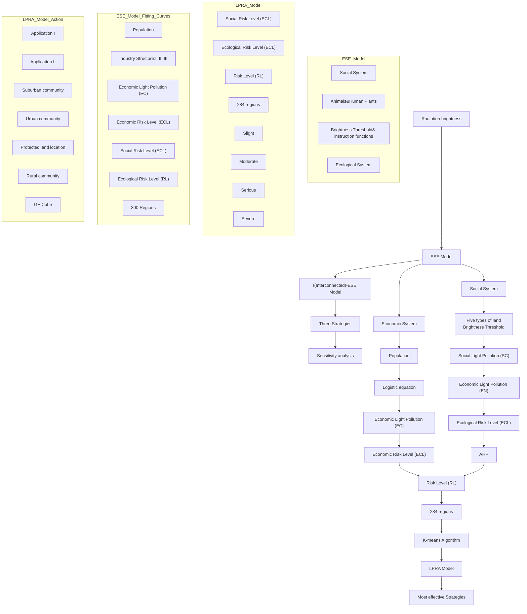
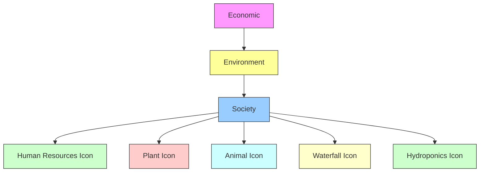
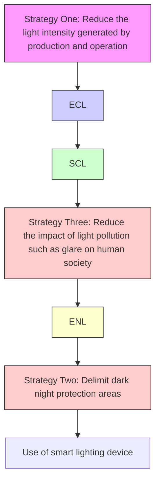

# Turn off the lights, Turn on the stars!

“On the earth, even in the darkest night, the light never wholly abandons his rule.“

Jules Verne, Journey to the Center of the Earth.

## Summary

With the rapid development of modern technology and excessive use of artificial lights, light pollution has resulted in increasingly severe problems. Therefore, the proper design and implementation of intervention strategies to address these problems deserve our attention. This report aims to build a light pollution risk level evaluating model and provide credible suggestions on how to effectively reduce the negative impacts of light pollution.

Three models are established: Model I: Ecologic-Social-Ecologic(ESE) Model; Model II: Light Pollution Risk Assessment(LPRA) Model and Model III: Interconnected-ESE Model(I-ESE) Model.

For ESE Model (Model I), we first abstract the risk of light pollution into three subsystems : Economic, Social and Ecological Subsystem and construct the ESE model. For economic subsystem, we calculate the population growth by the logistics equation and measure the light pollution in economic systems. For social subsystem, we take five types of land together with the brightness threshold into account and obtain the proportion of light-pollution-affected land. For ecological subsystem, we set a formula with the number of organisms together with light intensity value to calculate the number of affected organisms.

For LPRA Model(Model II), we use Analytic Hierarchy Process(AHP) based on Google search index to quantify the light pollution risk level(RL) of a certain region, then apply our model to 284 regions. After that, we use K-means algorithm to create a metric system for the risk levels and constructed four ranks: Slight(0.0443 ∼ 0.1678), Moderate(0.1705 ∼ 0.2542), Serious(0.2568 ∼ 0.3698), and Severe(0.3976 ∼ 0.6186). To apply our model to specific locations, we selected Ordos as protected land, Zhaotong as rural community, Qingyuan as suburban community, and Guangzhou as the urban community and obtained their RL scores: 0.1332, 0.1778, 0.2574 and 0.5154, while their risk levels are slight, moderate, serious and severe respectively.

For I-ESE Model(Model III), by establishing a link between every two subsystems, we constructed the Interconnected (I)-ESE Model on the basis of the ESE Model, and obtain quantitative relationships between ECL and SCL, ECL and ENL using nonlinear fitting. Based on I-ESE Model, we propose three effective intervention strategies to address the light situation: I. Reduce light intensity, II. Reduce the impact on society, and III. Delimit dark night protection areas and their actions correspondingly.

More specifically, we select Guangzhou and Zhaotong for further discussion and determine their optimal strategy: strategy I and II for Guangzhou and strategy II and III for Zhaotong. Then we measure the impacts of these strategies in general and particularly in Guangzhou and Zhaotong using I-ESE Model and visualize the impact with GE cube. The risk level in Guangzhou decreased from 0.5153 to 0.0309 while Zhaotong decreased from 0.1678 to 0.0885 after 20 years of implementing the optimal strategy.

Finally, the sensitivity and robustness of our model are tested. When we set the cost to be raw data, increase or reduce by 50%, the overall trend of risk level has little difference as the curve remains similar, verifying the sensitivity and robustness of our model.

Keywords: Light Pollution, ESE Model, LPRA Model, AHP, K-means algorithm, GE Cube

## Contents

## 1 introduction 3

1.1 Problem Background 3  
1.2 Problem Restatement & Our Work . . 3

## 2 Assumptions and Justifications 4

## 3 Notations 5

## 4 Establishing the ESE Model 5

4.1 Pre-processing of lighting data . . . 5  
4.2 Evaluation in economic subsystem 6  
4.3 Evaluation in social subsystem  
4.4 Evaluation in ecologic subsystem . . 8

## 5 Light Pollution Risk Assessment (LPRA) Model 10

5.1 Data proccessing 10  
5.2 Analytic Hierarchy Process(AHP) Model based on Google search index . . 10  
5.3 Light Pollution Risk Level Severity Scale 11

## 6 Application of LPRA Model 12

6.1 Application in 284 regions 12  
6.2 Application in Four Locations 13

## 7 Intervention Strategies Based on I-ESE Model 14

7.1 Establishing the Interconnected-ESE (I-ESE) Model . . 14  
7.2 Quantitative Impact Assessment 15  
7.3 Strategy I: Reduce light intensity . . . 16  
7.4 Strategy II: Reduce the impact of light pollution on society . . 17  
7.5 Strategy III: Delimit dark night protection areas 18

## 8 Case Study: Zhaotong and Guangzhou 19

8.1 Analysis of Effectiveness: Strategy I . . 19  
8.2 Analysis of Effectiveness: Strategy II . . . 20  
8.3 Analysis of Effectiveness: Strategy III 21  
8.4 Selection of the Optimal Strategy . . 21

## 9 Sensitivity analysis 22

## 10 Strengths and Weaknesses 23

10.1 Strengths . . 23  
10.2 Weaknesses 23

## 11 Strategy-promoting flyer 23

## 1 introduction

## 1.1 Problem Background

Estimates suggest that more than one-tenth of the planet’s land area experiences artificial light at night - and that rises to 23% if skyglow is included. [1] Artificial lights have revolutionized the way humans live their day-to-day lives, resulting in increasingly severe problems along with their benefits. More than ever, human and environmental health is suffering from this boom of artificial lighting. Unfortunately, we are now faced with what scientists call “light pollution”, which poses a great threat to the ecosystem, economy and our society in several aspects.

To tackle this problem, the methodology to measure the influence of light pollution in a certain location, as well as the design of a proper intervention strategy deserve our attention. Some major cities have been aware of the seriousness of light pollution and take the lead in the exploration of governance, but problems regarding lack of legal basis and public awareness have been revealed. Challenged by ICM, we decide to build a model to evaluate light pollution as well as determine corresponding intervention strategies.

## 1.2 Problem Restatement & Our Work

Considering the background information and restricted conditions identified, we need to take several measures to solve the following problems:

• Problem Restatement: Develop a metric to identify and evaluate the light pollution risk level of a certain location.  
- Our work: We first abstract the risk of light pollution into three subsystems, and calculated the light pollution risks concerning economic, social and ecological subsystems.  
• Problem Restatement: Apply our metric to four diverse types of locations: a protected land location, a rural community, a suburban community and an urban community.  
- Our work: Using AHP based on google search index, we quantify the light pollution risk level of a certain region. Then, we selected Ordos, Zhaotong, Qingyuan and Guangzhou for further discussions.  
• Problem Restatement: Describe three possible intervention strategies and their corresponding actions and their potential impacts on light pollution.  
- Our work: We propose three effective intervention strategies in three different aspects and their specific actions correspondingly. To evaluate the impact of these strategies, we obtain the quantitative relationships between risk levels in different aspects.  
• Problem Restatement: Choose two of our locations and determine the most effective intervention strategy in certain locations, as well as their impacts specifically.  
- Our work: We choose Guangzhou and Zhaotong to determine their optimal strategy through I-ESE Model and evaluated their impacts in GE cube.

flowchart

Figure 1: Flowchart of our study

## 2 Assumptions and Justifications

• Assumptions: The population density of organisms remains stable and constant.  
- Justifications: The environment maintains stability because natural disasters are infrequent while the birth and mortality rates are typically similar.  
• Assumptions: The industrial structure of primary, secondary and tertiary industries remains unchanged.  
- Justifications: As the economy of the locations we study are well-developed, the industrial upgrading of these nations is practically complete, thus the changes in proportions of primary, secondary, and tertiary industries are negligible.  
• Assumptions: The application of artificial light in agricultural production is not considered  
- Justifications: Compared with those in the secondary industry and tertiary industry, artificial lights in agriculture are not widely used. Thus, the proportion of artificial light used in primary industry is relatively small, and the negative impacts are negligible.  
• Assumptions: When considering the scoring in our LPRA model, only the selected area is considered, without considering its internal influence and the interaction between regions.  
- Justifications: As all aspects of risk level are not reflected by a certain indicator only, it can be the result of many factors working together.

## 3 Notations

<table><tr><td>Symbol</td><td>Definition</td></tr><tr><td>EC</td><td>Total amount of light pollution produced in the economic system</td></tr><tr><td>SC</td><td>The rate of light-pollution-risked land</td></tr><tr><td>EN</td><td>Total number of organisms affected by light pollution in an area</td></tr><tr><td>RL</td><td>Light pollution risk level of a certain location</td></tr><tr><td>ECL</td><td>The light pollution risk level in economy</td></tr><tr><td>SCL</td><td>The light pollution risk level in society</td></tr><tr><td>ENL</td><td>The light pollution risk level in ecologic system</td></tr></table>

## 4 Establishing the ESE Model

Light pollution is the presence of unwanted, inappropriate, or excessive artificial lighting.[2] Too much light pollution washes out the view of the universe, increasing energy consumption, interfering with astronomical research, disrupts ecosystems while affecting the health and safety of both humans and wildlife. Thus, we must evaluate the risk of these different aspects we’re currently facing because of light pollution.

Based on research by National Geographic [3], the main effects of light pollution can be broken down into three aspects, thus we identify the light pollution risk level in Economic System, Social System and Ecological System respectively. Then, we can establish our light pollution risk evaluation model: Economic-Social-Ecological System Model, we shall call it ESE Model in the following paper for short. To this end, our ESE Model is the combination of three submodels, which will be introduced respectively in the following paragraph, both shown in Figure 2:

flowchart

Figure 2: Breakdown of light pollution risk

## 4.1 Pre-processing of lighting data

Data preprocessing is a way of converting this raw data into a much-desired form so that useful information can be derived from it, which is fed into our model in evaluating the light pollution risk level in a certain area. We obtain data on grayscale values of the original impact of nighttime lighting (DN) from LPSTI[8], then we eliminate DN values that are less than zero. Then, we radio-metrically correct the nightlight data for the area, the radiation correction equation is as follows:

$$
L = D N ^ {\frac {2}{3}} \times 1 0 ^ {- 1 0} \tag {1}
$$

where L represents the corrected radiation brightness value and DN represents the original grayscale value.

## 4.2 Evaluation in economic subsystem

Light pollution generates significant costs, which in the U.S. amounts to nearly 7 billion dollars annually. [4] To evaluate the risk level regarding light pollution in the economic system, we consider the phenomenon of the accumulation of population in an economic system. As the economic system is a complicated, interrelated system, an initial impact on the population will lead to an exponentially higher consequential impact on risk levels. Inspired by a population dynamics method [5], we formulate the N as a logistic growth function in the following Equation 2:

$$
\frac {d N}{d t} = r \times N \times (1 - \frac {N}{N _ {m}}) \tag {2}
$$

where N represents the population in a certain location and $N _ { m }$ represents the maximization of the population. $r$ represents the natural growth rate of the population. Then we can solve the logistic equation by separating variables, integrating and rearranging to get the analytical solution of the N value:

$$
N (t) = \frac {N _ {m}}{(\frac {N _ {m}}{N _ {0}} - 1) e ^ {- r t} + 1} \tag {3}
$$

When considering the compositional structure in an economic system, industries are categorized into primary, secondary, and tertiary sectors. We reasonably assume that the ratio of the three industries remains unchanged during the research period. After calculating the projected value of population growth, we can define the total amount of light pollution produced in the economic system(EC) by the following Equation 4:

$$
E C = \sum_ {i = 1} ^ {3} N \times P C _ {i} \times P L P _ {i} \times t m _ {i} \tag {4}
$$

where $P C _ { i }$ represents the proportion of primary, secondary and tertiary industries in an economic system respectively and $P L P _ { i }$ represents the light pollution per capita in primary, secondary and tertiary industries. $t m _ { i }$ represents the length of time that the industry uses artificial light.

Based on data from UN Data[9], we visualized the data on the total population and population growth rate in the past decade in the world, where: WRL represents world data, LMC represents low-middle income countries, UMC represents middle-high income countries and HIC represents high-income countries, shown in Figure 3. Then, Figure4 shows the percentage of primary, secondary and tertiary industries respectively. It can be easily concluded that during the past decade, the proportion of different economic sectors remains unchanged, which reflects the rationality of our assumption.

bar chart

| Year | WLD       | LMC       | UMC       | IIIC      |
|------|-----------|-----------|-----------|-----------|
| 2011 | 7.0e+09   | 3.0e+09   | 2.5e+09   | 1.5e+09   |
| 2012 | 7.0e+09   | 3.0e+09   | 2.5e+09   | 1.5e+09   |
| 2013 | 7.0e+09   | 3.0e+09   | 2.5e+09   | 1.5e+09   |
| 2014 | 7.0e+09   | 3.0e+09   | 2.5e+09   | 1.5e+09   |
| 2015 | 7.0e+09   | 3.0e+09   | 2.5e+09   | 1.5e+09   |
| 2016 | 7.0e+09   | 3.0e+09   | 2.5e+09   | 1.5e+09   |
| 2017 | 7.0e+09   | 3.0e+09   | 2.5e+09   | 1.5e+09   |
| 2018 | 7.0e+09   | 3.0e+09   | 2.5e+09   | 1.5e+09   |
| 2019 | 7.0e+09   | 3.0e+09   | 2.5e+09   | 1.5e+09   |
| 2020 | 7.0e+09   | 3.0e+09   | 2.5e+09   | 1.5e+09   |
| 2021 | 7.0e+09   | 3.0e+09   | 2.5e+09   | 1.5e+09   |

line chart

| Year | WLD  | LMC  | UMC  | HIC  |
|------|------|------|------|------|
| 2011 | 1.3  | 1.6  | 0.8  | 0.4  |
| 2012 | 1.3  | 1.6  | 0.9  | 0.5  |
| 2013 | 1.3  | 1.6  | 0.9  | 0.5  |
| 2014 | 1.3  | 1.6  | 0.9  | 0.5  |
| 2015 | 1.3  | 1.6  | 0.8  | 0.5  |
| 2016 | 1.3  | 1.5  | 0.7  | 0.5  |
| 2017 | 1.3  | 1.5  | 0.7  | 0.5  |
| 2018 | 1.3  | 1.4  | 0.6  | 0.5  |
| 2019 | 1.3  | 1.4  | 0.5  | 0.5  |
| 2020 | 1.3  | 1.3  | 0.4  | 0.4  |
| 2021 | 1.3  | 1.3  | 0.3  | 0.0  |

Figure 3: Total population and growth rate

stacked bar chart

| Year | Percentage of primary industry (%) | Percentage of secondary industry (%) | Percentage of tertiary industry (%) |
|---|---|---|---|
| 2011 | 5 | 20 | 70 |
| 2012 | 5 | 20 | 70 |
| 2013 | 5 | 20 | 70 |
| 2014 | 5 | 20 | 70 |
| 2015 | 5 | 20 | 70 |
| 2016 | 5 | 20 | 70 |
| 2017 | 5 | 20 | 70 |
| 2018 | 5 | 20 | 70 |
| 2019 | 5 | 20 | 70 |
| 2020 | 5 | 20 | 70 |
| 2021 | 5 | 20 | 70 |

Figure 4: Proportion of industries

To this end, we have obtained the equation to calculate the total amount of light pollution produced in the economic system, thus the light pollution risk level depends on how the economic system is affected by light pollution, which can be represented by EN.

## 4.3 Evaluation in social subsystem

Other than economic effects, the influence of light pollution on social aspects can’t be denied. Low levels of artificial lights might lead to a higher rate of crime, thus there has been a trade-off between the positive and negative effects impacting a specific location.

Considering the fact that the levels and pathways of light pollution vary with different land-use purposes, we divided the land in a certain location into four types: Commercial land, residential land, administrative land, green land and others. To better represent the different effects on the social environment when the light intensity is too high or too low, we set the threshold interval as follows:

• Light intensity is less than the left endpoint of the threshold interval – high potential risks in crime issues  
• Light intensity is more than the right endpoint of the threshold interval – high potential risks in traffic accidents

Based on related research in night lighting design[8], we made distinctions between different land uses and their respective characteristics, thus calculating corresponding threshold intervals respectively. Results are shown in Table 1.

Table 1: Threshold intervals for different land types

<table><tr><td>Classification</td><td>Characteristics</td><td>Threshold intervals</td></tr><tr><td>commercial land</td><td>used for the sale of goods and services</td><td>10~20</td></tr><tr><td>residential land</td><td>used for housing</td><td>3~6</td></tr><tr><td>administrative office land</td><td>for non-profit facilities</td><td>15~25</td></tr><tr><td>green land</td><td>main existential form to improve urban ecology</td><td>≤ 3</td></tr><tr><td>others</td><td>/</td><td>2~5</td></tr></table>

Based on data from The night sky in the World[9], we obtained the area of each land type in the requested area that falls out of the threshold interval. Thus, we can calculate the rate of lightpollution-risked land(SC) by the proportion of the sum of area outside the threshold to the total area of all types, as Equation 5 shows:

$$
S C = \frac {\text {Area} _ {c o} + \text {Area} _ {r e} + \text {Area} _ {g r} + \text {Area} _ {a d} + \text {Area} _ {o t}}{\text {Area} _ {\text {total}}} \tag {5}
$$

where $A r e a _ { c o } , A r e a _ { r e } , A r e a _ { g r } , A r e a _ { a d } , A r e a _ { o t }$ represents the area that falls out of the threshold interval in commercial land, residential land, administrative land, green land and others. $A r e a _ { t o t a l }$ represents the total area of all types. Through the calculation of SC, we can obtain the proportion of lightpollution-risked land, thus evaluating the light pollution risk level in a certain area.

## 4.4 Evaluation in ecologic subsystem

Light pollution at night above a certain level may affect the normal survival of nocturnally active biological species, such as migration patterns, wake-sleep habits, and habitat formation. Therefore, we suppose that the light pollution risk level lies in the degree to of animals and plants are affected by light pollution.

A study of about 3,000 urban sites around the U.S.[10] found that trees and other woody plants exposed to constant artificial light at night began leafing out several days earlier than those that didn’t have nighttime lights. The evident difference across temperatures is shown in Figure 5.

line chart

| Different temperatures | With artificial light at night | Without artificial light at night |
| ---------------------- | ------------------------------ | ---------------------------------- |
| 35                     | 122                            | 135                                |
| 40                     | 125                            | 128                                |
| 45                     | 110                            | 115                                |
| 50                     | 100                            | 105                                |
| 55                     | 95                             | 102                                |
| 60                     | 68                             | 80                                 |
| 65                     | 75                             | 78                                 |
| 70                     | 73                             | 75                                 |

Figure 5: Day of year when leaf buds break

pyramid chart

| Category | Value | Biomass (%) |
|---|---|---|
| Birds | 0.002 | 0.08 |
| Human | 0.06 | 2.5 |
| Fish | 0.7 | 29 |
| Arthropods | 1 | 42 |

Figure 6: Proportion of species

For the evaluation of the ecologic system, we selected seven target subjects: Rodents, Birds, Common Fish, Tropical Fish, Trees, ordinary human and Photosensitive human, while the proportion of some species is listed in Figure 6. Then we classify them into three categories – Aquatics(common fish and tropical fish), terrestrials(rodents, birds and trees) and human(ordinary and photosensitive). The following Table 2 shows the illumination thresholds for the effect of light on animal and human rhythms. [6]

Table 2: illumination thresholds for the effect of light

<table><tr><td>Classification</td><td>Illumination suppression threshold(lx)</td></tr><tr><td>Rodents</td><td>0.03</td></tr><tr><td>Birds</td><td>0.3 ~ 1</td></tr><tr><td>Tree</td><td>0</td></tr><tr><td>Common Fish</td><td>1</td></tr><tr><td>Tropical fish</td><td>0.3</td></tr><tr><td>Human(Photosensitive)</td><td>6</td></tr><tr><td>Human(ordinary)</td><td>40 ~ 350</td></tr></table>

The first four threshold values come from a study by Yun, Hee-Kyung [7] while the threshold value of trees is based on a study on how urban lights at night influence the growing season. A study of about 3,000 urban sites around the U.S. found that trees and other woody plants exposed to constant artificial light at night began leafing out several days earlier than those that didn’t have nighttime lights. The difference was evident across temperatures, thus we take the threshold value of trees to be 0.

It can be concluded that once the light intensity is greater than the threshold, light pollution will affect the normal survival of living species. Therefore, we use the following equations to calculate the total number of organisms affected by light pollution in an area (EN). Based on the former three categories, we calculated their EN respectively.

For terrestrials:

$$
E N _ {t} = \sum_ {i = 1} ^ {3} t y p e _ {i} \times p l _ {1} \times 1 _ {A} (l g \geq l m _ {i}) \times R \tag {6}
$$

Then, for aquatics:

$$
E N _ {a} = \sum_ {i = 4} ^ {5} t y p e _ {i} \times p l _ {2} \times 1 _ {A} (l g \geq l m _ {i}) \times R \tag {7}
$$

Lastly, for humans:

$$
E N _ {h} = \sum_ {i = 6} ^ {7} t y p e _ {i} \times 1 _ {A} (l g \geq l m _ {i}) \times R \tag {8}
$$

where:

• type represents the population density of rodents, birds, trees, common fish, tropical fish, ordinary humans and photosensitive humans respectively.  
• $p l _ { i }$ represents proportion of surface area covered by land (i=1) and water (i=2).

• $l m _ { i }$ represents the suppression of melatonin secretion threshold of rodents, birds, common fish and tropical fish, shown in Table 2.  
• R represents the total surface area at a certain location.  
• $l g$ represents the light levels in the area. It should be noticed that the instruction functions $1 _ { A } ( l g \ge l m _ { i } )$ equals 1 when the light level is larger than the threshold and vice versa equals 0.

Thus, we obtain the equation to calculate the total number of organisms affected by light pollution in an area(EN) in Equation 9:

$$
E N = E N _ {t} + E N _ {a} + E N _ {h} \tag {9}
$$

Higher EN represents more organisms would be affected by light pollution in a certain area and more damage to the biosphere, thus it means a higher light pollution risk in the ecologic system. To this end, we develop an ecological risk model and use EN to evaluate the light pollution risk of the ecological system.

To this end, we have established three interlocking submodels - Economic-Social-Ecological System Model - that evaluates the light pollution risk level in three aspects respectively. Through the three indicators EC, SC and EN, we can use the AHP model introduced later to evaluate the light pollution risk level specifically in a certain area.

## 5 Light Pollution Risk Assessment (LPRA) Model

## 5.1 Data proccessing

The three subsystems of the ESE Model have different dimensions of score indicators. To eliminate the impact of data due to different dimensions, we first normalize the data for each metric, which means the scores we measure are limited in the range of 0 to 1. Since the level of risk posed by the three subsystems is a positive indicator, we use the following equation to normalize:

$$
x _ {i} ^ {\text { new }} = \frac {x _ {i} - x _ {\min}}{x _ {\max} - x _ {\min}} \tag {10}
$$

$x _ { i } ^ { n e w }$ indicates the data normalized, $x _ { i }$ indicates the initial data and n indicates the number of the data.

## 5.2 Analytic Hierarchy Process(AHP) Model based on Google search index

To measure and assess the level of light pollution risk in a region, we consider its three economic, social and ecological aspects of risk. Therefore, we need to combine the scores of the three subsystems of the standardized ESE Model: ECL SCL, and ENL, to form the indicator RL.

The risk level of economic, social and ecological risk. were considered. Then We establish the initial Comparative Matrix.

$$
M = (a _ {i j}) _ {3 \times 3}
$$

The $a _ { i j }$ represents the relative importance of index i to index $j .$ The search index can reflect a certain extent the hotness of people’s attention at a specific time and can be used to circumvent the subjectivity of the hierarchical analysis method. The search indexes of the three sections are shown in Figure 7. The search index we obtain is 63.41 for ”economy”, 65.46 for ”society”, and 68.47 for ”ecology”. So we get the relative importance of each index in the matrix:

$$
M _ {0} = \left[ \begin{array}{c c c} 1 & 6 3 / 6 5 & 6 3 / 6 8 \\ 6 5 / 6 3 & 1 & 6 5 / 6 8 \\ 6 8 / 6 3 & 6 8 / 6 5 & 1 \end{array} \right]
$$

The normalized eigenvector is (0.3214, 0.3316, 0.3469), which is shown in Figure 8.

Therefore, W = (0.3214, 0.3316, 0.3469) is taken as the weight vector among ECL SCL, and ENL.

line chart

| Year | Economy | Society | Ecology |
|------|---------|---------|---------|
| 2018 | 70      | 72      | 85      |
| 2019 | 65      | 68      | 80      |
| 2020 | 75      | 70      | 85      |
| 2021 | 60      | 65      | 75      |
| 2022 | 55      | 60      | 70      |
| 2023 | 70      | 75      | 85      |

Figure 7: Google Search Index

pie chart

| Category | Percentage (%) |
| :--- | :--- |
| Economy | 32 |
| Society | 33 |
| Ecology | 35 |

Figure 8: Proportion of each component

After the consistency test, we can complete the quantification of the risk level. Based on the weight vectors $W _ { 0 }$ , we calculate the score of the risk level in Equation 11.

$$
R L = W _ {1} \times E C L + W _ {2} \times S C L + W _ {3} \times E N L \tag {11}
$$

where RL represents the risk level of light pollution. $E C L , S C L$ and ENL represent the economic, social and ecological risk levels respectively.

## 5.3 Light Pollution Risk Level Severity Scale

We classified all 284 regions in China into four levels of severity of plastic waste. Slight, Moderate, Serious and Severe, by clustering the dataset into three using the K-means algorithm to divide the dataset into four clusters in Table 3.

Table 3: Classification based on K-means

<table><tr><td>Degree</td><td>Slight</td><td>Moderate</td><td>Serious</td><td>Severe</td></tr><tr><td>Maximum Value</td><td>0.17050261270</td><td>0.25424527533</td><td>0.39769974082</td><td>0.61860669274</td></tr><tr><td>Minimum Value</td><td>0.04432992940</td><td>0.17050261270</td><td>0.25424527533</td><td>0.39769974082</td></tr><tr><td>Cluster Center</td><td>0.12108674</td><td>0.215758722</td><td>0.293293568</td><td>0.484986811</td></tr><tr><td>Number of regions</td><td>64</td><td>159</td><td>46</td><td>15</td></tr></table>

## 6 Application of LPRA Model

## 6.1 Application in 284 regions

We calculated the scores for all 284 regions using LPRA Model. Specific risk levels can be found in Appendix A. What’s more, We created Figure 9 to analyze the distribution of light pollution levels and selected four categories from which to analyze the patterns.

scatterplot

| Regions | Risk Level |
| --- | --- |
| 1 | 0.48 |
| 2 | 0.35 |
| 3 | 0.28 |
| 4 | 0.22 |
| 5 | 0.25 |
| 6 | 0.20 |
| 7 | 0.18 |
| 8 | 0.15 |
| 9 | 0.12 |
| 10 | 0.10 |
| 11 | 0.08 |
| 12 | 0.06 |
| 13 | 0.05 |
| 14 | 0.04 |
| 15 | 0.03 |
| 16 | 0.02 |
| 17 | 0.01 |
| 18 | 0.005 |
| 19 | 0.003 |
| 20 | 0.002 |
| 21 | 0.001 |
| 22 | 0.0005 |
| 23 | 0.0003 |
| 24 | 0.0002 |
| 25 | 0.0001 |
| 26 | 0.00005 |
| 27 | 0.00003 |
| 28 | 0.00002 |
| 29 | 0.00001 |
| 30 | 0.000005 |
| 31 | 0.000003 |
| 32 | 0.000002 |
| 33 | 0.000001 |
| 34 | 0.0000005 |
| 35 | 0.0000003 |
| 36 | 0.0000002 |
| 37 | 0.0000001 |
| 38 | 0.00000005 |
| 39 | 0.00000003 |
| 40 | 0.00000002 |
| 41 | 0.00000001 |
| 42 | 0.000000005 |
| 43 | 0.000000003 |
| 44 | 0.000000002 |
| 45 | 0.000000001 |
| 46 | 0.0000000005 |
| 47 | 0.0000000003 |
| 48 | 0.0000000002 |
| 49 | 0.0000000001 |
| 50 | 0.0000000001 |
| 51 | 0.62 |
| 52 | 0.52 |
| 53 | 0.44 |
| 54 | 0.36 |
| 55 | 0.28 |
| 56 | 0.22 |
| 57 | 0.18 |
| 58 | 0.14 |
| 59 | 0.12 |
| 60 | 0.11 |
| 61 | 0.11 |
| 62 | 0.11 |
| 63 | 0.11 |
| 64 | 0.11 |
| 65 | 0.11 |
| 66 | 0.11 |
| 67 | 0.11 |
| 68 | 0.11 |
| 69 | 0.11 |
| 70 | 62 |
| 71 | 54 |
| 72 | 46 |
| 73 | 38 |
| 74 | 32 |
| 75 | 28 |
| 76 | 24 |
| 77 | 22 |
| 78 | 22 |
| 79 | 22 |
| 80 | 22 |
| 81 | 22 |
| 82 | 22 |
| 83 | 22 |
| 84 | 22 |
| 85 | 22 |
| 86 | 22 |
| 87 | 22 |
| 88 | 22 |
| 89 | 22 |
| 90 | 22 |
| ... | ... |
| ... | ... |
| ... | ... |
| ... | ... |
| ... | ... |
| ... | ... |
| ... | ... |
| ... | ... |
| ... | ... |
| ... | ... |
| ... | ... |
| ... | ... |
| ... | ... |
| ... | ... |
| ... | ... |

Figure 9: Risk level of light pollution in 284 regions

It can be seen that the distribution of light pollution risk levels shows more in the middle and less in the ends. It shows the balanced development of these areas, and the high-risk level is mostly concentrated in less prosperous cities, while the number of villages with low risk is also less.

Meanwhile, we made a heat map of light pollution risk in each region of China according to the provincial risk level in Figure 10. Four different types of areas - a protected land location, a rural community, a suburban community, and an urban community - were selected to measure and estimate the risk level.

choropleth map

| Province | Risk Level |
| -------- | ---------- |
| Ordos, Inner Mongolia | 0.595066849 |
| Zhaotong, Yunnan Province | 0.595066849 |
| Guangzhou, Guangdong Province | 0.595066849 |
| Qingyuan, Guangdong Province | 0.595066849 |

Figure 10: Heat map of light pollution risk levels in China, mainland

## 6.2 Application in Four Locations

To make the result more representative without losing adaptability, we selected four different cities in China: Ordos, Zhaotong, Qingyuan and Guangzhou as location of protected land, rural community, suburban community and urban community respectively.

For each location, we collected basic data such as its population, area, climate.etc. from National Bureau of Statistics[11], along with data used in ESE Model mentioned above. Then, the LPRA Model is used to analyze the light pollution risk level of each location while The value of each indicator (EC, EN, SC) is represented by radar charts. The comparison results are shown in Figure 11.

<table><tr><td colspan="4">Ordos —— Protected Land</td><td rowspan="4">ENL
Protected Land Index</td><td>Parameters</td></tr><tr><td>Coordinates</td><td>(106.42E,37.35N)</td><td>Risk Level</td><td>0.1332</td><td>ECL = 0.0241</td></tr><tr><td>Population</td><td>2.16 million</td><td>Climate</td><td>temperate continental climate</td><td>ENL = 0.3587</td></tr><tr><td>Area(km²)</td><td>86752</td><td>GDP(billion¥)</td><td>471.570</td><td>SCL = 0.0138</td></tr><tr><td colspan="4">Zhaotong —— Rural Community</td><td rowspan="4">ENL
Rural Community Index</td><td>Parameters</td></tr><tr><td>Coordinates</td><td>(103.7E,29.32N)</td><td>Risk Level</td><td>0.1778</td><td>ECL = 0.0106</td></tr><tr><td>Population</td><td>1.75 million</td><td>Climate</td><td>Highland Monsoon Stereoclimate</td><td>ENL = 0.2127</td></tr><tr><td>Area(km²)</td><td>23021</td><td>GDP(billion¥)</td><td>146.206</td><td>SCL = 0.2727</td></tr><tr><td colspan="4">Qingyuan —— Suburban Community</td><td rowspan="4">ENL
Suburban Community Index</td><td>Parameters</td></tr><tr><td>Coordinates</td><td>(113.01E,23.7N)</td><td>Risk Level</td><td>0.2574</td><td>ECL = 0.0762</td></tr><tr><td>Population</td><td>4.49 million</td><td>Climate</td><td>Subtropical monsoon climate</td><td>ENL = 0.1543</td></tr><tr><td>Area(km²)</td><td>19015</td><td>GDP(billion¥)</td><td>200.745</td><td>SCL = 0.4909</td></tr><tr><td colspan="4">Guangzhou —— Urban Community</td><td rowspan="4">ENL
Urban Community Index</td><td>Parameters</td></tr><tr><td>Coordinates</td><td>(113.23E,23.16N)</td><td>Risk Level</td><td>0.5154</td><td>ECL = 0.5264</td></tr><tr><td>Population</td><td>9.85 million</td><td>Climate</td><td>Subtropical monsoon climate</td><td>ENL = 0.0482</td></tr><tr><td>Area(km²)</td><td>7435</td><td>GDP(billion¥)</td><td>2823.197</td><td>SCL = 1.0000</td></tr></table>

Figure 11: Information of the four locations

## • Protected Land

Located at the eastern edge of the Asian-African desert, Ordos Relic Gull National Nature Reserve was promoted to a national nature reserve in 2001, which the main objects of protection being wildlife birds including relic gulls and desert ecosystems[12]. Thus, we selected Ordos to evaluate the light pollution risk in a protected land location.

Figure 11 shows that ENL value in Ordos is remarkably higher than the other three locations while SCL value is significantly lower. It is consistent with the objective facts of the nature reserve that they mainly serve as a habitat for different species and help protect endangered species, while economic and social aspects are usually not a primary consideration when it comes to a nature reserve. This result fully justifies the validity of our model.

## • Rural Community

Zhaotong is located in the hinterland of the Wumeng Mountains in Yunnan Province, 96.3% of whose territory is a mountainous area with severe stone desertification. With poor transportation and low technical level, people deep in the mountains have difficulties in survival. Thus, we consider Zhaotong as a rural community to assess its light pollution risk level.

Figure 11 shows that both ECL and SCL in Zhaotong is relatively low among the four locations, indicating that the economic system in Zhaotong suffers least from light pollution in the case. The result is consistent with our assumption as well as real-life circumstances as economic production in Zhaotong mainly depends on agriculture whose light pollution is slight. However, relatively backward social development level as well as extremely inconvenient traffic led to relatively vulnerable social aspects.

## • Suburban Community

Located on the periphery of the Pearl River Delta Economic Zone, Qingyuan has a vast territory and uneven development in many aspects. In terms of geographical location, Qingyuan is the most livable city in Guangdong with beautiful scenery. In a sense, it has become the back garden of Guangdong, thus we consider Qingyuan as a suburban community and apply our model. According to our results, Qingyuan has a relatively high SCL and low ENL due to its low biological reserve and high population.

## • Urban Community

Guangzhou is the capital of Guangdong Province as well as an international trade center and comprehensive transportation hub in China. Thus, it’s rational for us to consider Guangzhou as an urban community and apply our model.

We can see from Figure 11 that Guangzhou has the highest SCL and ECL while the ENL is lowest, which confirms our model setting as light pollution gross domestic product and social development level in Guangzhou are high in reality.

## 7 Intervention Strategies Based on I-ESE Model

## 7.1 Establishing the Interconnected-ESE (I-ESE) Model

The economy, society and ecosystems are interdependent and inextricably linked. No policy can act on just one part of them. Changing the level of risk in one has potential impacts on other systems.

During the process of establishing the ESE Model(Model I), we identified the light pollution risk level in Economic System, Social System and Ecological System respectively and build three models based on this breakdown respectively. To determine the overall impact of different strategies on the risk of light pollution at a site and to assess their potential impact in the three subsystems, it is necessary to establish correlations between ECL, SCL and ENL.

After determining the connection between the three subsystems, we need to test the correlation between the two. Among them, ECL has a significant negative correlation with ENL and ECL has a significant negative correlation with SCL. Therefore, we obtained the observed values and fitted curves by constructing nonlinear regressions for the variables with correlations as in Figure 12.

scatterplot

| ENL  | ECL  |
|------|------|
| 0.00 | 0.85 |
| 0.01 | 0.45 |
| 0.02 | 0.35 |
| 0.03 | 0.25 |
| 0.04 | 0.20 |
| 0.05 | 0.15 |
| 0.06 | 0.10 |
| 0.07 | 0.08 |
| 0.08 | 0.06 |
| 0.09 | 0.05 |
| 0.10 | 0.04 |
| 0.11 | 0.03 |
| 0.12 | 0.02 |
| 0.13 | 0.01 |
| 0.14 | 0.01 |
| 0.15 | 0.01 |
| 0.16 | 0.01 |
| 0.17 | 0.01 |
| 0.18 | 0.01 |
| 0.19 | 0.01 |
| 0.20 | 0.01 |
| 0.21 | 0.01 |
| 0.22 | 0.01 |
| 0.23 | 0.01 |
| 0.24 | 0.01 |
| 0.25 | 0.01 |
| 0.26 | 0.01 |
| 0.27 | 0.01 |
| 0.28 | 0.01 |
| 0.29 | 0.01 |
| 0.30 | 0.01 |
| 0.31 | 0.01 |
| 0.32 | 0.01 |
| 0.33 | 0.01 |
| 0.34 | 0.01 |
| 0.35 | 0.01 |
| 0.36 | 0.01 |
| 0.37 | 0.01 |
| 0.38 | 0.01 |
| 0.39 | 0.01 |
| 0.40 | 0.01 |
| 0.41 | 0.01 |
| 0.42 | 0.01 |
| 0.43 | 0.01 |
| 0.44 | 0.01 |
| 0.45 | 0.01 |
| 0.46 | 0.01 |
| 0.47 | 0.01 |
| 0.48 | 0.01 |
| 0.49 | 0.01 |
| 0.50 | 0.01 |
| 0.51 | 0.01 |
| 0.52 | 0.01 |
| 0.53 | 0.01 |
| 0.54 | 0.01 |
| 0.55 | 0.01 |
| 0.56 | 0.01 |
| 0.57 | 0.01 |
| 0.58 | 0.01 |
| 0.59 | 0.01 |
| 0.60 | 0.01 |

scatterplot

| SCL  | ECL  |
|------|------|
| 0.0  | 0.0  |
| 0.1  | 0.05 |
| 0.2  | 0.08 |
| 0.3  | 0.1  |
| 0.4  | 0.15 |
| 0.5  | 0.2  |
| 0.6  | 0.25 |
| 0.7  | 0.3  |
| 0.8  | 0.35 |
| 0.9  | 0.4  |
| 1.0  | 0.45 |

scatterplot

| ECL  | ENL  |
|------|------|
| 0.00 | 0.52 |
| 0.05 | 0.28 |
| 0.10 | 0.15 |
| 0.15 | 0.12 |
| 0.20 | 0.08 |
| 0.25 | 0.06 |
| 0.30 | 0.04 |
| 0.35 | 0.03 |
| 0.40 | 0.02 |
| 0.45 | 0.01 |
| 0.50 | 0.01 |
| 0.55 | 0.01 |
| 0.60 | 0.01 |
| 0.65 | 0.01 |
| 0.70 | 0.01 |
| 0.75 | 0.01 |
| 0.80 | 0.01 |
| 0.85 | 0.02 |
| 0.90 | 0.03 |
| 0.95 | 0.04 |
| 1.00 | 0.05 |

scatterplot

| ECL  | SCL  |
|------|------|
| 0.00 | -0.5 |
| 0.05 | 0.1  |
| 0.10 | 0.3  |
| 0.15 | 0.4  |
| 0.20 | 0.5  |
| 0.25 | 0.6  |
| 0.30 | 0.7  |
| 0.35 | 0.8  |
| 0.40 | 0.9  |
| 0.45 | 1.0  |
| 0.50 | 1.0  |
| 0.55 | 1.0  |
| 0.60 | 1.0  |
| 0.65 | 1.0  |
| 0.70 | 1.0  |
| 0.75 | 1.0  |
| 0.80 | 1.0  |
| 0.85 | 1.0  |
| 0.90 | 1.0  |
| 0.95 | 1.0  |
| 1.00 | 1.0  |

Figure 12: Fitting curves of the three subsystems

Meanwhile, we give the quantitative relationship between two and two in Table 4.

Table 4: Quantitative relationships between subsystems

<table><tr><td>Serial No.</td><td>Curve Type</td><td>Equation</td></tr><tr><td>A</td><td>Quadratic curve</td><td> $ECL = 0.279 - 1.774 \times ENL + 2.686 \times ENL^{2}$ ;</td></tr><tr><td>B</td><td>Composite curve</td><td> $ECL = 0.044 \times 9.472^{SCL}$ </td></tr><tr><td>C</td><td>Quadratic curve</td><td> $ENL = 0.171 - 0.634 \times ECL + 0.556 \times ECL^{2}$ </td></tr><tr><td>D</td><td>Logarithmic curve</td><td> $SCL = \log_{9.472}(ECL)$ </td></tr></table>

At this point, the I-ESE Model, a risk assessment system for the interaction of three subsystems, is constructed.

## 7.2 Quantitative Impact Assessment

To assess the impact of the strategy on the risk of systems, we need to consider the reduced value of the risk assessment(∆X).

To evaluate the impact of each strategy on risk level reduction, we need to introduce the light pollution investment cost(Cost). The impact is estimated with a constant investment cost. Considering the differences in the development level of each region, we obtain the cost of environmental pollution treatment as about $8 . 4 3 \mathrm { ‰ }$ of GDP based on the Annual Report of Ecological and Environmental Statistics 2021, as $C o s t = 0 . 0 0 0 8 4 3 \times G D P$ .

Having obtained the reduction in risk for systems, we can then obtain the new subsystem risk level(XL) in Equation 12.

$$
X L _ {n e w} = \frac {(X - \Delta X) - X _ {\text { min }}}{X _ {\text { max }} - X _ {\text { min }}} \tag {12}
$$

where X represents the risk of the three subsystems, taking the values EC, SC, and EN .

The level of risk in one of the subsystems is influenced by strategies, and the level of risk in the other two systems is influenced by the I-ESE model. From this, we obtain three indicators-ECL, SCL, and ENL.

After obtaining the risk level of the three subsystems, we substitute it into Equation 11 of Model II (LPRA) to obtain the risk level after implementing( $\boldsymbol { R L } _ { n e w } )$ the strategy.

Based on the three interconnected subsystems, we propose specific strategies in three aspects in Figure 13.

flowchart

Figure 13: Overview of Intervention Strategies

## 7.3 Strategy I: Reduce light intensity

The International Dark-Sky Association estimates that 1/3 of all lighting is wasted at an annual cost of 2.2 billion dollars. [14] Measures to reduce light intensity mainly lies in economical aspects as the economic effects of light pollution can be just as tragic as ecological aspects.

• Specific Actions  
- Reasonably limit the production and operation time of enterprises at night

Switching off unnecessary lights during non-production time can hugely help in reducing light pollution. Appropriately limiting the production and operation time for some high light-pollution industries can hugely help in reducing light intensity in economic aspects.

\- Use shades or covers that force the light downward

Using shades or covers to help the light better focus on the intended lighting area during production is an effective way. Their usage produces less spillover which can be part of the original light fixture or can be purchased separately.

\- Use light pollution control devices These days, there are many ways to automatically limit light usage with lighting controls. Examples are: using dimmers to reduce the intensity of the light, motion sensors so that lights only turn on when someone is in the area and timers to control when lights turn on and off.

## • Potential Impacts

The strategy functions mainly by limiting the production and operation time at night. Therefore, the formula for the reduction of production and operation time (∆t) for the firm is obtained in Equation 13.

$$
\Delta t = t _ {\text { initial }} - t _ {\text { limit }} = \frac {\text { Cost }}{P _ {2} + P _ {3}} \tag {13}
$$

\- where $t _ { i n i t i a l }$ represents the prescribed time for enterprises to stop production and operation, $t _ { l i m i t }$ represents the original production and operation stopping time without intervention, $P _ { 2 }$ represents the average production value per hour in the secondary industry and $P _ { 3 }$ represents the average turnover per hour in the service sector. Using ∆t and the population $( N )$ , we then obtain the reduction in $\mathrm { E C } ( \varDelta E C )$ in Equation 14.

$$
\Delta E C = N \times \left(P C _ {2} \times P L P _ {2} + P C _ {3} \times P L P _ {3}\right) \times \Delta t + \Sigma \delta \tag {14}
$$

\- where $P L P _ { 2 }$ represents light pollution from the secondary industry, $P L P _ { 3 }$ represents light pollution from the tertiary industry, and Σδ represents the reduction of light pollution by the remaining measures.

After calculating the $\varDelta E C$ , it is substituted into Equation 12 to calculate the economic risk level $( E C L ^ { n e w } )$ after implementing the strategy. The new social $( S C L ^ { n e w } )$ and environmental $( E N L ^ { n e w } )$ risk levels are then derived by bringing in Equations C and D based on I-ESE model. To this end, the light pollution risk level $( R L _ { 1 } ^ { n e w } )$ is calculated by Equation 11.

Thus, we measured the potential impact in terms of the change in $S C L ^ { n e w }$ and $E N L ^ { n e w }$ after changing the strategy while the change in risk $\mathrm { l e v e l } ( R L ^ { n e w } )$ indicating the overall impact.

In conclusion, without losing universality on the basis of the simplified model, we consider reasonably limiting the production and operation time of enterprises at night as the main action taken to reduce light intensity and evaluate its impacts on ECL.

## 7.4 Strategy II: Reduce the impact of light pollution on society

Excess artificial light at night disrupts the cycle, suppressing melatonin production and negatively affecting human health. Also, safety-related dangers that come with poor visibility at night are caused by glaring lights and result in more light pollution risks in our society.

## • Specific Actions

## - Use of smart lighting devices

LED light technology has evolved rapidly over the past few years, which is the best type of light to help reduce light pollution because their beams are more focused than other types such as fluorescent or metal halide. Thus, switching to LED lighting reduces brightness without affecting visibility and is able to effectively eliminate social risks.

\- Refrain from light trespassing The use of bright outdoor lights directed toward neighboring houses is likely to increase the risk of sleep disorders. Therefore, it must be ensured that outdoor lights do not trespass into residential houses. For example, light shields offer many benefits, including reduced glare and improved night vision.

\- Glare-free lighting for vehicles driven at night Dim lighting while driving at night is just enough for streets and highways already lit with artificial lighting. Thus, outdoor lights with glare should be replaced with low-glare alternatives.

## • Potential Impacts

The implementation of this measure is mainly through the use and extension of smart devices, thus it is necessary to calculate the number of street lights that need to be replaced, given in Equation 15.

$$
N u m = \frac {C o s t}{P + P _ {w o r k}} \tag {15}
$$

\- where Num represents the number of smart lighting devices that need to be placed, P represents the price of smart devices, and $P _ { w o r k }$ represents the construction price.

After obtaining the number of streetlights that need to be replaced given a certain amount of cost, we can calculate the reduction of SC(∆SC) in Equation 16 by the difference between street lighting brightness before and after the replacement.

$$
\Delta S C = \left(\text { light } _ {\text { intial }} - \text { light } _ {\text { smart }}\right) \times N u m + \Sigma \delta \tag {16}
$$

\- where $l i g h t _ { i n i t i a l }$ represents the brightness of the original streetlight, $l i g h t _ { l i m i t }$ represents the brightness after using the smart street light, and Σδ represents the reduction of light pollution by the remaining measures.

As $\varDelta S C$ is obtained, it is substituted into Equation 12 to calculate the social risk level $( S C L ^ { n e w } )$ after implementing strategy two. The new economic risk levels( $E C L ^ { n e w } )$ are then derived by bringing in Equation B in our I-ESE model. Then, the light pollution risk level $( R L _ { 1 } ^ { n e w } )$ is obtained by bringing into Equation 11.

Thus, we measured the potential impact by evaluating the change in $S C L ^ { n e w }$ after implementing the strategy, with the change in risk level $( R L ^ { n e w } )$ indicating the overall impact.

## 7.5 Strategy III: Delimit dark night protection areas

The conflict between ecological systems and light pollution has become more and more prominent in recent years. Thus, industrial transformation is a key way to coordinate economic development and environmental protection to achieve sustainable development and reduce light pollution risks.

## • Specific Actions

## - Delimit dark night protection areas

According to China Biodiversity Conservation and Green Development Foundation, locations with a certain biological density size are encouraged to designate dark night protection zones and make strict control of the use of lights in and around protected areas.

- Relocation of enterprises with high light pollution  
• Potential Impacts To make a better understanding as well as fully implement strategy three, it is optimal for us to set up protected areas for specific species. Therefore, it is particularly significant to calculate the extent of implementation of the protected area, and we obtained Equation 17 to establish the area of the protected area.

$$
S q _ {\text { protect }} = \frac {\text { Cost }}{C _ {\text { protect }}} \tag {17}
$$

\- $S q _ { p r o t e c t }$ represents the area of ecologic reserve in a location. After obtaining $S q _ { p r o t e c t } .$ , we can make improvements to the equation in the ecologic system. Since only plants and animals need to be considered for the establishment of light pollution protection zones. Then the reduction of $\mathrm { E N } ( \varDelta E N )$ can be calculated, shown in Equation 18.

$$
\Delta E N = \sum_ {i = 1} ^ {3} t y p e _ {i} \times p l _ {1} \times 1 _ {A} (l g \geq l m _ {i}) \times S q _ {\text { protect }} + \sum_ {i = 4} ^ {5} t y p e _ {i} \times p l _ {2} \times 1 _ {A} (l g \geq l m _ {i}) \times S q _ {\text { protect }} + \Sigma \delta \tag {18}
$$

\- where Σδ represents the reduction of light pollution by the remaining measures.

After calculating the $\varDelta E N$ , it is substituted into Equation 12 to calculate the ecological risk level $( E N L ^ { n e w } )$ after implementing the strategy. The new economic risk levels $( E C L ^ { n e w } )$ are then derived by bringing in Equation A based on the I-ESE model. Thereafter, the light pollution risk level $( R L _ { 1 } ^ { n e w } )$ is obtained by bringing into Equation 11.

Thus, we measured the potential impact in terms of the change in $E N L ^ { n e w }$ after changing the strategy, while the change in risk level $( R L ^ { n e w } )$ indicated the overall impact.

## 8 Case Study: Zhaotong and Guangzhou

To verify our I-ESE model and determine the most effective strategy, we chose two typical locations to apply our model: Zhaotong and Guangzhou.

## 8.1 Analysis of Effectiveness: Strategy I

With further implementation of strategy one, the value of ECL decreases as the prescribed time for enterprises to stop production and service $t _ { l i m i t }$ is ahead. Based on the Logistic Model in our ESE Model(Model 1), the population of both cities shows a growing trend, thus ECL will rise continuously with the population growth. To show the impact of strategy intervention more intuitively, we use d-value to represent the difference between risk levels with and without implementing strategy One Based on data from China Statistical Yearbook[12] in 2021, we calculated the difference between the $E C L T ^ { n e w }$ , $E N L ^ { n e w }$ , $S C L ^ { n e w }$ and $R L ^ { n e w }$ value with strategy one implemented and the value of ECL, ENL, SCL and RL without interventions, as both of the d-values are shown in Figure 14 and Figure 15.

bar chart

| Year | SCL_new | R_L_new | ENL_new | ECL_new |
|------|---------|---------|---------|---------|
| 2020 | -0.001  | 0.000   | 0.000   | 0.001   |
| 2025 | 0.000   | 0.001   | 0.001   | 0.002   |
| 2030 | 0.001   | 0.002   | 0.002   | 0.003   |
| 2035 | 0.002   | 0.003   | 0.003   | 0.004   |
| 2040 | 0.003   | 0.004   | 0.004   | 0.005   |
| 2045 | 0.004   | 0.005   | 0.005   | 0.006   |

Figure 14: D-value of strategy one in GZ

line chart

| Year | ECL_new | ENL_new | SCL_new | R_L_new |
|------|---------|---------|---------|---------|
| 2025 | 0.0000  | 0.0018  | 0.0000  | 6.0000  |
| 2030 | 0.0000  | 0.0018  | 0.0000  | 6.0000  |
| 2035 | 0.0000  | 0.0018  | 0.0000  | 6.0000  |
| 2040 | 0.0000  | 0.0018  | 0.0000  | 6.0000  |
| 2045 | 0.0000  | 0.0018  | 0.0000  | 6.0000  |

Figure 15: D-value of strategy one in ZT

It is obvious to see that the d-value of SCL, ECL and RL are increasing at a growing rate after 20 years of implementing strategy one in Guangzhou, reaching 0.0197 of d-value in ECL, 0.0083 of d-value in SCL and 0.0123 of d-value in RL. The lines have an upward growth trend with a positive slope except for ENL, indicating that strategy one is relatively efficient in Guangzhou when it comes to social and economic aspects. We believe that the large population and huge economic volume of Guangzhou mainly lead to greater scope for eliminating light pollution risk levels.

When it comes to Zhaotong, more improvements can be seen in ENL as its d-value reaches 0.0178 in 2041 while impacts in SCL and ECL are relatively small with 0.0004 of d-value in ECL. By the year 2023, the d-value in both reaches a relatively high level with 0.0181 in ENL and 0.0063 in RL. Since then, the d-value remains stable, representing the impacts of strategy one on three aspects in Zhaotong is stabilized. It is consistent with the fact that the impacts of strategy one on economic and social aspects are relatively not efficiently transmitted, due to its poor transportation and low technical level.

## 8.2 Analysis of Effectiveness: Strategy II

With more measures taken regarding the use and extension of smart devices, improvement in social aspects is reflected in the change in $S C L ^ { n e w }$ after implementing the strategy. Thus, the value of $E C L ^ { n e w } , E N L ^ { n e w } , S C L ^ { n e w }$ and $R L ^ { n e w }$ and the original levels are shown in Figure 16.

bar-line hybrid chart

| Year | GZ Risk Level (ECL_new) | GZ Risk Level (ENL_new) | GZ Risk Level (SCI_new) | GZ Risk Level (R_L_new) | ZT Risk Level (ECL_new) | ZT Risk Level (ENL_new) | ZT Risk Level (SCI_new) | ZT Risk Level (R_L_new) |
|------|--------------------------|--------------------------|--------------------------|--------------------------|--------------------------|--------------------------|--------------------------|--------------------------|
| 2022 | 0.2                      | 0.05                     | 1.0                      | 0.4                      | 0.2                      | 0.2                      | 0.28                     | 0.18                     |
| 2024 | 0.2                      | 0.05                     | 1.0                      | 0.4                      | 0.2                      | 0.2                      | 0.28                     | 0.18                     |
| 2026 | 0.2                      | 0.05                     | 1.0                      | 0.4                      | 0.2                      | 0.2                      | 0.28                     | 0.18                     |
| 2028 | 0.2                      | 0.05                     | 1.0                      | 0.4                      | 0.2                      | 0.2                      | 0.28                     | 0.18                     |
| 2030 | 0.2                      | 0.05                     | 1.0                      | 0.4                      | 0.2                      | 0.2                      | 0.28                     | 0.18                     |
| 2032 | 0.2                      | 0.05                     | 1.0                      | 0.4                      | 0.2                      | 0.2                      | 0.28                     | 0.18                     |
| 2034 | 0.2                      | 0.05                     | 1.0                      | 0.4                      | 0.2                      | 0.2                      | 0.28                     | 0.18                     |
| 2036 | 0.2                      | 0.05                     | 1.0                      | 0.4                      | 0.2                      | 0.2                      | 0.28                     | 0.18                     |
| 2038 | 0.2                      | 0.05                     | 1.0                      | 0.4                      | 0.2                      | 0.2                      | 0.28                     | 0.18                     |
| 2040 | 0.2                      | 0.05                     | 1.0                      | 0.4                      | 0.2                      | 0.2                      | 0.28                     | 0.18                     |
| 2042 | 0.2                      | 0.05                     | 1.0                      | 0.4                      | 0.2                      | 0.2                      | 0.28                     | 0.18                     |

Figure 16: Impacts of Strategy Two

It can be seen that Guangzhou’s SCL and ECL have been greatly reduced due to the intervention of strategy two, with ECL decreases from 0.5264 in 2022 to 0.0440 in 2041 and SCL decreases from 1 to 0.0229, indicating that the intervention of smart lighting devices has greatly improved not only social aspects but also ecological aspects. Meanwhile, data in Zhaotong shows that in the year 2030, SCL and RL reaches its relatively low positions of 0.0100 and 0.0885 and stays stable since then, while other risk levels stay relatively the same. The results in Zhaotong are consistent with the reality that with the low residential density and travel frequency of residents are likely to reduce the impact of strategic interventions.

## 8.3 Analysis of Effectiveness: Strategy III

For strategy three, we determined a set of actions to transfer industries with serious light pollution to low-biological-density areas and the improvements will be mostly shown in the decrease of ECL in both cities.

bar chart

| Year | SCL_new | R L_new | ECL_new | ENL_new |
|------|---------|---------|---------|---------|
| 2040 | 0.03    | 0.03    | 0.03    | 0.03    |
| 2038 | 0.07    | 0.06    | 0.06    | 0.05    |
| 2036 | 0.12    | 0.11    | 0.11    | 0.08    |
| 2034 | 0.18    | 0.17    | 0.16    | 0.11    |
| 2032 | 0.25    | 0.23    | 0.22    | 0.14    |
| 2030 | 0.32    | 0.28    | 0.27    | 0.17    |
| 2028 | 0.38    | 0.34    | 0.33    | 0.20    |
| 2026 | 0.45    | 0.40    | 0.39    | 0.23    |
| 2024 | 0.52    | 0.46    | 0.45    | 0.26    |
| 2022 | 0.58    | 0.52    | 0.51    | 0.29    |

Figure 17: Impacts of Strategy Three in GZ

bar-line hybrid chart

| Year | Risk Level | Decline Rate |
|------|------------|--------------|
| 2022 | 0.21       | -0.4         |
| 2023 | 0.01       | -0.8         |
| 2024 | 0.21       | -0.6         |
| 2025 | 0.21       | -0.6         |
| 2026 | 0.21       | -0.6         |
| 2027 | 0.21       | -0.6         |
| 2028 | 0.21       | -0.6         |
| 2029 | 0.21       | -0.6         |
| 2030 | 0.21       | -0.6         |
| 2031 | 0.21       | -0.6         |
| 2032 | 0.21       | -0.6         |
| 2033 | 0.21       | -0.6         |
| 2034 | 0.21       | -0.6         |
| 2035 | 0.21       | -0.6         |
| 2036 | 0.21       | -0.6         |
| 2037 | 0.21       | -0.6         |
| 2038 | 0.21       | -0.6         |
| 2039 | 0.21       | -0.6         |
| 2040 | 0.21       | -0.6         |

Figure 18: Impacts of Strategy Three in ZT

Figure 17 shows that with interventions regarding the protected area and relocation of specific industries, risk levels in Guangzhou show no obvious trend of change, indicating strategy three has limited influence on the light pollution risk level in Guangzhou, partly due to the relatively low biological density in Guangzhou. As for Zhaotong, the ENL has a downward sloping trend before it reaches its relatively low position 0.1695 in 2032 while others stay stable as well.

## 8.4 Selection of the Optimal Strategy

Based on the impact analysis and our I-ESE Model, we can now evaluate and compare the effectiveness between the three strategies, thus determining the optimal strategy for Guangzhou and Zhaotong. Instead of conducting a parallel comparison between different risk levels, we set up a GE Cube to more intuitively show the changes of ECL, SCL, ENL and Rl before and after the implementation of the strategies. We set up the GE Cube of Guangzhou and Zhaotong in the three-dimensional rectangular coordinate system respectively, while red dots represent the risk level location with and without strategy one, blue dots represent the risk level location with and without strategy two and yellow dots for strategy three, shown in Figure 19 and 20.

text_image

ENL
1
0.5
OP*
0.5
SCL
1
ECL
1

Figure 19: GE Cube of Guangzhou

text_image

ENL
1
0.5
OP*
0.5
SCL
1
ECL
1

Figure 20: GE cube of Zhaotong

It is obvious to see that for Guangzhou, strategy two makes huge improvements in eliminating the negative aspects of light pollution while it makes a huge difference in Zhaotong as well. Comparing the difference between the two locations, we draw a GE Cube, where the x-axis represents ECL, y-axis represents SCL and z-axis represents ENL. OP ∗ represents the optimal point where the light pollution risks are minimized

Therefore, we propose the optimal strategies for the two cities respectively:

## • Guangzhou: Strategy II + Strategy I

We choose strategy two - reducing the impact of light pollution on society - as the main strategy to implement and strategy one - reducing light intensity - as the secondary strategy. This inspired policy-makers in Guangzhou to promote the use of smart lighting devices without losing attention to economic considerations.

Once the strategies are implemented, positive changes will be seen in all aspects, especially in the reduction of SCL and ECL, which are evaluated in the analysis of the effectiveness and shown in Figure 19.

## • Zhaotong: Strategy II + Strategy III

As for Zhaotong, we believe strategy Two should be the main strategy while the second strategy is strategy three - delimiting night protection areas. Attention should be paid especially in the use of smart lighting devices and refraining from light trespassing while the production and operation time of enterprises at night should be carefully limited as well.

Efforts will be seen in ecological and social aspects clearly while the general light pollution risk level would be lower as we analyzed in the former part just now.

## 9 Sensitivity analysis

Since the investment value used for light pollution varies greatly from place to place, we test the impact of the change of risk level of different investment amounts on RL. By adjusting Cost, we can directly or indirectly affect ECL, SCL and ENL through different strategies, thus affecting RL.

We set Cost to increase by 50%, raw data and reduce by 50%, and plot our result of sensitivity analysis of cases in Guangzhou and Zhaotong. As can be seen from Figure 21 and Figure 22, the overall trend of the risk level curve of the three strategies remains unchanged after changing the investment. This verifies the sensitivity and robustness of our model.

line chart

| Year | 50% reduction | Raw data | 50% increase |
|------|----------------|----------|---------------|
| 2020 | 0.0000         | 0.0000   | 0.0000        |
| 2025 | 0.0075         | 0.0150   | 0.0035        |
| 2030 | 0.0085         | 0.0185   | 0.0045        |
| 2035 | 0.0100         | 0.0210   | 0.0055        |
| 2040 | 0.0125         | 0.0245   | 0.0065        |
| 2045 | 0.0150         | 0.0275   | 0.0075        |

line chart

| Year | 50% reduction | Raw data | 50% increase |
|------|----------------|----------|---------------|
| 2020 | 0.5            | 0.3      | 0.4           |
| 2025 | 0.4            | 0.25     | 0.3           |
| 2030 | 0.3            | 0.15     | 0.2           |
| 2035 | 0.2            | 0.05     | 0.1           |
| 2040 | 0.1            | 0.0      | 0.0           |
| 2045 | 0.0            | 0.0      | 0.0           |

line chart

| Year | 50% reduction | Raw data | 50% increase |
|------|---------------|----------|--------------|
| 2020 | 0.412         | 0.403    | 0.403        |
| 2025 | 0.412         | 0.403    | 0.403        |
| 2030 | 0.412         | 0.403    | 0.403        |
| 2035 | 0.412         | 0.403    | 0.403        |
| 2040 | 0.412         | 0.403    | 0.403        |

Figure 21: Sensitivity Analysis of Guangzhou

line chart

| Year | 50% reduction | Raw data | 50% increase |
|------|----------------|----------|---------------|
| 2020 | 0.001          | 0.001    | 0.001         |
| 2025 | 0.005          | 0.01     | 0.003         |
| 2030 | 0.007          | 0.015    | 0.004         |
| 2035 | 0.01           | 0.02     | 0.005         |
| 2040 | 0.012          | 0.025    | 0.006         |
| 2045 | 0.015          | 0.03     | 0.007         |

line chart

| Year | 50% reduction | Raw data | 50% increase |
|------|----------------|----------|---------------|
| 2020 | 0.5            | 0.3      | 0.4           |
| 2025 | 0.4            | 0.25     | 0.3           |
| 2030 | 0.3            | 0.2      | 0.2           |
| 2035 | 0.2            | 0.1      | 0.1           |
| 2040 | 0.1            | 0.0      | 0.0           |
| 2045 | 0.0            | 0.0      | 0.0           |

line chart

| Year | 50% reduction | Raw data | 50% increase |
|------|---------------|----------|--------------|
| 2020 | 0.17          | 0.17     | 0.17         |
| 2025 | 0.165         | 0.17     | 0.165        |
| 2030 | 0.16          | 0.17     | 0.16         |
| 2035 | 0.16          | 0.17     | 0.16         |
| 2040 | 0.16          | 0.17     | 0.16         |
| 2045 | 0.16          | 0.17     | 0.16         |

Figure 22: Sensitivity Analysis of Zhaotong

## 10 Strengths and Weaknesses

## 10.1 Strengths

• In our ESE Model, we design simulation algorithms to simulate the light pollution risk level in the economy, society and ecologic aspects of a certain location, which is close to real life and has certain reference significance.  
• We have established a multi-level indicator system in our LPRA model, the first-level indicators cover a wide range, and the second-level indicators are more detailed, so the model we built is comprehensive and detailed.  
• After simulation, we find that our model has significant progress on four main indicators(ENL, SCL, ECL and RL) after implementing the optimal strategy, indicating that our model is effective.  
• We consider various indicators in economic, social and ecological aspects, making our model relatively comprehensive and objective.

## 10.2 Weaknesses

• Some of our parameters are based on a semi-educated guess because some data are unavailable.  
• Even though our model considers the problem indicators extremely comprehensive, due to some indicator data missing, we can only choose the indicators that can be considered while the data is true and complete to analyze.

## 11 Strategy-promoting flyer

## !!! Better Zhaotong with Smart lighting !!!

text_image

REGULAR
OUTDOOR
DARK SKY
OUTDOOR

## ACTION 1: Using covered bulbs

Streets and highways lighting must be properly designed such that too much light is not reflected in the sky. The solution for this is using covered bulbs that light facing downwards.

## ACTION 2: Using LED lights

LEDs and compact fluorescents (CFLs) can help reduce energy use and protect the environment. Switching to LED lighting allows for reduced luminance without compromising visibility.

natural_image

Six circular icons showing different types of fluorescent LED lights (no text or symbols)

natural_image

Nighttime road scene with a car driving ahead, headlights illuminating the lane, surrounded by trees (no visible text or symbols)

## ACTION 3: Glare-free lighting

Dim lighting while driving at night is just enough for streets and highways already lit with artificial lighting. In areas without artificial lighting in Zhaotong, medium lighting is more than enough.

BETTER SLEEP  

natural_image

Illustration of a person sleeping in bed with a sun symbol above (no text or symbols)

Reduce impact of light trespassing  
LIGHT POLLUTIONRISK REDUCED

$$
47.3 \%
$$

After implementing the actions  
SAFER DRIVING  

natural_image

Illustration of a car with a traffic light and sunburst effect, no text or symbols present

Eliminate serious glare that reduce your vision

## References

[1] Gaston, K.J., Duffy, J.P., Gaston, S. et al. Human alteration of natural light cycles: causes and ecological consequences. Oecologia 176, 917–931 (2014).  
[2] https://en.wikipedia.org/wiki/Light\_pollution  
[3] https://education.nationalgeographic.org/resource/light-pollution/  
[4] Terrel Gallaway, Reed N. Olsen, David M. Mitchell, The economics of global light pollution, Ecological Economics, Volume 69, Issue 3,2010,Pages 658-665,ISSN 0921-8009  
[5] https://mathworld.wolfram.com/LogisticEquation.html  
[6] Grubisic M,Haim A,Bhusal P,et al.Light pollution,circadian photoreception,and melatonin in vertebrates[J].Sustainability,2019,11:1-51.  
[7] https://doi.org/10.14249/eia.2019.28.1.63  
[8] http://www.ldhyw.com/zcfg/csyjzmsjgf.asp  
[9] https://data.un.org  
[10] https://academic.oup.com/pnasnexus/article/1/2/pgac046/6569705  
[11] http://www.stats.gov.cn/tjsj/ndsj/  
[12] https://www.cma.gov.cn  
[13] http://www.inquinamentoluminoso.it/dmsp/index.html  
[14] InternationalDark-SkyAssociation.PracticalGuidetoLightPollution.Tucson, Arizona:InternationalDark-SkyAssociation,2011.  
[15] https://www.darksky.org/light-pollution/wildlife/

Appendix A

<table><tr><td>Regions</td><td>RL</td><td>Regions</td><td>RL</td><td>Regions</td><td>RL</td><td>Regions</td><td>RL</td><td>Regions</td><td>RL</td><td>Regions</td><td>RL</td><td>Regions</td><td>RL</td><td>Regions</td><td>RL</td><td>Regions</td><td>RL</td><td>Regions</td><td>RL</td><td>Regions</td><td>RL</td></tr><tr><td>Beijing</td><td>0.473</td><td>Changchu</td><td>0.292</td><td>Huainan</td><td>0.254</td><td>Liaochen</td><td>0.224</td><td>Shenzhen</td><td>0.619</td><td>Meishan</td><td>0.193</td><td>Dalian</td><td>0.288</td><td>Hangzhou</td><td>0.439</td><td>Qingdao</td><td>0.32</td><td>Xiangtan</td><td>0.203</td><td>Deyang</td><td>0.215</td></tr><tr><td>Tianjin</td><td>0.478</td><td>Jilin</td><td>0.287</td><td>Ma&#x27;ansha</td><td>0.229</td><td>Binzhou</td><td>0.241</td><td>Zhuhai</td><td>0.409</td><td>Yibin</td><td>0.197</td><td>Anshan</td><td>0.214</td><td>Ningbo</td><td>0.363</td><td>Zibo</td><td>0.262</td><td>Hengyang</td><td>0.215</td><td>Shenyang</td><td>0.296</td></tr><tr><td>Shijiazhu</td><td>0.291</td><td>Siping</td><td>0.211</td><td>Huaibei</td><td>0.229</td><td>Heze</td><td>0.223</td><td>Shantou</td><td>0.333</td><td>Guang&#x27;an</td><td>0.189</td><td>Wushun</td><td>0.203</td><td>Wenzhou</td><td>0.299</td><td>Zaozhuan</td><td>0.245</td><td>Shaoyang</td><td>0.223</td><td>Suqian</td><td>0.218</td></tr><tr><td>Tangshan</td><td>0.275</td><td>Liaoyuan</td><td>0.187</td><td>Tongling</td><td>0.242</td><td>Zhengzhe</td><td>0.284</td><td>Foshan</td><td>0.448</td><td>Dazhou</td><td>0.204</td><td>Benxi</td><td>0.2</td><td>Jiaxing</td><td>0.401</td><td>Dongying</td><td>0.257</td><td>Yueyang</td><td>0.215</td><td>Jinan</td><td>0.302</td></tr><tr><td>Qinhuang</td><td>0.216</td><td>Tonghua</td><td>0.212</td><td>Anqing</td><td>0.199</td><td>Kaifeng</td><td>0.143</td><td>Jiangmen</td><td>0.253</td><td>Ya&#x27;an</td><td>0.199</td><td>Dandong</td><td>0.203</td><td>Huzhou</td><td>0.263</td><td>Yantai</td><td>0.247</td><td>Changde</td><td>0.219</td><td>Luzhou</td><td>0.194</td></tr><tr><td>Handan</td><td>0.247</td><td>Baishan</td><td>0.209</td><td>Huangsha</td><td>0.19</td><td>Luoyang</td><td>0.147</td><td>Zhanjiang</td><td>0.227</td><td>Bazhong</td><td>0.185</td><td>Jinzhou</td><td>0.211</td><td>Shaoxing</td><td>0.311</td><td>Weifang</td><td>0.253</td><td>Zhangjiaj</td><td>0.189</td><td>Zhuzhou</td><td>0.254</td></tr><tr><td>Xingtai</td><td>0.23</td><td>Songyuan</td><td>0.22</td><td>Chuzhou</td><td>0.21</td><td>Pingdings</td><td>0.159</td><td>Maoming</td><td>0.216</td><td>Ziyang</td><td>0.188</td><td>Yingkou</td><td>0.233</td><td>Jinhua</td><td>0.305</td><td>Jining</td><td>0.241</td><td>Yiyang</td><td>0.201</td><td>Haikou</td><td>0.279</td></tr><tr><td>Baoding</td><td>0.239</td><td>Baicheng</td><td>0.226</td><td>Fuyang</td><td>0.211</td><td>Anyang</td><td>0.156</td><td>Zhaoqing</td><td>0.23</td><td>Guiyang</td><td>0.206</td><td>Fuxin</td><td>0.198</td><td>Quzhou</td><td>0.212</td><td>Tai&#x27;an</td><td>0.225</td><td>Zhizhou</td><td>0.224</td><td>Panzhihu</td><td>0.206</td></tr><tr><td>Zhangjiai</td><td>0.235</td><td>Harbin</td><td>0.359</td><td>Suzhou</td><td>0.205</td><td>Hebi</td><td>0.155</td><td>Huizhou</td><td>0.265</td><td>Liupansh</td><td>0.128</td><td>Liaoyang</td><td>0.23</td><td>Taizhou</td><td>0.26</td><td>Weihai</td><td>0.259</td><td>Yongzhou</td><td>0.228</td><td></td><td></td></tr><tr><td>Chengde</td><td>0.235</td><td>Qiqihar</td><td>0.291</td><td>Liu&#x27;an</td><td>0.206</td><td>Xinxiang</td><td>0.174</td><td>Meizhou</td><td>0.227</td><td>Zunyi</td><td>0.171</td><td>Panjin</td><td>0.246</td><td>Lishui</td><td>0.228</td><td>Rizhao</td><td>0.228</td><td>Huaihua</td><td>0.24</td><td></td><td></td></tr><tr><td>Cangzhou</td><td>0.241</td><td>Jixi</td><td>0.229</td><td>Maozhou</td><td>0.199</td><td>Jiaozuo</td><td>0.174</td><td>Shanwei</td><td>0.217</td><td>Anshun</td><td>0.124</td><td>Tieling</td><td>0.209</td><td>Hefei</td><td>0.276</td><td>Laiwu</td><td>0.24</td><td>Loudi</td><td>0.198</td><td></td><td></td></tr><tr><td>Langfang</td><td>0.281</td><td>Hegang</td><td>0.209</td><td>Chizhou</td><td>0.188</td><td>Puyang</td><td>0.149</td><td>Heyuan</td><td>0.221</td><td>Kunming</td><td>0.253</td><td>Changyar</td><td>0.222</td><td>Wuhu</td><td>0.223</td><td>Linyi</td><td>0.239</td><td>Zigong</td><td>0.182</td><td></td><td></td></tr><tr><td>Hengshui</td><td>0.213</td><td>Shuangya</td><td>0.241</td><td>Xuanchen</td><td>0.197</td><td>Xuchang</td><td>0.168</td><td>Yangjiang</td><td>0.211</td><td>Qujing</td><td>0.202</td><td>Huludao</td><td>0.204</td><td>Bengbu</td><td>0.199</td><td>Dezhou</td><td>0.224</td><td>Shaoguar</td><td>0.229</td><td></td><td></td></tr><tr><td>Taiyuan</td><td>0.277</td><td>Daqing</td><td>0.251</td><td>Fuzhou</td><td>0.3</td><td>Luohé</td><td>0.156</td><td>Chengdu</td><td>0.431</td><td>Yuxi</td><td>0.16</td><td>Tianshui</td><td>0.052</td><td>Urumqi</td><td>0.12</td><td>Karamay</td><td>0.054</td><td>Zhongwe</td><td>0.057</td><td></td><td></td></tr><tr><td>Datong</td><td>0.21</td><td>Yichun</td><td>0.264</td><td>Xiamen</td><td>0.398</td><td>Sanmenx</td><td>0.126</td><td>Dongguai</td><td>0.534</td><td>Baoshan</td><td>0.162</td><td>Wuwei</td><td>0.057</td><td>Ulanqab</td><td>0.081</td><td>Taizhou</td><td>0.271</td><td>Shangrao</td><td>0.175</td><td></td><td></td></tr><tr><td>Yangquan</td><td>0.197</td><td>Jiamusi</td><td>0.253</td><td>Putian</td><td>0.233</td><td>Nangyang</td><td>0.154</td><td>Zhongsha</td><td>0.448</td><td>Chongqin</td><td>0.526</td><td>Zhangye</td><td>0.061</td><td>Baiyin</td><td>0.055</td><td>Changsha</td><td>0.347</td><td>Suizhou</td><td>0.19</td><td></td><td></td></tr><tr><td>Changzhi</td><td>0.214</td><td>Qitaihe</td><td>0.203</td><td>Sanming</td><td>0.25</td><td>Shangqiu</td><td>0.152</td><td>Chaozhou</td><td>0.239</td><td>Lijiang</td><td>0.163</td><td>pingliang</td><td>0.051</td><td>Yulin</td><td>0.146</td><td>Ankang</td><td>0.221</td><td>Xianning</td><td>0.196</td><td></td><td></td></tr><tr><td>Jincheng</td><td>0.211</td><td>Mudanjia</td><td>0.28</td><td>Quanzhou</td><td>0.278</td><td>Xinyang</td><td>0.133</td><td>Jieyang</td><td>0.234</td><td>Pu&#x27;er</td><td>0.215</td><td>Jiuquan</td><td>0.131</td><td>Baise</td><td>0.211</td><td>Shangluo</td><td>0.212</td><td>Huanggai</td><td>0.217</td><td></td><td></td></tr><tr><td>Shuozhou</td><td>0.202</td><td>Heihe</td><td>0.291</td><td>Zhangzhe</td><td>0.242</td><td>Zhoukou</td><td>0.145</td><td>Yunfu</td><td>0.206</td><td>lincang</td><td>0.175</td><td>Qingyang</td><td>0.063</td><td>Hezhou</td><td>0.133</td><td>Lanzhou</td><td>0.127</td><td>Xiaogai</td><td>0.204</td><td></td><td></td></tr><tr><td>Jinzhou</td><td>0.213</td><td>Suihua</td><td>0.265</td><td>Nanping</td><td>0.26</td><td>Zhumadia</td><td>0.137</td><td>Nanning</td><td>0.242</td><td>Xi&#x27;an</td><td>0.294</td><td>Dingxi</td><td>0.054</td><td>Hechi</td><td>0.201</td><td>Jiayuguan</td><td>0.058</td><td>Jingzhou</td><td>0.204</td><td></td><td></td></tr><tr><td>Yuncheng</td><td>0.219</td><td>Shanghai</td><td>0.595</td><td>Longyan</td><td>0.241</td><td>Wuhan</td><td>0.312</td><td>Liuzhou</td><td>0.163</td><td>Tongchua</td><td>0.189</td><td>Longnan</td><td>0.058</td><td>Bayannun</td><td>0.09</td><td>Zhenjiang</td><td>0.291</td><td>Fuzhou</td><td>0.156</td><td></td><td></td></tr><tr><td>Xinzhou</td><td>0.21</td><td>Nanjing</td><td>0.339</td><td>Ningde</td><td>0.222</td><td>Huangsha</td><td>0.197</td><td>Guilin</td><td>0.188</td><td>Baoji</td><td>0.218</td><td>Xining</td><td>0.118</td><td>Hulunbui</td><td>0.351</td><td>Yangzhou</td><td>0.262</td><td>Yichun</td><td>0.162</td><td></td><td></td></tr><tr><td>Linfen</td><td>0.226</td><td>Wuxi</td><td>0.37</td><td>Nanchang</td><td>0.219</td><td>Shiyan</td><td>0.219</td><td>Wuzhou</td><td>0.14</td><td>Xieyang</td><td>0.226</td><td>Yinchuan</td><td>0.171</td><td>Sanyang</td><td>0.238</td><td>Yancheng</td><td>0.231</td><td>Ji&#x27;an</td><td>0.176</td><td></td><td></td></tr><tr><td>Lvliang</td><td>0.218</td><td>Xuzhou</td><td>0.239</td><td>Jingdezhe</td><td>0.121</td><td>Yichang</td><td>0.219</td><td>Beihai</td><td>0.143</td><td>Weian</td><td>0.227</td><td>Shizuisha</td><td>0.067</td><td>Chifeng</td><td>0.162</td><td>Lianyung</td><td>0.236</td><td>Yingtan</td><td>0.121</td><td></td><td></td></tr><tr><td>Huhehot</td><td>0.139</td><td>Changzhe</td><td>0.311</td><td>Pingxiang</td><td>0.122</td><td>Xiangyan</td><td>0.216</td><td>Fangchen</td><td>0.122</td><td>Yan&#x27;an</td><td>0.276</td><td>Wuzhong</td><td>0.071</td><td>Tongliao</td><td>0.117</td><td>Hua&#x27;an</td><td>0.222</td><td>Ganzhou</td><td>0.226</td><td></td><td></td></tr><tr><td>Baotou</td><td>0.141</td><td>Suzhou</td><td>0.561</td><td>Jiujiang</td><td>0.161</td><td>E&#x27;zhou</td><td>0.212</td><td>Qinzhou</td><td>0.138</td><td>Hanzhong</td><td>0.232</td><td>Guyuan</td><td>0.049</td><td>Chongzuo</td><td>0.153</td><td>Leshan</td><td>0.2</td><td>Suining</td><td>0.196</td><td></td><td></td></tr><tr><td>Wuhai</td><td>0.156</td><td>Nantong</td><td>0.268</td><td>Xinyu</td><td>0.127</td><td>Jingmen</td><td>0.196</td><td>Guigang</td><td>0.14</td><td>Hanlin</td><td>0.286</td><td>Zhongwe</td><td>0.057</td><td>Nanchong</td><td>0.2</td><td>Neijiang</td><td>0.189</td><td>Guangyu</td><td>0.202</td><td></td><td></td></tr></table>