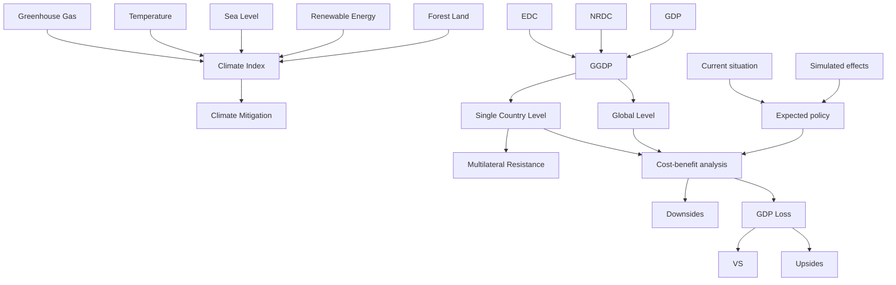
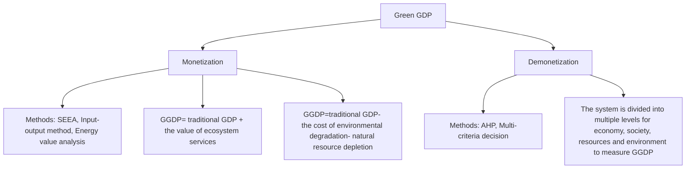
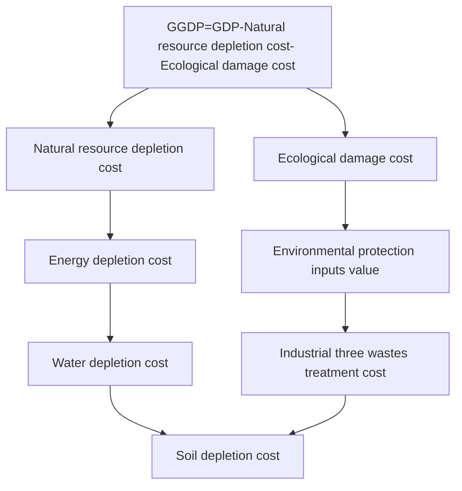
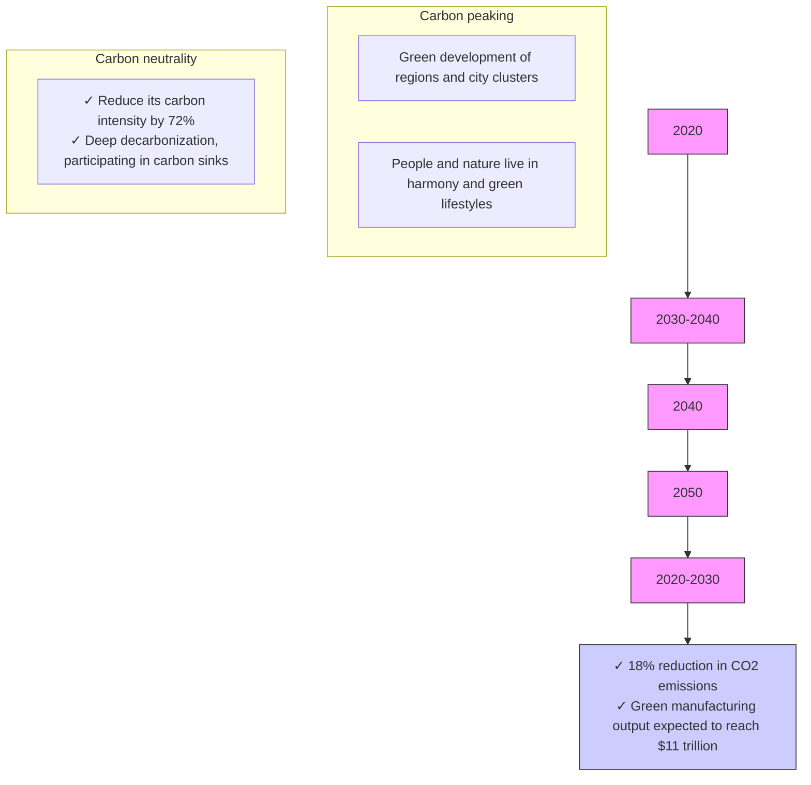

# Green GDP: Unraveling the Diverse Challenges and Opportunities for a Sustainable Future

Summary

In recent years, there has been growing speculation regarding the efficacy of GDP as a reliable indicator of a country’s economic health, prompting the proposal of using Green GDP as a more appropriate alternative. Unlike GDP, GGDP factors in natural resources in its calculation, thus presenting far-reaching implications for sustainable development.This paper aims to examine the worldwide implications of transitioning from GDP to GGDP, assess the cost-benefit of this shift, and predict its specific impacts on China within the country’s context.

First, we carefully selected a method to calculate GGDP, which involved monetizing the costs of natural resource damage (NRDC) and ecological damage (EDC) and subtracting them from the GDP. Using this method, we calculated GGDP and the GGDP-to-GDP ratio (GI) for over 90 percent of the world’s countries. The resulting trends and global distribution of GGDP and GI were then visualized and analyzed.

Subsequently, we selected five climate change-related indicators: forest cover, share of renewable energy use, sea level, average surface temperature, and greenhouse gas emissions to form a climate index, CI, which can assess the global impact on climate mitigation. We fitted linear regression models to compare the relationship between GDP, GGDP, and CI. The GGDP was quantified by assuming that its annual growth rate after replacing GDP is the same as the historical growth rate of GDP. Our findings indicate that the adoption of GGDP will lead to a 31.57 percents reduction in the rate of environmental degradation, demonstrating its potential to be a powerful tool for climate protection.

In addition, a cost-benefit analysis is conducted to evaluate the switch from GDP to GGDP. This analysis considers not only the potential benefits of climate protection and the potential costs associated with the fluctuation of GDP, but also the resistance encountered during the multilateral change. To estimate the multilateral resistance, a clustering approach is creatively utilized to categorize more than 90 percent of countries worldwide according to their national conditions and predict their attitudes towards such a switch. A unique algorithm is designed to monetize the cost of resistance for countries that oppose it. The results of the analysis indicate that the switch is worthwhile, and reflect a general trend as the world continues to evolve.

Furthermore, we selected China for in-depth analysis. Based on a sectoral perspective, we calculated the environmental costs of each sector and found that manufacturing, agriculture, residential and transport accounted for 89.2% of the total environmental costs. For the different sectors in China, we gave a policy implementation schedule for each decade from 2020 to 2050. We then utilized EPS (Energy-Policy-Simulation) model to assess the potential impact of policies on emissions reductions, costs, and social benefits. The monetized benefits of avoided premature deaths and climate benefits could reach RMB 1.6 and RMB 2.9 trillion, respectively.

In the end, we conducted an objective analysis of the strengths and weaknesses of the aforementioned model and drafted a non-technical report for Chinese leaders, leveraging the outcomes of our assessment while factoring in the prevailing national conditions in China.

## Contents

## 1 Introduction 3

1.1 Background 3  
1.2 Problem Restatement . 3  
1.3 Our Work . . 3

## 2 Assumptions and Justifications 4

## 3 Symbol Notations 5

## 4 Data Description 5

## 5 GGDP Measurement Method 5

5.1 Mainstream Measurements of GGDP . . . 5  
5.2 The Establishment of Our Model 6

5.2.1 Overall Framework . 6  
5.2.2 Specific Calculation of the Equation 6  
5.3 Global GGDP and GI Results 8

## 6 Climate Mitigation Assessment Model 10

6.1 Climate Index Based on IEW-TOPSIS Model 10

6.1.1 Selection of Indicators 10  
6.1.2 Entropy Weight Method . 11  
6.1.3 Topsis Method 11

6.2 CI Changes Prediction Model 12  
6.3 Assessment Model Results . . 13

## 7 Cost-Benefit Analysis Model 14

7.1 Potential Upside . . . . 14  
7.2 Potential Downside . . . . 14

7.2.1 GDP Loss 15  
7.2.2 Multilateral Resistance Analysis . . . 15

7.3 Comparison 17

## Energy-Policy-Simulation Model 17

8.1 Environmental Costs in Different Sectors 17  
8.2 Expectations and Policy Implementation Schedule . . . 18  
8.3 Policy Effects Based on EPS Model . . 19

## 9 Strengths and Weaknesses of the Models 21

9.1 Strengths . . 21  
9.2 Weaknesses 21

## 10 Conclusion 22

## References 24

## 1 Introduction

## 1.1 Background

Gross Domestic Product (GDP) is commonly used to measure the economic strength and development of a country or region by accounting for the final result of production activities of all resident units in a specific time frame. However, the pursuit of economic growth can have adverse impacts on the environment, resulting in negative externalities.

Since the 1960s, ecological degradation and global environmental pollution have become major constraints on sustainability of both society and the economy. To address this issue, green accounting, which incorporates environmental and sustainability perspectives and factors, has emerged as a way to account for the ecosystem. The concept of Green GDP was introduced to measure the GDP while accounting for these factors.

## 1.2 Problem Restatement

Having understood the problem, we figure out the following work:

Task 1: Select one GGDP calculation model that could have a measurable impact on climate mitigation if GGDP replaced GDP as the primary measure of economic .  
Task 2: Make a simple model to estimate the expected global impact of the switch to GGDP on climate mitigation health.  
Task 3: Determine if the switch is worthwhile globally by the cost-benefit analysis of potential upwards of climate mitigation and downwards of negotiation efforts.  
Task 4: Select a country and provide analysis of how this shift might impact them by considering both current economic status and ability to support future generations

## 1.3 Our Work

For convenience, we draw a flow chart to represent our work.

flowchart

Figure 1: Flow chart

We begin by establishing the monetized model that have a measurable impact on climate mitigation. GGDP is calculated by subtracting the cost of ecological damage (treatment cost and protection cost) and natural resource depletion (soil, water and energy cost ) from traditional GDP.  
We develop a climate mitigation assessment model. Initially, we introduce the mediator variable- Climate Index (CI) by IEW-TOPSIS method. We establish current correlation between GGDP and CI . Next, we re-evaluate GGDP and CI supposing the switch took place. The discrepancies between two set of ∆CI indicate the effect on climate mitigation.  
We conduct a cost-benefit analysis and introduce a multilateral resistance correction term, which is estimated by an analytical approach based on clustering. Our analysis suggests that the shift to GGDP is worthwhile and aligns with the world’s development trajectory.  
We choose China as our target countries for case study, employing our model into the countries. Based on a sectoral perspective, we calculated the environmental costs of each sector and gave a policy implementation schedule for each decade from 2020 to 2050. Then we discuss the scalability and adaptability of our model, make a sensitivity analysis, and describe the future work.

## 2 Assumptions and Justifications

Assumption 1: The growth rate of GDP and GGDP is consistent.

Explanation: When a country replaces GDP with GGDP, the government establishes a growth rate target for GGDP that is essentially identical to the growth rate target for GDP. So we assume that the growth rate of GDP and GGDP is consistent.

Assumption 2: The impact of natural factors on global climate change is consistent.

Explanation: While natural factors can contribute to climate change, the scale and rate of human activities are overwhelming the natural pro cesses and are causing climate change at a more unprecedented rate.

Assumption 3: Simultaneity and transiency of the switch.

Explanation: Upon analyzing the global landscape, it can be deduced that the process of transitioning from Green Gross Domestic Product (GGDP) to Gross Domestic Product (GDP) is expeditiously and homogeneously accomplished in a relatively short period of time, typically spanning one year for all nations.

Assumption 4: Relative world peacefulness.

Explanation: Even in the face of the possible impediments posed by multilateral change, the risk of any widespread military conflict or the complete decimation of any nation is negligible. Such a supposition acknowledges the complexity and variability of the international landscape, yet underscores the resilience of the global community in navigating these challenges and maintaining a semblance of stability.

## 3 Symbol Notations

Table 1: Notations used in this paper

<table><tr><td>Symbol</td><td>Description</td></tr><tr><td>GDP</td><td>Gross domestic production</td></tr><tr><td>GGDP</td><td>Green GDP</td></tr><tr><td>NRDC</td><td>Natural resource depletion cost</td></tr><tr><td> $NRDC_e$ </td><td>Energy depletion cost</td></tr><tr><td> $NRDC_w$ </td><td>Water depletion cost</td></tr><tr><td> $NRDC_s$ </td><td>Soil depletion cost</td></tr><tr><td>EDC</td><td>Ecological damage cost</td></tr><tr><td> $EDC_t$ </td><td>Industrial &quot;three wastes&quot; treatment costs</td></tr><tr><td> $EDC_p$ </td><td>Environmental protection inputs value</td></tr><tr><td>GI</td><td>GGDP index</td></tr><tr><td>CI</td><td>Climate index</td></tr></table>

\*There are some variables that are not listed here and will be discussed in detail in each section.

## 4 Data Description

Table 2: Data and Database Websites

<table><tr><td>Database Names</td><td>Database Websites</td></tr><tr><td>GDP</td><td>https://databank.worldbank.org/source/world-development-indicators</td></tr><tr><td>NRDC,EDC</td><td>https://www.oecd.org/greengrowth/green-growth-indicators/</td></tr><tr><td>CI</td><td>https://www.epa.gov</td></tr><tr><td>Maps</td><td>© 2023 Mapbox © OpenStreetMap</td></tr><tr><td>Output value of 26 sectors</td><td>China Statistical Yearbook for the years of 2021; China Industry</td></tr></table>

## 5 GGDP Measurement Method

## 5.1 Mainstream Measurements of GGDP

Many organizations have been devoted to Green GDP accounting worldwide. In 1993, the United Nations Bureau of Statistics (UNBS) and the World Bank cooperated to develop the Systematic Integrated Environmental and Economic Accounting Accounts (SEEA for short), which first introduced the concept of Green GDP.Internationally established Green GDP accounting systems include the Philippine System of Environmental and Natural Resource Accounting (EN-RAP for short).There are two perspectives for measuring Green GDP: monetization and demonetization. Monetization involves adding or subtracting data from the original GDP, while demonetization involves building a comprehensive evaluation system.

On the monetized accounting level, there are two mainstream definitions of Green GDP. The first involves adding the value of ecosystem services to traditional GDP, while the second involves subtracting the cost of environmental degradation and natural resource depletion from traditional GDP. The second definition is more established, as the accounting of ecosystem services is still in the process of conceptualization.

flowchart

Figure 2: Measurement of Green GDP

On the demonetized accounting level, some scholars have proposed the idea of dividing the economic, social, resource, and environmental aspects into multiple levels to establish an accounting system and measure the Green GDP level situation with non-monetized values. Hierarchical analysis and multiple criteria decision models are the main applied methods.

## 5.2 The Establishment of Our Model

## 5.2.1 Overall Framework

Since the natural environment is uncertain and region-specific, and social development varies across countries and regions, there are differences in the agreement of specific adjustment terms. Therefore, there is no perfect and uncontroversial standard for a Green GDP accounting system. To provide data index support for sustainable economic development, a simpler and more feasible model should be adopted for the calculation method of Green GDP at this stage. The method of Green GDP measurement should also have a measurable impact on climate mitigation. In consideration of these factors, a Green GDP accounting model framework is proposed:

$$
G G D P = G D P - N R D C - E D C \tag {1}
$$

In the equation, GGDP denotes Green GDP, NRDC denotes natural resource depletion cost and EDC denotes ecological damage cost. Figure 3 gives a further description of Equation 1.The measurement of NRDC and EDC will be discussed in detail soon.

## 5.2.2 Specific Calculation of the Equation

Calculation of NRDC

(1) Energy depletion cost

flowchart

Figure 3: Description of the Equation

Drawing on relevant research results, we select the prices of energy $P _ { e i }$ for each year and then correct the prices $P _ { C e i }$ with the help of energy price index. We multiply the energy consumption of each year $Q _ { e i }$ by the energy price of each year in each country to get the Energy depletion costs.

$$
N R D C _ {e} = P _ {C e i} \times Q _ {e i} \tag {2}
$$

## (2) Water depletion cost

The value of water resources depletion $N R D C _ { w }$ is obtained in a similar way $( P _ { w i } \times$ $Q _ { w i } )$ .In the estimation of water resources prices $P _ { w i } ,$ the empirical method is an internationally accepted and easy-to-use method, and is estimated as follows:

$$
P _ {w i} = F _ {w i} / Q _ {w i} \times \alpha_ {i} \tag {3}
$$

In the equation, α denotes the coefficient of consumers’ willingness to pay; and the subscript i denotes the ith region.For $\alpha ,$ scholar Kim Yuze et.al (2014) combined the World Bank’s recommendations and proposed an estimation:

$$
\alpha_ {i} = \left\{ \begin{array}{ll}3 \% & R _ {i} \in [ 0, 5 0 0 ] \\ 3 \% - \frac {1}{1250} (R _ {i} - 5 0 0) \% & R _ {i} \in (5 0 0, 3 0 0 0) \\ 1 \% & R _ {i} \in [ 3 0 0 0, + \infty) \end{array} \right. \tag{4}
$$

## (3) Soil depletion cost

Soil depletion cost is a complex concept that can be measured in various ways. Here are some possible approaches:Yield Loss, Nutrient Depletion and Arable Land value.We use the earnings multiplier method for the valuation of arable land to quantitatively measure soil depletion.

The average production value of the arable land $A P C _ { T _ { 1 } } , A P C _ { T _ { 2 } } , A P C _ { T _ { 3 } }$ in the previous three years is first obtained, and then multiplied by the highest multiplier of $\beta .$ It denotes the combined maximum multiple of the land compensation fee and resettlement subsidy. $\beta$ varies in different countries, we select 16 as $\beta _ { a v e }$ through investigation.

To obtain the total value of the arable land $T V _ { s } .$ . The price per unit of arable land $P _ { s i }$ is then obtained after dividing by the arable land area $L A$ . The price per unit of arable land obtained $P _ { s i }$ is multiplied by the area of arable land change $\Delta L A$ in each year to obtain the receding value of arable land resources.

$$
N R D C _ {s} = \max \left(A P C _ {T _ {1}}, A P C _ {T _ {2}}, A P C _ {T _ {3}}\right) \times \beta_ {\text {ave}} / L A \times \Delta L A \tag {5}
$$

## Calculation of the EDC

## (1) Industrial "three wastes" treatment cost

Wastewater, waste gas, and solid waste produced in production and daily life have a direct negative impact on the environment. Regulations such as pollution reduction and non-hazardous discharge can mitigate pollution but not completely eliminate it. Treatment costs of pollutants are therefore important to consider.

$$
E D C _ {t} = C _ {w} + C _ {e g} + C _ {s} \tag {6}
$$

Wastewater treatment cost $C _ { w }$ is calculated by multiplying the volume of wastewater directly discharged by each country by the unit cost of wastewater treatment. Similarly, the cost of exhaust gas treatment $C _ { e g }$ is determined by multiplying the emissions of the most commonly emitted pollutants by their reduction costs per unit. Solid waste treatment cost $C _ { s }$ is determined by multiplying solid waste emissions by their prices per unit.

## (2) Environmental protection inputs value

To calculate how much pollution is costing a region, we can’t just focus on the cost of treating the "three wastes". We also need to consider other expenses, like the money spent on engineering to protect the environment, getting ready for disasters, and investing in things that help the environment.

## Calculation of GGDP Index

Once the GGDP has been calculated, it is possible to compute the Green GDP Index (GI)(Equation 7), which can be employed to integrate negative environmental impacts into the GDP calculation, allowing for a more comprehensive evaluation of the country’s economic situation. GI can also reflect the degree of national implementation of green development.

$$
G I = G G D P / G D P \times 100 \% \tag{7}
$$

## 5.3 Global GGDP and GI Results

Figure 4 demonstrates changes in GI from 2000 to 2021. The left figure reflects world changes and the right one compares the GI trend between the world and China.From Figure 4, three conclusions can be made.

(1) The world’s GI is showing an upward trend, indicating that countries are increasingly prioritizing environmental protection and not sacrificing it for economic development.  
(2) During the 2008 financial crisis and the 2020 pandemic outbreak, reduced human activity led to a significant increase in the world’s GI. However, in the following

line chart

| YEAR | World | China |
|------|-------|-------|
| 2000 | 0.913 | 0.725 |
| 2001 | 0.911 | 0.735 |
| 2002 | 0.910 | 0.745 |
| 2003 | 0.920 | 0.785 |
| 2004 | 0.919 | 0.795 |
| 2005 | 0.923 | 0.815 |
| 2006 | 0.925 | 0.835 |
| 2007 | 0.924 | 0.845 |
| 2008 | 0.918 | 0.855 |
| 2009 | 0.912 | 0.865 |
| 2010 | 0.915 | 0.875 |
| 2011 | 0.916 | 0.885 |
| 2012 | 0.914 | 0.895 |
| 2013 | 0.921 | 0.905 |
| 2014 | 0.925 | 0.915 |
| 2015 | 0.930 | 0.925 |
| 2016 | 0.935 | 0.935 |
| 2017 | 0.940 | 0.945 |
| 2018 | 0.941 | 0.948 |
| 2019 | 0.938 | 0.947 |
| 2020 | 0.946 | 0.948 |
| 2021 | 0.938 | 0.945 |
| 2022 | 0.935 | 0.943 |

Figure 4: Changes in GI from 2000 to 2021

years, there was a significant decrease, suggesting a rebound in production that harms the environment.

(3) China’s GI has risen significantly, and the gap between China’s GI and the world’s GI has narrowed in the last two decades. This suggests that China’s government values green development and invests heavily in environmental protection. Other countries can learn from China’s experience .

Figure 5 visualizes the current global GGDP results based on our framework in 2021.The left figure reflects world GGDP results and the right figure shows the PRC’s results.As is shown , the differences between nations and regions emerge. From Figure 5, two conclusions can be made.

text_image

0.5006
0.9879
1,176
32,252

Figure 5: Global GI and China’s GGDP by province (2021)

(1) According to GGDP results, the Americas and Europe are leading in terms of economic development, followed by Asia and Oceania, with Africa (particularly Central Africa) lagging behind.  
(2) Although China has made significant progress in green development, there remains a glaring issue of uneven regional progress. While the eastern and southern regions of China boast high GGDP scores, the western and northern regions have ample room for improvement.

## 6 Climate Mitigation Assessment Model

Climate mitigation is a crucial response to climate change that aims to reduce the impact of greenhouse gases in the atmosphere. In order to study the impact of the global policy (replacing GDP with GGDP) on climate mitigation, we built a model to quantify the impact of this policy on climate mitigation.

To address this issue, we developed a climate mitigation assessment model. Initially, we introduced the concept of a Climate Index (CI), which serves as a mediator variable representing a combined evaluation of global climate conditions. Using linear regression, we established a correlation between GDP, GGDP, and CI scores. Next, we hypothesized that GDP was substituted by GGDP from a specific year and reevaluated GGDP and CI scores accordingly. The discrepancies between the changes of CI measured the extent of climate mitigation.

## 6.1 Climate Index Based on IEW-TOPSIS Model

## 6.1.1 Selection of Indicators

The CI model includes five most important quantitative indicators that can be used to measure climate mitigation:

## (1)Forest land area

Forest land area $( x _ { 1 } )$ refers to the total amount of land covered by trees and forests, and is an important indicator of the health of ecosystems and the potential for carbon sequestration.

## (2)Adoption rate of renewable energy sources

The adoption of renewable energy sources $\left( x _ { 2 } \right)$ is a key indicator of climate mitigation progress. This can be measured by the share of renewable energy in the total energy mix or by the number of renewable energy installations. This indicator can be tracked at the national, regional, or sectoral level.

## (3)Sea level height

Sea level height $\left( x _ { 3 } \right)$ is the average level of the ocean’s surface, measured relative to a specific point on land, and can be affected by factors such as ocean currents, tides, and climate change.

## (4)Average surface temperature

Average surface temperature $( x _ { 4 } )$ refers to the mean temperature of the Earth’s surface, usually measured over a period of many years, and is a key indicator of the planet’s overall climate.

## (5) Greenhouse gas emissions

Quantity of Greenhouse gas (GHG) emissions $( x _ { 5 } )$ serves as the primary indicator of climate mitigation efforts. It measures the reduction of GHG emissions over time, usually expressed as a percentage reduction from a baseline year.

## 6.1.2 Entropy Weight Method

Entropy weight method is an objective weighting method, which is based on the principle that the smaller the variation degree of the index is, the less information it reflects, so the weight value of the index should be lower. Thus, we use it to determine the weight of the indicators. The calculation process is as follows:

Step1: Data normalization:

$$
z _ {i j} = \frac {x _ {i j}}{\sqrt {\sum_ {i = 1} ^ {n} x _ {i j} ^ {2}}} \tag {8}
$$

Step2: Calculate the proportion of the ith sample of the jth index:

$$
z _ {i j} = \frac {x _ {i j}}{\sqrt {\sum_ {i = 1} ^ {n} x _ {i j} ^ {2}}} e _ {j} = - \frac {1}{\ln n} \sum_ {i = 1} ^ {n} p _ {i j} \ln (p _ {i j}) \quad (j = 1, 2, \dots m) \tag {9}
$$

Step3: Get the entropy weight of each index according to the following formula:

$$
W _ {j} = \frac {1 - e _ {j}}{m - \sum_ {j = 1} ^ {m} e _ {j}} \tag {10}
$$

The calculated weight index results are as follows:

Table 3: Weight index results

<table><tr><td>Index</td><td>Weight</td></tr><tr><td> $x_{1}$ -Forest land area</td><td>0.207</td></tr><tr><td> $x_{2}$ -Adoption of renewable energy sources</td><td>0.172</td></tr><tr><td> $x_{3}$ -Sea level height</td><td>0.172</td></tr><tr><td> $x_{4}$ -Average surface temperature</td><td>0.197</td></tr><tr><td> $x_{5}$ -Total greenhouse gas emissions</td><td>0.152</td></tr></table>

## 6.1.3 Topsis Method

## Step 1: Normalize the decision matrix

To ensure that all the criteria are weighted equally, the first step is to normalize the decision matrix for each criterion. The normalized value for the i-th criterion and the j-th alternative is given by:

$$
x ^ {\prime} i j = \frac {x i j}{\sqrt {\sum_ {j = 1} ^ {n} x _ {i j} ^ {2}}} \tag {11}
$$

where $x _ { i j }$ is the raw data for the i-th criterion and the j-th alternative, and n is the total number of alternatives.The TOPSIS evaluation method requires that all indicators have the same attributes. So we converted low performance indicators $( x _ { 3 } , x _ { 4 } , x _ { 5 } )$ into high performance by taking the inverse first.

## Step 2: Determine the weighted normalized decision matrix

We assigned the entropy weight to create weighted normalized value.

## Step 3: Determine the ideal and anti-ideal solutions

For each criterion $i ,$ the ideal solution $A ^ { * }$ and the anti-ideal solution $A ^ { - }$ can be determined as follows:

$$
A _ {i} ^ {*} = \max _ {1 \leq j \leq n} x ^ {\prime \prime} i j; A _ {i} ^ {-} = \min 1 \leq j \leq n x _ {i j} ^ {\prime \prime} \tag {12}
$$

## Step 4: Calculate the separation measures

The separation measures for each alternative j can be calculated as follows.

$$
D _ {i} ^ {+} = \sqrt {\sum_ {j = 1} ^ {m} w _ {j} \left(\max Z _ {i j} - Z _ {i j}\right) ^ {2}}; D _ {i} ^ {-} = \sqrt {\sum_ {j = 1} ^ {m} w _ {j} \left(\min Z _ {i j} - Z _ {i j}\right) ^ {2}} \tag {13}
$$

## Step 5: Calculate the relative closeness to the ideal solution

The relative closeness $C _ { j }$ of each alternative $j$ to the ideal solution can be calculated .The values of C table vary between 0 and 1, and the $C I ^ { ' } j ( j = 1 , 2 , . . . , 2 2 )$ is constructed based on equal intervals.

$$
C _ {j} = \frac {D _ {j} ^ {-}}{D _ {j} ^ {*} + D _ {j} ^ {-}} \tag {14}
$$

With the help of IEW-TOPSIS method, we calculated the ${ C I } ^ { \prime } j ( j = 1 , 2 , \ldots , 2 2 )$ from 2000 to 2021.We found out that Global climate is getting worse every year.

## 6.2 CI Changes Prediction Model

We have constructed a regression model with CI as the independent variable and GGDP as the dependent variable.We hypothesized that GDP was substituted by GGDP from 2000. Then We used the hypothesis that GDP and GGDP have the same growth rate to predict the new GGDP results. Next, we used new GGDP results in the previous regression model to calculate the new CI data $C I ^ { ' } j ( j = 1 , 2 , . . . , m )$ after the policy implementation. From there, we computed the predicted CI changes $\Delta C I ^ { ' } j ( j =$ $1 , 2 , \ldots , m )$ and the actual CI changes $\Delta C I _ { j } ( j = 1 , 2 , \ldots , m )$ .

We denoted the differences between $\Delta C I ^ { ' } j$ and $\Delta C I j$ as $\varphi$ (predicted $\Delta C I$ changes). This parameter directly reflects the degree of climate mitigation according to hypothesis 2, which posits that natural factors’ influence on global climate change is consistent over the years. A positive value of $\varphi$ indicates that the global policy has a positive effect on climate mitigation, while a negative value of $\varphi$ suggests a negative effect. Figure 6 gives a visual description of the theoretical model.

(1) In the left figure, The x-axis represents the time and the y-axis represents the amount of GDP or GGDP.The curves represent the change in GDP and GGDP over time. $. T _ { 1 }$ denotes the point of the implementation of the policy of replacing GDP with

line chart

| Point | Time Point | GDP/GDP (Actual) | GDP/GDP (Actual) | ΔCI (E) | ΔCI (F) | ΔCI (G) |
|-------|------------|------------------|------------------|---------|---------|---------|
| A     | T₁         | ~0.8             | ~0.6             | -       | -       | -       |
| B     | T₂         | ~1.0             | ~0.7             | -       | -       | -       |
| C     | T₁         | ~0.5             | ~0.3             | -       | -       | -       |
| D     | T₂         | ~0.6             | ~0.4             | -       | -       | -       |

Figure 6: Description of assessment model

GGDP. Before $T _ { 1 } ,$ , the growth rate of GGDP is smaller than the growth rate of GDP, and we assume that the government’s growth rate targets for the main macroeconomic indicators remain consistent, so that the growth rate of GGDP changes. This means that after $T _ { 1 }$ , the growth trend of GGDP is no longer as shown in curve AB, but in line with curve CD.

(2) In the right figure, The x-axis represents the time and the y-axis represents the amount of GI.The curves represent the change in GI before (curve EG) and after the policy (curve EF) over time.Linear distance between curves EG and EF denotes $\Delta C I j$ and $\bar { \Delta } C I ^ { \prime } j$ from $T _ { 1 }$ to $T _ { 2 }$ respectively. AS is shown in the right figure, $\varphi$ stays positive.

## 6.3 Assessment Model Results

The regression equation of GGDP (dollars) and CI is:

$$
C I = - 1. 4 6 9 \times 1 0 ^ {- 1 4} G G D P + 1. 8 3 5 \tag {15}
$$

The goodness of fit $R ^ { 2 }$ of the model = 0.987, which can accurately reflect the relationship between the two quantities.

According to the Climate Mitigation Assessment Model, assuming that the world adopted GDP as the primary measure of national economic health in the year 2000, $\Delta C I$ was calculated and compared with the actua $\Delta C I$ . Based on this analysis of and the calculation, Figure 7 was drawn. The following conclusion was reached:

(1) On a global scale, whether GDP or GGDP is used as the economic indicator, $\Delta C I \mathrm { v a l u e }$ is consistently negative, indicating a continuous deterioration of the environment. However, the $\Delta C I$ curve when using GGDP as the primary measure of national economic health is generally above the $\Delta C I$ curve when using GDP. This suggests that compared to GDP, using GGDP as the primary measure did slow down the rate of environmental deterioration, with an average reduction in the degree of $\Delta C I$ decline by 31.57%, indicating the positive effects of policies on climate mitigation.  
(2) During certain specific time periods, such as the subprime crisis and the COVID-19 pandemic, using GGDP as a measure did not significantly slow down the rate of environmental deterioration, with an average reduction in the degree of $\Delta C I$ decline of only 5.23%. This suggests that the use of GGDP as the primary measure of economic health needs to be adjusted to the situation, especially during times of economic recession and unexpected global crises.

line chart

| Year | Using GGDP | Using GDP |
|------|------------|-----------|
| 2000 | -0.03      | -0.06     |
| 2001 | -0.04      | -0.05     |
| 2002 | -0.05      | -0.07     |
| 2003 | -0.06      | -0.08     |
| 2004 | -0.07      | -0.08     |
| 2005 | -0.08      | -0.08     |
| 2006 | -0.09      | -0.09     |
| 2007 | -0.10      | -0.10     |
| 2008 | -0.11      | -0.11     |
| 2009 | -0.12      | -0.12     |
| 2010 | -0.13      | -0.13     |
| 2011 | -0.14      | -0.14     |
| 2012 | -0.15      | -0.15     |
| 2013 | -0.16      | -0.16     |
| 2014 | -0.17      | -0.17     |
| 2015 | -0.18      | -0.18     |
| 2016 | -0.19      | -0.19     |
| 2017 | -0.20      | -0.20     |
| 2018 | -0.21      | -0.21     |
| 2019 | -0.22      | -0.22     |
| 2020 | -0.23      | -0.23     |
| 2021 | -0.24      | -0.24     |

Figure 7: Expected global impact of the replacement on climate mitigation

## 7 Cost-Benefit Analysis Model

As mentioned earlier, the use of GGDP is beneficial for climate mitigation. However, replacing GDP with GGDP on a global scale is bound to have implications for the development of GDP and the international status of many countries, potentially leading to a volatile international climate. Therefore, the question arises as to whether such a transition is worthwhile. This chapter will analyze the potential advantages and drawbacks of comparing climate mitigation impacts, as well as the necessary efforts to replace the current status quo.

## 7.1 Potential Upside

Referring to Equation 1, it is evident that in order to enhance GGDP, countries must undertake measures to curtail both NRDC and EDC. The implementation of such measures would improve the state of the global climate, manifested in the gradual deceleration of vegetation cover decline, slower rate of sea level rise, and other positive outcomes. The preceding section also demonstrates that the rate of deterioration of the climate index(CI) has notably decelerated. Building upon the linear relationship between GDP and GGDP, as well as that between CI and GGDP, the degree of climate deterioration can be quantified monetarily, allowing for the computation of the environmental benefits as follows.

$$
P U = k \frac {\left(\Delta C I - \Delta C I ^ {\prime}\right) - 1 . 8 3 5}{- 1 . 4 6 9 \times 1 0 ^ {- 1 4}} + b \tag {16}
$$

## 7.2 Potential Downside

Conversely, substituting GDP with GGDP on a global scale may potentially diminish the international status of certain countries and consequently, encounter opposition and impediments of a multilateral nature during the implementation process. To account for this factor, we introduce a multilateral resistance correction term, $P _ { t } ,$ t referring to the year, to address this issue. In particular, the PD is represented as shown in Equation 17.

$$
P D = \Delta G D P - \Delta G D P ^ {\prime} + P _ {t} \tag {17}
$$

## 7.2.1 GDP Loss

"GDP Loss" denotes the deviation between the developmental trajectory of GDP after the adoption of GGDP as a measure of economic health and that of the original GDP. To illustrate, consider the case of Qatar, whose substantial GDP growth is contingent upon the extensive carbon emissions. Upon the utilization of the GGDP metric, Qatar’s international status would suffer due to the heightened impact of NRDC and EDC, necessitating a reduction in carbon emissions. Prior to the culmination of its economic development transformation, the pace of its GDP growth would slacken, and this component of GDP reduction is recognized as one of the costs incurred during the worldwide promotion of GGDP.

## 7.2.2 Multilateral Resistance Analysis

Resistance to multilateral changes is a common phenomenon in multilateral trade, but measuring multilateral resistance is challenging, and there is no authoritative method for calculating it globally (Wang, 2018). To estimate multilateral resistance, various approaches have been adopted by scholars, such as country and time fixed effects, remoteness (Yotov et al., 2016), simple weighting of trade costs, price index method, Taylor approximation method, or stochastic frontier gravity model (Fang, Ying, and Ma, Rui, 2018).

In this study, we adopt the concept of multilateral resistance variable from multilateral trade and introduce a multilateral resistance correction term, $P _ { t } ,$ to account for the potential disadvantages of using GGDP instead of GDP. We mainly consider the multilateral resistance arising from international relations and resource allocation. To estimate , we analyze the attitudes of individual countries towards the promotion of GGDP as a measure of national economic health on a global scale. We cluster 178 countries worldwide based on their GGDP per capita and the degree of climate deterioration, and we find that dividing them into four categories yields better and more realistic results, as shown in Figure 7.

The graph exhibits a cluster of countries in the lower right corner marked in green, which possess a high GGDP per capita and a slow rate of climate deterioration. These countries demonstrate a sustainable green production and development model and are at the forefront of sustainable development, thus attaining a high international status. As the GGDP replaces the GDP indicator, these countries are likely to endorse or even actively contribute to this transition.  
On the other hand, the countries in the orange boxes possess a sustainable productive development model with low rates of environmental degradation, but their current level of comprehensive national power needs improvement. While these countries will accept the replacement of GDP by GGDP, their international status may not significantly improve, and they may not necessarily initiate the transformation.

scatterplot

| Country           | Change in Climate Index |
| ----------------- | ------------------------ |
| Qatar             | 0.95                     |
| Bahrain           | 0.88                     |
| Kuwait            | 0.75                     |
| Australia         | 0.55                     |
| Canada            | 0.48                     |
| Saudi Arabia      | 0.52                     |
| Libya             | 0.45                     |
| Turkmenistan      | 0.62                     |
| Grenada           | 0.47                     |
| Mongolia          | 0.42                     |
| Palau             | 0.39                     |
| Kazakhstan        | 0.36                     |
| Czech Republic    | 0.32                     |
| South Korea       | 0.31                     |
| Belgium           | 0.28                     |
| Netherlands       | 0.25                     |
| United States     | 0.40                     |
| United Arab Emirates | 0.72                 |
| Luxembourg        | 0.40                     |
| Ireland           | 0.30                     |
| Singapore         | 0.28                     |
| Switzerland       | 0.12                     |
| Norway            | 0.20                     |
| Sweden            | 0.15                     |
| Malta             | 0.12                     |
| Italy             | 0.18                     |
| Panama            | 0.16                     |
| Costa Rica        | 0.14                     |
| China             | 0.22                     |
| South Africa      | 0.18                     |
| Chad              | 0.10                     |

Figure 8: Kmeans-results

The countries in the red box exhibit an uneven distribution of GGDP per capita but generally have a high level of environmental degradation. Despite individual countries in this category attaining a high GGDP per capita ranking by relying on a high GDP per capita, their national development models are less sustainable. As a result, their GGDP per capita will decline rapidly without appropriate adjustments to their production development models. Hence, the adoption of GGDP would require these countries to shift their national production development models to maintain their international status, and this transformation will face resistance from various quarters.The multilateral resistance correction term, $P _ { t } ,$ is related to the total distance these countries are moved out of the red region along the y-axis, and can be monetized based on the relationship between CI and GDP.

$$
P _ {t} = k \Sigma D i s t a n c e (x _ {i}) + b \tag {18}
$$

In the above equation, $x _ { i }$ refers to each country in the red area, and Distance(x ) represents the distance that x country needs to be moved out of the red area along the y-axis.To persuade the countries in the red box to embrace GGDP, incentive policies can be introduced to reduce the rate of environmental degradation, which will benefit these countries. Since these policies are equal for every country, countries with higher environmental degradation rates will have greater opportunities for reduction, providing an incentive for them. The cost of this effort is covered by the multilateral resistance correction term.

The graph also shows a dense blue area in the lower left corner covering a large number of countries with low rates of both GGDP per capita and environmental pollution. These countries are less impacted by the conversion of GGDP to GDP, and we believe that they will follow the world development trend.

## 7.3 Comparison

Here we calculate the potential resistance and potential gain encountered for each year during the rollout of GGDP. Overall, the PU is smaller than the PD for almost every year since 2000, indicating that the switch to GGDP is worthwhile on a global scale.

line chart

| Year | Cost (Dollars 14E+) | Benefit (Dollars 14E+) | Profit (Dollars 14E+) |
|------|---------------------|------------------------|-----------------------|
| 2001 | 1.08                | 1.18                   | 0.11                  |
| 2002 | 1.10                | 1.23                   | 0.13                  |
| 2003 | 1.15                | 1.22                   | 0.07                  |
| 2004 | 1.18                | 1.22                   | 0.05                  |
| 2005 | 1.16                | 1.24                   | 0.04                  |
| 2006 | 1.18                | 1.25                   | 0.09                  |
| 2007 | 1.19                | 1.30                   | 0.28                  |
| 2008 | 1.12                | 1.38                   | 0.17                  |
| 2009 | 1.08                | 1.27                   | 0.12                  |
| 2010 | 1.22                | 1.32                   | 0.23                  |
| 2011 | 1.17                | 1.31                   | 0.22                  |
| 2012 | 1.13                | 1.36                   | 0.24                  |
| 2013 | 1.13                | 1.35                   | 0.26                  |
| 2014 | 1.14                | 1.37                   | 0.28                  |
| 2015 | 1.14                | 1.39                   | 0.30                  |
| 2016 | 1.14                | 1.41                   | 0.32                  |
| 2017 | 1.15                | 1.43                   | 0.34                  |
| 2018 | 1.14                | 1.45                   | 0.33                  |
| 2019 | 1.12                | 1.42                   | 0.35                  |
| 2020 | 1.09                | 1.43                   | 0.36                  |

Figure 9: Cost-benefit analysis

Figure 9 shows that the potential resistance was relatively low around 2008, likely due to GGDP’s ability to slow down the rate of change of GDP, which can help mitigate economic losses during times of crisis. Furthermore, the trend of PU-PD shows a fluctuating upward trend, indicating that the resistance to the use of GGDP instead of GDP is decreasing, and the promotion of GGDP is becoming increasingly popular.

## 8 Energy-Policy-Simulation Model

## 8.1 Environmental Costs in Different Sectors

We selected China as a country for in-depth analysis. Based on the previous comparison of GI for China and the world, it is evident that China has made significant progress in economic development over the past 20 years. However, China’s economic prosperity has largely been driven by energy-intensive and high-emission industries. To make China’s economic development more sustainable, it is imperative to change the traditional production mode of these industries.

In the previous GGDP measurement formula, we simplified the calculation and did not consider the differences between various sectors of a country. The diversity of characteristics among different sectors can lead to variations in pollutant emissions and environmental costs. Therefore, based on the perspectives of different sectors, we calculated the differences in climate changes caused by 26 sectors in China to measure the environmental costs of different sectors. Subsequently, we proposed expectations for using or preserving natural resources for different sectors.

$$
E C R _ {i} = \frac {T O V _ {i} - G O V _ {i}}{G D P - G G D P} = \frac {E C _ {i}}{N R D C + E D C} \tag {19}
$$

Where $T O V _ { i }$ represents the total value of output for each sector, and $G O V _ { i }$ represents the value of green output excluding environmental costs for each sector.

pie chart

| Category | Percentage (%) |
| :--- | :--- |
| Manufacturing | 64.4 |
| Energy consumption | 87 |
| Cement production | 11 |
| Others | 2 |
| Agriculture | 9.2 |
| Mining and quarrying | 2.2 |
| Residential sector | 7.9 |
| Other services | 3.4 |
| Retail, hotel, and catering | 1.9 |
| Transportation, storage, and post | 7.7 |
| Construction | 1.6 |
| Electricity, gas and water | 1.7 |

Figure 10: ECRi of different sectors in China

By calculating the ratio of environmental costs by sector to the total environmental costs in China, we found that manufacturing, agriculture, transport and residential sectors have the highest environmental costs, accounting for 89.2% of total environmental costs, with the manufacturing sector’s environmental costs coming mainly from energy consumption. This finding is consistent with China’s national characteristics of being a large manufacturing country, a large agricultural country and a country with high population density. If GGDP is adopted, the way these four sectors use natural resources will change significantly, so policy implementation and target setting needed to consider these four sectors first.

## 8.2 Expectations and Policy Implementation Schedule

Considering that the four sectors of manufacturing, agriculture, transport and residential are the most significantly altered when using GGDP as a measure of economic health, the way in which they use and conserve natural resources may also change radically in order to adapt to a greener and more sustainable economy. We have developed a feasible and logical vision for China, taking into account the country’s situation and the structure of the industry. Specifically, the way in which natural resources are conserved and used in China is expected to reach the desired state after we have implemented three ten-year plans over a thirty-year period (with a starting year of 2020).

(1)2020-2030: Achieving carbon peaking in manufacturing sector

In the first ten years of using GGDP as a measure of economic health, the binding effects of the policy will first be felt in the manufacturing sector. In order to adapt to the new approach to economic development, carbon emissions intensity will continue to fall, and we expect CO2 emissions per unit of industrial value added to be reduced by 18%. The green manufacturing system will be improved in the next ten years, and we expect the output value of green manufacturing to reach 11 trillion RMB.At the same time, the level of harmonious development of transport infrastructure and ecological environment has been further enhanced, and we expect that the importance attached to ecological protection in the transport sector will achieve remarkable results.

(2)2030-2040: Green development in all aspects of urban and rural areas

In 2030-2040, we expect the use of GGDP to promote the green development of regions and city clusters. By establishing a sound coordination mechanism for the green development of regions and city clusters, China can give full play to the comparative advantages of each city and promote the effective allocation of resources. Secondly, we expect that China will build sustainable cities where people and nature live in harmony and green lifestyles will be widely promoted. Finally, we expect to build high-quality green buildings in 2040 and implement carbon peaking and carbon neutral actions in the building sector.

flowchart

Figure 11: Policy implementation schedule

(3)2040-2050: The process to achieve carbon neutrality

The benefits of using GGDP as a measure of economic health have become apparent at this time, as China embarks on a sustainable development path. We expect China to reduce its carbon intensity by 72% and for clean energy to largely replace coal. The main targets for this period are deep decarbonization, participation in carbon sinks and the completion of carbon neutrality targets. During the period between deep decarbonization and the completion of the ’carbon neutral’ target, the potential for efficient and clean use on the industrial, power generation, transport and residential sides is largely developed, and carbon sink technologies should be considered at this time.

## 8.3 Policy Effects Based on EPS Model

We utilize the EPS (Energy-Policy-Simulation) model to evaluate the potential impact of policy measures on emission reduction, cost, and social benefit. The EPS model was adjusted by the Research Institute of Renmin University of China to reflect distinct Chinese characteristics[2]. Its fundamental role is to assess how various energy policies affect local energy consumption and GHG emissions, while providing data-driven support for policy formulation. The model employs scenario analysis, which involves adding different policies to the baseline scenario’s development path, creating various scenario paths, and observing the resulting changes in each variable to evaluate the policy’s impact.

The EPS model operates based on the system dynamics theoretical framework, treating energy consumption and economic development as an open and fluctuating non-equilibrium system. This approach allows for an in-depth analysis of the system’s internal structure and the interrelationships among its elements. The system dynamics model incorporates several long time series data variables that are influenced not only by the external environment but also by their own flows in and out.

To identify the emission reduction potential, abatement costs, environmental impacts, and social benefits of different policies, we include various long-term energy, climate, and environment-related policies, including those from different sectors and cross-sectoral policies, as inputs to the model. We then evaluate the comprehensiveFigure ES-4 | The Effects of Deep Carbon Reduction Policies impacts of these policies on various indicators such as energy consumption. The base year for the EPS model is 2020, the planning period is 2050, and the simulation time step is one year. The model parameters are sourced from studies conducted by the National Climate Strategy Center, the China Energy Statistics Yearbook, and the China Statistical Yearbook. The simulated GHG emissions are presented in Figure 12.

area chart

| Year | Transportation | Building | Energy Generation | Industry | Agriculture and Forestry | Coss Sector |
|---|---|---|---|---|---|---|
| 2019 | 13000 | 13000 | 13000 | 13000 | 13000 | 13000 |
| 2020 | 12800 | 12800 | 12800 | 12800 | 12800 | 12800 |
| 2026 | 13500 | 13500 | 13500 | 13500 | 13500 | 13500 |
| 2032 | 13400 | 13400 | 13400 | 13400 | 13400 | 13400 |
| 2036 | 13200 | 13200 | 13200 | 13200 | 13200 | 13200 |
| 2042 | 12500 | 12500 | 12500 | 12500 | 12500 | 12500 |
| 2048 | 11500 | 11500 | 11500 | 11500 | 11500 | 11500 |
| 2050 | 11000 | 11000 | 11000 | 11000 | 11000 | 11000 |

arbon dioxide; EV = electric vehicle.Figure 12: Simulation of $\mathrm { C O _ { 2 } }$ emissions

## (1) Short-term Cost

percent of the total emissions reduction potential. 2025, and the carbon emissions per unit of GDP Building new infrastructure, upgrading existing facilities, and implementing new energy technology and the continuous decline of the share of nonfossil fuels in China’s primary technologies can require significant capital investments. For example, transitioning to generating costs, it is expected that wind and solar energy consumption could increase to about 20 renewable energy sources may require initial investments in new solar or wind power percsystems.

should be on the front lines of climate mitigation.Moreover, green policies often require ongoing maintenance and upkeep costs, To realize the SAS, the primary task is to reduce such as regular maintenance and repairs for renewable energy systems, or the upkeep changing how electricity is generated.of green spaces and protected areas.

## (2) Socio-Economic Effects Benefit

mechanisms to optimize the power dispatch although coal power generation shows a downward If the policy take place, the government will pay more attention to Control carbon emissions. The action can also improve air quality by reducing emissions of convendecarbonization in the power sector. Under the SAS,  tional pollutants such as PM, which in turn has significant health benefits. According in addition to the normal decommissioning process, Achieving China’s climate goals requires that the to some studies, improving air quality can indeed lower human mortality. There is no an additional 1,500 megawatts of coal-fired power proportion of power generated by fossil fuel be denying that changes in policy will benefit China’s ability to support future generaations.

Based on simulation of EPS, we can roughly estimate that a strengthened action III WRI.org.cnpathway towards 2050 could avoid up to 1.89 million premature deaths annually. When multiplied by the statistical value of a human life in China (The value is calculated using the value of statistical life in China, which is sourced from Wang et al.(2010)), the monetized benefits of avoided premature deaths could reach up to RMB 1.6 trillion (at 2018 prices).

Moreover, The transition to green technologies and practices can also create new job opportunities, particularly in fields like renewable energy, energy efficiency, and sustainable agriculture.

## (3) Climate Index Benefit

Furthermore, a strengthened action pathway can also mitigate the impacts of climate change-induced natural disasters such as sea-level rise and water scarcity, leading to a significant increase in CI benefits.

We employed the CI benefits calculation model with the simulation results by EPS and found out the monetized climate benefits could reach up to RMB 2.9 trillion (at 2018 prices) by 2050.

## 9 Strengths and Weaknesses of the Models

## 9.1 Strengths

We have analyzed enough countries

When contemplating the adoption of GGDP as a viable replacement for GDP on a global scale, our analysis encompassed a comprehensive examination of 178 countries, representing over 90 percents of all nations across the globe. This methodical approach resulted in a more robust and compelling outcome.

Our model is simple but universal

Our model exhibits a relatively uncomplicated structure, rendering it facile to compute and amend. The model’s high degree of congruence with empirical data translates into excellent performance across the vast majority of countries. Additionally, the model’s broad applicability to every country worldwide further underscores its universality.

The resistance generated by multilateral changes is taken into account

Multilateral change poses an extremely daunting challenge. The task of persuading countries to adopt GGDP, rather than the conventional GDP, as the chief metric for economic well-being can prove to be arduous. To address this, we have taken a thorough account of the resistance that multilateral change can bring about. We have identified and categorized the sources of resistance through clustering, rendering the model easily defendable.

## 9.2 Weaknesses

The GGDP algorithm may not be suitable for certain countries

Due to significant variations in country circumstances, differences in GGDP calculation methodologies across literature, and limited data availability, the GGDP algorithm may not be suitable for certain countries.

The estimation of multilateral resistance is relatively subjective

Multilateral variations are an exceptionally challenging undertaking, and estimating the associated resistance is similarly demanding. The costs associated with convincing nations to adopt the new GGDP as the primary economic health metric instead of the conventional GDP are challenging to quantify, rendering the estimates in this paper subjective.

• The consistency of the EPS model assumptions is slightly lacking.

The model input variables refer to research results from different industries and sectors, which may be based on different assumptions, so the data for each variable of the model may not be based on uniform assumptions or premises, which will cause the accuracy of the model results to be reduced. In the later stage, if conditions are available, we should try to ensure the consistency of the assumptions underlying the reference data.

## 10 Conclusion

In this paper, we employed a GGDP calculation methodology to synthesize five widely-recognized natural indicators and established their correlation with GDP, utilizing accessible data. Subsequently, we quantified the potential advantages that GGDP may offer, based on rational assumptions. Moreover, given the potential for multilateral opposition to arise during the process of transitioning to GGDP, we undertook an audacious estimation of multilateral resistance via clustering analysis, and ascertained that such resistance gradually diminished in light of the substantial benefits that could be obtained. Finally, our focus centered on China, where we examined the conceivable effects of a shift to GGDP by sector, forecasted the necessary policy adaptations, and predicted the potential benefits that could accrue.

Overall, we found that the task of sustainable development was arduous and farreaching. While an explosive GDP growth driven by environmental consumption may temporarily enhance a nation’s international status, it ultimately gets eroded by time. Only a sustainable and environmentally-friendly development model can ensure longterm success. The use of GGDP can assist misguided nations in recognizing the correct path of development and promote the adoption of a sound development paradigm worldwide. Our team believes that the switch from GDP to GGDP is unstoppable and it will eventually lead the earth to a brighter future.

# The Way to a More Sustainable Future

## To: Leader of China

## Subject: Recommendation on supporting a switch to GGDP as the primary measure of national economic health

China has undergone profound changes over the years, with rapid economic growth and a significant increase in the country’s gross domestic product (GDP). However, this growth has been largely driven by energy-intensive and high-emission industries, resulting in a rapid increase in resource and energy consumption. Therefore, the introduction of a Green GDP is necessary.

The Green GDP subtracts the costs of natural resource damage (NRDC) and ecological damage (EDC) from the GDP. Unlike the traditional GDP, it factors in natural resources in its calculation, presenting far-reaching implications for sustainable development.

Our analysis has found that the adoption of the Green GDP is worthwhile globally based on environmental and multilateral perspectives. Our climate mitigation assessment model suggests that the adoption of the Green GDP will lead to a 31.57% reduction in the rate of environmental degradation. Cost-benefit analysis also suggests that the majority of countries would embrace the adoption.

In our in-depth analysis of China, we found that manufacturing, agriculture, transport, and residential sectors have the highest environmental costs, accounting for 89.2% of total environmental costs, with the manufacturing sector’s environmental costs mainly coming from energy consumption.

After taking into account the country’s situation and industry structure, we have proposed three ten-year plans over a thirty-year period (starting in 2020) to conserve and use natural resources. The plans are as follows: 2020-2030: Achieving carbon peaking in the manufacturing sector, and promoting green development in all aspects of urban and rural areas. 2030-2040: Promoting green development in all aspects of urban and rural areas. 2040-2050: Working towards achieving carbon neutrality.

Finally, we utilized the EPS (Energy-Policy-Simulation) model to evaluate the potential impacts of policies on emission reduction, cost, and social benefit. The monetized benefits of avoided premature deaths and climate benefits could reach up to RMB 1.6 and RMB 2.9 trillion, respectively.

In conclusion, policies towards the shift to Green GDP will lock in the future global emissions trend for many years. While implementing green development policies may involve some initial costs, stronger climate and air pollution control measures can put China on track to a healthier future.

Thank you for your attention to this matter, we look forward to hearing from y ou soon.

Sincerely,

Written by Team 2315018

## References

[1] Fang Y, Ma R. Cultural trade potential and influencing factors between China and countries along the "Belt and Road": an empirical study based on stochastic frontier gravity model[J]. World Economic Research, 2018(1): 112-122.  
[2] Interagency Working Group on Social Cost of Carbon, United States Government. Technical Update of the Social Cost of Carbon for Regulatory Impact Analysis. 2015.  
[3] KUNANUNTAKIJ, K., VARABUNTOONVIT, V., VORAYOS, N., PANJAPORN-PON, C. MUNGCHAROEN, T. 2017. Thailand Green GDP assessment based on environmentally extended input-output model. Journal of Cleaner Production, 167, 970-977.  
[4] K. Ricke, L. Drouet, K. Caldeira, M.Tavoni. Country-level Social Cost of Carbon. Nature Climate Change.2018  
[5] Liu Q, Tian Chuan, Zheng Xiaoqi, Chen Yi. Evaluation of carbon emission reduction related policies in China’s power industry[J]. Resource Science,2017,39(12):2368-2376.  
[6] NEUMANN, T. 2022. Impact of green entrepreneurship on sustainable development: An ex-post empirical analysis. Journal of Cleaner Production, 377, 134317.  
[7] Winebrake, James J., Erin H. Green, and Edward Carr. Plug-In Electric Vehicles: Economic Impacts and Employment Growth. 2017.  
[8] WU, S. HAN, H. 2020. Sectoral changing patterns of Chinas green GDP considering climate change: An investigation based on the economic input-output life cycle assessment model. Journal of Cleaner Production, 251, 119764.  
[9] YOTOV Y V, PIERMARTINI, ROBERTA, et al. An Advanced Guide to Trade Policy Analysis: The Structural Gravity Model [M]. Geneva: United Nations and WTO Publications, 2016.  
[10] Yin, Jianhua, Mingzheng Zheng, and Jian Chen. The effects of environmental regulation and technical progress on CO2 Kuznets curve: An evidence from China. Energy Policy 77.2015: 97-108.