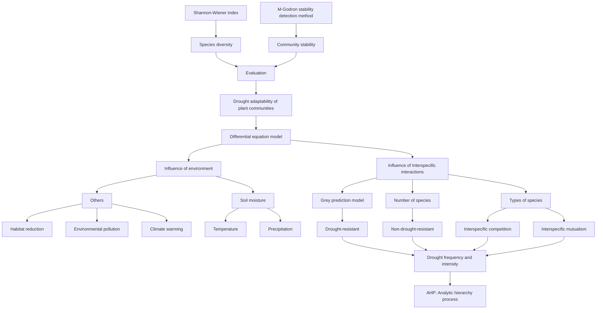
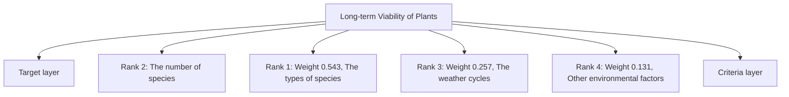

# Dry or Die? Drought-Stricken Plant Communities Can Survive!

Summary

Under climate change, there will probably be an increase in inter-annual variability in precipitation regimes and more intense and frequent extreme weather and climate events, including multi-year droughts. Therefore, it’s necessary to focus on the drought adaptability of plant community. Our team build the following mathematical model to explore the responsive mechanism of plant community to drought in this paper.

Firstly, to consider the influence of plants’ interspecific interactions, we have improved on the classical model Lotka-Volterra Model by adjusting the equation between two species to multispecies differential equations based on Logistic Equation. We use Spearman Correlation Analysis to get the coefficients to measure the interaction between different species. When the distribution of two species is positively correlated, we believe that the two species are mutually beneficial to a certain extent.

Then, we consider the impact of environmental factors. Collecting the weather data for the past 15 years, we fit the linear relationship between precipitation, temperature, and soil moisture. We also define a environmental impact factor Q, adding it to the basic differential equations. Then We use the computer to set up temperature and precipitation and control changing period to simulate irregular weather cycles. The stochastic simulation is based on real data and can be adjusted artificially. By this model we predict the change trend of plant communities over time.

Next, by measuring the Shannno-Wiener index and ICV (the reciprocal of variation coefficient of species’ biomass), we get specific quantitative indicators for the drought adaptability of plant community. We calculate the change rates of the two indexes of plant communities after a period of time under different situations. Measuring each community with different species from 2 to 7, We find that the minimal number of plant species is 5 if the community want to benefit from this biodiversity. The more species, the better drought adaptability of community.

Furthermore, we further analyze potential impact of more complex environment to make our model more complete and comprehensive. We take the habitat reduction, environmental pollution, and climate warming into consideration. For each factor, we draw the biomass of species changing curve over time to intuitively show the influence of this factor.

Finally, we use Analytic hierarchy process (AHP) Model to assess the importance of each factor. We obtain four weight indicators as 0.257, 0.543, 0.131, and 0.069 for the number of species, the types of species, the weather cycles, and other environmental factors. These indicators help us to better analyze the ways to ensure the long-term viability of a plant community. The larger the indicators, the more it takes precedence over other factors that we need to pay more attention to it.

Keywords: Community stability Biodiversity Drought Differential equation AHP Model

## Contents

## 1 Introduction 2

1.1 Problem Background . 2  
1.2 Restatement of the Problem . . 2  
1.3 Our Approach . . 2

## 2 Assumptions and Justification 3

## 3 Notations 4

## 4 Plant Community Change Model 5

4.1 Environmental Impact Factor . . . 5  
4.2 Relation Between Plant Species Model Based on Lotka-Volterra Model and Spearman Correlation Analysis 6  
4.3 Results . . 8

## 5 Community Benefit Model Based on Shannon-Wiener Index and ICV 10

5.1 Species Diversity Evaluation Model 10  
5.2 Community Stability Evaluation Model 10  
5.3 Results . . 11

5.3.1 Results of Species Number Effect 11  
5.3.2 Results of Species Composition Effect . . 12

## 6 Potential Impact of Complex Environment 14

6.1 Frequency and Variation of Drought 14

6.1.1 Frequency . . 14  
6.1.2 Wider Variation . . 15

6.2 Adverse Factors . 16  
6.3 Result Analysis 1 8

## 7 The Ways to Ensure the Long-term Viability of a Plant Community Based on AHP 19

7.1 AHP Model 19  
7.2 Suggestions for Long-term Viability of Plants . . 19  
7.3 the Impacts on the Larger Environment . . . 20

## 8 Sensitivity Analysis 21

## 9 Model Evaluation and Further Discussion 22

9.1 Strength 22  
9.2 Weakness 22  
9.3 Further Discussion 22

## 10 Appendices 24

## 1 Introduction

## 1.1 Problem Background

In recent years, with global warming under climate change, extreme drought events have been increasing in frequency and intensity, which have a great impact on the structure and function of ecosystems. Precipitation has been identified as a primary factor limiting ecosystem processes. [1] Thus, there is an urgent need to investigate species interaction effects on resilience in more depth to adapt plants to increasing drought stress [2].

Different plants respond to drought in different ways and have different adaptations to dry environments. For plant communities, there is a close relationship between their ability to adapt to drought cycles and the number of species. Drought may also alter community structure as it represents a kind of stress to plants which negatively affects population density and enhances the probability of extinction of less abundant species. [3] Communities with a variety of plants are more resilient to drought than those with just one. This is very similar to the biological stability of resistance.

Resistant stability refers to the ability of an ecosystem to resist external disturbances and keep its structure and function intact. Generally speaking, the more complex the ecosystem, the higher the resistance stability. The study on the resistance stability of plant communities provides a new perspective to explain this phenomenon.

## 1.2 Restatement of the Problem

Considering the background information and restricted conditions identified the problem statement,we need to solve the following problems:

1) Firstly we are required to establish a model to predict how plant communities will change over time during irregular weather cycles. Competition and mutualism among species must be considered.  
2) Then we need to calculate the minimum number of species needed for plant communities to benefit from localized biodiversity and predict the consequences of increased species numbers and changes in species composition.  
3) Based on the previous model, we need to extend it to more complex environments. For example: changes in drought frequency, environmental pollution, and habitat reduction.  
4) Finally,we need to propose ways to ensure the long-term viability of plant communities.

## 1.3 Our Approach

In order to analysis the drought adaptability of plant communities, we will proceed as Figure 1.

• Define Environmental Impact Factor and Interspecific Interaction Impact Factor. We define arid environments and take into account interactions between species.  
• Design the Plant Community Change Model. We design the plant community change and modify our model parameters to simulate larger environment.

• Evaluate Plant Community Benefit.By combining Shannon-Weiner Index and M.Godron stability determination method, we can quantify the drought adaptability of plant community.  
• Provide methods to ensure the long-term survival of plant community.Based on previous model, We identify the effects of different factors on plant communities and offer ways to ensure the long-term viability of a plant community.


<details>
<summary>flowchart</summary>


</details>

Figure 1: Our approach

## 2 Assumptions and Justification

In order to simplify the problem and make it convenient for us to simulate the real conditions, we make the following assumptions, and each of them is properly justified.

• All the data we have collected are accurate.We collected climate data, soil moisture data, vegetation amount data from various sources. And data measuring equipment inevitably has some measurement errors. So in our model, we assume that all the data we collect are accurate.  
• With the exception of drought, plants is not affected by other weather extremes. The probability of extreme weather events is usually less than 5 or 10 percent. However, with the global warming, the occurrence frequency of extreme weather and climate events has changed, showing an increasing trend. The model considers only the possible extreme drought and does not consider other extreme weather conditions.  
• Ignoring animal factors. Animals are also an important part of the ecosystem. There is a predation relationship between animals and plants, which affects the number of plants. At the

same time, possible pests and diseases will also have an important impact on the number of plants. Since our model mainly focuses on plant community, the influence of animal factors can be ignored.

• Soil pH and soil microorganism are suitable.The pH of the soil will promote or inhibit plant growth depending on whether the plant is adapted or not. The microorganisms in the soil will also promote or inhibit plant growth. To simply our model we assume that they are all suitable.

3 Notations

<table><tr><td>Symbol</td><td>Definition</td><td>Unit</td></tr><tr><td>T</td><td>Temperature</td><td>°C</td></tr><tr><td>R</td><td>Precipitation</td><td>mm</td></tr><tr><td>h</td><td>Soil moisture</td><td>-</td></tr><tr><td>Q</td><td>Environmental impact factor</td><td>-</td></tr><tr><td>n</td><td>Number of species</td><td>-</td></tr><tr><td> $N_1, N_2, \cdots, N_n$ </td><td>Biomass of different species</td><td> $kg/hm^2$ </td></tr><tr><td> $K_1, K_2, \cdots, K_n$ </td><td>Environmental capacity of different species</td><td> $kg/hm^2$ </td></tr><tr><td> $r_1, r_2, \cdots, r_n$ </td><td>The population growth rate of different species</td><td> $day^{-1}$ </td></tr><tr><td> $a_{ij}$ </td><td>Influence factors of species i on species j</td><td>-</td></tr><tr><td>H</td><td>Shannon-Wiener Index</td><td>-</td></tr><tr><td> $P_i$ </td><td>Relative frequency of species i</td><td>-</td></tr><tr><td> $N_i$ </td><td>Individual number of species i</td><td>-</td></tr><tr><td>ICV</td><td>Inverse of coefficient of variation</td><td>-</td></tr><tr><td>τ</td><td>Average biomass of each species</td><td> $kg/hm^2$ </td></tr><tr><td>σ</td><td>Standard deviation of biomass of each species</td><td>-</td></tr><tr><td>ΔICV</td><td>Growth rate of ICV</td><td>-</td></tr><tr><td>CR</td><td>Consistency Ratio</td><td>-</td></tr><tr><td>CI</td><td>Consistency Index</td><td>-</td></tr><tr><td>RI</td><td>Random Index</td><td>-</td></tr><tr><td> $λ_{max}$ </td><td>Maximun eigenvalue of the judgement matrix</td><td>-</td></tr><tr><td>k</td><td>Indicator to measure the concentration of  $SO_2$ </td><td>-</td></tr><tr><td>c</td><td>Current  $SO_2$ concentration</td><td>ppm</td></tr><tr><td> $c_0$ </td><td>Standard value of  $SO_2$ concentration</td><td>ppm</td></tr><tr><td>D</td><td>Habitat reduction ratio</td><td>-</td></tr></table>

where we define the main parameters while specific value of those parameters will be given later.

## 4 Plant Community Change Model

## 4.1 Environmental Impact Factor

This model only considers arid environment when determining environmental impact factors.

Drought refers to the agricultural meteorological disaster caused by the lack of soil moisture and the destruction of crop water balance. It can be divided into soil drought, atmospheric drought and physiological drought three types.

Soil drought is caused by a lack of water in the soil, and plant roots cannot absorb enough water to compensate for the damage caused by transpiration.

Atmospheric drought is the dry water in the air, often accompanied by a certain amount of wind, although the soil is not short of water, but due to the strong transpiration, so that the plant water shortage and the formation of harm.

Physiological drought is the damage caused by the imbalance of water balance of plants caused by the obstacle of physiological process of crops caused by poor soil environment conditions. Such undesirable conditions include soil temperature is too high, too low, soil ventilation is poor, soil solution concentration is too high, and the accumulation of some toxic chemicals in the soil.

Many factors can affect the degree of drought, among which temperature (T ) and precipitation (R) are the two main factors. And temperature and precipitation can directly affect soil moisture. Therefore, we can normalize the data. Soil moisture was used to reflect the influence of temperature and precipitation on the degree of drought.

We define soil moisture h as Equation (1).

$$
h = \mu T + \theta R \tag {1}
$$

where $\mu$ and $\theta$ are parameters. Parameters need to be determined based on specific climate data.

Because we are required to consider the relationship of drought adaptability with respect to the number of species in a plant community, the climate data needs to have a continuous drought cycle. Meanwhile, it should not stay dry for a long time, such as tropical desert climate.Finally, we choose the temperate continental climate, characterized by cold winters and hot summers with concentrated precipitation. In the temperate continental climate of the region, we choose Xinjiang, China, becauce it is rich in forest and grassland plants, as well as meadows, swamps and aquatic plants.

By collecting data from National Tibetan Plateau Scientific Data Center [4], we can quantify the relationship between soil moisture, temperature and precipitation. The calculation results show that $\mu = 4 . 7 \times 1 0 ^ { - 4 }$ and $\theta = 4 . 8 \times 1 0 ^ { - 3 }$ .

We define the arid environment when soil moisture is below $h _ { 0 } = 1 2 \%$ .

Then we consider the effect of soil moisture on plant growth. According to plant physiology, when the soil moisture is too high, it is easy to cause plant root rot. When soil moisture is too low, plant roots cannot absorb enough water, and plant growth is inhibited. Plants grow fastest when the humidity is suitable. Therefore, when only consider about drought, environmental impact factor (Q) is quadratic functions of soil moisture [5].

$$
Q = m h ^ {2} + n h + c \tag {2}
$$

where $m , n ,$ and c are parameters.

According to the plants’ demand for soil moisture, we take $Q = 1$ when $h = 1 2 \% , Q = 0$ when $h = 5 \% \mathbf { o r } h = 1 9 \%$ . It means when the soil moisture is 12%, it’s the optimum humidity for plants, so Q can reach can reach the maximum value of 1. When the soil moisture is under 5%, it’s too dry for the plants to survival and grow. So the value of Q is negative, which means that the growth rate of the species is negative and the biomass will decline. When the soil moisture is above 19%, it’s too wet. The calculation results show that $\begin{array} { r } { m = - \frac { 1 0 0 0 0 } { 4 9 } , n = \frac { 2 4 0 0 } { 4 9 } } \end{array}$ 0 , n = and $c = - { \frac { 9 5 } { 4 9 } }$ shown in Figure 2.


<details>
<summary>line chart</summary>

| x / soil moisture | y / Q |
| ----------------- | ----- |
| 0                 | 0     |
| 5%                | 1     |
| 12%               | 1     |
| 19%               | 1     |
</details>

Figure 2: Quadratic Function Image of Q

Combined with the data we collect, we take 10 days as a weather change cycle and simulate various irregular cycles with the computer.

## 4.2 Relation Between Plant Species Model Based on Lotka-Volterra Model and Spearman Correlation Analysis

The interaction between species is the basis for the formation of biomes. According to the relationship between species, interactions can be classified as positive and negative interactions. Positive interactions include favoritism, primitive cooperation and mutualism, while negative interactions include competition, predation and parasitism. For the plant community in this model, we mainly consider mutualism and competition.

Lotka-Volterra model is a very classical model of interspecific competition based on Logistic model. We extend this model and establish a model of multi-species competition and mutualism relationship.

Assume that there are n species in this plant community. We define that N is biomass of a species, K is environmental capacity of a species, r is the population growth rate of a species.According to Logistic model, we have Equation (3).

$$
\frac {\mathrm{d} N}{\mathrm{d} t} = r \cdot N \cdot (1 - \frac {N}{K}) \cdot Q \tag {3}
$$

where $\textstyle { \frac { N } { K } }$ can be understood as the space already used and $\textstyle { \left( { 1 - { \frac { N } { K } } } \right) }$ can be understood as unused space.

When multiple species compete or use the same space, the following equation can be listed

$$
\frac {\mathrm{d} N _ {1}}{\mathrm{d} t} = r _ {1} \cdot N _ {1} \cdot \left(1 - \frac {N _ {1}}{K _ {1}} - a _ {2 1} \frac {N _ {2}}{K _ {2}} - a _ {3 1} \frac {N _ {3}}{K _ {3}} - \dots - a _ {n 1} \frac {N _ {n}}{K _ {1}}\right) \cdot Q
$$

$$
\frac {\mathrm{d} N _ {2}}{\mathrm{d} t} = r _ {2} \cdot N _ {2} \cdot (1 - \frac {N _ {2}}{K _ {2}} - a _ {1 2} \frac {N _ {1}}{K _ {1}} - a _ {3 2} \frac {N _ {3}}{K _ {3}} - \dots - a _ {n 1} \frac {N _ {n}}{K _ {2}}) \cdot Q
$$

$$
\frac {\mathrm{d} N _ {n}}{\mathrm{d} t} = r _ {n} \cdot N _ {n} \cdot (1 - \frac {N _ {n}}{K _ {n}} - a _ {1 n} \frac {N _ {1}}{K _ {1}} - a _ {2 n} \frac {N _ {2}}{K _ {2}} - \dots - a _ {n - 1 n} \frac {N _ {n - 1}}{K _ {n}}) \cdot Q
$$

Table 1: Initial Biomass of Plants

<table><tr><td>Number</td><td>Species</td><td>Initial Biomass (kg/hm2)</td></tr><tr><td>Species 1</td><td>Populus euphratica</td><td>154.57</td></tr><tr><td>Species 2</td><td>Haloxylon ammodendron</td><td>9.47</td></tr><tr><td>Species 3</td><td>Poacynum hendersonii</td><td>2.45</td></tr><tr><td>Species 4</td><td>Nitraria tangutorum</td><td>54.31</td></tr><tr><td>Species 5</td><td>Halimodendron halodendron</td><td>3.92</td></tr><tr><td>Species 6</td><td>Kalidium foliatum</td><td>95.38</td></tr><tr><td>Species 7</td><td>Tamarix chinensis</td><td>38.41</td></tr><tr><td>Species 8</td><td>Reaumuria songonica</td><td>83.90</td></tr><tr><td>Species 9</td><td>Alhagi sparsifolia</td><td>1.88</td></tr><tr><td>Species 10</td><td>Seriphidium kaschgaricum</td><td>9.08</td></tr></table>

where $a _ { i j }$ is the influence factors of species i on species j. When the relationship between plant species is competition, $a _ { i j } > 0$ . When the relationship between plant species is mutualism, $a _ { i j } < 0$ .

In this model, we select 10 representative plants in Xinjiang. They vary in height and include herbs, shrubs and arbors. The Latin names of the 10 plants and their initial biomass are shown in Table 1 and some of their basic information [6–10] are shown in Figure 3.


<details>
<summary>tree map</summary>

| Nitraria tangutorum (4) | Height: 2m, Growth rate (day⁻¹):0.012, Environmental capacity (kg·hm⁻²): 382 |
| --- | --- |
| Nitraria tangutorum (4) | Height: 2m, Growth rate (day⁻¹):0.012, Environmental capacity (kg·hm⁻²): 382 |
| Nitraria tangutorum (4) | Growth rate (day⁻¹):0.012, Environmental capacity (kg·hm⁻²): 382 |
| Nitraria tangutorum (4) | Growth rate (day⁻¹):0.012, Environmental capacity (kg·hm⁻²): 382 |
| Nitraria tangutorum (4) | Growth rate (day⁻¹):0.012, Environmental capacity (kg·hm⁻²): 0.012 |
| Nitraria tangutorum (4) | Growth rate (day⁻¹):0.012, Environmental capacity (kg·hm⁻²): 0.012 |
| Nitraria tangutorum (4) | Growth rate (day⁻¹):0.012, Environmental capacity (kg·hm⁻²): 0.012 |
| Nitraria tangutorum (4) | Growth rate (day⁻¹) : 0.012, Environmental capacity (kg·hm⁻²): 382 |
| Nitraria tangutorum (4) | Growth rate (day⁻¹) : 0.012, Environmental capacity (kg·hm⁻²): 382 |
| Nitraria tangutorum (4) | Growth rate (day⁻¹) : 0.012, Environmental capacity (kg·hm⁻²): 382 |
| Nitraria tangutorum (4) | Growth rate (day⁻¹): 0.012, Environmental capacity (kg·hm⁻²): 382 |
| Nitraria tangutorum (4) | Growth rate (day⁻¹): 0.012, Environmental capacity (kg·hm⁻²): 382 |
| Nitraria tangutorum (4) | Growth rate (day⁻¹): 0.012, Environmental capacity (kg·hm⁻²): 382 |
</details>

Figure 3: Basic Information of 8 Species

When determining the value of influence factor $a _ { i j }$ , we consider using spearman correlation analysis. Spearman correlation analysis requires two conditions:

1) Variables contain rank variables, or variables do not follow normal distribution or distribution type is unknown.  
2) There is a monotonous relationship between the two variables.

We search the composition of major species and their important values in typical community plots [11]. According to biological knowledge, when the interspecific relationship is competition, the number of species is negatively correlated. When the interspecific relationship is mutualistic, the number of species is positively correlated. The data can satisfy both of the above conditions.

After calculation, we can get the correlation thermal map in Figure 4.


<details>
<summary>heatmap</summary>

| Species | Species 1 | Species 2 | Species 3 | Species 4 | Species 5 | Species 6 | Species 7 | Species 8 | Species 9 | Species 10 |
| :--- | :--- | :--- | :--- | :--- | :--- | :--- | :--- | :--- | :--- | :--- |
| Species 10 | 0.332 | 0.100 | -0.400 | -0.252 | -0.117 | -0.128 | -0.165 | -0.225 | -0.269 | 1.000 |
| Species 9 | -0.413 | -0.085 | 0.002 | 0.038 | -0.396 | 0.141 | -0.286 | 0.197 | 1.000 | -0.269 |
| Species 8 | -0.511 | 0.158 | 0.025 | 0.202 | -0.121 | 0.066 | 0.256 | 1.000 | 0.197 | -0.225 |
| Species 7 | -0.166 | -0.170 | 0.028 | 0.211 | 0.033 | 0.187 | 1.000 | 0.256 | -0.286 | -0.165 |
| Species 6 | -0.629 | 0.023 | 0.155 | 0.130 | -0.403 | 1.000 | 0.187 | 0.066 | 0.141 | -0.128 |
| Species 5 | 0.330 | -0.163 | 0.084 | -0.330 | 1.000 | -0.403 | 0.033 | -0.121 | -0.396 | -0.117 |
| Species 4 | -0.093 | 0.165 | -0.073 | 1.000 | -0.330 | 0.130 | 0.211 | 0.202 | 0.038 | -0.252 |
| Species 3 | -0.164 | -0.336 | 1.000 | -0.073 | 0.084 | 0.155 | 0.028 | 0.025 | 0.002 | -0.400 |
| Species 2 | -0.284 | 1.000 | -0.336 | 0.165 | -0.163 | 0.023 | -0.170 | 0.158 | -0.085 | 0.100 |
| Species 1 | 1.000 | -0.284 | -0.164 | -0.093 | 0.330 | -0.629 | -0.166 | -0.511 | -0.413 | 0.332 |
</details>

Figure 4: Correlation Analysis of Thermal Map of 10 Species

## 4.3 Results

In solving differential equations, we use Runge-Kutta Methods. It is an important iterative method for solving nonlinear ordinary differential equations. Its high precision is very suitable for solving this model.

## One Species:

When there is only one species, we choose Species 1 for analysis. Plug the data from Species 1 into Equation (3), we can get the curve in Figure 5.

As can be seen from Figure 5, the biomass of Species 1 as a whole shows a downward trend over time, indicating that a single plant species has a weak ability to adapt to drought.

## Multiple Species:


<details>
<summary>line chart</summary>

| Time/day | Biomass of individual species |
| -------- | ------------------------------ |
| 0        | 150                            |
| 200      | 120                            |
| 400      | 100                            |
| 600      | 80                             |
| 800      | 100                            |
| 1000     | 70                             |
| 1200     | 50                             |
| 1400     | 35                             |
| 1600     | 25                             |
</details>

Figure 5: Biomass-Time Curve of Species 1

When considering multiple species, we choose Species $1 { - } 5 ( n = 5 )$ for analysis. Their interspecific influencing factor matrix is shown below.

$$
\left( \begin{array}{c c c c c} 1 & 0. 2 8 4 & 0. 1 6 4 & 0. 0 9 3 & - 0. 3 3 \\ 0. 2 8 4 & 1 & 0. 3 3 6 & - 0. 1 6 5 & 0. 1 6 3 \\ 0. 1 6 4 & 0. 3 3 6 & 1 & 0. 0 7 3 & - 0. 0 8 4 \\ 0. 0 9 3 & - 0. 1 6 5 & 0. 0 7 3 & 1 & 0. 3 3 \\ - 0. 3 3 & 0. 1 6 3 & - 0. 0 8 4 & 0. 3 3 & 1 \end{array} \right)
$$

By substituting the data into the system of differential equations, we can obtain curves in Figure 6.


<details>
<summary>line chart</summary>

| Time/day | Species 1 | Species 2 | Species 3 | Species 4 | Species 5 |
| -------- | --------- | --------- | --------- | --------- | --------- |
| 0        | 158       | 10        | 5         | 55        | 0         |
| 200      | 168       | 10        | 5         | 60        | 0         |
| 400      | 155       | 10        | 5         | 50        | 0         |
| 600      | 125       | 10        | 5         | 30        | 0         |
| 800      | 90        | 10        | 5         | 20        | 0         |
| 1000     | 135       | 10        | 5         | 40        | 0         |
| 1200     | 145       | 10        | 5         | 50        | 0         |
| 1400     | 135       | 10        | 5         | 60        | 0         |
| 1600     | 168       | 10        | 5         | 60        | 0         |
</details>

Figure 6: Biomass-Time Curve of Species 1-5

The curves show that the biomass of each species fluctuates to a certain extent, but the overal biomass is relatively stable. At about 800 days, the biomass curve of each species peaks and valleys. The reason why this phenomenon occurs is dry weather occurs more frequently during this period in the weather simulation.

By comparing the biomass-time curves of single species and multi-species, we can find that multi-species can better adapt to drought environment.

## 5 Community Benefit Model Based on Shannon-Wiener Index and ICV

## 5.1 Species Diversity Evaluation Model

Shannon-Wiener Index is a biodiversity index that measures the diversity and abundance of species in an ecosystem. The basic principle is that the higher the diversity of species, the higher the entropy, and vice versa. The higher the entropy, the higher the diversity of species, the higher the diversity of the ecosystem.

We extend the Shannon-Wiener Index to plant communities and use it to evaluate the species diversity of plant communities.

Shannon-Wiener Index (H) can be expressed by Equation (4).

$$
H = - \Sigma P _ {i} \cdot \ln (P _ {i}) \tag {4}
$$

where $P _ { i }$ is relative frequency of species i. It can be calculated by Equation (5).

$$
P _ {i} = \frac {N _ {i}}{N} \tag {5}
$$

where $N _ { i }$ is individual number of species i. N is the total individual number of the plant community.

## 5.2 Community Stability Evaluation Model

Stability is the necessary condition and function performance of ecosystem, and also one of the important characteristics that determine whether the structure and function of ecosystem can operate normally.When the external interference exceeds the threshold value that the ecosystem can bear, the structure and function of the ecosystem will be changed accordingly, and the stability of the system will be reduced, thus destroying the ecological balance and causing the degradation of the ecosystem [12]. In general, the greater the number of species, the greater the stability.

In this model, we used community stability to assess the benefit of plant species.

Plant community stability is assessed by calculating the inverse of coefficient of variation (ICV ) as Equation (6).

$$
I C V = \frac {\tau}{\sigma} \tag {6}
$$

where τ represents the average biomass of each species and σ represents standard deviation of biomass of each species.

τ can be calculated by Equantion (7).

$$
\tau = \frac {\Sigma N _ {i}}{n} \tag {7}
$$

σ can be calculated by Equation (8).

$$
\sigma = \sqrt {\Sigma_ {i = 1} ^ {n} (N _ {i} - \tau) ^ {2}} \tag {8}
$$

In particular, plant communities with higher values of ICV possess greater stability compared with those with lower values of ICV [13].

We define the growth rate of ICV as $\Delta I C V$ . When $\Delta I C V > 0 .$ , community stability increases. If $\Delta I C V > 0$ is close to 0, community stability is almost unchanged.

## 5.3 Results

## 5.3.1 Results of Species Number Effect

Take $n = 2 , 3 , 4 , 5 , 6 , 7$ and substitute corresponding data to get biomass-time curve and $\Delta I C V$ . The results are shown in Figure 7 and Figure 8.


<details>
<summary>line chart</summary>

| Time/day | Species 6 | Species 8 |
| -------- | --------- | --------- |
| 0        | 100       | 100       |
| 200      | 30        | 70        |
| 400      | 15        | 60        |
| 600      | 10        | 55        |
| 800      | 5         | 50        |
| 1000     | 2         | 45        |
| 1200     | 1         | 40        |
| 1400     | 0.5       | 35        |
| 1600     | 0.1       | 30        |
</details>

ICV=9.71%


<details>
<summary>line chart</summary>

| Time/day | Species 18 | Species 2 | Species 3 |
| -------- | ---------- | --------- | --------- |
| 0        | 10.0       | 10.0      | 2.5       |
| 200      | 8.5        | 9.0       | 2.0       |
| 400      | 6.0        | 7.5       | 1.0       |
| 600      | 4.0        | 6.0       | 0.5       |
| 800      | 2.0        | 4.5       | 0.2       |
| 1000     | 1.5        | 4.0       | 0.1       |
| 1200     | 1.5        | 4.5       | 0.1       |
| 1400     | 1.5        | 4.5       | 0.1       |
| 1600     | 1.5        | 4.0       | 0.1       |
</details>

ICV=-1.49%


<details>
<summary>line chart</summary>

| Time/day | Species 1 | Species 2 | Species 3 | Species 4 |
| -------- | --------- | --------- | --------- | --------- |
| 0        | 150       | 50        | 5         | 50        |
| 200      | 160       | 60        | 5         | 60        |
| 400      | 140       | 40        | 5         | 40        |
| 600      | 180       | 80        | 5         | 80        |
| 800      | 170       | 60        | 5         | 60        |
| 1000     | 150       | 40        | 5         | 40        |
| 1200     | 140       | 50        | 5         | 50        |
| 1400     | 130       | 40        | 5         | 40        |
| 1600     | 120       | 30        | 5         | 30        |
</details>

ΔICV=1.25%


<details>
<summary>line chart</summary>

| Time/day | Species 1 | Species 2 | Species 3 | Species 4 | Species 5 | Species 6 |
| -------- | --------- | --------- | --------- | --------- | --------- | --------- |
| 0        | 160       | 100       | 60        | 50        | 100       | 10        |
| 200      | 165       | 110       | 65        | 55        | 110       | 10        |
| 400      | 170       | 120       | 70        | 60        | 120       | 10        |
| 600      | 165       | 130       | 75        | 65        | 130       | 10        |
| 800      | 150       | 120       | 60        | 50        | 120       | 10        |
| 1000     | 140       | 110       | 50        | 40        | 110       | 10        |
| 1200     | 130       | 100       | 40        | 30        | 100       | 10        |
| 1400     | 120       | 90        | 30        | 20        | 90        | 10        |
| 1600     | 110       | 80        | 20        | 10        | 80        | 10        |
</details>

ICV=0.03%


<details>
<summary>line chart</summary>

| Time/day | Species 1 | Species 2 | Species 3 | Species 4 | Species 5 |
| -------- | --------- | --------- | --------- | --------- | --------- |
| 0        | 160       | 100       | 90        | 50        | 10        |
| 200      | 155       | 95        | 85        | 45        | 10        |
| 400      | 140       | 85        | 75        | 40        | 10        |
| 600      | 130       | 80        | 70        | 35        | 10        |
| 800      | 120       | 75        | 65        | 30        | 10        |
| 1000     | 160       | 85        | 75        | 40        | 10        |
| 1200     | 155       | 90        | 80        | 45        | 10        |
| 1400     | 150       | 95        | 85        | 50        | 10        |
| 1600     | 145       | 100       | 90        | 55        | 10        |
</details>

∆ICV=0.005%


<details>
<summary>line chart</summary>

| Time/day | Species 1 | Species 2 | Species 3 | Species 4 | Species 5 | Species 6 | Species 8 |
| -------- | --------- | --------- | --------- | --------- | --------- | --------- | --------- |
| 0        | 160       | 90        | 80        | 70        | 50        | 30        | 10        |
| 200      | 140       | 85        | 75        | 65        | 45        | 25        | 10        |
| 400      | 130       | 80        | 70        | 60        | 40        | 20        | 10        |
| 600      | 145       | 85        | 75        | 65        | 45        | 25        | 10        |
| 800      | 150       | 90        | 80        | 70        | 50        | 30        | 10        |
| 1000     | 160       | 95        | 85        | 75        | 55        | 35        | 10        |
| 1200     | 155       | 90        | 80        | 70        | 50        | 30        | 10        |
| 1400     | 140       | 85        | 75        | 65        | 45        | 25        | 10        |
| 1600     | 130       | 80        | 70        | 60        | 40        | 20        | 10        |
</details>

ΔICV=0.0007%  
Figure 7: Biomass-Time Curves and $\Delta I C V$ of Different Species Number


<details>
<summary>line chart</summary>

| The number of species | ICV   | Shannon-Wiener index | Sum of the change rates |
| --------------------- | ----- | -------------------- | ----------------------- |
| 2                     | 9.8   | -0.5                 | 9.0                     |
| 3                     | -1.5  | -0.4                 | -1.8                    |
| 4                     | -1.2  | -0.2                 | -1.5                    |
| 5                     | 0.0   | 0.0                  | 0.0                     |
| 6                     | 0.0   | 0.0                  | 0.03                    |
| 7                     | 0.0   | 0.0                  | 0.02                    |
</details>

Figure 8: Species Number-Change Rate of Different Indexes Curve

As can be seen from Figure 8, when $n = 5 ,$ , change rate of Shannon-Weiner Index and ICV is close to 0. As n increases, change rate of Shannon-Weiner Index and ICV is almost constant. Therefore, we can predict that when $n \geqslant 5 .$ , the stability of the plant community is almost unchanged. The minimum number of species needed for plant communities to benefit from localized biodiversity is 5.

## 5.3.2 Results of Species Composition Effect

From Figure 4, we can see that the competition between Species 1 and Species 6 is strong. As for mutualism, there is no strong mutual benefit, but the mutualism between Species 1 and Species 5, Species 1 and Species 10 is stronger than others. We think that different interspecific relationships will influence the ability of plant communities to adapt to drought.

In addition to differences in the relationships between species, drought tolerance of the species itself also influenced the results. When a plant community has species that are not tolerant to drought, the adaptability of the community to drought also changes.

Therefore, We will discuss four cases: strong competition, weak competition, mutualism, and drought intolerant species exist.

Among the 10 plants, we mainly select 7 plants (Species 1 − 6 and 10) for analysis. In all cases, the plant community consisted of 5 species $( n = 5 )$ .

To assess community stability change, we defined the ICV at initial state as $I C V _ { 1 }$ and at 1600 days as $I C V _ { 2 }$ .

## Strong competition:

The species composition in this case is Species 1-4, and 6.

In the data we collected, the quantity of Species 6 in the quadrat with Species 1 as the main body is very small, and the quantity of Species 1 in the quadrat with Species 6 as the main body is very small. From this, we can infer that the competition between populus euphratica and kalidium foliatum is strong.

5 Species’ interspecific influencing factor matrix is shown below.

$$
\left( \begin{array}{c c c c c} 1 & 0. 2 8 4 & 0. 1 6 4 & 0. 0 9 3 & 0. 6 2 9 \\ 0. 2 8 4 & 1 & 0. 3 3 6 & - 0. 1 6 5 & - 0. 0 2 3 \\ 0. 1 6 4 & 0. 3 3 6 & 1 & 0. 0 7 3 & - 0. 1 5 5 \\ 0. 0 9 3 & - 0. 1 6 5 & 0. 0 7 3 & 1 & 0. 1 3 \\ 0. 6 2 9 & - 0. 0 2 3 & - 0. 1 5 5 & - 0. 1 3 & 1 \end{array} \right)
$$

By substituting the data into the system of differential equations, we can obtain curves in Figure 9.


<details>
<summary>line chart</summary>

| Time/day | Species 1 | Species 2 | Species 3 | Species 4 | Species 6 |
| -------- | --------- | --------- | --------- | --------- | --------- |
| 0        | 130       | 10        | 5         | 40        | 30        |
| 200      | 90        | 10        | 5         | 30        | 20        |
| 400      | 140       | 15        | 5         | 50        | 35        |
| 600      | 170       | 20        | 5         | 70        | 50        |
| 800      | 200       | 25        | 5         | 100       | 70        |
| 1000     | 210       | 30        | 5         | 120       | 90        |
| 1200     | 220       | 35        | 5         | 140       | 110       |
| 1400     | 230       | 40        | 5         | 160       | 130       |
| 1600     | 240       | 45        | 5         | 180       | 150       |
</details>


<details>
<summary>line chart</summary>

| Time/day | Species 1 | Species 2 | Species 3 | Species 4 | Species 5 |
| -------- | --------- | --------- | --------- | --------- | --------- |
| 0        | 160       | 50        | 10        | 60        | 50        |
| 200      | 150       | 50        | 10        | 50        | 40        |
| 400      | 140       | 50        | 10        | 40        | 30        |
| 600      | 130       | 50        | 10        | 30        | 20        |
| 800      | 90        | 50        | 10        | 20        | 15        |
| 1000     | 120       | 50        | 10        | 30        | 25        |
| 1200     | 130       | 50        | 10        | 40        | 35        |
| 1400     | 140       | 50        | 10        | 50        | 45        |
| 1600     | 160       | 50        | 10        | 60        | 55        |
</details>


<details>
<summary>line chart</summary>

| Time/day | Species 1 | Species 2 | Species 3 | Species 4 | Species 5 |
| -------- | --------- | --------- | --------- | --------- | --------- |
| 0        | 150       | 10        | 50        | 10        | 10        |
| 200      | 140       | 10        | 40        | 10        | 10        |
| 400      | 130       | 10        | 50        | 10        | 10        |
| 600      | 140       | 10        | 60        | 10        | 10        |
| 800      | 170       | 10        | 70        | 10        | 10        |
| 1000     | 130       | 10        | 40        | 10        | 10        |
| 1200     | 160       | 10        | 60        | 10        | 10        |
| 1400     | 200       | 10        | 120       | 10        | 10        |
| 1600     | 220       | 10        | 190       | 10        | 10        |
</details>

Figure 9: Biomass-Time Curve of Strong Competition (left), Weak Competition (middle), and Mutualism (right)

The curves show that the biomass of the other four species except Species 1 increase gradually over time,among which Species 6 become the dominant species. The biomass of Species 1 increases before 1200 days. After 1200 days under the influence of Species 6, its biomass tends to stay the same.

As for community stability, $I C V _ { 1 } ~ = ~ 0 . 6 3 1 6 , ~ I C V _ { 2 } ~ = ~ 0 . 6 3 1 6 .$ The ICV growth rate is 0.013%.This indicates that community stability is almost unchanged when there is strong competition between species.

## Weak Competition:

The species composition in this case is Species 1-5. Among the five species, there is competition, but there are no two species that cannot coexist.

The results is shown in Figure 9.

As for community stability, $I C V _ { 1 } = 0 . 6 3 4 8 , I C V _ { 2 } = 0 . 6 3 8 4$ . The ICV growth rate is 0.57%. This indicates that when there is weak competition between species, community stability increases, but the increase is small.

## Mutualism:

The species composition in this case is Species 1-3, 5, and 10. Among these five species, more obvious mutually beneficial relationship exist between Species 1 and Species 5, Species 1 and Species 10.

5 Species’ interspecific influencing factor matrix is shown below.

$$
\left( \begin{array}{c c c c c} 1 & 0. 2 8 4 & 0. 1 6 4 & - 0. 3 3 & - 0. 3 3 2 \\ 0. 2 8 4 & 1 & 0. 3 3 6 & 0. 1 6 3 & 0. 1 \\ 0. 1 6 4 & 0. 3 3 6 & 1 & - 0. 0 8 4 & 0. 4 \\ - 0. 3 3 & 0. 1 6 3 & - 0. 0 8 4 & 1 & 0. 1 1 7 \\ - 0. 3 3 2 & - 0. 1 & 0. 4 & 0. 1 1 7 & 1 \end{array} \right)
$$

By substituting the data into the system of differential equations, we can obtain curves in Figure 9.

The curves show that the biomass of each species show an overall increasing trend. The initial biomass of Species 10 and Species 2 is close. and species 10, Under the mutually beneficial of Species 1, biomass of Species 10 surpasses that of species 2 after about 1200 days.

As for community stability, $I C V _ { 1 } = 0 . 6 4 1 5 , I C V _ { 2 } = 0 . 7 9 3 6$ . The ICV growth rate is 23.72%. This indicates that community stability can be improved greatly when there is a strong mutually beneficial relationship between species.

## Drought-Intolerant Species Exist:

We also use Species 1-5 for analysis.In this case, we assume that Species 1 and 3 are droughtintolerant.

In the previous article, we defined the optimum growth humidity for plants as 12%. For droughtintolerant plants, we define the optimal growth humidity as 15%. That is, in defining a droughtintolerant species, we simply change m, n, and c values in Equation (2).

When solving differential equations, Q is calculated using Equation (2) for Species 2, 4, and 5. For Species 1 and $3 , Q ^ { \prime }$ is calculated using Equation (9).

$$
Q ^ {\prime} = m ^ {\prime} h ^ {2} + n ^ {\prime} h + c ^ {\prime} \tag {9}
$$

We take $Q ^ { \prime } = 1$ when $h = 1 5 \% , Q ^ { \prime } = 0$ when $h = 8 \% \mathbf { o r } h = 2 2 \%$ . The calculation results show that $\begin{array} { r } { m ^ { \prime } = - { \frac { 1 0 0 0 0 } { 4 9 } } , n ^ { \prime } = { \frac { 3 0 0 0 } { 4 9 } } } \end{array}$ 0 , and c′ = − $\begin{array} { r } { c ^ { \prime } = - { \frac { 1 7 6 } { 4 9 } } } \end{array}$ .

We obtain the curves in Figure 10.

The curves show that the biomass of Species 3 decrease to 0 at about 400 days and that of Species 1 decrease to 0 at about 800 days. The biomass of species 2, 4, and 5 increase steadily. This indicates that drought-intolerant species that are not tolerant to drought will die quickly in arid environment, and the stability of plant community is low.

## Result Analysis:

According to the results of the above classification discussion, when the species type is mutually beneficial species, the stability of the plant community can be greatly improved. When the species type is competitive, the plant community can remain basically stable. When drought-intolerant species exist, the plant community can not maintain stable.

## 6 Potential Impact of Complex Environment

## 6.1 Frequency and Variation of Drought

## 6.1.1 Frequency

The frequency of droughts may change. Under the influence of human activities, drought frequency may increase further in the future. To assess the effects of changing drought frequency on drought adaptability of plant communities,we modify the parameters of the simulated weather conditions to make droughts occur more frequently or less frequently.


<details>
<summary>line chart</summary>

| Time/day | Species 1 | Species 2 | Species 3 | Species 4 | Species 5 |
| -------- | --------- | --------- | --------- | --------- | --------- |
| 0        | 160       | 10        | 5         | 50        | 5         |
| 200      | 170       | 10        | 5         | 60        | 5         |
| 400      | 150       | 10        | 5         | 50        | 5         |
| 600      | 130       | 10        | 5         | 40        | 5         |
| 800      | 90        | 10        | 5         | 20        | 5         |
| 1000     | 130       | 10        | 5         | 40        | 5         |
| 1200     | 140       | 10        | 5         | 50        | 5         |
| 1400     | 130       | 10        | 5         | 60        | 5         |
| 1600     | 170       | 10        | 5         | 60        | 5         |
</details>


<details>
<summary>line chart</summary>

| Time/day | Species 1 | Species 2 | Species 3 | Species 4 | Species 5 |
| -------- | --------- | --------- | --------- | --------- | --------- |
| 0        | 155       | 10        | 55        | 5         | 5         |
| 200      | 100       | 10        | 10        | 5         | 5         |
| 400      | 20        | 10        | 5         | 5         | 5         |
| 600      | 5         | 10        | 5         | 5         | 5         |
| 800      | 5         | 15        | 15        | 10        | 10        |
| 1000     | 5         | 15        | 15        | 10        | 10        |
| 1200     | 5         | 15        | 15        | 10        | 10        |
| 1400     | 5         | 15        | 20        | 10        | 10        |
| 1600     | 5         | 15        | 20        | 10        | 10        |
</details>

Figure 10: Biomass-Time Curve of All Drought-Tolerant Species (left) and Partially Drought-Intolerant Species (right)

When there is a greater frequency of occurrence of droughts in weather cycle, the curves in Figure 11 are obtained by substituting the relevant data into the differential equation.

The curves show that when the drought frequency increased, the biomass of all species decreased with time. This suggests that the effect of localized biodiversity on drought adaptability of plant community is limited.

We can speculate that plant community will growing well when droughts are less frequent. However, at the same time, individual plants are less affected by drought. Therefore, when drought frequency is lower, the effect of localized diversity on drought adaptability of plant communities is lower than when drought frequency is higher.

## 6.1.2 Wider Variation

We define the wider variation of the occurrence of droughts as droughts occur more widely and last longer.

For droughts to occur on a larger scale, it means that drought can extend to areas that should be wet. And the plants that grow in these areas are mostly species that don’t tolerate drought. From the above analysis, drought can be fatal to drought-intolerant plants. It will seriously destabilize the local ecosystem.

For droughts to last longer, we can simulate this by changing the length of weather change cycle. We take 30 days as a weather change cycle. Compared with previous 10 days circle, 30 days circle obviously improve the duration of weather conditions. When the computer-simulated weather conditions are drought, a prolonged drought has a greater impact on plant community.

Changing the weather cycle, we can get the curves in Figure 12.

The curves show that when droughts last longer, in a single time period, the biomass decrease more if the simulation condition is drought. As degradation continues to accumulate, the biomass becomes less and less.


<details>
<summary>line chart</summary>

| Time/day | Species 1 | Species 6 | Species 4 | Species 8 | Species 2 |
| -------- | --------- | --------- | --------- | --------- | --------- |
| 0        | 160       | 100       | 50        | 80        | 10        |
| 200      | 160       | 105       | 55        | 85        | 10        |
| 400      | 120       | 50        | 35        | 70        | 10        |
| 600      | 120       | 50        | 35        | 70        | 10        |
| 800      | 125       | 55        | 35        | 70        | 10        |
| 1000     | 100       | 30        | 20        | 60        | 10        |
| 1200     | 70        | 15        | 15        | 55        | 10        |
| 1400     | 85        | 20        | 15        | 55        | 10        |
| 1600     | 60        | 15        | 10        | 45        | 10        |
</details>

Figure 11: Biomass-Time Curve of Greater Frequency in Weather Cycle

## 6.2 Adverse Factors

There are many other adverse factors affecting plant communities. Three adverse factors are mainly considered: air pollution, climate warming and habitat reduction.

## Air Pollution:

Under the influence of human activities, some pollutants are discharged into the atmosphere and gradually accumulate. Air pollution seriously damages the ecosystem. Common air pollutants include dust, smoke, fog and other small particulate pollutants, as well as gaseous pollutants such as $S O _ { 2 }$ and $C O _ { 2 }$ .

In this model, we mainly consider the effects of $S O _ { 2 }$ on plant communities.

$S O _ { 2 }$ has bleaching effect on chlorophyll, which degrades chlorophyll molecules into demagmochrome without photosynthetic activity, resulting in inhibition of photosynthesis and growth and development. The results shows that the chlorophyll content of plants is negatively correlated with the concentration of $S O _ { 2 }$ in the atmosphere, and the correlation could be fitted as linear [14]. We inferred that the atmospheric $S O _ { 2 }$ content would lead to a decrease in plant biomass.

We define the number of indicator to measure the concentration of $S O _ { 2 }$ as k. k can be represented by Equation (10).

$$
k = \frac {c - c _ {0}}{c} \tag {10}
$$

where c is current $S O _ { 2 }$ concentration and $c _ { 0 }$ is standard value of $S O _ { 2 }$ concentration.

## Climate Warming:

In the past century, human beings have been using fossil fuels (such as coal, oil, etc.) in large quantities, which has emitted a lot of $C O _ { 2 }$ and other greenhouse gases. With the continuous accumulation of greenhouse effect, there is an imbalance between the energy absorbed and emitted by the earth-atmosphere system. As a result, energy accumulates continuously in the earth-atmosphere system, leading to rising temperature and global warming.


<details>
<summary>line chart</summary>

| Time/day | Species 1 | Species 6 | Species 4 | Species 8 | Species 2 |
| -------- | --------- | --------- | --------- | --------- | --------- |
| 0        | 155       | 85        | 50        | 75        | 10        |
| 200      | 145       | 80        | 45        | 70        | 10        |
| 400      | 120       | 50        | 30        | 65        | 10        |
| 600      | 80        | 20        | 15        | 50        | 5         |
| 800      | 60        | 10        | 10        | 40        | 5         |
| 1000     | 55        | 5         | 5         | 35        | 5         |
| 1200     | 45        | 5         | 5         | 30        | 5         |
| 1400     | 30        | 5         | 5         | 25        | 5         |
| 1600     | 20        | 5         | 5         | 25        | 5         |
</details>

Figure 12: Biomass-Time Curve of Droughts Last Longer

Warming affects plant growth by affecting the rate of photosynthesis and respiration. In general, rising temperatures decrease the rate of photosynthesis and increase the rate of respiration. With the further increase of temperature, the rate of respiration decreases.

We assume that warming inhibits plant growth. The annual temperature rise rate can be expressed as $\textstyle { \frac { \mathrm { d } T } { \mathrm { d } t } }$ .

## Habitat Reduction:

With the expansion of cities and the development of industry, large areas of land have been developed and used, making the creatures lose their habitats. At the same time, deforestation, blind clearing, blind grazing of grasslands, irrational development of marshes and construction of water conservancy projects have further reduced the habitat.

Habitat reduction inevitably leads to plant reduction. We define habitat reduction ratio as D.

By combining the above three factors, Equation (3) can be rewritten as Equation (11).

$$
\frac {\mathrm{d} N _ {j}}{\mathrm{d} t} = r _ {j} \cdot N _ {j} \cdot (1 - D - \frac {\mathrm{d} T}{\mathrm{d} t} - \Sigma a _ {i j} \frac {N _ {i}}{K _ {j}}) \cdot Q \cdot (1 - k) \tag {11}
$$

$\begin{array} { r } { \frac { \mathrm { d } T } { \mathrm { d } t } = 0 . 0 2 5 } \end{array}$ $D = 0 . 0 8$

In these three factors, we fix two factors unchanged, and change one factor. The changing factors are respectively 1, 2, and 3 times of the standard values.

When k changes, we can get the corresponding biomass-time curve in Figure 13.

The curses show that under the influence of $S O _ { 2 }$ , the biomass of all species decrease with the increase of time. When k gradually increases, the biomass decline rate gradually increases, and even species extinction occurs.

When $\textstyle { \frac { \mathrm { d } T } { \mathrm { d } t } }$


<details>
<summary>line chart</summary>

| Time/day | Species 1 | Species 6 | Species 4 | Species 8 | Species 2 |
| -------- | --------- | --------- | --------- | --------- | --------- |
| 0        | 150       | 150       | 100       | 100       | 50        |
| 200      | 200       | 200       | 120       | 120       | 60        |
| 400      | 250       | 250       | 130       | 130       | 70        |
| 600      | 280       | 280       | 140       | 140       | 80        |
| 800      | 350       | 350       | 150       | 150       | 90        |
| 1000     | 250       | 250       | 120       | 120       | 70        |
| 1200     | 150       | 150       | 100       | 100       | 60        |
| 1400     | 180       | 180       | 90        | 90        | 70        |
| 1600     | 170       | 170       | 80        | 80        | 60        |
</details>


<details>
<summary>line chart</summary>

| Time/day | Species 1 | Species 6 | Species 4 | Species 8 | Species 2 |
| -------- | --------- | --------- | --------- | --------- | --------- |
| 0        | 150       | 80        | 70        | 60        | 5         |
| 200      | 130       | 75        | 65        | 55        | 5         |
| 400      | 120       | 70        | 60        | 50        | 5         |
| 600      | 135       | 75        | 65        | 55        | 5         |
| 800      | 110       | 65        | 55        | 45        | 5         |
| 1000     | 90        | 60        | 50        | 40        | 5         |
| 1200     | 70        | 55        | 45        | 35        | 5         |
| 1400     | 50        | 45        | 40        | 30        | 5         |
| 1600     | 30        | 35        | 35        | 25        | 5         |
</details>


<details>
<summary>line chart</summary>

| Time/day | Species 1 | Species 2 | Species 3 | Species 4 | Species 5 |
| -------- | --------- | --------- | --------- | --------- | --------- |
| 0        | 170       | 80        | 60        | 80        | 60        |
| 200      | 160       | 70        | 50        | 70        | 50        |
| 400      | 140       | 60        | 40        | 60        | 40        |
| 600      | 120       | 50        | 30        | 50        | 30        |
| 800      | 100       | 40        | 20        | 40        | 20        |
| 1000     | 80        | 30        | 15        | 30        | 15        |
| 1200     | 60        | 25        | 10        | 25        | 10        |
| 1400     | 40        | 20        | 5         | 20        | 5         |
| 1600     | 20        | 15        | 5         | 15        | 5         |
</details>

Figure 13: Biomass-Time Curve of Changing k  


<details>
<summary>line chart</summary>

| Time/day | Species 1 | Species 6 | Species 4 | Species 8 | Species 2 |
| -------- | --------- | --------- | --------- | --------- | --------- |
| 0        | 100       | 100       | 80        | 60        | 10        |
| 200      | 190       | 150       | 90        | 70        | 15        |
| 400      | 120       | 80        | 60        | 50        | 10        |
| 600      | 80        | 60        | 40        | 30        | 5         |
| 800      | 70        | 50        | 30        | 20        | 5         |
| 1000     | 60        | 40        | 20        | 15        | 5         |
| 1200     | 50        | 30        | 15        | 10        | 5         |
| 1400     | 40        | 20        | 10        | 5         | 5         |
| 1600     | 30        | 10        | 5         | 5         | 5         |
</details>


<details>
<summary>line chart</summary>

| Time/day | Species 1 | Species 6 | Species 4 | Species 8 | Species 2 |
| -------- | --------- | --------- | --------- | --------- | --------- |
| 0        | 160       | 80        | 60        | 50        | 10        |
| 200      | 120       | 70        | 50        | 40        | 10        |
| 400      | 140       | 60        | 40        | 30        | 10        |
| 600      | 100       | 50        | 30        | 20        | 10        |
| 800      | 90        | 40        | 20        | 15        | 10        |
| 1000     | 80        | 30        | 15        | 10        | 10        |
| 1200     | 70        | 25        | 10        | 5         | 10        |
| 1400     | 60        | 20        | 5         | 5         | 10        |
| 1600     | 50        | 15        | 5         | 5         | 10        |
</details>


<details>
<summary>line chart</summary>

| Time/day | Species 1 | Species 2 | Species 4 | Species 6 |
| -------- | --------- | --------- | --------- | --------- |
| 0        | 180       | 80        | 60        | 50        |
| 200      | 160       | 70        | 50        | 40        |
| 400      | 140       | 60        | 40        | 30        |
| 600      | 120       | 50        | 30        | 20        |
| 800      | 100       | 40        | 20        | 10        |
| 1000     | 80        | 30        | 10        | 5         |
| 1200     | 60        | 20        | 5         | 5         |
| 1400     | 40        | 10        | 5         | 5         |
| 1600     | 20        | 5         | 5         | 5         |
</details>

Figure 14: Biomass-Time Curve of Changing $\textstyle { \frac { \mathrm { d } T } { \mathrm { d } t } }$

The effect of temperature rise on biomass is very similar to that of $S O _ { 2 }$ . The biomass of all species decrease with the increase of time. When $\frac { \mathrm { d } T } { \mathrm { d } t }$ gradually increases, the biomass decline rate gradually increases, and even species extinction occurs.

When D changes, we can get the corresponding biomass-time curve in Figure 15.


<details>
<summary>line chart</summary>

| Time/day | Species 1 | Species 2 | Species 3 | Species 4 | Species 5 |
| -------- | --------- | --------- | --------- | --------- | --------- |
| 0        | 180       | 10        | 90        | 80        | 70        |
| 200      | 160       | 10        | 80        | 70        | 60        |
| 400      | 150       | 10        | 70        | 60        | 50        |
| 600      | 140       | 10        | 60        | 50        | 40        |
| 800      | 130       | 10        | 50        | 40        | 30        |
| 1000     | 120       | 10        | 40        | 30        | 20        |
| 1200     | 110       | 10        | 30        | 20        | 10        |
| 1400     | 100       | 10        | 20        | 10        | 5         |
| 1600     | 90        | 10        | 10        | 5         | 2         |
</details>


<details>
<summary>line chart</summary>

| Time/day | Species 1 | Species 6 | Species 4 | Species 8 |
| -------- | --------- | --------- | --------- | --------- |
| 0        | 100       | 100       | 80        | 60        |
| 200      | 200       | 180       | 90        | 70        |
| 400      | 150       | 120       | 85        | 65        |
| 600      | 100       | 80        | 75        | 60        |
| 800      | 80        | 60        | 70        | 55        |
| 1000     | 60        | 50        | 65        | 50        |
| 1200     | 50        | 45        | 60        | 45        |
| 1400     | 45        | 40        | 55        | 40        |
| 1600     | 40        | 35        | 50        | 35        |
</details>


<details>
<summary>line chart</summary>

| Time/day | Species 1 | Species 6 | Species 4 | Species 8 | Species 2 |
| -------- | --------- | --------- | --------- | --------- | --------- |
| 0        | 100       | 150       | 75        | 50        | 10        |
| 200      | 200       | 250       | 100       | 75        | 15        |
| 400      | 350       | 380       | 150       | 100       | 20        |
| 600      | 250       | 280       | 125       | 75        | 15        |
| 800      | 150       | 180       | 75        | 50        | 10        |
| 1000     | 100       | 125       | 50        | 25        | 5         |
| 1200     | 75        | 90        | 25        | 10        | 2         |
| 1400     | 50        | 60        | 10        | 5         | 1         |
| 1600     | 25        | 30        | 5         | 2         | 0.5       |
</details>

Figure 15: Biomass-Time Curve of Changing D

The curves show that, under the influence of D, the biomass of all species decrease with the increase of time. When D increases, the biomass decline rate increases, but there will be no extinction.

## 6.3 Result Analysis

Based on the previous analysis, we find that many environmental factors will affect the adaptability of plant communities to arid environments.

Under the influence of most adverse factors, the biomass of plant community show a downward trend and the stability of the plant community is reduced. This indicates that the ability of a plant community to benefit from localized biodiversity,like the self-regulation capacity of ecosystems, has a certain limit. When conditions are harsh, plant community can benefit from localized biodiversity a lot and maintain stable. However, the benefits are not unlimited. As the environment deteriorates further, it can not counteract the effects of the environment on the plant community. The stability of the plan community is disrupted and some species will die out.

## 7 The Ways to Ensure the Long-term Viability of a Plant Community Based on AHP

## 7.1 AHP Model

To analyze the impact and importance of various factors on the long-term survival of plant communities, we use Analytic Hierarchy Process Model to get the weight of each factor.

The analytic hierarchy process is applicable to situations with subjectivity and uncertainty, using experience, intuition and insight logically, which is very suitable for our goal.

We consider the impact of four factors: species number, species type, weather cycle, and other environmental factors. By comparing each influencing factor in pairs, the following judgment matrix can be obtained according to the importance rating.

$$
\left( \begin{array}{c c c c} 1 & \frac {1}{3} & 2 & 5 \\ 3 & 1 & 4 & 6 \\ \frac {1}{2} & \frac {1}{4} & 1 & 2 \\ \frac {1}{5} & \frac {1}{6} & \frac {1}{2} & 1 \end{array} \right)
$$

We need to check the consistency of the judgment matrix. It is evaluate by Consistency Ratio (CR). CR can be calculated by Equantion (12).

$$
C R = \frac {C I}{R I} \tag {12}
$$

where CI is Consistency Index and RI is Random Index. CI is calculated by Equation (13).

$$
C I = \frac {\lambda_ {m a x} - n}{n - 1} \tag {13}
$$

where $\lambda _ { m a x }$ is maximum eigenvalue of the judgment matrix. The correspondence between n and RI can be obtained by looking up the table.

After calculation, $\lambda _ { m a x } = 4 . 0 7$ and $C R = 0 . 0 2 7 < 0 . 1$ . Conformance check pass. The weight of each factor is shown in Figure 16.

## 7.2 Suggestions for Long-term Viability of Plants

Suggestion 1: The habitats of plants need to match their habits while more mutually beneficial plants are advantageous to the community.


<details>
<summary>flowchart</summary>


</details>

Figure 16: Weight of Each Factor

According to Figure 16, the types of species has the highest weight. Therefore, to ensure the long-term viability of a plant community, we should first consider species types. As concluded in 5.3.2, plant communities are most stable when the relationships between species are mutualism.

Suggestion 2: Increase the number of species appropriately. Ensure that there are enough number of species in a plant community.

The second highest weight is the number of species. A plant community can benefit from localized biodiversity. As concluded in 5.3.1, the minimum number of species needed for plant communities to benefit from localized biodiversity is 5. Therefore, for long-term viability, the more species, the better adaptability.

Suggestion 3: Everyone is responsible for protecting the environment !

The remaining two factors have less weight and are both related to the environment. In real life, environmental factors cannot be controlled artificially. However, environmental factors are actually directly or indirectly affected by human activities. So please protect the environment, both for ecosystem and ourselves.

## 7.3 the Impacts on the Larger Environment

The larger environment means more extreme weather changes, numerous types of plants, more complex interspecific interactions, and more influencing factors such as animals, species invasion and so on. Thus in a larger environment, there will be more irregular changing factors. According to our results mentioned before, When there are more external interference factors, the viability of the plant community is worse. So that when in a environment of wider variation, it’s necessary to make sure that the number of species is sufficient and the interactions between them.

## 8 Sensitivity Analysis

• In our previous model, we have already completed the sensitivity Analysis in each section. We adjust the variation range of various factors, such as the number of species (see Figure 7), the types of species (See Figure 9-10), the frequency and wider variation of drought (see Figure 11-12), and other environmental impacts(see Figure 13-15).

From the figures we can see that the survival conditions and the long-term viability of a plant community change regularly with the change of various factors. So It can be seen that our model has good sensitivity.

• In Figure 17, we analyzed simulated data for 5 species. The x axis is the time of growth, and the y axis is the comparative analysis of the changes of each species over time with respect to their respective initial values, which can be referred to as relative biomass.

It can be seen that in the initial period of simulated drought, the relative biomass of each species changes greatly, and fluctuates up and down with the constant changes of simulated precipitation and simulated air temperature. However, after a period of changes, we observe the chart and find that the range of variation in biomass decreases. This indicates that with the extension of time, all species gradually adapt to the arid environment, and the growth situation gradually tends to be stable. Species become less sensitive to arid environments.


<details>
<summary>line chart</summary>

| x    | dy1       | dy2       | dy3       | dy4       | dy5       |
| ---- | --------- | --------- | --------- | --------- | --------- |
| 0    | 1.0       | 1.0       | 1.0       | 1.0       | 1.0       |
| 100  | -1.5      | -2.0      | -1.8      | -1.7      | -0.2      |
| 200  | 0.6       | 0.4       | 0.3       | 0.2       | 0.0       |
| 300  | -1.2      | -0.8      | -0.6      | -0.5      | -0.1      |
| 400  | 0.5       | 0.3       | 0.2       | 0.1       | 0.0       |
| 500  | -0.7      | -0.5      | -0.3      | -0.2      | -0.1      |
| 600  | 0.3       | 0.2       | 0.1       | 0.0       | 0.0       |
| 700  | -0.4      | -0.2      | -0.1      | -0.1      | -0.1      |
| 800  | 0.4       | 0.3       | 0.2       | 0.1       | 0.0       |
| 900  | -0.6      | -0.4      | -0.3      | -0.2      | -0.1      |
| 1000 | 0.2       | 0.1       | 0.0       | 0.0       | 0.0       |
| 1100 | -0.3      | -0.1      | -0.1      | -0.1      | -0.1      |
| 1200 | 0.3       | 0.2       | 0.1       | 0.1       | 0.0       |
| 1300 | -0.5      | -0.3      | -0.2      | -0.2      | -0.1      |
| 1400 | 0.4       | 0.3       | 0.2       | 0.1       | 0.0       |
| 1500 | -0.2      | -0.1      | -0.1      | -0.1      | -0.1      |
| 1600 | 0.3       | 0.2       | 0.1       | 0.1       | 0.0       |
| 1700 | -0.1      | -0.1      | -0.1      | -0.1      | -0.1      |
| 1800 | 0.2       | 0.1       | 0.1       | 0.1       | 0.0       |
</details>

Figure 17: Relative Biomass-Time Curve

## 9 Model Evaluation and Further Discussion

## 9.1 Strength

• Novelty By spearman correlation coefficient, we get the coefficient of different plant species’ distribution. We give the interaction factors between plants based on this, which is very innovative and scientific.  
• Comprehensive. In our model, we comprehensively use many classical and scientific mathematical models, such as Differential Equation Model for calculating the biomass changes and the AHP Model to evaluate the importance of different factors . We make some adjustments, simplification and modifications based on these models and finally build our whole comprehensive model.  
• Unified and succinct. The basic framework and equation of our model are the same. When considering more complex factors, we just add parameter to our equation, and the new equation which becomes more complicated can give a good result and the model performs well. The whole Plant Community Prediction Model is unified and succinct.  
• Accurate and rigorous. We use Shanno-Wiener index and ICV to specifically quantify the stability and biodiversity of plant communities, which can reflect the drought resistance of communities more accurately. And the specific data can also help us better extend our conclusion to the case of more plant species.

## 9.2 Weakness

• The numbers AHP Model’s judgment matrix are set subjectively when considering the weight of each factor. So it may be a little empty in objectivity and rationality.  
• Real-life data is continuous. Temperature and precipitation are changing all the time. However, computer simulations are difficult to handle continuous data, so we disaggregate the data, which makes continuous data lose some information.  
• Because of the time limit, we only analysis several plants which are generally distributed in the same area and have similar growth habits. More experimental evidences is needed from various plant species combination during and after extreme drought events, in order to forecast the susceptibility of trees under climate change. Our results may have some limits and not cover all the situations.

## 9.3 Further Discussion

There is evidence that under increasing drought stress, species interactions can shift from a positive to a negative interaction because of increasing niche overlap or competition effects. [2] The interaction factors between plants will be affected to some extent such as the soil moisture changes and species’ population density changes. For the next step, we can explore the changes of the interaction factors between plants with drought degree and other factors to improve our model.

## References

[1] K. Cherwin and A. Knapp. Unexpected patterns of sensitivity to drought in three semi-arid grasslands. Oecologia, 169(3):845–852, 2012.  
[2] S. Haberstroh and C. Werner. The role of species interactions for forest resilience to drought. Plant Biology, 2022.  
[3] Vojtech Lanta, Jiff Dolezal, Lenka Zemkova, and Jan Leps. Communities of different plant diversity respond similarly to drought stress: experimental evidence from field non-weeded and greenhouse conditions. Naturwissenschaften, 99(6):473–482, 2012.  
[4] National tibetan plateau scientific data center. https://data.tpdc.ac.cn/zh-hans/data/ 3c4feb37-7f5b-4aa6-b906-3b23dd4c520e.  
[5] Fang Zhang. The Establishment and Study of The Suitability Model of Plant Growth Environment Based on IoT. PhD thesis, Zhejiang A&F University.  
[6] Yuan Ma, Fang Liu, Yuguang Hao, Fangchun Lin, Yuting Liu, Yanan Liu, Zhan Yang, and Jiapeng Wang. Growth characteristics of typical plant communities in ulanbuh desert. Temperate Zone Forestry Research, 4(2):7, 2021.  
[7] Bin Sun, Bingyu Wang, Jin Feng, Jiachang Jiang, Dongrong Pan, Hui Wang, and Xia Li. Study on the biomass dynamics of kalidium foliatum grassland in hexi desert. Chinese Herbivore Science, 36(5):3, 2016.  
[8] Donghong Fei. Preliminary study on growth conditions and population reproduction of the wild poacynum hendersonii in the qaidam basin. Forestry Science and Technology, 37(5):3, 2012.  
[9] Xiyi Wang, Shuzhen Peng, Hailiang Xu, Hongbo Ling, and Tingting Ma. Dynamic simulation and macro-value evaluation of vegetation biomass in the lower reaches of tarim river. Journal of Arid Land Resources and Environment, (3):7, 2020.  
[10] Xiaoqiang Wang, Min Wang, Xianhua Zhang, Jiaqi Tan, Hui Yuan, and Xiqing Han. Study on the relationship between species diversity and biomass of typical desert grassland communities around urumqi. Acta Agrestia Sinica, (005):030, 2022.  
[11] Tingquan Wang. Analysis on species diversity, point pattern and ecological niche of dessert plants in ebinur. Xinjiang University, 2015.  
[12] Chenyang Xue, Xianghu LI, Zhiqiang Tan, and Zhen Li. Plant community stability and its relationship with species diversity of typical wetland in poyang lake, china. Ecological Science.  
[13] Qiqi Zhang, Guangxuan Han, Feng Lu, Yingfeng Zhou, Xiaojie Wang, Peiguang Li, Xiaojing Chu, Wenjun He, Dongxue Yu, and Weimin Song. Effects of different restoration ages on plant diversity and community stability of wet land in yellow river delta. Chinese Journal of Ecology, 41(7):9, 2022.  
[14] Yuwu Lian, Ronghua Chen, and Daoying Huang. Correlation of chlorophyll in leaves and $s O _ { 2 }$ in air. Chinese Journal of Applied Ecology, 1(4):5, 1990.

## 10 Appendices

some more text Input Matlab source:  
```matlab
function D=k5(m,n)
D = n;

Q1 = weather1();
Q2 = weather2();
options = odeset('RelTol',1E-4,'AbsTol',[1E-5,1E-5,1E-5,1E-5,1E-5])
;
[T,XYZPQ] = ode45(@(t,y)zq5(t,y,Q1,Q2),m,D,options);
plot(T,XYZPQ(:,1),'color','#B395DF','LineWidth',1.5);
hold on
plot(T,XYZPQ(:,2),'color','#86A8E5','LineWidth',1.5,'LineStyle','—');
hold on
plot(T,XYZPQ(:,3),'color','#CD5C5C','LineWidth',1.5,'LineStyle','—');
hold on
plot(T,XYZPQ(:,4),'color','#E79FA6','LineWidth',2.5,'LineStyle',':');
hold on
plot(T,XYZPQ(:,5),'color','#A6B9A1','LineWidth',1.5,'LineStyle','—');
x0 = XYZPQ(end:end,1);
y0 = XYZPQ(end:end,2);
z0 = XYZPQ(end:end,3);
p0 = XYZPQ(end:end,4);
q0 = XYZPQ(end:end,5);

D = [x0,y0,z0,p0,q0];
```