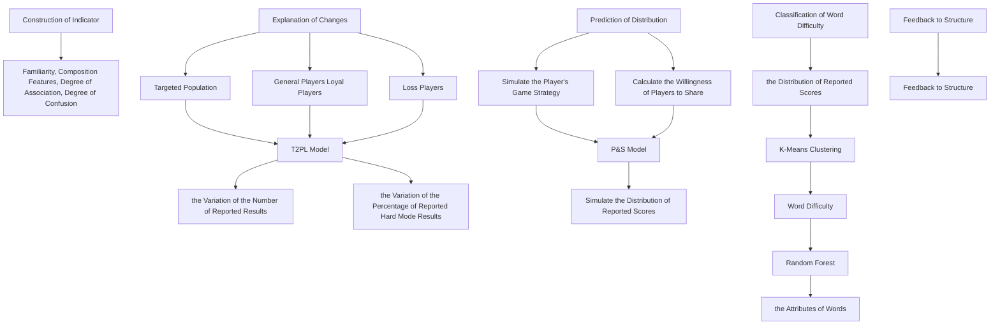
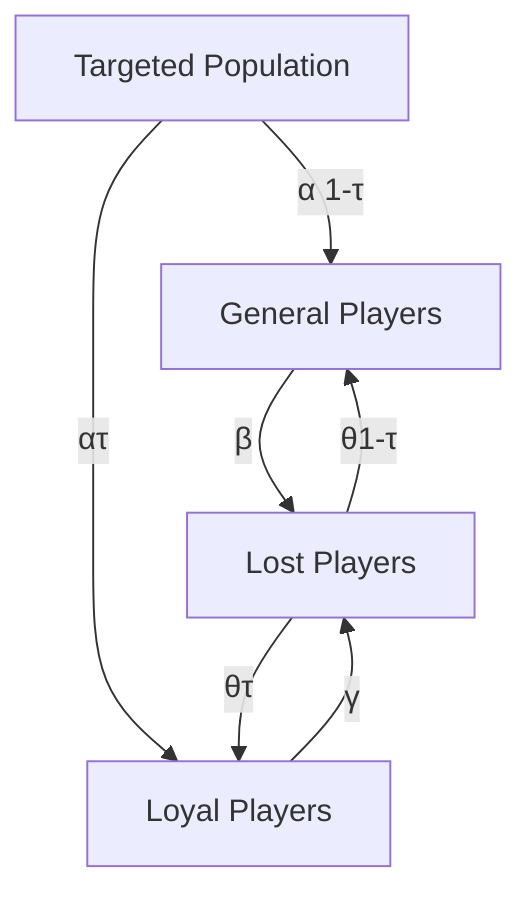

# Exploring Wordle: Insights into Puzzle Solving and Tweet Shares Pattern

## Summary

Wordle, a word puzzle that has attracted millions of people, is now owned by The New York Times. For the company’s game editor, how the game is solved and shared on social media is critical information, as it can be used to guide future puzzle design and ultimately maximise the total number of players. This paper aims to build a quantitative model based on word attributes and result reports on Twitter to predict the future pattern of players.

After examining and cleaning the raw data, we first define 12 attribute indicators measuring its familiarity (how often used), degree of association, degree of confusion and word composition features. They are computed in advance because the following models will frequently use these indicators.

For Problem 1, we build a dynamic system called Target-two-Players-Lost (T2PL) based on the SIR Model to explain the daily fluctuation of Wordle reports. Players are additionally divided into two categories: general players and loyal players, each with a different attrition rate. This allows the model to simulate unequal decline rates over different time periods better. The relationship between word attributes and the number of hard mode players is also explored, and it is found that certain attributes affect the percentage of Hard Mode reports.

For Problem 2, we develop a P&S Model, which is a model that uses simulation algorithms and gradient descent to mimic the behavior of players in guessing words and sharing the game results. The simulator works by eliminating all unsatisfactory words using observable information, then randomly sampling words from the remaining word list using word frequency as the weight. However, we found that the simulation result could not perfectly match the true distribution. Therefore, we rescaled the distribution with 7 variables representing how players are likely to share their score when given different scores. They are optimised by gradient descent, and better distribution predictions could be generated. Using the P&S Model, we predict the distribution of the word EERIE on March 1, 2023 is (0, 0, 9%, 29%, 45%, 14%, 3%).

For Problem 3, we are required to classify puzzles by difficulty. We perform a cluster analysis on all reported trial distributions using 3 clusters K-means, with each cluster labelled easy, medium and hard. We fit a Random Forest Model to divide the words into these three categories using the attribute indicators defined at the beginning. The correlation coefficient between each indicator and the difficulty is calculated, showing the direction in which these indicators affect the difficulty of the puzzles. The sensitivity of the clustering is discussed as well. Based on our model, the difficulty of EERIE is hard.

For Problem 4, we further explore the effects of word difficulty. Using Linear Regression, we found that word difficulty has an obvious effect on the number of results reported: harder puzzles lead to fewer reports. Difficulty also correlates with the percentage of people choosing Hard Mode, as we mentioned earlier. Through this part of the study, we find that the correlation is formed by word difficulty affecting the number of Normal Mode players.

With all the uncovered interactions between word attributes, puzzle difficulty, and game report patterns, Wordle operators could gain a deeper understanding of their players. Several sensible suggestions could also be made based on this discovery.

Keywords: Wordle; Dynamic system; Simulation; K-means; Random Forest

## Contents

## 1 Introduction 3

1.1 Background and Literature Review . 3  
1.2 Restatement of the Problem . . 3  
1.3 Our Work 4

## 2 Assumptions and Notations 4

2.1 Model Assumptions . . 4  
2.2 Notations 5

## 3 Data Preprocessing 5

## 4 Task 1: Word Attribute Indicators 6

## 5 Task 2: Predicting Daily Reports & Hard Mode Percentage 8

5.1 Problem Analysis . . 8  
5.2 Establishment of the Model . 8  
5.3 Solving the Model . . 10  
5.4 Solution and Result 10  
5.5 Hard Mode Percentage Estimation 11

## 6 Task 3: Predicting Report Distribution 13

6.1 Problem Analysis . 13  
6.2 Establishment of the Model . . 13  
6.3 Predict Confidence and Uncertainties . . 15

## 7 Task 4: Word Difficulty Classification 16

7.1 Cluster Analysis . . 16  
7.2 Difficulty Classification . . . 17  
7.3 Sensitivity Analysis . . 19

## 8 Task 5: Other Features 20

8.1 Fluctuations in the Number of Reported Results . 20  
8.2 Effect of Word Difficulty on Hard Mode Reports Percentage 20

## 9 Strengths and Weaknesses 21

9.1 Strengths 21  
9.2 Weaknesses 22  
9.3 Further Discussion 22

9.3.1 Model Improvement 22  
9.3.2 Model Extension 22

## 1 Introduction

## 1.1 Background and Literature Review

The word puzzle Wordle invented by Josh Wardle has attract millions of people due to its simplicity and myriad variation. Beyond the game, perhaps the major factor that cause Wordle went viral is its integrated sharing format consists of emoji squares, which spread widely through Twitter. In January 2022, Wordle was purchased by The New York Times Company and operated by them ever since. Only one piece of puzzle is released every day at the game’s official website and this scarcity is also believed to contribute to Wordle’s success.

In Wordle, player aim to crack a five-letter word within six guesses. Feedback is given after each guess is submitted: Letters highlighted in green indicates that the answer has the same letter at the same location. Yellow indicates this letter appears in the answer, but at another place. Grey indicates the letter is absent in the answer. Generally, it requires three to five tries for an average player, but it could vary significantly among different words. Addition to the normal version, there is also a Hard Mode Wordle, stipulating each discovered correct word (in Yellow or Green) must be maintained in the following guess[11].

Much research has focused on finding optimal strategy on solving the puzzle[1][4]. However, it seems that player’s pattern is worthy to explore as well. As a major product under The New York Times Games, its operator would like to trace and predict the number of shared games on Twitter. Besides, released word should be well-considered, since easy problems could not challenge experienced player, while rare word like ”rebus” or ”tapir” make most fans frustrated[10]. Therefore, a quantitative model to predict distribution of attempts according to a given word is also expected.

## 1.2 Restatement of the Problem

Considering the background, in this paper we are required to solve the following problems:

• Task 1: Combine the game mechanics of Wordle to build a set of indicators that reflect the attributes of words, and apply them to the subsequent model.  
• Task 2: Develop a model that explains the trends in the number of reported results and the percentage of scores reported that were played in Hard Mode, and use it to predict the number of reported results on March 1, 2023. Further, analyze the effect of word attributes on the percentage of scores reported that were played in Hard Mode.  
• Task 3: Develop a model that can predict the distribution of the reported results based on words and use it to predict the distribution for the word EERIE on March 1, 2023. In addition, illustrate the uncertainty and accuracy of the model.  
• Task 4: Classify words according to their difficulty and explain the relationship between the attributes of the words and the difficulty of the words.  
• Task 5: Perform a comprehensive analysis of the dataset, and give some interesting conclusions.

## 1.3 Our Work

flowchart

Figure 1: Flow chart of our work

Firstly, we constructed four types of indicators that can measure the familiarity, composition features, degree of association and degree of confusion of words, and used these indicators to reflect the attributes of words.

Secondly, we developed the T2PL Model based on the SIR model, a dynamic model that can well explain the overall trends in the number of reported results and the percentage of reported Hard Mode results. Based on this, we explored the effect of word attributes on the percentage of reported Hard Mode results.

Thirdly, we used the algorithm to simulate the strategies of wordle players when guessing words, so as to simulate the initial distribution of results. Considering the psychological characteristics of players, we added parameters indicating players’ willingness to share their scores, and simulated the final distribution of reported results.

Fourthly, we clustered the words according to the distribution of scores and classified the words into 3 classes based on difficulty. The clustering results were used as labels to construct a Random Forest Model for classifying words’ difficulty based on their attributes.

Finally, based on the results of the above model, we conducted further exploration and found some interesting conclusions.

## 2 Assumptions and Notations

## 2.1 Model Assumptions

Considering the conditions required for modeling, we make following assumptions:

• Assumption 1: There will not be a shift in the general trend of Wordle’s daily user number. Justification:This is required to predict future trend based on observed daily usage.  
• Assumption 2: Most players use rational strategies.

Justification: To establish a mathematic model for potential player, it is necessary to assume that they are actually using a strategy and will not take unessential moves. Otherwise, it would become meaningless to simulate result based on potential strategies.

• Assumption 3: There is no significant change in players’ skill along time.

Justification: As Wordle is played for a period, players are expected to improve their strategies which might affect attempt times distributions at different date. However, experienced players are giving up Wordle while rookies are joining simultaneously, producing an opposite effect. It would be too complicated to consider these possibilities.

• Assumption 4: In task 2 (T2PL Model), player and those who share their result are not distinguished.

Justification: For convenience, players are modelled in Task 2, although Twitter report numbers are actually used. This is because there is not enough information to distinguish between the two categories in this step, and it makes sense to switch from modelling players to modelling players who share their results.

## 2.2 Notations

<table><tr><td>Symbol</td><td>Definition</td><td>Symbol</td><td>Definition</td></tr><tr><td>N</td><td>Number of reported results</td><td>P</td><td>Number of all players</td></tr><tr><td>H</td><td rowspan="2">Number of reports in Hard Mode Percentage of scores reported that were played in Hard Mode. PH = H/N × 100%</td><td>Ploy</td><td>Number of loyal players</td></tr><tr><td>PH</td><td>Pgen</td><td>Number of general players</td></tr><tr><td>D</td><td>All words of length 5 in dictionary data</td><td>Wsj</td><td>Probability of sharing when finishing with j tries</td></tr><tr><td>T</td><td>Number of Targeted Population</td><td>pij</td><td>Probability of solving Wordle #i with j tries</td></tr></table>

Table 1: Symbol table.

Word attribute indicators is not included, because they are explaned in detail below.

## 3 Data Preprocessing

The dataset Problem\_C\_Data\_Wordle.xlsx contains 359 days of Wordle report information. Each row consists of date, the word of the day, the number of reported results, the hard mode results, and the distribution of each number of attempts. There are no missing values in the table, but on closer inspection several words are misspelled. We manually correct each of these by searching for the correct Wordle answer using the question number for that day.

<table><tr><td>Date</td><td>Contest number</td><td>original word</td><td>correct word</td></tr><tr><td>2022/12/16</td><td>545</td><td>rprobe</td><td>probe</td></tr><tr><td>2022/12/11</td><td>540</td><td>naïve</td><td>naive</td></tr><tr><td>2022/11/26</td><td>525</td><td>clen</td><td>clean</td></tr><tr><td>2022/10/5</td><td>473</td><td>marxh</td><td>marsh</td></tr><tr><td>2022/4/29</td><td>314</td><td>tash</td><td>trash</td></tr></table>

Table 2: All corrected words

We also checked the sum of the percentages of each distribution and found that the sum of question 281 ”nymph” on 2022/3/27 was 126, which is likely to be an outlier. We do not know which of the percentages is wrong, so we cannot simply scale it back. Therefore, this row of data is not used in the prediction percentage problem. Question number 529 ”study” on 2022/11/30 seems like an outlier as well. The Number of reported results in this row is 2569 and the Number in hard mode is 2405, which is obviously very different from the data in other rows, so it is corrected to 25690.

heatmap

| Month | Jan | Feb | Mar | Apr | May | Jun | Jul | Aug | Sep | Oct | Nov | Dec |
|---|---|---|---|---|---|---|---|---|---|---|---|---|
| Mon | 0.8 | 0.9 | 0.7 | 0.8 | 0.7 | 0.8 | 0.7 | 0.8 | 0.7 | 0.8 | 0.7 | 0.8 |
| Tues | 0.7 | 0.8 | 0.9 | 0.7 | 0.8 | 0.7 | 0.9 | 0.7 | 0.8 | 0.7 | 0.8 | 0.7 |
| Wed | 0.8 | 0.9 | 0.7 | 0.8 | 0.7 | 0.8 | 0.7 | 0.8 | 0.7 | 0.8 | 0.7 | 0.8 |
| Thur | 0.8 | 0.9 | 0.7 | 0.8 | 0.7 | 0.8 | 0.7 | 0.8 | 0.7 | 0.8 | 0.7 | 0.8 |
| Fri | 0.7 | 0.8 | 0.9 | 0.7 | 0.8 | 0.7 | 0.8 | 0.7 | 0.8 | 0.7 | 0.8 | 0.7 |
| Sat | 0.8 | 0.9 | 0.7 | 0.8 | 0.7 | 0.8 | 0.7 | 0.8 | 0.7 | 0.8 | 0.7 | 0.8 |
| Sun | 0.8 | 0.9 | 0.7 | 0.8 | 0.7 | 0.8 | 0.7 | 0.8 | 0.7 | 0.8 | 0.7 | 0.8 |

Figure 2: calendar map of submissions

Considering a possible weekly periodic pattern in the number of submissions, a calendar graph (Figure 2) is created to visualise the weekly variation. Each day is referenced to the average value of the week in which it is located. The more it exceeds the average value, the redder it is, and the more it falls below the average value, the greener it is. It can be seen that although there are some differences between each day of the week, there is no general pattern. Therefore, we assume that the fluctuation is only based on the general trend of the reports and the difficulty of the word.

## 4 Task 1: Word Attribute Indicators

Considering the game characteristics of Wordle, the indicators we constructed should reflect the spelling structure of the word and the ease with which people associate it as much as possible. To achieve this, we constructed the following framework of indicators.

• Familiarity: how familiar people are with the word and how commonly the word is used.  
• Composition features: structural features of words, such as whether they contain the same letters.

• Degree of association: the likelihood that the Wordle will give more valid information (i.e., green or yellow tiles) when the player guesses the word.  
• Degree of confusion: the degree of similarity between the word and other words. When the degree of similarity is too great, the player may need to spend more times to verify which of the many similar words is the correct answer.

Based on the above framework, we constructed 12 indicators:

<table><tr><td>Measured Feature</td><td>Symbol</td><td>Meanings</td></tr><tr><td>Familiarity</td><td> $F$ </td><td>Frequency of the word</td></tr><tr><td rowspan="2">Composition feature</td><td> $N_c$ </td><td>Number of the most repeated letter in the word</td></tr><tr><td> $N_v$ </td><td>Number of vowels in the word</td></tr><tr><td rowspan="3">Degree of association</td><td> $LF_i$ </td><td>Frequency that the ith letter of the word appears in the ith position of all words. ( $i = 1,2,3,4,5$ )</td></tr><tr><td> $LF_{sum}$ </td><td>Letter Frequency Sum</td></tr><tr><td> $N_{FI_2}$ </td><td>Number of frequent 2-itmes</td></tr><tr><td rowspan="2">Degree of confusion</td><td> $N_{D_1}$ </td><td>Number of all the words in  $D$  whose Levenshtein distance is 1 from the word</td></tr><tr><td> $N_{D_2}$ </td><td>Number of all the words in  $D$  whose Levenshtein distance is 2 from the word</td></tr></table>

Table 3: Symbol table of all selected parameters

A detailed description of certain symbols are present below:

• Number of the most repeated letters $( N _ { c } )$ : For example, $N _ { c } ( ^ { \mathrm { { \cdots } a p p l e ^ { \mathrm { { \cdots } } } } } ) = 2 , N _ { c } ( ^ { \mathrm { { \cdots } m u m m y ^ { \mathrm { { \prime \prime } } } } } ) = 3$ . Because players don’t usually try two or three of the same letters at the same time, we predict the greater $N _ { c }$ , the less likely the word is to be guessed.  
• Letter Frequency of the ith Letter $( L F _ { i } ) { \mathrm { : } }$ : For example, the first letter of apple is a, then $L F _ { 1 } ( ^ { \mathrm { { * } } } \mathrm { a p p l e ^ { \mathrm { { * } } } } )$ is the proportion of words with the first letter a in ??. The greater $L F _ { i }$ is , the greater the probability of a green tile appears at the ith position.  
• Letter Frequency Sum $( L F _ { s u m } ) \colon$ : Indicator $L F _ { s u m }$ , representing the sum of letter frequency in the word. First, letter frequency(????) is calculated by:

$$
\text {(initialize)} \quad \underset {c \in C} {\forall} [ L F (c) = 0 ] \tag {1}
$$

$$
\text {(repeat)} \quad \underset {W \in D} {\forall} \left[ \underset {c _ {1} \in C} {\forall} \left[ L F (c _ {1}) = L F (c _ {1}) + \sum_ {c _ {2} \in W} \left\{ \begin{array}{l l} 1 & i f c _ {1} = c _ {2} \\ 0 & o t h e r w i s e \end{array} \right. \right] \right] \tag {2}
$$

$$
\text {(finally)} \quad \underset {c _ {1} \in C} {\forall} \left[ L F (c _ {1}) = \frac {L F (c _ {1})}{\sum_ {W \in D} l e n (W)} \right] \tag {3}
$$

Where ?? is the alphabet set, ?? is the word set, $l e n ( w )$ represent the length of the word.

After calculating $L F , L F _ { s u m }$ could be produced by summing all characters in a word:

$$
L F _ {s u m} \left(" c _ {1} c _ {2} c _ {3} c _ {4} c _ {5}"\right) = \sum_ {i = 1} ^ {5} L F \left(c _ {i}\right) \tag {4}
$$

The greater the $L F _ { s } u m$ , the greater the probability of yellow tiles appearing when playing Wordle.

• Number of frequent 2-items $( N _ { F I _ { 2 } } )$ : This indicator count the number of frequent items contained in a word in the frequent 2-itenset $( F I _ { 2 } )$ . $F I _ { 2 }$ is calculated by FP-Growth algorithm, an algorithm for frequent pattern mining, with supporting degree $\frac { | D | } { 1 0 }$ 10 . Greater $N _ { F I _ { 2 } }$ increase the probability of information gain by close guesses, so it is assumed to be easier when $N _ { F I _ { 2 } }$ is high.  
• Number of 1/2 Levenshtein Distanced Words $( N _ { D _ { 1 } } , \ N _ { D _ { 2 } } )$ : Levenshtein distance is the minimum number of editing operations required to change from one to the other between two strings, so all words with Levenshtein distance equals to 1 or 2 are all similar words to the answer. When $N _ { D _ { 1 } }$ and $N _ { D _ { 2 } }$ are high, player may need to spend more times to verify which of the many similar words is the correct answer, and more likely fail to guess a word.

## 5 Task 2: Predicting Daily Reports & Hard Mode Percentage

## 5.1 Problem Analysis

It is obvious that Wordle has become viral last year. People send these iconic Wordle result tweets, attracting more people to try the game and share it. At the beginning of February, shared tweets rise in an exponential rate, then it drops gradually after March. Thus, this tendency could well be captured by SIR(Suspected-Infected-Recovered) model, which is originally intended to explain infectious diseases[9]. Establishing similar dynamic model to explain game user amount fluctuations is also observed in many researches, proved to be successful[5].

## 5.2 Establishment of the Model

Like SIR model, we can assume three groups of people: targeted population, current players, and lost players. Targeted population has the potential to become player, and this rate of transformation is proportional to total current players, owing to the advertising effect of their tweets. Therefore, decrease of target population could be written as the multiple of targeted population, current players and a constant ??. For current players, beside new players joining in, there are also players who became tired and give up the game. These group of people is related only to the number of current players and constant $\beta .$ . With these conditions, a dynamic system could be formulated as follow:

$$
\left\{ \begin{array}{l} \frac {\partial T}{\partial t} = - \alpha \cdot T \cdot P \\ \frac {\partial P}{\partial t} = \alpha \cdot T \cdot P - \beta \cdot P \\ \frac {\partial L}{\partial t} = \beta \cdot P \end{array} \right. \tag {5}
$$

flowchart

Figure 3: two-type player dynamic system

However, this model failed to satisfy both the sharp decrease after peaking in February and mild decrease in the second half of the year. After all, while many people might gradually abandon the game, others might maintain their fondness for Wordle. Modelling all players having the same player leaving rate $\beta$ might not work well. Therefore, we improved the model by dividing all players into loyal players who has lower tendency to get tired with Wordle and keep sending Wordle tweets, and general players who follow the trend and leave with the trend, Which is named T2PL(Target-2-players-Lost) model. Each two category has a unique decay rate $\beta$ and $\gamma .$ . Both types of player’s tweets would have similar effects, so the sum of two categories is used when calculating decrease in potential population. What percentage do players fall into each category also need to be determined. We set variable ?? as the rate of new players becoming a loyal player and variable $p$ as the initial split of two types. In case there were players who wants to try Wordle again after leaving for a while, an additional variable ?? is used to describe the lost-return rate, and this means the initial value of lost player $L _ { 0 }$ also has to be modeled in advance. Now the final formulation would be:

$$
\left\{ \begin{array}{l} \frac {\partial T}{\partial t} = - \alpha T \cdot \left(P _ {l o y} + P _ {g e n}\right) \\ \frac {\partial P _ {l o y}}{\partial t} = \tau \cdot \left[ \alpha T \cdot \left(P _ {l o y} + P _ {g e n}\right) + \theta L \right] - \beta \cdot P _ {l o y} \\ \frac {\partial P _ {g e n}}{\partial t} = (1 - \tau) \cdot \left[ \alpha T \cdot \left(P _ {l o y} + P _ {g e n}\right) + \theta L \right] - \gamma \cdot P _ {g e n} \\ \frac {\partial L}{\partial t} = \beta \cdot P _ {l o y} + \gamma \cdot P _ {g e n} - \theta L \end{array} \right. \tag {6}
$$

With initial values: ??0, $P _ { l o y _ { 0 } } = P _ { 0 } \cdot p , P _ { g e n _ { 0 } } = P _ { 0 } \cdot ( 1 - p ) , L _ { 0 }$

## 5.3 Solving the Model

By estimating a set of initial values $( \alpha , \beta , \gamma , T _ { 0 } , L _ { 0 } , \tau , \theta , p )$ and observed initial value $P _ { 0 } .$ , the dynamic system can be numerically solved using forward Euler method. Our goal is to fit the dynamic system towards the result curve. The objective function is the mean square error between 1 and the ratio between estimated value and actual value at each sample point. It is re-scaled because the range between maximum and minimum value at the ground truth curve is too large.

$$
\min _ {\alpha , \beta , \gamma , T _ {0}, \tau , p} \sum_ {t = 1} ^ {N} \left(1 - \frac {\hat {P} _ {i} (\alpha , \beta , \gamma , T _ {0} , \tau , p)}{P _ {i}}\right) ^ {2} \tag {7}
$$

Without explicitly solving the function, our team use auto-gradient package (Pytorch) to optimize the parameters. Each parameter is updated by gradient descent. As long as the initial value are roughly the correct scale, it will find the local minimum of the parameters that produce a well-fit curve.

## 5.4 Solution and Result

After 5000 epoch of training with learning rate 0.01, we find the optimal value of each variable.

<table><tr><td></td><td> $\alpha$ </td><td> $\beta$ </td><td> $\gamma$ </td><td> $\theta$ </td><td> $T_0$ </td><td> $L_0$ </td><td> $\tau$ </td><td> $p$ </td></tr><tr><td>initial value</td><td> $5 \times 10^{-7}$ </td><td>0.02</td><td> $2 \times 10^{-3}$ </td><td> $2 \times 10^{-4}$ </td><td>310000</td><td>30000</td><td>0.2</td><td>0.2</td></tr><tr><td>optimal value</td><td> $3.03 \times 10^{-7}$ </td><td>0.0228</td><td> $3.7 \times 10^{-3}$ </td><td> $2.0 \times 10^{-4}$ </td><td>431193</td><td>29918</td><td>0.0992</td><td>0.1683</td></tr></table>

Table 4: initial value and optimal value of all variable

line chart

| date       | ground truth | predict |
| ---------- | ------------ | ------- |
| 2023-03    |              | 19367   |

Figure 4: Predicted number of reports. Predicted days are drawn with dotted line.

The plotted curve is shown in Figure 4. The model is proved to excellently capture the tendency of reported Wordle result in 2022. In 2023.3.1, it is predicted to have 19367 users sending Wordle results. Because the model cannot provide a range of possible prediction by itself, we estimate by considering the MAPE (Mean Absolute Percentage Error), which is often used as a measurement of prediction accuracy. It is defined as:

$$
\mathrm{MAPE} = \frac {100 \%}{n} \sum_ {t = 1} ^ {n} \left| \frac {\hat {P} _ {t} - P _ {t}}{P _ {t}} \right| \tag{8}
$$

Given MAPE = 0.083 on observable date, we can assume the result will fall within ±MAPE. Therefore, the estimated region is given as:

$$
\text { Confidence   Interval } (t) = \left[ (1 - \text { MAPE }) \cdot \hat {P} _ {t}, (1 + \text { MAPE }) \cdot \hat {P} _ {t} \right] \tag {9}
$$

Therefore, the prediction interval for the number of reports is [17760, 20976].

In addition, this model could provide additional insight into the structure of Wordle players. We have plotted the change in each category in 2022. According to Figure5, general players increase rapidly in February and then decrease to a very low level at the end. Loyal players, on the other hand, don’t change much throughout the process. The model predicts that there will be only 19% general players on 31 December 2022 and 21% on 1 March 2023, showing that the majority of players will be loyal and probably more skilled players in the near future.

line chart

| date       | loyal players | general players | targeted population | lost players |
| ---------- | ------------- | --------------- | ------------------- | ------------ |
| 2022-01    | ~20,000       | ~70,000         | ~420,000            | ~40,000      |
| 2022-03    | ~50,000       | ~280,000        | ~10,000             | ~300,000     |
| 2022-05    | ~40,000       | ~50,000         | ~5,000              | ~450,000     |
| 2022-07    | ~30,000       | ~10,000         | ~5,000              | ~500,000     |
| 2022-09    | ~25,000       | ~5,000          | ~5,000              | ~510,000     |
| 2022-11    | ~20,000       | ~5,000          | ~5,000              | ~515,000     |
| 2023-01    | ~15,000       | ~5,000          | ~5,000              | ~520,000     |

Figure 5: two-type player dynamic system

## 5.5 Hard Mode Percentage Estimation

Unlike the trend in the number of reported results, the percentage of scores reported that were played in Hard Mode posting slowly increased from 2% to 10% and then remained stable. This overall trend can perhaps be explained by the change in player structure mentioned above, where loyal players are more likely to choose Hard Mode because of their higher level of play and love for the game. As shown in the figure below, the trend of the percentage of loyal players in the overall player base is basically the same as the trend of the percentage of scores reported that were played in Hard Mode.

line chart

| Date       | hardmode players rate | loyal players rate |
| ---------- | --------------------- | ------------------ |
| 2022-01    | ~1.5%                 | ~15%               |
| 2022-03    | ~4.5%                 | ~30%               |
| 2022-05    | ~7.0%                 | ~60%               |
| 2022-07    | ~8.5%                 | ~75%               |
| 2022-09    | ~9.5%                 | ~80%               |
| 2022-11    | ~13.0%                | ~80%               |
| 2023-01    | ~9.5%                 | ~80%               |

Figure 6: Curve of hard mode reports’ percentage and loyal players’ percentage, re-scaled.

In addition, there were always small fluctuations in the percentage of reported scores played in Hard Mode around the overall trend, and these fluctuations may be related to the attributes of the word of the day. To explore this relationship, we established a multiple linear regression model with the percentage of Hard Mode reports as the dependent variable, and all indicators reflecting word attributes as independent variables. In order to avoid the influence of the overall trend on the exploration of fluctuations, the percentage of scores reported in the previous day is selected as the control variable.

The regression results were as follows (only the results of variables with significant regression coefficients are given here):

<table><tr><td> $P_H$  on the previous day</td><td> $F$ </td><td> $N_c$ </td><td> $LF_4$ </td><td> $LF_{sum}$ </td><td> $N_{FI_2}$ </td></tr><tr><td rowspan="2">0.9608***(0.0111)</td><td>-6.342 × 10-12*</td><td>2.776 × 10-3***</td><td>0.0291*</td><td>-0.0423***</td><td>6.777 × 10-4*</td></tr><tr><td>(2.814 × 10-12)</td><td>(5.959 × 10-4)</td><td>(0.0113)</td><td>(0.0110)</td><td>(2.761 × 10-4)</td></tr></table>

The results show that ?? and $L F _ { s u m }$ have a significant negative effect on the percentage of scores reported that were played in Hard Mode, while $N _ { c } , L F _ { 4 }$ and $N _ { F I _ { 2 } }$ have a significant positive effect on it. And it can be found through the later analysis that these indicators are the important factors that determine the difficulty of words.

Select the two attributes with the strongest salience and plot the categorical box plot of the percentage of scores reported that were played in Hard Mode about them. The results show that the percentage of scores reported that were played in Hard Mode is higher when the words contain the same letters, and lower when the words have a higher frequency of letters.

box plot

| Nc     | Percentage |
| ------ | ---------- |
| 1      | 0.08       |
| 2 or 3 | 0.09       |

box plot

| LF_sum       | percentage |
| ------------- | ---------- |
| below average | 0.09       |
| above average | 0.08       |

Figure 7: Box plot result

## 6 Task 3: Predicting Report Distribution

## 6.1 Problem Analysis

Wordle is an interactive game. When a player fills in a word, Wordle gives feedback and the player chooses a new word based on Wordle’s feedback. Each step of the player’s strategy is related to the word filled in the previous step, which provides so many possibilities for the game to proceed that it is almost impossible to calculate the probability of the player guessing the word within a specified number of times. In order to predict the associated percentages of (1, 2, 3, 4, 5, 6, X) for a future date, we designed a simulation algorithm to simulate the player’s strategy of playing Wordle, and obtained the simulated distribution by performing 5000 simulations for each word.

## 6.2 Establishment of the Model

The main idea of the simulation algorithm is: Players randomly select a word from the dictionary to guess, and get the game state of Wordle. For the state of each letter:

1. If it is green, only the word with the letter in the corresponding position will be selected for subsequent guesses;  
2. If it is yellow, only words with that letter in other positions will be selected for subsequent guesses;  
3. If it is gray and not among the yellow letters, the subsequent guesses will not select words containing this letter.

Above process is repeated until the player has succeeded or guessed more than 6 times.

Note: Here we assume that players know all the words in the dictionary D.

Algorithm 1 Simulate $( W _ { S } )$  
(Note: Evaluate-Guess $( W _ { S } , W _ { G } )$ return a game state of wordle. For example: $W _ { S } \ = \mathrm { " t o o l s " } ,$ $W _ { G } = ' $ brook”, it return ”NNYMN”. $\mathbf { \vec { \mu } } ^ { , , } \mathbf { Y } ^ { , , }$ means the letter is in the answer and in the correct position. ”M” means the letter is in the answer but in a different position. $\mathbf { \vec { \mu } } _ { \mathrm { ~ \bf ~ N ~ } } ^ { \mathbf { \vec { \mu } } , \mathbf { \vec { \mu } } }$ means the letter is not in the answer.)  
Input: Solution word $W_{S}$ Output: The list of game states $L_{G}$ 1: $D_{W} \leftarrow D;$ 2: $L_{G} \leftarrow \phi;$ 3: for i from 1 to 6 do
4: random choose a guess word $W_{G}$ from $D_{W};$ 5: $S_{i} \leftarrow$ Evaluate-Guess( $W_{S}, W_{G}$ );
6: $L_{G} \leftarrow L_{G} \cup \{S_{i}\};$ 7: if $S_{i} = "YYYYY"$ then break;
8: end if
9: for j from 1 to 5 do
10: if $S_{i}^{j} = "Y"$ then
11: remove from $D_{W}$ the words W satisfying $W^{j} \neq W_{G}^{j};$ 12: else if $S_{i}^{j} = "M"$ then
13: filter out the word W satisfying $W^{k} = W_{G}^{j}, k \neq j$ from $D_{w};$ 14: else if $S_{i}^{j} = "N"$ & $W_{G}^{j} \notin \{W_{G}^{k} | S_{i}^{k} = "M", k = 0, 1, 2, 3, 4\}$ then
15: remove from $D_{W}$ the words W satisfying $W^{j} = W_{G}^{j};$ 16: end if
17: end for
18: end for
19: return $L_{G};$

We subtracted the probabilities on the corresponding points of the simulated distribution and the real distribution, and took the absolute value as error. The value of error is 5.36%, which was not satisfactory. By comparing the mean value of the simulated distribution with the mean value of the real distribution, we found that the mean value of 79.6% of the simulated distribution was larger than that of the real distribution, i.e., the simulation results showed that players needed more attempts to guess. We believe this is due to the fact that players who guessed correctly with fewer attempts were more likely to share their results on Twitter, while players who guessed correctly after many attempts were more likely not to share on Twitter.

According to above considerations, we propose P&S(Played and Shared) model. Probability of a player sharing after playing Wordle(either successfully or failed) is defined as $W _ { s i }$ , indicating the willingness to share after making i attempts to success $( W _ { s i } \in [ 0 , \ 1 ] )$ . We corrected the simulated distribution according to $W _ { s i }$ and used gradient descent method to minimize error. The corrected formula is as follows:

$$
\hat {p _ {i j}} = \frac {p _ {i j} W _ {s j}}{\sum_ {k = 1} ^ {5} p _ {i k} W _ {s k}} \times 100 \% \tag{10}
$$

$p _ { i j }$ is the percentage of players who succeeded after j attempts for the ith word, $\hat { p _ { i j } }$ is the percentage of players who succeeded after j attempts for the ith word after correction.

The optimal parameters obtained by the gradient descent method are shown below:

<table><tr><td> $W_{s1}$ </td><td> $W_{s2}$ </td><td> $W_{s3}$ </td><td> $W_{s4}$ </td><td> $W_{s5}$ </td><td> $W_{s6}$ </td><td> $W_{s7}$ </td></tr><tr><td>1.000</td><td>0.993</td><td>0.940</td><td>0.755</td><td>0.698</td><td>0.696</td><td>0.301</td></tr></table>

Table 6: Scale parameters’ optimal value

We corrected the simulated distribution with the above parameters and compared it with the real distribution again, and found that the corrected distribution could fit the distribution of the data set better. The error is reduced from 5.36% to 1.50%, and only 45.6% of the simulated distributions have a mean value greater than the real distribution, which is a more desirable result. We named this model P&S Model, where P stands for playing the game and S stands for sharing the results.

heatmap

| avg_sim | avg_origin |
| ------- | ---------- |
| 3.0     | 3.0        |
| 3.5     | 3.5        |
| 4.0     | 4.0        |
| 4.5     | 4.5        |
| 5.0     | 5.0        |
| 5.5     | 5.5        |
| 6.0     | 6.0        |
| 6.5     | 6.0        |

bar-line hybrid chart

| avg_sim_correct | avg_origin |
| --------------- | ---------- |
| 3.0             | 3.0        |
| 3.5             | 3.5        |
| 4.0             | 4.0        |
| 4.5             | 4.5        |
| 5.0             | 5.0        |
| 5.5             | 5.5        |

Figure 8: Visualize the simulated distribution versus the true distribution, before and after correction.

## 6.3 Predict Confidence and Uncertainties

Based on our model, the distribution of the word EERIE on March 1, 2023 is (0, 0, 9%, 29%, 45%, 14%, 3%). Because the value of error is 1.50%, we speculated that the probability of each point of the real distribution will probably fall within plus or minus 1.50% of the simulated distribution.

Due to the stochastic nature of the simulation, the prediction results of the P&S Model will not always be the same, which will lead to some uncertainty in the prediction results.

## 7 Task 4: Word Difficulty Classification

In the previous section we built a model to analyse the possible distribution for each word. However, puzzle designers seeking insight from this model would find it difficult to use this information. It is expected that a comprehensive label describing the difficulty of the puzzle will be created and that the classification into these categories will be produced by explainable attributes of each 5-letter word. Therefore, we perform a cluster analysis on the score distributions in the dataset, hoping to identify 3 types of difficulty: Easy, Medium and Hard. We then enumerate all possible attributes in each word and run a classification algorithm into three difficulty levels using these attributes. In this way, the most important attributes for classification could be discovered, and then we could gain a thoughtful understanding of how each category relates to the word feature.

## 7.1 Cluster Analysis

For clustering algorithms, we compare two commonly used methods: k-means[3] and Gaussian Mixture Model (GMM)[7].

K-means tries to divide the data into k categories, generating k category centroids $C _ { k }$ . For each point, its nearest centroid is expected to be the centroid of the category to which it belongs. By initiating several random points as the centroid, it is iteratively updated using this formula:

$$
x _ {n} \in C _ {k} ^ {(t + 1)}, \text {   if   } k = \arg \min _ {k} d (x _ {n}, c _ {k} ^ {(t)}) \tag {11}
$$

$$
c _ {k} ^ {(t + 1)} = \frac {1}{\left| C _ {k} ^ {(t + 1)} \right|} \sum_ {x _ {n} \in C _ {k} ^ {(t + 1)}} x _ {n} \tag {12}
$$

GMM considers all observed data sampled from k normal distributions $N _ { k } ( \mu _ { k } , \Sigma _ { k } )$ and tries to find the maximum likelihood pairs of parameters $\mu _ { k } , \Sigma _ { k }$ . It can be solved using the expectation maximisation (EM) algorithm. In the E-step, the responsibility (posterior distribution of clusters) of each sample point is calculated.

$$
p ^ {(t)} (k \mid x _ {n}) = \frac {p \left(x _ {n} ; \mu_ {k} ^ {(t)} , \Sigma_ {k} ^ {(t)}\right)}{\sum_ {i = 1} ^ {K} p \left(x _ {n} ; \mu_ {i} ^ {(t)} , \Sigma_ {i} ^ {(t)}\right)} \tag {13}
$$

Then in M-step, the responsibility is fixed and the model parameters are updated as:

$$
\mu_ {k} ^ {(t + 1)} = \frac {\sum_ {n = 1} ^ {N} p ^ {(t)} (k | x _ {n}) x _ {n}}{\sum_ {n = 1} ^ {N} p ^ {(t)} (k | x _ {n})} \quad \Sigma_ {k} ^ {(t + 1)} = \frac {\sum_ {n = 1} ^ {N} p ^ {(t)} (k | x _ {n}) (x _ {n} - \mu_ {k} ^ {(t + 1)}) (x _ {n} - \mu_ {k} ^ {(t + 1)}) ^ {T}}{\sum_ {n = 1} ^ {N} p ^ {(t)} (k | x _ {n})} \tag {14}
$$

After convergence, each sample point belongs to the distribution with maximum responsibility.

$$
x _ {n} \in C _ {k}, \text {   if   } k = \arg \max _ {k} p (k | x _ {n}) \tag {15}
$$

In order to decide the better algorithm and choose the appropriate number of clusters, we compare the results using the Silhouette Coefficient[8] and the Calinski-Harabasz Index[6]. The silhouette coefficient is obtained by averaging the silhouette values of all sample points, which describe how close the sample point is to its cluster compared to others. The greater silhouette values is, more distinguishable the cluster would be. Its mathematical formulation is:

$$
S C = \frac {1}{N} \sum_ {i = 1} ^ {N} s (x _ {n}), \quad s (x _ {n}) = \frac {b (x _ {n}) - a (x _ {n})}{\max (a (x _ {n}) , b (x _ {n}))} \tag {16}
$$

${ \mathrm { W h e r e : ~ } } a ( x _ { n } ) = { \frac { 1 } { C _ { i } - 1 } } \sum _ { x _ { m } \in C _ { i } , m \neq n } d ( x _ { m } , x _ { n } ) \qquad { \mathrm { ( s a m e ~ c l u s t e r ~ c l o s e n e s s ) } }$

$$
b (x _ {n}) = \min _ {j \neq i} \frac {1}{C _ {j}} \sum_ {x _ {m} \in C _ {j}} d (x _ {m}, x _ {n}) \quad (\text { different   cluster   closeness })
$$

The Calinski-Harabasz index is a ratio between the variance of the cluster centres and the variance of each cluster. If the centres of each cluster are spread apart and the sample points are clustered around each cluster centroids, then the Calinski-Harabasz Index is expected to be high.

$$
\text { C - H   Index } = \left[ \frac {\sum_ {k = 1} ^ {K} | C _ {k} | \cdot | | c _ {k} - \mu | | ^ {2}}{K - 1} \right] / \left[ \frac {\sum_ {k = 1} ^ {K} \sum_ {x \in C _ {k}} | | x - c _ {k} | | ^ {2}}{N - K} \right] \quad (c _ {k} \text {   is   the   centroid   of   } C _ {k}) \tag {17}
$$

Score of both indicators in shown in the table:

<table><tr><td></td><td>k-means (3)</td><td>GNN(3)</td><td>k-means(2)</td><td>GNN(2)</td></tr><tr><td>silhouette coefficient</td><td>0.369</td><td>0.306</td><td>0.425</td><td>0.366</td></tr><tr><td>Calinski-Harabasz index</td><td>311.9</td><td>203.4</td><td>329.6</td><td>122.3</td></tr></table>

Table 7: scores for different kinds of cluster algorithm

Finally, we decide to create 3 clusters using k-means. Although 2 class k-means seems to have a higher evaluation score, detailed classification is better for drawing more specific conclusions, and the performance of 3 class k-means is not too far from it. To observe the clustering effect more intuitively, we use the t-SNE algorithm to reduce the data to 2 dimensions. Figure 9 visualize all three clusters, labeled ”easy”, ”medium” and ”hard” according to expected attempts of each class centroids. Therefore, we successfully find a method to allocate each word into three difficulties based on how they are reported to be solved.

## 7.2 Difficulty Classification

Now that all the word features have been quantized into 12 numerical values and assigned a difficulty level, a supervised classification model could be built to predict the difficulty level based on word attributes. We use Random Forest classification[2] in this task. Random Forest has been shown to provide stable classification results on a wide range of data. The motivation of the algorithm is to reduce variance by bagging on the training set and feature space. B decision tree is trained on a sampled set of all data with certain feature is masked, and classification result is produced by summarising all ?? votes from each decision tree.

scatterplot

| TSNE_dimention1 | TSNE_dimention2 | difficulty |
| --------------- | --------------- | ---------- |
| -20             | 20              | Easy       |
| -15             | 15              | Easy       |
| -10             | 10              | Easy       |
| -5              | 5               | Medium     |
| 0               | 0               | Medium     |
| 5               | -5              | Medium     |
| 10              | -10             | Medium     |
| 15              | -15             | Medium     |
| 20              | -20             | Medium     |
| -20             | 20              | Hard       |
| -15             | 15              | Hard       |
| -10             | 10              | Hard       |
| -5              | 5               | Hard       |
| 0               | 0               | Hard       |
| 5               | -5              | Hard       |
| 10              | -10             | Hard       |
| 15              | -15             | Hard       |
| 20              | -20             | Hard       |
| -20             | 20              | Medium     |
| -15             | 15              | Medium     |
| -10             | 10              | Medium     |
| -5              | 5               | Medium     |
| 0               | 0               | Medium     |
| 5               | -5              | Medium     |
| 10              | -10             | Medium     |
| 15              | -15             | Medium     |
| 20              | -20             | Medium     |

Figure 9: Visualized 3 clusters projected on 2 dimensions

$$
\text {(train)} \quad f _ {b} = \arg \min _ {f _ {b}} L (f _ {b} (X _ {b}), Y _ {b}) \quad (b = 1,..., B) \tag {18}
$$

$$
\text {(predict)} \quad \hat {f} = \frac {1}{B} \sum_ {b = 1} ^ {B} f _ {b} (X) \tag {19}
$$

All record is split into 80% training set and 20% testing set. After training the model, Classification metric on test data is shown in table 8. It seems that classification score is generally even among each categories and accuracy(0.68) is high, meaning the model could successfully grasp the relation between word attributes and its difficulty.

<table><tr><td></td><td>precision</td><td>recall</td><td>f1-score</td><td>support number</td></tr><tr><td>easy</td><td>0.63</td><td>0.70</td><td>0.67</td><td>27</td></tr><tr><td>medium</td><td>0.77</td><td>0.68</td><td>0.72</td><td>34</td></tr><tr><td>hard</td><td>0.58</td><td>0.64</td><td>0.61</td><td>11</td></tr><tr><td>accuracy</td><td></td><td></td><td>0.68</td><td>72</td></tr><tr><td>weighted average</td><td>0.69</td><td>0.69</td><td>0.68</td><td>72</td></tr></table>

Table 8: Classification metric.

Beside total accuracy, precision, recall and f1-score is calculated on each categories and averaged by weight.

Our model also provides insight into how each feature affects puzzle difficulty. Figure 10 shows the correlation of each feature with word difficulty. This factor is obtained by assigning values to each difficulty level (easy=0, medium=1, hard=2) and calculating the covariance matrix with each feature.

attributes correlation with difficulty  

bar chart

| (attributes) | Familiarity | Composition Feature | Degree of Association | Degree of Confusion |
| ------------ | ----------- | ------------------- | --------------------- | ------------------- |
| F            | -0.15       | 0.0                 | 0.0                   | 0.0                 |
| LF_sum       | 0.0         | 0.0                 | -0.2                  | 0.0                 |
| N_D2         | 0.0         | 0.0                 | 0.0                   | 0.04                |
| LF_2         | 0.0         | 0.0                 | -0.2                  | 0.0                 |
| LF_4         | 0.0         | 0.0                 | 0.0                   | 0.0                 |
| N_D1         | 0.0         | 0.0                 | 0.0                   | 0.07                |
| LF_3         | 0.0         | 0.0                 | -0.2                  | 0.0                 |
| LF_1         | 0.0         | 0.0                 | -0.2                  | 0.0                 |
| LF_5         | 0.0         | 0.0                 | 0.03                  | 0.0                 |
| N_C          | 0.0         | 0.33                | 0.0                   | 0.0                 |
| N_FI2        | 0.0         | 0.0                 | -0.25                 | 0.0                 |
| N_V          | 0.0         | -0.1                | 0.0                   | 0.0                 |

Figure 10: Each feature’s correlation with difficulty, ranked by its importance in model

The pattern is very obvious: if a word is used more often (familiarity) or can be easily associated with another word, it would have a negative correlation with difficulty, i.e. it is easier to guess. Furthermore, if it is often confused with another word, it becomes more difficult. The effect of compositional features can also be explained: It is relatively less instinctive to try words with multiple identical letters, and human players prefer to solve Wordle by cracking the vowel first, which makes the word with multiple vowels easier. Therefore, the number of same letters is positively correlated with difficulty, and the number of vowels is negatively correlated with difficulty.

Based on our model, ”EERIE” is classified as a hard answer. Precision of this category is 0.58 on testing set.

## 7.3 Sensitivity Analysis

Sensitivity analysis determines how the variations of an independent variable affect a particular dependent result under a given set of assumptions, in which way we can test the robustness of the results. To test whether our models’ results are sensitive to the change of the input parameters, we need to carry out sensitivity analysis. In the actual data calculation, the percentages in data may not sum to 100% due to rounding. In order to analyze the stability of our clustering model when the original data is inaccurate, we use sensitivity analysis to evaluate the model. To simulate the loss of precision caused by rounding, we add a stochastic disturbance term $\varepsilon _ { i }$ to the data. We assume the stochastic disturbance fluctuates randomly in the range of 5% of the original data. We define the data after adding the stochastic disturbance as:

$$
p _ {i j} ^ {\prime} = p _ {i j} \times \varepsilon_ {i} \quad \varepsilon_ {i} \sim U (0. 9 5, 1. 0 5) \tag {20}
$$

Then, we use the new data for clustering. By comparing the clustering results with and without stochastic disturbance, we find that 3.34% of the clustering results changed, which indicates that the clustering results were not seriously affected by data errors and our model is relatively stable.

<table><tr><td></td><td>Easy</td><td>Medium</td><td>Hard</td></tr><tr><td>without stochastic disturbance</td><td>133</td><td>153</td><td>73</td></tr><tr><td>with stochastic disturbance</td><td>132</td><td>159</td><td>68</td></tr></table>

Table 9: Clustering result with or without disturbance

## 8 Task 5: Other Features

## 8.1 Fluctuations in the Number of Reported Results

Similar to the change in the percentage of scores reported that were played in Hard Mode, the number of reported results always fluctuates up and down around the overall trend. Since people are always more willing to share out their better scores, we speculate that this fluctuation may be related to the difficulty of the word. To explore the relationship between the two, we subtracted the results fitted by the T2PL Model in part 4 from the real number of reported results and used it as the dependent variable, and used the difficulty level derived from clustering in part 6 as the independent variable to establish a linear regression model.

The results are as follows:

<table><tr><td>Easy</td><td>Medium</td><td>Hard</td><td> $R^2$ </td></tr><tr><td>6589.5***</td><td>1087.5</td><td>-2649.3***</td><td>0.09</td></tr><tr><td>(1143.7)</td><td>(1371.6)</td><td>(781.3)</td><td></td></tr></table>

Table 10: The effect of word difficulty on the number of reported results Note: Because difficulty level is a categorical variable, dummy variables are set for it in the regression.

The regression results show that the difficulty of the word can explain the change of the number of reported results to some extent. Specifically, the number of reported results will be 6589.5 higher than the fitted results when the word is easy, 1087.5 higher than the fitted results when the word is moderately difficult, and 2649.3 less than the fitted results when the word is hard. We corrected the interval predicted by the T2PL Model. Because the word EERIE is hard, so we subtracted 2649 from the endpoint value of the original interval at the same time to obtain the corrected prediction interval [15111, 18327].

## 8.2 Effect of Word Difficulty on Hard Mode Reports Percentage

Combining the findings from Part 5 and Part 7, we can find that the word attributes that affect the percentage of scores reported that were played in Hard Mode happen to be important attributes that affect the difficulty of the words, so it is reasonable to believe that there is some relationship between the percentage of scores reported that were played in Hard Mode and the difficulty of the words. Similar to 7.1, we explored the relationship by creating a linear regression equation (adding $P _ { H }$ on the previous day as a control variable, and the same for each of the following regressions).

The results are as follows:

<table><tr><td>Easy</td><td>Hard</td></tr><tr><td>-0.0021938***</td><td>0.0021471***</td></tr><tr><td>(0.0005296)</td><td>(0.0006389)</td></tr></table>

Table 11: The effect of word difficulty on the percentage of reported Hard Mode results.  
Note: This section replaces dummy variables of moderate difficulty with constant terms, so the coefficients of median are no longer reported.

Surprisingly, the percentage of scores reported that were played in Hard Mode increases when the word is difficult, while decreasing when the word is easy. To investigate the reason for this phenomenon, we ran another two regressions with the number of scores reported that were played in Normal Mode (N-H) and the number of scores reported that were played in Hard Mode as dependent variables.

The results are as follows:

<table><tr><td></td><td>Easy</td><td>Hard</td></tr><tr><td>N-H</td><td>6374***(1430)</td><td>-5125***(1718)</td></tr><tr><td>H</td><td>166.8(90.27)</td><td>229.0(158.5)</td></tr></table>

Table 12: The effect of word difficulty on ?? − ?? and ??

It can be found that the number of scores reported that were played in Normal Mode decreases significantly when the word is difficult, and on the contrary, increases significantly when the word is easy. While the word difficulty has no significant effect on the number of scores reported that were played in Hard Mode. Therefore, we can analyze the reason for this strange phenomenon: players who choose Hard Mode may have a higher level of word guessing and enjoy the game more, so they are able to maintain a more stable level of guessing the correct word even when the word difficulty increases. Furthermore, they are eager to share their game results even if they cannot guess the word. But players in Normal Mode may not share their game results when they cannot guess the word. As a result, when the word is difficult, the percentage of scores reported that were played in Hard Mode increases.

## 9 Strengths and Weaknesses

## 9.1 Strengths

1. The selection of evaluation indicators is scientific and easy to understand. We have taken into account the game characteristics of Wordle and constructed four categories of indicators that can comprehensively reflect the spelling structure of words and the ease with which people associate it.  
2. The model is constructed with full consideration of the realistic situation and has good interpretability. Considering the faithfulness of players to Wordle, the T2PL Model is improved

on the basis of SIR Model by dividing players into two categories: general players and loyal players. The results prove that this improvement enables the model to simulate and explain the changing trend of the number of reported results very well. The P&S Model, based on the simulation of players’ strategies of guessing words, also sets the sharing probability for players with different numbers of tries, which well simulates the psychological characteristics of people.

3. The consideration is very comprehensive. When exploring the trends in the number of reported results and the percentage of scores reported that were played in Hard Mode, we analyzed not only their overall trends, but also their fluctuations around the overall trends. Furthermore, we explained the reasons for the formation of the fluctuations. Based on the results of this analysis, we revised the prediction interval of the first question.  
4. The models are interlinked and corroborate each other. The indicators we constructed to reflect word attributes were applied to both the analysis in Part 5 and Part 7. The distribution of EERIE predicted by the P&S Model was clustered for difficulty, and the result was consistent with that of the classifier in Part 7.  
5. Overfitting problem is avoided. Considering that the amount of data is not very large, we did not use a model containing a large number of parameters to avoid the overfitting problem.

## 9.2 Weaknesses

1. There is still a gap between the model and the reality. Different people will use different strategies to guess word, and different people have different vocabularies, but we did not sufficiently consider in the P&S Model.  
2. The accuracy of the classification model is not high enough. The accuracy of the classifier in Part 7 is only 68%, which is not particularly good, probably because we omitted some characteristics of the words when constructing the indicators.

## 9.3 Further Discussion

## 9.3.1 Model Improvement

Considering that different players have different strategies and vocabularies, we can use different algorithms to simulate different players’ strategies, use different lexicons to simulate different players vocabularies, and finally use the optimization algorithm to calculate the proportion of each type of player in the overall players.

## 9.3.2 Model Extension

The T2PL Model we constructed can well simulate the popularity of Wordle and explains the changes in the structure of the players. By modifying some parameters, this model can be applied to other games.

## References

[1] Benton J Anderson and Jesse G Meyer. Finding the optimal human strategy for wordle using maximum correct letter probabilities and reinforcement learning. arXiv preprint arXiv:2202.00557, 2022.  
[2] Leo Breiman. Random forests. Machine learning, 45:5–32, 2001.  
[3] John A Hartigan and Manchek A Wong. Algorithm as 136: A k-means clustering algorithm. Journal of the royal statistical society. series c (applied statistics), 28(1):100–108, 1979.  
[4] Peter G Jensen, Kim G Larsen, and Marius Mikucionis. Playing wordle with uppaal stratego. Inˇ A Journey from Process Algebra via Timed Automata to Model Learning: Essays Dedicated to Frits Vaandrager on the Occasion of His 60th Birthday, pages 283–305. Springer, 2022.  
[5] Xian Jiang, Jing Hua, and Yimin Li. Dynamic research on game communication. Mathematic in Practice and Theory, (277-283), 2016.  
[6] Ujjwal Maulik and Sanghamitra Bandyopadhyay. Performance evaluation of some clustering algorithms and validity indices. IEEE Transactions on pattern analysis and machine intelligence, 24(12):1650–1654, 2002.  
[7] Douglas A Reynolds et al. Gaussian mixture models. Encyclopedia of biometrics, 741(659-663), 2009.  
[8] Peter J. Rousseeuw. Silhouettes: A graphical aid to the interpretation and validation of cluster analysis. Journal of Computational and Applied Mathematics, 20:53–65, 1987.  
[9] David Smith, Lang Moore, et al. The sir model for spread of disease-the differential equation model. Convergence, 2004.  
[10] Daniel Victor. Wordle is a love story. The New York Times, 2022.  
[11] Wikipedia contributors. Wordle Wikipedia, the free encyclopedia. https://en.wikipedia. org/w/index.php?title=Wordle&oldid=1139735175, 2023.

Dear Sir/Madam:

Hello, we are a group of Wordle fanatics. We wake up every day to new Wordle puzzles on your app. The game has certainly brought a lot of joy to our daily lives, and we want to do something to improve the game in return. So we are building a mathematical model of all Twitter Wordle reports in 2022. We hope our analysis can help your team improve Wordle.

Because the rules of Wordle are fixed, perhaps the most (and only) challenging part of running the game is choosing an appropriate word. But how do we know if a word is appropriate enough? Is it better to be common or rare? And more fundamentally, how hard should the puzzle be? To answer these questions, we need to consider the complex relationship between four important factors: word features, distribution of guessing times, puzzle difficulty, and number of players. We could build models to explore them and the relation between.

First, we extract 12 indicators from each word, measuring its familiarity (how often it is used), degree of association, degree of confusion, and word composition features, including all dimensions of how different words influence guessing.

Next, we modelled the general trend of total reports with a dynamic system called Target-two-Players-Lost (T2PL), dividing players into general and loyal two categories. This model can predict future report numbers (for example, reports on 1 March are expected to fall between [17760, 20976]). It can also explain player structues, shows that most Wordle players now are loyal players.

Then we try to predict the solution distribution using simulation algorithms. To improve the result, the distribution is rescaled by considering how likely people would share their result if they received a different score, hence it is called P&S (Played and Shared) Model. For any word (e.g. ”eerie”) the distribution is expected to be (0, 0, 9%, 29%, 45%, 14%, 3%) according to P&S Model.

The difficulty of each puzzle needs to be defined. We run k-means on the report distributions and categorize them into 3 types, labelled easy, medium and hard. Then we classify word attributes into three difficulty levels. We know the difficulty of each word (the example ”eerie” used above is of course labelled hard) and we know how indicators affect word difficulty from correlation analysis.

The last piece of the puzzle is the relationship between word difficulty and number of reports. Using linear regression, we found that easier Wordle puzzles encourage more shared tweets. We also discovered that word attribute could influence the percentage of Hard Mode players. Although this is a little counterintuitive, we ultimately explain this by saying that Normal Mode players are less likely to share when the word is difficult, while Hard Mode players are not.

For your team, we wonder if our model can be used to predict player response before each puzzle is released and estimate the number of future players. Also, a difficult word might not be an appropriate choice as it might discourage intermediate players from sharing their results. We recommend words with only one or two indicators that make it difficult, so it doesn’t fall into the hard category. If the chosen indicators that make words difficult could vary from day to day (e.g. one day with less word frequency, another day with less vowels), it might even give daily Wordle players a sense of freshness.

We would be happy to discuss the game further with your team. We look forward to playing great Wordle puzzles in the future.

Yours sincerely,

Team #2318036

