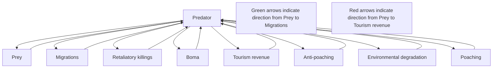

## 0.1 Background:

Since its creation in 1961, the Maasai Mara National Preserve has walked a fine line between preserving local flora and fauna, exploring its inherent touristic potential, and catering to the needs of the local Maasai population. Over time, the Kenyan government has advanced policy to attempt to ensure the preserve’s prosperity. This report explores the gamut of policies and management strategies plausibly available for Maasai Mara and presents an optimal solution set for implementation.

Our project is a four-part mission. We aim to (1) simulate the Maasai Mara as a dynamic system of interdependent processes across time, balancing the human and environmental factors. We will then (2) perturb model parameters that are within the scope of the Kenyan government and then (3) gauge the resulting long-term behavior changes of the model, thereby making explicit how policy changes affect the Maasai Mara ecosystem. Finally, we will (4) propose actionable policy and management recommendations based on this model, ranked by how much they contribute to total utility in the region. We will also comment on how extensible our model is to other wildlife preserves.

## 0.2 Methods:

We modelled 6 interdependent areas of the Maasai Mara preserve: prey, predators, tourism, environmental degradation, poaching, and retaliatory killings. The pairs of processes are grouped by thematic affinity. We modelled fauna interactions through a modified Lotka-Volterra system of predator and prey populations. We considered tourism and environmental degradation as macroscopic human influences on the preserve, adapting the minimum model from literature. Finally, localized human effects on fauna were represented by poaching of prey and retaliatory killings of predators, inspired from the Gordon-Schaefer bioeconomic model for fisheries to calculate the effects of poaching as a harvesting of a population.

To generate policy we created a utility function to estimate the social benefit of input parameters. The function calculates the long-term behavior of the Maasai Mara system as a function of select key parameters. We then used the L-BFGS-B algorithm to identify parameters that maximize social benefit. Our proposals then targeted each of the most influential parameters, ranked by parameter influence.

## 0.3 Results:

Our 6 function model was asymptotically stable, facilitating inference of long-term behavior by varying parameters. Out of the 26 parameters in our system, we qualitatively decided on 8 parameters that the Kenyan Tourism and Wildlife Committee could directly influence with government investment. Given a limited budget, the utility function showed that maximum social benefit was achieved by investing primarily in 5 of them, in this order: (1) anti-poaching law enforcement rate per tourists, (2-3) baseline investment in anti-poaching law enforcement, (2-3) baseline investment in the environment, (4) investment in the local population, and (5) opportunity cost of poaching. We developed 13 policies, each targeting specific parameters, and ranked them based on the parameters they modified. Long-term analysis of the system brings confidence in our recommendations.

## 0.4 Conclusion:

We propose a budget of KSh379 million, a 46% increase over the budget allocated to the preserve in fiscal year 2019 − 2020. According to our optimizations, we would see an equilibrium with 24% greater prey count, 78% greater predator count, lower environmental degradation by 19%, reduced retaliatory killings by 97%, and cut poaching rates by 50%, and increase tourism rate by 7.5%.

KEYWORDS: ODEs, utility function, long-term behavior, optimization, stability, Jacobian linearization.

# The Preservation Equation: A Mathematical Approach to Sustaining the Maasai Mara Preserve’s Ecosystem, Economy, and Communities

## Contents

1 Introduction 2  
2 Brief overview of our dynamic model 2  
3 Assumptions 3  
4 Building our dynamic model 5  
5 Final model 8  
6 Parameter Estimation 8  
7 Long-term Behavior of Solutions 11  
8 Policy 13  
9 Results 18  
10 Sensitivity analysis 18  
11 Solution and results 19  
12 Discussion 20  
13 Conclusion 21  
14 Appendix 21  
15 Report for the Kenyan Tourism and Wildlife Committee 22

## 1 Introduction

Over the last few decades, the Maasai Mara Natural Preserve has faced increasingly severe strains on its natural resources and threats to its existence. There is the challenge of growing tourism while keeping the practice sustainable. Then too, in addition to historical threats such as poaching, new threats like climate change have begun to contribute to the degradation of the Maasai Mara. Additionally, the Maasai people, whose population has exploded from less than 400,000 in 1989 to over 1.1 million today, are an increasingly numerous local stakeholder in the process.

Response to these threats has been varied. Since 2005, the Kenyan government has invested in various anti-poaching policies such as dog tracking units. In response to concerns expressed by the Maasai stakeholders themselves, the Kenyan government has created various so-called “Maasai conservancies” adjacent to the park. These conservancies are lands leased from the Mara people for sustainable economic exploration, like tourism. In addition, increased fortification of Maasai bomas (housing units for the Maasai, especially important to protect their cattle from predators) have served to reduce the incidence of revenge killings against species of predators that harass their cattle[7].

Given the government’s interest in the prosperity of the Maasai Mara, we wish to investigate what the optimal policies and management decisions for the preserve might be. To this end, we seek to develop a model for the preserve as a dynamic system that takes into consideration the behavior of predator-prey interactions, the tourism-environmental degradation interplay, and the effects on the local fauna resulting from retaliatory killings of predators by the Maasai and poaching of prey. Through this model, we can then predict the changes in the Maasai Mara that results from changes in our inputs, which can then inform policy recommendations for the preserve, and even be extended to other wildlife conservation efforts.

## 2 Brief overview of our dynamic model

Our model is a dynamic system that encompasses relationships between 6 key processes in the preserve, with their interdependence highlighted in Figure 1 on the next page. These processes are best understood by grouping them into 3 themes:

• Fauna population – Predators and Prey: Predator and prey populations are directly dependent on each other, but are also influenced externally: predators by retaliatory killings and tourism, and prey by poaching and migration.  
• Macroscopic Human Influence – Environmental Degradation and Tourism Revenue: Human presence in the Maasai Mara, overwhelmingly due to tourism, leads to negative large-scale ecosystem impact in the form of environmental degradation. Conversely, this touristic presence can also benefit populations in the area by generating revenue invested in stronger bomas and in preservation efforts.  
• Localized human effects on the fauna – Retaliatory Killings and Poaching: Local human action also has a measurable effect on the fauna population. Maasai cattle farmers often participate in revenge killings on predators that harass their bomas. Furthermore, many prey animals in the preserve have highly desirable items, making them the target of poaching efforts.

The black nodes in the graph of Figure 1 are all the time-dependent processes of the dynamic system. The nodes in orange may help conceptualize the flow of the model, but are not independently modelled processes themselves.

Green arrows mean that there exists a positive causal relationship from the origin node to the target node while red arrows mean a negative causal relationship. For example, we modelled that there is a green arrow from prey to poaching, meaning a growth in prey implies a growth in poaching. Similarly, there is a red arrow from poaching to prey, meaning a growth in poaching decreases the amount of prey.

flowchart

Figure 1: The dependencies of our model

Also, note that the word “boma” is a contextual term that describes a housing unit typical of the Maasai people, notable for protecting farmers’ cattle from predators. Interpreting this graph, we see that tourism revenue leads to greater investment in bomas (green arrow), which decreases retaliatory killings (red arrow) because predators will be less able to harass cattle, thereby decreasing the incidence of revenge killings.

## 3 Assumptions

In order to construct our model, we made various simplifying assumptions for the Maasai Mara itself, and for the interactions between each of the processes we modelled in the preservation, as follows:

## 3.1 Maasai Mara

M-1. Dynamical uniformity: We treat the Maasai Mara in its entirety as one dynamical system, rather than multiple systems interacting with each other. In reality, areas like the Mara Triangle (which is even administered by a different entity to the rest of the preserve) may present different dynamic patterns.  
M-2. Mara conservancies The Mara conservancies were all created in the 21st century as alternatives to the natural preserve. Our model does not consider the effect of these conservancies on poaching,

tourism, and environmental degradation, though it is likely they do have some effect, by diluting activity beyond just the preserve.

## 3.2 Fauna

F-1. Classifying fauna: Fauna will fit into two categories – predators and prey.  
F-2. Prey growth rate: The population of prey grows in a logistic fashion, limited by a baseline carrying capacity that is negatively affected by the incidence of environmental degradation. That is, greater degradation decreases the carrying capacity for prey.  
F-3. Predator growth rate: The predator growth rate is proportional to the population of prey. That is, an increase in the amount of prey will lead to predator population growth, as there is more food availability.  
F-4. Negative external influences on prey population: The prey population is hindered by predators and poaching, both of which are proportional to the current prey population.  
F-5. Migration rate: The outward migratory rate of prey is proportional to the environmental degradation. Inherent inward migratory rate is taken to be a positive constant. Because environmental degradation is assumed to be periodic, this makes migratory patterns periodic too. Predators are assumed not to follow migratory patterns, so their population is not affected by migration.  
F-6. Human influence on predators: The predator population is hindered by both retaliatory killings by the Maasai people and tourism, which are both proportional to the current predator population. More predators means a greater likelihood of attacks on farmers’ cattle, while greater tourist populations hinders normal activity of predators.

## 3.3 Tourism

T-1. Existence: Tourism is an intrinsic phenomenon. Regardless of the status of the preservation, there will be a non-zero level of tourism.  
T-2. Tourists do not like crowding: There is an inherent propensity for tourists to prefer less crowded and better maintained destinations, regulated by some “attractiveness” factor. So, few tourists in a destination will attract a proportionally larger amount of new tourists than a large amount.  
T-3. Environmental Degradation: The only factors that affect tourism are itself (more tourism makes a growth in tourism hard due to the aforementioned crowding) and environmental degradation, which has a negative effect. That is, the presence of poaching or retaliatory killings, and the relative health of fauna populations does not affect tourism.  
T-4. Uniform behavior: Variation in tourist background and behavior is not modelled; that is, all tourists are assumed to fall under the same bucket, instead of splitting them into luxury travellers, adventure travellers, etc. Their effects are thus also all identical at the individual level.

## 3.4 Environmental Degradation

E-1. Effect of Tourism: There is an inherent and proportional negative effect on the environment from the amount of tourists in the preserve.  
E-2. Investment in Sustainability: A portion of the revenue per tourist is invested in protecting the environment; however, the positive impact of this investment is strictly less than the negative impact of the average pollution per tourist. This way, tourism will maintain a net negative effect on the environment.  
E-3. Baseline investment: There is a baseline government investment in environmental preservation.  
E-4. Climate change: Climate change has a fixed positive effect on environmental degradation. In reality, this is a change we expect to increase over time, as global warming becomes worse, rather than a fixed constant.

## 3.5 Poaching

P-1. Delay factor: The change in poaching is regulated by a delay of information factor. That is, poachers respond to changes in fauna population with some delay.  
P-2. Focus of Poaching: Poaching only affects prey. Literature shows that poaching effect on prey is of a significantly higher magnitude than towards predators [7].  
P-3. textitBaseline investment in anti-poaching: There is a non-zero baseline government investment in anti-poaching measures.  
P-4. Per capita investment in anti-poaching: A portion of per-tourist income in diverted to anti-poaching law enforcement.  
P-5. Poaching Feedback loop: The change in poaching is affected by the current level of poaching, as seen in literature[16][9].

## 3.6 Retaliatory Killings

RK-1 Effect of Predators: The incidence of the practice is proportional to the number of predators.

RK-2 Bomas: A portion of tourism revenue is diverted to investment in the Mara people through the construction of stronger bomas, which reduces the rate of predator attacks on livestock and hence decreases the incidence of retaliatory killings.

RK-3 Focus of Retaliatory Killings: Retaliatory killings only affect predators.

## 4 Building our dynamic model

As components of a dynamic system evolving over time, the processes modelled can naturally be described as ordinary differential equations with respect to time. We created a system of 6 ordinary differential equations to encapsulate these relationships, with the first 2 (predator population and prey population) describing the fauna population, the next 2 (number of tourists and environmental degradation) describing the macroscopic human influence, and the final 2 (poaching likelihood and retaliatory killings likelihood)

describing the localized human effects on fauna. Below we elaborate on the model construction process, culminating in the 6 final equations.

Note that Table 1 describes all parameters in the equations.

## 4.1 Constructing the equations for fauna population

For our predator-prey interactions, we modified the esteemed Lotka-Volterra model, which is widely used to describe the dynamics of biological systems in which two populations interact with one as predator and one as prey [15]. Writing our two equations in the following way makes their relationship to Lotka-Volterra explicit:

$$
\frac {d \text {Prey}}{d t} = b \left(1 - \frac {\text {Prey}}{k - \eta \cdot \text {Degradation}}\right) \cdot \text {Prey} - h _ {0} \cdot \text {Predator} \cdot \text {Prey} - \alpha \cdot \text {Poaching} \cdot \text {Prey} + m _ {0} - m \cdot \text {Degradation}
$$

$$
\frac {d \text {Predator}}{d t} = h _ {1} \cdot \text {Prey} \cdot \text {Predator} - d \cdot \text {Predator} - (\beta \cdot \text {Retaliatory Killings} \cdot \text {Predator} + S \cdot \text {Tourism} \cdot \text {Predator})
$$

Here, the Lotka-Volterra model would be the truncation of these two equations to their first two terms[15]. The remaining terms in both equations represent external influences of our overall model on these equations.

In the prey model, our extra terms are ?? · Poaching · Prey and $m _ { 0 } - m$ · Degradation. The first term represents the negative effect of poaching on prey population size. This term is a ”harvest function”, in accordance with the Gordon-Schaefer model for population harvesting in fisheries, which is also widely used to model poaching patterns in a biological population system [12]. The final two terms model migration, where $m _ { 0 }$ is the baseline inward migration (positive effect) and ?? · Degradation is the outward migration rate modified by environmental degradation (negative effect).

In the predator model, our extra terms are $- \beta$ · Retaliatory Killings · Predator $- S$ · Tourism. Each of these terms represents a different effect, both negative (hence both are subtracted). The first one is the effect of Retaliatory Killings. According to literature, it is common for predators such as lions to attack Maasai cattle, provoking retaliatory killings of the predators[16]. The second term represents the sensitivity of predators to tourist distractions. This is an important consideration to make because tourist presence can indeed disrupt predator mating effectiveness, among other negative influences on their population levels[3]

We also made the baseline prey population behave logistically, to avoid a scenario where there are very few predators relative to prey and thus the predator population experiences unrealistically steep Malthusian growth. Here, following examples from literature, we have ?? the birth rate of prey, multiplied by a logistic growth equation with carrying capacity ??.[16]. We further chose to offset the carrying capacity by environmental degradation, as it seems reasonable that damages to the ecosystem would decrease its ability to sustain as many animals.

## 4.2 Constructing the equations for macroscopic human influence

$$
\frac {d \text {Tourism}}{d t} = - \delta \cdot \text {Degradation} + \frac {A}{\text {Tourism}}
$$

$$
\frac {d \text {Degradation}}{d t} = \left(P _ {t} - I _ {t}\right) \cdot \text {Tourism} - \left(E _ {r} + I _ {0}\right) + G
$$

The two equations that model tourism revenue and environmental degradation were inspired by the “minimal model” of tourism modelling, which is widely used in literature[11][6][17]. This model considers tourist numbers, environmental impact of the tourism, and the revenue generated from their activities. We focused on tourist numbers and environmental degradation.

At a glance, looking at the first term of either equation, it is clear that the derivative of tourist population is negatively related to environmental degradation. Similarly, the derivative of environmental degradation is positively related to tourism, barring the circumstance where ecological investment per tourist $\left( I _ { t } \right)$ outpaces pollution per tourist $( P _ { t }$ )(we assumed, however, that this is never the case). That is, the solutions to Tourism and Degradation will be nearly sinusoidal and balanced by each other.

Both equations also have additional terms, however, which encode other effects on their values.

Tourism contains $\frac { A } { \mathrm { T o u r i s m } }$ , which is a regulating factor meant to simulate the attractiveness of a destination that is under-visited. If the Tourism number is too small, this term grows dramatically in size, thus ensuring the equation’s sinusoidal behavior is less radical. Notably, $\frac { A } { \mathrm { T o u r i s m } } ~ < ~ A$ so ?? simultaneously represents an upper bound on the growth of tourism given a non-improving system.

Environmental degradation, on the other hand, includes $E _ { r } + I _ { 0 }$ and $G .$ . The $E _ { r } + I _ { 0 }$ terms represent the baseline recovery rate for the environment (the recovery rate without any outside help) and the baseline government investment in recovery. Thus, clearly both have a negative effect on degradation. ?? represents the effects of climate change, which augments environmental degradation independently of all other factors in the equation.

These two processes were specifically designed to have an inverse relationship as to simulate the yearly seasonal cycle with respect to both the quality of the environment and the amount of tourists. Data show that the peak of tourism tends to happen in the months of July and August, while from April to May is when the environment is naturally at its lushest due to the influence of the rainy season[10]. The feedback loop created in the equations follows a yearly cycle and the initial conditions, discussed later, have been altered to align these events with their real-world counterparts.

## 4.3 Constructing the equations for localized human effects on fauna

$$
\frac {d \text {Poaching}}{d t} = \gamma \left[ r _ {p} \text {Prey} - (\Omega + \sigma_ {p} (\lambda_ {0} + \lambda \cdot \text {Tourism})) \right] \cdot \text {Poaching}
$$

$$
\frac {d \text { Retaliatory   Killings }}{d t} = c \cdot \text { Predator } - B \cdot \text { Tourism }
$$

Poaching and retaliatory killings are thematically similar in that they both are negatively related to the fauna population. Specifically, poaching is related to prey population and retaliatory killings are related to the predator population. Note that these equations both yield the average poach or retaliatory kill propensity per day, not the overall number of attacks. The equation for poaching was modified from literature[9] and also draws inspiration from the “harvesting effort” described in the Gordon-Schaefer model[12], as the poaching equation represents the gains from poaching minus the costs, both monetary and otherwise.

The revenue from poaching is given by the term $r _ { p }$ ·Prey where $r _ { p }$ represents the profit per prey poached. Similarly, $\Omega + \sigma _ { p } ( \lambda _ { 0 } + \lambda$ · Tourism) can be thought of as a cost function for poaching. Its effects on poaching offset the revenue from all poaches cumulatively. Finally, this entire behavior is regulated by ??, which is seen in literature to represent the adaptability of poachers to fluctuations in incentive[9].

The total cost is $\Omega ,$ the opportunity cost of poaching (so the losses from poaching instead of some other activity) added to the overall law enforcement investment (both baseline and generated from tourism revenue) multiplied by $\sigma _ { p }$ , which represents some measure of the risk of poaching. So, we have the relative losses from poaching added to the product of the risk of the activity and law enforcement presence. Since $r _ { p }$ is the revenue per poach, $( r _ { p } \cdot \mathrm { P r e y } )$ is the potential monetary upswing from poaching. So, subtracting this cost function from that amount is an attempt to model the risk assessment of engaging in poaching activities.

As for the Retaliatory Killings equation, it is simply the rate of retaliatory killings per predator, ??, multiplied by the number of predators, making it positively related to the overall number of predators. An offsetting term is created from diverting another fraction of tourism income to boma construction, represented by ??, similar to other diversions to mitigating pollution and investing in law enforcement.

## 5 Final model

Uniting the six previous equations and simplifying the first two results in our dynamic model. All 6 functions are single-variable with respect to time, but we have omitted that time dependency in the system to avoid clutter. Furthermore, when running numerical simulations of the ODEs, we noticed that cycles lasted for approximately 150 units, so we added a damper to the variable ?? of $\frac { 2 } { 5 }$ to align each unit of time to one day. This does not impact any of the short or long-term behaviours of the system and was done to facilitate inference. Here is a list of the equations:

$$
\frac {d \text {Prey}}{d t} = \left[ b \left(1 - \frac {\text {Prey}}{k - \eta \cdot \text {Degradation}}\right) - h _ {0} \cdot \text {Predator} - \alpha \cdot \text {Poaching} \right] \cdot \text {Prey} + m _ {0} - m \cdot \text {Degradation} \tag {5.1}
$$

$$
\frac {d \text { Predator }}{d t} = \left[ h _ {1} \cdot \text { Prey } - d - \beta \cdot \text { Retaliatory   Killings } - S \cdot \text { Tourism } \right] \cdot \text { Predator } \tag {5.2}
$$

$$
\frac {d \text {Tourism}}{d t} = - \delta \cdot \text {Degradation} + \frac {A}{\text {Tourism}} \tag {5.3}
$$

$$
\frac {d \text { Degradation }}{d t} = \left(P _ {t} - I _ {t}\right) \cdot \text { Tourism } - \left(E _ {r} + I _ {0}\right) + G \tag {5.4}
$$

$$
\frac {d \text {Poaching}}{d t} = \gamma \left[ r _ {p} \text {Prey} - \left(\Omega + \sigma_ {p} \left(\lambda_ {0} + \lambda \cdot \text {Tourism}\right)\right) \right] \cdot \text {Poaching} \tag {5.5}
$$

$$
\frac {d \text { Retaliatory   Killings }}{d t} = c \cdot \text { Predator } - B \cdot \text { Tourism } \tag {5.6}
$$

Table 1 lists a summary of all variables used in this system of equations.

## 6 Parameter Estimation

There are a total of 26 different parameters in our model, as well as 6 starting conditions (when ?? = 0), one for each modelled process. Values for these parameters were found either from literature (in a peer-edited research paper), from data (in official data sets), or calculated (constructed from our model and assumptions), and are listed in tables 2 and 3.

## 6.1 Estimated from literature

The initial conditions for Prey, Predator, and Tourism were estimated from literature, with sources generally agreeing on a value of prey count in the low millions, predator count in the few thousands, and an annual tourist rate of about 300,000 visits to the Maasai Mara[7][9][16]. Furthermore, the initial conditions of Poaching and Retaliatory Killings, representing the effort towards poaching and retaliatory killings respectively, were chosen with literature in mind and modified to our model’s daily change in ?? as opposed to a yearly one[7][9].

Table 1: Variables used in the dynamic system with 6 equations

<table><tr><td>Equation</td><td>Variable</td><td>Definition</td></tr><tr><td rowspan="8">(4.1): Prey</td><td>Prey</td><td>Quantity of prey, in hundred-thousands</td></tr><tr><td>b</td><td>Birth rate</td></tr><tr><td>k</td><td>Carrying capacity</td></tr><tr><td>η</td><td>Effect of degradation on total resources</td></tr><tr><td>h0</td><td>Hunting effect on prey</td></tr><tr><td>α</td><td>Poaching effectiveness</td></tr><tr><td>m0</td><td>Baseline inwards migration</td></tr><tr><td>m</td><td>Outward migration damper due to degradation</td></tr><tr><td rowspan="5">(4.2): Predator</td><td>Predator</td><td>Quantity of predator, in thousands</td></tr><tr><td>h1</td><td>Conversion of prey biomass into predators</td></tr><tr><td>d</td><td>Death rate</td></tr><tr><td>β</td><td>Effectiveness of retaliatory killings</td></tr><tr><td>S</td><td>Sensitivity of predators to tourist distractions</td></tr><tr><td rowspan="3">(4.3): Tourism</td><td>Tourism</td><td>Tourist visits, in hundred-thousands</td></tr><tr><td>δ</td><td>Effect of degradation on tourism</td></tr><tr><td>A</td><td>Tourism saturation damper</td></tr><tr><td rowspan="6">(4.4): Environment</td><td>Degradation</td><td>Degradation relative to baseline</td></tr><tr><td>Er</td><td>Baseline recovery rate</td></tr><tr><td>I0</td><td>Baseline government investment</td></tr><tr><td>Pt</td><td>Average pollution per tourist</td></tr><tr><td>It</td><td>Investment in environment per tourist</td></tr><tr><td>G</td><td>Impact of climate change</td></tr><tr><td rowspan="7">(4.5): Poaching</td><td>Poaching</td><td>Unit of effort exerted by poachers</td></tr><tr><td>γ</td><td>Speed of poaching adjustment</td></tr><tr><td>rp</td><td>Revenue per poach</td></tr><tr><td>Ω</td><td>Opportunity cost of poaching</td></tr><tr><td>σp</td><td>Risk of poaching</td></tr><tr><td>λ0</td><td>Base law enforcement rate</td></tr><tr><td>λ</td><td>Investment in law enforcement per tourist</td></tr><tr><td rowspan="3">(4.6): Retaliation</td><td>Retaliatory Killings</td><td>Unit of effort exerted for retaliation</td></tr><tr><td>c</td><td>Rate of retaliatory killings per predator</td></tr><tr><td>B</td><td>Investment in strong bomas per tourist</td></tr></table>

Table 2: Baseline Values for Constants

<table><tr><td></td><td colspan="7">Prey</td><td colspan="4">Predator</td><td colspan="2">Tourism</td></tr><tr><td>Variables</td><td>b</td><td>k</td><td> $\eta$ </td><td> $h_0$ </td><td> $\alpha$ </td><td> $m_0$ </td><td>m</td><td> $h_1$ </td><td>d</td><td> $\beta$ </td><td>S</td><td> $\delta$ </td><td>A</td></tr><tr><td>Values</td><td>0.3</td><td>120</td><td>1</td><td>0.05</td><td>0.01</td><td>1.5</td><td>0.5</td><td>0.05</td><td>0.17</td><td>0.1</td><td>0.01</td><td>0.01</td><td>0.01</td></tr><tr><td></td><td colspan="5">Degradation</td><td colspan="6">Poaching</td><td colspan="2">Ret. Kill.</td></tr><tr><td>Variables</td><td> $E_r$ </td><td> $I_0$ </td><td> $P_t$ </td><td> $I_t$ </td><td>G</td><td> $\gamma$ </td><td> $r_p$ </td><td> $\Omega$ </td><td> $\sigma_p$ </td><td> $\lambda_0$ </td><td> $\lambda$ </td><td>c</td><td>B</td></tr><tr><td>Values</td><td>0.5</td><td>0.5</td><td>0.3</td><td>0.1</td><td>0.4</td><td>1</td><td>0.05</td><td>0.6</td><td>0.01</td><td>5</td><td>35</td><td>0.375</td><td>0.5</td></tr></table>

Table 3: Starting condition values

<table><tr><td>Processes Values</td><td>Prey 34</td><td>Predator 4</td><td>Tourism 3</td><td>Degradation 3</td><td>Poaching 1.3</td><td>Retaliatory killings 15</td></tr></table>

The birth rate ?? is taken by dividing the total number of calves born in a year by the total population of wildebeests and then extrapolated to all prey species[2][14].

The hunting effect on prey $h _ { 0 }$ and the conversion of prey biomass into predators $h _ { 1 }$ are a modification of values from literature[16]. Notably, our implementations of these values have been reduced significantly due to interpreting ?? as change in days rather than years and also include a term for migratory changes, thus reducing the necessity of modelling all increases in prey populations.

Our value for effectiveness of retaliatory killings $\beta ,$ and the investment in strong bomas ?? are taken from the literature with slight modifications[16].

The values for poaching effectiveness ??, speed of poaching adjustment $\gamma ,$ , revenue per poach $r _ { p } ,$ , opportunity cost of poaching $\Omega ,$ and for risk of poaching $\sigma _ { p }$ are taken with slight modification from the literature[9].

The parameter ?? was determined to be relevant from existing literature and the value is calculated relative to the units we chose to use for Prey and Tourism[8].

## 6.2 Estimated from data

For ??, which denotes the carrying capacity of the prey in the Maasai Mara ecosystem, we looked at the stable population of wildebeest in the Serengeti-Maasai Mara region and then divided by the proportion of the area of the Maasai Mara relative to the whole region[19].

??, which quantifies the sensitivity of the carrying capacity to environmental degradation, was obtained by observing the decline of the population of the wildebeest from 1980 to 2000 [4]. We arrived at a value of a 1% decrease per year.

To obtain a value for $m _ { 0 }$ , we obtained the value from data provided by National Geographic [13].

## 6.3 Calculated

The unit-less Degradation initial value was chosen to simulate the seasonal dynamics of the natural ecosystem combined with the seasonal effects of tourism[10].

We can calculate the value of ?? through the ODE for Tourism. Assuming our constant of integration is 0 for ease of calculation, we can find a relationship between Tourism and ?? at a moment in time, as

follows:

$$
\frac {d \text {Tourism}}{d t} \approx \frac {A}{\text {Tourism}} \implies \frac {\text {Tourism} ^ {2}}{2} \approx A t \implies \text {Tourism} \approx \sqrt {2 A t}
$$

Which we then set to be around $1 0 ^ { - 2 }$ to fit existing upwards tourism trends in Kenya. This value is unbounded, but grows at such a pace that it does not become an issue in the model.

The remaining values, for ??, $S , E _ { r } , I _ { 0 } , P _ { t } , I _ { t } , G , \lambda _ { 0 } , \lambda , C$ and $\sigma _ { p } .$ , were created based on subjective estimations, informed by the literature. [9][7][10][8]. Overall we found the model to not be immensely sensitive to these estimations, and we suggest changing the levels of $I _ { 0 } , P _ { t } , I _ { t } , { \lambda } _ { 0 } $ , and ?? during our later analysis.

## 6.4 Model Illustration and Analysis

line chart

| Time (days) | Degradation | Predator | RetaliatoryKilling | Poaching | Prey | Tourism |
|-------------|-------------|----------|--------------------|----------|------|---------|
| 0           | 3           | 4        | 13                 | 3        | 30   | 3       |
| 100         | 2           | 4        | 13                 | 14       | 30   | 3       |
| 200         | -1          | 4        | 13                 | 8        | 30   | 3       |
| 300         | 1           | 4        | 13                 | 2        | 30   | 3       |
| 400         | 2           | 4        | 15                 | 16       | 32   | 3       |
| 500         | -1          | 4        | 13                 | 8        | 26   | 3       |
| 600         | 1           | 4        | 13                 | 7        | 30   | 3       |
| 700         | 3           | 4        | 13                 | 1        | 31   | 3       |

Figure 2: Baseline model behaviour

Using these baseline constants, we can simulate the model using numerical methods and observe what sort of trends appear. In Figure 2 a clear cyclical nature emerges, reflecting the real world cyclical nature of the Maasai Mara ecosystem. Some things to note should be the discrepancy in units; the predator variable is measured in hundred-thousands, while prey variables are measured thousands of animals. Tourism is measured in 100,000 tourists per year, so about 273 unique new tourists per day. Poaching, retaliatory killings and environmental degradation are abstracted variables. It is important to remember that one unit increase in poaching will not cause a one unit decrease in prey since both have been modelled on different scales. Instead, a one unit decrease in poaching will be multiplied by ?? · Prey and then this product will be subtracted from the derivative of prey. This explains why the variation in predators, prey, poaching, and retaliatory killing lines in Figure 2 are of different magnitude. Similarly, the magnitude of environmental degradation has been enhanced so that it is noticeable.

## 7 Long-term Behavior of Solutions

To propose adequate policy, knowledge of how the parameters affect the long-term behavior of the system is vital.

## 7.1 Existence of Equilibria Solutions

The model has the following non-trivial nullclines, obtained by setting each differential equation equal to zero and solving for each value in terms of the constants:

$$
\mathrm{Tourism} = \frac {E _ {r} + I _ {0} - G}{P _ {t} - I _ {t}}
$$

Since most other nullclines can be expressed as a function of this value of tourism, let $\begin{array} { r } { \tau = \frac { E _ { r } + I _ { 0 } - G } { P _ { t } - I _ { t } } } \end{array}$ ???? +??0−?? . We can then obtain the following nullclines:

$$
\text {Predator} = \frac {B}{C} \tau (= \mu) \quad \text {Deg} = \frac {A}{\delta} \tau (= \omega) \quad \text {Prey} = \frac {1}{r _ {p}} (\Omega + \sigma_ {p} (\lambda_ {0} + \lambda \tau)) (= \pi)
$$

To find our nullclines for Poaching and Revenge Killing, let ?? equal the above value for Prey, let ?? equal the above value of Pred, and let ?? equal the above value for Deg. We then obtain the nullcines as follows:

$$
\text { Revenge   Killings } = \frac {h _ {1} \pi - S \tau - d}{\beta} (= v)
$$

$$
\mathrm{Poaching} = \frac {1}{\alpha} \left(b \left(1 - \frac {\pi}{k - \eta \omega}\right) - h _ {o} \mu\right) + \frac {1}{\alpha \pi} (m _ {0} - m \omega) (= \phi)
$$

For future simplicity, allow the value of the Poaching nullcline to equal ??. Also, allow the value for the Revenge Killings nullcline obtained above to equal ??. There is a point in which all non-trivial nullclines intersect, allowing us to determine a non-trivial equilibrium point, where the dimensions are listed in the order (Prey, Predator, Tourism, Degradation, Poaching, Retaliatory Killings).

$$
\left(\frac {\Omega + \sigma_ {p} \lambda_ {0}}{r _ {p}} + \frac {\sigma_ {p} \lambda}{r _ {p}} \tau , \frac {B}{c} \tau , \frac {E _ {r} + I _ {0} - G}{P _ {t} - I _ {t}}, \frac {A}{\delta \tau}, \frac {b - \frac {b \pi}{k - \eta \omega} - h _ {0} \mu + m _ {0} + m \omega}{\alpha \pi}, \frac {h _ {1} \pi - S \tau - d}{\beta}\right) \tag {7.1}
$$

Note that the third coordinate stated in equation 7.1, representing the equilibrium coordinate of tourism at the point introduced, is written purely as a sum and quotient of the constant coefficient variables from the model which are held constant. This equilibrium point is very useful, as it allows us to linearize the system by calculating the Jacobian at this point.

## 7.2 Eigenvalue Analysis of the Jacobian

To find the long-term behaviour of the solutions, we need to find the eigenvalues of the Jacobian of the system at the relevant equilibrium point[15]. We continue to use ??, ??, ??, ?? and $\phi$ from above. To present the Jacobian in a simpler manner, we have designated ??, Π, and ?? as the following equations:

$$
T = b - \frac {2 \pi}{k - \eta \omega} - h _ {0} \mu - \alpha \phi , \qquad \Pi = h _ {1} \pi - d - \beta \upsilon - S \tau , \qquad M = \gamma r _ {p} \pi - \gamma (\Omega + \sigma_ {p} \lambda_ {0}) - \gamma \sigma_ {p} \lambda \tau
$$

The resulting matrix is our Jacobian:

$$
J _ {\mathrm{eq}} = \left[ \begin{array}{c c c c c c} \mathbf {T} & - h _ {0} \pi & 0 & \frac {\eta \pi^ {2}}{(k - \eta \omega) ^ {2}} - m & - \alpha \pi & 0 \\ h _ {1} \mu & \boldsymbol {\Pi} & - S \mu & 0 & 0 & - \beta \mu \\ 0 & 0 & - \frac {A}{\tau^ {2}} & - \delta & 0 & 0 \\ 0 & 0 & P _ {t} - I _ {t} & 0 & 0 & 0 \\ \gamma r _ {p} \phi & 0 & - \gamma r _ {p} \lambda \phi & 0 & \mathbf {M} & 0 \\ 0 & c & - B & 0 & 0 & 0 \end{array} \right] \tag {7.2}
$$

We can then compute the eigenvalues through software to determine the long-term behavior of the solutions, see Appendix 14 for code. Using the values from Table 2, all six eigenvalues of the Jacobian calculated at the non-trivial equilibrium point all indicate asymptotic stability - the real part of all eigenvalues are negative.

line chart

| Time (days) | Degradation | Predator | RetaliatoryKilling | Poaching | Prey | Tourism |
|-------------|-------------|----------|--------------------|----------|------|---------|
| 0e+00       | ~0          | ~0       | ~15                | ~5       | ~35  | ~0      |
| 2e+05       | ~0          | ~0       | ~15                | ~5       | ~35  | ~0      |
| 4e+05       | ~0          | ~0       | ~15                | ~5       | ~35  | ~0      |
| 6e+05       | ~0          | ~0       | ~15                | ~5       | ~35  | ~0      |
| 7e+05       | ~0          | ~0       | ~15                | ~5       | ~35  | ~0      |

Figure 3: Long-term model behavior

This matches our simulation results, seen in Figure 3. As we increase time to an arbitrarily large value, the six variables seem to converge to stable values as long as the initial values are all positive.

Observing Figure 4 we see that the behavior of the system spirals inwards towards the equilibrium point, analogous to the behaviour of a spiral sink in a 2-dimensional system of linear equations. This provides computational confirmation to the asymptotic equilibrium calculations.

## 8 Policy

To provide useful policy recommendations, we need to identify which constant coefficients the government is able to directly influence and measure their impact on the different areas of the Maasai Mara preserve. To make rational policy we decided to construct a utility function ?? which takes these constants as input variables. We then maximize utility within a reasonable domain and interpret what these results tell us. The last step of policy suggestion is to then combine the objective utility analysis with a subjective analysis of the non-modeled consequences of these policy.

contour plot

| Prey | Predator | Poaching | time |
| --- | --- | --- | --- |
| 27 | 2.5 | 2 | 0 |
| 28 | 3.0 | 4 | 1000 |
| 29 | 3.5 | 6 | 2000 |
| 30 | 4.0 | 8 | 3000 |
| 31 | 4.5 | 10 | 4000 |
| 32 | 5.0 | 12 | 5000 |
| 33 | 5.5 | 14 | 4000 |
| 34 | 6.0 | 16 | 3000 |
| 35 | 6.5 | 14 | 2000 |
| 36 | 7.0 | 12 | 1000 |
| 37 | 7.5 | 10 | 500 |
| 38 | 8.0 | 8 | 200 |
| 39 | 8.5 | 6 | 100 |
| 40 | 9.0 | 4 | 50 |
| 41 | 9.5 | 2 | 20 |
| 42 | 10.0 | 4 | 10 |
| 43 | 10.5 | 6 | 5 |
| 44 | 11.0 | 8 | 2 |
| 45 | 11.5 | 10 | 1 |
| 46 | 12.0 | 12 | 5 |
| 47 | 12.5 | 14 | 2 |
| 48 | 13.0 | 16 | 1 |
| 49 | 13.5 | 14 | 5 |
| 50 | 14.0 | 12 | 2 |
| 51 | 14.5 | 10 | 1 |
| 52 | 15.0 | 8 | 5 |
| 53 | 15.5 | 6 | 2 |
| 54 | 16.0 | 4 | 1 |

Figure 4: Long-term behavior of the prey, predator, and poaching interactions

## 8.1 Parameter Effects

To formulate policy, we identified 8 model parameters that government policy is able to influence. These are: $A , I _ { 0 } , P _ { t } , I _ { t } , \lambda _ { 0 } , \lambda , B .$ , and Ω, see Table 1 for descriptions and Table 2 for the baseline values we chose. Observing the coordinates of the equilibrium point 7.1, we immediately notice that all 8 parameters play a role in determining the location of the equilibrium, emphasising their importance.

We begin with the policy parameters that are present in the tourism nullcline, as the effect of tourism cause a domino effect which changes every other aspect of the model, seen in 1. The parameters $I _ { 0 }$ (baseline investment), $P _ { t }$ (pollution per tourist), and $I _ { t }$ (investment per tourist) are present in the Tourism nullcline and in our variable ??, so they are natural first candidates to examine. However, since $P _ { t } - I _ { t }$ represent a balance, we will only graph $P _ { t }$ vs $I _ { 0 } ,$ , and we note that an increase in $P _ { t }$ is analogous to a decrease in $I _ { t } ,$ , and vice versa.

line chart

| P_t | Time Range | Tourism Level |
| --- | --- | --- |
| 0.25 | 0 - 100000 | 1.5 - 3.5 |
| 0.25 | 100000 - 25000 | 1.5 - 3.5 |
| 0.25 | 25000 - 50000 | 1.5 - 3.5 |
| 0.25 | 5000 - 75000 | 1.5 - 3.5 |
| 0.25 | 7500 - 100000 | 1.5 - 3.5 |
| 0.3 | 0 - 100000 | 1.5 - 3.5 |
| 0.3 | 100000 - 25000 | 1.5 - 3.5 |
| 0.3 | 25000 - 50000 | 1.5 - 3.5 |
| 0.3 | 5000 - 75000 | 1.5 - 3.5 |
| 0.3 | 7500 - 100000 | 1.5 - 3.5 |
| 0.35 | 0 - 100000 | 1.5 - 3.5 |
| 0.35 | 100000 - 25000 | 1.5 - 3.5 |
| 0.35 | 25000 - 50000 | 1.5 - 3.5 |
| 0.35 | 5000 - 75000 | 1.5 - 3.5 |
| 0.35 | 7500 - 100000 | 1.5 - 3.5 |
| I_0: | ~12562 | ~1.8 |
| I_0: | ~22882 | ~2.2 |
| I_0: | ~39644 | ~2.6 |
| I_0: | ~67486 | ~2.8 |
| I_0: | ~96768 | ~2.8 |
| I_0: | ~127488 | ~2.8 |
| I_0: | ~168776 | ~2.8 |
| I_0: | ~219998 | ~2.8 |
| I_0: | ~271998 | ~2.8 |
| I_0: | ~334998 | ~2.8 |
| I_0: | ~447998 | ~2.8 |
| I_0: | ~679998 | ~2.8 |
| I_0: | ~944998 | ~2.8 |
| I_0: | ~1299998 | ~2.8 |
| I_O: | ~1644998 | ~2.8 |
| I_O: | ~2294998 | ~2.8 |
| I_O: | ~2994998 | ~2.8 |
| I_O: | ~4494998 | ~2.8 |
| I_O: | ~6449998 | ~2.8 |
| I_O: | ~8449998 | ~2.8 |
| I_O: | ~11449998 | ~2.8 |
| I_O: | ~14449998 | ~2.8 |
| I_O: | ~17449998 | ~2.8 |
| I_O: | ~21449998 | ~2.8 |
| I_O: | ~24449998 | ~2.8 |
| I_O: | ~27449998 | ~2.8 |
| I_O: | ~31449998 | ~2.8 |
| I_O: | ~34449998 | ~2.8 |
| I_O: | ~37449998 | ~2.8 |
| I_O: | ~41449998 | ~2.8 |
| I_O: | ~44499998 | ~2.8 |
| I_O: | ~64499998 | ~2.8 |
| I_O: | ~84499998 | ~2.8 |
| I_O: | ~114499998 | ~2.8 |
| I_O: | ~144499998 | ~2.8 |
| I_O: | ~174499998 | ~2.8 |
| I_O: | ~214499998 | ~2.8 |
| I_O: | ~244499998 | ~2.8 |
| I_O: | ~274499998 | ~2.8 |
| I_O: | ~314499998 | ~2.8 |
| I_O: | ~344499998 | ~2.8 |
| I_O: | ~374499998 | ~2.8 |
| I_O: | ~67477777777777777 | ~2.8 |
| I_O: | ~87777777777777777 | ~2.8 |
| I_O: | ~117777777777777776 | ~2.8 |
| I_O: | ~147777777777777775 | ~2.8 |
| I_O: | ~177777777777777774 | ~2.8 |
| I_O: | ~217777777777777773 | ~2.8 |
| I_O: | ~247777777777777772 | ~2.8 |
| I_O: | ~317777777777777766 | ~2.8 |
| I_O: | ~447777777777777665 | ~2.8 |
| I_O: | ~637777777777776663 | ~2.8 |
| I_O: | ~837777777777766662 | ~2.8 |
| I_O: | ~113777777777766663 | ~2.8 |
| I_O: | ~1337T | ~2.8 |
| I_O: | ~163T | ~2.8 |
| I_O: | >16T | <2.8 |
| I_O: | >16T | <2.6 |
| I_O: | >16T | <2.4 |
| I_O: | >16T | <2.2 |
| I_O: | >16T | <2.1 |
| I_O: | >16T | <2.1 |
| I_O: | >16T | <2.1 |
| I_O: | >16T | <2.1 |
| I_O: | >16T | <2.1 |
| I_O: | >16T | <2.1 |
| I_O: | >16T | <2.1 |
| I_O: | >16T | <2.1 |
| I_O: | >16T | <2.1 |
| I_O: | >16T | <2.1 |
| I_O: | >16T | <2.1 |
| I_O: | >16T | <$2.1 |
| I_O: | >16T | <$2.1 |
| I_O: | >16T | <$2.1 |
| I_O: | >16T | <$2.1 |
| I_O: | >16T | <$2.1 |
| I_O: | >16T | <$2.1 |
| I_O: | >1E | $3$ |
| I_O: | >I | $3$ |
| I_O: | >I | $3$ |
| I_O: | >I | $3$ |
| I_O: | >I | $3$ |
| I_O: | >I | $3$ |
| I_O: | >I | $3$ |
| I_O: | >I | $3$ |
| I_O | $3$ | $3$ |
| I_O | $3$ | $3$ |
| I_O | $3$ | $3$ |
| I_O | $3$ | $3$ |
| I_O | $3$ | $3$ |
| I_O | $3$ | $3$ |
| I_O | $3$ | $3$ |
| I_O | $3$ | $3$ |
| I_O | $3$ | $3$ |
| I_O | $3$ | $3$ |
| I_O | $3$ | $3$ |
| I_O | $3$ | $3$ |
| I_O | $3$ | $3$ |
| I_O | $3$ | $3$ (with label) |

Figure 5: Effect of varying $I _ { 0 }$ and $P _ { t }$ on the equilibrium

As seen in Figure 5, varying the values of $P _ { t }$ and $I _ { 0 }$ have a significant effect on the nullcline of Tourism. As $P _ { t }$ increases, the equilibrium of Tourism decreases significantly with only minor changes in the value, implying a negative correlation between the two values. Similarly, as $I _ { t }$ increases, the equilibrium of Tourism increases significantly, implying a positive correlation between the two values. As $I _ { 0 }$ increases in our model, the equilibrium point for Tourism shifts upwards, implying a positive correlation between the two values. Notably, variation of $P _ { t }$ has a much greater effect the equilibrium value than $I _ { 0 }$ .

line chart

| Time | lambda_0: 1 - Poaching | lambda_0: 1 - Prey | lambda_0: 15 - Poaching | lambda_0: 15 - Prey | lambda_0: 15 - Prey | lambda_0: 39 - Poaching | lambda_0: 39 - Prey |
| --- | --- | --- | --- | --- | --- | --- | --- |
| 0 | ~60 | ~30 | ~40 | ~25 | ~35 | ~35 | ~35 |
| 100 | ~60 | ~30 | ~40 | ~25 | ~35 | ~35 | ~35 |
| 200 | ~30 | ~20 | ~25 | ~20 | ~25 | ~25 | ~25 |
| 300 | ~20 | ~15 | ~20 | ~15 | ~20 | ~20 | ~20 |
| 400 | ~25 | ~15 | ~25 | ~15 | ~25 | ~25 | ~25 |
| 500 | ~20 | ~15 | ~20 | ~15 | ~20 | ~20 | ~20 |
| 600 | ~15 | ~15 | ~15 | ~15 | ~15 | ~15 | ~15 |
| 700 | ~10 | ~15 | ~10 | ~15 | ~15 | ~15 | ~15 |
| 800 | ~10 | ~15 | ~10 | ~15 | ~15 | ~15 | ~15 |
| 900 | ~10 | ~15 | ~10 | ~15 | ~15 | ~15 | ~15 |
| 1000 | ~10 | ~15 | ~10 | ~15 | ~15 | ~15 | ~15 |
| 1100 | ~10 | ~15 | ~10 | ~15 | ~15 | ~15 | ~15 |
| 1200 | ~10 | ~15 | ~10 | ~15 | ~15 | ~15 | ~15 |
| 1300 | ~10 | ~15 | ~10 | ~15 | ~15 | ~15 | ~15 |
| 1400 | ~10 | ~15 | ~10 | ~15 | ~15 | ~15 | ~15 |
| 1500 | ~10 | ~15 | ~10 | ~15 | ~15 | ~15 | ~15 |
| 1600 | ~10 | ~15 | ~10 | ~15 | ~15 | ~15 | ~15 |
| 1700 | ~10 | ~15 | ~10 | ~15 | ~15 | ~15 | ~15 |
| 1800 | ~10 | ~15 | ~10 | ~15 | ~15 | ~15 | ~15 |
| 1900 | ~10 | ~15 | ~10 | ~15 | ~15 | ~15 | ~15 |
| 2000 | ~10 | ~15 | ~10 | ~15 | ~15 | ~15 | ~15 |
| 2100 | ~10 | ~15 | ~10 | ~15 | ~15 | ~15 | ~15 |
| 2200 | ~10 | ~15 | ~10 | ~15 | ~15 | ~15 | ~15 |
| 2300 | ~10 | ~15 | ~10 | ~15 | ~15 | ~15 | ~15 |
| 2400 | ~10 | ~15 | ~10 | ~15 | ~15 | ~15 | ~15 |
| 2500 | ~10 | ~15 | ~10 | ~15 | ~15 | ~15 | ~15 |
| 2600 | ~10 | ~15 | ~10 | ~15 | ~15 | ~15 | ~15 |
| 2700 | ~10 | ~15 | ~10 | ~15 | ~15 | ~15 | ~15 |
| 2800 | ~10 | ~15 | ~10 | ~15 | ~15 | ~15 | ~15 |
| 2900 | ~10 | ~15 | ~10 | ~15 | ~15 | ~15 | ~15 |
| 3000+ | ~60 | ~30 | ~6 | ~3 | ~3 | ~6 | ~3 |

Figure 6: Effect of varying $\lambda _ { 0 }$ and ?? on the equilibrium

Next, we can analyze the effects that changes in base law enforcement rate $\lambda _ { 0 }$ and the law enforcement rate per tourist ?? have on our equilibrium solution for both Prey and Poaching, as seen in Figure 6. Increasing $\lambda _ { 0 }$ has the effect of increasing the stability of our solution and shifting our Prey solution upwards and our Poaching solution downwards, as expected. ?? also has a similar effect, but with much greater effect. In fact, in the bottom scenarios, large increase in ?? leads to a drastic decrease in poaching and a drastic increase in Prey. Notably, the effect of increasing ?? on our solutions is much greater than the effect of increasing $\lambda _ { 0 }$ .

Finally, we can analyze the effects of changing ?? and ??, which represent the tourism saturation damper and the strength of bomas, respectively, as seen in Figure 7. Notably, varying ?? does not seem to have a noticeable effect on the equilibrium solutions, since the graphs do not vary vertically. On the other hand, ?? has a significant effect on both stability of the system and the equilibrium solutions for Predator, Retaliatory Killings, and Tourism. Namely, as B increases, the average rate of retaliatory killings drops significantly indicating a negative relationship, while the equilibrium population of predators sees a marked increase, indicating a positive relationship. Tourism remains unchanged.

## 8.2 Utility function

The utility function ?? takes as input the 8 parameters we mentioned in Section 8.1, calculates the longterm behavior of the system, calculates a the cost of implementing these parameters based off of a set of pre-determined weights, then returns an arbitrary ’social benefit’ weighing the impacts on the fauna, tourism, the environment, poaching, the interests of the Maasai population, and the implementation cost. Policy construction is a subjective field and by balancing the weights we can change the emphasis of different areas within the preserve. The way we measure long-term behavior will be through analysing the values of our six main variables at the equilibrium point seen in equation 7.1. Let $\mathrm { P r e y } _ { e q }$ represent the value of the Prey variable at the equilibrium, extrapolating to the other five main variables we get the vector ${ \vec { Y } } .$ We then represent the weights as ??® and the 8 influential parameters as ${ \vec { X } } .$ It is vital to note that the values of $\vec { Y }$ depend on the values of $\vec { X }$ since the equilibrium point is affected by the values in $\vec { X }$ .

line chart

| Time | Predator (B: 0.25) | RetaliatoryKilling (B: 0.25) | Tourism (B: 0.25) | Predator (B: 0.5) | RetaliatoryKilling (B: 0.5) | Tourism (B: 0.5) | Predator (B: 0.75) | RetaliatoryKilling (B: 0.75) | Tourism (B: 0.75) |
|------|---------------------|------------------------------|------------------|-------------------|-----------------------------|-----------------|--------------------|------------------------------|-----------------|
| 0    | ~3                  | ~18                          | ~4               | ~4                | ~15                         | ~3              | ~5                 | ~15                          | ~3              |
| 250  | ~4                  | ~16                          | ~3               | ~4                | ~14                         | ~3              | ~6                 | ~14                          | ~3              |
| 500  | ~3                  | ~17                          | ~4               | ~4                | ~15                         | ~3              | ~6                 | ~15                          | ~3              |
| 750  | ~4                  | ~16                          | ~3               | ~4                | ~14                         | ~3              | ~6                 | ~14                          | ~3              |
| 1000 | ~3                  | ~17                          | ~4               | ~4                | ~15                         | ~3              | ~6                 | ~15                          | ~3              |
| 1250 | ~4                  | ~18                          | ~3               | ~4                | ~16                         | ~3              | ~6                 | ~16                          | ~3              |

Figure 7: Effect of varying ?? and ?? on the equilibrium

$$
\vec {X} = \left[ \begin{array}{c} A \\ I _ {0} \\ \vdots \\ \Omega \end{array} \right], \qquad \vec {Y} = \left[ \begin{array}{c} \text {Prey} _ {e q} \\ \text {Predators} _ {e q} \\ \vdots \\ \text {Retaliatory Killings} _ {e q} \end{array} \right], \qquad \vec {w} = \left[ \begin{array}{c} w _ {0} \\ w _ {1} \\ \vdots \\ w _ {5} \end{array} \right]
$$

We may then construct the utility function ?? which takes $\vec { X }$ as input

$$
U (\vec {X}) = \vec {Y} \cdot \vec {w} - C o s t (\vec {X}), \qquad C o s t (\vec {X}) \approx c (\vec {X} \cdot \vec {X})
$$

Where ???????? represents the cost of implementing these policies and ?? is a weight. We chose to model cost quadratically, with some slight alterations due to the different magnitude of variables, to simulate diminishing returns, but similar results were seen when modelling costs exponentially. We then implement these functions in software, see Appendix 14 for code.

## 8.3 Policy Generation

To generate policy suggestions, we need to report on optimum allocation of resources into each of the 8 parameters. Optimum allocations arises from maximizing the utility function, which was done by implementing a “limited memory quasi-Newton algorithm for solving large nonlinear optimization problems with simple bounds on the variables” referred to as L-BFGS-B[5]. This algorithm is vital for our problem due to the boundary constraints of our variables.

Determining the weight vector ??® is a subjective activity. We chose to heavily prioritise prey, predator, and tourist count by weighing $w _ { 0 } = 1 0 ^ { 6 } , w _ { 1 } = 1 0 ^ { 3 }$ , and $w _ { 2 } = 1 0 ^ { 6 }$ , effectively turning the sum of these terms into an estimation of the total fauna population of the Maasai Mara and total yearly tourist count. Poaching was given a weight of $w _ { 3 } = 0$ to discourage it, and retaliatory killings were given a large negative weight of $w _ { 4 } = - 1 0 ^ { 3 }$ since they are a proxy to represent the attack of predators on Maasai livestock and one of our key considerations are the needs of the Maasai population. Environmental degradation has arbitrary units and fluctuates with tourism, so was given a similar weight. Finally, we looked at the current government budget and estimated the total amount of KSh invested into the Maasai Mara to determine $c = 5 \cdot 1 0 ^ { 5 }$ .

Table 4: Utility function output

<table><tr><td>Parameters</td><td> $A$ </td><td> $I_0$ </td><td> $P_t - I_t$ </td><td> $\lambda$ </td><td> $\lambda_0$ </td><td> $B$ </td><td> $\Omega$ </td><td>Total Investment</td></tr><tr><td>Values</td><td>0.01</td><td>8.71</td><td>0.01</td><td>27.1</td><td>8.71</td><td>1.19</td><td>0.950</td><td>...</td></tr><tr><td>Cost (KSh)</td><td>100k</td><td>87.1m</td><td>100k</td><td>271m</td><td>87.1m</td><td>11.9m</td><td>9.50m</td><td>~KSh379 million</td></tr></table>

Based on Table 4, by far the most important parameter to invest in is ??, (the unit investment in antipoaching measures per 100 thousand tourists). $I _ { 0 }$ (baseline government investment) and $\lambda _ { 0 }$ (base law enforcement rate) are the next most important parameters to invest in, following by ?? (boma strength) and Ω (opportunity cost) as the third priority. Finally, we have the balance $P _ { t } - I _ { t }$ and ??. Investing in increasing the opportunity cost of poaching is rather abstract, but we interpreted this as bolstering the local economy such that potential future poachers decide to adopt civilian professions instead.

One immediately notices that the estimated investment cost across parameters is just the value of the parameter multiplied by the weight ??. This is a current flaw of the model which has a general cost weight instead of one per parameter.

## 8.4 Subjective Policy

Based on the results from the utility function, it is apparent that ?? and $P _ { t } - I _ { t }$ were only allocated a modicum of investment, and thus, given a limited budget, shifting their values does not increase utility relatively much. Therefore, we have decided not to consider policy that specifically tackles those parameters, focusing instead on the others, ordered from largest to smallest budget allocations:

1. ??: (Anti-poaching law enforcement rate per tourists)

(a) Diverting a portion of tourism revenue to the purchasing of anti-poaching equipment.  
(b) Implement a large donation campaign for the training and deployment of an anti-poaching force and advertise it among tourist areas.  
(c) Require tourist establishments that operate within the preserve to provide CCTV footage of the areas around their lodging to the anti-poaching force.

2. ??0: (Baseline investment in anti-poaching law enforcement)

(a) Increased investment in transportation infrastructure for rangers to intercept poachers, including the gravelling of roads and airstrips.  
(b) Establish training programs in anti-poaching practices for rangers to specialize in.

(c) Establish lodging specific for anti-poachers close to the preserve.

3. $I _ { 0 } { \mathrm { : } }$ (Baseline investment in the environment)

(a) Increased investment in environment protecting infrastructure, including dams, solar panels, and the Maasai Stoves & Solar initiative.  
(b) Incentivize the development of eco-friendly infrastructure in tourist establishments.

4. ??: (Investment in the local population)

(a) Directly fund the identification and strengthening of the bomas most vulnerable to predators.  
(b) Promote open-air markets for families to have better access to high-quality construction material.  
(c) Invest in the existing Maasai Stove & Solar initiative.

5. Ω (Opportunity cost of poaching)

(a) Plan the transformation of Narok Town into a resort city through infrastructure, branding, and development incentive policy for investors.  
(b) Open trade schools and apprenticeship programs for technical professions in the region.  
(c) Highlight the national importance of the preserve through cultural festivals.

## 9 Results

According to the optimization conducted in Section 8.3, we would suggeset the optimal investments seen in Table 4. Comparing a model with the original coefficients we determined in Table 2 to ones with the optimal coefficients lead to and equilibrium point with 24% greater prey count, 78% greater predator count, lower environmental degradation by 19%, reduce retaliatory killings by 97%, and cut poaching rates by 50%, and increase the average yearly expected tourists by 7.5%. See code in Appendix 14 for how these numbers were derived.

## 10 Sensitivity analysis

To have confidence in our mathematical model we must show its robustness through sensitivity analysis. We conducted a One-At-a-Time (OAT) sensitivity analysis on the input parameters for the model. We perturbed each variable throughout their maximum range and then calculating the eigenvalues of the Jacobian at the non-trivial equilibrium point discussed in 7.2. This provides insight on how each variable affects the long-term behaviour of the system. See Appendix 14 for code.

Iterating over each of the parameters individually reveals that adjusting the majority of the parameters does not change the classification of the equilibrium point. The exceptions are $I _ { t } , P _ { t }$ and ??, which require $I _ { t } < P _ { t }$ and $m < 5 3 . 7 7$ . Breaking these rules causes an unstable equilibrium. The first condition, $I _ { t } < P _ { t } ,$ is part of our assumptions. The restriction on ?? is due to the fact that excessive migrations will cause the system to go over the logistic limit of growth we had as an assumption.

## 11 Solution and results

## 11.1 Generalizing to other wildlife management areas

Our model can be reasonably generalized to other wildlife preservations simply by modifying parameters to the new context, with some considerations in mind:

1. The environment we are modelling is a relatively small, somewhat homogeneous preserve, allowing us to treat the entire area as one cell. For larger, more variable preserves, it may be necessary to split the location up into smaller cells and then model each one individually.  
2. Our model considers the effects of adjacency to a large, autonomous local population, by modelling revenge killings and boma investments. These phenomenon, however, are unique to the Maasai Mara, so any generalization would require modification. For example, in other preserves, our term for boma strength, which is directly proportional to the investment into the local populace, could be replaced by a direct investment in the local populace term. Similarly, the term for revenge killings can be replaced by a term that details the effects of poaching on predators.  
3. The Maasai Mara budget is limited by the funds of the Narok County local government, which is quite low. Meanwhile, in places with much higher budgets, new technologies or ideas can be plausibly explored which change how efficiently government investment is used. As such, modeling any such wildlife preserve would require rethinking how exactly government investment affects the different players.  
4. The makeup of the flora and the fauna is a key consideration. In our case, we included poaching as a factor since the Maasai Mara is an ecosystem that is conducive to poaching. Other ecosystems, however, do not necessarily suffer from poaching. On the other hand, our model does not take into account other threats such as the presence of invasive species, which is a monumental threat in various national parks[1]. As such, our model is best suited for parks that suffer from poaching but not from other large-scale threats such as invasive species.

## 11.2 Strengths and weaknesses

## 11.2.1 Strengths

1. The dynamic system had an asymptotically stable equilibrium for our parameter selection, which improves inference ability and allows far better analysis of how changing parameters affects the entire system.  
2. Our model has a clear periodic oscillatory behavior. This mirrors how, in reality, the Maasai Mara has an intense fauna migratory period from July to October, which thus also concentrates most tourism activities and poaching efforts during this period.  
3. Our systems of differential equations were heavily inspired by literature, specifically the Lotka-Volterra equations, the Gordon-Schaefer model for bioeconomic population harvesting, and the minimal model of tourism. All 3 of these models are tried-and-tested in the field, leading a strong backbone to our processes.

## 11.2.2 Weaknesses

1. Our model groups all fauna into two simple “predator” and “prey” buckets. It is true that large-scale biodiverse ecosystems can indeed be modelled by processes similar to Lotka-Volterra, but such a simplification does disregard certain nuances like how large predators primarily hunt large prey.  
2. In our system, environmental degradation and tourism are not causally influenced by any of the other processes, being influenced exclusively by each other. This does not match the likely behavior of these processes in reality. For example, most tourism in the area is ecological, to observe the fauna – so, if the fauna population becomes far smaller, we would expect tourism to decrease as well. Similarly, a decrease in fauna ought to create ecosystem imbalances that may lead to increased environmental degradation.  
3. We assumed that the pollution generated per tourist is always larger than the investment revenue generated per tourist, so that tourism always has a direct negative effect on the environment. So, this does not allow us to consider policies that may lead to reinvesting enough tourism revenue or decreasing tourism pollution sufficiently that investment per tourist outmatches pollution per tourism.  
4. We modelled the effects of climate change as a deterministic constant, ??. In reality, climate change ought to be a function of time, as it will tend to become more pronounced with time. Additionally, the effect itself is not a chronic influence, but more likely a continuous stochastic process that peaks at random intervals representative of climate catastrophes. Because we did not model ?? this way, we cannot propose policies for increased climate resiliency for the preserve.  
5. The Maasai people population has grown from under 400,000 in 1989 to over 1.1 million today. However, we did not model this population growth at all, even though it is clear a larger population likely leads to more retaliatory killings and indeed even to more environmental degradation.  
6. In the utility function, we assumed that a 1 unit increase in the parameters we are fluctuating costs the same across all parameters. This does not match reality, where some variables may be substantially harder to change through policy (like Ω, which is the opportunity cost of poaching, changeable by making the economy generally more prosperous).

## 12 Discussion

Based on our model, we found that the most effective form of investment would be one that increases the ?? parameter, which is the relative amount of investment into anti-poaching activities based on the amount of tourism. Second to that, baseline investments into $\lambda _ { 0 }$ and $I _ { 0 }$ were also considered vital, representing investment into anti-poaching infrastructure and environmental protection infrastructure respectively. In addition to our numerical analysis, however, there are some subjective factors that are important to consider.

## 12.1 Subjective analysis of the effects of our recommendations on the Mara people

The effect of our policy recommendations on the Mara people is modeled through the incidence of retaliatory killings. Policy recommendation 4 is an increased investment in the strength of bomas, which would result in a decrease in the incidence of retaliatory killings decreases, subsequently decreasing cow losses from the Mara people. This indirectly models the benefit of investment into the Mara people, since the investment into bomas is implicitly modeled as a proportion of overall investment. However, this does not fully capture the effects of our policy recommendations on them. For example, some of the investment into the Mara could easily be diverted into higher quality water, better education, and the Stoves & Solar program. While this would result in a smaller increase in boma strength, the overall estimated social benefit would be higher. As such, the overall effect on the Mara is likely more significant that what is modeled.

## 12.2 Subjective analysis of the economic effects of our recommendations

When analysing the local economy we need to hold two factors into consideration, policy impact on tourism and direct policy of investment in the local economy. Tourism is the main economic driver of the region around the Maasai Mara and it a vital parameter to consider when analyzing changes in the ecosystem [10]. The human effect of a reduction in tourism is massive, not only is the local economy damaged by the decrease in its main industry, but the national economy of Kenya as a whole. This human effect was observed and quantified during the COVID-19 pandemic, and the consequences are something we held in consideration when analysing the intricate balance between tourism and the environment [18]. None of our subjective suggested policy in Section 8.4 outline investments which would directly increase the attractiveness of the Maasai Mara to tourists, but the changes we suggest include a significant increase in $I _ { 0 }$ which, according to our assumptions and model, would have a secondary impact on tourism. Two of the 5 main policy we outlined were investment into the local population and local economy. Direct investment in infrastructure is a more guaranteed method of uplifting the local economy compared to investing in tourism. Furthermore, investing in anti-poaching infrastructure also strengthens the local economy due to use of local labor and potentially even local materials. Pairing policy points 4.b) and 2.c) go hand-in-hand, as 4.b) facilitates the development of construction industries in the local area and 2.c) invests in infrastructure that requires construction.

## 13 Conclusion

Based on our model, we propose a budget of KSh379 million, a 46% increase over the budget allocated to the preserve in the fiscal year 2019 − 2020. This was derived through rational means, but required a significant amount of subjective analysis. According to our optimization of the distribution of this budget, over the long term this investment would result in 24% greater prey count, 78% greater predator count, lower environmental degradation by 19%, reduce retaliatory killings by 97%, cut poaching rates by 50%, and increase tourism rate by 7.5%. Equipped with this model, we expect that the Kenyan Tourism and Wildlife Committee will be able to optimize its usage of funds to ensure the long term health of the preservation, as well as allow tourists to enjoy its beauty for generations to come.

## 14 Appendix

Code is viewable here.

## 15 Report for the Kenyan Tourism and Wildlife Committee

The Maasai Mara is one of the most iconic wildlife management areas in the world. After lengthy analysis of both the historic development of the preserve and the current issues present, we have developed a mathematical model which simulates the fauna, environment, and human activities surrounding the Maasai Mara. More specifically, we analyse the interactions between predators, prey, poachers, tourists, the Maasai people, and the degradation of the environment. This has allowed us to learn some key insights on how investing into different policy affects the Maasai Mara ecosystem and economy as a whole, and formulate policy recommendations to preserve this unique environment.

## 15.1 Budget allocation

We suggest a budget of circa KSh380 million to be invested into the Maasai Mara annually. We recognize this figure represents a 46% increase on the current annual investment, but we believe that there will be returns due to an increased tourist count and increased economic activity among the Maasai Population. If the budget is to be decreased, we recommend that an equal proportion is decreased from all suggested areas equally.

Table 5: Suggested sectors to invest in. Total Investment: ∼KSh379 million

<table><tr><td>AreasCost (KSh)</td><td>Tourism Promotion100k</td><td>Environment87.1m</td><td>Anti-pollution100k</td><td>Anti-poaching271m</td></tr><tr><td>AreasCost (KSh)</td><td>Anti-poaching infrastructure87.1m</td><td>Maasai People11.9m</td><td>Local Economy9.50m</td><td></td></tr></table>

## 15.2 Policy suggestions

Based on the budget allocation suggestions, we have developed a set of policy and management suggestions, to be considered by the Committee. These are ordered by priority, based on the funding availability for each area. All or just some of these policies can be implemented, and other policies can be implemented instead, as the most important consideration is the budget allocations per area. We have ranked the five most important areas of investment from 1 to 5.

## 1. Diverting tourism revenue into anti-poaching law enforcement

(a) Diverting a portion of tourism revenue to the purchasing of anti-poaching equipment.  
(b) Implement a large donation campaign for the training and deployment of an anti-poaching force and advertise it among tourist areas.  
(c) Require tourist establishments that operate within the preserve to provide CCTV footage of the areas around their lodging to the anti-poaching force.

## 2. Baseline investment in anti-poaching law enforcement infrastructure

(a) Increased investment in transportation infrastructure for rangers to intercept poachers, including the gravelling of roads and airstrips.  
(b) Establish training programs in anti-poaching practices for rangers to specialize in.

(c) Establish lodging specific for anti-poachers close to the preserve.

## 3. Baseline investment in the environment

(a) Increased investment in environment protecting infrastructure, including dams, solar panels, and the Maasai Stoves & Solar initiative.  
(b) Incentivize the development of eco-friendly infrastructure in tourist establishments.

## 4. Investment in the local population

(a) Directly fund the identification and strengthening of the bomas most vulnerable to predators.  
(b) Promote open-air markets for families to have better access to high-quality construction material.  
(c) Invest in the existing Maasai Stove & Solar initiative.

## 5. Investment in the local economy

(a) Plan the transformation of Narok Town into a resort city through infrastructure, branding, and development incentive policy for investors.  
(b) Open trade schools and apprenticeship programs for technical professions in the region.  
(c) Highlight the national importance of the preserve through cultural festivals.

## 15.3 Predicted effects

The committee should note that mathematical models come with some inherent uncertainty. Nevertheless, according to our model’s predictions, following the budget proposed would increase the stable animal populations in the preserve by about 25%, lower environmental degradation by about 20%, almost wholly eliminate retaliatory killings, and cut poaching rates in half, and, most vitally, increase the average yearly expected tourists by 7.5%.

## 15.4 Potential limitations

The committee should be aware of the potential limitations of our mathematical model. Our predictions of fauna population does not discern the differences between fauna species and no special emphasis was placed on the number of species, so any policy recommendations should be considered with their effect on ecosystem diversity in mind. Furthermore, while our model incorporates some of the needs of the Maasai people, their population growth is not included in the model, so it is vital to analyse our policy recommendations with the long-term impact on the Maasai in mind. Finally, what is vital for the committee to consider is that our model predicts how the Maasai Mara will develop in the long-term, so it is important for the committee to recognize any potential short-term obstacles that were looked over.

## References

[1] Invasive species, national parks, and you (u.s. national park service).  
[2] Wildebeest: National geographic. Accessed: 2023-02-19.  
[3] Tourism development as a threat to the great masai mara ecosystem, Sep 2017.  
[4] Serengeti wildebeest population regulation, Jul 2018.  
[5] R. H. Byrd, P. Lu, J. Nocedal, and C. Zhu, A limited memory algorithm for bound constrained optimization, SIAM Journal on Scientific Computing, 16 (1995), pp. 1190–1208.  
[6] R. Casagrandi and S. Rinaldi, A theoretical approach to tourism sustainability, Conservation Ecology, 6 (2002), p. 15. Accessed: 2023-02-19.  
[7] I. Dennis and P. Craig, Ritual vs. retaliatory killing of african lions in the ngorongoro conservation area, Endangered Species Research, 6, pp. 67–74. Accessed: 2023-02-19.  
[8] K. Higginbottom, Wildlife Tourism: Impacts, Management and Planning, Common Ground Publishing, Pty. Ltd., 2004.  
[9] M. H. Holden and J. Lockyer, Poacher-population dynamics when legal trade of naturally deceased organisms funds anti-poaching enforcement, Journal of Theoretical Biology, 517 (2021), p. 110618.  
[10] L. Juma, I. Bakos Phd, and A. Khademi-Vidra, Nature interpretation and visitor management objectives: A survey of tourist attitudes at maasai mara national reserve, kenya, Sustainability, 12 (2020).  
[11] E. Kaslik and M. Neamtu, Dynamics of a tourism sustainability model with distributed delay, Chaos, Solitons & Fractals, 133 (2020), p. 109610. Accessed: 2023-02-19.  
[12] F. Mansal, T. Nguyen-Huu, P. Auger, and M. Balde, A mathematical model of a fishery with variable market price: Sustainable fishery/over-exploitation, Acta Biotheoretica, 62 (2014), pp. 305– 323. Accessed: 2023-02-19.  
[13] N. Page, Wildebeest migration.  
[14] Parks, Wildebeest, (2023). Accessed: 2023-02-19.  
[15] J. C. Polking, A. Boggess, and D. Arnold, Differential equations with boundary value problems, Pearson, 2 ed., 2018.  
[16] S. T. D., S. N., N. C. L., and M. O. D., Optimal control of a threatened wildebeest-lion prey-predator system in the serengeti ecosystem. Accessed: 2023-02-19.  
[17] W. W., A. I., and M. S., A theoretical approach to tourism sustainability, Ecological Modelling, 251 (2013), pp. 103–113. Accessed: 2023-02-19.  
[18] K. Wanjala, The economic impact assessment of the novel coronavirus on tourism and trade in kenya: Lessons from preceding epidemics, Finance amp; Economics Review, 2 (2020), p. 1–10.  
[19] A. v. Zandbergen, Masai mara vs serengeti – which park should you choose? – safaribookings.