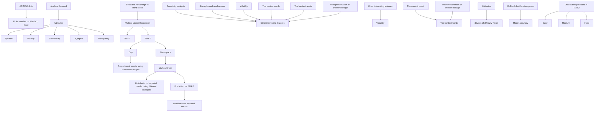
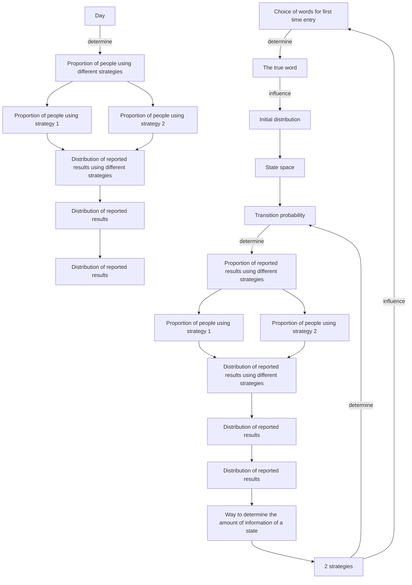

# Wordle: One Letter Makes a Difference

## Summary

Since its launch in early 2022, Wordle has sparked a wave of sharing yellow, green and grey squares on social media. Wordle has simple but challenging rules that requiring only a short attention span. Based on the Wordle dataset, we dig into the information hidden behind the number and the percentage of reported results.

First, we focus on the number of reported results that varies over time. We try to build an ARIMA model providing us with a prediction interval for the number of reported results on March 1, 2023. It indicates that the Wordle still maintains a high level of enthusiasm one year after its release. Then, we explore the factors influencing the percentage of Hard Mode. By fitting a multiple linear regression model, the results show that the number of repeated letters and the frequency of words are correlated with the difficulty of the game. The difficulty information that players obtained from the community in advance may influence their choice of game mode.

Next, we are curious how the distribution of the reported results would change in the future. To simplify the model, we generalize the player’s game states to their known number of squares of each color. Wordle can then be modeled as a Markov chain, and the problem is transformed into solving the first-arrival distribution of it. This requires knowledge of the initial distribution and transfer probabilities relying on the strategies chosen by players. In addition, the transfer probability is assumed to depend on the difference in the amount of information between states. So we propose a method to measure the current amount of information in the states. Based on this, we model the entire Markov chain and solve the first reach-time distribution under different strategies.

To make the model more reasonable, it is assumed that the proportion of people choosing the above two strategies varies with time. Accordingly, a method based on historical data is proposed to estimate this proportion. Finally, we combine the estimated proportion with a Gaussian process regression model to predict the future proportion of player strategy choices. This is then combined with the Markov chains model to predict the distribution of future reported results. We finally obtain the distribution of EERIE, which is (0.00, 0.15, 11.05, 28.44, 35.46, 21.16, 3.76).

Finally, we want to classify words according to their difficulty. Since word difficulty is only related to the word itself, it is believed that clustering according to word attributes can reflect the difficulty level of words. For this idea, K-Prototypes clustering is performed and reasonable word difficulty index is set. Then, we extract the difficulty information of each category, and then plot the density function and calculate Kullback-Leibler divergence. Both of results show that words with different attributes have different difficulty levels. It proves that our idea is reasonable and the classification model is accurate. Further, we classify the EERIE into “hard” class by its attributes, which is consistent with the percentage distribution obtained above. In addition, we discuss other information about the dataset, such as the difficult words, the easy words and the unexpected words. Finally, the sensitivity analysis of the model shows the good robustness of our model.

Keywords: ARIMA; multiple linear regression; Markov chains; K-Prototypes clustering

## Contents

## 1 Introduction 3

1.1 Background 3  
1.2 Restatement of The Problem 3  
1.3 Our Work 3

## 2 Model Assumptions and Notations 4

2.1 Assumptions and Justification . . . 4  
2.2 Notations 4

## 3 Data Preprocessing 5

## 4 Task 1: Number Prediction and Word Attributes 5

4.1 Number Prediction Based on ARIMA Model . 5  
4.2 Effect of Word Attributes . 10

4.2.1 Attributes of The Word . . 10  
4.2.2 Multiple Linear Regression . . 12

## 5 Task 2: Distribution based on Markov Chain Model 14

5.1 State Space 15  
5.2 Initial Distribution . . 16  
5.3 Transfer Probability . . 17  
5.4 Distribution of Reported Results 18  
5.5 Proportion of Two Strategies Used 19  
5.6 Predicting The Distribution of Future Reporting Results . . 19

## 6 Task 3: Classification of Solution Words 20

6.1 Difficulty Score . . 20  
6.2 K-Prototypes Clustering . . . . 20

6.2.1 Solving Steps . . . 20  
6.2.2 Results 20

6.3 Difficulty Classification of Solution Words . . . 21  
6.4 Difficulty of The Word EERIE 21

## 7 Task 4: Other Interesting Features 21

## 8 Sensitivity Analysis 23

## 9 Modle Evaluation and Further Discussion 23

9.1 Strengths . . . 23  
9.2 Weaknesses 23

## 10 A Letter to The Puzzle Editor 24

## References 25

## 1 Introduction

## 1.1 Background

Wordle is a popular five-letter puzzle game offered daily by the New York Times, where players try to guess the right words in 6 tries or less, getting feedback with each guess. It’s available in over 60 languages and has two levels: regular and Hard Mode. In Hard Mode, the letters that were correctly guessed must be used in subsequent guesses. After a guess, tiles change color: yellow = letter in wrong place, green = letter in right place and gray = letter not included.

## 1.2 Restatement of The Problem

Considering the background information and related conditions given in the title, we need to solve the following problems:

• Develop a model to explain daily variations of reported results, and use it to create a prediciton interval for the number of results on March 1, 2023. Is the percentage of Hard Mode scores affected by the word properties? If yes, how? If no, why not?  
• Develop a model to predict the solution’s (1,2,3,4,5,6,X) distribution for a specific future word. Discuss the uncertainties associated with the prediction. Provide an example of the predictions for EERIE on March 1, 2023, and the confidence in the model.  
• Create a classification model to classify the words based on their difficulty, and describe the particular attributes for each. How difficult is the word EERIE according to the model? Evaluate the model’s accuracy.  
• Lastly, describe other interesting features in the dataset.

## 1.3 Our Work

Considering the background and the problems, our work mainly includes the following:

• We hypothesized that the number of reported results on March 1st, 2023 could be predicted through building an ARIMA model with optimal parameters. To gain further insight into the word attributes, we ran a multiple linear regression to examine the effect of word attributes on the percentage of scores reported in the difficulty model.  
• We modeled the process of playing wordle games as a discrete-state Markov chain and derived two game strategies based on the derived information. We then estimated the distribution of reported outcomes for the two strategies, using theoretical tools such as information entropy and Markov chain properties. The obtained outcomes were subsequently combined to make predictions regarding the distribution of reported outcomes at a future date.  
• Furthermore, the difficulty of any given word is determined by its attributes. As such, clustering words by their attributes could provide valuable insight into the difficulty of each respective category.  
• Finally, after a close analysis of the dataset, we observed several noteworthy characteristics.

In order to avoid complicated description, intuitively reflect our work process, the flow chart is shown in Figure 1.

flowchart

Figure 1: Flow chart of our work

## 2 Model Assumptions and Notations

## 2.1 Assumptions and Justification

To simplify the problem and facilitate our modelling of the wordle game, we have made the following basic assumptions, each with appropriate justification.

(1) Players always make locally optimal choices based only on the information they currently know when playing wordle games.  
(2) Most of the time, the correct answers to wordle games come from the more common words.  
(3) Players are rational when playing wordle games and generally do not discard known information easily.  
(4) Players play wordle by selecting fill-in words from a roughly identical word bank, and they hold the same subjective probability of whether a word is the correct answer.  
(5) The higher the information gain of an event, the lower the probability of its occurrence  
(6) Measuring the information content of a word on different sized thesauri gives roughly the same result.  
(7) The proportion of players using each strategy does not change significantly throughout the day.

## 2.2 Notations

Table 1: Notations

<table><tr><td>Symbols</td><td>Description</td></tr><tr><td> $A_i$ </td><td>The set of states that are reachable in one step of state i.</td></tr><tr><td>S</td><td>The state space of the Markov chain.</td></tr><tr><td>W</td><td>All the words a player may fill in.</td></tr><tr><td> $p_x$ </td><td>The subjective probability that word x is the correct answer.</td></tr><tr><td> $freq_x$ </td><td>The word frequency of word x.</td></tr><tr><td> $I_x$ </td><td>The amount of information obtained by filling in the word x at the opening.</td></tr><tr><td> $x_{true}^{(r)}$ </td><td>The correct word of the r th day.</td></tr><tr><td> $G_i$ </td><td>The set of words that the player has guessed when he is in state i</td></tr><tr><td> $p_k^{(r)}(i,j)$ </td><td>The transfer probability from state i to j in Markov chain on day r.</td></tr><tr><td> $T_j^{(r)}$ </td><td>The number of steps to first reach state j from state i on the Markov chain at day r.</td></tr><tr><td> $C_k^{(r)}$ </td><td>The set of absorbing states of Markov chains on day r.</td></tr><tr><td> $T_{absorbed}^{(r)}$ </td><td>Number of steps before falling into an absorbing state on Markov chain at day r.</td></tr><tr><td> $q_k(r)$ </td><td>The proportion of all players using strategy k on day r.</td></tr></table>

where we define the main parameters while specific value of those parameters will be given later.

## 3 Data Preprocessing

Since we are only allowed to use the datasets “Problem\_C\_Data\_Wordle.csv” by COMAP official, we need to pre-process the dataset before solving the problem. An initial inspection of the dataset showed that there are some outliers and missing values.

• In the word column, we find that the length of some words are not equal to five,such as “rprobe”, “clen” and “tash”. As mentioned by COMAP official, in line 18, for contest 545, the word listed is “rprobe” while it should be “probe”. By looking up the solution word of the day published by wordle, we also get that “clen” should be “clean” and “tash” should be “trash”.  
• Additionally, in line 34, for contest 529, the number of reported results listed is “2569”, while the correct number should be “25569”.

## 4 Task 1: Number Prediction and Word Attributes

In this section, we predicted the number of reported results on March 1, 2023 by building an ARIMA model and choosing the optimal parameters. Then we summarize the word attributes and then explore the effect of word attributes on the percentage of scores reported in the difficulty model by building a multiple linear regression.

## 4.1 Number Prediction Based on ARIMA Model

Autoregressive integrated moving average, which is known as ARIMA, is a statistical analysis model that uses time-series data to predict the future trend. The basic idea of ARIMA is that the data sequence formed by the prediction over time is regarded as a random sequence and a model can be used to approximately describe this sequence. Once this sequence is identified, the model can predict future values from past and present values of the time series. ARIMA model comprises of auto-regression (AR) model and moving average (MA) model. AR model describes the relationship between the current value and lagged value and predicts the future value with the historical data. MA model leverage the linear combination of the past residual term to observe the future residual. The ARIMA prediction model can be written as the following formula:

$$
\hat {p} ^ {\{t \}} = p _ {0} + \sum_ {j = 1} ^ {p} \gamma_ {j} p ^ {\{t - j \}} + \sum_ {j = 1} ^ {q} \theta_ {j} \varepsilon^ {\{t - j \}}, \tag {1}
$$

where $p$ is the order of Autoregressive Model (AR), q is the order of Moving Average Model (AM), $\varepsilon ^ { \{ t \} }$ is the Error term between time t and $t - 1 , \gamma _ { j }$ and $\theta _ { j }$ are the fitting coefficients, $p _ { 0 }$ is constant term.

Based on the relevant situation of this example, after comprehensively considering various time series analysis models, we choose the ARIMA model to analyze the number of reported results and give a prediction interval for that on March 1, 2023.

Our model construction and solution steps are as follows:

1. Preprocessing of time series

(1) Dividing the training set and test set

In order to evaluate the model more reasonably, the data are divided into training and test sets.

(2) Stationarity and the white noise test

When making statistical inferences about the structure of a stochastic process from the observed records, it is usually necessary to make certain simplifying (and approximately reasonable) assumptions about it. The most important of these assumptions is stationarity. The basic idea of stationarity is that the statistical laws that determine the properties of a process do not change with time.

bar chart

Autocorrelation
| Lag | ACF |
|---|---|
| 0 | 1.00 |
| 1 | 1.00 |
| 2 | 1.00 |
| 3 | 1.00 |
| 4 | 1.00 |
| 5 | 1.00 |
| 6 | 1.00 |
| 7 | 1.00 |
| 8 | 1.00 |
| 9 | 1.00 |
| 10 | 1.00 |
| 11 | 1.00 |
| 12 | 1.00 |
| 13 | 1.00 |
| 14 | 1.00 |
| 15 | 1.00 |
| 16 | 1.00 |
| 17 | 1.00 |
| 18 | 1.00 |
| 19 | 1.00 |
| 20 | 1.00 |
| 21 | 1.00 |
| 22 | 1.00 |
| 23 | 1.00 |
| 24 | 1.00 |
| 25 | 1.00 |
| 26 | 1.00 |
| 27 | 1.00 |
| 28 | 1.00 |
| 29 | 1.00 |
| 30 | 1.00 |

line chart

| Lag | PACF  |
| --- | ----- |
| 0   | 1.00  |
| 1   | 0.25  |
| 2   | 0.00  |
| 3   | 0.00  |
| 4   | 0.00  |
| 5   | 0.00  |
| 6   | 0.00  |
| 7   | 0.00  |
| 8   | 0.00  |
| 9   | 0.00  |
| 10  | 0.00  |
| 11  | 0.00  |
| 12  | 0.00  |
| 13  | 0.00  |
| 14  | 0.00  |
| 15  | 0.00  |
| 16  | 0.00  |
| 17  | 0.00  |
| 18  | 0.00  |
| 19  | 0.00  |
| 20  | 0.00  |
| 21  | 0.00  |
| 22  | 0.00  |
| 23  | 0.00  |
| 24  | 0.00  |
| 25  | 0.00  |
| 26  | 0.25  |
| 27  | 0.00  |
| 28  | 0.00  |
| 29  | 0.00  |
| 30  | 0.00  |

Figure 2: Original time series correlation function graphs

Before conducting the stationarity test, the seasonality factor of the series is first identified simply by the ACF plot, and the time series does not have an obvious seasonal trend. The ACF plot, PACF plot and time series plot are shown in Figure 2.

By plotting the time series of the number of reported results, we found that the series does not look stationary. For non-stationary processes, the transformation was performed using the differencing method. From the Figure 3 and Figure 4 below, we can observe that the sequence after difference always fluctuate randomly around a certain value, and there is no obvious trend.

line chart

| Date       | Number of Reported Results |
| ---------- | -------------------------- |
| Jan 07 2022 | ~100,000                   |
| Mar 01 2022 | ~350,000                   |
| May 01 2022 | ~150,000                   |
| Jul 01 2022 | ~75,000                    |
| Sep 01 2022 | ~50,000                    |
| Nov 01 2022 | ~45,000                    |
| Dec 31 2022 | ~40,000                    |

Figure 3: Original time series

line chart

| Date       | Value   |
| ---------- | ------- |
| Jan 08 2022 | 40000   |
| Mar 01 2022 | -60000  |
| May 01 2022 | 20000   |
| Jul 01 2022 | 0       |
| Sep 01 2022 | 0       |
| Nov 01 2022 | 0       |
| Dec 31 2022 | 0       |

Figure 4: 1st order differential time series

Augmented Dickey-Fuller test to test the stationarity was performed. It is found that the original series does not reject the original hypothesis that the series is not stationary at the level of $\alpha = 0 . 0 5$ . The time series after the first-order difference then rejects the original hypothesis and passes the stationarity test. The statistics values before and after differencing are shown in Table 2 below.

Table 2: Augmented Dickey-Fuller test

<table><tr><td></td><td>Dickey-Full statistics</td><td>p value</td><td>lag</td></tr><tr><td>before difference</td><td>-2.8951</td><td>0.1989</td><td>6</td></tr><tr><td>after difference</td><td>-5.0648</td><td>0.01</td><td>6</td></tr></table>

It is further determined whether the series is a white noise series. In a white noise series, the random variables at any two points in time are not correlated and there are no dynamic laws in the series that can be exploited. Thus, historical data cannot be used to make predictions and inferences about the future. From the data, the statistics value of the Box-Ljung white noise test is 253.36, $p = 0 . 0 0 0$ . The original hypothesis that the series is a white noise series is rejected at the level of $\alpha = 0 . 0 5$ . It indicates that the series can be predicted by an appropriate time series model.

## 2. Determination of parameter d

According to the analysis of step 1, the time series becomes stable after the first-order difference. Thus, the parameter d of the ARIMA model can be determined as step 1.

## 3. Determination of parameter $p , q$

Table 3: Confirmation method of $p$ value and $q$ value

<table><tr><td>Model</td><td>ACF</td><td>PACF</td></tr><tr><td>AR(p)</td><td>attenuation tends to 0</td><td>truncation after p-order</td></tr><tr><td>MA(q)</td><td>truncation after q-order</td><td>attenuation tends to 0</td></tr><tr><td>ARMA(p, q)</td><td>attenuation tends to 0 after q-order</td><td>attenuation tends to 0 after p-order</td></tr></table>

We tried to use autocorrelation function (ACF) and partial autocorrelation function (PACF) to determine the values of $p$ and $q .$ . The confirmation method is shown in the Table 3.

After performing first-order differencing, the ACF and PACF plots are plotted.

line chart

| Lag | ACF    |
| --- | ------ |
| 0   | -0.25  |
| 1   | 0.15   |
| 2   | -0.15  |
| 3   | 0.05   |
| 4   | 0.05   |
| 5   | 0.05   |
| 6   | 0.05   |
| 7   | 0.15   |
| 8   | -0.05  |
| 9   | 0.05   |
| 10  | -0.05  |
| 11  | 0.05   |
| 12  | 0.05   |
| 13  | 0.15   |
| 14  | -0.05  |
| 15  | 0.15   |
| 16  | -0.05  |
| 17  | 0.05   |
| 18  | -0.05  |
| 19  | 0.05   |
| 20  | -0.05  |
| 21  | 0.05   |
| 22  | -0.05  |
| 23  | -0.15  |
| 24  | -0.15  |
| 25  | -0.25  |
| 26  | -0.15  |
| 27  | -0.15  |
| 28  | -0.15  |
| 29  | -0.15  |
| 30  | -0.15  |

line chart

| Lag | PACF   |
| --- | ------ |
| 0   | -0.25  |
| 1   | 0.0    |
| 2   | 0.0    |
| 3   | 0.0    |
| 4   | 0.0    |
| 5   | 0.15   |
| 6   | 0.15   |
| 7   | 0.2    |
| 8   | 0.2    |
| 9   | 0.15   |
| 10  | -0.15  |
| 11  | -0.15  |
| 12  | -0.15  |
| 13  | 0.15   |
| 14  | 0.15   |
| 15  | 0.15   |
| 16  | 0.2    |
| 17  | 0.2    |
| 18  | 0.0    |
| 19  | -0.15  |
| 20  | -0.15  |
| 21  | -0.15  |
| 22  | -0.15  |
| 23  | -0.15  |
| 24  | -0.15  |
| 25  | -0.15  |
| 26  | -0.15  |
| 27  | -0.15  |
| 28  | -0.15  |
| 29  | -0.15  |
| 30  | -0.15  |

Figure 5: 1st order differential sequence correlation function graphs

For this figure, there are three interpretations:

• ACF PACF are trailing, ARIMA(1,1,1) model can be considered.  
• ACF trailing, PACF first order truncated, consider ARIMA(1,1,0).  
• ACF third-order truncated, PACF trailing, consider ARIMA(0,1,3).

The interpretation about the ACF and PACF plots is difficult and subjective. It is not sufficient to judge the order of ARIMA by this alone. The best approach to fitting ARIMA is to start with a low order model, and then try to add a parameter at a time to see if the results change.

So, we implemented this through computer programming. An ARIMA model was obtained by minimizing the evaluation criterion AICc according to a variation of the Hyndman-Khandakar algorithm (Hyndman & Khandakar, 2008).

The order d has been determined in step 2. The values of p and q are then chosen by minimizing the AICc after differencing the data d times. Rather than considering every possible combination of p and q, the algorithm uses a stepwise search to traverse the model space:

(a) Four initial models are fitted: ARIMA(0,d,0), ARIMA(2,d,2), ARIMA(1,d,0), ARIMA(0,d,1). A constant is included unless d = 2. If $d \leq 1$ , an additional model is also fitted: ARIMA(0,d,0) without a constant.

(b) The best model (with the smallest AICc value) fitted in (a) is set to be the “current model”.

(c) Variations on the current model are considered:

• Vary p and/or q from the current model by ±1;  
• Include/exclude c from the current model.

The best model considered so far (either the current model or one of these variations) becomes the new current model.

(d) Repeat (c) until no lower AICc can be found.

According to the historical data, we perform the above steps to find the orders p and q that minimize the AICc, i.e., the optimal ordering of the model. The parameters of ARIMA were selected as (1,1,1).

## 4. Model fitting

After determining the optimal order, we perform parameter estimation. The model coefficients were tested to be significant. Fitted curve of the model is shown in Figure 6.

line chart

| Date       | The number of exported results |
| ---------- | ------------------------------ |
| Jan 2022   | 1e+05                          |
| Feb 2022   | 35e+05                         |
| Mar 2022   | 30e+05                         |
| Apr 2022   | 15e+05                         |
| May 2022   | 10e+05                         |
| Jun 2022   | 8e+05                          |
| Jul 2022   | 6e+05                          |
| Aug 2022   | 5e+05                          |
| Sep 2022   | 4e+05                          |
| Oct 2022   | 3e+05                          |
| Nov 2022   | 2.5e+05                        |
| Dec 2022   | 2e+05                          |
| Jan 2023   | 1.5e+05                        |

Figure 6: Fitting curve

## 5. Residual analysis

The p-values of the standardized residuals, the ACF of the residuals, and the Ljung-Box white noise test of the residuals are shown below in Figure 7. It can be seen that the autocorrelation coefficients of the residuals fall within the confidence interval after the 1st order difference, and the trend gradually converges to 0. The white noise test is calculated for multiple lagged values. A p-value above the horizontal dashed line (0.05 line) shows that the residual series is already white noise, indicating that the ARIMA model has sufficiently extracted useful information from the data.

line chart

| Lag | Standardized Residuals | ACF of Residuals | p values for Ljung-Box statistic |
|-----|------------------------|------------------|-----------------------------------|
| 0   | ~5.0                   | ~0.0             | ~0.75                             |
| 5   | ~0.0                   | ~0.0             | ~0.9                              |
| 10  | ~0.0                   | ~0.0             | ~0.7                              |
| 15  | ~0.0                   | ~0.0             | ~0.5                              |
| 20  | ~0.0                   | ~0.0             | ~0.25                             |
| 25  | ~-2.5                  | ~0.0             | ~0.25                             |

Figure 7: Residuals

Also, by plotting Q-Q plots, the model residuals basically obey a normal distribution with a mean of zero. Combined with the results of the autocorrelation test, it is determined that the residuals after fitting the optimal model are white noise sequences and no further modeling is required.

## 6. Prediction

Based on the ARIMA(1,1,1) model, using data from January 07, 2022 to December 31, 2022, the number of reported results can be predicted for 60 days thereafter, as shown in Figure 8. Further, we obtain a prediction interval [10517, 27007] with 90% confidence on March 1, 2023, with an expected forecast value of 16529.

line chart

| Time | data2results |
| ---- | ------------ |
| 0    | 800000       |
| 50   | 2500000      |
| 100  | 1500000      |
| 150  | 1000000      |
| 200  | 700000       |
| 250  | 500000       |
| 300  | 400000       |
| 350  | 300000       |
| 400  | 200000       |

Figure 8: Prediction results

## 4.2 Effect of Word Attributes

To explore the effect of word attributes on the percentage of scores reported that were played in Hard Mode, we firstly summarized the attributes of the word. Then, using attributes as independent variables and percentage as dependent variables, we further determined the relationship between them by establishing multiple linear regression model.

## 4.2.1 Attributes of The Word

By reviewing the literature related to word attributes, we summarize the following attributes.

## 1. Word class

According to NLTK, the most popular English natural language processing library in Python, we annotated the class of each word by the “nltk.pos\_tag” function. Since the results of its class are relatively detailed, with 34 categories[x], combined with the actual situation of word classes in the “Problem\_C\_Data\_Wordle.csv” dataset, we ultimately classify word class into the following four categories.

• NN: Noun.  
• RB: Adverb very.  
• JJ: Adjective.  
• Other: Word classes other than the above three word classes.

## 2. Frequency

Clearly, the commonness of a word affects the number of times a person tries it. According to the “English Word Frequency” dataset on Kaggle, which contains the counts of the 333,333 most commonly-used single words on the English language web, as derived from the Google Web Trillion Word Corpus.

We obtained the counts of each solution word, and divided each word’s own count by the total count to obtain its frequency of occurrence.

## 3. Number of syllables

Each word has a certain number of syllables, and a five-letter word usually has one or two syllables. We calculated the number of syllables for each solution word using the “textstat.syllable\_count” function of the textstat library in Python.

## 4. Number of letter repetitions

Although Wordle’s solution word is a five-letter word, it is likely that there are two or even more repetitions of the same letter in it, so we count the number of repetitions of letters in each word. For example, if two a’s appear, it is recorded as one time, and three a’s are recorded as two times, and the occurrence of two a’s and two b’s is also recorded as two times.

## 5. Polarity

Normally a word will contain either positive or negative sentiment. We use the “blob.sentiment” function of the TextBlob library in Python to get the polarity of the word, whose value lies between (−1, 1), and the higher the value means the more positive the sentiment represented by the word.

## 6. Subjectivity

A word usually also contains a competent or objective emotion. Same as 5, we can obtain the subjectivity of the word, whose value lies between (0, 1), the larger the value the more subjective the emotion represented by the word.

  
Figure 9: Attributes of the word

## 4.2.2 Multiple Linear Regression

To explore the relationship between each attribute of the words and the percentage of scores reported that were played in Hard Mode, we chose to build a multiple linear regression model.

## 1. Model design

In order to investigate the relationship between the variables, we calculate the Pearson correlation coefficients of proportion and other independent variables, and conducts the significance test, the results are shown in Figure 10. It can be seen that there is a certain correlation between the independent variables, and the factors with strong correlation with proportion are “syllable”, “n\_repeat”, “polarity”, “subjectivity” and “frequency”, which can be further investigated by establishing a regression model.

heatmap

|  | syllable | n_repeat | class | polarity | subjectivity | freq | Prop |
| --- | --- | --- | --- | --- | --- | --- | --- |
| n_repeat | 0.42 |  |  |  |  |  |  |
| class | 0.51 | 0.26 |  |  |  |  |  |
| polarity | 0.07 | 0.24 | 0.14 |  |  |  |  |
| subjectivity | 0.08 | -0.05 | 0.63 | -0.17 |  |  |  |
| freq | 0.24 | -0.2 | 0.74 | -0.01 | 0.28 |  |  |

Figure 10: Pearson correlation coefficients

## 2. Model building

The full model was developed through the previous study as follows:

$$
\boldsymbol {Y} = 0. 0 6 9 2 - 0. 0 0 4 5 \boldsymbol {X} _ {1} - 0. 0 0 2 6 \boldsymbol {X} _ {2} - 0. 0 0 6 4 \boldsymbol {X} _ {3} - 0. 0 0 3 3 \boldsymbol {X} _ {4} + 0. 2 8 2 3 \boldsymbol {X} _ {5}, \tag {2}
$$

where $X _ { 1 }$ represents number of syllables, $X _ { 2 }$ represents number of letter repetitions, $X _ { 3 }$ represents polarity, $X _ { 4 }$ represents subjectivity and $X _ { 5 }$ represents frequency.

The only significant variables found were “n\_repeat” and “frequency”. Then, these two variables were filtered by LASSO regression method to establish the final regression model as follows:

$$
\boldsymbol {Y} = 0. 0 7 5 0 - 0. 0 0 3 5 \boldsymbol {X} _ {1} + 0. 2 6 6 3 \boldsymbol {X} _ {2}, \tag {3}
$$

where $X _ { 1 }$ represents number of letter repetitions and $X _ { 2 }$ represents frequency. And $R _ { a d j } ^ { 2 }$ reached 0.782. The regression equation and regression coefficients all pass the significance test.

## 3. Adequacy tests

For the linear regression model, the assumptions are: the errors are independently and identically distributed and follow a normal distribution, there is no linear relationship between the explanatory variables, and the response variable is linearly related to the explanatory variables. These assumptions are tested in the following section. Using the “plot()” function for the “lm()” function in R, the regression diagnostic results are shown in Figure 11.

scatter plot

| Fitted values | Residuals |
| ------------- | --------- |
| 0.2           | 0.1       |
| 0.4           | -0.1      |
| 0.6           | -0.1      |
| 0.8           | -0.1      |
| 1.0           | -0.1      |

line chart

| Theoretical Quantiles | Standardized residuals |
| --------------------- | ---------------------- |
| -3                    | -4                     |
| 0                     | 0                      |
| 1                     | 1                      |
| 2                     | 2                      |
| 3                     | 3                      |

scatter plot

| Fitted values | √(standardized residuals) |
| ------------- | ------------------------- |
| 0.2           | 1.0                       |
| 0.4           | 1.5                       |
| 0.6           | 1.2                       |
| 0.8           | 0.8                       |
| 1.0           | 0.5                       |

scatter plot

| Leverage | Standardized residuals |
| -------- | ---------------------- |
| 0.0      | -6.0                   |
| 0.0      | -4.0                   |
| 0.0      | -2.0                   |
| 0.0      | 0.0                    |
| 0.1      | -2.0                   |
| 0.1      | 0.0                    |
| 0.2      | 2.0                    |
| 0.3      | 4.0                    |
| 0.4      | 6.0                    |

Figure 11: Adequacy test

• Residual normality test

The upper-right panel in Figure 11 of the regression diagnostic shows that all points are around the straight line, indicating that there is no reason to doubt the normality assumption.

• Independent homoscedasticity test for residuals

The bottom left panel in Figure 11 shows that there is no significant trend in the residuals, so the errors are considered to be independently and identically distributed.

• Model linearity test

There is no clear curvilinear relationship in the top left panel of Figure 11, so the linearity is considered to be valid.

• Model multicollinearity test

$\underline { { \mathrm { T a b l e } ~ 4 \colon \mathit { V I F } } }$

<table><tr><td></td><td> $X_{1}$ </td><td> $X_{2}$ </td></tr><tr><td>VIF</td><td>1.166984</td><td>1.341964</td></tr></table>

One way to test for multicollinearity is to calculate the variance inflation factor (V IF ), and multicollinearity is considered to exist if the variance inflation factor of a single variable is greater than 10. The results of calculating V IF for the two variables of model (x) are shown in Table 4, which shows that there is no significant multicollinearity in the model.

In summary, the above assumptions of the model are considered to be valid.

## 4. Results

After a series of model tests, the final established multiple linear regression equation was determined to be:

$$
\boldsymbol {Y} = 0. 0 7 5 0 - 0. 0 0 3 5 \boldsymbol {X} _ {1} + 0. 2 6 6 3 \boldsymbol {X} _ {2}, \tag {4}
$$

where $X _ { 1 }$ represents number of letter repetitions and $X _ { 2 }$ represents frequency.

The equation shows that the significant variables affecting the percentage of scores reported that were played in Hard Mode are number of letter repetitions and frequency. Frequency is positively correlated with proportion and n\_repeat is negatively correlated with proportion.

We know that Hard Mode is chosen before the start of the game and should have no relationship with attributes of the word. However, for the number of letter repetitions, its increase will make fewer players choose Hard Mode. This may be because when a word has more than one repeated letter, people generally do not think that there are still letters in the solution word hidden in the green square, so it is not easy to guess the right answer quickly, resulting in a much higher probability of not solving it. At this time, people will also know from Twitter that today’s solution word is difficult, so they will not choose Hard Mode.

Similarly, for frequency, it is positively correlated with the ratio, probably because when the frequency is high, people are more likely to get the answer right quickly and share the result on Twitter, so that other players will choose Hard Mode to challenge themselves when they find that the question is easier today. When the frequency is small, players will not choose Hard Mode in order to have a higher chance of guessing the solution word correctly.

## 5 Task 2: Distribution based on Markov Chain Model

flowchart

Figure 12: Flow chart of Markov Chain

According to Assumption (1), players are rational (they do not give up information they already have) and greedy (they only try to give a locally optimal solution based on the situation at hand), so the game process can be modelled as a Markov chain. We generalise the player’s state in the wordle game to the number of squares of each colour that have been obtained, and obtain as the state space of this Markov chain all states that the player may reach in 6 steps. We also envisage two strategies for the player.

• Probability first principle. According to Assumption (2), Common words are more likely to be the answer, so one can measure the frequency of use of a word to get a subjective probability that it is the correct answer, and fill in the word that has a high probability of being the correct answer each time.  
• Information first principle. Playing the wordle game is essentially a process of acquiring information, narrowing down the range of possible words, and finally getting the only correct answer, so it is also a good strategy to fill in the words that have a high probability of providing more information each time.

Based on these two strategies, we propose two corresponding principles for selecting the first fill-in words, and thus obtain an initial distribution of the influence of the day’s answers under both strategies. In addition, we give a way to quantify the information obtained by the player in the current state, assuming that the transfer probability between the two states is a simple function of the corresponding information increment and is influenced by the strategy used by the player, thus obtaining the transfer probability of this Markov chain. At this point we can then calculate the distribution of reported outcomes under both strategies.

To better model the wordle game, we assume that the proportion of people using the two strategies varies from day to day and give a method for estimating the proportion of strategies for that day from the historical data. Finally, we use the estimate of the proportion on the historical data, combined with a Gaussian process regression model, to give an estimate of the future proportion of strategies, and use the predicted future proportion of strategies combined with the distribution of reported results under the different strategies to achieve a prediction of the distribution of reported results.

## 5.1 State Space

The player’s state in the wordle game can be represented by the set of green, yellow, and gray blocks that has been obtained, which represents all the information the player has about the current state, and the player’s decision is based entirely on this set (Assumption (1)). The green and yellow blocks in the set carry both position and letter information, thus there are 5(possible positions) × 26(possible letters) = 130 each, while the gray blocks represent only letter information and there are 26 in total. To simplify the model, the set is reduced to a triple $( n _ { g r e e n } , n _ { y e l l o w } , n _ { g r e y } )$ , where $n _ { c o l o r }$ represents the number of “color” blocks the player currently obtains.

According to Assumption (3), the player will keep the already obtained green blocks in the next guess, i.e. the number of known green blocks will not decrease and the total number of obtained new color blocks will not exceed (5 - the number of already obtained green blocks). Obviously, the known yellow blocks can only be transformed into green blocks, so the sum of green and yellow blocks does not decrease. In addition, the number of gray blocks does not decrease either. Let $A _ { i } = \{ j : j$ is accessible from i in one step}. To sum up, for state $i = ( n _ { g r e e n } , n _ { y e l l o w } , n _ { g r e y } )$ and state $j = ( n _ { g r e e n } ^ { \prime } , n _ { y e l l o w } ^ { \prime } , n _ { g r e y } ^ { \prime } )$ ,

$$
j \in A _ {i} \Leftrightarrow
$$

$$
\left\{ \begin{array}{c} n _ {g r e e n} \neq 5 \\ n _ {g r e e n} ^ {\prime} \geq n _ {g r e e n} \\ n _ {g r e y} ^ {\prime} \geq n _ {g r e y} \\ n _ {g r e e n} ^ {\prime} + n _ {y e l l o w} ^ {\prime} \geq n _ {g r e e n} + n _ {y e l l o w} \\ n _ {g r e e n} ^ {\prime} + n _ {y e l l o w} ^ {\prime} + n _ {g r e y} ^ {\prime} \leq n _ {y e l l o w} + n _ {g r e y} + 5 \end{array} \right. \text {or} \left\{ \begin{array}{c} n _ {g r e e n} = 5 \\ n _ {g r e e n} ^ {\prime} = n _ {g r e e n} \\ n _ {y e l l o w} ^ {\prime} = n _ {y e l l o w} \\ n _ {g r e y} ^ {\prime} = n _ {g r e y} \end{array} \right. \tag {5}
$$

Let $B _ { i }$ be the set of states that the player may reach after the ith guess, then

$$
B _ {0} = \{(0, 0, 0) \}, B _ {i + 1} = \{j: \exists i \in B _ {i} s. t. j \in A _ {i} \}, i = 0, 1, 2, \dots , S = \left(\bigcup_ {i = 0} ^ {6} B _ {i}\right) \cup \{X \} \tag {6}
$$

where state X means the game has failed. S is the state space of the Markov chain. There are 384 states in total, and a chain is shown below as a example.

bubble chart

| Node | Value |
| --- | --- |
| 1 | 100 |
| 2 | 98 |
| 3 | 97 |
| 4 | 96 |
| 5 | 95 |
| 6 | 94 |
| 7 | 93 |
| 8 | 92 |
| 9 | 91 |
| 10 | 90 |
| 11 | 89 |
| 12 | 88 |
| 13 | 87 |
| 14 | 86 |
| 15 | 85 |
| 16 | 84 |
| 17 | 83 |
| 18 | 82 |
| 19 | 81 |
| 20 | 80 |
| 21 | 79 |
| 22 | 78 |
| 23 | 77 |
| 24 | 76 |
| 25 | 75 |
| 26 | 74 |
| 27 | 73 |
| 28 | 72 |
| 29 | 71 |
| 30 | 70 |
| 31 | 69 |
| 32 | 68 |
| 33 | 67 |
| 34 | 66 |
| 35 | 65 |
| 36 | 64 |
| 37 | 63 |
| 38 | 62 |
| 39 | 61 |
| 40 | 60 |
| 41 | 59 |
| 42 | 58 |
| 43 | 57 |
| 44 | 56 |
| 45 | 55 |
| 46 | 54 |
| 47 | 53 |
| 48 | 52 |
| 49 | 51 |
| 50 | 50 |
| 51 | 49 |
| 52 | 48 |
| 53 | 47 |
| 54 | 46 |
| 55 | 45 |
| 56 | 44 |
| 57 | 43 |
| 58 | 42 |
| 59 | 41 |
| 60 | 40 |
| 61 | 39 |
| 62 | 38 |
| 63 | 37 |
| 64 | 36 |
| 65 | 35 |
| 66 | 34 |
| 67 | 33 |
| 68 | 32 |
| 69 | 31 |
| 70 | 30 |
| 71 | 29 |
| 72 | 28 |
| 73 | 27 |
| 74 | 26 |
| 75 | 25 |
| 76 | 24 |
| 77 | 23 |
| 78 | 22 |
| 79 | 21 |
| 80 | 20 |
| 81 | 19 |
| 82 | 18 |
| 83 | 17 |
| 84 | 16 |
| 85 | 15 |
| 86 | 14 |
| 87 | 13 |
| 88 | 12 |
| 89 | 11 |
| 90 | 10 |
| 91 | 9 |
| 92 | 8 |
| 93 | 7 |
| 94 | 6 |
| 95 | 5 |
| 96 | 4 |
| 97 | 3 |
| 98 | 2 |

Figure 13: Markov Chain

## 5.2 Initial Distribution

According to Assumption (4), wordle players have approximately the same word bank and hold the same subjective probability of whether a word is the correct answer. Let W be all the words a player may fill in, and the subjective probability that a word $x \in W$ is the correct answer is $p _ { x }$ .

A dataset from internet can be used as an approximation of W , which contains about 36,000 of the most common five-letter words and their word frequencies. The sigmoid function can map any real number to [0, 1] and has the characteristic of changing faster around zero, so for a word x, we can put

$$
p _ {x} = \frac {1}{1 + e ^ {- (f r e q _ {x} - k)}} \tag {7}
$$

as the subjective probability that x is the correct answer, where $f r e q _ { x }$ is the word frequency of word x and k is a positive integer. Taking k to be the median of its word frequency, we get $\{ p _ { x } : x \in W \}$ .

For players who use the second strategy (information first), we can assume that they use

$$
I _ {x} = - \log_ {2} \frac {\operatorname{card} \left(\left\{y \in W : \operatorname{match} (x , y) = \operatorname{match} \left(x , x _ {\text {true}}\right) \right\}\right)}{\operatorname{card} (W)} \tag {8}
$$

to measure the amount of information obtained by filling in the word x at the opening, where card(·) denotes the number of elements in the set, match(x, y) denotes the match obtained by filling in the word x when the correct answer is the word $y ,$ and $x _ { t r u e } ^ { ( r ) }$ denotes the correct word of the r th day. Obviously,

$$
\forall x \in W, \mathrm{E} [ I _ {x} ] = \mathrm{E} [ \mathrm{E} [ I _ {x} | x _ {\text {true}} ^ {(r)} ] ] = \sum_ {x _ {0} \in W} \mathrm{E} [ I _ {x} | x _ {\text {true}} ^ {(r)} = x _ {0} ] P (x _ {\text {true}} ^ {(r)} = x _ {0}). \tag {9}
$$

Replacing $P ( x _ { t r u e } ^ { ( r ) } = x _ { 0 } )$ with the subjective probability $p _ { x _ { 0 } }$ , we obtain

$$
\mathrm{E} \left[ I _ {x} \right] \approx \sum_ {x _ {0} \in W} - \log_ {2} \frac {\operatorname{card} \left(\left\{y \in W : \operatorname{match} (x , y) = \operatorname{match} \left(x , x _ {0}\right) \right\}\right)}{\operatorname{card} (W)} p _ {x _ {0}} \triangleq \tilde {\mathrm{E}} \left[ I _ {x} \right]. \tag {10}
$$

We can assume that the player using the second strategy picks the word x with probability $\frac { \tilde { \mathrm { E } } [ I _ { x } ] } { \sum _ { y \in W } \tilde { \mathrm { E } } [ I _ { y } ] }$ as the first word to fill in.

A mapping can be created

$$
f: W \rightarrow S, f (x) = \left(\begin{array}{c}\text { The   number   of   green   blocks   in   match } (x, x _ {\text { true }} ^ {(r)})\\\text { The   number   of   yellow   blocks   in   match } (x, x _ {\text { true }} ^ {(r)})\\\text { The   number   of   grey   blocks   in   match } (x, x _ {\text { true }} ^ {(r)})\end{array}\right), \forall x \in W. \tag {11}
$$

Let the Markov chain for the wordle game on day r be $\{ X _ { i } ^ { ( r ) } \in S : i = 0 , 1 , 2 , \ldots \}$ , then for players using the first type of strategy holds

$$
P (X _ {0} ^ {(r)} = i) = \sum_ {x \in W: f (x) = i} p _ {x}, \forall i \in S, \tag {12}
$$

for players using the second strategy holds

$$
P (X _ {0} ^ {(r)} = i) = \frac {\sum_ {x \in W : f (x) = i} \tilde {\mathrm{E}} [ I _ {x} ]}{\sum_ {y \in W} \tilde {\mathrm{E}} [ I _ {y} ]}, \forall i \in S. \tag {13}
$$

This gives the initial distribution of players using different strategies on the Markov chain for that day.

## 5.3 Transfer Probability

Let

$$
I _ {i} = - \log_ {2} \frac {\operatorname{card} (\{x \in W : \bigcup_ {y \in G _ {i}} \mathbf {m a t c h} (x , y) = i \})}{\operatorname{card} (W)}, \tag {14}
$$

where $G _ { i }$ is the set of words that the player has guessed when he is in state i. Then $I _ { i }$ measures the information amount of state i (the degree to which the number of alternative words decreases after knowing that the match results in i).

Denote the transfer probability from state i to j in Markov chain $\{ X _ { i } ^ { ( r ) } \in S : i = 0 , 1 , 2 , \ldots \}$ as $p _ { k } ^ { ( r ) } ( i , j )$ when the k th strategy $( k = 1 , 2 )$ is used. By assumption (5), and noting that the second strategy (information-first) is more focused on obtaining more information compared to the first (probability-first), we can simply let

$$
p _ {k} ^ {(r)} (i, j) = \left\{ \begin{array}{l l} \frac {e ^ {k \left(I _ {j} - I _ {i}\right) + C}}{\sum_ {j : j \in A _ {i}} e ^ {k \left(I _ {j} - I _ {i}\right) + C}}, & j \in A _ {i} \\ 0, & j \notin A _ {i} \end{array} , C \in \mathbb {R} ^ {+}. \right. \tag {15}
$$

According to Assumption (6), for state $i = ( n _ { g r e e n } , n _ { y e l l o w } , n _ { g r e y } ) \in S , I _ { i }$ can be estimated by

$$
\frac {\operatorname{card} \left(\left\{\left(x _ {i} , x _ {j}\right) \in W \times W : \operatorname{match} \left(x _ {i} , x _ {j}\right) = i \right\}\right)}{\operatorname{card} ^ {2} (W)}, \tag {16}
$$

which gives the transfer probability of the Marxian chain $\{ X _ { i } ^ { ( r ) } \in S : i = 0 , 1 , 2 , \ldots \}$ under the k th strategy.

## 5.4 Distribution of Reported Results

For a Markov chain $\{ X _ { i } ^ { ( r ) } \in S : i = 0 , 1 , 2 , \ldots \}$ , denote its transfer probability matrix under strategy k as $\mathbf { P } _ { k } ^ { ( r ) }$ . Let

$$
T _ {j} ^ {(r)} = \inf \{n \geq 1: X _ {n} ^ {(r)} = j \}, \rho_ {i j n} ^ {(r)} = P (T _ {j} ^ {(r)} = n | X _ {0} ^ {(r)} = i), \mathbf {G} _ {n} ^ {(r)} = [ \rho_ {i j n} ^ {(r)} ] _ {i, j \in S} \tag {17}
$$

$$
c = \operatorname{card} (S), \mathbf {E} = \mathbf {1} _ {c} \mathbf {1} _ {c} ^ {T} - \mathbf {I} _ {c}, \tag {18}
$$

now the following equation holds

$$
\mathbf {G} _ {n} ^ {(r)} = \underbrace {\mathbf {P} _ {k} ^ {(r)} (\dots (\mathbf {P} _ {k} ^ {(r)} (\mathbf {P} _ {k} ^ {(r)} (\mathbf {P} _ {k} ^ {(r)}) \cdot \mathbf {E}) \cdot \mathbf {E}) \cdot \dots) \cdot \mathbf {E})} _ {n}, \tag {19}
$$

where · means the element-by-element multiplication of the matrix. Obviously this Markov chain is absorbing. Let

$$
C _ {k} ^ {(r)} = \{i \in S: p _ {k} ^ {(r)} (i, j) = 0, \forall j \neq i \}, T _ {\text {absorbed}} ^ {(r)} = \inf \{n \geq 1: X _ {n} ^ {(r)} \in C _ {k} ^ {(r)} \}, \tag {20}
$$

then

$$
P (T _ {a b s o r b e d} ^ {(r)} = n | X _ {0} ^ {(r)} = i) = \sum_ {j \in C} \rho_ {i j n} ^ {(r)}, P (T _ {a b s o r b e d} ^ {(r)} = n) = \sum_ {i \in S} \sum_ {j \in C} \rho_ {i j n} ^ {(r)} P (X _ {0} ^ {(r)} = i) \tag {21}
$$

Now we have the distribution of T (r) $T _ { a b s o r b e d } ^ { ( r ) } ,$ absorbed, which gives us the distribution of reported results under strategy k

$$
P _ {k} ^ {(r)} (\text { reported   results } = \mathrm{X}) = P (T _ {\text { absorbed }} ^ {(r)} \geq 7) = 1 - \sum_ {i = 1} ^ {6} P (T _ {\text { absorbed }} ^ {(r)} = i), \tag {22}
$$

$$
P _ {k} ^ {(r)} (\text { reported   results } = i \text { tries }) = P (T _ {\text { absorbed }} ^ {(r)} = i), i = 1, 2, \dots , 6. \tag {23}
$$

## 5.5 Proportion of Two Strategies Used

According to Assumption (7), the proportion of all players using strategy k on day r is $q _ { k } ( r ) , k =$ 1, 2, where $q _ { 1 } ( r ) + q _ { 2 } ( r ) = 1$ . The theoretical distribution of reported results among all players on that day is

$$
P ^ {(r)} (\text { reported   results } = \mathrm{X}) = \sum_ {k = 1} ^ {2} q _ {k} (r) P _ {k} ^ {(r)} (\text { reported   results } = \mathrm{X}), \tag {24}
$$

$$
P ^ {(r)} (\text { reported   results } = i \text { tries }) = \sum_ {k = 1} ^ {2} q _ {k} (r) P _ {k} ^ {(r)} (\text { reported   results } = i \text { tries }), i = 1, 2, \dots , 6. \tag {25}
$$

Suppose the true distribution of reported results for that day is

$$
P _ {t r u e} ^ {(r)} (\text { reported   results } = \mathrm{X}) = l _ {X} ^ {(r)}, \tag {26}
$$

$$
P _ {t r u e} ^ {(r)} (\text { reported   results } = i \text { tries }) = l _ {i} ^ {(r)}, i = 1, 2, \dots , 6. \tag {27}
$$

Then, similar to the MLE method, the $q _ { 1 } , q _ { 2 }$ minimizing the cross-entropy between the theoretical distribution and the true distribution can be taken as a estimate of $q _ { k } ( r )$ , i.e.

$$
\hat {q} _ {1} (r) = \underset {q \in [ 0, 1 ]} {\arg \min} \{- \ln \left[ q P _ {1} ^ {(r)} (\text { reported   results } = \mathbf {X}) + (1 - q) P _ {2} ^ {(r)} (\text { reported   results } = \mathbf {X}) \right] l _ {X} ^ {(r)}
$$

$$
- \sum_ {i = 1} ^ {6} \ln \left[ q P _ {1} ^ {(r)} (\text { reported   results } = i) + (1 - q) P _ {2} ^ {(r)} (\text { reported   results } = i) \right] \}, \tag {28}
$$

$$
\hat {q} _ {2} (r) = 1 - \hat {q} _ {1} (r). \tag {29}
$$

## 5.6 Predicting The Distribution of Future Reporting Results

Gaussian Processes (GP) are a generic supervised learning method designed to solve regression and probabilistic classification problems, while inference of continuous values with a Gaussian process prior is known as Gaussian Process Regression (GPR).

We estimate $\hat { q } _ { 1 } ( r )$ for each day from January 7, 2022 to December 31, 2022 based on the above model, obtain a time series and fit it with the GPR model to get the predicted value and confidence interval of $q _ { 1 } ( r )$ for March 1, 2023. In addition, we can also use the above model together with the correct word "eerie" on March 1, 2023 to obtain the distribution of reported results under both strategies.

Using the above method, we obtain $q _ { 1 } ( r )$ with a predicted value of 0.63 and 95% confidence interval of [0.59, 0.67], and the distribution of reported results under the two strategies are (0, 0, 12.6, 22.0, 39.6, 21.6, 4.2) and (0, 0.4, 8.4, 39.4, 28.4, 20.4, 3.0) respectively.

Our final prediction for the distribution of reported results is (0.000, 0.148, 11.046, 28.438, 35.456, 21.156, 3.756).

## 6 Task 3: Classification of Solution Words

The difficulty of a word is determined by the word itself and is reflected in the multiple attributes of the word. We conjecture that clustering words according to their attributes will give us information about the difficulty of the words embedded in each category.

## 6.1 Difficulty Score

From the previous study, it is clear that the percentages of (1, 2, 3, 4, 5, 6, X) are only related to the words themselves and not to other factors. Since X represents the result of 7 or more guesses, and unless the player intentionally guesses a five-letter word many times without getting the result, the average value of the number of guesses is estimated to be 8. We combine the percentage of each possible number of attempts to obtain the weighting formula for calculating the difficulty score:

$$
\text { score } = x _ {1} + 2 x _ {2} + 3 x _ {3} + 4 x _ {4} + 5 x _ {5} + 6 x _ {6} + 8 x _ {7}, \tag {30}
$$

where $x _ { 1 }$ represents percentage of 1 try, $x _ { 2 }$ represents percentage of 2 tries, $x _ { 3 }$ represents percentage of 3 tries, $x _ { 4 }$ represents percentage of 4 tries, $x _ { 5 }$ represents percentage of 5 tries, $x _ { 6 }$ represents percentage of 6 tries, $x _ { 7 }$ represents percentage of 7 or more tries.

## 6.2 K-Prototypes Clustering

## 6.2.1 Solving Steps

• Select a prototype (central sample) for each cluster from the data set X.  
• Assign the samples in X to the category closest to the prototype and update the prototype of the category after each assignment.  
• After all the samples are assigned to their respective classes, recalculate the distance of the samples to the present prototype. If a sample is closer to the new prototype than the original prototype, then reassign it to the category of the new prototype.  
• Repeat the process of the previous step until no samples change categories.

## 6.2.2 Results

text_image

Easy
Monosyllabic Subjective
Agtry
Subjective
Nounshire
love
Nouns
cloth
love
Objective
love
love
love
love
love
love
love
love
love
love
love
love
love
love
love
love
love
love
love
love
love
love
love
love
love
love
love
love
love
love
love
love
love
love

Figure 14: Clustering result

Three classes of words are obtained according to K-Prototypes clustering, and their class characteristics are summarized by their clustering centers as Figure 14.

## 6.3 Difficulty Classification of Solution Words

According to the difficulty score density plot x, the differences between the three distributions were obvious; the Kullback-Leibler divergence between the three categories was calculated and was 109.59, 271.9 and 864.3 respectively, which proves that our model is accurate for the classification of difficulty. From the above analysis, the categories obtained according to word attributes better distinguished word difficulty.

area chart

| Difficulty scores | Hard Density | Medium Density | Easy Density |
| ----------------- | ------------ | -------------- | ------------ |
| 2.0               | 0.00         | 0.00           | 0.00         |
| 3.0               | 0.00         | 0.00           | 0.00         |
| 4.0               | 1.00         | 1.00           | 0.75         |
| 5.0               | 0.50         | 0.25           | 0.10         |
| 6.0               | 0.00         | 0.00           | 0.00         |

Figure 15: Word Classification by Difficulty

Easy words tend to be monosyllabic, adjectival, and subjective in emotional attitude. And difficult words tend to be bisyllabic, presence of repeated letters, objective, negative.

## 6.4 Difficulty of The Word EERIE

In the word EERIE, the letter E is repeated three times, the word itself has a negative meaning and is not commonly used in life. According to these attributes, ERRIE is classified as the first of the three categories, whose difficulty level is hard.

## 7 Task 4: Other Interesting Features

After a close analysis of the dataset, we observed several noteworthy characteristics.

• Volatility of the number of reported results

As Figure 4 shown before, the difference between the daily Number of reported results and the previous day has a very uncertain volatility, so we selected the dates where the absolute value of the volatility is greater than 40,000 to present the following Table 5.

Table 5: Volatility

<table><tr><td></td><td>Date</td></tr><tr><td>Sudden increase</td><td>2022-2-18, 2022-3-17</td></tr><tr><td>Sudden decrease</td><td>2022-1-19, 2022-2-17, 2022-2-8, 2022-1-11, 2022-1-31</td></tr></table>

Then we selected 2022-2-18 and 2022-1-11 to analyze the reasons for the fluctuations.

For the plunge in the number reported for 2022-2-18, it may be due to the fact that the word dodge was so difficult that people could not guess it and therefore did not choose to share their scores.

For 2022-1-11, the sudden increase in the number of reported scores may be due to the fact that the word drink was easy and people guessed it quickly, so they chose to share their scores.

• The easiest words

If only the first correct guesses are considered, there are 15 words with a percentage of 1 correct guess greater than 0.01. It was found that none of these words had duplicate letters, and the most frequent letter was “a”, which appeared 11 times, followed by “e” and “t”, both of which appeared 10 times. Since it was the first time to guess, and the questions were random, people would optimally choose to guess a word with 5 different letters, thus achieving maximum elimination efficiency. In addition, since “a”, “e” and “t” are the letters that appear more frequently in the words that make up the 5 words, people’s guesses also mostly include them.

text_image

Word cloud visualization with letters and phonetic symbols, likely representing a language or word cloud.

Figure 16: First guess

text_image

a
b
c
d
e
f
g
h
i
j
k
l
m
n
o
p
q
r
s
t
u
v
w
x
y
z
a
c
d
e
f
g
h
i
j
k
l
m
n
o
p
q
r
s
t
u
v
w
x
y
z

Figure 17: First two guesses

Considering the randomness of the first guess, if we consider the 20 words with the first two correct guesses greater than 0.15, 2 of them contain the same letter, “treat” and “tease”. most of these words also have 1 correct guess greater than 0.01, and the letter with the highest number of occurrences is still “a”, reaching 14 times The most frequent letter is “a”, with 14 times, followed by “t”, with 11 times. The possible reasons for this are roughly the same as for the first correct guesses.

• The hardest words

The word with the largest proportion of 7 or more tries is “parer” (0.48), far ahead of the second largest (0.26), “foyer”. Both words can be used in architecture to refer to a particular area or space within a larger building. They both also have similar etymological roots. Parer comes from the Latin word “parare” meaning “to prepare”, while foyer comes from the French “fouyer” meaning “hearth”.

• Misrepresentation or answer leakage

There may be cases of misrepresentation or answer leakage. For example, for a word like poise, the probability of getting it right on the first try is far less than 1% for both strategies in task2. It is hard to imagine that 2% or more of people guess correctly using only one guess.

## 8 Sensitivity Analysis

In order to analyse the sensitivity of the Markov chain model to the parameters, we chose different values of C to calculate $h a t q _ { k } ^ { ( r ) }$ , and used the GPR model to make predictions for them. The selected C values are (1, 2, 3) respectively.

line chart

| Date       | q1    | q2    | q3    |
| ---------- | ----- | ----- | ----- |
| Jan 2022   | 0.61  | 0.64  | 0.63  |
| Apr 2022   | 0.62  | 0.65  | 0.64  |
| Jul 2022   | 0.61  | 0.63  | 0.62  |
| Oct 2022   | 0.62  | 0.64  | 0.63  |
| Jan 2023   | 0.61  | 0.63  | 0.62  |

Figure 18: Sensitivity analysis

From Figure 18, we can conclude that C has little effect on the prediction accuracy of our model, which indicates that our model is robust and very reliable.

## 9 Modle Evaluation and Further Discussion

## 9.1 Strengths

• Novelty. We used concepts such as information entropy to model the initial distribution and transfer probabilities of Markov chains, proposed two game strategies and successfully estimated the proportion of use of the two strategies in historical data, and used time series prediction methods on them, eventually combining them to obtain the results.  
• Interpretability. We use ARIMA and GPR models for time series forecasting, K-Prototypes methods for cluster analysis and Markov chains for modelling wordle games, all of which have a strong interpretability or deep statistical basis. The innovative part of the model also has a convincing structure.

## 9.2 Weaknesses

• Missing other potentially useful features. The model we built only uses part of the features of words, and there may be some unexplored features that can improve the model.  
• Certain degree of arbitrariness in model designs. We adopt an arbitrary mindset when designing part of our models.

## 10 A Letter to The Puzzle Editor

Dear Sir or Madam:

Based on the file you provided, we have performed some interesting analyses of the data to answer the questions you have asked.

First, we have developed a time series model ARIMA, which is the result of a rigorous selection and iterative comparison of parameters. We are confident that this model will perform well in future forecasts. According to this model, the number of reported results on March 1, 2023 will be between 10517 and 27007, with the number 16529 being particularly likely. This shows the strong vitality of wordle. In this era of bombardment of various games and short videos, it is surprising that a game still has such a high attention span one year after its launch. Moreover, with some visualizations, we found that the number of wordle games gradually stabilized in Q3 2022 after a crazy growth in Q1 2022. This means that a significant number of players have gotten used to wordle games and made them part of their daily lives, rather than trying them once out of novelty.

Next, we found that the percentage of hard mode is related to the attributes of the solution word. We conjecture that players will use the information shared by the community to decide whether to turn on the Hard Mode. When players find that today’s wordle lacks challenge, Hard Mode is preferred. After all, the rules of Hard Mode make the way to approach the correct answer more singular.

We also develop a Markov chain to model the process of players playing wordle games and propose two game strategies. Finally, the prediction of the distribution of reported results at a future date is achieved by combining these results. Based on this model, the percentage distribution of the number of attempts for the word EERIE on March 1, 2023, showed a tendency to concentrate on three times and beyond, indicating the challenging nature of the word.

Ultimately, we categorized the words according to their attributes. As we conjectured, the resulting word categories imply information about the difficulty of the words. Multi-syllabic, repeated-letter, objective, negative, and uncommon words are more difficult to guess than monosyllabic, emotionally rich, and common ones. From this we predict that the word EERIE will be a great challenge for players, in line with the results of the Markov chain model we have developed.

In the process of solving the problem, we found some interesting features of this dataset. For example, the increase or decrease in the number of reported words may be due to the difficulty or ease of the word that day; words that are easy to guess correctly often contain common letters such as a, t; results misrepresentation or answer leakage may occur.

Many players say that wordle has become the first warm-up for their brains when they wake up. This is all due to your constant efforts to create a good gaming atmosphere and a harmonious gaming community. Here, everyone is able to share their achievements freely and happily without being dramatized. We sincerely thank you for your efforts and hope that our analysis will help you.

Sincerely,

Team #2318982

## References

[1] J. D. Cryer and K. S. Chan. Time Series Analysis. Time Series Analysis, 2005.  
[2] Renato Feres. Notes for math 450 matlab listings for markov chains. 2007.  
[3] Robin John Hyndman and George Athanasopoulos. Forecasting: Principles and Practice. OTexts, Australia, 2nd edition, 2018.  
[4] Carl Edward Rasmussen and Christopher K. I. Williams. Gaussian processes for machine learning (adaptive computation and machine learning). 2005.  
[5] Xiangxiang Yan. Using arima model to predict green area of park. Computer Science, 47(S02):5, 2020.