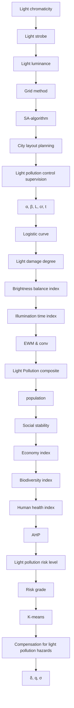
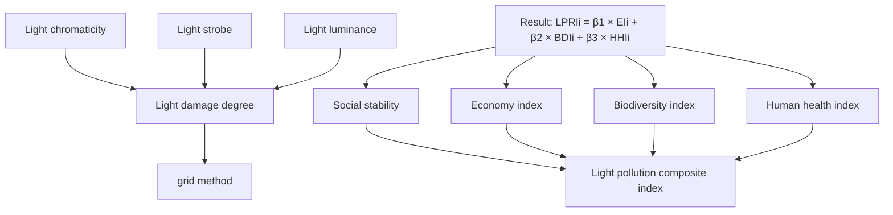
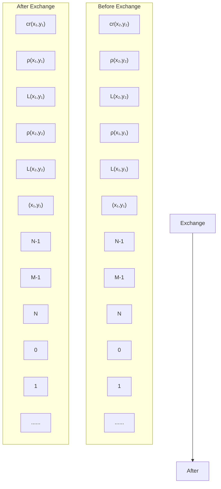

## Less Light Pollution & Brighter Starry Sky

How long has it been since you saw a spectacular starry night sky? Nowadays, 80 percent of the world’s population lives under skyglow. As light pollution continues to grow, more and more people are taking this issue seriously. In this paper, we established a light pollution assessment model and proposed three strategies to combat light pollution.

In task 1, we divided the area to be evaluated into eight grids according to the city plan map, and used the entropy weight method (EWM) to integrate three factors related to light pollution into a total attributional index. Then, considering the interaction of light pollution between adjacent areas, we innovatively use the Raster method and this index to introduce the concept of light pollution index (LPI). Light pollution index has a direct impact on the economy, ecology, and human health, leading to the light pollution risk. We use AHP to obtain the light pollution risk level (LPRL) and use it to identify the light pollution risk level of a location.

In task 2, we apply the model in Task 1 to Saskatoon in Canada. By calculation, we obtained the average LPRI for a protected land location, a rural community, a suburban community, and an urban community. The result is 0.0665, 0.1529, 0.2726 and 0.3397, meaning that the suburban community and the urban community have a higher risk. Then we plotted the heat map of LPRI as shown in Figure 8 to accurately reflect the circumstances of each grid. Finally, we utilize K-means Algorithm to classify the LPRI of each grid in the suburban community and the urban communities. We divide the grid into five groups and determine which grids are in extreme risk areas.

In task 3, we propose three possible intervention strategies to address light pollution. The grid movement strategy optimizes the layout of the city by moving the grid, thus reducing LPRI. The regulatory strategy eliminates light pollution at the source by reducing light luminance and illumination time. The compensation Strategy chooses to achieve LPRI decline through a certain economic cost.

In task 4, we applied three strategies to the suburban community and the urban community of Saskatoon. By calculation, the grid movement strategy can effectively reduce LPRL. However, we need to consider the high cost of city relocation. To compare compensation strategies with regulatory strategies, we introduce the concept of the strategy intensity factor. The level of LPRI reduction by the two policies for the same strategy intensity factor is shown in figure 15. Ultimately, we conclude that the regulatory strategy is more effective for these two areas.

In addition, we conducted a sensitivity analysis of the model, adjusted the parameters of the constraint conditions with a fixed step length, evaluated the optimization effect. The advantages and disadvantages of the model are also analyzed. We also write a flyer to promote the regulatory strategy for Saskatoon.

Keywords: Light Pollution; Raster Method; K-means Algorithm; Strategy Intensity Factor

## Contents

## 1 Introduction ...

1.1 Problem Background . 2  
1.2 Our work.

## 2 Assumptions and Justifications ...

## 3 Notations .....

## 4 Data Collection ..

## 5 Light Pollution Risk Level Evaluation Model.. . 4

5.1 Rasterization of Regions . 4  
5.2 Exponential Analysis and Modeling.  
5.3 Light Pollution Composite Index .  
5.4 Light Pollution Risk Assessment Model .

## 6 Model Application and Validation....... ... 13

6.1 Risk levels in Urban and Suburban ... 14  
6.2 Risk Levels in Protected Land and Rural Community 15  
6.3 Analysis of Light Pollution Risk Level Based on K-means Clustering. . ..16

## 7 Three Types of Strategies to Intervene in Light Pollution .... . 17

7.1 Strategy I: Grid Movement Strategy Based on Simulated Annealing Algorithm ..........17  
7.2 Strategy II: Regulatory Strategy Based on Intensity Factors ... .18  
7.3 Strategy III: Compensation Strategy Based on Intensity Factors ... .. 19

## 8 Intervention Strategies For Saskatoon...... ...20

8.1 Moving Saskatoon's Grid . .20  
8.2 Regulation or Compensation. 21

## 9 Sensitivity Analysis .... .. 22

## 10 Strengths and Weaknesses .... .22

10.1 Strengths . 22  
10.2 Weaknesses . 23

## References .... .23

## 1 Introduction

## 1.1 Problem Background

I have outwalked the furthest city light, which ends the first stanza of Robert Frost’s poem ‘Acquainted with the Night’. For the majority of contemporary people, especially contemporary urban dwellers, such a feat is becoming exceedingly difficult in our electrified, 24h societies. Although artificial night lighting has brought many advances and possibilities for social development, the light pollution caused by its misuse has brought negative impacts on the ecological environment, physical and mental health, etc. that cannot be ignored.

natural_image

Night sky photo comparing "Before" and "After" conditions, showing a house and silhouetted trees (no text or symbols)

Figure 1: How does light pollution change our perception of the night sky?

However, light pollution has received relatively little attention compared to other environmental issues and remains in the scientific and cultural "dark". Equally importantly, the environmental problems caused by artificial night lighting have received little attention through the concept of light pollution. Therefore, it is imperative to establish a mathematical model to measure and mitigate light pollution in a place.

## 1.2 Our work

flowchart

Figure 2: Work Overview

## 2 Assumptions and Justifications

We made the following assumptions to help us with our modeling. These assumptions are the promise of our subsequent analysis.

 These factors that we did not mention have a small impact on the system. This is because in reality, there are too many factors that affect the risk level of light pollution to consider all of them. Therefore, this assumption is reasonable and helps to avoid unnecessary troubles in constructing the model.  
 The data we collect from online databases is accurate, reliable and mutually consistent. Because our data sources are all websites of international organizations, it’s reasonable to assume the high quality of their data.  
 When dividing the grid, the grid at the junction of different kinds of areas is divided into the kinds that occupy the largest area in the grid species. We ignore the errors caused by doing so for the assessment of light pollution risk levels.

## 3 Notations

The key mathematical notations used in this paper are listed in Table 1.

Table 1: Notations used in this paper

<table><tr><td>Symbol</td><td>Description</td></tr><tr><td>x</td><td>The horizontal sequence value of a grid, as an integer</td></tr><tr><td>y</td><td>The vertical sequence value of a grid, as an integer</td></tr><tr><td>p(x,y)</td><td>The light damage degree at (x,y)</td></tr><tr><td>cr(x,y)</td><td>The brightness balance index at (x,y)</td></tr><tr><td>t(x,y)</td><td>Scores for evaluating the illumination time at (x,y)</td></tr><tr><td>LPI</td><td>Light pollution composite index</td></tr><tr><td>EI</td><td>Economic index</td></tr><tr><td>BDI</td><td>Ecological diversity index</td></tr><tr><td>HHI</td><td>Human health index</td></tr><tr><td>LPRI</td><td>The index to evaluate Light pollution risk level</td></tr><tr><td>γ</td><td>Strategy implementation intensity factor</td></tr></table>

## 4 Data Collection

The data we used mainly include satellite images and brightness values of global lights, information on light pollution and environmental protection, population density and other indicators, etc. The data sources are summarized in Table 2.

Table 2: Data source collation

<table><tr><td>Database Names</td><td>Database Websites Data</td></tr><tr><td>NASA</td><td>https://www.nightlights.io/</td></tr><tr><td>IDA</td><td>https://www.darksky.org/</td></tr><tr><td>Maps</td><td>© 2021 Mapbox © OpenStreetMap</td></tr><tr><td>Light Pollution Map</td><td>www.lightpollutionmap.info/</td></tr><tr><td>Google Scholar</td><td>https://scholar.google.com/</td></tr></table>

## 5 Light Pollution Risk Level Evaluation Model

Before developing a light pollution risk level evaluation index that can be widely tested, it is necessary to establish a comprehensive index to evaluate the light pollution level of a site. To this end, we first determined a spatial model to rasterize the area, selected the core indicators closely related to light pollution for analysis and calculation, and refined the rasterized grid to establish a more rigorous light pollution composite index. After that, we evaluate the risk level of light pollution in an area from four aspects through data research.

flowchart

Figure 3: Visualization of the model building process

## 5.1 Rasterization of Regions

The work of the predecessors has given us some inspiration. The utilization of artificial illumination exhibits significant variation across distinct regions within the city. For instance, the commercial areas of the city display considerably higher levels of luminance in comparison to the residential areas, attributable to regional functions. Hence, to investigate the spatial distribution issue, the present study employs the grid method.

In accordance with the division regulations of the urban planning network, the grid is categorized into four distinct types, namely, commercial grid, residential grid, industrial grid, and depopulated zone. The specific introduction is as follows:

+ Commercial grid: This type of grid is mainly composed of commercial areas and commercial centers with high level of economic activities, mainly concentrated in cities, but also a small number of distribution in towns and rural areas. Many commercial areas frequently use spotlights, floodlights, neon lights, light boxes, LED advertising screens and other lighting equipment to achieve the role of publicity and attract crowds, but the improper application of artificial light will have the opposite effect, causing a serious waste of power resources and light pollution problems.  
Residential grid: The residential grid primarily comprises residential areas, encompassing apartment buildings and single-family houses, which are the most susceptible to light pollution due to functional reasons. In recent years, light pollution in residential areas has become progressively more severe in various regions, attributed to urbanization, as indicated by light trespass and inappropriate internal lighting.  
I Industrial grid: The industrial grid comprises areas dedicated to industrial activities, such as manufacturing, logistics, and warehousing. It is mainly concentrated in urban and suburban areas, etc., where light pollution has less impact.  
Depopulated zone ： As the name implies, it is a special area that is sparsely populated, such as wilderness, protected area, etc.

These grids can be easily visualized in Figure 4:

grid-based visualization chart

| Community Type       | Grid Type     | Color  |
|---------------------|---------------|--------|
| Suburban community  | industrial   | Yellow |
| Suburban community  | residential   | Orange |
| Urban community      | commercial    | Red    |
| Urban community      | residential   | Orange |
| Urban community      | industrial   | Orange |
| Rural community     | industrial   | Blue   |
| Rural community     | residential   | Blue   |
| Rural community     | industrial   | Green  |
| Rural community     | residential   | Green  |
| Protected land       | depopulated   | Green  |

Figure 4: Four types of grids in different areas

## 5.2 Exponential Analysis and Modeling

For the different regions $( x , y )$ , we have established three indicators for evaluation: light damage degree $p ( x , y )$ , brightness balance index $c r \left( x , y \right)$ and illumination time index $t ( x , y )$ .

## 5.2.1 Indicator Establishment

## (1) Light Damage Degree

The light damage degree is an assessment metric that centers on the harm caused by light to the human body, which is closely linked to the intensity of light, specifically the brightness of the nighttime sky. Studies have indicated that artificial light-induced damage to the human body varies across regions, with the degree of damage increasing with rising brightness until it reaches a peak level. To simplify the calculation, a differential equation for the degree of light damage with respect to light luminance is constructed based on the structural form of the Volterra model:

$$
\frac {d p (x , y)}{d L (x , y)} = L (x, y) \left(1 - \frac {L (x , y)}{N}\right) \tag {1}
$$

Where $p ( x , y ) ~ , ~ L ( x , y )$ are the light damage degree and light luminance with coordinates $( x , y )$ respectively, is the maximum value of brightness in the grid.

Neon lights in the city, red, green, blue and other saturated light boxes and other such forms of too much light, too much color, easy to cause light clutter, that is, excessive combination of light; advertising screens in shopping malls, LED lights in the square often occur in the naked eye imperceptible strobe, easy to trigger headaches, human eye discrimination decline and other undesirable phenomena. Considering the harmonization and sustainability of the city at night, the light damage should take the light chromaticity and light stroboscopic flicker into account. Therefore, the final modified expression can be obtained:

$$
\frac {d p (x , y)}{d L (x , y)} = L (x, y) \left(1 - \frac {L (x , y)}{N}\right) + \alpha L (x, y) + \beta L (x, y) \tag {2}
$$

where $\alpha ~ , ~ \beta$ are the correction factors of light chromaticity and light strobe respectively.

Since the effects of light chromaticity and light strobe may vary across different regions, the correction factors should also be classified accordingly. Table 3 presents an estimation of the relevant parameters.

Table 3: Parameter estimation for different regions

<table><tr><td colspan="2">categories</td><td>α</td><td>β</td></tr><tr><td rowspan="3">Urban community</td><td>Commercial grid</td><td>0.1645</td><td>0.1623</td></tr><tr><td>Residential grid</td><td>0.1061</td><td>0.1053</td></tr><tr><td>Industrial grid</td><td>0.0815</td><td>0.0727</td></tr><tr><td rowspan="2">Suburban community</td><td>Residential grid</td><td>0.0546</td><td>0.0527</td></tr><tr><td>Industrial grid</td><td>0.0325</td><td>0.0303</td></tr><tr><td colspan="2">others</td><td>0</td><td>0</td></tr></table>

## (2) Brightness Balance Index

In many studies, the severity of light pollution is characterized by the ratio of the nighttime sky brightness affected by artificial light sources to its natural brightness (i.e., contrast). Therefore, when evaluating the nighttime light environment, not only the illumination level but also the spatial distribution of light should be taken into account. To address the inhomogeneity of luminance in space, this paper proposes a brightness balance index based on light distribution uniformity and luminance contrast, which can be used to assess the impact of light pollution.

$$
c r (x, y) = \frac {L (x , y) - L _ {\min} (x , y)}{L _ {\max} (x , y)} \tag {3}
$$

Where $c r \left( x , y \right)$ is the brightness balance index, $L _ { \operatorname* { m a x } } ( x , y )$ and $L _ { \operatorname* { m i n } } \left( x , y \right)$ are the maximum and minimum values of luminance in the grid, respectively.

## (3) Illumination Time

At a certain light intensity, the longer the exposure time, the more serious the cumulative effect of light pollution. Conversely, when the light is very strong but the duration is very short, according to classical physical theory, this does not cause light pollution. Therefore, the irradiation time is a factor that cannot be ignored in the control of light pollution. In order to simplify the calculation, we have selected some critical values for the following division.

Table 4: A three-way score table

<table><tr><td>Illumination Time(h)</td><td>Score</td></tr><tr><td> $t \geqslant 12$ </td><td>1</td></tr><tr><td> $8 \leqslant t < 12$ </td><td>0.67</td></tr><tr><td> $t < 8$ </td><td>0.33</td></tr></table>

## 5.3 Light Pollution Composite Index

## 5.3.1 Narrow Light Pollution Composite Index Based on EWM

The weight assigned to each index in the EWM calculation is determined by its information entropy, which reflects the degree of variability of the index. The higher the information entropy, the more significant the index is in the assessment. Thus, utilizing EWM to determine the weight of each index in the calculation of the index of light pollution is an objective approach.

After preprocessing the data, we obtained data for the last three years from 15 regions. As these indicators are all positive, we standardized the data:

$$
Y _ {i j} = \frac {X _ {i j} - \min (X _ {i j})}{\max (X _ {i j}) - \min (X _ {i})} \quad i = 1, 2, 3 \tag {1}
$$

where $X _ { i j }$ represents the original data of the -th indicator value of the -th grid, while $( X _ { i j } )$ and $\operatorname* { m a x } \left( X _ { i j } \right)$ represents the minimum and maximum data in the -th

indicator of the -th grid.

The information entropy can be obtained from Eq.5.

$$
\left\{ \begin{array}{l} P _ {i j} = \frac {Y _ {i j}}{\sum_ {i = 1} ^ {3} Y _ {i}} \\ E _ {j} = - \frac {1}{\ln n} \sum_ {i = 1} ^ {3} P _ {i j} \ln P _ {i j} \end{array} \right. \tag {2}
$$

If $P _ { i j } = 0$ ，plug Eq.6 into Eq.5:

$$
\lim _ {P _ {i j} \rightarrow 0} P _ {i j} \ln P _ {i j} = 0 \tag {3}
$$

Based on the information entropy $E _ { j }$ , the weight of each indicator could be calculated by Eq.7.

$$
W _ {i} = \frac {1 - E _ {i}}{k - \sum E _ {i}} (i = 1, 2, 3) \tag {4}
$$

Based on the above discussion, we assigned weights to each indicator and the weighting results are as follows: Light Damage Degree $\alpha _ { 1 }$ (85.73%), Brightness Balance Index $\alpha _ { 2 }$ (4.82%), Irradiation Time $\alpha _ { 3 } ( 9 . 4 5 \% )$ . On the basis of those calculated weights, we have

$$
L P I ^ {*} = \alpha_ {1} \times p + \alpha_ {2} \times c r + \alpha_ {3} \times t \tag {5}
$$

It should be noted that this calculation overlooks the influence of light pollution between areas and their surroundings. However, in real-world situations, the impact of light pollution between regions is also a crucial factor that cannot be ignored. For instance, the hazards of light trespass in residential areas often stem from commercial areas. Therefore, $L P I ^ { * }$ is merely a narrow light pollution indicator that requires further optimization.

## 5.3.2 Convolution Kernel

When considering the extent to which an area is affected by artificial light, it is important to take into account not only the integrated light pollution index of that area but also the light pollution index of its neighboring areas. Therefore, we introduce the light pollution coefficient , which represents the influence of different areas on their surrounding regions. As shown in Eq.9, we convolve nine $L P I ^ { * }$ using a convolution kernel.

$$
\begin{array}{l} L P I ^ {\prime} (x, y) = \left[ \begin{array}{c c c} L P I ^ {*} (x - 1, y + 1) & L P I ^ {*} (x, y + 1) & L P I ^ {*} (x + 1, y + 1) \\ L P I ^ {*} (x - 1, y) & L P I ^ {*} (x, y) & L P I ^ {*} (x + 1, y) \\ L P I ^ {*} (x - 1, y - 1) & L P I ^ {*} (x, y - 1) & L P I ^ {*} (x + 1, y - 1) \end{array} \right] \\ \otimes \left[ \begin{array}{c c c} L F (x - 1, y + 1) & L F (x, y + 1) & L F (x + 1, y + 1) \\ L F (x - 1, y) & C F & L F (x + 1, y) \\ L F (x - 1, y - 1) & L F (x, y - 1) & L F (x + 1, y - 1) \end{array} \right] \tag {1} \\ \end{array}
$$

where $C F$ is the center factor, and $C F$ can be calculated by the following equation.

$$
C F = 1 - \sum_ {i = - 1} ^ {1} \sum_ {j = - 1} ^ {1} L F (x + i, y + j) \tag {2}
$$

It should be noted that i and j cannot be 0 at the same time.

With this calculation, we can guarantee that all elements in the matrix after the convolution sign in Eq.9 sum to 1. The value of $L F ( x , y )$ is determined by the type of region that is in the $( \boldsymbol { x } , \boldsymbol { y } )$ coordinates, as shown in table 5.

Table 5: Values of LF in different regions

<table><tr><td>region</td><td>LF</td><td>region</td><td>LF</td></tr><tr><td>Urban Commercial District</td><td>0.05</td><td>Suburban residential District</td><td>0.02</td></tr><tr><td>Urban residential District</td><td>0.04</td><td>Suburban Industry District</td><td>0.01</td></tr><tr><td>Urban Industry District</td><td>0.03</td><td>Countryside and Protected land</td><td>0</td></tr></table>

## 5.4 Light Pollution Risk Assessment Model

To comprehensively evaluate the cumulative effect of light pollution on a region, it is essential to assess it from multiple perspectives. Considering the topic's background and objectives, we chose to evaluate the grid’s risk level comprehensively using four criteria: economic impact, biodiversity, human health and social stability.

## 5.4.1 Economic Index(EI)

The development and utilization of artificial light sources have brought significant economic benefits. However, the overuse of light has led to light pollution, which incurs significant social costs, including adverse impacts on biodiversity, human health, astronomical observations, and energy consumption. It is estimated that in the United States alone, light pollution wastes nearly \$7 billion worth of energy annually. Therefore, it is essential to establish a more reasonable evaluation model to measure the relationship between light pollution and the economy, which would enable us to better manage the associated economic problems and effectively mitigate them.

Given the basic theory and assumptions of the Douglas function, we developed a

coupled light-economy function (considering only the night economy to simplify the model):

$$
Q _ {i} = \delta (K _ {i}, L P I, L _ {i}) \tag {1}
$$

where $Q _ { i } ~ , ~ K _ { i }$ denote the nightly economic benefits and population of -th grid respectively, and is a function to be determined. To seek the functional form of $\delta$ , we make the following assumptions.

 Each individual possesses a certain level of economic benefits, and the night economy output $( Q / K )$ generated by each individual increases as the intensity of their exposure to light $( L / K )$ increases, but the rate of increase decreases over time.  
 We introduce the role of technology, but do not consider the effect of technology versus time, i.e., the role of technology is essentially constant  
 We simplify that the economic cost caused by light pollution is roughly linearly related to the degree of light pollution.

Thus, we can derive the expression for the economic indicator for a region as:

$$
E I = c K ^ {1 - \alpha} \cdot L ^ {\alpha} - r \cdot L P I, 0 <   \alpha <   1 \tag {2}
$$

Where:

• is the technology impact factor, which varies somewhat from country to country and region to region.  
In the context of economic output, represents the proportion of brightness, while 1- represents the proportion of population. Thus, the magnitude of directly reflects the weight of brightness and population in creating economic growth.  
is a linear factor to fit the parameters of economic loss and light pollution index.

We employ maximum likelihood estimation to fit the parameters and perform calculations using MATLAB. The estimates for the relevant parameters are presented in Table 6.

Table 6: Parameter estimation results

<table><tr><td>Parameter</td><td>Value</td></tr><tr><td>c</td><td>0.4356</td></tr><tr><td>α</td><td>345.4</td></tr><tr><td>r</td><td>-5.007</td></tr></table>

## 5.4.2 Ecological Diversity Index(BDI)

Over the past century, the scope and intensity of artificial nighttime lighting have increased significantly, resulting in significant impacts on the biology and ecology of wildlife.

For example, artificial lighting at night can cause bird collisions and fatalities, disrupt bird migration, and suppress amphibian reproduction, among other effects.

Gleason (1922) has proposed a mathematical formula to measure ecological diversity: $D = S / \ln A$ , where A is the unit area of the selected area and S is the number of species in the community. We use this equation to quantify the initial ecological diversity of an area.

In our model, an increase in the light pollution index suppresses the number of species and populations, and the degree of impact is basically in line with an s-shaped curve. Therefore, after fitting the data, we considered the biodiversity index BDI as shown in Eq.13.

$$
\left\{ \begin{array}{l} B D I = B _ {0} - \frac {B _ {0}}{1 + e ^ {- 1 0 \cdot L P I + 6 . 5}} \\ B _ {0} = \frac {S}{\ln A} \end{array} \right. \tag {1}
$$

We believe that the main reason for the differences between biodiversity index curves in different regions is that the number of species S in the communities in different regions is different, which leads to differences in B. In general, within the same area, the ranking is from largest to smallest: Protected Land > Rural Community > Suburban Community > Urban Community.

Taking the protected area and suburban areas as examples, Figure 5 displays the difference between the biodiversity indexes curves of the two regions. Fortunately, regions with higher BDI generally exhibit lower levels of light pollution. However, this underscores the need to pay attention to the impact of light pollution on rural and protected areas, as the same LPI can cause greater ecological damage. Moreover, since the BDI calculation formula differs only by a multiplier across different regions, their fast decrease point exhibits the same LPI intensity.

area chart

| LPI | BDI |
| --- | --- |
| 0   | B0  |
| High | Low |
| Low | High |

Figure 5: BDI's graph

## 5.4.3 Human Health Index(HHI)

The common forms of light pollution in night lighting are light trespass, glare zone, and light clutter. Long-term exposure to light trespass and intense glare increases the risk of developing eye diseases such as cataracts and macular degeneration. According to data from the Centers for Disease Control and Prevention in

text_image

Light trespass
Glare zone
Direct glare
Useful light

Figure 6: The different components of light pollution

the United States, light trespass and glare contribute to nearly half of all cases of blindness. Figure 6 visualizes the common forms and relationships of light pollution.

We assume that the probability of disease caused by light pollution is linearly related to the severity of light pollution, so we have:

$$
H H I = \sigma \cdot L P I \cdot \rho \tag {1}
$$

Where:

$\sigma$ is the area correction factor, $\sigma = 2$ when the area calculated is a residential area, and $\sigma = 1$ in other cases.  
$\rho$ is the population density of the region.

## 5.4.4 Social Stability

Many people believe that inadequate lighting at night makes them less safe, as criminals tend to target poorly-lit areas. As a result, rising crime rates have been used to promote increased outdoor lighting. However, Kurt W. Riegel argues that such studies have been limited to a few small areas. Taking a broader view, considering entire cities or the nation as a whole, reveals inconsistencies. For instance, a study conducted by the Federal Bureau of Investigation found that total crime rates and outdoor lighting luminosity increase together. Based on this study, we can conclude that there is no necessary correlation between artificial light and crime rates. As a result, we ultimately decided to disregard this indicator.

## 5.4.5 Light Pollution Risk Level(LPRI)

In evaluating the level of light pollution risk in a region, it is necessary to first normalize the indicator values of all grids within the region for calculation. We first assume that there are n grids in a region, and we use i to denote the number of a particular grid. As discussed in the previous section, economic indicators (EI) and ecological diversity indicators(BDI) are negative indicators for assessing light pollution risk level, while the human health index(HHI) is a positive indicator. Therefore, all data should be equally and initially normalized, resulting in the following formula:

$$
\left\{ \begin{array}{l} E I _ {i} ^ {\prime} = \frac {\max \left(E I _ {i}\right) - E I _ {i}}{\max \left(E I _ {i}\right) - \min \left(E I _ {i}\right)} \\ B D I _ {i} ^ {\prime} = \frac {\max \left(B D I _ {i}\right) - B D I _ {i}}{\max \left(B D I _ {i}\right) - \min \left(B D I _ {i}\right)} \quad i = 1, 2, 3, \dots , n \\ H H I _ {i} ^ {\prime} = \frac {H H I _ {i} - \min \left(H H I _ {i}\right)}{\max \left(H H I _ {i}\right) - \min \left(H H I _ {i}\right)} \end{array} \right. \tag {1}
$$

When evaluating the weights, the methodology that we exploit here, AHP, is most widely adopted. Practically, subjective method preserves more scientific rationality as objective method cannot realize certain criteria. Using this method can reflect the relative significance among the three indexes in spite of the essence of each and define the weights naturally. As a result, we take the subjective AHP as our main approach rather than other more objective models when deciding the weights. By establishing a judgment matrix and calculating the consistency ratio, we obtained the weight coefficients of the three factors, which enabled us to establish the light pollution risk level model.

$$
L P R I _ {i} = \beta_ {1} \times E I _ {i} + \beta_ {2} \times B D I _ {i} + \beta_ {3} \times H H I _ {i} \tag {2}
$$

$\mathrm { I n ~ E q . 1 6 , ~ } \beta _ { 1 } = 0 . 5 0 3 2 , \beta _ { 2 } = 0 . 3 1 1 2 , \beta _ { 3 } = 0 . 1 8 5 6 .$

By utilizing weighted averages, we can roughly estimate the level of light pollution risk in a particular area.

$$
\overline {{L P R I}} = \frac {\sum_ {i = 1} ^ {n} L P R I _ {i}}{n} \tag {3}
$$

We can estimate the level of light pollution risk in a particular area by utilizing weighted averages. However, it is important to note that using averages to estimate the risk level of a region is not a comprehensive or rigorous calculation method. Given the geographic environment, climate, spatial distribution, and other factors of a region, we recommend that evaluators conduct a detailed analysis of the internal level of light pollution when assessing the risk level of a particular area.

## 6 Model Application and Validation

In this section, we selected Saskatoon, a medium-sized city in Canada, as the object of our study. Based on the urban plan of Saskatoon, we grid the city and the suburb of Saskatoon. A rural community and a protected land around the city were also selected and the same operation was performed. The specific division is shown in Figure 7.

text_image

Suburban community
and Urban community
Rural community
11km
Protected land
17km
saskatoon

Figure 7: Gridding Saskatoon

## 6.1 Risk levels in Urban and Suburban

In general, cities and suburbs are the most serious places for light pollution, and therefore often serve as the focus of light pollution studies. We solve the LPRI heat map of light pollution risk levels in urban and suburban areas by using the established evaluation model with MATLAB. The results are shown in Fig. 8.

heatmap

| X  | Y  | Value |
|----|----|-------|
| 5  | 5  | 0.3   |
| 10 | 10 | 0.4   |
| 15 | 15 | 0.6   |
| 20 | 20 | 0.7   |
| 25 | 25 | 0.8   |
| 30 | 30 | 0.7   |
| 35 | 35 | 0.6   |
| 40 | 40 | 0.5   |

Figure 8: LPRI heat map

## From the figure 7, it can be seen:

1. The most serious areas of light pollution correspond to the commercial and some residential areas in the center of the city, and at the edge of the city there is generally less light pollution. This is consistent with what we already know.

2. At the same time, it can be observed that some areas close to the city center also have less light pollution. By comparing the light pollution risk level map and the population density map, we believe that these areas arise mainly due to two aspects:

(1) The existence of areas with less population density in the location close to the city center due to some external factors. In these areas, the impact of light pollution on human health index will be reduced, which leads to the light pollution risk level to remain at a relatively low level.  
(2) There are a small number of industrial areas in the location close to the city center, according to the model's method of evaluating human health index, the industrial areas will cause less health damage due to light pollution compared to residential areas, so the light pollution risk level will also be reduced.

In order to evaluate the light pollution risk level for each type of area, we calculated the average light pollution risk level for each type of area and the results are shown in Fig. 9.

## From the figure 8, we can see:

1. the light pollution risk level in cities is overall higher than that in suburban areas, which is in line with expectations, because the lightness level in cities will be higher than that in suburban areas.  
2. The light pollution risk level is significantly higher in commercial areas than in other

areas, mainly because there will be a strong interaction between commercial areas.

3. The risk level of light pollution in residential areas is higher than that in industrial areas, because industrial areas are generally far away from the city center according to the requirements of urban planning, and the level of light pollution on health is relatively lower compared to residential areas.

bar chart

| Community Type | Average | residential grid | Industrial grid | Commercial grid |
|---|---|---|---|---|
| Urban community | 0.41 | 0.40 | 0.37 | 0.62 |
| Suburban community | 0.30 | 0.31 | 0.29 | |

Figure 9: The risk level in different regions

## 6.2 Risk Levels in Protected Land and Rural Community

Due to the relatively simple grid type, small area, and limited data in rural and protected areas, we will not delve into the spatial distribution of light pollution inside them, but instead evaluate it roughly using Eq.(17).

$$
\overline {{L P R I}} _ {r u r a l} = 0. 1 5 2 9 \quad \overline {{L P R I}} _ {p r o t e c t e d} = 0. 0 6 5 5 \tag {1}
$$

The average level of light pollution risk in rural and protected areas is relatively low compared to urban and suburban communities. However, this finding is specific to the Canadian context where there is a significant buffer zone between rural and protected areas and cities due to the country's large territory and small population. As a result, rural and protected areas are less impacted by urban light pollution. Nonetheless, in some countries with higher population densities, the risk of light pollution in rural and protected areas closer to cities may approach or even exceed the risk in suburban areas. This is due to the greater sensitivity of the biodiversity index of rural communitys to light pollution. Despite the limited number of studies on light pollution in rural and protected areas, it is crucial to pay sufficient attention to the risk of light pollution as its levels increase. However, we do not discuss this issue further here due to space constraints.

## 6.3 Analysis of Light Pollution Risk Level Based on K-means Clustering.

We have obtained the light pollution risk level for each grid earlier and plotted the heat map. But we also need to determine the classification of light pollution risk levels for each

grid to facilitate further analysis.

The focus of our study in this article is on light pollution in urban and suburban areas, so we will discuss these two regions here. We classified the light pollution risk levels of the grids in these two regions into five categories using the K-means clustering method: Extreme risk area, High-risk area, Moderate-risk area, Low-risk area, and Safe area. The classification standards obtained are shown in Figure 10.

heatmap

| Risk Level     | LPRI   | Value  |
| -------------- | ------ | ------ |
| Safe           | 0      |        |
| Low-risk       | 0.2778 | 0.2778 |
| Moderate-risk  | 0.3512 | 0.3512 |
| High-risk      | 0.4455 | 0.4455 |
| Extreme risk   | 0.8411 | 0.8411 |

Figure 10: Classification standards and their respective critical points

Based on the above classification

criteria, we obtained the percentage distribution of each type of grid among these five groups by calculating the risk level of light pollution for each type of grid visually. The obtained results are shown in Fig.11.

stacked bar chart

| Community Type | Category | Safe (%) | Low (%) | Moderate (%) | High (%) | Extreme (%) |
|---|---|---|---|---|---|---|
| Urban community | Commercial | 20 | 10 | 30 | 50 | 40 |
| Urban community | residential | 10 | 40 | 35 | 15 | 10 |
| Urban community | Industrial | 20 | 40 | 25 | 10 | 10 |
| Suburban community | residential | 45 | 20 | 40 | 5 | 5 |
| Suburban community | Industrial | 75 | 20 | 20 | 5 | 5 |

Figure 11: Percentage statistics of various types

## From the figure 10, it can be seen that:

1. The most of the commercial areas are Extreme risk area and High-risk area, and the Extreme risk areas are basically concentrated in the commercial areas.  
2. The problem of light pollution in residential areas of the city is also prominent, and the distribution of High-risk area and Moderate-risk area is very common.  
3. At the same time, considering the special characteristics of residential areas, a good environment of residential areas has an important role in improving people's sense of well-being. Therefore, the light pollution in residential areas must be taken seriously.

4. The suburban area is relatively low in light pollution, and there is no Extreme risk area and High-risk area, which is consistent with the previous analysis.  
5. For the whole urban and suburban areas, High-risk area and moderate-risk area only account for a small portion, which is consistent with the Pareto principle.

## 7 Three Types of Strategies to Intervene in Light Pollution

Based on the establishment and application of the light pollution risk assessment model, we have formulated three intervention strategies from different perspectives. In the following, We will discuss the specific implementation of the three strategies and their potential impact on light pollution below.

## 7.1 Strategy I: Grid Movement Strategy Based on Simulated Annealing Algorithm

In this section, We will discuss how to reduce the overall level of light pollution by implementing reasonable urban planning. Simply put, this can be achieved through the use of "mobile grids". There are some additional assumptions to simplify analysis for the question.

Hypothesis 1: The feature parameters of the grid "move" as the grid "moves". The characteristic parameters of a grid are the parameters that differ between each grid in light pollution risk assessment model, like night sky brightness, population density, brightness balance index, etc. This may be a bit difficult to understand, so we decided to explain this Hypothesis intuitively by using a figure.

flowchart

Figure 12: The indicators will change with the changes of the grid

Hypothesis 2: When we "move" the grid, we should minimize the impact on the other functions of the city, so we added the following restriction: each grid must be surrounded by 8 grids of the same type as the grid, so that the grids can coordinate with each other and improve the efficiency of the city.

Based on the above two Hypothesis, we choose to use the simulated annealing algorithm to solve this optimization problem. Our goal is to minimize the sum of light pollution risk levels $L P R I _ { t o t a l }$ in the selected area. The calculation method of $L P R I _ { t o t a l }$ is as follows:

$$
L P R I _ {t o t a l} = \sum L P R I (x, y) \quad (x, y) \in R \tag {1}
$$

is out selected region.

For convenience, the initial state of the grid is denoted as S. This state contains not only the coordinate distribution of the grid, but also the parameter information corresponding to each grid. When the grid is swapped, S changes to the new state $S '$ , denoted as $S \gets S ^ { \prime }$ The pseudocode is as follows:

Algorithm : Simulated annealing algorithm for optimal grid distribution  
Input: $LPRI_{total}(0)$ , S, $T_{0}$ , $\alpha(0<\alpha<1)$ Output: $LPRI_{total}(5000)$ $T=T_{0}$ for t=1 to 5000 do

    Randomly select two grids for exchange
    Calculate the value of $LPRI_{total}(i)$ on the equation
    If $LPRI_{total}(i)>LPRI_{total}(i-1)$ $S\leftarrow S'$ else $\Delta=LPRI_{total}(i-1)-LPRI_{total}(i)$ $r=Random()$ If $r<\exp(-\Delta/T)$ $S\leftarrow S'$ else $LPRI_{total}(i)=LPRI_{total}(i-1)$ $T=\alpha T$ end

## 7.2 Strategy II: Regulatory Strategy Based on Intensity Factors

In response to the problem of light pollution, the International Dark Sky Organization has proposed "Five Principles for Responsible Outdoor Lighting":

text_image

USEFUL : All light should have a clear purpose.
TARGETED : Light should be directed only to where needed.
LOW LIGHT LEVELS : Light should be no brighter than necessary.
CONTROLLED : Light should be used only when it is useful.
COLOR : Use warmer color lights where possible.

## Figure 13: Five Principles for Responsible Outdoor Lighting

However, in production and daily life, most enterprises and individuals cannot consciously abide by these principles. Therefore, it is necessary for the government to establish and enforce relevant laws and regulations to supervise the implementation of these principles. we developed the strategy implementation intensity factor $\gamma _ { 1 }$ , and specified its value as {1,2,3,4,5}, which indicates the intensity of {weak, weaker, medium, stronger, strong} five levels, respectively.

Through this regulatory approach, the five principles of outdoor lighting can be better implemented. Corresponding to our model, it will reduce the light luminance $L ,$ light chromaticity correction factor $\alpha$ , light strobe correction factor $\beta$ , brightness balance index $c r$ and illumination time t.

Since the reduction of luminosity is subject to many restrictions, we consider the reduction of luminosity to be more difficult. Therefore, we set the luminosity to decrease by 1% for each level of increase in strategy intensity factor $\gamma _ { 1 }$ , and the other parameters to decrease by 3%. We use $F A _ { 1 }$ to denote the above parameters that vary under the action of the intensity factor, and obtain the following equation.

$$
F A _ {1} ^ {\prime} = F A _ {1} \times (1 - \Theta_ {1}) ^ {\gamma_ {1}} \tag {1}
$$

Table 7: The relationship between and $\Theta _ { 1 }$

<table><tr><td> $FA_{1}$ </td><td> $\alpha$ </td><td> $\beta$ </td><td> $L$ </td><td> $cr$ </td><td> $t$ </td></tr><tr><td> $\Theta_{1}$ </td><td>3%</td><td>3%</td><td>1%</td><td>3%</td><td>3%</td></tr></table>

## 7.3 Strategy III: Compensation Strategy Based on Intensity Factors

In addition to directly regulating the use of light, we can also compensate for the harm caused by light pollution through governmental macro-regulation, for example, by taxing enterprises and factories that produce light pollution and using the tax revenue for infrastructure development as well as the development of technology and new materials which is related to light pollution reduction to reduce the impact of light pollution on health, biodiversity.

As described in Section 7.2, we specify intensity factors with values {1,2,3,4,5} to represent the factors of the five strategy implementation intensity levels {weak, weak, moderate, strong, strong}.

Since the implementation of taxation strategy is to compensate the harm of light pollution on health and biodiversity at the expense of certain economic benefits. Considering the effect of the intensity factor $\gamma _ { 2 }$ on the magnitude of the parameters in the model, the effect of each increase in strategy intensity $\gamma _ { 2 }$ is specified as follows:

The parameter related to economic indicators technical impact factor decreases 3 , and the linear factor increases 3 , i.e., the economic benefit decreases and the cost increases.

The impact factor related to the biodiversity indicators and the linear factor increases $3 \%$ , i.e., the economic benefit decreases and the cost increases. The impact factors related to biodiversity parameter 10(recorded as ) and 6.5(recorded as ) are decreases 3 , and the parameter related to human health indicators are increased 3 , i.e., the light pollution is less harmful to biodiversity and health.

Accordingly, we obtain the following expressions:

$$
F A _ {2} ^ {\prime} = F A _ {2} ^ {\prime} \times (1 - \Theta_ {2}) ^ {\gamma_ {2}} \tag {1}
$$

Table 8: The relationship between $\pmb { F } \pmb { A } _ { 2 }$ and $\Theta _ { 2 }$

<table><tr><td> $FA_{2}$ </td><td>c</td><td>r</td><td>δ</td><td>q</td><td>σ</td></tr><tr><td> $Θ_{2}$ </td><td>3%</td><td>-3%</td><td>3%</td><td>3%</td><td>-3%</td></tr></table>

## 8 Intervention Strategies For Saskatoon

We have applied the developed intervention strategies to urban and suburban communities in Saskatoon and conducted simulations of light pollution levels to obtain the most effective intervention strategies by analyzing the changes in light pollution levels after the intervention

## 8.1 Moving Saskatoon's Grid

For the layout of a city, we are most concerned with two locations:

(1) the city center, where the commercial district can have a significant impact on the surrounding area, and a reasonable arrangement of the commercial district can effectively reduce light pollution at this location.  
(2) the boundary between the city and suburbs, where the biodiversity indicators of the suburbs are greatly affected by light pollution, and an unreasonable layout at this location can lead to an overall increase in light pollution levels

Due to space limitations, we only optimized calculations for certain regions of the above two locations. The final layout is shown in the figure 14.

natural_image

Two pixelated grid blocks with red and orange squares, connected by an orange arrow (no text or symbols)

In the urban community

natural_image

Two pixelated grid blocks with orange-to-yellow gradient and a right-pointing arrow (no text or symbols)

At the intersection of urban and suburban areas

Figure 14: Changes in the grid set after the intervention

We can observe that the commercial districts tend to cluster together in the downtown area. Subjectively speaking, this can reduce the impact of commercial areas on the surrounding environment, indicating the rationality of this optimization result. Similarly, in the transition zone between the city and the suburbs, the urban grids also tend to cluster together, which can reduce the ecological impact of the city on the suburbs. In addition, it is commonly believed that a reasonable city layout should consist of commercial areas, residential areas, and industrial areas in sequence from the center to the outskirts. Our optimization results are consistent with this layout, thus demonstrating practicality.

However, in practice, such optimization often faces great external resistance and requires significant costs. Therefore, we do not recommend using this method for optimization in a well-developed city. Nevertheless, we believe that this approach can be a reference for planning new cities.

## 8.2 Regulation or Compensation

By developing different strategy intensity factors, we can calculate different $F A _ { 1 }$ and $F A _ { 2 }$ . Using the Light Pollution Risk Assessment Model, we can calculate the $F A _ { 1 }$ and $F A _ { 2 }$ for different areas under the two strategies. The calculation results are shown in Fig.15.

bar chart

| Category | Value |
|---|---|
| 1 | 0.025 |
| 2 | 0.035 |
| 3 | 0.055 |
| 4 | 0.070 |
| 5 | 0.080 |

Urban γ1

bar chart

| Category | Value |
|---|---|
| 1 | 0.015 |
| 2 | 0.025 |
| 3 | 0.035 |
| 4 | 0.045 |
| 5 | 0.055 |

Suburban γ1

bar chart

| Category | Value |
|---|---|
| 1 | 0.01 |
| 2 | 0.02 |
| 3 | 0.03 |
| 4 | 0.035 |
| 5 | 0.04 |

Urban γ2

bar chart

| Category | Value |
|---|---|
| 1 | 0.01 |
| 2 | 0.02 |
| 3 | 0.03 |
| 4 | 0.04 |
| 5 | 0.04 |

Suburban γ2  
Figure 15: Changes in various indicators across different regions under the influence of different strategy factors

It can be seen that the higher the intensity of the implementation of strategy II, the lower the risk level of light pollution in each region, i.e., the implementation of strategy II reduces the risk level of light pollution. With the increase of the intensity of the implementation of strategy III, the risk level of light pollution in each region decreases when the strategy intensity is small, but the decrease is much smaller than the decrease of the risk level caused by strategy II under the same strategy intensity. As the intensity of strategy III continues to increase, although the risk level in all other regions decreases, the risk level in urban commercial areas and suburban industrial areas rebounded. The specific analysis of the changes of each indicator reveals that this is due to the excessive taxation that hinder the economic development of some enterprises and factories in urban commercial areas and suburban industrial areas, and too much falling of the economic indicators makes the risk level of light pollution rebound in our model instead, which shows that the implementation intensity of strategy III should not be too high, but moderate.

In short, strategy II has a greater impact on the level of risk of light pollution, while the impact of it is relatively large and positive all the time. The impact of strategy III on the level of risk of light pollution is mainly positive, but smaller than strategy II. And the excessive intensity will hinder economic development so it has a certain negative impact. Therefore, the supervision of the "principles of responsible outdoor lighting" the stronger the better, while the tax should be moderate, not too small and not too large. This is also consistent with our common sense of life, indicating that our model has a great deal of rationality.

## 9 Sensitivity Analysis

Since the weighting factors in the convolution kernel are chosen subjectively by reviewing the literature, and inappropriate parameter choices can affect the correctness of the model, we analyze the sensitivity of the light pollution coefficient of the urban commercial area to the surrounding raster. The light pollution coefficient of the urban commercial area used in the model is 0.05, so it is specified to vary between 0.04 and 0.06 in steps of 0.002 to analyze the effect of this variation on the level of light pollution risk.

Therefore, the calculation results are shown in Figure 16.

It can be seen that with the change of light pollution coefficient in the urban commercial area, the change of light pollution risk level is not obvious. In other words, the change of the subjectively selected coefficient in the model does not cause drastic changes in the model, which indicates that our model is stable. This also reflects the fact that the risk level of each grid depends mainly on its own indicators, instead of the surrounding grid. This result is consistent with our general perception.

line chart

| x      | city-LPRI | suburban-LPRI | LPRI   |
| ------ | --------- | ------------- | ------ |
| 0.04   | 0.47      | 0.32          | 0.37   |
| 0.042  | 0.475     | 0.32          | 0.37   |
| 0.044  | 0.48      | 0.32          | 0.37   |
| 0.046  | 0.485     | 0.32          | 0.37   |
| 0.048  | 0.49      | 0.32          | 0.37   |
| 0.05   | 0.495     | 0.32          | 0.37   |
| 0.052  | 0.50      | 0.32          | 0.37   |
| 0.054  | 0.505     | 0.32          | 0.37   |
| 0.056  | 0.51      | 0.32          | 0.37   |
| 0.058  | 0.515     | 0.32          | 0.37   |
| 0.06   | 0.52      | 0.32          | 0.37   |

Figure 16: Sensitivity analysis of LF

## 10 Strengths and Weaknesses

## 10.1 Strengths

 The model divides the city into commercial, residential, and industrial areas based on the city planning map, and separates suburban and rural areas into residential and industrial areas, fully considering the differences between various regions. The research results are widely applicable and can be used to evaluate the light pollution risk levels in various regions.

 The model adopts a grid-based approach to classify different regions, accurately obtaining the light pollution risk level of each small area by calculating the indicators of each grid, making the model more accurate and targeted. Through convolutional calculations, the model quantifies the influence of each grid on its surrounding grids, taking into account that grids belonging to different types of regions have different impacts on the surrounding grids, making the model more comprehensive.  
 The model innovatively proposes urban layout planning strategies, providing new ideas for future urban construction. Specific measures to reduce light pollution risk levels are provided from the perspectives of prevention and compensation, and the evaluation of strategies is in line with expectations.

## 10.2 Weaknesses

 Due to the lack of data in the dataset, all indicators have been simplified, and the influencing factors of the indicators need to be supplemented based on a more complete dataset. Only one region was specifically evaluated for light pollution risk, and the case studies are not sufficient.  
 The model is relatively complex and requires the collection of a large amount of data from various sources. Moreover, due to the gridding process, the algorithm requires a large amount of computational resources, requiring significant human and material resources to implement.

## References

[1] Liu Ming, Zhang Baogang, Pan Xiaohan, et al. Research on Evaluation Indicators and Methods for Light Pollution in Urban Lighting Planning[J]. Journal of Illuminating Engineering, 2012, 23(4): 22-27.  
[2] Hu Jiayu. Evaluation and Prevention of Light Pollution in Night Scenery Lighting of Xi'an Main Urban Area [D]. Xi'an University of Architecture and Technology, 2015.  
[3] Riegel K W. Light Pollution: Outdoor lighting is a growing threat to astronomy[J]. Science, 1973, 179(4080): 1285-1291.  
[4] Stone T. Light pollution: A case study in framing an environmental problem[J]. Ethics, Policy & Environment, 2017, 20(3): 279-293.  
[5] Gallaway T, Olsen R N, Mitchell D M. The economics of global light pollution[J]. Ecological economics, 2010, 69(3): 658-665.  
[6] Centers for Disease Control and Prevention https://www.cdc.gov/

## Restore the Starry Sky

## Background

natural_image

Nighttime scene with a house and trees, no visible text or symbols

natural_image

Night sky with Milky Way galaxy and silhouetted trees (no text or symbols)

Less than 100 years ago, everyone could look up and see a spectacular starry night sky. Now, due to the light pollution, millions of children across the globe will never experience the Milky Way where they live. 80 percent of the world's population lives under skyglow. In the United States and Europe 99 percent

of the public can't experience a natural night!

What is light pollution?

The inappropriate or excessive use of artificial light - known as light Pollution . Components of it include : glare , skyglow , light trespass and clutter . The definition of them are show in the figure beside.

text_image

Light gr composite
Glare zone
Direct light
Useful light

How Bad is Light Pollution?

According to research, light pollution has caused :

Disrupting the ecosystem

Harming human health

Effecting crime and safety

Increasing energy consumption

## Take Action !

In order to restore the disappearing stars, we have developed mathematical models and made case studies to come up with fruitful policy recommendations , which can reduce light pollution by approximately 23.17% at the source. Therefore, we are now calling on everyone to act together to support the implementation of these following measures!

All light should have a clear purpose. Before installing or replacing a light, determine if light is really needed and think more about the ecological, health and energy impacts of this light. Preventing light pollution starts with small daily tasks.

Consider using reflective paints or self-luminous markers for signs, curbs, and steps to reduce the need for permanently installed outdoor lighting as well as save energy.

We recommend that the government urge companies to use controls such as timers or motion detectors to ensure that light is available when it is needed, dimmed when possible, and turned off when not needed.

Limit the amount of shorter wavelength (blue-violet) light to the least amount needed. Light where you need it, when you need it, in the amount needed, and no more.

The government also needs to regulate everyone to use shielding and careful aiming to target the direction of the light beam so that it points downward and does not spill beyond where it is needed.