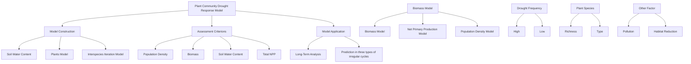
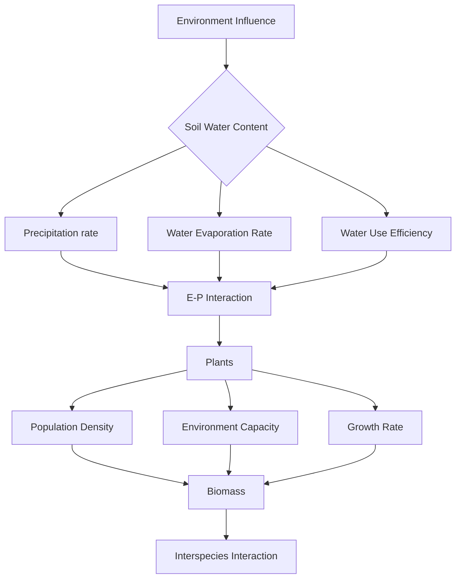
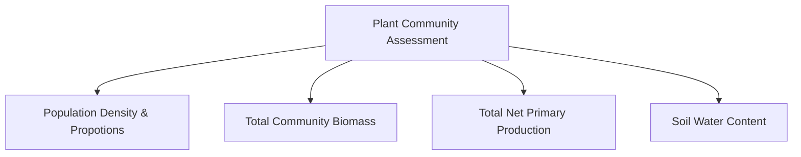

# Drought Tolerance of a Plant Community under Multi-species Interaction

Summary

Drought conditions have a significant effect on plant growth, and different species respond differently to drought. Population interactions in communities can affect the evolution of communities under drought conditions. To study the response of plant communities to drought under multi-species interactions, we used population density, biomass, net primary production (NPP) and soil water content as four evaluation indicators, and integrated the effects of precipitation, evaporation, inter-species interactions, pollution and habitat reduction on plant communities.

Based on the traditional Logistic model, we modified the growth rate term, the maximum environmental holding capacity and the water use efficiency in it, and added an interspecific interaction term. Specifically, a Soil water content model was constructed, and applied to the above three terms (taking into account the drought stress threshold response); an Interspecies interaction model was constructed by analyzing the competition between two plants and applied to multiple populations in the community; the interspecific interaction term was added to the population density model and corrected. After establishing the Population density model, we used the Michaelis-Menten equation to construct the Biomass model from population density and then calculate the net primary productivity (NPP) per unit area of the community. Our fitting results were close to the real values, demonstrating the plausibility of our model.

To explore the effects of various irregular weather cycles on plant communities, we simulated three different precipitation patterns, and used our model to predict four indicators mentioned above. It was found that a moderate, steady humidity is conducive to the growth of plants, and high drought tolerant plants adapt better in dry environment.

To explore the long-term effects of species richness and different species varieties on communities, we chose species from different group combinations (categorized by drought tolerance), and calculated the average total NPP under each species number. We found that when there are at least four species, the plant community shows higher resistance to irregular weather cycles, but the impact was smaller under greater level of drought. Moreover, plants that are less resistant to drought contribute more NPP in a community.

To explore the effects of pollution and habitat reduction on plant communities, we added new factors to the population density model, modified the model to predict changes in total NPP of the plant community under natural precipitation in the area.

Finally, based on these conclusions, we offered suggestions for the conservation of the plant communities and discussed the impact of these measures on wider environment.

Keywords: Drought Stress; Interspecies Relationship; Biodiversity; Population Density; Biomass; Soil Water Content

## Contents

## 1 Introduction 3

1.1 Problem Background 3  
1.2 Restatement of the Problem 3  
1.3 Literature Review 3

1.3.1 Biodiversity and ecosystem stability ..... 3  
1.3.2 Hypotheses of the role of species ..... 4  
1.3.3 The mechanism of biodiversity ..... 4

1.4 Our Work 5

## 2 Glossary 5

## 3 Assumptions and Justifications 6

## 4 Notations 7

## 5 Analysis and Modeling 7

5.1 Analysis: Overall Strategy 7  
5.2 Construction of the Plant Community Drought Response Model ..... 8

5.2.1 Soil water content model 8  
5.2.2 Interspecies interaction model 9  
5.2.3 Population density model ..... 10  
5.2.4 Biomass model 11  
5.2.5 NPP model 12

5.3 Model Solution and Results ..... 12

5.3.1 Data 12  
5.3.2 Results and Model Justification 14

## 6 Prediction under Various Irregular Weather Cycles 14

6.1 Population density 15  
6.2 Total biomass and proportion 16  
6.3 Total NPP and proportion 16  
6.4 Soil water content 17

## 7 Application: Analysis in a Long Term 17

7.1 Influence of species richness and drought frequency ..... 17  
7.2 Influence of plant species 18  
7.3 Influence of pollution and habitat reduction 19

## 8 Suggestions and Impact on Larger Environment 19

## 9 Sensitivity Analysis 20

## 10 Model Evaluation and Further Discussion 20

10.1 Strength 20  
10.2 Weakness 21  
10.3 Future work 21

## 11 Conclusion

21

## 1 Introduction

## 1.1 Problem Background

Different species of plants react to stresses in different ways. Drought is a harsh condition that plants in many regions need to adapt to. Studies have shown that biodiversity plays a key role in how a plant community adapts when exposed to cycles of drought over successive generations. Specifically, in communities with only one species of plant, the generations that follow are not as well adapted to drought as the plants in the successive generations. Specifically, in communities with only one species of plant, the generations that follow are not as well adapted to drought as the plants in communities with four or more species.

In order to come up with plans to ensure the long-term viability of a plant community, we need to study the impact of biodiversity on the adaptation of a plant community to drought. For example, find the minimal number of species necessary for a plant community to benefit from this type of localized biodiversity. For example, find the minimum number of species necessary for a plant community to benefit from this type of localized biodiversity, as well as predict the impact of different levels of drought on plants' adaptation.

## 1.2 Restatement of the Problem

In order to better understand the relationship between drought adaptability and the number of species in a plant community, we need to establish a In order to better understand the relationship between drought adaptability and the number of species in a plant community, we need to establish a mathematical model that predicts how a plant community changes as it is exposed to irregular weather cycles while taking into consideration the Our model should solve the following problems:

- Problem 1: Predict how many different plant species are required for the community to benefit and what happens if the number of species grows.  
- Problem 2: Explain how do the types of species in the community impact your results.  
- Problem 3: Predict the impact of a greater frequency and wider variation of the occurrence of droughts in future weather cycles. And if droughts are less frequent, does the number of species have the same impact on the overall population?  
- Problem 4: Consider the impact of other factors such as pollution and habitat reduction on our conclusions.  
- Problem 5: According to the model, what should be done to ensure the long-term viability of a plant community and what are the impacts on the larger environment?

## 1.3 Literature Review

## 1.3.1 Biodiversity and ecosystem stability

The study of diversity and stability has roughly gone through three broad processes. In the 1950s and 1960s, represented by Elton (1958) and MacArthur (1955), it was argued that an increase in biodiversity during succession would lead to an increase in ecosystem stability [9]. As research progressed, this view was challenged. According to Gardner (1970) and May (1974) and others in the 1970s[6], increasing the number of species, and thus the intensity of their contacts and interactions, would reduce their stability.

More recently, new experimental evidence suggests that increased diversity enhances the stability of ecosystems, and Tilman found that communities with high diversity were more resistant to large droughts and recovered more quickly.

## 1.3.2 Hypotheses of the role of species

In regard to the complexity of the relationship between biodiversity and ecosystem function, ecologists have proposed a number of hypotheses. These hypotheses can generally be grouped into three categories:

1. The first category emphasises the importance of species for ecosystem function, including the Riveting Hypothesis (Ehrlich, 1981) and the Monotonic/Hump Model Hypothesis (Huston & DeAngelis, 1994);  
2. The second category is based on the Redundant Species Hypothesis, including the Redundant Species Hypothesis (Walker, 1992; Lawton & Brown, 1993), the Null Hypothesis and the Weak Interaction Hypothesis (Paine, 1992; Wootton, 1997);  
3. The third category emphasizes the different roles of species and the role of keystone species on ecosystem function and includes the Compensatory/Keystone Species Hypothesis (Lauenroth et al., 1978; Sala et al., 1981), the Non-linear Hypothesis (Schulze & Mooney, 1993) and the Uncertainty Hypothesis (Schindler, 1990; Frost et al., 1994). The Compensatory/Keystone Species Hypothesis suggests that there is a threshold for the role of species richness in influencing ecosystem functioning processes. When diversity falls below this threshold, ecosystem function decreases as diversity decreases, while above it, changes in species richness have little effect on ecosystem function.

## 1.3.3 The mechanism of biodiversity

There are two main types of diversity mechanisms proposed in terms of biological effects.

One group considers that each species makes a 'unique contribution' to ecosystem function. These include the Niche Complementarity Hypothesis, the Positive Interactions between Species Hypothesis and the 'Insurance' Hypothesis.

The Niche Complementarity Hypothesis suggests that there are differences in ecological niches between species in the same community, and that species can complement each other through the niche, resulting in more 'functional space' being occupied by organisms in communities with a higher number of species. The positive interactions between species mechanism hypothesis suggests that some species in an ecosystem interact positively with each other, and that some species may benefit from others (Bertness & Leonard, 1997). The Insurance Hypothesis suggests that differences in ecological niches between species may allow for the 'spreading of risk' between species when ecosystems are subjected to dramatic environmental change.

The other group believes that a certain amount of redundant species do exist in ecosystems, the main theory being the Redundancy Hypothesis $[4]$ . Redundant species are those that can be removed from an ecosystem without affecting its overall function (Lawton & Brown, 1993).

## 1.4 Our Work

flowchart

Figure 1: Our work

## 2 Glossary

- Biodiversity: Biodiversity is the diversity and variability of life on Earth. The degree of variability can be examined at three levels: genetic variation, species diversity, and ecosystem diversity. There are many factors that pose threats to biodiversity, including habitat destruction, climate change, invasive species, pollution, human overpopulation and over-harvesting.[2]  
- Drought stress: A phenomenon in which plant growth is significantly inhibited by a lack of water due to drought.  
- Soil water content: Water content (also known as moisture content) is the amount of water in a material. It is the ratio of the volume of water occupied by the soil to the total volume of the soil. It is defined as $\theta = \frac{V_w}{V_{wet}}$ , where $V_w$ is the volume of water, $V_{\mathrm{wet}}$ is the total volume of soil. The total volume of the soil.  
- Community: A community is a collection of various populations of organisms that gather in the same area or environment at the same time. The basic characteristics of biological communities include the diversity of species, the growth form and structure of the community, dominant species (species in the community that play a decisive role

in the characteristics of the community), and trophic structure, etc.

- Population: Population refers to all individuals of the same species living in a certain natural area at the same time.  
- Population density: Population density is the number of individuals in a population per unit area or volume.  
- Interspecies relationship: The interactions between populations of different species. It can be divided into three categories: neutral interaction, positive mutual interactions (preferential coexistence and mutual benefit) and negative mutual relations (competition, predation, parasitism).  
- Species richness: The number of species in the community.  
- Net Primary Production (NPP): The energy fixed by photosynthesis in the primary production process, which is deducted from the energy consumed by respiration, and the remaining energy can be used for plant growth and reproduction.  
- Water use efficiency: The amount of dry matter produced per unit mass of water consumed by a plant, reflecting the efficiency of energy conversion in the plant production process.

## 3 Assumptions and Justifications

1. The only source of soil moisture is precipitation, and the only consumption is evaporation from the soil and water use of plants.

Water sources such as groundwater are more stable compared to atmospheric precipitation. Our study area is a subtropical monsoon climate zone with high precipitation variability, so the influence of other soil moisture recharge methods can be ignored and atmospheric precipitation can be regarded as the entire source of soil moisture.

In a plant community, plants make up the majority of total biomass and animals do not generally obtain water directly from the soil, so only plant consumption and soil evaporation are considered. And the rate of evaporation of soil water is approximated as a constant.

2. The net photosynthetic rate and water use efficiency of the same plant species over a long time span are seen as constants.

On a larger time scale, we can ignore the different stages of plant growth and reproduction, and treat growth-related quantities as constants and use the average net photosynthetic rate and water use efficiency found for the species to solve the model.

3. When considering environmental factors, only the effects of soil moisture content, pollution and habitat reduction on plant growth are considered, and no associated stresses are taken into account.

Frequent environmental fluctuations are inevitable, and changes in light, temperature, $CO_{2}$ concentration and many other environmental factors can lead to changes in plant growth status, but of the various stress conditions, drought is the most serious threat [8], and in drier climates, water is often the determining factor for plant growth.

4. Only when the soil moisture content falls below a certain threshold does it have an effect on plant growth, reflected in a reduction in growth rate and maximum population density.

Plants have a process of "adaptation" to drought and water shortage, and drought and water shortage do not always result in worse growth performance.[3]

5. Each species in a community has an impact on other species, only to varying degrees.

In an ecosystem, each organism plays a specific role and there are more or less competitive or mutually beneficial symbiotic relationships between various organisms.

## 4 Notations

Notations are shown in Table 1:

Table 1: Notations

<table><tr><td>Symbol</td><td>Description</td><td>Unit</td></tr><tr><td>A</td><td>Soil water content per unit area</td><td> $mm/m^2$ </td></tr><tr><td> $V_s$ </td><td>Soil evaporation rate</td><td> $mm/(m^2 \cdot s)$ </td></tr><tr><td> $V_l$ </td><td>Net photosynthetic rate (NPP)</td><td> $\mu mol/(m^2 \cdot s)$ </td></tr><tr><td>WUE</td><td>Water use efficiency</td><td> $\mu molCO_2/mmolH_2O$ </td></tr><tr><td>P</td><td>Population density</td><td> $plants/m^2$ </td></tr><tr><td> $P_m$ </td><td>Maximum population density</td><td> $palnts/m^2$ </td></tr><tr><td>S</td><td>Average total leaf size per plant</td><td> $m^2$ </td></tr><tr><td> $V_p$ </td><td>Precipitation rate</td><td> $mm/(m^2 \cdot s)$ </td></tr><tr><td>θ</td><td>Soil Water Content</td><td>%</td></tr><tr><td>γ</td><td>Drought stress threshold</td><td>%</td></tr><tr><td>r</td><td>Growth rate</td><td> $plants/(m^2 \cdot month)$ </td></tr><tr><td> $a_{ij}$ </td><td>Interspecies interaction factor</td><td>.</td></tr><tr><td>F</td><td>Biomass per plant</td><td>kg</td></tr><tr><td> $Y_m$ </td><td>Maximum biomass per unit area</td><td> $kg/m^2$ </td></tr><tr><td>N</td><td>Average biomass of individual plants</td><td>kg</td></tr></table>

## 5 Analysis and Modeling

## 5.1 Analysis: Overall Strategy

In order to construct a community growth assessment model that integrates the effects of climate change and plant interspecific relationships, we need to develop functions that describe changes in soil moisture content and its effects on plant growth, the effects of the environment on the community and the community's reaction to the environment, the interactions between different populations, and the relationship between the biomass of individuals in a population and its population density. In particular, a drop in soil moisture content below a threshold will trigger drought stress in plants. The community's reaction to the environment is reflected in changes in soil water content.

flowchart

Figure 2: Mechanism of a plant community development

To assess the growth status of a plant community, we consider the following indicators: population density and proportion of each population, total community biomass, net primary production per unit area and soil water content. The population density and proportion of the population reflects the growth of the community population, the total community biomass and net primary production reflect the health of the community, and the soil water content reflects the response of the plants to the ecological environment of the community.

flowchart

Figure 3: The comprehensive assessment of a plant community

## 5.2 Construction of the Plant Community Drought Response Model

## 5.2.1 Soil water content model

Considering that the soil water content per unit area is influenced by soil evaporation, plant water use and precipitation, we construct the following model:

$$
A (t) = A (t - 1) - V _ {s} \cdot \Delta t - \left[ \sum_ {i = 1} ^ {n} \frac {V _ {l} ^ {i} \cdot S _ {i}}{W U E _ {i}} \cdot P _ {i} (t) \right] \Delta t + V _ {P} \Delta t \tag {1}
$$

Transpiration rate of the current plant community

text_image

Transpiration in plants
Volatilization of soil
precipitation

Figure 4: The Factors Influencing the Soil Water Content

where A(t) is the soil water content per unit area, $V_{s}$ is the soil evaporation rate, i.e. the amount of water evaporated per unit area per unit time, $V_{l}$ is the net photosynthetic rate (NPP), $S_{i}$ is the average leaf size of population i, and $WUE_{i}$ is the water use efficiency of population i. $p_{i}(t)$ is the population density and $V_{p}$ is the precipitation rate.

Figure13 shows the three main factors causing soil water content changes over-time.

When experiencing drought, plants will increase their water use efficiency by reducing transpiration, so the WUE will increase with the degree of drought. We therefore modified WUE with:

$$
W U E ^ {*} = W U E \cdot e ^ {m D (t)} \tag {2}
$$

where WUE is the water use efficiency with sufficient water supply (do not consider the drought stress), and m is the drought response coefficient.

The formula for calculating the soil moisture content is:

$$
\theta (t) = \frac {A ^ {*} (t) \cdot \rho_ {\text { water }}}{1 0 0 0 \cdot \rho_ {\text { soil }} + A ^ {*} (t)}, \tag {3}
$$

where $\theta(t)$ is the soil water content, $\rho_{water}$ is the density of water and $\rho_{soil}$ is the soil density.

## 5.2.2 Interspecies interaction model

Water is a limiting factor for plant growth in the plant communities we study, and plants are in competition with each other for water. The competition between two plants, A and B, is used as an example to model the interactions between different plant populations.

Assuming that both plants conform the Logistic growth under suitable conditions, i.e.

$$
\frac {d N}{d t} = r N \left(1 - \frac {N}{K}\right) \tag {4}
$$

Where K is the environmental holding capacity and N is the biomass of a plant.

In a shared resource space, the growth of plant A consumes part of the water resources, causing a reduction in the amount of water in the soil layer of the root system, thus inhibiting the growth of plant B, and vice versa. Let $\lambda_{1}, \lambda_{2}$ be the water use coefficients of the two plants respectively. $\lambda_{1} + \lambda_{2} = 1$ .

Assuming that plant growth rate is proportional to soil moisture and proportional to biomass, the effective use of water by A is

$$
L _ {1} \left(N _ {1}\right) = \lambda_ {1} \frac {V}{V _ {2}} N _ {1} \tag {5}
$$

And the resulting inhibition of B can be expressed as $\alpha L_{1}(N_{1})N_{2}$ . Similarly, the effective use of water by B is

$$
L _ {2} \left(N _ {2}\right) = \lambda_ {2} \frac {V}{V _ {1}} N _ {2} \tag {6}
$$

The resulting inhibition of A can be expressed as $\beta L_{2}(N_{2})N_{1}$ .

$V_{1}, V_{2}$ represent the individual resource metabolic pools of A and B respectively, and V denotes the size of the overlapping pools of the two resources when they overlap. [1]

The growth equation for A in competition then becomes:

$$
\frac {d N _ {1}}{d t} = r _ {1} N _ {1} \left(1 - \frac {N _ {1}}{K _ {1}}\right) - \beta \lambda_ {2} \frac {V}{V _ {1}} N _ {2} N _ {1} \tag {7}
$$

The growth equation for B in competition becomes:

$$
\frac {d N _ {2}}{d t} = r _ {2} N _ {2} \left(1 - \frac {N _ {2}}{K _ {2}}\right) - \alpha \lambda_ {1} \frac {V}{V _ {2}} N _ {1} N _ {2} \tag {8}
$$

where $\alpha, \beta$ is the scaling factor.

Let $P_{1} = \beta \lambda_{2}\frac{V}{V_{1}}$ and $P_{2} = \alpha \lambda_{1}\frac{V}{V_{2}}$ . Then the above equations become:

$$
\left\{ \begin{array}{l l} \frac {d N _ {1}}{d t} = & N _ {1} r _ {1} \left(1 - \frac {N _ {1}}{K _ {1}}\right) - N _ {1} P _ {1} N _ {2} \\ \frac {d N _ {2}}{d t} = & N _ {2} r _ {2} \left(1 - \frac {N _ {2}}{K _ {2}}\right) - N _ {2} P _ {2} N _ {1} \end{array} \right. \tag {9}
$$

This model can be extended to the interaction between n different populations.

## 5.2.3 Population density model

Based on the Logistic Growth Model, we have:

$$
\left\{ \begin{array}{l} \frac {d x}{d t} = r x \left(1 - \frac {x}{x _ {m}}\right) \\ x (0) = x _ {0} \end{array} \right. \tag {10}
$$

where x is the number of organisms and r is the growth rate, influenced by soil water content.

Define the drought tolerance function for population i as:

$$
D (t) = \max \left(0, \frac {\gamma_ {i} - \theta (t)}{\gamma_ {i}}\right), \theta (t) <   \gamma_ {i} \tag {11}
$$

where $\gamma_{i}$ is the threshold at which drought stress occurs in population i, i.e. when the plant is under drought stress.

The corrected maximum population density is:

$$
P _ {i m} ^ {*} = P _ {i m} [ 1 - D (t) ] \tag {12}
$$

And revise r as:

$$
r ^ {*} = \left\{ \begin{array}{l} r [ 1 - D (t) ], \left(1 - \frac {P _ {i} (t)}{P _ {i m} ^ {*}}\right) > 0 \\ r \cdot D (t), \left(1 - \frac {P _ {i} (t)}{P _ {i m} ^ {*}}\right) <   0 \end{array} \right. \tag {13}
$$

Then the Logistic model is revised as follows:

$$
\frac {d P _ {i} (t)}{d t} = r ^ {*} P _ {i} (t) \left[ 1 - \frac {P _ {i} (t)}{P _ {i m} ^ {*}} \right] \tag {14}
$$

Consider the interaction of different populations in a community with n populations by adding the interspecific interaction factor, i.e. by adding the Interspecific interaction model. The complete population density is then described as:

$$
\frac {d P _ {i} (t)}{d t} = r ^ {*} \cdot P _ {i} (t) \left(1 - \frac {P _ {i} (t)}{P _ {i m} ^ {*}}\right) + \left[ \sum_ {j = 1, j \neq i} ^ {n} a _ {i j} P _ {j} (t) \right] \cdot P _ {i} (t) \tag {15}
$$

Using the difference method, it can be written in matrix form:

$$
\vec {\boldsymbol {P}} (\boldsymbol {t} + \mathbf {1}) = \Delta t \left[ \begin{array}{c} r _ {1} ^ {*} P _ {1} (t) \left(1 - \frac {P _ {1} (t)}{P _ {1 m} ^ {*}}\right) \\ r _ {2} ^ {*} P _ {2} (t) \left(1 - \frac {P _ {2} (t)}{P _ {2 m} ^ {*}}\right) \\ \vdots \\ r _ {n} ^ {*} P _ {n} (t) \left(1 - \frac {P _ {n} (t)}{P _ {n m} ^ {*}}\right) \end{array} \right] + \Delta t \cdot \boxed {\vec {\boldsymbol {M}} (\boldsymbol {t}) \vec {\boldsymbol {P}} (\boldsymbol {t})} \tag {16}
$$

where $\vec{P}(t) = [P_1(t), P_2(t) \ldots P_n(t)]$ , $\vec{M}(t) = [m_{ij}]$ , and $m_{ij} = \frac{P_i(t)}{\Delta t}$ when $i = j$ , $m_{ij} = a_{ij}P_j(t)$ when $i \neq j$ .

## 5.2.4 Biomass model

Weiner et al. constructed a model using the similarity between enzymatic reactions and the processes of plant growth $[10]$ , where plant biomass accumulation is treated as a chemical reaction in which the plant extracts inorganic nutrients present in the environment with the help of density, a catalyst, and converts them through photosynthesis into stored chemical energy. The independent variable in this expression is density and the dependent variable is population biomass or individual biomass $[8]$ . That is, using the Michaelis-Menten equation in chemistry, the relationship between biomass per unit area and density is expressed as:

$$
F (P) = Y _ {m} \left(\frac {P}{P + k}\right) \tag {17}
$$

where $F(N)$ is the biomass per unit area, $Y_{m}$ is the maximum biomass per unit area, P is the population density, and k is the density at which half the maximum biomass is reached, an amount that increases with increasing intensity of drought stress.

$$
k = k _ {n} \left[ 1 + \tan \frac {\pi}{2} D (t) \right] \tag {18}
$$

where $D(t)$ is the drought tolerance function defined above, and $k_{n}$ is the value of k in the suitable condition.

We can see that the biomass is not proportional to the population density, which reflects the self-thinning process, a phenomenon of natural thinning of crops through leaf aging and shedding, reduced branching and even the death of some plants under the conditions of population closure, insufficient supply of water and fertilizer, and malnutrition. It is a process of crop automatic regulation and also an adaptation to the unfavorable growing environment.

## 5.2.5 NPP model

With population density and biomass obtained from the above models, we can calculate the net primary productivity (NPP) as follows:

$$
V _ {l} = \sum \frac {P _ {i} V _ {l i} F _ {0 i}}{F _ {i}} \tag {19}
$$

where $V_{l}$ is the total NPP of the community per unit area, $P_{i}$ is the population density, $V_{li}$ is the net photosynthetic rate of a plant, which is equal to the NPP, $F_{0i}$ is the average biomass of a plant, and $F_{i}$ is the biomass we obtained from the Biomass model.

## 5.3 Model Solution and Results

## 5.3.1 Data

We selected the Ocala National Forest in central Florida, USA as our study site, which covers 607 square miles and is located 3 miles east of Ocala and southeast of Gainesville, as shown on the map:

text_image

Ocala National Forest
Pinus palustris
75

Figure 5: Ocala National Forest, Florida

The reasons are as follows:

1. Depending on the degree of drought tolerance, plants can be divided into four categories: highly drought-tolerant plants, moderately drought-tolerant plants, low drought-tolerant plants and non-drought-tolerant plants [7]. The park contains all four types of drought-tolerant plants, which facilitates our study of the different populations.  
2. Although located in a subtropical monsoon climate zone, the park often suffers dry weather, which facilitates our study of the effects of climate.

We have obtained data from the official website of the Ocala National Forest on the eight species of plants in the forest park, divided into the following categories:

- Highly drought tolerant plants(HDTP): Pinus palustris, Agave;  
- Moderately drought tolerant plants(MDTP): Quercus fabri, Acer macrophyllum;  
- Low drought tolerant plants(LDTP): Populus nigra, Acer rubrum;  
• Drought intolerant plants(DIP): Taxodium distichum, Populus alba.

Their parameters are as follows:

Table 2: parameters of eight different plant species

<table><tr><td></td><td>Species</td><td>NPP</td><td>WUE</td><td>ALS</td><td>PD</td><td>TV</td><td>Biomass</td></tr><tr><td rowspan="2">HDTP</td><td>Pinus palustris</td><td>4</td><td>6</td><td>17.5</td><td>0.695</td><td>30%-40%</td><td>9</td></tr><tr><td>Agave</td><td>5.8</td><td>2.09</td><td>7</td><td>0.415</td><td>20%-30%</td><td>5</td></tr><tr><td rowspan="2">MDTP</td><td>Quercus fabri</td><td>5.5</td><td>3.3</td><td>10</td><td>0.48</td><td>40%-50%</td><td>23</td></tr><tr><td>Acer macrophyllum</td><td>10</td><td>3</td><td>25</td><td>0.097</td><td>35.4%</td><td>13</td></tr><tr><td rowspan="2">LDTP</td><td>Populus nigra</td><td>8.2</td><td>5.1</td><td>15</td><td>0.335</td><td>50.2%</td><td>35</td></tr><tr><td>Acer rubrum</td><td>5.5</td><td>5</td><td>10</td><td>0.732</td><td>55.8%</td><td>40</td></tr><tr><td rowspan="2">DIP</td><td>Taxodium distichum</td><td>12</td><td>8.1</td><td>26</td><td>0.21</td><td>64.3 %</td><td>60</td></tr><tr><td>Populus alba</td><td>5.3</td><td>5.5</td><td>14</td><td>0.6</td><td>72.9%</td><td>200</td></tr></table>

Monthly variation in precipitation in the area was obtained from the nearby observatory, Orlando International Airport. The data are as follows:

bar chart

| date | precipitation(mm) |
| --- | --- |
| 2014-08 | 100 |
| 2014-09 | 110 |
| 2014-10 | 120 |
| 2014-11 | 130 |
| 2014-12 | 140 |
| 2015-01 | 150 |
| 2015-02 | 160 |
| 2015-03 | 170 |
| 2015-04 | 180 |
| 2015-05 | 190 |
| 2015-06 | 200 |
| 2015-07 | 210 |
| 2015-08 | 220 |
| 2015-09 | 230 |
| 2015-10 | 240 |
| 2015-11 | 250 |
| 2015-12 | 260 |
| 2016-01 | 270 |
| 2016-02 | 280 |
| 2016-03 | 290 |
| 2016-04 | 300 |
| 2016-05 | 310 |
| 2016-06 | 320 |
| 2016-07 | 330 |
| 2016-08 | 340 |
| 2016-09 | 350 |
| 2016-10 | 360 |
| 2016-11 | 370 |
| 2016-12 | 380 |
| 2017-01 | 390 |
| 2017-02 | 400 |
| 2017-03 | 410 |
| 2017-04 | 420 |
| 2017-05 | 430 |
| 2017-06 | 440 |
| 2017-07 | 450 |
| 2017-08 | 460 |
| 2017-09 | 470 |
| 2017-10 | 480 |
| 2017-11 | 490 |
| 2017-12 | 500 |
| 2018-01 | 510 |
| 2018-02 | 520 |
| 2018-03 | 530 |
| 2018-04 | 540 |
| 2018-05 | 550 |
| 2018-06 | 560 |
| 2018-07 | 570 |
| 2018-08 | 580 |
| 2018-09 | 590 |
| 2018-10 | 600 |
| 2018-11 | 610 |
| 2018-12 | 620 |
| 2019-01 | 630 |
| 2019-02 | 640 |
| 2019-03 | 650 |
| 2019-04 | 660 |
| 2019-05 | 670 |
| 2019-06 | 680 |
| 2019-07 | 690 |
| 2019-08 | 700 |
| 2019-09 | 710 |
| 2019-10 | 720 |
| 2019-11 | 730 |
| 2019-12 | 740 |
| 2020-01 | 750 |
| 2020-02 | 760 |
| 2020-03 | 770 |
| 2020-04 | 780 |
| 2020-05 | 790 |
| 2020-06* | - |
| ... | ... |
| ... | ... |
| ... | ... |
| ... | ... |
| ... | ... |
| ... | ... |
| ... | ... |
| ... | ... |
| ... | ... |
| ... | ... |
| ... | ... |
| ... | ... |
| ... | ... |
| ... | ... |
| ... | ... |

Figure 6: Precipitation monthly change

## 5.3.2 Results and Model Justification

Precipitation and population density data between 2014 and 2021 were used to fit the Plant Community Drought Response Model on a month-by-month basis.

Population densities of various populations in 2022 were projected and compared to the actual value, as shown below:

line chart

| Mouth | Pinus palustris | Agave | Quercus fabri | Acer macrophyllum | Populus nigra | Acer rubrum | Taxodium distichum | Populus alba |
|-------|-----------------|-------|---------------|-------------------|---------------|-------------|--------------------|--------------|
| 1     | 0.026           | 0.021 | 0.034         | 0.040             | 0.044         | 0.048       | 0.051              | 0.038        |
| 2     | 0.027           | 0.022 | 0.035         | 0.041             | 0.045         | 0.049       | 0.052              | 0.039        |
| 3     | 0.028           | 0.023 | 0.036         | 0.042             | 0.046         | 0.050       | 0.053              | 0.040        |
| 4     | 0.029           | 0.024 | 0.037         | 0.043             | 0.047         | 0.051       | 0.054              | 0.041        |
| 5     | 0.030           | 0.025 | 0.038         | 0.044             | 0.048         | 0.052       | 0.055              | 0.042        |
| 6     | 0.031           | 0.026 | 0.039         | 0.045             | 0.049         | 0.053       | 0.056              | 0.043        |
| 7     | 0.032           | 0.027 | 0.040         | 0.046             | 0.050         | 0.054       | 0.057              | 0.044        |
| 8     | 0.033           | 0.028 | 0.041         | 0.047             | 0.051         | 0.055       | 0.058              | 0.045        |
| 9     | 0.034           | 0.029 | 0.042         | 0.048             | 0.052         | 0.056       | 0.059              | 0.046        |
| 10    | 0.035           | 0.030 | 0.043         | 0.049             | 0.053         | 0.057       | 0.060              | 0.047        |
| 11    | 0.036           | 0.031 | 0.044         | 0.050             | 0.054         | 0.058       | 0.061              | 0.048        |
| 12    | 0.037           | 0.032 | 0.045         | 0.051             | 0.055         | 0.059       | 0.062              | 0.049        |

Figure 7: Predicted Population Densities in 2020

Table 3: Comparison between Predicted Results and Actually Values

<table><tr><td></td><td>Pinus palustris</td><td>Agave</td><td>Quercus fabri</td><td>Acer macrophyllum</td></tr><tr><td>AVG</td><td>0.033</td><td>0.026</td><td>0.041</td><td>0.049</td></tr><tr><td>SD</td><td>0.33%</td><td>0.25%</td><td>0.41%</td><td>0.49%</td></tr><tr><td></td><td>Populus nigra</td><td>Acer rubrum</td><td>Taxodium distichum</td><td>Populus alba</td></tr><tr><td>AVG</td><td>0.053</td><td>0.058</td><td>0.063</td><td>0.047</td></tr><tr><td>SD</td><td>0.53%</td><td>0.58%</td><td>0.62%</td><td>0.46%</td></tr></table>

We can see that the predicted values are close to the real data, which justifies our model.

## 6 Prediction under Various Irregular Weather Cycles

We have simulated the following stochastic rainfall patterns:

- Mode a: drought response, sudden drought in the presence of adequate precipitation  
- Mode b: drought recovery, sudden precipitation in a dry situation

## - Mode c: totally random

bar chart

| Group | Precipitation(mm) |
|-------|-------------------|
| a     | 25                |
| a     | 28                |
| a     | 30                |
| a     | 27                |
| a     | 26                |
| a     | 24                |
| a     | 23                |
| a     | 22                |
| a     | 21                |
| a     | 20                |
| a     | 19                |
| a     | 18                |
| a     | 17                |
| a     | 16                |
| a     | 15                |
| a     | 14                |
| a     | 13                |
| a     | 12                |
| a     | 11                |
| a     | 10                |
| a     | 9                 |
| a     | 8                 |
| a     | 7                 |
| a     | 6                 |
| a     | 5                 |
| a     | 4                 |
| a     | 3                 |
| a     | 2                 |
| a     | 1                 |
| a     | 0                 |
| b     | 23                |
| b     | 24                |
| b     | 25                |
| b     | 26                |
| b     | 27                |
| b     | 28                |
| b     | 29                |
| b     | 30                |
| b     | 31                |
| b     | 32                |
| b     | 33                |
| b     | 34                |
| b     | 35                |
| b     | 36                |
| b     | 37                |
| b     | 38                |
| b     | 39                |
| b     | 40                |
| b     | 41                |
| b     | 42                |
| b     | 43                |
| b     | 44                |
| b     | 45                |
| b     | 46                |
| b     | 47                |
| b     | 48                |
| b     | 49                |
| b     | 50                |
| b     | 51                |
| b     | 52                |
| b     | 53                |
| b     | 54                |
| b     | 55                |
| b     | 56                |
| b     | 57                |
| b     | 58                |
| b     | 59                |
| b     | 60                |
| b     | 61                |
| b     | 62                |
| b     | 63                |
| b     | 64                |
| b     | 65                |
| b     | 66                |
| b     | 67                |
| b     | 68                |
| b     | 69                |
| b     | 70                |
| b     | 71                |
| b     | 72                |
| b     | 73                |
| b     | 74                |
| b     | 75                |
| b     | 76                |
| b     | 77                |
| b     | 78                |
| b     | 79                |
| b     | 80                |
| b     | 81                |
| b     | 82                |
| b     | 83                |
| b     | 84                |
| b     | 85                |
| b     | 86                |
| b     | 87                |
| b     | 88                |
| b     | 89                |
| b     | 90                |
| b     | 91                |
| b     | 92                |
| b     | 93                |
| b     | 94                |
| b     | 95                |
| b     | 96                |
| b     | 97                |
| b     | 98                |
| b     | 99                |
| b     | 100               |
| c     | 20                |
| c     | 21                |
| c     | 22                |
| c     | 23                |
| c     | 24                |
| c     | 25                |
| c     | 26                |
| c     | 27                |
| c     | 28                |
| c     | 29                |
| c     | 30                |
| c     | 31                |
| c     | 32                |
| c     | 33                |
| c     | 34                |
| c     | 35                |
| c     | 36                |
| c     | 37                |
| c     | 38                |
| c     | 39                |
| c     | 40                |
| c     | 41                |
| c     | 42                |
| c     | 43                |
| c     | 44                |
| c     | 45                |
| c     | 46                |
| c     | 47                |
| c     | 48                |
| c     | 49                |
| c     | 50                |
| c     | 51                |
| c     | 52                |
| c     | 53                |
| c     | 54                |
| c     | 55                |
| c     | 56                |
| c     | 57                |
| c     | 58                |
| c     | 59                |
| c     | 60                |
| c     | 61                |
| c     | 62                |
| c     | 63                |
| c     | 64                |
| c     | 65                |
| c     | 66                |
| c     | 67                |
| c     | 68                |
| c     | 69                |
| c     | 70                |
| c     | 71                |
| c     | 72                |
| c     | 73                |
| c     | 74                |
| c     | 75                |
| c     | 76                |
| c     | 77                |
| c     | 78                |
| c     | 79                |
| c     | 80                |
| c     | 81                |
| c     | 82                |
| c     | 83                |
| c     | 84                |
| c     | 85                |
| c     | 86                |
| c     | 87                |
| c     | 88                |
| c     | 89                |
| c     | 90                |
| c     | 91                |
| c     | 92                |
| c     | 93                |
| c     | 94                |
| c     | 95                |
| c     | 96                |
| c     | 97                |
| c     | 98                |
| c     | 99                |
| C      | -                 |

The data is grouped into three panels labeled A, B, and C. The y-axis represents precipitation in millimeters (mm). The x-axis represents the index of the x-axis (ranging from - to +). The y-axis is labeled as 'A' and 'B'. The data series are color-coded: red for A, green for B, and blue for C. The y-axis is labeled as 'b', 'c', and 'd' respectively.

Figure 8: Three Different rainfall patterns

Using the above model, population densities, total biomass per unit area of the community and the proportion of different species, total NPP per unit area of the community, and soil water content were predicted over a 1-year period under the model to provide a comprehensive picture of the effects of irregular climate on the community, when the effects of interspecies interactions are taken into account.

## 6.1 Population density

We predicted the population densities of Pinus palustris and Populas alba (the most and least drought enduring species) for one year under different precipitation patterns. Initial population densities were set to the same value of $0.1 \, plants/m^{2}$ .

Results are shown below:

line chart

| Mode | Pinus palustris | Populus nigra |
|------|-----------------|---------------|
| a    | 0.10            | 0.10          |
| 400-50 | 0.11            | 0.10          |
| 50   | 0.12            | 0.06          |
| 100  | 0.13            | 0.02          |
| 200  | 0.14            | 0.00          |
| 350  | 0.15            | 0.14          |

Figure 9: Population Densities under Three Weather Patterns

In Mode a and c, the two species both increase in population density, while in Mode a when more water is provided, the Populas adapt slightly better, and in Mode c when rainfall is moderate, the two species show a similar growth.

In Mode b, the two population densities first experienced similar growth when the remaining water in the soil was relatively sufficient. However, as time goes by, water became insufficient for Populas alba, leading to its rapid decline.

## 6.2 Total biomass and proportion

Based on the predicted population densities and using the Biomass model, we calculated the biomass per unit area for four species Pinus palustris, Quercus fabri, Populus nigra and Taxodium distichum, and calculated the total biomass of the plant community, as well as the percentage of biomass for each population.

pie chart

| Category | Pinus (%) | Quercus (%) | Populus nigra (%) | Taxodium distichum (%) |
| :--- | :--- | :--- | :--- | :--- |
| Total Biomass | 89.69 | 64.05 | 148.94 | 148.94 |
| Pie Chart 1 | 15.8 | 17 | 31.9 | 35.3 |
| Pie Chart 2 | 31.5 | 26.6 | 19.9 | 22 |
| Pie Chart 3 | 23.6 | 15.2 | 29.1 | 32.2 |

Figure 10: Total Biomass and Proportion under Mode a, b and c

We can see that total biomass per unit area is highest when the amount of rainfall is relatively moderate and more steady (Mode c). And when experiencing irregular weather cycles, a greater frequency in rainfall is better for plant community than a greater frequency in droughts.

Moreover, the proportion of each species differs in each rainfall pattern. In Mode a, Taxodium distichum (DIP) constitutes the largest proportion while in Mode b, Pinus palustris (HDTP) constitutes the largest. This indicates that HDTPs adapt better to higher frequencies of drought, while DIPs adapt better to higher frequencies of rainfall.

## 6.3 Total NPP and proportion

Using the NPP model, we predicted the total NPP and the constitution:

pie chart

| Sample | Pinus (%) | Quercus (%) | Populus nigra (%) | Taxodium distichum (%) |
| :--- | :--- | :--- | :--- | :--- |
| Total NPP | 28.58 | 24.59 | 30.57 | 34.18 |
Total NPP: 28.58 μmol/(m²·s)

Figure 11: Total NPP and Proportion under Mode a, b and c

The patterns are similar to that of biomass.

## 6.4 Soil water content

In order to reflect the environmental regulation function of plants in the plant community, we calculated the change in soil water content over a five-year period to reflect the water storage capacity of the soil. The results are as follows:

line chart

| t    | Mode a | Mode b | Mode c |
| ---- | ------ | ------ | ------ |
| 0    | 0.1    | 0.05   | 0.1    |
| 100  | 0.3    | 0.2    | 0.25   |
| 200  | 0.6    | 0.3    | 0.4    |
| 300  | 0.8    | 0.4    | 0.6    |
| 400  | 0.9    | 0.5    | 0.75   |
| 500  | 0.85   | 0.45   | 0.65   |
| 600  | 0.75   | 0.4    | 0.55   |
| 700  | 0.7    | 0.35   | 0.5    |
| 800  | 0.6    | 0.3    | 0.4    |
| 900  | 0.5    | 0.25   | 0.3    |
| 1000 | 0.4    | 0.2    | 0.2    |
| 1100 | 0.3    | 0.15   | 0.15   |

Figure 12: The change of Soil Water Content under Mode a, b and c

The change in soil water content is consistent with the pattern of rainfall.

## 7 Application: Analysis in a Long Term

In order to study the influence of the environment on community succession at long time scales, we considered the effects of community species richness and species variety, the frequency of drought events, pollution and habitat reduction on communities. At the same time, we analysed the effect of changes in the frequency of each drought on the species richness factor.

As total community NPP reflects the productive capacity of a plant community, it is used as an indicator of the community health.

## 7.1 Influence of species richness and drought frequency

Species richness and community structure significantly influence a community's resistance to disturbance, and difference in the frequency and degree of drought events can influence the sensitivity to this bio-factor. To explore the influence of species number on the community under different weather patterns, we first simulated two weather patterns, one with greater drought frequencies and one less.

Then we divided the species of this plant community into four categories according to their drought resistance, chose species from different group combinations under the same species number, and calculated the average total NPP under each species number. The results are shown below:

stacked bar chart

| Number of Species | Below Average NPP under Higher Drought Condition | Average NPP under Higher Drought Condition | Average NPP under Lower Drought Condition | Average NPP under Lower Drought Condition |
| :--- | :--- | :--- | :--- | :--- |
| 1 | 6 | 10 | 10 | 5 |
| 2 | 15 | 18 | 18 | 13 |
| 3 | 22 | 24 | 24 | 17 |
| 4 | 24 | 26 | 26 | 20 |
| 5 | 26 | 27 | 27 | 22 |
| 6 | 28 | 28 | 28 | 24 |
| 7 | 29 | 29 | 29 | 25 |
| 8 | 30 | 30 | 30 | 26 |

Figure 13: Influence of Species Richness under Different Drought Degrees

We can see that when there are more than four species, the plant community is relatively resistant to irregular weather cycles.

By comparing the figure in the two weather patterns, we also found that under more frequent and longer drought events, the total NPP is lower and the impact of species richness is slightly less significant, as reflected in the slope. This is probably because NPP of each plant decreases with more frequent drought events, so the increase in total NPP becomes less clear.

## 7.2 Influence of plant species

Apart from the influence of species richness, the type of species also influences NPP of a plant community. Based on the above result, we simulated what will happen if a new species is introduced to a plant community with 4, 5 and 6 species respectively. To analyze the significance of an added species, we calculated the proportional increase in total NPP per unit area compared to the average NPP in the original community, as shown below:

bar chart

| Species | HDTP | MDTP | LDTP | DIP |
| :--- | :--- | :--- | :--- | :--- |
| 5 Species | 0.08 | -0.0758 | 0.0906 | 0.0497 |
| 6 Species | -0.0693 | -0.0693 | 0.0797 | 0.0438 |
| 7 Species | -0.0619 | -0.0457 | 0.0665 | 0.041 |

Figure 14: Influence of an Added Plant Species

where HDTP stands for high drought tolenrent plants, MDTP stands for the moderately drought tolerant plant, LDTP stands for the low drought tolerant plant, and DIP stands for the drought intolerant plant.

## 7.3 Influence of pollution and habitat reduction

Pollution can adversely affect the growth of plants, as reflected in the inhibition of population density growth. To reflect the effect of pollution, we add the pollution inhibition term to the model, which is modified as:

$$
\frac {d P _ {i} (t)}{d t} = r ^ {*} \cdot P _ {i} (t) \left(1 - \frac {P _ {i} (t)}{P _ {i m} ^ {*}}\right) + \left[ \sum_ {j = 1, j \neq i} ^ {n} a _ {i j} P _ {j} (t) \right] \cdot P _ {i} (t) - \rho P _ {i} (t) \tag {20}
$$

where $\rho$ is the pollution inhibition coefficient, and its magnitude reflects the severity of pollution. We applied the model to Pinus palustris and Quercus fabri. The results are as figure 15. We can see that pollution inhibits the growth of plants, and, in extreme cases, even causes the extinction of a plant population.

line chart

| Pollution Factor | Pinus palustris | Quercus fabri |
| ---------------- | -------------- | ------------- |
| 0.0              | 0.45           | 0.47          |
| 0.2              | 0.40           | 0.43          |
| 0.4              | 0.30           | 0.32          |
| 0.6              | 0.20           | 0.18          |
| 0.8              | 0.10           | 0.08          |
| 1.0              | 0.05           | 0.03          |

Figure 15: Influence of Pollution

line chart

| φ    | Pinus | Quercus |
| ---- | ----- | ------- |
| 0.0  | 0.0   | 0.0     |
| 0.2  | 0.05  | 0.04    |
| 0.4  | 0.15  | 0.12    |
| 0.6  | 0.35  | 0.30    |
| 0.8  | 0.65  | 0.55    |
| 1.0  | 0.95  | 0.75    |

Figure 16: Influence of Habitat Decrease-ment

The reduction of plant living space directly reduces the population environmental holding capacity, so for habitat reduction, we correct the environmental holding capacity in the model, i.e., change $P_{im}^{*}$ to $\psi P_{im}^{*}$ , where $\psi$ is the habitat coefficient, $0 \leq \psi \leq 1$ . The larger the habitat, the greater its value. The results of the above two species are as figure 16.

We can see that population densities of the two species grow with the increase of $\psi$ , indicating that habitat loss can have a significant negative effect on plant communities.

## 8 Suggestions and Impact on Larger Environment

For the community system with a small number of species, in order to protect the biological community and improve the ecological environment, we suggest to artificially introduce an appropriate amount of other plant species into the community to make full use of the regulatory effect of local species diversity on the ecological environment.

According to our analysis of the influence of plant species, introducing species that are less tolerant to drought contributes more to the total NPP of a community, since drought-intolerant plants tend to have larger biomass and leaf size, which facilitates photosynthesis.

This increased resistance to drought contributes to the long-term evolution of the community in a longer time span. Plant diversity can improve soil water content, the increase of the which helps the plant species with weak drought resistance but higher productivity to survive in the community, thus promoting the community evolution.

A more stable plant community plays an important role in regulating climate. Through transpiration, water is lost to the atmosphere, increasing the humidity of the air, therefore increasing precipitation. Moreover, by absorbing carbon dioxide, plant communities can mitigate the greenhouse effect, therefore slowing down the global warming.

## 9 Sensitivity Analysis

The growth rate is an important parameter in our model. In order to explore the impact of growth rate change on population density, we changed the growth rate of eight populations within the deviation range of -5% to 5% to obtain population densities. The results are shown as follows:

line chart

| Species             | Deviation(%) | Population Density |
| ------------------- | ------------ | ------------------ |
| Pinus palustris     | 0.96         | 0.03               |
| Pinus palustris     | 0.98         | 0.035              |
| Pinus palustris     | 1.00         | 0.04               |
| Pinus palustris     | 1.02         | 0.045              |
| Pinus palustris     | 1.04         | 0.05               |
| Pinus palustris     | 1.06         | 0.055              |
| Quercus fabri       | 0.96         | 0.04               |
| Quercus fabri       | 0.98         | 0.045              |
| Quercus fabri       | 1.00         | 0.05               |
| Quercus fabri       | 1.02         | 0.055              |
| Quercus fabri       | 1.04         | 0.06               |
| Quercus fabri       | 1.06         | 0.065              |
| Populus nigra       | 0.96         | 0.05               |
| Populus nigra       | 0.98         | 0.055              |
| Populus nigra       | 1.00         | 0.06               |
| Populus nigra       | 1.02         | 0.065              |
| Populus nigra       | 1.04         | 0.07               |
| Populus nigra       | 1.06         | 0.075              |
| Acer macrophyllum   | 0.96         | 0.05               |
| Acer macrophyllum   | 0.98         | 0.055              |
| Acer macrophyllum   | 1.00         | 0.06               |
| Acer macrophyllum   | 1.02         | 0.065              |
| Acer macrophyllum   | 1.04         | 0.07               |
| Acer macrophyllum   | 1.06         | 0.075              |
| Acer rubrum         | 0.96         | 0.06               |
| Acer rubrum         | 0.98         | 0.065              |
| Acer rubrum         | 1.00         | 0.07               |
| Acer rubrum         | 1.02         | 0.075              |
| Acer rubrum         | 1.04         | 0.08               |
| Acer rubrum         | 1.06         | 0.085              |
| Taxodium distichum  | 0.96         | 0.06               |
| Taxodium distichum  | 0.98         | 0.065              |
| Taxodium distichum  | 1.00         | 0.07               |
| Taxodium distichum  | 1.02         | 0.075              |
| Taxodium distichum  | 1.04         | 0.08               |
| Taxodium distichum  | 1.06         | 0.085              |
| Populus alba        | 0.96         | 0.04               |
| Populus alba        | 0.98         | 0.045              |
| Populus alba        | 1.00         | 0.05               |
| Populus alba        | 1.02         | 0.055              |
| Populus alba        | 1.04         | 0.06               |
| Populus alba        | 1.06         | 0.065              |
| Agave               | 0.96         | 0.02               |
| Agave               | 0.98         | 0.025              |
| Agave               | 1.00         | 0.03               |
| Agave               | 1.02         | 0.035              |
| Agave               | 1.04         | 0.04               |
| Agave               | 1.06         | 0.045              |

Figure 17: Sensitivity Analysis of r

line chart

| Species | 95%    | 105%   |
| ------- | ------ | ------ |
| 1       | 0.131  | 0.147  |
| 2       | 0.124  | 0.137  |
| 3       | 0.123  | 0.136  |
| 4       | 0.124  | 0.137  |
| 5       | 0.124  | 0.137  |
| 6       | 0.123  | 0.135  |
| 7       | 0.123  | 0.135  |
| 8       | 0.122  | 0.134  |

Figure 18: The Rationship between Species and Derivation

Observing the left graph, it can be seen that as r increases, the population density of each species in steady state also increases. The right graph shows the relationship between deviation and species diversity. Species 1-8 are Pinus palustris, Agave, Quercus favri, Acer macrophyllum, Populus nigra, Acer rubrum, Taxodium distichum, and Populus alba, respectively.

## 10 Model Evaluation and Further Discussion

## 10.1 Strength

1. When constructing the population density model, drought stress was innovatively considered, and the growth rate and maximum environment holding capacity were corrected. Moreover, drought stress is triggered only when the soil water content falls below a certain threshold, which is consistent with the real situation.

2. We derived the effect of interspecific competition on growth rate from a simple two-plant model and extended it to the whole community, adding an interspecific interaction term to the Community Drought Response Model and fitted an interaction coefficient matrix to show the interrelationship between species.

3. In the assessment of community condition, four indicators: population density, biomass, net primary productivity and soil water content, were considered to comprehensively show the stability and health of the community.

4. The self-thinning effect was considered when calculating biomass, and the total biomass per unit area and population density were integrated to assess the status of the population.

## 10.2 Weakness

1. We corrected the growth rate and maximum population density simply by a linear function, which can only be analyzed qualitatively.  
2. We did not consider the effect of drought on other environmental factors such as temperature and light, and only considered its effect on soil water content.  
3. When discussing the effects of pollution and habitat reduction, the origin of pollution factors and habitat factors were not quantified, and values were selected simply according to the degree, making it difficult to conduct quantitative analysis.

## 10.3 Future work

1. Obtain the data of other plant communities and use our model to facilitate the conservation of plant communities in irregular climate pattern.  
2. In the context of global warming, consider the effects of climate change on global precipitation, temperature, and light in a comprehensive manner. Consider the effect of temperature change on soil evaporation and the effect of light change on net photosynthesis of plants to further revise our model.  
3. Quantify pollution indicator, and modify the pollution phase to quantitatively describe the effects of pollution on plant growth, and search for pollution-tolerant populations. The counteraction of plant communities to pollution can also be studied to provide new ideas for pollution prevention and control.

## 11 Conclusion

Our Plant community drought response model considers the effects of drought frequency and interspecies interactions on plant communities. The main conclusions are as follows:

1. Under the three different precipitation patterns, the drought-responsive mode (Mode a) showed that Taxodium distichum, which was intolerant to drought, was more adaptable to the environment, while in the drought recovery mode (Mode b), Pinus palustris was the dominant species. In the random Mode (Mode c), there was no significant difference in the growth status of plants.  
2. Moderate humidity was beneficial to community development, since Mode c community had the highest total biomass and total NPP.  
3. When the number of species is larger than 4, the community is more resistant to irregular climate, which is reflected in the total NPP per unit area. When drought frequency was higher, the effect of community diversity was less significant.  
4. When species richness is greater than 4, adding the less drought-tolerant plants to the community can improve community productivity greater than adding drought-tolerant plants.  
5. Pollution and habitat loss inhibit the population density in a plant community, and may even cause extinction of some species.

## References

[1] Zhang Caiqin and Yang Zhi. Simulation of different plant growth dynamics in inner mongolia typical steppe during the growing season. Acta ecologica sinica, 27(9):3618–3629, 2007.  
[2] Jim Chen. Across the apocalypse on horseback: imperfect legal responses to biodiversity loss. Wash. UJL & Pol'y, 17:13, 2005.  
[3] Zhao Hong, WANG Runyuan, Shang Yan, WANG Heling, Zhang Kai, ZHAO Funian, Qi Yue, and Chen Fei. Research progress and prospect on the response of grain crops to high temperature and drought stress and its threshold. Arid weather, 34(1):1–12, 2016.  
[4] Wang Jiang. Effects of drought stress on the relationship between biodiversity and ecosystem function, 2006.  
[5] Robert MacArthur. Fluctuations of animal populations and a measure of community stability. ecology, 36(3):533–536, 1955.  
[6] Robert M May. Will a large complex system be stable? Nature, 238:413–414, 1972.  
[7] Chaves MM, Maroco JP, and Pereira JS. Understanding plant responses to drought - from genes to the whole plant. Funct Plant Biol, 30(3):239–264, Mar 2003.  
[8] Zhu Saiyong. Mathematical model construction and mechanism investigation of drought reducing optimum density of dryland wheat. 2021.  
[9] David Tilman and David Wedin. Dynamics of nitrogen competition between successional grasses. Ecology, 72(3):1038–1049, 1991.

[10] Jacob Weiner and Robert P Freckleton. Constant final yield. Annual Review of Ecology, Evolution, and Systematics, 41:173–192, 2010.