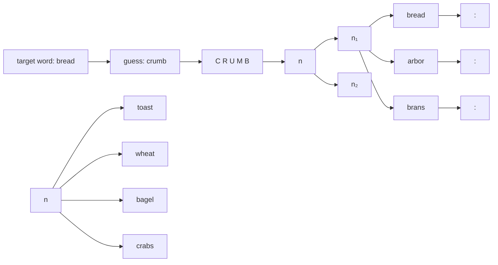
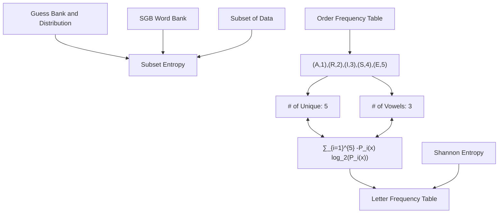
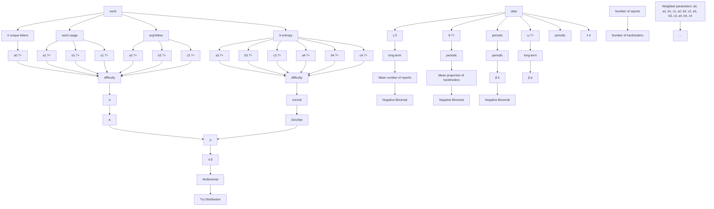

With the rising popularity of Wordle, people have eagerly taken to Twitter to report their results daily by the tens of thousands. Three very natural questions arise regarding this data: (1) Can we use this data to predict the difficulty of a given target word in Wordle? (2) Can we use this data to predict future Wordle player reporting trends? (3) How does the difficulty of given target word affect player reporting and results? In our paper, we develop a comprehensive Bayesian model consisting of three submodels which predict the distribution of the number of guesses, number of reported results on Twitter and the number of reporting players playing in hard mode.

Initially, we decompose words into quantifiable traits associated with relevant difficulty characteristics. Most notably, we formulate a novel Wordlespecific entropy measure we call Subset Entropy which effectively quantifies the average amount of information revealed by typical players after initial guesses. We also develop a method to represent the distribution of player attempts, and hence the observed difficulty of a word, using just two values α, β corresponding to the cumulative mass function of the Beta distribution. We use a preliminary Lasso regression to isolate the most relevant predictors of word difficulty, which we then use in our Bayesian model.

Our Bayesian model predicts, for a given date and word, the reported difficulty of a word, the number of player reports, and the number of players reporting playing in hard-mode. To accomplish these three tasks, it is made up of three submodels which are conditionally independent given the data, making it efficient to sample from its posterior using Markov Chain Monte-Carlo (MCMC).

We find that a word having a higher number of unique letters, usage frequency in English, average number of revealed yellow squares over all guesses, and Subset Entropy all make a word easier for players to guess. We also find that higher word difficulty decreases the number of player reports. Under the assumption that the Times choose words randomly, this can be interpreted as a causal effect.

Our model is able to predict outcomes for new data and retrodict for old data. Our model gives gives a 95% prediction interval that between 20238 and 27876 players will report results for “eerie” on March 1, 2023 and that it will be in the 50th percentile of difficulty. Most notably, our model does not just provide such simple point estimates and prediction intervals, but full posterior distributions.

Keywords: Entropy, Lasso regression, MCMC, Bayesian methods, Causal inference

## How many Wordle words will Wordle guessers guess if Wordle’s Wednesday Wordle word is “Eerie”?

## Contents

1 Introduction 3  
2 Data 3

2.1 Data cleaning 3  
2.2 Wordbank 4

3 Word & Difficulty Representation 4

3.1 Vowels . 5  
3.2 Usage 5  
3.3 Green & Yellow Tiles . 5  
3.4 Unique Letters 6  
3.5 Entropies 6  
3.6 Representation of word difficulty . . 8

4 Modeling Methodology 9

4.1 Lasso regression . . 9  
4.2 Bayesian models for prediction . . 10

5 Model Results 14

5.1 Interpretation of parameter posteriors . . 14  
5.2 Retrodiction . . 15  
5.3 Prediction 15  
5.4 Difficulty representation 16

6 Model Evaluation 18

6.1 Limitations 18  
6.2 Strengths 18

7 Conclusion 19

## 1 Introduction

Wordle is a language-based game currently owned by the New York Times that became a viral sensation in early 2022. The goal of the game is simple to understand: At the the start of each day there is a 5-letter target word that players have to guess. Players have six tries to do so, and attempt to get the word in as few attempts as possible, each time using a valid English word.

There are 11,881,376 possible 5-letter words if taking every possible sequence of five letters. Even restricting it to words found in English dictionaries and those in common usage today would only drop it down to around 12,000 and 4,000 words respectively[2]. For a person to randomly guess a target word in six tries would statistically be almost impossible. This, however, is where tile color feedback comes into play. For a given guess word, for each letter Wordle returns a green tile if the corresponding letter is in the target word and in the right location, a yellow tile if the corresponding letter is in the true word but in the wrong location, and a gray tile if neither of these is true. With this information, most players are able to guess the word from thousands of possibilities within six tries.

The game has captured the attention of millions, with people taking to social media to share their guess results and comment on the difficulty for certain words. One Twitter account that has popped up as a result of this trend is “@WordleStats”, a bot that tallies all posted Wordle attempts and the distribution of attempts each day. Via this data, we can discover a wealth of information about Wordle player behavior. Particularly, in this paper we develop a model which utilizes both the trends in twitter reporting and the resulting inferred difficulty of target words gleamed from this data to predict future Wordle statistics.

## 2 Data

## 2.1 Data cleaning

Data errors We fixed several errors that appear in the provided data by referencing the Twitter posts of the @WordleStats Twitter bot. These are logged below for full transparency.

• Day 239: hardmode 3249 → 9249  
• Day 314: tash → trash  
• Day 500: hardmode 3667 → 2667  
• Day 525: clen → clean  
• Day 529: Reported players 2569 → 25569  
• Day 540: na¨ıve → naive (¨ı is not a letter in Wordle)  
• Day 545: rprobe → probe

Percentages to counts Because the percentages of reports in the different categories are rounded and do not necessarily sum to 100, we divided the percentages in each row by their sum to obtain proportions. As our Bayesian model predicts the number of players in each category, we converted these proportions into counts by applying the following method for each row:

1. Multiply the proportions by the number of reports on that day to obtain “counts” with decimal values  
2. Round the counts down  
3. Add 1 back to the counts, in order from the count which was rounded down most to that which was rounded down least, until the total again matches the number of reports on that day.

This method gives counts which correspond to the given percentages, are integers, and whose sum is the number of reports on that day.

## 2.2 Wordbank

To model 5-letter words and their properties, we rely on the Stanford GraphBase (SGB) wordbank of 5757 5-letter words created by Donald Knuth [6], which provides a good approximation of the set of words that a player could guess and expect as a target. This word bank is then used in a few different ways. First off, it is used to build the Order Frequency table and the Letter Frequency table. The Letter Frequency table tells us how often each letter appears in 5-letter words, and follows what we would expect. S and E are the most common letters, followed by A and O. The Order Frequency table then shows given that a certain letter is in the word, what proportion of the time is that letter in each position (e.g. given A is in a word, it is the 4th letter 24% of the time).

As will be detailed later on, we also use this table in numerous word specific calculations, namely computing for a given word t the average number of green, yellow and colored tiles that are returned on any guess chosen uniformly at random from the SGB wordbank when t is the actual target word. Additionally, for any word g we compute the average number of colors returned when a target word t is chosen uniformly at random from the SGB wordbank and g is guessed, which gives a somewhat naive but reasonable metric to evaluate guess words players would use. Using this guess word metric, we compile a list of the 30 words with the highest corresponding average, which we take to be a set of common guess words (see Figure 1). This list will be used in the calculation of Subset Entropy later on.

## 3 Word & Difficulty Representation

Many factors contribute towards the difficulty associated with a given word. For example, ‘‘zingy’’ intuitively seems to be difficult for a variety of reasons - it has uncommon letters (“z” and “y”), only one “canonical” vowel, and is a generally infrequently used word in English. A word like ‘‘onion’’ on the other hand would also seem to be difficult, despite all of its letters being fairly common and its usage in every day spoken language being much higher. The reason it is perceived as difficult is due to a repetition of the letter “o” and “n”, which people may be less likely to guess again once they have already discovered one position of. Thus, given a word, our first task was to list and quantify such characteristics, so that when evaluating word difficulty later on we could instead simply consider the vector of values corresponding to these relevant characteristics.

<table><tr><td>Word</td><td>Avg Colors</td></tr><tr><td>arose</td><td>2.12176481</td></tr><tr><td>raise</td><td>2.0656592</td></tr><tr><td>arise</td><td>2.0656592</td></tr><tr><td>aloes</td><td>2.0654855</td></tr><tr><td>stoe</td><td>2.06531179</td></tr><tr><td>laser</td><td>2.06461699</td></tr><tr><td>earls</td><td>2.06461699</td></tr><tr><td>reals</td><td>2.06461699</td></tr><tr><td>tears</td><td>2.06444329</td></tr><tr><td>rates</td><td>2.06444329</td></tr><tr><td>stare</td><td>2.06444329</td></tr><tr><td>aster</td><td>2.06444329</td></tr><tr><td>tares</td><td>2.06444329</td></tr><tr><td>snare</td><td>2.01233281</td></tr><tr><td>earns</td><td>2.01233281</td></tr><tr><td>nears</td><td>2.01233281</td></tr><tr><td>saner</td><td>2.01233281</td></tr><tr><td>nares</td><td>2.01233281</td></tr><tr><td>aisle</td><td>2.00937989</td></tr><tr><td>least</td><td>2.00816397</td></tr><tr><td>tales</td><td>2.00816397</td></tr><tr><td>steal</td><td>2.00816397</td></tr><tr><td>slate</td><td>2.00816397</td></tr><tr><td>stale</td><td>2.00816397</td></tr><tr><td>teals</td><td>2.00816397</td></tr><tr><td>tesla</td><td>2.00816397</td></tr><tr><td>taels</td><td>2.00816397</td></tr><tr><td>stela</td><td>2.00816397</td></tr><tr><td>reads</td><td>1.99426785</td></tr><tr><td>dares</td><td>1.99426785</td></tr></table>

<table><tr><td></td><td>Frequency</td><td colspan="2">Frequency</td></tr><tr><td>s</td><td>0.105367</td><td>y</td><td>0.030780</td></tr><tr><td>e</td><td>0.104534</td><td>m</td><td>0.029286</td></tr><tr><td>a</td><td>0.081570</td><td>h</td><td>0.028279</td></tr><tr><td>o</td><td>0.066528</td><td>b</td><td>0.024839</td></tr><tr><td>r</td><td>0.066354</td><td>g</td><td>0.023589</td></tr><tr><td>i</td><td>0.055307</td><td>k</td><td>0.020705</td></tr><tr><td>l</td><td>0.055098</td><td>f</td><td>0.019489</td></tr><tr><td>t</td><td>0.055063</td><td>w</td><td>0.017544</td></tr><tr><td>n</td><td>0.044641</td><td>v</td><td>0.011047</td></tr><tr><td>d</td><td>0.041028</td><td>x</td><td>0.004829</td></tr><tr><td>u</td><td>0.037832</td><td>z</td><td>0.004690</td></tr><tr><td>c</td><td>0.033490</td><td>j</td><td>0.003092</td></tr><tr><td>p</td><td>0.033177</td><td>q</td><td>0.001841</td></tr></table>

Figure 1: Left: 30 Most common words based on overlap. Right: Frequency of Letters in the SGB wordbank

## 3.1 Vowels

In all letter-guessing based games (beyond Wordle think hangman), a typical strategy is to exploit the higher frequency of letters which are vowels in words. In Wordle, the presence of particular vowel should tend to be discovered faster than those of non-vowels, leading to a reasonable assumption that words with more vowels will on average be easier to guess. Thus, one characteristic computed and considered for each word was the number of vowels it contained (excluding $ { ^ { 6 } \mathrm { y } ^ { \mathrm { , 5 } } }$ , as this is a traditionally uncommon letter and hence does not align with the reasoning given above for why we consider vowels in the first place).

## 3.2 Usage

It makes sense that words which are used more commonly will be more familiar to people, and hence easier to guess from given clues. Using the wordfreq library [5] in python, this value was easily returned for each word under consideration.

## 3.3 Green & Yellow Tiles

Another desirable feature of a target word is that there is a high likelihood that after any given guess Wordle will return a large number of green and yellow squares. Once this occurs, players get very direct hints that they can immediately put into action. Thus, for any given word, we computed the the average number of green, yellow, and colored (i.e. non-gray) tiles returned considering the given word as the target and assuming guesses were drawn uniformly at random from the SGB wordbank.

## 3.4 Unique Letters

When Wordle returns a color for a letter, it does not tell the player how many times that certain letter appears. Thus, while it may be easier to initially obtain green tiles for words with repeated letters, players may also be less likely to guess those same letters again in different positions. As a result, it seems justified to consider the number of unique letters in a word as playing a part in the difficulty of guessing it, and hence this value was computed for each considered word.

text_image

K A P U T
K I N K S

Figure 2: The repeated letter does not show up if the first guess is correct, it gives no indication that there is a second k.

## 3.5 Entropies

One of the core ideas in information theory is that of entropy, which is a measure that quantifies the amount of information conveyed by a given event. In the context of a Wordle game, we can consider an event to be a particular choice of a player’s move, i.e. a guess word along with the corresponding positional colors Wordle returns as a result. Clearly this event gives us some information about the target word, and a reasonable question to ask is how much information? Once such a value is quantified formally, one can consider the “best” guess words to be those which result in a higher amount of information on average (over a uniform distribution of all possible 5-letter target words). Conversely, target words are more difficult to guess which, by some efficient text encoding, contain more information, $o r$ which result in lower amount of information being obtained on average (over some distribution of possible guessed words). These two ideas idea are formalized via two entropy formulations we give below, the first being a more typical application of the standard Shannon Entropy function, and the second being a more novel notion of entropy we developed specific to Wordle itself.

## 3.5.1 Positional Entropy

The original use case of entropy came from encoding, with more frequent symbols and common arrangements taking less bits to transmit. Our Positional Entropy takes this approach by considering a word to contain more information if its letters and letter arrangements are less common/more unusual. Using the Letter Frequency table and Order frequency table from the SGB word bank, for a given letter $\phi$ we calculate $P _ { i } ( \phi )$ as the probability a word has the letter $\phi$ in its $i ^ { \mathrm { t h } }$ location. These probabilities can then be plugged into the standard Shannon Entropy function H [4], where X denotes a 5-letter word and $X _ { i }$ corresponds to its $i ^ { \mathrm { t h } }$ letter, as follows:

$$
H (X) := \sum_ {i = 1} ^ {5} - P _ {i} (X _ {i}) \log_ {2} (P _ {i} (X _ {i}))
$$

Note that under this metric, words which have more unusual letter placements, and hence can reasonably be assumed to be more difficult, will have a higher value.

## 3.5.2 Subset Entropy

Our second entropy formulation is that of Subset Entropy, which is a novel Wordle-inspired metric we developed that, on a given word, quantifies the average amount of information which is revealed about it following one Wordle guess chosen from some distribution. This metric is motivated by the idea that on a given target word t with a chosen guess word of $^ { g , }$ information is obtained via the output colors and their corresponding positions which allows one to disqualify other candidate target words $t ^ { \prime } .$ For example, if the target word under consideration is bread and the word crumb is guessed, then the corresponding output from Wordle would allow us to eliminate words such as toast and crabs as possible target words, but not allow us to eliminate arbor. An example illustrating this idea and our notation is given in figure 3.

Before we detail Subset Entropy, first we define $f _ { t } ( g )$ as the factor by which the candidate answer pool shrinks after word $g$ is guessed and t is the target word. More formally, considering the notation in figure 3 we have:

$$
f _ {t} (g) = \frac {n}{n _ {1}}
$$

where $n$ is the size of the original candidate answer pool and $n _ { 1 }$ is the size of the resulting candidate answer pool. As an example, a guess g when the given target word is t which results in the possible answer pool shrinking from 4, 000 to 1, 000 words would have $f _ { t } ( g ) = 4$ . Note that if $g _ { 1 }$ is a better guess than $g _ { 2 }$ given the target word is $t ,$ we have that $f _ { t } ( g _ { 1 } ) > f _ { t } ( g _ { 2 } )$ , while if a target word $t _ { 1 }$ is easier to guess than $t _ { 2 }$ using a guess $g$ then $f _ { t _ { 1 } } ( g ) > f _ { t _ { 2 } } ( g )$ .

In typical entropy style, we take the base 2 logarithm of this factor which is computed, and define:

$$
I _ {t} (g) = \log_ {2} (f _ {t} (g))
$$

We use this value to correspond to our notion of the information conveyed by the event of guessing g on target t. The motivation for choosing this value as opposed to $f _ { t } ( g )$ directly is that Subset Entropy will aim to quantify the average information following the first guess when word t is the target, and hence will need to take an average over some quantification of information. As $f _ { t }$ effectively measures a multiplicative factor of information (rather than additive), taking a geometric rather than arithmetic mean would be more appropriate. However, as the average of the log value of some terms exactly corresponds to the log of the geometric mean of these terms, we can effectively instead consider the expectation of $I _ { t } ( g )$ over some distribution of guesses D as a measure of the geometric mean of the factors. With this justification in hand, we have the following formulation of Subset Entropy:

$$
e (t) = \mathbb {E} _ {g \sim \mathcal {D}} [ I _ {t} (g) ]
$$

where D is some distribution over the possible guess words.

In the actual implementation of our model, we considered D to be a uniform distribution over the 30 most common guess words list (see figure 1). In particular, this model assumes that players guess one of the 30 best words to guess according to the average color metric. We decided this was reasonable, as many common words guessed or words similar to them, such as “slate”, appeared to be on the list.

flowchart

Figure 3: Diagram representing the Subset Entropy method. For a target word bread, a guess crumb is made and Wordle tells the player that R must be in the second position and B is somewhere in the word, but not in the last position. Furthermore, Wordle tells the player that C, U and M are not in the target word. This information defines a subset of $n _ { 1 }$ words that are compatible with it.

## 3.6 Representation of word difficulty

To aid in modeling and interpretation, ideally the 7-vector data (of players who got the word in 1 try, 2 tries, . . . , failed) which effectively represents the observed difficulty of a word, should be encapsulated with fewer numbers. We can view these seven categories as a discrete space and the observed proportion as a discrete probability mass function over them. By assuming an ordering of $1 < 2 < \ldots < X$ , we then take the cumulative mass function that corresponds to the probability mass function. After embedding the domain into the interval [0, 1] by the map $( i \mathrm { \ t r i e s } ) { \mapsto } i / 7$ and $X \mapsto 1$ , it turns out that the Beta distribution, a two-parameter continuous distribution over [0, 1], has a cumulative distribution function that can fit the embedded cumulative mass function closely (see figure 4). We then model reader attempts with the cumulative distribution of the Beta distribution, whose probability density function is:

$$
f (x; \alpha , \beta) = \frac {1}{B (\alpha , \beta)} x ^ {\alpha - 1} (1 - x) ^ {\beta - 1},
$$

where $B ( \alpha , \beta )$ is the Beta function. To figure out the exact values of $\alpha , \beta$ that best fit the embedded cumulative mass function, we use non-linear least-squares as implemented in $\mathtt { s c i p y } [ 7 ]$ . By observing the figures above and from the properties of the Beta distribution, we can conclude a few properties of α and $\beta \colon$ :

• $\mathrm { A s } \ \alpha \uparrow$ while all else is held equal, the word is considered more difficult  
• As $\beta$ ↑ while all else is held equal, the word is considered easier  
• $\alpha + \beta$ will give how concentrated the distribution is around the expected value, with higher values being more concentrated.  
• The ratio $\frac { \alpha } { \alpha + \beta }$ α+β gives the expected value of the Beta distribution, which is a representation of the difficulty of a word, with higher values corresponding to a higher difficulty.

Because of these properties, particularly the final one, α and $\beta$ together are an effective and simple representation of the difficulty of a word. Figure 5 shows $\alpha / ( \alpha + \beta )$ computed from the observed reported distributions for all previous words.

line chart

| Cumulative number of guesses | Proportion of reports |
| ---------------------------- | --------------------- |
| ct1                          | 0.0                   |
| ct2                          | 0.05                  |
| ct3                          | 0.25                  |
| ct4                          | 0.5                   |
| ct5                          | 0.75                  |
| ct6                          | 0.95                  |

line chart

| Cumulative number of guesses | Observed | Beta(7.0, 6.2) fit |
| ---------------------------- | -------- | ------------------ |
| ct1                          | 0.0      | 0.0                |
| ct2                          | 0.0      | 0.0                |
| ct3                          | 0.2      | 0.2                |
| ct4                          | 0.6      | 0.6                |
| ct5                          | 0.9      | 0.9                |
| ct6                          | 1.0      | 1.0                |

line chart

| Cumulative number of guesses | Observed | Beta(4.2, 5.4) fit |
| ----------------------------- | -------- | ------------------ |
| ct1                           | 0.0      | 0.0                |
| ct2                           | 0.15     | 0.15               |
| ct3                           | 0.5      | 0.5                |
| ct4                           | 0.8      | 0.8                |
| ct5                           | 0.95     | 0.95               |
| ct6                           | 1.0      | 1.0                |

line chart

| Cumulative number of guesses | Observed | Beta(5.0, 2.6) fit |
| ---------------------------- | -------- | ------------------ |
| ct1                          | 0.0      | 0.0                |
| ct2                          | 0.0      | 0.0                |
| ct3                          | 0.1      | 0.1                |
| ct4                          | 0.3      | 0.3                |
| ct5                          | 0.6      | 0.6                |
| ct6                          | 0.9      | 0.9                |

Figure 4: Beta Distribution fit to the cumulative proportion of guesses for Wordle words of various difficulty.

## 4 Modeling Methodology

## 4.1 Lasso regression

Once we have all the variables that can be extracted from the word itself, we must use select a subset of them to include in the Bayesian model, as the time taken by MCMC increases significantly with the number of variables in the model and we must keep the run-time reasonable. To select more important predictors, we use Lasso regression. Lasso regression penalizes large coefficients, which in turn forces less important variables to have coefficients of zero. Lasso Regression has the following cost function:

$$
\min _ {\beta} \sum_ {i = 1} ^ {n} \left(y _ {i} - \sum_ {j = 1} ^ {P} x _ {i j} \beta_ {j}\right) ^ {2} + \lambda \sum_ {j = 1} ^ {P} | \beta_ {j} |,
$$

where $x _ { i j }$ is the value of the jth predictor for the ith data point, and $\beta _ { j }$ is the jth coefficient. λ is a tuning parameter which after experimentation we set to 0.1 to obtain the desired number of parameters (four). As seen in the cost function, Lasso regression seeks to minimize the error between true and predicted, while also having the sum of all coefficients be small.

With our parameters, there are seven separate Lasso Regression models being run simultaneously, one on the proportion of people who succeeded in one try, one on those who succeeded in two tries, and so on until the final one for those who failed. Four parameters appeared repeatedly with nonzero coefficients in these regressions: the number of unique letters, the word’s usage frequency, the average number of yellow squares revealed, and the Subset Entropy.

histogram

| α/(α + β) Bin | Density |
| ------------- | ------- |
| 0.40 - 0.42   | 0.5     |
| 0.42 - 0.44   | 1.2     |
| 0.44 - 0.46   | 3.0     |
| 0.46 - 0.48   | 1.8     |
| 0.48 - 0.50   | 6.5     |
| 0.50 - 0.52   | 8.5     |
| 0.52 - 0.54   | 7.8     |
| 0.54 - 0.56   | 8.2     |
| 0.56 - 0.58   | 4.5     |
| 0.58 - 0.60   | 3.5     |
| 0.60 - 0.62   | 2.8     |
| 0.62 - 0.64   | 3.2     |
| 0.64 - 0.66   | 1.5     |
| 0.66 - 0.68   | 0.8     |
| 0.68 - 0.70   | 0.5     |
| 0.70 - 0.72   | 0.3     |
| 0.72 - 0.74   | 0.2     |
| 0.74 - 0.76   | 0.1     |
| 0.76 - 0.78   | 0.1     |
| 0.78 - 0.80   | 0.1     |

Figure 5: Observed distribution of $\alpha / ( \alpha + \beta )$ , a measure of word difficulty.

flowchart

Figure 6: Inputs into the Lasso Regression

## 4.2 Bayesian models for prediction

We use a Bayesian model comprising three conditionally independent submodels to model the distribution of tries (the Try model), the number of reports (the Reports model), and the number of hard-mode players (or “hardmoders,” in the Hardmoders model). This model is displayed in Figure 7.

flowchart

Figure 7: Combined diagram of the three Bayesian models. Shapes with rounded corners are variables, and rectangles are observed data. Numbers indicate the dimension of vectors (all other variables and data are scalars). In yellow is the model for predicting the proportion of hardmoders, in red is the model for predicting the number of reports, and in blue is the model for predicting the distribution of the number of tries. Numbers outside the shapes indicate the dimensions of data and variables when they are not scalars. Conditioned on the observed data, the random variables of all three models are independent, which allows their posteriors to be inferred in three separate runs of MCMC. Note that the number of reports from the Reports model is fed into the Try model and the Hardmoders model. In green are the $\alpha$ and $\beta$ values, which are the parameters of the Beta distribution corresponding to a word’s difficulty distribution p.

## 4.2.1 Common components

Word difficulty Each of the three Bayesian models takes in four predictors that somehow correspond with difficulty. Since the effect of difficulty on the try distribution, the number of reports and the number of hardmoders is not necessarily the same, we do a separate regression within each of these models:

$$
\mathbf {d} _ {\text { try }} = \mathbf {a} _ {0} + \mathbf {a} _ {1} x _ {1} + \mathbf {a} _ {2} x _ {2} + \mathbf {a} _ {3} x _ {3} + \mathbf {a} _ {4} x _ {4} \tag {1}
$$

$$
d _ {\text { reports }} = b _ {1} x _ {1} + b _ {2} x _ {2} + b _ {3} x _ {3} + b _ {4} x _ {4} \tag {2}
$$

$$
d _ {\text { hardmoders }} = c _ {1} x _ {1} + c _ {2} x _ {2} + c _ {3} x _ {3} + c _ {4} x _ {4} \tag {3}
$$

where a’s $b \mathrm { ^ { \prime } s } .$ , and c’s are coefficients to be estimated, and $x _ { i } \mathrm { { ^ { * } s } }$ are predictors. Note that the Try model has both ${ \bf d } _ { \mathrm { t r y } }$ and the ${ \bf a } _ { i }$ coefficients as 7-vectors. Note also that the Try model is the only one with an intercept in this component, as in the others the intercept is captured by other terms. Each of the coefficients has a prior of Normal(0, 20), which is wide enough to be uninformative.

Day-of-week effects In both the number of reports and the proportion of hardmoders, there are periodic day-of-week effects. In the Reports and Hardmoders models, these are modeled similarly:

$$
P _ {\text { reports }} = \sum_ {i = 1} ^ {7} \theta_ {i} \cdot \mathbf {1} (\text {   i   th   day   of   week   }) \tag {4}
$$

$$
P _ {\text { hardmoders }} = \sum_ {i = 1} ^ {7} \omega_ {i} \cdot \mathbf {1} (\text { ith   day   of   week }) \tag {5}
$$

The θ and ω coefficients are modeled as having Normal(0, 1) prior distributions.

## 4.2.2 Try model

The model for the distribution of tries (the Try model) is fundamentally a Dirichlet-Multinomial model. For a given word on a given day, we model the vector $( t _ { 1 } , t _ { 2 } , \ldots , t _ { 7 } )$ , where $t _ { i } , i < 7$ is the number of reports who got the word on the ith try, and $t _ { 7 }$ is the number of reported failures, as coming from the Multinomial distribution:

$$
(t _ {1}, t _ {2}, t _ {3}, t _ {4}, t _ {5}, t _ {6}, t _ {7}) \sim \mathrm{Multinomial} (n, 7, (p _ {1}, p _ {2}, p _ {3}, p _ {4}, p _ {5}, p _ {7})),
$$

where n is the number of reports on that day, and $\mathbf { p } = ( p _ { 1 } , p _ { 2 } , p _ { 3 } , p _ { 4 } , p _ { 5 } , p _ { 7 } )$ is a probability 7-vector $\textstyle \big ( \sum _ { i = 1 } ^ { 7 } p _ { i } = 1 \big )$ of the probabilities that a report reports success on the first try, second try, and so on. This vector itself is modeled as coming from the Dirichlet distribution, which is a distribution over discrete probability distributions:

$$
(p _ {1}, p _ {2}, p _ {3}, p _ {4}, p _ {5}, p _ {7}) \sim \mathrm{Dirichlet} (7, (A _ {1}, A _ {2}, A _ {3}, A _ {4}, A _ {5}, A _ {6}, A _ {7})),
$$

where $\pmb { A } = ( A _ { 1 } , A _ { 2 } , A _ { 3 } , A _ { 4 } , A _ { 5 } , A _ { 6 } , A _ { 7 } )$ is the vector of concentration parameters for the Dirichlet distribution, $A _ { i } > 0$ . The logarithm of these concentration parameters is itself drawn from a Normal distribution:

$$
\ln (A _ {i}) \sim \mathrm{Normal} (d _ {\mathrm{try}, i}, \sigma),
$$

where $d _ { \mathrm { t r y } , i }$ is as defined by Equation 1. $\sigma$ is a variance parameter which has a prior of Exponential(1).

## 4.2.3 Reports model

The model for the number of reports (the Reports model) is fundamentally an overdispersed Poisson regression. The number of reports on a given day can clearly be modeled as a Poisson distribution with a certain rate. However, since there is additional variation in the observed number of reports beyond just Poisson error that is not accounted for by the predictors, we must use an overdispersed version of the Poisson distribution (i.e. a distribution that behaves like the Poisson, but with additional errors). The Negative Binomial distribution, when parameterized correctly, has this property. Hence we model the number of reports for a given word on a given day as:

$$
n \sim \mathrm{NegativeBinomial} \left(\exp (L _ {\mathrm{reports}} + P _ {\mathrm{reports}} + d _ {\mathrm{reports}}), B\right).
$$

$L _ { \mathrm { r e p o r t s } } , \ P _ { \mathrm { r e p o r t s } }$ , and $d _ { \mathrm { r e p o r t s } }$ correspond to the long-term trend in the number of reports, the periodic trend, and the effect of difficulty, respectively. The periodic trend is defined in Equation 4. The effect of difficulty is defined in Equation 2. B is a parameter describing the overdispersion, and is modeled as having an Exponential(0.01) prior distribution so as to allow it to be large.

Because of the correspondence of the long-term trend with the shape of a Gamma distribution, we parameterize $L _ { \mathrm { r e p o r t s } }$ as a function that recalls the probability density function of the Gamma distribution:

$$
L _ {\mathrm{reports}} = \gamma_ {1} ((T - \gamma_ {5}) ^ {\gamma_ {2}}) \exp (- (T - \gamma_ {5}) / \gamma_ {3}) + \gamma_ {4},
$$

where $T$ is a time value for the word. $T$ is scaled such that the first word in the data has $T = 0$ and the last word has $T = 1$ . The $\gamma _ { i }$ coefficients have, according to their role in the equation, different prior distributions. γ1, γ2, and $\gamma _ { 3 }$ all have an Exponential(1) prior distribution, $\gamma _ { 4 }$ has an Exponential(0.01) prior distribution, and $\gamma _ { 5 }$ has a Normal(0, 1) prior distribution. These choices of priors are uninformative when considering the scale of $T$ .

## 4.2.4 Hardmoders model

The model for the number of people who reported playing in hard-mode (the Hardmoders model) is fundamentally a Beta-Binomial regression. Given the number of reports on a given day, the number of hardmoders is described by a Binomial distribution with a certain probability. However, since there is additional variation in the observed number of hardmoders beyond just the error of the Binomial which is not accounted for by the predictors, the probability itself is modeled as coming from a Beta distribution.

Hence we model the number of hardmoders $n _ { h }$ for a given word on a given day as:

$$
n _ {h} \sim \mathrm{Binomial} (n, p)
$$

where $n$ is the number of reports on that day and $p$ is the probability that someone reports playing in hardmode. $p$ itself is modeled as:

$$
p \sim \mathrm{Beta} (\eta \kappa , (1 - \eta) \kappa),
$$

where:

$$
\eta = \mathrm{logit} ^ {- 1} (L _ {\mathrm{hardmoders}} + P _ {\mathrm{hardmoders}} + d _ {\mathrm{hardmoders}})
$$

Note that $\eta$ is the mean of this Beta distribution, as $E [ p ] = \eta \kappa / ( \eta \kappa + ( 1 - \eta ) \kappa ) = \eta$ . Correspondingly, κ controls the spread of the distribution. $L _ { \mathrm { h a r d m o d e r s } } ,$ Phardmoders, and $d _ { \mathrm { h a r d m o d e r s } }$ correspond to the long-term trend in the number of hardmoders, the periodic trend, and the effect of difficulty, respectively. The periodic trend is defined in Equation 5. The effect of difficulty is defined in Equation 3. κ effectively controls the overdispersion of the Beta-Binomial model, and is modeled as having an HalfCauchy(0.5) prior distribution, which is has a long tail and acts as an uninformative prior.

We then parameterize $L _ { \mathrm { h a r d m o d e r s } }$ as a function that can follow the observed shape:

$$
L _ {\mathrm{hardmoders}} = \lambda_ {1} ((T - \lambda_ {4}) ^ {\lambda_ {2}}) + \lambda_ {3},
$$

where $T$ is a time value for the word. $T$ is scaled such that the first word in the data has $T = 0$ and the last word has $T = 1$ . The $\lambda _ { i }$ coefficients have, according to their role in the equation, different prior distributions. $\lambda _ { 1 } , \lambda _ { 2 }$ , and $\lambda _ { 3 }$ all have an Exponential(1) prior distribution, $\lambda _ { 4 }$ has a Normal(0, 1) prior distribution. These choices of priors are uninformative when considering the scale of T .

## 4.2.5 Obtaining the posteriors

Rather than computing simple point estimates for the parameters, we obtain full posterior distributions given the data. These are obtained by using Markov Chain Monte-Carlo (MCMC) to iteratively sample from the joint posterior distribution of the variables. Because the three submodels are conditionally independent given the data, we run MCMC on the three submodels separately. In particular, we use the No U-Turn Sampler [1] as it is implemented in PyMC [3].

## 5 Model Results

Once the posterior distributions of the parameters of three submodels are obtained, we can glean information from the distributions, and both predict and retrodict by feeding words and dates through the model to obtain posterior predictions.

## 5.1 Interpretation of parameter posteriors

The posteriors of the model parameters can tell us something about what attributes of a word affect a word’s difficulty, the number of scores reported, or the percentage of hardmoders. The posteriors on the ${ \bf a } _ { i }$ coefficients obtained in the Try model all indicate an effect on the distribution of results in the seven different categories. A higher number of unique letters, frequency of word usage, average number of yellow squares revealed, or Subset Entropy all cause the word to be easier to guess, which is reflected in positive ${ \bf a } _ { i }$ coefficients for the number of people guessing the word on the second try, and negative ${ \bf a } _ { i }$ coefficients for the number of people guessing the word on the sixth try. The word cause is used intentionally here. The correlations that the coefficients indicate can be interpreted as causal with the simple assumption that Wordle words are chosen completely at random. This is because, if words are chosen randomly, any correlation

Retrodictions for the numbers of reports and hardmoders for past words and dates.

line chart

| Contest number | 95% posterior prediction interval | Observed value |
| -------------- | --------------------------------- | -------------- |
| 0              | ~300000                           | ~300000        |
| 50             | ~250000                           | ~250000        |
| 100            | ~150000                           | ~150000        |
| 150            | ~80000                            | ~80000         |
| 200            | ~40000                            | ~40000         |
| 250            | ~20000                            | ~20000         |
| 300            | ~10000                            | ~10000         |
| 350            | ~5000                             | ~5000          |

line chart

| Contest number | Observed value | 95% posterior prediction interval (lower) | 95% posterior prediction interval (upper) |
| -------------- | -------------- | ---------------------------------------- | ---------------------------------------- |
| 0              | 0              | 0                                        | 0                                        |
| 50             | 15000          | 10000                                    | 16000                                    |
| 100            | 8000           | 6000                                     | 10000                                    |
| 150            | 4000           | 3000                                     | 5000                                     |
| 200            | 2000           | 1500                                     | 3000                                     |
| 250            | 1500           | 1000                                     | 2500                                     |
| 300            | 1000           | 800                                      | 2000                                     |
| 350            | 800            | 600                                      | 1800                                     |

line chart

| Contest number | Proportion of hardmoders (observed value) | Proportion of hardmoders (95% posterior prediction interval) |
| -------------- | ------------------------------------------ | ------------------------------------------------------------- |
| 0              | 0.00                                       | 0.00                                                          |
| 100            | ~0.06                                      | ~0.07                                                         |
| 200            | ~0.08                                      | ~0.09                                                         |
| 300            | ~0.10                                      | ~0.11                                                         |
| 350            | ~0.11                                      | ~0.12                                                         |

Figure 8: Posterior-predicted distributions for the number of reports, the number of hardmoders, and the proportion of hardmoders over all past words and dates. The models seem to capture the long-term trend and variation in the data well.

between a word’s properties and the Try distribution must be due to an effect of the word’s properties on the Try distribution, and not due to a reverse effect or a confounding variable.

Likewise, the posterior distributions of the $b _ { i } \mathrm { ^ { * } s }$ are largely positive. This indicates that, for easier words, more people report their results. The posterior distributions of almost all of the $c _ { i }$ coefficients include zero, suggesting that, beyond the effect of the total number of reports decreasing, there is no additional effect on the number of hardmoders. On the contrary, the posterior for $c _ { 1 }$ is largely negative, which counteracts the effect of a decreased total number of reports on the number of hardmoder reports. Again, it is possible to read causation from correlation in these results as that is the only possible way to explain the variation under the assumption that a day’s Wordle word is chosen randomly. One possible causal interpretation is that the set of players who play on hard mode is more consistent with reporting their results.

Surprisingly, the $\theta _ { i }$ and $\omega _ { i }$ coefficients are centered around zero, indicating no evidence for a periodic effect. This suggests that there are insufficient data to, in combination with the effects of word difficulty and long-term effects, reliably estimate a periodic effect.

## 5.2 Retrodiction

The model can be used to make predictions for past data. Figure 8 shows the posterior predictions for the number of reports, the number of hardmoders, and the proportion of hardmoders for the dates and words given, as well as the observed values. The model seems to capture the variation in the data as well as the long-term trend. Figure 9 shows the posterior predictions for the try distribution of fungi, a past Wordle word, and shows good agreement with the truth.

## 5.3 Prediction

The model can also be used to make predictions for future, unseen data. This can be done either for a future date and word, like eerie on March 1, 2023, or for a date alone (by the posterior predictions for that date averaged over all observed Wordle words). Figure 10 shows predictions for the difficulty of eerie. Figure 11 shows, in general and for eerie in particular, predictions for the number of reported scores on March 1, the number of hardmoders, and the proportion of hardmoders. Table 1 gives prediction intervals for several different quantities of interest if eerie is the word on March 1.

violin chart

| Preoperative Trial | Proportion of reports |
| ------------------ | --------------------- |
| 1 try              | ~0.0                  |
| 2 tries            | ~0.05                 |
| 3 tries            | ~0.2                  |
| 4 tries            | ~0.35                 |
| 5 tries            | ~0.25                 |
| 6 tries            | ~0.1                  |
| Fail               | ~0.0                  |

Figure 9: Posterior predictions for the try distribution of fungi as reported by Wordle players. The black points and black lines indicating the median and 50% interval, and the red crosses indicate the true values.

Table 1: Prediction intervals of several quantities of interest for eerie appearing on March 1, 2023.

<table><tr><td>Variable</td><td>95%</td><td>80%</td><td>50%</td><td>Median</td></tr><tr><td>Number of reports</td><td>[20238, 27876]</td><td>[21479, 26365]</td><td>[22622, 25169]</td><td>23884</td></tr><tr><td>Number of hardmoders</td><td>[2194, 3239]</td><td>[2355, 3048]</td><td>[2509, 2870]</td><td>2683</td></tr><tr><td>Percentage of hardmoders</td><td>[9.97, 12.62]</td><td>[10.41, 12.15]</td><td>[10.79, 11.72]</td><td>11.25</td></tr><tr><td>Percentage in 1 guess</td><td>[0, 2.4]</td><td>[0, 0.82]</td><td>[0, 0.15]</td><td>0</td></tr><tr><td>Percentage in 2 guess</td><td>[1.09, 14.01]</td><td>[2.08, 10.45]</td><td>[3.39, 7.70]</td><td>5.23</td></tr><tr><td>Percentage in 3 guess</td><td>[12.16, 35,85]</td><td>[15.34, 31.03]</td><td>[18.49, 26.82]</td><td>22.46</td></tr><tr><td>Percentage in 4 guess</td><td>[21.29, 48.16]</td><td>[25.19, 43.2]</td><td>[29.2, 38.51]</td><td>33.79</td></tr><tr><td>Percentage in 5 guess</td><td>[12.48, 37.09]</td><td>[16.16, 32.19]</td><td>[19.4, 27.96]</td><td>23.54</td></tr><tr><td>Percentage in 6 guess</td><td>[3.73, 21.33]</td><td>[5.6, 16.99]</td><td>[7.6, 13.53]</td><td>10.37</td></tr><tr><td>Percentage failed</td><td>[0.06, 7.77]</td><td>[0.24, 4.91]</td><td>[0.66 3.09]</td><td>1.6</td></tr></table>

## 5.4 Difficulty representation

Given samples from the posterior distribution of a word’s $\mathbf { p } = ( p _ { 1 } , \ldots , p _ { 7 } )$ 7-vector representing difficulty, we can use the embedding and optimization method described above to compute posterior samples of the $\alpha$ and $\beta$ values for a word. This is done for eerie in Figure 10. Notably, for eerie, the posterior samples for α and $\beta$ lie along the $\alpha = \beta$ line, indicating a fairly stable difficulty estimate of $\alpha / ( \alpha + \beta ) \approx 0 . 5 2$ but less certainity about the exact shape of the distribution (i.e. whether most people will get the word in three or four tries, or whether it will be more even between, say, two, three, four, and five tries). This places eerie in roughly the 50th percentile of words when compared to previous Wordle words according to this measure of difficulty.

violin chart

| Predicted Tryability | Proportion of Reports |
| --------------------- | --------------------- |
| 1 try                 | ~0.02                 |
| 2 tries               | ~0.06                 |
| 3 tries               | ~0.22                 |
| 4 tries               | ~0.35                 |
| 5 tries               | ~0.24                 |
| 6 tries               | ~0.10                 |
| Fail                  | ~0.02                 |

line chart

| Number of reports | 1 try   | 2 tries | 3 tries | 4 tries | 5 tries | 6 tries | Fail    |
| ----------------- | ------- | ------- | ------- | ------- | ------- | ------- | ------- |
| 0                 | 0.00200 | 0.00175 | 0.00150 | 0.00125 | 0.00100 | 0.00075 | 0.00050 |
| 5000              | 0.00025 | 0.00025 | 0.00025 | 0.00025 | 0.00025 | 0.00025 | 0.00025 |
| 10000             | 0.00000 | 0.00000 | 0.00000 | 0.00000 | 0.00000 | 0.00000 | 0.00000 |

line chart

| Proportion of reports | 1 try | 2 tries | 3 tries | 4 tries | 5 tries | 6 tries | Fail |
| --------------------- | ----- | ------- | ------- | ------- | ------- | ------- | ---- |
| 0.0                   | 50    | 25      | 10      | 5       | 5       | 5       | 50   |
| 0.1                   | 10    | 15      | 10      | 5       | 5       | 5       | 25   |
| 0.2                   | 5     | 5       | 5       | 5       | 5       | 5       | 10   |
| 0.3                   | 0     | 0       | 0       | 5       | 5       | 5       | 0    |
| 0.4                   | 0     | 0       | 0       | 0       | 0       | 0       | 0    |
| 0.5                   | 0     | 0       | 0       | 0       | 0       | 0       | 0    |

heatmap

| α | β | Density |
| --- | --- | --- |
| 2.0 | 2.0 | 0.00 |
| 2.0 | 3.0 | 0.05 |
| 2.0 | 4.0 | 0.10 |
| 2.0 | 5.0 | 0.15 |
| 2.0 | 6.0 | 0.20 |
| 2.0 | 7.0 | 0.25 |
| 2.0 | 8.0 | 0.30 |
| 2.0 | 9.0 | 0.25 |
| 2.0 | 10.0 | 0.20 |
| 3.0 | 2.0 | 0.05 |
| 3.0 | 3.0 | 0.10 |
| 3.0 | 4.0 | 0.15 |
| 3.0 | 5.0 | 0.20 |
| 3.0 | 6.0 | 0.25 |
| 3.0 | 7.0 | 0.30 |
| 3.0 | 8.0 | 0.25 |
| 3.0 | 9.0 | 0.20 |
| 3.0 | 10.0 | 0.15 |
| 4.0 | 2.0 | 0.10 |
| 4.0 | 3.0 | 0.15 |
| 4.0 | 4.0 | 0.20 |
| 4.0 | 5.0 | 0.25 |
| 4.0 | 6.0 | 0.30 |
| 4.0 | 7.0 | 0.25 |
| 4.0 | 8.0 | 0.20 |
| 4.0 | 9.0 | 0.15 |
| 4.0 | 10.0 | 0.10 |
| 5.0 | 2.0 | 0.15 |
| 5.0 | 3.0 | 0.20 |
| 5.0 | 4.0 | 0.25 |
| 5.0 | 5.0 | 0.30 |
| 5.0 | 6.0 | 0.25 |
| 5.0 | 7.0 | 0.20 |
| 5.0 | 8.0 | 0.15 |
| 5.0 | 9.0 | 0.10 |
| 5.0 | 10.0 | 0.05 |
| 6.0 | 2.0 | 0.20 |
| 6.0 | 3.0 | 0.25 |
| 6.0 | 4.0 | 0.30 |
| 6.0 | 5.0 | 0.25 |
| 6.0 | 6.0 | 0.20 |
| 6.0 | 7.0 | 0.15 |
| 6.0 | 8.0 | 0.10 |
| 6.0 | 9.0 | 0.05 |
| 6.0 | 10.0 | 0.02 |
| 7.0 | 2.0 | nan |
| nan | nan | nan |
| nan | nan | nan |
| nan | nan | nan |
| nan | nan | nan |
| nan | nan | nan |
| nan | nan | nan |
| nan | nan | nan |
| nan | nan | nan |
| nan | nan | nan |
| nan | nan | nan |

histogram

| α/(α + β) Range | Density |
| --------------- | ------- |
| 0.40 - 0.41     | 0.0     |
| 0.41 - 0.42     | 0.0     |
| 0.42 - 0.43     | 0.0     |
| 0.43 - 0.44     | 0.0     |
| 0.44 - 0.45     | 0.0     |
| 0.45 - 0.46     | 0.5     |
| 0.46 - 0.47     | 1.5     |
| 0.47 - 0.48     | 3.0     |
| 0.48 - 0.49     | 5.0     |
| 0.49 - 0.50     | 7.5     |
| 0.50 - 0.51     | 12.5    |
| 0.51 - 0.52     | 16.0    |
| 0.52 - 0.53     | 15.5    |
| 0.53 - 0.54     | 14.0    |
| 0.54 - 0.55     | 12.0    |
| 0.55 - 0.56     | 8.0     |
| 0.56 - 0.57     | 5.0     |
| 0.57 - 0.58     | 3.0     |
| 0.58 - 0.59     | 1.5     |
| 0.59 - 0.60     | 0.5     |

Figure 10: Posterior predictions for several representations of the difficulty of eerie as reported by Wordle players. Top: violin plot of the posteriors on the proportion of reports in each of the seven categories, with the point and black lines indicating the median and 50% interval. Middle: histograms of the number of proportion of reports in each of the seven categories. Bottom: Posterior distributions of the fitted $\alpha , \beta$ and the expected value of the corresponding Beta distribution, with a dashed line indicating the median. Our model predicts that eerie is a word of middling difficulty, with most players having guessed it on the fourth try or before.

Posterior distributions for the numbers of reports and hardmoders for eerie.

histogram

| Number of reports | density   |
| ----------------- | --------- |
| 18000             | 0.00000   |
| 19000             | 0.00005   |
| 20000             | 0.00010   |
| 21000             | 0.00015   |
| 22000             | 0.00020   |
| 23000             | 0.00018   |
| 24000             | 0.00015   |
| 25000             | 0.00012   |
| 26000             | 0.00010   |
| 27000             | 0.00008   |
| 28000             | 0.00006   |
| 29000             | 0.00004   |
| 30000             | 0.00002   |
| 31000             | 0.00001   |

line chart

| Number of hardmoders | density |
| --------------------- | ------- |
| 2000                  | 0.0000  |
| 2500                  | 0.0015  |
| 3000                  | 0.0010  |
| 3500                  | 0.0005  |
| 4000                  | 0.0000  |

line chart

| Proportion of hardmoders | density |
| ------------------------ | ------- |
| 0.10                     | 29      |
| 0.11                     | 28      |
| 0.12                     | 27      |
| 0.13                     | 25      |
| 0.14                     | 22      |
| 0.15                     | 18      |
| 0.16                     | 12      |
| 0.17                     | 8       |
| 0.18                     | 4       |
| 0.19                     | 2       |
| 0.20                     | 1       |

Figure 11: Posterior-predicted distributions for the number of reports, the number of hardmoders, and the proportion of hardmoders for March 1, 2023 (black) and if eerie is the Wordle word on March 1, 2023 (red). For each of the three variables, there is little if any difference between the distributions when averaged over all previous words, and when for eerie specifically.

## 6 Model Evaluation

## 6.1 Limitations

• The Subset Entropy predictor does not capture how difficult a word is to guess after the first guess. For instance, if a player, after the first guess, has revealed that a word ends in atch, the word could be watch, catch, latch, and so on. Subset Entropy does not reflect this source of difficulty.  
• Subset Entropy requires us to make assumptions on the distribution of first guesses made by players.  
• Compared to traditional statistical methods, Bayesian models sampled using MCMC are extremely slow. Using MCMC to sample from a posterior distribution is not nearly as efficient as using gradient-descent or an analytic solution to find optimal values for the parameters that minimize a cost function  
• The model does not take into account changes in mean player skill across different days, though time was found to be less relevant than aspects of the word itself in a word’s difficulty distribution.  
• The Reports and Hardmoders models do not take into account autocorrelation in the data and instead assume a stable long-term trend which may underestimate the uncertainty inherent in long-term predictions.

## 6.2 Strengths

• Using a Bayesian framework allows full distributions to be obtained for any predictions, rather than a simple best-fit and prediction intervals that require approximations and strong distribution assumptions. For instance, other models may not capture the asymmetry in the posterior-predicted distributions for the number of people guessing eerie in 1 try and the number of people failing.

• The uncertainty in the Bayesian predictions includes not only that from true noise in the data, but also uncertainty in the estimates of the coefficients and parameters of the model itself.  
• Our model allows for the parameters of a word to have diverse effects on the Try distribution, the number of reports, and the number of hardmoders, which is appropriate as different aspects of word difficulty may affect these outcomes.  
• Our model represents the difficulty of a word in just two parameters (α and β), which can be predicted with uncertainty. The “difficulty” of a Wordle word when played by real people with different backgrounds, strategies, and levels of commitment cannot be exactly measured.

## 7 Conclusion

We model how difficult words are to guess in Wordle using several approaches. Rather than having a single, prescriptive metric, we come up with several which correspond to a word’s difficulty in different ways. We then select a subset of these predictors using a Lasso regression.

By using the Beta distribution as a representation of distributions of numbers of guesses, we are able to condense the information about the difficulty of a word into just two numbers, and from there into a single number which allows us to directly compare words against each other.

Using an innovative Bayesian model, we are able to predict how many guesses future players will report making on future words, how many players will report their results on Twitter, and how many players will report playing in hard-mode. The innovative aspect of the model is that it is made up of three submodels which, when conditioned upon the data, are independent. Hence the overall model can be quite large while still being efficient enough to perform Markov Chain Monte-Carlo on (as MCMC can be run separately on each submodel) and obtain samples from the posterior distribution. Given the Bayesian nature of the model, it is also able to provide uncertainties on any predictions and retrodictions made in the form of probability distributions instead of simple prediction intervals. We provide several predictions supposing that eerie is the Wordle word on March 1, 2023 and provide several retrodictions to confirm that our model aligns with past data.

## References

[1] Matthew D Hoffman, Andrew Gelman, et al. “The No-U-Turn sampler: adaptively setting path lengths in Hamiltonian Monte Carlo.” In: J. Mach. Learn. Res. 15.1 (2014), pp. 1593– 1623.  
[2] Oxford University Press. Home : Oxford English Dictionary. url: https://www.oed.com/ browsedictionary.  
[3] John Salvatier, Thomas V. Wiecki, and Christopher Fonnesbeck. “Probabilistic programming in Python using PyMC3”. In: PeerJ Computer Science 2 (Apr. 2016), e55. doi: 10.7717/peerj-cs.55. url: https://doi.org/10.7717/peerj-cs.55.  
[4] Claude Shannon. “A Mathematical Theory of Communication”. In: Bell System Technical Journal 27.4 (Oct. 1948), pp. 623–656. doi: https : / / doi . org / 10 . 1002 / j . 1538 - 7305.1948.tb00917.x.  
[5] Robyn Speer. rspeer/wordfreq: v3.0. Version v3.0.2. Sept. 2022. doi: 10 . 5281 / zenodo . 7199437. url: https://doi.org/10.5281/zenodo.7199437.  
[6] Stanford University. Knuth: The Stanford GraphBase. url: https://www-cs-faculty. stanford.edu/\~knuth/sgb.html.  
[7] Pauli Virtanen et al. “SciPy 1.0: Fundamental Algorithms for Scientific Computing in Python”. In: Nature Methods 17 (2020), pp. 261–272. doi: 10.1038/s41592-019-0686-2.

## Letter to New York Times Puzzle Editor

Dear Puzzle Editor of the New York Times,

Playing the daily Wordle has become a pastime for many people across the world. The New York Times has built up a dedicated fanbase, and the ease of the game also allows for anybody to occasionally pick up the daily challenge and post their results to social media. Part of what we aimed to do was discover what causes this variation in daily reports, and how the difficulty of words you choose as the Puzzle Editor can affect player results. The Bayesian model that we have developed can provide a distribution on future player count, as well as a distribution of results based on any chosen word.

We discovered that the greatest variation in player reporting was due to the difficulty of the word. When the word was easier, a higher number of people reported results. There was an overall decreasing trend in the number of players, likely due to Wordle aging as a game. On the other hand, there was also no real effect of word difficulty on the number of players reporting playing in hard mode. We also see the proportion of hard mode players increasing over time, this is indicative of more casual players leaving the game, with the more dedicated players, which are those more likely to play in hard mode, occupying a larger portion of the playerbase.

Retrodictions for the numbers of reports and hardmoders for past words and dates.

line chart

| Contest number | Observed value | 95% posterior prediction interval |
| -------------- | -------------- | --------------------------------- |
| 0              | ~350000        | ~350000                           |
| 50             | ~280000        | ~270000                           |
| 100            | ~150000        | ~140000                           |
| 150            | ~80000         | ~75000                            |
| 200            | ~40000         | ~35000                            |
| 250            | ~20000         | ~18000                            |
| 300            | ~10000         | ~8000                             |
| 350            | ~5000          | ~4000                             |

line chart

| Contest number | Observed value | 95% posterior prediction interval (lower) | 95% posterior prediction interval (upper) |
| -------------- | -------------- | ---------------------------------------- | ---------------------------------------- |
| 0              | 0              | 0                                        | 0                                        |
| 50             | ~15000         | ~10000                                   | ~16000                                   |
| 100            | ~8000          | ~6000                                    | ~10000                                   |
| 150            | ~4000          | ~3000                                    | ~6000                                    |
| 200            | ~2000          | ~1500                                    | ~4000                                    |
| 250            | ~1500          | ~1000                                    | ~3000                                    |
| 300            | ~1000          | ~750                                     | ~2500                                    |
| 350            | ~750           | ~500                                     | ~2000                                    |

line chart

| Contest number | Proportion of hardmoders (Observed value) | Proportion of hardmoders (95% posterior prediction interval) |
| -------------- | ------------------------------------------ | ------------------------------------------------------------- |
| 0              | 0.00                                       | 0.00                                                          |
| 100            | ~0.07                                      | ~0.08                                                         |
| 200            | ~0.09                                      | ~0.10                                                         |
| 300            | ~0.10                                      | ~0.11                                                         |

Figure 12: Posterior-predicted distributions for the number of reports, the number of hardmoders, and the proportion of hardmoders over all past words and dates.

As for predicting the difficulty of words, we found that we could accurately model the distribution of player attempts with a Beta distribution. Such a distribution is parameterized by (α, $\beta )$ , and we discovered that a higher α relative to $\beta$ signified that the word was harder to guess. These differences can be seen in the different α and $\beta$ values seen for the word “Swill,” which we are sure you will agree is a harder word to guess than a word like “Saint”. We then use various metrics including the number of unique letters, word usage in the English language, and letter differences with common starting guesses to predict these parameters.

According to our method for scoring word difficulty, the difficulty of “Eerie” is 0.52, which would fall into around the 50th percentile of words, similar in difficulty to words like “Rhyme”, “Equal’, and “Quirk” used in the past. This makes intuitive sense, because although it has a lot of repeated letters and is a fringe word, the commonality of “e”,“r”, and ${ } ^ { 6 \mathfrak { s } } { } _ { 1 } ^ { \mathfrak { s } }$ makes it so that many of the most common starting guesses will reveal information about the word.

line chart

| Cumulative number of guesses | Observed | Beta(4.2, 5.4) fit |
| ----------------------------- | -------- | ------------------ |
| ct1                           | 0.0      | 0.0                |
| ct2                           | 0.1      | 0.1                |
| ct3                           | 0.5      | 0.5                |
| ct4                           | 0.8      | 0.8                |
| ct5                           | 0.95     | 0.95               |
| ct6                           | 1.0      | 1.0                |

line chart

| Cumulative number of guesses | Observed | Beta(5.0, 2.6) fit |
| ----------------------------- | -------- | ------------------ |
| ct1                           | 0.0      | 0.0                |
| ct2                           | 0.0      | 0.0                |
| ct3                           | 0.1      | 0.1                |
| ct4                           | 0.3      | 0.3                |
| ct5                           | 0.6      | 0.6                |
| ct6                           | 0.9      | 0.9                |

Figure 13: Beta distribution fit to the cumulative proportion of guesses for Wordle words of various difficulty.

If the Wordle of the day on March 1, 2023 happened to be “Eerie”, then we are 95% confident that the range of players reporting on Twitter will be between [20238, 27876], with approximately 11.25% of them being hard mode players. We predict roughly 34% of players will report getting it on their fourth attempt, and we expect around 1.6% of the players to fail in guessing the word. These exact results are also summarized in the table and graphs below. We hope this analysis can help better inform future Wordle choices, and we look forward to the upcoming puzzles.

Table 2: Prediction intervals of several quantities of interest for eerie appearing on March 1, 2023.

<table><tr><td>Variable</td><td>95%</td><td>80%</td><td>Median</td></tr><tr><td>Number of reports</td><td>[20238, 27876]</td><td>[21479, 26365]</td><td>23884</td></tr><tr><td>Number of hardmoders</td><td>[2194, 3239]</td><td>[2355, 3048]</td><td>2683</td></tr><tr><td>Percentage of hardmoders</td><td>[9.97, 12.62]</td><td>[10.41, 12.15]</td><td>11.25</td></tr><tr><td>Percentage in 1 guess</td><td>[0, 2.4]</td><td>[0, 0.82]</td><td>0</td></tr><tr><td>Percentage in 2 guess</td><td>[1.09, 14.01]</td><td>[2.08, 10.45]</td><td>5.23</td></tr><tr><td>Percentage in 3 guess</td><td>[12.16, 35,85]</td><td>[15.34, 31.03]</td><td>22.46</td></tr><tr><td>Percentage in 4 guess</td><td>[21.29, 48.16]</td><td>[25.19, 43.2]</td><td>33.79</td></tr><tr><td>Percentage in 5 guess</td><td>[12.48, 37.09]</td><td>[16.16, 32.19]</td><td>23.54</td></tr><tr><td>Percentage in 6 guess</td><td>[3.73, 21.33]</td><td>[5.6, 16.99]</td><td>10.37</td></tr><tr><td>Percentage failed</td><td>[0.06, 7.77]</td><td>[0.24, 4.91]</td><td>1.6</td></tr></table>

violin chart

| Category   | Proportion of reports |
| ---------- | --------------------- |
| 1 try      | 0.0                   |
| 2 tries    | 0.05                  |
| 3 tries    | 0.2                   |
| 4 tries    | 0.35                  |
| 5 tries    | 0.25                  |
| 6 tries    | 0.1                   |
| Fail       | 0.0                   |

Figure 14: Violin plot of the posteriors on the proportion of reports in each of the seven categories, with the point and black lines indicating the median and 50% interval.

Happy Puzzling,

The Markov Chain Monte Carlo Mathematical Contest in Modeling Competitors