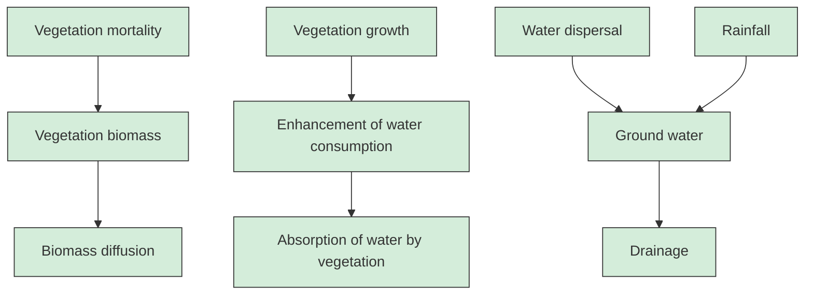
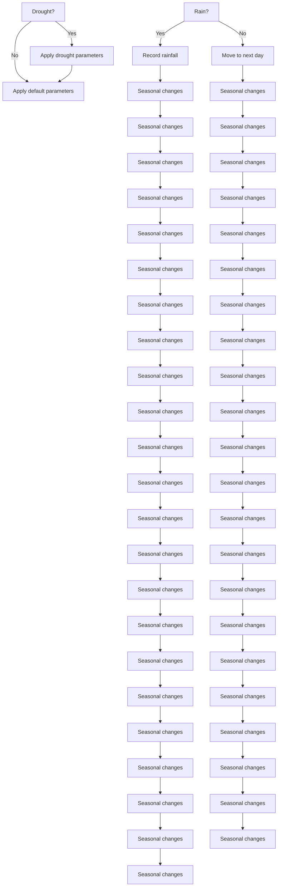

# Is There Space for More? A Spatiotemporal Partial Differential Equations Model for Plant Growth During Drought Cycles

Summary

Droughts pose a significant risk to the survival of a community of plants. Although individual plants may struggle to adapt to a lack of water caused by a drought, existing literature has suggested a positive relationship between the biodiversity of a plant community and its ability to survive drought cycles. We have been tasked to verify this claim and build a generalized biome-independent model that predicts changes in a plant community through cycles of drought.

Our approach was to develop a parameterized partial differential equations model for the growth of multiple plant species over time on the basis of the amount of water available. Crucially, we also incorporate spatial dimensions and analysis into the model, which allows us to consider plant dispersal and water diffusion across physical boundaries. To support this growth model, we also implement a sub-model for rainfall that can simulate the effect of a variety of droughts by changing drought timing and severity. Incorporating this into the plant growth model, we model plant growth in Mathematica using numerical analysis of the partial differential equations. We conduct a sensitivity analysis of the model’s parameters, simulating the effects of biodiversity by steadily increasing the number of unique species starting from a control of just one species. We also analyze the impact of different types of droughts, as well as different types of plants as measured by their resistance and resilience. We conclude by studying the impacts of external factors, such as pollution or habitat reduction.

Ultimately, we find that although increasing the number of unique plants in a given community generates inter-species competition, it cumulatively benefits the overall system by increasing the total amount of long-term plant biomass. However, marginal benefit decreases as total number of unique species increases: going from one to two unique species generates significant benefits in total biomass, but changes are smaller when going from two to three, and the transition from three to four actually decreases total biomass. Meanwhile, our sensitivity analysis finds that changes in resilience and resistance correspondingly impact total plant biomass but do not affect the general behavior of the model. In addition, we determine that habitat destruction can cause individual species to dominate a plant community due to increased spatial competition. We find under certain extreme conditions, a given species of plants can either survive and dominate in the long-term or go extinct depending on their initial conditions.

The main advantage of our unique spatial approach over traditional, space-independent models that only depend upon time, like the classic Lotka-Volterra model, is the the ability to account for fundamental physical behaviors of plants and ground water—that is, dispersal and diffusion across a 2D space. Without spatial considerations, one cannot accurately model the fact that generally, plants and water can only spread to adjacent locations. This also allows us to model phenomenon like competition for habitation or water at a given location. Finally, the spatial approach also provides the ability to simulate random initial locations, mirroring the stochasticity of real-world environments, as well as forecast the impacts of habitat reduction easily. Combined with a realistic model for rainfall data and drought conditions, our model serves as a comprehensive general phenomenological model for simulating plant growth in any given community under cycles of droughts.

Keywords: Partial Differential Equations, Spatiotemporal Analysis, Drought Modeling

## Contents

## 1 Introduction 3

1.1 Background . . 3  
1.2 Problem Restatement 3  
1.3 Existing Literature 4

## 2 Developing the Plant Community Model 4

2.1 Assumptions 4  
2.2 Model Overview and Justification 5  
2.3 Variables and Notation 7  
2.4 Plant Biomass .  
2.5 Water and Rainfall  
2.6 Species Competition 8  
2.7 Rainfall, Droughts, Species Types, and Pollution . . 8  
2.8 Initial and Boundary Conditions 9  
2.9 Model Analysis . . 9

## 3 Rainfall and Drought Model 10

3.1 General Rain Model . . 10  
3.2 Drought-Adjusted Model . . 10

## 4 Results 11

4.1 Number of Unique Plant Species . . 11  
4.2 Different Types of Droughts 15

## 5 Sensitivity Analysis 17

5.1 Types of Species 17  
5.2 Resistance and Pollution 19  
5.3 Habitat Reduction . . 21

## 6 Strengths and Weaknesses 23

6.1 Strengths 23  
6.2 Weaknesses . . 23

## 7 Conclusion 23

## 8 Future Exploration 24

## References 25

## 1 Introduction

## 1.1 Background

The study of how drought cycles impact plant communities is crucial for understanding the impacts of climate change on ecosystems and agriculture. Droughts can significantly alter plant growth, distribution, and productivity, which can have cascading effects on ecosystem functions and services, such as nutrient cycling, soil stability, and carbon storage. Moreover, droughts can impact agricultural productivity, as they reduce crop yields, increase irrigation demands, and exacerbate soil erosion and land degradation [1]. By studying how droughts affect plant communities, scientists can develop effective management strategies to mitigate the impacts of droughts on ecosystems. This includes developing drought-resistant crop varieties, improving water use efficiency, and implementing sustainable land management practices. Ultimately, understanding the effects of drought on plant communities is crucial for maintaining ecosystem health and supporting sustainable agriculture in the face of climate change.

Plant species are often geographically grouped together into communities to better understand species interaction and relationships [2]. The relative composition of the species within communities is not static, but rather it changes as a response responds to stimuli and stresses. In particular, one common source of stress that can drastically change the composition of a community is a period of drought [3].

As different organisms have different characteristics, they react and adapt differently to extreme conditions. Such responses are well described by the notions of resilience (ability to recover after extreme conditions) and resistance (ability to persist and grow despite extreme conditions) [4]. Past research has suggested that localized biodiversity within these communities strengthens the overall ability of the community to adapt to periods of drought, relative to a more homogeneous community. Studies have suggested the possibility that the genetic diversity offered by a diverse community provides a higher chance for species-diverse communities to effectively thrive even during extended periods of little to no rainfall [5]. However, little research has been done to explore the quantitative extent to which biodiversity strengthens a community’s ability to persist and grow amid drought, and how this survivability changes depending on the specific number of species.

## 1.2 Problem Restatement

To address this question, our team has been tasked to develop a model to predict how the composition of a plant community changes through drought cycles. The model and its analysis must:

1. Account for species interaction, both competition and mutual support, during drought  
2. Evaluate how many species are required to benefit from the biodiversity phenomenon, as well as assess the impact of an increase in species within a community.  
3. Consider the impact of changes in the frequency and severity of droughts  
4. Consider the impact of differing types of species within a community  
5. Consider the impact of pollution and habitat destruction

## 1.3 Existing Literature

Prior to developing our customized model, we researched and analyzed several existing models. Below are two important examples.

First, we examined the classic Lotka-Volterra Model as a basis to consider competition between plant species and impacts on growth [6]. An abstracted version of the predator-prey equations are:

$$
\begin{array}{l} \frac {d x}{d t} = \alpha x - \beta x y \\ \frac {d y}{d t} = \delta x y - \phi y \\ \end{array}
$$

where ?? and ?? are the growth rates of each of the prey predator species respectively, while ?? and ?? represent the competitive interaction between the two species.

Although the Lotka-Volterra Model provided a method to factor in competition, we believed its specificity towards a predator-prey relationship made it difficult to accurately model plant interactions since those interactions could potentially also be mutually beneficial. At the same time, perhaps the most important issue regarding the model for our task was the assumption of a constant growth rate. It does not take into consideration the relationship that growth rate and water scarcity.

To address this resource utilization aspect of plant modeling, we also considered Monod’s equation for modeling microbial growth rate [7].

$$
\mu = \mu_ {m a x} \frac {S}{K _ {S} + S}
$$

where ??, the growth rate, is determined by the product of the maximum growth rate and a fraction where S represents the concentration of a limiting substrate, or resource and K is a constant.

These two models provided a fundamental starting point for our work but were ultimately insufficient for the problem at hand. In particular, we hoped to account for the following factors that were not considered in these systems:

1. Multiple species interaction  
2. Storage of groundwater  
3. The spatial dimensions of the community, which influences plant and water dispersal  
4. Different types of droughts  
5. Resilience and resistance of plants  
6. External factors like pollution and habitat reduction

## 2 Developing the Plant Community Model

## 2.1 Assumptions

To simplify the modeling, we establish a few fundamental assumptions, as well as provide justifications for them:

• Assumption: Plant biomass is increased solely through plant growth.

– Justification: The problem statement revolves around analyzing the growth plants relative to weather conditions. Therefore, we find it necessary to only discuss how plant biomass changes based on plant growth or death, and to ignore other external factors like human development, predators, etc.

• Assumption: New species of plants do not emerge suddenly in the environment throughout a given simulation.

– Justification: Similar to the above assumption, we do not consider external influences that may cause a plant to suddenly arise in an ecosystem. Instead, we will focus our analysis on the existing plants in an ecosystem and study how their biomasses change with time.

• Assumption: Plants are differentiated solely by their resistance (how easily they die) and resilience (how easily they grow).

– In the context of analyzing plant growth under extreme weather conditions, the most important factor to consider is how plants survive within these conditions. Therefore, we don’t consider factors like plant structure, shape, or size, and instead assume that the resistance and resilience of a given plant are able to encapsulate its other defining qualities.

## 2.2 Model Overview and Justification

To explore this problem, our model will attempt to predict how the amount of water in the ground, as well the total biomass of each species of plant, will change—these factors will serve as the dependent variables. Specifically, because we are interested in studying the transition rates of these quantities, we will develop a model based upon differential equations that can naturally characterize changes over time.

However, we argue that analyzing the system across time alone is insufficient, as the physical dimensions of an ecological community are highly influential in its development. For one, unlike models for animals or microorganisms, plants generally do not move, which therefore limits their water consumption and interactions with other plants at non-adjacent locations. For instance, different species of plants may not be able to occupy the same physical location in the habitat due water shortages in that particular location, and the size of the habitat will limit plant growth.

In addition, water dispersal is highly motivated by its diffusion across space and concentration gradients. Modeling the spatial movement of water within a given area also provides us the ability to use a more accurate measurement of the amount of water in a given location, rather than total water in the system, which is far less accurate to plant growth. For instance, the growth of a plant at a given location is not dependent on the amount of water in the overall system, but rather at the particular location that it occupies.

Therefore, our model will, in addition to time, consider spatial dimensions as independent variables, pointing to a need for partial rather than ordinary differential equations; this will also allow us to study the impact of habitat reduction in later sensitivity analysis.

Within the model, we will incorporate parameters that allow us to explore and capture the following conditions:

• The number of unique plant species  
• The resilience and resistance of each species  
• The amount of weekly rainfall  
• The frequency and magnitude of droughts

Note that as a whole, except for the independent variable of time, the model is dimensionless; that is, we are not measuring specific amounts of biomass, groundwater, rainfall, etc. This is done because the purpose of this research is to determine the broader qualitative and relative impacts of different factors on plant growth, rather than predict the precise amount of plants that exist in a particular region under a precise set of parameter values. The latter investigation can likely not be conducted with a phenomenological, mechanistic mathematical model that yields deep insight into the nature and behavior of plant interactions with their communities, which is the ultimate goal of this research and the overall problem statement. Therefore, we believe it is much more meaningful to produce a dimensionless model that can be adapted to any given plant community, whose results provide fundamental information about how species interact under different conditions, both internal—like plant resilience and resistance—and external—like drought, pollution, or habitat reduction. The independent variable of time is dimensionalized for the purpose of parameter value calculations and to provide some basic context to our findings, but even it can be nondimensionalized without changing the underlying validity of the model.

flowchart

Figure 1: A visual representation of the model and its dynamics

## 2.3 Variables and Notation

In the model, we will introduce several variables and parameters. A summary is provided here:

<table><tr><td>Variable</td><td>Notation</td><td>Meaning</td></tr><tr><td>number of species</td><td>k</td><td>the number of unique species in the system</td></tr><tr><td>species biomass</td><td>ni</td><td>the total plant biomass of species i</td></tr><tr><td>total plant biomass</td><td>N</td><td>total plant biomass of all species</td></tr><tr><td>water</td><td>w</td><td>total ground water</td></tr><tr><td>spatial dimensions</td><td>x, y</td><td>the 2D space being modeled</td></tr><tr><td>time</td><td>t</td><td>time, measured in week</td></tr><tr><td>plant growth rate</td><td>ci</td><td>the growth rate of species i</td></tr><tr><td>plant mortality rate</td><td>mi</td><td>the mortality rate of species i</td></tr><tr><td>water flow from concentration differences</td><td>v</td><td>speed of water in moving from high to low concentration</td></tr><tr><td>water flow from diffusion</td><td>d</td><td>speed of water along flat terrain</td></tr><tr><td>rainfall</td><td>at</td><td>rainfall per week at time t</td></tr><tr><td>habitat size</td><td>L</td><td>length and width of the (square) habitat</td></tr></table>

Table 1: A summary of the variables and parameters that will be introduced in the model.

## 2.4 Plant Biomass

We first derive an equation modeling the total biomass of each species ??, represented by $n _ { i } ( x , y , t )$ , which can be influenced by three factors: plant growth, plant death, and plant dispersal across the habitat.

Plant growth is determined by the growth rate of the given species, the amount of water available, and the amount of plants there currently are. Literature suggests that plant growth is not linear, and that an abundance of the same species of plants in a given area encourages further plant growth [8]. Therefore, we propose an interaction term defined by the plant growth rate, a quadratic form of current plant biomass, and water availability. Plant biomass is lost solely through plant death, which is dependent on the current plant biomass and the mortality rate of the species, $m _ { i } .$ Finally, plant dispersal can be modeled by a general diffusion equation across ?? and ??. Taken together, this produces the following PDE:

$$
\frac {\partial n _ {i}}{\partial t} = c _ {i} w n _ {i} ^ {2} - m n _ {i} + \frac {\partial^ {2} n _ {i}}{\partial x ^ {2}} + \frac {\partial^ {2} n _ {i}}{\partial y ^ {2}} \tag {1}
$$

## 2.5 Water and Rainfall

We next derive an equation modeling the amount of water in the ground, which is affected by rainfall, drainage (which includes evaporation), and dispersal across the habitat. Water enters the system through time-dependent rainfall, $a _ { t }$ , and is lost due to drainage at a rate proportional to the current amount of water in the ground. Water also is lost due to plant consumption, which should also be modeled by a quadratic interaction of the total plant biomass and water availability, given the idea that a higher biomass further encourages future growth.

Regarding dispersal, water flows from high to low concentration at a speed ??, introducing an interaction term between ?? and the gradient of ??. Water can also flow across flatland at a speed ??, introducing a scaled diffusion equation for ??. Therefore, we propose:

$$
\frac {\partial w}{\partial t} = a _ {t} - w - w N ^ {2} + v \left(\frac {\partial w}{\partial x} + \frac {\partial w}{\partial y}\right) + d \left(\frac {\partial^ {2} w}{\partial x ^ {2}} + \frac {\partial^ {2} w}{\partial y ^ {2}}\right) \tag {2}
$$

## 2.6 Species Competition

A crucial component of our model is the ability to study the interactions between multiple unique species in the system. Such is why we separate total plant biomass ?? into the biomass of each plant species ??, which allows us to write separate equations for each plant species and the total biomass as the sum of these equations. Mathematically, this produces the system:

$$
\begin{array}{l} \frac {\partial n _ {1}}{\partial t} = c _ {1} w n _ {1} ^ {2} - m n _ {1} + \frac {\partial^ {2} n _ {1}}{\partial x ^ {2}} + \frac {\partial^ {2} n _ {1}}{\partial y ^ {2}} \\ \frac {\partial n _ {k}}{\partial t} = c _ {k} w n _ {k} ^ {2} - m n _ {k} + \frac {\partial^ {2} n _ {k}}{\partial x ^ {2}} + \frac {\partial^ {2} n _ {k}}{\partial y ^ {2}} \tag {3} \\ \frac {\partial N}{\partial t} = \frac {\partial n _ {1}}{\partial t} + \ldots + \frac {\partial n _ {k}}{\partial t} \\ \frac {\partial w}{\partial t} = a _ {t} - w - w N ^ {2} + v \left(\frac {\partial w}{\partial x} + \frac {\partial w}{\partial y}\right) + d \left(\frac {\partial^ {2} w}{\partial x ^ {2}} + \frac {\partial^ {2} w}{\partial y ^ {2}}\right) \\ \end{array}
$$

To study the phenomenon of how unique species interact, compete, cooperate, and ultimately influence the drought adaptability of the plant community, we can increase the total number of species, ?? .

## 2.7 Rainfall, Droughts, Species Types, and Pollution

Through the time-dependent parameter $a _ { t } .$ , we can change the amount of rainfall that the system receives over a given period of time. In doing so, we can consider periods of drought (i.e., reduced rainfall), as well as tune the length, frequency, and magnitude of such droughts. Finally, through the parameters $c _ { i }$ and $m _ { i }$ , which control the resilience and resistance of plants, respectively, we can simulate the impact of different types of plant species with different properties, as well as varying amount of pollution, which would affect plants’ abilities to grow and their tendencies to die. We will conduct sensitivity analysis of these parameters during our analysis of the model.

## 2.8 Initial and Boundary Conditions

As with all systems of PDEs, we must also establish initial and boundary conditions. The initial biomass of each plant species will be taken to be the value of 1 at a random location within the habitat, representing a small cluster of seeds or spores dispersed randomly at the beginning of the simulation. The initial amount of water in the ground will be the amount of rainfall at ?? = 0.

We will impose periodic boundary conditions for both the biomass of each plant species and the water in the ground. This is a fair and commonly used condition statement in mathematical modeling, as we are attempting to approximate a large, semi-infinite system by using a unit cell. Topologically, the space made by the two-dimensional periodic boundary conditions can be thought of as being mapped onto a compact space. Taken together, and recalling the parameter ??, this yields:

$$
n _ {1} (x, y, 0) = n _ {1 0} (x, y)
$$

$$
n _ {k} (x, y, 0) = n _ {k 0} (x, y) \tag {4}
$$

$$
N (x, y, 0) = n _ {1 0} (x, y) + \dots + n _ {k 0} (x, y)
$$

$$
w (x, y, 0) = a _ {0}
$$

for initial conditions, and

$$
n _ {1} (0, y, t) = n _ {1} (L, y, t)
$$

$$
n _ {1} (x, 0, t) = n _ {1} (x, L, t)
$$

$$
n _ {k} (0, y, t) = n _ {k} (L, y, t)
$$

$$
n _ {k} (x, 0, t) = n _ {k} (x, L, t) \tag {5}
$$

$$
N (0, y, t) = N (L, y, t)
$$

$$
N (x, 0, t) = N (x, L, t)
$$

$$
w (0, y, t) = w (L, y, t)
$$

$$
w (x, 0, t) = w (x, L, t)
$$

for boundary conditions.

## 2.9 Model Analysis

Because of its highly nonlinear nature, the PDEs developed do not have analytical solutions. Therefore, to study the system given in (3), we conduct numerical analysis of the PDEs in Mathematica. Specifically, we use the numerical method of lines, which solves PDEs by discretizing the equation in all but one dimension, then integrating the semi-discrete problem as a system of ordinary differential equations (ODEs) or differential-algebraic equations (DAEs).

## 3 Rainfall and Drought Model

## 3.1 General Rain Model

Alongside the Plant Community Model, we also developed a rainfall model to simulate natural rainfall and periods of drought and recovery. To this end, we began with a general rain model, with an average rainfall chance and rainfall volume. After uniform randomization on the rainfall chance to determine the chance of rain on a week-to-week basis, another layer of randomization was applied to the average volume of rain.

We then modified the two values with a seasonal variability index, which represents the magnitude of seasonal variation. For example, certain communities may experience seasonal monsoons while others, such as in a desert, may have minimal seasonal variability. Because of the periodic nature of seasons, we applied this seasonal variability to a sine function to appropriately model a seasonal coefficient applied to each week’s rainfall:

$$
V * (\sin \left(\frac {2 \pi}{5 2} (d \mod 5 2)\right) + \frac {5 1}{5 2})
$$

where V is the seasonal variability index, d is the week number, and where sin $\textstyle { \bigl ( } { \frac { 2 \pi } { 5 2 } } x { \bigr ) }$ has period of 52 weeks.

## 3.2 Drought-Adjusted Model

line chart

| Number of Weeks | Rainfall |
| --------------- | -------- |
| 0               | 3.0      |
| 50              | 2.5      |
| 100             | 4.0      |
| 150             | 3.5      |
| 200             | 2.0      |
| 250             | 1.0      |
| 300             | 3.0      |
| 350             | 4.0      |
| 400             | 3.5      |
| 450             | 2.5      |
| 500             | 1.5      |
| 550             | 2.0      |
| 600             | 3.0      |
| 650             | 4.0      |
| 700             | 3.5      |
| 750             | 2.0      |
| 800             | 1.5      |
| 850             | 2.5      |
| 900             | 3.0      |
| 950             | 2.0      |
| 1000            | 1.0      |

Figure 2: Weekly rainfall for 1000 weeks of data containing three separate. Specifically, droughts occur from $t = 2 0 0$ to $t = 2 5 0 .$ , $t = 5 0 0$ to $t = 6 0 0$ , and $t = 7 5 0$ to $t = 9 0 0$

After developing a rain model, we then overlaid periods of droughts over a 1000 week general rain model. Some droughts were also deliberately placed within the rainy season to address the problem statement’s task of including drought in times when precipitation is abundant.

We also created parameters to limit the ranges of the length of the drought and the severity (as in the percent decrease in the amount of rain when it does rain). With the three parameters of drought appearance, length, and severity we thus could generate unique ”drought scenarios”, which provides a more comprehensive model of droughts than a usage of uniformly long and severe droughts.

Once we decided on parameters, we then applied our set drought model on a randomized thousandweek rain period with the general rain model. We analyze the impact of different drought scenarios derived from different parameters in section 4.2.

flowchart

Figure 3: Rainfall and Drought Diagram. The first line of circles represent modifiers that change the chance of the following conditional—whether or not there will be rain. Each iteration represents the decision tree for a week, with the loop occurring for 1000 weeks.

## 4 Results

## 4.1 Number of Unique Plant Species

One primary purpose of this research is to investigate the interactions between different species amid cycles of drought, which are undeniably related [9, 10, 11]. Therefore, we first study how the system changes depending upon the number of unique species, beginning first with ?? = 1 (i.e., a plant community with just one type of plant), which will serve both as a control group and validation of the model’s performance.

heatmap

| X Range | Y Range | Value |
|---------|---------|-------|
| 0-500   | 0-500   | 0     |
| 0-500   | 500-1000| 12.5  |
| 0-500   | 1000-1500| 10.0 |
| 0-500   | 1500-2000| 7.5  |
| 0-500   | 2000-2500| 5.0  |
| 0-500   | 2500-3000| 2.5  |
| 0-500   | 3000-3500| 0    |
| 0-500   | 3500-4000| 2.5  |
| 0-500   | 4000-4500| 5.0  |
| 0-500   | 4500-5000| 7.5  |
| 500-1000 | 0-500   | 12.5  |
| 500-1000 | 500-1000 | 10.0 |
| 500-1000 | 1000-1500| 7.5 |
| 500-1000 | 1500-2000| 5.0 |
| 500-1000 | 2000-2500| 2.5 |
| 500-1000 | 2500-3000| 0    |
| 500-1000 | 3000-3500| 2.5 |
| 500-1000 | 3500-4000| 5.0 |
| 500-1000 | 4000-4500| 7.5 |
| 500-1000 | 4500-5000| 12.5 |

(a) ?? = 200: before the first drought. The plants appear to be forming vegetative strips within the habitat

heatmap

| X Range | Y Range | Value |
| --- | --- | --- |
| 0-500 | 0-500 | 0 |
| 0-500 | 500-400 | 15 |
| 0-500 | 100-300 | 10 |
| 0-500 | 150-200 | 5 |
| 0-500 | 200-300 | 5 |
| 0-500 | 250-350 | 5 |
| 0-500 | 300-400 | 5 |
| 0-500 | 350-450 | 5 |
| 0-500 | 400-500 | 5 |
| 500-100 | 0-500 | 15 |
| 500-100 | 500-400 | 15 |
| 500-100 | 100-300 | 15 |
| 500-100 | 150-400 | 15 |
| 500-100 | 200-450 | 15 |
| 500-100 | 250-500 | 15 |
| 500-100 | 300-450 | 15 |
| 500-100 | 350-500 | 15 |
| 100-200 | 0-500 | 15 |
| 100-200 | 500-400 | 15 |
| 100-200 | 100-300 | 15 |
| 100-200 | 150-450 | 15 |
| 100-200 | 200-480 | 15 |
| 100-200 | 250-496 | 15 |
| 100-200 | 300-498 | 15 |
| 100-200 | 350-499 | 15 |
| 100-200 | 400-499 | 15 |
| 150-256 | 0-500 | 15 |
| 150-256 | 500-400 | 15 |
| 150-256 | 100-356 | 15 |
| 150-256 | 156-384 | 15 |
| 150-256 | 216-396 | 15 |
| 150-256 | 276-398 | 15 |
| 150-256 | 336-399 | 15 |
| 150-256 | 386-499 | 15 |
| 156-336 | 7.77 | 15 |
| 156-336 | -7.77 | 15 |
| -7.77 | -7.77 | -7.77 |
| -7.77 | -3.77 | -7.77 |
| -7.77 | -7.77 | -7.77 |
| -7.77 | -3.77 | -7.77 |
| -7.77 | -7.77 | -7.77 |
| -7.77 | -3.77 | -7.77 |
| -7.77 | -7.77 (approx) | -3.77 |
| -7.77 | -3.77 (approx) | -3.77 |
| -4.88 | -3.77 | -3.77 |
| -4.88 | -3.77 | -3.77 |
| -4.88 | -3.77 | -3.77 |
| -4.88 | -3.77 | -3.77 |
| -4.88 | -3.77 | -3.77 |
| -4.88 | <3.77 | -3.77 |
| -4.88 | <3.77 | -3.77 |
| -4.88 | <3.77 | <3.77 |
| -4.88 | <3.77 | <3.77 |
| -4.88 | <3.77 | <3.77 |
| -2.99 | -3.77 | -3.77 |
| -2.99 | -3.77 | -3.77 |
| -2.99 | -3.77 | -3.77 |
| -2.99 | -3.77 | -3.77 |
| -2.99 | -3.77 | -3.77 |
| -2.99 | <3.77 | -3.77 |
| -2.99 | <3.77 | <3.77 |
| -2.99 | <3.77 | <3.77 |
| -2.99 | <3.77 | <3.77 |
| -2.99 | <3.77 | <3.77 |
| -2.99 | <3.77 | <3. |
| -2.99 | <3.77 | <3. |
| -2.99 | <3. | <3 |
| -2.99 | <3 | <3 |
| -2 | <3 | <3 |
| < | < | < |
| > | < | < |
| > | < | < |
| > | < | < |
| > | < | < |
| > | < | < |
| > | < | < |
| > | < | < |
| > | < | < |
| > | < | < |
| > | < | < |
| < | < | < |
| > | < | < |
| > | < | < |
| > | < | < |
| > | < | < |
| > | < | < |
| > | < | < |
| > | < | < |
| > | < | < |
| > | < | < |
| > | < | < |
| > | < | < |
| > | < | < |
| > | < | < |
| > | < | < |
| > | < | < |
| > | < | < |
| > | < | < |
| > | < | < |
| > | < | < |
| > | < | < |
| > | < | < |
| > | < | < |
| > | < | < |
| > | < | < |
| > | < | < |
| > | < | < |
| > | < | < |
| > | < | < |
| > | < | < |
| > | < | < |
| > | < | < |
| > | < | < |
| > | < | < |
| > | < | < |
| > | < | < |
| > | < | < |
| > | < | < |
| > | < | < |
| > | < | < |
| > | < | < |
| > | < | < |
| > | < | < |
| > | < | < |
| > | < | < |
| > | < | < |
| > | < | < |
| > | < | < |
| > | < | < |
| > | < | < |
| > | < | < |
| > | < | < |
| > | < | < |
| > | < | < |
| > | < | < |
| > | < | < |

(b) ?? = 750: before the third drought. The plants still form strips, though each strip is thicker and more concentrated.

heatmap

| X Range | Y Range | Value |
| --- | --- | --- |
| 0-500 | 0-500 | 0 |
| 0-500 | 500-400 | 10 |
| 0-500 | 100-300 | 2 |
| 0-500 | 150-200 | 4 |
| 0-500 | 200-300 | 6 |
| 0-500 | 250-350 | 8 |
| 0-500 | 300-400 | 10 |
| 0-500 | 350-450 | 8 |
| 0-500 | 400-500 | 6 |
| 500-1000 | 0-50 | 2 |
| 500-1000 | 50-100 | 4 |
| 500-1000 | 100-150 | 6 |
| 500-1000 | 150-200 | 8 |
| 500-1000 | 200-250 | 6 |
| 500-1000 | 250-300 | 4 |
| 500-1000 | 300-350 | 2 |
| 500-1000 | 350-400 | 4 |
| 500-1000 | 400-450 | 6 |
| 500-1000 | 450-500 | 8 |
| 100-1500 | 0-50 | 4 |
| 100-1500 | 50-100 | 6 |
| 100-1500 | 100-150 | 8 |
| 100-1500 | 150-200 | 10 |
| 100-1500 | 200-250 | 8 |
| 100-1500 | 250-300 | 6 |
| 100-1500 | 300-350 | 4 |
| 100-1500 | 350-400 | 2 |
| 100-1500 | 400-450 | 4 |
| 100-1500 | 450-500 | 6 |
| 150-2000 | 0-50 | 6 |
| 150-2000 | 50-100 | 8 |
| 150-2000 | 100-150 | 10 |
| 150-2000 | 150-200 | 8 |
| 150-2000 | 200-250 | 6 |
| 150-2000 | 250-300 | 4 |
| 150-2000 | 300-350 | 2 |
| 150-2000 | 350-400 | 4 |
| 150-2000 | 400-450 | 6 |
| 150-2000 | 450-500 | 8 |
| 200-2500 | 7.77 | 8 |
| 257.77 | - | - |
| - | - | - |
| - | - | - |
| - | - | - |
| - | - | - |
| - | - | - |
| - | - | - |
| - | - | - |
| - | - | - |
| - | - | - |
| - | - | - |
| -9.77 | - | - |
| -9.77 | - | - |
| -9.77 | - | - |
| -9.77 | - | - |
| -9.77 | - | - |
| -9.77 | - | - |
| -9.77 | - | - |
| -9.77 | + | - |
| -9.77 | + | - |
| -9.77 | + | - |
| -9.77 | + | - |
| -9.77 | + | - |
| -9.77 | + | - |
| + | + | - |
| + | + | - |
| + | + | - |
| + | + | - |
| + | + | - |
| + | + | - |
| + | + | - |
| + | + | - |
| + | + | - |
| + | + | + |
| + | + | + |
| + | + | + |
| + | + | + |
| + | + | + |
| + | + | + |
| + | + | + |
| + | + | + |
| + | + | + |
| + | + | + |
| + | + | + (not labeled) in the color scale from green to red, not visible in the chart). The values in the table represent the magnitude of the color scale on the y-axis and the corresponding color scale on the x-axis. There is no label for the data series. |

(c) ?? = 900: after the third drought. Following the drought, the clusters are plants are smaller and less concentrated.

heatmap

| X Range | Y Range | Value |
|---------|---------|-------|
| 0-100   | 0-100   | 0     |
| 0-100   | 100-200 | 5     |
| 0-100   | 200-300 | 10    |
| 0-100   | 300-400 | 15    |
| 0-100   | 400-500 | 20    |
| 100-200 | 0-100   | 5     |
| 100-200 | 100-200 | 10    |
| 100-200 | 200-300 | 15    |
| 100-200 | 300-400 | 20    |
| 100-200 | 400-500 | 15    |
| 200-300 | 0-100   | 5     |
| 200-300 | 100-200 | 10    |
| 200-300 | 200-300 | 15    |
| 200-300 | 300-400 | 20    |
| 200-300 | 400-500 | 15    |
| 300-400 | 0-100   | 5     |
| 300-400 | 100-200 | 15    |
| 300-400 | 200-300 | 25    |
| 300-400 | 300-400 | 35    |
| 300-400 | 400-500 | 35    |
| 400-500 | 15-25   | 5     |
| 455-555 | 25-35   | 15    |
| 455-555 | 35-45   | 25    |
| 455-555 | 45-55   | 35    |
| 455-655 | 35-45   | 35    |
| 455-655 | 45-55   | 45    |
| 475-688 | 45-55   | 45    |
| 475-688 | 55-68   | 45    |
| 475-712 | 45-68   | 45    |
| 475-712 | 55-71   | 45    |
| 475-736 | 45-68   | 45    |
| 475-736 | 55-71   | 45    |
| Note: The data is in a grid format with rows and columns labeled 'X' and 'Y' respectively. The values are estimated based on the color scale from the legend. There is no explicit numerical data provided in the image.

(d) ?? = 1000: recovering from drought. The plants are able to make a full recovery following the drought.

line chart

| Time | Biomass   |
|------|-----------|
| 0    | 250000    |
| 100  | 650000    |
| 200  | 650000    |
| 300  | 150000    |
| 400  | 650000    |
| 500  | 150000    |
| 600  | 650000    |
| 700  | 150000    |
| 800  | 650000    |
| 900  | 150000    |
| 1000 | 650000    |

(e) Total biomass of the system over time.  
Figure 4: The change of a community with just one species of plant over time.

Figures 4a-4d provide spatial density plots of the plant community at a given point in time; that is, for any given spatial coordinate in the habitat, the color of the location represents the biomass of the plant at that given location at the specified point in time. Figure 4e represents a graph of the total plant biomass in over the 1000 week period. Note how the periods of sudden decline correspond to the periods of drought shown in Figure 2.

The results shown in Figure 4 verify the model’s validity. Indeed, the patterns shown in Figures 4a-4d match real-world plant formations in communities with just one species (see Figure 5).

natural_image

Aerial view of a patterned desert landscape with black zebra stripes (no text or symbols visible)

(a) Patterned vegetation formations in South Africa, which mirror the formations in Figure 4a and 4c.

natural_image

Aerial view of a vast, forested landscape with scattered shrubs and patches of brown vegetation (no text or symbols visible)

(b) Striped vegetation formations in Niger, which mirror the formations in Figure 4b and 4d.  
Figure 5: Real-world plant formations that mirror the model’s results [12]

With this functional model, we then expand the model to include two unique species $( k = 2 )$ .

heatmap

| X  | Y  | Value |
|----|----|-------|
| 0  | 0  | 0     |
| 0  | 100| 1     |
| 0  | 200| 2     |
| 0  | 300| 3     |
| 0  | 400| 4     |
| 0  | 500| 5     |
| 50 | 0  | 0     |
| 50 | 100| 1     |
| 50 | 200| 2     |
| 50 | 300| 3     |
| 50 | 400| 4     |
| 50 | 500| 5     |
| 100| 0  | 0     |
| 100| 100| 1     |
| 100| 200| 2     |
| 100| 300| 3     |
| 100| 400| 4     |
| 100| 500| 5     |
| 150| 0  | 0     |
| 150| 100| 1     |
| 150| 200| 2     |
| 150| 300| 3     |
| 150| 400| 4     |
| 150| 500| 5     |
| 200| 0  | 0     |
| 200| 100| 1     |
| 200| 200| 2     |
| 200| 300| 3     |
| 200| 400| 4     |
| 200| 500| 5     |
| 250| 0  | 0     |
| 250| 100| 1     |
| 250| 200| 2     |
| 250| 300| 3     |
| 250| 400| 4     |
| 250| 500| 5     |
| 300| 0  | 0     |
| 300| 100| 1     |
| 300| 200| 2     |
| 300| 300| 3     |
| 300| 400| 4     |
| 300| 500| 5     |
| 350| 0  | 0     |
| 350| 100| 1     |
| 350| 200| 2     |
| 350| 300| 3     |
| 350| 400| 4     |
| 350| 500| 5     |
| 400| 0  | 0     |
| 400| 100| 1     |
| 400| 200| 2     |
| 400| 300| 3     |
| 400| 400| 4     |
| 400| 500| 5     |
| 450| 0  | 0     |
| 450| 100| 1     |
| 450| 200| 2     |
| 450| 300| 3     |
| 450| 400| 4     |
| 450| 500| 5     |
| 500| -1 | -1    |
| -1 | -2 | -2    |
| -2 | -3 | -3    |
| -3 | -4 | -4    |
| -4 | -5 | -5    |
| -5 | -6 | -6    |
| -6 | -7 | -7    |
| -7 | -8 | -8    |
| -8 | -9 | -9    |
| -9 | -1   | -1    |
| -1   | -2   | -2    |
| -2   | -3   | -3    |
| -3   | -4   | -4    |
| -4   | -5   | -5    |
| -5   | -6   | -6    |
| -6   | -7   | -7    |
| -7   | -8   | -8    |
| -8   | -9   | -9    |
| -9   | -1   | -1    |
| -1   | -2   | -2    |
| -2   | -3   | -3    |
| -3   | -4   | -4    |
| -4   | -5   | -5    |
| -5   | -6   | -6    |
| -6   | -7   | -7    |
| -7   | -8   | -8    |

(a) Species 1 of 2

heatmap

| X Range | Y Range | Value |
| --- | --- | --- |
| 0-100 | 0-100 | 0 |
| 0-100 | 100-200 | 1 |
| 0-100 | 200-300 | 2 |
| 0-100 | 300-400 | 3 |
| 0-100 | 400-500 | 4 |
| 100-200 | 0-100 | 5 |
| 100-200 | 100-200 | 4 |
| 100-200 | 200-300 | 3 |
| 100-200 | 300-400 | 2 |
| 100-200 | 400-500 | 1 |
| 200-300 | 0-100 | 2 |
| 200-300 | 100-200 | 3 |
| 200-300 | 200-300 | 4 |
| 200-300 | 300-400 | 5 |
| 200-300 | 400-500 | 4 |
| 300-400 | 0-100 | 3 |
| 300-400 | 100-200 | 4 |
| 300-400 | 200-300 | 5 |
| 300-400 | 300-400 | 4 |
| 300-400 | 400-500 | 3 |
| 400-500 | 0-100 | 4 |
| 400-500 | 100-200 | 5 |
| 400-500 | 200-300 | 4 |
| 400-500 | 300-400 | 3 |
| 400-500 | 400-500 | 2 |
| ... | ... | ... |
| ... | ... | ... |
| ... | ... | ... |
| ... | ... | ... |
| ... | ... | ... |
| ... | ... | ... |
| ... | ... | ... |
| ... | ... | ... |
| ... | ... | ... |
| ... | ... | ... |
| ... | ... | ... |
| ... | ... | ... |
| ... | ... | ... |
| ... | ... | ... |
| ... | ... | ... |
| ... | ... | ... |
| ... | ... | ... |
| ... | ... | ... |
| ... | ... | ... |
| ... | ... | ... |
| ... | ... | ... nan |
| ... | ... | ... nan |
| ... | ... | ... nan |
| ... | ... | ... nan |
| ... | ... | ... nan |
| ... | ... | ... nan |
| ... | ... | ... nan |
| ... | ... | ... nan |
| ... | ... | ... nan |
| ... | ... | ... nan |
| ... | ... | ... |
| ... | ... | ... nan |
| ... | ... | ... nan |
| ... | ... | ... nan |
| ... | ... | ... nan |
| ... | ... | ... nan |
| ... | ... | ... nan |
| ... | ... | ... nan |
| ... | ... | ... nan |
| ... | ... | ... |
| ... | ... | ... |
| ... | ... | ... nan |
| ... | ... | ... nan |
| ... | ... | ... nan |
| ... | ... | ... nan |
| ... | ... | ... nan |
| ... | ... | ... nan |
| ... | ... | ... nan |
| ... | ... | ... |
| ... | ... | ... nan |
| ... | ... | ... |
| ... | ... | ... nan |

(b) Species 2 of 2

line chart

| Time | species 1 | species 2 | total biomass |
|------|-----------|-----------|---------------|
| 0    | 200000    | 200000    | 400000        |
| 200  | 500000    | 150000    | 900000        |
| 400  | 550000    | 450000    | 1100000       |
| 600  | 150000    | 150000    | 250000        |
| 800  | 600000    | 450000    | 1100000       |
| 1000 | 600000    | 450000    | 1100000       |

(c) Total biomass of the system over time.  
Figure 6: The change of a community with two species of plants over time. All snapshots are taken at $t = 1 0 0 0$ .

Figure 6a and 6b provide fascinating insight into the behavior of the two plants, which appear to be directly competing for space. Indeed, in any given location, either the first species or second species thrives, but never both—this makes sense under the model’s definition, as only one species of plant is ultimately able to utilize the water at any given spatial coordinate in the long-term.

Figure 6c, when observed relative to Figure 4e, shows us that in spite of the species competition, the total biomass increases significantly—in fact by over two times. This indicates the existence of species cooperation, which can be explained mechanistically by the fact that more plants in the system preserves water by optimizing water utilization; that is, less water is allowed to leave the system through drainage because it is being conserved within plants. In addition, observe that in the two-species scenario, plants physically occupy the entire system, while the plants in the one-species scenario form clusters and strips that fail to occupy the entire habitat. This mirrors the process of diversification: with a more diverse array of plant species, more spatial domains within the habitat can be occupied.

We will now explore whether these results hold as the number of unique plant species continues to rise. In particular, we hope to investigate how patterns of species competition change and evolve as there multiple competitive interaction occurring over space and water at any given time and spatial coordinate. Therefore, we first the system to $k = 3$ , which simulates a plant community with three unique species.

heatmap

| X Range | Y Range | Value |
| --- | --- | --- |
| 0-100 | 0-200 | 0 |
| 0-100 | 200-400 | 5 |
| 0-100 | 400-600 | 3 |
| 0-100 | 600-800 | 2 |
| 0-100 | 800-1000 | 1 |
| 0-100 | 1000-1200 | 0 |
| 0-100 | 1200-1400 | 1 |
| 0-100 | 1400-1600 | 2 |
| 0-100 | 1600-1800 | 3 |
| 0-100 | 1800-2000 | 4 |
| 0-100 | 2000-2200 | 5 |
| 0-100 | 2200-2400 | 4 |
| 0-100 | 2400-2600 | 3 |
| 0-100 | 2600-2800 | 2 |
| 0-100 | 2800-3000 | 1 |
| 0-100 | 3000-3200 | 0 |
| 1-200 | 0-200 | 1 |
| 1-200 | 200-400 | 2 |
| 1-200 | 400-600 | 3 |
| 1-200 | 600-800 | 4 |
| 1-200 | 800-1000 | 5 |
| 1-200 | 1000-1200 | 4 |
| 1-200 | 1200-1400 | 3 |
| 1-200 | 1400-1600 | 2 |
| 1-200 | 1600-1800 | 1 |
| 1-200 | 1800-2000 | 0 |
| 1-200 | 2000-2200 | 1 |
| 1-200 | 2200-2400 | 2 |
| 1-200 | 2400-2600 | 3 |
| 1-200 | 2600-2800 | 4 |
| 1-200 | 2800-3000 | 5 |
| 1-255.5 | 555.5 | 5 |
| 1-255.5 | 755.5 | 4 |
| 1-255.5 | 955.5 | 3 |
| 1-255.5 | 1155.5 | 2 |
| 1-255.5 | 1355.5 | 1 |
| 1-255.5 | 1555.5 | 1 |
| 1-255.5 | 1755.5 | 1 |
| 1-255.5 | 1955.5 | 1 |
| 1-255.5 | 2155.5 | 1 |
| 1-255.5 | 2355.5 | 1 |
| 1-255.5 | 2555.5 | 1 |
| 1-255.5 | 2755.5 | 1 |
| 1-255.5 | 2955.5 | 1 |
| ... | ... | ... |
| ... | ... | ... |
| ... | ... | ... |
| ... | ... | ... |
| ... | ... | ... |
| ... | ... | ... |
| ... | ... | ... |
| ... | ... | ... |
| ... | ... | ... |
| ... | ... | ... |
| ... | ... | ... |
| ... | ... | ... |
| ... | ... | ... |
| ... | ... | ... |
| ... | ... | ... |
| ... | ... | ... |
| ... | ... | ... |
| ... | ... | ... |
| ... | ... | ... |
| ... | ... | ... |
| ... | ... | ... nan |
| ... | ... | ... nan |
| ... | ... | ... nan |
| ... | ... | ... nan |
| ... | ... | ... nan |
| ... | ... | ... nan |
| ... | ... | ... nan |
| ... | ... | ... nan |
| ... | ... | ... nan |
| ... | ... | ... nan |
| ... | ... | ... nan |

(a) Species 1 of 3

heatmap

| X  | Y  | Value |
|----|----|-------|
| 0  | 0  | 0     |
| 100| 100| 1     |
| 200| 200| 2     |
| 300| 300| 3     |
| 400| 400| 4     |
| 500| 500| 5     |

(b) Species 2 of 3

heatmap

| 0    | 100  | 200  | 300  | 400  | 500  |
| ---- | ---- | ---- | ---- | ---- | ---- |
| 0    | 0    | 0    | 0    | 0    | 0    |
| 100  | 0    | 0    | 0    | 0    | 0    |
| 200  | 0    | 0    | 0    | 0    | 0    |
| 300  | 0    | 0    | 0    | 0    | 0    |
| 400  | 0    | 0    | 0    | 0    | 0    |
| 500  | 0    | 0    | 0    | 0    | 0    |

(c) Species 3 of 3

line chart

| Time | species 1 | species 2 | species 3 | total biomass |
|------|-----------|-----------|-----------|---------------|
| 0    | 200000    | 200000    | 200000    | 750000        |
| 200  | 300000    | 150000    | 400000    | 950000        |
| 400  | 350000    | 350000    | 550000    | 1250000       |
| 600  | 350000    | 150000    | 650000    | 1250000       |
| 800  | 350000    | 350000    | 650000    | 1250000       |
| 1000 | 350000    | 350000    | 650000    | 1250000       |

(d) Total biomass of the system over time.  
Figure 7: The change of a community with three species of plants over time. All snapshots are taken at $t = 1 0 0 0$ .

Unlike the ?? = 2 instance, where at any given spatial coordinate only one plant is able to thrive, species competition is not as easily observed in the ?? = 3 case. However, the phenomenon of the three species competing with each other for water can still be identified: for instance, consider the small region, roughly defined by ((0, 100), (100, 200)), where species 3—which occupies most of the habitat—fails to grow, as shown in Figure 7c. Within this region, the upper portion is occupied by species 1, while the lower-left portion is occupied by species 2—the boundaries are simply not as well-defined as in the two-species scenario. In addition, one may observe that at any given spatial coordinate, not all three species appear to thrive.

However, we are again interested in measuring the success and growth of the overall system, as measured by total plant biomass. Figure 7c shows that again, despite inter-species competition, the total amount of biomass in the system increases—though by a notably less margin than the increase from one to two species. Indeed, the total biomass now peaks about 20% higher than it did in the two-plant scenario between droughts, which is significant but not nearly as significant as in the increase from one to two plants. This suggests that the system does not benefit indefinitely from more biodiversity, and that as the number of unique species rises, the increased inter-species competition that results produces increasingly detrimental effects on the total biomass of the system.

To investigate this phenomenon further, we experiment with $k = 4$ .

line chart

| Time | species 1 | species 2 | species 3 | species 4 | total biomass |
|------|-----------|-----------|-----------|-----------|---------------|
| 400  | ~250000   | ~450000   | ~500000   | ~400000   | ~1.2e6        |
| 500  | ~300000   | ~450000   | ~500000   | ~450000   | ~1.2e6        |
| 600  | ~150000   | ~150000   | ~150000   | ~150000   | ~200000       |
| 700  | ~350000   | ~350000   | ~350000   | ~500000   | ~1.2e6        |
| 800  | ~150000   | ~150000   | ~150000   | ~150000   | ~60000        |
| 900  | ~150000   | ~150000   | ~150000   | ~150000   | ~55000        |
| 1000 | ~350000   | ~350000   | ~350000   | ~550000   | ~1.2e6        |

(e) Total biomass of the system over time. Note that the simulation begins roughly one-third of the way through, at ?? = 350. This was done to save computation time, as numerically solving a system of five PDEs can be incredibly time-consuming.  
Figure 8: The change of a community with four species of plants over time. All snapshots are taken at $t = 1 0 0 0$ .

This scenario also raises fascinating insight into the nature of inter-species competition. As Figure 8 shows, in the four-species case, the total biomass at the end of the simulation is lower than in the three-species case, suggesting that the number of unique plant species cannot increase indefinitely at the benefit of the overall system. Indeed, at a certain point, the amount of competition generated between the plant species for water negates the total amount of water conserved within the system due to the plants. This threshold is not necessary four species, and can depend on the random initial conditions and the parameters; however, this insight reveals the fact that phenomenologically, increasing the amount of unique plant species infinitely does not necessarily benefit the overall system.

## 4.2 Different Types of Droughts

We can also consider different types of droughts that impact the system; in particular, we examine their severity (how significant the decline in rainfall is), duration (how long the drought is), and their frequency (how many droughts occur within the simulation). To ensure that the qualities of the drought are affecting the model’s results, we will keep all other parameters constant. We select ?? = 2 for the sake of reducing computation times while still considering the effect of inter-species competition.

First, we examine a more severe drought of the one used initially, where the levels of rainfall during periods of drought are even lower than the ones shown in Figure 2.

natural_image

Abstract pattern with red and green regions on a light green background (no text or symbols)

natural_image

Abstract pattern with green and brown irregular shapes on a light background (no text or symbols)

natural_image

Abstract pattern with orange and light blue irregular shapes on a light background (no text or symbols)

0.15 0.05

natural_image

Abstract geometric pattern with green and brown shapes on a light background (no text or symbols)

(e) $\begin{array} { r } { \pmb { t } = 2 \pmb { 0 } \pmb { 0 } \mathrm { : } } \end{array}$ : species 2 before(f) $\pmb { t = 7 5 0 }$ : species 2 before(g) $\begin{array} { r } { \pmb { t } = \pmb { 6 0 0 } \dag , } \end{array}$ : species 2 after(h) $t = 1 0 0 0 \colon$ species 2 in rethe first drought. the third drought. the second drought. covery from drought

line chart

| Time | species 1 | species 2 | total biomass |
|------|-----------|-----------|---------------|
| 0    | 250000    | 250000    | 400000        |
| 200  | 500000    | 500000    | 900000        |
| 400  | 550000    | 550000    | 1100000       |
| 600  | 550000    | 550000    | 1100000       |
| 800  | 550000    | 550000    | 1100000       |
| 1000 | 550000    | 550000    | 1100000       |

(i) Total biomass of the system over time  
Figure 9: Dynamics of the two-plant system with severe drought cycles.

Figure 9c shows the impact of the increased severity: following periods of drought, there are almost no plants remaining, though the clustered shapes of the plants remain. However, the plants are able to make a quick recovery from these periods of drought, as they have not completely gone extinct, as shown in Figures 9e-9h. Figure 9i highlights the drastic peaks and troughs that occur as a result of the severe droughts, with the total biomass of the system nearly falling to zero at certain points.

Next, we consider greater frequencies of droughts, where the severity of the droughts is lower but they occur more often. Specifically, we expand upon the rainfall model shown in Figure 2, and incorporate droughts from $t = 2 0 0 \mathrm { t o } t = 3 0 0 , t = 4 0 0 \mathrm { t o } t = 5 0 0 , t = 6 0 0 \mathrm { t o } t = 7 0 0 ,$ , and $t = 8 0 0$ to $t = 9 0 0$ .

natural_image

Abstract pixelated pattern with red and green regions on a dark background (no text or symbols)

heatmap

| X Range | Y Range | Value |
|---------|---------|-------|
| 0-500   | 0-500   | 1     |
| 0-500   | 500-400 | 5     |
| 0-500   | 500-400 | 3     |
| 0-500   | 500-400 | 2     |
| 0-500   | 500-400 | 1     |
| 500-1000| 0-500   | 1     |
| 500-1000| 500-400 | 3     |
| 500-1000| 500-400 | 2     |
| 500-1000| 500-400 | 1     |
| 100-200 | 0-500   | 1     |
| 100-200 | 500-400 | 3     |
| 100-200 | 500-400 | 2     |
| 100-200 | 500-400 | 1     |
| 200-300 | 0-500   | 1     |
| 200-300 | 500-400 | 3     |
| 200-300 | 500-400 | 2     |
| 200-300 | 500-400 | 1     |
| 300-450 | 500-450 | 1     |
| 300-450 | 500-450 | 3     |
| 300-450 | 500-450 | 2     |
| 300-450 | 500-450 | 1     |
| 450-550 | 500-450 | 1     |
| 450-550 | 500-450 | 3     |
| 450-550 | 500-450 | 2     |
| 450-550 | 500-450 | 1     |

heatmap

| X  | Y  | Value |
|----|----|-------|
| 0  | 0  | 0.0   |
| 0  | 100| 0.5   |
| 0  | 200| 1.0   |
| 0  | 300| 1.5   |
| 0  | 400| 2.0   |
| 0  | 500| 2.5   |
| 500| 0  | 0.0   |
| 500| 100| 0.5   |
| 500| 200| 1.0   |
| 500| 300| 1.5   |
| 500| 400| 2.0   |
| 500| 500| 2.5   |
| 100| 0  | 0.0   |
| 100| 100| 0.5   |
| 100| 200| 1.0   |
| 100| 300| 1.5   |
| 100| 400| 2.0   |
| 100| 500| 2.5   |
| 150| 0  | 0.0   |
| 150| 100| 0.5   |
| 150| 200| 1.0   |
| 150| 300| 1.5   |
| 150| 400| 2.0   |
| 150| 500| 2.5   |
| 200| 0  | 0.0   |
| 200| 100| 0.5   |
| 200| 200| 1.0   |
| 200| 300| 1.5   |
| 200| 400| 2.0   |
| 200| 500| 2.5   |
| 250| 0  | 0.0   |
| 250| 100| 0.5   |
| 250| 200| 1.0   |
| 250| 300| 1.5   |
| 250| 400| 2.0   |
| 250| 500| 2.5   |
| 300| 0  | 0.0   |
| 300| 100| 0.5   |
| 300| 200| 1.0   |
| 300| 300| 1.5   |
| 300| 400| 2.0   |
| 300| 500| 2.5   |
| 350| 0  | 0.0   |
| 350| 100| 0.5   |
| 350| 200| 1.0   |
| 350| 300| 1.5   |
| 350| 400| 2.0   |
| 350| 500| 2.5   |
| 400| 0  | 0.0   |
| 400| 100| 0.5   |
| 400| 200| 1.0   |
| 400| 300| 1.5   |
| 400| 400| 2.0   |
| 400| 500| 2.5   |
| 450| 0  | 0.0   |
| 450| 100| 0.5   |
| 450| 200| 1.0   |
| 450| 300| 1.5   |
| 450| 400| 2.0   |
| 450| 500| 2.5   |
| Note: The actual values in the 'Value' column are not provided in the code, so they are represented as placeholders (e.g., 'Value' or 'Value' with a color scale from -1 to +1).)

(a) ?? = 200: species 1 before the first(b) ?? = 650: species 1 after a second(c) ?? = 1000: species 1 in recovery drought. drought. from drought

natural_image

Abstract pattern with green and red shapes on a light background (no text or symbols)

heatmap

| X Range | Y Range | Value |
|---------|---------|-------|
| 0-100   | 0-100   | 1     |
| 0-100   | 100-200 | 2     |
| 0-100   | 200-300 | 3     |
| 0-100   | 300-400 | 4     |
| 0-100   | 400-500 | 5     |
| 100-200 | 0-100   | 1     |
| 100-200 | 100-200 | 2     |
| 100-200 | 200-300 | 3     |
| 100-200 | 300-400 | 4     |
| 100-200 | 400-500 | 5     |
| 200-300 | 0-100   | 1     |
| 200-300 | 100-200 | 2     |
| 200-300 | 200-300 | 3     |
| 200-300 | 300-400 | 4     |
| 200-300 | 400-500 | 5     |
| 300-400 | 0-100   | 1     |
| 300-400 | 100-200 | 2     |
| 300-400 | 200-300 | 3     |
| 300-400 | 300-400 | 4     |
| 300-400 | 400-500 | 5     |
| 400-500 | 0-100   | 1     |
| 400-500 | 100-200 | 2     |
| 400-500 | 200-300 | 3     |
| 400-500 | 300-400 | 4     |
| 400-500 | 400-500 | 5     |

heatmap

| X  | Y  | Value |
|----|----|-------|
| 0  | 0  | 0     |
| 100| 100| 0.5   |
| 200| 200| 1.0   |
| 300| 300| 1.5   |
| 400| 400| 2.0   |
| 500| 500| 2.5   |

(d) ?? = 200: species 2 before the first(e) ?? = 650: species 2 after a second(f) ?? = 1000: species 2 in recovery drought. drought. from drought

line chart

| Time | species 1 | species 2 | total biomass |
|------|-----------|-----------|---------------|
| 0    | 0         | 0         | 400000        |
| 200  | 400000    | 500000    | 900000        |
| 400  | 450000    | 600000    | 1100000       |
| 600  | 450000    | 650000    | 1150000       |
| 800  | 450000    | 650000    | 1150000       |
| 1000 | 450000    | 650000    | 1150000       |

(g) Total biomass of the system over time  
Figure 10: Dynamics of the two-plant system with more frequent drought cycles.

Figure 10 shows that more frequent droughts, unlike more severe droughts, do not ever threaten the overall existence of the plant community. Indeed, Figure 10c and 10d show that the plants are still considerably alive after periods of drought, while Figure 10g illustrates that the differences between drought and non-drought periods are not as extreme. This suggests that generally, more frequent but less severe droughts are preferable to their alternative.

## 5 Sensitivity Analysis

We are also interested in studying the types of plant species within the system, as well as other factors such as pollution and habitat reduction.

## 5.1 Types of Species

The parameterization of growth rates and mortality rates allow us to study different types of plants—in particular, we focus on two main characteristics that are commo in ecological classification: resilience and resistance. Resilience is defined as the ability of a plant as a species to recover after a drought; that is, its ability to reproduce to return to its previous biomass. Resistance is defined as the ability of individual plants within a species to survive environmental stress

Thus, we can use the growth rate parameter $c _ { i }$ as a proxy to measure the impact of plant species resilience. Specifically, recalling a baseline value of $c _ { i } = 1$ , we investigate two cases: $c _ { i } = 0 . 8$ , where plants are less resilient, and $c _ { i } = 1 . 2$ , where plants are more resilient.

natural_image

Abstract pixelated pattern with red and green shapes on a dark background (no text or symbols)

(a) Species 1 of 2 with $\pmb { c = 0 . 8 }$ .  
2.5 1.5

natural_image

Abstract pattern with green and orange regions on a light background, no text or symbols present

(b) Species 2 of 2 with $\begin{array} { r } { c = 0 . 8 . } \end{array}$

line chart

| Time | species 1 | species 2 | total biomass |
|------|-----------|-----------|---------------|
| 0    | 150000    | 150000    | 300000        |
| 200  | 250000    | 300000    | 550000        |
| 400  | 275000    | 350000    | 625000        |
| 600  | 50000     | 100000    | 100000        |
| 800  | 250000    | 375000    | 625000        |
| 1000 | 225000    | 375000    | 575000        |

(c) Biomass over time with $\pmb { c = 0 . 8 } .$  
Figure 11: A two-plant community with lower resilience levels. All snapshots are taken at $t = 1 0 0 0$ .

Introducing species of plants with lower resilience (i.e., lower growth rates), produces similar results to the original simulation shown in Figure 6. However, as expected, observe that the overall biomass of each plant species has been significantly reduced. In particular, though the growth factor was reduced by just 20%, the overall biomass of the system—when compared to the results shown in Figure 6c—increased by significantly more, suggesting that plant resilience drives growth in more than just a linear fashion. This makes sense when examined against the model itself, where the system of PDEs are composed of several interaction terms that generate complex, nonlinear relationships between the parameters and dependent variables.

natural_image

Abstract pattern with red and orange shapes on a green background, no text or symbols present

(a) Species 1 of 2 with $c = 1 . 2 $

heatmap

| X Range | Y Range | Value |
| --- | --- | --- |
| 0-500 | 0-500 | 6 |
| 0-500 | 500-1000 | 6 |
| 0-500 | 100-200 | 6 |
| 0-500 | 200-300 | 6 |
| 0-500 | 300-400 | 6 |
| 0-500 | 400-500 | 6 |
| 500-1000 | 0-500 | 6 |
| 500-1000 | 500-1000 | 6 |
| 500-1000 | 100-200 | 6 |
| 500-1000 | 200-300 | 6 |
| 500-1000 | 300-400 | 6 |
| 500-1000 | 400-500 | 6 |
| 100-200 | 0-500 | 6 |
| 100-200 | 500-1000 | 6 |
| 100-200 | 100-200 | 6 |
| 100-200 | 200-300 | 6 |
| 100-200 | 300-400 | 6 |
| 100-200 | 400-500 | 6 |
| 200-300 | 0-500 | 6 |
| 200-300 | 500-1000 | 6 |
| 200-300 | 100-200 | 6 |
| 200-300 | 200-300 | 6 |
| 200-300 | 300-400 | 6 |
| 200-300 | 400-500 | 6 |
| 300-457.5 | 5-15 | 6 |
| 357.5 | 15-25 | 6 |
| 357.5 | 25-35 | 6 |
| 357.5 | 35-45 | 6 |
| 357.5 | 45-55 | 6 |
| 357.5 | 55-65 | 6 |
| 357.5 | 65-75 | 6 |
| 457.5 | -15 | 6 |
| 457.5 | -25 | 6 |
| 457.5 | -35 | 6 |
| 457.5 | -45 | 6 |
| 457.5 | -55 | 6 |
| 457.5 | -65 | 6 |
| ... | ... | ... |
| ... | ... | ... |
| ... | ... | ... |
| ... | ... | ... |
| ... | ... | ... |
| ... | ... | ... |
| ... | ... | ... |
| ... | ... | ... |
| ... | ... | ... |
| ... | ... | ... |
| ... | ... | ... |
| ... | ... | ... |
| ... | ... | ... |
| ... | ... | ... |
| ... | ... | ... |
| ... | ... | ... |
| ... | ... | ... |
| ... | ... | ... |
| ... | ... | ... |
| ... | ... | ... |
| ... | ... | ... nan |
| ... | ... | ... nan |
| ... | ... | ... nan |
| ... | ... | ... nan |
| ... | ... | ... nan |
| ... | ... | ... nan |
| ... | ... | ... nan |
| ... | ... | ... nan |
| ... | ... | ... nan |
| ... | ... | ... nan |
| ... | ... | ... nan |

(b) Species 2 of 2 with $\pmb { c } = \pmb { 1 . 2 } .$

line chart

| Time | species 1 | species 2 | total biomass |
|------|-----------|-----------|---------------|
| 0    | 0         | 0         | 0             |
| 200  | 700000    | 600000    | 1300000       |
| 400  | 800000    | 600000    | 1400000       |
| 600  | 850000    | 600000    | 1450000       |
| 800  | 850000    | 600000    | 1450000       |
| 1000 | 900000    | 600000    | 1500000       |

(c) Biomass over time with $c = 1 . 2$  
Figure 12: A two-plant community with higher resilience levels. All snapshots are taken at $t = 1 0 0 0$ .

Meanwhile, introducing plants with greater resilience (higher growth rates), yields similarly corresponding effects. While Figure 12c shows that the overall behavior of the system is relatively consistent as the original example, the overall biomass of each species is significant higher. Again, the resulting increases in biomass are greater than the raw increase in resilience, suggesting a nonlinear relationship that is produced by the highly interconnected nature of the model. Specifically, as the biomass of plants increases, more water is conserved in the overall system, meaning less water is lost out of the system from evaporation.

## 5.2 Resistance and Pollution

Continuing our analysis to consider the impact of changes in the resistance of plant species, we can use the plant mortality rate, $m _ { i } ,$ as a proxy for resistance. Logically, plants with higher resistance have lower mortality rates compared to plants with lower resistance during similar environmental conditions.

Our model also can accounts for changes in the system based on the presence of pollution within the system. We know that plants affected by pollution exhibit higher mortality rates at equivalent water consumption levels [13]. Indeed, the resilience characteristic of plants which measures its ability to handle stress can also be applied to the environmental stress of pollution.

Thus, we simulate the impact of the presence or absence of habitat-wide pollution on the basis of plant resistance by changing the mortality rate $m _ { i }$ of the plant species. Specifically, given our baseline value of $m = 0 . 0 5$ , we simulated scenarios with $m = 0 . 0 3$ , where there is reduced pollution, and $m = 0 . 0 7$ , where there is increased pollution.

heatmap

| X  | Y  | Value |
|----|----|-------|
| 0  | 0  | 0     |
| 100| 100| 2     |
| 200| 200| 4     |
| 300| 300| 6     |
| 400| 400| 8     |
| 500| 500| 8     |

(a) Species 1 of 2 with $\begin{array} { r } { m = 0 . 0 3 . } \end{array}$

heatmap

| X  | Y  | Value |
|----|----|-------|
| 0  | 0  | 0     |
| 100| 100| 2     |
| 200| 200| 4     |
| 300| 300| 6     |
| 400| 400| 8     |
| 500| 500| 0     |

(b) Species 2 of 2 with $\pmb { m } = \pmb { 0 . 0 3 }$ .

line chart

| Time | species 1 | species 2 | total biomass |
|------|-----------|-----------|---------------|
| 0    | 0         | 0         | 0             |
| 200  | 500000    | 750000    | 1.3e6         |
| 400  | 1.0e6     | 1.2e6     | 2.2e6         |
| 600  | 500000    | 1.3e6     | 2.2e6         |
| 800  | 1.0e6     | 1.3e6     | 2.2e6         |
| 1000 | 900000    | 1.3e6     | 2.2e6         |

(c) Biomass over time with $\begin{array} { r } { m = 0 . 0 3 . } \end{array}$ .  
Figure 13: A two-plant community as affected by lower levels pollution, producing a lower mortality rates. All snapshots are taken at $t = 1 0 0 0$ .

Figure 13 shows the consequences of reducing pollution and therefore mortality rates. As expected, total plant biomass is increased over time, though the overall behavior of the system remains similar. The clustering patterns of the plants are relatively consistent to previous findings.

heatmap

| X  | Y  | Value |
|----|----|-------|
| 0  | 0  | 0.0   |
| 100| 100| 0.5   |
| 200| 200| 1.0   |
| 300| 300| 1.5   |
| 400| 400| 2.0   |
| 500| 500| 2.0   |

(a) Species 1 of 2 with $\pmb { m } = \mathbf { 0 . 0 7 } .$ .

heatmap

| X Range | Y Range | Value |
| --- | --- | --- |
| 0-100 | 0-100 | ~0.0 |
| 0-100 | 100-200 | ~0.5 |
| 0-100 | 200-300 | ~1.0 |
| 0-100 | 300-400 | ~1.5 |
| 0-100 | 400-500 | ~2.0 |
| 100-200 | 0-100 | ~0.5 |
| 100-200 | 100-200 | ~1.0 |
| 100-200 | 200-300 | ~1.5 |
| 100-200 | 300-400 | ~2.0 |
| 100-200 | 400-500 | ~1.5 |
| 200-300 | 0-100 | ~1.0 |
| 200-300 | 100-200 | ~1.5 |
| 200-300 | 200-300 | ~2.0 |
| 200-300 | 300-400 | ~1.5 |
| 200-300 | 400-500 | ~1.0 |
| 300-400 | 0-100 | ~1.5 |
| 300-400 | 100-200 | ~2.0 |
| 300-400 | 200-300 | ~1.5 |
| 300-400 | 300-400 | ~1.0 |
| 300-400 | 400-500 | ~1.5 |
| 400-500 | 0-100 | ~2.5 |
| 400-500 | 100-250 | ~2.5 |
| 400-500 | 250-350 | ~2.5 |
| 400-500 | 350-450 | ~2.5 |
| 400-500 | 450-550 | ~2.5 |
| ... | ... | ... |
| ... | ... | ... |
| ... | ... | ... |
| ... | ... | ... |
| ... | ... | ... |
| ... | ... | ... |
| ... | ... | ... |
| ... | ... | ... |
| ... | ... | ... |
| ... | ... | ... |
| ... | ... | ... |
| ... | ... | ... |
| ... | ... | ... |
| ... | ... | ... |
| ... | ... | ... |
| ... | ... | ... |
| ... | ... | ... |
| ... | ... | ... |
| ... | ... | ... |
| ... | ... | ... |
| ... | ... | ... nan |
| ... | ... | ... nan |
| ... | ... | ... nan |
| ... | ... | ... nan |
| ... | ... | ... nan |
| ... | ... | ... nan |
| ... | ... | ... nan |
| ... | ... | ... nan |
| ... | ... | ... nan |
| ... | ... | ... nan |
| ... | ... | ... |
| ... | ... | ... nan |
| ... | ... | ... nan |
| ... | ... | ... nan |
| ... | ... | ... nan |
| ... | ... | ... nan |
| ... | ... | ... nan |
| ... | ... | ... nan |
| ... | ... | ... nan |
| ... | ... | ... |
| ... | ... | ... |
| ... | ... | ... nan |
| ... | ... | ... nan |
| ... | ... | ... nan |
| ... | ... | ... nan |
| ... | ... | ... nan |
| ... | ... | ... nan |
| ... | ... | ... nan |
| ... | ... | ... nan |
| ... | ... | ... nan |
| ... | ... | ... nan |
| ... | ... | ... nan |
| ..., .. | ..., .. | ..., nan |
| ..., .. | ..., .. | ..., nan |
| ..., .. | ..., .. | ..., nan |
| ..., .. | ..., .. | ..., nan |
| ..., .. | ..., .. | ..., nan |
| ..., .. | ..., .. | ..., nan |
| ..., .. | ..., .. | ..., nan |
| ..., .. | ..., .. | ..., nan |
| ..., .. | ..., .. | ..., nan |
| ..., .. (inferred from visual) | ..., .. (inferred from visual) | ..., nan |

(b) Species 2 of 2 with $\pmb { m } = \mathbf { 0 . 0 7 }$ .

line chart

| Time | species 1 | species 2 | total biomass |
|------|-----------|-----------|---------------|
| 0    | 150000    | 150000    | 250000        |
| 200  | 250000    | 275000    | 550000        |
| 400  | 250000    | 300000    | 550000        |
| 600  | 250000    | 300000    | 550000        |
| 800  | 250000    | 325000    | 550000        |
| 1000 | 250000    | 325000    | 550000        |

(c) Biomass over time with ${ \pmb m } = { \bf 0 } . { \bf 0 } 7 .$ ,  
Figure 14: Two-plant communities as affected by higher levels pollution, producing a higher mortality rates. All snapshots are taken at $t = 1 0 0 0$ .

Similarly, Figure 14 shows the consequences of increasing pollution levels, thereby driving up mortality rates of plants. In this case, plant biomass decreases at all periods of time, but again the behavior of the overall system remains consistent. Notice that in both scenarios, the total biomass of the system increases or decreases by a greater factor than just the raw change in mortality rate, emphasizing how the interconnected of the PDE system equates to nonlinear responses to parameter values.

## 5.3 Habitat Reduction

Habitat reduction is another key factor that should be considered when modeling plant growth, becoming increasingly important in modern-day climates. Due to the spatial capabilities of our model, we can easily model habitat reduction by reducing the total region available for plants, as governed by ??.

We explore two possible reductions: one minor one, given by $L = 3 0 0$ , and one major one, given by $L = 1 0 0$ .

area chart

| x  | y  |
|----|----|
| 0  | 0  |
| 50 | 50 |
| 100| 100|
| 150| 150|
| 200| 200|
| 250| 250|
| 300| 300|

(a) Species 1 of 2 with $L = 3 0 0 .$

heatmap

| X Range | Y Range | Value |
| --- | --- | --- |
| 0-50 | 0-100 | 0 |
| 0-50 | 100-200 | 1 |
| 0-50 | 200-250 | 2 |
| 0-50 | 250-300 | 3 |
| 50-100 | 0-100 | 4 |
| 50-100 | 100-200 | 5 |
| 50-100 | 200-250 | 6 |
| 50-100 | 250-300 | 7 |
| 100-150 | 0-100 | 8 |
| 100-150 | 100-200 | 9 |
| 100-150 | 200-250 | 10 |
| 100-150 | 250-300 | 11 |
| 150-200 | 0-100 | 12 |
| 150-200 | 100-200 | 13 |
| 150-200 | 200-250 | 14 |
| 150-200 | 250-300 | 15 |
| 200-250 | 0-100 | 16 |
| 200-250 | 100-200 | 17 |
| 200-250 | 200-250 | 18 |
| 200-250 | 250-300 | 19 |
| 250-300 | 0-100 | 20 |
| 250-300 | 100-200 | 21 |
| 250-300 | 200-250 | 22 |
| 250-300 | 250-300 | 23 |
| 300+ | 0-100 | 24 |
| 300+ | 100-200 | 25 |
| 300+ | 200-250 | 26 |
| 300+ | 250-300 | 27 |

(b) Species 2 of 2 with $L = 3 0 0 .$

line chart

| Time | species 1 | species 2 | total biomass |
|------|-----------|-----------|---------------|
| 0    | 80000     | 80000     | 150000        |
| 200  | 140000    | 200000    | 330000        |
| 400  | 140000    | 240000    | 380000        |
| 600  | 60000     | 60000     | 90000         |
| 800  | 120000    | 260000    | 390000        |
| 1000 | 110000    | 280000    | 395000        |

(c) Biomass over time with $L = 3 0 0$  
Figure 15: System dynamics with a minor habitat reduction

When the habitat experiences a minor reduction in size, the behavior of the plant growth appears similar, though with fewer independent clusters, as shown in Figures 15a and 15b. This makes sense, as a reduction in the total area available for the plants to grow will naturally reduce the number of clusters they can form. However, as shown in Figure 15c, the overall dynamics of the system appear similar to the original; the only difference is the total biomass, which has reduced as expected.

heatmap

| Value Range         | Color Intensity |
| ------------------- | --------------- |
| 2.25 × 10⁻¹²       | Dark Red        |
| 2.00 × 10⁻¹²       | Medium Red      |
| 1.75 × 10⁻¹²       | Light Red       |
| 1.50 × 10⁻¹²       | Pale Red        |
| 1.25 × 10⁻¹²       | Very Pale      |
| 1.00 × 10⁻¹²       | Light Red       |

(a) Species 1 of 2 with ?? = 100.

heatmap

| Value Range              | Color Scale |
| ------------------------ | ----------- |
| 5.779647030000         | Dark Green   |
| 5.779647020000         | Light Green |
| 5.779647010000         | Medium Green |
| 5.779647000000         | Pale Yellow  |
| 5.779646990000         | Light Green  |

(b) Species 2 of 2 with $L = 1 0 0 .$

line chart

| Time | species 1 | species 2 | total biomass |
|------|-----------|-----------|---------------|
| 0    | 10000     | 10000     | 18000         |
| 200  | 8000      | 28000     | 35000         |
| 400  | 6000      | 38000     | 42000         |
| 600  | 4000      | 42000     | 12000         |
| 800  | 3000      | 45000     | 45000         |
| 1000 | 2000      | 45000     | 45000         |

(c) Biomass over time with ?? = 100.  
Figure 16: System dynamics with a major habitat reduction

Figure 16 provides another set of highly interesting results. Indeed, when the given habitat is small enough, one plant dies completely while the other manages to survive, spreading throughout the entire system. This further supports the existence of spatial competition between species, which is emphasized when the habitat is reduced dramatically. Figure 16c highlights how the first species gradually dies over time and fails to revitalize, even in spite of periods of sufficient rainfall, while the second species takes over completely, presumably due to a more optimal set of initial conditions.

This test with two species reveals an a crucial overall negative effect of habitat destruction; there exists a point of when the smaller spatial habitat can no longer support two species due to intensified competition for limited resources, resulting in the extinction of one of the two species. This concept connecting habitat reduction and biodiversity reduction can be applied to any number of species. The eventual outcome of habitat destruction taken to the extreme is therefore arguably a single surviving species with is the best at competing against other species, but importantly not necessarily the best at surviving environmental stresses like drought.

Thus, when considering habitat destruction in conjunction with cycles of drought, we see from our plant community model that the resulting fewer species from habitat destruction implies that the community becomes more vulnerable and less stable to droughts.

## 6 Strengths and Weaknesses

## 6.1 Strengths

• The use of a spatial model is dynamic and comprehensive. We not only consider rainfall but also the diffusion of groundwater which accounts for the natural permeability of the ground. Location-specific competition fits the reality of the localization of immobile plants and the natural clumping of plants through real-world drought scenarios.  
• The randomization built into our two models simulates the real world. Random initial seeding results in more natural initial plant dispersion. The randomization of daily rainfall within certain ranges further conforms more to nature than a constant rain function.  
• Our parameterized rain and drought model can simulate a wide range of different droughts. The choice in length, severity and appearance results in greater objectivity and control when analyzing the impact of drought cycles on the plant community model. This is in contrast to real-world data where all data is observational, potentially incomplete, and not as controlled to effectively isolate and test the three parameters.  
• The development of a phenomenological, mechanistic model (e.g. one that is based on the theoretical relationship between the variables) rather than a data-driven model allows us to model the interconnectedness of the system and robustly evaluate the relationship between various aspects of the plant community.

## 6.2 Weaknesses

• Our model requires the use of significant computational power, as our model considers water availability and plant competition for each point within a 500 by 500 spatial map for each of the 1000 weeks. The linear increase in the number of distinct species results in a non-linear increase in runtime due to the increased complexity of modeling competition for each of the species.  
• Our model only considers the impact of the variability of water scarcity and its corresponding effect on plant competition and assumes other factors such as soil nutrients and exposure to sunlight are constant for all plant communities.

## 7 Conclusion

Our plant growth model provides evidence which supports the initial observation that increased biodiversity can support a plant community’s survivability during drought cycles. Incorporating customgenerated rainfall data that simulates multiple cycles of droughts, we addressed each of the points presented in the initial problem restatement:

1. In spite of inter-species competition in times of drought, multiple species of plants mutually benefit from one another as an increase in total biomass of plants allows for greater water conservation from evaporation or drainage.

2. Only two species are required to benefit from the biodiversity phenomenon. This is also where the greatest marginal benefit occurs, with diminishing returns for each additional species onward. As the number of plants increases, we see a greater spatial occupation of biomass within the spatial density plots. This simulates how differences in the environmental niches of distinct species improve plant coverage and thus reduce water loss from drainage.  
3. The frequency of droughts is not as damaging to the overall biomass of a plant community as the severity. Plants generally recover from high frequency but low severity droughts while there remains a risk of extinction or near biomass disappearance for species during severe droughts.  
4. Resilience and resistance characteristics of each species affects the species’ growth and mortality rate, respectively. A decrease in resilience and higher pollution result in reduced long-term biomass, as expected.  
5. Given the spatial nature of our model, simulating habitat reduction was simply reduction in the total area available to plants to grow. We discovered that competition intensified given the same number of species, and that in highly restricted areas, species can even dominate the system or become extinct entirely.

Therefore, to ensure the long-term viability of a plant community, biodiversity must be protected and maintained. Presence of biodiversity in plant community comes at the cost of inter-species competition, which therefore naturally reduces the biomass of each individual species in the environment, but is helpful by increasing net total plant biomass and increasing the chances of surviving and adapting to cycles of drought and other unexpected stresses.

## 8 Future Exploration

Our current model assumes that regardless of the environment, water escapes at a rate proportional to the current amount of water with the same constant of proportionality for all biomes. Developing a system based on climate and soil data for different biomes will allow to apply our models to a more diverse set of conditions with no modifications to core model itself. Additionally, expanding our model to describe complex, non-flat terrain such as mountains and hills can offer more insights into which areas are most survivable for the plants in drought conditions.

## References

[1] A. Kaisermann, F. T. de Vries, R. I. Griffiths, and R. D. Bardgett, “Legacy effects of drought on plant–soil feedbacks and plant–plant interactions,” New Phytologist, vol. 215, no. 4, pp. 1413–1424, 2017.  
[2] S. Direct. Plant communities. [Online]. Available: https://www.sciencedirect.com/topics/ agricultural-and-biological-sciences/plant-communities  
[3] F. T. de Vries, M. E. Liiri, L. Bjørnlund, H. M. Setal¨ a, S. Christensen, and R. D. Bardgett, “Legacy¨ effects of drought on plant growth and the soil food web,” Oecologia, vol. 170, pp. 821–833, 2012.  
[4] T. S. Writer. Ecological resilience and resistance. [Online]. Available: https://www. thesciencewriter.org/resilience-stories/ecological-resilience-and-resistance  
[5] S. Yachi and M. Loreau, “Biodiversity and ecosystem productivity in a fluctuating environment: The insurance hypothesis,” Proceedings of the National Academy of Sciences, vol. 96, no. 4, pp. 1463–1468, 1999.  
[6] A. J. Lotka, “Contribution to the theory of periodic reactions,” Jan. 1909.  
[7] J. Monod, “The growth of bacterial cultures,” Annual Review of Microbiology, vol. 3, no. 1, pp. 371–394, 1949. [Online]. Available: https://doi.org/10.1146/annurev.mi.03.100149.002103  
[8] H. H. Elsalahy, S. D. Bellingrath-Kimura, C.-L. Roß, T. Kautz, and T. F. Doring, “Crop¨ resilience to drought with and without response diversity,” Frontiers in Plant Science, vol. 11, 2020. [Online]. Available: https://www.frontiersin.org/articles/10.3389/fpls.2020.00721  
[9] D. U. Hooper and P. M. Vitousek, “The effects of plant composition and diversity on ecosystem processes,” Science, vol. 277, no. 5330, pp. 1302–1305, 1997.  
[10] T. D., D. Wedin, and K. J., “Productivity and sustainability influenced by biodiversity in grassland ecosystems,” Nature, vol. 379, pp. 718–720, 1996.  
[11] S. Naeem, L. Thompson, and L. S., “Declining biodiversity can alter the performance of ecosystems,” Nature, vol. 368, pp. 734–747, 1994.  
[12] J. A. Sherratt, Vegetation Stripes in Semi-Arid Environments. University of Sheffield, 2006.  
[13] G. Tumble. What is the effect of the pollution on plants. [Online]. Available: https://greentumble.com/effect-of-pollution-on-plants/