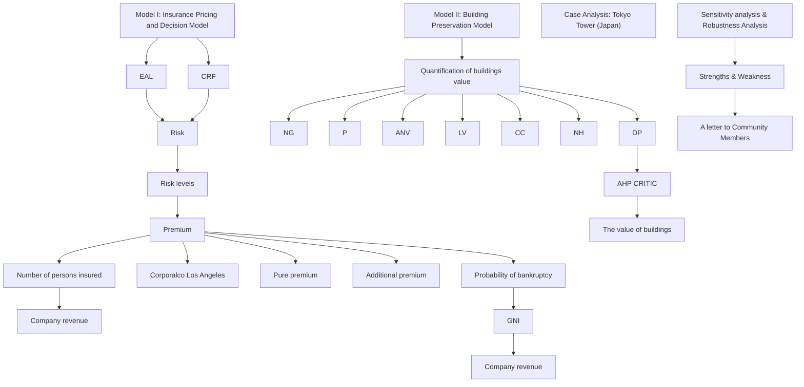
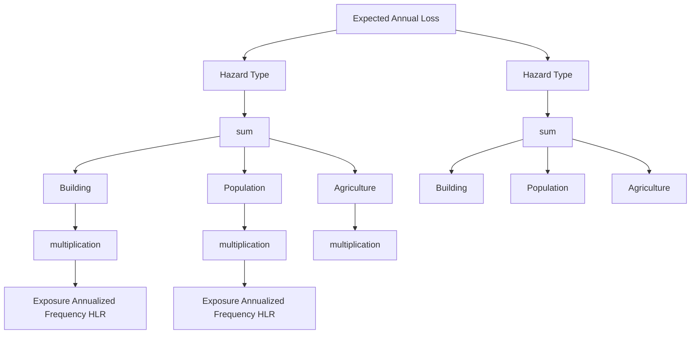
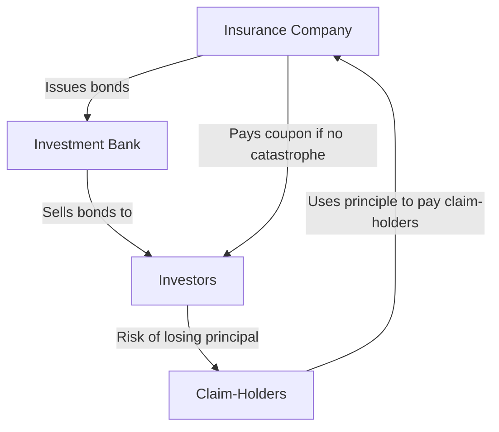
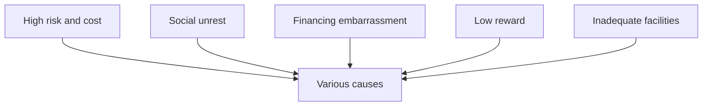

# Veils of Uncertainty: Weaving Risk into the Tapestry of Preservation Under the Weather's Watch Summary

As the tapestry of nature weaves its unpredictable patterns, humanity's quest for stability becomes ever more pressing. In the shadow of uncertainty, we find resilience, crafting shields against the tempests of fate.

First, we establish a Risk Analysis model to comprehensively assess the Expected Annual Loss (EAL) from extreme weather in terms of population, building, and agriculture. The assessment for each aspect is calculated from three perspectives: natural hazard exposure, Historic Loss Ratio, and the likelihood risk factor of natural hazard annualized frequency. Community Risk Factor (CRF) is calculated from social vulnerability and community resilience. EAL and CRF are used to quantify the risk levels of various regions and rank them using the K-means algorithm, resulting in a risk level map of the United States.

Second, we develop a Risk-incorporated Capital Asset Pricing Model (CAPM) to aid insurance companies in underwriting decisions. This model combines market return rates, the risk-free rate, and bankruptcy theory with a 10% bankruptcy probability to set insurance rates. It evaluates if the region's residents can afford these premiums, providing decision-making advice for insurance companies.

More specifically, we apply our Risk-incorporated Capital Asset Pricing Model in Los Angeles and Gorontalo. In Los Angeles, insurance companies see high profits and low risks. However, in Gorontalo, the required premium for \$10,000 coverage is \$342.745, beyond local affordability. We recommend insurance securitization and partnerships with local governments to reduce premiums. Consequently, Gorontalo residents could pay just \$137.25 annually, with companies projecting \$245 million in revenue.

Third, we establish a Building Preservation Model, selecting seven secondary indicators such as the annual number of visitors and construction cost, and three primary indicators: cultural values and community influence, economy, and history. These are weighted using the Sperman-CRITIC algorithm and AHP method to calculate building value, combined with risk levels to determine the preservation level of buildings. Based on the preservation level, the community's investment and measures for building protection can be determined.

Then our models inform investment and protection strategies for Tokyo Tower, acknowledging its value and the necessity of preservation in an earthquake zone. We communicate these findings and propose protection measures to the Tokyo Tower community.

Finally, we analyze the sensitivity and robustness of our models, the models can change the insurance rate sensitively according to the change of the market predicted return and the slight error of the risk factor calculation will not affect the models' result, which verifies the sensitivity and robustness of our models. In addition we analyze the strengths and weaknesses of the models.

Keywords: Risk Analysis, Risk-Capital Asset Pricing Model, Sperman-CRITIC, AHP, Building Preservation Model.

## Contents

## 1 Introduction......4

1.1 Problem Background ...... 4  
1.2 Restatement of the Problem ...... 4  
1.3 Our Work....4

## 2 Assumptions and Justifications....5

## 3 Notations ....5

## 4 Insurance Pricing and Decision Model....6

4.1 Data Collection....6  
4.2 Risk Analysis 6

4.2.1 The Expected Annual Loss(EAL)....6  
4.2.2 Community Risk Factor ....7  
4.2.3 Risk Calculation 8

4.3 Insurance Premium 9  
4.4 Measures 13

4.4.1 Insurance Securitization .... 13  
4.4.2 Co-operation with the Government 13  
4.4.3 The Implementation of Measures 14

4.5 Real Estate Decision Making....14

## 5 Building Preservation Model ....16

5.1 Building Value Quantification .... 16

5.1.1 Indicators Determination....16  
5.1.2 Weight Calculation ...... 17  
5.1.3 Quantitative Results of Building Values....19

5.2 Determination of protection measures 20

5.2.1 Measure Score 20  
5.2.2 Score of Protection Measures....20  
5.2.3 Mentoring for Community Leaders....20

## 6 Landmark Case Analysis....21

6.1 Insurance Pricing for Tokyo Tower....21  
6.2 Architectural Value of Tokyo Tower 21

## 7 Sensitivity and Robustness Analysis....22

7.1 Sensitivity 22  
7.2 Robustness 23

## 8 Model Evaluation....23

8.1 Strengths ...... 23  
8.2 Weaknesses ...... 23

## References....23

## 1 Introduction

## 1.1 Problem Background

Extreme weather events are becoming more frequent due to climate change. As the economic costs of disasters rise, how should the insurance industry respond to losses? Extreme weather events cause untold human suffering but and ever-growing economic costs.

Catastrophic risks consequently cause a variety of problems for insurers. First, because the losses arise from a small number of lumpy events, the insurer may not have sufficient resources to cover the losses. Less dramatically, the firm may suffer losses well in excess of the value of the premiums that it charged for the coverage. In the absence of adequate reinsurance, the firm may go bankrupt or may choose to exit a state in which there is a substantial exposure to such catastrophic risks. The unexpected catastrophes or blockbuster events maybe raise the rate that firms charge for insurance. Thus, for any given number of policies written, the total premiums will rise $[1]$ .

The impact of natural disasters is equivalent to a \$520 billion loss in annual consumption, and forces some 26 million people into poverty each year. Given the gradual increase in the number of extreme-weather events in the world, how to realize the sustainability of property insurance is a great challenge we need to address.

## 1.2 Restatement of the Problem

Considering the background information and restricted conditions identified in the problem statement, we need to solve the following problems:

➢ Problem 1: The property insurance industry faces a crisis from increased extreme weather events caused by climate change, leading to higher claims and premiums.  
➢ Problem 2: Insurance companies must decide on underwriting policies in weather-affected regions, balancing risk and long-term viability.  
➢ Problem 3: Participants are tasked with creating a model to assist in underwriting decisions and a preservation model for community leaders to protect significant buildings.  
➢ Problem4: The models should be applied to specific areas and a historic landmark, with recommendations for future insurance and preservation strategies.

## 1.3 Our Work

In order to clearly illustrate our work, we draw the flowchart Figure 1.

flowchart

Figure 1: Our work

## 2 Assumptions and Justifications

Considering those practical problems always contain many complex factors, first of all, we need to make reasonable assumptions to simplify the model, and each hypothesis is closely followed by its corresponding explanation:

- Assumption: The data we use are accurate and valid.  
- Justification: Our data is collected from the World Bank and some other official web sites and research papers. it's reasonable to assume the high quality of their data.  
- Assumption: The regions under study will remain peaceful and stable, with no significant events other than natural disasters occurring in the foreseeable future.  
- Justification: A stable capital market environment provides a predictable framework within which we can project our expected returns. It is important to note that this assumption does not negate the potential impact of natural disasters.  
- Assumption: The estimated figures for each region represent an average level of performance or condition for that area.  
- Justification: For the purposes of this study, treating each region as a cohesive entity allows for a more streamlined analysis. This methodological approach simplifies the complexity inherent in regional studies by focusing on aggregate data, thereby providing a generalized view of each area's performance or condition.

## 3 Notations

The key mathematical notations used in this paper are listed in Table 1.

Table 1: Notations

<table><tr><td>Symbol</td><td>Description</td></tr><tr><td>EAL</td><td>Expected Annual Loss</td></tr><tr><td>SV</td><td>Social Vulnerability</td></tr><tr><td>CR</td><td>Community Resilience</td></tr><tr><td>CRF</td><td>Community Risk Factor</td></tr><tr><td>HLR</td><td>Historic Loss Ratio</td></tr></table>

\* There are some variables that are not listed here and will be discussed in detail in each section.

## 4 Insurance Pricing and Decision Model

## 4.1 Data Collection

Table 2: Date Websites

<table><tr><td>Database Names</td><td>Database Websites</td></tr><tr><td>Los Angeles</td><td>https://geohub.lacity.org/</td></tr><tr><td>The National Risk Index</td><td>National Risk Index | FEMA.gov</td></tr><tr><td>Bureau of the Census</td><td>https://data.census.gov/</td></tr><tr><td>South Carolina</td><td>https://www.sc.edu/</td></tr><tr><td>World Bank</td><td>https://data.worldbank.org/</td></tr></table>

## 4.2 Risk Analysis

## 4.2.1 Expected Annual Loss (EAL)

The EAL value are in units of dollars, representing the community's average economic loss from natural hazards each year. EAL is calculated using a multiplicative equation that considers the consequence risk factors of natural hazard exposure, HLR (Historic Loss Ratio), and the likelihood risk factor of natural hazard annualized frequency. The EAL value for each consequence type is calculated by multiplying the exposure value of an area by the estimated annualized frequency and the HLR.

$$
E A L = \text { Exposure } \times \text { Annualized   Frequency } \times H L R \tag {1}
$$

The total EAL value for each hazard type is the sum of three different types of consequences: population (P), building (B), and agriculture (A).

$$
E A L _ {\text { Hazard   Type }} = E A L _ {\text { Hazard   Type } (P)} + E A L _ {\text { Hazard   Type } (B)} + E A L _ {\text { Hazard   Type } (A)} \tag {2}
$$

We add up the EAL values for 18 types of hazards to obtain the composite EAL value.

$$
E A L _ {\text { Composite }} = \sum_ {i = 1} ^ {1 8} E A L _ {\text { Hazard   Type }} \tag {3}
$$

In order to describe our process of calculating the value of EAL more clearly. We draw the flowchart Figure 2 below.

flowchart

Figure 2: Calculation procedure for EAL

A national ranking is computed for the composite EAL value of each community. The resulting values are then converted into national percentiles to produce an EAL score for each community. The EAL scores are very helpful for the risk calculation in the following text.

$$
E A L \text {   Rank } = \operatorname{Rank} (E A L _ {\text { Composite }}) \tag {4}
$$

$$
E A L \text { Score } = \frac {\text { EAL   Score } - \text { Min(EAL   Score) }}{\text { Max(EAL   Score) } - \text { Min(EAL   Score) }} \times 1 0 0 \tag {5}
$$

## 4.2.2 Community Risk Factor (CRF)

To generate a Community Risk Factor CRF (CRF) value for a community, its Social Vulnerability (SV) value is divided by its Community Resilience (CR) value.

$$
C R F = f \left(\frac {S V}{C R}\right) \tag {6}
$$

where $f\left(\frac{SV}{CR}\right)$ is a triangular distribution with minimum 0.5, maximum 2, and mode 1.

The selection process for the CRF involved evaluating various shapes, ranges, and modes. Considering its ability to highlight communities at both ends of the distribution without attributing extreme values to a select few, we use the triangular distribution. It also takes into account the EAL as the primary driver of risk, thereby making a mode of 1 the most appropriate choice for the CRF.

The SV values correspond to SOVI values, while the CR values represent HVRI BRIC index for the community, as provided by the source data sets.

## 4.2.3 Risk Calculation

In the most general terms, natural hazard risk is often defined as the likelihood (or probability) of a natural hazard event happening multiplied by the expected consequence if a natural hazard event occurs.

$$
\text { Risk } = \text { Likelihood } \times \text { Consequence } \tag {7}
$$

To make the level of risk more concrete and exemplified, we estimate risk from two aspects: risk value and risk score.

$$
R _ {\text { value }} = E A L _ {\text { value }} \times C R F \tag {8}
$$

$$
R _ {\text { score }} = E A L _ {\text { score }} \times C R F \tag {9}
$$

where $R$ represents Risk.

This risk equation of R includes three components: a natural hazards risk component, a consequence enhancing component, and a consequence reduction component. EAL is the natural hazards risk component, measuring the expected loss of building value, population, and/or agriculture value each year due to natural hazards. CRF incorporates both the consequence enhancing component, denoted as SV, and the consequence reduction component, represented by CR.

For equation (8), values for Risk and EAL are in units of dollars, representing the community's average economic loss from natural hazards each year. For SV and CR, values are the index values for the community provided by the source data sets.

For equation (9), each component is represented by a score that represents a community's percentile ranking relative to all other communities at the same level. The composite risk score is calculated to measure a community's risk to all 18 hazard types. And it is also a community's percentile ranking in risk compared to all other communities at the same level. The risk score and EAL score are provided as both composite scores from the summation of all 18 hazard types.

We used the K-algorithm to categorize the disaster levels into five classes, as shown in Figure 3.

heatmap

| State | National Risk Index |
|---|---|
| AK | Very High |
| AL | Very High |
| AZ | Very High |
| AR | Very High |
| CA | Very High |
| CO | Very High |
| CT | Very High |
| DE | Very High |
| FL | Very High |
| GA | Very High |
| HI | Very High |
| IA | Very High |
| KS | Very High |
| KY | Very High |
| LA | Very High |
| ME | Very High |
| MA | Very High |
| MI | Very High |
| MN | Very High |
| MO | Very High |
| MT | Very High |
| NE | Very High |
| NV | Very High |
| NH | Very High |
| NJ | Very High |
| NM | Very High |
| NY | Very High |
| NC | Very High |
| ND | Very High |
| OH | Very High |
| OK | Very High |
| OR | Very High |
| PA | Very High |
| RI | Very High |
| SC | Very High |
| SD | Very High |
| TN | Very High |
| TX | Very High |
| UT | Very High |
| VT | Very High |
| VA | Very High |
| WA | Very High |
| WV | Very High |
| WI | Very High |
| WY | Very High |
| AX | Very High |
| AY | Very Low |
| AZ | Not Applicable |
| BA | Not Applicable |
| BB | Not Applicable |
| BC | Not Applicable |
| BD | Not Applicable |
| BE | Not Applicable |
| BF | Not Applicable |
| BG | Not Applicable |
| BH | Not Applicable |
| BI | Not Applicable |
| BK | Not Applicable |
| BL | Not Applicable |
| BM | Not Applicable |
| BN | Not Applicable |
| NM | Not Applicable |
| NY | Not Applicable |
| NC | Not Applicable |
| NH | Not Applicable |
| NJ | Not Applicable |
| NM | Not Applicable |
| NY | Not Applicable |
| NH | Not Applicable |
| NJ | Not Applicable |
| NM | Not Applicable |
| NY | Not Applicable |
| NH | Not Applicable |
| NJ | Not Applicable |
| NM | Not Applicable |
| NY | Not Applicable |
| NH | Not Applicable |
| NJ | Not Applicable |
| NM | Not Applicable |
| NY | Not Applicable |
| NH | Not Applicable |
| NJ |Not Applicable |
| NY | Not Applicable |
| NH | Not Applicable |
| NJ | Not Applicable |
| NM | Not Applicable |
| NY | Not Applicable |
| NH | Not Applicable |
| NJ | Not Applicable |
| NM | Not Applicable |
| NY | Not Applicable |
| NH | Not Applicable |
| NJ | Not Applicable |
| NM | Not Applicable |
| NY | Not Applicable |
| NH | Not Appable |
| NJ | Not Applicable |
| NM | Not Applicable |
| NY | Not Applicable |
| NH | Not Applicable |
| NJ | Not Applicable |
| NM | Not Applicable |
| NY | Not Applicable |
| NH | Not Applicable |
| NJ | Not Applicable |
| NM | Not Applicable |
| NY | Not Applicable |
| NH | Not Applicable |
| NJ | Not Applicable |
| NM | Not Applicable |
|
| NY | Not Applicable (Not Applicable) |
| NC-100, PR and VI: Relative Low to 100% (not applicable).

(a) Risk levels in different regions in U.S.

text_image

High
Relatively High
Relatively Moderate
Relatively Low
Very Low

(b) Risk level  
Figure 3: Risk rating and map presentation

## 4.3 Insurance Premium

Generally, the companies adopt the principle of Level Premium to determine the price of insurance. The company calculate the pure premium by using a pre-determined claim rate and a desired return on investment. The total premium is then obtained by adding surcharges at a certain expense ratio. Then, the total premium is obtained by adding surcharges at a certain expense ratio. Insurance companies increase their profitability by increasing expense ratios and reducing expected returns on investment. In addition, they utilize the ‘Law of Large Numbers’ to set the overall payout ratio of the product so that it basically matches the statistical data, thus reducing the company's exposure to the risk of fluctuating payout ratios. For catastrophe insurance pricing, a natural disaster can cause huge property damage when it occurs. The insurance company may have a risk of becoming insolvent.

In finance, the capital asset pricing model (CAPM) is a model used to determine a theoretically appropriate required rate of return of an asset, to make decisions about adding assets to a well-diversified portfolio.

The reward-to-risk ratio for any individual security in the market is equal to the market reward-to-risk ratio, thus

$$
\frac {E (r _ {i}) - r _ {f}}{\beta_ {i}} = E (r _ {m}) - r _ {f} \tag {10}
$$

$$
\beta_ {i} = \frac {\operatorname{Cov} (R _ {i} , R _ {m})}{\operatorname{Var} (R _ {m})} = \rho (i, m) \frac {\sigma_ {i}}{\sigma_ {m}} \tag {11}
$$

where

- $E(r_i)$ is the expected return on the capital asset,  
- $E(r_m)$ is the expected return of the market,  
- $r_f$ is the risk-free rate of interest such as interest arising from government bonds,  
- $\beta_{i}$ is the sensitivity of the expected excess asset returns to the expected excess market returns,  
- $\rho(i, m)$ denotes the correlation coefficient between the investment $i$ and the market $m$ ,  
- $\sigma_{i}$ is the standard deviation for the investment $i$ ,

\- $\sigma_{m}$ is the standard deviation for the investment $m$ .

Expected return on investment (ROI):

$$
R O I = \int \frac {- A \times l (p) + (1 + x) A \times R _ {v a l u e} - I}{I} f (p) d p \tag {12}
$$

Variance of ROI:

$$
\operatorname{Var} (R O I) = \int \left[ \frac {- A \times l (p) + A (1 + x) \times R _ {\text { value }} - l - \left(A x \times R _ {\text { value }} - l\right)}{I} \right] ^ {2} f (p) d p \tag {13}
$$

where

- $A$ is the sum insured,  
- $I$ is the invested capital,  
- $l(p)$ is the loss function,  
- $x$ is the surcharge rate.

The surcharge rate $x$ is a multiple of the average value of the loss:

$$
x = \frac {\left(1 + r _ {f} + \rho \times \frac {(A / I) \times \sigma}{\sigma_ {M}} \times (r _ {M} - r _ {f})\right) \times I}{A \times R _ {\text { value }}} \tag {14}
$$

where $\sigma$ is the Standard deviation of $R_{value}$ .

Pure premium per \$10,000 y :

$$
y = 1 0 0 0 0 (1 + x) \times P \tag {15}
$$

where P is the probability of a disaster causing damage.

Typically, it is more reasonable to spend 3-10 percent of each person's annual income on insurance. We assume that each person is willing to spend 5% of his or her annual income each year to purchase catastrophe insurance with a one-year term. Insurance companies can make decisions from two perspectives based on the above formula:

Introducing bankruptcy theory, after calculating the lowest order price, y, in the case where the probability of the firm's future bankruptcy is less than 10%, and then comparing it to the local per capita annual disposable income (GNI), it is expected that people in the locality will not be able to afford to consume catastrophe insurance and will not invest in it if the ratio of premiums per \$10,000 to GNI is greater than 5%.

We use 5% of the local national GNI per capita as the subscription price per \$10,000 of premium. If this price makes the likelihood of future insolvency of the company higher than 10%, no investment is made in that location.

The price of insurance also affects people's desire to buy to some extent, and an increase in the price of insurance may lead to a decrease in their desire to buy.

$$
N = (1 - \omega y) N _ {A} \tag {16}
$$

$$
\text { Total   Revenue } = y \times N \tag {17}
$$

where

- $N_{A}$ is the total local population,  
- $N$ is the number of local people with a strong desire to buy,  
- $\omega$ is the factor that influences the price of insurance on the willingness of locals to buy, and is related to the average disposable income of locals as well as the gap between the rich and the poor,  
• Total Revenue is the projected total local insurance revenue.

The company first determines the area in which it wants to invest money to build the insurance and then determines the price of local insurance. We would like to maximize the company's total revenue:

max Total Revenue

$$
s. t. \left\{ \begin{array}{l} 0 <   \omega y <   1 \\ y \geqslant y _ {1 0} \\ y \leqslant 0. 0 5 \times G N I \end{array} \right. \tag {18}
$$

where $y_{10}$ is the price of insurance when the firm's insolvency rate is 10 percent.

Our model is implemented in Gorontalo, Indonesia and Los Angeles, California. This is because both locations have similar and high risk indices, with Los Angeles having the highest disaster risk index in the United States.

text_image

RGF SPORT GORONTALO
LOTUS GUARDINI
Top rated
Gorontalo
Telaga
Jil. Brigien Picta
Jil. Sultan Botuhe
Villasulo mamai

(a) Gorontalo

text_image

Santa Clarita
Thousand Oaks
Los Angeles
Santa Monica
Anahim
Long Beach
Huntington Beach
Catalina Island
San Bernardino
Riverside
Irvine

(b) Los Angeles  
Figure 4: Location of the two areas on the map

After searching for relevant data, we calculated that in order to ensure that the probability of the company's bankruptcy after investing in catastrophe insurance in Gorontalo is less than 10%, we need to charge a premium of \$342.745 for every \$10,000 of coverage, which is calculated in equation (14), of which \$283.465 is the pure premium and \$59.28 is the additional premium. Searching for relevant information we find that 5% of the per capita disposable income (GNI) of Gorontalo is only \$137.25, so the likelihood of residents being willing to purchase catastrophe insurance is low and the company should not invest in catastrophe insurance in the area.

In order to ensure that the probability of insolvency of the company after investing in catastrophe insurance in Los Angeles is less than 10%, through the formula (14) calculated that for every \$10,000 of coverage need to charge a premium of \$295.09 of which the pure premium is \$200 and the additional premium is \$95.09 (because of the higher return on investment in the market in the U.S.). The per capita disposable income in Los Angeles (5% of GNI is \$3,162.65), which is much higher than the cost of catastrophe insurance. In order to determine the most appropriate cost of insurance to earn a greater benefit, we plotted the trend of total premium income as a function of premiums.

line chart

| Insurance Price($) | Total Revenue ($) |
| ------------------ | ----------------- |
| 500                | 1.0e9             |
| 1000               | 3.0e9             |
| 1500               | 4.0e9             |
| 2000               | 4.5e9             |
| 2500               | 4.7e9             |
| 3000               | 4.5e9             |

Figure 5: Relationship between company revenue and insurance price in Los Angeles

From the Figure 5, it can be seen that with the increase of premiums, the total income of insurance companies tends to increase first and then decrease. This is because when the premium is too low, although the number of insured people is high, the amount of single transaction is small and the number of guarantees is too high, which leads to a higher risk of bankruptcy of the insurance company; whereas too high a premium will reduce the consumer's expectations of catastrophe insurance, and the volume of insurance orders will be small.

In summary, for Los Angeles, a premium of about 2,500 per \$10,000 of coverage can be used, and 1.92 million people are expected to purchase the company's catastrophe insurance (the total population of Los Angeles is about 3.79 million). At this point, the insurance company's theoretical revenue would be around \$4.5 billion. Although Los Angeles has a high risk index, the profits are equally attractive, so the insurance company could take the risk of launching its catastrophe insurance business here.

## 4.4 Measures

## 4.4.1 Insurance Securitization

Catastrophe bonds are risk-linked securities that transfer a specified set of risks from a sponsor to investors. Catastrophe bonds emerged from a need by insurance companies to alleviate some of the risks they would face if a major catastrophe occurred, which would incur damages that they could not cover by the invested premiums. An insurance company issues bonds through an investment bank, which are then sold to investors. These bonds are inherently risky, and usually have maturities less than 3 years. If no catastrophe occurred, the insurance company would pay a coupon to the investors. But if a catastrophe did occur, then the principal would be forgiven and the insurance company would use this money to pay their claim-holders.

flowchart

Figure 6: Insurance securitization schema

From an economic perspective, the securitization of insurance, particularly through instruments like catastrophe bonds, represents a significant innovation in the capital markets. This innovation not only diversifies investment opportunities but also plays a crucial role in enhancing the resilience of the insurance industry against catastrophic events. Catastrophe bonds allow insurance companies to transfer the risk of extreme events, such as natural disasters, to the capital markets, thereby reducing their potential liability and improving their solvency. This mechanism enables insurance firms to manage their risk exposure more effectively and to maintain stability in the face of potentially ruinous events. By doing so, it also ensures that insurance companies can continue to offer coverage for risks that might otherwise be uninsurable due to their catastrophic potential.

## 4.4.2 Co-operation with the Government

The government plays an important role in the country. The government can make some appealing policies to stimulate people to buy insurance and cooperate with insurance companies to undertake part of the risk. When people buy insurance, individuals are only required to bear part of the premium. The remainder is subsidized by the various levels of government. If necessary, special groups of people may be fully covered by government finances. When a catastrophe occurs, the government can act as a reinsurer and bear part of the amount of compensation. If the amount of compensation is small, the insurance company will pay directly. Otherwise, it can be covered or partially paid by the government. In this way, a multi-layered diversification of risk is constructed. It not only brings benefit protection to the people, but also drives the development of the insurance industry.

## 4.4.3 The Implementation of Measures

Through the two scenarios described above, the insurance company's market return on investment in the Gorontalo region $r_{m}$ increased. When a natural disaster occurs, the amount of compensation paid by the insurance company is shared by the insurance company, the investors in the insurance securities, and the local government. In addition, the government subsidizes residents for catastrophe insurance, which increases the willingness of residents to purchase catastrophe insurance and reduces the actual cost paid by individuals. The insurance company can set premiums at the lowest premium (295.09) that can be assumed under the risk of insolvency. We plot the trend of total premium income as a function of premium at this point in time.

line chart

| Insurance Price($) | Total Revenue ($) |
| ------------------ | ----------------- |
| 0                  | 0                 |
| 50                 | 50000000          |
| 100                | 100000000         |
| 150                | 150000000         |
| 200                | 200000000         |
| 250                | 250000000         |
| 300                | 250000000         |

Figure 7: The Analog trend of total premium income in Gorontalo

As we can see from the picture. Under the company's affordable insolvency risk, the insurer expects maximum revenues of \$245 million. The company expects maximum revenue is \$245 million. At this time, each \$10,000 of insurance amount charges \$295.09 of insurance premiums. We expect 830,255 people (about 73.26% of the total population) to have catastrophic insurance. Gorontalo residents pay only \$137.25 individually, and the remainder is subsidized by the Gorontalo government. The government guarantees the legal rights of Gorontalo residents as well as their social welfare.

## 4.5 Real Estate Decision Making

Our insurance model has a significant impact on the development decisions of real estate developers. Based on the above model derivation, it can be learned that for areas with high natural disasters and low per capita income, if the insurance company is willing to underwrite policies, it will result in the high bankruptcy rate of the company not being able to realize profitability. Similarly, real estate developers will not choose the area for investment and development due to high risk and lack of demand. That is, any area with high R value and income (GNI) below a certain value is not recommended for real estate developers to invest in. In addition to this, such areas have the following risk factors:

flowchart

Figure 8: Risk factors

Further applying our model, we can calculate the insurance rate, which is the insurance premium divided by insurance amount. If the area has a high insurance rate by calculating, the property developer would have to bear a higher insurance cost during the construction of the building as well as during the unsold period. Therefore, property developers need to carefully consider and weigh the future profit and loss before making decisions.

Similarly, in other areas, we can calculate local insurance rates based on our model. According to this indicator, property developer can further determine the cost of developing land in local area and buying insurance. In this way we provide a reference for the property developer's decision making.

Additionally, our model can also provide guidance about how property developers build construction. For each of the 18 hazard types, we can calculate the value of EAL and $R_{value}$ (in dollars) for each hazard type. We find a positive correlation between EAL and $R_{value}$ to some extent. Thus, property developers can determine the different major hazard type for each area based on $R_{value}$ and thus build different types of homes. For example, in the city of New Orleans, USA, flooding ranks high on the list of 18 natural disasters in terms of $R_{value}$ . Accordingly, many property companies, such as American Restorators LLC, are building houses with high foundations locally to minimize damage and achieve business profitability. Our model solves the problem about how to build on certain site. This approach not only maintains the interests of real property developers, but also protects the lives of people in the community.

## 5 Building Preservation Model

## 5.1 Building Value Quantification

Building value is measured in terms of the building's cultural value and community influence, economic value, and historical value. Therefore, we take these three main aspects as primary indicators.

## 5.1.1 Indicators Determination

For the cultural value and community influence, we synthesized various factors, such as geography and network, and finally selected the three most representative secondary indicators to construct our model. Similarly, for the economic and historical value, we selected two secondary indicators each to improve the model. The specific description and indicators selected are shown in Table 3.

Table 3: Indicators

<table><tr><td>Object</td><td>Indicators</td><td>Description</td></tr><tr><td rowspan="3">Cultural Values and Community influence</td><td>NG</td><td>Number of Google search terms</td></tr><tr><td>P</td><td>Participation in events held around the building</td></tr><tr><td>ANV</td><td>Annual number of visitors</td></tr><tr><td rowspan="2">Economy</td><td>LV</td><td>Land value</td></tr><tr><td>CC</td><td>Construction cost</td></tr><tr><td rowspan="2">History</td><td>NH</td><td>Number of historical research documents</td></tr><tr><td>DP</td><td>Degree of preservation</td></tr></table>

## • Cultural Value and Community Influence

## Global Visibility

The cultural value of a building depends to a large extent on its global visibility. So we quantify its global visibility through two metrics, ‘Number of Google search terms’ (NG) and ‘Annual number of visitors’ (ANV). This approach balances online and offline, making the measurement of cultural values more quantifiable and accurate.

## ▶ Impact on the Community

Buildings have a strong connection with local communities. When measuring the value of a building, we take into account its impact on the local community. Research has shown that the more influence a building has on the local community, the more the value of the landmark itself will increase. Besides, it will further promote the increase of influence, realizing a positive feedback loop. Therefore, we choose ‘Participation in events held around the building’ (P) to quantify the building's influence on the community. We calculate P as follows:

$$
P = \frac {1}{N} \times \sum_ {i = 1} ^ {N} \frac {N C M P _ {i}}{N T C _ {i}} \tag {19}
$$

where $NCMP_{i}$ represents ‘Number of community members participating in activities’ at the ith activity, $NTC_{i}$ means the total number of people in the community at the time of the ith activity and N means the total number of activities conducted around the building.

## - Economy Value

For economic value, we mainly consider the value of the building in terms of its construction. Therefore, we considered the value of the land it occupies. And it is measured by the indicator ‘Land value’ (LV).

$$
L V = P _ {c} \times \text { Area } \tag {20}
$$

where $P_{c}$ represents the current price of the land and Area represents the area occupied by the building. Meanwhile, for the value created during the construction of the building itself, we use ‘Construction cost’ (CC) for quantitative assessment. Taking inflation into account, we define Construction cost as all costs involved in the implementation of that construction project under this year's Engineering News-Record (ENR) benchmark for the region. Both the LV and CC metrics are expressed in U.S. dollars.

## - Historic Value

Historical Research Value

The historical value of a building is largely dependent on its place in historical research. So we quantify its visibility and importance in the academic world through NH. NH refers to the number of historical research documents related to the building, including but not limited to books, papers, reports, etc. This indicator reflects the building's attention and depth of research in the historical community. The higher NH value means the building has a higher historical research value.

The Preservation Condition

The historic value of a building is also affected by its state of preservation. We use ‘Degree of preservation’ (DP) to measure the extent to which a building has been preserved from its original state. It includes aspects such as structural integrity, exterior preservation, and interior decoration. The assessment of DP can be based on expert review, preservation grade, and comparative analysis with the original state. Highly preserved buildings not only better transmit history and culture, but also provide rich materials for future research.

## 5.1.2 Weight Calculation

CRITIC is an objective assignment method based on data volatility. The idea of this method was based on two indicators, contrast intensity and correlation indicators. When calculating the weights, we need to multiply the contrast intensity with the correlation indicator and then normalize to get the final weights.

- Contrast intensity refers to the magnitude of the difference in values between evaluation programs for the same indicator, expressed as a standard deviation. The larger the standard deviation, the greater the fluctuation. That is, the larger the difference in the values taken between the programs, the higher the weight will be.  
- The Sperman correlation coefficient is used to express the correlation between indicators. If there is a strong positive correlation between two indicators, it means that the less conflicting they are, the lower the weight will be.

1) There are n samples to be evaluated and p evaluation indicators to form the raw indicator data matrix.

$$
\left( \begin{array}{c c c} x _ {1 1} & \dots & x _ {1 p} \\ \vdots & \ddots & \vdots \\ x _ {n 1} & \dots & x _ {n p} \end{array} \right) \tag {21}
$$

where $x_{ij}$ represents the value of the jth evaluation indicator for the ith sample.

2) In order to remove the effect of the scale each indicator is normalized. The indicators we selected are of benefit attributes type, so the normalization formula:

$$
X _ {i j} = \frac {x _ {i j} - \min \left(x _ {j}\right)}{\max \left(x _ {j}\right) - \min \left(x _ {j}\right)} \tag {22}
$$

where $X_{ij}$ is normalized to obtain a numerical matrix.

3) Then we calculate the contrast intensity of the indicator:

$$
\left\{ \begin{array}{l} \overline {{x _ {j}}} = \frac {1}{n} \sum_ {i = 1} ^ {n} x _ {i j} \\ S _ {j} = \sqrt {\frac {\sum_ {i = 1} ^ {n} \left(x _ {i j} - \overline {{x _ {j}}}\right) ^ {2}}{n - 1}} \end{array} \right. \tag {23}
$$

where $S_{j}$ represents the strength of comparison of the jth indicator.

The larger the $S_{j}$ , the greater the difference in values for that indicator. The more information the indicator reflects, the stronger the evaluation strength of the indicator itself and the more weight should be assigned to it.

4) Calculation of the conflicting nature of the indicators

$$
\left\{ \begin{array}{l} d _ {i} = \operatorname{Rank} \left(x _ {i j}\right) - \operatorname{Rank} \left(x _ {i k}\right) \\ r _ {j k} = 1 - \frac {6 \sum d _ {i} ^ {2}}{n \left(n ^ {2} - 1\right)} \\ R _ {j} = \sum_ {k = 1, k \neq j} ^ {p} \left(1 - r _ {j k}\right) \end{array} \right. \tag {24}
$$

where $r_{jk}$ denotes the Sperman correlation coefficient between evaluation indicators j and k. $R_{j}$ denotes the conflictual of the jth indicator.

The Sperman correlation coefficient is used to express the correlation between indicators. The stronger the correlation between two indicators, the less they conflict, the more they reflect the same information, and the more repetitive the content of the evaluation is. To a certain extent, the evaluation strength of the indicator is weakened and the weight assigned to it should be reduced.

5) Calculation of the amount of information:

$$
C _ {j} = S _ {j} \times R _ {j} \tag {25}
$$

6) Based on the amount of information, we calculate the weights of each indicator defined $w_{j}$ :

$$
\omega_ {j} = \frac {C _ {j}}{\sum_ {j = 1} ^ {p} C _ {j}} \tag {26}
$$

7) The score for each indicator is:

$$
\text { Score } _ {\text { object }} = \sum_ {j = 1} ^ {p} \omega_ {j} s _ {j} \tag {27}
$$

where object represents ‘Cultural values and community influence’, ‘Economy’, ‘History’, $s_{j}$ denotes the value of the jth secondary indicator.

Applying the CRITIC weighting method for each level 1 indicator separately, the objective weights for each level 2 indicator were obtained as shown in the following Table 1.

## 5.1.3 Quantitative Results of Building Values

In order to assign weights to these three level 1 indicators to get the final building value, we use hierarchical analysis to construct a judgment matrix to get the weights of the three level 1 indicators:

$$
\theta = (0. 4 4 3 2, 0. 3 8 7 3, 0. 1 6 9 4) \tag {28}
$$

where the consistency ratio of the judgment matrix = 0.017591, and the consistency is acceptable.

Ultimately, our building impact score is calculated as follows:

$$
V _ {\text { score }} = \sum_ {i = 1} ^ {3} \theta_ {i} \text { Score } _ {\text { object }} \tag {29}
$$

Table 4: The weight of indicators

<table><tr><td>Object</td><td>Weight</td><td>Indicators</td><td>Weight</td></tr><tr><td rowspan="3">Cultural Values and Community influence</td><td rowspan="3">0.4432</td><td>NG</td><td>0.1698</td></tr><tr><td>P</td><td>0.4429</td></tr><tr><td>ANV</td><td>0.3873</td></tr><tr><td rowspan="2">Economy</td><td rowspan="2">0.3873</td><td>LV</td><td>0.4272</td></tr><tr><td>CC</td><td>0.5728</td></tr><tr><td rowspan="2">History</td><td rowspan="2">0.1694</td><td>NH</td><td>0.6286</td></tr><tr><td>DP</td><td>0.3714</td></tr></table>

## 5.2 Determination of protection measures

## 5.2.1 Measure Score

In Model 1, we obtained a composite risk score $R_{score}$ of each region by analyzing 18 natural hazards. Next, in the above section, we quantified the value of the building to get the score $V_{score}$ . By multiplying the risk score and the value score, $M_{score}$ is obtained, which is used to assess the conservation priority of the building and the extent and scale of conservation measures that need to be taken.

$$
M _ {\text { score }} = V _ {\text { score }} \times R _ {\text { score }} \tag {30}
$$

A higher $M_{score}$ indicates a higher value of the building, along with a higher risk of exposure to natural hazards. Therefore, more urgent and comprehensive protection measures are needed. Based on the statistical distribution of $M_{score}$ , we set reasonable thresholds to recognize low, medium, and high grades, and the values of the specific thresholds need to be set based on expert recommendations and industry standards.

## 5.2.2 Score of Protection Measures

- Low: For low-grade $M_{score}$ buildings, basic conservation measures, such as routine maintenance and inspections and, where necessary, minor repairs, are undertaken. The risk or value of these buildings is low, so the measures taken are mainly preventive and low-cost.  
- Medium: For medium-grade $M_{score}$ , moderate protection measures are implemented, including enhanced structural inspections, improved safety features, and disaster preparedness programs. These measures aim to increase the resistance and resilience of buildings and require moderate investment.  
- High: For high-grade $M_{score}$ , implement comprehensive and high-intensity protection measures. This may include comprehensive structural reinforcement, installation of advanced security systems, and customized risk management plans in cooperation with external experts. Given the high risk or value of these buildings, the goal of the measures is to minimize potential losses, even if this means higher initial costs.

Note that: The "one-size-fits-all" approach to disaster protection measures ignores the impact of regional differences, architectural characteristics and socio-economic factors, and can lead to poor protection and resource utilization. So specific protection measures still need to be derived from a thoughtful local analysis by natural disaster experts.

## 5.2.3 Mentoring for Community Leaders

Our model provides a quantitative and systematic framework for community leaders to help them determine the extent and priority of preservation measures based on a building's risk and value scores. The model makes the decision-making process more scientific and accurate by combining risk scores (which consider threats such as natural hazards) and value scores (which include historical, cultural, economic, and community importance). It promotes optimal allocation of resources and ensures that high-value or high-risk buildings are adequately protected, while also taking into account economic benefits. In addition, the model encourages community involvement and support, improves disaster response capacity, and supports sustainable community development. Through this approach, community leaders are able to make more informed decisions to protect and maintain important buildings in their neighborhoods, contributing to the overall well-being and development of the community.

## 6 Landmark Case Analysis

We select Tokyo Tower in Japan as the landmark for evaluation and analysis.

text_image

Tokyo Tower

Figure 9: Location of Tokyo Tower

## 6.1 Insurance Pricing for Tokyo Tower

Designed by Japanese architect Tachu Naito, the Tokyo Tower cost \$8.4 million to build at the time and was constructed to send broadcast signals in Tokyo. Currently, Tokyo's GNI per capita is \$36,964.96, and the Tokyo capital market is currently functioning well. The risk score for Tokyo is calculated to be 86. According to the insurance pricing model, the optimal insurance rate for an insurance company to issue catastrophe insurance in Tokyo is 3.8%. In view of the special historical value of the Tokyo Tower, the insurance company may appropriately increase the insurance rate. As a result, the Tokyo government spends approximately US \$319,200 per year on catastrophe insurance for the Tokyo Tower.

## 6.2 Architectural Value of Tokyo Tower

In 2011, a major earthquake struck northeastern Japan, and this earthquake caused some damage to Tokyo Tower, bending the antenna at the tip of the tower by 2 degrees, resulting in the end of the experimental broadcasting of terrestrial wave digital sound broadcasting, and the interruption of the transmission of the 24/7 terrestrial analog television signals. Tokyo Tower entered a maintenance period during which analog signals and FM broadcasting-related services also began to be transferred to Tokyo Skytree, so the proportion of Tokyo Tower's actual use gradually decreased. However, Tokyo Tower has attracted more than 3 million visitors as a tourist attraction and has accumulated more than 150 million visitors. It is also a symbol of Japan's post-war prosperity and has a remarkable historical significance for the Japanese people.

According to the calculations of the building conservation model, the $M_{score}$ of Tokyo Tower is located in a high conservation level area. Therefore, the government should consider purchasing catastrophe insurance for Tokyo Tower and strengthening its daily supervision and maintenance to ensure that it can withstand natural disasters, such as earthquakes, and that its seismic treatment measures also need to be strengthened.

## 7 Sensitivity and Robustness Analysis

## 7.1 Sensitivity

In section 4.3, factor $r_{m}$ is introduced to estimate the parameters of the expected return of the market. Therefore, change the size of this parameter, that is, the capital market environment has changed. Below we analyze the sensitivity of this parameter. Gradual reduction of the parameter by 5%. The reason for considering only a decrease in r and not an increase in r is to reflect the worst-case scenario, i.e. a gradual decrease in capital market returns, and to see if our model is sensitive to the parameter.

Therefore, Re-simulate the calculation results and obtain 3 sets of curves as shown in Figure 10.

line chart

| Insurance Price($) | rm       | 95%rm    | 90%rm    |
| ------------------ | -------- | -------- | -------- |
| 500                | 1.0e9    | 1.0e9    | 1.0e9    |
| 1000               | 3.0e9    | 2.8e9    | 2.6e9    |
| 1500               | 4.0e9    | 3.8e9    | 3.5e9    |
| 2000               | 4.5e9    | 4.3e9    | 4.0e9    |
| 2500               | 4.6e9    | 4.4e9    | 4.2e9    |
| 3000               | 4.4e9    | 4.2e9    | 4.0e9    |

Figure 10: Sensitivity analysis of $r_m$

The results show that as r decreases, the profit gained by the insurance company if it sells the insurance company at the same price tends to decrease. This makes sense because lower capital market interest rates result in lower profits for insurance companies. The trend of the curve obtained by sensitivity test is consistent with the actual situation.

## 7.2 Robustness

We verify the robustness of the model. Given the uncertainty of natural hazards, we may have errors in the calculation of $R_{value}$ , which affects our grading of the risk indicators for each region. Randomly selecting some of the more than 3,000 counties in the United States and deviating its $R_{value}$ by 5%, and again grading these areas, the results obtained are shown in Figure 11.

scatterplot

| R_score | Value |
| ------- | ----- |
| 100     | 100   |
| 90      | 90    |
| 80      | 80    |
| 70      | 70    |
| 60      | 60    |
| 50      | 50    |
| 40      | 40    |
| 30      | 30    |
| 20      | 20    |
| 10      | 10    |
| 0       | 0     |

Figure 11: Robustness analysis of $R_{value}$

As can be seen from the figure, the grading of the original regions changes only slightly after randomly selecting regions to bias their measurements. This indicates that the small error in R does not cause large changes in the model results and our model is stable.

## 8 Model Evaluation

## 8.1 Strengths

Robustness and Flexibility: Our model demonstrates strong adaptability to various parameter variations through sensitivity analysis and robustness testing, and is able to provide reliable predictions under different scenarios.

Comprehensive consideration: Our model integrates social and economic factors, natural disaster risks, and provides a way to price insurance.

## 8.2 Weaknesses

Data Dependency: Although the model has a high demand for data quality, it reflects our scientific attitude of pursuing accuracy and real-time performance. By working with data providers, we can continuously optimize the data collection and processing process.

## References

[1] Born P, Viscusi W K. The catastrophic effects of natural disasters on insurance markets. Journal of Risk and Uncertainty, 2006, 33(1/2), 55-72.

[2] Michel-Kerjan, E., and Kunreuther, H. . Redesigning flood insurance. Science, 2011,333(6041), 408–409.  
[3] Blanchard, O., Lopez-de-Silanes, F., and Schleifer, A. What do firms do with cash windfalls? Journal of Financial Economics, 1994, 36(3), 337-360.  
[4] Jaffee, D., and Russell, T. Catastrophe insurance, capital markets, and uninsurable risks. Journal of Risk and Insurance, 1997, 64(2), 205-230.  
[5] Froot, K. The financing of catastrophe risk. Cambridge, MA: National Bureau of Economic Research. 1999.  
[6] Bingqing Li, Cunzhi Tian. Application of CAPM in pricing catastrophe insurance products. Nankai Economic Research, 2002,4, 41-103.  
[7] Aase, K. K.. Dynamic equilibrium and the structure of premiums in a reinsurance market. The Geneva Papers on Risk and Insurance Theory. 1992, 17, 9-136.  
[8] OpenAI. ChatGPT: Optimizing Language Models for Dialogue. 2024, https://openai.com/chatgpt.

# A Letter to Community Members

Dear Esteemed Members of the Tokyo Tower Community:

We are researchers related to the study of architectural preservation. In order to realize the preservation of Tokyo Tower at a lower cost, please allow me to introduce our proposal on behalf of our team.

We have recently concluded a comprehensive analysis aimed at ensuring the future sustainability and preservation of our cherished Tokyo Tower. Our findings offer a strategic blueprint that prioritizes not only the physical well-being of this iconic structure but also its cultural and historical essence.

## Recommendation Plan:

Our proposed plan encompasses innovative preservation techniques, structural enhancements, and community-centric initiatives designed to safeguard and celebrate the tower's legacy. We aim to implement cutting-edge solutions that address both current vulnerabilities and future challenges.

## Implementation Timeline:

This ambitious project is scheduled over a five-year period, beginning with immediate preliminary assessments and followed by successive phases of structural upgrades and community engagement activities. This phased approach ensures meticulous attention to detail and the successful realization of our objectives.

## Budget Overview:

The financial blueprint for this venture is estimated at \$320,000 per annum. This budget encompasses the costs associated with structural reinforcements, preservation technology, and community enrichment programs. It represents a balanced investment in the tower's longevity and its significance to our community.

We stand at a pivotal moment in the history of Tokyo Tower, poised to embark on a journey that not only secures its future but also reinvigorates its role within our community. We invite you to support this noble cause, ensuring that Tokyo Tower remains a symbol of resilience, heritage, and communal unity for countless years to come.

Sincerely,

Team #2400860

## Report on Use of AI

1. OpenAI ChatGPT (Jan 25, 2024 version, ChatGPT-4)

Query: Give me some brainstorming ideas for innovative data visualization techniques.

Output:

Here are some innovative data visualization technique ideas:

(1) Interactive Dashboards: Develop dashboards that allow users to interact with the data, such as filtering, zooming, and selecting specific data points to see detailed information.  
(2) Animated Visualizations: Use animations to show changes in data over time, helping to illustrate trends, cycles, or progressions.  
(3) Augmented Reality (AR) Visualizations: Implement AR to overlay data on real-world objects or environments, enhancing understanding of spatial and contextual relationships.  
(4) 3D Visualizations and Models: Employ 3D models to represent complex data structures, allowing exploration from different angles and perspectives.  
(5) Narrative Visualizations: Combine data visualization with storytelling, guiding viewers through a narrative that explains the significance of the data in a compelling way.  
(6) Real-time Data Streaming: Visualize data in real-time, updating visuals as new data comes in, ideal for monitoring and tracking systems.  
(7) Data Sonification: Convert data points into audio signals, making it possible to "listen" to the data for patterns, trends, or anomalies.

These ideas can help present data in more engaging, insightful, and accessible ways.

2.OpenAI ChatGPT (Jan 25, 2024 version, ChatGPT-4)

Query: What is Engineering News-Record? Give me a brief introduction.

Output:

Engineering News-Record (ENR) is a prominent publication within the engineering and construction industry, providing news, analysis, commentary, and data vital for professionals in the field. The publication's roots can be traced back to two separate publications from the late 19th century, eventually merging into what we know today as ENR in 1917. It has evolved to offer a wide range of content including top design firms, construction companies, projects in the U.S. and around the world, and industry trends affecting business management, design, construction methods, technology, and more. ENR is recognized for its comprehensive rankings of the largest construction and engineering firms, based on gross revenues, and for its ENR Award of Excellence, which honors individuals who have made significant contributions to the industry. Today, ENR is owned by BNP Media and continues to serve as an essential resource for contractors, project owners, engineers, architects, and other industry stakeholders with its print and digital magazine, website, newsletters, webinars, and events.

3. OpenAI ChatGPT (Jan 25, 2024 version, ChatGPT-4)

Query: What's the ENR for?

Output:

The Engineering News-Record (ENR) serves several vital functions in the engineering

and construction industry. It is recognized for:

(1) News and Analysis: ENR provides comprehensive news coverage, analysis, and commentary on various topics relevant to the construction industry, including major projects, industry trends, technological advancements, and issues affecting the sector such as safety, law, and labor.  
(2) Rankings and Data: It publishes annual rankings of the largest construction and engineering firms based on gross revenues, including lists like the Top 400 U.S. General Contractors, Top 500 U.S. Design Firms, and Top 600 Specialty Contractors, among others. These rankings are widely respected and used as benchmarks within the industry.  
(3) Awards and Recognition: ENR recognizes industry excellence through various awards, including the ENR Award of Excellence, which honors individuals and projects that have made significant contributions to the industry.  
(4) Industry Insights: The publication offers insights on business management, project delivery, technology, workforce development, and other critical areas impacting the engineering and construction fields.

ENR serves as a key resource for professionals across the construction industry, including contractors, project owners, engineers, architects, and suppliers, connecting diverse sectors with coverage that addresses common challenges and opportunities.