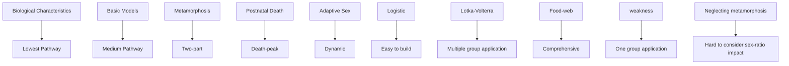
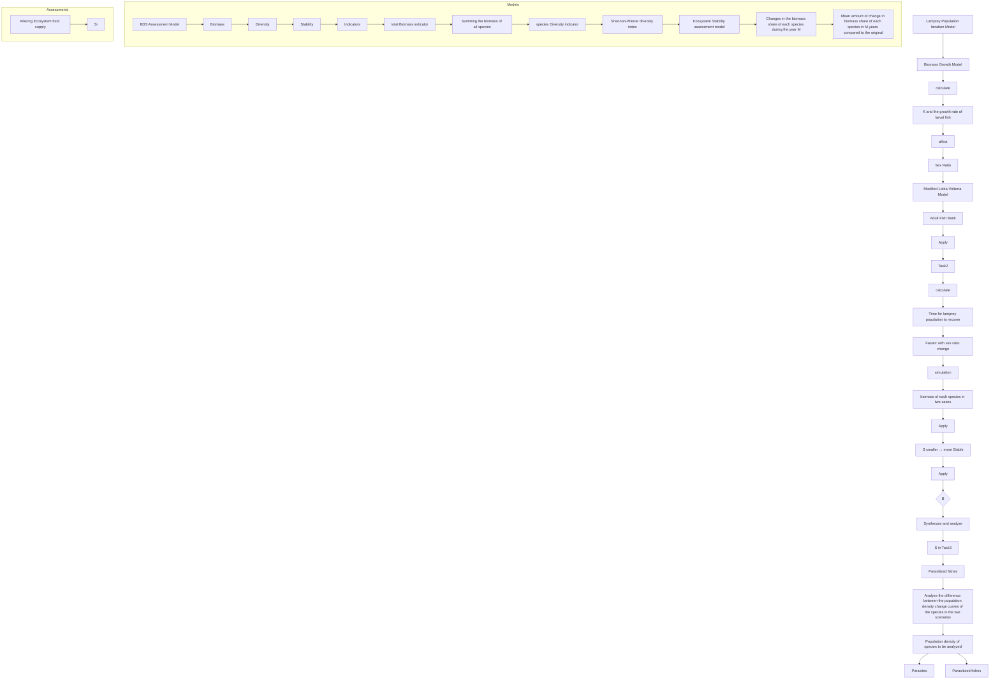
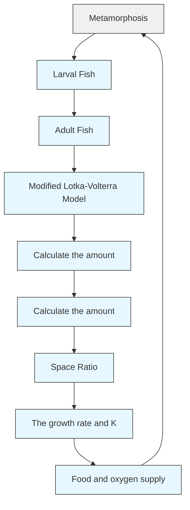
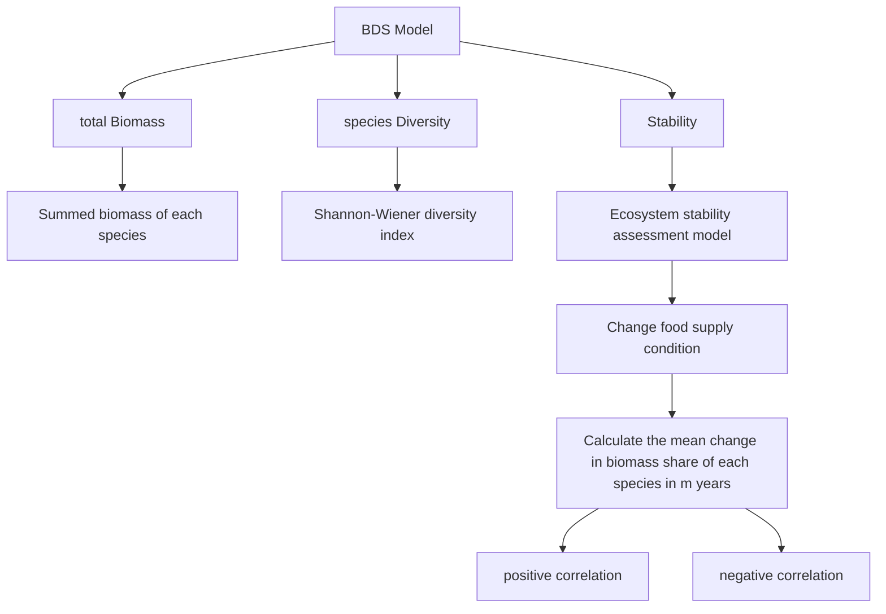

# Adaptive Sex of Lamprey: gift or curse?

## Summary

While having great food and research value, the lamprey has long been a cause for concern because it is an invasive species in some areas. Because of this complexity, it has long been in the spotlight. Is this a gift or a curse? To explore this phenomenon, we modeled the iterative process of lamprey populations and analyzed the effects of adaptive-sex on lamprey populations and the larger ecosystem.

Several models are established: Model I: Lamprey Population Iteration Model; Model II: BDS Assessment Model, etc.

Before all the models are established, based on the special characteristics of lamprey metamorphosis, we divided the lamprey population into two parts: larval and adult bank, so as to simulate the ecosystem with higher simulation. In addition, we collected data and set reasonable parameters through calculation.

For Model I, we established three sub-models to form the Lamprey Population Iteration Model. The sub-model i is based on Lotka-Volterra basic model, modified for the nature of the larval and adult bank, which describes the competition between lamprey and other species in the ecosystem. The sub-model ii is based on bioenergetic theory and establishes the relationship between resource availability and sex ratio. The submodel iii is based on the cost of reproduction, and establishes the relationship between sex ratio and fertility rate, which serves as a bridge between sub-models i and ii.

• For task 2, we simulated the iteration with and without adaptive sex lamprey population respectively, and adjusted the environmental parameters downward and upward at the two time points for comparative analysis, and the results show that adaptive sex enhances the resilience stability of the population and reduces the resistance stability of the population, for details, see 4.1.3.  
• For task 4, we added a reasonably set Correlation Matrix that covers the basic components of the ecosystem. From it, we selected parasites and parasitized fish for comparative analysis, and the results and conclusions are presented in 4.2.3.

For Model II, we established a complete ecological system assessment model covering Biomass, Diversity and Stability, in which Shannon-Wiener diversity index was introduced to measure the ecosystem’s The Shannon-Wiener diversity index is introduced to measure ecosystem diversity, and a new variance-based measure of Stability, S, is introduced. By substituting the results of Model I into Model II, we are able to compare and analyze the effects of adaptive sex on ecosystems in the three dimensions.

• For task 3, the results show that adaptive has a positive effect on ecosystem stability, and the optimization rate R reaches 73.3%.  
• For task 1, the results showed that adaptive sex promoted Biomass and diversity, but the optimization rate R reached 5.87% and 5.90%, respectively, compared with that of stability.

Finally, weconverted ratio k from adult to larval and the endowment growth rate $b _ { 0 }$ for sensitivity analysis. The results show the stability of our model is good. Finally, we discussed the strengths and weaknesses of the model and made a conclusion.

Key Words: lamprey, sex ratio, Lotka-Volterra, correlation matrix, stability

## Contents

## 1 Introduction 3

1.1 Problem Background 3  
1.2 Restatement of the Problem 3  
1.3 Literature Review 4  
1.4 Our Work . . 4

## 2 Model Preparation 5

2.1 Assumptions and Justifications 5  
2.2 Notations . . 6  
2.3 Data Collection and Visualization . . 6

## 3 Model Establishment 8

3.1 Model I: Lamprey Population Iteration Model 8  
3.1.1 Research on the life cycle of lampreys . . 8  
3.1.2 Larval versus adult fish banking . . 8  
3.1.3 Measurement of growth rate in larval 10  
3.1.4 Effects between growth rate, sex ratio and birth rate . . . . . . . . 11

3.2 Model II: BDS Assessment Model . . . 12  
3.2.1 Total Ecosystem Biomass 13  
3.2.2 Shannon-Wiener Diversity Index . . . 13  
3.2.3 Ecosystem Stability Assessment 13

## 4 Modeling Applications and Problem Solving 14

4.1 Simulation of the Lamprey Population Iteration Model 14  
4.1.1 Algorithm of the Model 14  
4.1.2 Model Parameter Settings . . 15  
4.1.3 Result of the Simulation 15

4.2 Simulation of Ecological System Assessment Model 17

4.2.1 Lamprey sex ratio and ecosystem stability . . 17

4.2.2 In-depth Assessment of Impacts on Ecosystem . . 18

4.2.3 Detailed Impacts on Other Species . . 20

## 5 Model Evaluation and Discussion 21

5.1 Sensitivity Analysis . . 21  
5.2 Strengths and Weaknesses . 22  
5.2.1 Strengths . . . . 22  
5.2.2 Weaknesses 22  
5.3 Conclusion . 23

## References 24

## 1 Introduction

## 1.1 Problem Background

In the world, the lamprey can be regarded as a "star creature" that has attracted much attention. On one hand, lamprey has long been a favorite food for humans in Europe and Southeast Asia, and even captured the hearts of medieval European aristocrats; on the other hand, as a major invasive species in the Great Lakes of North America, it has caused local authorities to struggle to curb its development. Whether you’re a fan or a opponent, there’s no denying that the lamprey is valuable to study because of its unique ecology and adaptive sex.

natural_image

Close-up of a silver fish swimming near green aquatic plants (no text or symbols visible)

Figure 1: Sea lamprey

The picture above shows the ecological appearance of lamprey. Lacking paired fins, adult lampreys have one nostril atop the head and seven gill pores on each side of the head.During the larval period (called ammocoetes),they burrow in silt, mud and detritus, taking up an existence as filter feeders, collecting detritus, algae, and microorganisms. The rate of water moving across the ammocoetes’ feeding apparatus is the lowest recorded in any suspension feeding animal, and they therefore require water rich in nutrients to fulfill their nutritional needs [1].As adults, they acquire nutrients by parasitizing other fish to reach sexual maturity. After spawning is over, all adults die.In addition to double life due to metamorphic development, it is also amazing in its ability to differentiate the sexes according to the environment,also known as adaptive sex ratio variation.

## 1.2 Restatement of the Problem

Under the above background,in order to explore the value of the ability for a species to alter its sex ratio depending on resource availability, our group will study the ecosystempopulation interactions and accomplish the following tasks:

(1) Study the impact on the larger ecological system when the population of lampreys can alter its sex ratio.  
(2) Study the advantages and disadvantages to the population of lampreys.  
(3) Study the impact on the stability of the ecosystem given the changes in the sex ratios of lampreys.

(4) Research whether an ecosystem with variable sex ratios in the lamprey population offer advantages to others in the ecosystem, such as parasites.

## 1.3 Literature Review

This issue focuses on the implications of the adaptive sex-ratio of lamprey. In recent years, research on population models for lamprey has focused on both the biological nature of lamprey and suitable basic models.

Biologically, Lamprey differs from the most commonly studied unicellular organisms and mammals in three biological properties: metamorphosis, postnatal-death and adaptive-sex. first, the development of Lamprey involves a metamorphosis process. lamprey’s larval are filter feeders, while adults are parasitic [2].Second, adults die after reproduction, which implies a cycle of peak mortality [3]. Finally, the sex ratio of adults is affected by the growth rate of larval, which is the focus of our study [4].

As for the basic models, the most commonly used models are logistic models, lotka-volterra-like models, and food-web models.It is worth noting that neither the lotka-volterra model with lagged effects and functional reactivity functions [5] nor the food-web model [6] based on energy flow can comprehensively take into account the lamprey’s three biological characteristics, which means we need to improve the basic models.

The advantages and disadvantages of the three basic models are shown below.

flowchart

Figure 2: Literature Review

## 1.4 Our Work

Our solution mindmap is shown below.

flowchart

Figure 3: Our work

## 2 Model Preparation

## 2.1 Assumptions and Justifications

• Assumption 1: The time for adult fish to migrate, lay eggs, die, and hatch into larval is negligible.

Justification: Our model calculates in years, so finer time scales will not be considered. The only time we primarily consider is the time it takes for a larval to grow into an adult, which will be counted directly as a yearling after spawning.

• Assumption 2: Sea lampreys die immediately after spawning.

Justification: Based on our review of the literature [7], lampreys die after spawning in a short time, so we neglect the time after them finish spawning.

• Assumption 3: Temperatures are suitable and consistent throughout the year in all areas of the water body.

Justification: Temperature plays a considerable role in larval survival, and discussion of lamprey reproduction is only meaningful if temperatures are appropriate. The assumption of consistent temperatures in all zones was made to simplify the model.

• Assumption 4: Suspended organic solid and dissolved oxygen concentration in the water column are not affected by lamprey and are consistent across regions.

Justification: Lamprey’s large range and the mobility of the water imply that the environmental resources of the watershed are replenishable. Neglecting anthro pogenic factors, we can assume that both are stable over large time scales. item Assumption 5: Ignoring major natural disasters and human impacts.

Justification: Since major natural disasters and human disturbances are difficult to predict, our model does not take them into account.

## 2.2 Notations

This chapter introduces the symbols and their descriptions mentioned in the article.

Table 1: Notations Table

<table><tr><td>Notations</td><td>Definition</td></tr><tr><td> $l_1(t)$ </td><td>Number of larval as a function of time</td></tr><tr><td> $l_2(t)$ </td><td>Number of adult lamprey as a function of time</td></tr><tr><td> $b_i(t)$ </td><td>The birth rate of the species i</td></tr><tr><td> $d_i(t)$ </td><td>The death rate of the species i</td></tr><tr><td> $M_i(t)$ </td><td>Biomass of larval individual i as a function of time</td></tr><tr><td> $μ_i(t)$ </td><td>Biomass growth rate of larval individual i as a function of time</td></tr><tr><td> $r_1$ </td><td>The birth rate of the species i</td></tr><tr><td> $r_1^0$ </td><td>The initial birth rate of the species i (without the impact of sex ratio)</td></tr><tr><td>x</td><td>Time required for larval to reach adulthood</td></tr><tr><td>B</td><td>Total ecosystem biomass</td></tr><tr><td>D</td><td>Shannon-Wiener index</td></tr><tr><td> $W_i$ </td><td>The average biomass of an individual of species i</td></tr><tr><td>C</td><td>The correlation matrix of species among the ecosystem</td></tr></table>

## 2.3 Data Collection and Visualization

This article relies on the following table of data sources.

Table 2: Data Source Websites

<table><tr><td>Database names</td><td>Database website</td></tr><tr><td>Royal Society</td><td>https://royalsocietypublishing.org/doi/full/10.1098/rspb.2017.0262#d1e751</td></tr><tr><td>EDG- ANSL</td><td>https://catalog.data.gov/dataset/aquatic-nuisance-species-locator1</td></tr><tr><td>GLENDA</td><td>https://catalog.data.gov/dataset/great-lakes-environmental-database-glenda</td></tr><tr><td>NARS-NLA2007</td><td>https://www.epa.gov/national-aquatic-resource-surveys/data-national-aquatic-resource-surveys</td></tr></table>

• From the Royal Society we obtained raw data on the sex of lamprey samples.  
• From EDG we obtained data on the distribution of lamprey in the Great Lakes region.  
• From GLENDA we obtained data on the suspended organic solid concentration of Great Lakes water bodies.  
• From NARS- NLA2007 we obtained dissolved oxygen concentration data for Great Lakes water bodies.

The following figure visualizes the distribution data of Great Lakes lamprey(2021).

geographic map with markers

| Region | Marker Color | Count |
| --- | --- | --- |
| Lake Superior | Dark Blue | 20 or more |
| St. Louis St. Louis State | Dark Blue | 20 or more |
| Wauva | Dark Blue | 20 or more |
| Sundbury | Dark Blue | 20 or more |
| North Bay | Dark Blue | 20 or more |
| Lake Huron | Dark Blue | 20 or more |
| Sound Ground | Dark Green | 2 to 5 |
| Barrie | Dark Green | 2 to 5 |
| Kingston | Dark Green | 2 to 5 |
| Detroit St. Windsor | Dark Blue | 6 to 10 |
| Hamilton | Dark Green | 6 to 10 |
| Buffalo | Dark Green | 6 to 10 |
| New York | Dark Blue | 11 to 19 |
| Montgomery Mountain State | Dark Blue | 11 to 19 |
| Adirondack Park | Dark Green | 11 to 19 |
| Trenton | Dark Blue | 11 to 19 |
| Boston | Dark Blue | 11 to 19 |
| Philadelphia | Dark Blue | 11 to 19 |
| Washington D.C. | Dark Green | 6 to 10 |
| Pittsburgh | Dark Green | 6 to 10 |
| New Jersey O'Connell | Dark Green | 6 to 10 |

Figure 4: Lamprey samples’ distribution in the Great Lakes region

It can be seen that lamprey are more heavily concentrated in the more nutrient-rich lake areas; in these areas their densities are approximately the same.

## 3 Model Establishment

## 3.1 Model I: Lamprey Population Iteration Model

## 3.1.1 Research on the life cycle of lampreys

Based on the relevant literature, we can understand that the life cycle of lampreys can be divided into approximately two stages. The first stage is the larval stage, where adult lampreys migrate from the sea to the river to spawn and hatch as ammocoetes. During the larval stage, these ammocoetes tend to reside in the substrate, with only a single mouth exposed to the surface. This submerged life helps them avoid predators and utilize the organic matter in the substrate. They are filter feeders, feeding primarily on microorganisms suspended in the water, organic particles and organic matter in the substrate. They obtain nutrients by filtering through most of the small gill slits near the mouth. The length of their larval growth period varies among lampreys, with the average length of the larval stage being about 4 to 6 years. After the end of the larval stage, the young fish will undergo a metamorphosis and grow into a new form that is completely different from the previous one. In the adult stage, the lamprey, as a parasitic fish, mainly feeds on the body fluids or blood of other fish, which is very different from the larval stage. Because of the different living environments, biomorphology, and ecological niches, we can divide the lamprey population into two parts, larval and adult, and model the population for each of the two parts. [8]

The model mindmap is shown below.

flowchart

Figure 5: Mindmap for model I

## 3.1.2 Larval versus adult fish banking

Based on the description just given, we innovatively divided the lamprey population into two parts, larval and adult, and each part was calculated separately for indicators such as its birth and death rates. The number of larval can be calculated as follows:

$$
l _ {1} (t) = \sum_ {i} l _ {1} ^ {i} (t) \tag {1}
$$

where $l _ { 1 } ^ { i } ( t )$ is the number of larval aged i year(s) as a function of time.

The number of adult fish is equal to:

$$
l _ {2} (t) = l _ {2} ^ {\text { male }} (t) + l _ {2} ^ {\text { female }} (t) \tag {2}
$$

where $l _ { 2 } ^ { m a l e } ( t )$ is the number of male adult fish and $l _ { 2 } ^ { f e m a l e } ( t )$ is the number of female adult fish.

Interestingly, when we divide the lamprey population into these two parts, we can no longer describe it using the simple Lotka-Volterra model, but have to make a simple modification to it.

The formula for the Lotka-Volterra model with multiple population interactions is as follows:

$$
\frac {d l _ {i}}{d t} = r _ {i} l _ {i} (1 + \sum_ {j = 1} ^ {n} a _ {i j} \frac {l _ {j}}{K _ {j}}) \tag {3}
$$

where $r _ { i }$ refers to the endowment growth rate of species i, $a _ { i j }$ refers to the intrinsic relationship between species i and species j, which is usually described by a correlation matrix, and $K _ { i }$ refers to species i’s environmental carrying capacity.

It is worth noting that in our model, larval and adult fish are interchangeable. larval grow into adults after metamorphosis, while adults die after mating and spawning, which can be viewed as converting into larval, and thus the two, the larval and adult pools, are in an interchangeable relationship. Therefore, we cannot directly decompose these two components into two species for calculation, because we cannot use the number of larval themselves to portray the birth rate of larval alone, nor can we use the number of adults to portray the birth rate of adults alone. Therefore, we split the equation of the Lotka-Volterra model into two parts, with the first half representing the birth rate of a species and the second half representing the mortality rate of a species.

$$
\frac {d l _ {i}}{d t} = b _ {i} + d _ {i} = r _ {i} l _ {i} + r _ {i} l _ {i} \sum_ {j = 1} ^ {n} a _ {i j} \frac {l _ {j}}{K _ {j}} \tag {4}
$$

where the first half of the equation represents the birth rate of the species, inscribed in terms of the endowment growth rate, while the second half represents the death rate of the species, described in terms of the interrelationships between the species.

In our model, we find that the relationship between the larval and adult pools is very special: while the birth rate of the adult pool should originate from the larval pool, the birth rate of the larval pool originates from the adult pool. However, the mortality rates of both are derived from themselves. Therefore, we need to modify the formula, i.e., the birth rate of the larval pool is calculated through the number of adult pools, and the birth rate of the adult pool needs to be calculated through the number of larval growing into adults. In order to simplify the model calculation, we portray the population in terms of years, and consider the growth rate of the population as the first-order difference of the population size, we can get the growth rate of the larval and adult pools respectively as follows:

$$
\frac {d l _ {1}}{d t} = l _ {1} (t + 1) - l _ {1} (t) = k l _ {2} (t) r _ {1} + r _ {1} ^ {0} l _ {1} (t) \sum_ {j = 1} ^ {n} a _ {1 j} \frac {l _ {j}}{K _ {j}} - \sum_ {i} s _ {i} + \sigma_ {1} (t) \tag {5}
$$

$$
\frac {d l _ {2}}{d t} = l _ {2} (t + 1) - l _ {2} (t) = \sum_ {i} s _ {i} + r _ {1} ^ {0} l _ {2} (t) \sum_ {j = 1} ^ {n} a _ {2 j} \frac {l _ {j}}{K _ {j}} - 2 r _ {1} l _ {2} (t) + \sigma_ {2} (t) \tag {6}
$$

where $\sum _ { i }$ s represents the number of larval converted to adults at all ages, and s should obey a binomial distribution, which will be given later. $\sigma _ { 1 }$ and $\sigma _ { 2 }$ represents a random perturbation.

## 3.1.3 Measurement of growth rate in larval

From the literature [2], we know that lamprey larval are filter feeders. Based on the basic bioenergetic growth model, we can get the biomass growth rate of an individual:

$$
\mu_ {i} (t) = \frac {d M _ {i} (t)}{d t} = a M _ {i} ^ {b} (t) \tag {7}
$$

where W is the individual biomass and a depends on food concentration (C), assimilation efficiency (AE) and metabolic cost $\left( \mathrm { R g } / \mathrm { G } \right)$ .b is related to the filtration rate of filter feeders and can be considered as a constant value 3/4 [9] for larval lamprey,a stationary filter-feeding population.

We wish to highlight the effect of resource availability on the growth rate of larval, so next we will simplify the reality of the situation by establishing a relationship between a and resource availability.

text_image

Larval-population density
Stream
Dissolved Oxygen (DO)
concentration (mg/L)
resource
Suspended organic solid
concentration (mg/L)
Riverbed

Figure 6: Biomass Growth Model for Larval

As shown in the figure, we equate the body of water to a rectangular body. larval exchange energy with the outside world through holes located on the surface of the riverbed. According to Assumption $^ { 4 , }$ the resource available to all larval within this water body is inversely proportional to the density of larval, i.e., the size of the population. We obtain the formula as follows:

$$
l _ {1} S | _ {\text { individual }} \text { Resource } | _ {\text { individual }} = S | _ {\text { area }} \text { Resource } | _ {\text { area }} \tag {8}
$$

The main food source for filter feeders is the suspended organic solid in the water, and the amount of dissolved oxygen affects the assimilation efficiency. Characterizing the concentration of both, the equation can be obtained as follows

$$
a = \gamma_ {1} \frac {O _ {s}}{l _ {1}} \arctan (\gamma_ {2} D _ {o}) \tag {9}
$$

where $\gamma _ { 1 }$ is the filtration rate factor and $\gamma _ { 2 }$ is the assimilation efficiency factor; $O _ { s }$ is the suspended organic solid concentration and $D _ { o }$ is the dissolved oxygen concentration; and the arctan function is an approximate fit of aerobic respiration efficiency to available oxygen. Combining $\mathrm { E q } ( 7 )$ , we obtained the differential biomass system of equations for lamprey larval:

$$
\left\{ \begin{array}{l} \frac {d M _ {i} (t)}{d t} = \gamma_ {1} \frac {O _ {s}}{l _ {1}} \arctan (\gamma_ {2} D _ {o}) M _ {i} ^ {\frac {3}{4}} (t) \\ M _ {i} (0) = M _ {0} \end{array} \right.
$$

where $M _ { 0 }$ is the fertilized egg biomass.Solving the above equation gives the relationship between individual larval biomass(M) and growth time(τ )

$$
M _ {i} (t) = M _ {0} + \int_ {0} ^ {\tau} \mu_ {i} (t) d \tau \tag {10}
$$

For metamorphic organisms, reaching a sufficient biomass is a critical point for qualitative change. Based on probability theory, it is approximated that the probability of a larval starting to metamorphose $( P | _ { g r o w n - u p } )$ follows a normal distribution:

$$
P | _ {\text { grown - up }} = \frac {1}{\sqrt {2 \pi} \sigma} e ^ {- \frac {(M - M _ {b}) ^ {2}}{2 \sigma^ {2}}} \tag {11}
$$

where $M _ { b }$ is the baseline biomass for metamorphosis. When a larval larval begins to metamorphose and develop, according to assumption 1 we consider that it transforms into an adult fish and note that at this time

$$
x = \tau | _ {\text { grown } - u p} \tag {12}
$$

Inverse mapping of $M _ { b }$

$$
M _ {b} \stackrel {M _ {i} ^ {- 1} (t)} {\longrightarrow} x _ {b} \tag {13}
$$

Obviously we were able to get

$$
x \sim N (x _ {b}, \sigma^ {2}) \tag {14}
$$

## 3.1.4 Effects between growth rate, sex ratio and birth rate

The sex ratio of lamprey larval is directly determined by their growth rate. [10] The probability of a larval transforming into an adult male(P ) can be calculated by the following formula:

$$
P = 1 - e ^ {\alpha + \beta x} \tag {15}
$$

Where $\alpha$ and $\beta$ are coefficients and x represents the year of growth of larval. $\beta < 0$ .

From the formula, we can see that when the year of growth of larval is longer, the probability of their transformation into males is higher, while when the year of growth of larval is shorter, the probability of their transformation into females is higher. This conclusion is consistent with the current state of the study, in which the more deprived the growing conditions, the slower the growth rate of larval and the longer the time required for growth, the higher the probability of becoming male. This characteristic may enable lamprey populations to adapt to the ecological environment faster, and when the ecosystem is damaged, lamprey populations can adjust the sex ratio to reduce the birth rate, so that the population can reach a new equilibrium point faster.

Next, we will describe the effect of sex ratio on the birth rate of the population through an equation. Although the lamprey population is monogamous [7], its optimal sex ratio is most likely not 1:1 as it autonomously adjusts its sex ratio when it encounters environmental changes [11]. According to the literature reviewed, fish tend to have more females spawning and females require more energy to spawn than males to sperm, with a very large number of egg cells not actually being fertilized. Thus when environmental capacity declines, fish may need more males to reduce the energy overhead and enhance egg fertilization, so the appropriate sex ratio is shifted in a male-biased direction. Conversely, when environmental accommodation rises, more energy is available to the fish, and they may tend to lay more eggs to increase the overall rate of population development more quickly. [12] Based on the above theory, we have fitted a relatively reasonable function to describe the relationship between sex ratio and birth rate in a population.

$$
r _ {1} = \frac {r _ {1} ^ {0}}{1 + \ln^ {2} \frac {l _ {2} ^ {\text { female }} (l _ {1} + l _ {2})}{l _ {2} ^ {\text { male }} (K _ {1} + K _ {2})}} \tag {16}
$$

## 3.2 Model II: BDS Assessment Model

In order to determine how the ecosystem is affected by the change of the sex ratio of the seven-gill eel, we established a BDS Evaluation Model using the total ecosystem biomass, ecosystem species diversity, and ecosystem stability as the evaluation criteria. The idea of modeling is shown below:

flowchart

Figure 7: Mindmap for BDS Assessment Model

## 3.2.1 Total Ecosystem Biomass

Total ecosystem biomass is one of the most important indicators of ecosystems, which can reflect the development of biomes in ecosystems. Suppose there are n species in the ecosystem, where the population density of the ith species is $l _ { i }$ and the biomass of that species is $s _ { i }$ The formula for calculating total ecosystem biomass B is as follows:

$$
B = \sum_ {i = 1} ^ {n} s _ {i} = \sum_ {i = 1} ^ {n} l _ {i} W _ {i} \tag {17}
$$

## 3.2.2 Shannon-Wiener Diversity Index

Evaluating species diversity is an indispensable step in assessing ecosystem condition. Generally speaking, the higher the species richness, the more balanced the biomass among species, and the better the ecosystem condition.

Therefore, we apply the Shannon-Wiener diversity index to consider the species richness and evenness, which is derived from the "entropy" in physics, the higher the species diversity, the greater the degree of disorder, and the higher the value of "entropy", the greater the index will be. [13] The higher the value of "entropy", the larger the index will be, and the Shannon-Wiener index D is defined as:

$$
D = - \sum_ {i = 1} ^ {n} p _ {i} \ln p _ {i} \tag {18}
$$

where $\begin{array} { r } { p _ { i } = \frac { s _ { i } } { B } } \end{array}$ , representing the proportion of the biomass of species i in ecosystem.

## 3.2.3 Ecosystem Stability Assessment

Stability is one of the necessary conditions for maintaining the normal functioning of an ecosystem. When the external environment changes, the internal biomass distribution within the ecosystem will also undergo changes through the interactions and regulations among species. In this case, ecosystems with more species and complex food webs can adjust their structure and function more quickly, and the resulting changes in biomass distribution tend to be relatively stable. Therefore, in this model, we evaluate the stability of an ecosystem by analyzing the changes in the proportion of biomass for each species in response to external environmental changes.

Based on the Lamprey Population Iteration Model mentioned earlier, we simulate changes in the external environment by altering the food supply in the ecosystem. When the food remains constant and the population sizes of various species reach a stable point, we change the food supply condition and record the changes in the biomass proportions of each species in subsequent years. The calculation for the stability index is as follows:

$$
S = \frac {1}{n} \sum_ {i = 1} ^ {n} \sum_ {j = 1} ^ {m} \frac {(p _ {i} - p _ {i j}) ^ {2}}{m} \tag {19}
$$

Here, S represents the stability index after adjusting the food supply to the corresponding value, and $p _ { i j }$ is the proportion of biomass for species i after j years of change.

The smaller the value of S, the smaller the relative change in biomass proportions of various species after adjusting the food supply for n years, indicating a stronger stability of the ecosystem.

## 4 Modeling Applications and Problem Solving

## 4.1 Simulation of the Lamprey Population Iteration Model

## 4.1.1 Algorithm of the Model

Our model performs calculations in a differential form, with the results of each calculation derived from the previous one, to simulate iterations of the lamprey population based on the input parameters and to investigate whether it is able to maintain stability over time.

Algorithm 1 Lamprey Population Iteration Simulation  
The maximum iterations, G
Initial amount of larval fish $l_{1}$ Initial amount of adult male fish $l_{2}^{male}$ Initial amount of adult female fish $l_{2}^{female}$ Output:
Larval fish amount in G year(s) $l_{1}$ Adult fish amount in G year(s) $l_{2}$ Total amount in G year(s) l
Gender ratio in G year(s) gk

1: for $i \leftarrow 1 : G$ do
2: Calculate the decrease amount of $l_{2}^{male}$ 3: Calculate the decrease amount of $l_{2}^{female}$ 4: $b \leftarrow \frac{b_{0}}{(1 + \ln^{2} \frac{l_{2}^{female}(l_{1} + l_{2})}{l_{2}^{male} K})}$ 5: mate $\leftarrow \text{round}((l_{2}^{male} + l_{2}^{female})b + \text{rand}))$ 6: $l_{2}^{male} = l_{2}^{male} - mate$ 7: $l_{2}^{female} = l_{2}^{female} - mate$ 8: for $j \leftarrow 1 : 100$ do
9: Calculate the decrease amount of $l_{1}^{j}$ 10: Calculate the amount of fish that grows into adulthood change
11: $p \leftarrow 1 - pow2(\alpha + \beta j)$ 12: male $\leftarrow \text{round(change * p + rand())}$ 13: $l_{2}^{male} = l_{2}^{male} + male$ 14: $l_{2}^{female} = l_{2}^{female} + change - male$ 15: end for
16: for $j \leftarrow 99 : -1 : 1$ do
17: $l_{1}^{j+1} = l_{1}^{j}$ 18: end for
19: $l_{1}(i) \leftarrow sum(l_{1})$ 20: $l_{2}(i) \leftarrow l_{2}^{male} + l_{2}^{female}$ 21: $l(i) \leftarrow l_{1}(i) + l_{2}(i)$ 22: $gk(i) \leftarrow \frac{l_{2}^{male}}{l_{2}(i)}$ 23: end for

## 4.1.2 Model Parameter Settings

First, all the formulas in the model will be shown below:

$$
\left\{ \begin{array}{l} \frac {d l _ {1}}{d t} = k l _ {2} (t) r _ {1} + r _ {1} ^ {0} l _ {1} (t) \sum_ {j = 1} ^ {n} a _ {1 j} \frac {l _ {j}}{K _ {j}} - \sum_ {i} s _ {i} + \sigma_ {1} (t) \\ \frac {d l _ {2}}{d t} = \sum_ {i} s _ {i} + r _ {1} ^ {0} l _ {2} (t) \sum_ {j = 1} ^ {n} a _ {2 j} \frac {l _ {j}}{K _ {j}} - 2 r _ {1} l _ {2} (t) + \sigma_ {2} (t) \\ r _ {1} = \frac {r _ {1} ^ {0}}{1 + \ln^ {2} \frac {l _ {2} ^ {\text { female }} (l _ {1} + l _ {2})}{l _ {2} ^ {\text { male }} (K _ {1} + K _ {2})}} \\ P = 1 - e ^ {\alpha + \beta x} \\ x \sim N (x _ {b}, \sigma^ {2}) \end{array} \right. \tag {20}
$$

Using Great Lakes’ data as a reference,we set some of the parameters in the model to appropriate values and adjusted them to see how the model performs with different parameters. Eventually, we determined the model parameters to the following values and used the model to solve the results.

It is worth noting that our model is highly adaptive and does not apply only to the Great Lakes region. When the model is migrated to other regions, local data are needed to support it.

Table 3: Parameter Settings

<table><tr><td>Parameter</td><td>Value</td><td>Parameter</td><td>Value</td></tr><tr><td> $k$ </td><td>5</td><td> $\alpha$ </td><td>0</td></tr><tr><td> $r_{1}^{0}$ </td><td>0.05</td><td> $\beta$ </td><td> $-\frac{\ln 2}{5}$ </td></tr><tr><td> $\sigma^{2}$ </td><td>2</td><td> $K_{2}$ </td><td>10000</td></tr><tr><td> $O_{s}$ </td><td>45</td><td> $D_{o}$ </td><td>8</td></tr><tr><td> $\gamma_{1}$ </td><td>168.05</td><td> $\gamma_{2}$ </td><td>1.50</td></tr></table>

## 4.1.3 Result of the Simulation

We input $G \ : = \ : 5 0 0 , \ : l _ { 1 } \ : = \ : 6 0 0 0$ (1,000 lampreys each from one to six years old), $l _ { 2 } ^ { m a l e } = 5 0 0 0 , l _ { 2 } ^ { f e m a l e } = 5 0 0 0$ .

In order to obtain the advantages and disadvantages of the sex ratio adjustment mechanism for the lamprey population, We adjust $O _ { s }$ downward to 50% of the original value(22.5) and the environmental capacity $K _ { 2 }$ to same 50% of the original value (5,000) at the 100th year, and then adjusted $O _ { s } , K _ { 2 }$ to the initial value at the 300th year to observe the population evolution. At the same time, we set up a control group, canceled the sex ratio adjustment mechanism, i.e., the probability of larval transforming into females and males at any time was the same, and other parameters remained unchanged, simulated the population evolution, and observed the pattern of the evolution of the two populations against each other. The simulation results are shown below.

In order to see the differences between the experimental and control groups more clearly, we plotted the population size of the experimental and control lamprey populations in a single graph and extended G to 1000, with the rest of the conditions unchanged, and the results are shown below.

line chart

| Time (/year) | Adult Fish (×10⁴) | Larval Fish (×10⁴) | Total (×10⁴) | Sex Ratio (M/(F+M)) |
| ------------ | ----------------- | ------------------ | ------------ | ------------------- |
| 0            | ~1.0              | ~1.5               | ~3.0         | ~0.6                |
| 50           | ~1.0              | ~1.5               | ~3.0         | ~0.6                |
| 100          | ~1.0              | ~1.5               | ~3.0         | ~0.6                |
| 150          | ~1.0              | ~1.5               | ~3.0         | ~0.6                |
| 200          | ~1.0              | ~1.5               | ~3.0         | ~0.6                |
| 250          | ~1.0              | ~1.5               | ~3.0         | ~0.6                |
| 300          | ~1.0              | ~1.5               | ~3.0         | ~0.6                |

Figure 8: Lamprey Population Iteration Model (With Operational Sex Ratio)

line chart

| Time (/year) | Adult Fish | Larval Fish | Total | Sex Ratio (M/(F+M)) |
| ------------ | ---------- | ----------- | ----- | ------------------- |
| 0            | 10000      | 5000        | 20000 | 0.4                 |
| 50           | 11000      | 6000        | 22000 | 0.4                 |
| 100          | 12000      | 7000        | 24000 | 0.4                 |
| 150          | 13000      | 8000        | 26000 | 0.4                 |
| 200          | 14000      | 9000        | 28000 | 0.4                 |
| 250          | 15000      | 10000       | 30000 | 0.4                 |
| 300          | 16000      | 11000       | 32000 | 0.4                 |

Figure 9: Lamprey Population Iteration Model (Without Operational Sex Ratio)

line chart

| Time (/year) | With Operational Sex Ratio | Without Operational Sex Ratio |
| ------------ | -------------------------- | ----------------------------- |
| 100          | ~14000                     | ~13500                        |
| 200          | ~6500                      | ~6500                         |
| 300          | ~6500                      | ~6500                         |
| 400          | ~14000                     | ~11000                        |
| 500          | ~13500                     | ~12500                        |
| 600          | ~13500                     | ~12500                        |
| 700          | ~13500                     | ~12500                        |
| 800          | ~13500                     | ~12500                        |
| 900          | ~13500                     | ~12500                        |
| 1000         | ~13500                     | ~12500                        |

Figure 10: Population size of the Experimental and Control Group

We can see from the figure that:

• In the 100th year, there is a sudden change in the environment and the environmental capacity drops to half of its original size, and in the following period of time both populations decline, but the one with the sex-ratio regulation mechanism declines faster and is able to reach a new equilibrium in a shorter period of time.  
• In the 300th year, the environment changed for the better and the environmental holding capacity returned to its initial state. After that, both populations rose, but it was clear that the sex-ratio-regulated population rose much faster and was slightly more numerous than the other group after recovery.

To quantify the advantages, we define an optimization rate formula:

$$
R = \frac {k _ {\text { before }}}{k _ {\text { after }}} - 1 \tag {21}
$$

where $k _ { b e f o r e }$ represents the metrics before optimization and $k _ { a f t e r }$ represents the metrics after optimization. $k _ { b e f o r e } \geq k _ { a f t e r }$ . From the experimental data we can get that the optimization rate $R { = } 2 0 2 \%$ when K decreases and $\mathrm { R } { = } 2 8 8 \%$ when K restores. The optimization effect is quite good.

Through this model, we can give an answer to the question 2.

• The sex-ratio regulation mechanism of lamprey populations enables the entire population to better adapt to new environments, and the population is more resilient and able to quickly adapt to complex and changing environments.This is also likely what led to the lamprey population’s emergence as an invasive species in the vicinity of the Great Lakes. [14]  
• However, this mechanism has some negative consequences in that the population’s resistance to harsh environments may be reduced. When the environment is very poor, lamprey populations may be endangered for a time.

## 4.2 Simulation of Ecological System Assessment Model

## 4.2.1 Lamprey sex ratio and ecosystem stability

As we noted above, lamprey larvae grow at different rates under different food conditions, and the growth rate of larvae determines their probability of differentiating into males or females. Therefore, the effects of ecosystem changes on lamprey are different from those on other populations. Here, we still discuss larval and adults separately, and use the Ecosystem stability assessment model developed above to analyze the relationship between changes in sex ratio and ecosystem stability.

First, we simplified it after carefully examining the biotope relationships of the ecosystem in which lamprey are found. Four base species were added. The relationship between the four species and adult larval is shown below:

• $c _ { 1 }$ larval lamprey  
• $c _ { 2 }$ Adult lamprey  
• $c _ { 3 }$ Predator of adult lamprey (Species 1)  
• $c _ { 4 }$ Competitor of adult lamprey (Species 2)  
• $c _ { 5 }$ Fish-1 parasitized by adults and capturing larvae (Species 3)  
• $c _ { 6 }$ Fish-2 parasitized by adults and capturing larvae (Species 4)

After this, we introduced a correlation matrix to describe the interrelationships between species in the ecosystem, which is expressed as follows:

$$
C = \left[ \begin{array}{c c c c c} - 1 & a _ {1 2} & a _ {1 3} & \dots & a _ {1 n} \\ a _ {2 1} & - 1 & a _ {2 3} & \dots & a _ {2 n} \\ a _ {3 1} & a _ {3 2} & - 1 & \dots & a _ {3 n} \\ \vdots & \vdots & \vdots & \ddots & \vdots \\ a _ {n 1} & a _ {n 2} & a _ {n 3} & \dots & - 1 \end{array} \right] \tag {22}
$$

where $a _ { i j }$ represents the coefficient of influence of $c _ { j }$ on $c _ { i } \ ( i \neq j )$ , with an influence coefficient between -1 and 1. When $a _ { i j } = 0 .$ , there is no direct impact between the two species. Conversely, a positive impact coefficient represents a favorable impact of $c _ { j }$ on $c _ { i }$ survival, and a negative impact coefficient represents a negative impact of $c _ { j }$ on $c _ { i }$ survival. A larger $| a _ { i j } |$ represents a larger effect.

With the known interrelationships between the species, based on the Lamprey Population Iteration Model, we were able to calculate the population densities $x _ { 3 } , x _ { 4 } , x _ { 5 } ,$ , $x _ { 6 }$ for $c _ { 3 } , c _ { 4 } , c _ { 5 } , c _ { 6 }$ . The calculation formula is shown in Eq.3.

The biomass of each population is obtained by multiplying the population density of that ecosystem species by the average weight of individuals in each population.

Next, based on the relevant data we have collected, we give the weight matrix $W = [ 0 . 6 9 , 3 . 7 , 4 0 . 3 , 1 . 2 , 1 5 . 8 , 1 4 . 0 ] .$ , and the value of C is shown in the heatmap below.

heatmap

Correlation Matrix between Species
| | Larval | Adult | Species 1 | Species 2 | Species 3 | Species 4 |
|---|---|---|---|---|---|---|
| Larval | -1 | 0 | 0 | 0 | -0.21 | -0.16 |
| Adult | 0 | -1 | -0.4 | -0.2 | 0.3 | 0.35 |
| Species 1 | 0 | 0.3 | -1 | 0 | 0 | 0 |
| Species 2 | 0 | -0.2 | 0 | -1 | 0.15 | 0.11 |
| Species 3 | 0.12 | -0.16 | 0 | -0.17 | -1 | -0.18 |
| Species 4 | 0.09 | -0.2 | 0 | -0.14 | -0.24 | -1 |

Figure 11: Correlation matrix C

Simulations were carried out under two scenarios, one with a change in the sex ratio of lampreys and one without, and when the population biomass in both scenarios stabilized, the food supply of the ecosystem was changed so that the environmental capacity decreased, and then the food supply of the ecosystem was changed to the initial food supply after the population biomass in both scenarios had stabilized again. From this, we were able to draw a graph of the changes in the biomass of the various populations in the ecosystem under different scenarios:

Substituting the results into the Ecosystem Stability Assessment Model and taking $m = 1 0 0 ,$ , we get Indicators of ecosystem stability $S _ { 1 } \overset { \cdot } { = } 3 . 7 1 7 5 \cdot 1 0 ^ { - 4 }$ for lamprey with change in sex ratio; Indicators of ecosystem stability $S _ { 2 } = 6 . 4 4 1 4 \cdot 1 0 ^ { - 4 }$ for lamprey without change in sex ratio in 100 years after the first modification of K from 100th to 200th year. Since $S _ { 1 }$ is smaller than $S _ { 2 }$ , we can get the conclusion of question 3, when there is a change in the sex ratio of lamprey, the ecosystem can adjust its own structure and function more quickly and the biomass distribution is more stable, i.e., the ecosystem stability is better. The optimization rate of ecosystem stability by the sex ratio adjustment mechanism was calculated to be R = 73.3%.

## 4.2.2 In-depth Assessment of Impacts on Ecosystem

In order to obtain more aspects of the effects of sex ratio regulation mechanisms on ecosystems, we calculated the total biomass and Shannon-Wiener Index for each year of the model in the previous section as a way to obtain optimization rates of B and

line chart

| Time (/year) | Larval Biomass (×10⁵ kg) | Adult Biomass (×10⁵ kg) | Species 1 Biomass (×10⁵ kg) | Species 2 Biomass (×10⁵ kg) | Species 3 Biomass (×10⁵ kg) | Species 4 Biomass (×10⁵ kg) | Sex Ratio (M/(M+F)) |
| ------------ | ------------------------- | ------------------------ | ---------------------------- | ---------------------------- | --------------------------- | --------------------------- | --------------------- |
| 0            | ~0.5                      | ~0.5                     | ~0.5                         | ~0.5                         | ~2.0                        | ~1.5                        | ~0.6                  |
| 100          | ~0.3                      | ~0.3                     | ~0.3                         | ~0.3                         | ~1.8                        | ~1.2                        | ~0.5                  |
| 200          | ~0.2                      | ~0.2                     | ~0.2                         | ~0.2                         | ~0.9                        | ~0.6                        | ~0.4                  |
| 300          | ~0.2                      | ~0.2                     | ~0.2                         | ~0.2                         | ~1.2                        | ~0.7                        | ~0.4                  |
| 400          | ~0.3                      | ~0.3                     | ~0.3                         | ~0.3                         | ~1.8                        | ~1.2                        | ~0.5                  |
| 500          | ~0.3                      | ~0.3                     | ~0.3                         | ~0.3                         | ~1.8                        | ~1.3                        | ~0.5                  |
| 600          | ~0.3                      | ~0.3                     | ~0.3                         | ~0.3                         | ~1.8                        | ~1.3                        | ~0.5                  |

Figure 12: Multiple Population Evolutionary Model (With Operational Sex Ratio)

line chart

| Time (/year) | Larval Biomass (×10⁵ kg) | Adult Biomass (×10⁵ kg) | Species 1 Biomass (×10⁵ kg) | Species 2 Biomass (×10⁵ kg) | Species 3 Biomass (×10⁵ kg) | Species 4 Biomass (×10⁵ kg) | Sex Ratio (M/(M+F)) |
| ------------ | ------------------------- | ------------------------ | ---------------------------- | ---------------------------- | --------------------------- | --------------------------- | --------------------- |
| 0            | ~0.3                      | ~0.4                     | ~0.2                         | ~0.1                         | ~2.0                        | ~1.5                        | ~0.5                  |
| 100          | ~0.2                      | ~0.3                     | ~0.2                         | ~0.1                         | ~1.8                        | ~1.3                        | ~0.5                  |
| 200          | ~0.1                      | ~0.2                     | ~0.2                         | ~0.1                         | ~0.9                        | ~0.7                        | ~0.5                  |
| 300          | ~0.1                      | ~0.2                     | ~0.2                         | ~0.1                         | ~0.8                        | ~0.6                        | ~0.5                  |
| 400          | ~0.2                      | ~0.3                     | ~0.2                         | ~0.1                         | ~1.7                        | ~1.2                        | ~0.5                  |
| 500          | ~0.2                      | ~0.3                     | ~0.2                         | ~0.1                         | ~1.8                        | ~1.3                        | ~0.5                  |
| 600          | ~0.2                      | ~0.3                     | ~0.2                         | ~0.1                         | ~1.9                        | ~1.3                        | ~0.5                  |

Figure 13: Multiple Population Evolutionary Model (Without Operational Sex Ratio)

pie chart

Multiple Population Evolutionary Model
| Category | Percentage (%) |
|---|---|
| Larval | 10 |
| Adult | 13 |
| Species 1 | 8 |
| Species 2 | 2 |
| Species 3 | 40 |
| Species 4 | 28 |

pie chart

Multiple Population Evolutionary Model
| Category | Percentage (%) |
| :--- | :--- |
| Larval | 6 |
| Adult | 12 |
| Species 1 | 8 |
| Species 2 | 2 |
| Species 3 | 41 |
| Species 4 | 32 |

Figure 14: Biomass Proportion in 600-th year Figure 15: Biomass Proportion in 600-th year (With Operational Sex Ratio) (Without Operational Sex Ratio)

D for an ecosystem. Keeping the model parameters constant, the effects of lamprey populations on the ecosystem were simulated with and without the sex ratio regulation mechanism. The results are shown below.

line chart

| Time (/year) | Biomass (×10⁵ kg) - B (With Operational Sex Ratio) | Biomass (×10⁵ kg) - B (Without Operational Sex Ratio) | Biomass (×10⁵ kg) - D (With Operational Sex Ratio) | Biomass (×10⁵ kg) - D (Without Operational Sex Ratio) | Shannon-Wiener Diversity Index |
| ------------ | -------------------------------------------------- | ---------------------------------------------------- | --------------------------------------------------- | ---------------------------------------------------- | ------------------------------ |
| 0            | ~4.5                                               | ~4.2                                                 | ~3.9                                                | ~3.8                                               | ~1.4                           |
| 100          | ~4.0                                               | ~3.5                                                 | ~3.9                                                | ~3.9                                               | ~1.4                           |
| 200          | ~2.1                                               | ~2.1                                                 | ~3.9                                                | ~3.9                                               | ~1.4                           |
| 300          | ~2.0                                               | ~2.0                                                 | ~3.9                                                | ~3.9                                               | ~1.4                           |
| 400          | ~4.2                                               | ~4.0                                                 | ~3.9                                                | ~3.9                                               | ~1.6                           |
| 500          | ~4.3                                               | ~4.1                                                 | ~3.9                                                | ~3.9                                               | ~1.6                           |
| 600          | ~4.2                                               | ~4.0                                                 | ~3.9                                                | ~3.9                                               | ~1.6                           |

Figure 16: Biomass and Shannon-Wiener Index in Multiple Population Evolutionary Model

Since we need to study the effect of the sex ratio regulation mechanism when the environmental holding capacity of the ecosystem is changed, in order to amplify the effect, we chose the 300th to the 400th year for analysis. The mean value of ecosystem biomass and the mean value of Shannon-Wiener Index are calculated for this period of time, and by comparison we can find that the biomass of ecosystems with sexregulation mechanisms is 3.7117 105, and the Shannon-Wiener Index is 1.4588; while the two indexes of ecosystems without sex-regulation mechanisms are 3.5059  105, and 1.3775, respectively.

At this point, we can answer question 1.

• After calculation, the optimization rate of ecosystem biomass for the sex ratio regulation mechanism was $\mathrm { R } = 5 . 8 7 \%$ and the optimization rate of Shannon-Wiener Index was $\mathrm { R } = 5 . 9 0 \%$ . The optimization rate is not significant.  
• From the figure, we can see that the ecosystems with sex ratio regulation mechanism have a slightly shorter time to re-establish equilibrium when the environmental holding capacity is changed.  
• This may be due to the fact that the effect of sex ratio on the lamprey population is partially masked by its overall optimization effect when it is scaled up to the ecosystem due to the interactions of a very large number of other species. Combining the result in question 3, however, it can still serve to accelerate ecosystem regulation.

## 4.2.3 Detailed Impacts on Other Species

In the previous chapter, we explored the macroscopic effects of the sex ratio regulation mechanism on the ecosystem as a whole, and this chapter will focus on analyzing the effects of this mechanism on different species in the ecosystem. We analyzed the effects of this mechanism on fish parasites and lamprey parasitic species of the same status as lampreys. Keeping other parameters constant, the ecosystem was simulated and the changes in population density of the above species with and without the sex ratio regulation mechanism were plotted.

line chart

| Time (/year) | Species 2 | Species 2 |
| ------------ | --------- | --------- |
| 0            | 4200      | 4200      |
| 100          | 3500      | 3500      |
| 200          | 2000      | 2000      |
| 300          | 2000      | 2000      |
| 400          | 3800      | 5000      |
| 500          | 3900      | 5100      |
| 600          | 3900      | 5100      |

Figure 17: Species 2 Populations

line chart

| Time (/year) | Species 3 | Species 4 | Species 3 (Without Operational Sex Ratio) | Species 4 (With Operational Sex Ratio) |
| ------------ | --------- | --------- | ---------------------------------------- | ------------------------------------- |
| 0            | ~10000    | ~4000     | ~10000                                   | ~4000                                 |
| 100          | ~5000     | ~2000     | ~5000                                    | ~2000                                 |
| 200          | ~5000     | ~2000     | ~5000                                    | ~2000                                 |
| 300          | ~5000     | ~2000     | ~5000                                    | ~2000                                 |
| 400          | ~11000    | ~4000     | ~11000                                   | ~4000                                 |
| 500          | ~11000    | ~4000     | ~11000                                   | ~4000                                 |
| 600          | ~11000    | ~4000     | ~11000                                   | ~4000                                 |

Figure 18: Species 3 and 4 Populations

First we analyze the changes in parasites (Species 2). Because the sex ratio mechanism can increase the resilience of lamprey populations, when the ecosystem environment improves, lamprey populations will reach a new equilibrium point faster and take over the resources of other organisms, resulting in the suppression of parasites competing with them. As a result, Species 2 will recover and equilibrate with slightly fewer species than an ecosystem without sex ratio regulation.

The effects on lamprey hosts were analyzed next. We set Species 3 to be more competitive relative to Species $^ { 4 , }$ so Species 3 would be more affected by lampreys. After the experiment, we found that due to the sex ratio regulation mechanism of lampreys, the population density of Species 3 became smaller, while the population density of Species 4 increased instead, suggesting that this mechanism prompted the reproduction of the lamprey population, which caused Species 3 to be suppressed more, and thus brought more room for Species 4 to survive.

At this point, we can answer question 4.

• The sex ratio regulation mechanism of the lamprey population affects changes in its own population density while also affecting other organisms in the ecosystem.  
• For the lamprey’s competitors (other fish parasites), it will make the survival of these competitors are suppressed, so it is not conducive to the survival of these competitors.  
• For the lamprey parasitic hosts, it will be a better balance of the whole ecosystem of the size of the population density, which is conducive to the coordination and alleviation of the competitive relationship between the different species.

## 5 Model Evaluation and Discussion

## 5.1 Sensitivity Analysis

In this article, we have developed two models: the Lamprey Population Iteration Model and the Ecological System Assessment Model, and we focus on the former in our sensitivity analysis. In our model, there are many parameters that need to be given by human, and most of them have been simulated to obtain appropriate values. However, there are still some parameters that may vary in real situations. For example, the conversion ratio k from adult to larval and the endowment growth rate $b _ { 0 }$ may fluctuate within a small range by environmental factors, so we change k and $b _ { 0 }$ respectively, and other parameters remain unchanged, and re-simulate the lamprey population model in 5.1, and observe the results of the model calculations.

line chart

| Time (/year) | k = 4.5 Population (/amount) | k = 5 Population (/amount) | k = 5.5 Population (/amount) | k = 4.5 Sex Ratio (M/(M+F)) | k = 5.5 Sex Ratio (M/(M+F)) |
| ------------ | ----------------------------- | --------------------------- | ----------------------------- | ---------------------------- | ---------------------------- |
| 0            | ~20000                        | ~20000                      | ~20000                        | ~0.8                         | ~0.8                         |
| 100          | ~18000                        | ~25000                      | ~24000                        | ~0.6                         | ~0.6                         |
| 200          | ~12000                        | ~18000                      | ~19000                        | ~0.4                         | ~0.4                         |
| 300          | ~11000                        | ~17000                      | ~18000                        | ~0.3                         | ~0.3                         |
| 400          | ~22000                        | ~26000                      | ~25000                        | ~0.7                         | ~0.7                         |
| 500          | ~21000                        | ~25000                      | ~24000                        | ~0.6                         | ~0.6                         |

Figure 19: Influence of different values of k

line chart

| Time (/year) | Population (/amount) b₀ = 0.04 | Population (/amount) b₀ = 0.05 | Population (/amount) b₀ = 0.06 | Sex Ratio (M/(M+F)) b₀ = 0.04 | Sex Ratio (M/(M+F)) b₀ = 0.05 | Sex Ratio (M/(M+F)) b₀ = 0.06 |
| ------------ | ------------------------------ | ------------------------------ | ------------------------------ | ------------------------------- | ------------------------------- | ------------------------------- |
| 0            | ~2.0×10⁴                       | ~2.0×10⁴                       | ~2.0×10⁴                       | ~0.8                            | ~0.8                            | ~0.8                            |
| 100          | ~2.8×10⁴                       | ~2.5×10⁴                       | ~2.3×10⁴                       | ~0.6                            | ~0.6                            | ~0.6                            |
| 200          | ~1.4×10⁴                       | ~1.3×10⁴                       | ~1.2×10⁴                       | ~0.4                            | ~0.4                            | ~0.4                            |
| 300          | ~1.3×10⁴                       | ~1.2×10⁴                       | ~1.1×10⁴                       | ~0.3                            | ~0.3                            | ~0.3                            |
| 400          | ~2.9×10⁴                       | ~2.7×10⁴                       | ~2.5×10⁴                       | ~0.7                            | ~0.7                            | ~0.7                            |
| 500          | ~2.8×10⁴                       | ~2.6×10⁴                       | ~2.4×10⁴                       | ~0.7                            | ~0.7                            | ~0.7                            |

Figure 20: Influence of different values of $b _ { 0 }$

First, we set the value of k to 4.5, 5 and 5.5 to simulate the slight fluctuation of spawning rate and survival rate in the population; then we adjusted $b _ { 0 }$ to 0.04, 0.05 and 0.06 to simulate the fluctuation of endowment growth rate in the population, and observed the changes in the number of lampreys in the population and the proportion of the sexes. The results showed that when k and $b _ { 0 }$ fluctuated within a certain range, the population size and sex ratio did not change greatly, and the trend was basically consistent, indicating that the stability of the model was good.

In fact, we also did a sensitivity analysis of the effects of k and $b _ { 0 }$ on indicators such as total biomass under the multiple population model. However, due to the complexity of the interactions between different species in the multiple population model, the indicators of lamprey population do not significantly affect the total biomass of the whole ecosystem in the case of a small fluctuation, therefore, to save space, the sensitivity analysis graphs of the multiple population model were not listed. Overall, the model is stable enough to be applied in real-world scenarios.

## 5.2 Strengths and Weaknesses

## 5.2.1 Strengths

• The growth habit of lampreys was considered. We have reviewed many related literatures to fully understand the development and metamorphosis process of lamprey in depth. The body size, living environment and food source of lamprey larval and adults are very different, so our model divides lampreys into larval and adult pools, which makes the model more relevant to the current situation.

• The life cycle of lampreys was taken into account. Adult lampreys will die directly after spawning, which is different from the common Lotka-Volterra, so we divided the larval and adult lampreys into two parts to be considered separately, and the larval lampreys originated from the adult lampreys and the adult lampreys originated from the larval lampreys, which formed a cycle and made the model more in line with the reality.

• When the model is calculated, we assign each larval a label of growth year and weight, and each larval is calculated separately for its maturity time. This makes the model calculations more accurate and more convincing.

• The parameter indicators of the model were determined by reviewing relevant literature and extensive experiments. Our model indicators are not given by human, but more accurate calculation parameters based on relevant data and simulation experiments, which makes the model more stable and precise.

• Multi-dimensional indicators are used to assess the ecological environment. We adopt Biomass, Shannon-Wiener Index, Stability Index to evaluate an ecological environment comprehensively. The multidimensional evaluation can reflect the impact of lamprey population on the whole ecosystem more comprehensively.

## 5.2.2 Weaknesses

• As there is less literature related to the sex ratio regulation mechanism of lamprey, the formulas of our model in terms of sex ratio regulation are given by ourselves based on the relevant data reviewed, which may have some deviation from the reality.

• When we modeled ecosystems with multiple populations, we generalized some species into uniform species, such as predators of lampreys, parasitic hosts of lampreys, and so on. The reality may be more complex than our modeling, as there are often thousands of species in an ecosystem.

• We fixed the environmental factors of the ecosystem for our calculations, but in reality these metrics also change over time. However, our model iteration time is in years, so stability is guaranteed.

## 5.3 Conclusion

The mechanism of sex ratio regulation in lampreys is also a very complex issue in biology. So far it is inconclusive, and it may take more and longer to get to a good explanation of the laws embedded in it.The earth is inclusive, life is marvelous, the existence of each species must have its meaning, and there are still many secrets waiting to be unveiled by human beings. We hope that our model can provide some help for the further study of the lamprey species, and we also hope that readers can give us some suggestions to improve our model.

## References

[1] JON Mallatt. Zoological Journal of the Linnean Society, 82(3):261–272, 1984.  
[2] Using stable isotopes and c:n ratios to examine the lifehistory strategies and nutritional sources of larval lampreys. Journal of Fish Biology, 2016.  
[3] F. W. H. Beamish and T. E. Medland. Age determination for lampreys. Transactions of the American Fisheries Society, 117(1):63–71, 1988.  
[4] Nicholas S. Johnson, William D. Swink, and Travis O. Brenden. Field study suggests that sex determination in sea lamprey is directly influenced by larval growth rate. Proceedings of the Royal Society B: Biological Sciences, 284(1851):20170262, 2017.  
[5] zhangqin. Some problems with the lotka-volterra model. Master’s thesis, Jilin University, 2006.  
[6] Li Ran. Module- and keystone species-based food web stability studies. Master’s thesis, North China Electric Power University (Beijing), 2018.  
[7] Michael J. Hansen, Charles P. Madenjian, Jeffrey W. Slade, Todd B. Steeves, Pedro R. Almeida, and Bernardo R. Quintella. Population ecology of the sea lamprey (petromyzon marinus) as an invasive species in the laurentian great lakes and an imperiled species in europe. Reviews in Fish Biology and Fisheries, 2016.  
[8] Richard G. Manzon, John H. Youson, and John A. Holmes. Lamprey Metamorphosis, pages 139–214. Springer Netherlands, Dordrecht, 2015.  
[9] Poul Scheel Larsen and Hans Ulrik Riisgård. Size-specific growth of filter-feeding marine invertebrates. Journal of Marine Science and Engineering, 2022.  
[10] Margaret F. Docker, F. William, and H. Beamish. Age, growth, and sex ratio among populations of least brook lamprey,lampetra aepyptera, larvae: an argument for environmental sex determination. Environmental Biology of Fishes, 1994.  
[11] Nicholas S Johnson, William D Swink, and Travis O Brenden. Field study suggests that sex determination in sea lamprey is directly influenced by larval growth rate. Proceedings of the Royal Society B: Biological Sciences, 2017.  
[12] Margaret F Docker, F William H Beamish, Tamanna Yasmin, Mara B Bryan, and Arfa Khan. The lamprey gonad. In Lampreys: Biology, Conservation and Control: Volume 2, pages 1–186. Springer, 2019.  
[13] Emmanuel Mzungu Dennis Omayio. Modification of shannon-wiener diversity index towards quantitative estimation of environmental wellness and biodiversity levels under a non-comparative scenario. Journal of Environment and Earth Science, 9(46-57), 2019.  
[14] Kelly F. Robinson, Scott M. Miehls, and Michael J. Siefkes. Understanding sea lamprey abundances in the great lakes prior to broad implementation of sea lamprey control. Journal of Great Lakes Research, 2021.