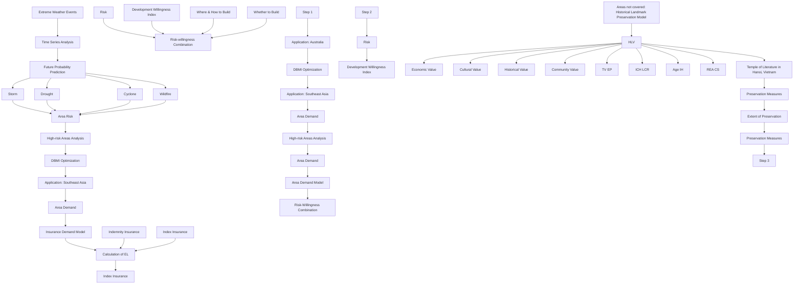
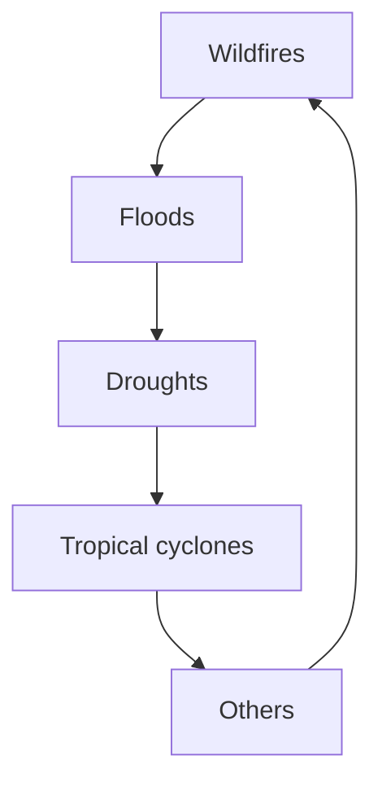
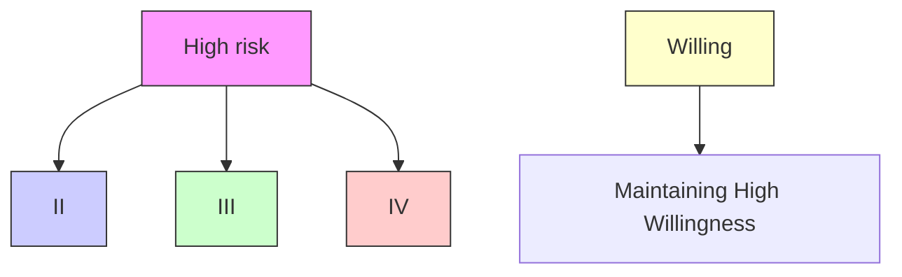
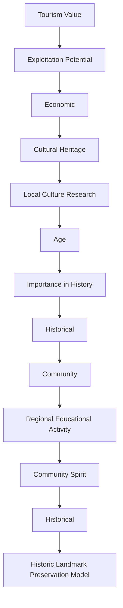

# In Face of Increasingly Severe Extreme Weather: Sustainable Property Insurance under Risk

Summary

The first priority of survival is getting protection from the extreme weather. —Bear Grylls

More frequent and severe extreme weather events are causing greater damage to people's property, leading to a reevaluation of the sustainability of insurance companies. On one hand, maintaining enough customers for long-term healthy operation is crucial; on the other hand, avoiding excessively high compensation risks to remain profitable is essential. Therefore, we assessed the sustainability of the insurance sector in areas that were frequently impacted by extreme weather events from two perspectives: insurance demand and total risk.

For Task 1, we developed a Property Insurance Posture Model for insurance companies. We categorized extreme weather into 4 types and used an ARIMA model to forecast the future risk of extreme weather for each region-disaster pair, and calculated the expected loss. Then, we used Lane's AFC model to calculate premiums. To measure demand with premiums, we introduced the insurance demand curve. Finally, we established Demand-Risk Equilibrium Model for Insurance(DBMI) to provide decisions on whether to underwrite insurance in specific regions.

Next, we applied the model above to Australia and Southeast Asia, where approximately 60 years of data from 3000 records were available. Then we applied ARIMA model on selected area-event series, with an eminent fit: $R^{2}$ consistently above 0.625, and IC all below 300. Consequently, we forecast the risks for 2024-2027. This has resulted in the determination of premiums ranging from \$119.2 to \$1295.6. The optimal solutions indicated that in Australia, QLD and WA should be underwritten; in SE Asia, PHL and THA.

For Task 2, we introduced Innovative Risk Prediction Property Development Method(IRPPDM), which integrated DBMI with real estate companies' willingness index to construct a Willingness-Risk coordinate system. We specifically targeted High Risk-High Willingness areas, providing 3 possible risk reassessment methods to help transfer them into Low Risk-High Willingness category.

For Task 3, we used Historic Landmark Preservation Model to help community leaders. We estimated the significance of historic landmarks by AHP method considering 8 indicators in 4 dimensions. Then we offered suggestions considering both the extent of significance and predicted risks. According to our model, Temple of Literature in Hanoi, Vietnam had a score of 0.463, facing risks of floods and cyclones. Considering its features, we offered 4 tailored suggestions.

In the end, we stated the strengths and weaknesses of models. Based on their performances in application, Property Insurance Posture Model reasonably balanced demand and risk, and Historic Landmark Preservation Model was comprehensive in measuring value.

Keywords: Extreme Weather Event; Property Insurance; ARIMA; Dual-objective Optimization; AHP

## Contents

## 1 Introduction 2

1.1 Problem Background 2  
1.2 Our Work 2

## 2 Assumptions and Notations 3

## 3 Model I: Property Insurance Posture Model 4

3.1 The Types of Extreme Weather Events 4  
3.2 Predicting Extreme Weather Events: Based on ARIMA 5

3.2.1 Series Stabilization 6  
3.2.2 ARIMA Model 6

3.3 Insurance Price and Demand 7

3.3.1 Two Types of Insurance 7  
3.3.2 Price of Insurance 8  
3.3.3 Demand for Insurance 8

3.4 Demand-Risk Equilibrium Model for Insurance 9

## 4 Case Study: Australia and Southeast Asia 10

4.1 Data Processing and Analysis 10  
4.2 Use of ARIMA Model 11  
4.3 Apply DEMI to Two Areas 13

4.3.1 Determination of Premiums and Demand 13  
4.3.2 Solving DBMI 13

## 5 Innovative Risk Prediction Property Development Method 14

5.1 Whether to Build: Determined by Willingness and Risk 15  
5.2 How and Where to build: Addressing Specific Event Risk 16  
5.3 Conclusion for IRPPDM 17

## 6 Model II: Historic Landmark Preservation Model 17

6.1 Indicator Selection 18  
6.2 Weight Calculation: Based on AHP 18  
6.3 Value Calculation and Extent Estimation 20  
6.4 Application: Temple of Literature in Hanoi, Vietnam 21

## 7 Strength and Weakness 22

## References 23

## Letter of Recommendation 24

## 1 Introduction

## 1.1 Problem Background

Over the past few years, more than 1,000 extreme weather events have resulted in more than \$1 trillion in global losses. Swiss Re predicted that losses from weather-related events in Australia, Canada, France, Germany, Japan, the U.K., and the U.S. could increase by 35-120 percent by 2040, due to the impact of natural disasters such as floods, hurricanes, and wildfires. [1]

choropleth map

| Region | Value (%) |
| --- | --- |
| North America | 50 |
| Europe | 50 |
| Asia | 50 |
| South America | 50 |
| Africa | 50 |
| Australia | 50 |
| Oceania | 50 |
| Middle East | 50 |
| Central Asia | 50 |
| Southeast Asia | 50 |
| Eastern Europe | 50 |
| Southern Africa | 50 |
| Middle East & North Africa | 50 |
| Western Europe | 50 |
| North America | 50 |
| Europe | 50 |
| Asia | 50 |
| South America | 50 |
| Africa | 50 |
| Central America | 50 |
| Southern Africa | 50 |
| Middle East & North Africa | 50 |
| Western Europe | 50 |
| North America | 50 |
| Europe | 50 |
| Asia | 50 |
| South America | 50 |
| Africa | 50 |
| Central America | 50 |
| Southern Africa | 50 |
| Middle East & North Africa | 50 |
| Western Europe (excluding India) | 50 |
| Western Europe (excluding China) | 50 |
| Western Europe (excluding India) | 50 |
| Western Europe (excluding China) | 50 |
| Western Europe (excluding China) | 50 |
| Western Europe (excluding China) | 50 |
| Western Europe (excluding China) | 50 |
| Western Europe (excluding China) | 50 |
| Western Europe (excluding China) | 50 |
| Western Europe (excluding China) | 50 |
| Western Europe (excluding China) | 50 |
| Western Europe (excluding China) | 100 |
| Western Europe (excluding China) | 100 |
| Western Europe (excluding China) | 100 |
| Western Europe (excluding China) | 100 |
| Western Europe (excluding China) | 100 |
| Western Europe (excluding China) | 100 |
| Western Europe (excluding China) | 100 |
| Western Europe (excluding China) | 100 |
| Western Europe (excluding China) | 100 |
| Western Europe (excluding China) | 100 |
| Western Europe (excluding China) | 100 |
| Western Europe (excluding China) | 100 |
| Western Europe (excluding China) | 100 |
| Western Europe (excluding China) | 100 |
| Western Europe (excluding China) | 100 |
| Western Europe (excluding China) | 100 |
| Western Europe(excluding China) | 100 |
| Western Europe(excluding China) | 100 |
| Western Europe(excluding China) | 100 |
| Western Europe(excluding China) | 100 |
| Western Europe(excluding China) | 100 |
| Western Europe(excluding China) | 100 |
| Western Europe(excluding China) | 100 |
| Western Europe(excluding China) | 100 |

(c) Decadal average: Annual number of people affected by disasters

choropleth map

| Region | Annual number of people left homeless from disasters (in millions) |
| --- | --- |
| North America | 10000 |
| Europe | 10000 |
| Asia | 10000 |
| South America | 10000 |
| Africa | 10000 |
| Australia | 10000 |
| Central America | 10000 |
| Middle East | 10000 |
| Southern Africa | 10000 |
| Eastern Europe | 10000 |
| Western Europe | 10000 |
| North America | 1000 |
| South America | 1000 |
| Central America | 1000 |
| Southern Africa | 1000 |
| Eastern Europe | 1000 |
| Western Europe | 1000 |
| Northern America | 1000 |
| Southern Africa | 1000 |
| Central America | 1000 |
| Southern Europe | 1000 |
| Northern America | 100 |
| Southern Africa | 100 |
| Eastern Europe | 100 |
| Western Europe | 100 |
| Northern America | 10 |
| Southern Africa | 1 |
| Western Europe | 1 |
| Northern America | 1 |
| Southern Africa | 1 |
| Central America | 1 |
| Southern Europe | 1 |
| Eastern Europe | 1 |
| Western Europe | 1 |
| Northern America | 1 |
| Southern Africa | 1 |
| Central America | 1 |
| Southern Europe | 1 |
| Northern America | 1 |
| Southern Africa | 1 |
| Central America | 1 |
| Southern Europe | 1 |
| Northern America | 1 |
| Southern Africa | 1 |
| Central America | 1 |
| Southern Europe | 1 |
| Northern America | 1 |
| Southern Africa | 1 |
| Central America | 1 |
| Southern Europe | 1 |
| Northern America | 1 |
| Southern Africa (excluding China) | 1 |
| Sub-Saharan Africa (excluding China) | None (no data) |
| Latin America (excluding China) | None (none data) |
| Middle East (excluding China) | None (none data) |
| North America (excluding China) | None (none data) |
| South America (excluding China) | None (none data) |
| Asia (excluding China) | None (none data) |
| Oceania (excluding China) | None (none data) |
| Middle East & North Africa (excluding China) | None (none data) |
| North Africa (excluding China) | None (none data) |
| South Africa (excluding China) | None (none data) |
| Middle East & South Africa (excluding China) | None (none data) |
| North Africa (excluding China) | None (none data) |
| South Africa & South Asia (excluding China) | None (none data) |
| Middle East & Southeast Asia (excluding China) | None (none data) |
| North Africa & Southeast Asia (excluding China) | None (none data) |
| South Africa & Southeast Asia (excluding China) | None (none data) |
| Middle East & Central Asia (excluding China) | None (none data) |
| North Africa & Central Asia (excluding China) | None (none data) |
| South Africa & Central Asia (excluding China) | None (none data) |
| Middle East & Central Asia (excluding China) | None (none data) |
| North Africa & Central Asia (excluding China) | None (none data) |
| South Africa & Central Asia (excluding China) | None (none data) |
| Middle East & Central Asia (excluding China) | None (none data) |
| North Africa & Central Asia (excluding China) | None (none data) |
| South America & Central Asia (excluding China) | None (none data) |
| Middle East & Central Asia (excluding China) | None (none data) |
| North Africa & Central Asia (excluding China) | None (none data) |
| South America & Central Asia (excluding China) | None (none data) |
| Middle East & Central Asia (excluding China) | None (none data) |
| North Africa & Central Asia (excluding China) | None (none data) |

(d) Decadal average: Annual number of deaths from disasters  
Figure 1: Global Impact of Natural Disasters[2]

The frequent occurrence of extreme weather events presents a complex challenge for the property insurance industry. These events can lead to substantial financial losses due to increased claims, testing the industry's resilience. Insurers must navigate the dual pressures of maintaining profitability and offering affordable premiums.

Therefore, there's a growing need for risk assessment models that accurately reflect the high level risks associated with extreme weather events. This will help insurers to price policies more effectively and encourage investment in protective measures for properties at risk.

## 1.2 Our Work

For insurance companies, we have developed a property insurance deployment model to assist them in selecting the areas to underwrite against extreme weather events, ensuring the sustainability of their operations. Specifically, we measured sustainability based on the company's total demand and the total risk they face: Demand reflected the consideration of profitability, while underwriting risk was related to long-term healthy operation. After the model was established, we applied it to two different regions to validate its feasibility.

For real estate developers, we extended the insurance model mentioned above to assist in the decision-making process for property development, providing insights on where, how, and whether to construct buildings. Specifically, using the weather risk predictions obtained from the insurance model, we provided corresponding strategies that developers could implement to mitigate risks during the construction of properties.

For community leaders without the shelter of extreme weather event insurance, we have developed a historical landmark significance model that assesses the significance of historical landmarks based on four aspects: history, culture, economy, and community. Ultimately, this helps them determine the extent of protection needed for their historical landmarks.

The detailed flowchart is illustrated in Figure 2 below:

flowchart

Figure 2: Flowchart

## 2 Assumptions and Notations

## Assumption1: Insurance companies bear the risk independently

Justification: In reality, insurance companies often diversify risks through financial products, government support, and other means. Since we focus on the design of insurance products, we assume that insurance companies do not adopt risk diversification measures.

Assumption2: Insurance demand is negatively correlated with price, and insurance demand reflects the number of customers.

Justification: Insurance, as a normal good, experiences a decrease in demand as its price increases. And insurance demand corresponds to the number of insurance policies, and it can be directly seen as reflecting the number of customers.

Assumption3: Existing real estate development processes do not primarily consider extreme weather risk predictions.

Justification: Extreme weather events have low frequencies and high randomness, making them difficult to predict. Additionally, we conducted keyword searches on Google Scholar, and there is little discussion on incorporating extreme weather risk predictions into the primary indicators for real estate development.

Assumption4: The data we use is true and reliable.

Justification: Our data sources include international statistical agencies, academic databases, and reputable insurance companies. Therefore, we can confidently state that the data we use is accurate and reliable for modeling purposes.

Notations

<table><tr><td>Symbol</td><td>Definition</td></tr><tr><td>EL</td><td>Expected Loss</td></tr><tr><td>PEL</td><td>Frequency of Loss</td></tr><tr><td>Q</td><td>Quantity of Insurance Demand</td></tr><tr><td>D</td><td>Insurance Demand</td></tr><tr><td>R</td><td>Total Risk for Insurance</td></tr><tr><td>Sustainability</td><td>Sustainability for Insurance Company</td></tr><tr><td>DBMI</td><td>Demand-Risk Equilibrium Model for Insurance</td></tr><tr><td>IRPPDM</td><td>Innovative Risk Prediction Property Development Method</td></tr><tr><td>HLPM</td><td>Historical Landmark Preservation Model</td></tr></table>

## 3 Model I: Property Insurance Posture Model

## 3.1 The Types of Extreme Weather Events

According to USDA Climate Hubs, extreme events are occurrences of unusually severe weather or climate conditions that can cause devastating impacts on communities and agricultural and natural ecosystems.

NASA provided a brief summary of global extreme weather events, including heat waves, wildfires, droughts, tropical cyclones, heavy precipitation, floods, high-tide flooding, and marine heat waves.[3]

As illustrated in Figure 3, we mainly discuss the impact of extreme weather events on property insurance, so we only focus on four main categories: droughts, floods, tropical cyclones, and wildfires.

flowchart

Figure 3: Four types of extreme weather events studied

- Wildfires: Dry conditions increase the risk of wildfires. With global temperatures on the rise, some regions may experience more frequent and intense wildfires, posing a threat to life and property.  
- Floods: Floods present a substantial threat to properties as heightened atmospheric moisture can result in more frequent and heavier rainfall, which can overwhelm both natural and man-made water management systems. This is especially true in coastal areas due to the compounding effect of rising sea levels.  
- Tropical Cyclones: Tropical cyclones, fueled by warmer ocean temperatures and more humid air, are likely to cause more severe and long-lasting rainfall events. These natural phenomena can severely impact properties, particularly through enhanced coastal flooding, driven by rising sea levels that elevate storm surge impacts.  
- Droughts: The rising aridity in certain regions, exacerbated by global warming, has adverse effects on properties. This not only depletes ground moisture but also perpetuates a cycle of warming and moisture loss, leading to soil degradation, foundation issues, and an increased risk of fire hazards.  
- Others: Other types can be listed as heat extremes, heavy precipitation, high-tide flooding, marine heat waves, etc.

## 3.2 Predicting Extreme Weather Events: Based on ARIMA

To accurately calculate the expected loss of insurance products, insurance companies must precisely predict the probability of various extreme weather events. This step is significant for insurance pricing and risk control.

Given the uncertainty, complexity, and randomness of extreme weather events, we propose the use of time series analysis method to fit and predict the frequency of extreme weather events more accurately. Through this approach, we aim to improve the accuracy of predictions to better price insurance products and manage risk.

## 3.2.1 Series Stabilization

For non-stationary time series, predictive models may fail due to changes in the statistical properties of the series over time. Therefore, differencing is employed to reduce or eliminate the trend and seasonal components of the time series, thereby stabilizing the series.

The first-order difference sequence $y(n)$ is obtained by taking the difference between consecutive terms of the original sequence $x(n)$ . If the first-order difference sequence is still not stationary (usually use ADF to test), we can repeat the process to obtain the second-order difference sequence $z(n)$ :

$$
y (i + 1) = x (i + 1) - x (i) \tag {1}
$$

$$
z (i + 2) = y (i + 2) - y (i + 1) \tag {2}
$$

where:

- $x$ is the original sequence.  
- $y$ is the first-order difference sequence.  
- $z$ is the second-order difference sequence.  
- $i$ represents the timestamp.

## 3.2.2 ARIMA Model

For the stabilized sequence, we employ the Autoregressive Integrated Moving Average (ARIMA) model for prediction. This model integrates Autoregressive (AR) and Moving Average (MA) methods, incorporating differencing to enhance data stationarity. By examining the autocorrelation in historical data, the model assumes future trends will mimic historical patterns, thereby forecasting future data points.

ARIMA(p,i,q) can be represented by the following equation:

$$
X _ {t} = c + \phi_ {1} X _ {t - 1} + \phi_ {2} X _ {t - 2} + \dots + \phi_ {p} X _ {t - p} - \theta_ {1} \varepsilon_ {t - 1} - \theta_ {2} \varepsilon_ {t - 2} - \dots - \theta_ {q} \varepsilon_ {t - q} + \varepsilon_ {t} \tag {3}
$$

where:

- $X_{t}$ represents the time series (usually the difference sequence).  
- $c$ is the constant term.  
- $\phi_1, \phi_2, \ldots, \phi_p$ are the autoregressive coefficients corresponding to lag time steps $1, 2, \ldots, p$ .  
- $\theta_{1},\theta_{2},\ldots ,\theta_{q}$ are the moving average coefficients corresponding to lag time steps $1,2,\ldots ,q$  
- $\varepsilon_{t}$ represents the white noise error term at time point $t$ .

Obtain appropriate parameters through program execution to determine ARIMA(p, i, q), and complete model validation. Then we can get the frequency prediction of different extreme weather events for each area.

## Example: Fitting Cyclones and Tornadoes

We conducted first-order differencing on the annual data of tornadoes and hurricanes in New South Wales, Australia. Figure 4 displays the ARIMA model's fitted line, demonstrating a satisfactory model fit. Based on this, we concluded that our approach is suitable for extreme weather data characterized by significant fluctuations and strong seasonality.

line chart

| Year | Truth | Prediction |
|------|-------|----------|
| 1968 | -2.0  | 0.0      |
| 1969 | 0.0   | 1.5      |
| 1970 | 0.0   | 0.0      |
| 1971 | 0.0   | 0.0      |
| 1972 | 0.0   | 0.0      |
| 1973 | 0.0   | 0.0      |
| 1974 | 1.0   | 0.0      |
| 1975 | -1.0  | 0.0      |
| 1976 | -1.0  | 0.5      |
| 1977 | 0.0   | 0.0      |
| 1978 | 0.0   | 0.0      |
| 1979 | 0.0   | 0.0      |
| 1980 | 0.0   | 0.0      |
| 1981 | 0.0   | 0.0      |
| 1982 | 0.0   | 0.0      |
| 1983 | 0.0   | 0.0      |
| 1984 | 0.0   | 0.0      |
| 1985 | 0.0   | 0.0      |
| 1986 | 0.0   | 0.0      |
| 1987 | 0.0   | 0.0      |
| 1988 | 0.0   | 0.0      |
| 1989 | 0.0   | 0.0      |
| 1990 | 0.0   | 0.0      |
| 1991 | 0.0   | 0.0      |
| 1992 | 0.0   | 0.0      |
| 1993 | 0.0   | 0.0      |
| 1994 | 0.0   | 0.0      |
| 1995 | 0.0   | 0.0      |
| 1996 | 0.0   | 0.0      |
| 1997 | 0.0   | 0.0      |
| 1998 | 0.0   | 0.0      |
| 1999 | 0.0   | 0.0      |
| 2000 | 1.0   | -1.0     |
| 2001 | -1.0  | -2.0     |
| 2002 | -2.0  | -3.0     |
| 2003 | -1.5  | -2.5     |
| 2004 | -1.5  | -2.5     |
| 2005 | -1.5  | -2.5     |
| 2006 | -1.5  | -2.5     |
| 2007 | -1.5  | -2.5     |
| 2008 | -2.5  | -3.5     |
| 2009 | -2.5  | -3.5     |
| 2010 | -2.5  | -3.5     |
| 2011 | -2.5  | -3.5     |
| 2012 | -3.5  | -4.5     |
| 2013 | -3.5  | -4.5     |
| 2014 | -3.5  | -4.5     |
| 2015 | -3.5  | -4.5     |
| 2016 | -3.5  | -4.5     |
| 2017 | -3.5  | -4.5     |
| 2018 | -3.5  | -4.5     |
| 2019 | -3.5  | -4.5     |
| 2020 | -3.5  | -4.5     |
| 2021 | -3.5  | -4.5     |
| 2022 | -3.5  | -4.5     |
| 2023 | -3.5  | -4.5     |

Figure 4: Curve Fitting Example: Wind Events in 1975-2023

## 3.3 Insurance Price and Demand

## 3.3.1 Two Types of Insurance

It is important to note the role of insurance in mitigating the impact of extreme weather events, including indemnity-based insurance, index-based insurance, and insurance-linked securities. These tools can assist households and enterprises in adapting to the increasing risks associated with climate change.

Here we mainly focus on the two types of insurance. We determine the type of insurance based on per capita GDP: Developed regions typically use indemnity-based insurance, while developing regions typically use index-based insurance.

## Indemnity-based Insurance

It compensates for actual losses caused by an event. Data is collected on the financial loss caused by different types of extreme weather events and the probability of loss in an area over the years. After processing the data, we can obtain the total losses and payouts for each year. This allows us to calculate the expected loss(EL):

$$
\mathrm{EL} = \sum_ {j} \frac {\text { Average   Lost   of   event } j}{\text { Average   Affected   People   of   event } j} \tag {4}
$$

## Index-based Insurance

Payouts to policyholders depend on an index that strongly correlates with losses in income or assets. To estimate loss, we should use a metric to measure the severity of events. However, losses vary from

公众号：蚂蚁竞赛 更多资料请加QQ群1077734962，谢谢！

event to event and are measured differently, so the data must be normalized and weighted to obtain a loss index $\gamma$ . Thus we can determine the extent of loss and expected loss(EL):

$$
\mathrm{EL} = \sum_ {j} \gamma_ {j} \times \text { Standard   Compensation   of   event } j \tag {5}
$$

## 3.3.2 Price of Insurance

According to the methods above, we can obtain expected loss caused by extreme weather events. Based on this, we consider the pricing of insurance products.

Insurance premiums usually consist of two parts: pure premium and additional premium. According to Lane's LFC model[4], we use EL to measure the pure premium while considering the expected excess return(EER) to measure additional premium. Then we get the insurance price, or Premium(P):

$$
\mathrm{P} = \mathrm{EL} + \mathrm{EER} \tag {6}
$$

We have provided specific formulas to calculate EL in section 3.3.

EER depends on the frequency and severity of loss, represented by the Cobb-Douglas function, as follows:

$$
\mathrm{EER} = 0. 5 5 \times \mathrm{PEL} ^ {0. 4 9 5} \times \mathrm{CEL} ^ {0. 5 7 4} \tag {7}
$$

$$
\mathrm{CEL} = \frac {\mathrm{EL}}{\mathrm{PEL}} \tag {8}
$$

where:

- PEL is referred to as frequency of loss  
- CEL is used to measure severity of loss

## 3.3.3 Demand for Insurance

To measure the revenue of the insurance company, we also need to assess demand(D) of insurance products. Since insurance demand is influenced by many factors in reality, we abstractly use Marshal-lian Demand Curve to simplify analysis. According to this model, demand is inversely proportional to price, as the yellow curve in Figure 5:

line chart

| Q    | Original Demand | Increased Willingness to Buy |
| ---- | --------------- | --------------------------- |
| Low  | High            | High                        |
| High | Low             | Low                         |

Figure 5: Demand- Price Curve

公众号：蚂蚁竞赛 更多资料请加QQ群1077734962，谢谢！

where:

$$
Q = a P + b, a <   0, b > 0 \tag {9}
$$

Additionally, we consider property owner's influence on insurance company. The choices of one single property owner are unlikely to significantly affect market demand, but the change of consumer trend in the market would lead to shifts in the demand curve. For example, if consumer's willingness to consume increases, the demand curve would shift to the right as blue curve in Figure 5.

## 3.4 Demand-Risk Equilibrium Model for Insurance

We have constructed the Demand-Risk Equilibrium Model for Insurance(DEMI) to comprehensively assess the sustainability of an insurance company, considering two aspects: the total demand for insurance and the overall risk undertaken by the insurance company.

The reasons for selecting these two aspects are as follows:

Firstly, there is a significant positive correlation between the customer number of insurance company(means the same as total demand) and the profitability of the insurance company.

However, insurance companies cannot indiscriminately increase the number of policies, as an excessive increase in extreme weather risk may lead to the insurance company facing insurmountable large claims. Therefore, we introduce the concept of overall risk to impose constraints.

Aim to assist insurance companies in deciding whether to underwrite policies in certain areas, we initially divide high-risk areas within the insurance company's business scope into $n$ distinct areas and introduce binary variables $x_{i}$ :

$$
x _ {i} = \left\{ \begin{array}{l l} 1 & \text { choose   to   underwrite   in   area   i }, \\ 0 & \text { refuse   to   underwrite   in   area   i }. \end{array} \right. \tag {10}
$$

## Total Demand

Based on the insurance demand model derived from ARIMA model of extreme weather events, we can obtain forecasts for insurance demand in the future for area i, denoted as $d_{i}$ . For the insurance company, its total demand is the sum of the demands from the underwritten areas, which can be defined as follows:

$$
D = \sum_ {i = 1} ^ {n} x _ {i} \cdot d _ {i} \tag {11}
$$

## Overall Risk

Based on the predictive model mentioned in Section 3.4, we can derive independent future occurrence probabilities for extreme weather events in different areas. To assess the overall risk, we must consider the impact of different types of extreme weather events and the aggregation of risks across areas.

We opt for a severity weighting method to evaluate the impact of different extreme weather events and obtain the formula for calculating the total risk $r_{i}$ for area i.

$$
r _ {i} = \sum_ {j} p _ {i j} \cdot \alpha_ {j} \tag {12}
$$

$$
\sum_ {j} \alpha_ {j} = 1 \tag {13}
$$

where:

- $p_{ij}$ : Probability of event extreme weather type $j$ occurring in area $i$ .  
- $\alpha_{j}$ : Impact degree of extreme weather type $j$ .  
- $j$ : Different types of extreme weather events.

## Optimization for Sustainability

Ultimately, we propose DEMI to assess insurance companies' sustainability. It is a dual-objective optimization model, wherein we introduce a weight parameter $\lambda$ to balance the importance of overall risk and total demand.

With an appropriate choice of $\lambda$ , the model can effectively address both aspects. The specific definition of the model is as follows:

$$
\max \text { Sustainability } = \lambda D - (1 - \lambda) R \tag {14}
$$

Its constraints are the limitations imposed by the binary variables $x_{i}$ mentioned earlier in the this section.

## 4 Case Study: Australia and Southeast Asia

## 4.1 Data Processing and Analysis

## Data Source and Area Segmentation

We have gathered a total of 744 records of extreme weather events in Australia dating back to 1967 and 2,021 records of extreme weather events in Southeast Asia since 1970.[5] Given Australia's geographic isolation from other continents, we treat it as a research region, with its individual states considered separate areas. In contrast, due to the multitude of Southeast Asian nations and their relatively small land areas, we consider Southeast Asia as a research region, with different countries categorized as distinct areas.

After excluding missing data and natural disasters outside the scope of our study, we obtained Figure 6. It's important to note that due to the differences in data sources and classification methods, the categorization of extreme weather events varies between the two regions.

bar chart

Extreme Weather Events in Southeast Asia
| Event | Number of Occurrences |
|---|---|
| Fasting | 800 |
| Storm | 620 |
| Overnight | 60 |

bar chart

Extreme Weather Events in Australia
| Event | Number of Occurrences |
|---|---|
| Flooding | 56 |
| Hail | 2 |
| Heliotom | 33 |
| Storm | 73 |
| Cyclone | 74 |
| Sunshine | 46 |
| Tornado | 23 |

Figure 6: The frequencies of different events in the two regions.

## Selection of Study Scope

Based on the original data, in Australia, we choose to classify cyclones and tornadoes into one category, and hail, hailstorms, and storms into another category, resulting in a total of four types of extreme weather events: bushfire, cyclone, flood, and storm. In Southeast Asia, we retained the original classification: drought, flood, and storm.

bar chart

Extreme Weather Events in Southeast Asia
| Weather Type | Number of Occurrences |
|---|---|
| Friulielle | 800 |
| Storm | 620 |
| Drought | 50 |

bar chart

Extreme Weather Events in Australia
| Weather Event | Number of Occurrences |
| :--- | :--- |
| Storm | 108 |
| Cyclone | 98 |
| Flooding | 56 |
| Baseline | 47 |

Figure 7: Categorized events in the two regions

Next, we proceeded to select areas that were significantly impacted by extreme weather events for inclusion in the insurance company's consideration of whether to underwrite. We determined whether they qualified as high-risk areas based on the frequency distribution of extreme weather events (in Figure 8) in each area.

Australia/Southeast Asia Regional Event Proportions  

pie chart

Australia
| Region | Percentage (%) |
| :--- | :--- |
| NSW | 33.00 |
| ACT | 24.00 |
| TAS | 17.60 |
| NT | 14.50 |
| SA | 5.00 |
| WA | 2.80 |
| VIC | 2.50 |
| QLD | 0.60 |

pie chart

Southeast Asia
| Category | Value (%) |
|---|---|
| PHL | 33.80 |
| KHM | 30.50 |
| LAO | 2.40 |
| MMR | 2.60 |
| MYS | 4.20 |
| THA | 5.30 |
| VNM | 12.80 |
| IDN | 30.50 |

Figure 8: Distribution of events in areas in the two regions

Lastly, we have chosen the following areas to analysis: in Australia, New South Wales (NSW), Queensland (QLD), Victoria (VIC), and Western Australia (WA), while in Southeast Asia, Indonesia (IDN), Philippines (PHL), Thailand (THA), and Vietnam (VNM) – we consider Thailand to have a higher risk level despite its contribution to the total count being less than 10% due to the high overall frequency in Southeast Asia.

## 4.2 Use of ARIMA Model

Applying the previously mentioned methodology, we initially conducted a second-order differencing analysis on the frequency of certain types of extreme weather events in each area of the two regions.

公众号：蚂蚁竞赛 更多资料请加QQ群1077734962，谢谢！

Subsequently, we employed the ARIMA model for time series forecasting, yielding equations in the following form (taking the example of bushfire in NSW):

$$
\operatorname{ARIMA} (3, 2, 1): Y _ {(t)} = - 0. 0 0 2 - 0. 6 5 1 Y _ {(t - 1)} - 0. 4 1 2 Y _ {(t - 2)} - 0. 1 0 5 Y _ {(t - 3)} - 0. 9 5 2 \varepsilon_ {(t - 1)} \tag {15}
$$

Then applying the model to all time series of each area-event pair, we obtained corresponding prediction curves. These curves exhibit an excellent fit to the original data, as illustrated in Figures 9. Here, we provide examples from IND in Southeast Asia and WA in Australia.

WA Events Fitting Curves  

line chart

| Condition | Value |
| --------- | ----- |
| Wildfire  | 0     |
| Wildfire  | 1     |
| Wildfire  | -1    |
| Wildfire  | 2     |
| Wildfire  | -2    |
| Wildfire  | 3     |
| Wildfire  | -3    |
| Wildfire  | 4     |
| Flood     | 0     |
| Flood     | 1     |
| Flood     | -1    |
| Flood     | 2     |
| Flood     | -2    |
| Flood     | 3     |
| Flood     | -3    |
| Flood     | 4     |

line chart

| Wave Type | Cyclone Value | Storm Value |
|-----------|---------------|-------------|
| Cyclone   | ~0 to 15      | ~0 to 3     |
| Storm     | ~-15 to 0     | ~-1 to 2    |

IDN Events Fitting Curves  

line chart

| Time | Draught | Storm |
| --- | --- | --- |
| 0 | -2.5 | -1.0 |
| 1 | 0.5 | 0.0 |
| 2 | -0.5 | -1.5 |
| 3 | 1.5 | 0.5 |
| 4 | -1.5 | -2.0 |
| 5 | 2.0 | 1.0 |
| 6 | -2.0 | -3.0 |
| 7 | 1.0 | 0.0 |
| 8 | -1.0 | -2.5 |
| 9 | 0.0 | 1.5 |
| 10 | -0.5 | -3.5 |
| 11 | 1.5 | 2.0 |
| 12 | -1.5 | -4.0 |
| 13 | 2.5 | 3.0 |
| 14 | -2.5 | -5.0 |
| 15 | 1.0 | 2.5 |
| 16 | -1.0 | -4.5 |
| 17 | 0.5 | 3.5 |
| 18 | -0.5 | -5.5 |
| 19 | 1.5 | 4.0 |
| 20 | -1.5 | -6.0 |
| 21 | 2.0 | 4.5 |
| 22 | -2.0 | -6.5 |
| 23 | 1.0 | 5.0 |
| 24 | -1.0 | -7.0 |
| 25 | 0.5 | 5.5 |
| 26 | -0.5 | -7.5 |
| 27 | 1.5 | 6.0 |
| 28 | -1.5 | -8.0 |
| 29 | 2.5 | 6.5 |
| 30 | -2.5 | -8.5 |
| 31 | 1.0 | 7.0 |
| 32 | -1.0 | -9.0 |
| 33 | 0.5 | 7.5 |
| 34 | -0.5 | -9.5 |
| 35 | 1.5 | 8.0 |
| 36 | -1.5 | -10.0 |
| 37 | 2.0 | 8.5 |
| 38 | -2.0 | -10.5 |
| 39 | 1.0 | 9.0 |
| 40 | -1.0 | -11.0 |
| 41 | 0.5 | 9.5 |
| 42 | -0.5 | -11.5 |
| 43 | 1.5 | 10.0 |
| 44 | -1.5 | -12.0 |
| 45 | 2.5 | 10.5 |
| 46 | -2.5 | -12.5 |
| 47 | 1.0 | 11.0 |
| 48 | -1.0 | -13.0 |
| 49 | 0.5 | 11.5 |
| 50 | -0.5 | -13.5 |
| 51 | 1.5 | 12.0 |
| 52 | -1.5 | -14.0 |
| 53 | 2.0 | 12.5 |
| 54 | -2.0 | -14.5 |
| 55 | 1.0 | 13.0 |
| 56 | -1.0 | -15.0 |
| 57 | 0.5 | 13.5 |
| 58 | -0.5 | -15.5 |
| 59 | 1.5 | 14.0 |
| 60 | -1.5 | -16.0 |
| 61 | 2.5 | 14.5 |
| 62 | -2.5 | -16.5 |
| 63 | 1.0 | 15.0 |
| 64 | -1.0 | -17.0 |
| 65 | 0.5 | 15.5 |
| 66 | -0.5 | -17.5 |
| 67 | 1.5 | 16.0 |
| 68 | -1.5 | -18.0 |
| 69 | 2.0 | 16.5 |
| 70 | -2.0 | -18.5 |
| 71 | 1.0 | 17.0 |
| 72 | -1.0 | -19.0 |
| 73 | 0.5 | 17.5 |
| 74 | -0.5 | -20.0 |
| 75 | 1.5 | 18.0 |
| 76 | -1.5 | -21.0 |
| 77 | 2.5 | 18.5 |
| 78 | -2.5 | -22.0 |
| 79 | 1.0 | 20.0 |
| 80 | -1.0 | -23.0 |
| 81 | 0.5 | 20.5 |
| 82 | -0.5 | -24.0 |
| 83 | 1.5 | 21.0 |
| 84 | -1.5 | -24.5 |
| 85 | 2.0 | 21.5 |
| 86 | -2.0 | -26.0 |
| 87 | 1.0 | 22.0 |
| 88 | -1.0 | -26.5 |
| 89 | 0.5 | 22.5 |
| 90 | -0.5 | -27.0 |
| 91 | 1.5 | 23.0 |
| 92 | -1.5 | -28.0 |
| 93 | 2.5 | 23.5 |
| 94 | -2.5 | -29.0 |
| 95 | 1.0 | 24.0 |
| 96 | -1.0 | -30.0 |
| 97 | 0.5 | 24.5 |
| 98 | -0.5 | -31.0 |
| 99 | 1.5 | 25.0 |

  
Figure 9: Events Fitting Curves

Next, we employ the coefficient of determination $R^{2}$ as well as the Akaike Information Criterion (AIC) and Bayesian Information Criterion (BIC) to assess the performance of each model. The definitions of AIC and BIC are as follows:

$$
\mathrm{AIC} = - 2 \ln (L) + 2 k \tag {16}
$$

$$
\mathrm{BIC} = - 2 \ln (L) + k \ln (n) \tag {17}
$$

where:

- L represents the maximum likelihood of the model.  
- k is the number of model parameters.  
• n is the number of data points.

Part of our model evaluation results are presented in Table 1. Both AIC and BIC remain at acceptable levels, and $R^2$ values consistently exceed 0.6.

Thus, we believe that our model is robust to effectively forecast future extreme weather events. Finally we get the frequency prediction of different area-event for the next 3 years.

<table><tr><td>Area-Event</td><td>AIC</td><td>BIC</td><td>R2</td></tr><tr><td>IDN-Drought</td><td>83.023</td><td>94.731</td><td>0.745</td></tr><tr><td>IDN-Flood</td><td>279.993</td><td>295.603</td><td>0.665</td></tr><tr><td>IDN-Storm</td><td>116.088</td><td>125.844</td><td>0.767</td></tr><tr><td>PHL-Drought</td><td>82.001</td><td>97.611</td><td>0.839</td></tr><tr><td>PHL-Flood</td><td>245.232</td><td>254.988</td><td>0.629</td></tr><tr><td>PHL-Storm</td><td>277.507</td><td>289.214</td><td>0.715</td></tr><tr><td>THA-Drought</td><td>74.377</td><td>86.085</td><td>0.837</td></tr><tr><td>THA-Flood</td><td>222.739</td><td>236.398</td><td>0.726</td></tr><tr><td>THA-Storm</td><td>165.383</td><td>177.090</td><td>0.781</td></tr><tr><td>VNM-Drought</td><td>64.436</td><td>78.095</td><td>0.833</td></tr><tr><td>VNM-Flood</td><td>203.976</td><td>217.635</td><td>0.781</td></tr><tr><td>VNM-Storm</td><td>222.338</td><td>234.045</td><td>0.784</td></tr></table>

Table 1: Model validation for the Southeast Asian

## 4.3 Apply DEMI to Two Areas

## 4.3.1 Determination of Premiums and Demand

Based on the per capita GDP in Australia and Southeast Asia, we have chosen to calculate the EL for each area using both indemnity-based insurance and index-based insurance models.

By using formulas above, we have computed the probability of loss(PEL) for both Australia and Southeast Asia for the year 2024. By utilizing the PEL and the EL, we calculate the Conditional Expected Loss (CEL), which ultimately allows us to determine the insurance premium:

  
Figure 10: Premium for two areas

As shown in Figure 10, it is evident that due to varying levels of risk, there are differences in insurance premiums across different areas. Next, we will incorporate the insurance demand model to obtain the demand $d_{i}$ for each area.

## 4.3.2 Solving DBMI

We have observed that within the range of $\lambda$ values between $2 \times 10^{-5}$ and $1 \times 10^{-6}$ , the model effectively balances risk and demand. Ultimately, we have selected a $\lambda$ value of $5 \times 10^{-6}$ , resulting in the optimal insurance coverage plan as follows:

- For the Australian region, we provide coverage for QLD and WA while not covering VIC and NSW.  
- In the Southeast Asian region, we offer coverage for PHL and THA while not covering IND and VNM.

Next, we would analyze this outcome by risk and demand data.

<table><tr><td>Country</td><td>NSW</td><td>QLD</td><td>VIC</td><td>WA</td></tr><tr><td>Premium</td><td>798.05</td><td>823.69</td><td>1295.62</td><td>267.51</td></tr><tr><td>Total Demand</td><td>74327</td><td>73460</td><td>58857</td><td>90847</td></tr><tr><td>Total Risk</td><td>0.54162</td><td>0.30394</td><td>0.76552</td><td>0.06285</td></tr></table>

Table 2: Insurance data of Australia

In the case of Australia, the model opts for the lowest-risk option, WA, over VIC, which exhibits significantly higher risk compared to other areas. This decision aligns with the sustainability principle of risk avoidance. Additionally, we observe that the demand and premiums for NSW and QLD are similar. The model chooses QLD, which has a lower overall risk, thus demonstrating a balance between risk and profitability.

<table><tr><td>Country</td><td>IDN</td><td>PHL</td><td>THA</td><td>VNM</td></tr><tr><td>Premium</td><td>543.94</td><td>119.20</td><td>717.82</td><td>267.28</td></tr><tr><td>Total Demand</td><td>72802</td><td>94039</td><td>64109</td><td>86635</td></tr><tr><td>Total Risk</td><td>0.29424</td><td>0.05597</td><td>0.09301</td><td>0.17466</td></tr></table>

Table 3: Insurance data of Southeast Asia

For Southeast Asia, we can observe that the two selected areas share a significant characteristic: they both exhibit low overall risk. Additionally, the choice of THA, which commands the highest premiums, enhances the profitability of the insurance company.

As for the other two areas, IDN, despite having high premiums, also carries high risks, making it a less favorable option. On the other hand, VNM presents relatively high risks but offers lower premiums, resulting in a suboptimal cost-benefit ratio for insurance coverage.

In conclusion, we believe that our model has reasonable outcomes in both regions. These results reflect the balance between profitability and risk management for insurance company. The model's accuracy in forecasting extreme weather events, coupled with its strong interpretability, provides valuable insights for the insurance company in addressing extreme weather events.

## 5 Innovative Risk Prediction Property Development Method

Based on Assumption3, we propose innovative risk prediction property development method that considers extreme weather risk predictions. This involves adapting our DBIM to assist developers in evaluating where, how, and whether to build on certain sites.

## 5.1 Whether to Build: Determined by Willingness and Risk

To provide housing and other real estate services for the ever-growing communities and populations, real estate companies have their own system for selecting development areas.

The specific methods fall outside the scope of our study. Anyway, they can utilize such a system to perform assessment of the developmental potential for each area, which we call as Development Willingness Index (DWI). A higher DWI value indicates a more optimistic profit outlook for property developers, and correspondingly, a stronger inclination to develop such areas.

Next, we adapt our DBMI s weighted risk - to measure the extreme weather risk in a specific area. By setting the development index on the vertical axis and total risk on the horizontal axis, we construct a Cartesian coordinate system(shown in Figure 11(a)). Each prospective development area corresponds to a unique point within this coordinate system. This system is divided into four quadrants, representing different combinations of risk and willingness:

venn diagram

| Region | Willing | High risk | Low risk | Unwilling |
|---|---|---|---|---|
| I | High risk | Low risk | Low risk | Low risk |
| II | High risk | High risk | Low risk | Low risk |
| III | High risk | High risk | Low risk | Low risk |
| IV | High risk | High risk | Low risk | Low risk |
The chart displays a 4x4 grid of colored squares representing the four quadrants. The central circle is labeled 'II'. The legend indicates the color coding: red for 'Low risk', green for 'High risk', gray for 'Unwilling'. No numerical values or trends are provided; the diagram implies a comparison of willingness and unwillingness across these two dimensions.

(a)

flowchart

(b)  
Figure 11: Cartesian coordinate system

- Quadrant I (Low Risk - High Willingness): Areas in this quadrant exhibit low extreme weather risk and a strong desire for development. For these areas, real estate developers need not pay much attention to extreme weather risk. Therefore, these areas can be developed according to the company's own development system. However, they are not the focus of our method.  
- Quadrant II (High Risk - High Willingness): Areas in this quadrant display both a strong desire for development and face high extreme weather risk. If risk reduction measures can be implemented to lower the risk while maintaining high willingness, these areas can transit from Quadrant II to I(Figure 11(b)), becoming feasible options for developers. Otherwise, they should abandon development plans in such an area. Our method focuses on this quadrant.  
- Quadrants III & IV (Low Willingness): Areas in these two quadrants exhibit low development willingness, even without considering the risk of extreme weather, these areas are not suitable candidates for development. Consequently, they are also not the focus of our method.

Next, we will focus on the areas situated in Quadrant II and discuss how and where to build in order to facilitate their transition to Quadrant I.

## 5.2 How and Where to build: Addressing Specific Event Risk

In our discussion concerning areas in Quadrant II, we focus on how and where to implement real estate development. The objective of developing these areas is to mitigate extreme weather risk effectively while maintaining development willingness, reducing it to an acceptable level. We propose specific measures and assessment methods for mitigating potential risk associated with different types of extreme weather.[6]

## Bushfire

To mitigate the risk of wildfires, site selection is the most direct approach. Preferred strategies include choosing sites in relatively moist areas and avoiding locations near forests. Additionally, measures taken in house construction can also reduce the risk of fires. These include avoiding the use of highly flammable insulation materials and opting for fire-resistant materials.

To quantify the effectiveness of site selection in reducing wildfire risk, we introduce the adjusted wildfire risk index $p_b^*$ , defined as:

$$
p _ {b} ^ {*} = \frac {p _ {b}}{1 + d} \tag {18}
$$

where:

- $p_b$ is the original wildfire risk, predicted from the DBMI  
- $d$ is the distance from the selected site to potential fire source

## Cyclone & Storm

Since wind-related disasters often accompany heavy rainfall, we discuss them together here. Due to the widespread impact of cyclones and storms, avoiding their impacts through location selection is ineffective. Therefore, enhancing the resistance of buildings to extreme events becomes a more effective strategy. This includes strengthening the structural design of houses, improving drainage systems around houses, and installing backup power systems.

To quantify the effect of strengthening building structures in reducing tornado risk, we define the adjusted tornado risk index $p_{c}^{*}$ as follows:

$$
p _ {c} ^ {*} = \frac {p _ {c} \times \text { Standard   Building   Strength }}{\text { Enhanced   Building   Strength }} \tag {19}
$$

where:

- $p_c$ is the original tornado risk, predicted from the DBMI.  
- Standard Building Strength represents the structural capacity without reinforcement.  
- Enhanced Building Strength represents the structural capacity with reinforcement.

## Drought

While the impact of drought on buildings may not be as direct or severe as some other extreme weather events, prolonged drought can potentially have negative effects on building structures. In terms of location selection, priority should be given to locations with stable foundations, which can help mitigate potential damage caused by soil drying and shrinking. Regarding the construction of houses, building design should focus on the integration of water-saving systems to minimize water consumption.

To quantify the effectiveness of constructing water-saving systems and selecting foundations in reducing drought risk, we define the adjusted drought risk index $p_{d}^{*}$ as follows:

$$
p _ {d} ^ {*} = \frac {p _ {d} \times \text { Soil   Shrinkage   Coefficient }}{\text { Water   Efficiency   Coefficient }} \tag {20}
$$

where:

- $p_d$ is the original drought risk, predicted from the DBMI.  
- Soil Shrinkage Coefficient measures the sensitivity of the soil to water deficiency.  
- Water Efficiency Coefficient represents the efficiency of the water-saving system.

Finally, based on the adjusted risk values $p_{j}^{*}$ , we can calculate the new total risk $r^{*}$ using the DBMI. By analyzing this value, we can help determine where, how, and whether to build on certain sites.

## 5.3 Conclusion for IRPPDM

In the preceding sections of this chapter, we have presented the complete workflow of the IRPPDM, with its core concept being the integration of real estate companies' regional analysis methods with our risk prediction model. This integration allows us to classify different areas based on risk and development willingness, and make decisions on whether construction should proceed accordingly.

Specifically, for high-risk, high-willingness areas, we have analyzed specific events response measures and evaluated the risk levels after implementing specific site selection(where) and construction methods(how). Through this approach, we can reassess the risk and determine whether the site is suitable for development purposes.

It should be noted that we have not provided detailed index explanation for certain indicators in our risk adjustment formulas. This is because they are not the focus of this chapter. Our aim is to explore a new analytical framework to guide real estate development decisions. This framework emphasizes taking construction measures for different types of extreme weather, aiming to enhance the stability and safety of buildings. We hope that this approach can provide new insights for real estate companies.

## 6 Model II: Historic Landmark Preservation Model

Insurance companies do not underwrite policies all areas due to risk/reward considerations. However, there are historic landmarks in uncovered areas that may be destroyed by extreme weather events. Therefore, we have developed the Historic Landmark Preservation (HLP) Model for communities, which are under the threat of severe extreme weather.

The model construction began with four dimensions: history, culture, economy, and community. Secondary indicators were selected based on these dimensions, and analytic hierarchical process(AHP) was used to measure the comprehensive value of the landmark. The higher the comprehensive value, the more necessary the preservation, and the greater the required investment.

Finally, we selected a specific site to demonstrate the effectiveness of the model and provide recommendations for preservation.

## 6.1 Indicator Selection

As shown in Figure 12, to comprehensively evaluate the value of landmarks, we selected four primary indicators: history, culture, economy, and community.

We considered the universality and objectivity of the indicators when selecting secondary indicators, as well as their measurability with data.

- Economic Value can be measured by two secondary indicators, Tourism Value (TV) and Exploitation Potential (EP). TV represents the existing economic value, which primarily derives from tourism. EP is equivalent to the undeveloped area divided by the total area.  
- Cultural Value can be measured by two secondary indicators, Intangible Cultural Heritage (ICH) and Local Culture Research (LCR). ICH is quantified by the number of intangible cultural heritage. LCR can be determined by searching for papers indexed with DOI using the landmark name and community n

flowchart

Figure 12: Introduction to primary and secondary indicators

- Historical Value can be measured by two secondary indicators, Age and Importance in History (IH). Age refers to the number of years of history, while IH refers to the number of significant historical figures and events it is related to.  
- Community Value can be measured by two secondary indicators, Regional Educational Activities (REA) and Community Spirit (CS). REA refers to the number of regional educational activities related to the landmark. CS represents the positive impact of a landmark on the community as a whole. It is measured on a scale of 0 to 1 due to the difficulty in accurately assessing its impact.

After identifying the metrics, we used AHP to assign weights and determine the value of the landmarks.

## 6.2 Weight Calculation: Based on AHP

## Weight Assessment Matrix

After determining the eight secondary indicators above and their measuring methods, we need to assign weights to them. We set landmark value as the target layer and build a hierarchical model with primary indicators and secondary indicators.

Firstly, we compare the indicators within the same level pairwise to obtain the weight assessment matrix. To make the judgment results more professional, we obtained their relative weights from academic papers.[7] The Weighting Judgment Matrix (WJM) for indicators are shown below.

Table 4: Historical Landmark value WJM

<table><tr><td>Intermediate Layer</td><td>Economy</td><td>Culture</td><td>History</td><td>Community</td></tr><tr><td>Economy</td><td>1</td><td>1/3</td><td>1/3</td><td>1</td></tr><tr><td>Culture</td><td>3</td><td>1</td><td>3</td><td>3</td></tr><tr><td>History</td><td>3</td><td>1/3</td><td>1</td><td>3</td></tr><tr><td>Community</td><td>1</td><td>1/3</td><td>1/3</td><td>1</td></tr></table>

Table 5: Economic Value WJM

<table><tr><td>Economic Value</td><td>TV</td><td>EP</td></tr><tr><td>Tourism Value (TV)</td><td>1</td><td>2</td></tr><tr><td>Exploitation Potential (EP)</td><td>1/2</td><td>1</td></tr></table>

Table 7: Historical Value WJM

<table><tr><td>Historical Value</td><td>Age</td><td>IH</td></tr><tr><td>Age</td><td>1</td><td>1/3</td></tr><tr><td>Importance in History (IH)</td><td>3</td><td>1</td></tr></table>

Table 6: Cultural Value WJM

<table><tr><td>Cultural Value</td><td>ICH</td><td>LCR</td></tr><tr><td>Intangible Cultural Heritage (ICH)</td><td>1</td><td>5</td></tr><tr><td>Local Culture Research (LCR)</td><td>1/5</td><td>1</td></tr></table>

Table 8: Community Value WJM

<table><tr><td>Community Value</td><td>REA</td><td>CS</td></tr><tr><td>Regional Educational Activity (REA)</td><td>1</td><td>1/3</td></tr><tr><td>Community Spirit (CS)</td><td>3</td><td>1</td></tr></table>

## Consistency Testing

As the data used came from multiple papers, it is necessary to conduct consistency testing on the results. The following explains how to conduct a consistency test on an $n \times n$ matrix. Let $x_{i,j}$ represent the data in the i-th row and j-th column.

The product of each row is computed as:

$$
M _ {i} = \prod_ {j = 1} ^ {n} x _ {i, j}, \quad i, j = 1, 2, \dots , n \tag {21}
$$

The normalized principal eigenvector $\bar{W}_{i}$ is calculated by taking the n-th root of $M_{i}$ :

$$
\bar {W} _ {i} = \sqrt [ n ]{M _ {i}} \tag {22}
$$

To normalize the vector $\bar{W}$ :

$$
\bar {W} _ {i} = \frac {\bar {W} _ {i}}{\sum_ {j = 1} ^ {n} \bar {W} _ {j}} \tag {23}
$$

The maximum eigenvalue of the matrix, $\lambda_{max}$ , is given by:

$$
\lambda_ {\max} = \sum_ {i = 1} ^ {n} \left(\frac {\left(\lambda_ {\max} \bar {W} _ {i}\right)}{n \bar {W} _ {i}}\right) \tag {24}
$$

The consistency index (CI) is obtained as follows, and a lower CI indicates higher consistency:

$$
C I = \frac {\lambda_ {\max} - n}{n - 1} \tag {25}
$$

In our model, the primary indicators' matrix's CI is 0.052, corresponding to a mean random consistency index (RI) value of 0.882, and the random consistency ratio (CR) is 0.058, passing the consistency test. The $2 \times 2$ matrices, representing secondary indicators, all have a CI value of 0 and have passed the consistency test. Below is the weight table.

Table 9: Criteria Weights for Historic Landmark Value Assessment

<table><tr><td>Decision Layer</td><td>Intermediate Layer</td><td>Factor Layer</td><td>Weight (%)</td></tr><tr><td rowspan="8">Historic Landmark Value</td><td rowspan="2">Economy</td><td>Tourism Value</td><td>8.135</td></tr><tr><td>Exploitation Potential</td><td>4.067</td></tr><tr><td rowspan="2">Culture</td><td>Intangible Cultural Heritage</td><td>39.434</td></tr><tr><td>Local Culture Research</td><td>7.887</td></tr><tr><td rowspan="2">History</td><td>Historical Importance</td><td>21.206</td></tr><tr><td>Age of Landmark</td><td>7.069</td></tr><tr><td rowspan="2">Community</td><td>Regional Educational Activity</td><td>3.051</td></tr><tr><td>Community Spirit</td><td>9.152</td></tr></table>

## 6.3 Value Calculation and Extent Estimation

## HLV Calculation

Due to the different dimensions of indicators, we need to normalize them. All eight indicators involved in this article are positive indicators, and the normalization formula is as follows:

$$
x ^ {\prime} = \frac {x - \min (x)}{\max (x) - \min (x)} \tag {26}
$$

After normalization, all indicators' values are within the [0, 1] range and dimensionless, allowing for calculations.

The formula for calculating the historical landmark value HLV is as follows:

$$
\mathrm{HLV} = \sum_ {a} W _ {a} I _ {a} \tag {27}
$$

where:

- $a$ represents the index of the specific indicator.  
- I represents the normalized value of the indicator.  
• W represents the weight of the indicator.

## Estimation of Extent of Preservation Measures

Based on HLV, we can estimate the necessary extent of preservation. The level of preservation is scaled to match the significance of the landmark. Here we propose a three-tiered approach to categorize the protective measures:

• Level I: High Preservation (HLV ≥ 0.7)

Entails advanced measures for preservation and prevention, including relocation for protection when necessary.

• Level II: Moderate Preservation (0.3 ≤ HLV < 0.7)

Encompasses comprehensive protection against common hazards.

• Level III: Low Preservation (HLV < 0.3)

Includes routine maintenance and disaster-specific precautions.

## 6.4 Application: Temple of Literature in Hanoi, Vietnam

## Value Assessment and Conservation

According to our insurance model, Vietnam is expected to be significantly affected by extreme weather events in the future. However, due to high risks and low premiums, it is unlikely to be insured. So, we chose the Temple of Literature(Văn Miếu–Quốc Tử Giám) in Hanoi, Vietnam as our subject.[8]

In 1070 AD, Emperor Lý Thánh Tông in Vietnam decided to establish the Temple of Literature to worship Confucius. In 1076 AD, Emperor Lý Nhân Tông built the Imperial Academy next to the Temple of Literature, which became the first formal academy in Vietnam. Today, the Temple of Literature still hosts annual religious ceremonies and cultural activities such as calligraphy and Chinese chess.

According to the model presented in section 6.3, we have assigned a HLV of 0.463 to the Temple of Literature, suggesting a medium level of preservation is advisable. Using the methods described in section 3.3, the site is predicted to face increasing risks of floods and cyclones in the future.

In light of this, we recommended the following conservation measures:

- Regularly clean and clear the riverbeds and drainage channels.  
- Apply waterproofing treatment to the surface of the buildings.  
• Plant trees in the vicinity.  
- Strengthen the load-bearing structures.

Implementing these protection measures can effectively prevent damage caused by flooding, erosion, and structural collapse due to strong winds.

## Estimated Conservation Effectiveness

We continued to use the indicators from the value estimation to measure the difference between with protection and without protection. However, the historical significance of a landmark will not change in a short period, predicting future local culture research is challenging, and the "community" indicator is binary (0-1) and does not show significant changes. Therefore, we considered the other five indicators and replaced the "age" index with "expected lifespan". We set the current level to a standard value 1 for ease of comparing conservation effectiveness.

radar chart

| Category                  | Standardized Value | Without Preservation | With Preservation |
| ------------------------- | ------------------ | ------------------- | ---------------- |
| Tourism Value             | 100                | 80                  | 120              |
| Exploiture Potential      | 95                 | 75                  | 110              |
| Intangible Cultural Heritage | 90                 | 70                  | 100              |
| Expected Lifespan         | 85                 | 65                  | 95               |
| Regional Educational Activity | 80                 | 60                  | 90               |

Figure 13: Prediction of Protection Effect

The predicted conservation effectiveness is shown in Figure 13.

- Without protection: Extreme weather will result in building damage, water logging on the premises, reduced visitors, and the inability to conduct development and educational activities. Due to the lack of insurance, these losses cannot be compensated.  
- With protection: Damage caused by extreme weather is significantly reduced, and the time when the site cannot operate due to water logging is greatly reduced. Furthermore, with the improvement of preservation measures, the number of visitors and activities may increase.

So we can say that our HLP model for estimating the extent of protection to historical landmark is reliable and effective.

## 7 Strength and Weakness

## Strength

- For Model I(DBMI), we employed time series analysis to develop a reasonably accurate model for extreme weather forecasting. Additionally, we utilized expertise in insurance to calculate the insurance company's demand and effectively balanced demand and risk for sustainability through optimization.  
- For Model II(HLPM), we chose multi-dimensional analysis and applied the Analytic Hierarchy Process, and considered relevant literature to select indicators and weights, resulting in weighted outcomes that closely resemble the true value of historical landmarks. We then implemented corresponding protection measures and assessed their effectiveness based on real case.

## Weakness

\- For Model I(DBMI), as we only have several thousand event records within 100 years, our model is less applicable for long-term risk predictions and risk predictions on smaller areas with finer regional divisions.

\- For Model II(HLPM), it focuses on assessing the degree of preservation, but it is unable to provide specific guidance on how to choose specific protective measures based on the degree of preservation.

## References

[1] Lorenzo Fantini et al. An Insurance Risk Framework for Climate Adaptation. Boston Consulting Group. Dec. 2023. url: https://www.bcg.com/publications/2023/an-insurance-risk-framework-for-climate-adaptation (visited on 02/03/2024).  
[2] Our World in Data. Natural Disasters. https://ourworldindata.org/natural-disasters  
[3] United States Department of Agriculture Climate Hubs. Extreme Weather. https://www.climatehubs.usda.gov/content/extreme-weather. Accessed: 2024-02-03. 2023.  
[4] Lane, Morton. (2000). Pricing risk transfer transactions. ASTIN Bulletin. 30. 259-293.  
[5] Insurance Council of Australia. (n.d.). Data hub. Insurance Council of Australia. Retrieved February 5, 2024, from https://insurancecouncil.com.au/industry-members/data-hub/  
[6] Christopher A. Jensen and Jessamie Yule(s). (2022). Response strategies used to mitigate the effect of extreme weather on rural and remote housing in Australia. IOP Conference Series: Materials Science and Engineering, 1218(1), 012049. https://doi.org/10.1088/1757-899X/1218/1/012049  
[7] Si Lichao. Research on the Protection Strategy and Techniques for Taiyuan's Modern and Contemporary Cultural Heritage Buildings Based on Value Assessment. 2021. Taiyuan University of Technology, MA thesis. doi:10.27352/d.cnki.gylgu.2021.000262.  
[8] Centre for Research on the Epidemiology of Disasters - CRED, Université catholique de Louvain. (2024). EM-DAT Public Platform. Retrieved February 5, 2024, from https://public.emdat.be/data

# Letter of Recommendation

To whom it may concern,

We are a team of Insurance of Catastrophes Modelers(ICM). Extreme weather events have caused increasing losses in recent years. Accordingly, insurance companies are going to change how and where they underwrite. According to models, Vietnam faces high risk of extreme weather events in the future, especially floods and cyclones. Therefore, insurance companies are unlikely to underwrite policies for property losses caused by extreme weather events in your region.

However, some historical landmarks are vulnerable to extreme weather, such as the Temple of Literature(Văn Miếu–Quốc Tử Giám). We believe that protective measures can be implemented to safeguard it. A model has been established to assess its value in four dimensions: economy, history, culture, and community. We have prepared suggested measures, a timetable, and a budget for you based on this.

<table><tr><td>Project</td><td>Time</td><td>Budget</td><td>Budget Explanation</td></tr><tr><td>Cleaning riverbeds and drainage channels</td><td>Rainy season</td><td>1.4 million Vietnamese Dong per month</td><td>In 2023, the average monthly wage for Vietnamese is 700 Vietnamese Dong. It is estimated that three workers would work for two days each month</td></tr><tr><td>Waterproofing treatment</td><td>January to March</td><td>0.8 million Vietnamese Dong per square meter</td><td>To ensure better preservation, polymer material is recommended</td></tr><tr><td>Planting trees</td><td>March and April</td><td>0</td><td>Local student volunteers for tree planting are encouraged for educational purposes</td></tr><tr><td>Strengthening aged structures</td><td>Rainy season</td><td>Unknown</td><td>It is challenging to estimate the cost as it depends on the actual aging condition</td></tr></table>

With these measures, we can greatly reduce potential losses caused by extreme weather events. The effectiveness of preservation has been estimated and is shown in the chart on the right.

In the event of severe weather, take protective measures. We will continue to reduce the risks associated with our insurance products.

We sincerely hope that the Temple of Literature can serve as a treasure of human civilization and make a long-term contribution to the community.

radar chart

| Category                  | Without Preservation | With Preservation |
| ------------------------- | --------------------- | ----------------- |
| Tourism Value             | 0                     | 1                 |
| Exploiture Potential      | 0                     | 1                 |
| Intangible Cultural Heritage | 0                     | 1                 |
| Expected Lifespan         | 0                     | 1                 |
| Regional Educational Activity | 0                     | 1                 |

Sincerely,

Team #2401102