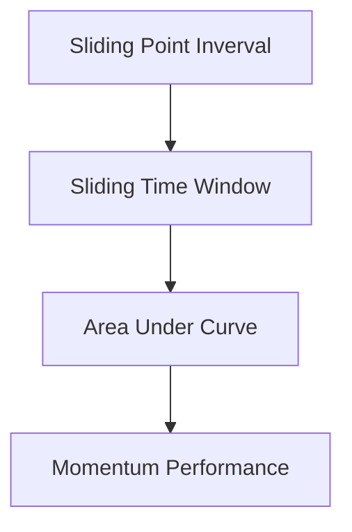
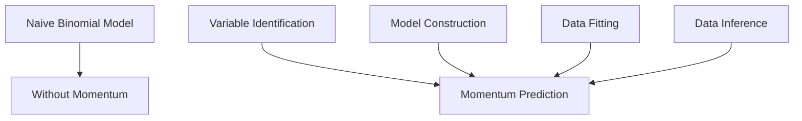
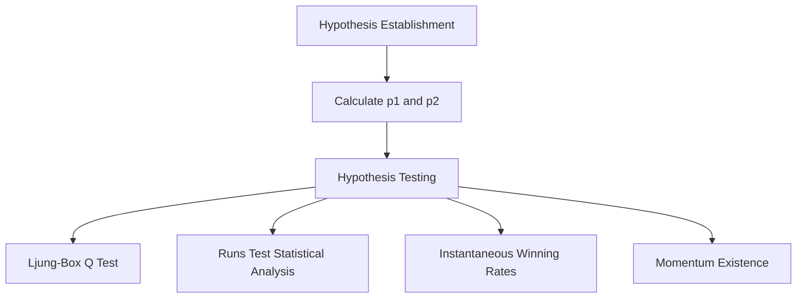
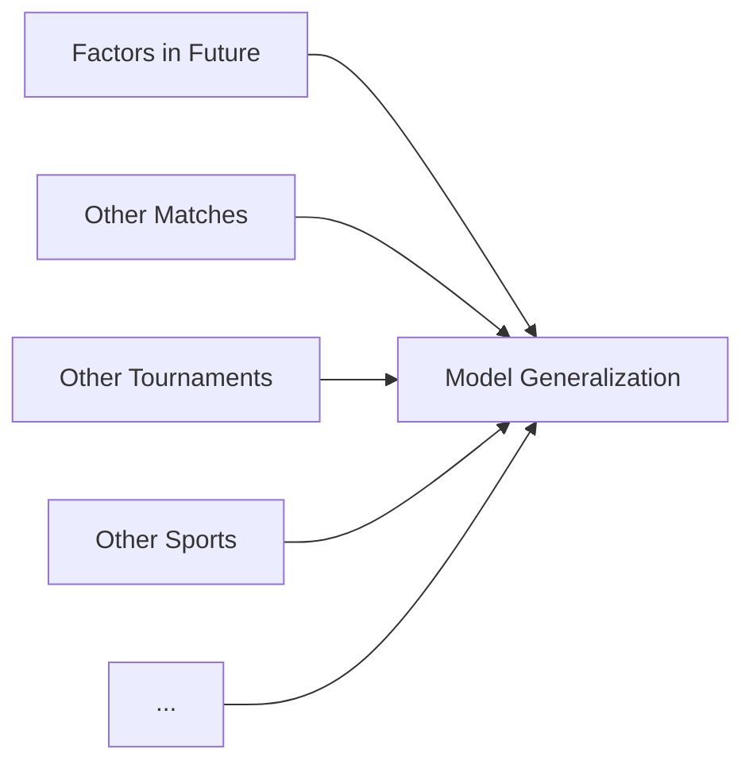
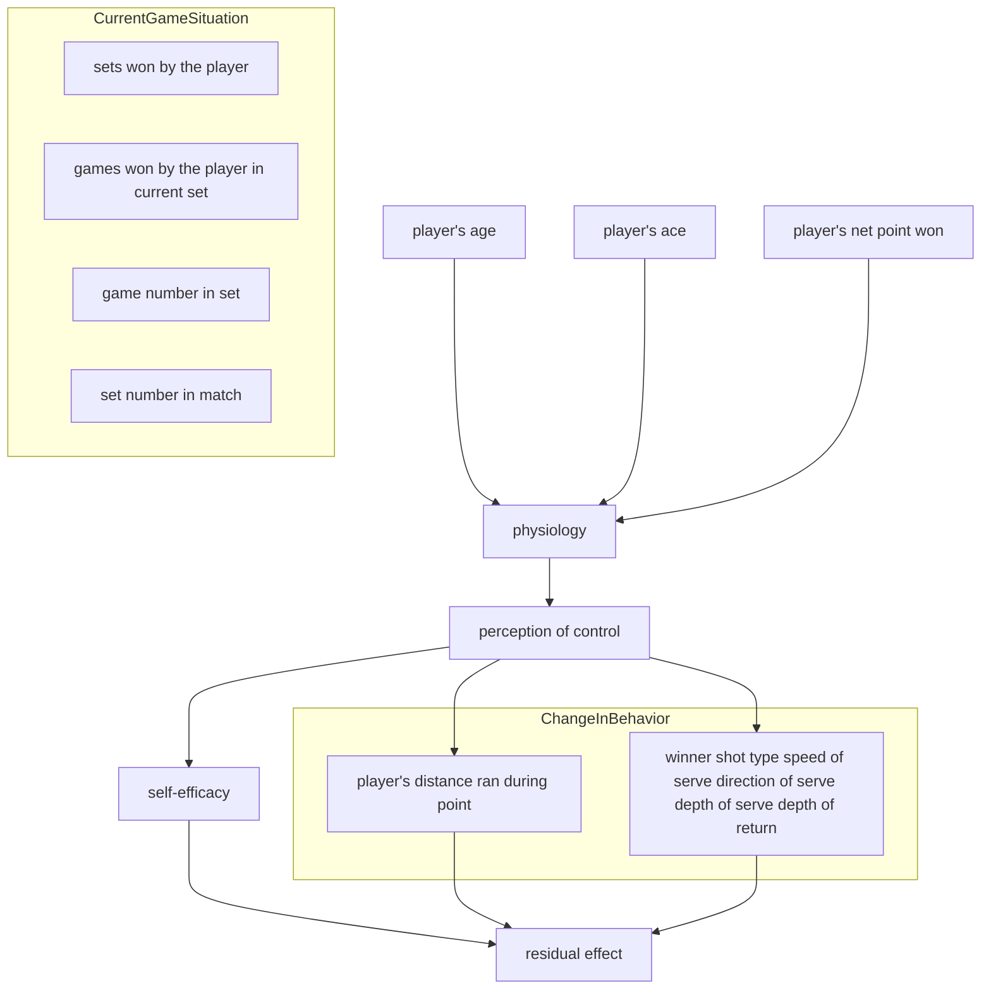
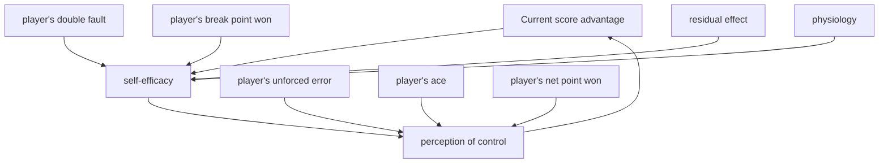

# "Momentum" Exists In Tennis Game As Residual Effect - A Dual-Temporal Bayesian Network Model

Summary

This study investigates tennis match dynamics through sophisticated statistical modeling and a novel Dual-Temporal Bayesian Network approach. By analyzing Wimbledon data, we address five key questions:

Performance Metrics (Problem 1): We introduce a server/returner reweighting strategy to accurately evaluate the performance of a player. We further utilize sliding window and Area Under Curve (AUC) methods to ensure continuity and locality, thus better capturing the fluctuations within the game.

Momentum Existence (Problem 2): Rigorous hypothesis testing (Ljung-Box Q Test and Runs Test) fails to reject null hypothesis of complete randomness. But instantaneous winning rates can reveal slight deviations from randomness, suggesting the presence of subtle momentum effects, albeit not overwhelmingly conclusive.

Momentum Prediction (Problem 3): We take a 2-step approach. We first separate out the momentum effect by considering it as the residual of a Naive Binomial Model. Subsequently, we develop a Dual-Temporal Bayesian Network Model to predict this residual effect. The network incorporates various latent variables such as physiology, perception, and self-efficacy. An additional outcome of this model is the calculation of the importance of factors on momentum through the reduction of information entropy.

Predictive Analysis (Problem 4): Our model is tested on the Wimbledon 2023 competition, where it successfully predicts most match fluctuations. We analyze instances of failure and propose potential future enhancements. The model framework is also applied to an additional dataset of female tennis matches, revealing intriguing differences. Most importantly, we generalize our data into a universal framework for predicting momentum in sports games.

Coaching Strategies (Memo) : Finally, we draft a memo for coaches, synthesizing our findings into statistical findings and targeted recommendations of minimising errors, strategic aggression, resilience building, and more. Our goal is to offer a competitive advantage.

Our findings highlight the complexity of tennis match dynamics, combining rigorous statistical validation with sophisticated predictive modeling. Our model not only demonstrates effective prediction and significant robustness but is also broadly applicable across various sports scenarios.

Keywords: Tennis, Momentum, Bayesian Networks, Statistical Analysis, Performance Metrics.

# Contents

# 1 Introduction 3

1.1 Problem Background 3  
1.2 Clarifications and Restatements 3  
1.3 Our work....3

# 2 Preparation for Modeling 4

2.1 Model Assumptions 4  
2.2 Notations 4  
2.3 Data Cleaning 5

# 3 Problem 1: Probability Difference Evaluation Strategy 5

3.1 Important Impact of Server 5  
3.2 Sliding Point Interval Approach 6  
3.3 Sliding Time Window Approach 7

# 4 Problem 2: Momentum Existence 8

4.1 Hypothesis Testing Preparation 8  
4.2 Ljung-Box Q Test and Runs Test Statistical Analysis 9  
4.3 Instantaneous Winning Rates 10

# 5 Problem 3: Momentum Prediction 11

5.1 The building block: Naive Binomial Model ..... 11  
5.2 Momentum as residual effect 12  
5.2.1 Variable identification 13  
5.2.2 Model Construction 15  
5.2.3 Data fitting 17  
5.2.4 Inference on Match Data 19  
5.2.5 Advisement 19

# 6 Problem 4: Swings Prediction and Model Generalization 20

# 7 Model Analysis 22

7.1 Strengths and Weaknesses 22  
7.2 Sensitivity Analysis 22  
7.3 Conclusion 23

# 8 Memorandum 23

# References 25

# 1 Introduction

# 1.1 Problem Background

The historic Wimbledon 2023 match between Carlos Alcaraz and Novak Djokovic illuminated the profound impact of momentum in tennis. This match not only captivated tennis enthusiasts but also highlighted a complex, yet underexplored, aspect of competitive sports: the ability of players to shift the match's dynamics through "momentum". The significance of momentum in determining match outcomes has become a key area of interest. Volleyball players even use this for allocation decisions $^{[9]}$ . This underscores the need for a sophisticated model that captures the essence of momentum and explains the underlying rationale.

# 1.2 Clarifications and Restatements

Our task revolves around developing a quantifiable model of momentum in tennis, which aims to identify key indicators of momentum shifts, evaluate their impact on match results, and discern the extent to which these shifts can be attributed to skill, strategy, or mere chance. We will do the following steps:

1. create a model that delineates the flow of a tennis match, quantifying player performance over time.  
2. construct a hypothesis testing framework to evaluate whether swings in matches are due to momentum or mere chance.  
3. use our model to predict changes in match dynamics, identifying potential indicators signaling a shift in match.  
4. test the predictive power of our model across various matches, surfaces, and possibly other similar sports, assessing its generalizability.  
5. synthesize our findings into actionable strategies for coaches, aiding them in preparing players for shifts in match dynamics and responding effectively to momentum changes during play.

# 1.3 Our work

In response to this challenge, our approach intertwines statistical analysis, machine learning techniques, and dynamic simulations to forge a comprehensive model of tennis momentum. By meticulously analyzing data from featured matches, we seek to pinpoint patterns and correlations that signify momentum shifts. Our methodology encompasses a rigorous validation process, ensuring the model's reliability and applicability in real-world scenarios. Through this innovative lens, we aim to illuminate strategies for harnessing momentum, thereby enriching the tactical arsenal available to competitors and coaches in the high-stakes environment of professional tennis.

Problem1: Probability Difference Evaluation  

flowchart

Problem3:Momentum as Residual Effect  

flowchart

flowchart

Probalem2:Hypothesis Testing

flowchart

Probalem4:Application and Generalization for Various Cases

Figure 1: Framework of Our Work

# 2 Preparation for Modeling

# 2.1 Model Assumptions

Some fundamental assumptions are listed below.

\- Assumption 1: Factors such as weather, crowd support, and minor injuries do not significantly affect the match outcome.

→Justification: While these factors can influence a match, including them in a model adds complexity and unpredictability. For a broad analysis, it's practical to focus on more measurable and consistent factors.

\- Assumption 2: A player's current world ranking is reliable indicators of their potential performance in an upcoming match.

$\rightarrow$ Justification: Rankings are based on a player's performance in tournaments over a rolling period, reflecting their overall ability.

# 2.2 Notations

Some primary notations are listed below.

Table 1: Notations Table

<table><tr><td>Symbol</td><td>Definition</td></tr><tr><td> $M^1$ </td><td>the probability that player 1 wins a point regardless of the server</td></tr><tr><td>AUC</td><td>Area Under Curve, a measure of model accuracy</td></tr><tr><td>Q</td><td>Ljung-Box statistic</td></tr><tr><td>Z</td><td>Z-score for Runs Test</td></tr><tr><td> $r_1$  or  $r_2$ </td><td>Expected losing round for player 1 or player 2</td></tr><tr><td>B</td><td>Intrinsic probability function of winning a point</td></tr><tr><td>λ</td><td>The parameter determining Duel-Temporal Bayesian Network</td></tr><tr><td>L</td><td>the likelihood of data from 1 match between players</td></tr><tr><td>E</td><td>Momentum effect as difference between actual and expected points</td></tr></table>

# 2.3 Data Cleaning

After observing the Wimbledon\_featured\_matches.csv data set, we handle outlier values in column elapsed\_time (rows 586 to 636), and delete the speed\_mph column because of a significant number of missing values in it, which can impact the whole analysis.

# 3 Problem 1: Probability Difference Evaluation Strategy

# 3.1 Important Impact of Server

Let's consider the change in the points difference between player 1 and player 2 in a match, according to Wimbledon\_featured\_matches.csv data set, we subtract p2\_points\_won data from p1\_points\_won to get points difference, namely:

$$
\text {points difference} = \mathrm{p1} _ {\text {points won}} - \mathrm{p2} _ {\text {points won}} \tag {1}
$$

This formula helps us visualize the flow of a match, as depicted in the graph below, which highlights points difference over time:

line

| Point Number | Points Difference |
| --- | --- |
| 0 | ~-1 |
| 10 | ~1 |
| 20 | ~2 |
| 30 | ~1 |
| 40 | ~-1 |
| 50 | ~1 |
| 60 | ~4 |
| 70 | ~3 |
| 80 | ~-4 |
| 90 | ~-5 |
| 100 | ~-6 |
| 110 | ~-3 |
| 120 | ~0 |
| 130 | ~2 |
| 140 | ~3 |
| 150 | ~2 |
| 160 | ~3 |
| 170 | ~2 |
| 180 | ~5 |
| 190 | ~9 |
| 200 | ~10 |
| 210 | ~12 |
| 220 | ~8 |
| 230 | ~6 |
| 240 | ~5 |
| 250 | ~7 |
| 260 | ~9 |
| 270 | ~11 |
| 280 | ~12 |
| 290 | ~14 |
| 300 | ~16 |

Figure 2: Points Difference for Match 2023-wimbledon-1301

Where two colored dotted lines have also been added: green represents the server from player 1 to player 2, and purple represents the server from player 2 to player 1.

A key observation is that the player currently serving has a higher chance of winning the point, especially when point number = [20, 50] or [180, 220]. However, the overall trend of points difference remains relatively stable, regardless of who serves, indicating that serving alone doesn't drastically shift match momentum. So, we cannot be influenced by who is the server when we try to identify which player is performing better at a given time in the match.

# 3.2 Sliding Point Interval Approach

To further analyse match dynamics, we focus on the probability difference between the players winning a point. In a match, the performance of two players depends on the probability difference $M^{1}$ or $M^{2}$ , $M^{1}$ is the probability that player 1 wins a point regardless of the server, and $M^{2}$ is the probability that player 2 wins a point regardless of the server.

Next, according to the column point\_no in the given data set, we can calculate $p_{1}$ and $p_{2}$ by choosing a fixed length $\omega$ of the data, $p_{1}$ is the probability that player 1 wins a point on serve and $p_{2}$ is the probability that player 2 wins a point on serve, $\omega$ is the point interval. If player 1 serves $n_{1}$ times and player 2 serves $n_{2}$ times (where $w = n_{1} + n_{2}$ ), player 1 wins $x_{1}$ points and player 2 wins $x_{2}$ points, then $p_{1} = \frac{x_{1}}{n_{1}}$ and $p_{2} = \frac{x_{2}}{n_{2}}$ . Actually, we can obtain the performance metric: $\begin{pmatrix} p_{1} & 1 - p_{2} \\ 1 - p_{1} & p_{2} \end{pmatrix}$ . If player 1 and player 2 have the same chance of serving, the ideal value of $p_{1}$ and $p_{2}$ should be equal, then

$$
\binom {M ^ {1}} {M ^ {2}} = \left( \begin{array}{c c} p _ {1} & 1 - p _ {2} \\ 1 - p _ {1} & p _ {2} \end{array} \right) \binom {\frac {1}{2}} {\frac {1}{2}} \tag {2}
$$

When $M^{1} > 0.5$ , it means player 1 performs better than player 2, and for $M^{1} < 0.5$ the opposite. Furthermore, the higher the value, the better the performance of the player 1, thus it can identify which player is performing better at a given time in the match, as well as how much better they are performing.

To visualize the different performance of players 1 and 2, we bring in a rolling window of length $\omega$ . For each match, we can utilize this "rolling window" to calculate the difference between the performance of player 1 and player 2, and combined with cubic spline interpolation, we can plot the corresponding change in the degree of performance, and draw the following curve ( $\omega = 30$ ):

line

| Point Number | Probability Difference |
| --- | --- |
| ~20 | ~0.49 |
| ~30 | ~0.46 |
| ~40 | ~0.54 |
| ~50 | ~0.57 |
| ~60 | ~0.48 |
| ~70 | ~0.25 |
| ~80 | ~0.39 |
| ~90 | ~0.49 |
| ~100 | ~0.63 |
| ~110 | ~0.60 |
| ~120 | ~0.64 |
| ~130 | ~0.52 |
| ~140 | ~0.43 |
| ~150 | ~0.53 |
| ~160 | ~0.65 |
| ~170 | ~0.62 |
| ~180 | ~0.69 |
| ~190 | ~0.58 |
| ~200 | ~0.46 |
| ~210 | ~0.48 |
| ~220 | ~0.35 |
| ~230 | ~0.54 |
| ~240 | ~0.58 |
| ~250 | ~0.68 |
| ~260 | ~0.55 |
| ~270 | ~0.54 |

Figure 3: Probability Difference for Match 2023-wimbledon-1301

Where the abscissa is the total number of points scored in a match (the number

pluses 1 when two players finish a ball, corresponding to the column point\_no in the given data), the ordinate represents the probability difference $M^{1}$ . Compared with Figure 2, we find that the changing of the server has nothing to do with the probability difference, which means comparing with the probability difference is more significant than comparing with the points difference.

From Figure 3, the part above the red line indicates that player 1 (Carlos Alcaraz) is better than player 2 (Nicolas Jarry), and the part below the red line indicates that player 2 (Nicolas Jarry) is better than player 1 (Carlos Alcaraz), besides, the position of the peaks and valleys indicates that the player is performing particularly well.

# 3.3 Sliding Time Window Approach

However, it is not enough to select data points to draw according to the uniform interval of the total score, we should also do even segmentation from the perspective of the time of the game, remember that L represents the length of the time window, $\lambda$ represents the step size of each time window move, replace the point number with $t_{i}$ as the abscissa, $t_{i} = \lambda$ seconds, $2\lambda$ seconds, ... For instance, if L = 600 seconds is used as the length of the time window, two players may play a total of 12 points or 18 points, and then set $\lambda = 60$ seconds as the step size of the time window movement, the result is more reflective of the player's performance and more natural.

By adjusting different $L$ and $\lambda$ , we plot the variation as follows:

line

| Elapsed Time (HH:MM:SS) | Window: 450s, Step: 60s | Window: 600s, Step: 60s | Window: 600s, Step: 90s | Equilibrium Line |
| --- | --- | --- | --- | --- |
| 00:00:00 | ~0.55 | ~0.55 | ~0.55 | 0.5 |
| 00:30:00 | ~0.65 | ~0.65 | ~0.65 | 0.5 |
| 01:00:00 | ~0.0 | ~0.1 | ~0.15 | 0.5 |
| 01:30:00 | ~0.85 | ~0.85 | ~0.85 | 0.5 |
| 02:00:00 | ~0.15 | ~0.15 | ~0.15 | 0.5 |
| 02:30:00 | ~0.95 | ~0.8 | ~0.8 | 0.5 |
| 03:00:00 | ~0.15 | ~0.25 | ~0.25 | 0.5 |
| 03:30:00 | ~0.85 | ~0.75 | ~0.75 | 0.5 |

Figure 4: Performance Evaluation with Different Windows for Match 2023-wimbledon-1301

We can observe from the graph that the player's performance at certain moments is dramatically affected by the length of the time window $L$ while slightly affected by the step size of each time window movement $\lambda$ . Generally, small window introduces noises while large window are unable to depict the rapidly changing dynamic of the game. To solve this, one common method is to apply filters, such as Gaussian filter, which requires a specific kernel function. This requires altering Formula 2. But we here propose a simpler yet equally effective approach named AUC (area under curve), as defined in the following formula:

$$
A (t) = \frac {1}{L _ {\max} - L _ {\min}} \int_ {L _ {\min}} ^ {L _ {\max}} M _ {L} (t) d L \tag {3}
$$

Where $M_{L}(t)$ denotes the performance of one player at time t when considering window length L. In practice we can simply discretize dL to be 1. Similar to kernal-based

methods, AUC also weights the points winning with temporal distance (this can be easily seen by expressing $M_{L}(t)$ as sum of indicator functions then switching the summation order, we skip the details here). The following is the generated graph using this method.

line

| Elapsed Time (HH:MM:SS) | AUC: Avg Performance | Equilibrium Line |
| --- | --- | --- |
| 00:00:00 | ~0.5 | 0.5 |
| 00:30:00 | ~0.75 | 0.5 |
| 01:00:00 | ~0.5 | 0.5 |
| 01:30:00 | ~0.75 | 0.5 |
| 02:00:00 | ~0.6 | 0.5 |
| 02:30:00 | ~0.8 | 0.5 |
| 03:00:00 | ~0.5 | 0.5 |

Figure 5: AUC-Time Plot for Match 2023-wimbledon-1301

From this graph we can determine which player is performing better at a certain time. When the curve is above 0.5, player 1 takes an upper hand, while the contrary happens when player 2 performs better. And the farther the curve's distance from the equilibrium line, the greater the difference between players' performance.

# 4 Problem 2: Momentum Existence

Given our analysis revealing potential patterns in "momentum", we now rigorously examine these observations through hypothesis testing to validate the presence of momentum.

# 4.1 Hypothesis Testing Preparation

We first constructed the Hypothesis Testing Framework:

Null Hypothesis $(H_{0})$ : For a fixed server, the scoring of points by a player is independent and identically distributed $(i.i.d.)$ and thus follows a binomial distribution. Alternative Hypothesis $(H_{1})$ : The complement of $H_{0}$ , suggesting that scoring is not entirely random, and some form of "momentum" or sequence dependency exists.

To evaluate the claim regarding the non-existence of "momentum", we denoted that in any given match, when Player 1 serves, the probability of Player 1 winning a point is $p_{1}$ , and when Player 2 serves, the probability of Player 1 winning a point is $p_{2}$ . The calculation of these probabilities, $p_{1}$ and $p_{2}$ , is explained in Section 3.

For each match, we calculated the winning probabilities by: counting the number of points won and the total number of serves by Player 1 to calculate $p_{1}$ and counting

the number of points won by Player 1 against the total serves of Player 2 to calculate $p_{2}$ .

# 4.2 Ljung-Box Q Test and Runs Test Statistical Analysis

If scoring was entirely random, we would expect no significant autocorrelation between consecutive points.

We separate out the scenarios for Player 1's serve and Player 2's serve and build sequences for each match. Then calculate the autocorrelation for each sequence and Employ an appropriate statistical test (Ljung-Box Q test) to assess whether the sequence's autocorrelation is significant.

The statistic for the Ljung-Box Q test is calculated as follows:

$$
Q = n (n + 2) \sum_ {k = 1} ^ {h} \frac {\hat {\rho} _ {k} ^ {2}}{n - k} \tag {4}
$$

Where: n is the sample size of the time series. h is the maximum number of lags considered for autocorrelation detection. $\hat{\rho}_{k}$ is the sample autocorrelation coefficient at lag k. Q is the Ljung Box statistic, which follows an approximate chi square distribution under the null hypothesis with degrees of freedom h - m, where m is the number of parameters in the model (for simple time series analysis, m is typically taken as m = 0).

The Ljung-Box Q test results for the first match, with a corresponding p-value of 0.497 for autocorrelations up to 10 observations, indicated a p-value greater than common significance levels (e.g., 0.05). The results of other matches are similar. This suggests insufficient evidence to reject the null hypothesis $H_{0}$ .

Then we conducted the runs test to analyze the number of "runs" in a data sequence, where a "run" is defined as a sequence of identical elements occurring consecutively. We calculate the Expected Number of Runs and Variance, and get the Z-Score by:

$$
Z = \frac {(R - E [ R ])}{\sqrt {\operatorname{Var} (R)}} \tag {5}
$$

Where: R represents the actual number of runs. $E[R]$ is the expected number of runs, calculated as $E[R] = 1 + \frac{2n_{1}n_{2}}{n_{1} + n_{2}}$ . $\text{Var}(R)$ is the variance of the number of runs, calculated as $\text{Var}(R) = \frac{2n_{1}n_{2}(2n_{1}n_{2} - n_{1} - n_{2})}{(n_{1} + n_{2})^{2}(n_{1} + n_{2} - 1)}$ . $n_{1}$ and $n_{2}$ are the counts of the two outcomes (e.g., wins and losses) in the sequence.

Then we calculate the P-Value Calculation by: $P = 2(1 - \Phi(|Z|))$ to get the P = 0.691, which is greater than common significance levels (e.g., 0.05) suggests that the hypothesis of the points being i.i.d cannot be dismissed. The results of other matches are similar.

Here we plot the results of 2 methods with different matches. As evidenced by P values exceeding the 0.05 benchmark across various matches except for a few ones, we cannot reject the $H_{0}$ for most matches.

bar_stacked

| Match ID | Wald_Wolfowitz_Runs_Test | Ljung_Box_Q_test |
| --- | --- | --- |
| 0 | ~0.20 | ~0.50 |
| 1 | ~0.29 | ~0.02 |
| 2 | ~0.06 | ~0.44 |
| 3 | ~0.15 | ~0.06 |
| 4 | ~0.25 | ~0.32 |
| 5 | ~0.11 | ~0.00 |
| 6 | ~0.02 | ~0.00 |
| 7 | ~0.00 | ~0.12 |
| 8 | ~0.66 | ~0.11 |
| 9 | ~0.00 | ~0.11 |
| 10 | ~0.14 | ~0.02 |
| 11 | ~0.45 | ~0.22 |
| 12 | ~0.45 | ~0.58 |
| 13 | ~0.33 | ~0.25 |
| 14 | ~0.15 | ~0.06 |
| 15 | ~0.50 | ~0.10 |
| 16 | ~0.33 | ~0.10 |
| 17 | ~0.33 | ~0.16 |
| 18 | ~0.11 | ~0.29 |
| 19 | ~0.00 | ~0.08 |
| 20 | ~0.18 | ~0.05 |
| 21 | ~0.00 | ~0.12 |
| 22 | ~0.12 | ~0.00 |
| 23 | ~0.00 | ~0.00 |
| 24 | ~0.15 | ~0.00 |
| 25 | ~0.23 | ~0.00 |
| 26 | ~0.00 | ~0.20 |
| 27 | ~0.75 | ~0.10 |
| 28 | ~0.00 | ~0.87 |
| 29 | ~0.45 | ~0.05 |
| 30 | ~0.75 | ~0.30 |

Figure 6: feature importance

# 4.3 Instantaneous Winning Rates

To check the i.i.d. argument, inspired by the paper [Sun, Y., 2004] $^{[4]}$ , we employed an instantaneous winning rate approach. This rate refers to the probability of a player winning the next point immediately after winning a point, under a constant server condition. We calculated and compared the instantaneous winning rates in two scenarios: The rate at which Player 1 wins the next point immediately after winning a point while serving and the rate at which Player 1 wins the next point immediately after winning a point against Player 2's serve.

Table 2: Probability of Winning Based on Serving State

<table><tr><td>Player and State</td><td>P of winning when serving</td><td>P of winning when not serving</td></tr><tr><td>Player 2</td><td>0.6874</td><td>0.3406</td></tr><tr><td>Player  $1^{immediate}$ </td><td>0.6978</td><td>0.3498</td></tr><tr><td>Player 2</td><td>0.6594</td><td>0.3126</td></tr><tr><td>Player  $2^{immediate}$ </td><td>0.6683</td><td>0.3261</td></tr></table>

The observed increase in winning rates by around 1% might indicate the influence of momentum, challenging the claim of randomness in scoring sequences within tennis matches.

Delving into the subtleties of the match data revealed an intriguing pattern: players demonstrated a marginally increased probability of securing the next point following a win, whether serving or returning. While the data does not overwhelmingly endorse the notion of momentum, it does quietly nod to its existence.

# 5 Problem 3: Momentum Prediction

# 5.1 The building block: Naive Binomial Model

One immediate issue in identifying "momentum" in competition is that all variables we observe are mixed with the momentum effect and the effect from the skill level difference of the players. In order to "separate out" the effect of momentum, we first develop a naive model without considering any momentum. Or, equivalently, a model under the assumption that the points won are identically distributed random variables. We term this model the Binomial Model, denoted by $BM^{[5]}$ .

To develop this model, we collect the world rank of players as additional prior information ... And convert them into relative rank in 2023 Wimbledon competition. By "relative", we re-rank the 32 players according to their rankings relative to each other, resulting an array of integers between 1 and 32. Then BM is simply a function of $(Rank_{1}, Rank_{2})$ .

Our Binomial model takes the rank of two players then return the "intrinsic probability" of winning a certain point, which under the naive assumption, stay constantly across the whole match.

It's notable that in tennis competition, strength difference between top rank players are often more evident than players with lower ranks. For example, we may expect the difference between rank 1 and rank 2 players larger than the difference between rank 31 and rank 32 players. On the contrary, the notion of "expected losing round" can capture this prior well $^{[5]}$ . Specifically, we define

$$
r _ {1} = 6 - \log_ {2} (R a n k _ {1}) \tag {6}
$$

Consequently, we can define $BM(\mathrm{Rank}_{1},\mathrm{Rank}_{2}):=f_{1}(r_{1},r_{2})$ . Set $f_{2}(x,y)=f_{1}(\frac{x+y}{2},\frac{x-y}{2})$ we have $BM=f_{2}(r_{1}-r_{2},r_{1}+r_{2})$ . We provide the following approximation for $f_{2}$ :

$$
f _ {2} (r _ {1} - r _ {2}, r _ {1} + r _ {2}) = \frac {e ^ {\lambda (r _ {1} - r _ {2})}}{1 + e ^ {\lambda (r _ {1} - r _ {2})}} + s \tag {7}
$$

Where $s > 0$ is the server advantage. Alternatively, we can set the right hand side as $\frac{e^{\lambda(r_1 - r_2) + \mu(r_1 + r_2)}}{1 + e^{\lambda(r_1 - r_2) + \mu(r_1 + r_2)}} + s$ with more parameters.

But during experiment we have found the value of mu to be considerably small thus we ignore it here. Ideally, if the Formula (6) has captured the rank-strength relationship well enough, then this simplification makes sense. Refer to [Klaassen and Magnus, 2001] $^{[2]}$ for further justification.

We then estimate the parameter $\lambda$ on our point-to-point data of 31 matches by maximizing the likelihood.

# Step 1: Likelihood Function

Assuming the outcomes of individual points are independent (an assumption of our naive model), the likelihood of observing the data from a single match between player 1 and player 2, where player 1 wins $n_{1}$ points and player 2 wins $n_{2}$ points, can be represented as a binomial distribution:

$$
L (\lambda , s | n _ {1}, n _ {2}) = \binom {n _ {1} + n _ {2}} {n _ {1}} \left(\frac {e ^ {\lambda (r _ {1} - r _ {2})}}{1 + e ^ {\lambda (r _ {1} - r _ {2})}} + s\right) ^ {n _ {1}} \left(1 - \left(\frac {e ^ {\lambda (r _ {1} - r _ {2})}}{1 + e ^ {\lambda (r _ {1} - r _ {2})}} + s\right)\right) ^ {n _ {2}} \tag {8}
$$

# Step 2: Log-Likelihood

To simplify calculations and to deal with potential numerical underflow, it's common to work with the log-likelihood rather than the likelihood itself.

$$
\log L (\lambda , s | n _ {1}, n _ {2}) = \log \binom {n _ {1} + n _ {2}} {n _ {1}} + n _ {1} \log \left(\frac {e ^ {\lambda (r _ {1} - r _ {2})}}{1 + e ^ {\lambda (r _ {1} - r _ {2})}} + s\right) + n _ {2} \log \left(1 - \left(\frac {e ^ {\lambda (r _ {1} - r _ {2})}}{1 + e ^ {\lambda (r _ {1} - r _ {2})}} + s\right)\right) \tag {9}
$$

# Step 3: Aggregate Log-Likelihood Over All Matches

To estimate $\lambda$ , s using data from all 31 matches, we sum the log-likelihoods across all matches:

$$
\log L (\lambda , s) = \sum_ {\text {matches}} \log L (\lambda , s | n _ {1}, n _ {2}) \tag {10}
$$

# Step 4: Maximizing the Log-Likelihood

Owing to the smoothness of the function, we can easily apply Newton method, which requires the computation of first and second derivative, to iteratively adjust $\lambda$ , s to find the maximum. The optimal value is computed as lambda = 0.0624, s = 0.1742.

# 5.2 Momentum as residual effect

It's easy for us to observe the equivalence between no momentum statement and memoryless statement. "Momentum doesn't exist" $\iff$ "The process of winning points is independent of the past of the game, or in another word, memoryless"

Now by inversing both sides, we can measure the momentum effect as:

$$
E := S - \hat {S} \tag {11}
$$

Where $S$ is the points winning in reality while $\hat{S}$ is the points winning predicted by the Binomial model. Since no strict definition of momentum exists as a statistic. We now use formula (11) to define the value of momentum. This formula can be understand intuitively, as previous critics on momentum often describe it as “seeing something out of randomness.”[4]

In order to design a model to predict the residual, there are several key facts worth noticing:

The reason why "momentum" is so hard to grasp statistically is that this concept implies some "hidden state" exists in the system of sports play. So a generative model is preferred. The direct 1-step prediction can be extremely noisy and thus posing a challenge for effective model-fitting. We need specific approach to reduce the impact of the noise. The influence of past game state should be encoded in this model. And the effect from the past could potentially last for a long time.

Taking all these into account, we introduce our novel Duel-Temporal Bayesian Network. As a variation of normal Dynamical Bayesian Network, it not only constructs a hidden model for the tennis game play, but also encodes long-short term memory from the past, enabling a comprehensive detection of "momentum".

# 5.2.1 Variable identification

In tennis, what's not seen can be just as influential as the scoreboard. For example, a player's sudden surge or dip in performance isn't always from the visible aces or double faults. It's often the hidden triggers – maybe how the match's strain is weighing on their shoulders – that can turn the tide. A tennis game is not only a competition in strength or technique, but also involves complicated psychological and physiological dynamics.

Drawing from the insights of [Taylor J., 1994] $^{[1]}$ , we see that momentum is a complex system of cognition, physiology, and emotion, all sparked by precipitating events and manifesting in performance changes. This paper's concept of a "momentum chain", which suggests that an initial event can trigger alterations in an athlete's cognition, affect, and physiology, leading to behavioral changes that influence performance, resonates with the invisible forces at play in tennis, guiding us to consider latent variables.

Based on this framework, we select 3 latent variables in our model: "Physiology", "perception of control", and "self-efficacy". They play a crucial role in capturing the complex, non-observable factors that influence the momentum swings in a tennis match.

1. Physiology: The physical condition of the players, like fatigue, energy levels, and even subtle injuries.  
2. Perception of Control: This represents a player's ability to control the match.  
3. Self-efficacy: Self-efficacy is a player's belief in their capability, which is the fuel that powers player's persistence.

According to [Taylor J., 1994] $^{[1]}$ , precipitating events, such as specific shots, critical points shift a player's mental and physiological state indirectly. These hidden state are the undercurrents of the game, unseen but vital. Incorporating these into our model allows for a more accurate understanding and prediction of momentum swings.

Then we get the diagram below. The arrows in the following diagram represent influential relationships between various factors. This complex network of influences reflects the multifaceted nature of competitive sports, where physical, mental, and situational factors all intertwine to affect the outcome of a match.

flowchart

Figure 7: Identified Variables

Due to the limitation of our data (only 31 matches), a complicated model like this is prone to overfitting and thus not suitable for robustness prediction. To simplify the model construction, we utilized random forest to search for variables that are insignificant for prediction. Here are some top features:

Table 3: Feature Importance

<table><tr><td>Feature</td><td> $p_{1\_unf\_err}$ </td><td> $p_{2\_winner}$ </td><td> $p_{2\_unf\_err}$ </td><td> $p_{1\_winner}$ </td></tr><tr><td>Importance</td><td>0.120587</td><td>0.111018</td><td>0.101907</td><td>0.094330</td></tr><tr><td>Feature</td><td>server</td><td>rally_count</td><td> $p_{2\_net\_pt\_won}$ </td><td>game_victor</td></tr><tr><td>Importance</td><td>0.084700</td><td>0.081359</td><td>0.047800</td><td>0.043592</td></tr><tr><td>Feature</td><td> $p_{1\_net\_pt\_won}$ </td><td> $p_{2\_distance\_run}$ </td><td> $p_{1\_distance\_run}$ </td><td></td></tr><tr><td>Importance</td><td>0.032918</td><td>0.032348</td><td>0.032152</td><td></td></tr></table>

To simplify our network, we should visualize the correlation between features using a correlation heatmap. This is crucial for feature engineering. The correlation heatmap of the top-10 features shows the relationships between variables that are most predictive of the point victor in a tennis match. Here are some insights from the heatmap:

Unforced Errors ( $p\_1\_unf\_err, p\_2\_unf\_err$ ): These features show a significant correlation with the outcome of points, implying that players' mistakes can crucially influence point results.

Winners (p\_1\_winner, p\_2\_winner): Points won by players due to winning shots are highly correlated with the match outcome.

Serving (server): The role of the server in a point has a notable correlation with

point outcomes.

Physical and Strategic Aspects (rally\_count, p\_1\_net\_pt\_won, p\_2\_net\_pt\_won): These features suggest the physical exertion and strategic play involved in points, such as longer rallies and successful net plays contributing to point outcomes.

This reveals several layers of the game that potentially contribute to momentum, such as the direct impact like unforced errors, winning shots, and the advantage conferred by serving. Additionally, the physical and strategic elements like rally counts and net points could influence a player's dominance during a match as well.

heatmap

| Metric | p1_unf_err | p2_winner | p2_unf_err | p1_winner | server | rally_count | p2_net_pt_won | game_victor | p1_net_pt_won | p2_distance_run | point_victor |
| :--- | :--- | :--- | :--- | :--- | :--- | :--- | :--- | :--- | :--- | :--- | :--- |
| p1_unf_err | 1 | -0.17 | -0.15 | -0.17 | -0.08 | 0.041 | -0.097 | 0.0026 | -0.11 | 0.072 | 0.39 |
| p2_winner | -0.17 | 1 | -0.17 | -0.2 | 0.24 | 0.043 | 0.34 | 0.084 | -0.13 | -0.033 | 0.45 |
| p2_unf_err | -0.15 | -0.17 | 1 | -0.18 | 0.089 | 0.018 | -0.12 | -0.083 | -0.076 | 0.032 | -0.39 |
| p1_winner | -0.17 | -0.2 | -0.18 | 1 | -0.23 | 0.058 | -0.14 | -0.041 | 0.27 | 0.0051 | -0.45 |
| server | -0.08 | 0.24 | 0.089 | -0.23 | 1 | 0.00085 | 0.21 | 0.086 | -0.19 | -0.081 | 0.35 |
| rally_count | 0.041 | 0.043 | 0.018 | 0.058 | 0.00085 | 1 | 0.095 | -0.052 | 0.11 | 0.82 | -0.0075 |
| p2_net_pt_won | -0.097 | 0.34 | -0.12 | -0.14 | 0.21 | 0.095 | 1 | 0.043 | -0.088 | 0.089 | 0.32 |
| game_victor | 0.0026 | 0.084 | -0.083 | -0.041 | 0.086 | -0.052 | 0.043 | 1 | -0.043 | -0.048 | 0.13 |
| p1_net_pt_won | -0.11 | -0.13 | -0.076 | 0.27 | -0.19 | 0.11 | -0.088 | -0.043 | 1 | 0.13 | -0.28 |
| p2_distance_run | 0.072 | -0.033 | 0.032 | 0.0051 | -0.081 | 0.82 | 0.089 | -0.048 | 0.13 | 1 | -0.02 |
| point_victor | 0.39 | 0.45 | -0.39 | -0.45 | 0.35 | -0.0075 | 0.32 | 0.13 | -0.28 | -0.02 | 1 |

Figure 8: Correlation Heatmap of Top-10 Features

# 5.2.2 Model Construction

Through this method, we ascertained and dropped insignificant features such as physiology. The remaining features forms the bedrock of our network. The simplified version is depicted in the following graph:

flowchart

Figure 9: One Building Block of the Bayesian Network

Using this simpler network as one building block, we can stack two blocks together to form our Duel-Temporal Bayesian Network:

flowchart

This flowchart illustrates the relationships between player performance metrics (self-efficacy, perception of control, physiology) and their impact on current scores and outcomes.

Figure 10: Duel-Temporal Bayesian Network

We have added green arrows between hidden variables in these two layers, representing the continuity of mental and physical state.

# 5.2.3 Data fitting

One obstacle for effectively training this model is noise. Although we have taken into account the original strength difference and the serving advantage, we must admit the residual effect of gaining/losing at a certain point is still (and should be still) largely random. Instead of letting the model predict the state in the next point, we let it predict \*\*the sum\*\* of the effect in the next $n$ points. Because of Central Limit Theorem, this reduces the noise and thus making the network's training possible. In the same manner, all the observed variables such as player's double fault is aggregated in a certain time interval. Specifically, suppose the current point index is $t$ , the long-term layer's data is aggregated in $[t - 40, t - 10]$ and the effect in $[t - 10, t]$ , while the short-term layer's data is aggregated in $[t - 10, t]$ and the effect in $[t, t + 10]$ . We carefully separate the past game information and the future game outcome to guarantee our model is completely predictive.

The following graph depicts the shifting of denoised residual effect in the match between Carlos Alcaraz and Djokovic from Carlos' perspective.

line

| Point Number | Raw Residual Effect | Denoised Residual Effect |
| --- | --- | --- |
| 10 | ~-0.6 | ~-0.6 |
| 20 | ~-3.2 | ~-2.2 |
| 50 | ~1.4 | ~1.4 |
| 100 | ~0.3 | ~0.3 |
| 150 | ~-0.6 | ~-0.6 |
| 200 | ~2.3 | ~2.3 |
| 250 | ~-1.8 | ~-1.8 |
| 300 | ~0.2 | ~0.2 |

Figure 11: Denoised Residual Effect Cruve

Due to the existence of latent variables in our model, we utilize the Expectation-Maximization (EM) algorithm to train the network on the data of 31 matches in Wimbledon 2023. EM is used in statistics for finding maximum likelihood estimates of parameters in probabilistic models, where the model depends on unobserved latent variables.

The EM algorithm consists of two steps: the Expectation step (E step) and the Maximization step (M step). In the E step, the algorithm calculates the expected values of the latent variables given the current parameters of the model. In the M step, it maximizes the likelihood function to update the parameters based on these expected values. This process is repeated until convergence.

$$
\textbf {E s t e p :} \quad Q (\theta | \theta^ {(t)}) = \mathbb {E} _ {Z | X, \theta^ {(t)}} [ \log L (\theta ; X, Z) ] \tag {12}
$$

$$
\textbf {M s t e p :} \quad \theta^ {(t + 1)} = \arg \max _ {\theta} Q (\theta | \theta^ {(t)}) \tag {13}
$$

In these equations, $\theta$ represents the parameters of the model, X represents the observed data which consists both the output - residual effect and the input - point-to-point data, Z represents the latent variables(6 latent variables in our model), L is the likelihood function, and Q is a function that depends on the expected values of the latent variables.

During our first training, we spotted an unexpected bias in this dataset: the player 1 has overall better residual effect than the player 2. Consequently, the prior distribution (i.e. when NO evidence provided) of "player 1 has better residual effect" vs "player 2 has better residual effect" predicted by our model is about 53% vs 47%. We could mirror the dataset (i.e. switch the position of player 1 and player 2) but will also double training cost. To solve this in a more general manner, we reweight the expression of $Q(\theta|\theta^{(t)})$ as

$$
\text {Reweighted E step:} \quad Q (\theta | \theta^ {(t)}) = \mathbb {E} _ {Z | X, \theta^ {(t)}} \left[ \frac {1}{P (X)} \log L (\theta ; X, Z) \right] \tag {14}
$$

Where $P(X)$ is the prior of X occurring when considering some of its features - in our case, the residual effect advantage.

For effectively training the network, we need first discretize the variables. The terms residual\_effect\_1(0) and residual\_effect\_1(1) refer to the momentum attributed to the opponent and oneself, respectively. Similarly, unf\_err\_1 ranges from 0 to 2, indicating the relative unforced error levels between players; '0' implies more unforced errors in the opponent, '1' denotes equal levels, and '2' suggests more unforced errors in oneself. As for latent variables, like self\_efficacy\_1 values range from 0 to 1, indicating the relative self-efficacy levels between players; '0' implies higher self-efficacy in the opponent, and '1' suggests higher self-efficacy in oneself.

To measure the importance of variables, we compute the information gain (or equivalently, "entropy reduction") when given each variable. The entropy values provide a measure of uncertainty or unpredictability associated with the predictions of different variables' effects on momentum. A greater information gain indicates greater importance.

bar

| Result for Feature | residual_effect_1(0) - 0.5 | residual_effect_1(2) - 0.5 |
| --- | --- | --- |
| Result for double_diff_1+2: | ~-0.006 | ~0.006 |
| Result for score_advantage_1+2: | ~-0.017 | ~0.018 |
| Result for unit_err_1+2: | ~0.003 | ~-0.002 |
| Result for break_PT_win_1+2: | ~-0.001 | ~0.002 |
| Result for net_PT_win_1+2: | ~-0.026 | ~0.026 |
| Result for arc_1+2: | ~-0.017 | ~0.017 |

(a)

bar

| Result for Feature | Information gain |
| --- | --- |
| Result for double_fault_1+2: | ~0.00010 |
| Result for score_advantage_1+2: | ~0.00088 |
| Result for self_wi_1+2: | ~0.00002 |
| Result for break_PT_wim_1+2: | ~0.00001 |
| Result for net_PT_wim_1+2: | ~0.00195 |
| Result for are_1+2: | ~0.00082 |

(b)  
Figure 12: Differences in Residual Effects and Entropy

As can be seen from the graph, the most substantial positive influence on momentum is from player's net point won, closely followed by aces and maintaining a scoring lead. These results suggest that proactive and aggressive playstyles significantly contribute to a player's momentum. In stark contrast, unforced errors are shown to undermine momentum, emphasizing the importance of consistency and error management in maintaining psychological advantage on the court. Double faults unexpectedly appear to increase momentum slightly. We suspect this is due to the correlation between double fault and aggressive serving. Since the player's aggressiveness isn't identified as variable in our model, the true causal effect is thus hard to learn.

To further clarify the counterintuitive increase in momentum following double faults, our investigation delved into the patterns of serving. Baseline ace rates for servers $p_{1}^{ace}$ and $p_{2}^{ace}$ stood at 9.70% and 8.61%, respectively. Intriguingly, analysis post-double fault revealed an uptick in ace frequency, with player 1's ace rate $p_{1}^{ace next double fault}$ ascending to 10.61% and $p_{2}^{ace next double fault}$ to 9.59% within the ensuing ten serves. This suggests a correlation shortcut or data bias learned by the model.

# 5.2.4 Inference on Match Data

During inference, all observed variables, including long term residual effect are feeding into the model. Based on these known evidence, our Bayesian network can determine the distribution of the output and latent variables, and ultimately, the momentum (as residual effect) in a match. Specifically, given the structure of the network, we can describe the mathematical relationship between these variables' distribution using the conditional dependencies depicted in the network. For computational detail, refer to $[(Ben, 2007)]^{[11]}$ .

# 5.2.5 Advisement

Based on the statistical analysis from our Bayesian network, we propose the following strategies for players to potentially improve their momentum:

1. Minimize Unforced Errors: Prioritize consistency in rallies to avoid giving away momentum through avoidable mistakes.  
2. Leverage Aggressive Plays: Integrate more net approaches and aim for aces to capitalize on these actions' strong positive impact on momentum.  
3. Strategic Serving: Focus on serve accuracy and variety, reducing double faults even though they may not significantly dampen momentum, as maintaining serve is still critical for match success.  
4. Mental Resilience: Develop psychological resilience to withstand the pressure of facing break points, as overcoming them contributes less to momentum than anticipated.  
5. Maintain Lead: Strive to build and maintain a lead, as staying ahead fosters positive momentum and can exert psychological pressure on the opponent.

Incorporating these strategies into training and match-play can help players harness and maintain momentum, which is a pivotal aspect of competitive tennis.

# 6 Problem 4: Swings Prediction and Model Generalization

We first evaluated our model on the final match between Carlos Alcaraz and Novak Djokovic. The outcomes, together with those from three additional matches, are presented in the subsequent graph. It's notable that our model accurately forecasted the first few up and downs of the residual effect, but failed at the 230th 280th points which corresponds to the fourth set. During this phase, Novak Djokovic unexpectedly gained a significant advantage. This is probably due to the effect of factors that our model does not account for.

  
Figure 13: Predicted vs Actual

A possible factor that significantly influences outcomes in tennis is the personal play style of specific players, like surface preferences, injury history. These can only be modeled through their historical performances and can't be inferred through our current approach (i.e. only consider players' rankings). A data-based integration of player's personal information may further boost our model's performance.

Besides, the given Wimbledon dataset, we also test our model on a dataset of women's singles tennis matches from JeffSackmann's tennis\_MatchChartingProject, which is called charting - w - points - 2020s.csv $^{[10]}$ .

bar

| Result for Feature | residual_effect_1(0) - 0.5 | residual_effect_1(2) - 0.5 |
| --- | --- | --- |
| Result for double_dual_1=2: | 0.02 | -0.02 |
| Result for score_advantage_1=2: | -0.01 | 0.01 |
| Result for unit_err_1=2: | 0.025 | -0.025 |
| Result for break_pt_wnm_1=2: | -0.045 | 0.045 |
| Result for net_pt_wnm_1=2: | -0.06 | 0.06 |
| Result for ace_1=2: | -0.01 | 0.01 |

(a)

bar

| Result for Feature | residual_effect_1(0) - 0.5 | residual_effect_1(2) - 0.5 |
| --- | --- | --- |
| Result for double_pair_t_1=2 | 0.02 | -0.02 |
| Result for score_advantage_t_1=2 | -0.01 | 0.01 |
| Result for unit_err_t_1=2 | 0.02 | -0.02 |
| Result for break_pt_win_t_1=2 | -0.04 | 0.04 |
| Result for net_pt_win_t_1=2 | -0.06 | 0.06 |
| Result for ace_t_1=2 | -0.01 | 0.01 |

(b)  
Figure 14: Differences in Residual Effects and Entropy

Compared with Figure 12, one notable distinction is the impact of aces. In our dataset, male players have a 9.14% likelihood of achieving an ace, whereas female players only 4.25%. Additionally, the occurrence of double faults now clearly has a detrimental effect, as it is no longer the result of aggressive attempts to achieve an ace.

To demonstrate the adaptability of our model framework, we further generalize it into a more abstract and comprehensive form, as depicted in the following graph. This framework can be instantiated into models that are capable of dealing all kinds of sports games such as table tennis, basketball, soccer...

flowchart

This flowchart illustrates the relationships between four key factors (Current score advantage, Progress of the competition, Basic Physical Attributes, Individual tactical behavior, Team Tactics, and Offense) and their interactions with self-efficacy, physiology, team communication, and perception of control.

Figure 15: General Framework

# 7 Model Analysis

# 7.1 Strengths and Weaknesses

# Strengths:

1. Captures both short-term and long-term momentum effects through the two-layer structure. This allows the model to account for momentum shifts arising from recent in-game events as well as longer-term psychological factors.  
2. Incorporates latent variables like physiology, perception of control, and self-efficacy that are not directly observable but play an important role in momentum. This provides a more comprehensive representation of the factors influencing momentum.  
3. Uses advanced machine learning techniques like expectation maximization to handle the latent variables and make the model trainable on real match data. This enables practical application of the model.  
4. Achieves good generalization across different players and matches in the dataset, demonstrating robustness.  
5. Provides interpretable insights into how different factors like unforced errors, aggressive plays, break points etc. influence momentum.

# Weaknessess:

1. Difficult to fully validate accuracy of latent variable representations and their dynamics without access to actual measurements of players' psychological states.  
2. Requires aggregation of data over intervals to reduce noise for training, losing some granularity.  
3. Does not account for opponent adaptive strategies and their influence on momentum. Assumes independent player behaviors.

# 7.2 Sensitivity Analysis

To evaluate the robustness of our proposed model, we conduct a sensitivity analysis on two aspects. 1. Modifying the model's prediction interval. 2. Changing the training data by randomly sampling $70\%$ and $50\%$ from the original dataset, corresponding to 22 and 16 matches, respectively.

The following is the altered information gain from observed variables. The changes in the left graph indicate that a longer prediction interval forces the model to prioritize effects with potentially longer durations, such as "score advantage". On the contrary, short-term events like "net point won", "ace" gain less weight. In the right graph, the model trained on 50% appears notable changes, likely due to the altered distribution of matches. On the other hand, the model trained with 70% of the data remained stable, indicating a threshold of data sufficiency.

radar

| Dimension | L=10 | L=12 | L=15 |
| --- | --- | --- | --- |
| Score Advantage | ~0.8 | ~0.9 | ~0.9 |
| Break Point Wen | ~0.4 | ~0.4 | ~0.4 |
| Unforced Error | ~0.5 | ~0.5 | ~0.5 |
| Double Fault | ~0.6 | ~0.6 | ~0.6 |
| Ace | ~0.7 | ~0.7 | ~0.7 |
| Net Point Won | ~0.9 | ~0.9 | ~0.9 |

(a)

radar

| Dimension | All samples | 70% samples | 50% samples |
| --- | --- | --- | --- |
| Score Advantage | ~4.5 | ~4.5 | ~4.5 |
| Net Point Won | ~4.5 | ~4.5 | ~4.5 |
| Ace | ~3.5 | ~3.5 | ~3.5 |
| Double Fault | ~3.5 | ~3.5 | ~3.5 |
| Unforced Error | ~2.5 | ~2.5 | ~2.5 |
| Break Point Won | ~2.5 | ~2.5 | ~2.5 |

(b)  
Figure 16: Differences in Residual Effects and Entropy

# 7.3 Conclusion

In this paper, we establish our momentum predictor through a two-step process. Initially, we develop a naive binomial model aimed at recovering the "ideal" state of the game. Subsequently, the residual of its prediction is utilized as the label for our momentum predictor, the dual-temporal Bayesian network. This model framework, demonstrated to be highly generalizable and robust, allows us to uncover the latent systems underlying observable sports games.

# 8 Memorandum

To: Tennis Coaches

From: Team #2401298

Subject: Leveraging Momentum in Tennis - Insights and Strategies for Coaching

Date: February 6, 2024

Dear Coaches,

We are thrilled to share with you our suggestions derived from our Duel-Temporal Bayesian network model, to enhance player performance through the nuanced concept of "momentum" in tennis. In the dynamic world of competitive tennis, the concept of "momentum" is often cited as a game-changer, potentially turning the tide in pivotal match moments. This elusive force is thought to shape match outcomes. Our research has dissected this phenomenon, aiming to transform the abstract phenomenon into tangible strategies that can be methodically applied.

natural_image

Stylized black-and-white graphic of a tennis player in action, surrounded by swirling motion lines (no text or symbols)

Figure 17: Momentum in Tennis

"Momentum" is not an isolated concept, it represents the existence of complex latent states of tennis matches, beyond what can be captured by simply counting points. Our study analyzed the intricate dynamics of momentum in tennis matches. We have utilized statistical models and a Duel-Temporal Bayesian Network to quantify and predict the influence of psychological and physiological factors on in-game performance. Our analysis suggests that while each point's outcome may appear statistically independent to some extent, the Bayesian network we developed tells a richer story. It reveals the hidden threads of self-efficacy, strategy, and physiological responses that weave together to form the fabric of momentum.

To enable players to harness the positive aspects of momentum while mitigating its pressures, we recommend following strategic pivots:

1. Consistency is Key: Encourage players to minimize unforced errors; our findings link consistent play to maintaining momentum.  
2. Aggressiveness Pays Off: Advise players to assert dominance with net approaches and serves to build positive momentum.  
3. Serve Smart: Emphasize varied and accurate serving techniques to uphold momentum without risking double faults.  
4. Build Resilience: Cultivate players' mental fortitude, essential for navigating the pressures of break points and shifting tides within matches.  
5. Lead to Succeed: Strive for early leads; our model suggests this exerts psychological pressure on opponents, bolstering momentum for the leading player.

We trust this memo provides a clear and actionable strategy for leveraging the concept of momentum to your advantage. Implementing these recommendations could foster a competitive edge, vital for triumphing in the modern, fast-paced game of tennis.

Looking forward to seeing these strategies manifest in your players' enhanced performance.

Yours Sincerely,

Team #2401298

# References

[1] Taylor, J., & Demick, A. (1994). A multidimensional model of momentum in sports. \_Journal of Applied Sport Psychology\_, \_6\_(1), 51-70.  
[2] Klaassen, F. J., & Magnus, J. R. (2001). Are points in tennis independent and identically distributed? Evidence from a dynamic binary panel data model. \_Journal of the American Statistical Association\_, \_96\_(454), 500-509.  
[3] Motoi, S., Misu, T., Nakada, Y., Yazaki, T., Kobayashi, G., Matsumoto, T., & Yagi, N. (2012). Bayesian event detection for sport games with hidden Markov model. \_Pattern Analysis and Applications\_, \_15\_, 59-72.  
[4] Sun, Y. (2004). Detecting the hot hand: An alternative model. In \_Proceedings of the Annual Meeting of the Cognitive Science Society\_ (Vol. 26, No. 26).  
[5] Klaassen, F. J., & Magnus, J. R. (2003). Forecasting the winner of a tennis match. \_European Journal of Operational Research\_, \_148\_(2), 257-267.  
[6] Ge, X., & Lin, A. (2021). Dynamic causality analysis using overlapped sliding windows based on the extended convergent cross-mapping. \_Nonlinear Dynamics\_, \_104\_, 1753-1765.  
[7] Morber, J. R. (2008). \_One-dimensional nanowires: Understanding growth and properties as steps toward biomedical and electrical application\_. Georgia Institute of Technology.  
[8] Madhavan, V. (2016). Predicting NBA game outcomes with hidden Markov models. \_Berkeley University\_.  
[9] Raab, M., Gula, B., & Gigerenzer, G. (2012). The hot hand exists in volleyball and is used for allocation decisions. \_Journal of Experimental Psychology: Applied\_, \_18\_(1), 81.  
[10] https://github.com/JeffSackmann/tennis\_MatchChartingProject.  
[11] Ben Gal I (2007). "Bayesian Networks" (PDF). In Ruggeri F, Kennett RS, Faltin FW (eds.). Support-Page. Encyclopedia of Statistics in Quality and Reliability. John Wiley & Sons. doi:10.1002/9780470061572.eqr089. ISBN 978-0-470-01861-3. Archived from the original (PDF) on 2016-11-23. Retrieved 2007-08-27.