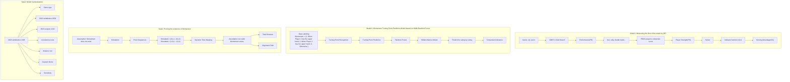

# Unveiling the Dynamics of Tennis

# Summary

The 2023 Wimbledon final witnessed young prodigy Carlos Alcaraz overturn a seasoned champion, also sparking debates on the role of momentum in tennis. In this paper, we build an evaluative model to measure players' dynamic state, validated the existence of momentum, and created a predictive model for momentum swings.

First, after data preprocessing, we introduce the Dynamic Play Index (DPI) to measure match flow. We quantify DPI using a linear combination of performance(PE), personal strength(PS), and serving advantage(SA). Specifically, we quantify PE with probabilities from Gradient Boosting Trees based on Grid Search (GBDT), summarize PS with a six-dimensional evaluation index, and represent SA with a binary variable. Thus, We yield GBDT's optimal parameters: [learning rate: 0.2, max depth: 5, n estimators: 300], and achieve an accuracy of 82.4%. Consequently, we calculate the DPI at each match moment as $DPI = 0.28 \times PE + 0.32 \times PS + 0.4 \times SA$ . Employing this methodology, we effectively delineate the match flow for the 2023 Wimbledon encounter, match ID "2023-wimbledon-1701".

Then, to prove the existence of momentum, we employ a proof by contradiction, initially assuming that momentum does not exist. We combine Gaussian distributions with PS and SA from Task 1. Using these, we simulate scores for 7 matches, from quarter-finals to the final. We compare these simulated scores to actual scores using the Dynamic Time Warping (DTW) algorithm. We find that Model 1's score predictions, implying the presence of momentum, align more closely with actual data, showing a similarity closer to 50% than those of simulations assuming no momentum.

After that, we develop a turning point prediction model using Random Forest Classification and the Hidden Markov Model (HMM). First, we define the momentum based on the performance difference from Model I. Using Random Forest, we predict momentum shift with a 77.6% accuracy rate. Moreover, the model identifies the five most critical indicators for momentum shifts, with the player's consecutive points being the most significant. Next, we employ HMM to explain how different players react to momentum changes and offer four suggestions targeting momentum.

Next, we apply Model II to the men's singles match "wimbledon-1602", the women's singles "wimbledon-2503", and the acrylic surface match "usopen-1102". The model performs slightly better in the first two cases but poorly in the last. Considering recall rates, we suggest incorporating factors like court surface material to refine the model. Additionally, we introduce Gaussian noise to the significant indicators to test sensitivity. The model's accuracy falls $8\%$ , demonstrating robustness.

Finally, we discuss the strengths and weaknesses of our model and report the findings in a memo to the coaches.

Keywords: Dynamic Play Index; Dynamic Time Warping; Random Forest; Hidden Markov Model.

# Contents

# 1 Introduction 3

1.1 Problem Background 3  
1.2 Restatement of the Problem 3  
1.3 Our work 4

# 2 Assumption 4

# 3 Notations 5

# 4 Model I: Measuring the flow of the match by DPI 6

4.1 Model Establishment 6

4.1.1 Data preprocessing 6  
4.1.2 Performance 7  
4.1.3 Personal Strength 9  
4.1.4 Serving Advantage 9

4.2 Model Evaluation 9

# 5 Task 2: Proving the Existence of Momentum 10

5.1 Simulating the Game Process 11  
5.2 Quantifying the similarity 11  
5.3 Assessing the similarity ..... 12

# 6 Model II: Momentum Turning Point Identification and Prediction Model based on HMM-Random Forest 13

6.1 Definition 13

6.1.1 Momentum 13  
6.1.2 Swing 13  
6.1.3 Turning Point 13

6.2 Figuring Out the Main indicators 13  
6.3 Adjusting the Model based on HMM 15  
6.4 The Final Piece of the Model: Situational Leverage ..... 16  
6.5 Results and Advices ..... 16

# 7 Task 4: Model Generalization 18

7.1 2023 Wimbledon Men's Singles 1602: Jannik Sinner VS Novak Djokovic . . 19  
7.2 2023 Wimbledon Women's Singles 2503: Ons Jabeur VS Elena Rybakina . . 19  
7.3 2020 US Open 1102: Alexandre Muller VS Arthur Rinderknech . . . . . . . 20

# 8 Sensitivity Analysis 20

# 9 Strength and Weakness 20

9.1 Strength 20  
9.2 Weakness and Further Discussion ..... 21

# Reference 22

# 10 Memorandum for The Coaches 23

# Appendices 25

# Appendix A Indicators Chosen for Training Random Forest Model 25

# 1 Introduction

# 1.1 Problem Background

In sports, "momentum" is seen as a dual-edged sword, capable of propelling athletes towards victory or serving as a pivotal factor in turning the tide of defeat. It's widely regarded as a crucial determinant of success. However, the real impact of momentum in tennis sparks a heated debate.

Some research supports its significant psychological and physiological impacts on players, influencing match outcomes. For example, Dietl, Helmut, and Cornel Nesseler (2017) found that players have a 54.2% chance of winning the last set after winning the penultimate set. Furthermore, Seidl, Robert, and Patrick Lucey (2022) introduced a counter-factual method for women's tennis, automatically highlighting key match moments with "leverage," "clutch," and "momentum" metrics.

Conversely, other research disputes the impact of momentum, suggesting it may be a psychological illusion rather than a statistically significant factor. For instance, analysis from the US Open men's singles and studies on service point sequences in elite tennis failed to find statistical evidence supporting momentum's influence on match outcomes[3]. Moreover, studies from O'Donoghue, Peter, and Emily Brown propose that the perceived momentum effect might not significantly alter the course of a match, indicating that outcomes could be influenced more by skill and chance than by a momentum-driven psychological advantage[4].

text_image

No statistical evidence supports the
momentum's existence.
Momentum exists as a psychological illusion!

Figure 1: The battle between two parties

Therefore, understanding and quantifying momentum's role is essential for developing adaptive strategies in tennis, providing critical insights for players and coaches to navigate the game's dynamic challenges.

# 1.2 Restatement of the Problem

The challenge at hand involves the analysis of data from the Wimbledon 2023 men's tennis matches with the objective of gaining insights into the concept of "momentum." The primary tasks to be addressed include:

\- Measuring the flow of match: Construct a model that illustrates the progression

of gameplay, enabling the identification of the dominant player at any given moment and quantifying their performance advantage. This should also involve the creation of visual representations of the match flow.

- Momentum existence evaluation: Evaluate the assertion that swings in match play and sequences of success are random events, unaffected by the influence of momentum.  
- Turning point prediction: Develop a system for forecasting instances when the balance of play is likely to shift between players. This should encompass the identification of contributing factors to such changes, along with recommendations for players based on historical patterns of momentum swings.  
- Model testing and generalization: Apply the developed model to additional matches in order to assess its predictive accuracy and investigate its applicability in various contexts, including matches on different playing surfaces and potentially in other sports.  
- Reporting: Produce a comprehensive report that consolidates the findings of the analysis and offers coaching advice regarding the role of momentum and strategies for managing shifts in the flow of play during matches.

# 1.3 Our work

flowchart

Figure 2: Our work

# 2 Assumption

Assumption 1: We assume a player's individual ability remains constant during a match because a player's skill level, physical condition, strategy, and mental state are considered fixed throughout the game. This means any variation in match performance is attributed to external factors or the opponent's play, rather than changes in the player's inherent capability. This assumption simplifies analysis by focusing on match dynamics without accounting for fluctuating player conditions or strategies within the game.

Assumption 2: We assume that a player's ability value can be inferred from existing match data. This is because the data contains detailed records of performances, outcomes, and statistics that, when analyzed, reveal patterns and indicators of a player's skill level. By quantifying these elements, we aim to establish a reliable measure of individual abilities that can inform further analyses and predictions.

Assumption 3: We assume that the player with the serve has an advantage. Because serving initiates play and allows the server to control the game's pace and style from the outset, historical data and professional observations consistently show that players serving have a higher probability of winning the game. This assumption is foundational for analyzing match dynamics and strategies, considering the serve's critical role in tennis.

# 3 Notations

Table 1: Summary of Key Symbols and Their Descriptions

<table><tr><td>Symbol</td><td>Description</td></tr><tr><td>PE</td><td>Performance</td></tr><tr><td>PS</td><td>Personal Strength</td></tr><tr><td>SA</td><td>Serving Advantage</td></tr><tr><td>M</td><td>Number of Models</td></tr><tr><td> $T_m$ </td><td>Decision Tree Obtained from the mth Training</td></tr><tr><td>PWOL</td><td>Percentage of Matches in which the Winner Outscored the Loser</td></tr><tr><td>D</td><td>Distance Between Two Sequences</td></tr><tr><td>Q, A, O, B, Π</td><td>The Parameters of HMM</td></tr><tr><td> $\mathbb{S}\mathbb{L}$ </td><td>Situational Leverage</td></tr><tr><td> $o_{i,t}$ </td><td> $player_i$  lose the tth point</td></tr><tr><td> $w_{i,t}$ </td><td> $player_i$  win the tth point</td></tr></table>

# 4 Model I: Measuring the flow of the match by DPI

Inspired by the concept of dynamic win probabilities seen in chess, we develop the Dynamic Play Index (DPI) to seek the dynamic flow of tennis. This index dynamically reflects a player's performance and likelihood of winning a game, adjusting in real-time with each scored point.

We construct the DPI by considering three primary factors: Performance (PE), Personal Strength (PS), and Serving Advantage (SA). The model is represented by the equation

$$
D P I = \alpha \times P E + \beta \times P S + \gamma \times S A, \tag {1}
$$

where $\alpha$ , $\beta$ , and $\gamma$ denote the weights for each factor. We aim to keep our model straightforward, employing a linear approach to effectively capture the complex dynamics of a tennis match, thus enabling us to quantify and visualize the ebb and flow of play and the relative performance of the players throughout a match.

# 4.1 Model Establishment

# 4.1.1 Data preprocessing

Upon reviewing the data, we identified missing values primarily in four columns: speed\_mph, serve\_width, serve\_depth, and return\_depth. The number of missing values in each column is as shown in the figure. We observed the most significant data gaps in matches 2023-wimbledon-1310 and 2023-wimbledon-1311. In these matches, a large portion of speed\_mph data was missing, along with anomalies in rally\_count (predominantly zeros). The serve speeds for players Guido Pella and Mikael Ymer were absent.

bar

| Category | Number of Missing Values |
| --- | --- |
| serve_width | ~50 |
| serve_depth | ~50 |
| speed_mph | ~750 |
| return_depth | ~1300 |

Figure 3: Missing Value Distribution Plot

When conducting our analysis on performance, we opted to impute the missing values for speed\_mph and rally\_count using median values. This approach helps to mitigate the impact of outliers and maintains consistency in the data.

For the analysis of personal strength, we decided to remove all performance indicators for both players entirely. This decision ensures the accuracy of our analysis

and prevents misleading statistical inferences. By adopting these methods, we aim to provide a reliable and fair assessment of players' capabilities, taking into account the available data.

# 4.1.2 Performance

To assess a player based on the current situation of the game, we establish a metric known as "performance". It's important to note that this evaluation is distinct from considerations of Personal Strength or external factors. To measure a player's performance, we focus on measuring the impact of their actions on the likelihood of winning the current game.

Therefore, we define performance as the chance of a player winning a game, predicted by analyzing various situational factors: p1\_sets, p2\_sets, p1\_games, p2\_games, p1\_current\_point, p2\_current\_point, server, through a Gradient Boosting Trees classification model.

flowchart

This flowchart illustrates a process for generating a best hyperparameter using Gradient Boosting Trees and Grid Search, involving tree structures and parameter optimization.

Figure 4: Gradient Boosting Tree + Grid Search Diagram

In our analysis, the principle of the Gradient Boosting Trees (GBT) classification model is central to quantifying player performance. As we can see on the graph above, this model is an ensemble of decision trees, formulated as an additive model where each tree incrementally improves the model's accuracy. The fundamental expression for a boosting tree model is represented as:

$$
F (x) = \sum_ {m = 1} ^ {M} T _ {m} (x; \Theta_ {m}) \tag {2}
$$

where $F(x)$ denotes the final model, $T_{m}(x;\Theta_{m})$ represents the mth decision tree parameterized by $\Theta_{m}$ , and M is the total number of trees.

The GBT algorithm updates the model iteratively, allowing each subsequent tree to correct the residuals of the predictions from all previous trees. At step m, the model is updated as follows:

$$
F _ {m} (x) = F _ {m - 1} (x) + \alpha T _ {m} (x; \Theta_ {m}) \tag {3}
$$

where $\alpha$ is the learning rate controlling the contribution of each tree. This sequential correction aims to minimize a loss function, L, which for a binary classification problem, often employs the exponential loss function to effectively differentiate between the two classes:

$$
L (y, y ^ {\prime}) = \exp (- y y ^ {\prime}) \tag {4}
$$

Building on the foundational principles of the Gradient Boosting Trees model, we actively employ grid search to optimize its hyperparameters. This approach systematically explores a spectrum of parameter values to identify the set that minimizes the prediction error. By evaluating the model's performance across all possible combinations of predefined hyperparameters, we ensure the refinement and accuracy of our predictions:

$$
\text {Grid Search} = \min _ {\Theta} L (F (x; \Theta), y) \tag {5}
$$

Adapting the Gradient Boosting Trees model to our analysis, it's noteworthy that although the GBT algorithm fundamentally outputs binary classification results—indicating win or loss for each game — we utilize the probability estimated by the classifier for a win as the value of "performance". This method transforms binary win-loss outcomes into a continuous measure of win probability.

Gradient Boosting Trees stand out in this tennis analysis for their precision. This method significantly enhances our capability to predict tennis match results, achieving a prediction accuracy of 82.4% for the final match based on earlier data, thus validating the effectiveness of our performance model.

line

| Points | P(%) |
| --- | --- |
| 0 | ~25 |
| 5 | ~65 |
| 10 | ~68 |
| 15 | ~10 |
| 20 | ~20 |
| 25 | ~10 |
| 30 | ~68 |
| 35 | ~70 |
| 40 | ~88 |
| 45 | ~98 |
| 50 | ~65 |
| 55 | ~99 |
| 60 | ~85 |
| 65 | ~99 |
| 70 | ~50 |
| 75 | ~78 |
| 80 | ~50 |
| 85 | ~95 |
| 90 | ~50 |
| 95 | ~99 |
| 100 | ~75 |
| 105 | ~99 |
| 110 | ~50 |
| 115 | ~99 |
| 120 | ~50 |
| 125 | ~55 |
| 130 | ~90 |
| 135 | ~70 |
| 140 | ~85 |
| 145 | ~93 |
| 150 | ~65 |
| 155 | ~65 |
| 160 | ~85 |
| 165 | ~95 |
| 170 | ~65 |
| 175 | ~98 |
| 180 | ~99 |
| 185 | ~99 |
| 190 | ~99 |
| 195 | ~99 |
| 200 | ~99 |
| 205 | ~99 |
| 210 | ~99 |
| 215 | ~99 |
| 220 | ~99 |
| 225 | ~99 |
| 230 | ~99 |
| 235 | ~99 |
| 240 | ~99 |
| 245 | ~99 |
| 250 | ~99 |
| 255 | ~99 |
| 260 | ~99 |
| 265 | ~99 |
| 270 | ~99 |
| 275 | ~99 |
| 280 | ~99 |
| 285 | ~99 |
| 290 | ~99 |
| 295 | ~99 |
| 300 | ~99 |
| 305 | ~99 |
| 310 | ~99 |
| 315 | ~99 |
| 320 | ~99 |
| 325 | ~99 |
| 330 | ~99 |

Figure 5: Performance for Alcaraz as Points Occur

The graph we present illustrates the performance of Carlos Alcaraz during the final match. In this graph, the x-axis represents the cumulative score between the competitors, while the y-axis indicates his performance. Notably, points where performance exceeds 0.5 are highlighted in bold. This visualization distinctly highlights that, based solely on the scoring dynamics within the match, Alcaraz often found himself in a position of advantage. It's important to note that this metric focuses exclusively on the current score situation, without factoring in individual strengths, serving turns, or other external elements.

# 4.1.3 Personal Strength

In our initial analysis, we focused solely on situational factors. Now, we expand our perspective to include individual player capabilities. Drawing on the research by Fitzpatrick et al. (2019), we utilize the PWOL (Percentage of matches in which the Winner Outscored the Loser) method to identify six key indicators of elite tennis players, summarized as the table below.

Table 2: Summary of Personal Strength

<table><tr><td>Characteristic</td><td>Equation</td><td>PWOL</td></tr><tr><td>1st Serve-Return Win %</td><td>1st serve-return wins/1st serve-returns × 100</td><td>80.2%</td></tr><tr><td>Break Points Won %</td><td>Break points won/Break points played × 100</td><td>68.3%</td></tr><tr><td>0-4 Rally Win %</td><td>Points won 0-4 rally/Points played 0-4 rally × 100</td><td>66.1%</td></tr><tr><td>Avg. 1st Serve Speed</td><td>Mean 1st serve speed</td><td>54.7%</td></tr><tr><td>Aces %</td><td>Aces/Serves × 100</td><td>52.7%</td></tr><tr><td>Double Faults %</td><td>Double faults/Points served × 100</td><td>47.6%</td></tr><tr><td>Untouchable Rate %</td><td>based on p1_winner</td><td>33.4%</td></tr></table>

As to the calculation of Overall Individual Capability, we initially map the actual values of the indicators to a 60-100 scale in order to standardize the range of values. Subsequently, we apply a weighted average calculation based on the PWOL values to derive the player's composite score. This process is encapsulated in the following formula:

$$
P S = \frac {\sum_ {i = 1} ^ {n} \text {IndexScore} _ {i} \times \text {PWOL} _ {i}}{\sum_ {i = 1} ^ {n} \text {PWOL} _ {i}} \tag {6}
$$

where $PS$ is the player's overall strength score, calculated as a weighted average based on key indicators; $IndexScore_{i}$ is the normalized score for the $i$ th indicator, adjusted to a 60-100 scale; $PWOL_{i}$ denotes the weight of the $i$ th indicator, reflecting its importance according to the "Percentage of matches in which the Winner Outscored the Loser".

# 4.1.4 Serving Advantage

We also acknowledge the importance of service in tennis, as studies have shown that players often win more points while serving than receiving (Furlong, 1995; O'Donoghue and Ballantyne, 2004). Therefore, we identify the serving advantage as a key feature in our model. We define this advantage using a binary variable:

$$
S A = \left\{ \begin{array}{l l} 1 & \text {if player i is serving,} \\ 0 & \text {otherwise.} \end{array} \right. \tag {7}
$$

# 4.2 Model Evaluation

Through the examination of relevant literature and parameter tuning practices, we have ultimately determined the weights for three indicators as follows:

$$
\alpha = 0. 2 8, \beta = 0. 3 2, \gamma = 0. 4
$$

line

| Point | DPI of Play1 | DPI of Play2 |
| --- | --- | --- |
| 0 | ~0.78 | ~1.33 |
| 50 | ~1.02 | ~1.08 |
| 100 | ~1.12 | ~1.02 |
| 150 | ~1.05 | ~1.05 |
| 200 | ~1.58 | ~0.52 |
| 250 | ~1.05 | ~1.05 |
| 300 | ~1.25 | ~0.85 |

Figure 6: DPI plot of the final

Consequently, we have plotted the Dynamic Performance Index (DPI) over the scoring sequence of the final match, as illustrated below.

Dividing the total of 334 scoring records of the final match into five segments, each representing a set of the game, and based on the description of the match dynamics, we evaluate whether our model accurately reflects which player is performing better at any given time during the match, as well as the extent of their performance advantage.

- In the first set, Djokovic seemed destined to win easily as he dominated 6 – 1. The DPI curve from points 0 to 45 shows Djokovic's DPI, despite fluctuations, was significantly ahead of Alcaraz.  
- The second set was tense and finally won by Alcaraz in a tie-breaker 7 – 6. The curve section from points 46 to 139 shows the DPI of both players fluctuating and interchanging frequently towards the end, reflecting the intensity of the situation.  
- The third set was a reversal of the first, with Alcaraz winning comfortably 6 – 1. From points 140 to 209, the curve shows that, after some initial intersections, the young Spaniard's DPI significantly leads over Djokovic, mirroring the actual scoreline.  
- In the final two sets, our model showcased its superiority. In the fourth set, the young Spaniard seemed in total control as the set started, but Djokovic took complete control to win the set 6 – 3. This is reflected in our model by the orange curve overcoming the blue.  
- Carrying the edge from the fourth set, Djokovic seemed poised to maintain the lead, but a shift occurred, and Alcaraz gained control, winning 6 – 4. In our model, the blue curve overtakes the orange in the midsection, eventually surpassing Djokovic's representation.

# 5 Task 2: Proving the Existence of Momentum

For task 2, our approach involves employing a method of contradiction by assuming that momentum does not exist in tennis matches. If the conclusions drawn from this assumption significantly diverge from actual data, it would indicate the fallacy of the hypothesis.

# 5.1 Simulating the Game Process

To test the idea that momentum doesn't affect match outcomes, we simulate games without considering momentum. Our simulation uses Gaussian noise, player strength, and serving advantage which come from the model I, as the only inputs. We treat changes in the game and scoring as completely random. This way, we follow tennis rules but ignore momentum, seeing if match results look different from real ones. The pseudocode for this simulation is shown below:

Algorithm 1 Enhanced Simulation of Tennis Matches with Mathematical Notation

for $i = 1$ to $100$ do
    $sets_A, sets_B \leftarrow 0, 0$
    while $(sets_A &lt; 3 \text{and sets}_B &lt; 3) \text{and}(sets_A + sets_B &lt; 5)$ do
        $games_A, games_B \leftarrow 0, 0$
        repeat
            outcome $\leftarrow$ SimulateOutcome($strength_A, strength_B, advantage$)
            $games_A, games_B \leftarrow$ UpdateGames($games_A, games_B, outcome$)
            if CheckSetWin($games_A, games_B$) then
                $sets_A, sets_B \leftarrow$ UpdateSets($sets_A, sets_B, outcome$)
                break
            end if
        until set is decided
    end while
    Output($sets_A, sets_B$)
end for

# 5.2 Quantifying the similarity

In our analysis, we specifically compare sequences of score differences at each point update between two simulations: one that might includes momentum effects and another that assumes outcomes are entirely random. By doing so, we transform the problem of comparing two match's results into the problem of calculating the similarity of two sequences.

However, the length of those two sequences might not be the same, since simulations will not repeat themselves every time. Therefore, we apply Dynamic time warping (DTW) algorithm to calculate the similarity between two unequal-length sequences.

Dynamic Time Warping (DTW) is a renowned technique for analyzing time series, therefore offering a robust solution for comparing sequences that may vary in length or speed.

The mathematical foundation of DTW involves constructing a distance matrix D where each element $D[i, j]$ represents the distance between the ith element of the first sequence and the jth element of the second sequence. The DTW algorithm then finds the path through this matrix that minimizes the total distance, which can be formally described as follows:

$$
D [ i, j ] = \mathrm{distance} (i, j) + \min \{D [ i - 1, j ], D [ i, j - 1 ], D [ i - 1, j - 1 ] \}
$$

where distance $(i, j)$ calculates the distance between the two points from the sequences being compared.

# 5.3 Assessing the similarity

To assess the similarity between the sequences, two primary methods are utilized:

1. Total DTW Distance: The sum of the distances along the optimal path. A lower total distance indicates a higher similarity between the sequences.  
2. DTW Alignment Path: The path through the matrix that minimizes the cumulative distance. Observing how closely the path aligns with the diagonal provides a measure of similarity, as a path near the diagonal suggests a strong correspondence between the sequences.

We selected seven matches from our Model 1 test set for simulation and comparison, including four from the quarterfinals, two from the semifinals, and the final. We generated simulated score sequences using random outcomes and predicted sequences from Model 1. Employing the DTW algorithm, we calculated the Total DTW Distance for both the simulated sequences against the actual data and the Model 1 predictions against the actual sequences. Additionally, we plotted the DTW Alignment Paths to visually compare the simulated and real sequences, as illustrated in the figure below.

roc

| Comparison | Count | Percentage |
| :--- | :--- | :--- |
| Alcaraz vs Rune | 1885 | -73% |
| Medvedev vs Eubanks | 3592 | -43% |
| Rublev vs Djokovic | 475 | +39% |
| Alcaraz vs Djokovic | 3625 | -72% |
| Alcaraz vs Medvedev | 2143 | -80% |
| Sinner vs Safiullin | 1391 | -47% |
| Sinner vs Djokovic | 2361 | -77% |

Figure 7: DTW Alignment Path and Total DTW Distance

From the DTW Alignment Paths displayed in the upper part of the graph, it is evident that the curves of the randomly simulated sequences largely deviate from the diagonal, indicating a significant discrepancy from the actual sequence.

Furthermore, by comparing the DTW distances between the randomly simulated results, Model 1 predicted sequences, and the actual data, we observe that, except for the match between Rublev and Djokovic where both simulated and model-predicted distances are low, our model consistently yields a smaller distance compared to the random sequences in other matches.

In conclusion, the simulated random sequences fail to accurately represent real-world data, while the results from Model 1 provide a better prediction. This evidence disproves the initial hypothesis, thereby substantiating the existence of momentum.

# 6 Model II: Momentum Turning Point Identification and Prediction Model based on HMM-Random Forest

# 6.1 Definition

Building upon our previous findings in Task 2, where we established the existence of momentum, we now define these concepts more explicitly.

# 6.1.1 Momentum

Momentum represents a player's control over the game's dynamics. In the context of this task, we simplify momentum into a binary state, denoted as follows:

$$
\text {Momentum} = \left\{ \begin{array}{l l} 1, & \text {When Player 1 has the upper hand,} \\ 2, & \text {When Player 2 has the upper hand,} \\ 0, & \text {Otherwise.} \end{array} \right. \tag {8}
$$

Momentum is thus classified as either favoring Player 1, Player 2, or neither.

# 6.1.2 Swing

A swing refers to the action of momentum transitioning from 1 to 2 or from 2 to 1. It signifies a significant change in the balance of the match.

# 6.1.3 Turning Point

A turning point corresponds to the moment when a swing in momentum occurs. It is associated with a specific time point during the match and coincides with a change in the score that led to the momentum shift.

# 6.2 Figuring Out the Main indicators

To identify the key indicators that influence momentum shifts, we need to complete two steps:

- First, develop a predictive model to forecast the turning points of momentum shifts.  
- Second, infer the key indicators based on the results of the model.

The Random Forest model aligns perfectly with our requirements for this process.

Therefore, in order to prepare our dataset for training the models, we label each data point with momentum using Model 1's performance predictions. We set a threshold $\omega$ to distinguish momentum for each player: if player1's performance minus player2's $>\omega$ , then the momentum for this point is 1.

Then, after careful filtering, we select 15 variables to train the model, and a detailed list of the variables are listed in the appendix A. And the results are as follows:

Table 3: The best hyperparameter combination by Grid Search

<table><tr><td>max depth</td><td>min samples leaf</td><td>min samples split</td><td>n estimators</td></tr><tr><td>10</td><td>4</td><td>10</td><td>300</td></tr></table>

Based on the results, our Random Forest model achieved an accuracy of 77.6%, and the most relevant factors in predicting ranked by their contribution are:

<table><tr><td>Indicator</td><td>Explanation</td></tr><tr><td>Consistent_scores</td><td>Number of consecutive scores by player in a game</td></tr><tr><td>Rally_count</td><td>Total number of shots in this point</td></tr><tr><td>Distance_run</td><td>Distance run by player in this point</td></tr><tr><td>Winner</td><td>Whether player hits an &quot;untouchable&quot; ball in this point</td></tr><tr><td>Ace</td><td>Whether player scores an ace in this point</td></tr></table>

Table 4: Important Indicators

bar_stacked

| Metric | Player 1 upper | Player 2 upper | No swing |
| --- | --- | --- | --- |
| Consistent scores | ~45% | ~45% | ~45% |
| Rally count | ~35% | ~25% | ~50% |
| Distance run | ~25% | ~15% | ~25% |
| Winner | ~15% | ~10% | ~20% |
| Ace | ~10% | ~10% | ~10% |

Figure 8: The importance of indicators

As the table shows, consistent scores come first. A sequence of consecutive scores by a player generally indicates they are in a period of dominance. When this sequence is broken, it may reveal a vulnerability or a shift in the player's performance, often coinciding with a momentum swing.

Then come the rally count and distance run. A high rally count implies that players are evenly matched, and the conclusion of an intense rally could shift the momentum, especially if followed by a decisive play like a winner or an error. While a player who moves more may be under more pressure, and a sudden increase or decrease in movement can signal a change in match dynamics, potentially pointing to a momentum shift.

What come next are 'winner' and ace. Executing a shot that the opponent cannot reach, or a 'winner,' is a strong indicator of a player seizing the initiative. Additionally, serving an ace is a clear sign of dominance in a game. It not only earns a point without rally but also sends a strong message to the opponent. Aces can contribute to a player's momentum by boosting their confidence and affecting the mental state of the opponent.

# 6.3 Adjusting the Model based on HMM

It seems that the second task can be fully accomplished by the random forest model. However, the word 'different' in the task given inspires us to think about the different reaction players had when they were in faced with different rivals. Therefore, we consider analyzing each player deeply and take their past score into consideration. And Hidden Markov Model (HMM) greatly meets our needs.

In HMM, we consider a system being in one of several hidden states and making transitions between these states. The system emits observable outputs, which are probabilistically determined by its current state. We define the emission probability matrices $B_{1}$ and $B_{2}$ for two distinct states, 'P1 upper' and 'P2 upper', respectively. Each matrix element $P(x_{i}|p_{j}$ upper) represents the probability of observing the outcome $x_{i}$ given the system is in state $p_{j}$ upper, as illustrated in the following diagram:

flowchart

This diagram illustrates a hierarchical model architecture for HMM (Human Machine Model) in a context, showing the flow of inputs from input B1 through upper layers to an 'Equal' layer, and finally to B3, with associated conditional outputs.

Figure 9: How HMM works in our context

The emission probability matrices for states 'P1 upper' and 'P2 upper' are given side by side for comparison:

$$
B _ {1} = \left[ \begin{array}{c} P (x _ {1} | p 1 \text {upper}) \\ P (x _ {2} | p 1 \text {upper}) \\ P (x _ {3} | p 1 \text {upper}) \\ \vdots \\ P (x _ {n} | p 1 \text {upper}) \end{array} \right] \quad B _ {2} = \left[ \begin{array}{c} P (x _ {1} | p 2 \text {upper}) \\ P (x _ {2} | p 2 \text {upper}) \\ P (x _ {3} | p 2 \text {upper}) \\ \vdots \\ P (x _ {n} | p 2 \text {upper}) \end{array} \right]
$$

The initial state distribution, where $P_{1}$ and $P_{2}$ are the prior probabilities for the states 'P1 upper' and 'P2 upper':

$$
\Pi = \left[ \frac {P _ {1}}{P _ {1} + P _ {2}} \times 0. 5, 0. 5, \frac {P _ {2}}{P _ {1} + P _ {2}} \times 0. 5 \right]
$$

The matrices $B_{1}$ and $B_{2}$ can evolve into a third state 'Equal' with its own emission probability matrix $B_{3}$ . This transition is indicative of a system that reaches an equilibrium or a tie between the two states, with $B_{3}$ defined as:

$$
B _ {3} = \left[ \begin{array}{c} P (x _ {1} | \text {equal}) \\ P (x _ {2} | \text {equal}) \\ P (x _ {3} | \text {equal}) \\ \vdots \\ P (x _ {n} | \text {equal}) \end{array} \right]
$$

The transitions between 'P1 upper', 'P2 upper', and 'Equal' states are governed by transition probabilities, which are not shown in the diagram but are essential components of the HMM. Together, these matrices and the transitions between them form the core of the HMM, allowing us to model the sequence of states and corresponding observations for a given process.

Given the strong temporal correlation within each match and that the contest is between two players, we have trained a separate HMM for each match prior to the quarterfinals. These models contain temporal information from the matches and personal data about the two competing players.

# 6.4 The Final Piece of the Model: Situational Leverage

Next, to measure the importance of a scoring point in terms of winning a game, such as when an underdog player has a chance for a break point in the first game, we introduce Situational Leverage. This concept refers to the degree of change in a player's probability of winning the match based on the outcome of the next point, as shown in the equation below:

$$
S L _ {i, j} = P (p e _ {i, j} | w _ {i, t}) - P (p e _ {i, j} | o _ {i, t}) \tag {9}
$$

Here, $P(pe_{i,j}|w_{i,t})$ denotes PE of player i in the game j, assuming he scores in the t-th point of the game. On the other hand, $P(pe_{i,j}|o_{i,t})$ denotes the PE of player i at the t-th point in the game.

# 6.5 Results and Advices

For the final match prediction, we utilized all the previously trained models that included the finalists, players P1 and P2. Each model provided its prediction, and

ultimately, we applied a hard voting mechanism to aggregate these predictions, which is displayed as follows:

line

| Points | Point Differential | Turning Points |
| --- | --- | --- |
| 0 | ~-1 | Yes |
| 25 | ~-7 | Yes |
| 35 | ~-9 | Yes |
| 40 | ~-10 | Yes |
| 45 | ~-10 | Yes |
| 50 | ~-12 | Yes |
| 60 | ~-9 | Yes |
| 70 | ~-8 | Yes |
| 80 | ~-9 | Yes |
| 90 | ~-12 | Yes |
| 100 | ~-9 | Yes |
| 110 | ~-11 | Yes |
| 120 | ~-9 | Yes |
| 130 | ~-11 | Yes |
| 140 | ~-9 | Yes |
| 150 | ~-5 | Yes |
| 160 | ~-4 | Yes |
| 170 | ~-4 | Yes |
| 200 | 0 | Yes |
| 220 | ~8 | Yes |
| 230 | ~6 | Yes |
| 240 | ~6 | Yes |
| 250 | ~2 | Yes |
| 260 | ~2 | Yes |
| 270 | ~3 | Yes |
| 280 | ~-5 | Yes |
| 290 | ~-3 | Yes |
| 300 | 0 | Yes |
| 310 | ~2 | Yes |
| 320 | 0 | Yes |
| 330 | ~1 | Yes |
| 340 | 0 | Yes |

Figure 10: Turning Points Prediction for the Final

The curve in the graph represents the cumulative point difference between Alcaraz and Djokovic, while the solid dots are the turning points marked by our model. It can be noted that most of the turning points are not, as we would usually expect, at the bottoms or tops of the cumulative point difference, but rather at the position after the next point. This is because we believe that to judge whether a point is a turning point, the main consideration should be whether it is the beginning of a reversal in the momentum of offense and defense, and this requires confirmation that this move has indeed achieved a reversal in scoring. From this perspective, we consider the marking of turning points to be quite successful.  
Additionally, compared to the originally labeled data, our model performances well on the final match, as shown in the table.  
Table 5: Model Results

<table><tr><td>Status</td><td>Precision</td><td>Recall</td><td>F1-Score</td><td>Support</td></tr><tr><td>No swings</td><td>0.74</td><td>0.77</td><td>0.76</td><td>142</td></tr><tr><td>Player1 upper hand</td><td>0.81</td><td>0.88</td><td>0.84</td><td>82</td></tr><tr><td>Player2 upper hand</td><td>0.84</td><td>0.74</td><td>0.79</td><td>110</td></tr></table>

In set 2, as illustrated, we observe a tense situation with densely distributed points, indicating frequent momentum shifts between the two players, which is consistent with common understanding. The turning point near 200 is also well-predicted.

line

| Points | DPI of Play1 |
| --- | --- |
| 0 | ~0.78 |
| 25 | ~0.85 |
| 30 | ~0.74 |
| 35 | ~0.90 |
| 40 | ~0.90 |
| 45 | ~1.00 |
| 50 | ~1.07 |
| 60 | ~1.20 |
| 70 | ~1.11 |
| 80 | ~1.11 |
| 90 | ~1.07 |
| 95 | ~1.11 |
| 100 | ~1.13 |
| 105 | ~1.14 |
| 110 | ~1.09 |
| 115 | ~1.11 |
| 120 | ~1.07 |
| 130 | ~1.04 |
| 135 | ~1.03 |
| 140 | ~1.08 |
| 145 | ~0.93 |
| 150 | ~1.11 |
| 160 | ~1.04 |
| 165 | ~1.13 |
| 170 | ~1.03 |
| 200 | ~1.59 |
| 215 | ~1.25 |
| 225 | ~1.18 |
| 235 | ~1.05 |
| 240 | ~1.13 |
| 250 | ~0.86 |
| 260 | ~0.90 |
| 265 | ~0.85 |
| 280 | ~0.90 |
| 290 | ~1.06 |
| 295 | ~1.27 |
| 300 | ~1.27 |
| 305 | ~1.30 |
| 310 | ~1.20 |
| 315 | ~1.16 |
| 320 | ~1.14 |
| 325 | ~1.17 |

Figure 11: When DPI meets turning points

In general, based on the indicators selected from random forest as well as the outputs from HMM and leverages, we prepare 4 advices for coaches:

- Consistency and Dominance: You should instruct players to strive for consistent scoring as it is a hallmark of dominance. A series of uninterrupted points often signifies control over the match. You should prepare players to recognize when their scoring streak is broken as it may indicate a potential shift in momentum and possibly expose their vulnerabilities.  
- Rally Count and Movement: You should encourage players to focus on rally counts and their on-court movement. An elevated rally count usually means well-matched play, and the end of a prolonged rally can be pivotal, leading to a momentum swing, particularly if it ends with a critical winner or an unforced error. You should advise players that increased movement might suggest defensive pressure.  
- Aggressive Play and Service: You should emphasize the importance of executing winners and aces. A winner not only captures the point but also asserts dominance, potentially initiating a momentum shift. Similarly, aces serve dual purposes by securing points effortlessly and exerting psychological pressure on the opponent.  
- Study Your Rival: You should develop strategies based on each player's response to momentum shifts, considering both personal tendencies and the opponent's historical patterns. This includes a thorough pre-match analysis of past performances with respect to momentum changes.

# 7 Task 4: Model Generalization

To test the efficacy of our model in different matches, we selected three separate events for evaluation: the Wimbledon Men's Singles, the Wimbledon Women's Singles, and the US Open (which has a different surface). Note that the data are extracted from the official site of Wimbledon tennis[5].

Tcted from he table below presetrants the performance of our model applied to three different tennis matches, detailing the f1 scores for three scenarios and the overall accuracy for point classification.

<table><tr><td>Match</td><td>0_f1_score</td><td>1_f1_score</td><td>2_f1_score</td><td>Accuracy</td></tr><tr><td>2023-wimbledon-2503</td><td>0.78</td><td>0.82</td><td>0.90</td><td>0.83</td></tr><tr><td>2023-wimbledon-1602</td><td>0.78</td><td>0.88</td><td>0.90</td><td>0.85</td></tr><tr><td>2023-usopen-1102</td><td>0.51</td><td>0.61</td><td>0.65</td><td>0.58</td></tr></table>

Table 6: Report of Our Prediction

# 7.1 2023 Wimbledon Men's Singles 1602: Jannik Sinner VS Novak Djokovic

For the 2023 Wimbledon Championships Men's Singles, we employed the same prediction method as used in the second query, namely the Hidden Markov Model (HMM) for forecasting.

line

| Points | Point Differential | Turning Points |
| --- | --- | --- |
| 1 | ~-1 | -1 |
| 10 | ~1 | — |
| 15 | ~-2 | -2 |
| 20 | ~-4 | -4 |
| 25 | ~-5 | -5 |
| 30 | ~-4 | -4 |
| 35 | ~-4 | -4 |
| 40 | ~-2 | -2 |
| 45 | ~-3 | -3 |
| 50 | ~-1 | -1 |
| 55 | ~-3 | -3 |
| 60 | ~-3 | -3 |
| 85 | ~-8 | -8 |
| 90 | ~-5 | -5 |
| 95 | ~-8 | -8 |
| 105 | ~-5 | -5 |
| 110 | ~-6 | -6 |
| 115 | ~-6 | -6 |
| 120 | ~-7 | -7 |
| 125 | ~-7 | -7 |
| 135 | ~-8 | -8 |
| 140 | ~-8 | -8 |
| 145 | ~-9 | -9 |
| 150 | ~-8 | -8 |
| 155 | ~-9 | -9 |
| 160 | ~-6 | -6 |
| 165 | ~-8 | -8 |
| 170 | ~-7 | -7 |
| 175 | ~-6 | -6 |
| 180 | ~-6 | -6 |
| 185 | ~-5 | -5 |
| 190 | ~-7 | -7 |
| 195 | ~-7 | -7 |
| 200 | ~-9 | -9 |

Figure 12: Turning Points Prediction:1602

# 7.2 2023 Wimbledon Women's Singles 2503: Ons Jabeur VS Elena Rybakina

However, for the Women's Singles and the 2023 US Open Men's Singles, we lacked a pre-trained HMM model. Consequently, we resorted to a combined approach of Random Forest and leverage forecasting for our predictions, the results of which are illustrated in the subsequent table.

line

| Points | Point Differential |
| --- | --- |
| ~2 | ~-1 |
| ~8 | ~-2 |
| ~12 | ~0 |
| ~15 | ~-3 |
| ~28 | ~0 |
| ~32 | ~-2 |
| ~35 | ~0 |
| ~40 | ~-1 |
| ~45 | ~2 |
| ~50 | ~5 |
| ~60 | ~2 |
| ~62 | ~3 |
| ~65 | ~2 |
| ~68 | ~3 |
| ~70 | ~1 |
| ~72 | ~1 |
| ~75 | ~2 |
| ~80 | ~4 |
| ~85 | ~4 |
| ~90 | ~5 |
| ~95 | ~2 |
| ~100 | ~3 |
| ~105 | ~5 |
| ~110 | ~3 |
| ~115 | ~3 |
| ~120 | ~2 |
| ~125 | ~3 |
| ~130 | ~7 |
| ~135 | ~6 |
| ~140 | ~14 |
| ~145 | ~12 |
| ~150 | ~16 |
| ~155 | ~13 |
| ~160 | ~11 |
| ~165 | ~15 |
| ~170 | ~17 |

Figure 13: Turning Points Prediction:2503

# 7.3 2020 US Open 1102: Alexandre Muller VS Arthur Rinderknech

Specifically, for the 2023 US Open Men's Singles, our model did not achieve satisfactory results. We attribute this to a discrepancy between the floor material of the match venue and that of the matches in our training set.

In summary, to enhance the predictive accuracy of our model regarding the momentum turning points in tennis matches, we should consider additional factors such as the court surface material and the altitude of the venue. These elements are potential influencers of match momentum and player performance and merit inclusion in future model training considerations.

# 8 Sensitivity Analysis

Previous Task 4 tested the generalization ability of our model. In this section, we will examine the sensitivity of the model. For the key indicators given by the previous random forest model, we introduce significant Gaussian noise to "consistent scores" and "distance run," and then re-calculate the model's recall metric. As shown in the figure, although there is a decrease in recall, the extent of the decrease is small, demonstrating the excellent robustness of our model.

# 9 Strength and Weakness

# 9.1 Strength

\- Our model uniquely integrates multiple dimensions including athlete performance, personal strength, and serving advantage, offering a comprehensive evaluation of match dynamics.

line

| Points | Point Differential | Turning Points |
| --- | --- | --- |
| 1 | ~-0.8 | 0 |
| 5 | ~2.0 | 2.0 |
| 10 | ~1.0 | 1.0 |
| 12 | ~1.0 | 1.0 |
| 15 | ~2.0 | 2.0 |
| 18 | ~1.0 | 1.0 |
| 22 | ~2.0 | 2.0 |
| 25 | ~1.0 | 1.0 |
| 28 | ~-1.5 | -1.0 |
| 30 | ~-0.8 | -0.8 |
| 35 | ~0.0 | 0 |
| 40 | ~0.0 | 0 |
| 45 | ~1.0 | 1.0 |
| 50 | ~-0.8 | -0.8 |
| 55 | ~1.0 | 1.0 |
| 60 | ~0.0 | 0 |
| 65 | ~-0.8 | -0.8 |
| 70 | ~1.0 | 1.0 |
| 75 | ~0.0 | 0 |
| 80 | ~0.0 | 0 |
| 85 | ~3.0 | 3.0 |
| 90 | ~4.0 | 4.0 |
| 95 | ~5.0 | 5.0 |
| 100 | ~7.0 | 7.0 |
| 102 | ~6.0 | 6.0 |
| 105 | ~5.0 | 5.0 |
| 108 | ~4.0 | 4.0 |
| 110 | ~3.0 | 3.0 |
| 112 | ~4.0 | 4.0 |
| 115 | ~4.0 | 4.0 |
| 118 | ~5.0 | 5.0 |
| 120 | ~5.0 | 5.0 |
| 122 | ~4.0 | 4.0 |
| 125 | ~3.0 | 3.0 |
| 128 | ~3.0 | 3.0 |
| 132 | ~2.0 | 2.0 |
| 135 | ~3.0 | 3.0 |
| 138 | ~2.0 | 2.0 |
| 140 | ~3.0 | 3.0 |
| 142 | ~2.0 | 2.0 |
| 145 | ~3.0 | 3.0 |
| 148 | ~3.0 | 3.0 |
| 150 | ~3.0 | 3.0 |
| 152 | ~3.0 | 3.0 |
| 155 | ~7.0 | 7.0 |
| 160 | ~10.0 | 10.0 |
| 165 | ~9.0 | 9.0 |
| 170 | ~8.0 | 8.0 |
| 175 | ~6.0 | 6.0 |
| 180 | ~8.0 | 8.0 |
| 185 | ~10.0 | 10.0 |

Figure 14: Turning Points Prediction:1102  

bar

| Category | Before | After |
| --- | --- | --- |
| Equal | 0,77 | 0,65 |
| Player1 upper | 0,88 | 0,85 |
| Player2 upper | 0,74 | 0,65 |

Figure 15: Recall before and after Gaussian noise is added

- We have comprehensively modelled the standard international rules of tennis to reflect the differences from the real game.  
- Our model integrates the strengths of both Random Forest and HMM.

# 9.2 Weakness and Further Discussion

- The HMM model is overly reliant on historical data, including the performance of established players and match records, when predicting the outcome of tennis matches.  
- The model performs poorly in generalising to other ball games. Our final selection of metrics using the Random Forest model remains closely related to the

specific metrics of tennis.

# References

[1] Dietl, Helmut, and Cornel Nesseler. "Momentum in tennis: Controlling the match." \*UZH Business Working Paper Series\* 365 (2017).  
[2] Seidl, R., Lucey, P. Live Counter-Factual Analysis in Women's Tennis using Automatic Key-Moment Detection.  
[3] Moss, Ben, and Peter O'Donoghue. "Momentum in US Open men's singles tennis." \*International Journal of Performance Analysis in Sport\* 15.3 (2015): 884-896.  
[4] O'Donoghue, Peter, and Emily Brown. "Sequences of service points and the mis-perception of momentum in elite tennis." \*International Journal of Performance Analysis in Sport\* 9.1 (2009): 113-127.  
[5] "The Championships, Wimbledon." Accessed February 6, 2024. https://www.wimbledon.com/index.html.

# 10 Memorandum for The Coaches

To: Coaches

From: Team #2401445

Subject:

Date: February 6, 2024

The phenomenon of momentum in tennis has long been debated, with the 2023 Wimbledon final serving as a testament to its potential impact. Our study delves into the intricacies of match flow, focusing on the dynamics that drive momentum swings and their predictable patterns.

We developed a Dynamic Play Index (DPI) by integrating data preprocessing techniques and advanced statistical models such as Gradient Boosting Trees and the Hidden Markov Model. Our DPI synthesizes performance metrics, personal strengths, and serving advantages into a comprehensive measure of match flow, yielding insights with 82.4% accuracy.

Understanding and capitalizing on momentum is paramount in competitive tennis. Our data indicates that the following elements are critical in maintaining and exploiting momentum:

- Score Streaks: Teach players to focus on the next point to build and maintain dominance. Recognize and adjust quickly if the streak is broken to prevent momentum shift.  
- Endurance in Rallies: Use high rally counts as a measure of player stamina and competitive edge. Train players to stay mentally engaged and look for opportunities to conclude rallies with strategic plays.  
- Decisive Shots: Encourage players to develop precision in aggressive shots, such as winners and aces, which can change the game's tempo and put psychological pressure on the opponent.  
- Opponent Analysis: Implement drills that mimic rivals' play styles and weaknesses, enabling players to adapt their strategies during actual match play.

In the ebb and flow of a tennis match, players will inevitably face moments that test their resolve and adaptability. Our study highlights several scenarios where preparation can make a significant difference:

- Closing the Gap: Teach players to compartmentalize the score when down, focusing solely on earning the next point. This laser focus can help in gradually diminishing the lead of the opponent.  
- Shifting Back Momentum: Introduce drills where players lose points on purpose and then work to recover, teaching them to identify and counteract momentum shifts.  
- Pressure Points: Simulate break points and tiebreaks in practice sessions, encouraging players to employ specific, practiced responses to these high-stakes moments.

- Break Point Strategies: Have players practice aggressive returns and pinpoint the opponent's weak spots during simulated break opportunities to take charge of the game's flow.  
- Lead Protection: Use drills that start with the player in the lead, emphasizing the need to continue playing offensively to secure the win, rather than passively trying to maintain the lead.

Our predictive model is not only a tool for analysis but a cornerstone for building mental toughness and tactical agility in players. As a coach, your role transcends physical training. You are the architect of your players' mental resilience, equipping them to maneuver through the psychological battles intrinsic to competitive tennis. The strategies we've detailed are crafted to embolden your players, enabling them to confront the challenges of match play with assured confidence and grace.

Transitioning from mental preparation to real-time match analysis, our model excels by offering assessments of a player's dynamic state as the game unfolds. This granular insight into the flow of play is pivotal for making strategic decisions that harness the power of momentum swings. By leveraging this data, you can guide players to make intelligent, on-the-fly adjustments that can alter the course of a match.

It's important to acknowledge, however, that our model, while comprehensive, is not without its limitations. One such area is the nuanced influence of different court surfaces on a player's momentum — a variable that we aim to better understand and integrate into future iterations of the model. This presents an exciting opportunity for further enhancement, ensuring that our tool evolves in line with the complexities of the sport.

In conclusion, the integration of our model into your coaching methodology can be transformative. By translating our insights into practical training exercises, players can be adeptly prepared to exploit the ebb and flow of play, turning what was once an intangible concept into a quantifiable advantage. We are committed to continuous improvement, working alongside you to refine our system and support your efforts in forging champions on the court.

Warm regards,
Team #2401445

# Appendices

# Appendix A Indicators Chosen for Training Random Forest Model

<table><tr><td>Metric (Feature)</td><td>Explanation</td></tr><tr><td>p1_consistent_scores</td><td>Number of consecutive scores by player 1 in a game</td></tr><tr><td>p2_consistent_scores</td><td>Number of consecutive scores by player 2 in a game</td></tr><tr><td>p1_ace</td><td>Whether player 1 scores an ace in this point</td></tr><tr><td>p2_ace</td><td>Whether player 2 scores an ace in this point</td></tr><tr><td>p1_winner</td><td>Whether player 1 hits an &quot;untouchable&quot; ball in this point</td></tr><tr><td>p2_winner</td><td>Whether player 2 hits an &quot;untouchable&quot; ball in this point</td></tr><tr><td>p1_double_fault</td><td>Whether player 1 commits a double fault in this point</td></tr><tr><td>p2_double_fault</td><td>Whether player 2 commits a double fault in this point</td></tr><tr><td>p1_break_pt_won</td><td>Whether player 1 breaks serve in this point</td></tr><tr><td>p2_break_pt_won</td><td>Whether player 2 breaks serve in this point</td></tr><tr><td>p1_break_pt_missed</td><td>Player 1 misses the chance to win the game on player 2&#x27;s serve</td></tr><tr><td>p2_break_pt_missed</td><td>Player 2 misses the chance to win the game on player 1&#x27;s serve</td></tr><tr><td>p1_distance_run</td><td>Distance run by player 1 in this point</td></tr><tr><td>p2_distance_run</td><td>Distance run by player 2 in this point</td></tr><tr><td>rally_count</td><td>Total number of shots in this point</td></tr></table>

Table 7: Tennis Match Metrics

# AI Report

# Query 1: Momentum in Tennis Papers

Input: Could you please help me to find out if there are any relevant papers on momentum in tennis, thanks!

Output: It seems there was an issue retrieving the full text of the papers directly from the websites. However, based on the search results, there are several relevant papers on momentum in tennis, covering aspects such as the psychological and strategic momentum, its effects on match control, and empirical analyses of professional tennis matches. Titles include:

- Momentum in tennis: Controlling the match  
- Separating psychological momentum from strategic momentum: Evidence ...  
- Set-level Strategic and Psychological Momentum in Best-of-three-set ...  
• Strategic and Psychological Momentum in Professional Tennis

# Query 2: Missing Values in Data

Input: Could you please help me to check the data for missing values, and if so, could you please give some proper suggestions to deal with the missing values, thanks!

Output: The dataset contains missing values in the following columns:

- speed\_mph: 752 missing values  
- serve\_width: 54 missing values  
- serve\_depth: 54 missing values  
- return\_depth: 1309 missing values

To deal with these missing values, consider the following strategies:

1. Imputation for numerical and categorical columns.  
2. Deletion of rows or columns with missing values.  
3. Model-Based Methods for predicting missing values.  
4. Use a Flag for Missing Values to indicate missing data.

# Query 3: Tennis Player Ability Evaluation Index

Input: Could you please help me to find information and papers related to the tennis player ability evaluation index, I would like to know if there is an index to quantify it, thank you.

Output: Relevant resources include:

1. Construction of Evaluation Model of Tennis Skills and Tactic Level and Application of Grey Relational Algorithm.  
2. Tennis Players Comprehensive Ability Evaluation using a fuzzy comprehensive evaluation model.  
3. Optimization Analysis of Tennis Players' Physical Fitness Index Based on Data Mining and Mobile Computing with the XGBoost algorithm.

These studies focus on developing comprehensive models for evaluating tennis players' abilities across various factors.