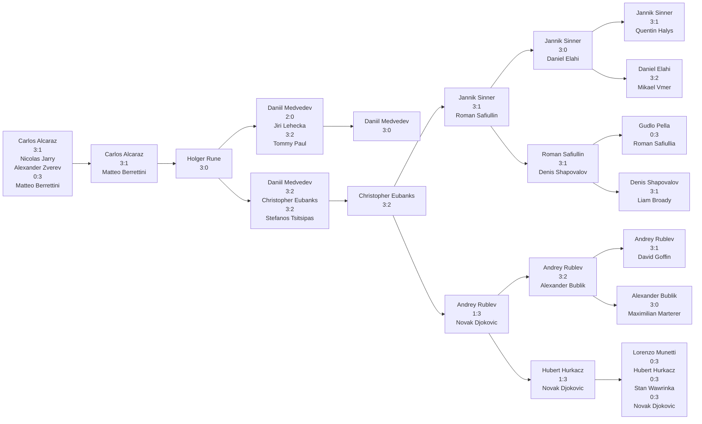
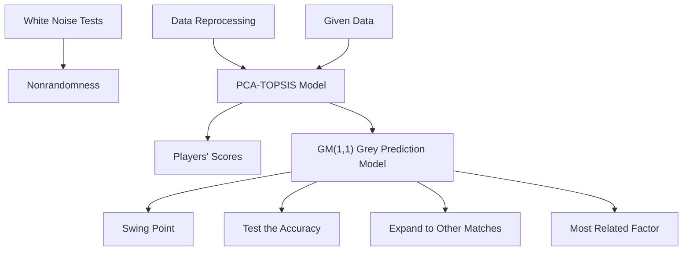
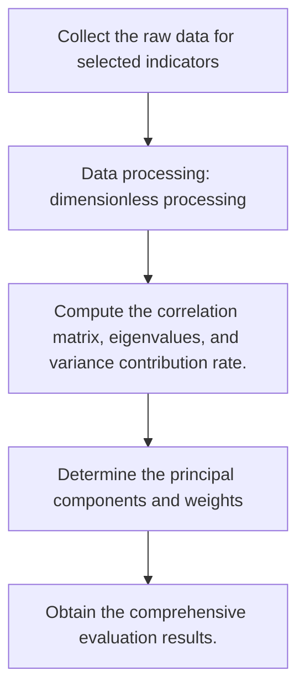
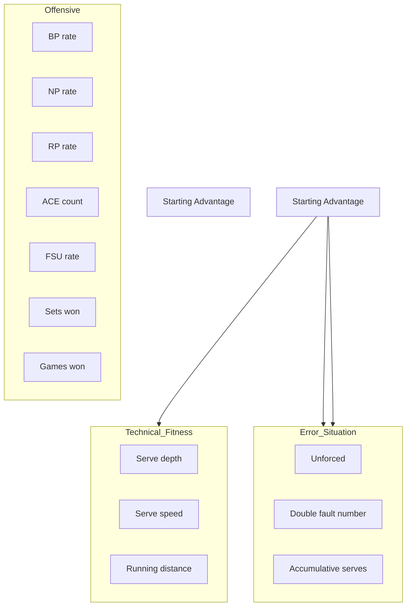

# Harnessing the Power of Momentum: How to Dominate a Tennis Match?

Summary

“Tennis more than any other sport, is a game of momentum.” famous American tennis coach Chuck Kriese said. In tennis, momentum is a powerful and crucial aspect of the match. It’s both mysterious and elusive, making it challenging to harness. To enhance our understanding of momentum and offer valuable match preparation advice to players, we conduct in-depth and close studies on momentum from multiple perspectives and levels.

Firstly, we establish a Point-tracking Evaluation PCA-TOPSIS Model to evaluate each player's performance scores (momentum scores) at different moments in a match. In this model, we integrate the strengths of two different models and developed a comprehensive evaluation system for player performance. Based upon the existing data, we established a holistic assessment framework that encompasses 5 major dimensions and 18 specific indicators. We also create a graph to illustrate the performance score changes of the two players in 2023 Wimbledon Gentlemen's Singles Final. Our results was subjected to KMO and Bartlett's sphericity tests for validation.

Secondly, we conducted a white noise test to verify if the coach's postulation of random match swings is correct. In the Autocorrelation Function and Partial Autocorrelation Function tests, the graphs exhibited first-order truncation and fourth-order tailing respectively. In the Ljung-Box Test and Box-Pierce Test, the p-values were significantly smaller than 0.05, leading to the rejection of the null hypothesis. All these findings indicate that the score fluctuations and match swings are not random, contradicting the coach's belief.

Thirdly, building upon the established momentum scoring system, we introduced the GM(1,1) Grey Prediction Model to forecast the shifts in the match process. A turning point is defined as a significant fluctuation in the score difference of the two players at adjacent moments that exceeds a predefined threshold. Using the grey prediction model, we predicted the turning points in the Final and compared them with the actual data through a line graph. We were pleasantly surprised to find that the predicted turning points largely overlap with the actual data, indicating excellent predictive performance. The average relative error is 0.0378, the absolute correlation is 0.9895, and the mean square deviation ratio is 0.1284. Furthermore, we also examined the relationship between various indicators and the turning points in the game. The major dimension with strongest correlation was offensive efficiency, while the specific indicator with strongest correlation was the cumulative number of games won. Based on these findings, we provided recommendations to the players, emphasizing the importance of proactive attacking strategies and focusing on long-term development.

Lastly, we expanded our model and applied it to other types of matches. We obtained the data from the 2023 Wimbledon Ladies' Singles Final and used our model to predict the turning points. The results showed that the predictive performance was also remarkable, although slightly inferior to the results in the men's matches. Thus, we concluded that the model has good generalizability, but adjustments to the indicators and relevant parameters may be necessary when applying it to different types of matches.

In addition, we perform a sensitivity analysis to evaluate the responsiveness of our model to variations in input parameters. The results demonstrate strong accuracy and robustness in handling different scenarios.

Keywords: Momentum, PCA-TOPSIS Model, White Noise Test, Grey Prediction Model, ACF&PACF

# Contents

# 1 Introduction 3

1.1 Problem Background 3  
1.2 Our Work 4

# 2 Preparation of the Models 4

2.1 Assumptions 4  
2.2 Notations 5  
2.3 Data Cleaning 6

2.3.1 Missing and Abnormal Data 6  
2.3.2 Different Types of Data 6

# 3 TASK1&2: Point-tracking Evaluation PCA-TOPSIS Model 6

3.1 The Structure of PCA-TOPSIS Model 6  
3.2 Select and Process Indicators 7

3.2.1 Select Appropriate Indicators 7  
3.2.2 Data Dimensionless Process 8

3.3 Determine Components and Weights 9  
3.4 Obtain the Scores and Visualization 11

# 4 Task3: The White Noise Tests for Our Model 12

4.1 White Noise Sequence 12  
4.2 Autocorrelation Graph and Partial Autocorrelation Graph Test 12  
4.3 Ljung-Box Test and Box-Pierce Test 13  
4.4 Complete Results and Conclusions 14

# 5 Task4: Momentum Swings GM(1,1) Grey Prediction Model 15

5.1 Data Processing and Examination 15

5.1.1 Construction of New Sequence 15  
5.1.2 Level Comparison Test 15

5.2 Utilize the Model to Obtain the Predicted Values 15  
5.2.1 Build Momentum Swings Grey Forecasting Model 15  
5.3 Model Diagnosis 16

# 6 Task5: Quantify the Impact of Different Factors on the Swings 17

6.1 Gray Relational Analysis 17  
6.2 Advice to a Player Going into a New Match 18

# 7 Task6: Test the Accuracy of the Prediction Model 18

# 8 Task7: Generalize the Model Applicable to Other Matches 19

# 9 Sensitivity Analysis 21

# 10 Model Assessment 21

10.1 Strengths 21  
10.2 Weaknesses 21

# 11 Letter 22

# Appendices 23

# Appendix A Evaluation Criteria 23

# Appendix B Code 24

# 1 Introduction

# 1.1 Problem Background

Tennis is a highly competitive and technically demanding sport that enjoys widespread popularity. In men's singles tennis matches, the outcome is determined by a best-of-five sets format (the first player to win three sets is the winner). Each set is made up of multiple games, with the objective being to win six games and lead the opponent by at least two games. If the score reaches 6-6, a tiebreaker is played to determine the winner of that set. In a tiebreaker, the first player to reach seven points with a minimum lead of two points secures the set victory. However, in the fifth set, the tiebreaker changes to a first-to-ten-points format. Within each game, players strive to win at least four points, but they must secure victory with a two-point advantage.

In tennis matches, the situation often changes in the blink of an eye. This exhilarating sport is a blend of tactics and skills, where every serve, return, or shot can alter the course of the game. Sometimes we witness one player's unstoppable momentum, swiftly securing victory. Other times, we see intense battles where both sides fiercely compete, experiencing numerous lead changes and comebacks before determining a winner, like the duel between Carlos Alcaraz and Novak Djokovic in the 2023 Wimbledon final.


<details>
<summary>flowchart</summary>


</details>

Figure 1: 2023 Wimbledon Gentlemen's Singles

The dynamics and trajectory of a match, including astonishing turnarounds, can be attributed to the players' “momentum”. Momentum has always been emphasized, but quantifying and proving its true impact on the game, as well as identifying the factors that generate and shift momentum, is challenging. To better assist players in achieving success, we will delve into these aspects, providing coaches with advice on helping players prepare for and respond to game-altering events, fully harnessing the power of momentum. Specifically, we will utilize the provided data to carry out the following tasks:

1. Present the changing trends of match results over time.  
2. Evaluate the performance of players at a specific moment.

公众号：蚂蚁竞赛 更多资料请加QQ群1077734962，谢谢！

3. Verify if swings in momentum in a match are random.  
4. Establish a prediction model to forecast shifts in the game situation.  
5. Evaluate factors influencing the swings and provide players with recommendations.  
6. Validate the accuracy of the prediction model in actual matches and optimize them.  
7. Expand the model to other types of matches.

# 1.2 Our Work

To explore the role and influence of “momentum” in tennis matches, we selected different indicators from game data for quantification and analysis. In the first question, we constructed a PCA-TOPSIS model and selected 18 indicators to evaluate player performance and determine their weights. In the second question, we conducted a white noise test on the model results, proving that changes in game momentum are not random and refuting the coach’s viewpoint. In the third question, we further constructed a GM(1, 1) gray prediction model to forecast turning points in the game and determined the factor with the highest correlation coefficient with momentum shifts. In the fourth question, we compared the model with real game data to test its accuracy and extended its application to other matches, making it more widely applicable. Lastly, we test the PCA-TOPSIS model’s sensitivity. The overview of our work is shown in Figure 2.


<details>
<summary>flowchart</summary>


</details>

Figure 2: Overview of Our Work

# 2 Preparation of the Models

# 2.1 Assumptions

The following reasonable assumptions can be made in this paper:

\- The players are in a normal physiological, physical and mental state, without any severe

injuries or using banned substances.

- The players did not engage in any match-fixing or similar activities during the competition.  
- The recording of the values for each player at every moment is accurate, fair, and in accordance with the rules of the competition.  
- The performance of the players on the field is rarely affected by the conditions of the venue, weather, or the atmosphere of the audience.  
- The performance of each player in this game is rarely affected by the results of previous matches, instead concentrating on the current match.

# 2.2 Notations

In our paper, we have adopted the nomenclature presented in Table 1 for model construction. Any additional symbol which is not frequently used will be introduced once they are utilized in the following text. All variables are targeted at a certain set, and the training data for the model also includes data of an entire set. In particular, "so far" and "accumulative" means cumulative value since the very beginning of current set. Definitions without these words means value at current moment.

Table 1: Symbols and Definitions

<table><tr><td>Symbol</td><td>Definition</td></tr><tr><td> $S_i$ </td><td>Number of sets won by player  $i$ </td></tr><tr><td> $G_i$ </td><td>Number of games won by player  $i$ </td></tr><tr><td> $P_i$ </td><td>Number of points won by player  $i$ </td></tr><tr><td> $A_i$ </td><td>Number of untouchable winning serves hit by player  $i$  so far</td></tr><tr><td> $B_i$ </td><td>Player  $i$ &#x27;s break point conversion rate so far</td></tr><tr><td> $N_i$ </td><td>Player  $i$ &#x27;s net point winning rate so far</td></tr><tr><td> $FSu_i$ </td><td>Player  $i$ &#x27;s first serve success rate so far</td></tr><tr><td> $FSc_i$ </td><td>Player  $i$ &#x27;s first serve score rate so far</td></tr><tr><td> $SSc_i$ </td><td>Player  $i$ &#x27;s second serve score rate so far</td></tr><tr><td> $RSc_i$ </td><td>Player  $i$ &#x27;s return score rate so far</td></tr><tr><td> $DF_i$ </td><td>Number of double faults made by player  $i$  so far</td></tr><tr><td> $UE_i$ </td><td>Number of unforced errors made by player  $i$  so far</td></tr><tr><td> $D_i$ </td><td>Player  $i$ &#x27;s distance ran during point</td></tr><tr><td> $V_i$ </td><td>Player  $i$ &#x27;s speed of serve</td></tr><tr><td> $SW_i$ </td><td>Player  $i$ &#x27;s direction of serve</td></tr><tr><td> $SD_i$ </td><td>Player  $i$ &#x27;s depth of serve</td></tr><tr><td> $RD_i$ </td><td>Player  $i$ &#x27;s depth of return</td></tr><tr><td> $SC_i$ </td><td>Player  $i$ &#x27;s accumulative serve count</td></tr><tr><td> $\triangle M$ </td><td>Momentum score difference between two players.</td></tr></table>

$$
i = 1, 2
$$

# 2.3 Data Cleaning

# 2.3.1 Missing and Abnormal Data

We have observed some missing data in speed\_mph, serve\_width, serve\_depth, and return\_depth variables, which is presented as "NA". Considering the continuous nature of the game process, we will not remove entire rows of data. Instead, the missing values in speed\_mph will be replaced with the average value. As for serve\_width, serve\_depth, and return\_depth variables, the missing values will be assigned as 0.

# 2.3.2 Different Types of Data

(1) Data Accumulation in Numerical data For some numerical data in categorical form, they have only two values: 0 and 1. During calculations, an excess of 0s can result in "nan" errors, preventing further computation. To address this, the values will be accumulated. To eliminate the impact of accumulation, they will subsequently be decremented.  
(2) Data Mapping in Non-numeric Data For the non-numerical variables serve\_width, serve\_depth, and return\_depth, we will map them to numbers after rigorous judgements.

- serve\_width: C=1, BC=2, B=3, BW=4, W=5  
- serve\_depth: NCTL=1, CTL=2  
- return\_depth: ND=1, D=2

# 3 TASK1&2: Point-tracking Evaluation PCA-TOPSIS Model

# 3.1 The Structure of PCA-TOPSIS Model

In this section, we need to select specific indicators to track the progress of each match point and the performance of players. The traditional TOPSIS analysis method relies heavily on subjective weighting of indicators, which can significantly influence the results. Therefore, we introduce the relatively objective method, Principal Component Analysis (PCA), to analyze the dataset and reduce dimensionality. Subsequently, we determine the weights for each indicator and rank the proximity of the evaluated objects' numerical distance to the ideal target. This novel PCA-TOPSIS model combines the advantages of both models and enables more accurate tracking of the players' performance at each match point. The structure of our idea can be illustrated by Figure 3.

What's more, each player has significant variations in their playing style, personal level, and other individual factors. Additionally, each game is influenced by multiple complex factors and is subject to frequent changes. Therefore, instead of analyzing the performance of all players in all games using the same model, we choose to build separate models for the performance of each player in each game. This approach provides greater accuracy and relevance.


<details>
<summary>flowchart</summary>


</details>

Figure 3: Schematic of PCA-TOPSIS Model

# 3.2 Select and Process Indicators

# 3.2.1 Select Appropriate Indicators

To evaluate the performance of athletes on the field, we have developed a performance assessment system consisting of five aspects: current situation, offensive effectiveness, error situation, technical fitness, and starting advantage. Each first-level indicator is divided into many second-level indicators. As shown in Figure 4 below.


<details>
<summary>flowchart</summary>


</details>

Figure 4: Performance Assessment System

(1) Current Situation The current situation refers to the on-court position of the athlete up until the present moment, reflecting their scoring breakthrough ability within a certain timeframe. In this regard, we have selected cumulative sets won, cumulative games won, and cumulative points won as

公众号：蚂蚁竞赛 更多资料请加QQ群1077734962，谢谢！

secondary indicators, which respectively reflect the athlete's scoring ability, game breakthrough capability, and set breakthrough capability within a certain timeframe.

(2) Offensive Effectiveness Offensive efficiency refers to the practical effectiveness of the athlete's various technical actions on the court in scoring, reflecting their efficiency and capability in offensive breakthroughs. In this aspect, we have selected ACE count, BP rate (break point conversion rate), NP rate (net points won rate), FSU rate (first serve success rate), FSC rate (first serve points won rate), SSC rate (second serve points won rate), and RP rate (return points won rate) as secondary indicators, all of which are accumulated data within a certain timeframe.  
(3) Error Situation Error situations refer to the occurrence of various mistakes by the athlete on the court, reflecting the stability of their performance in critical moments. In this aspect, we have selected double faults count and unforced error count as secondary indicators, both of which are accumulated data within a certain timeframe.

Among these, double faults count reflects the athlete's serving stability and their ability to capitalize on the advantage of serving first; unforced error count reflects their technical stability.

(4) Technical Fitness Technical and physical abilities refer to the athlete's physical condition and technical choices displayed on the court, reflecting their level of physical fitness and tactical strategy selection. In this aspect, we have selected running distance, serving speed, serving depth, serving direction, and return depth as secondary indicators, all of which are data at the current moment.

Among these, running distance reflects the athlete's physical condition, mobility, and intensity, while also reflecting their running level and tactical choices; serving speed, serving depth, and serving direction reflect their serving technique level and tactical choices; return depth reflects their return technique and tactical choices.

(5) Starting Advantage Serving advantage refers to the relative advantage the athlete possesses as the server, which influences their on-court performance in terms of psychology, match state, and offensive opportunities, among other aspects. In this aspect, we have selected the number of serves as a secondary indicator.

The number of serves represents the accumulated number of serves by the athlete within a certain timeframe. This indicator is used to offset the advantage the athlete has as the server in terms of scoring and offense, in order to obtain a more accurate on-court performance evaluation.

# 3.2.2 Data Dimensionless Process

Dimensionalization refers to the process of removing the dimensionality of different indicators, which makes them incomparable due to the different units of measurement. Therefore, it is necessary to normalize the data first in order to eliminate the dimensional influence. This is done by transforming the original variables to eliminate the influence of their units of measurement, enabling subsequent analysis. In this case, we choose the standardization method to normalize the data, which transforms the values of all indicators to have a mean of 0 and a variance of 1. The formula below takes $S_{i}$ as an example while t means sample point in this time series.

$$
S _ {i} ^ {*} = \frac {S _ {i , t} - \mu (S _ {i})}{\sigma (S _ {i})} \quad i = 1, 2 \tag {1}
$$

# 3.3 Determine Components and Weights

After obtaining standardized data for each indicator, we calculate the covariance and correlation matrix among the variables. Taking $S_{i}$ and $G_{j}$ for example, the calculation formula is shown below.

$$
R _ {S _ {i} ^ {*}, G _ {j} ^ {*}} = \frac {\operatorname{Cov} (S _ {i} ^ {*} , G _ {j} ^ {*})}{\sqrt {\operatorname{Var} (S _ {i} ^ {*}) \cdot \operatorname{Var} (G _ {j} ^ {*})}} \quad i, j \in \{1, 2 \} \tag {2}
$$

The heat map of the correlation coefficient matrix containing all variables is shown in Figure 5. We could clearly see that there is a strong positive correlation between $V_{1}$ and $FSu_{1}$ , the same as the common sense, the faster your serve speed, the more likely you will get your first serve success. We could also see that there is a strong negative correlation between $DF_{1}$ , $UE_{1}$ and $S_{1}$ , $G_{1}$ , $P_{1}$ , which is also intuitive. The more double faults and unforced errors you commit, the less likely you will win, to name but a few.

  
Figure 5: Heat Map of Correlation

According to the characteristic equation $|R - \lambda I| = 0$ , the eigenvalues $\lambda_{k}(k = 1, 2, 3...18)$ are computed. The eigenvalue contribution rate and cumulative contribution rate are represented by formulas (3) and (4) respectively.

$$
T _ {k} = \frac {\lambda_ {k}}{\sum_ {j = 1} ^ {p} \lambda_ {j}} \tag {3}
$$

$$
D _ {k} = \frac {\sum_ {i = 1} ^ {k} \lambda_ {i}}{\sum_ {j = 1} ^ {p} \lambda_ {j}} \tag {4}
$$

Specifically, p in the formula means the number of principal components, in our paper p equals to 18. We select the six largest eigenvalues corresponding to the cumulative contribution rate $D_{k} \geqslant 85\%$ as the principal components. The information contribution rate and the cumulative contribution rate of each principal components is shown in Table 2.

Table 2: Contribution Rate of Principal Components

<table><tr><td>Component</td><td>Information Contribution Rate</td><td>Cumulative Contribution Rate</td></tr><tr><td>1</td><td>39.10%</td><td>39.10%</td></tr><tr><td>2</td><td>16.26%</td><td>55.36%</td></tr><tr><td>3</td><td>13.58%</td><td>68.93%</td></tr><tr><td>4</td><td>6.89%</td><td>75.82%</td></tr><tr><td>5</td><td>5.56%</td><td>81.38%</td></tr><tr><td>6</td><td>5.27%</td><td>86.65%</td></tr><tr><td>7</td><td>3.63%</td><td>90.28%</td></tr><tr><td>8</td><td>3.18%</td><td>93.46%</td></tr><tr><td>9</td><td>2.01%</td><td>95.47%</td></tr><tr><td>10</td><td>1.35%</td><td>96.82%</td></tr><tr><td>11</td><td>1.27%</td><td>98.09%</td></tr><tr><td>12</td><td>0.87%</td><td>98.89%</td></tr><tr><td>13</td><td>0.52%</td><td>99.41%</td></tr><tr><td>14</td><td>0.25%</td><td>99.66%</td></tr><tr><td>15</td><td>0.15%</td><td>99.81%</td></tr><tr><td>16</td><td>0.08%</td><td>99.89%</td></tr><tr><td>17</td><td>0.05%</td><td>99.94%</td></tr><tr><td>18</td><td>0.01%</td><td>100%</td></tr></table>

After calculation, the eigenvectors of the sixth largest eigenvalues are shown in Figure 6.

<table><tr><td>Indicator</td><td>1</td><td>2</td><td>3</td><td>4</td><td>5</td><td>6</td></tr><tr><td>S</td><td>0.3141</td><td>0.1361</td><td>0.3539</td><td>0.3303</td><td>-0.2017</td><td>0.2687</td></tr><tr><td>G</td><td>-0.2509</td><td>0.1995</td><td>-0.1737</td><td>-0.2051</td><td>0.2341</td><td>0.1327</td></tr><tr><td>P</td><td>0.0147</td><td>0.1237</td><td>0.0459</td><td>0.0309</td><td>0.4024</td><td>0.0991</td></tr><tr><td>A</td><td>0.2498</td><td>-0.6152</td><td>0.0717</td><td>0.0375</td><td>0.1913</td><td>-0.3198</td></tr><tr><td>B</td><td>0.0556</td><td>-0.0314</td><td>0.0653</td><td>0.1136</td><td>-0.1435</td><td>-0.2424</td></tr><tr><td>N</td><td>0.0272</td><td>-0.0813</td><td>0.06</td><td>0.1624</td><td>0.1308</td><td>-0.2495</td></tr><tr><td>FSu</td><td>0.1029</td><td>-0.6193</td><td>-0.0975</td><td>-0.2994</td><td>0.0929</td><td>0.3146</td></tr><tr><td>FSc</td><td>0.1479</td><td>-0.2073</td><td>0.0213</td><td>0.0223</td><td>0.1766</td><td>0.2622</td></tr><tr><td>SSc</td><td>0.0546</td><td>0.0876</td><td>0.0083</td><td>-0.13</td><td>0.0613</td><td>-0.5214</td></tr><tr><td>RSc</td><td>0.1159</td><td>0.0673</td><td>0.0759</td><td>0.0089</td><td>-0.0045</td><td>-0.4324</td></tr><tr><td>DF</td><td>-0.037</td><td>-0.0305</td><td>-0.041</td><td>-0.0521</td><td>0.0149</td><td>0.0412</td></tr><tr><td>UE</td><td>-0.1677</td><td>0.0011</td><td>-0.0972</td><td>0.1041</td><td>-0.0617</td><td>0.136</td></tr><tr><td>D</td><td>-0.5621</td><td>-0.1858</td><td>-0.1521</td><td>-0.1191</td><td>0.0042</td><td>-0.1685</td></tr><tr><td>V</td><td>-0.286</td><td>-0.2102</td><td>-0.2053</td><td>0.809</td><td>-0.5104</td><td>0.0083</td></tr><tr><td>SW</td><td>0.2692</td><td>0.0876</td><td>-0.8185</td><td>0.0404</td><td>-0.2919</td><td>-0.0345</td></tr><tr><td>SD</td><td>0.4667</td><td>0.1195</td><td>-0.2572</td><td>0.038</td><td>0.2096</td><td>-0.0118</td></tr><tr><td>RD</td><td>-0.0751</td><td>-0.001</td><td>0.0351</td><td>-0.1219</td><td>0.4807</td><td>-0.0239</td></tr><tr><td>SC</td><td>0.0000</td><td>0.0000</td><td>0.0000</td><td>0.0000</td><td>0.0000</td><td>0.0000</td></tr></table>

Figure 6: Corresponding Eigenvectors of the First Six Largest Principal Components

The table above displays the eigenvalues of the six principal components extracted from the indicator data of Player 1 in the final matches. The six principal components have varying emphasis on each indicator, and here we will provide a detailed explanation using Player 1 as an example, with Player 2 following a similar pattern.

In the first and fifth columns, the eigenvalues with larger absolute values are concentrated in the fourth aspect of the evaluation system. The two indicators with the largest absolute eigenvalues in the first column are running distance and serving depth, while the two indicators with the largest absolute eigenvalues in the fifth column are serving speed and return depth. This reflects that the emphasis of the first and fifth principal components is on the athlete's technical and physical abilities.

In the second and sixth columns, the eigenvalues with larger absolute values are concentrated in the second aspect of the evaluation system. The two indicators with the largest absolute eigenvalues in the second column are the number of aces and first serve success rate, while the two indicators with the largest absolute eigenvalues in the sixth column are second serve points won rate and return points won rate. This reflects that the emphasis of the second and sixth principal components is on the athlete's offensive efficiency.

In the third and fourth columns, the eigenvalues with larger absolute values are scattered in the first and fourth aspects. The two indicators with the largest absolute eigenvalues in the third column are serving direction in the fourth aspect and cumulative sets won in the first aspect, while the two indicators with the largest absolute eigenvalues in the fourth column are serving speed in the fourth aspect and cumulative sets won in the first aspect. This reflects that the third and fourth principal components have a combined emphasis on the athlete's current situation, technical and physical abilities.

We have factored the serve into our model as $SC_{i}$ , while the eigenvalues of the serve count feature in all six principal components are extremely low, indicating that the impact of the serve count on the overall evaluation system is negligible. This could be caused by that although in tennis the player serving had a much higher probability of winning the point, the two athletes take turns serving, and over time, the serve count of the two athletes tends to be equal. As a result, the role of the serve count indicator in the evaluation system in distinguishing between the two players approaches zero, and therefore, its contribution to the information is very subtle.

Therefore, we extract 6 new variables to replace the original 18 indicators. Based on the coefficients of the indicators, we obtain the principal component decision matrix.

$$
W = (w _ {i j}) \in \boldsymbol {R} ^ {1 8 \times 6} \tag {5}
$$

Then, we calculate the weight $W_{i}$ of each principal component by dividing the eigenvalue $\lambda_{i}$ of that principal component by the sum of all eigenvalues. The weights of the principal components are identical to their information contribution rate, namely $W_{1}=0.3910$ , $W_{2}=0.1626$ , $W_{3}=0.1358$ , $W_{4}=0.0689$ , $W_{5}=0.0527$ , $W_{6}=0.0363$ .

# 3.4 Obtain the Scores and Visualization

We could obtain the scores simply multiply three matrices.

$$
S = Z W I \in \boldsymbol {R} ^ {t \times 1}, Z \in \boldsymbol {R} ^ {t \times p}, W \in \boldsymbol {R} ^ {p \times h}, I \in \boldsymbol {R} ^ {h \times 1} \tag {6}
$$

S means Score Matrix, Z means Standardized Data Matrix, I means Information Contribution Rate Matrix, t means the number of time sample points, p means the number of original variables, h means the number of principal components we selected.

Based on this result, we can determine the performance scores, namely "momentum" for each player in the whole match, representing the potential outcome of the game. We choose the Final between Carlos Alcaraz and Novak Djokovic for visualization, as shown in Figure 7 below.


<details>
<summary>line</summary>

| time | player1 | player2 |
| --- | --- | --- |
| 0 | 0 | 0 |
| 10 | ~-0.1 | ~-0.05 |
| 20 | ~-0.1 | ~-0.05 |
| 30 | ~0.35 | ~0.1 |
| 40 | ~0.15 | ~0.05 |
| 50 | ~-0.25 | ~-0.1 |
| 60 | ~-0.15 | ~-0.05 |
| 70 | ~0.15 | ~0.05 |
| 80 | ~-0.25 | ~-0.05 |
| 90 | ~-0.7 | ~-0.25 |
| 100 | ~-0.35 | ~-0.15 |
| 110 | ~0.15 | ~0.1 |
| 120 | ~-0.3 | ~-0.05 |
| 130 | ~0.45 | ~0.2 |
| 140 | ~0.05 | ~0.05 |
| 150 | ~-0.1 | ~-0.05 |
| 160 | ~-0.2 | ~-0.15 |
| 170 | ~0.05 | ~0.05 |
| 180 | ~0.1 | ~0.15 |
| 190 | ~0.25 | ~0.05 |
| 200 | ~0.05 | ~0.05 |
| 210 | ~0.3 | ~0.05 |
| 220 | ~-0.15 | ~0.05 |
| 230 | ~0.8 | ~0.05 |
| 240 | ~0.05 | ~0.05 |
| 250 | ~0.2 | ~0.05 |
| 260 | ~0.15 | ~0.05 |
| 270 | ~0.25 | ~0.05 |
| 280 | ~-0.1 | ~0.05 |
| 290 | ~0.4 | ~0.15 |
| 300 | ~-0.4 | ~-0.15 |
| 310 | ~-0.3 | ~-0.1 |
| 320 | ~0.15 | ~0.1 |
| 330 | ~0.25 | ~0.05 |
| 340 | ~0.05 | ~0.15 |
| 350 | ~0.05 | ~0.05 |
</details>

Figure 7: Score Trend Chart

We conduct the KMO and Bartlett's test of sphericity on the model results. The KMO test yields a value of 0.8263, and the p-value of the Barlett's sphericity test was less than 0.01, indicating that our analysis results are relatively reliable. Please refer to the KMO Test Evaluation Criteria in Appendix A.

# 4 Task3: The White Noise Tests for Our Model

# 4.1 White Noise Sequence

According to Wikipedia, a white noise sequence is a common random process in statistics and signal processing. It possesses specific characteristics that result in a uniform distribution of energy across all frequencies, consisting of a series of mutually independent random variables with identical probability distributions. These random variables have no correlation with each other, thus exhibiting complete temporal independence. This means that each value in the sequence is independently generated from the same probability distribution. The white noise test can be used to assess whether a stationary sequence is random before making predictions.

With an aim to confirm or falsify the coach's conjecture, we have made a synonymous conversion, examining whether the generated time series of athlete performance scores, which could be approximately considered as explicit expression of implicit state, namely athlete's momentum, are random sequences. Hence, we employ the white noise test to assess the randomness of fluctuations.

# 4.2 Autocorrelation Graph and Partial Autocorrelation Graph Test

By definition, white noise is a series of independent random variables with the same distribution, uncorrelated over time, meaning each value is generated independently. Under ideal conditions, except for the zero-order autocorrelation coefficient which is 1, for all k > 0, the autocorrelation coefficient with a lag of k is expected to be 0. However, due to the finite length of the sample sequence, the autocorrelation coefficient for a lag of k is not exactly 0. Instead, values near zero are considered indicative of no autocorrelation. Due to the presence of random disturbances, the autocorrelation coefficients are not strictly equal to 0. Therefore, when the autocorrelation coefficients fall within 95% confidence interval, we deem it as a white noise sequence. If a sequence has a significant

number of autocorrelation coefficients outside this range, it is likely not a white noise sequence. The following explanation will be based on the autocorrelation and partial autocorrelation graphs of player 1 in the final match to illustrate that.

  
Figure 8: Autocorrelation Graph and Partial Autocorrelation Graph

As shown in Figure 8, on the on hand, the autocorrelation plot exhibits first-order truncation, meaning that before the autocorrelation coefficients enter the 95% confidence interval, there are first-order autocorrelation coefficient values outside the boundaries. On the other hand, the partial autocorrelation plot shows fourth-order tailing, indicating that before the partial autocorrelation coefficients enter the 95% confidence interval, there are fourth-order partial autocorrelation coefficient values outside the boundaries. Summarizing from the phenomenons above, we have reasons to preliminarily believe that the sequence is likely not a white noise sequence.

# 4.3 Ljung-Box Test and Box-Pierce Test

In order to perform statistical tests, we make the following assumptions:

$$
H _ {0}: \rho_ {1} = \rho_ {2} = \dots = \rho_ {h} = 0 \tag {7}
$$

The values of the lag-h series are mutually independent, and the sequence is composed of independently and identically distributed white noise, namely the correlations in the population from which the sample is taken are 0, so that any observed correlations in the data result from

randomness of the sampling process.

$$
H _ {a}: \exists \rho_ {k} \neq 0, 1 \leqslant k \leqslant h \tag {8}
$$

The values of the lag-h series are mutually correlative, and the sequence is composed of non-independently and identically distributed white noise, namely they exhibit serial correlation.

In traditional testing methods, a sample size less than 30 is considered as a small sample, on which Ljung-Box Test works better. Joel et al. pointed out that when the sample size is on the order of 500, Box-Pierce Test works better. In the 2023 Wimbledon Gentlemen's Singles Final we used as an example, the amount of data is around 300, so we adopt both two statistics to gain a more comprehensive assessment of our model.

The test statistic in the Ljung-Box test is:

$$
Q _ {L B} = n (n + 2) \sum_ {k = 1} ^ {h} \frac {\hat {\rho} _ {k} ^ {2}}{n - k} \tag {9}
$$

The test statistic in the Box-Pierce test is:

$$
Q _ {B P} = n \sum_ {k = 1} ^ {h} \hat {\rho} _ {k} ^ {2} \tag {10}
$$

where n is the sample size, $\hat{\rho}_{k}$ is the sample autocorrelation at lag k, and h is the number of lags being tested, which is set to h = 20 here. For significance level $\alpha = 0.05$ , the critical region for rejection of the hypothesis of randomness is:

$$
Q > \chi_ {1 - \alpha , h} ^ {2} \Leftrightarrow p <   \alpha \tag {11}
$$

According to the Ljung-Box test and Box-Pierce test, we have the following explanations. Results show that $p_{LB} = 6.645 \times 10^{-13}$ and $p_{BP} = 2.087 \times 10^{-12}$ . Both the p-values from the Ljung-Box test and the Box-Pierce test are much smaller than 0.05, leading us to reject the null hypothesis. Therefore, the sequence is not a white noise sequence. This conclusion aligns with the results obtained from the autocorrelation and partial autocorrelation analysis, which both indicate that the sequence is not a random sequence.

# 4.4 Complete Results and Conclusions

Based on the aforementioned white noise testing methods, we conducted tests on a total of 62 sequences from 31 matches. Among them, 60 sequences were found to be non-white-noise, while only 2 sequences were identified as white noise. This indicates that the non-random sequence rate is as high as $96.78\%$ . At this point we could overturn the coach's statement, as the swings in play and runs of success by one player are obviously not random.

# 5 Task4: Momentum Swings GM(1,1) Grey Prediction Model

# 5.1 Data Processing and Examination

# 5.1.1 Construction of New Sequence

To predict when a match undergoes swings in momentum, transitioning from one player to another, we extend our evaluation model to achieve the goal. Firstly, we subtract the scores of the two players at each sample point to obtain the difference between their scores, creating a new sequence of $\{\Delta M_{1}, \Delta M_{2}, \ldots, \Delta M_{n}\}$ . The value above zero in this sequence means that player 1 outperforms player 2 and vice versa. While this could not be considered as "momentum swings", so we use the difference between adjacent moments as a standard to detect drastic changes. After that we get an IAGO sequence. Only when the difference surpasses our predetermined threshold, we consider it as a swing in momentum during the match. Eventually, we pick the eligible time point out to generate a brand-new "catastrophic sequence" for future prediction, which is displayed as $\{t^{(0)}(1), t^{(0)}(2), \ldots, t^{(0)}(n)\}$ .

# 5.1.2 Level Comparison Test

To ensure the feasibility of the modeling method, it is necessary to perform inspection and processing on the sequence, one of which is calculating the ratio of the series. If all the ratios $\lambda(k)$ fall within the interval $\Theta = \left(e^{-\frac{2}{n+1}}, e^{\frac{2}{n+1}}\right)$ , the sequence can be used in the construction of GM(1,1) model. Below is the calculation formula of level ratio.

$$
\lambda (k) = \frac {t ^ {(0)} (k - 1)}{t ^ {(0)} (k)}, \quad k = 2, 3, \dots , n \tag {12}
$$

After inspection, all of the ratios fall within the interval of $(0.9200, 1.0869)$ . Therefore, there is no need for a translation transformation, and the GM(1,1) model is applicable.

# 5.2 Utilize the Model to Obtain the Predicted Values

# 5.2.1 Build Momentum Swings Grey Forecasting Model

Disaster prediction, also known as disaster grey prediction, is an application of the GM(1,1) grey prediction model. Specifically, it involves identifying abnormal points (or so-called disaster points) in a sequence, which are points that are either significantly larger or smaller than the others. These abnormal points are then used to construct a subsequence and from this subsequence, a time distribution sequence is obtained. GM(1,1) model is then established for the time distribution sequence of the abnormal points to predict their future time distribution, thus determining when the abnormal points are likely to occur in the future.

Based on this idea and previous data processing, we extract all time points that exceed a certain threshold to form a new sequence. Subsequently, we construct a GM(1,1) grey prediction model, considering all points exceeding the threshold as turning points in the prediction and predict their time distribution based on the established model.

Grey forecasting refers to the estimation and prediction of the developmental patterns of system

behavior characteristics using the GM model. It can also be used to estimate and calculate the occurrence time of abnormal behavior characteristics, as well as study the future time distribution of events within a specific time zone, and so on. It is evident that the functionality of this model aligns with the requirements of our need. As a consequence, we generate the AGO sequence and average sequence below.

$$
t ^ {(1)} = (t ^ {(1)} (1), t ^ {(1)} (2), \dots , t ^ {(1)} (n)), \quad t ^ {(1)} (k) = \sum_ {i = 1} ^ {k} t ^ {(0)} (i), \quad k = 1, 2, \dots , n
$$

$$
z ^ {(1)} = (z ^ {(1)} (2), z ^ {(1)} (3), \dots , z ^ {(1)} (n)), \quad z ^ {(1)} (k) = 0. 5 x ^ {(1)} (k) + 0. 5 x ^ {(1)} (k - 1), \quad k = 2, 3, \dots , n
$$

Then we establish the grey differential equation, where $a$ and $b$ are unknown parameters.

$$
t ^ {(0)} (k) + a z ^ {(1)} (k) = b, \quad k = 2, 3, \dots , n \tag {13}
$$

Then the corresponding whitening differential equation is written as below, where $m$ is a continuous variable.

$$
\frac {d t ^ {(1)}}{d m} + a t ^ {(1)} (m) = b \tag {14}
$$

We define $u = (a, b)^T$ , $Y = (t^{(0)}(2), t^{(0)}(3), \ldots, t^{(0)}(n))^T$ , $B = \begin{bmatrix} -z^{(1)}(2) & 1 \\ -z^{(1)}(3) & 1 \\ \vdots & \vdots \\ -z^{(1)}(n) & 1 \end{bmatrix}$ By least square

method, we could find the $\hat{u} = (B^{T}B)^{-1}B^{T}Y$ that makes $J(\hat{u}) = (Y - B\hat{u})^{T}(Y - B\hat{u})$ obtain the minimum value. By solving the whitening differential equation, we can obtain the predictive values, which is explicitly represented below.

$$
t ^ {(1)} (k + 1) = (t ^ {(0)} (1) - \frac {b}{a}) e ^ {- a k} + \frac {b}{a}, \quad k = 0, 1, \dots , n - 1, \dots \tag {15}
$$

When the predictive value exceeds the threshold, it is defined as 1 (representing a turning point), otherwise it is defined as 0. We can obtain the comparison results between the predictive values and the original data, as shown in Figure 9.

As can be seen from the graph, the predicted values closely match or even overlap with the actual values, indicating a high level of fit and accuracy in this model. This accuracy is closely related to the characteristics of the GM(1,1) model, which is suitable for sequences with a small amount of data (around 20) and short-to-medium-term predictions.

# 5.3 Model Diagnosis

Based on the diagnosis, the average relative error $\Delta$ of this model is 0.0378, indicating a Second Class accuracy. Additionally, the absolute correlation $g_{0}$ is calculated as 0.9895, and the mean square deviation ratio $C_{0}$ is 0.1284, both indicating a First Class accuracy. These results indicate a high level of accuracy in the model, making it suitable for predicting turning points in competitions. Please refer to the Appendix A for the evaluation criteria.


<details>
<summary>line</summary>

| Time | actual_value | predictive_value |
| --- | --- | --- |
| 0 | 1 | 1 |
| ~35 | 1 | 1 |
| ~75 | 1 | 1 |
| ~80 | 1 | 1 |
| ~110 | 1 | 1 |
| ~115 | 1 | 1 |
| ~120 | 1 | 1 |
| ~140 | 1 | 1 |
| ~160 | 1 | 1 |
| ~210 | 1 | 1 |
| ~215 | 1 | 1 |
| ~240 | 1 | 1 |
| ~275 | 1 | 1 |
| ~320 | 1 | 1 |
</details>

Figure 9: Predictive and Actual Turning plot in Gentlemen's Singles Final

# 6 Task5: Quantify the Impact of Different Factors on the Swings

# 6.1 Gray Relational Analysis

Grey relational analysis gauges the relationship between sequences by comparing their geometric shapes. It involves converting discrete data points into continuous line graphs using linear interpolation. A model is then built to assess correlation based on the geometric features of these graphs. The closer the shapes, the higher the correlation between the sequences.

To explore the correlation between various factors and match fluctuations, let's consider the final match as an example. We apply the grey relational analysis method to calculate the correlation between the sequences of various indicators and the performance difference sequences of the two athletes. This analysis helps us determine which factors are most related to match swings and provide corresponding recommendations for improving performance.

We denote the reference sequence as $\{\Delta M_{1}, \Delta M_{2}, \ldots, \Delta M_{n}\}$ , and we have 18 comparison sequences collectively referred to as $\Delta_{p}$ , specifically $\{\Delta S_{1}, \Delta S_{2}, \ldots, \Delta S_{n}\}, \ldots, \{\Delta SC_{1}, \Delta SC_{2}, \ldots, \Delta SC_{n}\}$ , corresponding to the difference between the 18 indicators of player 1 and player 2. Then we calculate the correlation coefficient using the following formula, taking the $\Delta S$ sequence for example.

$$
\xi_ {i} (k) = \frac {\min _ {p} \min _ {t} | \Delta M (t) - \Delta_ {p} (t) | + \rho \max _ {p} \max _ {t} | \Delta M (t) - \Delta_ {p} (t) |}{| \Delta M (k) - \Delta S (k) | + \rho \max _ {p} \max _ {t} | \Delta M (t) - \Delta_ {p} (t) |} \tag {16}
$$

Where $\rho\in[0,1]$ represents the resolution coefficient. Generally, a higher $\rho$ value indicates a higher resolution, while a lower $\rho$ value indicates a lower resolution. The correlation coefficient defined in the above equation is an indicator that describes the degree of correlation between the comparison sequence and the reference sequence at a certain moment. Since there is a correlation coefficient for each moment, the information appears to be too scattered and inconvenient for comparison. Therefore, we provide the following equation as a measure of the correlation between the sequence $\Delta M$ and the reference sequences.

$$
r _ {i} = \frac {1}{n} \sum_ {k = 1} ^ {n} \xi_ {i} (k) \tag {17}
$$

After calculation, the correlation of each indicator is shown in Table 3.

Table 3: Correlation of 18 Indicators

<table><tr><td> $r_S$ </td><td> $r_G$ </td><td> $r_P$ </td><td> $r_A$ </td><td> $r_B$ </td><td> $r_N$ </td><td> $r_{FSu}$ </td><td> $r_{FSc}$ </td><td> $r_{SSc}$ </td></tr><tr><td>0.9244</td><td>0.9250</td><td>0.8330</td><td>0.9238</td><td>0.9239</td><td>0.9239</td><td>0.9246</td><td>0.9237</td><td>0.9239</td></tr><tr><td> $r_{RSc}$ </td><td> $r_{DF}$ </td><td> $r_{UE}$ </td><td> $r_D$ </td><td> $r_V$ </td><td> $r_{SW}$ </td><td> $r_{SD}$ </td><td> $r_{RD}$ </td><td> $r_{SC}$ </td></tr><tr><td>0.9237</td><td>-0.9238</td><td>-0.9008</td><td>0.6744</td><td>0.8993</td><td>0.8043</td><td>0.8846</td><td>0.8866</td><td>0.7953</td></tr></table>

From the perspective of various refined indicators, the indicator with the highest correlation is the cumulative number of games won, with the correlation $r_{G}$ reaching 0.9250. This indicates that in the long term, this indicator has the highest correlation with the swings in the match, and the ability of players to break through in games is the most crucial factor in reversing the situation.

From the perspective of the five aspects of the evaluation system, the aspect with the highest overall correlation is the second aspect, which is the offensive efficiency of players, with an average correlation of 0.9239. This is the highest average correlation among the five aspects, indicating that in the long term, the offensive efficiency of players, specifically their ability to break through in attacks, is the most crucial aspect in reversing the situation and igniting momentum.

# 6.2 Advice to a Player Going into a New Match

Based on the different correlations between the above indicators, aspects, and momentum swings, we provide the following recommendations for players:

Firstly, from a broader perspective, offensive efficiency is identified as the key aspect to influence the changes in the match situation. Emphasis should be placed on the athlete's proactive approach to real-time attacks and their ability to seek breakthroughs. When facing a new opponent in a new match, the athlete is confronted with unknown and unpredictable external factors. Therefore, the athlete should firstly focus more on their own performance, take the initiative to launch attacks, and seize opportunities to break through, rather than solely adopting a passive defensive strategy. Simultaneously, in unfamiliar competition environments, athletes should boldly try different offensive tactics, identify the weak points of their opponents, gradually take control of the situation, and gain momentum.

From a more detailed perspective, the cumulative number of games won is identified as the most crucial factor for the match swings. Each game consists of many points, requiring the athlete to have a comprehensive understanding of the overall situation, including the allocation of physical energy, changeable tactical choices, targeted strategies for server and returner, and so on. This tests the athlete's ability to coordinate and plan comprehensively. Furthermore, comparing the correlation coefficient of cumulative points, which is only 0.833, further emphasizes that the most crucial factor for an athlete in reversing the situation is not just winning individual points but rather adopting a long-term strategy.

# 7 Task6: Test the Accuracy of the Prediction Model

To further examine the predictive performance of this model, we have also selected data from the 2023 Wimbledon Gentlemen's Singles Semi-final (Jannik Sinner vs Novak Djokovic) to make

predictions and compare them with the actual match flow. Below is the comparison graph displaying the predictive turning points alongside the actual turning points.


<details>
<summary>line</summary>

| Time | actual_value | predictive_value |
| --- | --- | --- |
| ~10 | 1 | 1 |
| ~15 | 1 | 1 |
| ~40 | 1 | 1 |
| ~55 | 1 | 1 |
| ~60 | 1 | 1 |
| ~90 | 1 | 1 |
| ~95 | 1 | 1 |
| ~100 | 1 | 1 |
| ~105 | 1 | 1 |
| ~120 | 1 | 1 |
| ~125 | 1 | 1 |
| ~130 | 1 | 1 |
| ~175 | 1 | 1 |
| ~180 | 1 | 1 |
| ~185 | 1 | 1 |
| ~190 | 1 | 1 |
</details>

Figure 10: Predictive and Actual Turning Points in Gentlemen's Singles Semifinal

The average relative error of this model is 0.0883, indicating a Third Class accuracy. The absolute correlation is calculated as 0.9716, and the mean square deviation ratio is 0.2859, both indicating a First Class accuracy. These results all indicate a relatively high level of accuracy, but worse compared to the Final. And we can observe that the predictive turning points are somewhat delayed compared to the actual turning points.

In order to enhance the predictive performance of this model in the future, we are considering incorporating the following factors:

- Health condition: This includes the physical health and injury status of the players. Being in good physical condition can ensure that the players perform at their best during the match.  
- Court environment: This includes court conditions, weather conditions, and the atmosphere created by the audience. Different court environments can have a significant impact on the performance of the players.  
- Competitor: This includes the level and tactical style of the competitor. Strong competitors can increase the pressure and tension for the players, affecting their performance.

# 8 Task7: Generalize the Model Applicable to Other Matches

Women's tennis matches, compared to men's tennis matches, tend to prioritize technique, strategy, and agility. On the other hand, men's tennis matches may place more emphasis on strength and speed. And In Grand Slam tournaments, men play best-of-five sets, while women play best-of-three sets. This means that men's matches can potentially last longer than women's matches, so the physical fitness and endurance requirements are also higher.

To investigate the generalizability of our model to other matches, we substitute the match data from the 2023 Wimbledon Ladies' Singles Final (Marketa Vondrousova vs Ons Jabeur) into the model to test its predictive performance. As shown in the figure below:


<details>
<summary>line</summary>

| Time | actual_value | predictive_value |
| --- | --- | --- |
| ~15 | 1 | 1 |
| ~18 | 0 | 0 |
| ~20 | 1 | 1 |
| ~22 | 0 | 0 |
| ~23 | 1 | 1 |
| ~25 | 0 | 0 |
| ~26 | 1 | 1 |
| ~28 | 0 | 0 |
| ~50 | 0 | 0 |
| ~51 | 1 | 1 |
| ~53 | 0 | 0 |
| ~54 | 1 | 1 |
| ~63 | 0 | 0 |
| ~64 | 1 | 1 |
| ~66 | 0 | 0 |
| ~67 | 1 | 1 |
| ~69 | 0 | 0 |
| ~70 | 1 | 1 |
| ~72 | 0 | 0 |
| ~73 | 1 | 1 |
| ~97 | 0 | 0 |
| ~98 | 1 | 1 |
| ~100 | 0 | 0 |
| ~101 | 1 | 1 |
| ~103 | 0 | 0 |
| ~104 | 1 | 1 |
| ~106 | 0 | 0 |
| ~107 | 1 | 1 |
| ~109 | 0 | 0 |
</details>

Figure 11: Predictive and Actual Turning Points in Ladies' Singles Final

As shown in the figure, the overall predictive performance is good, with rather small deviation from the actual turning points. The average relative error of this model is 0.0693, indicating a Third Class accuracy. The absolute correlation is calculated as 0.9896, and the mean square deviation ratio is 0.2908, both indicating a First Class accuracy. These results all indicate a relatively high level of accuracy, but worse compared to the Gentlemen's matches.


<details>
<summary>line</summary>

| Index | Gentlemen's Final | Gentlemen's Semifinal | Ladies' Final |
| --- | --- | --- | --- |
| 0 | ~2 | ~8 | ~15 |
| 1 | ~25 | ~10 | ~22 |
| 2 | ~38 | ~12 | ~23 |
| 3 | ~42 | ~42 | ~25 |
| 4 | ~72 | ~60 | ~52 |
| 5 | ~72 | ~60 | ~52 |
| 6 | ~82 | ~92 | ~65 |
| 7 | ~85 | ~95 | ~65 |
| 8 | ~108 | ~102 | ~68 |
| 9 | ~108 | ~118 | ~70 |
| 10 | ~115 | ~125 | ~75 |
| 11 | ~115 | ~125 | ~98 |
| 12 | ~122 | ~125 | ~98 |
| 13 | ~140 | ~140 | ~100 |
| 14 | ~160 | ~172 | ~102 |
| 15 | ~160 | ~182 | ~108 |
| 16 | ~210 | ~185 | — |
| 17 | ~215 | ~190 | — |
| 18 | ~215 | — | — |
| 19 | ~232 | — | — |
| 20 | ~280 | — | — |
| 21 | ~320 | — | — |
| 22 | ~320 | — | — |
</details>

Figure 12: Contrast of Three Matches

We also plotted the predictive performance of the three matches separately in Figure 12. The closer the shape of the curve aligns with the exponential growth GM model, the more accurate the predictions are. From the graph, we can see that the predictions for the men's singles final and semi-final matches are consistent with the exponential growth, while there are some differences between the exponential growth and the predictions for the women's singles final match. We speculate that the difference may be due to the differences in the match format and the physical characteristics between men and women in sports.

公众号：蚂蚁竞赛 更多资料请加QQ群1077734962，谢谢！

# 9 Sensitivity Analysis

To test the sensitivity of the PCA-TOPSIS model, we perturbed the weights of the most influential variable, which is the number of games won, by increasing and decreasing them manually by 20%. Then we calculated the results and plotted the comparison chart as Figure 13.


<details>
<summary>line</summary>

| X | Data | Upper | Lower |
| --- | --- | --- | --- |
| 0 | ~0.014 | ~0.014 | ~0.014 |
| 1 | ~0.018 | ~0.018 | ~0.018 |
| 2 | ~0.034 | ~0.034 | ~0.034 |
| 3 | ~0.036 | ~0.036 | ~0.036 |
| 4 | ~0.029 | ~0.029 | ~0.029 |
| 5 | ~0.032 | ~0.032 | ~0.032 |
| 6 | ~0.026 | ~0.026 | ~0.026 |
| 7 | ~0.034 | ~0.034 | ~0.034 |
| 8 | ~0.034 | ~0.034 | ~0.034 |
| 9 | ~0.045 | ~0.045 | ~0.045 |
| 10 | ~0.031 | ~0.031 | ~0.031 |
| 11 | ~0.033 | ~0.033 | ~0.033 |
| 12 | ~0.047 | ~0.047 | ~0.047 |
| 13 | ~0.044 | ~0.044 | ~0.044 |
| 14 | ~0.036 | ~0.036 | ~0.036 |
| 15 | ~0.034 | ~0.034 | ~0.034 |
| 16 | ~0.039 | ~0.039 | ~0.039 |
| 17 | ~0.046 | ~0.046 | ~0.046 |
| 18 | ~0.036 | ~0.036 | ~0.036 |
| 19 | ~0.051 | ~0.051 | ~0.051 |
| 20 | ~0.038 | ~0.038 | ~0.038 |
| 21 | ~0.053 | ~0.053 | ~0.053 |
| 22 | ~0.041 | ~0.041 | ~0.041 |
| 23 | ~0.052 | ~0.052 | ~0.052 |
| 24 | ~0.042 | ~0.042 | ~0.042 |
| 25 | ~0.047 | ~0.047 | ~0.047 |
| 26 | ~0.043 | ~0.043 | ~0.043 |
| 27 | ~0.046 | ~0.046 | ~0.046 |
| 28 | ~0.043 | ~0.043 | ~0.043 |
| 29 | ~0.042 | ~0.042 | ~0.042 |
| 30 | ~0.050 | ~0.050 | ~0.050 |
| 31 | ~0.044 | ~0.044 | ~0.044 |
| 32 | ~0.046 | ~0.046 | ~0.046 |
| 33 | ~0.046 | ~0.046 | ~0.046 |
| 34 | ~0.045 | ~0.045 | ~0.045 |
| 35 | ~0.046 | ~0.046 | ~0.046 |
| 36 | ~0.044 | ~0.044 | ~0.044 |
| 37 | ~0.046 | ~0.046 | ~0.046 |
| 38 | ~0.043 | ~0.043 | ~0.043 |
| 39 | ~0.044 | ~0.044 | ~0.044 |
| 40 | ~0.048 | ~0.048 | ~0.048 |
| 41 | ~0.045 | ~0.045 | ~0.045 |
| 42 | ~0.054 | ~0.054 | ~0.054 |
| 43 | ~0.054 | ~0.054 | ~0.054 |
| 44 | ~0.047 | ~0.047 | ~0.047 |
| 45 | ~0.047 | ~0.047 | ~0.047 |
| 46 | ~0.047 | ~0.047 | ~0.047 |
| 47 | ~0.048 | ~0.048 | ~0.048 |
| 48 | ~0.047 | ~0.047 | ~0.047 |
| 49 | ~0.054 | ~0.054 | ~0.054 |
| 50 | ~0.046 | ~0.046 | ~0.046 |
| 51 | ~0.050 | ~0.050 | ~0.050 |
| 52 | ~0.051 | ~0.051 | ~0.051 |
| 53 | ~0.049 | ~0.049 | ~0.049 |
| 54 | ~0.051 | ~0.051 | ~0.051 |
| 55 | ~0.041 | ~0.041 | ~0.041 |
| 56 | ~0.045 | ~0.045 | ~0.045 |
| 57 | ~0.047 | ~0.047 | ~0.047 |
| 58 | ~0.047 | ~0.047 | ~0.047 |
| 59 | ~0.042 | ~0.042 | ~0.042 |
| 60 | ~0.050 | ~0.050 | ~0.050 |
| 61 | ~0.047 | ~0.047 | ~0.047 |
| 62 | ~0.050 | ~0.050 | ~0.050 |
| 63 | ~0.049 | ~0.049 | ~0.049 |
| 64 | ~0.056 | ~0.056 | ~0.056 |
| 65 | ~0.050 | ~0.050 | ~0.050 |
| 66 | ~0.058 | ~0.058 | ~0.058 |
</details>

Figure 13: Sensitivity Analysis

As can be seen from the graph, the variations in the results are small, indicating that the model has good generalizability, and is relatively robust.

# 10 Model Assessment

# 10.1 Strengths

- Individual models for each player allows for a more targeted approach.  
- The evaluation model established by combining PCA and TOPSIS models takes advantage of both methods, making it more objective and accurate.  
- The GM(1,1) gray prediction model has a good predictive effect and high generalizability.

# 10.2 Weaknesses

- The factors selected are not comprehensive enough and the model overlooks some important factors like health condition, court environment and so on.  
- The model is not suitable for long-term predictions and is only applicable for short-term interval predictions.  
- Due to the different tournament formats and specific characteristics of different sports, predicting matches in other categories requires certain parameter adjustments.

# 11 Letter

# Momentum, the Mysterious Power in Tennis

Dear Sir or Madam:

It is our great honor to provide tennis match preparation strategies for your players. Based on the factors in the provided data files, we build mathematical models to capture the flow of the performance of the players over time, and establish a comprehensive and practical evaluation system. Our approaches, findings, and suggestions are as follows.

Firstly, we have combined existing literature to establish a comprehensive evaluation system consisting of five major aspects. We have carefully selected appropriate indicators from the raw data. Secondly, in order to accurately analyze the impact of each indicator on players' performance, we have conducted data normalization and employed advanced analytical methods to calculate the weights of each indicator. Furthermore, based on an advanced evaluation model, we have obtained performance scores for players, which reflect their momentum at different moments and demonstrate its non-randomness. Lastly, using an advanced forecasting model, we have predicted turning points in the competition and provided evidence of its effectiveness.

Here are some findings based on our results.

- The momentum of players on the field can be seen as their performance, which can be further divided into five major aspects: current situation, offensive effectiveness, error situation, technical fitness, and starting advantage. The comprehensive performance of players in each aspect reflects their strength and weakness on the field. The momentum of players at every moment is closely related to their cumulative performance before that moment.  
- The fluctuations and turning points in players' on-field performance are not random. In other words, the changes in players' momentum during a competition are not without trace; there are underlying rules and mechanisms behind them. Moreover, momentum is closely related to the game situation. It is evident that momentum plays a crucial role in players' ability to grasp and reverse the game situation, ultimately leading to success and continuous progress.  
- The turning points in a game are closely related to the number of games won by the athlete and their offensive effectiveness on the field. The athlete's ability to break through in games and their efficiency and capability in offensive breakthroughs are key factors in determining whether they can ignite momentum and reverse the game situation.

Based on these findings, we put forward some match preparation strategies as follows.

- Focus on improving on-field offensive capabilities. In the face of fluctuations in the game situation, learn to take the initiative to attack, actively seek breakthroughs, improve the ability to seize control of the game, and create opportunities proactively.  
- Emphasize improving on-field offensive efficiency. In the face of changes on the field, it is not only important to create opportunities but also to capitalize on them, improving offensive efficiency and turning advantages into winning positions.  
- Pay attention to improving receiving and serving skills. When the game situation changes, strive to ensure the quality and stability of receiving and serving, while also accelerating the pace of hitting and the ability to quickly end the game in short rallies, strengthening awareness and ability to intercept at the net.  
- Focus on enhancing comprehensive coordination abilities on the field. When facing fluctuations in the game situation, tactically coordinate the overall situation, and scientifically allocate physical fitness. Cultivate a long-term perspective and avoid pursuing short-term gains, only focusing on immediate points.

We hope our suggestions are helpful. If you have any question, please feel free to contact us.

Sincerely,

Team # 2401919 Members

# References

[1] Yan, Y. F.: Research on the construction of a sports intelligence evaluation index system for high-level tennis players in sports colleges based on AHP-TOPSIS analysis[D]. Shandong Institute of P.E. and Sports, 2023. DOI:10.27725/d.cnki.gsdty.2023.000137.  
[2] Meng, F. M., Huang, W. M.: Analysis of Female Tennis Players Winning Factors Based on Decision Tree[J]. Journal of Jilin Sport University, 2019, 35(05): 43-47. DOI: 10.13720/j.cnki.22-1286.2019.05.007.  
[3] Richardson P A, Adler W, Hankes D. Game, set, match: Psychological momentum in tennis[J]. The Sport Psychologist, 1988, 2(1): 69-76.  
[4] Ma, J. C., Chen, Q. G., Liang, C. R., Zhou, Z. C.: Model Construction and Research Analysis of Winning Factors of Professional Tennis Players in Competitions[J]. Bulletin of Sport Science and Technology, 2023, 31(04): 66-68+118. DOI: 10.19379/j.cnki.issn.1005-0256.2023.04.021.  
[5] He, W. S., Zhang, L. W., Zhang, L. C.: Technical analysis of winning factors of world's top there male tennis players[J]. Journal of Wuhan Institute of Physical Education, 2011, 45(09): 67-73. DOI: 10.15930/j.cnki.wtxb.2011.09.016.  
[6] Dietl H, Nesseler C. Momentum in tennis: Controlling the match[J]. UZH Business Working Paper Series, 2017 (365).  
[7] Silva J M, Hardy C J, Crace R K. Analysis of psychological momentum in intercollegiate tennis[J]. Journal of sport and exercise psychology, 1988, 10(3): 346-354.  
[8] Bahamonde R E. Changes in angular momentum during the tennis serve[J]. Journal of sports sciences, 2000, 18(8): 579-592.  
[9] Weinberg R, Jackson A. The effects of psychological momentum on male and female tennis players revisited[J]. Journal of Sport Behavior, 1989, 12(3): 167.

# Appendices

# Appendix A Evaluation Criteria

Table 4: KMO Test Evaluation Criteria

<table><tr><td>KMO measure</td><td>Interpretation</td></tr><tr><td>KMO $\geqslant$  0.90</td><td>Marvelous</td></tr><tr><td>0.80  $\leqslant$ KMO&lt; 0.90</td><td>Meritorious</td></tr><tr><td>0.70  $\leqslant$ KMO&lt; 0.80</td><td>Average</td></tr><tr><td>0.60  $\leqslant$ KMO&lt; 0.70</td><td>Mediocre</td></tr><tr><td>0.50  $\leqslant$ KMO&lt; 0.60</td><td>Terrible</td></tr><tr><td>KMO&lt; 0.50</td><td>Unacceptable</td></tr></table>

Table 5: Grey Prediction Evaluation Criteria

<table><tr><td rowspan="2">Class</td><td colspan="3">Indicators</td></tr><tr><td>Average Relative Error</td><td>Absolute Correlation</td><td>Mean Deviation Ratio</td></tr><tr><td>First Class</td><td>0.01</td><td>0.90</td><td>0.35</td></tr><tr><td>Second Class</td><td>0.05</td><td>0.80</td><td>0.50</td></tr><tr><td>Third Class</td><td>0.10</td><td>0.70</td><td>0.65</td></tr><tr><td>Fourth CLass</td><td>0.20</td><td>0.60</td><td>0.80</td></tr></table>

# Appendix B Code

Correlation Heatmap.py  
```python
correlation_matrix = np.corrcoef(standardized_data, rowvar=False)
variables = ['S1', 'G1', 'P1', 'A1', 'B1', 'N1', 'FSu1', 'FSc1', 'SSc1', 'RSc1
    '', 'DF1', 'UE1', 'D1', 'V1', 'SW1', 'SD1', 'RD1', 'SC1', 'S2', 'G2',
    'P2', 'A2', 'B2', 'N2', 'FSu2', 'FSc2', 'SSc2', 'RSc2', 'DF2', 'UE2',
    'D2', 'V2', 'SW2', 'SD2', 'RD2', 'SC2']
corr_mat = correlation_matrix
rows, cols = np.where(corr_mat != 0)
correlation_data = pd.DataFrame({'level_0': rows, 'level_1': cols, '
    ' correlation': corr_mat[rows, cols]})
sns.set_theme(style="whitegrid")
cmap = sns.diverging_palette(240, 120, as_cmap=True)
g = sns.scatterplot(data=correlation_data, x="level_0", y="level_1", hue="
    ' correlation", size="correlation",
        palette=cmap, sizes=(50, 250), size_norm=(-.2, .8),
        ' edgecolor=".7")
g.set(xlabel="", ylabel="", aspect="equal")
plt.xticks(ticks=np.arange(len(variables)), labels=variables, rotation=90)
plt.yticks(ticks=np.arange(len(variables)), labels=variables)
sns.despine(left=True, bottom=True)
plt.legend(loc='center right', bbox_to_anchor=(1.2, 0.5), title="Legend")
plt.title(label='Correlation Coefficient Matrix Heat Map', pad=10)
plt.show()
```

Predict Swings.py  
```python
predicted_sequence, a, b = GM_11(original_sequence)
Evaluate(original_sequence, predicted_sequence)
length = max(np.max(original_sequence), np.max(predicted_sequence))+10
x = np.arange(0, length, 1)
y = np.zeros(length, dtype=int)
y[original_sequence] = 1
yp = np.zeros(length, dtype=int)
yp[predicted_sequence] = 1
plt.plot(x, y, label='actual_value', color='blue', linestyle='-', linewidth=1)
plt.plot(x, yp, label='predictive_value', color='green', linestyle='-', linewidth=1)
plt.title('Predict Turning Point-2023 Wimbledon Gentlemen\'s Single Final')
plt.show()
```

Score Trend Chart.py  
```python
score1 = process(standardized_data_p1)
score2 = process(standardized_data_p2)
length = len(score1)
x = np.arange(0, length, 1)
x_downsampled = x[::5]
score1_downsampled = score1[::5]
score2_downsampled = score2[::5]
df1 = pd.DataFrame({'time': x_downsampled, 'normalized_score':
    ⋸ score1_downsampled, 'score': 'player1'})
df2 = pd.DataFrame({'time': x_downsampled, 'normalized_score':
    ⋸ score2_downsampled, 'score': 'player2'})
df = pd.concat([df1, df2])
sns.set_theme(style="darkgrid")
sns.lineplot(x='time', y='normalized_score', hue='score', palette=['blue', '
    ⋸ green'], linewidth=1, data=df)
plt.title("Score Trend Chart", pad=10)
plt.show()
```

Necessary Statistical Tests.py  
```python
def kmo_test(data):
    X = np.corrcoef(data, rowvar=False)
    iX = np.linalg.inv(X)
    S2 = np.diag(np.diag(np.linalg.inv(iX)))
    AIS = np.dot(np.dot(S2, iX), S2)
    IS = X + AIS - 2 * S2
    Dai = np.diag(np.diag(np.sqrt(AIS)))
    IR = np.dot(np.dot(np.linalg.inv(Dai), IS), np.linalg.inv(Dai))
    AIR = np.dot(np.dot(np.linalg.inv(Dai), AIS), np.linalg.inv(Dai))
    a = np.sum((AIR - np.diag(np.diag(AIR))) ** 2)
    AA = np.sum(a)
    b = np.sum((X - np.eye(X.shape[0])) ** 2)
    BB = np.sum(b)
    kmo_statistic = BB / (AA + BB)
    return kmo_statistic

def bartlett_test(data):
    sample, variable = data.shape
    data_corr = np.corrcoef(data, rowvar=False)
    data_det = np.linalg.det(data_corr)
    chi2_statistic = -(sample - 1 - (2 * variable + 5) / 6) * np.log(data_det)
    df = variable * (variable - 1) // 2
    p_value = 1 - chi2.cdf(chi2_statistic, df)
    return chi2_statistic, df, p_value

def test_randomness(time_series):
    df = acorr_ljungbox(time_series, lags=[20], return_df=True, boxpierce=True
    fig, axs = plt.subplots(2, 1, figsize=(10, 8))
    plot_acf(time_series, lags=20, alpha=0.05, ax=axs[0])
    plot_pacf(time_series, lags=20, alpha=0.05, ax=axs[1])
    plt.show()
```

# Report on Use of AI

# 1. OpenAI ChatGPT 3.5

Query1: How do you define "momentum" in tennis?

Output: In tennis, “momentum” refers to the psychological and emotional shift in a match that occurs when a player starts performing well and gaining confidence. It involves a player’s ability to maintain control over the match, dominate their opponent, and win crucial points.

Momentum can be seen as a positive flow or energy that a player experiences when they string together a series of winning points or games. It often leads to increased confidence, motivation, and focus, while simultaneously affecting the mental state of the opponent.

When a player has momentum, they often appear to be in control of the match, making fewer errors, and executing their shots effectively. The player may exhibit a higher level of intensity, aggression, and determination. Momentum can shift back and forth between players during a match and can be influenced by factors such as winning a crucial game, making a spectacular shot, or receiving support from the crowd.

The concept of momentum in tennis is subjective and intangible, but it can play a significant role in determining the outcome of a match. Players and commentators often refer to momentum as a crucial factor that can decide the winner, as it can have a psychological impact on both players, affecting their performance and decision-making abilities.

# 2. OpenAI ChatGPT 3.5

Query1: How can I read and save a .csv file with different data types? Please write me a demo with Python.

Output: Sure, you can use the ‘pandas’ library in Python to read and save CSV files with different types of data. Here’s a simple demo:

```python
import pandas as pd

# Create a sample DataFrame with different types of data
data = {
    'Name': ['John', 'Alice', 'Bob'],
    'Age': [25, 30, 35],
    'Height': [5.8, 5.5, 6.0],
    'IsStudent': [True, False, True]
}

df = pd.DataFrame(data)

# Display the DataFrame
print("Original DataFrame:")
print(df)

# Save the DataFrame to a CSV file
df.to_csv('sample.csv', index=False)

# Read the CSV file back into a DataFrame
df_read = pd.read_csv('sample.csv')
```

```python
# Display the re-imported DataFrame
print("\nDataFrame read from CSV:")
print(df_read)
```

This script creates a DataFrame with columns of different data types, saves it to a CSV file, and then reads it back into another DataFrame. The 'index=False' argument in 'to\_csv' function call is used to avoid writing row indices to the CSV file.

# 3. OpenAI ChatGPT 3.5

Query1: What is the difference between men's and women's singles tennis?

Output: Men's and women's singles tennis refer to separate categories of singles matches played in professional and amateur tennis. The primary differences between men's and women's singles tennis are related to the physical and physiological characteristics of male and female players, as well as some rule variations.

Match duration: Men's matches tend to be longer in duration compared to women's matches. This is primarily due to differences in serving speed, power, and the ability to hit winners.

Scoring format: The scoring format is the same for both men and women in terms of points, games, and sets. However, women's matches traditionally play best-of-three sets, while men's matches play best-of-five sets in most Grand Slam tournaments.

Serve speed and power: On average, male players have greater serve speeds and power compared to female players. This often translates into more aces and harder-hitting serves in men's matches.

Physicality: Male players generally possess greater strength, endurance, and physicality compared to female players. This can result in more aggressive shot-making, longer rallies, and a higher intensity of play in men's matches.

Prize money: In professional tennis, there has historically been a gap in prize money between men's and women's tournaments. However, in recent years, efforts have been made towards gender equality in prize money distribution.

It's important to note that these differences are generalizations and do not apply to every individual player. There are exceptional female players who possess powerful serves and endurance, and there are male players known for their finesse and shot-making skills. Tennis is a highly individual sport, and performance in any match is influenced by various factors beyond gender.